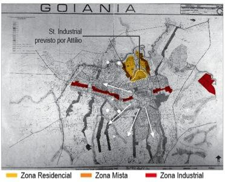

# Resumo

A formação do espaço urbano da cidade de Goiânia sofreu influência
direta dos limites naturais e construídos. Com o traçado inicial
delimitado pelos limites estabelecidos por Attílio, a cidade expandiu
transpondo essas barreiras em muitos casos sem planejamento, de forma
desordenada, em virtude de um crescimento acelerado durante as primeiras
décadas de formação. Um desses elementos limitadores foi a ferrovia, que
nasceu sobre os moldes da modernidade e prosperidade, mas não obteve
sucesso, ocasionando sua desativação anos mais tarde, deixando como
legado um espaço vazio marcando de leste a oeste o traçado urbano e
influenciando diretamente na ocupação, crescimento e desenvolvimento da
atual Região Norte. Porção do território, onde se estabeleceu um cenário
de rupturas e barreiras transpostas, porém não superadas e que hoje
revela-se como um tecido descontínuo em relação ao tecido urbano
consolidado como cidade planejada. Diante deste cenário os apontamentos
do presente artigo consistem na identificação de um tecido urbano
contínuo e descontínuo que resultou em espaços vazios, na ruptura e
fragmentação do tecido, onde se situam os trilhos remanescentes da
ferrovia. Desse modo, é possível estabelecer uma leitura e análise da
formação de áreas periféricas da cidade de Goiânia, notadamente aquelas
áreas de fronteira entre a cidade legitimada e a cidade de crescimento
espontâneo.

**Palavras-chave:** Ferrovia; Goiânia; Ruptura Urbana; Fragmentação;
Tecido contínuo; Tecido Descontínuo.

# Abstract

The formation of urban space in the city of Goiania suffered direct
influence of natural and constructed boundaries. With the initial stroke
bounded by the limits set by Attilio, the city expanded transposing
these barriers in many cases without planning, a disorderly manner,
under an accelerated growth during the first decades of conformation.
One of those elements limiters was the railroad, which was born on the
molds of modernity and prosperity, but was not successful, causing its
deactivation, leaving an empty space as a legacy scoring from east to
west the urban configuration and directly influencing the occupation,
growth and development the Northern Region. A portion of the territory,
where he established a scenario of rupture and transposed barriers, but
not superseded. Up in this scenario the appointments consist of the
identification of a continuous and discontinuous urban configuration
resulting in empty spaces, in the disruption and fragmentation, where
are the remaining railroad tracks. Thus, it is possible to establish a
reading and analysis of the formation of the peripheral areas of the
city of Goiania, notably those border areas between the city legitimized
and spontaneous growth.

# Introdução

Goiânia, capital do estado de Goiás, planejada por Attílio Corrêa Lima,
foi fruto de interesses políticos e expressa a indução de povoamento do
interior do Brasil nos anos 1930. Seu plano urbanístico visava os ideais
de uma vida urbana próspera, em prol do crescimento e da modernidade.
Seu desenho urbano, composto pela sobreposição de teorias modernas, não
foram efetivamente capazes de conter o crescimento para além dos limites
iniciais. A atual Região Norte e bairros adjacentes aos trilhos sofreram
a influência direta da presença do antigo leito da ferrovia, implantado
nos anos 1950 e desativado na década de 1980. Um

elemento que demarca os limites da cidade planejada e sinaliza um
crescimento descontínuo da tessitura de Goiânia. E, hoje, esquecido,
resguarda o potencial de espaço público e agente de articulação de
fragmentos urbanos. Um *terrain vague* a espera do *porvir.*

O território no qual a cidade foi implantada possuía barreiras físicas e
naturais. E estes elementos estabeleceram os limites da cidade. Os
Córregos Botafogo, a leste, e Capim Puba, a oeste, além do Rio Meia
Ponte, a norte que somado com a linha férrea marcavam o "fim da cidade".
A transposição desses limites transformou o cenário da cidade, que se
expandiu de forma descontrolada durante algumas décadas. A Região Norte
e os bairros adjacentes à ferrovia se destacam nesse contexto, que
cresceu sob a influência desses fenômenos e que após a desativação da
ferrovia se transformou num grande vazio, configurando uma ruptura no
tecido.

É este cenário de transformações que se consolidam a Região Norte e
alguns bairros adjacentes à linha férrea que se pretende revelar,
possibilitando a identificação da formação da cidade planejada e
espontânea, concomitantemente à formação de um tecido fragmentado, que
resultou também em espaços que se encontram em obsolescência. Trata-se,
portanto, da oportunidade de entender a formação do tecido da cidade de
Goiânia e a identificação de novos espaços resultados do processo de
ocupação descontrolado e a transposição de barreiras superadas ou não
que pode contribuir e enriquecer o entendimento da cidade contemporânea
e sua territorialidade.

# Goiânia: Cidade planejada

A compreensão e identificação da influência da antiga linha férrea sobre
o tecido urbano, que passava por Goiânia até os anos 1980, e a
conformação e ocupação da Região Norte e os bairros adjacentes ao antigo
leito, exige o entendimento do processo de desenvolvimento e crescimento
da cidade.

Goiânia surgiu como uma ideia a partir de 1930, impulsionada pelos
movimentos nacionalistas e integradores, disseminados pelo Governo
Federal, sob o comando de Getúlio Vargas, com a política oficial "marcha
para o Oeste", produto da intenção de transformar e trazer o progresso
para o interior do país. Nesse período de mudanças políticas, Pedro
Ludovico Teixeira, como interventor, permitiu a concretização de um novo
centro administrativo, inserindo efetivamente o Estado no contexto
nacional. Desses ideais, as investidas para a mudança da capital
ganharam força e se efetivaram com o Decreto nº 2.737 (1930), no qual
foi nomeada uma comissão para a realização de estudos e escolha de
implantação da nova capital (RIBEIRO, 2004, p.27).

Segundo Manso (2001, p.67), as quatro localidades levantadas foram:
Bonfim (hoje Silvânia), Ubatan, Campinas e Pires do Rio. Os municípios
deveriam ser próximos à estrada de ferro, tendo em vista as dificuldades
de transporte; deveria dispor de água em abundância; bom clima e
topografia adequada.

O sítio de Campinas obteve concordância positiva por parte dos técnicos,
apesar de desencadear uma mudança no traçado da ferrovia, o que
acarretou no desvio fora do eixo principal. Armando Augusto de Godoi
efetivou a escolha através do Decreto nº 3.359 (1933), em que delimitava
a localização da futura capital "\[\...\] às margens do córrego
Botafogo, compreendida nas fazendas denominadas Criméia, Vaca Brava e
Botafogo, no município de Campinas \[\...\]" (RIBEIRO, 2004, p.31)
(figura 1).

> 
>
> Figura 1. Sítio escolhido para edificar Goiânia. Fonte: RIBEIRO, 2004.

A execução do projeto arquitetônico e urbanístico ficou a cargo de
Attílio Corrêa Lima, que desenvolveu o projeto entre 1933 e 1935,
prevendo uma população de 50 mil habitantes, com dois centros distintos:
o centro administrativo, a sul e o centro comercial, a norte. As
moradias seriam implantadas na zona residencial ao redor do centro
comercial; algumas áreas loteadas encontravam-se próximas à zona
industrial e seriam destinadas à zona residencial operária. Todas as
atividades se conectavam através de um sistema de vias regulares que
determinavam a setorização do plano conforme as diferentes funções. O
traçado era resguardado por um cinturão verde, limitando o crescimento
da cidade e protegendo os recursos hídricos (MANSO, 2001, p.111-113),
conforme se observa nas figuras 2 e 3.

Attílio Corrêa Lima tomou partido da topografia para a concepção do
centro cívico que se destacava na paisagem e determinava o trajeto das
vias principais da cidade, que se conectavam com a parte industrial,
onde seria implantada a ferrovia, a porta de entrada e fim da cidade.
Entretanto, em seu plano não consta o traçado da ferrovia, apenas a
definição da zona industrial onde seriam inseridos os trilhos. (MANSO,
2001, p.69).

> 
>
> Figura 2. Planta Geral de Goiânia,
> proposta de Attílio Corrêa Lima, de 1933. Fonte: RIBEIRO, 2004. Org.:
> Brandão, 2013.
>
> Figura 3. Esboço do Centro Cívico de 1933. Fonte: RIBEIRO, 2004. Org.:
>
> Brandão, 2013.

A partir de 1935, Godoi assumiu o projeto, inicialmente revisando o
projeto piloto, intervindo principalmente no setor comercial, e
remodelando-o e reduzindo-o; e, posteriormente, implantando o setor sul1
orientado por princípios de cidade-jardim. A conclusão do projeto foi em
1938, preservando a grande porção já planejada por Attílio, Corrêa Lima,
conforme figuras 4 e 5.

> 1 Segundo Maria Eliana J. Ribeiro (2004, p.70) Godoi detalhou o plano
> original, particularmente o Setor Sul, introduzindo uma nova praça
> central ao setor, devendo essa ser um segundo "centro de radiação"
> conforme o eixo proposto por Attílio Corrêa Lima.
>
> 
>
> Figura 4. Planta Geral de Armando de
> Godoi, de 1938. Fonte: RIBEIRO, 2004. Org.: Brandão 2013
>
> Figura 5. Planta Geral de Armando de Godoi, de 1938. Fonte: RIBEIRO,
> 2004. Org.: Brandão 2013

O somatório de ideais que concretizaram o plano inicial de Goiânia
manteve sua eficácia e aplicabilidade até 1950, enquanto o poder público
detinha o direito exclusivo de parcelamento do solo, controlando a
ocupação do território. Entretanto, logo nas primeiras duas décadas

,algumas áreas, próximas ao setor industrial, foram ocupadas
irregularmente. O reconhecimento dessas ocupações levou a regularização,
por meio de doações do Estado, em 1947. Tais alterações foram definidas
na Planta Geral de Urbanização de Goiânia (1947), indicando o acréscimo
de novos bairros, conforme ilustra a figura 6. A análise permite a
identificação do primeiro processo de expansão urbana: a leste, as
ocupações irregulares próximas ao Parque Botafogo e na Zona Industrial,
onde estava prevista a instalação de indústrias; a oeste, a aprovação do
Setor Coimbra de propriedade particular impulsionou a ocupação nas
proximidades de Campinas. A regularização dessas áreas e a aprovação de
novas zonas configuram os primeiros processos de transposição das
barreiras estabelecidas por Attílio Côrrea Lima, superando o
cinturão-verde.

> 
>
> Figura 6. Planta Geral de Urbanização de Goiânia de 1947. Fonte:
> RIBEIRO, 2004. Org. Brandão, 2013.

Sendo assim, pode-se verificar que, a partir dos anos 1950, dois grandes
fatos impulsionaram o crescimento da cidade de forma desordenada: as
mudanças legislativas, em virtude de uma série de fatores, e a
implantação efetiva da ferrovia (1952). Fatos que induziram à formação
de um tecido urbano descontínuo e distante do plano original, refletindo
em futuras transformações do espaço urbano, como a formação da Região
Norte, e dos bairros adjacentes aos trilhos da antiga ferrovia, marcado
pela fragmentação e ruptura.

# O crescimento descontrolado de Goiânia e a legislação urbanística

Goiânia foi resultado da materialização de ideias em projetos; de
projetos em cidade e a cidade em um espaço urbano que ganhou forma e
conteúdo (MOYSÉS, 2004). Após o período inicial de implantação e
ocupação controlada, o tempo e a realidade não foram favoráveis à
configuração do espaço urbano, pois, em poucos anos, o planejamento foi
superado, revelando inúmeros problemas à medida que a expansão
desordenada conformava as feições da paisagem urbana.

Um dos maiores problemas foi o aumento significativo dos índices
populacionais, superando os 50 mil habitantes previstos. Nas décadas de
1940-50, houve um grande fluxo de migrantes, impulsionados pela
instalação da ferrovia em meados da década de 1950 e a construção de
Brasília, na década de 1960. O aumento populacional resultou num déficit
habitacional o que levou a aprovação do Código de Edificações de
Goiânia2, que incluía toda a Legislação Urbana3, a liberação do
parcelamento particular urbano e a obrigação, por parte da administração
pública, da responsabilidade de instalação de infraestrutura.

Esse cenário de pouco controle da administração pública, somado ao
enfraquecimento das políticas públicas habitacionais, fragilizou o
planejamento urbano e, consequentemente, o controle sobre a expansão da
cidade. As baixas condições socioeconômicas da população e o desemprego
culminaram num processo de expansão desordenado, com a implantação de
loteamentos populares e clandestinos, sem infraestrutura, situados nas
áreas periféricas que cresciam desconectadas da área inicial. Esse
crescimento pode ser constatado pelos dados levantados (tabela 1) pela
Secretaria Municipal de Planejamento e Urbanismo (SEPLAM, 2000),
relativo aos bairros aprovados por décadas, juntamente com o mapa de
expansão urbana por períodos (figura 7 e 8), onde foi apresentado por
manchas o crescimento acelerado e desordenado, resultado da grande
quantidade de bairros loteados entre 1933 e 1959, período mais
expressivo da expansão urbana.

> **Tabela 1:** Relação de bairros aprovados por décadas. Fonte:
> SEPLAM,2000.

+-----------+---------+-----------+---------+-----------+---------+
| >         |         |           |         |           |         |
|  **TABELA |         |           |         |           |         |
| > DE      |         |           |         |           |         |
| > BAIRROS |         |           |         |           |         |
| >         |         |           |         |           |         |
| APROVADOS |         |           |         |           |         |
| > POR     |         |           |         |           |         |
| >         |         |           |         |           |         |
| DÉCADAS** |         |           |         |           |         |
+===========+=========+===========+=========+===========+=========+
| >         | > Qtde. | > Déc.    | > Qtde. | > Déc.    | > Qtde. |
|  **Déc.** |         |           |         |           |         |
+-----------+---------+-----------+---------+-----------+---------+
| >         | > 06    | >         | > 146   | >         | > 24    |
|  **1930** |         |  **1950** |         |  **1970** |         |
+-----------+---------+-----------+---------+-----------+---------+
| >         | > 02    | >         | > 30    |           |         |
|  **1940** |         |  **1960** |         |           |         |
+-----------+---------+-----------+---------+-----------+---------+

> Figura 7. Manchas de Crescimento de
> 1933 até 1983. Fonte: OLIVEIRA, 2005. Org. Brandão, 2013.

O resultado do crescimento foi a expansão da área urbana e a ocupação em
todos os direcionamentos, alcançando outras barreiras naturais do
território. No sentido sul e oeste, percebe-se a extensão contínua do
tecido urbano, de forma natural, como numa trama. A norte, as
consequências foram diferentes, a configuração do tecido ocorreu de
forma descontínua, em virtude do somatório de obstáculos -- os trilhos
da ferrovia e os recursos hídricos. A transposição estabeleceu uma
ruptura no tecido urbano configurando um grande vazio urbano, como pode
ser observado na figura 08.

> 2 Decreto-lei 574 de 12.05.47;
>
> 3 Refere-se às Leis de Zoneamento, Lei de Loteamento e Lei de Uso e
> Ocupação do Solo. Quanto aos parcelamentos urbanos, a lei permitia
> novos loteamentos de iniciativa privada, porém esses impunham uma
> série de obrigações principalmente
>
> relativos à infraestrutura. No entanto, a pressão popular por moradia
> era tamanha que, em dois anos, o Código foi alterado pela Lei nº 176,
> de 16.03.503, revogando todas as obrigações por parte dos
> proprietários de terras, passando a exigir apenas a locação e abertura
> de vias (MOYSES, 2004).
>
> 
>
> Figura 8. Manchas de Crescimento de 1933 até 1959. Fonte: RIBEIRO,
> 2004. Org. Brandão, 2013.

Diante desse cenário, foi elaborado pelo arquiteto Luís Saia, por volta
dos anos 1960, um plano para conter o crescimento espontâneo, que não
chegou a ser totalmente implantado, mas contribuiu para a identificação
dos problemas da cidade através de três fatores: as **barreiras;** a
**diferenciação**; e a **atração** (RIBEIRO, 2004). O estudo permitiu
observar que a linha férrea e os recursos hídricos, localizados a norte,
foram elementos reguladores para a conformação da paisagem urbana, uma
vez que a linha férrea -- disposta no sentido leste-oeste --,
caracteriza-se como uma barreira ainda não superada, fragmentando o
tecido urbano, ressaltando-se a diferenciação entre a cidade planejada e
a cidade espontânea, além do isolamento da região além dos trilhos.

Em 1964, o espaço urbano de Goiânia sofreu outro processo significativo
de transformação impulsionado pelo Plano de Desenvolvimento Integrado de
Goiânia -- PDIG4, que objetivava preservar a cidade contra especulações.
Para isso, num primeiro momento, foram elaboradas novas leis de
parcelamento e implantados conjuntos habitacionais5. Num segundo
momento, a partir de 1975, as propostas voltaram-se para a expansão do
sistema viário (figura 9), demarcando eixos de conexões através do
prolongamento de vias existentes.

Destaca-se também, a elaboração do plano de zoneamento da cidade (figura
10), onde foi possível diagnosticar o fracasso do desenvolvimento
industrial na Região Norte, em parte pela falta de incentivo do Governo
do Município, em parte pelo próprio perfil empresarial local vinculado
ao setor primário e, mais tarde, terciário. (SEPLAM, 1992)

> 4 Plano elaborado pela emprese SERETE Engenharia S/A e o arquiteto
> urbanista Jorge Wilhein;
>
> 5 Até 1975 somavam 32 conjuntos habitacionais em sua maioria de grande
> porte, projetados pela Companhia de Habitação de Goiás (COHAB-GO) e
> financiados pelo Sistema Financeiro de Habitação (SFH); Ainda, a
> construção de Brasília em 1960, impulsionou a migração de muitos
> trabalhadores que não conseguiram se estabelecer na nova capital
> federal para Goiânia, em busca de melhores condições de vida e
> emprego. A chegada desses trabalhadores aumentou o déficit
> habitacional resultando na ocupação de áreas de preservação, como
> fundos de vales e áreas públicas;
>
> 
>
> Figura 9. PDIG -- Eixo viário.
> Fonte: Plano Diretor, 1992. Org. Brandão, 2013.
>
> Figura 10. Zoneamento de Goiânia. Fonte: Plano Diretor, 1992. Org.
> Brandão, 2013.

Em 1994, um novo Plano Diretor ressaltava a continuação da expansão da
cidade por meio da abertura de vias, quando foram consolidados os
projetos da Marginal Botafogo (do final da década de 1980),
estabelecendo a conexão norte-sul; a Av. Leste-Oeste, no sentido leste-
oeste, para interligar os municípios de Trindade de Senador Canedo e o
prolongamento da Av. Goiás, no sentido norte. No mesmo plano foram
identificadas as áreas incompatíveis com o uso determinado e o
deslocamento progressivo das indústrias a norte, para próximo à Av.
Perimetral Norte (Figura 11).

> 

Figura 11. Vias implantadas e prolongadas e mudança da Zona Industrial.
Fonte: Plano Diretor,1992. Org.Brandão, 2013.

Por fim, o atual Plano Diretor de 2007, que prossegue com as expansões
da malha viária, prevendo a consolidação da Av. Leste-Oeste, como uma
via arterial com eixo exclusivo de transporte público. Entretanto, a
viabilidade de implantação se esbarra entre a Câmera Municipal, a Praça
do Trabalhador, a Estação Ferroviária, as inúmeras galerias e uma série
de habitações irregulares, que deflagram os resquícios dos trilhos da
ferrovia que passaram por Goiânia por cerca de 30 anos. No entanto, ao
alargar o território da cidade, a ferrovia fora diagnosticada como uma
barreira a qual dever-se-ia transpor, superando-a como elemento
regulador do crescimento da cidade. Desse modo, as vias expressas,
definidas na legislação municipal, visavam estabelecer conexões de
mobilidade, com ênfase ao transporte individual, renegando-se o próprio
trecho do leito da ferrovia como elemento de articulação e conexão entre
a cidade planejada e a cidade espontânea.

# A estrada de ferro em Goiânia

A estrada de ferro não foi um elemento determinante para o desenho
urbano de Goiânia.

> Apenas fora considerada na escolha do sítio, associada à ideia de
> modernidade, mas só chegou a existir no traçado urbano em meados dos
> anos 1950. Sua implantação foi fundamental para a configuração da área
> industrial e da atual Região Norte.
>
> A ferrovia agregava ideias de alargamento das fronteiras, expansão e
> desenvolvimento econômico, na tentativa de ocupar o extenso território
> brasileiro. A chegada dos trilhos em Goiás ocorreu, concomitantemente,
> com a criação da Companhia de Estrada de Ferro de Goiás, em 03 de
> março de 1906. Uma empresa de capital privado, apoiada pelo governo
> federal, que só implantou seus trilhos por volta de 1911, na cidade de
> Araguari, considerada o marco zero da ferrovia, que se expandiu,
> atingindo 480 km até Goiânia, com 30 estações ao longo da estrada
> (figura 12). (BEATRIZ, 1983).
>
> A chegada efetiva dos trilhos foi em 1951, interligando Leopoldo de
> Bulhões a Goiânia e à estação de Campinas, juntamente com a construção
> do pátio de manobras e cargas da Rede Ferroviária Federal (RFFSA), às
> margens da Avenida Independência, perpendicular à Avenida Goiás. A
> presença dos trilhos provocou um crescimento acelerado nas imediações
> da área industrial, com inventivo do governo para a implantação de
> indústrias, além de depósitos e armazéns às margens dos trilhos. Todo
> esse processo acarretou na ocupação acelerada dos bairros adjacentes,
> que serviram para residência dos operários. Igualmente rápido, ocorreu
> a superação da capacidade de transporte de carga e passageiros, fato
> que levou a desativação da
>
> ferrovia em meados da década de 19806, cerca de apenas três décadas de
> sua inauguração.
>
> 
>
> Figura 12. Estrada de Ferro de Goiás, com sede em Araguari, linha
> principal Araguari-Anapólis (302,4 Km), ramal de Goiânia (partindo de
> Leopoldo de Bulhões até Campinas 91 km). Fonte: I Centenário das
> Ferrovias Brasileiras, 1954. Org. Brandão, 2013.
>
> Cabe observar que existe um paradoxo quanto à implantação da ferrovia:
> definida como uma barreira de crescimento e expansão, ao determinar o
> fim da cidade, os trilhos não foram suficientes para conter o avanço
> para além da ferrovia, uma vez que houve a explosão de habitações de
> operários instaladas de forma irregular às suas margens e nos bairros
> fora do perímetro da cidade planejada.
>
> Ainda, após a desativação dos trilhos, os bairros próximos,
> principalmente do pátio da RFFSA, sofreram mais com o descaso e a
> falta de infraestrutura; o fim da cidade, como eram popularmente
> nomeados os bairros adjacentes, sofriam com ocupações irregulares,
> invasões, falta de iluminação, esgoto e água tratada (JORNAL REVISTA,
> 1980 *apud* BEATRIZ, 1983). E, dessa maneira, perduraram durante
> alguns anos e, por onde antes passava o trem, houve a conformação de
> um grande vazio urbano, sem atividade nem uso, propício a invasões e
> ocupações irregulares: uma área esquecida pelo poder público.
>
> A situação dos bairros adjacentes só se modificou com a instalação da
> Rodoviária no antigo pátio da RFFSA (1987); com a expansão da malha
> viária a norte (PDIG, 1975) e pela ocupação, mesmo que lentamente, dos
> bairros da Região Norte. As modificações foram visíveis, como a
> instalação de infraestrutura e o adensamento da região. Entretanto, os
> problemas ainda se recorrentes, pois nem mesmo a retirada daqueles que
> ocupavam o leito da ferrovia impediram novas ocupações irregulares em
> outras regiões; a marginalidade e a degradação ainda são problemas
> comuns e visíveis em grande parte da extensão leste do antigo leito da
> ferrovia: o vazio existe e continua, ainda hoje, impondo limites ao
> tecido urbano.

# A Região Norte e os Bairros as margens da ferrovia

> Diante da expansão urbana, para além dos limites planejados,
> destaca-se o crescimento descontínuo e desconexo a norte e dos bairros
> adjacentes à ferrovia, em particular, aqueles localizados a leste da
> estação ferroviária (Figura 13). Em sua maioria, os bairros resultam
> do crescimento desordenado a partir de 1950, conformando inúmeros
> loteamentos particulares, além da instalação de equipamentos públicos
> que contribuíram para a expansão fragmentada do traçado urbano.
>
> Historicamente, segundo o projeto de Attílio Côrrea Lima (1935), a
> Região Norte era considerada zona rural, onde se concentravam os
> recursos hídricos que serviriam para o abastecimento da cidade. Essa
> região tem seus limites iniciais a partir da ferrovia e da área
> industrial que funcionavam como barreira de crescimento7, a fim de
> proteger e resguardar os cursos d'água. A cidade, então, foi desenhada
> sem a presença da ferrovia que, quando instalada, permitiu a conexão
> com Campinas, que juntamente com o Córrego Capim Puba e o Aeródromo
> eram considerados barreiras a oeste; já a leste, pode-se considerar o
> Bosque
>
> Botafogo, o Córrego Botafogo e a BR-153, ilustrados na figura 14.
>
> 
>
> Figura 13. Crescimento dos Bairros as margens da ferrovia e Região
> Norte. Fonte: SEPLAM. Org. Brandão (2013).
>
> Ao longo dos anos 1950, houve um intenso crescimento e desenvolvimento
> da cidade: quer pela implantação dos trilhos, quer pelas inúmeras
> mudanças legislativas. Fatores que contribuíram para a transposição
> dos limites iniciais. Somados foram loteados dezoito grandes

bairros localizados nas regiões oeste, leste e norte, impulsionados por
linhas de crescimento que se configuraram em vias (figura 14 e 15).

Além dos loteamentos na Região Norte foram instalados grandes
equipamentos públicos: Aeroporto Santa Genoveva (1955); Exército
Brasileiro (1968), Campus da Universidade Federal de Goiás (1972),
Central de Tratamento de Água da Saneago (ETA, 1953), Central de
Tratamento de Esgoto (ETE, 2004) e Subestação da CELG (1971). A figura
15 ilustra como foram pontuais a implantação desses pólos e como as
linhas de crescimento atuaram como vetores de aglomeração e ocupação da
Região Norte (figura 16).

> 
>
> Figura 14: Região norte - elementos que contêm o crescimento,
> barreiras identificadas segundo teoria de Panerai (2006). Fonte: Org.
> Gonçalves e Brandão (2013).
>
> 
>
> Figura 15: Região Norte - elementos que organizam o crescimento,
> linhas e pólos identificadas segundo teoria de Panerai (2006). Fonte:
> Org. Gonçalves e Brandão (2013).
>
> 
>
> Figura 16.Loteamentos e equipamentos aprovados e instalados na Região
> Norte próximos a antiga Região Norte projetada por Attílio e Godoi.
> Fonte: Org. Gonçalves e Brandão (2013).

Diante desses fatos, é possível perceber que o tecido urbano da região
se estruturou a partir de inúmeras barreiras, que foram transpostas pela
abertura de vias. No entanto não há coesão entre os diversos bairros,
notadamente no sentido leste-oeste. Outro ponto a se destacar, é a falta
de espaços públicos e equipamentos urbanos que proporcionem qualidade à
região, tendo em vista que os loteamentos são predominantemente
residenciais, com comércio vicinal e poucas áreas livres. Desse modo,
pode-se afirmar que a Região Norte se aproxima da ideia de cidade do
lado de lá, isto é, fora do perímetro urbano e delimitada por uma
barreira não totalmente superada os trilhos, destinada quase
exclusivamente à moradia.

Ainda, ao analisar o processo de crescimento espontâneo nas imediações
do traçado inicial, observa-se que a transposição dos limites
estabelecidos no plano inicial levaram a resultados pontuais e de
diferentes maneiras. A ferrovia, que antes atuava como uma linha de
crescimento, quando desativada na década de 1980, transformou-se numa
grande barreira -- um espaço vazio, por onde o trem passava, pertencente
a nenhum bairro, mas parte do traçado urbano. A sua transposição ocorreu
de forma a romper o traçado dos trilhos, fragmentando o percurso,
através das conexões estabelecidas pelas novas vias implantadas que
conectavam a Região Norte com o Setor Central e Leste Vila Nova, além de
hoje ser a área de implantação do projeto da Av. Leste-Oeste, sendo que
a oeste já foi parcialmente implantado (6,6 km) e a leste ainda continua
intacto os vestígios dos trilhos.

O pátio de manobras da RFFSA foi fatiado em partes com a expansão da Av.
Goiás (1975), resultando em um espaço fragmentado, onde hoje se
localizam a Estação Rodoviária e a Praça do Trabalhador. Outro limite
inicial, o Bosque Botafogo, sofreu o mesmo processo com o avanço da Av.
Araguaia (1960) e a implantação da Marginal Botafogo (1975), tornando-se
um espaço segregado, além das ações de degradação ambiental (figura 17).

> 
>
> Figura 17: Diagramas esquemáticos de transposição das barreiras --
> resultado: fragmentação do espaço. Fonte: Org. Brandão (2013).

Em síntese, a transposição das barreiras conformou espaços fragmentados
do tecido urbano, notadamente a leste e a norte, onde se estabeleceram
abruptamente, impondo uma ruptura nas barreiras; por outro lado, a
oeste, a expansão foi contínua, se estendendo a partir do tecido
original, com a superação do Córrego Capim Puba e a transformação do
Aeródromo em Setor Aeroporto. Esse cenário evidencia dois processos de
crescimento, conforme Panerai (2006): um contínuo e descontínuo.

No sentido oeste, o crescimento ocorreu através do prolongamento do
próprio tecido, onde hoje a uniformidade do traçado dificulta a
compreensão dos limites iniciais. No sentido leste, o leito da ferrovia
encontra-se a margem dos bairros adjacentes, rompendo o tecido em dois
lados, o lado de cá e o lado de lá dos trilhos. No sentido norte, o
crescimento ocorreu através do prolongamento de grandes vias que
transpuseram os obstáculos, principalmente a ferrovia e os recursos
hídricos, estabelecendo-se, assim, um crescimento descontínuo (figura
18).

> 
>
> Figura 18: Espaço degradado, fragmentado e não planejado. Fonte: Org.
> Gonçalves e Brandão (2013).

# Considerações Finais

Ao analisar os processos de expansão territorial de Goiânia, com ênfase
ao tecido adjacente aos trilhos da ferrovia e a ocupação da Região
Norte, é possível distinguir espaços urbanos bem distintos entre si: de
um lado, a cidade planejada e legitimada como referência ao desejo de
implantar uma cidade nova no interior do país -- uma tentativa de
ocupação territorial a nível nacional, ratificada com a construção de
Brasília; do outro lado, a cidade de crescimento espontâneo, em que se
verificam a implantação de loteamentos particulares e grandes
equipamentos públicos, sem, no entanto, uma efetiva articulação entre as
duas áreas. Ambas se separam fisicamente por barreiras naturais e
construídas -- os cursos d'água e o eixo da ferrovia, conformando-se num
território fragmentado. Dessa forma, é possível afirma que a Região
Norte traduz o processo de fragmentação do território e a articulação,
na tentativa de superar os obstáculos através do sistema viário, que
resultou na não inserção das barreiras e não consideração da
contiguidade do tecido com potencial para espaço público no leito da
ferrovia, atualmente, desativado.

A diferenciação entre a cidade planejada e a espontânea evidencia a
configuração de um grande vazio: o antigo leito da ferrovia, em um
estado de obsolescência, um *terrain vague*, pertencente a nenhum dos
bairros adjacentes, mas foco de marginalidade e ocupações

irregulares. A paisagem, então, se configura como um local de abandono a
espera de um *por vir*, que somado com as barreiras naturais disseminou
um processo de ocupação descontínuo sem inserir esse elemento no tecido,
nem de forma contínua nem contígua.

# Referências Bibliográficas

> BEATRIZ, Helena S. *A estrada de ferro: uma barreira de
> desenvolvimento da região norte*. Goiânia. Ed. UCG, 1983.
>
> GOIÂNIA, *Prefeitura de. Plano Diretor de 2007*. Seplam. GOIÂNIA,
> *Prefeitura de. Plano Diretor de 1992, vol. 1 e 2*. Seplam.
>
> GOIÂNIA, *Prefeitura de. Plano de Desenvolvimento Integrado de Goiânia
> - PDIG de 1964*. Seplam.
>
> MANSO, Celina Fernandes Almeida. *Goiânia: uma concepção urbana,
> moderna e contemporânea -- um certo olhar.* Goiânia: Edição do autor,
> 2001.
>
> MOYSES, Aristides. *Goiânia: Metrópole não planejada*. Goiânia: Ed. Da
> UCG, 2004. OLIVEIRA, Maria das Mercedes Brandão de. *O padrão
> territorial de Goiânia: um olhar sobre o processo de formação de sua
> estrutura urbana.* Arquitextos, 065.07 ano 06, outubro de 2005.
> Disponível em
> \<[www.vitruvius.com.br/revistas/read/arquitextos/06.065/419\>](http://www.vitruvius.com.br/revistas/read/arquitextos/06.065/419),
> acessado em 21 de março de 2013.
>
> PANERAI, Philippe. *Análise Urbana.* Ed. UnB. Brasília, 2006.
>
> RIBEIRO, M. E. J. *Goiânia: os planos, a cidade e o sistema de áreas
> verdes*. Goiânia: Ed. UCG, 2004.
