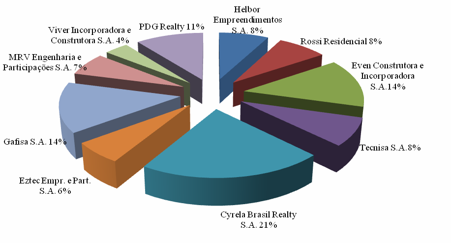
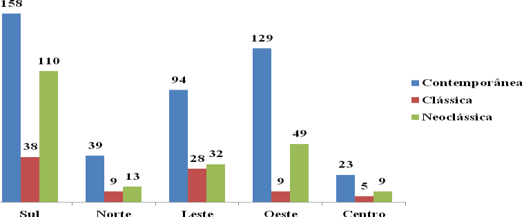
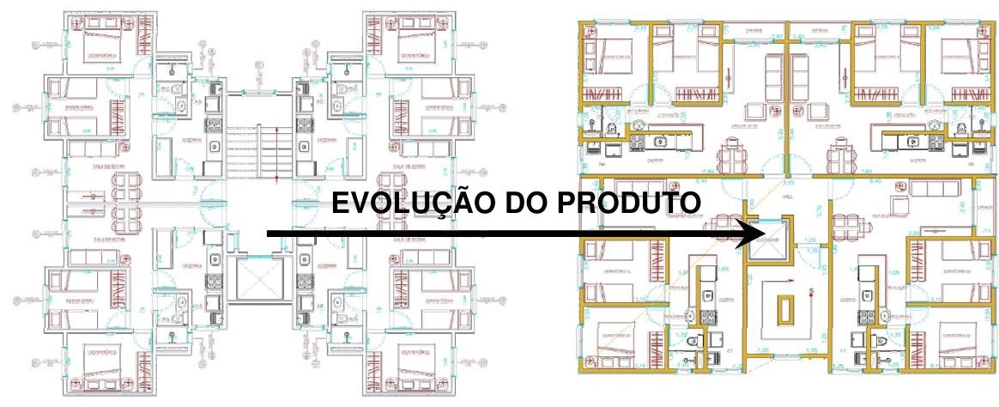
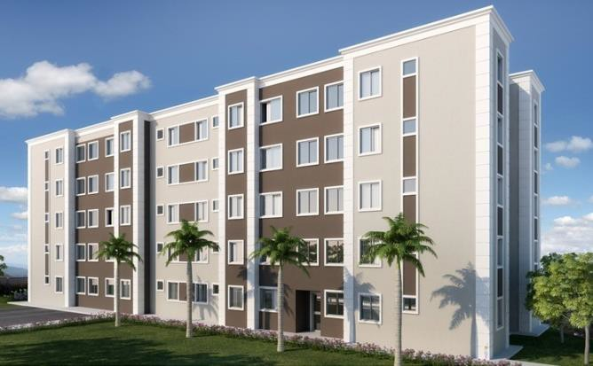
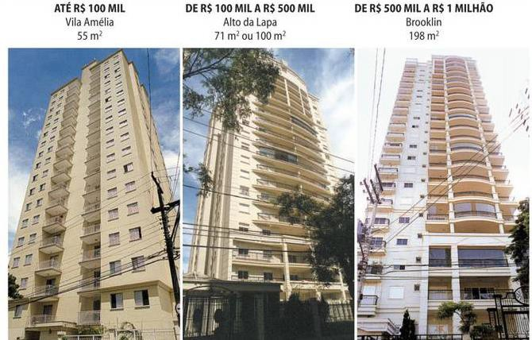
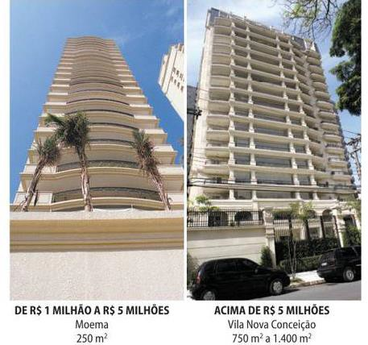
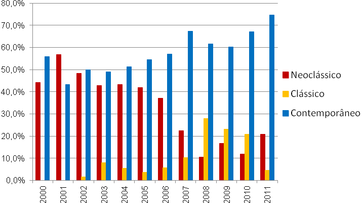

# Resumo

A produção de fachadas do mercado imobiliário residencial vertical no
século XXI na cidade de São Paulo é o alvo do presente artigo que
pretende discutir e demonstrar a transformação da arquitetura em simples
objeto de consumo, em função da forte influência do marketing e da
publicidade, com a consequente transformação do papel do arquiteto no
processo de produção e definição do produto imobiliário, cujos fatores
estão relacionados a questões menos criativas, mais técnicas e, em
particular, a busca obsessiva pelo resultado financeiro, que, via de
regra, não consulta todo o interesse do consumidor final. Na verdade,
essa produção constitui grande parte da prática da arquitetura e da
construção das cidades, que, afinal, ocasiona a transformação do espaço
e da paisagem urbana. Também explora o fazer arquitetônico que, diante
desse mercado transformou o projeto em simples produto, ao mesmo tempo
em que criou a ruptura entre a aparência externa (fachada) com o corpo
ou a forma do edifício, e que introduziu o elemento estético-formal na
formatação do produto imobiliário, de forma a reproduzir o estilo de
vida como consumo diferenciado, ambiente social distinto.

Palavras-chave: mercado imobiliário, produção imobiliária, fachadas.

# Abstract

The production of the vertical facades housing market in the XXI century
in the city of São Paulo is the target of this article is to discuss and
demonstrate the transformation of architecture into simple object of
consumption , due to the strong influence of marketing and advertising,
with consequent transformation of the role of the architect in the
production and definition of real estate product process, which factors
are related to less creative, more technical issues and, in particular,
the obsessive quest for financial results, which, as a rule, not the
entire query interest of the consumer. In fact, this production is a
large part of the practice of architecture and the building of cities,
which ultimately leads to the transformation of space and urban
landscape. It also explores the architectural do that, given that market
the bill into simple product, while it created a rift between the
external appearance (facade) with the body or the shape of the building
and entered the formal-aesthetic element in formatting of the real
estate product in order to reproduce the lifestyle as a differentiated
consumption, distinct social environment.

Keywords: real estate market, real estate production, facades.

# Introdução

A qualidade e o espaço dos apartamentos tornaram-se muito semelhantes,
como produtos em série. Os "estilos" surgem nesse contexto de
arquitetura-produto em grande parte para compensar essa falta de
identidade. Os estilos -- como o neogótico, neocolonial,
neomediterrâneo, entre outros, então, seriam simplesmente invólucros
diferenciados das construções. Uma envoltória diferente para o mesmo
conteúdo. Em última instância, é um artifício de marketing do mercado
imobiliário para atrair compradores sob o pretexto de uma imagem
projetada - a criação de uma ilusão - para

determinado imóvel.

Righi e Castro (2005, p. 3) apresentam uma abordagem interessante sobre
este assunto. Para eles, o elemento estético-formal no projeto de
arquitetura é evidente para a formatação do produto imobiliário:

> Nele está a ideia de estilo de vida como consumo diferenciado,
> elemento social distintivo. Assim, a comercialização do produto
> imobiliário envolve um conjunto de valores que conferem status,
> prestígio, distinção a seu detentor. Os elementos do projeto mais
> valorizados envolvem uma forte tendência ao reducionismo das
> características estéticas do projeto de arquitetura a seus aspectos
> mais aparentes assimiláveis por um determinado público alvo, em termos
> de imagem exterior, ambientação paisagística, acabamentos internos e
> mesmo mobiliário.

É fato que a linguagem simbólica da fachada traduza conceitos explorados
para a venda dos imóveis, justificando assim, o uso do estilo
neoclássico para as classes médias urbanas de renda mais baixa, pois
majoritariamente representam empreendimentos chamados alto padrão que
surgiram em bairros nobres da cidade.

Para o arquiteto Demósthenes Magno Santos1, a fachada é um elemento que
merece atenção no projeto por ser um atributo importante de venda:

> A fachada é um elemento muito importante no projeto. \[\...\] Existe
> uma procura meio desenfreada de criar o novo pelo novo. A fachada é um
> elemento importantíssimo de venda. Ao mesmo tempo em que tem ser
> criativo, você não pode extrapolar muito, porque pode dificultar ou
> onerar todo o processo construtivo. Ao mesmo tempo em que essa
> tipologia tem que ser original, ela pode se repetir.

Por ser um elemento formal importante para o empreendimento, a fachada
muitas vezes é solucionada por arquitetos contratados de renome
internacional, com o intuito de valorização do produto e diferenciação
no mercado. Por outro lado, essa questão leva a entender que o mercado
imobiliário trata distintamente a forma (interna) ou o corpo do edifício
de sua aparência (externa) ou fachada, até mesmo porque para uma mesma
solução de planta é possível encontrar fachadas com "estilos"
representativos diferentes.

# A produção de fachadas

Para o desenvolvimento do artigo utilizou-se a produção das dez
incorporadoras selecionadas pelo ranking da Empresa Brasileira de
Estudos de Patrimônio2 (EMBRAESP), que juntas, representam em média 35%3
dos lançamentos da cidade no século XXI (Gráfico 1).

> 1\. Entrevista realizada pelos autores em 17 jul. 2013.
>
> 2\. Helbor Empreendimentos S.A.; Rossi Residencial S.A.; Even
> Construtora e Incorporadora S.A.; Tecnisa S.A.; Cyrela Brasil Realty
> S.A. / Living Incorporações Ltda; Eztec Empreendimentos e
> Participações S.A.; Gafisa S.A.; MRV Engenharia e Participações S.A.;
> Inpar Incorporação e Construção S.A. / Viver Incorporadora e
> Construtora S.A.; Goldfarb Incorporações e Construções S.A. / PDG
> Realty.
>
> 3\. Dado obtido pela Empresa Brasileira de Estudos de Patrimônio
> (EMBRAESP).
>
> 
>
> Gráfico 1 **--** Empresas Incorporadoras com suas participações no
> mercado imobiliário
>
> residencial na cidade de São Paulo (2000 a 2011). Fonte: Elaborado
> pelos autores baseados em dados da EMBRAESP (2011).

A Tabela 1 demonstra o estilo das fachadas dos empreendimentos lançadas
no período separadas por incorporadoras, e pode-se constatar que entre o
ano de 2000 a 2011, 59,5% da produção foi destinada a empreendimentos
com fachadas contemporâneas, ficando 40,5% para as fachadas em estilo
clássico ou neoclássico. Também nota-se que incorporadoras como Tecnisa,
Cyrela, Eztec, MRV e Inpar/Viver tiveram seus lançamentos concentrados
em fachadas clássicas ou neoclássicas.

> Tabela 1 -- Estilo das fachadas adotado pelas incorporadoras do
> mercado imobiliário residencial na cidade de São Paulo (2000 a 2011).
> Fonte: Elaborada pelos
>
> autores baseados em dados da EMBRAESP (2011).

+---------------+---------------------+----------------+-------------------+
|               | > **Contemporânea** | > **Clássica** | > **Neoclássica** |
+===============+=====================+================+===================+
| > Helbor      | > 37                |                | > 21              |
+---------------+---------------------+----------------+-------------------+
| > Rossi       | > 49                |                | > 9               |
+---------------+---------------------+----------------+-------------------+
| > Even        | > 102               |                | > 1               |
+---------------+---------------------+----------------+-------------------+
| > Tecnisa     | > 15                | > 1            | > 43              |
+---------------+---------------------+----------------+-------------------+
| > Cyrela      | > 50                | > 59           | > 51              |
+---------------+---------------------+----------------+-------------------+
| > Eztec       | > 15                | > 6            | > 24              |
+---------------+---------------------+----------------+-------------------+
| > Gafisa      | > 82                |                | > 24              |
+---------------+---------------------+----------------+-------------------+
| > MRV         | > 5                 | > 17           | > 27              |
+---------------+---------------------+----------------+-------------------+
| > Inpar/Viver | > 11                | > 4            | > 13              |
+---------------+---------------------+----------------+-------------------+
| > Goldfarb    | > 77                | > 2            |                   |
+---------------+---------------------+----------------+-------------------+
|               | > **443**           | > **89**       | > **213**         |
+---------------+---------------------+----------------+-------------------+

No Gráfico 2 estão apresentados a distribuição dos estilos nas cinco
zonas existentes na cidade, sendo que é possível observar que a zona sul
concentrou não só o maior número de lançamentos, como também a maior
oferta de fachadas em estilos clássicos e neoclássicos (48% do total)

> 
>
> Gráfico 1 - Estilo das fachadas adotado pelas incorporadoras do
> mercado imobiliário residencial por zona da cidade de São Paulo no
> período de 2000 a 2011.
>
> Fonte: Elaborado pelos autores baseados em dados da EMBRAESP (2011).

# As características das fachadas

Com a investigação da produção de fachadas pelo mercado imobiliário, no
seguimento econômico, o período foi marcado pela otimização e
racionalização das áreas dos apartamentos e do pavimento tipo, cujo
edifício deixa de ter o formato conhecido como "H" e passa a ser
retangular, abrigando quatro ou seis apartamentos por andar (Figura 1).
Essa mudança resultou entre outros benefícios: i) menor área de fachada;
ii) menor área de parede; e iii) menor área de projeção no terreno.

> 
>
> Figura 1 - Evolução da tipologia do pavimento tipo no segmento
> popular. Fonte:
>
> \<[www.slideshare.net/Cyrelari/cyrela-apresentao-institucional-dezembro-de-2009.](http://www.slideshare.net/Cyrelari/cyrela-apresentao-institucional-dezembro-de-2009)

Outra característica das fachadas dentro desse segmento é a valorização
dos detalhes tidos como essenciais para imprimir beleza ao edifício, que
diante do marketing imobiliário é preconizado como estilo neoclássico,
talvez na tentativa de reverter a valores que conferem status, prestígio
e distinção a seu detentor. As soluções dos detalhes apresentados,
segundo Sousa (1994) são características da tradição arquitetônica
luso-brasileira como o emprego do reboco pintado em contraste com
molduras em cantaria ou em massa pintada numa outra cor) (Figura 2).

> 
>
> Figura 2 -- Saint Bartolomeu, projeto de Hudson Gonçalves de Andrade,
> 2011. Fonte:
>
> \<mrv.com.br/apartamentos/saintbartolomeu\>, acesso em 10 out. 2013.

A escolha por fachadas caracterizadas como neoclássicas foram adotadas
por esse

padrão de segmento no mercado, por apresentarem vantagens econômicas às
incorporadoras pela simplicidade dos revestimentos, ou seja, argamassa e
pintura ocasionam a redução dos custos de construção. O neoclássico é um
recurso de marketing para fazer fachadas com custo reduzido, porém é
importante salientar que o consumidor terá maior custo para fazer sua
manutenção.

Para Souza (2004, p. 72), o custo das fachadas é definido por dois
fatores principais: a forma do edifício e o tipo de materiais de
acabamento definido para sua composição, conforme apresentado no Quadro
1.

+----------------------------------+----------------------------------+
| > **Fatores**                    | **Considerações**                |
+==================================+==================================+
| > Forma do edifício              | -   O custo da fachada tem uma   |
|                                  |     relação direta com a sua     |
|                                  |     superfície, A esfera é a     |
|                                  |     forma mais otimizada de m2   |
|                                  |     de superfície necessária     |
|                                  |     para envolver um mesmo       |
|                                  |     volume. Portanto, quanto     |
|                                  |     mais próximo for o perímetro |
|                                  |     do pavimento tipo do         |
|                                  |     perímetro de um círculo de   |
|                                  |     mesma área, a fachada será   |
|                                  |     mais econômica.              |
|                                  |                                  |
|                                  | -   Essa relação é chamada de    |
|                                  |     Índice de Compacidade, que   |
|                                  |     deve ser o mais próximo      |
|                                  |     possível de um.              |
|                                  |                                  |
|                                  | -   A forma do edifício tem uma  |
|                                  |     relação direta com o tamanho |
|                                  |     e o formato do terreno.      |
+----------------------------------+----------------------------------+
| > Tipo de materiais de           | -   O custo tem uma relação      |
| > acabamento                     |     direta com o padrão de       |
|                                  |     acabamento adotado para os   |
|                                  |     elementos: alvenaria,        |
|                                  |     vidros, esquadrias e         |
|                                  |     revestimento.                |
|                                  |                                  |
|                                  | -   Dependendo do padrão de      |
|                                  |     acabamento adotado na        |
|                                  |     fachada, o custo para sua    |
|                                  |     execução pode chegar até     |
|                                  |     cinco vezes o custo do       |
|                                  |     acabamento de uma parede     |
|                                  |     interna de vedação.          |
+----------------------------------+----------------------------------+

Quadro 1 - Fatores que influenciam o custo das fachadas. Fonte: SOUZA,
2004, p. 72.

A matéria "Lógica de Mercado Padroniza Arquitetura", publicada no jornal
Folha de S. Paulo (SIQUEIRA; CUNHA, 2006, p. B12) mostra que custo e lucro
limitam a criatividade dos arquitetos do mercado imobiliário e como
resultado pasteurizam os estilos que marcam o horizonte paulistano,
conforme demonstrado na Figura 3, que classifica os detalhes dos
acabamentos das fachadas em estilo neoclássico pelo padrão do
empreendimento: localização, metragem e custo.

> 
>
> 
>
> Figura 3 - Neoclássicos para todos os bolsos. Fonte: SIQUEIRA; CUNHA,
> 2006, p.
>
> B12.

No segmento de maior poder aquisitivo, o estilo neoclássico ficou
representativo na maioria dos empreendimentos lançados no mercado
imobiliário, nessa primeira década do século XXI, por representar um
símbolo da nobreza e poder.

É conclusivo que as fachadas neoclássicas se tornaram preferência
paulistana entre as incorporadoras, que de um lado oferecem produtos
para atingir um público que buscam diferencial em requinte e
sofisticação, e do outro oferecem produtos cuja proposta favorece a
redução dos custos da obra. Em ambos os casos, e com a ajuda do
marketing que preconiza estilos de vida, ignoram totalmente anos de
contemporaneidade para adoção completa do clássico na cidade atual.

A matéria "Os edifícios-fantasmas e seus ornamentos delinquentes",
publicada na revista ProjetoDesign (SERAPIÃO, 2004, p. 1) mostra que nas
últimas décadas

acelerou-se a transformação dos novos edifícios de apartamentos de São
Paulo em produtos que podem oferecer opções de estilos desvirtuados:
neocolonial, neomediterrâneo, neomoderno, art déco e mais comum deles, o
neoclássico:

> O *entablishment* arquitetônico chia e a maior parte do público
> consumidor aprova, enquanto construtores, incorporadores e
> imobiliárias estão de olho nas vendas. A questão parece menor e
> mesquinha, pois se trata de edifícios privados. No entanto, pode ser
> vista como uma metáfora da visão que a sociedade tem do arquiteto: uma
> profissão com muita serventia na arte de adornar fachadas conforme
> tendências da moda.

Em resumo, o chamado neoclássico aparece na arquitetura da cidade de São
Paulo no século XXI, de diversas maneiras. No entanto, as formas
próprias das construções contemporâneas fazem com que o cânone clássico,
quando aplicado à atualidade, tenha que ser adaptado à estética vigente
-- à verticalidade, por exemplo. A forma de reinterpretação da tradição
clássica que veio a ser chamada pelo próprio mercado imobiliário de
"estilo neoclássico" se aplica a tipos de edifícios, e não fazem parte
de qualquer movimento cultural ou social de revival do passado, e sim
apenas de contexto para valorização e diferenciação do imóvel.

Para o levantamento da produção de fachadas do século XXI produzidas
pelo mercado imobiliário, e considerando o incorporador como um dos
agentes mais importantes nesse revival -- por coordenar o processo
construtivo formal que controla o empreendimento imobiliário - os nomes
neoclássicos e clássicos serão utilizados de acordo com as denominações
outorgadas pelos produtores, embora por um lado historicamente eles
sejam incorretos4, e por outro, seria impossível colocar grande parte
dos empreendimentos dentro de uma classificação estilística (Gráficos
76-85). Foi utilizada como metodologia no recorte proposto pela
pesquisa, a classificação por

ano dos estilos divulgados pelas incorporadoras, a fim de obter uma
análise quantitativa dos resultados projetuais dos arquitetos do mercado
imobiliário. Esse levantamento mereceria posteriormente uma exploração a
fim de obter as características dos estilos incorporadas no projeto
arquitetônico pelos arquitetos e impostas pelos incorporadores no século
XXI.

Os exemplares com características neoclássicas foram predominantes
apenas no segmento alto padrão, para os demais, esse estilo criou
características próprias aos interesses do incorporador.

O Gráfico 3 indica que as fachadas citadas neoclássicas estiveram
representativas diante dos exemplares expostos nessa primeira década do
século XXI, porém a partir do ano de 20065, sua produção começa a deixar
de existir no segmento médio e alto poder aquisitivo, e em seu lugar
surgem as propostas clássicas e o crescimento das propostas
contemporâneas difundidas pelo marketing como um "novo modelo de

vida".

> 4\. Apesar do nome utilizado para esse tipo de edificação ser
> \"neoclássico\" ou clássico", o que geralmente se vê em prédios do
> século XXI, é uma combinação aleatória de elementos estéticos do
> passado - não necessariamente clássicos. Por vezes há sacadas e
> peitoris em art-deco, gradeados em art-nouveau, emoldurados por formas
> que remetem a colunas e a frontões gregos. Apesar das combinações de
> critério duvidoso, o nome comercial deste tipo de imóvel é
> \"neoclássico\" e "clássico", e é assim que será chamado nessa
> pesquisa.
>
> 5\. Ano de maior captação de recursos com a abertura de capital por
> parte das incorporadoras, e que provocou alteração profunda na escala
> da produção do mercado imobiliário.
>
> 
>
> Gráfico **3** - Classificação estilística das fachadas produzidas pelo
> mercado imobiliário no município de São Paulo do período entre 2000 a
> 2011. Fonte: Elaborado pelos autores a partir de dados da empresa
> EMBRAESP.

O arquiteto Roberto Candusso6. confirma esta tendência:

> A febre neoclássica dos últimos anos está passando, para dar lugar ao
> neoclássico "l*ight*" -- mais simples, e ao estilo contemporâneo.
> \[\...\] A gente percebe que existe um cansaço, porque você vai nas
> periferias e vê prédios neoclássicos. \[\...\] A popularização já
> provocou uma rejeição do neoclássico no altíssimo padrão.

# Arquitetura, Marketing e Publicidade

Ao atuarem na identificação de imagens7 para o produto imobiliário, o
marketing influência a arquitetura na produção do espaço habitacional. O
apartamento metropolitano especialmente aquele produzido no mercado
efervescente da cidade de São Paulo, parte de estratégias de marketing,
como forma de diferenciar o produto no mercado para produzir
arquitetura. Toda a elaboração, a identificação da demanda, e
principalmente o desenvolvimento do *briefing*8, cabe aos agentes do
mercado imobiliário -- incorporador, empreendedores, e corretores, além
de profissionais ligados ao marketing imobiliário. Ao profissional
arquiteto cabe o ajuste do *briefing* à legislação local, a produção de
fachadas e definição de acabamentos e revestimentos

adequados, conforme descreve vários autores.

É importante ressaltar que o sucesso de vendas, ou seja, a aceitação de
um determinado produto no mercado na cidade de São Paulo, não é medido
pelas qualidades arquitetônicas oferecidas e sim pela quantidade de
atributos existentes, que cada vez mais aparece nos anúncios
publicitários. Villa (2008) complementa: "\[\...\] a maioria dos
empreendimentos é idealizado a partir de uma lógica na qual o

> 6\. Entrevista realizada pelos autores em 04 jul. 2013.
>
> 7\. As imagens estão relacionadas aos atributos (localização, programa
> arquitetônico, número de pavimentos e nome do edifício) a serem
> destacados para "casa ideal", oferecidos pelas empresas de
> incorporação.
>
> 8\. Documento que descreve os requisitos genéricos do cliente e as
> condições fundamentais para a concretização do
>
> empreendimento.

atendimento às necessidades do usuário final não é o objetivo último do
processo e sim o sucesso de venda e o lucro do empreendedor".

Embora a produção de apartamentos pertença à esfera da construção civil,
cujo projeto espacial tem como especialista o arquiteto, a configuração
do negócio imobiliário tem envolvido agentes de diversas especialidades
com a finalidade de produzir negócios altamente vendáveis e lucrativos.
Desta forma, a cadeia produtiva envolve setores tidos como mais
importantes que os projetistas do empreendimento, como no caso da
publicidade, justificando o destaque nos últimos anos e o volume de
gasto com marketing que superou em até 6 vezes a remuneração do
profissional arquiteto. "As incorporadoras de São Paulo gastam entre
3,0% a 6,0% do Valor Geral de Venda (VGV) de um empreendimento
imobiliário com marketing. Isso representa até seis vezes mais do que
elas pagam por projeto arquitetônico (um arquiteto recebe

em média, de 0,5% a 1,5% do VGV)"9 (SIQUEIRA; CUNHA, 2006, p. B12).

Outro setor considerado importante é o vendas, que ganharam importância
no cenário imobiliário atual, e de acordo com Villa (2008, p. 109) foram
aumentando suas estruturas, atuando como gerenciadores do processo de
incorporação, e sendo solicitadas antes de qualquer planejamento
inicial. Para o arquiteto André Comitre10, a

participação das empresas imobiliárias se tornou mais influente na
definição do produto do que qualquer outro agente participativo do
processo de desenvolvimento imobiliário:

> Muitas vezes em reuniões para definição do estudo preliminar, é
> sugerido por nós arquitetos alguns detalhes de projeto, que
> imediatamente é negado pelo profissional da empresa imobiliária e
> acatado pela incorporadora. \[\...\] As respostas dadas são sempre as
> mesmas: "fazendo assim não vai vender" \[\...\].

Para o arquiteto, resta basicamente contribuir nos aspectos funcionais
do edifício, e opinando muito pouco na definição do produto, leva a
concluir que dentro da lógica do mercado imobiliário expressa pelo lucro
e custo justifica o motivo pela limitação de criatividade dos arquitetos
e da pasteurização dos estilos utilizados na produção de apartamentos na
cidade de São Paulo (SIQUEIRA; CUNHA, 2006, p. B12). A incorporadora
Cyrela Brazil Realty declara que o arquiteto só é contratado se ele
aceitar jogar o jogo imobiliário:

> \[\...\] É preciso que o escritório de arquitetura tenha velocidade na
> criação, na prospecção do projeto, na aprovação legal,e no executivo
> para a construtora. Estando com isso em ordem e sendo criativo,
> atendendo à legislação, é nosso parceiro, vai ter trabalho por muito
> tempo e em grande volume (Ubirajara Freitas11, diretor de
> incorporações).
>
> 9\. Este gasto varia de acordo com o tamanho do empreendimento e é
> destinado para ações de divulgação que vão desde anúncios
> publicitários e material humano à construção de apartamento decorado e
> distribuição de folhetos luxuosos.
>
> 10\. Entrevista realizada pelos autores em 10 jul. 2013.
>
> 11\. Entrevista realizada cujo tema Visão de Mercado para a revista
> Construção & Negócios, edição 7, jan./fev. 2007
> (\<[www.revistaconstrucaoenegocios.com.br/materias.php?FhIdMateria=631&FhIdEdicao=12](http://www.revistaconstrucaoenegocios.com.br/materias.php?FhIdMateria=631&amp;FhIdEdicao=12)\>,
> acesso em 20
>
> abr. 2012).

Para Luiz Alberto Verinaud12, diretor de engenharia da Agra
Incorporadora: "no dia a dia dos projetos queremos gente ágil e que
tenha consciência do que está fazendo, que nos alerte e aconselhe; mas a
decisão é sempre nossa, do tipo de produto que vamos fazer".

Cada vez mais, as premissas principais da produção arquitetônica para o
mercado imobiliário ficam restritas na busca pelo resultado financeiro
do empreendimento, e cabe ao profissional arquiteto o atendimento e
submissão às condicionantes que o mercado impõe aos resultados
projetuais; e a capacidade de repetição e criação de modelos
economicamente viáveis sob a óptica do mercado imobiliário. É concluinte
que a ausência de opinião do arquiteto nesse processo resultará sempre
em alguma perda das dimensões humanas e urbanas do projeto.

# Conclusão

Quando se analisa as fachadas produzidas, é notório a influência do
marketing na determinação dos estilos produzidos, porém deve-se levar em
conta que a produção de fachadas tidas como neoclássicas ou clássica se
deu por questões mais econômicas, principalmente para os extratos médios
e baixos da sociedade. Mas é importante refletir, que a principal causa
da padronização das fachadas aconteceu mais porque os arquitetos do
mercado imobiliário não apresentaram soluções estéticas levando em
consideração o fator econômico que justificasse a troca dos estilos
explorados pelo marketing.

# Referências bibliográficas

EMBRAESP. Relatórios Anuais -- 2000-2012.

RIGHI, Roberto; CASTRO, Luiz Guilherme R. de. O produto imobiliário e a
arquitetura contemporânea em São Paulo. In: SEMINÁRIO SOBRE ENSINO E
PESQUISA EM PROJETO DE ARQUITETURA, 2., 2005, Rio de Janeiro. Anais\...

Rio de Janeiro: UFRJ, 2005.

SERAPIÃO, Fernando. Os edifícios-fantasmas e seus ornamentos
delinqüentes.

> *ProjetoDesign*, edição 290, abril 2004.

SIQUEIRA, Daniele; CUNHA, Joana. Lógica de Mercado padroniza
arquitetura. *Folha de S. Paulo*, São Paulo, 15 janeiro 2006. Caderno
Dinheiro, B12, Seção Arquitetura.

> SOUSA, Alberto. *Arquitetura neoclássica brasileira: um reexame*. São
> Paulo: PINI, 1994.
>
> SOUZA, Roberto de. *Sistema de gestão para empresas de incorporação
> imobiliária.*

São Paulo: O Nome da Rosa, 2004.

> VILLA, Simone Barbosa. Morar em Apartamentos: *A produção dos espaços
> privados e semi-privados nos edifícios ofertados pelo mercado
> imobiliário no século XXI em São Paulo e seus impactos na cidade de
> Ribeirão Preto*. Critérios para avaliação pós- ocupação. 2008. Tese
> (Doutorado) -- Faculdade de Arquitetura e Urbanismo,
>
> 12\. Entrevista realizada cujo tema Negócio: Incorporação para a
> revista Construção & Negócios, edição 11, set./out. 2007
> [(\<www.revistaconstrucaoenegocios.com.br/materias.php?FhIdMateria=205](http://www.revistaconstrucaoenegocios.com.br/materias.php?FhIdMateria=205)\>,
> acesso em 20 abr. 2012).

Universidade de São Paulo, São Paulo, 2008.

[www.slideshare.net/Cyrelari/cyrela-apresentao-institucional-dezembro-de-2009](http://www.slideshare.net/Cyrelari/cyrela-apresentao-institucional-dezembro-de-2009)
(acesso em 27 set. 2012).

[www.mrv.com.br/apartamentos/saintbartolomeu](http://www.mrv.com.br/apartamentos/saintbartolomeu)
(acesso em 10 out. 2013).
