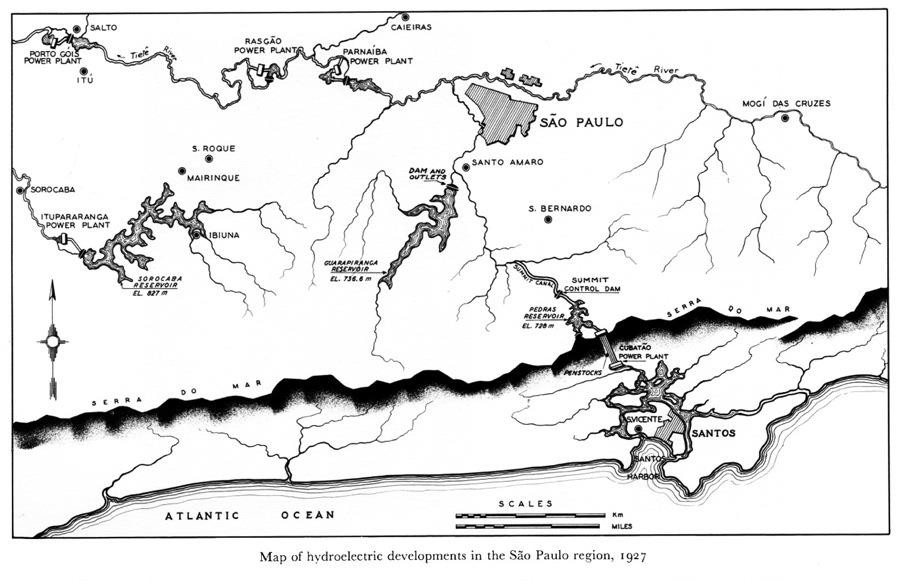
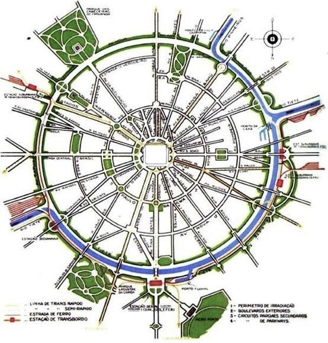
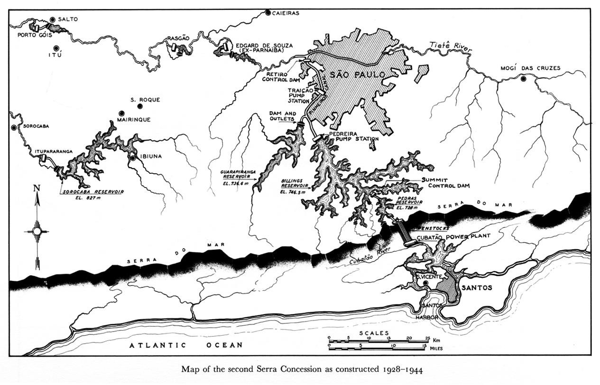
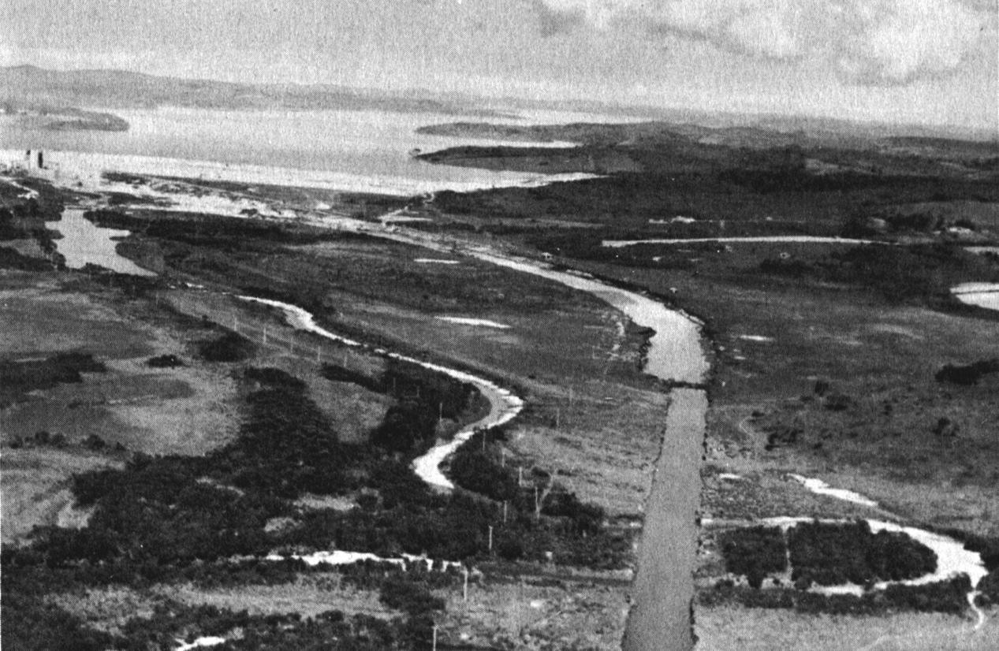
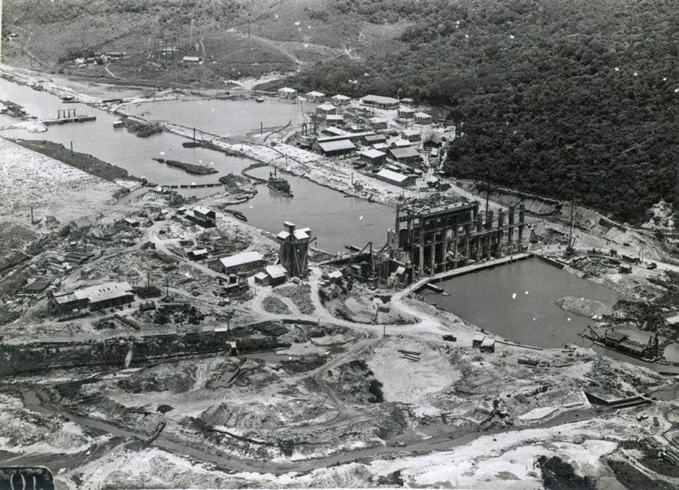
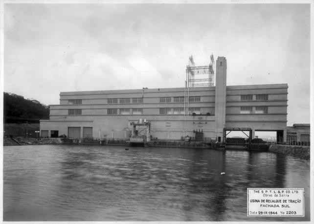
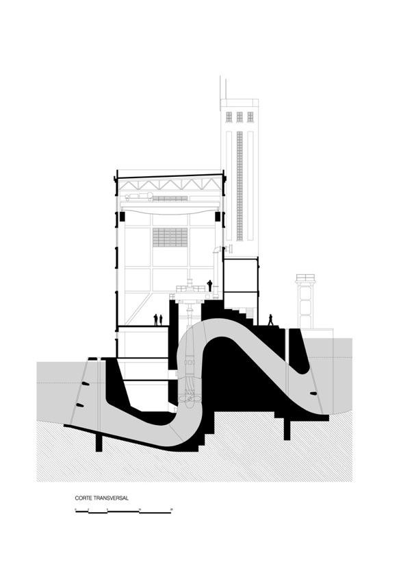
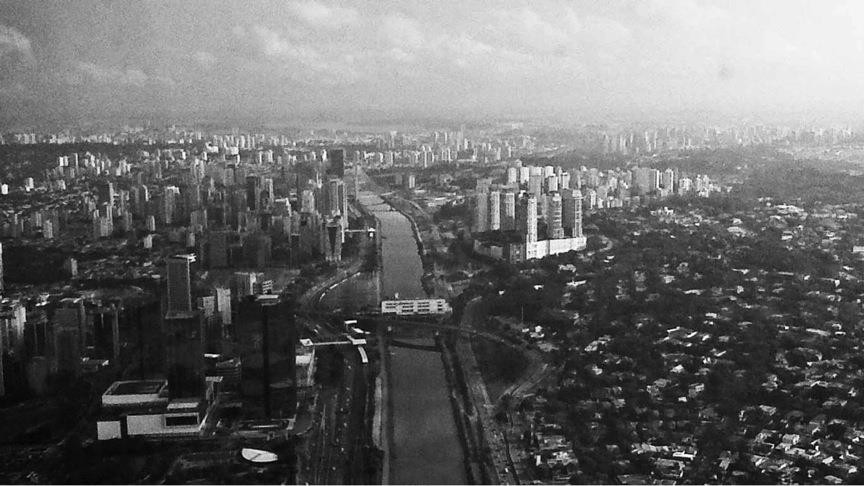

# Resumo

O desenvolvimento urbano do vale do Rio Pinheiros, hoje uma das regiões
mais valorizadas da cidade de São Paulo, tem suas origens nos projetos
de geração de energia elétrica implantados pela companhia canadense
Light na primeira metade do século XX -- paralelos a outras grandes
obras públicas de infraestrutura que buscavam modernizar a cidade. Para
os propósitos hidrelétricos, o rio foi retificado, canalizado, drenando
vasta área de várzea alagável, e teve o seu fluxo invertido. A Usina
Elevatória de Traição, estação de bombeamento construída no ponto médio
do canal Pinheiros, com suas características singulares de implantação e
projeto, sinalizou a futura expansão urbana e representa um marco da
presença da Light na produção do novo território.

Urbanismo, História, Hidrografia, Eletricidade, Território, Projeto

# Abstract

The urban development of the Pinheiros river valley, now one of the most
valued areas of the city of São Paulo, has its origins in the projects
of power generation deployed by Canadian company Light in the first half
of the twentieth century - parallel to other major public works of
infrastructure that sought to modernize the city. For hydroelectric
purposes, the river was rectified, canalized, draining a vast area of
lowland floodplain, and had its flow reversed. The Traição pumping
station, built at the midpoint of the Pinheiros canal, with its unique
design and deployment characteristics, signaled for the future urban
expansion and represents a milestone of the presence of Light Co. in the
production of the new territory.

Urbanism, History, Hydrography, Electricity, Territory, Project

# Introdução

Na primeira metade do século XX, o rápido crescimento e industrialização
de São Paulo exigiam um novo patamar em termos de infraestrutura urbana
e um substancial aumento na produção de energia elétrica para suprir as
novas demandas. A The São Paulo Tramway, Light & Power, companhia de
capital canadense que operava as linhas de bonde da cidade e já era
responsável pela geração de energia, propôs a implantação de um sistema
que faria proveito do potencial hídrico do planalto paulista aliado ao
desnível de mais de 700 metros existente entre este e a baixada santista
para a construção de uma usina hidrelétrica. Idealizado ainda nos anos
1920 e implantado nas três décadas seguintes, este sistema, conhecido a
princípio como Projeto Serra, implicou uma dramática alteração da
hidrografia, que incluiu a implantação das represas Rio das Pedras e
Billings, a retificação do rio Pinheiros e a reversão do fluxo de suas
águas por meio de duas estações de bombeamento.

A Usina Elevatória de Traição, a primeira destas estações, secciona
transversalmente o canal do Pinheiros na altura do córrego da Traição
(canalizado sob a Avenida dos

Bandeirantes) e hoje está localizada em meio a uma das regiões de maior
valorização imobiliária de São Paulo. É um edifício singular por sua
implantação transversal, marcando o afastamento das vias marginais em
relação ao canal, e pelos traços arquitetônicos de seu projeto que,
embora eminentemente técnico e afastado da zona urbanizada à época de
sua construção em 1940, apresenta traços semelhantes aos que marcaram
grandes obras de infraestrutura realizadas no mesmo período, como a
Ponte das Bandeiras e o Túnel Nove de Julho.

Este trabalho, parte dos resultados de pesquisa de mestrado desenvolvida
a partir de material primário encontrado na Fundação Energia e
Saneamento e na EMAE -- Empresa Metropolitana de Águas e Energia,
pretende investigar as propostas de transformação urbana no vale do rio
Pinheiros em São Paulo, desde a criação da represa Guarapiranga em 1909,
tomando como marco referencial a implantação da Usina Elevatória de
Traição em 1940, e culminando nos debates sobre o aproveitamento dos
terrenos obtidos pela Light, constantes do relatório de planejamento
coordenado por Robert Moses em 1950.

# Antecedentes: Os planos para o Rio Tietê

No intuito de solucionar o problema das inundações recorrentes do rio
Tietê nos meses de verão e ainda aproveitar de forma útil para a cidade
as áreas de sua várzea, alguns planos com propostas diferentes surgiram
nos anos de 1920. O politécnico José Antonio Fonseca Rodrigues,
professor da disciplina de rios e canais navegáveis, apresentou em 1922
ao diretor de Obras Municipais, Victor da Silva Freire (1869- 1951), o
seu plano que consistia na canalização do rio em traçado reto e bastante
largo, com leito navegável, patamar inundável para acomodar as cheias, e
avenidas marginais de 20 metros de largura sobre elevações que conteriam
o avanço da água sobre as áreas adjacentes. (CAMPOS, 2002. p. 296)

Victor Freire, atento ao *"aformoseamento da cidade"*, (SIMONE) não
satisfeito com a simplicidade do plano de Fonseca Rodrigues, encomenda
outro plano ao engenheiro municipal Ulhôa Cintra e o apresenta à Câmara
Municipal. O projeto de Ulhôa Cintra, ao invés da retificação, propõe a
regularização do rio Tietê seguindo seu traçado sinuoso. Ao longo das
margens, seria deixada uma faixa verde, proposta de parque linear, *"na
qual as avenidas marginais assumiriam o caráter de [parkways]{.ul}."*
(CAMPOS, 2002. p297)

Mas este projeto esbarrava na questão econômica pois a maior parte das
áreas drenadas seria aproveitada para fins públicos (parque e avenidas),
tornando difícil a arrecadação de fundos para financiar a obra pela
escassez de terrenos vendáveis. No impasse com as soluções até então
apresentadas, a Câmara decide compor uma comissão especial para tratar
do tema e esta indica o já consagrado engenheiro Saturnino Rodrigues de
Brito (1864-1929) para estudar as propostas e elaborar um novo plano.
(CAMPOS, 2002. p298)

> Saturnino de Brito, era o *"representante máximo do moderno
> conhecimento técnico aplicado ao saneamento, higiene urbana e
> remodelação de cidades"* (CAMPOS, 2002. p142) conhecido pelo
> saneamento da cidade de Santos por meio de canais. (SIMONE) Entusiasta
> dos preceitos do urbanista Camillo Sitte, defendia as virtudes
> sanitárias e estéticas dos traçados sinuosos de vias. Avesso à
> monotonia e arbitrariedade dos arruamentos ortogonais haussmanianos,
> advogava a economia, o potencial paisagístico e a valorização do
> pitoresco dos traçados adaptados aos

acidentes geográficos. Assim, apresenta em 1925 o seu estudo para o rio
Tietê no qual previa dois grandes lagos separados por uma ilha-parque,
além das vias marginais em traçado sinuoso que, no trecho compreendido,
encurtava o percurso do rio em cerca de 20 quilômetros e permitia o
aproveitamento de 25 quilômetros quadrados das áreas antes alagáveis.
(SMONE)

> Estas propostas ecoavam também as sugestões do arquiteto e urbanista
> inglês Barry Parker (1867-1914) que permaneceu em São Paulo entre 1917
> e 1919, projetando loteamentos para a Companhia City, como o Jardim
> América. Parker *"imaginou larga faixa de parques ao longo das várzeas
> dos rios Tietê e Pinheiros, visando limitar a expansão urbana,
> proteger e valorizar os bairros residenciais adjacentes."* (CAMPOS,
> 2002. p242)

# As intervenções da Light na hidrografia paulistana

Instalada no Brasil em 1889, a The São Paulo Tramway Light & Power Co.
Ltd., ou simplesmente Light, companhia fundada no mesmo ano em Toronto,
tinha como propósito suprir a cidade, à época centro comercial e
financeiro da cafeicultura paulista, com serviços de iluminação elétrica
e transporte público por bondes. Para tal, construiu uma usina
hidrelétrica de grande porte para os padrões da época no Rio Tietê, a
jusante da capital, em Santana de Parnaíba. (REIS FILHO, 1989. p119) A
Usina de Parnaíba, inaugurada em 1901, proporcionou o fornecimento dos
referidos serviços públicos e também a oferta de energia por um custo
bastante reduzido, firmando o monopólio da Light neste setor. (SAES)

Mas, como a sazonalidade nesta região geográfica impõe variações no
volume hídrico com épocas de cheias e outras de estiagem, a geração nas
instalações de Parnaíba ficava sujeita às oscilações Rio Tietê (CAMPOS,
2002). A necessidade de um reservatório que garantisse volume constante
apresentou-se aos planejadores da Light e estes acabaram por eleger um
local distante, em Santo Amaro para este propósito. O reservatório,
primeiro da região metropolitana, foi obtido então a partir do
represamento do Rio Guarapiranga, afluente do Rio Pinheiros, inundando
uma área de

34 quilômetros quadrados. Quando concluído, em 1909, (ACKERMAN, 1953) a
ligação entre este e a Usina de Parnaíba deu-se por intermédio do Rio
Pinheiros que, por sua vez, desaguava no Rio Tietê.

Desta forma, o Rio Pinheiros, um lento e sinuoso afluente do Rio Tietê,
com extensa área de várzea alagável, passou a ter a sua primeira função
-- como via de ligação -- nos sistemas de geração de energia da Light.

> 
>
> Figura 1. Mapa do sistema hidrelétrico da Light na região de São Paulo
> em 1927. Fonte: ACERMAN, 1953 p. 35.

Mas, após a seca do verão de 1924-1925 que baixou a menos de um terço o
nível da Represa Guarapiranga, forçando o corte de 70% da energia para a
cidade (ACKERMAN, 1953), a Companhia Light, buscando um salto
quantitativo na capacidade de produção, decidiu por em prática um ousado
plano que já vinha esboçando. Sob o comando do engenheiro
norte-americano Asa White K. Billings (1876-1949), o plano consistia na
construção de um novo reservatório, maior do que o Guarapiranga, que
abasteceria uma usina hidrelétrica instalada em Cubatão, aproveitando o
desnível de 718 metros da encosta da Serra do Mar para impulsionar as
turbinas. Este novo reservatório seria formado não só pelos rios que
nascem no topo da serra, mas também seria alimentado pelas águas do Rio
Tietê, invertendo-se a direção do fluxo natural do Rio Pinheiros. Este
ultimo deveria então ser retificado e transformado em canal útil ao novo
sistema de produção. Também deveriam ser instaladas estações de
bombeamento para operar a reversão do fluxo.

A empresa obteve entre 1925 e 1927 as autorizações do Governo do Estado
para criar a represa Billings, para acanalizar e reverter o Rio
Pinheiros, desviando as águas do Rio Tietê, e para desapropriar os
terrenos da várzea do Pinheiros e depois revendê-los aos proprietários
originais, cobrando o custo das melhorias, ou leiloá-los, reservando
faixas para a municipalidade implantar avenidas marginais, pontes e
trevos. Com a segurança do monopólio e a certeza da demanda, a Light
mobiliza investimentos para a execução do projeto. Justificavam então os
documentos submetidos ao governo:

> *O rio Pinheiros, affluente do Tietê, formado pelo Guarapiranga e o
> Grande, correndo por um leito sinuoso, atravessa uma extensa varzea
> quasi plana. Seu regimen, como de todos os rios nesta parte do
> planalto paulista é irregular, sujeito a variações accentuadas, nas
> epocas das seccas e das chuvas. (\...) propõe a Supplicante canalisar
> o rio Pinheiros, seguindo o traçado que melhor*
>
> *aconselharem as sondagens do terreno e as condições technicas da
> construcção de um leito que, por sua grande largura e profundidade,
> permita não só o livre curso das máximas vasões possíveis, como o
> aterro da parte da superficie, sujeita a inundação.* (SOUZA, 1982, pp.
> 196-197.)

E ressaltavam ainda os benefícios:

> *A canalisação do rio evitará definitivamente as inundações, as
> mudanças de curso, os depósitos de alluvião e saneará a região (\...).
> A tudo isso pode se acrescentar a conveniência da construcção de
> avenidas lateraes, ramaes das estradas de ferro e outros meios de
> transporte.* (SOUZA, 1982, p.197)

Como à Light, a partir de 1927, estava garantida a desapropriação das
áreas alagáveis do vale do Pinheiros para as obras de melhorias, tratou
a Companhia de delimitar este território, contando com a sorte e
artimanhas, conquistando a maior área possível em benefício próprio. Em
fevereiro de 1929 fortes chuvas atingiram a bacia do Alto Tietê
sobrecarregando o sistema hídrico. Aproveitando-se das enchentes já
causadas pela precipitação, a Light contribuiu abrindo as comportas das
represas Guarapiranga e Billings causando a maior inundação já
registrada em São Paulo. Posteriormente, o nível da água neste episódio
foi demarcado e serviu como parâmetro para as referidas desapropriações.
Não sem algumas disputas judiciais -- como a famosa contra o Clube
Germânia (atual Clube Pinheiros) -- uma larga faixa ao longo do canal
ficou disponível para operações de valorização com implantação de
infraestrutura e loteamento. (SEABRA, 1987)

> As autorizações de 1927 também definiam que, margeando o novo canal,
> deveria ser reservado de cada lado *"uma faixa privativa de terreno
> com largura de 15 a 25 metros, destinada à conservação dos taludes e
> outros serviços"* e outra *"para uma avenida ao lado da faixa Leste,
> com 40 metros de largura, conforme indicarem as plantas que forem
> definitivamente approvadas pelo Governo."* E ainda que: *"Ao lado da
> faixa Oeste de conservação será reservada outra faixa com 44 metros de
> largura, destinada às linhas de transmissão de energia electrica,
> telephonicas, de transporte e outras de qualquer natureza, mas de
> utilidade publica."* (SOUZA, 1982, p. 203.) Definia-se assim o que
> viriam a ser as vias expressas marginais de automóveis (primeiramente
> implantadas apenas na margem Leste), o trilho do trem e a linha de
> transmissão de energia.

Com a aposentadoria de Victor Freire e início da gestão Pires do Rio na
prefeitura (1926 a 1930), as questões ambientais e hidráulicas são
relegadas ao segundo plano e o destaque passa a ser o aproveitamento
viário e imobiliário da várzea do Tietê. Esta mudança de visão também
interessava à Companhia Light pois, para as suas intenções de
aproveitamento das águas do Tietê e Pinheiros, não era benéfico que
houvesse qualquer tipo de controle de vazão -- como os lagos do plano de
Brito -- a montante da confluência dos rios. (CAMPOS, 2002, p300-3002).

Sob esta nova ótica, o Plano de Avenidas, apresentado em 1930 pelo
engenheiro civil e arquiteto Francisco Prestes Maia (1896-1965) trazia
novas propostas urbanísticas e viárias para São Paulo, tendo como
elemento principal a organização do fluxo de veículos segundo um esquema
radial-perimetral. As vias marginais do Tietê e do Pinheiros estavam ali
esboçadas formando parte do anel viário mais externo. Ao

longo dos rios, canalizados e retificados, deveriam ser implantadas
avenidas largas nas duas margens combinadas com arborização nos moldes
das *parkways* norte- americanas (CAMPOS e SOMEKH, 2002, p. 64).

Quando em 1938, seis meses após o golpe do Estado Novo, o interventor
Adhemar de Barros nomeou o próprio Prestes Maia prefeito de São Paulo, a
cidade foi transformada em verdadeiro canteiro de obras. (SIMONE, 2008)
O Plano de Avenidas então começou a ser posto em prática, incluindo a
retificação do Rio Tietê para a implantação das avenidas marginais, obra
que duraria até os anos 1960 (SEABRA, 1987).

> 
>
> Figura 2. Esquema teórico do Plano de Avenidas. Fonte: CAMPOS e
> SOMEKH, 2002 p.61.

# As obras da Traição

As obras de retificação e canalização do Rio Pinheiros foram iniciadas
ao mesmo tempo em que as do Rio Tietê e de muitas das grandes obras
previstas no Plano de Avenidas e concretizadas entre 1938 e 1945.

Originalmente, o Rio Pinheiros fluía livremente no sentido sul-norte
através de meandros que se espalhavam pela várzea alagável. Era um rio
de planície, lento e tortuoso que , nas cheias, podia alterar o curso
fazendo dos antigos meandros lagoas semicirculares e áreas de charco.
Sua vazão natural máxima, sem transbordar, era de aproximadamente 40
m3/s. Poucas construções ocupavam esta área considerada insalubre e,
entre as décadas de 1920 e 1930, a extração de areia e pedregulho das
margens e do leito forneceu material essencial para a construção civil
num período de intenso crescimento urbano de São Paulo. (SEABRA, 1987).

A retificação teve início em 1937 e, em 1944 o sistema instalado começou
a operar a

reversão de fluxo carreando as águas do Rio Tietê até o reservatório
Billings. Para realizar a reversão, foram instaladas no novo canal duas
estações de bombeamento: a Usina Elevatória de Traição, localizada no
meio do percurso, próxima ao deságue do córrego da Traição, eleva em 5
metros o nível da água em direção à represa. A segunda usina, Elevatória
de Pedreira, na borda da represa, eleva o nível em mais 25 metros,
atingindo a cota pretendida do reservatório, 746,5 metros acima do nível
do mar (SOUZA, 1982).

> 
>
> Figura 3. Mapa do sistema hidrelétrico da Light entre 1928 e 1944.
> Fonte: ACKERMAN, 1953 p. 47.
>
> 
>
> Figura 4. Retificação do Pinheiros e reservatório Billings ao fundo.
> Fonte: ACKERMAN, 1953 p. 56.

A Usina Elevatória de Traição, originalmente denominada Casa de Bombas
de Traição ou também Estação de Recalque de Traição, é uma barragem
encimada por edifício de operação que realiza o bombeamento por meio de
quatro turbinas de eixo vertical, instaladas em poços em forma de sifão,
dispensando o uso de comportas. (SOUZA, 1982) A obra foi concluída em
1940 e as turbinas foram instaladas progressivamente de forma que a
turbina número um, começou a operar para testes neste mesmo ano e,
plenamente, em 1944 e a segunda turbina foi instalada em novembro de
1950. (FILARDO JR., 1998. p66) O edifício da Usina, apesar de tratar- se
de obra de infraestrutura, à época afastada da densidade urbana, tem
tratamento arquitetônico marcante com frisos horizontais que simulam um
edifício de pavimentos, equilíbrio compositivo, e a presença de uma
torre de circulação vertical coroada por um posto de observação que
ostenta mastros para bandeiras. Estas características fazem crer que seu
projeto foi elaborado não apenas para atender aos propósitos práticos,
como também para marcar a presença da Light no coração de seu novo
território.

> 
>
> Figura 5. Construção da Usina Elevatória de Traição. 1940. Fonte:
> acervo da Fundação Energia e Saneamento.
>
> 
>
> Figura 6. Fachada sul da Usina Elevatória de Traição. 1944. Fonte:
> acervo da Fundação Energia e Saneamento.
>
> 
>
> Figura 7. Corte transversal da usina produzido a partir de desenhos
> originais de 1939. Fonte: autor.

# A questão do aproveitamento dos terrenos e o relatório Moses

No final dos anos 1940 agravaram-se os problemas urbanos decorrentes da
rápida expansão da cidade. A carência de transportes coletivos e a
verticalização desordenada levaram o então prefeito Lineu Prestes a
encomendar um estudo seguido de proposições à IBEC (*International Basic
Economy Corporation*) -- entidade consultora sediada em Nova York e
presidida por Nelson Rockfeller. O trabalho final, intitulado "Programa
de Melhoramentos Públicos para a Cidade de São Paulo" foi entregue em
1950 à administração municipal e, como o diretor dos estudos foi o
engenheiro e advogado norte-americano, Robert Moses (1888-1981), o
documento ficou conhecido como Relatório Moses. (CAMPOS e SOMEKH, 2002.
p85)

Entre outras análises, o relatório trazia um capítulo dedicado ao CANAL
DO PINHEIROS, do qual destacamos alguns trechos que tratam do
desenvolvimento das obas da Light, do aproveitamento urbano da várzea e
algumas interessantes recomendações a respeito dos perigos da poluição
das águas e posturas de intervenção:

> *O Canal do Pinheiros, excelente obra de engenharia que se estende por
> 26 quilômetros, do rio Tietê até o dique do reservatório do rio
> Grande* \[Represa Billings\]*, foi construído com o fim de produzir
> energia hidráulica e obter proteção contra as enchentes. (\...)*
>
> *Segundo o acordo existente entre o Estado de São Paulo e a 'Light*
>
> *& Power Company', já incorporado a decretos vários, esta companhia
> tem a obrigação de dispor, em 1954, de todas as terras excedentes, que
> não sejam utilizadas para a produção de energia elétrica ou para o
> controle de inundações. Reservaram-se direitos- de-passagem para
> rodovias, estradas-de-ferro, pontes, linhas de condução elétrica e
> outros fins de utilidade pública.*
>
> *Os terrenos do Vale do Pinheiros, como os adjacentes ao Rio Tietê,
> desempenharão um dia um papel importantes na expansão da cidade. Estas
> terras têm um grande valor potencial, sobretudo para a indústria, e em
> certas secções limitadas, para residência, recreação, e outros fins
> públicos e privados. (\...)* (IBEC, 1950)

Assim, o relatório já previa a expansão urbana para o vale do Pinheiros
e propunha o uso das terras com atividades diversas e também para
mobilidade. Cabe salientar que a própria Companhia Light indicava que lá
poderia ser desenvolvida uma região moderna para acomodar meio milhão de
pessoas. (ACKERMAN, 1953) Mas, o relatório faz menção à necessidade da
Light devolver, via leilão, os terrenos desapropriados. Conforme Odette
Seabra (1987), o valor de venda seria definido pelo valor pago na
desapropriação mais os benefícios introduzidos pelas obras de
retificação e drenagem. Poderiam então retornar aos antigos
proprietários ou serem vendidos a novos proprietários, incluindo o poder
público. Desta forma, antecipava-se uma farta oferta de terrenos,
valorizados pela drenagem da várzea e pelo avanço dos bairros
adjacentes. O relatório dá conta de que esta área seria de mais ou menos
32 milhões de metros quadrados.

E continua:

> *Quanto às principais rodovias ao longo do Canal, sugerimos uma
> rodovia expressa que sirva de elo do sistema paralelo ao Canal, a qual
> seria construída a leste do mesmo e se ligaria à rodovia expressa do
> Rio Tietê. Quanto a parques e praças de recreio, reservar-se-iam áreas
> à margem oriental do Canal, para recreação pública e semi-pública.*
> (IBEC, 1950)

Sugerindo a implantação de vias expressas, mas naquele momento só na
margem leste, sendo que a margem oeste poderia ser aproveitada para
parques.

E faz um alerta quanto ao risco da poluição das águas:

> *O projeto do Vale do Pinheiros deve estar ligado ao sistema de coleta
> de lixo e do funcionamento dos esgotos que propusemos. É vital, tanto
> para o êxito do programa do Canal, como para o do programa do rio
> Tietê, que se elimine a contaminação das águas. A não ser que tal
> providencia seja tomada, e as águas do Canal sejam relativamente
> limpas, o programa de melhorias estará todo ameaçado e sua utilidade
> futura ficará deveras reduzida.*(IBEC, 1950)
>
> O relatório também propõe a adoção de um zoneamento para o vale do
> Pinheiros que seria parte integrante do plano geral de zoneamento da
> cidade. E, para implantar o *"programa completo de recuperação,
> saneamento e urbanização, incluindo os melhoramentos públicos"* (IBEC,
> 1950) sugere três formas de gestão no que concerniria à atuação da
> Light e do poder público no processo:
>
> A primeira possibilidade seria seguir sem modificações o acordo da
> Companhia com o Estado. A Light faria a devolução das terras a
> proprietários privados sem a intervenção ou plano de interesse
> público. A ressalva para este modelo é a de que assim, a gestão de
> interesses nesta área, ficaria então pulverizada entre *"muitos
> possuidores de pequenos lotes incapazes economicamente de construir e
> contribuir"* para o beneficiamento e desenvolvimento urbano em prol de
> um crescimento harmonioso da cidade. "*Mais cedo ou mais tarde, seria
> necessário desapropriar total ou parcialmente, ante a necessidade de
> realização de obras públicas."* (IBEC, 1950)

A segunda possibilidade seria modificar os decretos e estabelecer uma
Corporação de Urbanização com participação da Light. Esta corporação
regularia a venda das terras que só seriam autorizadas sob condições que
assegurassem o cumprimento de um plano definido de urbanização.
Reservaria ainda para o Estado e para o Município áreas para implantação
de rodovias, ferrovias e outros fins de serviço público. (IBEC, 1950)

> A terceira, seria o estabelecimento de uma corporação pública que se
> encarregaria de desenvolver as terras dentro da área de urbanização
> que não fossem necessárias à produção de energia elétrica, entregando
> ao Estado ou ao Município os lucros provenientes da venda dos
> terrenos. Mas, "*isto levaria o Estado ou o Município a entrar
> abertamente na exploração de propriedades urbanas, atividades deveras
> inadequada para organismos governamentais".* (IBEC, 1950)
>
> O relatório então conclui que a segunda possibilidade seria "*a mais
> desejável em todos os seus aspectos"* e recomenda a sua adoção. (IBEC,
> 1950)

Mas, o desfecho do aproveitamento das terras do vale do Pinheiros
aconteceu de forma diferente. As múltiplas formas de aquisição de
terrenos por parte da Light -- e ainda a dificuldade de estabelecer o
valor a ser ressarcido, já que a Light também se beneficiava da venda de
energia -- fizeram com que apenas uma pequena parte da área fosse a
leilão retornando aos pequenos proprietários. A maior parte foi
negociada e permutada diretamente com os interessados, que passaram a
ser a prefeitura, para a implantação das vias marginais, e as
construtoras. (SEABRA, 1987)

Assim, a atuação e interesse do setor público neste processo, ficou
restrito às obras viárias. As intervenções foram sendo definidas e
alteradas no decorrer das obras de retificação do rio e também após a
sua conclusão. A implantação da Estrada de Ferro Sorocabana (atual linha
da CPTM), a mais antiga destas intervenções, foi decidida por decreto
ainda em 1939, reservando-se uma faixa de 14 metros de largura. (SEABRA,
1987)

À Light, coube o interesse de continuamente ampliar a sua capacidade de
geração de energia, e de explorar economicamente os terrenos aos quais
foi dada a permissão de desapropriar produzindo assim um espaço da
cidade destacadamente valorizado. Os bairros estritamente residenciais
de alto padrão e as áreas de atividade terciária de padrão internacional
que circundam a Usina de Traição diferem contrastadamente com a ocupação
ao longo do canal Tietê, marcada por equipamentos públicos e privados de
grande porte.

# Considerações finais

A Usina Elevatória de Traição é, portanto, ao mesmo tempo um componente
funcional essencial e um marco construído das complexas operações
realizadas pela Light e seu parceiros ao longo do século XX no vale do
rio Pinheiros. Com a canalização deste, e a reversão de seu curso,
alimentando a Usina Hidrelétrica Henry Borden, em Cubatão, possibilitou
um aporte de energia vital para o intenso crescimento urbano e
industrial da capital paulista. Além disso, representou, desde a época
de sua implantação, um sinalizador para a expansão urbana que viria a
seguir, e que hoje caracteriza a região como uma das mais destacadas na
imagem da metrópole cosmopolita, apesar da má condição ambiental das
águas do canal.

Se a construção do tecido urbano é caracterizada por uma imbricação de
estratos sobrepostos e/ou justapostos, sendo necessária uma análise de
seus elementos constituintes que permita leituras, ainda que parciais,
dessa condição complexa, elementos fundamentais para a apreensão dos
diferentes significados historicamente projetados e atribuídos ao canal
do Pinheiros, aos eixos viários que o acompanham ou atravessam, e aos
bairros densamente ocupados e valorizados ao redor, podem ser
encontrados no desenho e na implantação da Usina Elevatória de Traição.
Sua história, propósito e características, apontam para um projeto
estruturado em múltiplos níveis (político, geográfico, econômico,
funcional e estético), em grande parte concretizado e que, a despeito de
insuficiências e lacunas de previsão, imprimiu e antecedeu alguns dos
aspectos definidores na conformação física e urbana da região.

> 
>
> Figura 8. Vale do Pinheiros, fotografia aérea no sentido sul com Usina
> Elevatória de Traição ao centro. 2012. Fonte: fotografia do autor.

# Bibliografia

> ACKERMAN, Adolph J. *Billings And Water Power In Brazil.* New York:
> American Society of Civil Engineers, 1953.
>
> CAMPOS, Candido Malta e SOMEKH, Nádia (organizadores). *A Cidade que
> Não Pode Parar: Planos Urbanísticos de São Paulo no Século XX.* São
> Paulo, Mackpesquisa, 2002.
>
> CAMPOS, Candido Malta. *Os Rumos da Cidade: urbanismo e modernização
> em São Paulo*. São Paulo: SENAC, 2002, p. 292.
>
> FILARDO JR., Angelo S. *Territórios da Eletricidade: A Light em São
> Paulo e o Projeto da Serra de Cubatão -- 1925-1950.* TD. FAUUSP, 1998.
>
> IBEC - International Basic Economy Corporation: *Programa de
> Melhoramentos Públicos para a Cidade de São Paulo.* New York, 1950.
>
> REIS FILHO, Nestor Goulart. *Aspectos da história da engenharia civil
> em São Paulo: 1860-1960*. São Paulo: Kosmos, 1989.
>
> SAES, Alexandre Macchione. *Luz, leis e livre-concorrência: conflitos
> em torno das concessões de energia elétrica na cidade de São Paulo no
> início do século XX*. Dossiê: História, Direito e Justiça. História,
> vol.28 no.2 Franca 2009.
>
> SEABRA, Odette Carvalho de Lima. *Os meandros dos rios nos meandros do
> poder: Tietê e Pinheiros -- valorização dos rios e das várzeas na
> cidade de São Paulo.* TD FFLCH -- USP, Dep. de geografia. São Paulo,
> 1987.
>
> SIMONE, Sergio Antonio de. *A Ponte das Bandeiras: Os projetos de
> retificação e canalização para o rio Tietê promovem uma reviravolta na
> cidade***.** Artigo para o site Vitruvius. 2008. Disponível em:

\<<http://www.vitruvius.com.br/revistas/read/arquitextos/09.098/124>\>

> SOUZA, Edgard de. *História da Light -- primeiros 50 anos.* Publicação
> póstuma de material elaborado em 1949. São Paulo: Eletropaulo, 1982.
