# Resumo

A análise das inter-relações sociedade-natureza compreende importante
elemento para entendimento dos conflitos entre a criação de áreas de
proteção ambiental em nossas cidades e comunidades locais que mantém
tradicionalmente relações cotidianas com essas áreas. Na cidade de
Natal/RN, tal conflito é evidenciado no processo de gênese e efetivação
do Parque das Dunas e comunidades ao seu redor. O presente trabalho
pretende discutir a relação de dois bairros situados no entorno do
parque, Nova Descoberta e Mãe Luiza, com o ecossistema de dunas
circundante, tendo como foco principal de análise as relações e as
representações simbólicas vivenciadas cotidianamente pelas comunidades
com as dunas, antes e depois da criação da unidade de conservação de
proteção integral. Adotando a compreensão do cotidiano como categoria de
análise, recorremos aos estudos de Henri Lefebvre acerca da produção do
espaço urbano e de suas discussões sobre o cotidiano como instância em
que se delimita e se vivencia o espaço vivido e concebido, pressupostos
para compreensão das diferentes tramas e conflitos que se estabelecem na
relação das comunidades citadas com o ecossistema de dunas. Nesse caso,
o 'vivido' transparece nas diferentes formas de apropriação do 'morro',
enquanto que o 'concebido' se mostra nas ações do Estado, quando
delimita e institucionaliza o parque, destituindo as comunidades de uma
importante referência socioespacial. Para compreensão das questões
levantadas, os procedimentos metodológicos adotados incluem um
referencial teórico, realização de entrevistas, observações in loco e
levantamento cartográfico e iconográfico.

> **Palavras-chave:** Nova Descoberta, Mãe Luiza, Dunas, Cotidiano

# Abstract

The analysis of the interrelations between society and nature comprises
important element for understanding the conflicts between the creation
of protected areas in our cities and local communities that
traditionally maintain daily relations with these areas. In Natal/RN,
such conflict is accentuated in the genesis and realization of the
Parque das Dunas and surrounding communities. This paper discusses the
relationship of two neighbourhoods located around the park, Nova
Descoberta and Mãe Luiza, with the enclosing dune ecosystem, the primary
focus of analysis being the relations and symbolic representations,
routinely experienced between communities and dunes, before and after
the creation of conservation units of integral protection. Adopting an
understanding of the quotidian as a category of analysis, we relied on
the studies of Henri Lefebvre on the urban space production and his
discussions about quotidian as

> 1 Este artigo tem como base as pesquisas de Doutorado em
> desenvolvimento, preliminarmente intituladas: *Assentamentos Informais
> em Áreas Ambientalmente Sensíveis: caminhos para o desenho urbano
> ambiental* e *Bairro e Vida de Bairro: no encontro da vida cotidiana,
> a busca de uma Nova Descoberta*, do Programa de Pós-Graduação em
> Arquitetura e Urbanismo, da Universidade Federal do Rio Grande do
> Norte.

a forum in which we delimit and experience the space that is lived and
conceived, presuppositions for understanding the different plots and
conflicts established between the communities mentioned in the dune
ecosystem. In this case, \'lived\' transpires through the different
forms of appropriation of the \'morro\', while \'conceived\' shows the
actions of the State, when it delimits and institutionalizes the park,
depriving the community from an important socio-spatial reference. For
better understanding of the issues raised, the methodological procedures
include a theoretical framework, on-site observations, and cartographic
and iconographic analysis.

Keywords: Nova Descoberta, Mãe Luiza, Dunes, Quotidian

# Introdução

Este trabalho discute os significados socioespaciais vivenciados
cotidianamente pelas populações dos bairros de Nova Descoberta e Mãe
Luiza em relação ao campo dunar circundante. Como áreas de ocupação
informal, outrora distantes do centro ou dos bairros mais estruturados
da cidade, nasceram como assentamentos de poucas ruas, a partir da
década de 1940, por uma população atraída pela possibilidade de trabalho
na capital potiguar.

A localização desses assentamentos ao redor do 'morro', como chamavam os
primeiros moradores, é o fato que permeou nossas inquietações iniciais,
instigando as seguintes questões: como as populações locais se
apropriaram cotidianamente dessas dunas? Quais relações de identidade
foram estabelecidas?

E sabendo que esse campo dunar, constitui atualmente uma unidade de
conservação denominada "Parque Estadual Dunas de Natal Jornalista Luiz
Maria Alves", indagamos acerca da possibilidade de mudanças na relação
entre as comunidades e o 'morro', pois agora a população somente pode
usufruir de pequena porção que constitui a área de uso público do
parque. Por isso então perguntamos: quais as principais consequências da
criação do parque e do cercamento das dunas para o cotidiano da
população dos bairros citados?

Nossa hipótese é que as dunas foram importantes para constituição da
identidade das comunidades, que as incorporou cotidianamente como
elemento ligado ao imaginário e ao lazer local, e, por outro lado, com a
criação do parque essa população perdeu o acesso pela imposição das
novas regras colocadas pela gestão ambiental, tendo seu cotidiano
alienado de um importante símbolo de identidade.

> O trabalho ampara-se na compreensão dialética de produção do espaço,
> entendendo a área como espaço em produção, a partir de um movimento
> histórico que aponta, tanto para a reprodução do modo de produção
> vigente, quanto à reprodução da própria vida humana, processo esse
> que, como afirma Henri Lefebvre (2008, p. 20-21), *"se desenrola sob
> os olhos de cada um, que se realiza em cada atividade social,
> inclusive naquelas aparentemente mais indiferentes (os lazeres, a vida
> cotidiana, o habitar e o habitat, a utilização do espaço)".*
>
> Essa dinâmica é mediada e concretizada em seu cotidiano por relações
> sociais que sinalizam para diferentes modos de apropriação do espaço,
> em que, ressalta Carlos (2011, p. 11), *"as relações sociais têm
> concretude no espaço, nos lugares onde se realiza a vida humana,
> envolvendo um determinado emprego do tempo que se materializa enquanto
> modo de uso do espaço".*

Nesse sentido, consideramos importante a compreensão do cotidiano como
categoria de análise, recorrendo aos estudos de Henri Lefebvre (1974)
acerca da produção do espaço urbano e de suas discussões sobre o
cotidiano como instância em que se

vivencia o espaço vivido e concebido, pressupostos para analisar a vida
social na cidade em sua ordem próxima e distante, ou seja, como
realidade dialeticamente construída entre a dinâmica de apropriação do
espaço e segundo os interesses de reprodução do capital.

> Dessa forma, o cotidiano aparece dialeticamente como elemento
> condicionado e condicionante do processo de produção do espaço, sendo
> reflexo da relação contraditória entre o valor de troca e de uso, onde
> os elementos do construído manifestam, através das representações e
> símbolos das comunidades, a dinâmica da vida social e da reprodução do
> capital. Tais premissas apontam para diferentes lógicas de (re)
> produção do espaço, que se aproximam como ordem próxima e distante,
> demonstrando que "*a ordem distante diz respeito a uma ordem
> estabelecida pelo Estado, a partir dos códigos de especialistas,
> enquanto a ordem próxima refere-se à prática cotidiana*". (LEFEBVRE,
> 1974 apud NASCIMENTO, 2011, p. 50)

A produção socioespacial sinaliza para o embate histórico entre valor de
uso e de troca, entre ordem próxima e distante, onde os indivíduos
elaboram cotidianamente representações simbólicas na relação com a
natureza. Essas representações apontam para noções de identidade e/ou
rejeição em relação ao meio natural vivenciado, sendo condição e
resultado de organizações sociais e econômicas diferenciadas. Diegues
(1998, p. 63) discute essa relação, destacando que:

> No coração das relações materiais do homem com a natureza aparece uma
> parte ideal, não-material, onde se exercem e se entrelaçam as três
> funções do conhecimento: representar, organizar e legitimar as
> relações dos homens entre si e deles com a natureza.

Compreendemos que esta premissa sinaliza tanto para dimensões simbólicas
na relação entre a população local e as dunas, antes e depois do Parque,
quanto para a relação dos órgãos públicos com as dunas, que se expressa
na criação de uma área legalmente protegida na cidade de Natal. Por
isso, a discussão que Diegues (1998) trava acerca do "Mito Moderno da
Natureza Intocada" é também utilizada como referencial teórico.

Como procedimentos de pesquisa foram realizados levantamento
bibliográfico sobre a temática proposta; entrevistas com moradores da
comunidade, com responsáveis pela gestão do Parque das Dunas; além de
observações *in loco* e levantamento cartográfico e icnográfico.

# Os bairros de Nova Descoberta e Mãe Luiza

A cidade de Natal/RN demonstrou, a partir da segunda metade do século
XX, um conjunto de transformações econômicas, sociais, culturais e
políticas que (re) produziram seu espaço urbano. Diretrizes e ações
implementadas, tanto pelo Estado, através de políticas públicas, quanto
por parte do empresariado local, nacional e internacional,
possibilitaram modificações demográficas e espaciais que repercutiram no
cotidiano de sua população.

As bases militares que se instalaram na cidade e em municípios vizinhos
como Parnamirim, e, posteriormente, a formação da universidade federal,
a expansão dos serviços públicos ligados à administração pública, a
chegada de parques industriais e a construção de conjuntos
habitacionais, incrementaram sua identidade urbana, aumentando sua
polarização em nível estadual e atraindo migrantes do interior. Nesse
contexto, surgem novas áreas de ocupação, com a formação de bairros e
loteamentos,

além de assentamentos ilegais, principalmente em locais considerados
periféricos.

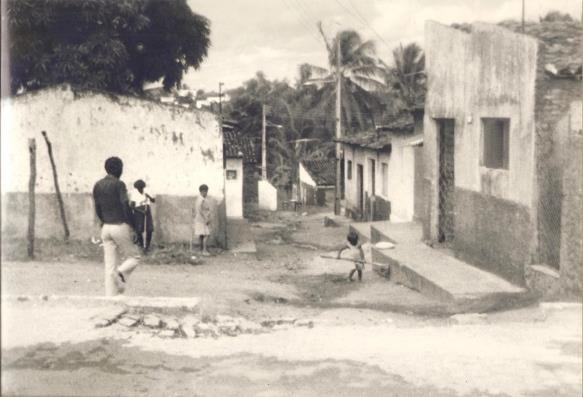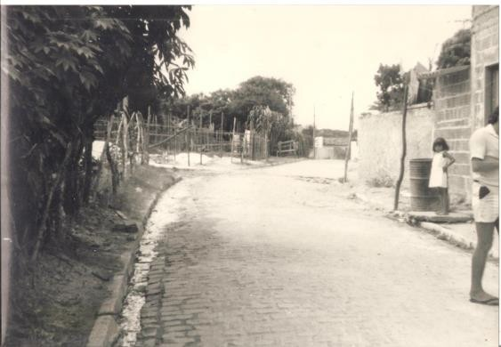O
bairro de Nova Descoberta insere-se nesse contexto, visto que compreende
uma área pouco povoada na década de 1940, quando então era denominada de
Coréia dos Índios, e somente tem sua ocupação efetivada mais
intensamente a partir da década de 1950, quando a capital recebe grandes
levas de migrantes fugindo da seca que atingiu o estado. O bairro foi
crescendo de forma desordenada, sem infraestrutura urbana, conforme
mostram as figuras 1 e 2.

> **Figuras 1 e 2** -- Aspectos do bairro de Nova Descoberta,
> aproximadamente na década de 1970. Fonte: Ary Gomes.

Atualmente, com o processo de expansão da capital potiguar, o bairro
ganhou novas localidades e conjuntos habitacionais, contando com 12.441
habitantes. Localizado na Região Administrativa Sul, encontra-se
inserido na realidade urbana de Natal, abrangendo áreas que se limitam
com os bairros de Tirol e Lagoa Nova ao norte, sul e oeste e com o
Parque das Dunas a leste.

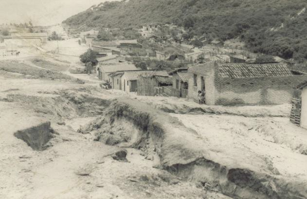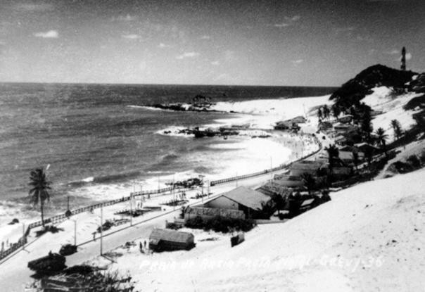O
bairro de Mãe Luiza, nascido no "seio da mata", na década de 1940,
também abrigou uma população que não possuía condições de morar nos
bairros estruturados da cidade, apesar de ocupar uma posição mais
próxima ao centro do que Nova Descoberta. Até a década de 1960 a
ocupação se deu informalmente, com a abertura de veredas sobre as dunas,
vindo a se expandir de fato a partir da década de 1960 (Figuras 3 e 4).

> **Figuras 3 e 4** -- Primeiros arruamentos de Mãe Luiza. Fonte: Acervo
> do Grupo de Estudos em Habitação Arquitetura e Urbanismo
> (GEHAU)-Universidade Federal do Rio Grande do Norte (UFRN).

Localizado na Região Administrativa Leste da cidade de Natal, atualmente
possui uma população de 16.676 habitantes em 95,69 ha de extensão e
possui uma trajetória de lutas e resistências pelo direito à moradia,
que culminaram na regulamentação do bairro como Zona Especial de
Interesse Social (ZEIS) em 1995. A figura 5 apresenta o processo de
evolução urbana de Mãe Luiza desde os anos de 1940 até o ano de

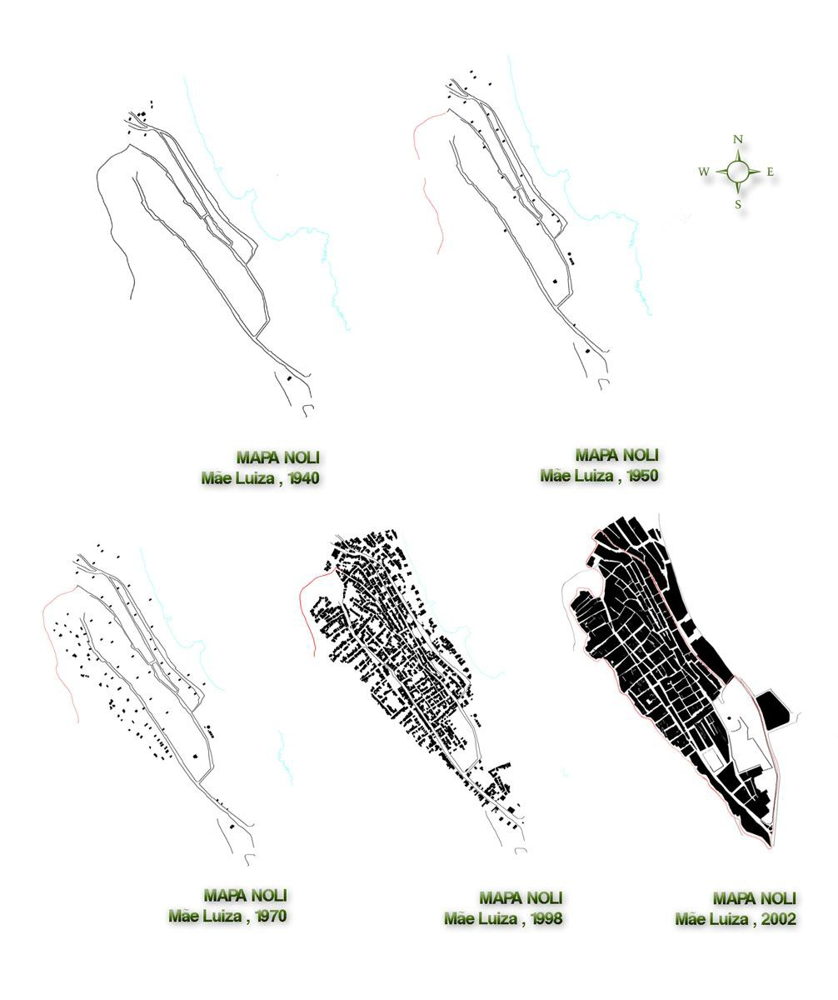2002, demonstrando a intensificação da
ocupação a partir dos anos de 1990.

> **Figura 5** -- Evolução urbana do bairro de Mãe Luiza de 1940 a 2002.
> Fonte: Acervo do Grupo de Estudos em Habitação Arquitetura e Urbanismo
> (GEHAU)-Universidade Federal do Rio Grande do Norte (UFRN).

# Nova Descoberta, Mãe Luiza e as Dunas

Os bairros de Nova Descoberta e Mãe Luiza situam-se, atualmente no
entorno do campo dunar que constitui o Parque das Dunas, sendo que o
bairro de Mãe Luiza está localizado ao norte do parque e mais próximo ao
oceano, e Nova Descoberta a oeste, sendo as dunas uma barreira a ser
transposta para o acesso dos moradores às praias (Figura 6).

Em Nova Descoberta, os primeiros assentamentos, a partir da década de
1940, passaram a ocupar uma área da cidade fora do sítio urbano
existente, sendo apontada por moradores locais como "*pé do morro*". A
expressão "*pé do morro*" anuncia que as dunas e todo o ecossistema
foram apropriados como elementos da identidade da comunidade, que criou,
cotidianamente, representações simbólicas a partir de observações e usos
do espaço. Sendo assim, o ecossistema presente nas dunas, incluindo a
vegetação e o relevo acidentado, passaram a representar a paisagem e
momentos de diferentes significados do bairro, como a hora do lazer, da
brincadeira e da aventura. (Figuras 7 e 8).

> 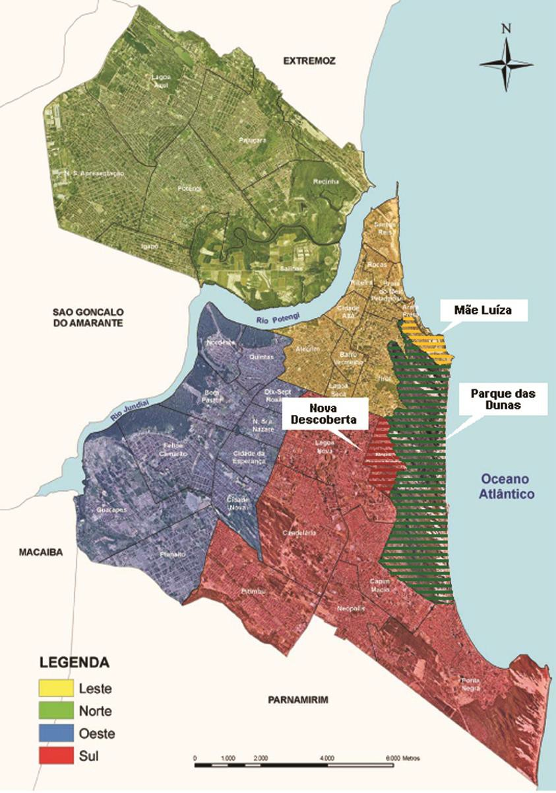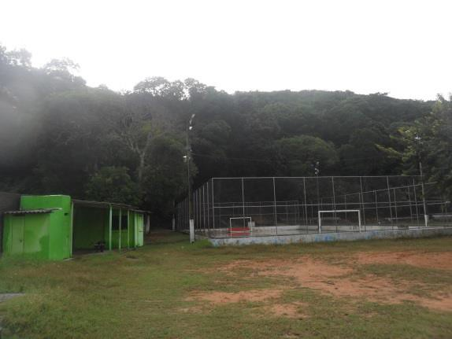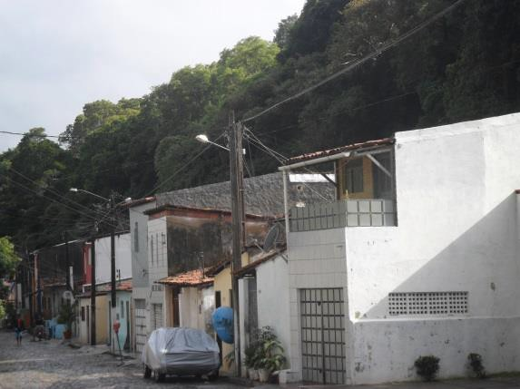**Figura
> 6** -- Regiões Administrativas de Natal e a localização dos bairros de
> Nova de Descoberta e Mãe Luiza em relação ao Parque das Dunas. Fonte:
> Modificado a partir de SEMURB, 2014.
>
> **Figuras 7 e 8** -- Aspectos do morro no bairro de Nova Descoberta.
> Fonte: Pesquisa de campo/Márcia Silva.
>
> Isso transparece nas trilhas abertas no morro, que se destinavam,
> entre outras coisas, à coleta de frutos comestíveis na vegetação, como
> combuim e massaranduba, ao uso de cipós para as brincadeiras, a
> retirada de lenha para fazer fogo, e como caminho para se chegar às
> praias. Isso acontecia principalmente em relação aos pescadores e
> jovens, que viam nas trilhas um caminho para as praias, então
> desertas, da atual Via Costeira. Segundo afirma um antigo morador:
> *"subíamos o morro para chegar à praia de Barreira D'água, que era
> deserta e tinha até fonte de água doce, iam crianças, adolescentes e
> até famílias\...".*

Em nossas observações *in loco* e conversas com moradores locais
detectamos a existência de trilhas na comunidade: uma denominada de
trilha do 7º BECON (Batalhão de Engenharia Combate) ou Caminho da
Romana, outra chamada pela comunidade de trilha do Agripinão ou,
conforme passou a denominar a administração do parque, Caminho da
Tocandira,; e outra localizada na localidade de Morro Branco. Estas
trilhas estão presentes em vários dos relatos da comunidade, pois sempre
fizeram parte do cotidiano local, levando pescadores, surfistas, jovens
e famílias à praia, principalmente aqueles de renda mais baixa que não
tinham condições de pagar o transporte até praias mais distantes.

> 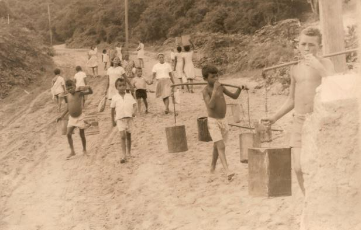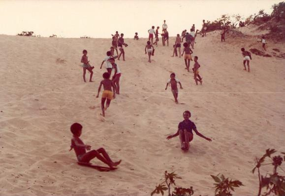Da
> mesma forma, em Mãe Luiza, desde os primeiros arruamentos na década de
> 1940 até os anos de 1970, a comunidade interagia com a mata e as dunas
> (Figuras 9 e 10), extraindo dela as condições essenciais para a sua
> sobrevivência, como contam antigos moradores: "*da mata vinha a lenha
> para cozinhar, madeira para construir, erva para curar, dunas de areia
> para brincar e altares nas dunas para celebrar. Principalmente,
> vivíamos sem cercas e muros."* (História oral. Roda de Conversa na
> casa de idosos. Espaço Solidário-abril, 2006)
>
> **Figuras 9 e 10** -- Interações da comunidade de Mãe Luiza com o
> local. Fonte: Acervo do Grupo de Estudos em Habitação Arquitetura e
> Urbanismo (GEHAU)-Universidade Federal do Rio Grande do Norte (UFRN).

Nesse sentido, entendemos que o 'morro' tem marcado o cotidiano das
comunidades, fazendo parte das representações que a população criou a
partir das necessidades de lazer, moradia e sobrevivência. Sendo assim,
símbolos importantes da comunidade, como o cemitério, moradias e campos
de futebol, estão localizados, como se afirmava anteriormente, ao 'pé do
morro'.

Diante do quadro em discussão, podemos afirmar que os bairros de Nova
Descoberta e Mãe Luiza tiveram seu desenvolvimento ligado às dunas que
circundam as comunidades, que se apropriou do 'morro' e produziu uma
dinâmica socioespacial que, cotidianamente, ajudou a fomentar uma
identidade e vida social própria.

# Nova Descoberta, Mãe Luiza e o projeto Via Costeira/Parque das Dunas

Se nos relatos dos antigos moradores dos bairros percebemos que a
expressão 'Morro' é utilizada para indicar a área de dunas, atualmente
essa nomenclatura está sendo substituída pela expressão 'Parque'.

O Parque Estadual Dunas de Natal foi criado pelo IDEMA - Instituto de
Desenvolvimento Sustentável e Meio Ambiente do Rio Grande do Norte
através do Decreto Estadual nº 7.237 de 22/11/1977, sendo a primeira
Unidade de Conservação implantada no estado. Possui 1.172 hectares de
mata nativa, sendo parte integrante da Reserva da Biosfera da Mata
Atlântica Brasileira. Localizada na porção leste da capital potiguar,
possui uma área de visitação denominada Bosque dos Namorados, onde estão
localizadas as entradas das trilhas interpretativas, exposições,
atividades de Ecolazer, Educação Ambiental e setores administrativos.

Segundo Cruz (2000, p. 81), o Projeto Parque das Dunas/Via Costeira,
situado entre as praias de Areia Preta e Ponta Negra esteve atrelado, na
década de 1970, à necessidade de criação no Rio Grande do Norte de uma
infraestrutura que promovesse o turismo, tendo como foco a formação de
infraestrutura hoteleira. Denominado pela autora de Megaprojeto, este
empreendimento tinha como principais objetivos (2000,

p\. 83): a proteção do sistema geológico e geomorfológico das dunas; a
contenção da ocupação desordenada da área; o impedimento do crescimento
da favela de Mãe Luiza e melhoria de suas condições de urbanização; o
aproveitamento do potencial turístico e de lazer da faixa litorânea;
além da instalação de uma rodovia circundante às praias, a Via Costeira.

Para a comunidade de Mãe Luiza, o Projeto inaugurou um novo momento na
relação dos moradores com as dunas e a praia. O parque foi criado, mas a
comunidade recebeu menor atenção por parte do poder público no que diz
respeito à implementação das propostas. A infraestrutura urbana do
bairro só foi implantada mediante sucessivas lutas das organizações
comunitárias locais, e o processo de valorização da área associado à
ausência de uma política fundiária gerou tensões entre as áreas
turísticas da Via Costeira, o Parque das Dunas e Mãe Luiza.

A partir da década de 1990, acentuaram-se os debates no bairro sobre as
condições de permanência da população, face aos processos de especulação
imobiliária nas áreas do entorno e sobre a questão ambiental, que levou
a comunidade a se mobilizar pela regulamentação do uso e ocupação do
solo, conquistando a aprovação da Lei nº 4.663/95. Protagonizada pelas
entidades comunitárias, apoiada na esfera técnica por profissionais da
Universidade Federal do Rio Grande do Norte, através do Grupo de Estudos
em Habitação, Arquitetura e Urbanismo (GEHAU) e pela gestão pública
municipal, Mãe Luzia foi reconhecida como Área Especial de Interesse
Social (AEIS) no Plano Diretor de Natal.

Nesse instrumento, a encosta dunar que abriga o Farol de Mãe Luiza e seu
entorno foi instituída como Área de Conservação, sendo confirmada no
Plano Diretor de Natal (NATAL, 2007), como Zona de Proteção Ambiental 10
(ZPA 10) ao lado Zona de Proteção Ambiental 2 (ZPA 2)/Parque das Dunas,
situando-se Mãe Luiza no interior de duas áreas protegidas.

Desta forma, o Parque das Dunas atualmente possui dois níveis de
proteção, no nível federal segundo o Sistema Nacional de Unidades de
Conservação (SNUC, 2010), como unidade de conservação da categoria
parque, e no Plano Diretor Municipal como Zona de Proteção Ambiental 2
(Figura 11).

> 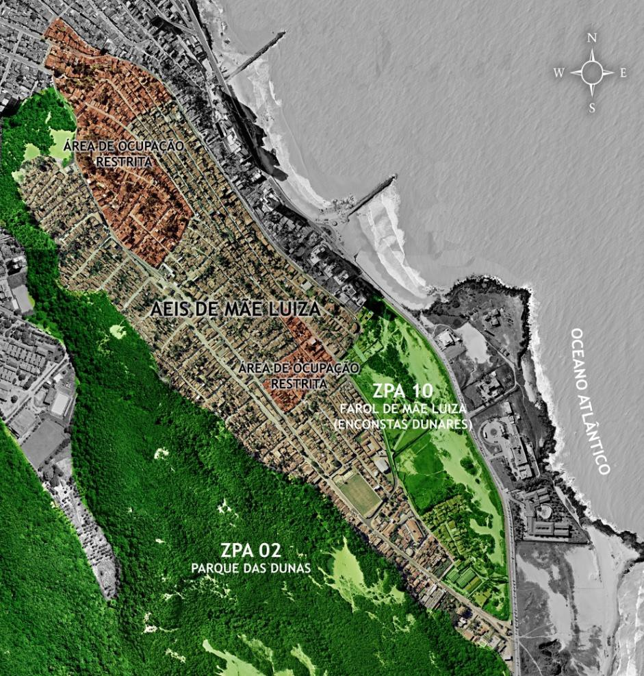**Figura 11** -- Regulamentação do
> bairro de Mãe Luiza -- Zoneamento. Fonte: Acervo do Grupo de Estudos
> em Habitação Arquitetura e Urbanismo (GEHAU)-Universidade Federal do
> Rio Grande do Norte (UFRN).

A salvaguarda do parque e encostas dunares desencadeou uma ruptura entre
comunidade e áreas protegidas, materializado pela construção de cercas e
muros. As apropriações indevidas na área do parque, com a derrubada das
cercas e avanço das construções ou a prática de pular os muros que
separam Mãe Luiza da ZPA 10 para acessar a praia, são práticas
correntes. Essas práticas cotidianas colocam em questão os direitos da
comunidade em usufruir dos espaços protegidos, que anteriormente
possuíam livre acesso, face às restrições colocadas pela gestão
ambiental (Figuras 12 e 13).

> 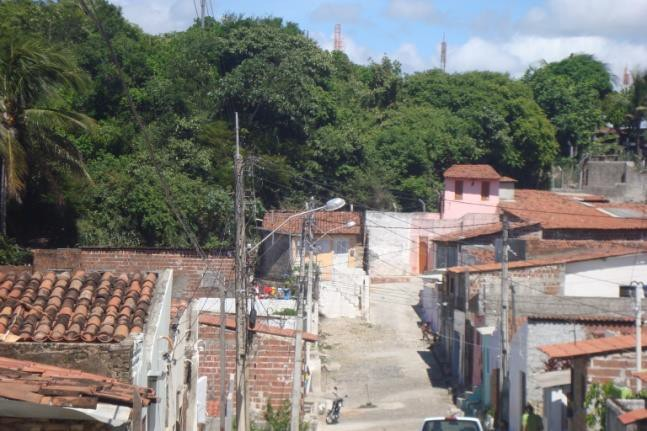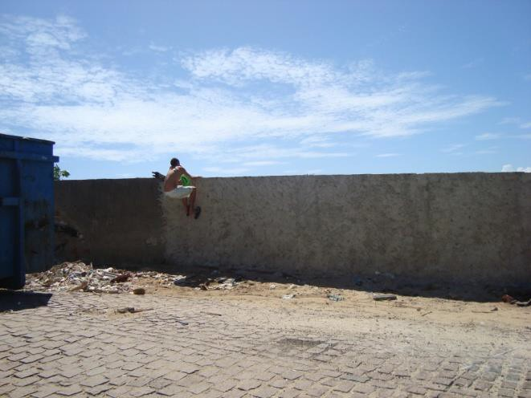**Figura
> 12** -- Relação das moradias com o Parque das Dunas. Fonte: GEHAU
>
> **Figura 13** -- Transposição dos muros para o acesso à praia. Fonte:
> GEHAU

No bairro de Nova Descoberta, a instalação do parque também foi marcada
pela chegada da cerca e pela imposição de que estava proibida a
circulação pela área. Tal fato é lembrado com muito pesar pelos
moradores, que se sentiram alienados de um referencial importante da
cotidianidade.

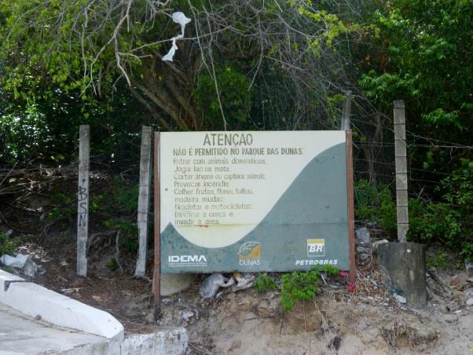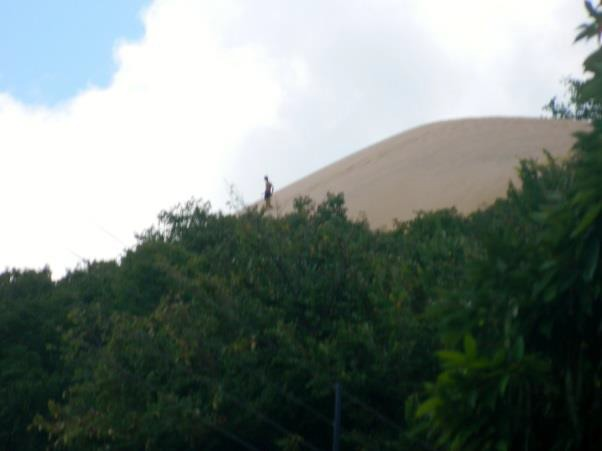A
instalação da cerca e das placas de orientação do parque passou a fazer
parte da comunidade, que por vezes as retirou como desagrado à situação.
Além disso, em muitos momentos, tais cercas e placas não conseguiram
restringir o acesso dos moradores que, resistindo à imposição,
continuaram a procurar o morro nas horas de lazer ou como caminho para a
praia, como mostram as figuras 14 e 15.

> **Figuras 14 e 15** -- Visão do Parque das Dunas em Nova Descoberta: o
> concebido e o vivido insurgente. Fonte: pesquisa de campo/Márcia
> Silva.

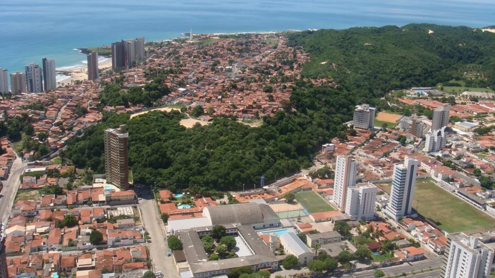Os dois bairros convivem atualmente
com conflitos e disputas nas questões ambientais e sociais, entre
apropriações e dominações, entre a ocupação e as áreas protegidas e os
avanços do mercado imobiliário (Figura 16).

> **Figura 16** -- Visão aérea do bairro de Mãe Luiza demonstra a
> relação com o Parque das Dunas e a produção imobiliária do entorno.
> Fonte: GEHAU.

Refletindo sobre a criação do parque podemos perceber que as decisões
políticas e ecológicas que levaram à sua implementação partem da crença
de que, sendo o homem um destruidor da natureza, é preciso isolá-la e
protegê-la de sua ação predatória. Concepção esta analisada por Diegues
(1998, p. 53) quando aponta para o "Mito da Natureza Intocada",
explicando que tais ideias têm origem na concepção dos 'parques
nacionais' norte-americanos no século XIX.

O autor chama atenção para as populações tradicionais que vivem em áreas
de preservação, e de como essa concepção vai de encontro às
representações que tais grupos possuem da natureza, havendo conflitos
entre a concepção preservacionista e a visão dessas populações, que veem
na natureza também sua fonte de sobrevivência. O ápice do conflito se
apresenta quando tais populações são 'expulsas' das áreas de preservação
ou quando são ignoradas nos planos de manejo dos parques.

> Tais premissas apontam para um difícil diálogo entre áreas de
> preservação e comunidades locais, o que remete ao entrelaçamento entre
> o Parque das Dunas e as comunidades de Nova Descoberta e Mãe Luiza. A
> população local construiu cotidianamente representações em relação às
> dunas, mas, segundo expressam alguns moradores em relatos sobre a
> criação do parque, vivenciaram o processo como meros expectadores. Daí
> então a negação do seu direito de ir e vir no morro, o que fica claro
> quando um membro da comunidade diz: "*ninguém chegou pra explicar
> nada, colocaram a cerca e pronto\... e o parque tirou a liberdade da
> gente, tirou o direito de usar o morro*\...".

Tentando alcançar melhor visão desses conflitos, realizamos entrevistas
com administradores do Parque das Dunas acerca das relações com a
população das comunidades em estudo. Fomos informados que as trilhas
presentes em Nova Descoberta e Mãe Luiza são denominadas de trilhas
sociais e não interpretativas, como aquelas de uso público do parque.

Tomamos conhecimento que a partir da reabertura do Bosque dos Namorados,
em 1997, foram organizadas atividades de Educação Ambiental nas
comunidades do entorno do parque, sendo criado em 1999 um Cadastro de
Andarilhos dos antigos caminhos. Seu objetivo principal foi realizar um
trabalho de fiscalização dos usuários das trilhas, sob a
responsabilidade da Polícia Ambiental. Todavia, tal cadastro não passou
por uma atualização e não tem sido utilizado pela Polícia Ambiental em
sua fiscalização, o que justifica relatos de alguns moradores que temem
a ação dos policiais no uso das trilhas.

# Considerações Finais

As reflexões evidenciaram como historicamente o campo dunar que circunda
os bairros de Nova Descoberta e Mãe Luiza fez parte do cotidiano local e
como, a partir da criação do Parque das Dunas, o 'Morro' passa a ser o
'Parque', alienando a comunidade do direito de ir e vir pelas dunas. A
partir deste fato apenas um cadastro da unidade de conservação poderia
permitir ao morador usar antigos caminhos nas dunas, outrora a única
alternativa para o lazer nas dunas e no mar.

Nesse contexto, nossa hipótese inicial está confirmada, pois enquanto há
evidências concretas de que as dunas foram apropriadas pelas comunidades
como representações e vivências cotidianas, com a criação do Parque das
Dunas, as comunidades perderam o acesso em função das normas de
funcionamento da área protegida, perdendo seu cotidiano um importante
símbolo da identidade local.

Por outro lado, não podemos afirmar que a administração do parque apenas
impôs o cercamento das dunas, pois, se num momento inicial isso ocorreu,
posteriormente houve tentativas de diálogo com a comunidade, demonstrado
em documentos e relatos. O problema é que tais tentativas de diálogo
foram realizadas tardiamente e não tiveram continuidade, dificultando o
amadurecimento de um processo de conscientização da população local em
relação aos objetivos de preservação da área.

Diegues (1998) ao discutir essas questões ressalta o fato de como o
"Mito da Natureza Intocada" orienta a criação das unidades de
conservação em nosso país. Neste trabalho constatamos que, embora esse
mito possa ter influenciado a concepção do

parque, sua proposta de manejo adotou procedimentos que levaram a
abertura no diálogo com as comunidades.

Estas propostas, apesar dos resultados modestos em termos de
conscientização da importância do parque, são interessantes enquanto
possibilidade de diálogo. O lado negativo é que não houve continuidade
no trabalho, agravando a dificuldade de interação entre os bairros e a
área de preservação, provocando o distanciamento da população através de
uma prática impositiva.

Ressaltamos que a discussão aponta para o que Lefebvre denomina de ordem
próxima e distante como elementos importantes na compreensão do espaço
vivido e concebido. A relação dos bairros com as dunas, antes e depois
do parque, demonstra a intensidade do espaço vivido enquanto instância
do cotidiano onde estão expressas representações e símbolos. Portanto,
nessa dinâmica, estão imbuídos desejos e necessidades cotidianas da vida
social, que se refletem na forma como as dunas foram apropriadas como
elementos da identidade local.

Por outro lado, com o cercamento do 'morro' ditames de uma ordem
distante aparecem como elemento de um espaço concebido, produzido
através das regras para um novo cotidiano. Todavia, as insurgências
afloraram e os antigos caminhos continuam a levar moradores até a praia,
no caso de Nova Descoberta, ou passou a ocorrer à invasão das dunas, no
caso de Mãe Luiza.

Evidenciamos a importância do parque enquanto área de preservação por
seus atributos ambientais, mas entendemos que as regras de funcionamento
colocadas pela gestão ambiental através de seu plano de manejo, não
podem apenas ser impostas às comunidades tradicionalmente ligadas às
dunas, mas precisam ser entendidas e aceitas num processo de
conscientização.

Desta forma, as populações de comunidades, como de Nova Descoberta e Mãe
Luiza, não podem ser tratadas como personagens 'invisíveis', mas como
agentes sociais concretos, que precisam ter voz nas decisões sobre os
caminhos que a cidade tem a percorrer.

# Referências Bibliográficas

BRASIL. Congresso Nacional. **Lei Federal nº 9.985, de 18 de julho de
2000.** Regulamenta o artigo 225, § 1º, incisos I, II, III e VII da
Constituição Federal, institui o Sistema Nacional de Unidades de
Conservação e dá outras providências. Brasília, 2000.

> CARLOS, A. F. A. **A Condição Espacial**. São Paulo: Contexto, 2011.
>
> CRUZ, R. de C. **Políticas de Turismo e Território.** São Paulo:
> Contexto, 2000. DIEGUES, A. C. **O Mito da Natureza Intocada.** 2 ed.
> São Paulo: Hucitec, 1998.
>
> LEFEBVRE, H. **La production de l'espace**. 4e éd. Paris: Éditions
> Anthropos, 1974**. (**Tradução de Doralice Barros Pereira e Sérgio
> Martins).
>
> . **Espaço e Política**. Espaço e Política. Belo Horizonte: Editora
> UFMG, 2008.
>
> NASCIMENTO, J. C. do. **(Re)Descobriram o Ceará? Representações dos
> sítios históricos de Icó e Sobral: entre areal e patrimônio
> nacional**. Salvador: EDUFBA:

PPGAU; Florianópolis: ANPUR, 2011.

> NATAL. Câmara Municipal. **Lei Complementar nº 082, de 21 de junho de
> 2007.**

Dispõe sobre o Plano Diretor de Natal e dá outras providências. Natal,
2007

RN -- Estado do Rio Grande do Norte. IDEMA -- Instituto de
Desenvolvimento Econômico e Meio Ambiente. **Parque das Dunas de Natal**
Jornalista Luiz Maria Alves. Disponível em:
[[http://www.parquedasdunas.rn.gov.br/]{.ul}](http://www.parquedasdunas.rn.gov.br/).
Acesso em: 10 Maio 2012.

NATAL. Prefeitura Municipal do Natal. Secretaria Municipal de Meio
Ambiente e Urbanismo - SEMURB. Disponíve[l em:
https://www.natal.rn](http://www.natal.rn.gov.br/semurb).[gov.br/semurb](http://www.natal.rn.gov.br/semurb)
