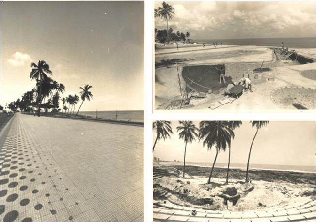

# Resumo

Esta pesquisa procura discutir sobre as relações entre as intervenções
urbanas de frentes marítimas e o processo de ocupação de suas áreas
contíguas. Procuramos demonstrar como as intervenções urbanas no espaço
público podem alavancar a ocupação de territórios específicos,
configurando-lhe novos significados e modificando sua paisagem. Como
objeto de estudo, selecionamos a Av. Beira Mar, em Fortaleza-CE, e o
bairro do Meireles. A ocupação deste bairro intensificou-se a partir da
década de 1960, período em que houve também a abertura da avenida
litorânea. Desde então, destacamos duas intervenções significativas já
realizadas na orla, e aquela que está em execução, o Projeto de
Reordenamento da Avenida Beira Mar -- Fortaleza - Ceará, selecionado via
concurso público no ano de 2010. Aportaremos às profundas transformações
na ocupação do bairro, hoje bastante adensado e verticalizado. Por fim,
propomos uma reflexão crítica acerca das possíveis implicações
socioespaciais do referido projeto para o bairro e também para a cidade
de Fortaleza.

Palavras-chave: Frentes Marítimas, Intervenções Urbanas, Espaço público,
Ocupação, Verticalização

> **Introdução**

As faixas litorâneas nas cidades brasileiras têm sido alvo de projetos
urbanos de revitalização, reordenamento ou requalificação, de caráter
paisagístico e de lazer, nos últimos anos. Em muitos desses grandes
centros, a transformação da orla e de suas áreas contíguas está inserida
num processo de valorização, favorecida pela proximidade do mar e a
possibilidade de obter vistas do mesmo, além do acesso aos serviços e
equipamentos constituídos nesses projetos. (MACEDO, 2012)

No contexto da cidade contemporânea, projetos urbanos em frentes
marítimas (áreas portuárias, áreas centrais degradadas ou obsoletas ou
até mesmo áreas já consolidadas) têm sido considerados pelos setores
público e privado como meios de alcançar uma maior dinâmica na economia
mundial. A "frente marítima", de alguns centros urbanos (a exemplo do
Rio de Janeiro e Fortaleza), configura-se como a "fachada" da cidade e,
portanto, os projetos que a envolvem são considerados como
"oportunidades" nessa condição.

No entanto, a melhoria da qualidade de vida da população local nem
sempre é alcançada por esses projetos, que se mostram insuficientes para
resolver questões complexas e acabam por privilegiar setores sociais
específicos, ao intensificar a valorização imobiliária, a mudança de
usos, a perda do patrimônio edificado (memória), a segregação
socioespacial, etc.

Destarte, este artigo pretende apresentar um resultado parcial de uma
pesquisa de

doutoramento cuja temática abrange os projetos de urbanização de frentes
marítimas e as dinâmicas de ocupação das áreas de intervenção e
contiguidades. Entendemos, assim, que os projetos de urbanização podem
alavancar a ocupação de territórios específicos e vinculados às áreas de
intervenção. Ressaltamos, entretanto, a disponibilidade de outros
instrumentos urbanísticos que corroboram para intensificar processos já
configurados, como a verticalização ou a especulação imobiliária.

Escolhemos, para efeito de análise preliminar e discussão, as
intervenções na Avenida Beira Mar, na cidade de Fortaleza - CE e suas
relações com a ocupação da orla e do bairro Meireles (figura 1). Tanto a
orla como o referido bairro modificaram bruscamente suas estruturas
urbanas em um curto período de aproximadamente trinta anos, considerando
o intercurso de 1979 a 2010.

> 
>
> Figura 1. Foto aérea, com a demarcação da faixa da Av. Beira Mar, em
> vermelho e da área correspondente ao bairro Meireles, em amarelo.
> Fonte: googleearth, modificado pela autora.

Na primeira parte, realizamos um breve percurso histórico, a fim de
contextualizar as primeiras intervenções urbanas significativas da orla
e suas relações com a ocupação do território que corresponde ao bairro
Meireles.

Posteriormente, enfocaremos no projeto vencedor do concurso (2010) para
o Plano de Reordenamento Geral e Projetos Arquitetônicos, Urbanísticos e
Paisagísticos da Avenida Beira-Mar, com reflexões críticas acerca das
perspectivas futuras e implicações na ocupação do bairro Meireles,
considerando as abordagens contemporâneas.

Como etapas metodológicas, além da pesquisa bibliográfica, foram
realizadas entrevistas com o arquiteto vencedor do concurso e técnicos
da Prefeitura de Fortaleza, além de moradores do bairro Meireles. Como
estratégia metodológica, recorremos ao Estudo de Caso que, segundo Yin
(2001), adéqua-se a compreensão de processos que envolvem eventos
distintos.

# Antecedentes: A valorização da praia na evolução urbana de Fortaleza

Até o início do século XX, as áreas de praia de Fortaleza apresentavam
específicos interesses de grupos restritos. De um lado, o interesse
comercial, ligado à função

portuária, da Alfândega e entrepostos; de outro, a importância para as
comunidades pesqueiras, que moravam na praia do Meireles e do Mucuripe,
por exemplo. Portanto, a ocupação da orla e de suas áreas contíguas era
rarefeita. A ocupação residencial da orla acontecia informalmente, e
pelas classes pobres da cidade. (Garcia, 2010)

Entretanto, na década de 1920 iniciou-se um movimento de urbanização na
Beira-mar de Fortaleza e suas demais praias, a começar na Praia de
Iracema. Essa área, atraindo a atenção dos mais ricos, passou a ser
ocupada por residências de veraneio e sedes de clubes. Dessa época até
os anos 1940, quando da construção do Porto do Mucuripe, a Praia de
Iracema havia se consolidado como local de lazer e sociabilidade. A
construção do Porto, segundo Freitas (2005), alterou o curso das águas
do mar, provocando o avanço das marés e um processo erosivo.
Posteriormente, a praia do Meireles (a leste) passou a mostrar-se
interessante para as classes de renda mais alta, consequentemente
expulsando os antigos moradores. (Garcia, 2010)

Freitas (2005) relata sobre a implantação de sedes dos clubes sociais de
maior projeção, entre os anos 1940 e 1960. A introdução do automóvel é
considerada fator determinante, pois possibilitou a localização destes
redutos de lazer da elite em paragens mais distantes do perímetro
central. No bairro do Meireles, ergueram-se inicialmente as residências
de alto padrão e as chácaras, como novas formas de ocupação.

# Primeiras intervenções (1963-1979): A abertura da Avenida Beira Mar e o Calçadão

A abertura da Avenida Beira Mar foi realizada em 1963, prevista pelo
Plano de Helio Modesto (1963), e objetivava ligar o Mucuripe ao centro
urbano. Freitas (2005) afirma que essa construção intensificou a
ocupação da área, onde se inicia um processo de urbanização que
culminaria com o a realização da obra do calçadão, em 1979.

> 
>
> Figura 2. Detalhes do calçadão da Av. Beira Mar, implantado no final
> da década de 1970. Fonte: acervo de Gentil Barreira.

Esse projeto -- a Urbanização da Beira Mar -- era sugerido pelo Plano
Diretor Integrado da Região Metropolitana de Fortaleza de 1972
(PLANDIRF). Implantado

apenas parcialmente (figura 2), constava da construção do calçadão,
quadras de esporte, anfiteatro, barracas de praia, pistas de skate, etc.

# O bairro Meireles (1972-1979): intensificação da ocupação e verticalização

Destacamos que, quando a Avenida Beira Mar já havia sido aberta, o já
mencionado PLANDIRF de 1972 instituiu, para o bairro Meireles, a
classificação como R1 (Zona Litorânea R1), uma zona predominantemente
residencial de renda média entre as zonas de praias e as zonas de
adensamento R2. A verticalização do uso residencial era permitida,
contanto que se garantissem condições dos modelos de ocupação das zonas
das praias. Surgiram, no bairro do Meireles, novas modalidades
residenciais, como os edifícios multifamiliares de até 5 pavimentos.

A partir da lei 5122-A do Plano Diretor Físico de Fortaleza, em 1979,
verifica-se uma considerável modificação na maneira de distribuição das
zonas residenciais da cidade. A classificação e divisão das zonas pela
renda (atribuição dos planos anteriores) foi substituída pelo critério
de adensamento. Surgiram assim, as ZR1 (Zona Residencial 1), as ZR2
(Zona Residencial 2) e as ZR3 (Zona Residencial 3). Essa lei favoreceu a
especulação imobiliária, na medida em que transformou as antigas R-1 e
R-2, zonas de baixa e média densidade, que permitiam prédios de até três
pavimentos, em ZR3, zona de alta densidade, que permitia a construção de
edifícios residenciais até 72m de altura, como o bairro Meireles.
(MUNIZ, 2006)

A partir da efetivação do Plano Diretor de Desenvolvimento Urbano do
Município de Fortaleza de 1992 (PDDU-FOR), o bairro do Meireles passou
classificado como ZU2 (Zona Urbanizada 2). Foi por meio desse plano que
houve a iniciativa de implementar instrumentos de ordenamento
territorial, como a outorga onerosa e as operações urbanas consorciadas,
a regularização fundiária, etc. Entretanto, como afirma Muniz (2006),
não foram criados instrumentos nem diretrizes para o planejamento das
ocorrências futuras, como a expansão para a zona leste e a expansão do
turismo.

Podemos então afirmar que a ocupação tanto da Av. Beira Mar como do
bairro Meireles foi marcada pela priorização da valorização de grandes
imóveis e pela estratificação social. Além disso, ressaltamos
transformações bruscas nas formas de ocupação, resultado da ação
conjunta de diversos fatores, entre eles os projetos de urbanização, e
instrumentos urbanísticos como a lei de uso de ocupação do solo e o
zoneamento.

O bairro Meireles é classificado pelo Plano Diretor Participativo de
Fortaleza (2009) como ZOC (Zona de Ocupação Consolidada). Para essa
área, a altura máxima do gabarito é de 72 metros e podem ser aplicados
os seguintes instrumentos, segundo o artigo 90 (PMF, 2009): I -
parcelamento, edificação e utilização compulsórios; II - IPTU
progressivo no tempo; III - desapropriação mediante pagamento por
títulos da dívida pública; IV - direito de preempção; V - direito de
superfície; VI - outorga onerosa do direito de construir; VII -
transferência do direito de construir; VIII - consórcio imobiliário; IX
- estudo de impacto de vizinhança (EIV); X- estudo ambiental (EA); XI -
Zona Especial de Interesse Social (ZEIS); XII - instrumentos de
regularização fundiária; XIII - outorga onerosa de alteração de uso.

Assim, o bairro Meireles se consolidou, desde a década de 1970 como
bairro de elites, inicialmente, com a proliferação da construção de
residências unifamiliares e multifamiliares e, atualmente, com o
predomínio de condomínios residenciais

verticais de alta renda. Assim como outros bairros da cidade, como a
Aldeota, esse bairro é hoje detentor de condições privilegiadas de
infraestrutura, comércio e serviços diversificados. Configura-se como
nova centralidade de Fortaleza (figura 3).

> 
>
> Figura 3. Verticalização no bairro Meireles. Vista do bairro a partir
> do Clube Náutico, um dos mais antigos da cidade de Fortaleza. Fonte:
> [[http://www.city-data.com/forum/americas/1722368-brazilian-cities-high-rises]{.ul}](http://www.city-data.com/forum/americas/1722368-brazilian-cities-high-rises)

Próximo à faixa de praia, tem sido apropriado para fins turísticos, com
empreendimentos residenciais compactos, flats e hotelaria moderna. Está,
atualmente, entre as áreas com o metro quadrado mais valorizado na
cidade. (RUFINO, 2012)

# O significado da Av. Beira Mar e sua relação com o bairro Meireles

A "Beira-mar", como popularmente se chama a faixa que abrange a orla do
Meireles e parte do Mucuripe, configura-se por uma paisagem
verticalizada (figura 4), a exemplo da barreira física formada pelos
edifícios residenciais e hoteleiros e pelo calçadão, atualmente o
principal espaço livre público e de lazer ativo, referência para a
população da cidade e principalmente, para os moradores do bairro
Meireles. Neste bairro, uma das estratégias de venda de imóveis
altamente valorizados é ainda o discurso da proximidade da orla e de
serviços.

> 
>
> Figura 4: Avenida Beira-Mar, processo de verticalização e seu
> calçadão. Fonte:
> [[http://www.viaje.com.br/ceara/fortaleza/renda-se-aos-encantos-das-famosas-praias-de-fortaleza]{.ul}](http://www.viaje.com.br/ceara/fortaleza/renda-se-aos-encantos-das-famosas-praias-de-fortaleza)

Embora sendo um local privilegiado da população de mais alta renda,
abriga grandes eventos culturais de promoção pública. Dotado de variados
serviços, é utilizado por

diferentes grupos sociais que se encontram, passeiam, andam de
bicicleta, tomam sorvete, compram e vendem peixe, tomam banho de mar,
etc. É um espaço de forte apelo turístico, mas utilizada também pela
população de outros bairros.

Apresenta, atualmente, vários problemas locais como o uso privado do
espaço público (barracas de praia, vendedores ambulantes) e
insuficiência de áreas de estacionamento. Somam-se a isso os problemas
que já causam impactos nas outras áreas da cidade, como a falta de
conectividade, a intensa valorização imobiliária, a violência urbana
decorrente da segregação espacial e da fragmentação de seu projeto no
contexto urbano, etc.

# O Plano de Reordenamento Geral e Projetos Arquitetônicos, Urbanísticos e Paisagísticos da Avenida Beira-Mar, no Município de Fortaleza-CE

O concurso nacional de ideias, lançado pela Secretaria de Turismo de
Fortaleza (SETFOR) em 2009 e coordenado pelo Instituto de Arquitetos do
Brasil, previu a seleção dos melhores trabalhos apresentados para o
Reordenamento Geral e Projetos Arquitetônicos, Urbanísticos e
Paisagísticos da Avenida Beira-mar em Fortaleza. A faixa determinada de
intervenção corresponde a 3.050 metros da Av. Beira Mar, do Mercado dos
Peixes até a Av. Rui Barbosa, no sentido leste-oeste. O custo de
execução das obras de reordenamento ficou estimado em R\$30.000.000,00
(trinta milhões de reais), excluindo-se deste valor o projeto de
contenção da erosão marinha.

Segundo o termo de referencia do projeto, é objetivo do projeto

> a reestruturação urbana do local, promovendo a requalificação do
> ambiente natural, reformulação dos passeios e ordenamento da ocupação
> no local, além da execução do projeto de contenção da erosão marinha
> previsto para o local. (PMF, 2009)

Considerada uma área que demonstra conflitos de usos e interesses, a
Avenida Beira- mar é marcada atualmente por uma crescente utilização
para prestação de serviços (casas de cambio, venda de passeios
turísticos, venda de peixes, venda de artesanato, restaurantes e
barracas de praia) e pela falta de ordenamento dos usos. Outra
problemática verificada é a erosão provocada pelo porto do Mucuripe.

> 
>
> Figura 3: Pormenores do projeto do "Parque Av. Beira-mar", de autoria
> dos arquitetos Ricardo Muratori e Fausto Nilo. Vias de pedestre
> (esquerda superior), quiosques multifuncionais (direita superior),
> hierarquização das vias e espaço para feira de artesanatos (esquerda
> inferior), novo Mercado dos Peixes (direita inferior).
>
> Fonte: material cedido pelos autores do projeto.

No caso da Avenida Beira Mar, o projeto vencedor, de autoria dos
arquitetos Ricardo Muratori e Fausto Nilo, prioriza a reforma dos
espaços lineares dedicados aos movimentos de pessoas e veículos,
relacionando velhos e novos focos de convergência, hierarquizados por
"polaridades" ou projetos-chaves. Entre esses, destacamos, conforme o
Marco Conceitual (2009) elaborado pelos autores:

-   Vias de circulação hierarquizadas: vias de pedestres, ciclovias,
    faixas de tráfego calmo de veículos, faixa de areia. E ainda, o
    bonde elétrico, a ser "resgatado" pelo projeto, e servir como
    conexão futura entre a orla leste e a orla do centro da cidade. Vale
    ressaltar que essa é uma sugestão do projeto, não tendo sido
    prevista nos requisitos do concurso;

```{=html}
<!-- -->
```
-   Áreas de recreação e esporte: Conjunto integrado de *playgrounds,*
    áreas dedicadas a esporte na areia, do lado da praia (figura 5);

-   Áreas de serviços gastronômicos e culturais: quiosques de serviços
    ao público, Pavilhões de múltiplos usos, Pavilhões da feirinha de
    artesanato, *piazzetas* de comida e bebida, "anfiteatro" com
    camarins e *skate park,* novo mercado de peixes (figura 5);

-   Áreas de contemplação: "morros mirantes", como pontos de encontro e
    permanência tranquila e contemplativa do por do sol, bosques a
    partir de regeneração de área e remoção de intrusões ambientais,
    "largo da Iracema", como lugar tranquilo

-   Áreas de passeio: espigão do lado leste, apoiado por rampa de acesso
    ao ancoradouro de escunas de passeio; espigão oeste, como um jardim
    linear de esculturas, Passarelas e trapiches para passeio e pesca;

Áreas de estacionamentos: estacionamentos insulares de padrão verde, em
unidades de 80 vagas, distribuídos de forma equidistante dos principais
destinos, zona dos estacionamentos de barcos, das oficinas de manutenção
das embarcações.

# Perspectivas futuras a partir do plano de reordenamento

Ao considerar o plano de reordenamento da Avenida Beira-mar, projeto em
execução, podemos refletir sobre prováveis efeitos deste plano na
ocupação do bairro Meireles e da própria orla.

Entre esses efeitos, apontamos o incremento da visitação e uso do espaço
público por turistas, visitantes e residentes das áreas próximas, a
intensificação da valorização imobiliária, bem como do congestionamento
do trânsito, e a insuficiência de estacionamentos como já assumido no
próprio projeto.

No futuro próximo, o êxito do projeto deverá alterar os valores
imobiliários e haverá incremento de interesse dos incorporadores em
investir em sua área de influência. Desta forma, um plano mestre
apropriado indicará que os excessos de automóveis deverão ser acomodados
em situações adequadas, fora da *promenade.* Ou seja, no interior do
próprio tecido urbano construído na vizinhança e por iniciativa do poder
privado. (MURATORI e NILO, 2009; p.2)

O projeto sugere a conversão dos impactos no tecido urbano antigo em
oportunidades a serem aproveitadas pelo poder municipal, por meio de
políticas públicas, para estimular o surgimento de usos mistos no tecido
urbano próximo, com inclusão de vagas a serem disponibilizadas aos
frequentadores do destino gastronômico, como "hubs de mobilidade
urbana", que segundo os autores, pressupõem "usos comerciais e de
estacionamentos, com conforto para apoiar a chegada e a partida de
pessoas, por vários modos de transporte: a pé, de bicicleta, de
automóveis de transporte público local ou transporte público urbano"
(MURATORI & NILO, 2009).

Especulam-se, enfim, oportunidades novas de negócios imobiliários e
comerciais decorrentes desse investimento público. No estudo de
viabilidade econômica proposto, são listados alguns instrumentos para
viabilizar o projeto, como financiamento (por bancos como Banco
Interamericano de Desenvolvimento), arrecadação de impostos (IPTU, ISS,
ITBI), ICMS ecológico, operações urbanas e parcerias público-privadas
para implantação do bonde, por exemplo.

No que tange à previsão constante no *memorandum* do projeto, destacamos
algumas iniciativas lançadas em 2013, após o início da execução do
projeto, como o Consórcio Novo Náutico, uma intervenção num edifício
tombado, o Clube Náutico, um dos mais antigos clubes de Fortaleza, com a
previsão de reforma de sua estrutura e construção de torres comerciais,
*shopping center* e hotel. Essa ação provocou polêmicas e uma suspensão
por decisão liminar, de acordo com matéria do Jornal o Povo
(13/11/2013).

Esse aspecto demonstra a vulnerabilidade a que a ocupação da bairro está
sujeita, o que interfere na preservação de sua memória, por exemplo. É
possível que os novos investimentos em espaços públicos, a exemplo do
novo projeto da Av. Beira-mar, em execução, intensifiquem a condição
acima, além de provocarem novas situações como problemas de
conectividade e mobilidade urbana.

Quanto à conectividade urbana, uma vez que esse projeto atrairá um
contingente populacional de diferentes áreas da cidade, os autores
demonstram a vantagem de se consolidar gradativamente um futuro corredor
da orla com, no mínimo, três polos estruturadores: Centro, Praia de
Iracema e Beira-mar. Esse corredor poderá ser consolidado com a efetiva
implementação da linha litorânea do metrô, prevista até 2024. Vale
destacar também a linha Mucuripe (VLT), que até 2014, fará ligação do
Porto do Mucuripe até a Parangaba, com vistas a interligar a rede
hoteleira da Av. Beira-mar aos equipamentos da Copa 2014.

Projetos urbanos de frentes marítimas, que apresentam-se atraentes
internacionalmente, a exemplo do Reordenamento da Av. Beira Mar ("o
cartão postal da cidade"), têm sido alvo das políticas públicas como
meios de alcançar, mesmo que contraditoriamente, um lugar na dinâmica da
economia mundial. Ora, os efeitos previstos pelo projeto não garantem a
implementação das propostas sugeridas para conectividade e mobilidade
urbanas. Novamente, a exemplo de outros projetos pontuais no Brasil de
intervenções em espaços livres, corre-se o risco de intensificar os
problemas já existentes nas áreas contíguas.

No caso do bairro do Meireles e de outros bairros de influência direta,
já bastante verticalizados e densos, se não forem implementadas medidas
para mobilidade e conectividade (viabilizadas por parcerias público
privadas), as novas construções de uso misto, por exemplo, não serão
viáveis. Enfim, as intervenções urbanas não são suficientes para
resolver problemas muito mais complexos, que exigem do poder público a
implementação de um plano estratégico de maior amplitude, considerando
as áreas de influência e prazos.

# Outros possíveis efeitos do projeto no bairro Meireles

Como já explicitado, em pouco mais de trinta anos, uma área de dunas,
inicialmente ocupada de forma rarefeita por comunidades pesqueiras, e
depois por chácaras e residências unifamiliares de mais alto padrão,
transformou-se num bairro bastante adensado e verticalizado,
concentrando funções residências, comerciais, e outros equipamentos como
shoppings e a população de mais alta renda da cidade. Entretanto,
configura-se como espaço heterogêneo, lugar de trabalho de moradores de
outros bairros, lugar de passagem da população que intercala-se entre o
centro e a área leste da cidade.

Configura-se, ainda, como espaço de segregação socioespacial ao
comportar uma comunidade antiga, de mais baixa renda, em território de
ocupação irregular, como a Comunidade do Campo do América, envolvida por
edifícios residenciais de alta renda. Investimentos privados foram
viabilizados, entre outros motivos, pela mudança na legislação e pela
aplicação de instrumentos urbanísticos disponíveis. Entretanto, na
intensa substituição de tecidos urbanos antigos por novos, essa área do
Campo do América permaneceu praticamente inalterada.

Por um lado, esse fato representa a preservação de uma área do tecido
urbano do bairro. Ressaltamos que grande parte dos exemplares
residenciais (unifamiliares e multifamiliares de baixa densidade) do
Meireles já foram demolidos ou encontram-se ameaçados de demolição, por
estarem localizados nessa "área nobre", em terrenos avantajados, e
sofrerem a pressão e valorização do mercado imobiliário com vistas à
rentabilidade. A demolição sem o devido registro representa uma perda
física (patrimônio edificado) e relacionada à memória do bairro.

Por outro, expressa para onde tem sido direcionadas as melhorias urbanas
do bairro, para as áreas de interesse da especulação imobiliária.
Criticamos, portanto, que instrumentos disponíveis poderiam ser
aplicados para requalificação da comunidade do Campo do América.

# Considerações finais

Pretendemos, com esse artigo, apresentar preliminarmente uma pesquisa
que procura compreender as relações entre os projetos de urbanização de
orlas marítimas e a ocupação das áreas contíguas, a exemplo dos projetos
que envolvem a Av. Beira Mar de Fortaleza e o bairro Meireles, com
enfoque específico no atual projeto de reordenamento da orla e as suas
possíveis implicações na ocupação desse bairro contíguo. Reforçamos a
necessidade de continuidade ao tema que procuramos abordar, com novos
estudos de casos, que possam apoiar as reflexões e nortear alternativas
para os casos de intensa verticalização e valorização imobiliária em
áreas próximas a frentes marítimas.

# Referências Bibliográficas

AGUIAR, Sara R. Liminar suspende novo projeto do Náutico. Jornal O Povo.
Fortaleza, 13 de novembro de 2013. Disponível em:
[http://www.opovo.com.br/app/fortaleza/2013/11/13/noticiafortaleza,3162726/liminar-](http://www.opovo.com.br/app/fortaleza/2013/11/13/noticiafortaleza%2C3162726/liminar-)
suspende-projeto-novo-nautico.shtml. Acesso em 29/03/2013.

FREITAS, Mirtes. A Cidade dos Clubes. Modernidade e Glamour na Fortaleza
de 1950-1970. Fortaleza: Expressão Gráfica e Editora, 2005.

GARCIA, Rachel. Da Rua da Frente à Beira-Mar. Histórias de Pescador.
Fortaleza: Lumiar Comunicação e Consultoria, 2010.

MACEDO, Silvio Soares. Paisagismo na Virada do Século. 1990-2010. São
Paulo: Edusp; Campinas: Editora da Unicamp, 2012.

MUNIZ, Maria Agueda. O Plano Diretor como Instrumento de Gestão da
Cidade: o caso de Fortaleza-CE. Dissertação de Mestrado pela UFRN,
orientada pelo Prof. Dr. Pedro de Lima, 2006.

MURATORI, Ricardo & NILO, Fausto. Marco Conceitual do Projeto de
Reordenamento da Avenida Beira Mar. Fortaleza, 2009.

PREFEITURA MUNICIPAL DE FORTALEZA. Secretaria de Turismo de Fortaleza.
Edital de concurso público de ideias IAB-CE/SETFOR 01/2009.

Termo de referencia do concurso público de seleção de propostas conforme
Edital de Concurso Público de Ideias IAB-CE/SETFOR 01/2009. Fortaleza:
Outubro de 2009.

RUFINO, Maria Beatriz. Incorporação Da Metrópole: Centralização Do
Capital No Imobiliário e Nova Produção do Espaço em Fortaleza. Tese de
Doutorado. São Paulo: USP, 2012.

YIN, Robert K. Estudo de caso: planejamento e métodos. 2ª Ed. Porto
Alegre: Bookman, 2001
