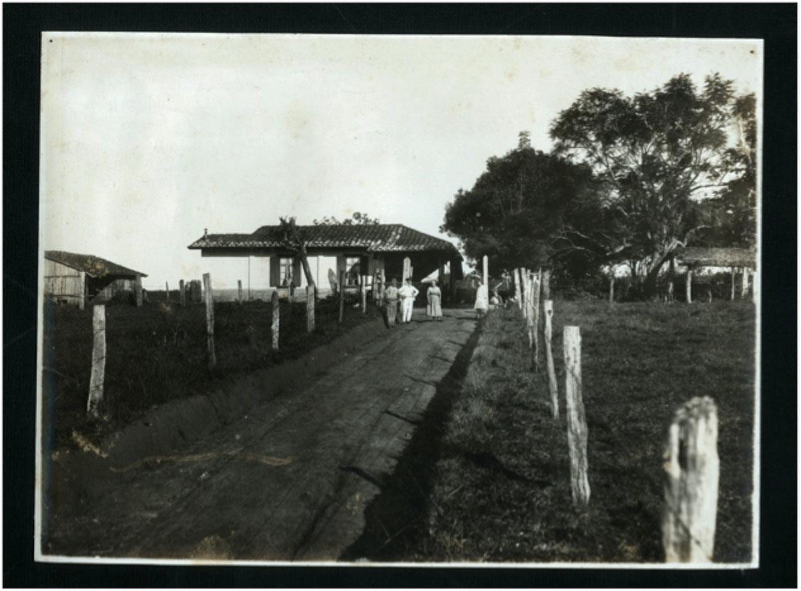

# Resumo

A pesquisa se propõe a constituir um corpo teórico e metodológico que
permita abordar a questão da preservação do patrimônio cultural e, em
especial, das cidades médias e pequenas que compõem a Região
Metropolitana de Campinas. Dada a natureza desse patrimônio, entende-se
a necessidade de analisar não apenas a sua dimensão urbana e
arquitetônica, e sim todos os componentes que caracterizam o território
metropolitano em que se inserem (históricos, estruturais,
organizacionais, dinâmicas). A abordagem privilegia a discussão
urbanística contida nas questões de preservação e pressupõe uma análise
e interpretação interescalar dos processos como parte da discussão mais
ampla sobre os planos, projetos e políticas urbanas adotados em nível
regional. Neste sentido, concebe o patrimônio cultural como um dos
componentes da paisagem resultante e, portanto, indissociável desta. Num
primeiro momento, a pesquisa concentrou-se na compreensão da natureza
dos patrimônios das cidades da Região Metropolitana de Campinas, a
partir do estudo de caso de duas cidades, Valinhos e Paulínia, buscando
evidenciar e aprofundar aspectos conceituais e metodológicos para a
definição de critérios de seleção e de ação sobre a paisagem e os
patrimônios culturais identificados no estudo. Numa segunda etapa,
propôs-se outra diretriz metodológica com foco em um dos patrimônios
identificados, a Usina Ester, localizada no município de Cosmópolis e o
complexo território por ela configurado. Finalmente, indaga-se sobre a
existência ou possibilidade de constituição de planos, programas e
projetos de intervenção em nível metropolitano ou regional que incluam a
dimensão da conservação e gestão dos bens culturais. Propõe-se ainda uma
abordagem prospectiva do alcance de tais conceitos e métodos através da
reflexão sobre sua utilização no planejamento e na gestão urbana das
cidades da região.

**Palavras-chave**: patrimônio, gestão urbana, RMC, conservação,
território, cidades paulistas

# Abstract

> *The research aims to compose, a theoretical and methodological body
> that enables to broach the preservation of cultural heritage issue
> and, mainly, of the medium and small cities that arranges the
> metropolitan region of Campinas. Given the nature of this heritage, it
> is possible to comprehend the need to consider not just its urban and
> architectural dimension, but also all the components that characterize
> the metropolitan territory in which they operate (historical,
> structural, organizational, dynamics). The approach emphasizes the
> urban debate contained in preservation issues and requires analysis
> and interpretation of inter-scale processes as part of a wider
> discussion about the plans, projects and urban policies adopted at
> regional level. In this sense, the cultural heritage is taken as one
> of the components of the resulting landscape and therefore inseparable
> of it. Initially, the research focused on understanding the nature of
> the metropolitan region of Campinas' cities heritage, on the basis of
> the case study of two cities, Valinhos and Paulínia, in order to
> highlight and develop conceptual and methodological aspects for the
> definition of criteria of selection and action on landscape and
> cultural heritage sites identified in the study. In a second stage,
> we*
>
> *proposed another methodological guideline focusing on one of the
> identified heritages, Usina Ester, located in the city of Cosmópolis
> and its complex territory. Finally, it is questioned the existence or
> possibility of creating plans, programs and intervention projects in
> metropolitan or regional level that includes the size of the
> conservation and management of the cultural property. It is also
> proposed a forward-looking approach to the scope of these concepts and
> methods through reflection on their use in urban planning and
> management of cities of the region.*
>
> ***Keywords:** heritage, urban planning, RMC, conservation, territory,
> cities of São Paulo*

# Introdução

A pesquisa se propõe a constituir um corpo teórico e metodológico que
permita abordar a questão da preservação do patrimônio cultural e, em
especial, o patrimônio cultural das cidades médias e pequenas que
compõem a Região Metropolitana de Campinas. Dada a natureza desse
patrimônio, entende-se a necessidade de analisar não apenas a sua
dimensão urbana e arquitetônica, e sim todos os componentes que
caracterizam o território metropolitano em que se inserem (históricos,
estruturais, organizacionais, dinâmicas). A abordagem privilegia a
discussão urbanística contida nas questões de preservação e pressupõe
uma análise e interpretação interescalar dos processos como parte da
discussão mais ampla sobre os planos, projetos e políticas urbanas
adotados ao nível regional. Neste sentido, toma o patrimônio cultural
como um dos componentes da paisagem resultante e, portanto,
indissociável desta.

Uma das características da Região Metropolitana de Campinas é que ela
apresenta dois movimentos opostos de urbanização: o crescimento em
extensão a partir das áreas centrais dos municípios, configurando
diversos pontos de conurbação e, ao mesmo tempo, um desdobramento de
novas áreas urbanizadas, a partir de sucessivos loteamentos abertos na
periferia dos núcleos que a compõem, dando corpo a uma urbanização
descontínua, caracterizada por condomínios residenciais e industriais
fechados, uma transformação na forma de vida rural e a regionalização
das atividades, gerando intensos deslocamentos ao longo das rodovias de
acesso (CANO et al., 2002). Como núcleo do complexo cafeeiro paulista,
herdou as bases para o dinamismo da agricultura, infraestrutura de
transporte e qualidade da rede urbana. Esse processo foi reforçado com a
abertura da Via Anhanguera nos anos 1950 e depois com a Rodovia dos
Bandeirantes, no final dos anos 1970. Baeninger (2002), afirma que a
Região Metropolitana de Campinas, desde esta década, passou a receber
grandes fluxos migratórios, já que se tornou um dos principais eixos de
expansão no processo de desconcentração relativa das atividades
industriais.

Nos anos 1970, 60% do crescimento absoluto da população metropolitana
era fruto da migração; na década seguinte, esse valor passou para 48% e
entre os anos de 1991 e 1996 para 43% - período em que a RMC recebeu
83.884 de migrantes de outros Estados. A intensidade deste processo foi
tal que, nos anos 1990, apenas nos municípios de Artur Nogueira,
Engenheiro Coelho, Holambra e Pedreira, a migração representou 70% do
crescimento absoluto dessa área (PMHIS, 2010).

As principais motivações para os deslocamentos na RMC são relacionados à
educação (com 1.379.126 viagens) e ao trabalho no ramo de serviços
(840.182 viagens). Considerando apenas os horários de pico, são
realizadas cerca de 420.000 viagens na RMC, sendo que destas, ao redor
de 230.000 são por motivo de trabalho e em torno de

250.000 relacionadas à educação (PITU/RMC/2010).

Várias políticas governamentais deflagradas em níveis federal, estadual
e municipal, como o Programa de Metas (1956-1960) e o Proálcool,
induziram a interiorização do desenvolvimento no estado, principalmente
em Campinas e região, com investimentos

públicos em infraestrutura de transportes, comunicações, ciência e
tecnologia, responsáveis pelo surgimento de universidades (Unicamp),
grandes centros empresariais e industriais, como Replan, CPqD, CTI etc.
Com isso a região atraiu a implantação de grandes empresas privadas e
ampliou a rede de pequenas e médias, intensificando as relações com o
setor agropecuário e terciário, também novos moradores. Como
decorrência, a expansão da mancha urbana deu início ao desenho atual da
conurbação ao longo dos eixos viários Anhanguera, Santos-Dumont, Rod.
Dom Pedro I, Campinas- Paulínia e Campinas-Mogi-Mirim (CANO et al.,
2002).

A RMC está inserida no principal polo urbano-industrial brasileiro,
tendo como epicentro São Paulo, mas se estende por uma grande região
interiorana em desenvolvimento. Segundo Cano & Brandão (2002), este
processo aumentou a complexidade nos centros urbanos das cidades
paulistas. É uma região que agrega municípios com situações desiguais de
urbanização e industrialização, que são ao mesmo tempo responsáveis por
suas singularidades. Apresenta ainda traços de heterogeneidade social,
produtiva e espacial. O intenso fluxo migratório não foi absorvido de
forma adequada, gerando processos de periferização com extremos de
classes altas e baixas, diminuindo a força dos centros urbanos
tradicionais (PITU/RMC/, 2010) - e criando um sistema de polinucleação.

Do ponto de vista do urbanismo, ainda que os fenômenos atuem na escala
regional, é no espaço urbano de cada município que se operam as mudanças
de significado. Se a mobilidade de mercadorias e pessoas é um fator
estruturador do processo de metropolização e responsável pela
regionalização das atividades (VILLAÇA, 1998), os deslocamentos
intra-urbanos são os grandes articuladores de novos pontos de consumo e
apropriação nos espaços públicos, do fortalecimento de áreas comerciais
ao longo dos eixos de circulação, gerando também, em certos casos, um
deslocamento de centralidades.

Tendo em conta tais processos, foram definidos a princípio, como casos
de estudo, duas cidades da Região Metropolitana de Campinas, Valinhos e
Paulínia, cidades com cerca de 100.000 habitantes, dos quais metade não
são nativos. A migração de pessoas de outras cidades induziu a uma nova
forma de identidade com os centros tradicionais destas cidades e até
mesmo uma dissolução de particularidades em cada um deles. O surgimento
de condomínios fechados consolidou uma forma de vida confinada, diluindo
a formação de comunidades. Essa dissolução das relações vem causando,
por exemplo, uma mudança de apropriação e uso dos espaços públicos, que
perdem significado diante de novas formas de lazer como os
*shopping-centers* no eixo da Rodovia Dom Pedro I, ora ganham novas
funções, ao sofrerem um deslocamento em relação aos novos eixos de
produção e consumo criados. A expansão dos núcleos urbanos e, no limite,
os processos de conurbação entre estes são fenômenos que explicam a
intensa troca de informações, energia, capital, trabalho e o
deslocamento de pessoas, características recentes do território
metropolitano.

Numa segunda etapa, foram analisadas mais três cidades, Arthur Nogueira,
Cosmópolis e Engenheiro Coelho, selecionadas não por suas
características específicas e sim por constituírem um conjunto com uma
relação intrínseca em sua formação, de modo que fosse possível
identificar elementos indutores do processo de formação do território.
Potencialmente, tais elementos constituiriam os patrimônios culturais a
serem preservados, porém, a esta se deveria agregar pelo menos duas
outras possibilidades de definição de conjuntos de interesse: as
referências culturais dispersas, disseminadas a partir do território
formado e a delimitação da paisagem cultural resultante e inter- agente
com as mesmas, cujos âmbitos deveriam abranger desde remanescentes
relacionados às formas de produção econômica e usos do território, até a
formação do

modo de vida local. Desta forma, o exemplar que nos permitiu compor esse
quadro e a nova conduta metodológica foi a Usina Ester, situada no
município de Cosmópolis, cuja trajetória envolve a formação de um amplo
território que se desdobrou nos municípios de Paulínia, Artur Nogueira e
Engenheiro Coelho.

# Territórios em (trans)formação:o exemplo de Paulínia

A cidade de Paulínia teve seu território estruturado a partir da doação
de sesmarias no final do século XVIII, tendo sua origem na fazenda São
Bento, produtora de café. Em 1903 foi inaugurada uma capela que deu
início ao primeiro vilarejo. Ocorreu intenso processo migratório,
basicamente de italianos, para trabalhar nas plantações de café e em
1906, e o primeiro assentamento foi consolidado como vila. A criação do
município ocorreu somente em 1964. Nos anos 1970, com a implantação da
Replan (Refinaria do Planalto -- empresa de petróleo) Paulínia mudou sua
história, atraindo diversas outras indústrias e se consolidando como
polo de redistribuição de derivados de petróleo. A partir de seu bairro
mais antigo, Santa Cecília, a mancha urbana propagou-se de forma
descontínua. O centro, onde ainda se localizam alguns dos edifícios
significativos, coincide com a principal avenida de comércio e ainda
convive com reminiscências de sua origem rural, quando era apenas um
pequeno núcleo em meio a antigos caminhos. Devido à forte presença
industrial, Paulínia apresenta uma dualidade cultural, com valores mais
arraigados de comunidade local e costumes introduzidos pelos novos
moradores, que para lá imigraram com a vinda dos grandes empreendimentos
habitacionais, comerciais e industriais na região (WASSALL, 2011).

> 
>
> Fig. 1. Fotos de dois edifícios significativos da cidade de Paulínia,
> respectivamente: à esquerda, Igreja de São Sebastião com o Museu
> Municipal ao fundo e, à direita, capela remanescente em antigo
> caminho, hoje Avenida Botasso (Betel, Paulínia) Fonte: Acervo da
> pesquisa, 2011.

Assim, Paulínia é caracterizada pela presença de grandes unidades
industriais, responsáveis pela formação de manchas urbanas segregadas.
Este processo relaciona atividades e população de outras cidades, e
reitera estudos recentes que apontam para uma mudança nas estratégias de
deslocamentos de indivíduos (movimentos pendulares) nas últimas décadas
do século XX, em que novos processos se materializam na dimensão
interna, pelo redirecionamento dos fluxos migratórios para as cidades
médias, em detrimento dos grandes centros urbanos (OLIVEIRA et al.,
2011).

# Usina Ester: reconstrução de uma paisagem

A formação do município de Paulínia, assim como de outros municípios da
região, foi impulsionada pela ferrovia que percorria as principais
fazendas, onde posteriormente se localizaram as principais indústrias da
cidade. Dentre as quais, podemos destacar a Companhia Rhodia Brasileira
(Paulínia) e a Usina Ester (Cosmópolis).

A Usina Ester, fundada em 1898, está localizada na antiga Fazenda Funil,
na cidade de Cosmópolis. É uma das mais antigas usinas de açúcar do
Estado de São Paulo e atualmente fabrica açúcar e etanol. Apesar de não
fazer parte do território de Paulínia,

teve grande importância para a conformação desse município, uma vez que,
sede da Usina Açucareira Ester, seus donos foram alguns dos principais
responsáveis pela implantação da Estrada de Ferro Funilense, pela
Companhia Carril Agrícola Funilense (inaugurada em 1899), que ligava
Campinas ao Funil, para escoamento da produção agrícola da região. Essas
vias definiram inicialmente a ocupação, e tornaram-se estradas de acesso
aos povoados (posteriormente municípios) que nasceram ao redor das
estações e chaves ferroviárias, o que constitui um elemento importante
para a leitura do território e a identificação de elementos referenciais
culturais (MARCONDES, 2001), como as cidades de Cosmópolis, Arthur
Nogueira e Engenheiro Coelho, Conchal e o Distrito de Martinho Prado
Júnior, em Mogi Guaçu.

Ainda em relação à formação do território, a implantação da Usina Ester,
assim como outras indústrias que ali se instalaram em substituição às
antigas fazendas, pode ser destacada a formação do município de
Cosmópolis, onde 80% de seu quadro de funcionários é composto por filhos
ou parentes de ex-funcionários, ou teve a Usina como único emprego
durante toda a vida. Desta forma, buscou-se uma nova forma de abordagem
na identificação do patrimônio da região, que partisse da leitura da
constituição física e da dinâmica atual das cidades e retrocedesse às
bases da formação dos territórios, de forma que pudéssemos aplicá-la a
vários âmbitos e que incorporasse a variedade de referências culturais
existentes, ou seja, conforme aponta Becerra García, o patrimônio "en
toda su complejidad de forma diacrónica, y también, em su caso, el
paisaje que ha generado" (SCHICCHI, VEGA, 2013, pág.133).

> 
>
> Fig. 2. Em 1896, o Barão Geraldo, em processo de negociação com os
> irmãos Nogueira, entrou em contato com o presidente da Província,
> Campos Salles, para que conhecesse a região do Funil, organizando uma
> caravana formada por vários proprietários e figuras políticas da
> região, onde viria a ser instalado o *Núcleo Colonial Campos Salles*.
> Na imagem, a queda de água em forma de funil, de onde se originou o
> nome da região. Fonte: Nogueira,1955.

A usina foi fundada em 1903, após a compra e incorporação das Fazendas
do Funil, Três Barras, Boa Vista e São Bento, pelos irmãos José Paulino,
Arthur e Sidrack Nogueira, com Paulo de Almeida Nogueira e Antônio
Carlos da Silva Telles. Para transformar um pequeno engenho em uma
grande indústria, era necessária uma infraestrutura mínima, que acabou
sendo fornecida através da construção da estrada de ferro -- rápido
acesso a um centro urbano --, e dos *Núcleos Coloniais Campos Salles* e
do *Conchal* -- mão de obra abundante e europeia.

Todo o processo de ocupação e desenvolvimento do Funil -- através de
ligações familiares, financeiras e políticas, entre setor privado e
público --, ajudou a construir um

contexto mais amplo no cenário paulista, tentando sanar uma grande crise
no setor agrícola, principalmente cafeeiro. Isto trouxe a
industrialização a São Paulo e mudanças nos investimentos econômicos e
tecnológicos, e que culminou, entre outros fatores, na criação de uma
rede de novas cidades no interior paulista.

> 
>
> Fig. 3. Foto da máquina da Funilense no pátio de Cosmópolis (1928)
> Fonte: cedida por José Flávio "Mogiana" ao site
> [[www.estaçõesferroviárias.com.br]{.ul}.](http://www.estaçõesferroviárias.com.br/)
>
> 
>
> Fig. 4. Fotos da Usina em dois momentos, respectivamente: à esquerda,
> vista da Usina na década de 1950. Fonte: Nogueira,1955 . À direita,
> vista recente do complexo. Fonte:Google Earth, 2003.

## A Estrada de Ferro Funilense e a instalação dos núcleos coloniais

Em meados das décadas de 1880-90, o governo brasileiro, em parceria com
grandes latifundiários, deu início a projetos de imigração visando
substituir a mão de obra escrava pela assalariada, mais especificamente
de origem europeia. A formação dos chamados *Núcleos Coloniais*
constituiu uma das formas de ocupação territorial a partir dessa mão de
obra estrangeira: como forma de incentivar o cultivo das terras, lotes
subdivididos das fazendas eram vendidos para brasileiros e estrangeiros,
com pagamento facilitado a longo prazo, de modo a ocupar espaços e
trazer riquezas para as algumas regiões, além de ligar o imigrante de
forma mais efetiva ao Brasil.

Assim, a instalação dos núcleos coloniais na Província de São Paulo
alterou significativamente a configuração paulista. O modo de vida dos
brasileiros se transformou com a chegada dos imigrantes trazendo novas
culturas, hábitos e costumes. Os trabalhadores livres nacionais tiveram
participação marginal nas políticas de mão de obra e colonização do
governo e dos grandes proprietários, mas sua presença no cenário
paulista também teve seu papel nessa fase de transformações. Uma nova
cultura e um

novo estilo de vida foram construídos. As relações de troca
estabelecidas entre núcleos rurais e urbanos também refletiram essas
mudanças, formando redes de novas cidades no interior de São Paulo
(BALDINI, 2010).

> 
>
> Fig. 5. "Planta Geral do Núcleo Campos Salles", de Germano Vert, 1912.
> Escala: 1:20.000. Fonte: Acervo digital do Museu da Imigração -- São
> Paulo.
>
> 
>
> Fig. 6. Foto do Núcleo Colonial Campos Salles -- Cosmópolis/SP", s/d.
> Fonte: Acervo digital do Museu da Imigração
>
> -- São Paulo.
>
> 
>
> Fig. 7. Reprodução da "Planta dos Núcleos do Conchal", Hert G., 1913.
> Escala: 1:40.000. Fonte: Ferrari, 2011**.**
>
> 
>
> Figura 8. Foto aérea da inserção do complexo da Usina Ester no
> território -- antiga Fazenda Funil. Edificações e áreas de interesse
> remanescentes. Legenda: 1. Vila operária; 2. Igreja São Paulo; 3. Vila
> operária; 4. Indústria; 5.Armazém;
>
> 6\. Antiga Ponte;Ferroviária; 7. Vila operária; 8. Estábulo e
> Armazenagem; 9. Ponte de Ferro Rio Jaguari (antiga ponte
> ferroviária);10. Represa.Fonte: Esquema elaborado pelo grupo de
> pesquisa, 2013 sobre imagem do Google
>
> Earth, 2013.
>
> 
>
> Figura 9. Fotos das construções remanescentes: à esquerda, vista da
> vila operária; à direita, igreja São Paulo.
>
> Fonte: Acervo da pesquisa, 2013.
>
> 
>
> Figura 10. Fotos das construções remanescentes: à esquerda, vista da
> vila operária; à direita, vista dos equipamentos da indústria. Fonte:
> Acervo da pesquisa, 2013.
>
> 
>
> Figuras 11. Fotos das construções remanescentes: à direita, o armazém;
> à esquerda, antiga ponte ferroviária. Fonte: Acervo da pesquisa, 2013.
>
> 
>
> Figura 12. Fotos das construções remanescentes: à esquerda, casas no
> interior da vila operária; à direita, estábulo e armazenagem. Fonte:
> Acervo da pesquisa, 2013.
>
> 
>
> Figura 13. Fotos das construções remanescentes: à esquerda, ponte de
> ferro sobre o Rio Jaguari; à direita, a represa.
>
> Fonte: acervo da pesquisa, 2013.
>
> 
>
> Fig.14. Foto aérea da implantação do complexo da Usina Ester -- antiga
> Fazenda Funil. Edificações e áreas de interesse remanescentes.Legenda:
> 1. Igreja São Paulo; 2. VilaOperária; 3. Clube Funilense; 4.
> Indústria; 5.Casa sede da Fazenda Funil (demolida);6. Antigo edifício
> de estocagem de açúcar; 7. Chaminé da Usina Ester; 8. Antigo
> almoxarifado; 9. Armazém; 10. Escola da Usina. Fonte: Elaboração do
> grupo sobre foto do Google Earth, 2013.

## Novas abordagens para a preservação e gestão de patrimônios dispersos

A partir do conhecimento da história das cidades procurou-se obter os
elementos de base documental, para então cotejá-los a partir de novos
valores atribuídos aos bens (aqui entendidos como todo e qualquer espaço
público ou construção), ao longo do tempo, pela comunidade, e a seguir
enquadrá-los em alguma figura de preservação de conjunto. Uma destas
figuras, a do patrimônio etnográfico, por exemplo, inicialmente
utilizada apenas para a classificação de expressões do folclore ou
manifestações populares, foi retomada, porém, entendendo-se que tais
manifestações já não são mais restritas a uma cidade e podem se
manifestar ao mesmo tempo em vários lugares, dado o poder de comunicação
e inclusão de novas práticas.

Como afirma Arantes (2006, p.427), são questões que exigem uma reflexão
teórica, porém alicerçadas por pesquisas empíricas. Ao invés de se
buscar uma solução homogênea deve-se considerar a diversidade dos
problemas como um valor cultural de fundamental importância, já que a
"prática da preservação não legitima simplesmente sentidos socialmente
atribuídos pela cultura comum e cotidiana a determinados aspectos da
cultura, mas põem em prática os critérios, as concepções e os valores
que são defendidos por técnicos e especialistas". Assim, segundo o
autor, as decisões das instituições de preservação não raro estão em
desacordo com os valores vigentes locais. A Declaração de Amsterdã,
realizada em outubro de 1975, foi o documento que primeiro propôs
parâmetros sobre como abordar a diversidade dos contextos urbanos,
abolindo a segregação hierárquica entre conjuntos de maior ou menor
interesse artístico, de forma a incorporar a mudança como algo desejável
e inevitável (JUSTICIA et al., 2008). Porém, como explica Fonseca (1996,
p.159), a expressão aqui no Brasil foi

traduzida para "patrimônio cultural não-consagrado".

Os patrimônios existentes nas cidades médias e pequenas da RMC evocam a
discussão sobre o valor pela diversidade e outros aspectos de
contemporaneidade que dificultam o enquadramento dos mesmos nas figuras
tradicionais de preservação. Tratam-se de "patrimônios dispersos", ou
seja, não são conjuntos homogêneos e contíguos no espaço. O problema
principal a enfrentar quanto ao método de identificação e seleção deste
patrimônio, portanto, partindo de uma abordagem diacrônica, como já foi
dito, é que ao considerar-se o deslocamento de população em função de
mudanças no modo de vida, tanto na organização social quanto na
produtiva, temos que admitir a existência de outras formas de
valorização e reconhecimento - que resultam de distintos usos do espaço
no tempo - que se traduzem em diversos aspectos culturais e
físico-espaciais, em especial, no valor atribuído à memória coletiva.

Conforme aponta Oliveira (et al., 2011) entende-se que diferentes
práticas, atividades, ações e trajetórias, detectáveis nos movimentos de
população, correspondem a múltiplas instâncias da realidade social, nas
quais se incluem as relações de pertencimento, que se manifestam em
distintas dimensões: da esfera de vida pública e privada; do ciclo de
vida; das novas relações trabalho-casa estabelecidas; das condições do
habitat; dos processos de apropriação espacial; de segregação
sócio-espacial; das redes sociais, etc. Isto é, entende-se o território
não somente como uma escala dimensional e sim como um termo que articula
relações entre espaços, políticas e identidades.

Outra abordagem que corrobora com esta visão e amplia as possibilidades
de preservação a partir da leitura do território e da participação das
populações envolvidas, independentemente de divisas administrativas e de
escalas é a recomendada pela Declaração de Quebec (2008) sobre "*a
proteção do espírito do lugar*", resultado da 16ª Assembléia Geral do
Conselho Internacional de Monumentos e Sítios (ICOMOS), onde se refletiu
sobre "*as relações entre patrimônio material e imaterial e os
mecanismos que regulam o espírito do lugar*". Este último, constituído
pelo "conjunto de bens materiais (sítios, paisagens, edificações,
objetos) e imateriais (memórias, depoimentos, documentos escritos,
rituais, festivais, ofícios, técnicas, valores, cheiros), físicos e
espirituais, que atribuem sentido, valor, emoção e mistério ao lugar".

Alguns dos aspectos definidos sobre a proteção do espírito do lugar vão
ao encontro dos interesses da presente pesquisa, entre os quais: a
necessidade de compreender e propor medidas preventivas contra as
ameaças externas - como as mudanças climáticas, os desastres ambientais,
os conflitos armados e o crescimento urbano descontrolado que conduzem a
transformações e rupturas nas sociedades - através de planos, projetos e
políticas públicas, adaptados ao contexto pluralista das sociedades
multiculturais modernas (ICOMOS, 2008). Por outro lado, é importante
ajustar os instrumentos de proteção do patrimônio cultural para que não
só preservem o passado e o presente, mas possam ir incorporando os novos
desafios impostos permanentemente pelas mudanças, através da gestão
territorial.

## Considerações finais

A pesquisa se iniciou a partir da reflexão sobre os fatores que geraram
os deslocamentos populacionais (movimentos pendulares) para compreender
sua influência sobre as relações de identidade e de atribuição de valor
aos patrimônios culturais das cidades de Paulínia e Valinhos.

A premissa principal surgiu da constatação da inversão de fluxos
migratórios dos grandes centros para as cidades médias, com
conseqüências para as pequenas, deixando de ser um fenômeno
exclusivamente metropolitano. Desta forma, ao considerar-se o
deslocamento de população em função de mudanças, tanto na organização
social quanto na produtiva, é preciso admitir a existência de outras
formas de valorização e

reconhecimento do patrimônio cultural, que se traduzem em diversos
aspectos culturais e físico-espaciais, em especial, no valor atribuído à
memória.

Ao proceder-se a identificação dos bens, portanto, foi necessário rever
e reelaborar critérios e conhecer processos ocorridos e em curso em cada
cidade, tais como a gênese da ocupação do território; a urbanização e
formação de núcleos ou centros principais; a intensidade, alternância e
itinerância de usos e apropriações nos espaços públicos; os usos e
intervenções/subtrações realizadas nos traçados urbanos e nos edifícios
remanescentes de vários períodos. Somente a partir deste conhecimento
foi possível identificar o objeto, no caso, a Usina Esther, como o
elemento que articula, no território, os tempos, memórias e vestígios de
sua constituição, sendo este o principal fator a destacar como
contribuição desta pesquisa quanto à discussão dos métodos de
identificação e seleção.

Neste sentido, por um lado, reitera-se a importância de produção de
evidências desses movimentos a partir de levantamentos e análises
empíricas dos territórios e, por outro, a limitação do uso de
ferramentas e critérios de classificação utilizados para a compreensão
de processos e atribuição de valor para cidades, conjuntos ou edifícios
históricos tombados perfeitamente enquadráveis nas figuras de
preservação tradicionais. **Referências bibliográficas**

ARANTES, A. O patrimônio cultural e seus usos: a dimensão urbana.
*Revista Habitus, Goiânia*, v.4.n.1,p.425-435, jan/jun, Goiânia, 2006.

> BAENINGER, R. A. População em Movimento. In: *Fonseca, R.; Davanzo, A.
> M. Q.; Negreiros, R. M. C. (orgs.) Livro Verde: Desafios para a gestão
> da Região Metropolitana de Campinas*. Campinas: UNICAMP, IE, 2002.
>
> BALDINI, Kelly Baldini. *Núcleo Colonial Campos Salles: um estudo de
> caso sobre a dinâmica das relações bairro rural -- cidades*. Campinas:
> Dissertação/Unicamp, 2010.
>
> CANO, W., BRANDÃO, C.A. *A Região Metropolitana de Campinas.
> Urbanização, economia, finanças e meio ambiente*. Campinas, SP:
> Editora da Unicamp, 2002 FERRARI, Sandro. *Os núcleos coloniais do
> Conchal*. Artur Nogueira: Ed. Paradigma, 2011
>
> FONSECA, M. C. L. F. Da modernização à participação: a política
> federal de preservação nos anos 70 e 80. *Revista do Patrimônio
> Histórico e Artístico Nacional. Dossiê Cidadania*. Brasil: IPHAN,
> 1996.

ICOMOS, 2008 -- International Council on Monuments and Sites - [[The
Quebec]{.ul}](http://www.international.icomos.org/quebec2008/quebec_declaration/pdf/GA16_Quebec_Declaration_Final_EN.pdf)
[[Declaration on the Preservation of the Spirit of the
Place]{.ul}.](http://www.international.icomos.org/quebec2008/quebec_declaration/pdf/GA16_Quebec_Declaration_Final_EN.pdf)
Disponível em:
[[http://www.icomos.org/en/charters-and-texts]{.ul}](http://www.icomos.org/en/charters-and-texts).
Acesso: 20/10/2013.

> JUSTICIA, M. J. M., MARTÍNEZ, L. J. S-M. *La restauración de bienes
> culturales en los textos normativos.Selección, traducción y estudio
> crítico de documentos normativos internacionales y
> nacionales.*Granada: Editorial Comares, 2008.
>
> MARCONDES, Marli. *História e Informática: o uso da hipermídia no
> resgate da História da Estrada de Ferro Funilense*. Campinas:
> Dissertação/Unicamp, 2001.

NOGUEIRA, Paulo de Almeida. *Minha Vida*. São Paulo: s/ed., 1955.

OLIVEIRA, L. A. P. de, OLIVEIRA, A. T. R. de (Org.) Reflexões sobre os
deslocamentos populacionais no Brasil. *Estudos e Análises I*. Rio de
Janeiro: IBGE, 2011.

PITU -- Plano Integrado de Transportes Urbanos /RMC/2015. 2010.
*Relatórios.* Campinas: Governo do Estado de São Paulo. Secretaria dos
transportes Metropolitanos. Disponível em:
[[http://www.stm.sp.gov.br/images/stories/Pitus/Pitu2015/index.html]{.ul}](http://www.stm.sp.gov.br/images/stories/Pitus/Pitu2015/index.html).
Acesso: 15/11/2012.

> PMHIS - Plano Metropolitano de Habitação de Interesse Social. 2010.
> *AGEMCAMP - Agência Metropolitana de Campinas*, Campinas. Disponível
> em:

[[http://www.agemcamp.sp.gov.br/]{.ul}.](http://www.agemcamp.sp.gov.br/)
Acesso em: 12/11/2010.

SCHICCHI, MARIA CRISTINA, VEGA, J. A.Entrevista con Juan Manuel Becerra
García. In *Oculum Ensaios* (PUCCAMP). , v.10-2, p.317 - 338, 2013.

> VILLAÇA, F. *Espaço Intra-Urbano no Brasil*. São Paulo: Studio
> Nobel/FAPESP/Lincoln Institute, 1998.

WASSALL, L.J. Urbanização descontínua: fronteiras e novas centralidades.
Estudo de caso do município de Paulínia/SP. *Dissertação de Mestrado*.
Campinas: PUC- Campinas, 2011. Disponível em:
[[www.puc-campinas.edu.br]{.ul}](http://www.puc-campinas.edu.br/).
Acesso: 10/10/2012.
