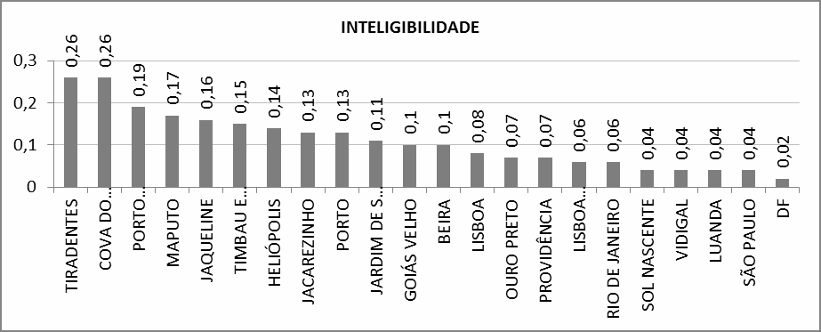

# Resumo

A cidade contemporânea atinge dimensões irreconhecíveis na história e os
seus fenómenos de expansão incorporam frequentemente extensas áreas,
onde a pobreza extrema e a falta de recursos e infraestrutura vinculam
uma imagem de aparente caos. Este artigo pretende explorar a
configuração espacial da favela dentro a cidade contemporânea, buscando
a lógica diacrónica por detrás do seu processo complexo. Por ser um
fenómeno disseminado pela contemporaneidade urbana, importa entender a
sua génese, para que se entenda seu desenvolvimento. Aqui reconhecida no
processo informal e orgânico de fazer cidade, define- se favela como
ação coletiva emergente e espontânea. Assim, torna-se possível a
comparação com outras configurações orgânicas, que partilham do mesmo
processo apesar de pertencerem a outra forma de cidade. Busca-se na
cidade medieval e posteriormente na cidade colonial brasileira um tipo
configuracional comum. Uma organicidade transversal impossibilita a
*favela* de ser considerada um fenómeno (in)formal inovador, bem como
suas problemáticas de serem consideradas intratáveis.

Palavras-chave: Cidade orgânica, Favela, Perspetiva Diacrônica

# Introdução: Do orgânico ao informal, o papel da espontaneidade

> *"Mas as favelas não fazem parte da cidade há mais de um século? Será
> necessária essa integração formal? Não seria uma imposição autoritária
> de uma estética formalista visando à uniformização do tecido urbano?
> (...) Uma outra forma de acção, inspirada na estética das favelas
> poderia ser interessante, e não só para as favelas, mas para a cidade
> como um todo (...)."* (JACQUES, 2002, p.14)

Este artigo propõe o estudo da história da forma orgânica sob o ponto de
vista da *favela* e de sua configuração específica. Pretende-se entender
se a contemporaneidade desta forma significa um novo tipo de cidade, uma
lógica espacial original, ou se se justifica apenas numa dimensão e
ritmo de desenvolvimento inéditos. E é precisamente com base num estudo
comparativo entre várias configurações orgânicas referentes a diferentes
épocas que esta pesquisa busca padrões que relacionem a favela à cidade
tradicional emergente, aquela autoconstruída. Acredita-se na inerência
de propriedades comuns à (também) complexa cidade medieval, desfocadas
pela estigmatização desta realidade socioeconomicamente problemática dos
dias de hoje.

Tal como a citação que inicia este texto bem apresenta, *favela* é
cidade, ainda que sob outras regras, ainda que no seu ritmo e dimensões
alucinantes não haja espaço para uma legalidade uniformizadora. A
complexidade da forma aproxima-a da incompreensão pela apresentação de
regras espaciais que não se encontram na formalização, mas na
autoconstrução e auto- organização (SOBREIRA, 2003). O seu modo de
existir é implícito, surge de "baixo para cima" e por isso a dificuldade
em ser entendido por quem olha em busca das "normais" regras de
observação do espaço. Esta cidade é informal, mas também é espontânea e
emergente, acima de tudo é espaço no seu próprio tempo, espaço que se
constrói coletivamente através de pequenas ações individuais
(SALINGAROS, 1998).

A favela, apesar de suas problemáticas, é um espaço complexamente vivo,
em constante adaptação, talvez por isso SALINGAROS defenda que *"o
tecido urbano orgânico é uma*

> *extensão da biologia humana, enquanto a construção planejada*
> \[principalmente aquela guiada pelos princípios modernistas\] *é uma
> visão artificial do mundo imposta pela mente humana sobre a natureza.
> O primeiro é cheio de vida, mas pode ser pobre e insalubre, enquanto o
> último é limpo e eficiente, mas estéril."* (SALINGAROS, 1998). Assim,
> este trabalho surge com a convicção que estes espaços vivos são
> peculiares formas de vivência urbana num sentido que atribuem à cidade
> um nível de organização natural implícita que, apesar da aparente
> confusão, é potenciadora de qualidade. Daí a ponte com a cidade antiga
> medieval de seu traçado irregular, esta já reconhecida por seu
> emblemático carisma e sua qualidade espacial. Acredita-se na favela
> como um estágio apenas deste modo peculiar de fazer cidade, tanto
> quanto na sua ligação a um modo de saber fazer que perpassa o tempo e
> a história (GUERREIRO, 2010).
>
> 
>
> **Imagem 1** - Diferentes lugares, configurações semelhantes (a:
> Piódão, Portugal; b: Rocinha, Rio de Janeiro, Brasil; c: Manarola,
> Itália; d: Santorini, Grécia). Fonte: Google Imagens

A imagem 1 ilustra a continuidade de um modo de fazer, a semelhança de
um padrão orgânico ao longo do tempo. Como pode a utópica Santorini ser
tão semelhante a lugares como a favela Rocinha no Brasil ou como uma
recôndita aldeia de xisto, Piódão, no centro de Portugal? O modo
manteve-se. Lisboa, Porto, Santorini, Manarola, Providência, Vidigal...
o que realmente os distingue? Aparentemente conseguir-se-iam argumentos
para uma semelhança configuracional clara. O desenrolar deste trabalho
surge no sentido de testar essa semelhança, a partir de comparações e
análises baseadas na Lógica Social do Espaço (HILLIER & HANSON, 1984),
abordagem teórico metodológica que, enquanto sistémica, estuda a
configuração espacial e suas implicações para a sociedade. A partir de
um conjunto de análises, os espaços em estudo são analisados, comparados
e discutida a possibilidade de uma relação diacrónica passível de
padronizar. Os casos de estudo são: Lisboa e Porto (cidade medieval e
cidade atual), Tiradentes, Goiás Velho, Ouro Preto, Brasília, São Paulo
e Rio de Janeiro (cidade actual) e as seguintes favelas: Cova do Vapor
(Portugal), Sol Nascente (Brasília), Vidigal, Jacarezinho, Providência e
Timbau (Rio de Janeiro), Heliópolis, Jaqueline e Jardim São Luís (São
Paulo) e por fim recortes das periferias extensas de Luanda, Beira e
Maputo (Angola e Moçambique respetivamente).

# Metodologia

> \[O planejamento\] *orgânico não começa com uma finalidade
> preconcebida: move-se de necessidade em necessidade, de oportunidade
> em oportunidade, numa série de adaptações que se tornam, elas
> próprias, cada vez mais coerentes e cheias de propósitos, de tal forma
> que geram um plano complexo final, dificilmente menos unificado que um
> modelo geométrico pré-formado*. (MUMFORD,1982).

É esta a convicção impulsionadora do estudo, a de que este *plano
complexo final* é tão ou mais interessante que o resultado de um plano
projetado à distância (de cima). Assim deve-se tornar clara a
pertinência de uma nova forma de observar áreas emergentes e espontâneas
como as favelas, tão presentes na cidade contemporânea de hoje. Para
isso, este trabalho desenvolve uma pesquisa que permite relacionar a
favela com os seus semelhantes numa perspetiva diacrónica, chegando à
cidade medieval orgânica e utilizando-a como foco de comparação. O
objetivo é entender como este processo de fazer cidade se tem mantido ao
longo da história e como a cidade ilegal de hoje, detém, também, as
mesmas características configuracionais cruciais para um espaço urbano
de sucesso.

Foi necessário, numa primeira fase, entender os termos e os conceitos.
Entender o porquê de se falar em complexidade e organicidade, bem como
compreender efetivamente o que se entende por *favela,* neste contexto.
Importa referir também a necessidade de entendimento de todos os
conceitos associados, pela constante variação de significações e
interpretações. Assim assume-se a *favela* como um assentamento
espontâneo e emergente cujo desenvolvimento se caracteriza por uma
formulação espacial orgânica cuja complexidade resulta dos processos de
auto-organização e autoconstrução.

A favela -- cidade informal por excelência -- leva-nos a uma acepção de
espaço autoconstruído única neste contexto contemporâneo. Mas apesar de
singular, suas semelhanças com outros espaços ao longo da história são
tão claras que parece existir uma linha condutora entre diferentes
épocas. O elo de ligação é a organicidade, aquela responsável pelo
desenvolvimento *natural* dos espaços, sob forma de um conjunto de
lentas ações individuais ao longo do tempo.

No contexto deste trabalho define-se que informal é tudo o que não é
oficial ou regulado legalmente, que não se baseia nas regras
predefinidas e institucionalizadas que regem a sociedade. Mas ser
informal também pode ser se familiarizar com o contexto e nele agir
descontraidamente (HOUAISS, 2003). Informal como um espaço que se
prefigura sem a imposição de regras a partir de um plano ou planta à
escala de 1/1000, que vê à distância. Informal porque não segue as
regras estabelecidas pela lei, inexplícito e subentendido porque segue
as leis naturais da organização (SALINGAROS, 1998), é espontâneo e
emergente -- espontaneidade "é o princípio intrínseco para determinar-se
a agir", um "modo particular de causalidade, isto é, como
autocausalidade" (ABBAGNANO, 2007). É portanto aquilo que é natural e
contínuo ao Ser, aquilo que brota da essência e assim, o construir de um
lugar próprio segundo uma identidade que regra todo o processo. A
emergência entra aqui como processo de desenvolvimento, a espaço e a
vida da favela são emergentes porque são espontâneos e naturais.

Para corresponder às inquietações a respeito das semelhanças e
distinções formais neste tipo emergente de cidade é necessário estudar o
seu comportamento configuracional. Isto para que se procure entender
como o espaço atua, quais as implicações para quem o vivência. A Teoria
da Lógica Social do Espaço (HILLIER & HANSON, 1984) permite que se
avalie o

desempenho da configuração espacial através do estudo das barreiras e
permeabilidades no espaço. São produzidas análises individuais de cada
caso de estudo, partindo de mapas axiais e de segmentos, que
posteriormente comparadas permitem encontrar padrões comuns de
comportamento ou diferenças visíveis. Uma forma de olhar a história da
cidade sob um ponto de vista configuracional, de modo a que a sua
própria espacialidade confirme o pressuposto empírico.

# A intemporalidade da forma

> *"Para desatar a complexidade do percurso, é necessária uma ausência
> de objectivo. É a vontade de sair do labirinto que faz a pessoa se
> perder. O estado labiríntico é o estado de quem vaga, um estado
> errático. O percurso -- ao contrário do que ocorre num itinerário já
> planejado -- impõe a disponibilidade para vagar. Vagando ao acaso, a
> dúvida desaparece. São os que duvidam os que se perdem."* (JACQUES,
> 2007, p.86).

Paola Berenstein Jacques assume no seu livro, Estética da Ginga (2007),
a visão da favela enquanto labirinto e trabalha esta noção de
conhecimento implícito e de pertencimento, necessários para que se saiba
nele caminhar. O que vai ao encontro de Alexander quando este refere a
existência de padrões inerentes à forma ancestral de construir e aos que
constroem, sendo que este conhecimento faz parte do próprio ser, da sua
própria natureza (ALEXANDER, 1979). Por isso se insiste no facto de
estarmos perante um processo que atua de *baixo para cima*, que é
natural ao espaço e natural aos seus criadores/utilizadores. É complexo,
difícil de perceber a "olho nu" e a partir dos meios que
disponibilizamos para o entendimento da cidade -- aqueles responsáveis
pelos processos *de cima para baixo* --, trata-se de um tipo de ordem
diferente, uma ordem que não encontra explicação nas simplificações ou
categorizações do pensamento urbanístico moderno (SALINGAROS, 2006). Uma
ordem implícita, onde se encontra a geometria fractal "*uma das
características mais essenciais das formas da Natureza e da geometria da
vida e que está presente nas cidades orgânicas"* (GUERREIRO, 2010,
p.237). Essa geometria, na sua auto-similaridade permitirá possivelmente
a compreensão desse crescimento não planeado (GUERREIRO, 2010).

Acredita-se que o *modo de fazer* orgânico e emergente é pertença de uma
longa tradição, a mesma responsável pela pitoresca cidade medieval, a
mesma que terá originado a cidade colonial, e desvalorizada pelo
pensamento modernista cuja base científica exigia uma perspetiva
ordenadora e racional (MORIN, 1990). Assim a forma da favela é comparada
a Lisboa e Porto (como cidades medievais) e a Tiradentes, Goiás Velho e
Ouro Preto (como cidades de origem colonial). Também são colocadas no
estudo as grandes cidades de Rio de

> Figura 2. Mapa Axial (Integração Global) do Sol Nascente, Brasília.
> Fonte: Autor

Janeiro, São Paulo (pela elevada frequência de favelas nas suas
estruturas urbanas) e Brasília. Brasília pela sua peculiar forma,
planejada no seu centro e expandida para um conjunto de cidades
periféricas aparentemente separadas da realidade central e pela
frequência de áreas irregulares em condições bastante precárias, mas
formalmente semelhantes com as estruturas reticuladas onde se inserem --
loteamentos ilegais, tal como o Sol Nascente.

O estudo do Sol Nascente, grande loteamento irregular, é o primeiro caso
peculiar. Insere-se na pesquisa pela sua recorrente associação à
categoria de favela. Mas a inexistência de Sinergia (MEDEIROS, 2006) no
seu comportamento espacial, num contexto em que esta se reconhece como
uma das vantagens destes sistemas espontâneos pelo seu bom desempenho
interno, resultante da sua complexidade emergente, alerta para a
existência de uma outra forma de fazer ou pensar. Conhecendo a realidade
*in loco* é possível verificar que aquela considerada *a maior favela da
américa latina* (FURQUIM, 2013) é um enorme conjunto de loteamentos
ilegais cuja formalização é previamente definida em prol de uma possível
regularização fundiária. Tais considerações permitem desconstruir o
conceito amplo de *favela* que se tem vindo a desenvolver e a enraizar:
autores como DAVIS abordam a problemática da habitação descrevendo
vários tipos de assentamento precário como *favelas,* independentemente
de sua génese ou configuração. Percebe-se a existência de uma dinâmica
particular, aquela da *horizontalização* (DAVIS, 2006) onde
frequentemente a malha reticulada é imposta pela ação do loteador
irregular (ou "grileiro") que comercializa a terra tentando tirar o
máximo partido da sua divisão. A terra ocupada sem custo pelo pobre, não
é mais uma realidade frequente (DAVIS, 2006), pois os processos
irregulares apresentam cada vez mais um custo elevado. Isto não
significa necessariamente uma *horizontalização* apenas de loteamentos,
basta observar imagens das periferias de Beira ou Maputo (Moçambique)
para entender que o desenvolvimento orgânico também é frequente. Ainda
assim DAVIS chama a atenção para esta realidade, a de um mercado
paralelo que formaliza a construção destas áreas periféricas, assim
ausentes da complexidade organizada que SALINGAROS (1998) defende como
potenciadora de qualidade espacial.

> Figura 3. Mapa Axial do Morro da Providência, Rio de Janeiro. Fonte:
> Autor

A ausência de espontaneidade na conformação do espaço dá origem a uma
configuração pré- concebida e inorgânica que apesar de manter o leque de
problemáticas socioeconómicas associado, diz respeito a um outro tipo de
espaço, que não é -- neste contexto -- favela. Na

favela *"em lugar de andar é preciso saber dançar (...)* Pois *(...) o
espaço labiríntico é o espaço em movimento."* (JACQUES, 2007, p. 86).
Define-se assim um conceito de favela que se prende com a sua génese
espacial, confirmando-se a importância da forma para o desempenho do
espaço -- na imagem 3 (Morro da Providência) percebe-se o contraste
entre a malha viária de uma favela, uma rede complexa de possibilidades
de percurso, e a do Sol Nascente (Imagem 2) uma estrutura reticulada
simples onde a forma em "espinha" não permite o mesmo tipo de relação no
espaço.

Tendo afirmado a *favela* como assentamento orgânico e espontâneo
parte-se para o estudo desse padrão que acompanha a história da cidade.
Ao analisarem-se os Mapas Axiais destes 22 casos de estudo (favelas e
cidades em diferentes fases da história) foram comparados os valores
resultantes e estudadas as semelhanças ou diferenças. Os gráficos que se
apresentam resultam dessa comparação e permitem resumir os dados
relevantes dos Mapas analisados.

> 
>
> Gráfico 1. Valores de Integração Local. Fonte: Autor
>
> 
>
> Gráfico 2. Valores de Sinergia. Fonte: Autor

A Integração Local (Gráfico 1), representativa de um potencial de
movimento e acessibilidade a uma escala local (como a escala de bairro,
por exemplo) deixa mais clara a distinção de um padrão comum. O
comportamento interno dos traçados mais orgânicos aproxima-se (valores

oscilam entre 1.1 e 1.37), correspondendo a valores mais baixos que os
restantes casos (apenas Brasília -- DF -- apresenta valores semelhantes,
consequência aparente da característica fragmentação que a configura).
Isto significa que em comparação com as maiores cidades contemporâneas,
da amostra, o potencial de movimento local é relativamente inferior,
consequência da irregularidade que se reconhece desde o início.

O comportamento interno dos sistemas analisados, mais do que avaliado
pela sua potencial integração local, também se pode analisar pela
Sinergia, medida que relaciona a Integração Global com a Local de forma
a entender a dinâmica entre as duas. O gráfico 2 permite observar a
comparação dos valores, entendendo logo à partida os reduzidos valores,
e baixo desempenho, de Brasília (DF) e Sol Nascente apesar de não
apresentarem características topográficas tão acentuadas que o
justifiquem, tal como Vidigal, Ouro Preto, Providência ou Lisboa
medieval. Poder-se-á dizer portanto que o comportamento interno destas
áreas é satisfatório, estando este em sintonia com todas as partes do
seu sistema.

> 
>
> Gráfico 3. Valores de Inteligibilidade. Fonte Autor

A complexidade que se falava inerente à organicidade destes espaços,
tanto nas favelas *labirínticas* como nas cidades de origem medieval de
ruas estreitas e sinuosas, é também comprovada pela baixa
Inteligibilidade (gráfico 3). Inteligibilidade é a capacidade de
apreensão de um sistema a partir de uma das suas partes, ora, tendo em
conta a complexidade e espontaneidade destes sistemas sabe-se que sua
realidade é muito variada, e portanto demasiado complexa para ser bem
apreendida num primeiro momento. Verifica-se também que apesar desse
constante valor baixo, os sistemas mais simples adquirem valores um
pouco superiores -- o seu tamanho permite uma apreensão menos demorada.

> 
>
> 
>
> Gráfico 4. Valores de Profundidade Média. Fonte: Autor
>
> a b
>
> c d e

> a b
>
> c d e
>
> Figura 4. Mapas de Escolha Angular (Segmentos): a -- Timbau; b --
> Jacarezinho; c -- Lisboa Medieval; d -- Porto Medieval; e -- Morro da
> Providencia. Fonte: Autor
>
> 
>
> Gráfico 4. Correlação entre Profundidade média e o tamanho do sistema.
> Fonte: Autor

A Profundidade Média "*esclarece o grau médio de dificuldade ou
facilidade para se alcançar um eixo, e o comparativo para valores
médios em sistemas distintos possibilita o faceamento de cidades a
partir de um maior ou menor efeito labiríntico" (MEDEIROS, 2006,
p.357).* Esta medida torna-se assim de maior importância, na medida em
que nos permite reconhecer o comportamento destas configurações ditas
irregulares ou labirínticas. Como se pode perceber pelo gráfico 4 os
assentamentos orgânicos da amostra revelam valores de profundidade
igualmente homogéneos, e tendencialmente baixos. O que significa que
apesar de suas características de aparência labiríntica, o percurso
pelo sistema mesmo a seus lugares mais internos, não se mostra tão
difícil quanto se pressupõe empiricamente. O labirinto de JACQUES
(2007) não é mais que uma impressão provocada pela dificuldade de
apreensão do espaço (ou pela fraca inteligibilidade). Tal como o
desempenho interno se demonstra significativo, também a
(relativamente) baixa profundidade se mostra potenciadora de
movimento no seu interior. Algo que se reforça com a observação dos
mapas de Escolha Angular -- aqueles que dizem respeito aos percursos
potencialmente mais percorridos em cada cidade/assentamento -- onde se
observa globalmente a existência de uma rede de percursos que atravessam
boa parte do sistema (Imagem 4). Esta dinâmica potencial permite
concluir que apesar de profundos, estes sistemas detém um comportamento
que lhes permite o acesso frequente a uma boa parte da área, tornando-se
mais movimentado -- menos profundo e consequentemente menos inacessível
-- do que seria de esperar.

Para que se entendesse a profundidade dos sistemas, achou-se necessário
correlacionar os seus valores com a sua escala (Gráfico 5). Isto porque
seria importante entender se a profundidade se relaciona diretamente com
a irregularidade do espaço ou antes com a sua dimensão. Ao correlacionar
os valores e extrair o valor de R2 é possível avaliar o coeficiente de
determinação de uma variável perante a outra (MEDEIROS, 2006). Sendo o
valor de R2 aproximadamente 0.36, encontra-se classificado como "grande"
na tabela de referência para os valores de *r* e *R2* e sua escala de
correlação (MEDEIROS 2006 *apud* HOPKINS (2006). Isto significa que
existe uma *grande* correspondência entre o valor da profundidade e o
número de eixos do sistema, ou seja, a profundidade não é uma
característica do espaço senão pela sua dimensão. Reforça-se assim a
ideia de que o espaço se detém numa complexidade organizada e é, por
isso, potencialmente acessível.

> *"Assentamentos distintos do ponto de vista histórico e cultural
> apresentam relações configuracionais semelhantes." (*MEDEIROS, 2012,
> p.48*)*. É precisamente disso que se trata, diacronicamente o padrão
> orgânico foi-se responsabilizando por continuar o seu modo de fazer
> cidade. As semelhanças claras entre os assentamentos permitem
> concordar com ALEXANDER (1979) quando este trata o *modo intemporal de
> construir*, aquele inerente ao homem, aquele inerente ao lugar.
> Espontaneidade e emergência significam o caminho para a complexidade
> natural de que GUERREIRO (20010) fala, a mesma que KOSTOF (1991)
> reconhece ao falar de espaços orgânicos não planejados. Mas será a
> organicidade passível de projeção?

Este estudo garante haver um caminho para a compreensão destas
geometrias que não se reconhecem numa simples observação. A complexidade
da favela é tão caótica quanto a Alfama de hoje (parte de Lisboa
Medieval que sobrevive ao Terramoto de 1755) e seu espaço tão organizado
quanto se pretende.

# Conclusões e desenvolvimentos futuros

Este trabalho desenvolveu-se a partir da hipótese de que as favelas não
seriam simplesmente um fenómeno urbano contemporâneo se não na escala e
dimensões que atingem dentro da cidade. Havia a crença numa semelhança
entre os processos orgânicos de fazer cidade, desde a cidade medieval à
favela de hoje.

Define-se favela como forma complexa de génese espontânea e emergente e
comprova-se através da comparação de assentamentos, que aqueles cuja
formação não se baseia nos mesmos princípios -- tal como o Sol Nascente
em Brasília -- não podem ser considerados como tal. Existe portanto o
princípio intrínseco da organicidade para que a favela seja o fenómeno
que se pretende estudar. Esta é então considerada como um espaço
Sinérgico e Fractal -- aquele cujas escalas internas se relacionam em
sintonia, um espaço complexo e espontâneo, de apreensão menos imediata
mas permitindo percursos mais intuitivos, pela sua natureza. Tudo aquilo
que também se encontra na cidade medieval, bem como nas cidades
coloniais.

Estas análises sintáticas permitiram quantificar a semelhança entre os
tipos de assentamento apresentados e afirmar a existência de um genótipo
para os assentamentos orgânicos.

Futuramente, estudo deverá expandir no sentido da captação *in loco* das
qualidades identificadas e consequente entendimento desta complexidade
organizada de que se fala,

investindo na aplicação da Sintaxe e no aprofundamento das suas
variáveis confrontadas com a apreensão local.

> **Referência Bibliográficas:**
>
> ALEXANDER, C. *The timeless way of building.* London, Oxford
> University press, 1979. ABBAGNANO, N. *Dicionário de Filosofia Nicola
> Abbagnano*, Martins Fontes, São Paulo, 2007
>
> BARROS, A. P. B. G. *Estudo Exploratório da Sintaxe Espacial como
> Ferramenta de Alocação de Tráfego.* Brasília, 2006. Dissertação
> (Mestrado em Transportes) -- Departamento de Engenharia Civil e
> Ambiental, Faculdade de Tecnologia da Universidade de Brasília.
>
> JACQUES, P. B. *Estética da ginga*. Rio de Janeiro: Casa da Palavra,
> 2002. DAVIS,M. *Planet of slums*. London, Verso, English version, 2007
>
> FERREIRA, Aurélio Buarque de Holanda. *Dicionário Aurélio Básico da
> Língua Portuguesa*. Rio de Janeiro: Nova Fronteira, 1988, p. 214.
>
> [FURQUIM,](mailto:gabriellafurquim.df@dabr.com.br) G. (2013) *Maior
> favela da América Latina: Sol Nascente toma posto da Rocinha.*
>
> Publicação: 28/09/2013 *in
> [http://www.correiobraziliense.com.br](http://www.correiobraziliense.com.br/)
> (consultado a 20.01.2014)*
>
> GUERREIRO, R. *Urbanismo Orgânico e a Ordem Implícita: Uma Leitura
> Através das Geometrias da Natureza*. Tese de Doutoramento apresentada
> em 2010, ISCTE-IUL Escola de Tecnologias e Arquitectura.
>
> HILLIER, B; HANSON, J. *The Social Logic of Space*. Londres: Cambridge
> University Press, 1984. HOLANDA, F. (org.) *Ordem & Desordem:
> Arquitetura & Vida Social***.** Brasília: FRBH, 2012.
>
> HOUAISS, A. & VILLAR, M. de S. *Dicionário Houaiss Sinônimos e
> antónimos*, Editora objectiva, Rio de Janeiro, 2003
>
> JONHSON, Steven. *Emergência. A vida integrada de formigas, cérebros,
> cidades e softwares.* Rio de Janeiro: Jorge Zahar Editor Ltda, 2003
>
> KOSTOF, S. *The City Shaped: Urban Patterns and Meanings Through
> History*. London: Thames and Hudson, 1991.
>
> MEDEIROS, V. A. S. *Urbis Brasiliae ou sobre cidades do Brasil.* Tese
> de Doutoramento, Programa de Pesquisa e Pós-Graduação da Faculdade de
> Arquitetura e Urbanismo da Universidade de Brasília. Brasília, 2006.
>
> MUMFORD, L. *A cidade na história***:** *suas origens, transformações
> e perspectivas*. São Paulo: Martins Fontes, 1998.
>
> SALINGAROS, N. A.; (trad. Livre SALOMÃO, L.) (1998). *A Teoria da Teia
> Urbana*, Journal of Urban Design, Volume 3, p. 53-71. *Taylor &
> Francis Limited.*, 1998.
>
> SALINGAROS, N. A.; et all. (trad. Livre SALOMÃO, L.) *Habitação social
> na América Latina: uma metodologia para utilizar processos de
> autoorganização*. Apresentado no Congresso Ibero-Americano de
> Habitação Social, Florianópolis, Brasil, 2006
>
> VALLADARES, L. P. *A gênese da favela carioca -- A produção anterior
> às ciências sociais*. Revista Brasileira de Ciências Sociais, vol. 15,
> n.44, outubro / 2000.
