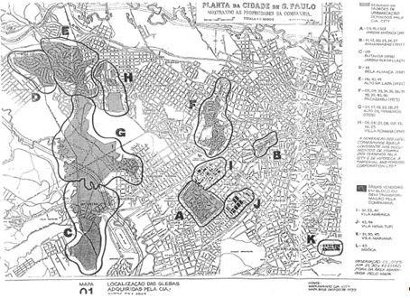
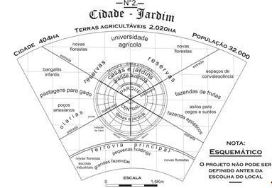
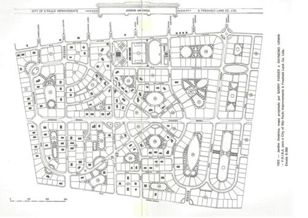
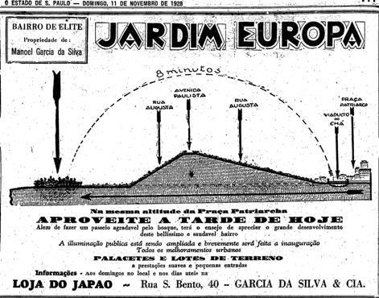
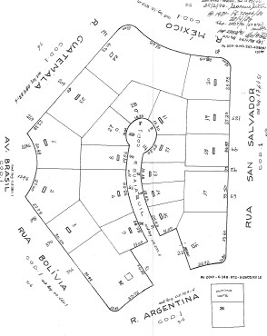
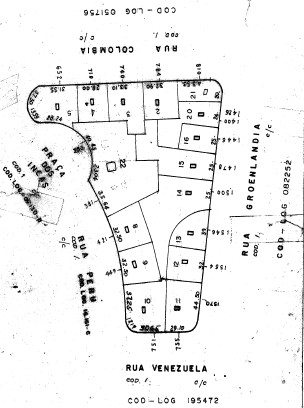
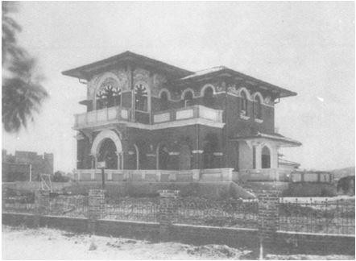
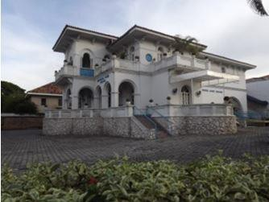
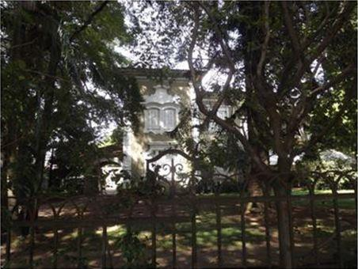
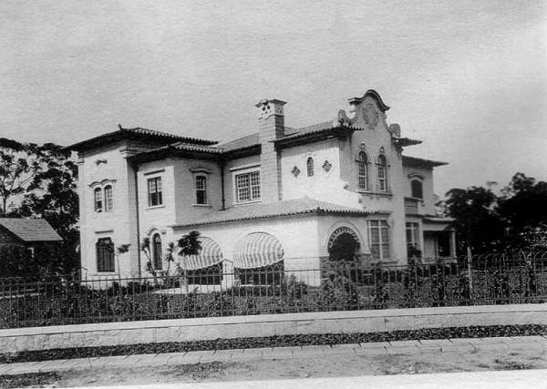

# Resumo

Os bairros-jardins paulistanos, projetados no início do século XX, que
constituem a paisagem urbana da cidade de São Paulo, representam a
integração entre ambiente preservado e edificações de diversos estilos.
Se o paisagismo e traçado de alguns destes bairros foram objeto de
atenção protecionista em meados da década de 1980, quando tombados pelos
órgãos de preservação1, suas edificações, em razão do desprestígio da
arquitetura eclética até então vigente, permaneceram à margem dos
inventários arquitetônicos específicos que marcaram os

estudos do patrimônio paulista naquela década. O fato é que atualmente
os muitos exemplares de arquitetura residencial erigidos entre a década
de 1920 e 1950 que variam do bangalô ao proto modernismo, de grande
interesse para estudos historiográficos, permanecem sem um inventário.
Sem instrumentos legais de proteção, esses edifícios vêm sendo, pouco a
pouco, demolidos ou descaracterizados, destacando-se dentre eles, os
projetos de autoria de Oswaldo Bratke, Rino Levi, Eduardo Kneese de
Mello e Gregory Warchavchik. Esta comunicação, como resultado parcial de
pesquisa em desenvolvimento no programa de *Pós Graduação Arquitetura,
Tecnologia e Cidade da Unicamp,* apresenta o transcurso histórico desta
região da cidade avaliando suas transformações nos últimos anos e
identifica os projetos arquitetônicos de bairros-jardins de interesse
para a arquitetura paulista no perímetro circunscrito pela área
conhecida como "Jardim América", projetado pela City of São Paulo
Improvements and Freehold Land Company Limited, e seus arredores através
da análise de documentação arquivística primária.

**Palavras-chave:** Arquitetura eclética paulistana, bairros-jardins
inventário arquitetônico, políticas públicas de preservação

# Abstract

The neighborhoods in São Paulo -- Brazil which follow the English
concept of garden city were first projected in the beginning of
twentieth century. They are aggregated in the urban landscape of the
city: an integration between preserved ambient and non-established style
buildings. It is well-known that these neighborhoods were put on
government focus in the middle of the decade of 1980, but their
buildings were not listed. In consequence to eclectic architecture in
force's discredit, they remained on the sidelines of specific lands'
inventory which let their mark on municipal patrimonial studies from
that time. Nowadays, the samples of residential architecture, which were
built between the 20's and the 50's, vary from banglow to
proto-modernism, well-regarded for historiographical studies, but with
no inventory that may provide qualifications of their characteristics
and no legal instruments to safeguard themand, little by little, they
are being demolished or modified. It is worth highlighting that

> 1 Em 1986 o Conselho de Patrimônio Histórico Artístico, Arqueológico e
> Turístico do Estado de São Paulo (Condephaat) tomba quatro bairros da
> cidade de São Paulo, denominados Jardins e identificados como: Jardim
> Paulista, Jardim Paulistano, Jardim América e Jardim Europa, por meio
> do Processo SC 23.372/85 que resultou na Resolução SC 02/86, na qual
> se propôs a preservação do traçado urbano, dos limites dos lotes e da
> vegetação.

distinguishes names in Brazilian architecture overview are associated to
the garden cities' architectural scene, such as Oswaldo Bratke, Rino
Levi, Eduardo Kneese de Mello and Gregory Warchavchik, in the case of
America Garden. This communication exhibit part of Master research'
results, integrated into the program of *Pos-Graduation Architecture,
Technology and City of the University of Campinas/Unicamp*, mainly
intending to identify garden city's architectural projects under the
interests of architecture's history of the perimeter circumscribed by
the label "America Garden", protruded by the City of Sao Paulo
Improvements and Freehold Land Company Limited, and its surroundings.
Besides emphasis on the analysis of primary archiving documentation to
study the architectural projects which are relevant, this research also
studies this zone historical course, appraising its late years'
modifications, arguing in consequence the legislation in effect (or the
lake of it) when coming to the protection of neighborhoods in historical
and cultural interests.

> ***Keywords:** Eclectic architecture of Sao Paulo, quarter city,
> architectural inventory, Public Policies of Preservation*

# Introdução

O desejo de inovação da década de 1910 na cidade de São Paulo favoreceu
a introdução do conceito de bairros-jardins, um modelo de loteamento2
introduzido pela *City of São Paulo Improvementes and Freehold Company
Limited,* empresa inglesa, sediada em Londres e proprietária de áreas
significativas do território paulistano. Esta empresa foi responsável
pelo loteamento de bairros residenciais nos quais, privilegiando a
introdução de áreas verdes e parcelamento do solo em lotes de grandes
dimensões, possibilitava a aquisição dos novos lotes através de sistema
de financiamento próprio.

O reconhecimento do valor cultural dos loteamentos paulistanos embasados
no conceito introduzido pela companhia inglesa se deu na década de 1980,
quando o Conselho de Defesa do Patrimônio Histórico, Arqueológico,
Artístico e Turístico/CONDEPHAAT efetivou o tombamento de loteametos de
áreas centrais da cidade. Neste tombamento priorizou-se o loteamento
mais antigo conhecido como "Jardim América" associado a outros três
loteamentos vizinhos compostos pelos "Jardim Europa", "Jardim Paulista"
e "Jardim Paulistano", que integram a área reconhecida no âmbito
municipal como Jardins. Tratam-se de áreas deslocadas do centro urbano
tradicional e que correspondem ao atual centro expandido da cidade de
São Paulo.

Em acordo com as discussões preservacionistas daqueles anos, tal
instrumento de preservação privilegiou a paisagem, o desenho urbano do
loteamento, os arruamentos, elementos considerados que nos garantiram a
permanência dos conjuntos e das escalas. Contudo, em consonância com o
desprestígio oficial da "arquitetura eclética" (estilo genericamente
atribuído às construções dos bairros-jardins) à época, deixou de fora do
tombamento as edificações erigidas entre 1910 e 1950 presentes nos
lotes. A não inclusão do patrimônio arquitetural no ato de salvaguarda
urbana significou negligência também com a avaliação de projetos de
diversos arquitetos que vieram a ter renome na arquitetura paulista, e
cujas obras não foram inventariadas e/ou estudadas nas suas
especificidades formais e técnicas, não obstante sua potencial
importância para a compreensão da própria arquitetura moderna do Estado.
A identificação em arquivos públicos de projetos significativos para
viabilizar

> 2 O conceito de "bairro-jardim" foi reproduzido em larga escala por
> outras companhias loteadoras tanto no município de São Paulo como em
> outras regiões do Estado de São Paulo, adotados em loteamentos como o
> "Jardim da Saúde", de autoria do urbanista Jorge Macedo Vieira e
> loteado pela Companhia de Terrenos da Saúde, o bairro do Sumaré
> implantado pela Sociedade Paulista de Terrenos e Construcções Sumaré
> Ltda ou até mesmo o Bairro de Interlagos, entre outros.
>
> reflexões acerca do desenvolvimento de determinadas linguagens
> projetuais é um dos desdobramentos que nossa pesquisa de mestrado em
> desenvolvimento no programa de *Pós Graduação Arquitetura, Tecnologia
> e Cidade da Unicamp3,* considera entre seus principais objetivos de
> estudo.

Confrontando a ideia pré-concebida de que a arquitetura dos
bairros-jardins representa-se exclusivamente por edificações de
orientação historicista sem interesse, questionamentos acerca da
variabilidade das tipologias e linguagens das edificações neles
presentes são detectáveis em estudos de outros pesquisadores.
Menciona-se aqui texto do arquiteto Luís Saia, publicado em 1959 no
Diário de São Paulo e disponibilizado em obra recente4 na qual relaciona
claramente a produção inicial de arquitetos consagrados pela arquitetura
moderna nos bairros-jardim, nomes mencionados também no importante
estudo realizado pela arquiteta Sílvia Ferreira Santos Wolff 5sobre o
"Jardim América:

> (\...) *os arquitetos Alfredo Ernesto Becker, Oswaldo Bratke, Dácio de
> Morais, Rino Levi, Eduardo Kneese de Mello e Warchavchik projetaram
> grande número de residências nos bairros que a City havia aberto para
> a burguesia paulista*. \[XAVIER, 2003, p. 110\]

# O Projeto Dos Bairros-Jardim

A Companhia City tornou-se proprietária de extensa área urbana, em torno
de 1.091.118 metros quadrados \[BACELLI: 1982\] para implantar o
loteamento que viria a ser denominado Jardim América, área delimitada
pelas ruas Estados Unidos (ambos os lados), Groenlândia, Atlântica e
Avenida Nove de Julho, na cidade de São Paulo.

Segundo mapeamento disponibilizado pela própria Companhia City,
destacado na Figura 1, a empresa foi proprietária de grande parcela da
área urbana da cidade de São Paulo até os anos 1940 \[Arquivo Companhia
City: 1939\], sendo que grande parte das áreas estavam bem deslocadas do
eixo central, identificadas na Figura 1 e assinaladas como áreas C, D,
E, G, H, I, J e K.

> 3 Pesquisa intitulada como "Inventário crítico dos bairros jardins
> paulistanos na primeira metade do século XX" 4 **XAVIER**, Alberto
> (org.) Depoimento de uma geração: arquitetura moderna brasileira. São
> Paulo: Cosac & Naify, 2003.pag. 110
>
> 5 **WOLFF**, Sílvia Ferreira Santos. "Jardim América: O primeiro
> Bairro-jardim de São Paulo e sua arquitetura".SãoPaulo: Editora da
> Universidade de São Paulo: Fapesp: Imprensa Oficial do Estado, 2001.
>
> 

**Figura 1:** Mapa da Cidade de São Paulo indicando as propriedades da
Companhia City no território paulistano na década de 1930. A letra "B"
identifica área nas imediações da Rua Avanhandava, área centro da cidade
que corresponde ao que se reconhece Centro Novo (para além do
Anhangabaú). Fonte: \[ARQUIVOS DA COMPANHIA CITY: 1939\]

Os loteamentos residenciais correspondentes aos bairros-jardins, antes
mesmo do reconhecimento como patrimônio ambiental pelos órgãos públicos,
já estavam sujeitos às restrições estabelecidas pela legislação
municipal de Uso e Ocupação do Solo, vigente desde 1975 na cidade de São
Paulo, assim como às restrições contratuais impostas pelas companhias
loteadoras e que estabeleciam parâmetros de ocupação diferenciados.

Dentre os muitos loteamentos implantados pela companhia inglesa, o
"Jardim América" foi o primeiro bairro da cidade de São Paulo a ser
formulado baseado no conceito de ocupação urbana introduzido pela
Companhia City, no qual se identificam os preceitos adotados nas
cidades-jardins inglesas. Estão associados ao projeto de Sir Ebenezer
Howard para a cidade de Letchworth, assim como às experiências
processadas na cidade de Welwyn e no subúrbio- jardim de Hampstead,
conforme destacado na Figura 2 \[HOWARD, 1996\].

> 

**Figura 2**: O desenho esquemático ilustra a ideia de integração
cidade-área urbana com implantação de dois grandes eixos de circulação
com destaque para casa e jardins no centro e circundado por serviços e
área agricultáveis (pastagens, escolas, fazenda de frutas, etc.)

O projeto cidades-jardins inglês, uma proposta de criação de cidades
auto do ponto de vista econômico, auto sustentáveis para a implantação
do "Jardim América", na cidade de São Paulo, adequou-se às
características locais tano no plano morfológico como no administrativo.
No primeiro caso, implicou em modificações em seu desenho para se
conformar a uma área relativamente plana nas proximidades do Rio
Pinheiros. No segundo, não existia a possibilidade de autonomia
econômica que os orientava originalmente por se tratar de um novo bairro
do município de São Paulo que devia estar vinculado À sua estrutura
administrativa., com um desenho urbano diferenciado do usualmente
praticado à época.

Afastado cerca de 3,7 quilômetros do centro da cidade, no plano espacial
o projeto para loteamento do "Jardim América" orientou-se a partir de
divisão central em "X" (ver Figura 3), que organiza o parcelamento da
área a partir da integração de zonas de áreas verdes com lotes de
grandes dimensões adotando soluções orgânicas de implantação em
contraposição ao traçado reticulado costumeiramente adotado. Tal traçado
era também contemplado com eixos viários diferentes de 90º, curvas e
novas figuras geométricas que lhe conferiam quadras com cantos
arredondados nos quais, em alguns casos, também se introduziram áreas
ajardinadas.

> 

**Figura 3:** Este documento corresponde ao projeto elaborado pela
Company City of Sao Paulo Improvements & Freehold Land Company Ltd --
datado de 1923 Fonte: \[REALE, 1982, p. 152 a 153\]

Os anúncios publicitários à época tentavam ressaltar a idéia de que
morar nos novos bairros seria um privilégio tendo como garantia o acesso
aos novos serviços públicos à disposição (bonde, iluminação pública,
fácil acesso ao Centro, entre outras facilidades), disponibilizados em
função da demanda imposta pela Companhia City ao governo municipal.

Assim como para o "Jardim América", veiculavam propagandas para os
bairros vizinhos, tal qual o anúncio da Figura 4 que indica citação do
jornal "*Estadão*", datado de 11 de novembro de 1928, identificando o
Jardim Europa como sendo:

> (\...) *Bairro de Elite, de propriedade de Manoel Garcia da Silva"
> ressaltando a comparação com o centro da cidade: "Jardim Europa\...na
> mesma altitude da Praça Patriarcha" assim como fazendo especial
> referência ao tempo de locomoção "\...APROVEITE A TARDE DE
> HOJE\...além de fazer um passeio agradável terá o \....de apreciar o
> grande*
>
> *desenvolvimento desse belíssimo e
> agradável bairro. A iluminação pública está sendo ampliada e
> brevemente será feita a inauguração.6*

**Figura 4:** Anúncio publicitário de venda de lotes no Jardim Europa,
São Paulo

Entre as modificações no traçado do novo bairro se observa que não
restou nenhum dos jardins internos constantes do desenho original do
loteamento do "Jardim América". Muitas das alterações no desenho
original do loteamento foram efetivadas pela própria companhia
loteadora, detentora dos direitos de fiscalização e parcelamento da área
do loteamento até os anos 1940.

Analisando os mapas disponibilizados por Roney Bacelli do "Jardim
América", apreende-se as modificações ocorridas até 1940, (informações
obtidas junto à Companhia City, antes mesmo do tombamento), em relação
ao desenho original do loteamento no qual se contemplou uma solução que
priorizava a integração entre as residências e os jardins internos de
miolos de quadra. \[BACELLI, 1982\]

Tais jardins internos se constituíam como uma proposta inovadora e eram
apresentados aos possíveis interessados como elemento diferenciador do
novo loteamento como item que conferia qualidade de vida para os novos
proprietários. No entanto, de acordo com Bacelli, os jardins internos
deixaram de ser um item essencial e inovador intensamente propagado
pelos veículos de divulgação do empreendimento da época (jornais,
panfletos, etc), transformando- se numa disputa judicial pela
apropriação da área dos jardins internos, ou seja, os proprietários dos
lotes circunvizinhos pretendiam a transformação do espaço de uso semi-
público em área privativa.

As dificuldades de gestão se apresentaram porque as áreas ajardinadas de
miolo de quadras demandavam constantes ações de manutenção. Para
amenizar o problema, a Companhia City tentou, inicialmente, formas
alternativas de administração de tais áreas: ou a divisão das despesas
com os proprietários de lotes lindeiros ou a transmissão de
responsabilidade para a prefeitura. Tais tentativas se mostraram
infrutíferas e a alternativa adotada pela companhia loteadora resultou
na extinção dos jardins internos adotando dois outros modelos:

1.  Desmembramento da área em novos lotes com os surgimento das ruas sem
    saída, nos moldes "cul de sac".

> 6 Anúncio publicitário acerca do Jardim Europa disponível In:
> [[http://www.marketingimob.com/2012/01/top-10-anuncios-]{.ul}](http://www.marketingimob.com/2012/01/top-10-anuncios-imobiliarios.html)
> [[imobiliarios.html]{.ul}](http://www.marketingimob.com/2012/01/top-10-anuncios-imobiliarios.html)
> \<data de acesso em 04/agosto/2013\>, e se refere a publicação de
> "*reclame*" no jornal Estadão (Jornal do Estado de São Paulo)

2.  Nova divisão da área com oferta e venda dos lotes remanescentes aos
    proprietários da quadra.

A primeira solução, exemplificada na Figura 4, na qual os jardins
internos foram transformados em ruas internas, e a consequente partilha
da área remanescente em novos lotes, resultaram quatro novos logradouros
que deram origem a novas ruas: Ruas Yucatan, Rua Terra Nova, Rua
Guayaquil e Rua Porto Rico.

A segunda solução, na qual a área foi dividida e vendida para os
proprietários de lotes da vizinhança imediata, em função do interesse e
poder aquisitivo de cada proprietário, gerou uma infinidade de novos
formatos de lotes, assim como possibilitou a criação de outros muito
menores que o usual para o restante do loteamento, conforme verifica-se
na quadra formada pelas Ruas Venezuela, Rua Colômbia, Rua Peru (vide
Figura 6).

Essas novas orientações, redesenhos,
resultaram na extinção dos jardins internos originais do loteamento do
Jardim América.

**Figura 5**: Exemplo de miolo de quadra com novos lotes e criação de
rua tipo "*cul de sac", cujos lotes* projetados para as ruas internas
eram significativamente menores do restante e que foram comercializados
já ao final da atuação da Companhia loteadora na região. Fonte:
\[SECRETARIA DE FINANÇAS E DESENVOLVIMENTO ECONÕMICO: 2014\].

> 

**Figura 6**: Exemplo de quadra do "Jardim América" resultante de
redesenho de divisão fundiária, com extinção do jardim interno. Fonte:
\[SECRETARIA DE FINANÇAS E DESENVOLVIMENTO ECONÕMICO: 2014\]

Ainda considerando a expectativa de manutenção de características
especiais para os lotes planejados de acordo com um desenho urbano que
destacava e privilegiava as áreas verdes e os amplos lotes os novos
proprietários estavam sujeitos à imposição de restrições contratuais,
que por vezes chegaram a ser mais restritivas que as estabelecidas pela
legislação de zoneamento em vigor à época.

> Entre as restrições contratuais elencadas pela Companhia City constam,
> entre outras: *Orientação para que o uso seja exclusivo para
> residência, não podendo ser comércio ou venda de mercadorias de
> qualquer natureza, sendo apenas residência unifamiliar \[\....\] sendo
> que os recuos serão: 8 metros do alinhamento da rua; 8 metros do
> limite de fundo, e os recuos laterais serão: 4 metros se a casa for
> térrea, 6 metros se for dois andares e 8 metros se for*
>
> *térreo mais dois andares superiores.7*

# O QUE CONSERVAR?

Como destacado anteriormente, a arquitetura implantada no Jardim América
não foi preservada. O caminho e razão de sua inclusão no tombamento do
CONDEPHAAT é complexo. Contudo a argumentação do Professor Carlos
Cerqueira Lemos, então Conselheiro do órgão de preservação do Estado de
São Paulo nos anos 1980, destacada por Bacelli em seu estudo,
possibilita, reflexões importantes sobre as valorações vigentes do
patrimônio edificado à época.

> (\...)*A área constitui um patrimônio ambiental urbano; sua função
> residencial é secundária, e mesmo a arquitetura local é irrelevante
> constituída por uma miscelânea de gostos e soluções arquitetônicas
> representantes de um estágio cultural* \[\...\]. *O que se deve
> conservar a todo*
>
> 7 Estas informações constam de contrato padrão formulado pela
> Companhia City e cedido pela Assessoria da empresa e se refere às
> informações de comercialização do imóvel localizado à Rua Guatemala,
> no 3 (corresponde ao lote 5 Quadra 25, do mapeamento original do
> Jardim América). Fonte: \[ARQUIVO DA COMPANHIA CITY: sem data\]
>
> *custo é o verde, o verdadeiro patrimônio; a escala e a taxa de
> ocupação dos lotes.* \[BACELLI, 1982\]

Passados quase trinta anos de tal manifestação, nós nos perguntamos se
ainda são válidos os argumentos que identificam arquitetura dos bairros
jardins como irrelevante.

O tombamento ambiental é uma realidade e foi de vital importância para a
cidade desde os anos 1980, no entanto, a efetivação da legislação de
preservação para a área de estudo não impede que novos elementos possam
ser identificados e também preservados, agora pautados em outros fatores
que se baseiem no valor cultural da produção arquitetônica lá existente.

Então, havendo nos bairros-jardins novos elementos culturais passíveis
de serem preservados, podemos entender que a investigação do patrimônio
arquitetônico produzido na área de estudo, através de um inventário,
transforma-se numa necessidade visando o reconhecimento dos estilos
arquitetônicos recorrentes no Jardim América e vizinhança imediata
correlacionando a produção arquitetônica inicial e a sobrevivência dos
exemplares edificados de forma a identificar a pré-existência e avaliar
a permanência dos estilos no decorrer do período.

Focando no interesse de identificação de estilos arquitetônicos, já foi
possível destacar que, entre os estilos encontrados, foi marcante a
presença de construções no estilo neocolonial (brasileiro e missões),
seguida de projetos no estilo normando e já sendo perceptível o
aparecimento das experiências preliminares do estilo moderno.

Nas figuras de 7 a 10 é possível
visualizar alguns exemplares arquitetônicos localizados no Jardim
América por meio em documentos que permitem compará-los em dois momentos
distintos. As figuras 7 e 8 correspondem a imagens de uma edificação
localizada na Avenida Brasil esquina com Avenida Nove de Julho. As
figuras 9 e 10 registram-se imagens de edificação na Rua Groenlândia. A
figura 9, é patente a obstrução visual provocada pela massa arbórea
existente nos limites do lote e na figura 10 observa-se a mesma casa nos
anos 1930.

> 

**Figura 7:** foto do acervo pessoal/julho/2013 **Figura 8:** A mesma
casa em 1928 \[REALE, 1982, p. 171\]

> 
>
> **Figura 9:** foto do acervo
> pessoal/julho/2013. **Figura 10:** a mesma casa -- Fonte: \[LEMOS:
> 1994\]

Na cidade como São Paulo já foram identificadas uma grande quantidade
bens de interesse de preservação, contabilizados, no momento, em torno
de três mil imóveis, constando entre eles vilas, edifícios, residências,
obras de arte assim como os bens imateriais, no entanto, não estão
contemplados neste escopo possíveis bens de interesse que porventura
possam existir nos bairros-jardins, áreas cujo tombamento é
reconhecidamente ambiental, ou seja, todos os bairros que receberam a
chancela de tombados e que o foram por questões que visavam à
preservação dos três itens destacados na resolução de tombamento, quais
sejam:

1.  O atual traçado urbano representado pelos logradouros públicos
    contidos entre os alinhamentos dos lotes particulares;

2.  A vegetação, especialmente a arbórea, que passa a ser considerada
    como bem aderente;

3.  As atuais linhas demarcatórias dos lotes, pois são também históricas
    essas divisões, sendo o baixo adensamento populacional delas
    decorrente tão importante quanto o traçado urbano.

# Conclusões

O primeiro reconhecimento do valor ambiental-urbano dos bairros jardins
através do tombamento foi formulado nos anos 1980, com estabelecimento
de critérios que permitiriam a manutenção dos elementos tombados, quais
sejam gabarito, vegetação, limites dos lotes e arruamentos, entre
outros.

Outro fator importante para a manutenção das características desse
ambiente urbano tombado pode ser atribuído às restrições contratuais
impostas pelas companhias loteadoras que, conforme apontado por
Meirelles, 1993, podem ser de dois tipos: *convencionais ou legais.*

Todas essas ações garantiram a manutenção parcial do ambiente urbano, no
entanto, não garantiram a sobrevivência dos padrões de ocupação, do uso
residencial, dos elementos de fechamentos dos lotes nem tampouco do
patrimônio edificado.

Por outro lado, nos bairros jardins paulistanos implantados nas
primeiras décadas do século XX podem ser encontrados edifícios
representativos de vários estilos arquitetônicos e a pesquisa ora em
curso pretende o reconhecimento da arquitetura edificada nos "jardins"
através da avaliação da produção de alguns arquitetos que ali atuaram e
da consulta a razoável material documental em bairros similares nos
quais os mesmos atuaram.

Assim, reconhecido o valor ambiental dos bairros jardins, é de
fundamental importância a verificação do patrimônio edificado que possa
auxiliar na elaboração de políticas públicas que propiciem a preservação
do patrimônio cultural edificado nos bairros-jardins, seja por meio de

um inventário sistemático utilizado como instrumento de preservação seja
com a identificação documental detalhada da arquitetura produzida nos
bairros-jardins nos diversos estilos e períodos de produção
arquitetônica na capital paulista.

Como resultado da pesquisa em andamento espera-se introduzir as
arquiteturas encontradas no escopo da história da arquitetura paulistana
atavés da avaliação dos documentos primários e assim, propiciar a
disponibilização de documentação inédita e dispersas e auxiliar no
reconhecimento da arquitetura enontrada nas áreas de estudo suscitando
dúvidas nos órgãos de preservação quanto à veracidade da afirmação de
que a arquitetura implantada nos bairros jardins não têm relevância.

# Referências

**AMARAL,** Aracy (coord.). Arquitetura neocolonial: América Latina,
Caribe, Estados Unidos. São Paulo: Memorial; Fondo de Cultura Económica,
1994

**BACELLI,** Roney. Jardim América: História dos Bairros de São Paulo.
São Paulo: Gráfica Municipal, 1982. Volume 20.

**HOWARD**, Ebenezer. Cidades-Jardins de amanhã. São Paulo: Hucitec,
1996.

**LEMOS,** Carlos A.C. El estilo que nunca existió. In: AMARAL, Aracy.
(coord.). Arquitetura neocolonial: América Latina, Caribe, Estados
Unidos. São Paulo: Memorial; Fondo de Cultura Económica, 1994, p.147 a
164

**MEIRELLES,** Hely Lopes. Direito Municipal Brasileiro. São Paulo:
Editora Malheiros, 1993.

**REALE,** Ebe. Brás, Pinheiro, Jardins: três bairros, três mundos. São
Paulo: Pioneira : Editora da Universidade de São Paulo, 1982.

**WOLFF**, Sílvia Ferreira Santos. Jardim América: O primeiro
Bairro-jardim de São Paulo e sua arquitetura -- São Paulo: Editora da
Universidade de São Paulo: Fapesp: Imprensa Oficial do Estado, 2001.

**XAVIER**, Alberto (org.). Depoimento de uma geração: arquitetura
moerna brasileira. São Paulo: Cosac & Naify, 2003
