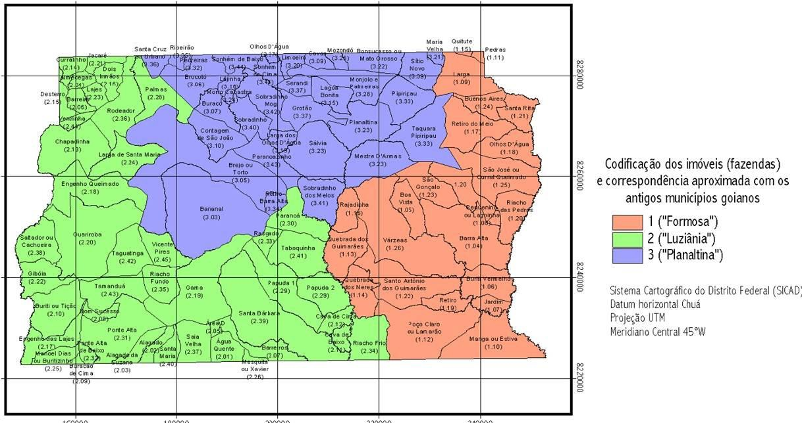

## Resumo

A construção da Nova Capital se deparou com uma ocupação tradicional na
forma de vida e de produção, onde os antigos moradores tinham a pecuária
como sua principal atividade econômica. Poucas são as pesquisas
realizadas sobre as antigas fazendas localizadas no atual Distrito
Federal - DF e sua inserção no espaço geográfico e na paisagem local.
Para compreender a morada rural das antigas fazendas goianas, nos
limites do atual DF, foi realizada uma análise da arquitetura vernacular
brasileira, suas principais características e os materiais e sistemas
construtivos utilizados. Examinamos, a seguir, a arquitetura civil de
Goiás, particularmente, o agenciamento espacial do corpo da casa goiana.
A partir de então, foram realizadas pesquisas nas antigas fazendas,
cujas terras foram desapropriadas para a construção de Brasília,
localizadas em diversas Regiões Administrativas e que, potencialmente,
poderiam abrigar remanescentes da arquitetura vernacular do
Centro-Oeste. Após investigação histórica e visitas de campo, foram
encontrados dez exemplares cujas características permitem supor serem
edificações erguidas nos séculos XVIII ou XIX. A análise permitiu
constatar que uma série de características foram recorrentes nas
habitações estudadas. Em que pese a diferença de conservação entre elas,
é muito próximo o aspecto ou consequência formal das moradas como
produto de um programa de vida todo peculiar no isolamento do planalto.
O inventário realizado evidenciou que as moradas rurais estudadas,
apesar dos anos, conservam suas características tradicionais e deixam
patente o contraste entre esse patrimônio vernacular e as manifestações
arquitetônicas modernistas de Brasília, demonstrando que o acervo
patrimonial do DF extrapola os limites do Plano Piloto. Não se pode
desconsiderar a grande dimensão patrimonial e cultural que esse conjunto
de fazendas antigas tem no registro da história do território do
Distrito Federal.

Palavras-chave: arquitetura rural, inventário, fazendas, Distrito
Federal

## Abstract

The New Brazilian Capital's construction faced a traditional occupation
in it's form of life and production, where former residents had
livestock as their main economic activity. There are few researches
concerning the old farms located in the current Federal District and
it's insertion in geographic space and the local landscape. Brazilian's
vernacular architecture main characteristics, materials and construction
systems were analyzed to understand the rural dwellings of ancient
Goiás' farms within the limits of the current Federal District. Goiás'
civil architecture was then examined, particularly the spatial
distribution of the house. The next step was to research old farms,
which would been located in various Administrative Regions, whose lands
were expropriated for the construction of Brasília, which could
potentially harbor remnants of vernacular architecture in the Midwest.
After historical

research and field visits, ten samples with particular set of
characteristics were found, indicating it's edification around the 18th
and 19th centuries. The analysis helped to confirm that a number of
features were recurrent in dwellings studied. Despite differences in
upkeep between them, it's evident that those dwelling aspects are

results of a peculiar lifestyle of isolation in the plateau. The
conducted inventory exposed that the rural dwellings studied, in spite
of the years, retain their traditional

features stating clear contrast between this vernacular heritage and
modernist architectural manifestations of Brasília, showing that the
Federal District's heritage assets go farther than Plano Piloto's
limits. The great heritage and cultural dimension that this set of
ancient farms have recorded on Federal District territory's history
cannot be disregarded.

Keywords: rural architecture, inventory, farms, Federal District

## Notas sobre a arquitetura rural

> A nossa arquitetura ainda não foi suficientemente estudada (\...). É
> nas suas aldeias, no aspecto viril das suas construções rurais a um
> tempo rudes e acolhedoras, que as qualidades da raça se mostram
> melhor. Sem o ar afetado e por vezes pedante de quando se apura, aí, à
> vontade, ela se desenvolve naturalmente, adivinhando-se na justeza das
> proporções e na ausência de *make-up*, uma saúde plástica perfeita --
> se é que podemos dizer assim (COSTA, 1995).
>
> A rigor, não foi ainda realizado o inventário das propriedades rurais
> brasileiras, e o seu levantamento tem sido conseguido de meras
> circunstâncias ocasionais, sem obedecer a qualquer plano de estudo ou
> pesquisa (CARDOZO, 2009).

Não deixa de ser curioso, e ao mesmo tempo preocupante, que um trabalho
sobre a arquitetura rural erguida na área de influência do atual
Distrito Federal (DF), adote como epígrafes extratos de textos de duas
figuras-chave para a execução da nova capital: o próprio autor do plano
piloto de Brasília, em 1938, e o engenheiro-calculista dos principais
palácios da cidade, em 1943. Não há confusão, mas sim intenção. Foram
dois intelectuais comprometidos com a escrita de uma história da
arquitetura nacional que, simultaneamente, buscava valorizar e preservar
parte do passado colonial e construir e consolidar uma linguagem
modernista. História onde Aleijadinho e Niemeyer, Diamantina e Brasília
receberam lugar de destaque. Costa e Cardozo estudaram a arquitetura
brasileira. Buscaram compreendê-la com olhos de quem queria vê-la. Ambos
colaboraram com o Serviço do Patrimônio Histórico e Artístico
Nacional-SPHAN, e constataram a particular desatenção com a arquitetura
do mundo rural.

Passados trinta anos, em 1964, Costa cobrou providências para o
tombamento da Fazenda Babilônia (GO):

> Não se compreende que, *morando* em Brasília há tanto tempo, o Alcides
> \[da Rocha Miranda1\] que é tão sensível **a essa modalidade
> arquitetônica primitiva e autêntica**, já não houvesse ele próprio
> tomado a iniciativa, e que os demais responsáveis pela faculdade na
> UNB não se tenham utilizado
>
> desse exemplar tão acessível e significativo para trabalho de campo --
> levantamento, fotografias, reconstituição. Ou será que desconhecem? Se
> o caso é esse -- *é inconcebível* (grifo nosso) (COSTA, 2004).
>
> 1 Arquiteto representante do SPHAN em Brasília e professor fundador da
> UnB.

O tombamento da Babilônia ocorreu em 1965 e foi o primeiro a proteger
uma construção rural na região Centro-Oeste do Brasil. Com valores
históricos, artísticos e arquitetônicos indiscutíveis e de fácil
constatação, a Fazenda Babilônia, provavelmente erguida entre 1800 e
1805 (JAYME, 1943), é uma exceção em todos os sentidos. Podendo-se
afirmar que não apresenta os padrões que caracterizaram a arquitetura
rural goiana do século XIX, conforme identificados por Adriana Oliveira
(2010), por Lena Freitas e Nancy Silva (1995) e por Lenora Barbo (2010).

A localização geográfica de Goiás em relação ao litoral brasileiro
resultou no estabelecimento de uma rede de antigas estradas coloniais e
no desenvolvimento, especialmente no mundo rural, de um modo de vida
particular, com a adoção de soluções para os problemas que lhes eram
próprios.

> No Centro-Oeste, e em Goiás em particular, inexistiu a agricultura de
> exportação, tal como praticada no Nordeste e no Sudeste. Com poucas
> exceções que confirmam a regra geral, **predominaram, durante as
> primeiras décadas de colonização, as pequenas propriedades rurais**
> com meia légua em quadra, localizadas próximo à boca das minas. (\...)
> Plantando roças de subsistência nas quais se praticava o cultivo da
> mandioca e do milho (\...) essas fazendas diferiam das *plantations*
> litorâneas não somente pela dimensão menor, como também pelo fato de
> serem trabalhadas por braços da própria família do proprietário,
> acrescidos eventualmente de um número limitados de escravos (\...).
> **A vida quotidiana era trabalhosa e árdua, despida de quaisquer
> veleidades de luxo e até mesmo de conforto**. A moradia, o transporte,
> os utensílios domésticos revestiam-se de feição utilitária, sem
> preocupações estéticas (grifo nosso) (FREITAS; SILVA, 1995).

Quando da construção de Brasília, a região do atual DF apresentava uma
baixíssima densidade populacional, correspondendo a um habitante por
quilômetro quadrado em 1958 (IBGE, 1959), e estava dividida em grandes
glebas rurais, as denominadas *fazendas*, originalmente pertencentes ao
território de dois municípios goianos do século XVIII -- Formosa
(Couros) e Luziânia (Santa Luzia) -- e um do século XIX -- Planaltina
(Mestre d'Armas) (Fig. 1). Região que apresentava dois núcleos urbanos
já consolidados, o de Planaltina (1811) e o de Brazlândia (1933). Assim,
quando da execução dos primeiros edifícios modernistas no Plano Piloto,
o DF já contava com um acervo patrimonial representativo de momentos e
contextos históricos anteriores, identificável ainda hoje nos setores
tradicionais ou centrais dos núcleos citados, como a Igreja de São
Sebastião (1880) ou a edificação que atualmente abriga o Museu Municipal
(1898), ambos em Planaltina e de feição colonial. Arquitetura de matriz
vernacular, encontrada também nos remanescentes de várias construções
rurais, particularmente nas moradas de *fazendas,* onde os antigos
proprietários mantinham a pecuária como a sua principal atividade
econômica.

> Figura 1 -- Codificação dos imóveis fundiários dos antigos municípios
> goianos. Fonte: BARBO, 2010.
>
> Segundo o *Dicionário da Arquitetura Brasileira* (CORONA; LEMOS,
> 1972), *partido*

em arquitetura:

> é o nome que se dá à consequência formal de uma série de
> determinantes, tais como o programa do edifício, a conformação
> topográfica do terreno, a orientação, o sistema estrutural adotado, as
> condições locais, a verba disponível, as condições das posturas que
> regulamentam as construções e, principalmente, a intenção plástica do
> arquiteto.

Para alguns dos principais estudiosos da arquitetura rural brasileira do
período colonial, os mais diferentes condicionantes e/ou determinantes,
geraram, em todo o Brasil, apenas dois partidos básicos: o *partido
fechado* e o *partido aberto*. O primeiro é caracterizado por abrigar,
reunir e ligar sob um mesmo teto, todos os elementos de um dado programa
arquitetônico rural (coabitação de funções distintas); e o segundo, ao
contrário, por hierarquizar, distribuir e afastar os vários elementos
(coabitação de apenas funções semelhantes). Como exemplo de partido
aberto temos os engenhos pernambucanos do açúcar, e de partido fechado,
a própria sede da Fazenda Babilônia

-   acolhendo sob uma só cobertura a casa de morada, a capela, os
    quartos de hóspedes e o engenho de açúcar com suas inúmeras
    dependências.

No caso particular das antigas fazendas goianas atualmente localizadas
no DF, foi o partido aberto que se afirmou. Assim, temos uma edificação
com função residencial -- a morada -- e uma série de outras pequenas
construções destinadas a funções diversas ligadas à pecuária e a
autossuficiência do lugar. Conjunto estrategicamente implantado nas
proximidades de um rio, córrego ou rego d'água (também utilizados como
fonte de energia) e que interage com um terreiro e um pomar.

A arquitetura civil produzida em Goiás2 pode ser considerada como uma
das mais simples que se conhece dentro do panorama arquitetônico
representativo do período colonial. Simplicidade sempre mais marcada no
meio rural, onde aflorava em função

> 2 Minas de Goiás até 1749, Capitania de Goiás de 1749 a 1822;
> Província de Goiás de 1822 a 1889 e Estado de Goiás a partir de 1889.

do isolamento, dos modos de vida e do baixo poder aquisitivo dos
moradores. São basicamente edificações de planta quadrada, elaboradas a
partir de uma estrutura autônoma de madeira, comumente chamada de
*gaiola*, com os vãos preenchidos por alvenaria de *adobe* ou
*pau-a-pique*. Em estudo sobre as paisagens rurais do sudoeste goiano, o
geógrafo Aziz Ab'Saber (apud BRUNO, 1959) observou que:

> As sedes são casarões de **um pavimento só e pouco imponentes,
> construídos de adobes entre armações de madeira e recobertos de telhas
> comuns -- e caiados de branco**. (\...) o tipo dominante de construção
> nas fazendas regionais: após o corpo frontal do edifício, que se volta
> para a estrada, seguem-se prolongamentos laterais mais baixos, na
> forma de puxadinhos, com a estrutura das paredes de adobe barreado e
> caiado (grifo nosso).

Em Goiás, o barro foi empregado na confecção de telhas; no revestimento
como reboco; no piso de *mezanela*3 e nas paredes, compondo técnicas
como, principalmente, o *adobe* e o *pau-a-pique*. O *adobe* é um
paralelepípedo de barro de grandes dimensões, empregado como os tijolos,
mas diferindo-se destes por não ser

cozido ao forno. De barro cru, seco à sombra e, depois, ao sol, é
composto de argila e areia, geralmente, misturadas com estrume e fibras
vegetais. Já o *pau-a-pique* consiste na montagem de uma trama de
madeira, com peças roliças colocadas na vertical, fixadas tanto aos
baldrames quanto aos *frechais*4, formando um gradeado trancado que será
preenchido com barro.

Para sua conservação, as paredes de terra crua requerem a adoção de
proteção. Contra as chuvas, além dos beirais dos telhados, as paredes
eram sempre recobertas por uma camada de reboco, composto de terra,
areia e cal e, por cima, uma camada de pintura à base de cal. Para
evitar a umidade proveniente do solo, a solução comumente adotada
consistia na execução de embasamentos em pedra.

Na construção de nossa arquitetura tradicional, diversas foram as
madeiras empregadas, assim como foi variado o seu uso. Roliças no
encaibramento das coberturas ou na armação da trama do pau-a-pique; e
lavradas na estrutura de sustentação das coberturas e paredes, nos
barrotes de sustentação de pisos e nas peças de enquadramento dos vãos.
Na forma de tabuado para pisos, forros e aberturas; treliçadas para a
vedação de janelas ou, ainda, delicadamente trabalhadas na forma de
cachorros (apoios) para os beirais.

## As moradas rurais -- Dois exemplos

Em 1958, Altamiro Pacheco (1975), na condição de presidente da Comissão
de Cooperação para a Mudança da Nova Capital, finalizou um importante
relatório acerca das propriedades rurais goianas contidas no futuro
território do DF. Entre outras coisas, relacionou os imóveis rurais
então pertencentes aos três municípios- mães (Formosa, Planaltina e
Luziânia) e que deveriam ser desapropriados. O levantamento foi
consolidado no documento *Novo Distrito Federal - Planta-Índice
Cadastral*, elaborado a partir do lançamento dos limites (divisas) de
todos os imóveis situados dentro do DF sobre folha cartográfica, na
escala de 1:100.000**.**

> 3 Um tipo de ladrilho feito de barro queimado, à moda do tijolo,
> utilizado como revestimento de piso, característico da arquitetura
> originária do Oriente Médio.
>
> 4 Viga corrida de madeira assente sobre o respaldo do último pano das
> paredes externas de uma edificação para dar apoio geral nivelado às
> tesouras ou a outras peças do telhado e servir de base para a sua
> fixação por meio de pregos.

Além de demarcar o perímetro fundiário dos imóveis, o mapa assinalou as
**casas de fazenda então existentes**, assim como reproduziu toda a rede
hídrica do território. Pela primeira vez, o projeto de Lucio Costa para
o Plano Piloto teve o seu esboço lançado sobre as terras da fazenda
Bananal, acrescido das penínsulas norte (implantada na fazenda Torto) e
sul (implantada nas fazendas Gama, Papuda e Rasgado).

De posse de tal *Planta-Índice Cadastral* de 1958, em 20085, buscamos
localizar e identificar quais as construções rurais sobreviveram à ação
do tempo e do homem. Após pesquisa histórica e visitas de campo, foram
encontrados **dez exemplares** ([Figura 2](#_bookmark0)) cujas
características permitem supor serem edificações erguidas nos séculos
XVIII ou XIX, quais sejam: morada da Fazenda Curralinho; Desterro; Gama;
Monjolo I; Monjolo II; Saco Grande I; Saco Grande II; Sobradinho I;
Sobradinho II; e Fazenda Velha. O inventário então realizado consistiu
no levantamento arquitetônico da morada rural; no seu registro
fotográfico; na identificação de suas características em relação à
localização no espaço geográfico do DF, aos padrões arquitetônicos, aos
materiais utilizados e aos sistemas construtivos empregados.

Das propriedades rurais estudadas, no presente artigo, buscamos
descrever apenas duas: as moradas das Fazendas Sobradinho I e II,
especialmente em função da existência de outro importante documento
cartográfico, a "Planta da Fazenda Sobradinho" registrada no Cartório de
Registro de Imóveis de Brasilinha/GO, em 1928. Sem dúvida, Sobradinho
está entre os nomes mais antigos da toponímia dessa região. Em 1734, o
tropeiro José Diogo registrou em diário manuscrito sua passagem por
"Sobradinho" (ROCHA JR. et al., 2006), nos limites do atual Distrito
Federal.

As duas edificações remanescentes se localizam em um vale, literalmente
às margens da antiga "Estrada da Bahia", também conhecida por "Estrada
de Cavalleiros à Torto" ou "Estrada Real à Goyazes" (Figs. 3 e 4). As
moradas estão localizadas na atual Região Administrativa de Sobradinho,
distantes 200m uma da outra, próximas ao córrego Brejo do Lobo. A região
é irrigada por córregos e ribeirões que descem dos morros circundantes e
o entorno é composto por diversas árvores frutíferas.

> 5 Sob a coordenação dos professores da FAU/UnB Andrey Schlee e Oscar
> Ferreira, e com a colaboração da arquiteta Lenora Barbo e do
> historiador Wilson Vieira Jr., os alunos da disciplina PROAU VIII
> participaram dos levantamentos cadastrais das edificações.
>
> 
>
> []{#_bookmark0 .anchor}Figura 2 -- Localização no território do DF das
> dez moradas rurais inventariadas. Fonte: BARBO, 2010.

> Figura 3 - Planta registrada da Fazenda Sobradinho. Área ampliada em
> destaque vermelho. Fonte: BARBO, 2010.

# 3

# 2

# 1
>
> Figura 4 - Destaque 1 -- "Estrada de Cavalleiros à Torto" assinalada
> no documento. Destaque 2 - "Estrada Real à Goyazes" assinalada no
> documento. Destaque 3 -- Localização de onze edificações, entre elas
> as moradas Sobradinho I e II, às margens da "Estrada Real à Goyazes".
> Fonte: BARBO, 2010.

## A Morada da Fazenda Sobradinho I

A morada térrea está situada em área plana, com declive na parte
posterior, tendo o seu núcleo básico construído em formato retangular,
com 13,60 metros de frente por 7,10 metros de frente aos fundos,
perfazendo 96,56m². A área total da casa com acréscimo é de 212,83m². O
embasamento é construído da combinatória de pedras e terra, sobre o qual
se sustenta estrutura portante de madeira aparente, com paredes de
vedação, externa e internamente em adobe. Ao redor de todas as paredes
está nítida a

presença do frechal que recebe o vigamento de madeira com armação de
tesoura. A cobertura de múltiplos planos recebe telhas de barro. O piso
é de assoalho de tábuas e de mezanela. As aberturas externas, portas e
janelas, recebem vergas retas de madeira. As portas são de madeira e as
janelas, retangulares, recebem externamente a armação da vidraça em
guilhotina e internamente os escuros de uma folha e trancados com
tramela. Parede de adobe e duas janelas internas treliçadas dividem o
espaço social em dois. O sistema construtivo -- gaiolas com paredes de
vedação de adobe, o embasamento e cobertura -- assim como os materiais
empregados -- madeira, pedras, areia e barro --, são originários e
dependentes do meio. A exceção se dá pelas telhas industrializadas de
barro e pelas janelas instaladas com vidro. Segundo suas funções atuais,
os espaços internos estão assim distribuídos: (a) na porção fronteira,
pelo espaço social ao centro, ladeado por um quarto, que se abre para a
sala; (b) na faixa central, separados pelo espaço social, abrem-se mais
dois dormitórios com janelas; (c) na parte de fundos, acrescida ao
núcleo básico da morada, ampliou-se o espaço social e foram incorporados
três quartos com janela, uma cozinha, dois banheiros, um depósito e uma
varanda. A iluminação natural é oferecida através das janelas e pelas
portas de frente e fundos. A morada recebe forro de madeira em toda a
área do núcleo básico. Plasticamente nota-se a linearidade da planta
retangular da morada. Nas fachadas, os cheios predominam sobre os
vazios, com ausência de ornamentos (Figs. 5 e 6).

> 
>
> Figura 5 - Planta baixa da morada da Fazenda Sobradinho I, destacados
> núcleo básico, prolongo e anexo.

> Figura 6 -- Fachada principal da Fazenda Sobradinho I. Foto: Acervo da
> PROAU-FAU UnB.

## A Morada da Fazenda Sobradinho II

A morada térrea está situada em área plana, com declive na parte
posterior, tendo o seu núcleo básico planta praticamente quadrada, com
8,10 metros de frente por 8,50 metros de frente aos fundos, perfazendo
68,85m². A área total da casa com acréscimo é de 114,35m². O embasamento
é construído da combinatória de pedras e terra, sobre o qual se sustenta
estrutura portante de madeira aparente, com paredes de vedação, externa
e internamente em adobe. Ao redor de todas as paredes está nítida a
presença do *frechal* que recebe o vigamento de madeira com armação de
tesoura. A cobertura de quatro águas recebe telhas de capa e canal. O
piso é de mezanela e de cimento queimado. As aberturas, portas e
janelas, recebem vergas retas de madeira. As portas são de madeira e os
vazios das janelas internamente são fechados pelos escuros e trancados
com tramela. O sistema construtivo -- gaiolas com paredes de vedação de
adobe, o embasamento e cobertura -- assim como os materiais empregados
-- madeira, pedras, areia e barro -- são originários e dependentes do
meio. Segundo suas funções atuais, os espaços internos estão assim
distribuídos: (a) na porção fronteira, pelo

espaço social de um lado e um quarto6 do outro que se abre para a sala,
todos com

janela; (b) na faixa central, separados por um corredor central,
abrem-se mais dois dormitórios com janelas; (c) na parte de fundos,
acrescida ao núcleo básico da morada, ampliou-se o espaço social e foram
incorporados um banheiro, uma cozinha e outra sala. A iluminação natural
é oferecida através das suas janelas e pelas portas de frente e fundos.
O núcleo básico recebe forro de palha. A composição harmônica é
principalmente sentida na superfície fronteiriça externa -- duas janelas
ladeando a

> 6 Dentro deste quarto foi criado um banheiro.

porta central --, com os cheios predominando sobre os vazios e ausência
de ornamentos. Plasticamente nota-se a linearidade e simetria
decorrentes das aberturas quadradas das janelas e retangular da porta na
fachada (Figs. 7 e 8).

> 
>
> Figura 7 - Planta baixa da morada da Fazenda Sobradinho II, destacados
> núcleo básico, prolongo e anexo.
>
> 
>
> Figura 8 **-** Fachada principal da Fazenda Sobradinho II. Foto:
> Acervo da PROAU-FAU UnB.

## Generalizando

A pesquisa realizada em 2008 permitiu constatar que uma série de
características se repetem nas dez habitações estudadas. A morada rural
encontrada é térrea, compacta na sua simplicidade, tem poucos cômodos. O
diminuto porte das construções ocasionou frequentes reformas, que não
tardaram a alterar, externa e internamente, as habitações, sem contudo
as desfigurar nos seus elementos construtivos básicos, com exceção da
Fazenda Desterro. O agenciamento espacial do corpo de oito moradas tem
como partido predominante o retângulo, com plantas próximas ao quadrado;
as outras duas -- Gama e Sobradinho II - são quadradas. A cobertura
predominante é a telha de barro com duas ou quatro águas, mas, em função
do agenciamento dos prolongos, variam aos múltiplos planos. Apenas duas
-- Curralinho e Desterro -- têm telhas de fibrocimento. Todos os
exemplares estudados foram construídos com materiais originários da
própria região. As estruturas portantes são de madeira aparente e as
paredes de adobe. A exceção é Saco Grande II, cujas paredes são de
pau-a-pique. As portas e janelas de madeira, com apenas uma folha, sem
ornato ou caixilhos eram fechadas com tramelas. As construções não
possuíam forro ou estuque, o comum foi o vigamento e as telhas ficarem à
mostra, tendo em média, três metros de pé-direito. Apenas as casas do
Gama e Sobradinho I possuíam forro de tábuas. Quanto às janelas, a
Fazenda Sobradinho I é um caso à parte, apresentando diversos tipos: de
apenas uma folha de madeira ou "escuro", de guilhotina com vidro e de
treliça. Tudo indica que não fazem parte da construção inicial, mas sim
frutos de reformas mais recentes. Os pisos nem sempre eram feitos de
tábuas, usava-se regularmente a terra batida ou ainda mezanela. As
fazendas Gama e Velha são as duas únicas que tiveram suas moradas
restauradas.

Quanto à localização e ao ambiente natural as construções rurais
inventariadas apresentam-se inseridas na paisagem local de forma muito
parecida. O núcleo básico se encontra assentado em terreno praticamente
plano, com o prolongo, quase sempre, em áreas com declive. Como regra
geral, mostra-se a existência em seu entorno de grande número de árvores
frutíferas e próximos a um curso d'água. Em algumas, ainda há resquícios
de rego d'água, tirado de mina ou de curso de água, que chegava até a
porta da casa. Os quintais, que podem ser entendidos como uma extensão
do espaço domiciliar, eram lugares para a criação doméstica de animais,
a pequena horta, as plantas aromáticas, ornamentais e medicinais e o
pomar. Constituíam um recurso de importância fundamental para o
abastecimento alimentar e apresentavam uma riqueza de cultivos
considerável. As árvores frutíferas encontradas com maior frequência
foram as mangueiras, jabuticabeiras, bananeiras, goiabeiras, jaqueiras e
os jenipapos.

As moradias antigas do Planalto Central foram moradias enxutas, secas;
água só na moringa ou no pote de barro. Perto da porta da cozinha, o
telheiro para lavagens era isolado e, mais tarde, encostou-se à porta
dos fundos (prolongo). Excetuando-se as Fazendas Sobradinho I e II, as
moradas não ficavam à beira das antigas estradas, mas às margens de
córregos ou regos d'água, entre outros motivos, para facilitar as lides
domésticas.

O clima também foi importante agente que interferiu na organização das
moradias. Em todos exemplares estudados, nas fachadas há grande
predominância dos cheios sobre os vãos, para enfrentar a forte insolação
da região. Observa-se que nenhuma das dez moradas apresentou, no seu
núcleo básico, varanda ou alpendre.

Quanto à área, dos dez exemplares, nove tem seu núcleo básico com
metragens que vão de 50 a 100m². Apenas a Saco Grande I apresenta núcleo
básico com cerca de

35m². Depoimentos dos moradores informam que a casa original era
construída mais próxima ao curso d'água e que devido a repetidas
enchentes foi desmontada e remontada mais acima no terreno. Não temos
informações suficientes para avaliar se foi obedecido o projeto da casa
original.

Após análise detalhada da planta baixa das moradas e seu entorno
imediato, foram registrados vinte e um pontos em comum em quase todas
elas:

1.  casas térreas;

2.  núcleos básicos com planta retangular, somados a acréscimos;

3.  corpo principal em terreno plano e prolongo em declive;

4.  agenciamento do espaço de cozinhar na parte posterior da planta;

5.  circulação centralizada atravessando a edificação;

6.  porta da frente diretamente conectada pela circulação centralizada a
    outra nos fundos;

7.  espaço social na frente da casa e espaço de serviço nos fundos;

8.  ausência de varandas ou alpendres no núcleo básico;

9.  cobertura de 2 ou 4 águas, com telhas de barro;

10. estrutura do telhado em madeira, sem forro;

11. paredes internas de meia altura;

12. materiais originários da própria região;

13. fachadas com predominância de cheios sobre os vãos;

14. estrutura portante de madeira aparente (gaiola);

15. paredes de adobe sobre embasamento de pedra;

16. piso de tábuas, cimento queimado ou mezanela;

17. janelas e portas de madeira, de vergas retas;

18. ausência de ornamentos;

19. forma plástica linear e simétrica;

20. quintal com árvores frutíferas;

21. curso d'água próximo.

Em que pese a diferença de conservação entre elas, é muito próximo o
aspecto ou consequência formal das moradas como produto de um programa
de vida todo peculiar no isolamento do planalto. As moradas
inventariadas preservam a maioria de suas características
arquitetônicas, apesar das alterações inevitáveis ao longo dos anos

-   exemplares centenários, remanescentes da cultura agrária anterior à
    construção de Brasília.

# Referências bibliográficas
>
> BARBO, L. C. *Preexistências de Brasília. Reconstruir o território
> para construir a memória.* Dissertação (Mestrado em Arquitetura e
> Urbanismo). UnB, Brasília, 2010.
>
> BRUNO, E. S. (Coord.). *As selvas e o pantanal.* São Paulo: Cultrix,
> 1959.
>
> CARDOZO, J. Um tipo de casa rural do Distrito Federal e Estado do Rio.
> In: MACEDO, D.; SOBREIRA, F. (orgs.). *Forma estática -- forma
> estética: ensaios de Joaquim Cardozo sobre arquitetura e engenharia.*
> Brasília: Câmara dos Deputados, 2009.
>
> COELHO, G. N.; VALVA, M. d'A. *Patrimônio cultural edificado*.
> Goiânia: EdUCG, 2001.
>
> CORONA, E.; LEMOS, C. *Dicionário da arquitetura brasileira.* São
> Paulo: Edart, 1972.
>
> COSTA, L. Fazenda da Babilônia ou São Joaquim. Pirenópolis -- GO. In:
> PESSÔA, J. (Org.). *Lucio Costa: documentos de trabalho.* Rio de
> Janeiro: IPHAN, 2004.
>
> COSTA, L. *Registro de uma vivência.* São Paulo: Empresa das Artes,
> 1995.
>
> FREITAS, L.; SILVA, N. Antigas fazendas do Planalto Central. *Ciências
> Humanas em Revista*, Goiânia, n.6, p.113-130, jul-dez, 1995.
>
> IBGE. *Censo experimental de Brasília.* Rio de Janeiro: 1959.
>
> JAYME, J. *Cinco vultos meia-pontenses.* Instituto Genealógico
> Brasileiro: 1943. OLIVEIRA, A. M. V. *Fazendas Goianas: a casa como
> universo de fronteira.*

Goiânia: UFG, 2010.

> PACHECO, A. M. Primórdios de Brasília. *Revista do Instituto Histórico
> e Geográfico de Goiás*, Goiânia, n.4, p.83-175, dez, 1975.
>
> ROCHA JR., D. A. et al. *Viagem pela Estrada Real dos Goyazes.*
> Brasília: Paralelo 15, 2006.
