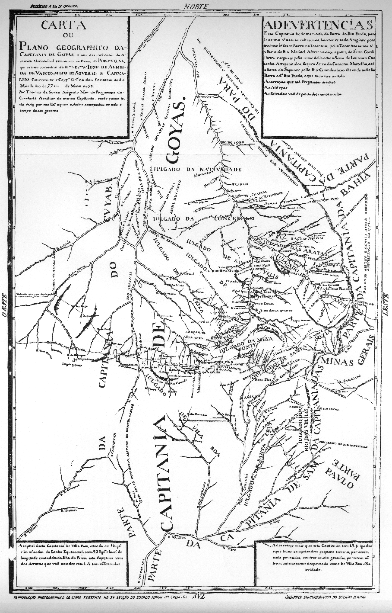

# Resumo

 Durante o Setecentos, a extensa Capitania de Goiás possuía em seu
 território apenas

 uma vila, a capital Vila Boa. Diante dessa realidade, este artigo
 busca hipóteses para compreender as razões da política da Metrópole
 para essa região, revelando formas diversas de administração e outras
 categorias de povoamento, tais como os arraiais, as freguesias e os
 julgados.

 Palavras-chave: hipóteses, território, Capitania de Goiás, setecentos

# Abstract

 During the Eighteenth Century, the extensive Captaincy of Goiás had in
 its territory only one *vila*, its capital Vila Boa. Given this
 reality, this article seeks hypothesis to understand the reasons for
 the Metropolis' policy for this region, unveiling various forms of
 administration and different categories of population, such as
 *arraiais*, *freguesias* and *julgados*.

 Keywords: hypothesis, territory, Captaincy of Goiás, eighteenth
 century

# Prelúdio

 Os Seminário de História da Cidade e do Urbanismo vêm apresentando uma
 grande gama de pesquisadores trabalhando com inúmeras facetas não só
 da *História das Cidades*, como também sobre a *História Urbana* e a
 *História da Urbanização1.* Esta última, tende a estudar o objeto em
 escalas variadas, analisando o *processo* da urbanização, ou seja, um
 processo mais social que puramente técnico. Por isso, a

 necessidade em lançar luz não somente nos aspectos morfológicos
 urbanos de determinada cidade, mas ampliar a escala para o território,
 de modo a compreender a constituição das redes urbanas, levando-se em
 consideração as políticas contemporâneas que incidem nesse território
 e os atores que fazem a engrenagem funcionar na escala local.

 Trabalhando nessa escala, referente à apropriação histórica do
 território, esse artigo tende a lançar algumas hipóteses sobre a
 ocupação do território goiano no setecentos. No século XVIII, a
 Metrópole estava empenhada em uma nova política estratégica em sua
 colônia do além mar: a de ocupação do vasto território a oeste.
 Durante esse período, a Metrópole investiu muito em levantamentos
 cartográficos de modo a conhecer e controlar melhor o território da
 colônia, sobretudo nas regiões de fronteira com a América espanhola2.
 Nesse contexto, requerimentos com pedidos de

 1 A História da Urbanização aborda a produção dos espaços não somente
 através do urbanismo (via espaços projetados, inserido em uma lógica
 erudita) mas levando-se em conta também uma vertente vernácula, que
 diz respeito ao processo social de transformação desses espaços.
 Conferir BUENO, Beatriz P. S. Dossiê -- Caminhos da História da
 Urbanização no Brasil-colônia. In *Anais do Museu Paulista*
 \[online\]. 2012, vol.20, n.1. Pg. 19. Disponível em:

 [\<http://www.scielo.br/pdf/anaismp/v20n1/v20n1a02.pdf](http://www.scielo.br/pdf/anaismp/v20n1/v20n1a02.pdf)\>.

 2 Em Goiás, entretanto, a presença de engenheiros militares se
 limitava basicamente à elaboração de mapas gerais da capitania ou
 benfeitorias em núcleos mais desenvolvidos ou planejados, como o caso
 da capital Vila Boa (no plano do governador Luis da Cunha Menezes de
 1778) ou dos aldeamentos de autorização para expedições ao sertão eram constantemente deferidos.
Minas Gerais recebia um grande contingente populacional em busca do ouro
e Cuiabá, com a descoberta de novos veios, provava que a distância valia
a pena. No meio do caminho, uma região apenas percorrida, que até então
não havia sido ocupada pela empresa colonizadora portuguesa.

Em 1726, após encontrar o metal precioso às margens do Rio Vermelho,
Bartolomeu Bueno se tornou superintendente das Minas de Goiás. Lá fundou
os primeiros arraiais da futura capitania: Barra, Ferreiro, Ouro Fino e
Sant'anna. Como superintendente tinha a atribuição de manter a ordem e
arrecadar impostos. Por ser o responsável pelo descobrimento do ouro,
passou a ter direito ao controle das passagens dos rios e poder de
distribuir datas minerais, dentre outros privilégios. Com base no
Regimento de 1702, Palacín (1972, pg 34) atesta que o superintendente
das minas acumulava cargos dos ouvidores e juízes de fora, tendo toda a
jurisdição ordinária, cívil e crime das minas.

Passados dez anos de descobertas de novos veios e considerável
crescimento populacional, a Coroa sentiu a necessidade de deter maior
controle administrativo e econômico, ordenando em 1736, através de Carta
Régia de 11 de fevereiro, que o Conde de Sarzedas, então governador da
capitania de São Paulo, seguisse à região das Minas de Goiás com a
finalidade de lá estabelecer uma vila. Em 1737 o governador faleceu na
região, sem definir qual arraial receberia esta promoção.

Diante da urgência em manter a ordem, em um cenário tomado pela
violência causada por brigas, roubos, invasões de terras e mortes, em
1738, Agostinho Telles Pacheco, sucessor de Bueno na superintendência
das minas, informou ao rei D. João V da necessidade de instalação de
justiça na região. Dessa solicitação decorreu a implantação dos
julgados, solução paliativa já que naquelas minas não existia nenhuma
vila.

A instalação da vila solicitada pela Coroa em 1736 só veio a se efetivar
três anos depois. D. Luiz de Mascarenhas, sucessor de Sarzedas, optou
pelo arraial de Sant'Anna para a implantação da Casa de Câmara e Cadeia.
A partir de então, passou a ser reconhecida como Vila Boa e com isso
selou sua eterna rivalidade com Meia Ponte, que também pleiteava a sede
administrativa3. Boaventura (2007, pg. 67) defende em sua tese a escolha
de Sant'Anna em detrimento de Meia Ponte em função da sua localização,
que estaria a oeste de Tordesilhas. Embora alguns mapas acenassem a
localização do meridiano, sabemos que a precisão não era um forte da
cartografia do Setecentos. Dessa forma, os critérios de escolha da
futura vila ainda

não foram realmente desvendados.

O fato é que até a passagem do século XVIII ao XIX, nenhum arraial além
de Sant'Anna havia sido elevado à vila4, nem mesmo depois de conquistada
a autonomia

> São José de Mossâmedes e da Aldeia Maria, de 1774 e 1780,
> respectivamente.
>
> 3 Sant'Anna/Vila Boa atualmente é a cidade de Goiás e Meia Ponte é
> Pirenópolis. Meia Ponte só foi elevada à categoria de vila em 1832.
>
> 4No final da década de 20 do século XVIII surge no caminho de São
> Paulo o arraial de Santa Cruz. Nos
>
> anos 1730, foram descobertas as minas ao norte, conhecidas como "minas
> do Tocantins": Maranhão, Água Quente, Natividade, Traíras, São José,
> São Félix, Cachoeira, Pontal e Porto Real. O início da década seguinte
> foi marcada com a ocupação de Arraias, Cavalcante e Pilar. Como
> descreve Palacín (idem, pgs. 30 e 31), as novas minas estavam nas
> "desoladas montanhas da região norte, entre

da capitania de Goiás em relação à capitania de São Paulo em 1744. Vila
Boa, por dispor de mais estrutura, foi escolhida como capital da recém
criada capitania. D. Marcos de Noronha, o primeiro governador da
Capitania de Goiás também conhecido como Conde dos Arcos, chegou em Vila
Boa somente cinco anos depois da emancipação de Goiás.

> Tabela 1. Vilas nas capitanias mineradoras do século XVIII

+----------------------+----------------------+----------------------+
| > **VILAS NAS        |                      |                      |
| > CAPITANIAS         |                      |                      |
| > MINERADORAS DO     |                      |                      |
| > SÉCULO XVIII**     |                      |                      |
+======================+======================+======================+
| > Capitania de Minas | > Capitania de Mato  | > Capitania de Goiás |
| > Gerais             | > Grosso             |                      |
+----------------------+----------------------+----------------------+
| > 13 vilas5          | > 4 vilas6           | > 1 vila7            |
+----------------------+----------------------+----------------------+

O que se percebe em teses, dissertações e publicações é que muito já se
falou sobre os bandeirantes e suas expedições, assim como sobre suas
descobertas e ocupação do sertão goiano no Setecentos, retratada com o
afã dos veios auríferos prosseguida por relatos sobre a decadência que
assolou o século XIX. Entretanto, a inexistência de uma rede de vilas
parece não ter incomodado os pesquisadores, que não questionaram esse
fato em seus estudos.

Diante dessa inquietação, cabe uma breve revisão bibliográfica a
respeito da *História da Urbanização.* No caso de Goiás, nomes como Luís
Palacín e Paulo Bertran figuram como os principais pesquisadores
contemporâneos que tratam da ocupação do território goiano em função da
mineração. Escritos dos governadores da província de Goiás do Oitocentos
como Cunha Mattos8 e Alencastre9, além do padre Silva e Souza10 são
fontes essenciais para aqueles pesquisadores que se dispõem a estudar a
história de Goiás.

A morfologia urbana enquanto espaço construído foi tratado por alguns
arquitetos como Gustavo Neiva Coelho. Sua produção vem servindo de
referência, por ser pioneira neste assunto em Goiás, abarcando nos seus
estudos a configuração de alguns núcleos auríferos do Setecentos,
principalmente o caso de Vila Boa, hoje cidade de Goiás. Meia Ponte,
atual Pirenópolis, figura em várias publicações de Jarbas Jayme,
incorporando basicamente aspectos de sua história.

Com um enfoque diferenciado, o trabalho mais recente a tratar do
processo de formação e desenvolvimento da rede urbana das minas de Goiás
no século XVIII é a

> Tocantins e o deserto sertão da Bahia". Outras minas vão surgindo ao
> longo do Setecentos, inclusive no período de decadência do ouro.
>
> 5 Mariana, antiga Vila de Nossa senhora do Ribeirão do Carmo, não foi
> contabilizada neste quadro por ter se tornanado cidade ainda no século
> XVIII. 1711: Vila Rica (Ouro Preto); Vila Real do Sabará.
>
> 1713: São Jõao Del Rei. 1714: Vila Nova da Rainha (Caeté); Vila do
> Príncipe (Serro). 1715: Piedade do Pitangui. 1718: São José Del Rei
> (Tiradentes). 1730: Minas Novas. 1789: São Bento do Tamanduá
> (Itapecerica). 1790: Queluz (Conselheiro Lafaiete). 1791: Barbacena.
> 1798: Campanha da Princesa (Campanha); Paracatu do Príncipe
> (Paracatu). FONSECA, 2001, p. 774.
>
> 6 1727: Vila Real do Senhor Bom Jesus do Cuiabá (Cuiabá). 1752: Vila
> Bela da Santíssima Trindade. 1778: Vila Maria do Paraguai (Cáceres).
> 1780: São Pedro del Rei (Poconé). AZEVEDO, 1956, p. 45
>
> 7 1739: Vila Boa (Goiás).
>
> 8 *Chorographia histórica da província de Goyaz*, escrito em 1824 e
> publicado no 2º Trimeste de 1874 na *Revista do Instituto Histórico e
> Geográfico Brasileiro.*
>
> 9 *Anais da Província de Goiás*, escrito em 1863 e publicado no 3º
> Trimestre de 1864 pela *Revista do Instituto Histórico e Geográfico
> Brasileiro.*
>
> 10 *O Descobrimento, Governo, População e Cousas Mais Notaveis da
> Capitania de Goyaz*, concluído
>
> em 1849 e publicado no 4º Trimestre de 1849 pela *Revista do Instituto
> Histórico e Geográfico Brasileiro.*

tese defendida por Deusa Maria Rodrigues Boaventura em 2007 no PPG AU
FAU USP. A sua pesquisa aborda principalmente os núcleos que receberam
no Setecentos planos urbanos, em especial a capital Vila Boa e alguns
aldeamentos indígenas. A pesquisadora aposta na urbanização da capitania
como peça chave na política centralizadora da ocupação colonial
portuguesa no Setecentos.

Mesmo com as referências acima, percebe-se uma grande lacuna em relação
a estudos mais aprofundados sobre os demais *arraiais* mineradores
goianos daquele período11. Diante deste cenário, é possível constatar um
território ainda inexplorado, que tem como fonte segura os documentos
armazenados nos arquivos públicos oficiais e religiosos.

Seguindo com o levantamento acerca da História da Urbanização no Brasil,
nos deparamos com a obra que debutou os estudos acerca dessa temática,
em perfeita sintonia com pesquisas correntes em outros países na
passagem da década de 1950 para 196012. Com a obra "Evolução Urbana no
Brasil 1500/1720", Nestor Goulart Reis ainda é referência ao tratar, em
linhas gerais, da organização colonial revelando

aspectos políticos, administrativos, econômicos e sociais daquele
período, com enfoque na organização da rede urbana e dos núcleos
propriamente ditos.

Pesquisadores das gerações seguintes apresentaram outras indagações, mas
continuaram contribuindo para a produção de obras de referência a
respeito da História da Urbanização. A abordagem de Roberta Delson, por
sua vez, segue com o estudo acerca da política da Metrópole no século
XVIII, enfocada na ampliação do sistema urbano pela "vasta hinterlândia"
sendo controlada por uma política mais centralizadora por parte da
Coroa. Em seu livro, são analisados alguns sítios urbanos desse período,
entretanto o foco continua voltado aos centros mais desenvolvidos por
assim dizer, ou seja, nas novas vilas e cidades.

Em seu livro "Cidade no Brasil: terra de quem?", Murillo Marx aborda a
relação Estado x Igreja de forma esclarecedora. Em sua obra, revela como
as normas e os procedimentos eclesiásticos influenciaram na formação e
no desenvolvimento do espaço urbano colonial. Em uma capitania como a de
Goiás, isso fica muito claro, uma vez que a Câmara, até a passagem do
século XVIII para o XIX só havia sido instalada em um único núcleo. O
estudo mais aprofundado desse material é primordial para analisar o
crescimento urbano dos arraiais goianos do Setecentos, que se
desenvolveram tendo a Igreja como um dos principais agentes modeladores
do núcleo minerador.

De uma maneira ou de outra, a bibliografia relacionada acima abarca
questões diversas sobre a urbanização brasileira durante o período
colonial, entretanto outros aspectos são tidos como lacuna. Em busca de
referências a respeito de modos diferenciados e não convencionais de se
governar, alguns autores acenaram com uma

> 11 Essa carência foi sentida quando busquei por bibliografia sobre os
> núcleos urbanos e edificações do século XVIII para compor os verbetes
> sobre os atuais estados de Goiás e Tocantins para o volume das
> Américas refente ao livro "Património de Origem Portuguesa no Mundo --
> Arquitectura e Urbanismo", publicado em 2010 pela Fundação Calouste
> Gulbenkian (FCG) em volume realizado sob direção de José Mattoso e
> coordenação de Renata Malcher Araújo.
>
> 12 Por apresentar um estudo histórico dos núcleos urbanos no
> território como um produto social, vale conferir a produção do
> argentino Jorge Enrique Hardoy (sobretudo a sua tese "Ciudades
>
> Precolombinas", defendida em Harvard em 1964) e os estudos da década
> anterior da italiana Donatella Calabi e do inglês Arthur Korn (BUENO,
> 2012, pg. 14).

possibilidade de estudo, sobretudo no caso dos julgados. Em sua análise
referente à formação da Mata paraibana, Juliano Carvalho aborda os
julgados atuando como uma alternativa por parte da Coroa para exercer
controle sobre áreas ocupadas sem a necessidade de elevação de novas
vilas. Com este estudo, fica claro que os julgados não eram uma
prerrogativa somente das regiões mineradoras, uma vez que também estavam
presentes em outras regiões da Colônia.

Claudia Damasceno Fonseca, responsável pela publicação do livro
"Arraiais e Vilas D'el Rei: espaço e poder nas Minas setecentistas"
passa a ser a principal referência sobre os julgados, por apontar essa
forma de jurisdição atuando em uma região mineradora, na capitania
vizinha de Minas Gerais13.

Ultrapassando os limites atuais dos estados da federação, trabalhando em
uma perspectiva macroregional, Nestor Goulart Reis Filho em sua
publicação mais recente "As Minas de Ouro e a formação das Capitanias do
Sul\" retrata a mineração nas capitanias do sul. Partindo do conceito de
Paisagem Cultural, Goulart supera o regionalismo historiográfico em nome
de uma visão mais ampliada, alinhavando em seu estudo a relação do homem
com seu meio, o que determinou a transformação de uma nova paisagem,
imprimindo no espaço as necessidades daquele grupo naquele momento.

As novas produções de História da Urbanização aos poucos vêm trazendo à
tona novas perguntas e preenchendo vazios historiográficos. Com um
enfoque atual, vêm trilhando alguns caminhos já percorridos, contudo
apresentando questões que passaram despercebidas nos momentos
anteriores.

# Para além das vilas: as outras categorias de povoamento na capitania

Um fator comum entre os núcleos mineradores, além do extrativismo e da
sua forma de ocupação, é seu caráter citadino -- o que os difere das
outras ocupações no território da colônia, ligadas às grandes sesmarias.
Coelho (2001, p.139), analisando os núcleos auríferos, explica que

> O processo minerador, pelo seu próprio caráter de organização, não
> comporta o estabelecimento da população de forma rural ou isolada.
> Assim, o seu desenvolvimento, baseado em uma forma de estruturação
> urbana completamente diferente da encontrada no período, faz com que o
> trabalho da mineração e o seu controle pelo Estado, por meio da
> cobrança dos inúmeros impostos a ela associados, passem a exigir um
> tipo de organização no qual o agrupamento urbano vai ser um elemento
> de fundamental importância.

Fonseca lista ainda mais duas semelhanças entre os arraiais: o caráter
espontâneo e consequentemente vernacular em relação à ocupação e
urbanização dos núcleos, além da forma como eram elevados à vila.
Segundo a autora, "(\...) não ocorreram criações

> 13 Sobre os julgados, conferir também SALGADO, Graça (org.). *Fiscais
> e Meirinhos: a administração no Brasil Colonial.* Rio de Janeiro: Nova
> Fronteira/Arquivo Nacional, 1985 e SCHWARTZ, Stuart B. *Burocracia e
> sociedade no Brasil colonial: O tribunal Superior da Bahia e seus
> desembargadores, 1609 -- 1751.* São Paulo: Companhia das Letras, 2011.

de vila *ex nihilo*, e sim concessões de autonomia municipal a povoações
ou arraiais constituídos" (FONSECA, 2001, p.769), ao contrário da
formação de outras vilas do setecentos que não vieram na crista da onda
do ouro, mas foram frutos da empreitada da metrópole em se ocupar o
sertão.

A autora trabalha ainda com a conceituação da palavra "arraial".
Analisando seu significado no *Diccionario da Lingoa Portugueza*,
publicado em Lisboa pela Academia Real das Ciências de Lisboa no ano de
1793, o verbete aponta que arraial significava "exército posto em
campanha, ou sítio em que está postado debaixo de barracas (\...);
alojamento de qualquer corpo volante de gente (\...)". Da reflexão que
fez do termo, Fonseca ainda aponta que foi Saint-Hilaire quem constatou,
ainda no século XIX, que "arraial" se empregava somente às regiões
mineradoras. Dizia que a palavra significava um "lugar de acampamento"
-- ação que os primeiros mineiros fizeram e que, devido à quantidade de
minérios que encontravam, acabavam se estabelecendo no local. Por fim, o
botânico, segundo Fonseca, concluiu que com o tempo, o termo perdia seu
significado primitivo -- o de acampamento.

Os arraiais geralmente recebiam o nome do santo, que poderia ser aquele
do dia de sua descoberta ou ainda o da devoção dos fundadores. Como
aconteceu na bandeira de Bueno, era costume que religiosos acompanhassem
as expedições. Quando da fundação do arraial, lá estavam para escolher o
melhor lugar para a implantação da capela, de modo a se obter, um dia, a
sagração do templo. Segundo Marx (1991, p.20, 22), a capela deveria
estar implantada em local "decente", num sítio alto, solta no espaço,
livre da umidade e com lugar reservado para o adro, como constava nas
*Constituiçõens Primeyras do Arcebispado da Bahia,* do século XVIII.
Dessa forma, as recomendações eclesiásticas interferiram diretamente no
desenho urbano, uma vez

que as determinações civis eram vagas ou simplesmente não existiam, até
a instalação de uma câmara no local. A Igreja, representada pelo clero
secular14, seguia como principal agente modelador do ordenamento urbano,
guiando o crescimento urbano de acordo com a localização de seus
templos, criando novos bairros e direcionando as áreas de expansão
(COSTA, 2007, pg 33).

Com crescimento do núcleo e sua consolidação, não demora para o arraial
ser reconhecido como freguesia e ter sua capela adquirido status de
matriz. Marx (1991, p.18) aponta que "não era somente o acesso garantido
então à desejada e necessária assistência religiosa que se obtinha, mas
também ao reconhecimento da comunidade de fato e de direito perante ao
próprio Estado".

Como é sabido, o papel da Igreja nesses núcleos transcendia o caráter
religioso. Nas freguesias, as matrizes desempenhavam papel importante
por corresponderem aos núcleos das paróquias e o pároco, era a
autoridade local. Nessas regiões a Igreja lidava com implicações
sociais, civis e jurídicas, pois era local de encontros sociais
(batizados, casamentos, festas) e de prestação de outros serviços, como
registro de testamentos, realização de atividades de contagem da
população, de devassas

> 14 É necessário reforçar o papel da Igreja durante o período colonial:
> o papado estabeleceu com a Coroa Portuguesa uma espécie de aliança, em
> que a última era responsável pela manutenção do clero secular e a
> Igreja, em contrapartida, servia de instrumento para manter a coesão
> do império português (CASTRO, José Luiz de A. *Organização da Igreja
> Católica na Capitania de Goiás: 1726 -- 1824.*
>
> Goiânia: Ed. da UCG, 2006, pg. 23). O Rei, grão-mestre da Ordem de
> Cristo, era responsável pela colação dos párocos e sua sustentação,
> fazendo dos mesmos funcionários da Coroa -- o que era muito útil em
> regiões onde a Câmara ainda não tinha atuação.

eclesiásticas, entre outras atividades.
(VASCONCELOS, 1997, p.251; CASTRO, 2006, p.133). Não é à toa que os
arraiais elevados à vila normalmente já eram freguesias, ou seja,
sediavam uma matriz em seu território, tendo outros arraiais
subordinados a si.

> Figura 1*. Carta ou Plano*
>
> *Geográfica da Capitania de Goyas*. Fonte: IPEHBC

A Igreja delimitava as áreas territoriais correspondentes às freguesias,
criando verdadeiras redes no território, a exemplo dos julgados. Ao
analisar as cartas cartográficas da Capitania de Goiás do século XVIII é
possível observar como esses sítios se relacionavam, ao identificar
essas duas redes: uma eclesiástica e a outra, jurídica. Essa constatação
fica mais clara no mapa acima, realizado por Thomas de Souza em 1778,
mais conhecido como *Mapa dos Julgados.* Observando esse cenário é
possível verificar a existência de outras redes urbanas, mesmo sem o
estabelecimento de uma trama composta por vilas.

> Segundo o *VOCABULARIO PORTUGUEZ & LATINO, aulico, anatomico,
> architectonico\...* de Rafael Bluteau, publicado em 172815, julgado é
> uma povoação que não tem pelourinho e não goza dos privilégios de
> vila, entretanto é servido por justiça. Dessa forma, os julgados não
> possuíam autonomia administrativa como as

vilas, mas com a instalação da justiça, os arraiais passavam a ser
dotados de juízes ordinários. Com essa estrutura, a cabeça de julgado
possuía autonomia judiciária apenas parcial, uma vez que não possuía a
jurisdição completa, ou seja, não comportava em sua estrutura juízes
responsáveis pela administração de bens dos órfãos e por julgamentos no
cível ou crime. Dessa forma, esses julgados continuavam dependentes de
uma câmara vizinha (FONSECA, 2011, pg. 89). Na capitania de Goiás era
comum verificar a presença da cadeia nas cabeças de julgado, como no
caso de Meia Ponte e Pilar.

# Qual seria a estratégia da Coroa portuguesa para a não elevação de Vilas?

Uma inquietação acompanha esse artigo e aqui serão lançadas alguma
hipóteses, de modo a vislumbrar quais seriam os interesses da Coroa
Portuguesa em manter a Capitania de Goiás longe da atuação das Câmaras
no século XVIII.

Com a não ereção de vilas e consequentemente, com a não instalação da
Casa de Câmara e Cadeia, a Coroa poderia manter o poder local longe da
administração colonial, uma vez que alguns funcionários, como os
vereadores e o procurador do concelho eram figuras de destaque da
sociedade local, eleitos pelo povo. Esses funcionários ocupavam um cargo
não remunerado, no entanto era bastante comum a confusão entre o que era
público e o que era privado (RIBEIRO, 2010), o que poderia ser perigoso
numa região mineradora.

Cláudia Damasceno Fonseca acena outras possibilidades para a não
elevação de arraiais a vilas. Segundo Fonseca (2001, p.781), na
capitania de Minas Gerais, uma razão para o número reduzido de vilas (se
comparado ao desenvolvimento dos arraiais lá existentes no século XVIII)
se dava em função de disputas territoriais internas. A ereção de uma
nova vila resultaria em uma diminuição nas rendas municipais do concelho
vizinho, em virtude da redução do seu território de atuação. Em uma
primeira análise, na capitania de Goiás essa hipótese não procede, pois
até o fim do século XVIII só possuía uma única vila em seu vasto
território.

Segundo seu artigo que trata do processo de formação e evolução da rede
urbana na capitania de Minas Gerais, a pesquisadora (FONSECA, 2001, p.
774 apud ZENHA, 1948) observa que a argumentação mais recorrente para
pedidos de criação de vilas diz respeito à dotar de justiça determinado
arraial. Em territórios mineradores era comum a invasão de terras,
ocorrências de brigas, roubos e mortes. Uma forma de tentar contornar
tal situação, sem que fosse preciso a ereção de uma vila, seria com a
criação de *julgados.*

Se em Minas Gerais, assim como atesta Fonseca (2011, pgs 32 e 33), a
"instituição de vilas com vastos termos era o meio utilizado pela Coroa
para fazer com que o braço da justiça e do fisco chegasse até os
arraiais mais longínquos (\...)", em Goiás a tática da Coroa Portuguesa
foi outra. Teria sido a constituição de uma rede de julgados a

> 15 Disponibilizado pela *Brasiliana USP* pelo link
> \<<http://www.brasiliana.usp.br/dicionario/edicao/1>\>.

forma que a Coroa portuguesa escolheu para estender seus tentáculos nas
minas goianas?

# Considerações Finais

Este artigo tem um caráter ensaístico e faz parte de um projeto maior, a
elaboração de uma tese de doutorado que está apenas se iniciando junto à
FAU USP. Aqui foram tratadas algumas considerações concernentes à
pesquisa bibliográfica, ao estado de arte da Capitania de Goiás no
Setecentos e hipóteses sobre a política aplicada pela

coroa portuguesa nessa capitania. A não elevação de vilas em uma
capitania tão extensa16 sempre foi uma inquietação. Afinal, qual seria a
tática da Metrópole nessa capitania, optando por dotar este vasto
território com uma rede de julgados em detrimento da elevação de
arraiais a vilas?

Acentuando essa situação, existe uma carência de estudos sobre outras
redes urbanas, sobretudo no caso dos julgados. Diante disso, a
realização dessa tese pretende preencher uma lacuna existente, ao
apresentar essa forma de organização tão peculiar e própria dos núcleos
urbanos na Capitania de Goiás.

Para a realização da tese, serão levantadas e consultadas fontes
documentais, textuais, cartográficas e iconográficas em arquivos e será
realizada intensa revisão bibliográfica.

Após o processo de pesquisa bibliográfica e documental, será possível
construir um cenário propício para a discussão sobre o tema a ser
trabalhado na tese. Como referencial teórico para a análise do material
coletado, Bernard Lepetit tem demonstrado ser o guia ideal para estudos
acerca da historiografia urbana. Segundo o estudioso, pensar a cidade
não se limita a trabalhar somente com sua malha: ela está inserida em um
contexto, em uma escala maior, territorial, que compõe um sistema junto
a outros núcleos. Outro aspecto importante tratado por Lepetit é a
importância da inserção dos atores na história, que se relacionam entre
si e transformam o espaço.

Por essa razão é imprescindível o completo entendimento das ações e
papeis desse atores: afinal, qual o lugar da Coroa, da Justiça e da
Igreja na Capitania de Goiás? Como esses agentes se relacionavam e quais
sinais deixaram impressos no território e, avaliando em outra escala,
qual seu legado nos núcleos urbanos mineradores goianos?

O estudo aqui proposto parte da escala macro, analisando a capitania com
suas relações internas e a contextualizando em relação ao seu lugar na
Colônia. Como parte da investigação da política portuguesa na capitania,
se faz necessário o completo entendimento das relações internas,
compreendendo as redes urbanas, sobretudo as dos julgados. Numa escala
mais próxima, dar-se-á o estudo de como se deu o desenvolvimento urbano
em um arraial, independente da atuação do Concelho e de normas formais
urbanísticas. Nesta escala, a Igreja passa a ter papel primordial, por
ser um dos principais agentes modeladores desses núcleos urbanos de
caráter minerador. A análise abarca questões relativas à estrutura
fundiária, acompanhando o processo de formação inicial e seu
desenvolvimento físico.

> 16 Uma vez que incorporava os atuais estados de Goiás, Tocantins e
> porções de estados vizinhos, como o caso do "triângulo mineiro. A
> dimensão da capitania fica mais clara ao se analisar o *Mapa dos
> Julgados.*

Tomando o cuidado em compreender a Capitania de Goiás como um todo e não
simplesmente como um somatório de situações distintas, o desenvolvimento
desse trabalho pretende partir do geral (a capitania e sua relação com
as capitanias vizinhas, as redes de julgados e freguesias) para o
particular, respeitando a singularidade dos sítios urbanos.

# Referências bibliográficas

> ADONIAS, Isa; FURRER, Bruno (org.). MAPA: *Imagens da Formação
> Territorial Brasileira*. Rio de Janeiro: Fundação Emílio Odebrecht,
> 1993.
>
> ALENCASTRE, José Martins Pereira de. Anais da Província de Goiás. In
> *Revista do Instituto Historico Geographico Brazileiro*. Vl. XXVII.
> Rio de Janeiro: Thypographia de João Ignacio da Silva, 1863.

ARAÚJO, Renata Klautau Malcher de. A urbanização do Mato Grosso no
século XVIII: discurso e método. Dissertação de Doutoramento em História
da Arte. Lisboa: Universidade Nova de Lisboa, Faculdade de Ciências
Sociais e Humanas, 2000.

. As Cidades da Amazônia no século XVIII: Belém, Macapá e Mazagão.
Porto: FAUP, 1998.

> AZEVEDO, Aroldo de. *Vilas e Cidades do Brasil Colonial*. Boletim nº
> 208, Geografia nº 11. São Paulo: Faculdade de Filosofia, Ciências e
> Letras da USP, 1956.
>
> AZEVEDO, Francisco F. dos Santos. *Annuario Historico, geographico e
> descriptivo do Estado de Goyaz*. Brasília: SPHAN, 1987.
>
> BERTRAN, Paulo. *Notícia Geral da Capitania de Goiás*. Goiânia, Ed.
> UCG-UFG e SOLO Editores, 1997.

BOAVENTURA, Deusa Maria Rodrigues. Urbanização em Goiás no século XVIII.
Tese (Doutorado) -- Faculdade de Arquitetura e Urbanismo, Universidade
de São Paulo. São Paulo, 2007.

BUENO, Beatriz P. S. Dossiê -- Caminhos da História da Urbanização no
Brasil- colônia. In *Anais do Museu Paulista* \[online\]. 2012, vol.20,
n.1. Pg. 19. Disponível em:
\<<http://www.scielo.br/pdf/anaismp/v20n1/v20n1a02.pdf>\>. Acesso em: 29
mar. 2014.

> CARVALHO, Juliano L. de. *Formação territorial da Mata Paraibana,
> 1750-1808.* Dissertação (Mestrado) -- Faculdade de Arquitetura e
> Urbanismo, Universidade Federal da Bahia, Salvador, 2008.

CASTRO, José Luiz de. A Organização da Igreja Católica na Capitania de
Goiás: 1726 -- 1824. Goiânia: Ed. da UCG, 2006.

COELHO, Gustavo Neiva. O Espaço Urbano em Vila Boa: entre o erudito e o
vernacular. Goiânia: Ed. da UCG, 2001.

COELHO, Gustavo Neiva de; PINHEIRO, Antônio César Caldas (org.). Diário
de viagem do Barão de Mossâmedes: 1771/1773. Goiânia: Trilhas Urbanas,
2006.

COSTA, Ana de Lourdes Ribeiro da. A Igreja Católica e a Configuração do
Espaço Físico dos Núcleos Urbanos Coloniais Brasileiros. In Cadernos
PPG-AU/FAUFBA --

Atlas Histórico de Cidades. Salvador: PPG-AU/FAUFBA, 2007.

CUNHA MATTOS, Raimundo José da. Chorographia histórica da província de
Goyaz. Goiânia: Convênio Sudeco/Governo de Goiás, 1979.

DEFFONTEINES, Pierre. Como se constituiu no Brasil a rede da cidade. In:
Boletim geográfico, Rio de Janeiro, (14): 141-48; (15):299-308, 1994.

DELSON, 1997 Roberta Marx Novas Vilas para o Brasil-Colônia:
Planejamento Espacial e Social no Século XVIII. Brasília: Edições Alva;
CIORD, 1997.

FONSECA, Cláudia Damasceno. As vilas e os territórios: processos de
formação e evolução da rede urbana na capitania de Minas Gerais. In
ROSSA, W.; ARAÚJO, R.; CARITA, H. (coord). Actas do Colóquio
Internacional A Cidade como Civilização: Universo Urbanístico Português
-- 1415 -- 1822. Lisboa: CNCDP, 2001.

. Arraiais e Vilas D'El Rei: espaço e poder nas Minas setecentistas.
Belo Horizonte: Editora UFMG, 2011.

. Contextos e agentes das intervenções urbanísticas nas Minas Gerais do
século XVIII. In Oceanos (A construção do Brasil urbano). Lisboa: CNCDP,
1998.

. Funções, hierarquias e privilégios urbanos: a concessão dos títulos de
vila e cidade na capitania de Minas Gerais. Varia História. Belo
Horizonte: FAFICH-UFMG, n. 29, p. 39-51, jan. 2003.

JAYME, Jarbas. Esboço Histórico de Pirenópolis. Goiânia: Ed. da UFG, 1971. 
Vls 1 e 2.

MARX, Murillo. Cidade no Brasil. Terra de quem? São Paulo: Edusp/ Nobel,
1991.

OCEANOS. A construção do Brasil urbano. Lisboa: Comissão Nacional para
as Comemorações dos Descobrimentos Portugueses, n° 41, janeiro-março,
2000.

PALACÍN, Luiz. Goiás 1722/1822 -- Estrutura e Conjuntura numa Capitania
de Minas. Goiânia: Editora Gráfica Oriente, 1972.

POHL, Johann Emanuel. Viagem ao interior do Brasil. Belo Horizonte:
Itatiaia; São Paulo: USP, 1976.

REIS FILHO, Nestor Goulart. Evolução Urbana do Brasil 1500/1700. São
Paulo: Pini Editora, 2001.

. Imagens de vila e cidades do Brasil Colonial. São Paulo: FUPAM, 2000.
CD ROM.

> . *As Minas de Ouro e a formação das Capitanias do Sul*. São Paulo:
> Via das Artes, 2013.

RIBEIRO, Fernando V. Aguiar. Poder local e patrimonialismo: A Câmara
Municipal e a concessão de terras urbanas na vila de São Paulo
(1560-1765). Dissertação (Mestrado) -- Faculdade de Filosofia, Letras e
Ciências Humanas, Universidade de São Paulo. São Paulo, 2010.

SAINT-HILAIRE, Auguste de. Viagem à província de Goiás. Belo Horizonte:
Itatiaia; São Paulo: USP, 1975.

> SALGADO, Graça (org.). *Fiscais e Meirinhos: a administração no Brasil
> Colonial.*

Rio de Janeiro: Nova Fronteira/Arquivo Nacional, 1985.

SANTOS, Paulo. Formação de Cidades no Período Colonial. Rio de Janeiro:
Ed. UFRJ, 2001.

SOUSA, Luiz Antonio da Silva. O Descobrimento, Governo, População e
Cousas Mais Notaveis da Capitania de Goyaz. In Revista do Instituto
Historico Geographico Brazileiro. Vl. XII. Rio de Janeiro: Thypographia
de João Ignacio da Silva, 1874.

> SCHWARTZ, Stuart B. *Burocracia e sociedade no Brasil colonial: O
> tribunal Superior da Bahia e seus desembargadores, 1609 -- 1751.* São
> Paulo: Companhia das Letras, 2011.

TELES, José Mendonça (coord.). Catálogo de verbetes dos manuscritos
avulsos da Capitania de Goiás existentes no Arquivo Ultramarino, Lisboa
-- Portugal. Brasília: Ministério da Cultura; Goiânia: Sociedade Goiana
de Cultura, Instituto de Pesquisas e Estudos Históricos do
Brasil-Central, 2001.

VASCONCELOS, Pedro de Almeida. Os Agentes Modeladores das Cidades
Brasileiras no Período Colonial. In Explorações Geográficas. Rio de
Janeiro: Bertrand Brasil, 1997.
