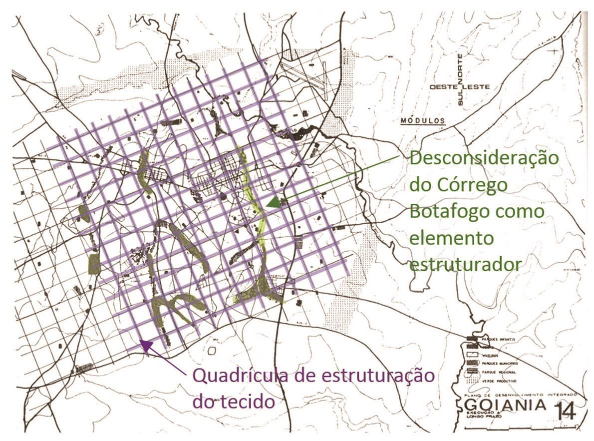

# Resumo

Este artigo se propõe a realizar uma análise morfológica do território
da cidade de Goiânia-GO, a fim de identificar indícios do processo
histórico em sua configuração espacial contemporânea. Na primeira parte
deste trabalho é observado como a estrutura territorial revela
evidências de elementos que condicionaram o crescimento da cidade, sendo
eles naturais, artificiais ou político-legislativos. Em seguida,
apresenta-se a influência da postura dos profissionais da arquitetura e
urbanismo, que participaram da elaboração dos instrumentos do
planejamento territorial e de projetos de grande importância para a
estruturação da malha urbana. Os ideais que marcaram a atuação de cada
profissional ficam claros na morfologia urbana e, como são próprios da
época de cada um deles, permite situar o espaço construído no tempo,
expondo a cidade como objeto historiográfico. A fim de tornar mais fácil
a compreensão destes aspectos na leitura da formação territorial,
tomou-se como objeto de estudo o Córrego Botafogo, um curso d'água em
meio ao tecido urbano, que desde a criação de Goiânia sofre
transformações de acordo com as etapas do desenvolvimento econômico e
demográfico da cidade. O estudo deste elemento permite a formação de uma
apreensão holística da cidade e de uma noção temporal dos processos
sociais e as práticas que levaram à criação, ocupação e transformação da
cidade, revelados nas especificidades do território.

Palavras-chave: história da cidade, morfologia urbana, território,
postura profissional

# Abstract

This article analyses the morphological structure of the territory of
Goiânia-GO, meaning to identify the traces left by the historical
process of its contemporary space configuration. The first part of this
academic work explores the evidence of elements that conditioned the
urban sprawl, may they be natural, artificial or politic-regulatory.
Forward, this article discusses how the professional stance of
architects and city planners actually influenced the urban environment
structuration, and as each posture is proper of a specific period, it
demonstrates the city outputted as a historiographical product. To make
it easier to comprehend what are the indications of history in the
territory, it is appropriate to take Stream Botafogo as an object of
study, for being a small river threaded together to the urban network
since the city's foundation, transformed according to every stage of the
economic or demographic development. Fore so, studying this element
enables the conjecture of a holistic understanding of the city itself,
in which the territory's specificities reveal the social process and
practices that led to the creation, occupation and transformation of
Goiânia.

Keywords: urban history, morphological structure, territory,
professional stance

# Introdução

Goiânia foi planejada e criada, na década de 1930, para ser a nova
capital do Estado de Goiás. Como em qualquer outra cidade, a leitura de
sua estrutura espacial revela os fenômenos que influenciaram a dinâmica
territorial, uma vez que cada etapa de desenvolvimento econômico e
demográfico da aglomeração corresponde a uma adaptação morfológica
(PANERAI, 2006, p.72). Por isso a análise das transformações

do território revela os condicionantes de crescimento e o processo
histórico de sua formação. Esses condicionantes podem ser elementos
naturais, como o relevo ou os recursos hídricos; construídos, como os
eixos viários e as subcentralidades; ou legislativos, como os planos de
ocupação, as leis de uso do solo, entre outros. Aspectos físicos, ações
antrópicas ou ainda decisões político-legislativas ressoam sobre a
história da cidade de Goiânia, demarcando tempos distintos e alterando
significativamente as relações territoriais entre traçados imaginados e
tecidos consolidados.

Esta análise permite uma apreensão mais global da formação da
aglomeração porque permite situar os aspectos no tempo e na história.
Dependendo da forma como estão inseridos na dinâmica urbana os elementos
podem condicionar o crescimento, atuando como limite, barreira, linha ao
longo da qual ocupação se instala ou polo de atração (PANERAI, 2006).

Os elementos naturais que mais influenciaram na morfologia do tecido de
Goiânia foram os cursos d'água, ao longo dos quais a topografia se
apresenta um pouco mais acentuada e entre os quais o terreno é bem
plano, ideal para o parcelamento e a ocupação de uma cidade nova. Foi
inicialmente escolhido um sítio livre entre os córregos Botafogo e Capim
Puba, sendo estes os limites da cidade a Leste, Oeste e Norte, onde se
encontram (Figura 1).

> 
>
> Figura 1: Diagramas de análise dos Condicionantes Naturais do
> crescimento de Goiânia. 1) Elementos Naturais; 2) Tecido Urbano; 3)
> Morfologia Diretamente Condicionada; 4) Tipologias Morfológicas.
> FONTE: VELOSO E ZÁRATE, 2013.

Com a expansão extensiva da cidade, o limite físico, que os córregos
representavam, foi transposto, mas, como está evidenciado na Figura 1,
os cursos d'água não foram

incorporados efetivamente no tecido urbano. A morfologia do tecido
urbano revela que, nas proximidades dos cursos d'água, as quadras
assumem um desenho praticamente orgânico, cujas linhas que determinam
sua maior dimensão estão no mesmo sentido do córrego, paralela às
margens. À medida que se afasta dos veios hídricos, a topografia suaviza
e a malha urbana assume uma morfologia mais regular. O Diagrama 4 da
Figura 1 evidencia a configuração de bolsões, nos quais o tecido urbano
que se acomoda na fração de território plana circundada pelos córregos.

O desenho e a organização da ocupação também permitem identificar as
áreas em que relevo (identificado no traçado das curvas de nível) é
condicionante direto do traçado das vias (Diagrama 3 da Figura 1). Esta
característica da estrutura formal de Goiânia reflete uma preocupação,
no planejamento, com as questões de escoamento das águas pluviais, e não
da efetiva incorporação dos recursos naturais como elementos
estruturantes do espaço urbano ou da morfologia urbana.

> 
>
> Figura 2: Diagramas de análise dos Condicionantes Construídos do
> crescimento de Goiânia. 5) Elementos Artificiais - vias;6) Elementos
> artificiais - subcentralidades; 7) Morfologia Diretamente
> Condicionada; 8) Sobreposição vias e tecido condicionado. FONTE:
> VELOSO E ZÁRATE, 2013.

Por outro lado, ao analisar os elementos artificiais (Figura 2) é
perceptível sua significativa influência na configuração espacial. Os
eixos viários constituem linhas ao longo das quais elementos se alinham,
como o desenho dos parcelamentos ou a posição dos edifícios. É possível
identificar que as vias foram estruturantes do crescimento quando se
observa a maior dimensão das quadras lindeiras no sentido da via,
diferente do traçado do entorno. Este fenômeno caracteriza, por exemplo,
as parcelas lindeiras à antiga ferrovia de Goiânia, bem como à rodovia
federal BR 153, e também à via expressa Alameda Marginal Botafogo
(implantada nos anos 1990, mas já prevista como elemento de ordenação do
território no planejamento da década de

1970). O caso da Marginal Botafogo é peculiar porque a via expressa
implantada às margens do córrego de mesmo nome reforça seu caráter de
barreira no sentido Leste- Oeste, enfatizando a ruptura de tecido: de um
lado a cidade planejada e inscrita em seus limites; de outro a cidade
espraiada e fruto de loteamentos e crescimentos descontínuos, levando à
fragmentação do território.

Áreas de concentram as atividades urbanas condicionam a configuração da
cidade, pois atuam como polos de atração do crescimento.
Subcentralidades como Campinas, o Setor Vila Nova e, mais recentemente,
o Jardim Goiás podem ser citados como exemplos porque eles concentraram
e atraíram a ocupação e a instalação de equipamentos relevantes em seus
arredores.

No diagrama 5 da Figura 2, destacam-se os principais eixos viários. No
diagrama 6, identificam-se os polos e os equipamentos relevantes
localizados sobre tais eixos viários. No Diagrama 7, é possível
perceber, apenas observando o traçado das quadras, por onde passam as
vias, uma vez que estas se comportam como linhas que conectam os polos.
O Diagrama 8 é uma síntese, resultante da sobreposição dos demais
diagramas à malha urbana, que permite visualizar os elementos
artificiais na estruturação urbana de Goiânia. Evidencia-se, desse modo,
que a ocupação do território, ainda que tenha considerado a topografia e
recursos hídricos, reforça o ideário de modernidade ao atribuir aos
elementos artificiais a função de indutores do crescimento, e aos
naturais, o papel de ruptores. A ruptura se manifesta na diferenciação
entre a morfologia da cidade idealizada, resguardada pelos limites
iniciais, e da cidade resultante de interesses especulativos, que
cresceu de maneira descontínua.

Ainda que os elementos naturais e artificiais sejam mais facilmente
identificados no traçado, por estarem fisicamente presentes em sua
configuração, não se pode ignorar a relevância dos aspectos políticos e
legislativos como condicionantes da morfologia, e por conseguinte, do
tecido urbano. Os ideais de cada governo se refletem nos planos e nas
normas urbanísticas, que são instrumentos utilizados pelo poder local
para o controlar e a regulamentar a ocupação do território. Muitas
vezes, estes instrumentos não são os únicos a exercer influência, e as
pressões dos interesses individuais e do mercado imobiliário também
incidem de maneira relevante e incisiva neste direcionamento.

# Estruturação Urbana e crescimento de Goiânia: fragmentação do tecido

A iniciativa de transferir a antiga capital do estado de Goiás para uma
cidade nova (TREVISAN, 2009) em um núcleo urbano *ex-nihilo* para assim
desencadear a prosperidade, é reflexo da política de interiorização da
ocupação nacional de Getúlio Vargas e do ideal progressista da Marcha
para o Oeste. O projeto urbanístico da cidade foi desenvolvido por
Attílio Corrêa Lima, que estruturou o espaço urbano pelos eixos viários
de conexão das principais áreas da cidade, enfatizando a circulação, uma
projeção do ideal modernista. O profissional também inspirou-se em
princípios barrocos para definir o traçado do Centro, o qual se dividia
em administrativo, mais ao Sul, e comercial, mais ao Norte. Além disso,
a integração da malha ortogonal, definida pelas ruas, com a malha
diagonal, definida pelas avenidas, cria espaços amplos e monumentais,
nos quais os edifícios públicos estão estrategicamente localizados.
Foram definidas três grandes avenidas que convergiam para a Praça
Cívica, enfatizando a sede do poder, função para a qual Goiânia foi
criada (PANTALEÃO; TREVISAN, 2011). A ênfase no funcionalismo revela

também terem sido adotados princípios modernistas por Correa Lima, bem
como por seu sucessor, Armando de Godoy: o traçado rígido de vias
regulares delimitado por um cinturão verde de parques articula os
setores de acordo com as funções de trabalhar, habitar e de lazer.

A revisão do Plano de Attílio Corrêa Lima, por Armando de Godoy (1936),
apesar de manter a maior parte das propostas, revela que desde a
concepção de Goiânia, os conflitos de interesse se refletiam nas
decisões legislativas. Godoy adotou propostas urbanísticas que
valorizavam as propriedades da família Coimbra Bueno, muito influente
naquela época (RIBEIRO, 2004, p.67-68). Mesmo no período de implantação
de Goiânia, enquanto o poder público detinha o direto exclusivo do
parcelamento do solo, algumas áreas suburbanas já haviam sido ocupadas
de maneira irregular. Foi o primeiro indício de que a cidade
ultrapassaria o crescimento planejado e extrapolaria os 50.000
habitantes inicialmente estimados.

A Planta Geral de Urbanização de Goiânia (1947) indicou o acréscimo de
novos bairros e o início da expansão da cidade (BRANDÃO, 2013). Outra
decisão legislativa que afetou a configuração urbana foi a aprovação de
183 novos parcelamentos no período de 1950 a 1964. Tal manobra estimulou
um enorme aumento populacional e favoreceu a dispersão urbana, uma vez
que nem todos os loteamentos foram implantados de uma vez, e saltaram
áreas, gerando vazios urbanos (VAZ, 2002, p.79). Como elemento
intensificador desse fator, a implantação efetiva da ferrovia (1952)
promoveu a conexão de Goiânia à capital, Brasília, e ao litoral, o que
impulsionou o crescimento urbano descontínuo. Com a fragmentação do
tecido urbano (Figura 3), cada vez mais tornou-se necessário a
articulação por meio do sistema viário, visando, principalmente, superar
as barreiras afiguradas pelos elementos naturais.

> 
>
> Figura 3: Crescimento do tecido urbano de 1933 a 1983. FONTE:
> OLIVEIRA, 2005 apud VAZ, 2002.

A intensa transformação urbana até os anos 1960 exigiu a elaboração de
um novo Plano Diretor, que teve como objetivo conter a expansão e a
especulação imobiliária. Além do impedimento de que outros loteamentos
fosse aprovados, uma outra medida para frear o crescimento horizontal
foi tomada, na década seguinte: a liberação do

gabarito no centro da cidade e, posteriormente, ao longo das vias
arteriais (VAZ, 2002, p.96-98). Este fenômeno fez com que densidade nas
áreas mais centrais aumentasse e a cidade assumisse o ideal
desenvolvimentista representado pela verticalização da paisagem, bem
como o apoio no sistema viário como estruturante da malha urbana.

Sob tamanha pressão progressista, a verticalização e os eixos viários se
tronaram símbolos para a cidade. Por outro lado, os espaços públicos
livres, que dão lugar ao encontro e onde as pessoas exprimem sua cultura
e identidade, foram relegados a segundo plano. Três fatores contribuíram
para a remodelação da cidade, marcada pela desvalorização de seus
espaços públicos: em primeiro lugar, a proliferação a partir da década
de 1980 de shoppings centers, hipermercados e empresas globais, todos
voltados para atividade do comércio e do consumo; logo, a cultura do
status e a falta de segurança, que isola as pessoas em condomínios
fechados e edifícios ilhados em seu próprio terreno (que oferecem usos
complementares e áreas coletivas na tentativa de simular o espaço
público); e, por último, a utilização de parques ambientais como
instrumentos do marketing urbano, a partir da década de 1990, que levou
a implantação repetitiva de um modelo de parque que não leva
consideração seu entorno, sem identidade (FRANCO, 2013, p.18).

A dispersão de atividades refletiu na fragmentação do espaço urbano aos
ensejos dos promotores imobiliários. A predominância residencial outrora
existente na periferia foi modificada à medida que shoppings centers,
hipermercados e empresas globais (McDonald's, Nissan, Peugeot, entre
outras) se inseriram nas áreas mais afastadas do centro. Vários
condomínios fechados de luxo se instalaram também nas regiões onde antes
a ocupação era de renda baixa, completando o cenário de transformações
socioespaciais. Não alheios a este processo, diversos edifícios e
equipamentos públicos também se estabeleceram nestas novas áreas,
fomentando o esgarçamento do tecido da cidade.

Ao observar estes momentos do planejamento refletidos na configuração
urbana, é possível perceber os condicionantes do crescimento da cidade
no decorrer da história de Goiânia. A estrutura do território revela
como a organização e o crescimento da cidade foram orientados pelo
sistema viário, e influenciados pelo ideal de modernização,
desconsiderando o espaço público como elemento estruturador e
articulador do espaço.

# O papel do profissional na produção do espaço urbano: o caso do Córrego Botafogo

Os elementos naturais que condicionaram o crescimento de Goiânia, em
especial os veios hídricos englobados pela aglomeração urbana, não se
consolidaram como espaço público efetivo, e seu potencial como elementos
estruturadores nunca foi aproveitado em totalidade. Na realidade, o mais
instigante é que a postura adotada pelos arquitetos e urbanistas que se
responsabilizaram pelo planejamento territorial fez com que os cursos
d'água da cidade se tornassem elementos fragmentadores do tecido, em
oposição às possibilidades de potencializá-los como elementos
articuladores e qualificadores da estrutura. Ao Córrego Botafogo,
adotado como elemento de estudo, associou-se um indispensável meio de
conexão viária entre as porções Norte e Sul da cidade, mas em oposição à
este atributo, o córrego aliado à via expressa que o "margeira"
constituiu-se ainda mais um verdadeiro fragmentador do tecido no sentido
Leste-Oeste do veio hídrico.

Quando Goiânia foi idealizada, o Córrego Botafogo foi caracterizado como
limite. Corrêa Lima (1933) propôs um traçado que formava uma rede de
parques e *parkways*, dando à capital um ar de cidade-parque, repleta de
áreas verdes que possuiriam função higiênica e recreativa. Os *parkways*
eram parques lineares que acompanhavam as margens dos córregos Botafogo
e Capim Puba, deixando 50m de área preservada para cada lado a partir de
seus eixos. Esta proposta revela o reconhecimento, por parte de Corrêa
Lima, do potencial dos córregos como elementos estruturadores do espaço,
manifestando uma rede contínua que associa o espaço público para as
pessoas e o espaço para mobilidade dos veículos, mas que no entanto não
se efetivou na prática.

Já existia a previsão de que a cidade cresceria para além do limite
natural dos cursos d'água, mas desde o momento da concepção foi apontada
a necessidade de se evitar a ocupação das áreas às margens dos córregos.
Esta diretriz encaminharia o crescimento horizontal da cidade para o
sul, única direção livre de barreiras hidrológicas, deixando o Botafogo,
cujas águas foram represadas para o abastecimento da cidade, preservado
(RIBEIRO, 2004, p.65). Na prática, o espaço de preservação foi
apropriado pelas ocupações informais, em função da proximidade com o
núcleo original. Assim teve início a expansão da cidade para o leste e o
oeste, e o tecido ultrapassou os córregos, fragmentando-se.

> 
>
> Figura 4: Diagramas de inserção do Córrego Botafogo - Planos de
> Attílio Corrêa Lima e Armando de Godoy. FONTE: RIBEIRO, 2004. Org.
> VELOSO E ZÁRATE, 2013.

A revisão do plano feita por Godoy (1936) não mencionava as invasões,
mas respeitava e mantinha a proposta dos *parkways*, como pode ser
observado na Figura 4, a qual apresenta os planos dos dois urbanistas. O
diagrama síntese da mesma figura destaca as vias e os setores,
evidenciando a organização da cidade segundo um eixo norte-sul. Também
revela os princípios de projeto urbano: as três grandes vias convergindo
para a Praça Cívica em *patte d'oie*, o qual mostra a inspiração no
urbanismo barroco; a setorização da cidade por diferentes funções denota
os princípios corbusianos; o traçado do Setor Sul remetendo-se aos
conceitos norte- americanos de unidade de vizinhança; e, o cinturão
verde delimitando a malha urbana, manifesta referência à cidade-jardim
de Howard (PANTALEÃO; TREVISAN, 2011, p.5) Tais princípios aplicados aos
planos resultou na predominância do sistema viário,

e não no sistema de áreas verdes, como estruturante da Ncidade, como
pode ser observado na configuração do território.

Já o urbanista Luis Saia (1962) possuía uma visão diferente das
anteriores, que identificava diversos potenciais para as áreas por onde
passavam os córregos. Saia propôs que fossem abertas alamedas margeando
os córregos Botafogo e Capim Puba, respeitando os 50 metros de
preservação da mata de galeria, reconhecendo nesses eixos a capacidade
articuladora entre as regiões Norte e Sul da cidade. Outro ponto
observado foi que os cursos d'água fragmentavam o tecido a Leste e Oeste
de seu eixo. Para eliminar o efeito barreira, Saia sugeriu passagens a
cada 500 ou 1000 metros cruzando o veio hídrico e promovendo a
integração entre os dois lados. No Córrego Botafogo, Saia identificou,
além do caráter de barreira no sentido transversal, também o caráter de
linha de crescimento (PANERAI, 2006, p.60) no sentido longitudinal, uma
vez que em sua extensão encontrava-se um dos maiores núcleos de invasão
de Goiânia, descaracterizando a função prevista para os fundos de vale.
A variedade de leituras que o Córrego Botafogo oferece prova que Saia
foi perspicaz em vê-lo como elemento de estruturação urbana. Apesar de
suas propostas não haverem sido implantadas, em função do golpe militar
de 1964, o plano de Saia é interessante porque revela a capacidade que o
Córrego Botafogo pode ter como elemento articulador, se for valorizado
enquanto espaço público (Figura 5).

> 
>
> Figura 5:Diagrama de inserção do Córrego Botafogo de acordo com o
> Plano de Saia. FONTE: VELOSO E ZÁRATE, 2013.

Os apontamentos de Luís Saia reivindicando um papel mais efetivo para os
corpos d'água urbanos foram substituídos por uma visão tecnocrática e
desenvolvimentista a nível nacional, sistematizada nos planos de
desenvolvimento integrado dos anos 1970. O responsável pela elaboração
do plano inserido nestes propósitos foi Jorge Wilheim (1969) pautando o
crescimento e desenvolvimento urbano nas políticas de progresso. A
organização da ocupação do território s deu a partir das vias de
circulação, aproximando-se do Urban Planning americano (PANTALEÃO;
TREVISAN, 2011 p.10).

Os aspectos funcionais do sistema viário foram, então, priorizados em
detrimento dos aspectos naturais, refletindo em ações e obras de grande
impacto ambiental, que reconfiguraram a superfície da cidade. Houve a
retificação, dragagem e canalização do Córrego Botafogo, além da
proposta de ocupação das áreas verdes de preservação. O plano de Wilheim
tratava de dotar as áreas de proteção ambiental de alguma atividade
produtiva, para que desempenhasse uma função social importante.

A proposta de Wilheim (Figura 6) era de estruturar o território por meio
do sistema viário, e o Córrego Botafogo se inseria nesse processo de
estruturação associado a uma nova via, não como área verde ou espaço
público de múltiplas funções, como propusera Luís Saia. O córrego
enquanto elemento natural, espaço público de preservação ambiental, foi
considerado um elemento secundário.

> 
>
> Figura 6: Diagrama de inserção do Córrego Botafogo - Plano de Wilheim.
> FONTE: REIBEIRO, 2004. Org. VELOSO E ZÁRATE, 2013.

A desconsideração pelos aspectos ambientais, característica da postura
tecnoburocrática adotada, pode ser evidenciada na comparação do projeto
de Neusa Baiochi para o Parque Linear Botafogo com a obra realizada em
1990, que deu origem à Avenida Marginal Botafogo. Como pode ser visto na
Figura 7, Baiochi havia previsto pistas de bicicleta e passeio de
pedestres com traçado irregular acompanhando o canal do córrego.
Paralelamente existiria uma zona verde e recantos para descanso, que
somada ao espaço destinado à circulação não motorizada, configuraria um
espaço público privilegiado na cidade.

> 
>
> Figura 7: Corte transversal do Parque Linear Botafogo - Arquiteta
> Neusa Baiochi. FONTE: IPLAN, 1976 apud QUEIROGA, 2010. Org: VELOSO E
> ZÁRATE, 2013.

A proposta de Baiochi reflete a mudança a nível internacional na maneira
de tratar as questões do meio ambiente urbano, prezando a qualidade de
vida (FRANCO, 2013, p.14) e a consciência ambiental. Porém, o poder
público local só viria a assumir essas mudanças na década seguinte, e as
obras da marginal Botafogo se destinaram para veículos automotores
apenas, excluindo ciclistas e pedestres, o que evidencia a
predominância, ainda presente, da postura progressista.

Ainda que os propósitos dos planos integrados de desenvolvimento fossem
justamente o ordenamento da ocupação pautado nos eixos viários,
construir duas pistas para automóveis ao longo do canal não era
considerada justificável pelo técnico Edwaldo Won Waldow, relator do
memorial descritivo das obras do córrego Botafogo. Isso porque já
existiam ruas paralelas próximas e pela perda de uma área considerável
de terra muito adequada ao passeio a pé e ao descanso (IPLAN, 1976 apud
QUEIROGA, 2010 p.4). Sendo assim, a construção da via expressa (1990)
trouxe a desvalorização do córrego como espaço público e elemento
natural qualificador da ambiência urbana e a diminuição da sua
capacidade articuladora, reduzida apenas ao sentido Norte-Sul. Como
agravante desta situação, diretrizes que não haviam sido discutidas em
projeto surgiram para regular a ocupação lindeira da via, determinado a
não abertura dos comércios e residências com as fachadas frontais
voltadas para marginal (QUEIROGA, 2010 p.5). Essa diretriz visava
garantir que fosse configurada uma avenida de circulação rápida,
exclusiva à passagem e vetada ao acesso local. Por isso, não podia ser
dotada de pistas de desaceleração e de pedestres (O POPULAR, 1990 apud
QUEIROGA, 2010, p.5).

Mesmo diante dos problemas ambientais e socioespaciais explanados, em
1992 foi elaborado o terceiro Plano Diretor De Goiânia, pela Engevix
Engenharia S. A, o qual ressaltava a importância da expansão da cidade
por meio da abertura de vias (BRANDÃO, 2013, p.9). Os projetos da
Marginal Botafogo, então, se consolidariam estabelecendo a conexão
Norte-Sul. Para a construção da Marginal Botafogo foram definidos
trechos de implantação em função das vias que conectam o centro às
regiões leste do córrego (Figura 8). O percurso de aproximadamente 6,3
Km foi construído em etapas: um tramo de cada vez, iniciando-se na parte
mais central da cidade; depois com dois trechos a sul e outros dois a
Norte. Fica evidente que a postura que os profissionais da Engevix
assumiram apontou para a predominância do sistema de veículos
individuais como forma de articulação entre as diversas partes dispersas
da cidade.

> 
>
> Figura 8: Diagrama de implantação da Marginal Botafogo. FONTE: VELOSO
> E ZÁRATE, 2013.

É notório que o Córrego Botafogo não somente se caracteriza como
elemento fragmentador do tecido, mas também é, em si, seccionado: a
avenida articula um conjunto de peças com características morfológicas
distintas. Uma evidencia da fragmentação do próprio córrego é o fato de
que as áreas verdes remanescentes em seus cursos não se comunicam entre
si, e, segregadas não podem constituir uma contiguidade urbana.

Ademais, nenhuma das três áreas verdes, sendo elas o Jardim Botânico, o
Parque Municipal Goiânia e o Parque Botafogo, possui tratamento
urbanístico ou paisagístico. O Parque Botafogo é o único, dentre estas
áreas verdes, que possui apropriação efetiva pela população, por estar
em uma localização central. Ainda assim, não é um espaço público
atrativo, e não funciona em horários complementares. Além disso, é
divido pela Marginal Botafogo e pela Avenida Araguaia em três porções: o
Parque de Diversões Mutirama; a parte entre as pistas que é de
preservação ambiental, onde estão represadas as águas do córrego e uma
fração no Setor Vila Nova onde há equipamentos de esporte e pista de
caminhada. Nenhuma das três partes é propícia à permanência em horários
de pouco movimento porque se tornam regiões perigosas, e tampouco existe
integração entre as áreas remanescentes e as vias que as circundam.

O Parque Municipal de Goiânia, por sua vez, não passa de uma área verde
de vegetação um pouco mais densa configurada entre as autopistas da via
expressa, o que praticamente impossibilita o acesso a ela. Em 2013, boa
parte desta área verde

remanescente foi tomada para dar lugar à mais pistas e um viaduto, em
prol da melhoria do sistema viário.

No Jardim Botânico, no extremo sul do sitio de análise, se encontra a
nascente do Córrego Botafogo, área de preservação ambiental desprovida
de qualquer infraestrutura que atraia as pessoas ou estimule seu uso
enquanto espaço público. De acordo com seu Plano de Manejo, esta área
poderia receber equipamento público voltado para a educação ambiental,
mas encontra-se subutilizado. Sucessivas invasões e concessões ocorreram
ali ao longo dos anos, mas boa parte das invasões entre as avenidas 2º
Radial e 3ª Radial, do lado Oeste do Córrego, foram desocupadas para sua
renaturalização. Pode-se pensar que seja a manifestação recente de uma
postura dos planejadores com mais compromisso ambiental. Porém, existem
projetos para a extensão da Avenida Marginal Botafogo até o Setor Pedro
Ludovico, e em Fevereiro de 2014 teve início a discussão em prol do
adensamento da região do Jardim Botânico, que cede às pressões de
incorporadoras e imobiliárias para verticalizar a área, o que pode ser o
fim da área de preservação.

> 
>
> Figura 9: Diagrama da inserção do Córrego Botafogo na dinâmica urbana.
> FONTE: VELOSO E ZÁRATE, 2013.

# Considerações finais

Tendo em vista as constatações quanto às áreas verdes remanescentes, é
possível concluir que elas nunca se integraram num parque linear, tal
qual Attílio Correa Lima havia proposto. Ao invés disso, o fundo de vale
assumiu caráter de via, se se inseriu na dinâmica urbana como conector
de tecidos descontínuos no sentido longitudinal, e fragmentador no
sentido transversal ao curso d'água. A Figura 9 revela que os elementos
naturais compostos pela topografia e o curso hídrico forneceram as bases
para o traçado do principal eixo viário. Este eixo, por sua vez,
condicionou a

morfologia das parcelas, que, próximo ao córrego assumem um desenho
alongado, no sentido do leito, mas, à medida que se afasta, assume
traçado regular, que obedece à malha viária de cada bairro. Também é
possível perceber, quando da análise da paisagem, que não é só a
morfologia da malha urbana que se diferencia de um lado e do outro do
córrego, mas também as formas de usos e a ocupação, reforçando as
diferenças entre os tecidos urbanos em suas margens.

Sendo assim, o que se observa na análise é que a Marginal Botafogo
assume um duplo papel, o de agenciadora de parcelas semelhantes, ou
seja, bairros, e ao mesmo tempo, de marco de diferenciação entre os
bairros de um lado de outro da avenida. Os pontos de transposição desta
via expressa, ou seja, os cruzamentos, são na verdade pontos de conexão
entre os fragmentos dispostos de cada lado. Cada um desses fragmentos de
tecido possuem características próprias encontrando-se por exemplo,
porções com grandes equipamentos, ou quantidade expressiva de formas
habitacionais de interesse social, ou mesmo chácaras no meio do tecido
urbano.

A fragmentação observada é uma característica do território de Goiânia,
resultante da somatória dos planos e das ações sobre o espaço, incluindo
as posturas profissionais que ignoraram o elemento natural como
condicionante do crescimento da cidade. Cada arquiteto urbanista que
colaborou para a elaboração dos Planos Diretores de Goiânia, manifestou
seus ideais em suas propostas, particulares de seu tempo, o que mostra
papel relevante do profissional na produção do espaço, bem como os
agentes que alteram ou reafirmam suas posturas. Sendo assim, constata-se
que o tecido urbano revela os processos sociais e práticas que levaram à
criação, ocupação e transformação no território, e a análise da
morfologia urbana permite apreender (ler e compreender) os processos
históricos, possibilitando uma noção temporal da formação da cidade.

# Referências bibliográficas

> BRANDÃO, Simone. *De Obsolescência a Parque Linear Em Goiânia:
> Intervenções contemporâneas no antigo leito da ferrovia.* Anápolis:
> Universidade Estadual de Goiás, 2013.
>
> FRANCO, Mariana Nunes. *Parque Botafogo: do passado, um presente ao
> futuro.*

Anápolis: Universidade Estadual de Goiás, 2013.

> GOIÂNIA, Prefeitura de. *Plano Diretor de 2007*. Goiânia: SEPLAM,
> 2007.

PANERAI, Philippe. *Análise Urbana*. Brasília: Editora Universidade de
Brasília, 2006.

> PANTALEÃO, Sandra Catharinne; TREVISAN, Ricardo. *A Cidade Planejada e
> a Cidade Construída: entre Paradigmas Modernos e Híbridos
> Contemporâneos*. Brasília: Universidade de Brasília, 2011
>
> PEIXOTO, Elaine Ribeiro; FERRANTE, Isabela. *Goiânia, Cidade Genérica:
> Estudo dos shoppings centers.* Goiânia: Universidade Católica de
> Goiás, 2006.

RIBEIRO, Maria Eliana Jubé. Goiânia: os planos, a cidade e o sistema de
áreas verdes. Goiânia: Editora da UCG, 2004.

> ZARATE, Halina Veloso. *O Córrego Botafogo Na Dinâmica Urbana:
> Potencial De Espaço Público.* Goiânia: Pontifícia Universidade
> Católica de Goiás, 2013.
