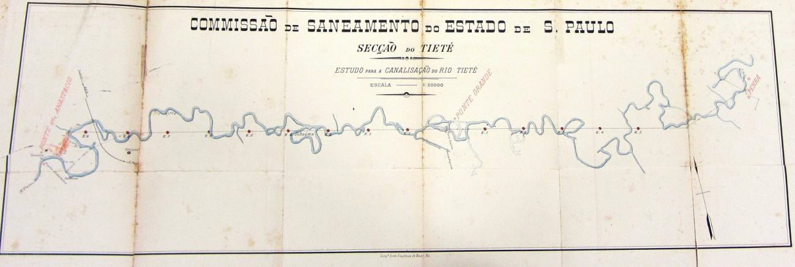
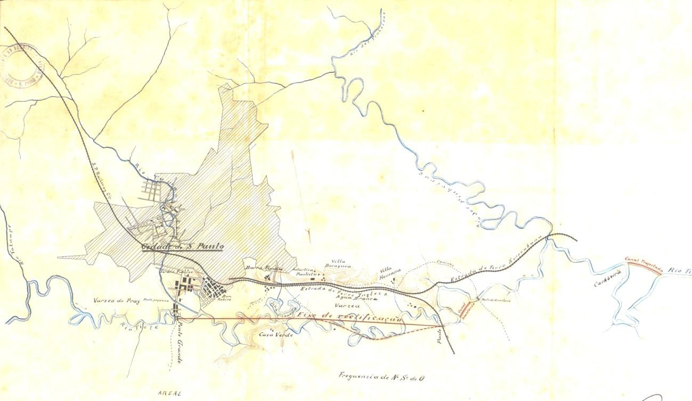
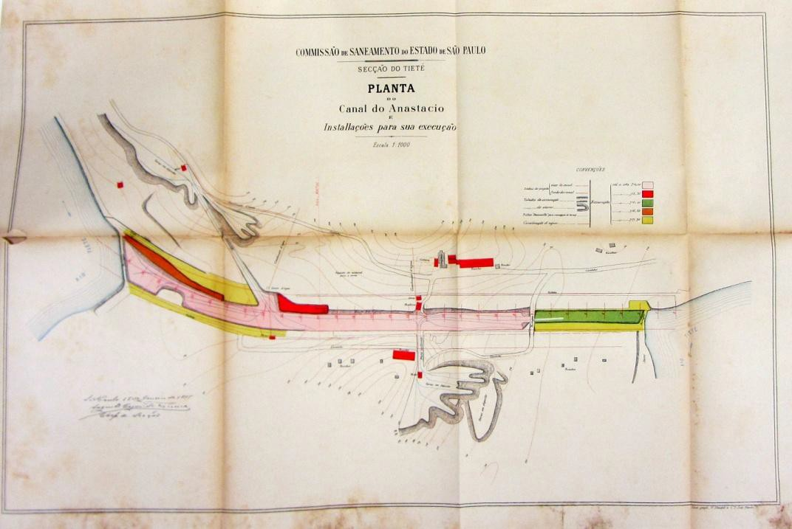

# Resumo:

O artigo se debruça sobre três estudos para a canalização do rio Tietê
na cidade de São Paulo, realizados pelo governo do estado no século XIX.
Ao trazer suas prescrições mais importantes a tona, mostra o
encadeamento entre elas, os atores envolvidos nessas propostas, e deixa
entrever que os interesses vinculados a obras consideradas prioritárias
e implantadas, nem sempre estão vinculados a grandes corporações.

Palavras-chave: Rio Tietê, Retificação do Rio Tietê, Luis Bianchi
Bertoldi, Teodoro de Sampaio, João Pereira Ferraz

# Abstract:

This paper describes three propositions to the Tietê rectilinear
watercourse at São Paulo city, from State Government of São Paulo in the
19th. In that we have put on edge the most important propositions and
could show the link between them, and the professionals involved in each
one with the intention to discuss that the decisions for made some
public works, its prioritization have, sometimes, motivations no linked
necessarily with powered corporations.

Keywords: Tietê river, Tietê rectilinear watercourse, Luis Bianchi
Bertoldi, Teodoro de Sampaio, João Pereira Ferraz

# Introdução

A retificação e canalização do rio Tietê no município de São Paulo é uma
obra que levou mais de oitenta anos para se concretizar, desde o momento
que os estudos iniciais começaram a ser desenvolvidos, até a abertura do
canal, nos anos 1940.

Ao se debruçar sobre os vários estudos percebe-se que, ainda que os mais
conhecidos e mais consequentes tenham sido realizados no século XX,
existiram vários outros ainda no século XIX que de certa forma foram
alinhavando pensamentos e ideias sobre como lidar com o problema do
saneamento e das enchentes na cidade de São Paulo, em nada diferentes
daqueles melhor desenvolvidos no século seguinte.

Outra constatação já possível, de pesquisa em andamento, é que os
interesses que motivaram as soluções finalmente adotadas no século XX,
já estavam configurados no século anterior, ainda que não tão
explícitos, e que existiram atores que ainda não foram explorados em
pesquisas recentes.

Espera-se com esse artigo contribuir para os estudos que abordam a
formação do território da cidade de São Paulo, em especial para aqueles
que tratam da atuação do poder público no desenvolvimento e implantação
de obras hidráulicas, e trazer a tona a atuação de alguns personagens,
que através do saber técnico, influíam em decisões políticas de suas
chefias, realçando o fato de que no interior dos órgãos públicos,
técnicos e gestores se influenciam mutuamente, e que nem sempre a
atuação dos primeiros está isenta de interesses pessoais.

# Obras públicas -- a organização do setor de saneamento no interior do governo

No Governo Provincial de São Paulo, o setor encarregado das obras era a
Inspetoria Geral de Obras Públicas (criada em 1867), substituída pela
Superintendência de Obras

Públicas (após 1890), que posteriormente ficou vinculada à Secretaria da
Agricultura, Comércio e Obras Públicas, criada em 1892. Com a
proclamação da República,

> A primeira repartição a sofrer reformulações foi a de Obras Públicas.
> Eram notórias entre os paulistas as irregularidades e ineficiência que
> cercavam este órgão da província, responsável pela manutenção e
> construção de estradas, pontes e prédios públicos, estando sob a sua
> gerência a fiscalização dos trabalhos realizados pelas companhias
> ferroviárias, através dos engenheiros fiscais. (CAMPOS, 2007: 286)

Cabia também ao Governo Provincial o desenvolvimento de projetos e a
implantação de obras de saneamento para os rios e várzeas. As constantes
inundações das várzeas dos rios Tamanduateí e Tietê na cidade de São
Paulo e as preocupações com a regularização dos seus cursos levou à
elaboração de levantamentos topográficos e ao desenvolvimento de
propostas para retificação do rio Tietê entre os anos de 18831 e 1913,
sendo que a partir de 1889, com a proclamação da República, parte das
atribuições em obras do Estado passam para as Prefeituras, mas não as
obras hidráulicas. (SIMÕES JUNIOR,

1990\)

Em 1890, Prudente de Moraes, governador do Estado, nomeou uma comissão
para desenvolver estudos mais completos das várzeas e da hidrografia
desses rios. Esta comissão, denominada Comissão de Saneamento das
Várzeas da Capital, existiu até 1892. Chefiada por Antônio Francisco de
Paula Souza, então o diretor da Superintendência de Obras Públicas do
Governo do Estado, contou com os trabalhos do engenheiro Theodoro de
Sampaio. (COSTA, 2005)

Em Abril de 1892 outra comissão foi criada, a Comissão de Saneamento do
Estado, composta de três seções, duas atuando na capital (a seção do
Tamanduateí e a seção do Tietê) e uma de Santos. (BERNARDINI, 2007)

A então recém-criada Comissão de Saneamento do Estado seria entregue ao
engenheiro João Pereira Ferraz. Este, junto com Paula Souza, viria a
participar da fundação da Escola Politécnica de São Paulo, de onde seria
lente de hidráulica de 1895 a 1926.

# Os estudos para conter as inundações na cidade de São Paulo

As intenções de regularizar o leito do rio Tietê nas proximidades da
cidade de São Paulo datam da década de 1880.

Em 1883, a partir de estudos que se iniciaram em 1881, o Engenheiro
Eusébio Stevaux, da Inspetoria Geral de Obras Públicas, apresentava ao
Presidente da Província, Domingos Antônio Raiol - o Barão de Guajará,
projeto para derrocada das "cachoeiras" do Tietê, na região da Casa
Verde, que segundo ele eram as responsáveis por constantes alagamentos e
inundações na época das chuvas. A principal preocupação do Engenheiro
era com "a supressão desse foco de miasmas e a transformação desses
horríveis pauis em terrenos férteis e produtivos" (STEVAUX, 1883: 1)

Mas a preocupação tinha contornos mais amplos, pois defendia a ideia de
aproveitar mais intensivamente aqueles terrenos para a atividade
agrícola, que segundo SEABRA (1987) era realizada pelos "caipiras" que
habitavam de forma esparsa a região da Casa Verde e da Freguesia do Ó.

Portanto, ainda que a preocupação principal fosse de se evitar as
enchentes periódicas, desde o início o saneamento das várzeas esteve
vinculado ao interesse econômico do melhor aproveitamento daqueles
terrenos, interesse de seus proprietários e usuários, e também
explicitamente defendido pelos técnicos que estudavam soluções para o
problema.

> 1 Contudo, as primeiras intervenções nas várzeas dos rios Tamanduateí
> e Tietê, ainda que de pequeno porte, datam da década de 1840. Cf
> CUSTÓDIO, 2007.

Ainda que a várzea do Carmo, ao longo do Tamanduateí, fosse aquela que
recebia maiores atenções e projetos de melhoria naqueles anos, a
implantação das estradas de ferro, a "Inglesa" em 1867 e a Sorocabana em
1875, transformou as várzeas do Tietê em terrenos propícios à
implantação de moradias ou atividades econômicas, locais que com o trem,
deixavam de estar longe da cidade ou do porto, e tiveram como
consequência a valorização daquelas terras.

Também a Lei de Terras, promulgada em 1850, contribuía para a
valorização, pois aos poucos levava à regularização das propriedades
fundiárias.

> Ao que tudo indica, no começo do século atual2, os trechos de
>
> várzea e baixos terraços, ao longo do Tietê, ainda não tinham sido
> objeto de uma ação racionalizadora de empresas imobiliárias; a
> ocupação de caráter urbano alcançava a várzea pelo crescimento da
> cidade em alguns trechos da margem esquerda do rio. Eram de fato
> terras menos valorizadas no mercado, mas já não eram terras devolutas,
> pois, gradativamente, iam tendo seus títulos de propriedade definidos,
> legalizados." (SEABRA, 1987: 50)

Também já era aventada naquele momento a ideia de que obras pudessem ser
realizadas por particulares e pagas com terrenos das várzeas.

> \... e que para o aformoseamento da Várzea do Carmo, como a concebera
> S. Exs., a despesa /\.../ seria tão avultada que convinha deixar esse
> melhoramento à iniciativa particular mediante concessões de terrenos
> segundo algumas pretensões que nesta época foram apresentadas ao
> Governo. (STEVAUX, 1883: 2)

Apesar do estudo do engenheiro Steveaux ter sido realizado em 1883, em
1885 correspondência do Diretor da Repartição de Obras Públicas do
Estado, Francisco de Salles Oliveira Júnior, ainda pedia a aprovação do
orçamento da obra.

A menção seguinte à retificação do Tietê ou de parte dele ocorreria em
1887, com a revisão das propostas pelo engenheiro Luis Bianchi Bertoldi.
Em 87, o engenheiro Bianchi Bertoldi era, na Repartição de Obras
Públicas, o responsável pela seção da capital.

Os estudos elaborados por Bertoldi foram medições da altura das águas
dos rios Tamanduateí e Tietê no período de cheias (a grande cheia de
1887), do km 71 da estrada de ferro São Paulo Railway, entre a estação
de São Caetano e Ipiranga, à estação de Barueri da estrada de ferro
Sorocabana. Os levantamentos o fizeram concluir que os alagamentos na
várzea do Carmo tinham relação direta com os do Tietê e o consequente
represamento que este ocasionava às águas do Tamanduateí, conclusões que
seriam constestadas anos mais tarde por Teodoro de Sampaio, que diria
não haver relação entre as enchentes das duas várzeas, que ocorriam em
momentos diferentes e que só coincidiam em raras ocasiões, quando estas
eram muito graves.

O relatório de BERTOLDI (1887) coloca outros pontos interessantes. Seria
ele o primeiro a propor que se retificasse o rio, da foz do Tamanduateí
até as "cachoeiras" de Santana de Parnaíba. Argumentava que as enchentes
ocorriam por causa da baixa velocidade com que o rio atravessava o
território da cidade de São Paulo, e que por causa disso e da extensa
várzea não cavava um canal de boa profundidade para escoamento das
águas.

> \... convindo notar que o vale do rio Tietê no extenso trecho que eu
> tive ocasião de reconhecer é sempre invariavelmente
>
> 2 Século XX.
>
> acompanhado por uma várzea quase nunca inferior a um quilometro ao
> menos de largura, formada à direita ou à esquerda, e muitas vezes de
> ambos os lados do canal. (BERTOLDI, 1887:15)

Ainda apontava que havia uma queda mais significativa, "não excedendo 15
centímetros" (BERTOLDI, 1887), na seção da ponte da estrada de ferro
Santos-Jundiaí, na Água Branca, e que depois disso o rio ampliava seu
"canal" de escoamento, em aparente imobilidade de suas águas,

> \... com exceção sobre as curvas mais vivas do canal, cobrindo e
> perdendo os traços do aterrado do Anastácio e dos recifes existentes
> no trecho observado até o bairro de Barueri, a cerca de 50 quilômetros
> abaixo da ponte grande da capital. O rio dos Pinheiros, abaixo do
> aterrado do Anastácio igualava com o nível das águas do rio Tietê
> cobrindo o aterrado da ferrovia Sorocabana, alagando sua imensa várzea
> e alcançando o nível da sapata dos trilhos sobre o vigamento da ponte.
> (BERTOLDI, 1887: 15)

Ainda que a principal recomendação do relatório em relação ao Tietê
fosse que se criasse uma comissão de estudos para estudar mais
profundamente soluções para os alagamentos da várzea, algumas sugestões
seriam, anos mais tarde, desenvolvidas por outros engenheiros, e
implantadas ainda no século XIX.

Bertoldi (1887) sugeria também que:

> \.... para aproveitar os desnivelamentos dos pequenos saltos situados
> além do bairro do Barueri, seria necessário estabelecer no fundo do
> rio uma declividade uniforme entre os dois pontos extremos do trecho
> que deve ser melhorado, isto é, até o aterrado de Santana\... (p. 16)
>
> \... será fácil salvar das enchentes a zona ribeirinha mais
> importante, canalizando o rio Tietê e levantando o terreno marginal
> até o nível da Ponte Grande no aterrado de Santana. (p. 17)
>
> \... estabelecendo uma grande represa e abrindo acima de Mogi das
> Cruzes um canal túnel, despejando parte das águas do rio Tietê nos
> vales da marinha. O comprimento desse túnel não excederia a distancia
> de 20 a 25 quilometros até encontrar a fralda oriental da Serra que
> verte para o mar." (p. 18)

Toda a argumentação para saneamento da várzea, contida no relatório de
Bertoldi, é pontilhada por razões de ordem econômica que apontam
vantagens na regularização do curso do rio. Sugere plantações na várzea,
"com agricultura apropriada a terrenos alagadiços" (p. 19), a concessão
de "zonas argilosas" para as olarias mediante impostos, e a demarcação
de lotes a serem concedidos a colonos para exploração agrícola.

A regularização do rio Tietê e do Tamanduateí, já então entendida como
uma ação que deveria abarcar os dois rios, volta a ser estudada com a
profundidade sugerida por Bertoldi somente após a proclamação da
República.

Em 1890, no governo de Prudente de Moraes, é criada a Comissão de
Saneamento das Várzeas da Capital. Chefiada por Antônio Francisco de
Paula Souza, contou com os trabalhos do engenheiro Theodoro de Sampaio,
então lotado na Comissão Geológica e Geográfica de São Paulo,
subordinada à Superintendência de Obras Públicas. (COSTA, 2005)

O relatório dos trabalhos, concluído em 1891, foi redigido por Sampaio.
Nele encontram-se proposições para a canalização dos rios, drenagem das
várzeas, obras contra enchentes, obras de "aformosamento", etc. (CAMPOS,
2007)

Entre 1887 e 1891, a cidade crescera de forma acelerada, e é muito
interessante a descrição da cidade de São Paulo que Sampaio faz nesse
relatório, que mostra que as várzeas, inclusive a do Tietê, já estavam
em intenso processo de ocupação.

Sampaio cita várias vezes o relatório de Bertoldi, sendo este
possivelmente o ponto de partida para as suas propostas.

Dizia ser urgente a canalização de ambos os rios e a proteção da parte
mais baixa da cidade que constantemente era inundada, caso do Bom
Retiro, do Pari e do Brás, por exemplo.

Sampaio (1892) propõe a canalização do Tietê, da foz do Tamanduateí até
a ponte da São Paulo Railway na Água Branca, a construção de dique
marginal para contenção das águas nos períodos das cheias (dique que
existiria somente do "lado da cidade" -- margem direita do Tietê), e a
drenagem da várzea do Carmo, através da implantação de galerias. Fala
também na derrocada das "cachoeiras da Casa Verde, e sugere que seja
feito nesse local um canal pelo meio da Ilha de Inhaúma.

A proposição de soluções para melhorias na várzea do rio Tietê, no
âmbito no Estado, não se encerraria com o relatório da Comissão das
Várzeas. Em 1892, ao assumir a chefia da recém-criada Comissão de
Saneamento do Estado, o engenheiro João Pereira Ferraz, contraditaria
algumas recomendações de Sampaio, o que ficou registrado em relatório
elaborado por Ferraz (SÃO PAULO, 1894), elaborado em 1893, e que traria
as propostas desse engenheiro e de sua equipe.

A Comissão proporia a canalização do Tietê quase que em linha reta,
"reduzindo o percurso atual do rio Tietê de cerca de 60%" (SÃO PAULO,
1894:15 - anexo n.º 3), a criação de um canal na região do Anastácio,
desobstrução de algumas corredeiras na região da Casa Verde, e abertura
de um canal com declividade uniforme de 0,30m por quilometro, o que
permitiria aumentar a vazão do rio, em especial após a desembocadura de
seus afluentes Tamanduateí e Pinheiros.

Nesse relatório (SÃO PAULO, 1894- anexo n.º 3) a Comissão contestava a
proposta de Sampaio de que se ampliasse a vazão sob a ponte da estrada
de ferro Santos-Jundiaí, dizendo que naquela região a baixa velocidade
devia-se mais a existência de uma "garganta" após a desembocadura do rio
Pinheiros, no km 16 da estrada de ferro Sorocabana, que estrangulava a
passagem das águas, apoiando o relatório de Bertoldi.

A Comissão concluía propondo algumas obras pontuais, segundo ele
prioritárias, como a abertura do canal do Anastácio, a desobstrução das
corredeiras e abertura de valas de descarga provisórias, a desobstrução
do rio criando um canal pela ilha de Inhaúma. O relatório da Comissão de
Saneamento do Estado, que enquanto registro textual serial complementado
por mais dois relatórios publicados em 1894, um deles somente de plantas
dos estudos e propostas, acompanha o raciocínio realizado por Bertoldi.

> 
>
> Figura 1. Planta que acompanha o relatório de João Pereira Ferraz.
> Fonte: Arquivo Público do Estado (FERRAZ (2), 1894)

Em 1894, sob a supervisão do engenheiro João Pereira Ferraz seriam
detalhados o projeto para a abertura do Canal do Anastácio e o Canal
entre os quilômetros 16 e 18 da estrada de ferro Sorocabana, hoje no
município de Osasco (Canal de Osasco), e por esse projeto também a ilha
de Inhaúma, nas proximidades da Casa Verde, deixava de existir, a partir
da abertura do canal em seu interior e da derrocada das cachoeiras.
Esses detalhamentos referiam-se a obras sobre as quais já havia decisão
no âmbito técnico e político em se realizar, pois foram iniciadas
naquele ano.

O projeto de retificação e canalização do rio Tietê abrangeria um
território bem menor do que a do estudo de 1892 (compare a Figura 1 e a
Figura 2), além dos canais do Anastácio e de Osasco, e ainda que
publicado, já não era o projeto que a Comissão defendia. O chefe da
Seção Central, à época da publicação desse relatório, o engenheiro José
Antônio da Fonseca Rodrigues, ao estudar o projeto de canalização, dizia
que talvez fosse melhor fazê-la acompanhando algumas curvas do rio, e
não em linha reta.

> Em o relatório que me foi presente pelo atual chefe de Seção,
> engenheiro Fonseca Rodrigues aventa ele a ideia de não se levar em
> linha reta o canal desde a "Ponte Grande" até Anastácio; não havendo a
> preocupação dessa linha reta, parece com efeito, haver vantagens, já
> não se fazendo diques ou obras semelhantes, sobre o antigo leito, já
> podendo ser aproveitada a ponte construída no braço do rio Tietê para
> transpô-lo a linha do Tramway da Cantareira. (FERRAZ, 1984: 7)

As obras seriam lentas: em 1898, quatro anos depois, ofício da Comissão
de Saneamento do Estado de São Paulo informava que o canal do Anastácio
ainda não estava completamente aberto. (Ofício n.º 239 de 7 de Maio de
1898)

> 
>
> Figura 2 -- Projeto de retificação e canalização do rio Tietê,
> publicado por Ferraz em 1894 (trecho). Fonte: Arquivo Público do
> Estado de São Paulo -- Secção do Tietê - Planta do Tietê de São Paulo
> à Parnahyba -- Esc. 1:50.000

# O projeto do canal do Anastácio -- algumas considerações

No Anastácio, como pode ser visto na Figura 2, o rio dava uma grande
volta, e vimos que Bertoldi, na grande enchente de 1887, diz ter ficado
o aterrado do Anastácio

inteiramente tomado pelas águas. Isso devia impedir a utilização do
caminho que seguia para Jundiaí e por lá passava. Porém não existe no
relatório de Sampaio sequer menção à necessidade de se diminuir o
trajeto do rio nesse ponto, e dois anos mais tarde, no relatório da
Comissão de Saneamento, o canal já surge como definido, com projeto
detalhado (Figura 3) e sabemos que as obras começaram naqueles anos.

> 
>
> Figura 3 -- Planta do projeto do Canal do Anastácio -- 1895 - Fonte:
> Arquivo Público do Estado, Escala 1: 1.000

No relatório da Comissão de Saneamento, entregue ao Secretário de
Agricultura (SÃO PAULO, 1894), a justificativa para a abertura é
apresentada como sendo uma oportunidade de reduzir uma extensão do rio
de 3 km para somente 580m, o que, segundo os técnicos, aumentaria de
forma acentuada a velocidade do rio. Isso complementado com a abertura
do canal de Osasco e a derrocada da ilha de Inhaúma fazia com que os
engenheiros supusessem que se conseguiria aumentar de forma acentuada a
velocidade de escoamento das águas. Existe, portanto, uma justificativa
técnica que coincidia com um local onde o rio dava uma grande volta, mas
ao observamos a Figura 2 veremos que havia outros locais em que isso
também seria possível, e estes não foram objeto de retificação. Porque
então foi em Anastácio que se efetuou uma das primeiras retificações do
Tietê?

# Interesses explícitos e não tão explícitos

Em 1994 já surgiam atividades nas proximidades do Tietê a noroeste da
cidade. Entre a Barra Funda e a Vila Bocaiuva, já se instalara a
Companhia Antártica Paulista. As regiões da Água Branca e da Vila Romana
já se encontravam identificadas (Figura 2), bem como a Casa Verde e a
Freguesia do Ó.

As ferrovias também abriram pequenas estações na região, a estação da
Água Branca -- implantada pela "inglesa" em 1867 (que serviria à
Vidraria Santa Marina, instalada em 1892 de propriedade de Antônio da
Silva Prado) e a parada do Anastácio, nas proximidades da ponte do
Anastácio.

> Entretanto, foi a Água Branca escolhida para sede de uma estação,
> ainda que intermediária (entre São Paulo e Perus), devido a sua
> localização estratégica, pois dali se bifurcavam caminhos para a
> Freguesia do Ó, Pinheiros e Cidade de Campinas\... (SANTOS, 1980: 45)

Já a Estrada de Ferro Sorocabana, à época de sua inauguração (1875),
também faria uma pequena parada na confluência com o Caminho para
Jundiaí, e a estação Lapa da São

Paulo Railway -- a Inglesa -- foi inaugurada em 1898 e a da Sorocabana
em 1899. (SEABRA, 1987)

Se o Canal do Anastácio, local assim denominado por ficar nas terras que
no século XVIII o Coronel Anastácio de Freitas Trancoso administrava,
começou a ser aberto em 1894, o arruamento da área dessecada somente
aconteceria em 1919, que surgiria com o nome de Vila Anastácio. (SANTOS,
1980)

A construção desse canal e a derrocada da Ilha de Inhaúma foram as
únicas obras significativas de alteração do curso do Tietê na cidade de
São Paulo realizadas no século

XIX\. Esses dois trechos do rio eram locais usados como passagem pela
população de São Paulo e viajantes: a Ilha de Inhaúma ficava no caminho
que ligava a cidade ao local conhecido como Casa Verde, onde se plantava
algodão consumido nas pequenas tecelagens da cidade de São Paulo, e onde
era feito o plantio de legumes e verduras que abasteciam a cidade, além
de exploração de areia.

Já no Anastácio, onde existia uma ponte desde tempos remotos, além de um
serviço de balsa que atendia o trânsito entre as duas margens do rio
(conforme ofício da Diretoria de Obras Públicas de 11 de Maio de 1883)
existia um caminho que ligava São Paulo à Jundiaí, Campinas e Itu.

A abertura do Canal do Anastácio, portanto, atendia a vários interesses
além da prevenção contra enchentes, e só para reforçar os aqui
elencados: os interesses das ferrovias, das fábricas que aos poucos
começavam a ocupar as várzeas, dos moradores -- operários -- que ao
poucos se instalavam na região da Lapa e aos que se utilizavam dos
caminhos que iam ao interior do Estado e a Goiás ou à Casa Verde.

Mas também atendia o interesse de funcionários -- engenheiros -- do
Estado que desenvolviam os projetos e aconselhavam a realização de
obras. Vejamos essa passagem de SANTOS (1980:50)

> \... os terrenos entre os dois trilhos ferroviários pertenciam ao
> espólio de João Batista Leitão, uma vez que fora transferido para
> Antônio Xavier Borba, que passou, em 5 de janeiro de 1886, ao Dr
> Bertholdi (sic); local onde havia uma casinha de chácara e outra casa
> da turma de conservação da São Paulo Railway\..."

Santos (1980) diz ainda que o Dr Bertholdi (sic) tratava-se do Dr. Luis
Bianchi Bertholdi, engenheiro, e que ele loteou a Vila Romana em 1888,
como um loteamento agrícola, ocupado depois por italianos em sua
maioria, que chegavam com as campanhas de imigração.

Citando ainda o ano de 18873, Santos (1980: 50/51) nos diz que:

> O Dr. Bertholdi, em nome de Antônio Xavier Borba, reivindicou, em 1º
> de julho de 1887, ao Juiz Comissário de Colonização de São Paulo e
> Santo Amaro, que se dignasse proceder à medição e demarcação do Sítio
> Mandi de Cima; de cuja planta observamos que continha uma área de três
> milhões duzentos e doze mil e quinhentos e quatro metros quadrados,
> com residência e vinhas. Em suas confrontações se faziam pelo Corredor
> da Lapa (rua Guaicurús), estrada de Pinheiros (rua Nossa Senhora da
> Lapa), onde estava a casa de Brasílio de Tal, Capelinha de Nossa
> Senhora da Lapa e outra casa anexa.

A Vila Romana foi loteada por Bertoldi em parte da área do Sítio Mandi
de Cima, tendo em vista as confrontações citadas por Santos. (1980).

> 3 Mesmo ano que Bertoldi estudava a grande cheia dos rios Tietê e
> Tamanduateí e escrevia seu relatório.

Em 1888 Bertoldi pediu exoneração do cargo de engenheiro chefe da Seção
Central da Repartição de Obras Públicas, mas em 1892 as diretrizes do
seu relatório eram usadas pela Comissão de Saneamento para projetar
obras de retificação do Tietê.

João Pereira Ferraz, o chefe da Comissão, em 1896 passaria a Chefe da
Comissão Técnica de Melhoramentos Municipais (CAMPOS, 2002), na
Intendência de Obras, órgão ligado ao legislativo municipal, que era
quem geria a cidade. Quando em 1899 o primeiro prefeito de São Paulo
transformou a Intendência de Obras em Diretoria de Obras sob a direção
de Victor da Silva Freire, esta, segundo CAMPOS (2002) contava com oito
engenheiros, Luis Bianchi Bertoldi entre eles.

Isto nos leva a crer que Ferraz tenha levado Bertoldi para trabalhar com
ele na Intendência de Obras, e se isso ocorreu, podemos supor que havia
um relacionamento profissional mais próximo entre os dois engenheiros.

Como vimos, Bertoldi tinha interesses pessoais na melhoria das
inundações na várzea ou aterrado do Anastácio, interesses esses que
podem ter também contribuído para a decisão "técnica" de se retificar o
rio naquele trecho.

# Conclusão

Quisemos mostrar com esse artigo que existem interesses que permeiam
decisões técnicas e políticas na esfera pública, que não estão
necessariamente vinculadas a grandes corporações, indústrias ou
interesses imobiliários. Interesses "menores", interesses que não são
públicos e sim privados, e que acabam por definir algumas decisões.

Ao encontrarmos esse encadeamento de relações e coincidências dentro do
poder público estadual e municipal, quando se fala da retificação e
canalização do Tietê, pareceu-nos ser importante tentar desvendá-los,
uma vez que estes também são parte do processo de decisões que levaram à
soluções adotadas naqueles anos, e que tiveram rebatimentos e
influências em projetos posteriores, uma vez que o engenheiro José
Antônio de Fonseca Rodrigues, que trabalhou na Comissão de Saneamento
com Ferraz, foi o responsável pelo projeto de canalização do rio Tietê
apresentado à Câmara Municipal em 1922, e que criticado por Victor da
Silva Freire e por João Florence de Uchôa Cintra (engenheiro da equipe
de Freire), acabou levando à contratação de Saturnino de Brito, que para
desenvolver sua proposta também estudou todas essas propostas formuladas
no século XIX.

# Referências Bibliográficas

> BERNARDINI, Sidney Piochi -- *Construindo Infraestruturas, Planejando
> Territórios*: A Secretaria de Agricultura, Comércio e Obras Públicas
> do Governo Estadual Paulista (1892-1926). São Paulo, 2007. (tese de
> doutoramento apresentada à FAU-USP)
>
> BERTOLDI, Luis Bianchi -- *Relatório sobre as observações efetuadas
> com o movimento das águas no vale dos rios Tamanduateí e Tietê durante
> a inundação de 1887*. (manuscrito) (Museu do Instituto Geológico)

CAMPOS, Cândido Malta -- *Os rumos da cidade*. Urbanismo e Modernização
em São Paulo. São Paulo, Ed. Senac, 2002.

CAMPOS, Cristina de -- *Ferrovias e Saneamento em São Paulo*. O
engenheiro Antonio Francisco de Paula Souza e a construção de rede de
infraestrutura territorial e urbana paulista, 1870-1893. São Paulo,
2007. (tese de doutorado apresentada à FAUUSP)

> COSTA, Luiz Augusto Maia -- *O moderno planejamento territorial e
> urbano em São*

*Paulo*. A presença norte-americana no debate da formação do pensamento
urbanístico paulista 1886-1919. São Paulo, 2005. (tese de doutorado
apresentada à FAUUSP)

CUSTÓDIO, Vanderli -- Geografia retrospectiva das águas urbanas: São
Paulo, o Poder Público, o Tamanduateí, o Tietê e o relatório do
Engenheiro Bianchi Bertoldi de 1887. In *Revista do Instituto Histórico
e Geográfico Brasileiro*. Rio de Janeiro, 168 (435): 273/280, abr./jun.
2007.

> FERRAZ, João Pereira -- *Relatório Annual apresentado ao Exmo Sr. Dr.
> Jorge Tibiriçá,*
>
> *M. D. Secretário d'Agricultura* -- 1893. Comissão de Saneamento do
> Estado de São Paulo. São Paulo, Typographia a Vapor de Vanorden &
> Comp., 1894.
>
> FERRAZ, João Pereira (2) -- Plantas do Relatório Annual apresentado ao
> Exmo *Sr. Dr. Jorge Tibiriçá, M. D. Secretário da Agricultura* --
> 1894. Comissão de Saneamento do Estado. São Paulo, Typographia
> Paulista, 1894
>
> SAMPAIO, Theodoro de -- *Relatório da Comissão de Saneamento das
> Várzeas.* São Paulo, 1890-1891 (manuscrito) (Biblioteca Mário de
> Andrade)

SANTOS, Wanderley dos -- *Lapa*. São Paulo, SMC/PMSP, 1980. (Série
História dos Bairros de São Paulo, v. 18)

> SÃO PAULO (ESTADO) -- *Relatório Annual apresentado ao Cidadão Dr.
> Presidente do Estado de São Paulo pelo Dr. Jorge Tibiriçá, Secretário
> dos Negócios da Agricultura, Commercio e Obras Públicas*, sobre os
> serviços á cargo do respectivo Secretário no anno de 1893. São Paulo,
> Typographia a Vapor de Vanordes & Comp., 1984.

SEABRA, Odette Carvalho de Lima -- *Os meandros dos rios nos meandros do
poder*. Tietê e Pinheiros -- valorização dos rios e das várzeas na
cidade de São Paulo. São Paulo, 1987. (tese de doutoramente apresentada
à FFLCH- Departamento de Geografia)

> SIMÕES JÚNIOR, José Geraldo -- *O Setor de Obras Públicas e as Origens
> do Urbanismo na Cidade de São Paulo*. São Paulo, 1990. (dissertação de
> mestrado apresentada à EAESP/FGV)

# Documentos:

COMISSÃO DE SANEAMENTO DO ESTADO DE SÃO PAULO -- Ofício n.º 239, ao

Secretário de Agricultura, Comércio e Obras Públicas, de 7 de Maio de
1898. (AHESP

-- Lata CO 4266)

DIRETORIA DE OBRAS PÚBLICAS -- Ofício de 11 de Maio de 1883 ao
Presidente da Província.

> STEVAUX, Eusébio -- *Ofício "Saneamento das várzeas do rio Tietê e do
> Tamanduatehy"* ao Presidente da Província de São Paulo, de 10 de
> Setembro de 1883. (AHESP -- Lata CO 5190)

OLIVEIRA JÚNIOR, Francisco de Salles - *Ofício 493*, da Diretoria Geral
das Obras Públicas ao Presidente da Província de São Paulo, de 12 de
Agosto de 1885.(AHESP -- Lata CO 5193)
