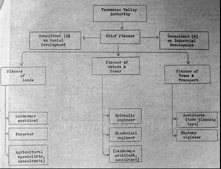
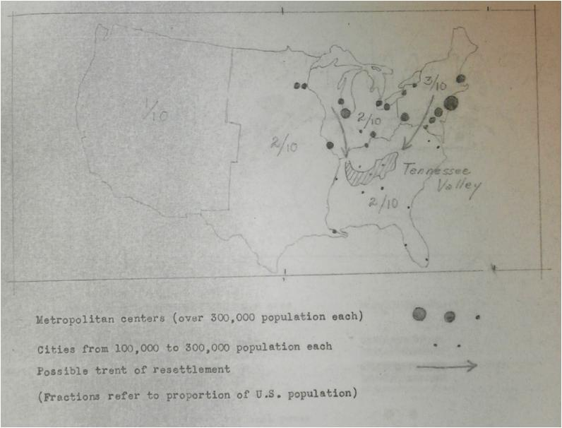
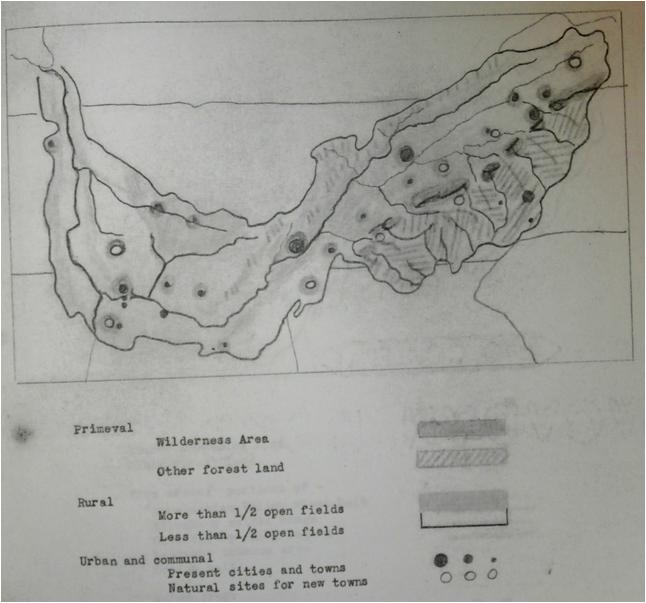

# Resumo

A Tenessee Valley Authority (TVA) foi uma autarquia criada em 1933 no
governo Roosevelt, como parte da política New Deal. O estudo das ideias
e experiências de planejamento regional de bacias hidrográficas pela
historiografia do planejamento, embora venha ganhando força mais
recentemente a partir de seus vínculos com a questão ambiental e de uma
retomada dos estudos sobre o desenvolvimento, ainda é incipiente. Nesta
perspectiva, a compreensão mais aprofundada sobre a TVA, as ideias e
concepções que mobilizaram e as transformações territoriais que
deflagraram é de grande relevância. Este trabalho foca os anos iniciais
da TVA, enfatizando a contribuição da RPAA e de Benton Mackaye nas
primeiras formulações de planejamento desta instituição. A contribuição
de Benton Mackaye ao planejamento regional é reconhecida por alguns
autores como o primeiro esforço teórico abrangente para uma abordagem
compreensiva do território nos Estados Unidos no período entre guerras e
sua participação na TVA é parte deste processo.

Palavras-chave: planejamento regional, Benton Mackaye, TVA, RPAA

# Abstract

Tennessee Valley Authority ( TVA ) was a agency created in 1933 in the
Roosevelt administratio , as part of the New Deal policy. Although it
has more recently gaining strength from their ties to the environmental
issue and a resumption of studies on the development, the study of the
ideas and experiences of regional planning watershed planning by
historiography is still incipient. In this perspective, a deeper
understanding of the TVA , the ideas and concepts that have mobilized
and territorial transformations that broke are much relevants . This
paper focuses the early years of TVA, emphasizing the contribution of
RPAA and Benton Mackaye in the first formulations of planning this
institution. The Benton Mackaye contribution in regional planning is
recognized by some authors as the first theoretical effort for a
comprehensive approach to territory in the United States in the interwar
period and their share in TVA is part of this process.

*Keywords*: regional planning, Benton Mackaye, TVA, RPAA Introdução

A década que se seguiu a grande crise de 1929 caracterizou-se por um
período de grande esforço governamental para o desenvolvimento dos
países americanos com base na estruturação de um aparato governamental e
de criação de instituições de planejamento regional. A Tenessee Valley
Authority (TVA) foi um dos organismos regionais criado em 1933, como
parte da política New Deal do governo Roosevelt, para alavancar a
economia da área compreendida pela bacia do rio Tennesse. O território
da bacia compreendia 105 mil km2 contemplando 7 estados -- Kentucky,
Tennessee, Mississipy, Alabama, Georgia, Carolina do Sul e Carolina do
Norte -- com uma população, em 1950, de 3 milhões de habitantes, que se
dedicavam fundamentalmente à agricultura.

Após a criação da TVA, foram criadas diversas instituições na América
latina, como a Corporação Chilena de Desenvolvimento, de 1939, a
Comisión Ejecutiva del Papaloapan (CODELPA) , em 1946 no México, A
Comisión técnico financiera del Río Negro ( RIONE ), em 1938 no Uruguai,
a Corporação do Rio Santa, no Peru, de 1943, a Comissão do Vale do São
Francisco (CVSF), de 1945, e Comissão Interestadual da Bacia
Paraná-Uruguai (CIBPU), de 1951, no Brasil. Diante desta proliferação de
experiências na America Latina que antecedem as politicas de
financiamento da ONU, buscamos compreender as ideias referentes ao
planejamento regional da TVA para que possamos dar os primeiros passos
na avaliação de como e em que medida as ideias desta agencia
repercutiram nas experiências latino-americanas.

O estudo das ideias e experiências de planejamento regional de bacias
hidrográficas pela historiografia do planejamento, embora venha ganhando
força mais recentemente a partir de seus vínculos com a questão
ambiental e de uma retomada dos estudos sobre o desenvolvimento, ainda é
incipiente. Nesta perspectiva, a compreensão mais aprofundada sobre a
TVA, as ideias e concepções que mobilizaram e as transformações
territoriais que deflagraram e os agentes envolvidos é de grande
relevância.

Este trabalho foca os anos iniciais da TVA, enfatizando a contribuição
de Benton Mackaye nas primeiras formulações de planejamento desta
instituição, assim como a repercussão destas propostas na concepção
original do órgão e para o seu deslocamento. Utilizamos a noção de
concepção para a análise desta instituição, compreendendo-a como
resultado de um processo de criação que envolve um conceito ou uma
ideia. Entendemos que a criação da TVA é resultado de um processo
conflituoso que envolve diferentes ideias submetidas a um campo de
forças.

## As origens da Tenessee Valley Authority e os vínculos com a RPAA {#as-origens-da-tenessee-valley-authority-e-os-vínculos-com-a-rpaa .list-paragraph}

Os dez anos compreendidos entre 1925 e 1935 marcam emergência do
planejamento regional nos EUA e se referem, segundo Friedmann (1979), a
um período de formação de um ideario de planejamento regional,
protagonizado pelo embate entre os chamados "metropolitanistas", cujo
protagonista era Thomas Adams, coordenador do *Regional Plan of New York
and its Environs*, e "regionalistas", representados por Lewis Mumford e
pela *Regional Planning Association of America* (RPAA). Os regionalistas
propunham a criação de condições que estabeleceriam uma relação
harmoniosa entre home e natureza, fundada em uma "bio-ética" e uma
cultura de conservação dos recursos naturais e das tradições culturais
que deveriam enfrentar o processo de metropolização e todos os impactos
dele decorrentes. De acordo com a doutrina original dos regionalistas,
planejamento regional era a criação de condições que poderiam
estabelecer uma relação harmoniosa entre seres humanos e natureza,
fundamentado em uma bio-ética que poderia mostrar um profundo respeito
pelos limites da intervenção humana nos processos "naturais" e o limite
do "canceroso" crescimento das cidades (FRIEDMANN,1979). Esta concepção
ampla do território se traduz por uma ênfase na escala regional e a uma
noção dos recursos naturais onde a perspectiva conservacionista vai se
destacar.

Neste período de eclosão de ideias, uma das experiências mais marcantes
de planejamento regional foi originada nos Estados Unidos, no governo
Roosevelt, como parte da política New Deal e que prometia colocar em
prática todo o ideário que vinha se constituindo sobre planejamento
regional conduzido pela RPAA. A *Tenessee Valley Authority* (TVA),
criada em 1933, refletia por um lado, o desejo pessoal do presidente
Franklin D. Roosevelt para melhorar a aparência e produtividade da
paisagem da região, e por outro lado, foi uma resposta às terríveis
circunstâncias econômicas que acompanharam a Grande Depressão (SCHAFFER,
1990). Como governador do estado de Nova Iorque, F. Rossevelt havia
tomado conhecimento das ideias da RPAA sobre planejamento regional,
inclusive pela participação de Clarence Stein e Henry Wright na
elaboração do Plano para o Estado de Nova Iorque para o governo
anterior, ampliando sua ideia de planejamento urbano para pensar a
cidade em nível regional em termos de um ordenamento do uso da terra e
distribuição da população (GRAY, 2005).

Criticando a relação que chamavam de "parasítica" entre metrópole e área
rural, com o esgotamento dos recursos do solo, florestas e rios, a RPAA
defendia a relação interdependente entre área urbana e rural, a
descentralização da metrópole com a criação de novos núcleos urbanos, a
modernização do território através das redes de infraestrutura de
transporte (hidroviário, ferroviário e rodoviário), de equipamentos
sociais e de lazer, e de geração e distribuição de energia,
particularmente a hidrelétrica, o planejamento regional com técnicas
conservacionistas.

Dois membros da RPAA fizeram parte do núcleo inicial da TVA, construindo
diretamente uma ligação entre as duas instituições, são eles Tracy Augur
e Benton Mackaye. Ambos foram contratados na ocasião em que Earle
Draper, chefe da Divisão de Planejamento Territorial e Habitação da TVA
montou uma equipe especializada para colaborar nos trabalhos de
planejamento regional da instituição. Augur foi contratado como chefe da
Seção de Planejamento Regional e Mackaye como técnico em planejamento
regional (GRAY, 2005). Augur seria o responsável pelo planejamento da
cidade de Norris e Benton Mackaye tinha como atribuição a elaboração do
plano regional da instituição.

Através de uma longa e variada carreira, MacKaye havia ganhado reputação
como um dos ambientalistas e planejadores mais importantes dos Estados
Unidos. Ele foi um dos principais expoentes do movimento
conservacionista norte-americano, liderado por G. Pinchot, e teve
atuação no Departamento do Trabalho do estado de Washington. Mackaye e a
RPAA denunciavam os impactos sociais e culturais dos processos de
industrialização e metropolização e esperavam que uma nova geração de
"engenheiros humanos" pudessem aproveitar a tecnologia moderna,
especialmente a hidrelétrica, para controlar o crescimento das grandes
cidades e construir a prosperidade na vida comunitária (MUMFORD, 1925).

Em sua atuação no Departamento do Trabalho do estado de Washington,
Mackaye elaborou o estudo *Employment and Natural Resources*, publicado
em 1919, que ofereceu diretrizes à política de colonização e ao
aproveitamento dos recursos naturais, ressaltou a importância dos
serviços sociais e de infraestrutura como elementos capazes de
condicionar as localizações produtivas e atrair indústrias e defendeu a
redução da jornada de trabalho com manutenção dos salários (DAL CO,
1975).

MacKaye era um dos membros mais ativos da RPAA. Em 1925, ajudou a
organizar e publicar o número sobre planejamento regional da revista
*Survey Graphics*, que constituiu num dos marcos do ideario regionalista
baseado nos princípios de conservação e das cidades jardim nos Estados
Unidos. Em 1928, MacKaye publicou *The New Exploration*, onde delineou
sua filosofia de planejamento regional, enfatizando o equilíbrio e a
harmonia entre os três ambientes básicos - o primitivo, rural e urbana.
Neste mesmo ano, MacKaye foi co-autor (com Lewis Mumford) de um artigo
clássico sobre planejamento regional para a *Enciclopédia Britânica*, em
que os autores delinearam as diferenças entre planejamento metropolitano
(que defendiam o crescimento urbano) e de planejamento regional (que
pregava o equilíbrio ambiental e social).

A criação da TVA foi para MacKaye a possibilidade de colocar em prática
a suas ideias e experiência. Sua carreira como conservacionista, teórico
regional, planejador prático, e na administração pública, parecia ser a
base ideal para uma das experiencias mais ousadas do New Deal. MacKaye
se fez presente na elaboração de várias propostas para a concepção
inicial da TVA desde antes de sua contratação pela TVA em 1934. Um dos
exemplos foi o ofício enviado em dezembro de 1933 contendo um esboço de
suas ideias sobre a política florestal da TVA, a partir de uma
solicitação feita por Edward Richards, chefe do Setor Florestal. Podemos
perceber seu esforço em mostrar que seus trabalhos eram fundamentais
para aquela agência pela quantidade de documentos elaborados a este
respeito e enviados à TVA e também percebemos através dos ofícios que
suas ideias eram requeridas pela equipe da TVA.

A MacKaye foi dada a responsabilidade de formular o programa do Plano
Regional de número l da TVA. No entanto a concepção de planejamento
integrado e unitário de MacKaye divergiam do pensamento dominante da
agência, e sua influência dentro TVA foi rapidamente diminuindo, exceto
por seu papel como amigo e mentor de um pequeno grupo de jovens membros
da equipe da agência que compartilhavam seus ideais ambientais. Para
Schafer (1990), ele era um filósofo em um mundo ocupado em grande parte
por construtores e burocratas. Mackaye trabalhou na TVA por 26 meses
(abril de 1934 a julho de 1936) quando houve uma redefinição das
diretrizes da instituição com a reeleição de Roosevelt.

## O Plano Regional nº1 de 1934 {#o-plano-regional-nº1-de-1934 .list-paragraph}

No início de 1934, Draper solicitou a Mackaye para que delineasse suas
visões sobre como o processo de planejamento regional deve se
desenvolver e ser realizado pela TVA. Em fevereiro do mesmo ano Mackaye,
então vice-presidente da RPAA, elaborou o documento *Regional Planning &
The Tennessee Valley*. A partir deste material, Draper solicitou ao
Conselho de Diretores da TVA que se aprovasse a realização do plano
regional a ser elaborado pela Divisão de Planejamento Territorial e
Habitação. A proposta era elaborar um plano regional compreensivo que
pudesse orientar os empreendimentos públicos e privados em andamento ou
em projeto.[^1]

Com a aprovação do Conselho de Diretores, Draper contrata Mackaye em
abril de 1934 para realizar o plano chamado de *A Seção do Vale do
Tennessee do Plano Nacional*. A referência a um \"plano nacional\"
provavelmente reflete opinião expressa do FDR que a TVA poderá servir
como um protótipo para o desenvolvimento das bacias hidrográficas em
todo o país. [^2]

A resposta de Mackaye foi dada através de um memorando datado 20 de
agosto de 1934 que continha o *Progress Report on Regional Plan Nº1*,
intitulado por Mackaye de *Opus One*. [^3] O documento de Mackaye
expressou sua compreensão da missão da Divisão de Planejamento
Territorial e Habitação e forneceu diretrizes para a concepção do plano
regional. Entre as diretrizes estavam a elaboração de planos e pesquisas
regionais sobre a classificação, localização dos recursos básicos e
vocações de utilização da terra e comunicação. Os elementos do plano
deveriam incluir uso da terra, padrões populacionais e colonização.
Mackaye propunha três linhas de atuação para a TVA relacionadas ao
desenvolvimento fisico, economico a social, sendo que estes deveriam ser
pensados e realizados de maneira integrada.

No que se refere ao desenvolvimento físico, propunha a geração e
transmissão de energia de baixo custo, controle de erosão e do fluxo de
água evitando as enchentes, mobilidade regional (hidrovias, rodovias e
ferrovias) através da construção de uma *highway*, nucleos urbanos de
colonização, descentralização da metrópole - industrial, econômica,
urbana e os investimentos na área rural (agricola e florestal). Em
relação ao desenvolvimento econômico propunha o uso da terra para
produção agroindustrial, e a substituição da cultura extrativista pela
conservacionista. Em relação ao desenvolvimento social estava uso da
terra para vida comunitária, formulação de procedimentos para orientar o
crescimento das comunidades e a distribuição da população pelo
território promovendo um equilíbrio entre as áreas urbana, rural e
primitiva. No documento intitulado "Physical planning in the TVA
Program", Mackaye retoma estas ideias na elaboração de seu conceito de
planejamento regional, enfatizando a integração entre planejamento e
ação, e substitui a ideia de coordenação para a ideia de planejamento
integrado.[^4]

No que se refere a estrutura administrativa, Mackaye define divisões
cooperativas (isto é, agricultura, florestas, desenvolvimento mineral,
indústria, etc.) que deveriam produzir estudos e pesquisas que poderiam
posteriormente ser coordenados com o ordenamento territorial da bacia e
tornando parte dele.

A preocupação de MacKaye era orientar o pensamento e a concepção da TVA,
o que incomodou o corpo de diretores e principalmente aqueles que não
compartilhavam das mesmas posições que ele. O que o Conselho de
Diretores da TVA, especialmente David E. Lilienthal e Harcourt A.
Morgan, esperava de Mackaye não era um documento contendo a política e a
concepção de planejamento que deveriam ser implantadas, os principais
problemas a serem considerados e a orientações para a operacionalização
do plano. Quem definia isso era o próprio Conselho. O que se esperava um
amplo diagnóstico dos recursos da região como subsídio à tomada de
decisão. Esta informação deveria servir como base para futuros esforços
para promover o desenvolvimento econômico, um processo que seria em
forma em grande parte por investimentos privados e governos locais e
estaduais. Para MacKaye, no entanto, um plano regional não era um
documento neutro. Se para Lilienthal e Harcourt Morgan, um plano
regional era um instrumento passivo, para MacKaye, era uma ferramenta
ativa. O planejador deveria ser um ativista para MacKaye e não um
fornecedor de informação imparcial que poderia ser usado por
funcionários nomeados ou eleitos para tornar as decisões políticas
(SCHAFFER, 1990).

De qualquer modo, a preocupação de TVA para o ordenamento urbano,
recreação, beleza cênica, e desenvolvimento econômico com qualidade de
vida tem como base as idéias de MacKaye e segundo Schaffer (1990), sua
capacidade de transmitir essas idéias para os membros da equipe juvenil
da agência que continuaram trabalhando lá por muitos anos depois da
saída de Mackaye.

## Os conflitos na organização da estrutura administrativa da TVA {#os-conflitos-na-organização-da-estrutura-administrativa-da-tva .list-paragraph}

Mackaye foi contratado pela TVA como um técnico, um membro de uma equipe
operacional nos baixos cargos da organização - o *regional planner*. Seu
chefe direto era Tracy Augur, chefe da Seção de Planejamento Regional da
Divisão de Planejamento Territorial e Habitação, dirigida por Earle
Draper. Nesta posição, ele estava limitado em relação às decisões, cujo
poder não lhe pertencia.

Entretando, Mackaye havia tentado convencer o Conselho de Diretores que
os planejadores e o planejamento regional deveria assumir um papel mais
direto e influente na formação de políticas de agências e não apenas um
dos setores da estrutura administrativa (SCHAFFER, 1990). Mackaye havia
feito uma proposta de estrutura administrativa para a TVA que
contemplava uma Chefia de Planejamento central e subordinada a ela três
setores de planejamento: territorial, de água e energia e de cidades e
transporte. Nesta estrutura, ele dava a mesma ênfase ao desenvolvimento
social e ao desenvolvimento industrial e econômico. Entre os cargos
propostos, destacavam-se cargos de arquitetos (paisagistas e
planejadores urbanos), presentes em todos os setores propostos. No
entanto a estrutura organizacional que foi montada em 1933 estava
voltada em divisões especializadas voltadas aos serviços operacionais e
aos setores de desenvolvimento econômico, e o planejamento é colocado
como uma das divisões do desenvolvimento.

{width="4.5625in"
height="3.4895833333333335in"}

Figura 1. Proposta de Estrutura Administrativa da TVA feita por B.
MacKaye, 30 de maio de 1933. Fonte: *Benton Mackaye Papers*, pasta3,
caixa 180

Este era também um problema que Draper tentou enfrentar pouco depois que
Mackaye deixou a TVA. Draper entendeu que a Divisão de Planejamento
Territorial e Habitação não poderia ser somente mais uma das várias
divisões operacionais envolvidas com o desenvolvimento regional, mas
deveria ter posição mais central na estrutura administrativa e propõe
que se estabelecesse um Conselho de Planejamento Regional do qual
participaria representantes de todas as divisões da TVA. O conselho
seria um auxilio nos estudos coordenados e nas recomendações sobre a
abordagem da TVA para os problemas regionais. Este Conselho permaneceu
ativo, sob a liderança de Draper, até 1940 quando ele deixou a TVA.
(GRAY, 1990)

No entanto a partir de 1936, com a reestruturação administrativa da TVA,
a divisão de planejamento regional foi eliminada, e Arthur Morgan, o
único defensor do planejamento regional na TVA foi substituído por David
Lilienthal, o coordenador das operações energéticas da TVA. Esta nova
etapa estava baseada na geração de energia e industrialização.

## As new towns no Vale do Tennessee {#as-new-towns-no-vale-do-tennessee .list-paragraph}

Para Mackaye, a industrialização urbana e a expansão acelerada da
metrópole estava invertendo a ordem natural do ambiente, e a vida
regional estava sendo substituída pelos males da metrópole, que
concentrava atividades, pessoas e a economia e estabelecia uma relação
de exploração com o resto do território. Neste sentido defendia a ideia
de "equilíbrio regional" através da descentralização das atividades
econômicas, especialmente da industria, e das pessoas, através de
criação de novos núcleos urbanos que dariam suporte a estas atividades,
da industrialização das atividades agrárias e agrícolas, da criação de
um sistema de rodovias e da conservação de áreas naturais.

A criação de novas cidades estava entre as principais estratégias de
planejamento regional defendidas por Mackaye, associadas a uma política
de descentralização urbana e industrial, conservação dos recursos
naturais, criação de rodovias regionais, eletrificação rural. Mackaye
elabora um esboço sobre a redistribuição da população considerando o
desenvolvimento da região do Vale do Tennessee uma possibilidade de
frear o crescimento metropolitano. (Figura 2) Nesta orientação, propõe
também locais para a criação de novas cidades na região, pensando o
planejamento urbano em nivel regional, relacionando os novos núcleos às
cidades já existentes, assim como às áreas rurais agricultáveis e às
áreas naturais e florestadas. (figura 3).

{width="4.21875in" height="3.21875in"}

Figura 2. O Vale do Tennessee na nação -- uma possibilidade de
reassentamento, 1933. Fonte: *Benton Mackaye Papers*, pasta 3, caixa
180.

{width="3.8958333333333335in"
height="3.625in"}

Figura 3. O Vale do Tennessee como região -- o equilíbrio do ambiente, 1933. 
Fonte: *Benton Mackaye Papers*, pasta 3, caixa 180.

Os novos núcleos urbanos deveriam ser criados pela TVA, segundo Mackaye,
para o reassentamento da população atingida pela construção de barragens
e reservatórios que tiveram suas terras inundadas, e para a relocação da
população tradicional que vive *Parque Nacional Smoky Mountains*, criado
em 1934 como parte da *Appalachian Trail*, trilha concebida por Mackaye
que liga Maine a Georgia. Deveriam ser feitos esforços para os melhores
acordos na relocação da população, tanto em termos de emprego como de
ambiente.

A despeito desta orientação, foi criada apenas uma cidade nova pela TVA,
a cidade de Norris, para o reassentamento da população atingida pela
barragem de Norris. Em 1938, com a reorientação das atividades
enfatizando objetivos de industrialização e geração de energia, a TVA
elimina da organização administrativa o departamento responsável pela
criação de núcleos urbanos, a Divisão de Planejamento Territorial e
Habitação, cujo chefe era E. Draper.

## Energia e indústria: o deslocamento da ideia de planejamento regional na TVA e as transformações no território {#energia-e-indústria-o-deslocamento-da-ideia-de-planejamento-regional-na-tva-e-as-transformações-no-território .list-paragraph}

Se havia inicialmente um ideário regional fundado na conservação dos
recursos e dos valores humanos comunitários e de descentralização
metropolitana através da construção das *new towns*, a partir da
reeleição de Roosevelt houve uma reestruturação interna da TVA que
reorientou os esforços da instituição acentuando a geração de energia e
industrialização.

A utopia cedeu espaço para a razão prática, nos termos de Friedmann
(1979), e a nova concepção chamada de Dreamers with Shovels por David
Lilienthal, baseado no desenvolvimento integrado dos recursos naturais
para utilização do homem e na bacia hidrográfica como a unidade de área
mais apropriada para este propósito, conduzia a experiência da TVA a ser
uma extensão, sob os auspícios do Estado, do capitalismo monopolista a
uma região remota e pré-industrial. (FRIEDMANN, 1979)

Ao final dos anos 1950, a região do vale do Tennessee tornou-se a maior
produtora de energia doa EUA, aumentando em 900% (em 1933 produzia
350kwh/pessoa; em 1951, passou para 3560kwh/pessoa). Esta energia, no
período da 2ª guerra estava direcionada à industria bélica: "a força
elétrica é fluido vital da guerra moderna", segundo Lilienthal. Promoveu
o desenvolvimento de pesquisas e produtos voltados para a guerra
(alumínio, explosivos, borracha sintética, etc.) e possibilitou a
instalação da indústria secreta de energia atômica em Oak Ridge, pelo
projeto Manhattan, responsável pela fabricação das bombas nucleares
lançadas contra o Japão através do fornecimento de grandes quantidades
de energia elétrica a preços baixos.( LILIENTHAL, 1956)

Em relação aos empreendimentos privados, as indústrias se multiplicaram
em número e diversidade. Em 1933 havia 2400 indústrias no vale, em 1950
este numero passa para 6620, com um incremento de 4220 novas fábricas na
região, de alimentos congelados, fabricação de aviões, máquinas de
costura, fogões, farinha, marchetaria, tampas de barril, aquecedores
para água, máquinas de calcular, móveis, calçados, lápis, têxteis,
rédeas, acetileno. Entre as empresas estavam a Alunimun Company of
América (ALCOA), as indústrias químicas de explosivos e fertilizantes
Monsanto Chemical e Victor Chemical, as indústrias de tecidos sintéticos
American viscose, American Enka e Du Pont, além da alimentícia Quaker
Oats. (LILIENTHAL, 1956)

Entre 1933 e 1950, a renda per capita aumentou em quase 500% e o numero
de empregados na industria passou de 447.800 para 919.400, um incremento
de quase meio milhão de trabalhadores. Como consequência do intenso
processo de industrialização, a população se deslocou para as áreas
metropolitanas do vale. Entre 1933 e 1950, as metrópoles do Vale do
Tennessee aumentaram sua população mais que duas vezes em relação ao
aumento da região como um todo. Dois terços do acrescimento populacional
da região se deu em áreas metropolitanas e as industrias agregaram
160.000 trabalhadores nestas décadas. Neste sentido, a ideia de
descentralização da metrópole através de uma nova civilização biotécnica
defendida pela RPAA e presente nos primeiros anos da TVA cederam espaço
para o desenveolvimento de bacias hidrográficas que fortaleceu a
expansão industrial urbana através da canalização de recursos e de
população para a metrópole. (FRIEDMANN, 1979)

## Considerações finais {#considerações-finais .list-paragraph}

O estudo baseado no acervo documental de Benton Mackaye e na
bibliografia revela que a Tennesse Valley Authority representou uma
experiência ímpar no planejamento regional norte-americano,
estabelecendo vínculos com o ideário da RPAA no que se refere à
concepção de planejamento regional. Detecta-se também que a contribuição
de Mackaye foi significativa para a criação da instituição e que sua
influencia se dá mesmo antes de sua criação. No entanto a duração deste
ideário na TVA é curta e se desloca de uma compreensão que privilegia
questões de conservacionistas, sociais e de planejamento, em direção a
um enfoque na geração de energia, na industrialização e na gestão.
Podemos compreender este deslocamento como resultado de um jogo de
forças e que a orientação da instituição é resultado dos conflitos e
interesses em jogo.

## Referências bibliográficas {#referências-bibliográficas .list-paragraph}

*Benton Mackaye Papers*, Special Collections, Darthmouth College
Library.

FRIEDMANN, J.; WEAVER, C. *Territory and function*: the evolution of
regional planning . Berkeley: University of California Press, 1979

GRAY, A. J.; JONHSON, D. A. *The TVA regional planning and development
program:* the transformation of an institution and its mission.
Gateshead: Athenaeum Press, 2005.

SCHAFFER, D. Benton MacKaye: The TVA years. *Planning Perspectives*,
[Volume 5](http://www.tandfonline.com/loi/rppe20?open=5#vol_5), [Issue
1](http://www.tandfonline.com/toc/rppe20/5/1), 1990.

LUBOVE, Roy. *The urban community.* Housing and Planning in the
Progressive Era. New Jersey: Prentice Hall Inc., 1967.

LILIENTHAL, D. *TVA.* A democracia em marcha. (Tradução de Octavio A.
Velho) Rio de Janeiro: Editora Civilização Brasileira S/A, 1956.

MACKAYE, B. Regional Planning and Ecology. Ecological Monographs, Vol.
10, No. 3 (Jul., 1940), pp. 349-353. Published by Ecological Society of
America.

MACKAYE, B. An Appalachian Trail: a project in Regional Planning.
*Journal AIA*, october, 1921.

MACKAYE, B. *The New Exploration*. A philosophy of regional planning.
New York: Harcourt, Brace and company, 1991.

MUNFORD, L. *A cultura das cidades*. Belo Horizonte: Itatiaia, 1961.

[^1]: Ofício de Benton Mackaye a Earle Draper, 20/08/1934. *Benton
    Mackaye Papers*, pasta 6, caixa 180.

[^2]: Ofício de Benton Mackaye a Earle Draper, 20/08/1934. *Benton
    Mackaye Papers*, pasta 6, caixa 180.

[^3]: *Opus One, Progress Report on Regional Plan Number 1.* Memorando
    de 20/08/1934 (revisado em 20/12/1934).

[^4]: Mackaye, B. Physical planning in the TVA Program, 1935. *Benton
    Mackaye Papers*, pasta 15, caixa 180.
