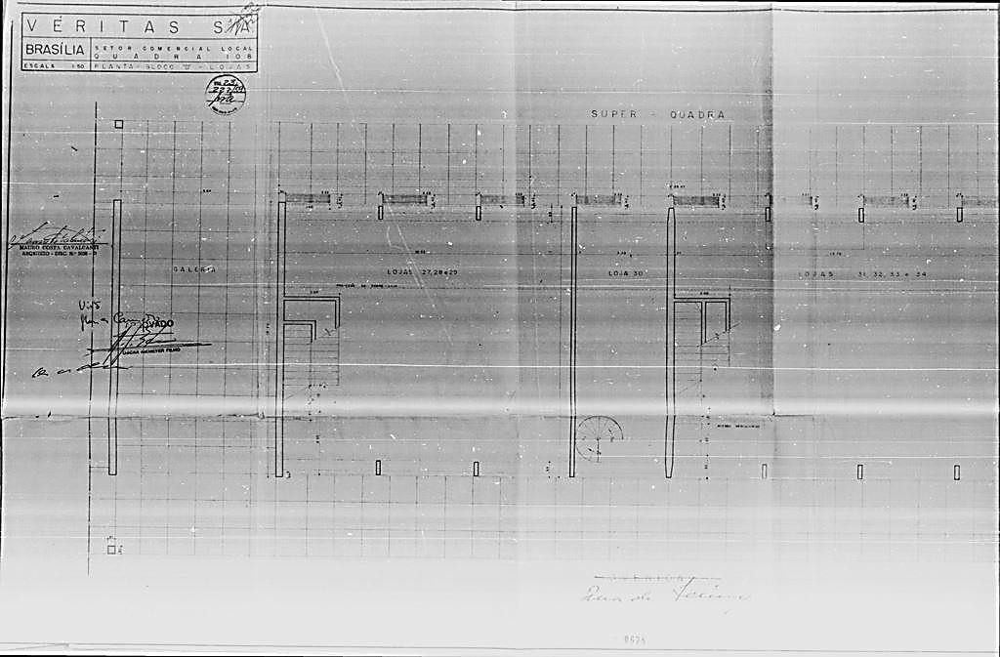
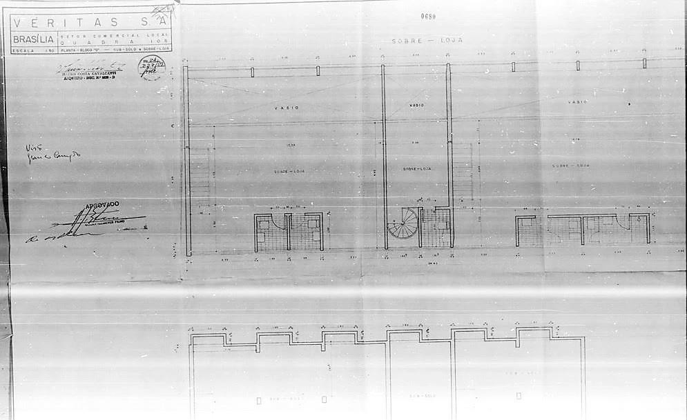
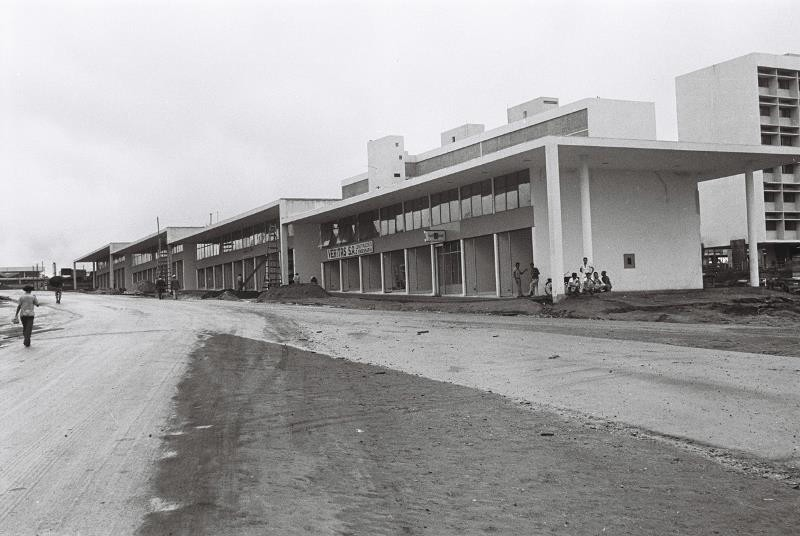
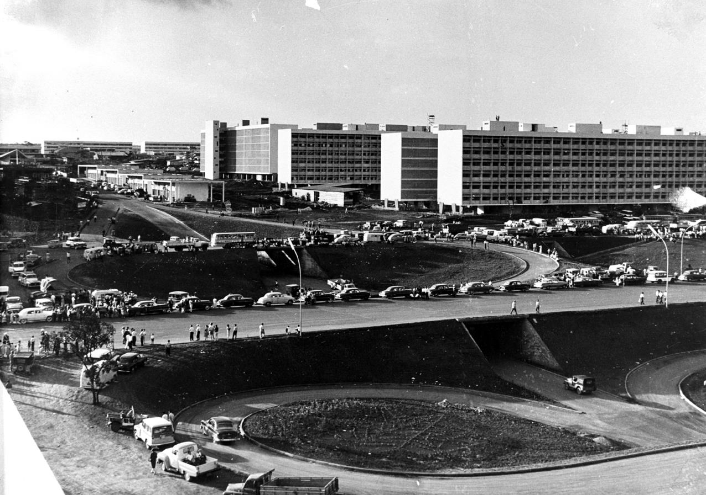
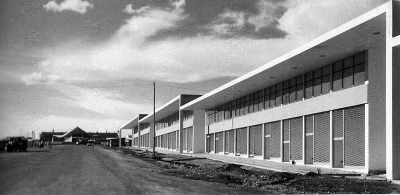
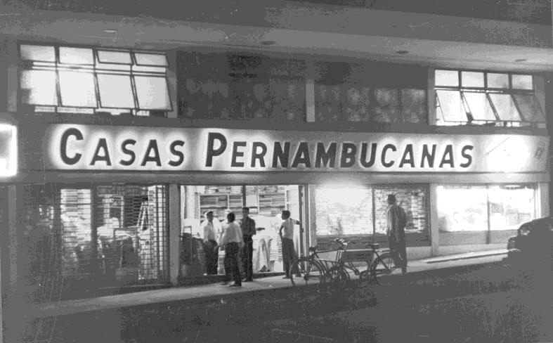
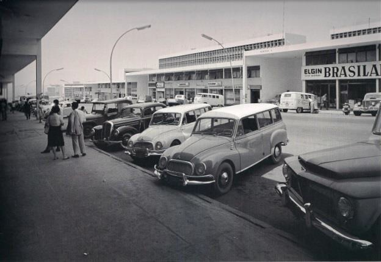
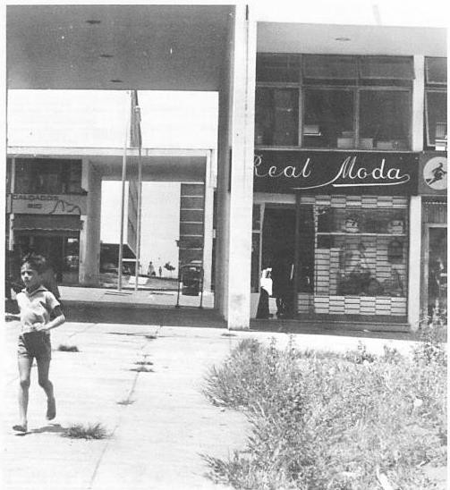

# Resumo

Criados para o estabelecimento de atividades de comércio varejista, a
fim de suprir as necessidades cotidianas da população das áreas de
vizinhança, os comércios locais da Asa Sul começaram a ser implantados
antes da inauguração de Brasília. A concepção de seu desenho urbano
baseou-se na separação de funções preconizada pelo Urbanismo Moderno,
nas diretrizes difundidas na Europa no início do séc. XX, por meio da
Carta de Atenas. Foi também influenciado pelas idéias de Ebenezer
Howard, criador da cidade-jardim, e Clarence Perry, que em 1920 propôs o
conceito da unidade de vizinhança, onde os serviços de apoio à habitação
ficam situados junto às áreas residenciais, à distancia de uma caminhada
a pé. No estudo do projeto do comércio local sul da Unidade de
Vizinhança de Brasília observamos que a concepção do seu autor foi
transmitida em palavras, captada e representada em projeto da NOVACAP,
erguida sob a interpretação própria da empreendedora, e submetida a um
modelo de organização (norma) que evidenciou a busca pela ordem
perseguida pelo poder público. Ao longo do tempo esse espaço urbano foi
apropriado e experienciado por seus habitantes, os quais imprimiram sua
própria representação (significado) por meio do uso cotidiano e não
somente pela materialização do projeto original. O resultado dessa
superposição de representações num mesmo espaço é o artífice da
identidade da CLS 107/108, a Rua da Igrejinha.

Palavras-chave: Projeto, Representação, Identidade, Brasília, Comércio
Local

# Abstract

Planned for retail trade activities to supply daily needs of
neighborhood, the commercial areas began to be built before Brasília's
inauguration. It's urban design was based on the concept of separation
of functions, divulged in Europe in the XX Century, in the Chart of
Atenas, by Modern Movement. It was also influenced by Ebenezer Howard's
principles, the creator of garden cities, and Clarence Perry, who
proposed the neighborhood unit in 1920, where the support services for
homes stays near the residential areas, at distance of a short walk. In
the research of project of local commercial area of Brasília's
Neighborhood Unit, it was observed that the author's conception was hand
down in words, represented on Novacap's design, raised up under owner
peculiar understanding, and submitted to an organization model (rules)
that followed the search of order imposed by public power. Overtime,
this urban space was appropriated by their inhabitants, whom impressed
their own representations by daily use, not only for the build original
project. The result of such layers of representation in the same space
is the artisan of Rua da Igrejinha's identity.

Keywords: Design, Representation, Identity, Brasília, Local Commercial
Area

# Introdução: Brasília -- capital brasileira e cidade modernista

> O sol está se pondo na Rua da Igrejinha. Um intenso movimento de
> carros registra que o expediente já terminou e é hora de voltar para
> casa. Um menino segue de skate pela calçada da CLS 107, compra um
> guaraná caçula na pizzaria Dom Bosco e continua seu caminho rumo à
> panificadora Vitória para comprar o pão mais gostoso. A equipe de
> gravação da TV Brasília está em frente à pizzaria, provavelmente para
> fazer mais uma reportagem sobre um dos mais antigos e queridos
> estabelecimentos comerciais da cidade. A Pastelmix está com as mesas
> cheias, apesar de ser quarta-feira. O bar Nova York mantém seus
> alegres frequentadores em pé na calçada, conversando e bebendo, claro.
>
> \...
>
> Pelas frestas dos brises brancos, acompanho de longe os movimentos das
> bailarinas na aula da Academia Norma Lília com alegria e surpresa,
> apreciando essa visão noturna quase poética. Na sorveteria Parmalat os
> últimos fregueses do dia ocupam alguns lugares nos bancos de madeira
> do jardim iluminado. Os garçons do Xique Xique esfregam as mãos,
> impacientes, lamentando as mesas ainda vazias.
>
> \...
>
> A missa da noite já acabou, os fiéis recolhem as cadeiras que foram
> colocadas na praça. A iluminação alegre da Igrejinha contrasta com a
> luz suave existente em toda a praça, e deixa a cena mais bonita.
>
> O movimento de carros começa a diminuir. Embaixo da árvore junto ao
> estacionamento, um homem cheira tiner. Do outro lado da praça, no
> banco contínuo e curvo, três mendigos conversam e riem, com uma
> criança no colo.
>
> (trecho da narrativa da observação de um final de dia na Rua da
> Igrejinha).

A concepção urbana que criou Brasília, "planejada para o trabalho
ordenado e eficiente, mas ao mesmo tempo cidade viva e aprazível,
própria ao devaneio e à especulação intelectual" (COSTA, 1957), previu
que cada setor da atividade humana e urbana tivesse seu espaço
predefinido e pudesse contemplar todas as necessidades básicas dos
futuros habitantes.

Para a cidade planejada a estruturação espacial em setores e zonas
poderia ser eficientemente implantada e conduzida, já que o Estado seria
o principal incorporador da obra, e a construção de Brasília estaria
submetida a rígidas normas e regramento edilício. O projeto urbanístico
organizou a cidade em setores, dos quais o setor

residencial, onde se situa o comércio local, foi concebido segundo o
conceito de unidade de vizinhança originalmente proposto por Clarence
Perry nos anos 19201, e reformulado por Lucio Costa. Milton Braga (2010)
cita que o inventor soube relativizar os conceitos e fórmulas já
conhecidos e aplicá-los de modo combinado com formas urbanas
tradicionais consagradas, recriando um novo desenho urbano "*desarmado
de preconceitos*" 2.

Na zona residencial, as superquadras
foram organizadas de maneira a refletir a separação de funções e
atividades encontradas em toda a cidade. Cada quatro superquadras formam
uma unidade de vizinhança, compostas por área residencial, equipamentos
públicos, igreja, e espaços verdes que permeiam tudo (figura 1). Em cada
superquadra prevê-se uma área de comércio vicinal em um dos lados do
quadrilátero, responsável pelo abastecimento da população, denominado
*comércio local*.

Figura 1: croquis 13 e 14 dos comércios locais constantes do Relatório
do Plano Piloto, de autoria de Lucio Costa. Fonte: Relatório do Plano
Piloto de Brasília, ArPDF, 1991.

Os comércios locais têm sido alvo de transformações desde sua criação,
provocadas por alterações no conceito da edificação planejada por Costa,
ou pelo surgimento de novas atividades comerciais inexistentes à época
de sua criação, ou mesmo pelas mudanças nas características de consumo
da população.

O fato de ser um espaço de intensa apropriação social, se comparado com
outros setores da cidade, e cotidianamente presente na vida do
habitante, coloca o comércio local como palco de interesses diversos,
sendo protagonista de frequentes debates sobre suas características e
função na cidade.

Como consequência surgem histórias e especulações sobre o projeto
original e a intenção do autor na formação do lugar.

Nesse sentido, Saboia e Medeiros (2011, p. 7) consideram que foi
instituído "o mito do projeto original":

> 1 Gorovitz, Matheus; Ferreira, Marcilio Mendes: A Invenção da
> Superquadra .IPHAN, Brasília, 2008 p. 16.
>
> 2 BRAGA 2010, 219.
>
> A cidade, ao invés de ser analisada a partir de suas próprias
> premissas, passa a ser eternamente correlata a um projeto "original" e
> não pela responsabilidade da gestão pública e da compreensão das
> vivências cotidianas. Se o projeto original torna-se responsável pelas
> suas qualidades e problemáticas natas, também se isenta de todas as
> mazelas e interferências posteriores. A cidade passa a ser regida pela
> "retórica da perda" que busca uma identidade idealizada pelo projeto e
> que não poderá ser constituída de fato.

O objetivo desse artigo é compreender questões de representação
multifacetadas do objeto historiográfico em estudo, no caso os projetos
institucionais e normas que regeram o espaço do comércio local durante
as primeiras décadas e hoje. Desde o princípio da construção da capital
instala-se a relação dialética entre a capital, representada pelo plano
piloto de Lucio Costa; e a metrópole urbana, configurada pelas cidades
satélites no seu entorno. Ao longo do tempo, esse espaço urbano foi
apropriado e vivenciado por seus habitantes, os quais imprimiram sua
própria representação coletiva nas construções edilícias e de espaço
público do comércio local.

A pesquisa compreendeu o estudo da apropriação inicial dos comércios
locais, por meio de suas representações e regulamentos, verificar as
transformações ocorridas e suas causas. Acredita-se que o desenho urbano
tenha sido suficiente para submeter o espaço privado ao conceito de
espaço público desejado, e que a dinâmica urbana contribuiu
significativamente para a configuração dos comércios locais desde a sua
criação.

Na análise da documentação constata-se que houve uma primeira
interpretação das ideias de Costa, que culminaram em representações
diferentes daquelas descritas no Relatório do Plano Piloto. Neste texto
são abordadas as representações do comércio local da CLS 107/108,
conhecida como Rua da Igrejinha, a partir da concepção do urbanista até
a construção da identidade do local, pela sua apropriação social.

# Do Relatório de 1957 à configuração pela NOVACAP -- representação da setorização

Costa representou os comércios locais como dois conjuntos de lojas e
sobrelojas simétricos em ambos os lados da via de acesso, em seu
Relatório (1957). A descrição dos edifícios comerciais prevê a abertura
das lojas para dentro da superquadra, delegando à via a função de
circulação de veículos e local de carga e descarga de mercadorias, o que
seria coerente com os princípios do Urbanismo Moderno. A separação da
circulação viária destinava aos pedestres as calçadas e passeios, com
traçados independentes das vias de acesso veicular, ao que Costa chamou
de vias de serviço.

Percebe-se que o conceito de Lucio Costa para os comércios locais foi
reinterpretado para atender as expectativas dos proprietários e dos
comerciantes, durante a construção da cidade.

O acervo fotográfico do Arquivo Público do DF-ArPDF- indica que o
primeiro comércio local implantado foi a CLS 107. Neste projeto, as
fachadas foram projetadas e construídas voltadas para a via de serviço,
numa retomada do conceito de rua tradicional. Essa inversão pode ter
contribuído de maneira decisiva para que a

apropriação social desse espaço à vida cotidiana da cidade extrapolasse
as relações de vizinhança.

Ademais, havia a necessidade de espaços para instalar os
estabelecimentos comerciais, precariamente localizados na Cidade Livre,
que seriam demolidos após a inauguração de Brasília. A falta de
infraestrutura e serviços nos primeiros anos de consolidação da cidade
transformaram o comércio local em ponto de abastecimento da área central
e dos núcleos habitacionais periféricos, juntamente com a Via W3. As
lojas deixam de ser pequenos comércios para abrigarem grandes
estabelecimentos e voltam suas fachadas para a via de automóveis, onde
passava a clientela. Assim, o comércio que deveria ser local passa a ser
da cidade e não da vizinhança.

Os estudos de Carpintero (1998, p. 114), Leitão (2003, p. 13) e Braga
(2010, p. 156), indicam que o projeto original foi, na verdade, uma
"sumária apresentação do partido", posteriormente desenvolvido em âmbito
executivo pelas equipes da Divisão de Urbanismo e da Divisão de
Arquitetura da NOVACAP3 .

A Divisão de Arquitetura da NOVACAP foi responsável pela aprovação dos
projetos de arquitetura particulares e pela definição das normas
urbanísticas para os setores da cidade. Estas teriam fundamental
importância na configuração do espaço urbano, pois deveriam traduzir
para os profissionais e para os leigos os conceitos utilizados no plano
original, a serem fielmente aplicados na sua materialização.

Pesquisa realizada no Arquivo Técnico da SEDHAB/GDF sobre os comércios
locais indicou que somente em 28 de março de 1960, após a inauguração da
CLS 107, a NOVACAP aprovou a planta de locação AI-2 QD 101 a 117, que
reproduz o projeto construído. Em 13 de junho de 1960 foi publicado o
Decreto nº 7, que constituiu o primeiro documento de "Normas para
Construções em Brasília".

Porém, ainda em 1958 a *Revista Brasília* (1958, p. 12), editada pela
NOVACAP para divulgar os progressos da construção da nova capital, havia
publicado dois croquis que mostravam a proposta para os comércios
locais(figuras 2 e 3). Na representação, o carro que circula na via de
serviço convive com o pedestre, e o motorista também pode apreciar as
vitrines voltadas para a via, numa antecipação do futuro. As empenas das
galerias são cegas, e a sobreloja é caracterizada como um mezanino. As
coberturas, interligadas, são em alturas variáveis, já prevendo a
topografia em declive.

> **3** A Companhia Urbanizadora da Nova Capital-NOVACAP foi a empresa
> criada pelo presidente da República com amplos poderes e inúmeras
> atribuições, com o objetivo único de construir Brasília. (FISHER;
> LEITÃO, 2009, p. 20).

Figura
2; perspectiva das lojas dos comércios locais mostrando as vitrines
voltadas para a via, publicado em 1958 na REVISTA BRASÍLIA. Edição
Arquitetura e Engenharia. Brasília: nº. 15, Ano 2, março/1958, p.
12.Fonte: Inventário da UV -- Iphan, 2009.

Figura 3: os comércios locais, publicado na REVISTA BRASÍLIA, Edição
Arquitetura e Engenharia. Brasília: nº. 15, Ano 2, março/1958, p.
12.Fonte: Inventário da UV --Iphan, 2009.

Em 1960 a *Revista Brasília* publicaria um novo croqui da perspectiva
geral dos comércios locais, que sugere a apropriação da faixa verde de
emolduramento pelos moradores e usuários dos CLS, como espaço de estar
(figura 4).

Figura 4: perspectiva geral do comércio
local exposta na REVISTA BRASÍLIA, Edição Arquitetura e Engenharia.
Brasília: julho-agosto, 1960, p. 9. Edição Especial. Fonte: Inventário
da UV -- Iphan, 2009.

Para auxiliar na distribuição da setorização, a equipe técnica havia
elaborado um plano de distribuição de equipamentos públicos denominado
"esquema", encontrado no Arquivo Público do DF. Este fotograma4 não tem
data nem autoria, mas presume- se que tenha sido produzido entre 1957 e 1960. 
Percebe-se no "Esquema" que a palavra "setor" não tinha o cunho de
"lugar de concentração de serviços ou atividades

de mesma natureza", como é entendido atualmente. Designa antes um
sistema de distribuição de atividades, representados por cores e formas
geométricas. A maioria dos setores, na condição apresentada, é
constituída por pontos isolados de distribuição, como no curioso caso do
setor "Espiritual". Para o plano, a coerência encontrava-se na
distribuição simétrica e equilibrada das atividades, de maneira a
atender igualmente à população em seus raios de abrangência (figura 5).

4.  Em branco está distribuído o Sistema Escolar: jardins de infância e
    escolas classe dentro das quadras, escolas-parque nas entrequadras e
    "escola média" junto à via L2. Em amarelo, o "Setor Espiritual": as
    igrejas são representadas por triângulos localizados nas
    entrequadras e na entrada das quadras 400. Em vermelho, o Setor
    Hospitalar distribui os hospitais distritais, em uma única categoria
    diferenciada apenas pelo tamanho das áreas destinadas. Em verde, o
    Setor Recreativo mostra os clubes sociais (triangulo), áreas para
    esportes (losango). Os cinemas e teatros são apresentados em forma
    trapezoide. Em roxo, houve a distribuição do Comércio, discriminado
    em categorias "A, B e C", e cuja localização no esquema coincide com
    a localização dos comércios locais e com a W3.

Figura 5: Esquema Geral das Áreas Não
Residenciais. Autor e data desconhecidos. Fonte: ArPDF.

# Configuração do comércio local na superquadra -- representação de modernidade

O projeto 5 da CLS 107 foi elaborado pelo Serviço de Engenharia da Caixa
Econômica Federal do Rio de Janeiro, proprietária dos lotes. O processo
de aprovação se inicia com o pedido de locação dos blocos à Divisão de
Engenharia da NOVACAP, em 20 de junho de 1958, e contou com a aprovação
do arquiteto Sabino M. Barroso, da equipe de Oscar Niemeyer (figuras 6 e
7).

Esse projeto configura a alteração da proposta constante do Relatório do
Plano Piloto. Os banheiros ficavam nos fundos junto à escada, na
sobreloja. Esta ocupava dois terços da loja, configurando um mezanino, e
à entrada frontal havia pé-direito duplo. A planta mostra também os
pilares redondos da galeria lateral e os pilares quadrados que sustentam
as extremidades da marquise. As lojas não foram projetadas com subsolos.

Foram construídas simultaneamente 34 lojas distribuídas em quatro
blocos. Essa é outra característica que diferencia a CLS 107/108 das
demais. Não se tem conhecimento de outra quadra de comércio local que
tenha todas as suas lojas implantadas simultaneamente.

A leitura do projeto confirma a intenção de que, desde a primeira
edificação, a fachada voltada para a rua de serviço foi escolhida para
acesso principal às lojas.

5.  Os processos de aprovação de projetos mais antigos foram
    microfilmados e indexados por números de rolos e fotogramas,
    conforme os endereços dos imóveis. Para essa pesquisa foi necessário
    conhecer os rolos de números 1292 e 580, disponibilizados pela
    Administração Regional de Brasília.

# Figura 6 e 7: Projeto do SCLS quadra 107 de autoria da Caixa Econômica Federal do Rio de Janeiro. Fonte: Adm. Regional de Brasilia, GDF.

Embora tenha sido de autoria do proprietário das lojas, foi chancelada
pela autoridade responsável pela aprovação de projetos. A execução ficou
a cargo da Construtora Ecisa.

Os quatro blocos da CLS 108 foram construídos pela Construtora Veritas
S.A., quase ao mesmo tempo da CLS 107. O projeto consultado na
Administração Regional de Brasília indica claramente a aprovação do
arquiteto Oscar Niemeyer Filho, embora não tenha sido ele o signatário6.
É assinado pelo arquiteto Mauro Costa Cavalcanti e

visado por Glauco Campelo. Este projeto, ao contrário do anterior,
tratou as fachadas

> 6 Constam nas plantas o carimbo de aprovado do arquiteto, com
> assinatura não identificável, e a expressão "De ordem", abaixo da
> assinatura.

principais voltadas para o interior da superquadra, conforme a proposta
de Lucio Costa.

Percebe-se a diferença pelas janelas da
sobreloja voltadas para a "via de serviço", mais altas e menores, e há
indicação de "acesso de mercadorias" no limite da calçada junto à via. A
fachada voltada para a área residencial foi projetada com janelas longas
e amplas, portas e vitrines. Os banheiros e a escada de acesso à
sobreloja situam-se junto à fachada voltada para a rua. As lojas foram
projetadas com subsolos cujos poços de ventilação (poço inglês),
situados na fachada considerada "principal", são interrompidos para
permitir o acesso às lojas com conforto (figuras 8 e 9).

# Figuras 8 e 9: projeto da CLS 108, bloco D, de autoria de Mauro Costa Cavalcanti, aprovado "de ordem" por Oscar Niemeyer, e visado por Glauco Campelo. Fonte: Adm. Regional de Brasília, GDF.

Embora o projeto arquitetônico da CLS 108 seja mais cuidadoso e melhor
detalhado, em essência a tipologia das duas quadras não mudou. São
edifícios de dois pavimentos sob cobertura em laje plana, com marquises
de três metros de avanço em ambos os lados. As laterais das lojas são
empenas cegas. As fachadas são simples aberturas totais no térreo, e
janelas "em fita" na sobreloja, com variações de tamanho.

As fachadas de ambos os projetos são praticamente iguais, com pequena
diferença no tamanho das janelas e no tratamento das portas que,
juntamente com a posição dos banheiros e escadas em planta, distinguem a
fachada principal da posterior.

Entre as diferenças observadas na proposta do Relatório de 1957 e o
projeto arquitetônico chama também atenção a extensão dos blocos
comerciais que, em vez de ter apenas duas lojas largas, passaram a ter
nove ou onze lojas estreitas. Como resultado, foram ampliadas as
dimensões dos blocos. Em compensação, a largura interna das lojas foi
reduzida a 3,5 metros.

As 34 lojas da CLS 107 ficaram prontas em 23 de março de 1960, 28 dias
antes da inauguração de Brasília. Em abril já havia ocupação em algumas
delas, conforme se observam nas fotos da época.

> 

# Figura 10: primeiras lojas dos comércios locais, antes da inauguração da cidade, 1960. Fonte: ArPDF.

> 
>
> **Figura 11: Inauguração de Brasília, vendo-se ao fundo a CLS 107
> concluída. 1960. Fonte: ArPDF.**
>
> **Configuração da Rua da Igrejinha -- representação de identidade**

Inaugurada em 28 de junho de 1958, a Igreja de N. Sra. de Fátima7 ou
Igrejinha, como é popularmente conhecida, situa-se em local
topograficamente privilegiado em relação à via de serviço 107/108, e
tornou-se um marco visual e referência do lugar (figura 12). Foi
testemunho da construção e desenvolvimento da unidade de vizinhança, e
sua importância na história desta é tamanha que a via ficou conhecida
como Rua da Igrejinha. Em Brasília este é o único comércio local
distinguido com um nome, à maneira das cidades tradicionais.

> 

# Figura 12: a Igrejinha N. Sra. de Fátima ao final da via de serviço CLS 107/108. 1960. Fonte: ArPDF.

Como as superquadras ainda não tinham moradores - encontravam-se em
obras - e a rua era a passagem obrigatória para acessar o eixo
rodoviário ou a via W3 já em funcionamento e os equipamentos em
construção, inclusive a Igreja N. Sra. de Fátima,

> 7 Projeto de Oscar Niemeyer.

os comerciantes trataram como principal a fachada voltada para a rua.
Batista (1965) cita que as razões por que essa solução prevaleceu foram,
em primeiro lugar, a tradição vivenciada em outras cidades, e em segundo
lugar, a dificuldade que os comerciantes tinham em compreender os
fundamentos do plano, "as razões da nova cidade" 8.

O sistema viário sinuoso e aberto permite que pessoas de outras partes
da cidade acessem facilmente os equipamentos urbanos da unidade de
vizinhança e sobretudo os comércios locais, mantendo porém resguardadas
do movimento intenso as áreas residenciais. A passagem pelos comércios
locais constitui trajeto obrigatório a quem acessa as superquadras, o
que fez com que as vias planejadas para serem de serviços
transformassem-se em vias de passagem, contribuindo para o aumento do
número de pessoas que circulam entre os comércios locais.

Além disso, o comércio intercalado com as entrequadras destinadas a
equipamentos gerou uma sobreposição das áreas de influência que termina
por integrar as unidades de vizinhança (Gorovitz e Ferreira 2008, p.
22).

Carpintero (1995) e Leitão (2003) afirmam que o fluxo transversal das
zonas residenciais não era previsto para ser tão intenso, mas a
localização dos equipamentos públicos do tipo escolas, hospitais e
centros paroquiais, que foram situados acima da via W3 e abaixo da via
L2, criaram a necessidade desse fluxo não planejado.

Em decorrência, a instalação de
atividades comerciais que extrapolaram a condição de apoio à vizinhança
foi natural. Desde os primeiros anos de ocupação, lojas de
departamentos, agencias bancárias e cartórios já funcionavam na Rua da
Igrejinha, embora não fossem permitidos pelas normas. O espaço adquiriu
características de comércio regional, que atende a toda a cidade e
emprega trabalhadores de todos os núcleos urbanos do DF. Esses fatores
contribuíram para modificar o conceito original dos comércios locais
para um comércio de bairro, com abrangência ampliada sem rejeitar,
porém, o caráter de comércio doméstico ou cotidiano.

# Figura: Casas Pernambucanas, pioneira na CLS 108. 1960. Fonte: ArPDF.

> 8 BATISTA, 1965, p. 15.

O uso comercial era permitido para o local em suas mais estritas
categorias, aquelas de apoio ao uso residencial, entretanto o
regulamento surgiu somente após a consolidação das atividades no lugar,
de maneira a regularizar o que ocorria na prática. A Decisão nº 02/1976
do Conselho de Arquitetura e Urbanismo- CAU9 tornou claras as normas de
uso, que são vigentes até hoje.

Entre 1988 e 2012 foram aprovadas novas normas de edificação e gabarito
que promoveram alteração dos parâmetros de ocupação das lojas, mas não
de usos ou atividades. Essas atuaram principalmente na regularização dos
acréscimos e extensões das edificações para os fundos e para as
laterais, efetuados em área pública e disseminados por todas as quadras
de CLS, vulgarmente conhecidos como "puxadinhos".

A reconfiguração do espaço apropriou-se da via modernista e a aproximou
da rua ao estabelecer a relação direta do espaço privado com a calçada,
e compartilhando o espaço público com os pedestres e com os veículos.
Nos fundos das lojas voltados para as superquadras prevalece a relação
indireta característica do Movimento Moderno, e o acesso só é possível a
pé, o que possibilitou o estabelecimento de fundos de lojas, com
desvirtuamentos e invasões das áreas públicas pelos comércios.

Entretanto, a avaliação é que a configuração resultante das
transformações não perdeu em qualidade nem descaracterizou aquilo que
estava proposto. Ao contrário, estas foram positivas para a apropriação
social e para a vivencia do lugar, pois ao reverter a condição de via de
serviço deu abertura para o encontro não programado dos habitantes das
superquadras, e destes com pessoas de fora da unidade de vizinhança. Os
lugares dos comércios locais assumem assim seu papel de espaço público
de encontros e de trocas, como também aquele da tolerância para com o
"estrangeiro" (figuras 14 e 15).

> 

# Figura 14: Rua da Igrejinha nos primeiros anos de existencia.S/D, autor não identificado. Fonte: Acervo Instituto Moreira Salles *apud* Kim e Wisely, 2010.

> 9 Órgão deliberativo do Governo do Distrito Federal responsável à
> época pela aprovação das normas urbanísticas e projetos.

# Figura 15: Loja da CLS 108 com abertura para o interior da quadra. Fonte: BATISTA, 1965.

Nesse aspecto retomamos o que diz Certeau sobre a cidade planejada:

> \...se, no discurso, a cidade serve de baliza ou marco totalizador e
> quase mítico para as estratégias socioeconômicas e políticas, a vida
> urbana deixa sempre mais remontar àquilo que o projeto urbanístico
> dela excluía. A linguagem do poder "se urbaniza", mas a cidade se vê
> entregue a movimentos contraditórios que se compensam e combinam fora
> do poder panóptico. (CERTEAU 1998, 174).

O partido inicial, ao contrário de ter os critérios e princípios
urbanísticos minimizados, soube acolher suas representações posteriores,
na área estudada, e todas contribuíram para formar a identidade de Rua
da Igrejinha, tal qual a conhecemos atualmente. Mas a história não acaba
por aqui.

# Referências bibliográficas:

> ArPDF; DePHA; CODEPLAN/GDF. *Relatório do Plano Piloto.* Edição dos
> documentos do concurso de Brasília. Brasília: ArPDF/GDF, 1991.
>
> BATISTA, Geraldo Nogueira. *Um estudo do comércio local de Brasília*.
> 1965. Dissertação (Mestrado) -- Faculdade de Arquiterura e Urbanismo,
> Universidade de Brasília, 1965.
>
> BRAGA, Milton. *O concurso de Brasília.* São Paulo: Cosac Naify, 2010.

CARPINTERO, Antonio Carlos. *Brasília*: prática e teoria urbanística no
Brasil:. São Paulo: Empresa das Artes, 1995.

CARTA DE ATENAS. In: CONGRESSO INTERNACIONAL DE ARQUITETURA

MODERNA, IV., IPHAN, 1941. Disponível em:

\<[http://portal.iphan.gov.br/portal/baixaFcdAnexo.do?id=233\>](http://portal.iphan.gov.br/portal/baixaFcdAnexo.do?id=233).
Acesso em: 21 mar. 2013.

CERTEAU, Michel. A Invenção Do Cotidiano: Artes de Fazer. Petrópolis,
RJ: Vozes, 1998.

CHOAY, Françoise. Brasília, uma capital pré-fabricada. In: KATINSKI,
Julio; XAVIER, Alberto. *Brasília:* antologia crítica. São Paulo: Cosac
Naify, 2012.p. 60-66.

> COSTA, Lucio. *Relatório do Plano Piloto.* Brasília, 1957.
>
> . *Registro de uma vivência*: textos com anotações de LC. São Paulo:
> Empresa das Artes, 1995.

. Ingredientes da concepção urbanística de Brasília. In: KATINSKI,
Julio; XAVIER, Alberto. *Brasília*: antologia crítica. São Paulo: Cosac
Naify, 2012. p. 144- 146.

COSTA, Maria Elisa; LIMA, Adeildo. Brasília 57-85: do plano piloto ao
Plano Piloto. In: LEITÃO, Francisco et al. *Brasília 1960-2010:*
passado, presente, futuro., Brasília: Iphan, 2009. p. 45-67.

FICHER, Sylvia; LEITÃO, Francisco. O legado cultural de Brasília. In:
LEITÃO, Francisco et al. *Brasília 1960-2010*: passado, presente,
futuro. Brasília: Secretaria de Estado de Desenvolvimento Urbano e Meio
Ambiente -- GDF, 2009.

GDF -- Governo do Distrito Federal (PREFEITURA). Decreto nº 07, de 13 de
junho de 1960. Brasília, 13 jun. 1960.

Decisão 02/1976 -- CAU/GDF, Decreto nº 3.788 de 09 de julho de 1977.
Brasília, 1977.

> GIEDION, Sigfried. *Espaço, tempo e arquitetura.* São Paulo: Martins
> Fontes, 2004. GOROVITZ, Matheus; FERREIRA, Marcílio M. A *invenção da
> superquadra.*

Brasília: IPHAN, 2008.

HOLANDA, Frederico de. *Brasília:* cidade moderna, cidade eterna*.*
Brasília: FAU- UnB, 2010.

> IPHAN- Instituto do Patrimônio Histórico e Artístico Nacional:
> *Inventário da Unidade de Vizinhança*. Brasília, 2009.

KATINSKI, Julio; XAVIER, Alberto. *Brasília*: antologia crítica*.* São
Paulo: Cosac Naify, 2012.

> KIM, Lina; WISELY, Michael. *Arquivo Brasília.* São Paulo: Cosac
> Naify, 2010.

LEITÃO, Francisco. *Do risco à cidade*: as plantas urbanísticas de
Brasília 1957-1964. Brasília: FAU/UnB, 2003.

LEITÃO, Francisco et al. (Org.). *Brasília 1960-2010:* passado,
presente, futuro. Brasília: Secretaria de Estado de Desenvolvimento
Urbano e Meio Ambiente -- GDF, 2009.

> MOLL, Giselle Mascarenhas: *O Comércio Local de Brasília: Projeto e
> Configuração da Rua da Igrejinha.* Brasília: FAU/UnB, 2013.

REVISTA BRASÍLIA. Brasília, Edição Arquitetura e Engenharia, n. 15, ano
2, mar. 1958. Digitalizada. Arquivo Público do Distrito Federal.

. Jul.-ago, 1960. Digitalizada. Arquivo Público do Distrito Federal.

SABOIA, Luciana; MEDEIROS, Ana Elizabeth. Brasília, discurso ou
narrativa? Questões sobre preservação e identidade cultural. In:
SEMINÁRIO DOCOMOMO BRASIL, 9., 2011. Brasília, jun. 2011. Disponíve[l
em:\<w](http://www.docomomobsb.org/)ww[.docomomobsb.org](http://www.docomomobsb.org/)\>.

> VARGAS, Heliana Comin. *Espaço Terciário -- o Lugar, a arquitetura e a
> imagem do comércio.* São Paulo: ed. SENAC, 2001.
