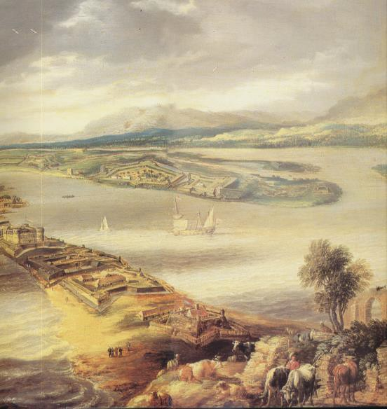
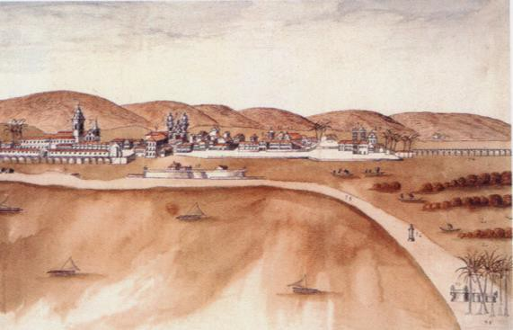
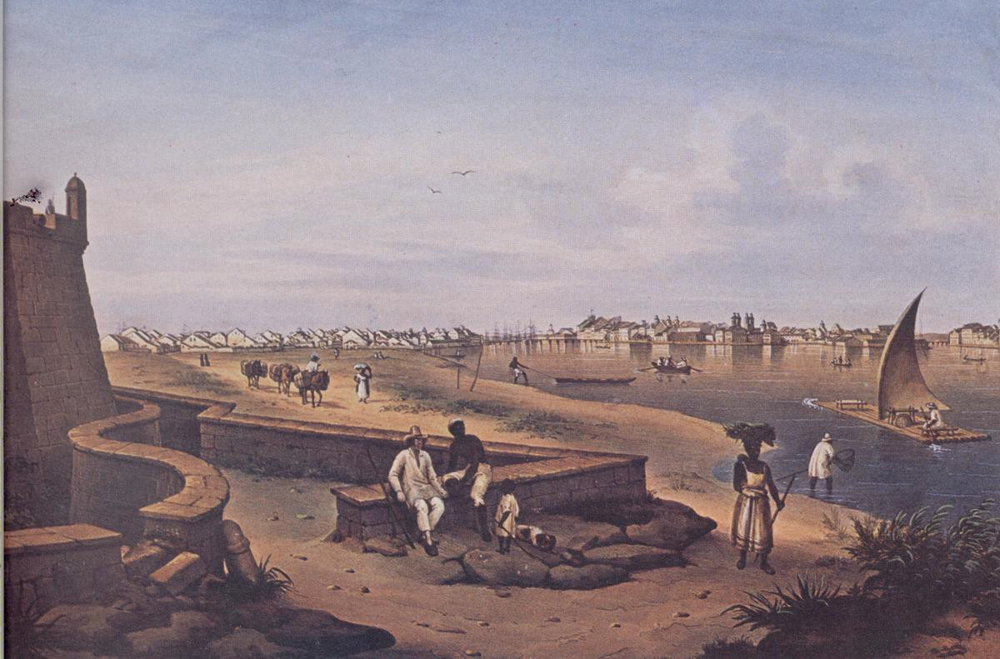
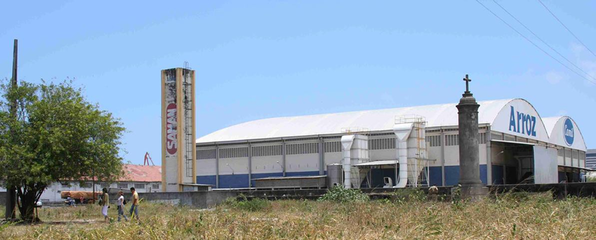
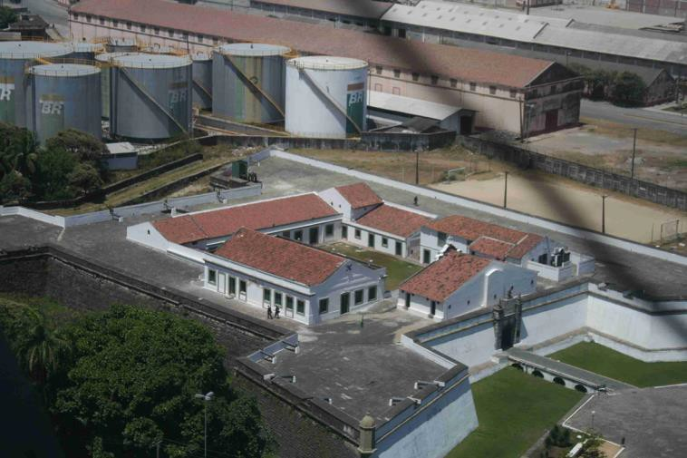

# Resumo

O Istmo de Recife e Olinda, estreito caminho de terra entre o Rio
Beberibe e o mar, que, até o começo do século XX, conectou por terra
essas duas cidades, foi ao longo do tempo lugar de memória. A partir do
século XX, tornou-se esquecimento. Este artigo busca, a partir da
leitura das narrativas de memorialistas, identificar diferentes sentidos
atribuídos ao Istmo ao longo do tempo, ou seja, diferentes formas de
representação do lugar. Com a interpretação dos textos dos
memorialistas, buscar-se-á entender os sentidos dados ao Istmo por cada
um deles, ou seja, como o Istmo é enunciado. É válido ressaltar que não
se pretende, com essa análise, proceder a uma narrativa histórica com
rigor cronológico, mas entender as impressões deixadas pelo lugar em
cada uma dessas pessoas, e por meio disso, compreender que significados
tinha para a sociedade o Istmo em diferentes contextos históricos.
Desvelar esses sentidos atribuídos não deixa de ser também uma forma de
abrir caminhos para a revisão do próprio processo de tombamento do Istmo
pelo IPHAN, que ao desconsiderar a sua história, contribui também para o
seu esquecimento pelas cidades que por séculos conectou.

Palavras-chave: Istmo de Recife e Olinda, memorialistas, representações,
enunciados, preservação

> **Abstract**

The Isthmus of Olinda and Recife, between the Beberibe River and the
sea, which until the early twentieth century connected these two cities,
was over time instead of memory. From the twentieth century became
forgetfulness. This article seeks from reading the narratives of
memorialists identify different meanings attributed to the Isthmus over
time, wich means different forms of representation of the place. With
the interpretation of the texts of the memorialists, this article seeks
to understand how the Isthmus was enunciated. It is important to say
that the aim is not undertake a chronological narrative with historical
accuracy, but understand the impressions left by the place in these
people. Revealing these assigned meanings it is also a way for review of
the process to preserve the Isthmus conducted by IPHAN.

Keywords: Isthmus of Olinda and Recife, memorialists, representations,
statements, preservation

> **Introdução**

O Istmo de Recife e Olinda, estreito caminho de terra entre o Rio
Beberibe e o mar, que, até o começo do século XX, conectou por terra
essas duas cidades, foi ao longo do tempo lugar de memória. A partir do
século XX, tornou-se esquecimento.

Hoje, o que antes era *istmo* (faixa de terra que liga uma península ao
continente) está divido por um canal, estando em parte no bairro do
Recife e, em parte, na faixa litorânea olindense conhecida como "Praia
del chifre". É ladeado ao leste pelo Oceano Atlântico, ao oeste pelo Rio
Beberibe e pelo Canal da Malária, ao sul pela ilha do

Bairro do Recife e ao norte pela Rua Santos Dumont, próximo à Igreja dos
Milagres em Olinda.

Contar a história do istmo é uma forma de auxiliar na reconstrução de
sua memória e identidade perdidas, mostrando como este lugar foi visto e
valorado em diferentes momentos.

São extensas as fontes escritas e iconográficas relacionadas à história
das cidades de Recife e Olinda em que o istmo é representado, todavia, a
despeito desse fato, essa lingueta de terra foi incorporada ao polígono
de tombamento federal de Olinda1 não por suas características históricas
e culturais, mas em razão de sua paisagem natural e da garantia da
visibilidade da colina histórica antes tombada2. Nas normas federal e
municipal3, a proteção das ruínas do Forte do Buraco localizado no istmo
também aparece, mas como edificação isolada, descolado do seu contexto
de construção que o vincula ao sítio do istmo e a um esquema mais
complexo de fortificações.

Assim, o Istmo de Olinda e Recife é um caso emblemático da necessidade
de métodos cuidadosos de identificação patrimonial, posto que a falta
(deliberada ou não) de pesquisa histórica sobre o lugar, limitou a
identificação dos valores nele presentes o que, em alguma medida,
contribuiu também para o seu esquecimento.

Frente a esse panorama, que diz respeito tanto à preservação do
patrimônio, quanto à capacidade da história de aponta caminhos possíveis
para se interpretar o passado e dele extrais os significados atribuídos
aos lugares no tempo, este artigo se propõe a lançar sobre o Istmo um
olhar. Um olhar que não se voltará para as fontes portadoras de sua
história oficial, mas para o discurso de quem por ele passou e contou o
que viu e sentiu, em seus diários e relatos, brasileiros e estrangeiros,
os chamados memorialistas.

A leitura das narrativas dos memorialistas permitiu identificar
diferentes sentidos atribuídos ao Istmo ao longo do tempo; isto é,
diferentes formas de representação do lugar. Logo, é a partir dos
enunciados extraídos dessas representações que se propõe construir uma
narrativa histórica sobre o Istmo.

Segundo Chartier (2002, p.21), representação "(\...) é o relacionamento
de uma imagem presente e de um objeto ausente, valendo aquele por este
(\...)", que surge a partir das "relações intelectuais" entre a
sociedade e o mundo. E, embora aspirem à universalidade no momento em
que são criadas, as representações "(\...) são sempre determinadas pelos
interesses de grupo (\...)". Assim, ao se proceder a interpretação dos
discursos, o que se faz é uma representação da representação, posto
serem as práticas de apropriação dos textos "(\...) histórica e
socialmente variáveis (..)" (2002, p. 25).

> 1 O Istmo foi incorporado ao polígono de tombamento federal do Sítio
> Histórico de Olinda por meio da Notificação Federal n° 1.155 de
> 04/06/1979.
>
> 2 O tombamento federal do Sítio Histórico de Olinda foi efetivado por
> meio da Notificação nº. 1004/68 de 21/03/1968
>
> 3 O Sítio Histórico de Olinda é tombado no nível municipal pela Lei
> Municipal n° 4849/82. O istmo é
>
> incluído na poligonal como ZEPC 3, zona abarca ruínas de edificações
> que tenham grande importância histórico-cultural e seu entorno. A ZECP
> 3 se subdivide em dois setores, Setor de Preservação Rigorosa que
> abrange as ruínas do Forte do Buraco e o Setor de Preservação
> Ambiental que corresponde ao restante do istmo.

Os enunciados se originam do discurso. Segundo Foucault (1972), "o
discurso é constituído por um conjunto de sequências de signos, enquanto
elas são enunciados, isto é, enquanto podemos lhes atribuir modalidades
particulares de existência. (\...) O termo discurso poderá ser fixado:
conjunto dos enunciados que provém de um mesmo sistema de formação"
(1972, p. 135). O enunciado, deste modo, é entendido por Foucault (1972)
como pertencente "a uma formação discursiva, como uma frase pertence a
um texto, e uma proposição a um conjunto dedutivo. Mas enquanto a
regularidade de uma frase é definida pelas leis de uma língua, e a de
uma proposição pelas leis de uma lógica, a regularidade dos enunciados é
definida pela formação própria discursiva" (1972, p. 146).

Foucault (1972) segue a explicitação de seu conceito afirmando que a:

> (\...) análise enunciativa só pode se referir a coisas ditas, a frases
> que foram realmente pronunciadas ou escritas, a elementos
> significantes que foram traçados ou articulados -- e, mais
> precisamente, a essa singularidade que as faz existir, oferece-as à
> observação, à leitura, a uma reativação eventual, a mil usos ou
> transformações possíveis, entre outras coisas, mas não como as outras
> coisas. Só pode se referir a performances verbais realizadas, já que
> as analisa ao nível de sua existência: descrição das coisas ditas,
> precisamente porque foram ditas (\...) (1972, p.137).

Assim, uma possível forma de operacionalização desse conceito no campo
da história, adotada neste artigo, pode ser dada quando de uma
formulação (oral ou escrita) são extraídas palavras ou sentenças-chave
determinantes de um sentido possível ao que está sendo tratado, e tais
sentenças-chave, uma vez inseridas em uma nova narrativa histórica, se
transformam em enunciados.

Com a interpretação dos textos dos memorialistas, buscar-se-á entender
os sentidos dados ao Istmo por cada um deles, ou seja, como o Istmo é
enunciado. É válido ressaltar que não se pretende, com essa análise,
proceder a uma narrativa histórica com rigor cronológico, mas entender
as impressões deixadas pelo lugar em cada uma dessas pessoas, e por meio
disso, compreender que significados tinha para a sociedade o Istmo em
diferentes contextos históricos.

Desvelar esses sentidos atribuídos, não deixa de ser também uma forma de
abrir caminhos para a revisão do próprio processo de tombamento pelo
IPHAN do Istmo, que ao desconsiderar a sua história, contribui também
para o seu esquecimento pelas cidades que por séculos conectou.

# Istmo no século XVII: como elemento de ligação (nesga de terra, costela ou linguazinha) e como reduto de fortificações (fortim, castelo e torre)

O Istmo em suas primeiras descrições, na primeira metade do século XVII,
é enunciado como "banco de areia", "estreita península", "nesga de
terra", "costela ou linguazinha". As narrativas se pautavam
primordialmente em enunciá-lo como elemento natural de conexão entre as
cidades de Recife e Olinda.

O conquistador holandês João Baers (1630) ao descrever a dependência
geográfica e urbanística entre Recife e Olinda a essa época, toma o
Istmo como elemento de união das duas cidades:

> (\...) ao sul de Olinda estende-se um banco de areia, geralmente largo
> de trinta e seis a quarenta passos, e assaz alto, contra o qual bate o
> mar; seguindo-se uma hora grande ou mais de caminho pelo banco de
> areia acha-se uma aldeia (\...). Por trás do banco já mencionado que
> estende-se de Olinda, e da aldeia, pelo lado ocidental, corre, vindo
> de Olinda um rio que nasce nos montes(\...) (Baers, 1630).
>
> As descrições de Joannes de Laet (1636), diretor da Companhia das
> Índias Ocidentais e redator das memórias da invasão batava à capitania
> de Pernambuco, e do também holandês, Gaspar Barleus (1647),
> assemelham-se bastante àquela de Baers (1630):
>
> Ao sul da cidade, entre o rio Beberibe e o mar, estende-se uma
> estreita península, em cuja ponta está uma povoação chamada Recife,
> onde fazem o embarque e o desembarque de todas as mercadorias e onde
> habitava muita gente. Perto do meio dessa nesga de terra, que tem uma
> légua de extensão, do lado do mar, está o Poço, no qual grandes navios
> podem ancorar, pois tem ordinariamente 18 a 19 pés d\'água (Laet,
> 1636, p.238).
>
> (\...) De Olinda estende-se para o sul, entre o rio Beberibe e o
> Oceano, um istmo, de cêrca \[sic\] de uma légua, assaz estreito e
> arenoso, semelhante a uma costela ou lìnguazinha \[sic\]. (\...) Na
> sua extremidade existiu uma povoação chamada 'Recife' ou 'Abrigo'
> (\...) (Barleus, 1647, p.41 ).
>
> 
>
> **Figura 1 *--* O Istmo fortificado visto de Olinda, 1637 Fonte:
> Nestor Goulart, 2000**
>
> 
>
> **Figura 2 *--* O Istmo fortificado , 1759 Fonte: Nestor Goulart,
> 2000**
>
> O Rio Beberibe e o mar também são elementos recorrentes nessas
> narrativas e este fato demonstra a profunda ligação das cidades com as
> águas nos primeiros séculos de suas fundações. A formação de Olinda e
> o seu crescimento guardaram estreita dependência com a existência do
> porto do Recife.

É válido ainda ressaltar que em seus registros, os memorialistas
descreveram o istmo como elemento que parte de Olinda para o Recife, e
não o contrário. Essa ordenação do discurso certamente tem a ver com a
importância de cada uma dessas cidades ao longo do tempo. Apesar da
interpretação dos discursos permitir a identificação de certa hierarquia
entre as cidades, os olhares de Baers (1630), Laet (1636) e Barleus
(1647), demonstram também um nascimento conjunto ou uma interdependência
entre elas. Uma desempenhando o papel administrativo, e a outra como
porto natural para embarque/ desembarque de mercadorias. Desta forma,
sendo Olinda a sede da capitania, o Recife (povoado) nasceu como seu
porto natural, ao qual se tinha acesso por uma falha nos arrecife, a
pedra furada.

O sistema de fortificação da sede da capitania e seu povoado também é
outro aspecto enunciado pelos memorialistas no século XVII. As palavras
"fortim", "castelo" e "torre" são recorrentes em seus discursos.

O holandês Adriaen van der Dussen (1639) ao descrever as peculiaridades
e riquezas da terra conquistada, refere-se ao Istmo ao tratar das
fortificações:

> (\...) À distância de 2 tiros de mosquete do Recife, em direção à
> cidade de Olinda, pelo istmo, está o Castelo de São Jorge, feito de
> pedra, tendo do lado da cidade de Olinda um bastião e meio, de pedra
> dura, de construção elevada e no qual estão 13 peças de ferro (\...);
> domina o istmo e a barra" (1639, p. 111).

Baers (1630), Laet (1636) e Barleus (1647) descrevem também o sistema de
fortificações:

> (\...) a um tiro de canhão desta aldeia para o lado de Olinda está
> sobre o mesmo banco de areia um castelo ou forte (\...). Em frente
> deste castelo, para o lado sul que é o lado do mar, está também um
> banco igual, estendendo-se de Olinda para o sul também uma hora de
> caminho ou mais, porém nem tão alto nem tão largo quanto o outro; no
> dorso desta banco, bem defronte do castelo ou forte atrás mencionado,
> acha-se um outro castelo, que é uma torre octogonal; entre dois
> castelos, onde a água tem a largura de um tiro de canhão, entram os
> navios e fundeiam em um bom cais com pouco fundo entre os dois bancos,
> e carregam e descarregam na aldeia situado no extremo de um dos
> bancos, onde achavam-se muitos armazéns(\...) (Baers, 1630).
>
> (\...) Do outro lado do Poço, na ponta do recife de pedra, (que se
> estande ao longo da costa do Brasil, com varias interrupções) estava
> um fortim ou torre redonda, construido, havia muitos annos, de pedra
> durissima, dentro do mar, e, fazendo face a esse, na já citada nesga
> de terra ou peninsula do Recife, havia outro a que os portugueses
> chamavam S. Jorge (\...) (Laet, 1636, p.238).
>
> (\...) Defronte deste \[refere-se ao Istmo\], onde o morre o Recife de
> Pedra, que deixa passar as ondas aquí \[sic\] e acolá, existiu uma
> tôrre \[sic\] surgindo das vagas com o nome de Castelo do
>
> Mar, para diferenciar-se \[sic\] do que se via no recife de terra ou
> areia, denominado Castelo de Terra e pelos portugueses Castelo de S.
> Jorge (\...) (Barleus, 1647, p.41 ).

A essa época, o sistema de defesa da entrada da barra do porto era
basicamente constituído pelo Forte de São Jorge Novo ou Castelo de
Terra, construído sobre o Istmo ao norte do Recife, e em frente dele,
sobre os arrecifes, estava o Forte do Picão ou Castelo do Mar. Com a
invasão batava, esse sistema de fortificações de origem luso-brasileira
demonstrou-se frágil. Os holandeses não tardaram em aprimorá-lo com a
construção de um sistema de redutos e fortificações, montando um
verdadeiro cinto de proteção no Recife.

As primeiras narrativas analisadas foram produtos do olhar holandês
sobre as duas cidades, portanto, o olhar de estrangeiros tentando
desvendar uma nova terra. A presença do Istmo nesses discursos permite
constatar sua importância tanto do ponto de vista estratégico, como
geográfico para Olinda e Recife nos primeiros momentos de suas
fundações.

# O Istmo no século XIX: como elemento natural destacado na paisagem (a extensa fita branca) e como caminho

A representação do Istmo pelos memorialistas em finais do século XVIII e
nas primeiras décadas do século XIX aproxima-se, em alguns aspectos,
daquelas elaboradas no século XVII. O Istmo continua sendo representado
como elemento de conexão entre as duas cidades, sendo enunciado como
"areal", "faixa de areia", "banco" ou "fita branca". Todavia, além
disso, ele passa a ser descrito como caminho, caracterizado por uma
natureza peculiar e práticas sociais específicas. Os relatos e
descrições trazem também um porto e a entrada da barra do Recife mais
protegidos por um sistema de fortificações aprimorado.

O relato de Henry Koster, viajante inglês que chegou ao Recife na
primeira década do século XIX, enuncia o Istmo como banco de areia:

> (\...) uma longa faixa de areia se estira, desde o pé da colina, onde,
> para o sul, está situada Olinda. A extremidade meridional desse banco
> se alarga e forma o local desta parte da cidade, particularmente
> chamada Recife, colocada precisamente sobre o arrecife. O Recife de
> rochas, de que já falei, estende-se diante desses bancos de areia e
> recebe o principal choque do mar que no afluxo, rola por cima
> atingindo o cais e os armazéns da villa com ímpeto enfraquecido. A
> maior parte do banco de areia, entre Olinda e a vila, está descoberto
> e sobre ele o mar rebenta com fúria (Koster, 1816).

Nas notas deixadas pelo comerciante francês Louis F.Tollenare, acerca de
sua residência no Recife entre os anos de 1816 e 1818, e pela inglesa
Maria Graham, em seu diário de viagem ao Brasil, iniciado em 1821 quando
de sua partida para a América do Sul, o Istmo aparece como a "extensa
fita branca", a "praia", elemento natural que se destaca na paisagem,
mas também lugar de fortificações para defesa do porto:

> (\...) O olhar seguia à distância a longa e estreita península de
> areia que liga Olinda a Recife; ela se destaca sobre a costa como uma
> extensa fita branca, atrás da qual se erguem os cabeços das montanhas
> do país; (\...) Distinguia-se os dois fortes do Buraco e do Brum sobre
> a península, e após o do Picão, construído na extremidade não submersa
> do célebre recife de pedras ou molhe natural, que cobre a costa da
> capitania de Pernambuco, e a do norte até o Rio Grande; o mar se
> quebra ali com violência, e dentro do molhe, que aparece como uma
> linha negra, os navios se acham em sossego junto à cidade (\...)
> (Tollenare, 1816, p. 18 e 19).
>
> (\...) Este é o istmo em que Sir John Lancaster se fortificou com uma
> paliçada durante sua permanência no Recife, que ele saqueou. A praia é
> defendida por duas fortalezas, bastante fortes quando se considera a
> posição: de um lado uma ressaca furiosa quebrando em suas bases, de
> outro um profundo estuário e um terreno plano, de modo que não podem
> ser dominados (Tollenare, 1816).
>
> 
>
> **Figura 3 *--* O Istmo como caminho, entre 1755 e 1855. Fonte:
> Leonardo Dantas, 1998**

Aos relatos anteriores, em que o sistema de defesa do porto era descrito
como sendo constituído pelo Forte do Picão, erguido em 1612 pelos
portugueses, e pelo Forte de São Jorge, a essa altura já destruído,
somam-se o Forte Brum, iniciado pelos portugueses em 1629 e finalizado
pelos holandeses, e o Forte do Buraco, construído também pelos batavos
em 1630.

A força do mar também aparece descrita nos relatos de Koster (1816),
Tollenare (1816) e Graham (1821). O mar que rebenta no Istmo é enunciado
com palavras

como "fúria", "violência" e "furor". A sólida construção do Forte do
Buraco foi aos poucos sendo destruída pela erosão provocada por essa
força. É apenas com as obras do Porto do Recife, no começo do século XX,
que o mar do Istmo vai tendo sua força reduzida em virtude da construção
do molhe de Olinda, implicando mudanças nas correntes marítimas, que
mais tarde contribuíram também a ruptura do Istmo.

Nas narrativas desse momento, o Istmo é apresentado também como
"caminho". Maria Graham (1821) e Tollenare (1816) descrevem o percurso
de Olinda a Recife pelo Istmo e o que lá encontraram:

> (\...) Esta tarde, (\...) cavalgamos para Olinda através do istmo
> arenoso que a liga ao Recife (\...) O areal é em parte coberto por
> arbustos; há um que é lindo, com folhas grossas e flores vermelhas em
> forma de campainha; muitos são como os do mundo oriental; muitos são
> todos novos para mim (\...) (Graham, 1821, p. 139 e 140).
>
> (\...) Tentei sair pela península que conduz do Recife a Olinda; é
> porém de uma areia árida e movediça que a torna pouco praticável; mas
> a gente do país que anda descalça encontra terreno mais sólido,
> seguindo por dentro d\' água ou próximo a ela; preferem o lado
> ocidental que não é batido pelas vagas; de outro lado goza-se da vista
> do imenso Oceano e da navegação das jangadas. Todos os pescadores
> habitam esta parte setentrional do Recife. Na praia não se encontram
> conchas de espécie alguma (\...) (Tollenare, 1816, p. 33).

Essas representações do Istmo possibilitam a descoberta de suas
características naturais. Maria Graham (1821) o descreve como
parcialmente coberto por "arbustos", existindo um tipo que ela descreve
como "lindo", "com folhas grossas e flores vermelhas". Tollenare (1816)
afirma ser a areia do Istmo "árida e movediça", praticável apenas para a
"gente do país". E ressalta ainda a inexistência de "conchas" na praia.
Esse olhar que se volta para as minúcias, olhar dificilmente encontrado
nos documentos oficiais ou na cartografia histórica, é que permite a
construção de uma imagem mais clara e real sobre o lugar.

O relato de Graham (1821) revela ainda importantes informações sobre a
prática de enterramento de escravos negros no Istmo nesse momento:

> (\...) O sol já ia baixo muito antes de termos alcançado sequer o
> primeiro dos dois fortes em nosso caminho de volta para a cidade. Os
> cães já haviam começado uma tarefa abominável. Eu vi que arrastava o
> braço de um negro de sob algumas polegadas de areia, que o senhor
> havia feito atirar sobre os seus restos. É nesta praia que a medida
> dos insultos dispensados aos pobres negros atinge o máximo. Quando um
> negro morre, seus companheiros colocam-no numa tábua, carregam-no para
> a praia onde abaixo do nível da preamar eles espalham um pouco de
> areia sobre ele. Mas a um negro novo até este sinal de humanidade se
> nega (\...) (Graham, 1821, p. 139 e 140).

A representação do Istmo como praia em que "os insultos dispensados aos
pobres negros atinge o máximo" revela uma prática cruel ocorrido no
lugar, e o relato de Graham (1821) é o único entre os estudados a
denunciá-la. É possível que esta prática tenha sido responsável pelo
surgimento de lendas e assombrações que envolvem o Istmo, e mais
especificamente a Cruz do Patrão4, presentes nos relatos de

memorialistas no século XX.

**O Istmo no século XX: a transformação da paisagem e o lugar mal
assombrado** As representações do Istmo no século XX são variadas. No
entanto, encontram-se enunciados dois grandes aspectos: as
transformações na paisagem cultural**5**, provocadas pelas obras do
Porto do Recife no começo do século XX e pelas obras da Base Naval em
meados do século XX, e a lendas e assombrações que envolvem o

lugar.

O Istmo é enunciado como "mascarado" ou como algo que não mais existe
por Raquel Caldas Lins (1978), em texto no qual estão descritas algumas
memórias de sua juventude, e por Evandro Rabello (1978), em série sobre
o folclore e a Cruz do Patrão:

> (\...) Tendo acabado por vedar a antiga foz do Beberibe, que dantes se
> lançava diretamente no mar, torcendo-lhe o curso terminal para o sul
> ao encontro do Capibaribe, o \"istmo de Olinda\", tal como ainda o
> víamos em nossa adolescência das janelas do Colégio de Santa
> Gertrudes, vizinho à Igreja da Misericórdia, destacava-se
> perfeitamente na paisagem, separando os vastos manguezais escuros do
> luminoso mar aberto e prolongando-se da praia dos Milagres ao Forte do
> Buraco e à Cruz do Patrão, na porta setentrional do bairro do Recife.
> Esse \"istmo\", pelo qual cavalgou Mrs. Graham a fim de visitar
> Olinda, está hoje quase todo mascarado pelas obras de construção da
> Base Naval, que aterraram os largos manguezais deixando ao Beberibe
> somente uma calha estreita (\...) (Lins, 1978, p. 105).
>
> (\...) Seu nome: Cruz do Patrão, chamada assim por ter sido levantada
> pelo patrão-mór do porto do Recife (\...) Ficava sobre o istmo de
> Olinda, à margem esquerda do rio Beberibe. Não mais existindo o istmo,
> o endereço agora é outro. Fica por trás dos depósitos pertencentes às
> companhias de petróleo, nas imediações do Terminal Açucareiro do IAA,
> no bairro do Recife (\...) (Rabello, 1978).
>
> 4 A "Cruz do Patrão" ou "Cruz do Patrão-mor" segundo Rabello (1978)
> "(\...) ficava sobre o istmo de Olinda, à margem esquerda do rio
> Beberibe.Para guiar pilotos é que ela foi levantada. Nada indica o ano
> de sua construção. Parece ser dos fins do século XVI ou começos do
> seguinte (\...)".
>
> 5 A paisagem cultural, para a Geografia, é entendida como resultante
> das formas geradas na construção do habitat, sendo confeccionadas pela
> ação da cultura de cada sociedade sobre a paisagem natural. A paisagem
> cultural é, nas palavras de Sauer (Corrêa e Rosendahl, 1998, p. 9),
> "modelada a partir de uma paisagem natural por um grupo cultural. A
> cultura é o agente, á área natural é o meio, a paisagem cultural o
> resultado".

Como está demonstrado nesses dois relatos, a ampliação do Porto do
Recife no começo do século XX acarretou uma profunda transformação na
paisagem do Istmo, principalmente na sua porção sul, a partir do Recife.
Com a ruptura do Istmo, em decorrência da construção do molhe de Olinda,
e com implantação dos equipamentos portuários e de estocagem, o Recife
pareceu *virar as costas* para Olinda e para o caminho que por séculos
as conectou.

Localizada entre a área portuária e os equipamentos fabris, a Cruz do
Patrão, apesar de ser um importante bem cultural, envolto por lendas e
mistérios, parece esquecida e deslocada entre esses equipamentos de
grande porte. O mesmo acontece com as ruínas do Forte do Buraco,
praticamente encobertas pela vegetação, e com o Forte do Brum, cuja
descaracterização e adensamento do entorno, provocaram a perde de sua
implantação original na praia, entre o mar e o Rio Beberibe. A
localização e o entorno da Cruz do Patrão, do Forte do Brum e das ruínas
do Forte do Buraco refletem com clareza como se deu a ocupação do Istmo
no lado do Recife, e como a paisagem cultural foi drasticamente
transformada com os sucessivos aterros, com a ampliação do Porto do
Recife e com os posteriores avanços no processo de urbanização.

> 
>
> **Figura 4 - Cruz do Patrão e os armazéns. Autora: Virgínia Pontual,
> 2005**

A 

> **Figura 5 - O Forte do Brum e os silos. Autora: Virgínia Pontual,
> 2005**

narrativa de Hermilo Borba Filho (1949) demonstra esse esquecimento do
Istmo já na primeira metade do século XX quando o autor se refere ao
local como recentemente descoberto:

> Se você, meu caro turista, chegar ao Recife durante o verão, vá
> conhecer o Istmo de Olinda, descoberto pelo caricaturista
>
> Augusto Rodrigues, aos tantos de janeiro do ano de mil novecentos e
> quarenta e oito. Você poderá alugar um auto de praça, por quinze
> cruzeiros e fazer uma viagem de quinze minutos para ver de perto uma
> das mais bonitas praias do Recife (\...) (Borba Filho, 1949).

As representações do século XX permitem levantar a hipótese de que as
obras do Porto e da Base Naval, realizadas no Istmo, foram em grande
parte responsáveis pela perda da memória e identidade do lugar,
construída durante os quatro séculos anteriores de sua ocupação. O Istmo
hoje é esquecido, não sendo parte da vida ou do imaginário coletivo dos
cidadãos recifenses e olindenses.

Hermilo Borba Filho (1946) e Evandro Rabello (1978) narram lendas e
assombrações, coletadas da tradição oral, que envolvem o areal do Istmo,
a Cruz do Patrão e o Forte do Buraco. O Istmo e seus elementos
construídos são, então, enunciados como "coisa mal-assombrada", "morada
do tinhoso", lugar de "almas penadas", entre outros:

> (\...) E na maré estão os botes mais lindos do mundo, com um preto
> musculoso como remador. Se você gosta de falar e insiste na conversa,
> ficará sabendo que em tal época um navio naufragou ali bem à vista e
> está no fundo do mar com uma porção de riquezas. E saberá ainda dos
> afogados e das almas penadas da Fortaleza do Buraco, almas que se
> vestem de vermelho e verde, com armaduras pesadas e espadas brilhantes
> e que são os holandeses que invadiram Pernambuco. (\...) E o bote
> encosta na escadinha de desembarque (\...). Marche em frente, então.
> Antes de atingir a praia que fica logo abaixo da elevação de areia,
> você encontrará a casa de Caramuru, o pescador. (\...) Caramuru falará
> da cobra grande que aparece para fisgar os banhistas e da profundidade
> e dos redemoinhos e de peixes que ninguém nunca ouviu falar (\...)
> (Borba Filho, 1949).
>
> (\...) Nas imediações da Cruz, ficava um imenso areal, onde os negros
> que morriam pagões tinham sepultura. Os ingleses, que chegavam ao
> Recife e aqui morriam, eram sepultados nas imediações da Cruz do
> Patrão (\...) A Cruz ficou na alma do povo como sinônimo de coisa
> malassombrada, lugar para quem tem juízo não passar altas horas da
> noite, pois corre o risco de encontrar gente de outro mundo no caminho
> (\...) Altas horas da noite apareciam coisas infernais. Almas penadas
> gemem e choram e uma misteriosa luz se apaga e se acende a noite
> inteira. Barulhos de pesada corrente denunciam visagem. Alma de negro
> cativo. O cabelo, de quem assiste a esse espetáculo se levanta,
> procura as pernas e não acha, quer gritar e a língua engrossa (\...) O
> diabo freqüenta assiduamente a Cruz do Patrão. Antigamente os
> feiticeiros faziam, no dia de São João, uma cerimônia para os
> iniciados na bruxaria (\...) Na Cruz do Patrão é diferente. Ali o
> tinhoso fez morada. Chegou com armas e bagagens. Aparece e desaparece
> quando bem quer e entende. Os longos anos de morada, deram ao fute
>
> tantos direitos que nenhuma lei do Inquilinato pode tirar (\...)
> (Rabello, 1978).

Essas lendas constituem uma forma de representação, oriunda do
imaginário coletivo, a partir dos feitos e práticas ocorridos no Istmo.
A narrativa de Hermilo Borba Filho (1949), que envolve "almas que se
vestem de vermelho e verde, com armaduras pesadas e espadas brilhantes",
remete às batalhas ocorridas no Istmo quando da invasão holandês e
reconquista da Capitania de Pernambuco pelos luso-brasileiros. A lenda
narrada por Rabello (1978), que descreve a Cruz do Patrão como local
onde vive "alma de negro cativo", relaciona-se a atividades
desenvolvidas na Cruz, como enterramentos, comércio, martirização e
execução de escravos e rituais da cultura negra.

# Considerações finais

Construir uma narrativa sobre o Istmo é contar uma parte da história das
cidades de Recife e Olinda, nascidas juntas, mas que a partir de um dado
momento começam a se separar. O Istmo, nessa construção, aparece como
elo conector da sede administrativa, Olinda, e do seu porto, Recife.

Todavia, mais que servir de instrumento para narrar o nascimento dessas
duas cidades, no universo das fontes consultadas, o Istmo demonstrou
possuir uma história própria, ricamente narrada pelos memorialistas.
História esta que vem desaparecendo da memória das pessoas e tornando
cada vez mais frágil a identidade do Istmo.

A norma de proteção federal, ao justificar a inclusão do Istmo na
poligonal de tombamento do Sítio Histórico de Olinda unicamente em razão
da garantia de preservação de seus atributos paisagísticos e da
visibilidade da colina histórica de Olinda, não considerou a papel
desempenhado por séculos por este lugar na história das duas cidades.
Além disso, a fortificação do Buraco não pode ser vista isoladamente
como edifício de valor arquitetônico, apontando as singularidades de sua
construção. O sentido de sua construção e localização só pode ser
compreendido em conjunto com as edificações do Brum e Picão, além das
pequenas baterias que foram assentadas no Istmo. Esta lógica
construtiva, que qualificava o Istmo como valor de defesa desde o início
da colonização, demonstra que não se pode entendê-lo por partes,
isolando fortes do Brum ou do Buraco e muito menos fragmentando seu
sentido geográfico (PONTUAL et al, 2006).

O Istmo hoje permanece uma área esquecida na memória da população de
Olinda e Recife, mutilado pelos projetos do porto do início do século XX
e pelos posteriores avanços do processo de crescimentos das duas
cidades. Todavia, se não foi bem sucedido enquanto instrumento de
resgate da memória, o tombamento garantiu a proteção do Istmo da
especulação imobiliária e da ocupação acelerada assistidas nas orlas
marítimas do Recife e Olinda nas décadas de 1970 e 1980.

Os olhares dos que lá passaram e narraram sua experiência sobre o Istmo
oferece a dimensão desse lugar que sempre esteve presente na memória,
sendo caminho sem fronteiras entre as duas cidades (PONTUAL et al,
2005). O método adotado pelo presente estudo, baseado na construção de
enunciados a partir das narrativas dos memorialistas, permitiu a
identificação desses diversos sentidos ou significados atribuídos ao
Istmo ao longo dos séculos, elementos estes indispensáveis para a
reconstrução da identidade perdida. Não resta dúvida que outros tantos
podem ainda ser identificados; muito são os olhares possíveis.

Os relatos dos memorialistas falaram por si só, sem que se fizesse
necessária a consulta a outras fontes documentais. Por esta razão, o
presente estudo é concluído com a fala de um memorialista, Hermilo Borba
Filho (1949), na qual é realizada uma verdadeira evocação à paisagem do
Istmo:

> (\...) De repente você começará a sentir que existe qualquer coisa
> estranha no ar.(\...) De repente você sabe. É a praia selvagem ainda,
> sem bagalôs, sem casas metidas a sebo, sem maiôs de frente única, sem
> louras nem morenas, sem atletas, sem nada. É a praia mesmo. É mar. É
> céu. É a Fortaleza do Buraco à sua direita, com as paredes de três
> séculos resistindo aos moleques e aos institutos históricos. É, lá
> longe, a Sé de Olinda e casas quase apagadas pela distância. Atraz
> \[sic\], casas de pescadores, vasias \[sic\], os homens lutando contra
> os peixes e as mulheres lutando contra as roupas sujas. E na frente o
> mar. Forte. Escuro. Perdendo-se de vista. Então você, meu caro
> turista, pode tirar a roupa e ficar sozinho, sujar-se de areia, fazer
> castelos como menino, dar cambalhotas (\...) (Borba Filho, 1949).

# Referências

> BAERS, João. *Olinda conquistada*. Recife: Typographia de Laemmut & C.
> -- Editores, 1898.
>
> BARLAEUS, Gaspar. *História dos feitos recentemente praticados durante
> oito anos no Brasil*. Recife: Prefeitura da Cidade do
> Recife/Secretaria de Educação e Cultura/Fundação de Cultura Cidade do
> Recife, 1980.

CAVALCANTI, Carlos Bezerra. Recife um \"Presente\" do \"Passado\".
Recife: VBF Gráfica e Editora, 1995.

> CHARTIER, Roger. *A História Cultural: entre práticas e
> representações*. Rio de Janeiro: Editora Bertrand Brasil S.A/Difel,
> 1990.
>
> DANTAS, Leonardo. *O Recife - imagens de uma cidade sereia*.
> Prefeitura da Cidade do Recife: Comunigraf Editora; Recife, 1998;
>
> DUSSEN, Adriaen Van Der. *Relatório sobre as Capitanias Conquistadas
> no Brasil*. Rio de Janeiro, Volume III, 1947.
>
> FOUCAULT, M. A. *Arqueologia do saber*. Rio de Janeiro:
> Forense-Universitária, 1987.
>
> GRAHAM, Maria. *Diário de uma viagem ao Brasil*. Belo Horizonte:
> Itatiaia; São Paulo: Editora da Universidade de São Paulo, 1990.
>
> BORBA FILHO, Hermilo. O Istmo de Olinda. In, *Boletim da Cidade e do
> Porto do Recife.* Recife: Diretoria de Documentação e Cultura da
> Prefeitura Municipal do Recife, n.15-18, jan-dez 1945.
>
> KOSTER, Henry. *Viagens ao Nordeste do Brasil*. Recife: Prefeitura
> Municipal do Recife/Secretaria de Educação e Cultura, 1978.
>
> LAET, Joannes de. *Historia ou Annaes dos Feitos da Companhia
> Privilegiada das Indias Occidentaes*. Rio de Janeiro: Officinas
> Graphicas da Biblioteca Nacional, 1916.

LEPETIT, Bernard. Por uma nova história urbana. São Paulo: Editora da
Universidade de São Paulo, 2001.

> LINS, Rachel Caldas. *Um Tempo do Recife: Alguns Aspectos Originais do
> Sítio Urbano do Recife*. Recife, Editora Universitária, 1978.

MENEZES, José luiz mota. "Olinda e o Recife: 1537-1630". In *Revista
Oceanos*. Lisboa: Comissão Nacional para as Comemorações dos
Descobrimentos Portugueses, n. 41, jan-mar.2000.

PONTUAL, V. P., LIRA, Flaviana, CABRAL, R. C., LAGO, A. E., M., Magna.

Challenges at the interface of interpretation on the conservation of
cultural heritage: the case of the Isthmus of Olinda and Recife - Brasil
In: Interpreting World Heritage: connecting people to places throug
sustainable heritage tourism, 2006, San Juan.

PONTUAL, Virgínia. "O urbanismo no Recife: entre idéias e
representações". In

> *Revista Brasileira de Estudos Urbanos e Regionais*. Recife: Anpur, 1,
> n. 2, 1999.

. "Tempos do Recife: representações culturais e configurações urbanas".
In *Revista Brasileira de História*. São Paulo: Anpuh/Humanitas
Publicações, v. 21, n. 42, 2001.

> RABELLO, Evandro. *A Cruz do Patrão.* Recife: IJNPS, Centro de Estudos
> Folclóricos, 1978.
>
> REIS, Nestor Goulart. *Imagens de vilas e cidades do Brasil colonial*.
> São Paulo: Editora da Universidade de São Paulo/ Imprensa Oficial do
> Estado/ Fapesp, 2000.
>
> ROSENDAHL, Zeny e CORRÊA, Roberto Lobato (Orgs). *Paisagem, Tempo e
> Cultura*. Rio de Janeiro: UERJ, 1998.
>
> SETTE, Mário. *Arruar: história pitoresca do Recife antigo*. Rio de
> Janeiro: ECB, 1988.
>
> TOLLENARE, L. F. de. *Notas Dominicais Tomadas Durante uma Viagem em
> Portugal e no Brasil*. Recife, Jornal do Recife, 1905.
