# Resumo

Considerando o espaço urbano como sendo composto por diferentes
elementos que permitem ser agrupados de acordo com suas similaridades
e/ou diferenças, ao transpor essa noção para o estudo das edificações e
de suas características físicas, tais agrupamentos podem ser
relacionados ao termo tipo. Gianfranco Caniggia (1979/1995) define o
tipo na arquitetura tanto como uma pré-projeção de um edifício ainda a
ser realizado, quanto como uma síntese das características físicas
comuns a objetos arquitetônicos já existentes. Este artigo foca-se na
dualidade presente no tipo, apresentando um método de classificação
tipológica para edificações que incorpora a análise da forma, imagem e
história destas arquiteturas, tendo como suporte os conceitos extraídos
de autores que trabalham com a decodificação do espaço urbano, tal como
Lamas (1993/2010), Lynch (1972), Cullen (1961/2008) e Kostof
(1991/1993). A metodologia propõe a criação de um inventário tipológico
que apresenta uma versão sintética das características dos edifícios
analisados, resultante do processo de decodificação da forma urbana, e
que pode vir a ser apropriado no estabelecimento de diretrizes para
inserções arquitetônicas contextuais ao seu entorno. A área do Castelo,
no Centro da Cidade do Rio de Janeiro, foi escolhida como estudo de caso
para a demonstração da metodologia proposta. Primitivo núcleo de
ocupação do centro histórico da cidade, o antigo Morro do Castelo foi
demolido na década de 1920 criando um amplo vazio urbano, logo
contemplado com as remodelações urbanas propostas pelo urbanista francês
Alfred Agache (1930). A ocupação do Castelo nas décadas subsequentes
resultou numa forma urbana de característica padronização tipológica em
suas composições arquitetônicas.

Palavras-chave: tipologia, método de classificação, morfologia urbana,
Rio de Janeiro

# Abstract

Considering urban space as a composition of different elements that can
be separated into groupings based on their similarities and/or
differences, when focusing this analysis on the study of architectural
buildings and their physical attributes, these groupings may be
associated with the term type. Gianfranco Caniggia (1979/1995)
establishes type in architecture as both a pre-projection of a building
yet to be designed, and as synthesis of the physical attributes common
to buildings already constructed. This paper focuses on this duality of
type, presenting a method for typological classification of
architectural buildings that incorporates the analysis of said objects
form, image and history, supported by concepts extracted from authors
whose works focus on urban decoding, such as Lamas (1993/2010), Lynch
(1972), Cullen (1961/2008) and Kostof (1991/1993). The attempt of this
method is to create a typological inventory that presents a summarized
version of the physical characteristics of the analyzed buildings, that
is not only the result of the understanding and decoding of urban form,
but could also be used to establish directives for architectural
insertions that are contextual to their surroundings. The paper presents
Castelo, an area in Downtown City of Rio de Janeiro, as case study for
this proposed method of typological analysis. Once the original core of
occupation of

the city's historic center, the Castelo Hill (Morro do Castelo) was
eagerly demolished in the 1920's, creating an ample urban void soon to
be target of the remodeling proposals of French urban designer Alfred
Agache (1930). The occupation of Castelo in the following decades
resulted in an urban form with a distinct typological pattern in its
architectural compositions.

Keywords: typology, classification methods, urban morphology, Rio de
Janeiro

# Introdução

Para Alan Colquhoun, um dos sentidos do termo espaço urbano é o do
"espaço construído propriamente dito". Característico dos arquitetos,
este sentido aborda a "sua morfologia, o modo como afeta nossas
percepções, a maneira como é utilizado e os significados que pode
evocar". (COLQUHOUN, 2004, p. 209). Ele é a conjugação de uma variada
gama de peças componentes, podendo ser relacionadas entre si através de
agrupamentos, definidos de acordo com aspectos de similaridade ou
disparidade em suas características físicas. Neste trabalho, tais
agrupamentos serão relacionados com o termo tipo.

O estudo do tipo no espaço urbano tem importância no debate do urbanismo
desde meados do século XX, com a reconstrução das cidades afetadas pela
Segunda Guerra Mundial. Arquitetos italianos deste período encontraram
nas formas urbanas históricas, um rico vocabulário para as criações
futuras, com inspirações para produção de uma arquitetura
contextualizada ao seu entorno. Autores como Aldo Rossi e Gianfranco
Caniggia, abordam estes ideais em suas obras, e os relacionam ao tipo.
Rossi (1966/2001) retoma esse termo desenvolvido por Quatremère de
Quincy em 1832, afirmando que "o tipo é a própria ideia da arquitetura",
e aquilo que mais se aproxima da sua essência. Ele é uma constante que
se apresenta com características de necessidade reagindo com "as
funções, com o estilo, com o caráter coletivo, e o momento individual do
fato arquitetônico." (ROSSI, 2001, p. 27) A esta constante transformação
do tipo, Caniggia (1979/1995) dá o nome de processo tipológico, e aponta
que o tipo é tanto uma projeção quanto um produto.

O estudo do tipo neste trabalho procura equilibrar esse seu duplo
caráter. Na perspectiva da análise da estrutura urbana já existente ele
é resultado do processo de identificação e classificação das formas
encontradas na cidade, portanto, de extrema relevância na decodificação
do espaço urbano. E as categorizações resultantes são, por outro lado,
um inventário de formas para produção arquitetônica e síntese do
conjunto de características que podem vir a ser inseridas
contextualmente à ambiência urbana do entorno.

Propõe-se a criação de um método de classificação tipológica das
edificações, com apoio de obras elaboradas por autores que trabalham com
a temática da análise urbana. O método idealizado incorpora três frentes
de análise do espaço urbano -- a forma, a imagem e a história - a fim de
resultar em diferentes classificações tipológicas.

Questões referentes à forma, vão se relacionar com os lotes urbanos das
edificações, e as volumetrias resultantes da ocupação destas. A obra de
Caniggia (1979/1995) se insere nesta perspectiva como base desse
critério de classificação, sendo o único autor que trabalha
explicitamente com tipologias, identificando as existentes na cidade
através da análise cartográfica. A obra de José Ressano Garcia Lamas
(1993/2010) enquadra-se neste estudo com uma abordagem focada na
produção de um inventário

dos elementos morfológicos que compõem a cidade. Sua proposta em
reconhecê-los através da análise em escalas diferenciadas foi adotada no
método idealizado.

A respeito da imagem serão abordados elementos referentes à estética da
edificação, como a linguagem arquitetônica e características
construtivas. Associando-se questões de percepção destas em meio à
paisagem urbana, adotam-se conceitos de Kevin Lynch (1972), e Gordon
Cullen (1961/2008).

O elemento da história demonstra-se essencial para a produção do método
que busca a compreensão da morfologia urbana. Assumindo que o espaço
construído é resultado das ações do homem no suporte físico, cada
edificação produzida é reflexo de determinados períodos históricos. As
classificações tipológicas desenvolvidas, portanto, precisam ser
contextualizadas com seu momento de produção. Para este critério de
análise, adotou-se a obra de Spiro Kostof (1991/1993).

Este trabalho não se limita a produzir esta metodologia. Um dos
objetivos nesta investigação é demonstrar sua aplicação em um objeto
concreto. Para tal, o Centro da Cidade do Rio de Janeiro foi escolhido
como estudo de caso, focando a área do Castelo (Fig. 01). Para Philippe
Panerai (1999/2006, p. 12), "conhecer a forma das cidades e reconstituir
sua história é também orientar uma maneira de projetar". Portanto, o
inventário tem como perspectiva servir como um vocabulário arquitetônico
que permita estabelecer diretrizes de produção de novas arquiteturas
contextualizadas ao entorno, visando preservar a integridade do conjunto
edificado, ao minimizar os contrastes de efeito negativo na paisagem
urbana.

> 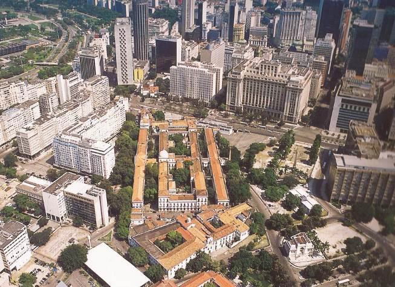
>
> Figura 1. Castelo. Fonte: ZALIS, 2005.

# Conceitos Primordiais e Metodologia Proposta

Antes de explicitar os critérios do método proposto, é necessário
conceituar o elemento escolhido para ser o produto da decodificação da
cidade: o tipo. O emprego do termo tipo no estudo arquitetônico remonta
à Quatremére de Quincy. Em sua publicação "Dictionnaire historique
d\'architecture", de 1832, o termo é definido, e diferenciado da palavra
'modelo'.

> (\...) a palavra tipo apresenta menos a imagem de uma coisa a copiar
> ou imitar por completo que a ideia de um elemento que devia ele mesmo
> servir de regra ao modelo. (\...) O modelo, considerado na execução
> prática da arte, é um objeto que deve se repetir tal qual é, o tipo,
> ao contrário é um objeto a partir do qual cada um pode conceber obras
> que não se assemelham
>
> entre si. Tudo é preciso e dado no modelo; tudo é mais ou menos vago
> no tipo. (QUATREMÈRE DE QUINCY apud PEREIRA, 2008. p. 303-305)

Quatremère de Quincy também estabelece que o tipo designa "certas formas
gerais e características do edifício que as recebe". (Ibidem, p. 309).
Pode-se considerar o tipo arquitetônico como um padrão composto por uma
série de elementos passíveis de identificação. Rafael Moneo aborda essa
noção do termo:

> \[o tipo\] pode ser simplesmente definido como um conceito que
> descreve um grupo de objeto caracterizados pela mesma estrutura
> formal. \[\...\] baseado na possibilidade de agrupar objetos através
> de certas similaridades em suas estruturas inerentes. Poder-se-ia
> dizer, inclusive, que o tipo significa o ato de pensar em grupo
> (MONEO, 1978, p. 23)

Panerai (1999/2006, p. 127) sintetiza esses conceitos, declarando que o
tipo é "um objeto abstrato", fruto de análises que identificam as
"propriedades essenciais" de "objetos reais", através de uma econômica
descrição.

Caniggia (1979/1995) estabelece o duplo caráter do tipo. Usando como
referência a edificação, o tipo é uma pré-projeção do objeto
arquitetônico a ser construído e, portanto, anterior ao objeto físico
realizado. Contudo, ele é assimilado pelo homem através de uma síntese
posterior, na qual se relacionam as características em comum dos objetos
já realizados. O tipo é fruto tanto de uma síntese *a priori*, na mente
de quem o produz, quanto de uma síntese *a posteriori*, na mente de quem
o analisa.

Com o apoio das abordagens analisadas, podem-se estabelecer os conceitos
fundamentais para a elaboração da proposta deste trabalho. Entre essas
abordagens, consegue-se traçar paralelos entre os autores estudados,
reconhecendo que embora seus métodos produzam decodificações variadas do
espaço urbano, seus conceitos possuem pontos em comum.

Partindo do conceito de cidade definido por Kostof, em "The City
Shaped", da qual está é o local onde estão "condensadas as continuidades
do tempo e do lugar" (KOSTOF, 1991/1993, p. 16), o espaço urbano pode
ser tido como um produto em constante transformação, resultado da
superposição de tecidos urbanos constituídos ao longo dos anos,
representante de vários tempos. Em "What Time is This Place?" (1972),
Lynch trabalha com essa noção, da cidade de vários tempos, na qual a
imagem do espaço urbano é fruto da seleção dos elementos que o compõem,
sendo estes originários de distintos momentos em sua produção, sempre
sujeitos a modificações.

Essa noção temporal do espaço urbano também foi apresentada por
Caniggia, em "Lettura dell'edilizia di base" (1979/1995). As
"continuidades do tempo e do lugar" apresentadas por Kostof são
verificadas no que Caniggia chama de processo tipológico, onde variadas
composições do espaço urbano fazem parte de um mesmo tronco, e são
representantes de diferentes momentos de um único *continuum*. Contudo,
essa afirmação não ignora que além das continuidades, o espaço urbano
também apresente rupturas, produzindo fragmentos urbanos.

Para abordar os fragmentos urbanos, recorre-se novamente a Kostof, com
sua

afirmação que as cidades são "amálgamas de construções" (KOSTOF,
1991/1993, p. 16). Cullen também se apropria dessa noção ao desenvolver
o aspecto do conteúdo da paisagem urbana, no qual ele indica que "é
natural que \[as cidades\] evidenciem uma amálgama de materiais, de
estilos e de escalas" (CULLEN, 1961/2008, p. 13). Compreender a forma
das cidades é, portanto, indissociável de reconhecer as conjugações do
espaço urbano. Não basta uma simples identificação das peças que a
constituem, mas sim o estudo das suas distintas associações, ou uma de
"arte do relacionamento" (Ibidem, p. 10).

Esse processo de identificação foi também verificado na obra de Lamas
(1993/2010), na qual os elementos morfológicos que compõem o espaço
urbano produzem distintas conjugações, em escalas variadas. Trabalhando
com a concepção da cidade composta por fragmentos, tem que se reconhecer
que as dimensões de análise de cada uma das suas componentes não são
uniformes. A questão da transição entre escalas do espaço urbano é
essencial para o sucesso do método proposto.

Nesta metodologia, o edifício não é nem o elemento máximo da análise,
nem o mínimo. A edificação será o elemento básico. A análise transita
constantemente entre as escalas, abordando tanto elementos ditos como
"arquitetônicos", como ritmo de vãos e linguagem estética, quanto
"urbanos", como a volumetria da edificação e sua relação com o entorno.
Uma vez que a proposta tem como objetivo decodificar a forma urbana como
um método de compreender a sua composição, é preciso, antes de focar os
elementos codificados, reconhecer por completo o universo de análise.
Essa compreensão inicial do objeto de estudo é fundamental para a
aplicação metodológica, permitindo que as categorizações resultantes
sejam diretamente influenciadas por um contexto geral.

Para realizar essa compreensão do universo estudado é necessário
apoiar-se em três bases de conhecimento: cartografia, iconografia e
contexto social. Contudo, esta não pode se limitar a uma análise que só
reconhece o momento presente, pois a compreensão da forma urbana é um
estudo morfológico, que recuperando os conceitos de Lamas, trabalha com
"a produção e transformação \[do meio urbano através\] do tempo".
(LAMAS, 1993/2010, p. 10) . É preciso considerar não só a questão da
cidade como uma composição de fragmentos físicos, como também de
fragmentos temporais. Reafirmando a sua leitura através das três
componentes de conjugação do espaço urbano - a forma, a imagem e a
história, a cada uma destas pode ser atribuída uma base de conhecimento
de maior afinidade.

A leitura através dessas três componentes, com uma abordagem tanto
físico-espacial quanto temporal, promove uma compreensão da forma urbana
através da análise da situação física dos elementos presentes na cidade.
Esta se associa aos processos de urbanização para explicitar sua
transformação, indicando quais foram os motivos que levaram à sua
configuração atual.

Essa análise estruturada nas três componentes resulta, em três grupos de
classificações tipológicas. Novamente trabalha-se com a transição das
escalas, não mais de caráter físico, mas sim analítico. O conceito
definido por Caniggia como nível de tipicidade entra em cena na criação
dos tipos presentes no universo analisado. O nível de tipicidade é tido
como o grau de intensidade com que se investigam as estruturas
tipológicas a partir de um aprofundamento progressivo. O objetivo nesse
processo de decodificação é atingir um nível de tipicidade adequado em
relação ao objeto de

estudo.

As classificações tipológicas geradas pelas análises de cada componente
não serão as mesmas do inventário final, sendo estas elaboradas em três
etapas. Previamente às classificações tipológicas serão realizados os
agrupamentos tipológicos, que reúnem em grupos as edificações através de
critérios isolados na análise. Para Panerai, essa é "uma fase de
observação minuciosa dos objetos", e somente a partir das "respostas a
esses diferentes critérios" é possível elaborar uma "primeira
classificação". (PANERAI, 1999/2006, p. 132).

Os agrupamentos tipológicos constituem essas respostas aos critérios,
enquanto as categorias tipológicas produzidas ao fim da análise em cada
componente (forma, imagem e história) enquadram-se nesta "primeira
classificação". Dentre os critérios analisados na componente da forma,
estão: as dimensões e formatos dos lotes no qual se inserem as
edificações, a implantação dos edifícios nos lotes, e a volumetria dos
objetos arquitetônicos. Na componente da imagem, os critérios
investigados foram: a relação entre o edifício e conjunto edificado em
seu entorno, o ritmo predominante dos vãos, e a linguagem
estético-arquitetônica empregada nas fachadas. Os últimos critérios, da
componente da história, englobam a identificação do momento de produção
dos edifícios, e do tecido urbano no qual se inserem. A última etapa na
elaboração dos tipos é a conjugação das classificações das três
componentes, buscando um reagrupamento a partir da exclusão de
características tipológicas que possam se apresentar como irrelevantes
ao contexto geral.

# Castelo: Breve Histórico

Como etapa prévia ao processo de classificação tipológica, propõe-se o
reconhecimento do entorno da área analisada. O Morro do Castelo (Fig.
2), cuja demolição teve início na gestão do prefeito Carlos Sampaio,
fora um dos núcleos originais de assentamento da Cidade do Rio de
Janeiro, cuja ocupação remonta ao ano de 1567. No início do século XX, o
Castelo era composto por um casario mal conservado, habitado por classes
sociais de baixa renda, e representava uma memória colonial em meio à
capital republicana embelezada pela Reforma Passos (1902-1906).

> 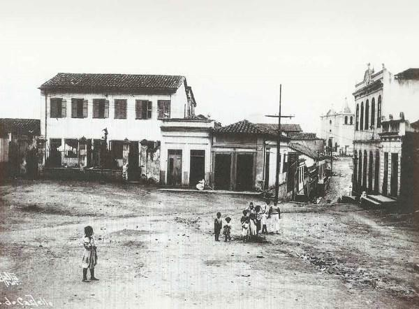
>
> Figura 2. Morro do Castelo, 1920. Fonte: NONATO & SANTOS, 2000.

A Exposição Internacional do Centenário da Independência, realizada em
1922, impulsionou o desmonte do Castelo. Com o pretexto da necessidade
de terras para abrigar os pavilhões da exposição, foram iniciadas, em
1920, as obras de demolição do morro, juntamente com o contíguo bairro
da Misericórdia. O desmonte gerou dois

grandes vazios urbanos no Centro da Cidade: a área do antigo Morro, e o
aterro construído com as terras provenientes da demolição.

Estes vazios foram contemplados pelo Plano de Remodelação, Extensão e
Embelezamento da Cidade do Rio de Janeiro, elaborado pelo urbanista
francês Alfred Agache, entre 1927 e 1930. Agache dá grande destaque em
seu plano para o desenho proposto para a recém-criada Esplanada do
Castelo (Fig. 3), e seu aterro contíguo. A proposta ocupacional dos
terrenos seguia o modelo das quadras fechadas, no qual as edificações
compunham uma contínua cortina de fachadas em volta de todo o
quarteirão, com linha de fachada equivalente a oito pavimento. O miolo
destas quadras seriam áreas não edificadas, destinadas ao uso de
garagens. Outro ponto característico dessa ocupação é a presença das
galerias de pedestres, ao longo das grandes avenidas projetadas por
Agache.

> 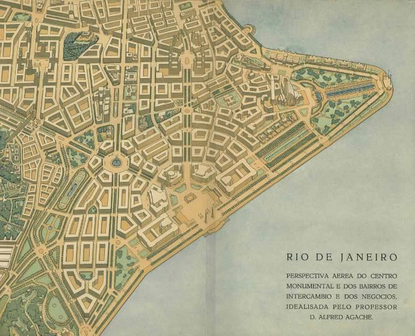
>
> Figura 3. Perspectiva do Plano Agache. Fonte: AGACHE, 1930.

Embora suas propostas tenham guiado a ocupação desta área da cidade em
fins da década de 1920, o plano foi revogado em 1931, em decorrência da
Revolução de 1930, contribuindo na permanência de uma Esplanada
praticamente deserta em 1936, exceto pelo seu arruamento, conforme
verificado em imagens da época. (Fig. 4) Em 1937, na interventoria de
Henrique Dodsworth cria-se a Comissão do Plano da Cidade e o Serviço
Técnico do Plano da Cidade, que revisou, com adaptações, propostas do
Plano Agache, retomando a ocupação do Castelo.

No trecho da Esplanada contido na área do antigo Morro, consolidou-se a
ocupação das quadras fechadas de Agache. Este modelo, contudo, entraria
em choque com os ideais modernistas defendidos por alguns dos arquitetos
atuantes na cidade, como vistos no projeto do Palácio Gustavo Capanema,
que incorpora os cinco pontos da nova arquitetura propostos por Le
Corbusier. Além das questões plásticas, a ruptura com o modelo de Agache
se dá principalmente com sua implantação. Situado em meio à Esplanada, o
Palácio Capanema dispõe-se livremente no interior de sua quadra, em
oposição às cortinas de fachadas da rua-corredor.

> 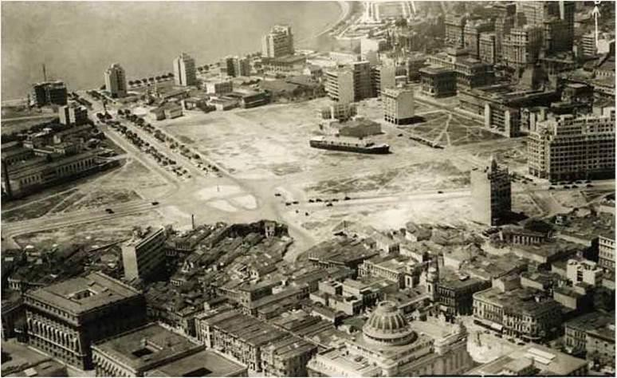
>
> Figura 4. Esplanada do Castelo, 1936. Fonte:
> [www.ermakoff.com.br.](http://www.ermakoff.com.br/)

Em 1938, Affonso Eduardo Reidy, que integrava o corpo de profissionais
do Serviço Técnico da Cidade, propõe uma nova urbanização para o vazio
remanescente, imbuído dos ideais modernistas que guiaram o projeto do
Palácio Capanema. Como crítica ao modelo das quadras fechadas, propôs
grandes quadras abertas ajardinadas, com edifícios interconectados
implantados em diferentes disposições. (Fig. 5) O plano, porém, previa
consolidar a estrutura das quadras já parcialmente ocupadas pelos moldes
"agachianos", propondo a mudança de implantação apenas nas áreas ainda
não urbanizadas da Esplanada.

> 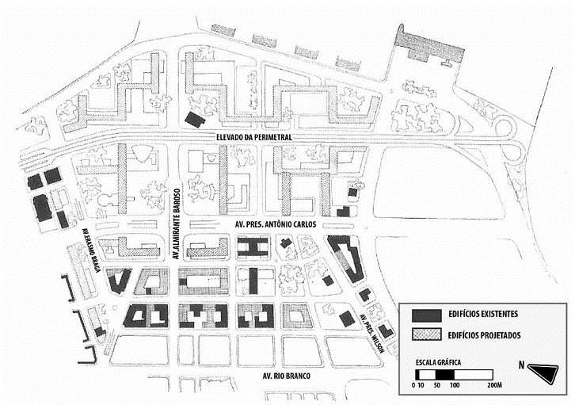
>
> Figura 5. Plano de Reidy. Fonte: BONDUKI, 2000.

O Plano de Reidy não foi concretizado, mas influenciou a ocupação do
restante não edificado da Esplanada, verificada no PAA nº 3085 de 1938,
que consolidou as quadras de Agache, no trecho referente ao vazio do
antigo Morro do Castelo. Partes da Esplanada permaneceram vazias até a
última década, sendo ocupada pelos escuros blocos envidraçados do
Complexo Judiciário do Rio de Janeiro.

# Decodificando o Castelo

Para demonstrar a aplicação do método proposto, foi realizada uma
seleção das edificações existentes no Castelo, num total de 29
exemplares (Fig. 6 e 7), sendo esta uma amostra representativa da forma
urbana de caráter padronizado produzida no vazio do antigo morro. Será
apresentada a seguir, uma versão sintética do processo de análise.

> 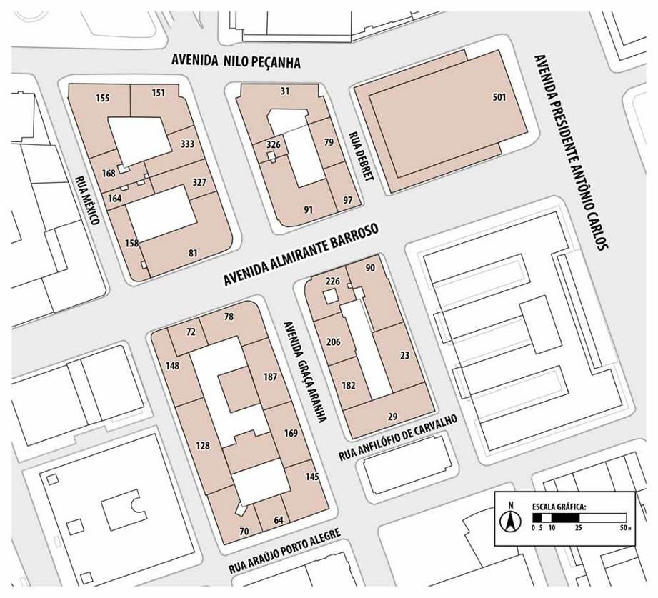
>
> Figura 6. Mapa de Edificações Selecionadas.
>
> 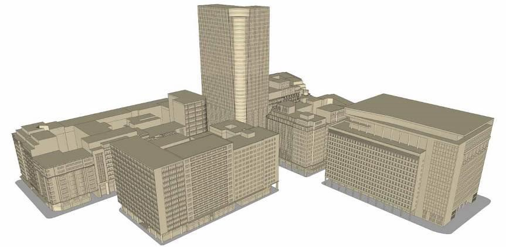
>
> Figura 7. Maquete Eletrônica das Edificações Selecionadas.

Iniciando a aplicação com a análise da forma das edificações, foram
estudados os lotes urbanos nos quais estas se inserem. Para Lamas
(1993/2010), o lote é a origem do edifício, essencial na relação do
imóvel com o terreno, condicionante da sua forma e, por conseguinte, do
espaço urbano. No caso do Castelo, grande parte de seus lotes e
edificações são integrantes de um mesmo projeto urbanístico. Os vazios
não edificados dos quarteirões não configuravam áreas *non aedificandi*
de lotes, e sim pátios internos comuns a todos os edifícios que o
compõem.

A próxima etapa na análise da forma das edificações está em sua
implantação nos lotes urbanos. Todas as edificações apresentam uma
característica em comum nesse critério: a projeção destes não apresenta
afastamento lateral ou frontal. Contudo, verifica-se em alguns a
presença das galerias de pedestres através de recuos nos primeiros sete
metros da construção, conformando uma contínua faixa de passeio coberta
em seletas vias da área.

O último critério desta componente é a análise volumétrica das
edificações. Realizada sem dissocia-la do seu conjunto, e volume
aparente é o elemento a ser caracterizado. No Castelo, onde é evidente
uma padronização volumétrica, facilmente reconhece-se uma massa de
dimensões medianas, com edifícios com ampla testada para a rua, com
volume aparente em formato de bloco.

Estes três critérios analisados foram condensados, e produziram as
classificações Tipo-Forma (Fig. 8 e 9), na qual se destacam o Tipo-Forma
1, representativo das edificações com uma única ampla testada para a
rua, e Tipo-Forma 3, variante com presença das galerias de pedestres. O
Edifício do Jockey Club Brasileiro apresenta-se como Tipo-Forma 9,
isolado, ocupando um quarteirão inteiro da área estudado, contudo
integrando-se ao entorno através da presença de galerias de pedestres.

> 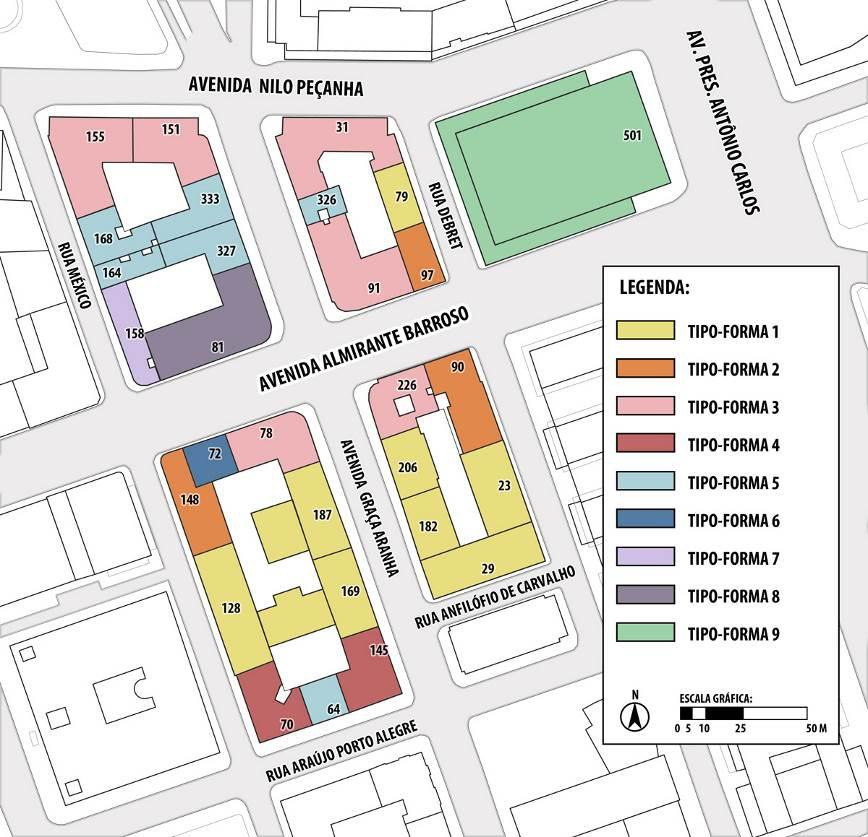
>
> Figura 8. Mapa de Tipo-Forma.
>
> 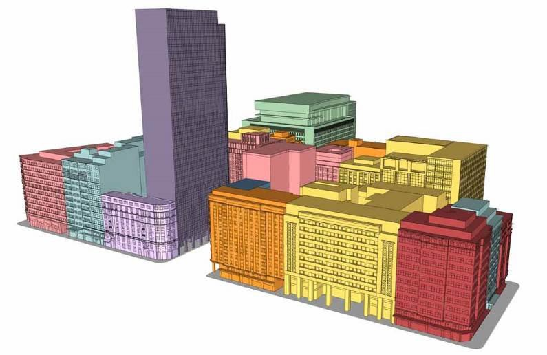
>
> Figura 9. Maquete Eletrônica -- Tipo-Forma.

O elemento máximo das análises propostas pelo método é o conjunto
edificado, e com ele inicia-se a leitura do espaço urbano pela
componente da imagem. A análise da relação entre edificações e o
conjunto urbano do entorno gerou apenas dois agrupamentos. O primeiro,
predominante na área, é o das edificações que compõem a massa
volumétrica homogênea do Castelo. O segundo grupo é reservado para as
edificações em contraste à ambiência volumétrica geral, caso do pequeno
imóvel de nº 158 da Rua México e da esbelta Torre Almirante.

Na análise do Castelo, com sua massa edificada homogênea, a harmonia das
dimensões dos vãos das edificações e o ritmo de seus intervalos, ganha
relevância na garantia de preservar uma unidade temática, sendo o
segundo critério analisado desta componente.

O estudo da linguagem arquitetônica das fachadas que evidencia questões
estéticas e construtivas é o último critério analisado da componente. O
agrupamento mais representativo da área é composto por modernas
edificações de linguagem simplificada, com um limpo pano de fachada,
recortado por simples sequências de janelas. A linguagem acadêmica
(edifício nº 158 da Rua México), a arquitetura moderna (Jockey Club
Brasileiro), e pano contínuo envidraçado (Torre Almirante) também são
encontrados, embora em menor incidência.

Estes três critérios produziram as classificações Tipo-Imagem (Fig. 10 e
11), na qual se destaca o Tipo-Imagem 1. Ele engloba todas as
edificações que compõem a massa edificada homogênea do Castelo, com uma
fachada revestida por pano sequencial de janelas sem ornamentações e
ritmo predominante vertical. O Tipo-Imagem 2, segue as mesmas
características, exceto pela presença de um ritmo horizontalizado.

> 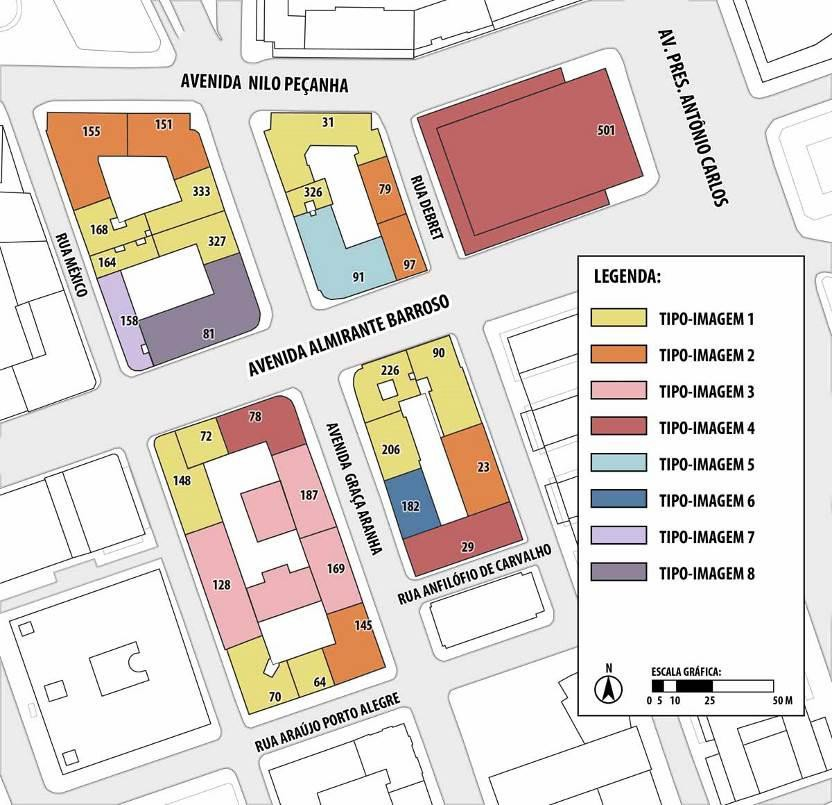
>
> Figura 10. Mapa de Tipo-Imagem.
>
> 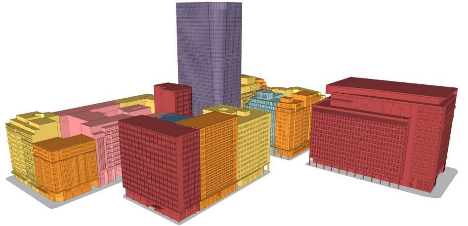
>
> Figura 11. Maquete Eletrônica -- Tipo-Imagem.

A última componente de análise do espaço urbano, a história, tem grande
peso na decodificação da forma das cidades. Foram associados os momentos
de produção de cada edifício com os momentos de produção do tecido
urbano que os suportam, gerando as classificações Tipo-História (Fig. 12
e 13). O Tipo-História 3 é o de maior representatividade, referente às
edificações construídas entre os anos de 1937 e 1950, no tecido urbano
resultante das revisões das propostas do Plano Agache.

> 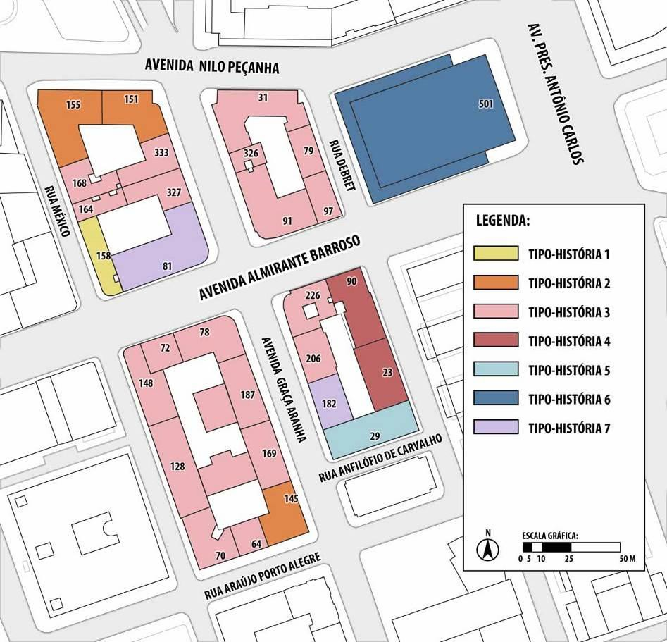
>
> Figura 12. Mapa de Tipo-História.
>
> 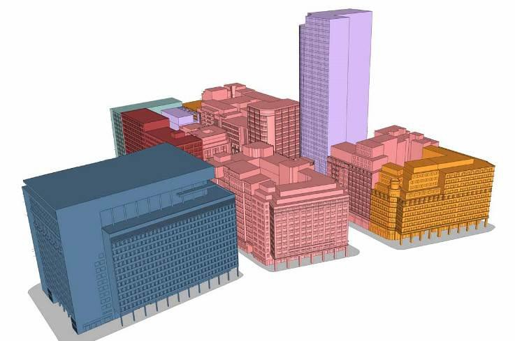
>
> Figura 13. Maquete Eletrônica -- Tipo-História.

A aplicação do método se encerra com a produção do inventário tipológico
(Fig. 14) que articula as três componentes de leitura do espaço urbano
-- forma, imagem e história. No caso do Castelo, as leituras
empreendidas verificaram que suas edificações guardam inúmeras
semelhanças, e os elementos que os diferenciam apresentam-se como
variantes desse grupo de similaridades Logo, os conceitos de Caniggia
(1979/1995) acerca de troncos tipológicos, nos quais tipos derivados
compõem uma família de variantes a partir de um grupo em comum, parecem
ser pertinentes à aplicação deste inventário. O critério arbitrado para
definir estes troncos foi a relação da edificação com o conjunto
edificado, permitindo que as variantes tipológicas sejam obtidas a
partir de uma leitura generalizada, que se ramifica a partir da análise
de particularidades. Com base nesse critério, foram estabelecidos três
troncos tipológicos: A, B e C.

> 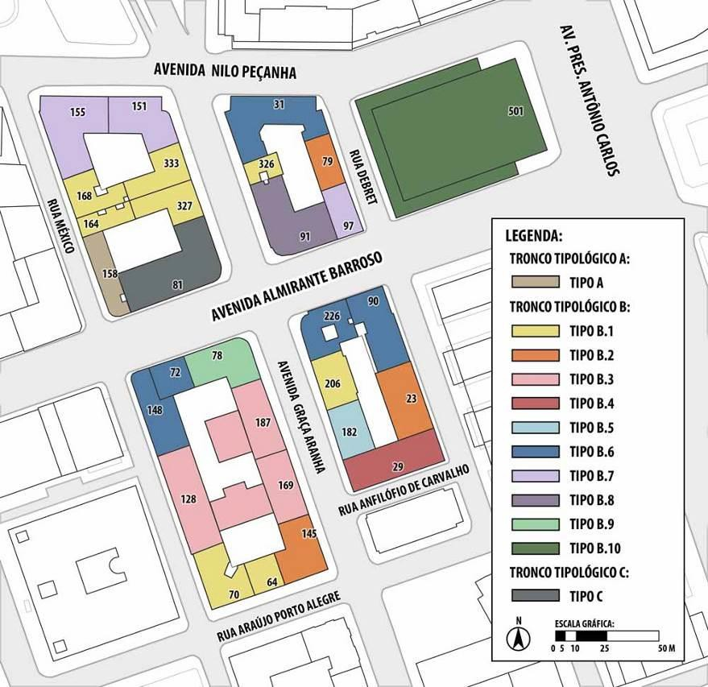
>
> Figura 14. Mapa de Inventário Tipológico.

O primeiro tronco tipológico vai representar um tipo isolado - o tipo A
(Fig. 15). Seu exemplar é o edifício de nº 158 da Rua México. Este é o
único da década de 1920, contemporâneo à produção do Plano Agache.

> 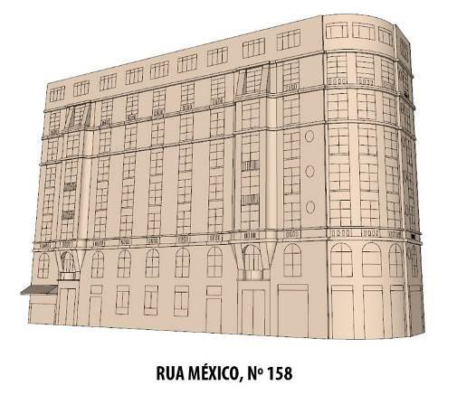
>
> Figura 15. Tipo A.

O tronco B é o grande representante tipológico da área e da massa
volumétrica homogênea, com 10 tipos. O tipo B.1 (Fig. 16) é o caso com
pano sequencial de janelas em ritmo verticalizado, sem presença de
galerias de pedestres, com produção correspondente às décadas de 1930 e
1940.

> 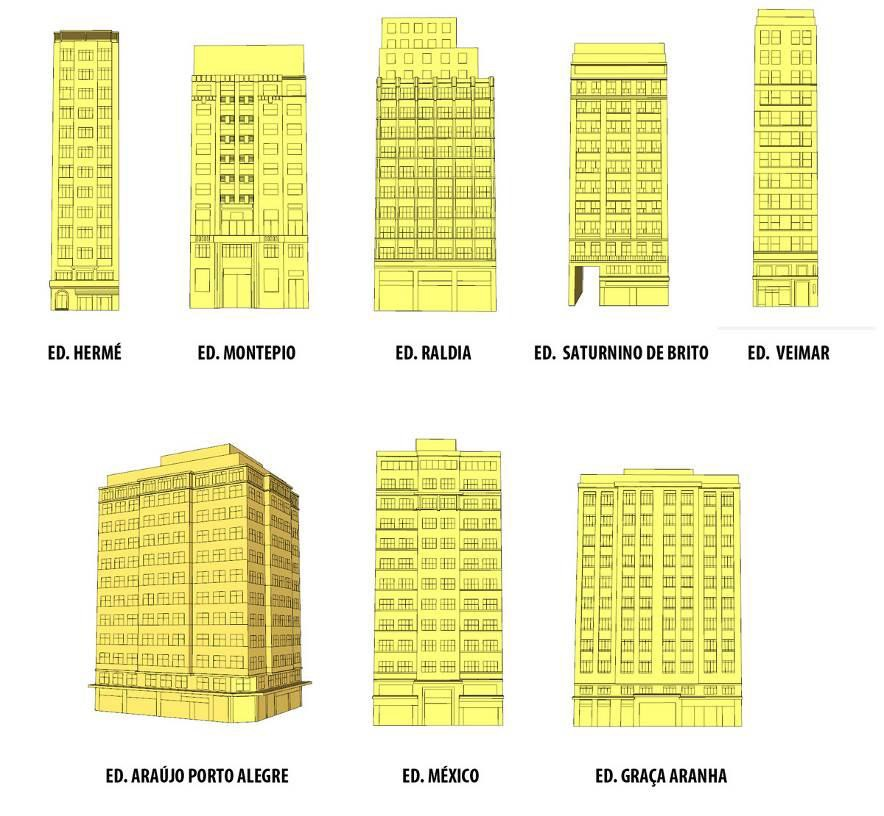
>
> Figura 16. Tipo B.1.

O tipo B.2 (Fig. 17) é sua variante com ritmo horizontal. O tipo B.3
(Fig. 18) é uma variante de ritmo horizontal que incorpora elementos
acadêmicos à fachada. O tipo

B.4 engloba aqueles edifícios que apresentam linguagem característica
moderna, enquanto o B.5 tem fachada em pano de vidro. (Fig. 19) O tipo
B.6 é similar ao B.1, contudo apresenta galerias de pedestres, tal como
o B.7 (Fig. 20), que possui um ritmo mais horizontalizado.

> 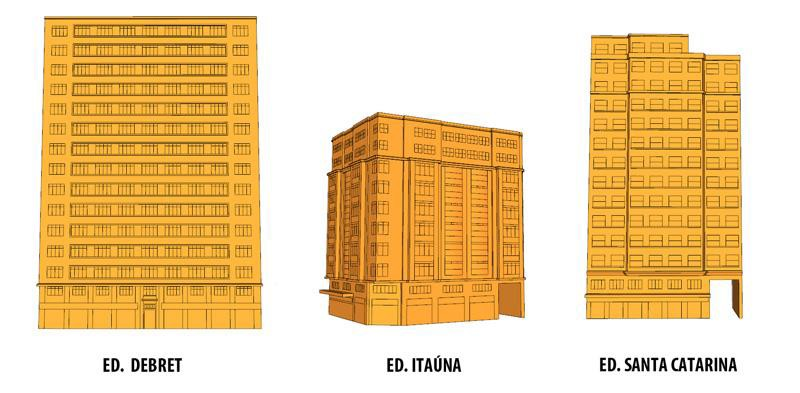
>
> Figura 17. Tipo B.2.
>
> 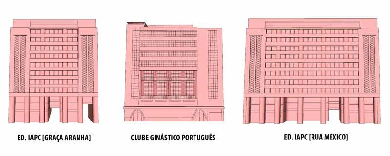
>
> Figura 18. Tipo B.3.
>
> 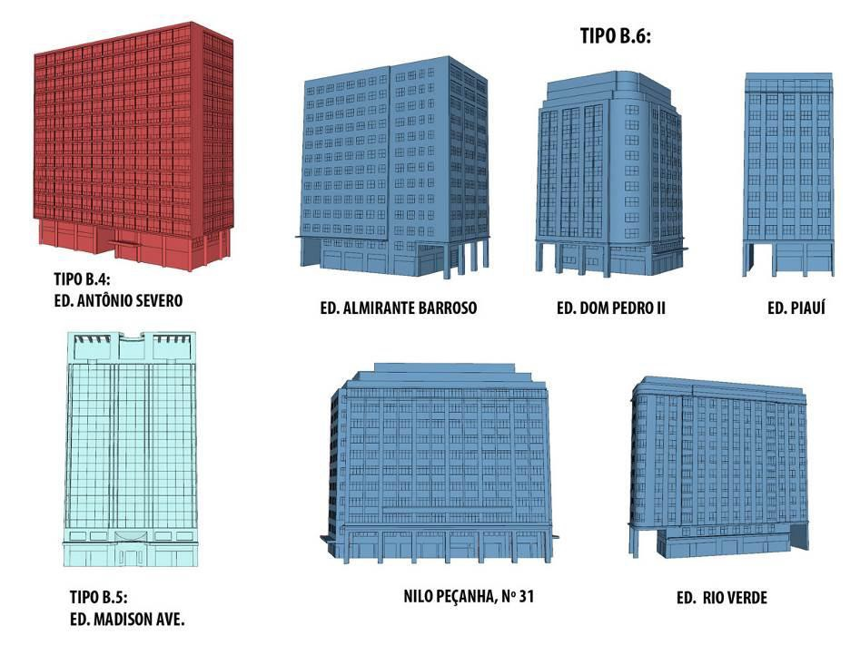
>
> Figura 19. Tipos B.4, B.5 e B.6.
>
> 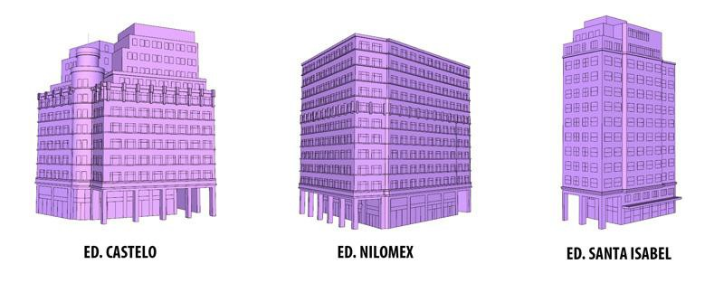
>
> Figura 20. Tipo B.7.

Finalizando o tronco B, encontram-se três tipos isolados com galerias de
pedestres: O tipo B.8 com elementos acadêmicos, o B.9 com elementos
característicos da linguagem moderna, e o B.10 representando o robusto
bloco equivalente a um quarteirão da Sede do Jockey Club Brasileiro. O
tronco C é o caso da Torre Almirante, que se destaca na paisagem pela
sua altura e seu revestimento em pano de vidro. (Fig. 21 e 22)

> 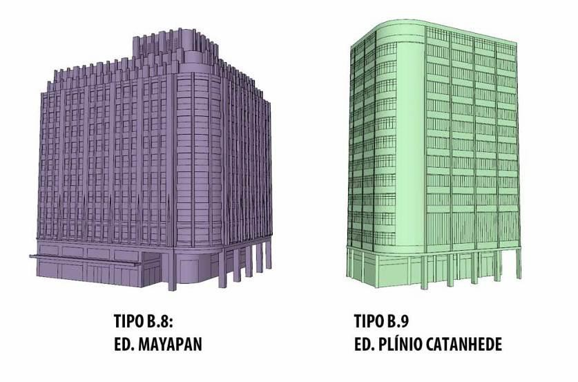
>
> Figura 21. Tipo B.8 e Tipo B.9.
>
> 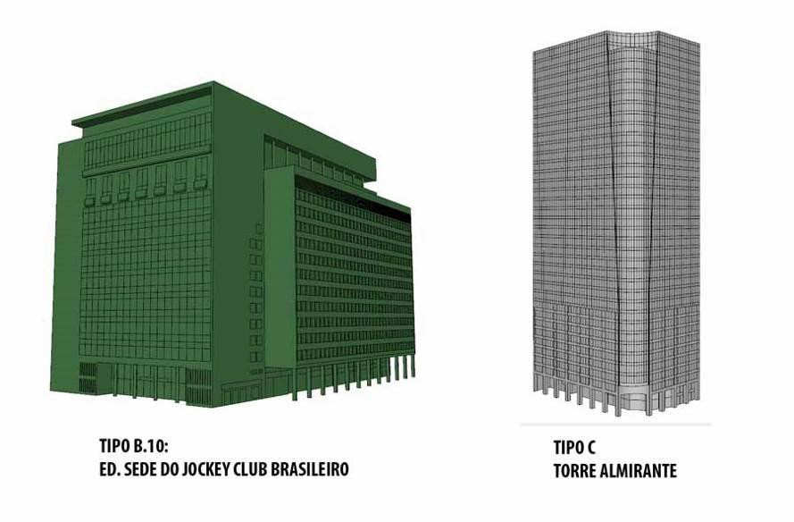
>
> Figura 22. Tipo B.10 e Tipo C.

# Considerações finais

O estudo de diferentes abordagens de análise urbana confirma que não
existe um método definitivamente correto, e sim inúmeras possibilidades
de empreender uma leitura do espaço construído. O método funcionou como
uma guia de questionamentos, buscando uma transição entre escalas, e um
contínuo processo de análise e síntese das informações. A aplicação do
método comprovou as impressões acerca da área, com a predominância de
tipos no tronco B confirmando uma padronização tipológica no Castelo.
Com relação ao inventário tipológico, ele pode auxiliar na inserção de
novas arquiteturas contextualizadas, pois é síntese das características
que conferem identidade à área analisada. Essa inserção é possível sem
pastiche, como visto no Jockey Club Brasileiro, implantado no Castelo
meio século após o Plano Agache, com arquitetura contemporânea ao seu
momento de produção, e ao mesmo tempo estabelecendo um diálogo com a
ocupação à moda *"*agachiana".

# Referências bibliográficas

> AGACHE, A. H. D. *Cidade do Rio de Janeiro. Extensão, Remodelação e
> Embellezamento*. Paris: Editora Foyer Brésilien 1930.
>
> BONDUKI, N. *Affonso Eduardo Reidy*. Lisboa: Editorial Blau/Instituto
> Lina Bo e

P.M. Bardi, 2000.

> CANIGGIA, G.; MAFFEI, G. L. *Tipologia de la Edificación*: estrutura
> del espacio antrópico. Madrid: Celeste Ediciones, 1995.
>
> COLQUHOUN, A.. *Modernidade e tradição clássica*: ensaios sobre
> arquitetura. 1980-1987. São Paulo: Cosac & Naify, 2004.
>
> CULLEN, G. *Paisagem urbana*. Lisboa: Edições 70, 2008.

KOSTOF, S. *The City Shaped*: Urban Patterns and Meanings Through
History. New York: Bulfinch Press, 1993. 352 p.

> LAMAS, J. M. R. G. *Morfologia urbana e desenho da cidade*. 5 ed.
> Lisboa: Fundação Calouste Gulbenkian, 2010.
>
> LYNCH, K. *¿De qué tiempo es este lugar?.* Barcelona: Ed. Gustavo
> Gili, 1972.

MONEO, R. On Typology. In: *Opposition*s. Cambridge: MIT Press, nº 13,
p. 23-45, verão 1978.

> NONATO, J. A.; SANTOS, N. M. (orgs). *Era Uma Vez O Morro do Castelo*.
> Rio de Janeiro: IPHAN, 2000.

PANERAI, P. *Análise Urbana*. Brasília: Editora Universidade de
Brasília, 2006.

> PEREIRA, R. B.. *Arquitetura, imitação e tipo em Quatremère de
> Quincy*. São Paulo, 2008. 357 f. Tese (Doutorado - Área de
> Concentração: História e Fundamentos da Arquitetura e Urbanismo) -
> Faculdade de Arquitetura e Urbanismo, Universidade de São Paulo, 2008.
>
> ROSSI, A. *A Arquitetura da Cidade*. 2 ed. São Paulo: Martins Fontes,
> 2001.

ZALIS, S.; VASQUEZ, P. K. Rio de Janeiro Vista do Céu. São Paulo,
Editora Caras, 2005.
