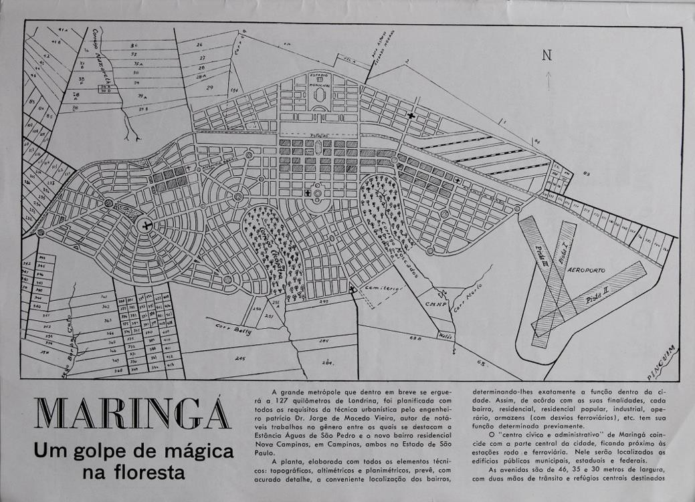
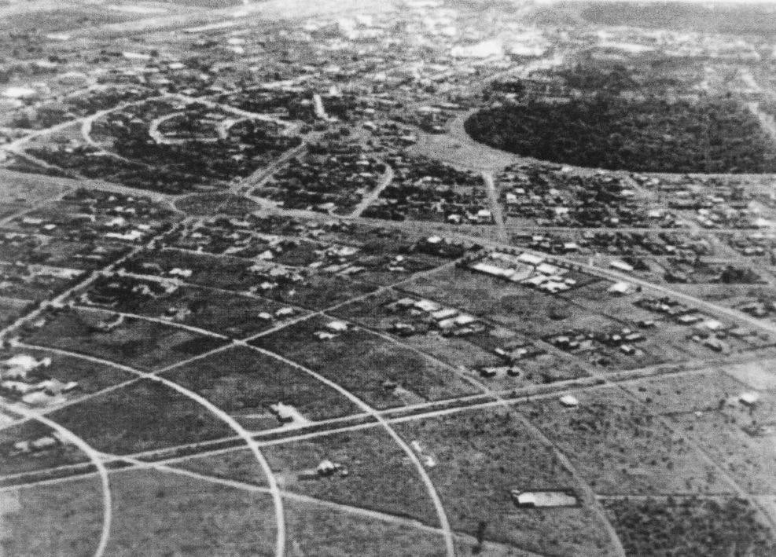
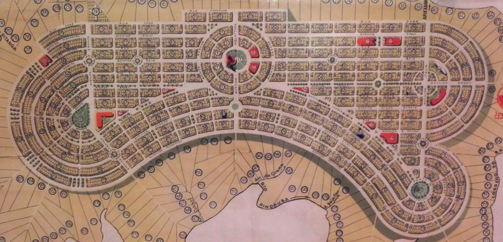
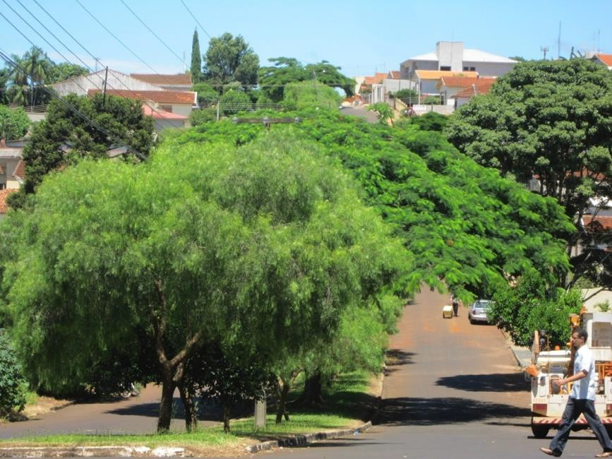
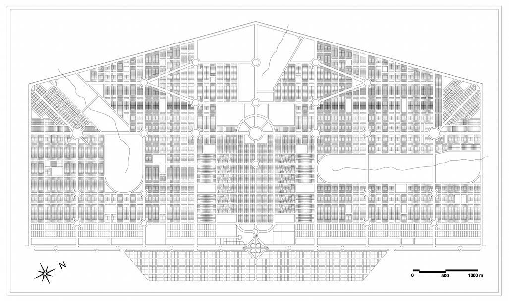
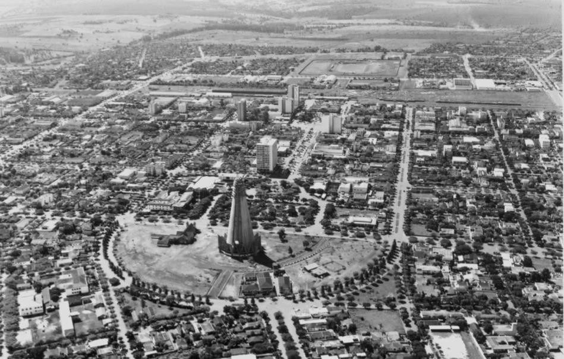
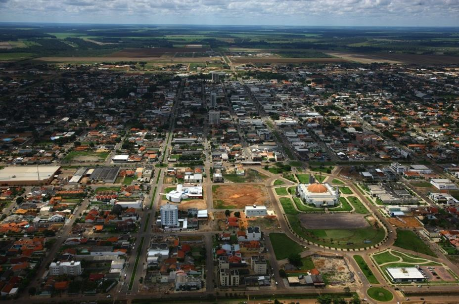

# Resumo

Explorando o conceito de geografia imaginativa, este trabalho trata do
projeto de duas cidades novas planejadas e do seu modelo urbanístico
comum. Embora bastante distintos entre si e distantes física e
temporalmente, o traçado de Ivaiporã, fundada em 1953 no Paraná, e de
Sinop, fundada em 1974 no Mato Grosso, tiveram como modelo a cidade de
Maringá, criada no norte paranaense em 1947 a partir dos princípios
formais da cidade jardim inglesa. No primeiro caso, as afinidades
formais entre o projeto e o modelo são patentes; no segundo, elas são
menos evidentes, apesar de confirmadas pelo projetista. Ao expressar o
modo como lugares reais admirados são representados e como estas
representações refletem preconceitos e desejos, a geografia imaginativa
esclarece que a representação de um modelo urbanístico pode conter
aspectos da realidade que são idealizados, exagerados, imprecisos ou
mesmo falsos; assim, a geografia imaginativa permite reconhecer no
objeto projetado tanto as projeções da imaginação utópica do sujeito
projetista quanto o aprendizado racional objetivamente tomado por ele do
modelo. Neste sentido este trabalho trata da circulação de ideias de
urbanismo pelo interior do Brasil e da transformação sofridas por elas
neste processo, contribuindo para a narrativa da história do urbanismo e
das cidades novas planejadas.

Palavras-chave: circulação de ideias, geografia imaginativa, cidades
novas planejadas

# Abstract

Exploring the concept of imaginative geography, this paper focus on the
layout of two planned new towns and their common planning model.
Ivaiporã was founded in 1953 in Paraná state and Sinop was founded in
1974 in Mato Grosso; although distant in space and time and fairly
different, both designs considered Maringá, a 1947 northern Paraná new
town designed according to the garden city formal principles, as a
model. In the first case, common features between the model and the new
layout are patent; in the second case, they are less evident, though
confirmed by the designer. By expressing how admired real places are
represented and how these representations convey preconceptions and
desires, imaginative geography informs that the representation of a
planning model may contain aspects that are idealized, exaggerated,
inaccurate and even false; thus imaginative geography allows to
recognize in the new layout not only the subject's utopic imagination
but also the rational learning objectively taken from the model. As a
result this paper deals with diffusion and transformation of planning
ideas throughout Brazilian hinterland, thus contributing to planning and
planned new towns history.

Keywords: planning diffusion, imaginative geography, planned new towns

# Introdução

A admiração e a emulação de certas conformações urbanas tem sido um
importante instrumento na circulação de ideias e práticas de urbanismo.
Pois lugares largamente admirados pelo seu reconhecido 'bom
planejamento' tem atuado como modelos de urbanismo, inspirando e
informando o projeto de outras cidades, e estimulando a reprodução de
soluções urbanísticas elogiadas. Diferentemente de Choay (1985), que
tratou da noção de modelo a partir da palavra escrita, Stephen Ward tem
se referido

especialmente aos registros visuais da forma urbana, o que lhe permitiu
perceber que o entendimento e a aplicação de um modelo admirado ocorre
mais tipicamente de modo parcial e seletivo. Porque muitas vezes o
entendimento daquilo que é admirado é incompleto, desprovido da
compreensão mais abrangente do contexto que condicionou tal solução
urbanística. Porque, sobretudo, uma seleção deliberada dos aspectos mais
relevantes da cidade admirada desmonta o modelo como um 'kit de partes'
(WARD, 2013, p. 297).

A circulação de ideias de urbanismo resulta do aprendizado racional, de
uma busca genuína pela 'prática correta', com *insights* e lições
baseadas em evidências objetivas e conhecimento empírico. Mas resulta
também de processos mais imaginativos, exercícios de uma imaginação
seletiva (WARD, 2012). Isto porque as cidades são produzidas não apenas
materialmente e geograficamente mas também no imaginário. Cidades são
vivenciadas, apreciadas, estudadas e reconstruídas mentalmente. Isso
significa que lugares geográficos reais podem ser externamente
construídos (como modelos), ilusoriamente imaginados de modo a salientar
ou atenuar características que gostaríamos de ver reforçadas ou evitadas
nos nossos próprios lugares (WARD, 2012; GREGORY, 1994).

Em seu estudo sobre como o Ocidente representou o Oriente, Edward Said
(2001) mostrou que o conhecimento em nossa mente sobre como 'são' certos
lugares pode não ser totalmente real; normalmente ele é impreciso,
exagerado, ou baseado em estereótipos. Assim o conceito de geografia
imaginativa definido por Said expressa o modo como lugares admirados são
representados e como estas representações refletem os preconceitos e os
desejos dos seus autores. Com efeito, o conceito de geografia
imaginativa faz ver que lugares concretos adquirem valores imaginativos
pela projeção cultural de características, papéis e significados, sobre
a realidade material (cf. SAID, 2001, p. 65, 77 e 80). De modo
semelhante, cidades exemplares e seus aspectos admirados acabam sendo
tomados como como modelos de urbanismo e, na formulação mental destes
modelos, certos aspectos reais acabam sendo exagerados, minimizados,
esquecidos, idealizados.

Este trabalho trata da construção de um modelo de urbanismo -- a cidade
paranaense de Maringá (1945-47) -- e de duas cidades novas -- Sinop
(1972-79), no Mato Grosso, e Ivaiporã (1953), no Paraná -- planejadas a
partir desta representação. Considerando distâncias espaciais e
temporais distintas, este trabalho entende que a construção de um modelo
de urbanismo é historicamente condicionada (REGO, 2014). Ao reconhecer,
em exercícios conscientes de aprendizado racional empírico, as parcelas
de projeções culturais da imaginação seletiva, utópica, este trabalho
contribui para o entendimento da difusão, adaptação e transformação das
ideias urbanísticas, mais especificamente no interior do Brasil e no
contexto das cidades novas planejadas.

Maringá como modelo urbanístico

Maringá é uma cidade nova planejada na frente pioneira de colonização do
norte do Paraná entre 1945 e 1947 (Figura 1). Resultado de um
empreendimento britânico de especulação fundiária da primeira metade do
século XX, a ocupação desta região contou com colonização sistemática e
urbanização deliberada, e o traçado de Maringá, pelas dimensões e
características formais, culminou este processo de ocupação regional
(MACEDO, 2011; REGO 2011; REGO, 2009).

> 
>
> Figura 1. Publicidade sobre Maringá na Revista Pioneira, n. 1, 1948.
> Fonte: Museu da Bacia do Paraná

As precedências e as noções urbanísticas que embasaram este traçado
urbano tem sido profundamente investigadas (ANDRADE, 2000; STEINKE,
2007; BONFATO, 2008; REGO, 2012a; REGO, 2009), mas é fundamental lembrar
que o projeto de Maringá marcou o início da nova administração da
principal companhia colonizadora do norte do Paraná, a Companhia de
Terras Norte do Paraná (CTNP), depois denominada Companhia Melhoramentos
Norte do Paraná (CMNP). Esta administração, sediada em São Paulo e
contando com dois engenheiros formados na Escola Politécnica da capital
paulista, contratou o engenheiro Jorge de Macedo Vieira, ex-colega de
Poli e então já renomado urbanista, para projetar uma cidade que deveria
constituir um polo regional, símbolo de progresso e prosperidade. De
fato, o traçado de Maringá se mostrou uma novidade entre as cidades
novas planejadas e implantadas na região e, por contraste com as cidades
existentes, representou a modernização urbana (cf. REGO, 2012b).

De acordo com o próprio Vieira (1971), ele pretendeu, em Maringá,
"projetar uma cidade moderna. Uma cidade em que o traçado das ruas não
obedecia ao xadrez que os portugueses nos ensinaram aqui, que nos
deixaram aqui na colônia" e, para tanto, seguiu

> um processo moderno que era de acompanhar o terreno o mais possível. E
> a cidade já pré-traçada, o zoneamento estudado, com os seus parques,
> os seus lugares de lazer, os seus verdes todos caracterizados (\...)
> \[criava\] uma cidade completa com todos os predicados de uma cidade
> moderna (VIEIRA, 1971).

Macedo Vieira havia trabalhado em São Paulo com o urbanista inglês
Richard Barry Parker, com quem aprendeu o "gosto pela especialidade"
(VIEIRA, 1971) e os princípios formais da cidade jardim (MILLER, 2012;
ANDRADE, 2000; BONFATO,

2008; STEINKE, 2007). O ideário cidade jardim se mostrou maleável e
adaptável a contextos e propósitos variados (MILLER, 2002) e, em geral,
foi mais usado como 'imagem' do que como meio de reforma urbana (MILLER
2010; ALMANDOZ, 2004; WARD, 1992; AALEN, 1992). A informalidade da
cidade jardim foi até associada com as composições formais do *city
beautiful* -- como fez o próprio Macedo Vieira em Maringá (REGO, 2012a).
Mas via de regra, ruas curvas, predomínio de áreas livres e arborização
abundante ficaram como a marca de um urbanismo 'aristocrático', correto,
e de qualidade -- e essa imagem correu o país em vários empreendimentos
do tipo cidade jardim construídos nas primeiras décadas do século XX
(WOLFF, 2001, p. 84; LEME, 2005; SEGAWA, 2004, p. 115 e 116). Da mesma

maneira, as características espaciais de Maringá (MACEDO, 2011; cf.
MENEGUETTI, 2009) constituíram uma potente 'imagem' urbana (Figura 2).
Ainda que os registros da construção da cidade flagrassem cenas de
precariedade urbana, o seu traçado viário pouco usual granjeou
distinção, no sentido que Bourdier (2011, p.

65\) deu a este termo. Como reconheceu o geógrafo francês Pierre Monbeig
(1984, p. 357), que visitou a zona pioneira norte-paranaense nos anos
1940, lançava-se uma cidade "como se lançaria uma moda, com grandes
golpes de propaganda". De fato panfletos, fotografias -- inclusive
aéreas -- e publicidade como a que anunciou a construção da "grande
metrópole" projetada pelo ilustre engenheiro Macedo Vieira alardearam o
empreendimento norte-paranaense (Figuras 1 e 2). Assim, o traçado
inovador de Maringá e a publicidade veiculada pela companhia
colonizadora garantiram desde cedo o status de cidade moderna.

> 
>
> Figura 2. Maringá, zonas 4 e 5, c. 1954. Fonte: DPH/Prefeitura do
> Município de Maringá

Maringá -- junto com Cianorte, outra cidade nova planejada no norte do
Paraná por Macedo Vieira em 1955 -- diferencia-se das demais cidades da
região pela sujeição da forma urbana ao sítio e, consequentemente, pela
singular conformação orgânica e pelo traçado viário irregular.
Contrastando com formas urbanas mais geométricas, de perímetros
regulares (como que definidos a priori) e de arruamento invariavelmente
ortogonal, o traçado de Maringá (como Cianorte) destoa das demais
cidades

planejadas na região -- mas não de Ivaiporã.

# Ivaiporã

O traçado artisticamente moldado na topografia parece fazer ressoar
nesta cidade projetada em 1953 algumas das características formais de
Maringá (Figura 2). O projeto de Ivaiporã foi elaborado pelo engenheiro
civil Yaroslau Sessak, que formou- se em 1948 na Faculdade de Engenharia
do Paraná, em Curitiba, um pouco antes de mudar-se para o norte do
Paraná, perto de Maringá (PUPPI, 1986, p. 155). Sessak foi contratado
pela Imobiliária Progresso Ltda. e, mais tarde, pela Sociedade
Territorial Ubá Ltda., duas pequenas colonizadoras que atuaram no norte
paranaense em busca do mesmo sucesso empresarial alcançado pelas grandes
companhias imobiliárias que fundaram cidades na região, em especial a
CTNP/CMNP. Para a Imobiliária Progresso, Sessak projetou a cidade de
Paranacity, cujos primeiros estudos datam do início de 1950 e, para a
Sociedade Territorial Ubá, projetou Ivaiporã, três anos depois.

> 
>
> Figura 3. Traçado de Ivaiporã, Yaroslau Sessak, 1953. Fonte:
> Prefeitura de Ivaiporã

Os dois projetos urbanos elaborados pelo engenheiro Sessak tem em comum
características daquele urbanismo chamado por Pinheiro (2009 e 2010) de
"urbanismo academicista". Nos anos 1940 o pensamento academicista ainda
manifestava forte presença em Curitiba e na sua escola de engenharia.
Alfred Agache visitou Curitiba em 1940 e apresentou o plano elaborado em
co-autoria com a firma Coimbra Bueno para modernizar a cidade em 1943
(DIÁRIO DA TARDE, 1940a, 1940b, 1940c, 1943a, 1943b, 1943c; GAZETA DO
POVO, 1940, 1943a e 1943b; O DIA, 1943a e

1943b; PREFEITURA, 1943: 3; CAROLLO, 2002; DUDEQUE, 2010). A

repercussão do plano urbanístico na mídia, sua exibição durante a
Exposição de Curitiba -- que comemorou os 250 anos de fundação da
cidade-, a própria presença de Agache, a palestra que ele proferiu aos
alunos de engenharia e os debates suscitados na disciplina 'Traçado da
cidade' (cf. PUPPI 1981) por certo contribuíram para a formação
urbanística de Sessak. Por um lado, as notas das aulas desta disciplina,
publicadas em 1981 e certamente atualizadas ao longo dos anos, enfatizam
a estruturação sanitária das cidades mas referem-se às conquistas
recentes do urbanismo, mencionando tópicos como *city beautiful*,
centros cívicos, cidade jardim, cidade linear, cinturões verdes,
*parkways*, vias arteriais e diagonais, com menção às cidades exemplares
de Washington, Paris, Roma, Radburn, Welwyn, Goiânia, Belo Horizonte.
Por outro lado, Yaroslau Sessak era aluno da mesma turma de Lolô

Cornelsen, estagiário na prefeitura e então assistente do urbanista
francês durante os levantamentos de campo em Curitiba (LINS, 2004), e de
Alexandre F. Beltrão, filho do prefeito Alexandre G. Beltrão que
recebera o plano de Agache.

Mas o traçado de Ivaiporã (Figura 3) é radicalmente diferente do traçado
de Paranacity. Enquanto este exibe pouca articulação entre a malha
ortogonal e os elementos morfológicos que a animam - o feixe de avenidas
diagonais que culmina em uma praça circular, o bulevar que conecta a
estação à praça central, a configuração desta praça e a implantação da
igreja-, aquele mostra forte apuro artístico e afinado entrosamento com
a topografia. Infelizmente Sessak não deixou nenhum depoimento sobre o
seu trabalho e o memorial do projeto de Ivaiporã apenas menciona que ali
"foi observada a boa técnica urbanística". Contudo, a proximidade de sua
residência com a cidade de Maringá, a apreensão da forma urbana
inovadora e "moderna" desta cidade e a repercussão deste empreendimento
urbano tornam aceitável a ideia de que o projeto de Jorge de Macedo
Vieira serviu de modelo urbanístico para Sessak, assim explicando o
contraste entre o urbanismo da primeira cidade projetada pelo jovem
engenheiro civil e aquele observado anos depois em Ivaiporã.

> 
>
> Figura 4. Avenida em Ivaiporã, 2012. Fonte: acervo do autor

De certo modo, Sessak parece ter reproduzido em Ivaiporã a ideia das
ruas curvas entrevistas em Maringá. À diferença do trabalho de Jorge de
Macedo Vieira, o traçado de Ivaiporã tem perímetro desenhado
geometricamente, quase simétrico, de modo a enfatizar o aspecto
artístico da forma urbana; por certo o traçado de Macedo Vieira é mais
orgânico, menos sujeito a esta atitude deliberadamente formal, na medida
em que a malha viária é moldada sobre o sítio. Embora o traçado de
Ivaiporã considere as linhas gerais da topografia como diretriz
projetual, ele pouco se adequa às declividades do sítio, daí as vias
mais íngremes (Figura 4) e a praça principal em declive. O ideário
*garden city* que se reconhece no projeto de Macedo Vieira para Maringá
não tem equivalente no traçado de Ivaiporã; muito provavelmente, Sessak
conheceu a forma urbana de Maringá sem conhecer a fundo suas premissas e
posturas

projetuais, como foi o caso do Macedo Vieira pupilo de Parker. Sessak
era um engenheiro dedicado à pintura e ao desenho artístico, apreciava
música clássica e possuía uma biblioteca, mas entre seus livros técnicos
não constar nada que o aproximasse do urbanismo cidade jardim. Ainda
assim as ruas de Ivaiporã se assemelham àquela imagem pioneira e moderna
das ruas curvas de Maringá.

# Sinop

A cidade de Sinop foi fundada no estado do Mato Grosso em 1974 por uma
companhia colonizadora homônima -- a Sociedade Imobiliária do Noroeste
do Paraná (SINOP). Esta companhia havia atuado antes no norte
paranaense, fundando Terra Rica (c. 1950) nas proximidades de Maringá, e
Iporã (1953), Ubiratã (1956) e Formosa do Oeste (1960), no oeste do
estado, ainda nas imediações das terras da CMNP, além outros pequenos
núcleos urbanos como Jesuítas, Ademar de Barros, Yolanda (OLIVEIRA NETO,
2012) -- todos com traçado regular e conformação típica de parcelamento
especulativo. O projeto da cidade de Sinop, assim como o planejamento
regional de ocupação do norte mato-grossense, foi elaborado em 1972 pelo
engenheiro civil Roberto Brandão, com aprovação do Instituto Nacional de
Colonização e Reforma Agrária (INCRA), em consonância com a política
federal para a ocupação do território amazônico e a integração nacional
(COLONIZADORA SINOP, 1972; CAMARGO, 1973; DOULA e KIKUCHI, 1998;
TREVISAN, 2011).

A análise deste plano regional extrapola os limites deste trabalho e,
portanto não será levado a cabo; mas é preciso mencionar que este plano
integrado de parcelamento rural e urbano foi implantado e que o traçado
de Sinop foi logo revisado e ampliado em 1979 (Figura 5). Esta revisão
ficou a cargo do arquiteto Alfredo Clodoaldo de Oliveira Neto, sobrinho
do proprietário da que havia cursado pós-graduação em planejamento
urbano na Universidade Federal do Rio de Janeiro e era membro da equipe
que então elaborava o Plano de Diretrizes Viárias para a expansão urbana
de Maringá (cf. MENEGUETTI, 2009, p. 105-106).

Moradores de Sinop que conhecem Maringá, muitos deles migrantes
paranaenses, insistem que as duas cidades se assemelham, apesar de não
conseguirem evidenciar tal semelhança. Sem ruas curvas, Sinop chama
atenção pelas largas avenidas, pelas rotatórias, pelos parques urbanos,
pelo relevo absolutamente plano (daí os problemas com o escoamento das
águas) e pelo traçado viário ortogonal. Mas Oliveira Neto reconhece ter
pensado em Maringá ao propor a revisão do traçado de Sinop (OLIVEIRA
NETO, 2012, p. 10). Na verdade, ele afirma que "o que eu levei daqui
\[de Maringá\] foi *o que todo mundo admira: o verde, reservas de matas
naturais, os parques, o cuidado com o verde e avenidas largas*"
(OLIVEIRA NETO, 2012, p. 13. Grifo meu).

Com relação ao traçado viário ortogonal, Oliveira Neto (2012, p. 10-11)
afirma que o terreno de Sinop

> é uma mesa, então eu pensei 'eu não vou complicar, eu tenho que
> simplificar' (...) eu usei o traçado mais comum que tem de cidade - o
> quadriculado, e aí foram criadas as vias estruturais, eu pensava em
> avenidas largas, eu já tinha visto esse modelo da avenida aqui \[em
> Maringá\].
>
> 
>
> Figura 5. Projeto de Sinop, Alfredo Clodoaldo de Oliveira Neto, 1979.
> Fonte: SINOP, redesenhado pelo autor

Oliveira Neto (2012, p. 14) não vê "maior qualidade" no traçado
orgânico. O arquiteto, no entanto, afirma que "uma região mais
acidentada logicamente levaria a uma forma mais orgânica, mas com uma
mesa plana eu sou *mais americano que europeu*" (Grifo meu). Sobre as
rótulas -- importantes na articulação de múltiplas vias no traçado
irregular de Vieira, mas menos necessárias no cruzamento ortogonal de
duas vias como se vê em Sinop-, Oliveira Neto (2012, p. 10) se diz
adepto das rótulas: "eu copiei o modelo aqui de Maringá, de Belo
Horizonte, de Goiânia (...) \[ele\] facilita (...) o trânsito, ordena e
ao mesmo tempo cria áreas verdes, praças, como acontecia em Maringá".

> 
>
> Figura 6. Centro cívico de Maringá, 1972. Fonte: Museu da Bacia do
> Paraná

Mas diferentemente de Maringá, Sinop não possui demarcação física para
as zonas residenciais, nem a estrutura polinuclear com centros
secundários imaginada por

Macedo Vieira. Entretanto, a proposta de Oliveira Neto não esconde a
afinidade com a cidade modelo admirada ao refazer em Sinop o arranjo
formal do centro cívico de Maringá -- hoje apenas parcialmente
implantado (Figuras 6 e 7). Aí pode-se notar o *crescent* que
caracteriza o traçado de Macedo Vieira, a posição central ocupada pela
Catedral e a disposição dos edifícios públicos ao redor desta praça
central, tal como em Maringá.

> 
>
> Figura 7. Centro cívico de Sinop, 2012. Fonte: SINOP

Retomando a geografia imaginativa, lembremos que a representação de
lugares admirados e sua adoção como modelo de urbanismo envolve a
objetividade do aprendizado racional mas também a subjetividade e a
imaginação seletiva. Há que se considerar, ainda, que momento do projeto
de Ivaiporã vigorava o que se chamou de urbanismo academicista, com a
pertinente noção de "cidade bela"; quando Sinop foi planejada, no
período pós-Brasília, uma série de transformações havia afetado o campo
profissional do urbanismo, no qual então vigoravam a postura
racionalista e a noção de "cidade funcional" (cf. PINHEIRO, 2010 e
2009). Se no primeiro caso ainda primavam no projeto urbano as questões
estéticas, no segundo prevaleceram as decisões técnicas, com ênfase no
sistema viário e no tráfego. Com isso, as distintas gerações dos dois
profissionais envolvidos, os contextos diferentes e as distâncias
geográficas e temporais não deixaram de afetar a formulação de modelos
(imaginários) a partir da forma urbana de Maringá (REGO, 2014).

# Conclusão

Este trabalhou aproximou o projeto de três cidades novas planejadas em
dois estados brasileiros em décadas diferentes. Sinop e Ivaiporã são
formalmente muito distintas; Maringá e Ivaiporã exibem semelhanças
formais, enquanto Sinop e Maringá quase nada tem em comum. Contudo, o
projetista de Sinop reconheceu ter em Maringá um modelo urbanístico; o
projetista Ivaiporã não deixou depoimento semelhante, mas como este
trabalho registrou, a experiência de Maringá marcou sua trajetória
profissional.

Desse modo, este trabalho explorou o conceito de geografia imaginativa
para mostrar como um modelo urbanístico é uma representação condicionada
historicamente, permeada de realidade mas também de idealizações,
imprecisões e esquecimentos.

Assim, em um certo momento viu-se Maringá como uma cidade de ruas curvas
e de traçado artístico; em outro momento, viu-se nesta mesma Maringá uma
cidade de vias largas, rotatórias, muito verde e um centro cívico
admirável. Se não, como explicar o surgimento de uma forma urbana tão
incomum como Ivaiporã? E como refutar o depoimento do projetista de
Sinop?

# Referências bibliográficas

AALEN, F. H. A. English Origins. In WARD, S. V. (ed.) *The Garden City.*
Past, Present and Future. Londres: Taylor & Francis, 1992. p. 28-51.

ALMANDOZ, A. The garden city in early twentieth-century Latin America.
*Urban History*, v. 31, n. 3, p. 437-452, 2004.

ANDRADE, C. R. M. de. Ressonâncias do tipo cidade-jardim no urbanismo de
cidades novas no Brasil. VI Seminário de História da Cidade e do
Urbanismo, *Anais*. Natal: UFRN, 2000.

> BONFATO, A. C. *Macedo Vieira: ressonâncias do modelo cidade-jardim*.
> São Paulo: Senac, 2008.

CAMARGO, J. G. da C. *Urbanismo rural.* Brasília: Ministério da
Agricultura/INCRA, 1973.

CARDOSO, A. C. D. e LIMA, J. J. F. A influência do governo federal sobre
cidades na Amazônia: os casos de Marabá e Medicilândia. *Novos Cadernos
NAEA*, vol. 12, no. 1, p. 161-192, 2009.

> CAROLLO, B. *Alfred Agache em Curitiba e sua visão de urbanismo*.
> Dissertação. Porto Alegre: UFRGS, 2002.
>
> CHOAY, F. *A regra e o modelo*. São Paulo: Perspectiva, 1985.
> COLONIZADORA SINOP. *Projeto aprovado pelo INCRA e SUDAM,* c.1972.
>
> COMPANHIA MELHORAMENTOS NORTE DO PARANÁ. *Colonização e*
>
> *desenvolvimento do norte do Paraná*. S.l.: CMNP, 1975.
>
> DIÁRIO DA TARDE. *O plano de urbanização de Curitiba*. Edição 14.842,
> 25/10/1943, p. 7.
>
> DIÁRIO DA TARDE. *O plano de urbanização de Curitiba*. Edição 14.841,
> 23/10/1943, p. 7.
>
> DIÁRIO DA TARDE. *Os problemas da nossa urbanização*. Edição 13.732,
> 04/10/1940, p. 1.
>
> DIÁRIO DA TARDE. *A urbanização de Curitiba*. Edição 14.828,
> 08/10/1943, p. 7.
>
> DIÁRIO DA TARDE. *Declarações do professor Agache ao Diário*. Edição
> 13.733, 05/10/1940, p. 1.

DIÁRIO DA TARDE. *Curitiba de parabéns*. Edição 13.731, 03/10/1940, p.
1. DOULA, S. M. e KIKUCH, M Y. A estratégia da ocupação territorial da
Amazônia:

A cidade planejada de Sinop. V Seminário de História da Cidade e do
Urbanismo,

*Anais*. Campinas: PUC, 2005.

\<[http://www.anpur.org.br/revista/rbeur/index.php/shcu/article/view/706/681\>](http://www.anpur.org.br/revista/rbeur/index.php/shcu/article/view/706/681)
\[20 de

dezembro de 2013\].

> DUDEQUE. I. T. *Nenhum dia sem uma linha:* uma história do urbanismo
> em Curitiba. São Paulo: Studio Nobel, 2010.
>
> GAZETA DO POVO. *Remodelação, extensão e embelezamento de Curitiba*.
> Edição 7.068, 24/10/1943, p. 5.
>
> GAZETA DO POVO. *Novos auxiliaries do governo Manoel Ribas*. Edição
> 7.051, 05/10/1943, p. 3.
>
> GAZETA DO POVO. *Plano geral de urbanização*. Edição 7.224,
> 04/10/1940, p. 3. GREGORY, D. *Geographical imaginations*. Oxford:
> Blackwell, 1994.
>
> LEME, M. C. da S. (ed.) *Urbanismo no Brasil 1895-1965*. Salvador:
> UFBA, 2005.

LINS, P. C. Z. *Caminhos da arquitetura.* A trajetória profissional de
Ayrton 'Lolô' Cornelsen. Curitiba: Edição do autor, 2004.

MACEDO, J. Maringá: a British garden city in the tropics, *Cities*, v.
28, n. 4, p. 347- 359, 2011.

> MENEGUETTI, K. S. *Cidade jardim, cidade sustentável*. Maringá: EdUEM,
> 2009.

MILLER, M. Barry Parker: before and after Jardim América. *15th
International Planning History Socitey Conference*. São Paulo: FAUUSP,
2012. \<
[http://www.fau.usp.br/15-iphs-conference-sao-paulo-](http://www.fau.usp.br/15-iphs-conference-sao-paulo-2012/abstractsAndPapersFiles/Sessions/01/MILLER.pdf)
[2012/abstractsAndPapersFiles/Sessions/01/MILLER.pdf](http://www.fau.usp.br/15-iphs-conference-sao-paulo-2012/abstractsAndPapersFiles/Sessions/01/MILLER.pdf)\>
\[10 de janeiro de 2014\].

> MILLER, M. *English garden cities*. Swindon: English Heritage, 2010.
> MONBEIG, P. *Pioneiros e fazendeiros de São Paulo.* São Paulo:
> Hucitec, 1984. O DIA. *Urbanização de Curitiba*. Edição 6.201,
> 26/10/1943, p. 4.
>
> O DIA. *Urbanização de Curitiba*. Edição 6.200, 24/10/1943, p. 4.
>
> OLIVEIRA NETO, A. C. de. *Entrevista concedida em 14/11/2012.* Arquivo
> do Grupo de Pesquisa Arte, Arquitetura, Cidade. Maringá: DAU/UEM,
> 2012.

PINHEIRO, E. P. As ideias estrangeiras criando cidades desejáveis na
América do Sul: do academicismo ao modernismo. XI Coloquio Internacional
de Geocrítica, *Anais*. Buenos Aires: UBA, 2010.

PINHEIRO, E. P. Circulação de ideias e academicismo: os projetos urbanos
para as capitais do Cone Sul, entre 1920 e 1940. In GOMES, M. A. de F.
(org.) *Urbanismo na América do Sul*. Salvador: EDUFBA, 2009. p.
119-148.

PREFEITURA MUNICIPAL DE CURITIBA*. Boletim PMC*, ano II, n.12, nov/dec.
1943.

> PUPPI, I. C. *Fatos e reminiscências da faculdade*. Curitiba:
> Universidade Federal do

Paraná, 1986.

> PUPPI, I. C. *Estruturação sanitária das cidades*. Curitiba:
> Universidade Federal do Paraná, 1981.

REGO, R. L. The new urban form and the model city: town planning in the
Brazilian hinterland. *Urban Morphology*, v. 18, n.1, 2014. No prelo.

> REGO, R. L. Ideias viajantes: o centro cívico e a cidade como obra de
> arte -- do *city beautiful* ao coração de Maringá. In FREITAS, J. F.
> B. e MENDONÇA, E. M. S. (orgs.) *A construção da cidade e do
> urbanismo*: ideias têm lugar? Vitória: EDUFES, 2012. p. 161-175.

REGO, R. L. Importing planning ideas, mirroring progress: the hinterland
and the metropolis in mid-twentieth-century Brazil. *Planning
Perspectives*, v. 27, n. 4, p. 625- 634, 2012.

REGO, R. L. A tropical enterprise: British planning ideas in a private
settlement in Brazil. *Planning Perspectives*, v. 26, n. 2, p. 261-82,
2011.

> REGO, R. L. *As cidades plantadas.* Londrina: Humanidades, 2009.

REGO, R. L. e MENEGUETTI, K. S. Planted towns and territorial
organization: the morphology of a settlement process in Brazil. *Urban
Morphology*, v. 14, n. 2, p. 101- 9, 2010.

> SAID, E. W. *Orientalismo*. São Paulo: Companhia das Letras, 2001.
> SEGAWA, H. *Prelúdio da metrópole*. Cotia: Ateliê Editorial, 2004.
> STEINKE, R. *Ruas curvas versus ruas retas*. Maringá: EdUEM, 2007.

TREVISAN, R. Cidades plantadas na floresta Amazônica: ações estatais
para ocupação e urbanização do centro-norte brasileiro. *Revista
Geográfica de América Central*, número Especial EGAL, p. 1-18, 2011.

VIEIRA, J. M. *Entrevista*. Maringá: Departamento de Patrimônio
Histórico da Prefeitura do Município de Maringá, 1971.

> WARD, S. V. Cities as planning models. *Planning Perspectives*, v. 28,
> n. 2, p. 295- 313, 2013.

WARD, S. V. Soviet communism and the British planning movement: rational
learning or utopian imagining? *Planning Perspectives*, v. 27, n. 4, p.
499-524, 2012.

> WARD, Stephen V. The garden city introduced. In WARD, S. V. (ed.).
> *The garden city: past, present and future.* Londres: E & FN Spon,
> 1992, p. 1-27.

WOLFF, S. F. S. *Jardim América:* o primeiro bairro-jardim de São Paulo
e sua arquitetura. São Paulo: Edusp, 2001.
