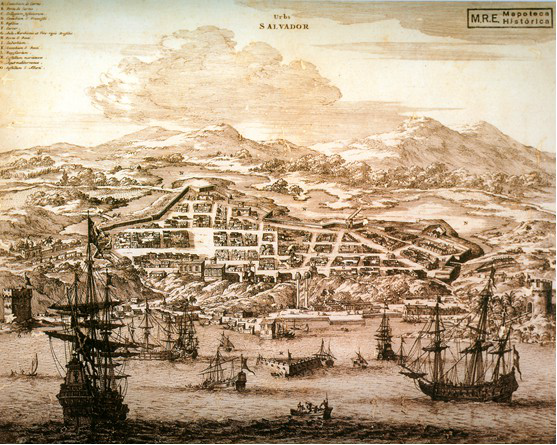
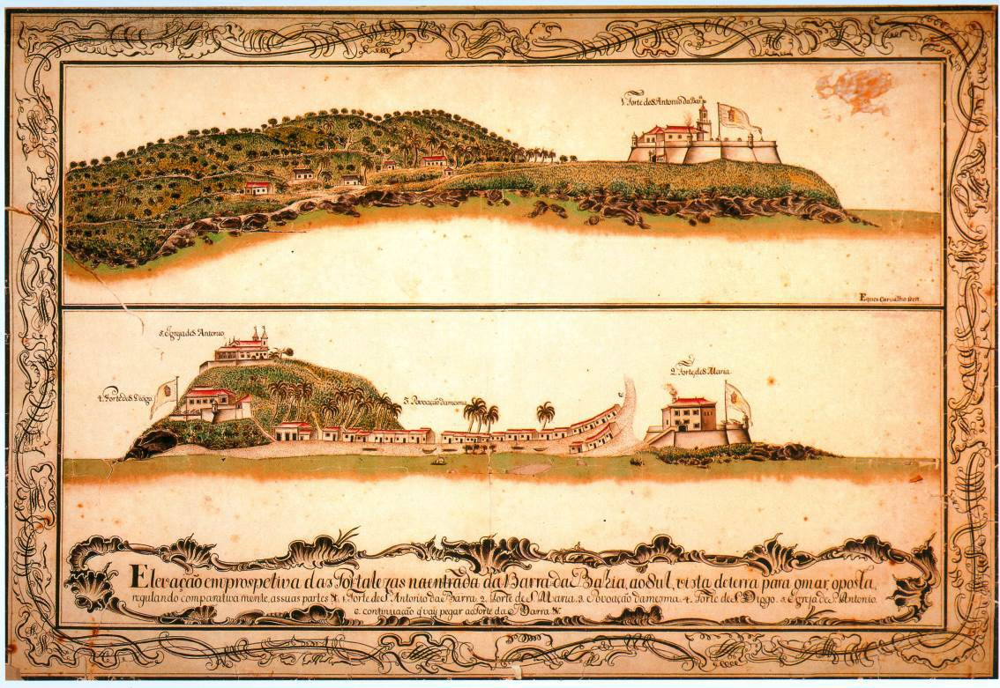
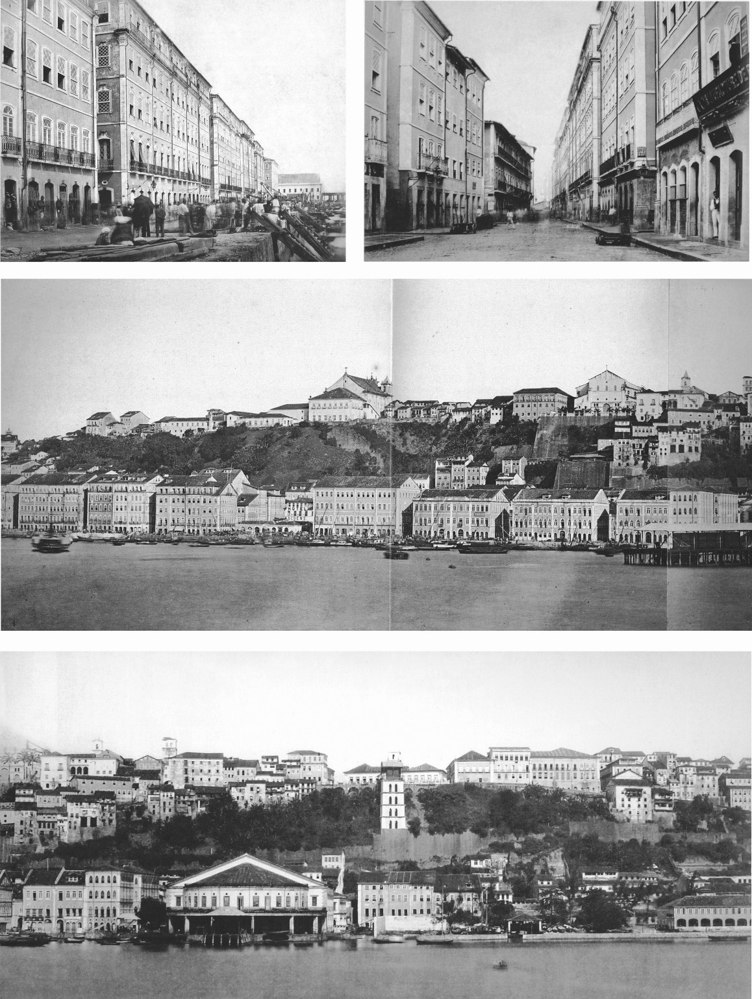

# Resumo

Muitos foram os elementos que contribuíram para configurar a paisagem
urbana de Salvador, bem como marcaram o desenvolvimento da sua
cenografia urbana até finais do século XIX. A conjunção de alguns
fatores que conformaram a imagem da cidade promoveria um equilíbrio
plástico coerente que caracterizaria os panoramas urbanos desfrutados da
Baía de Todos os Santos. Entre os elementos de maior relevância na
constituição da paisagem da primeira capital brasileira, se destacam as
vistas da encosta de Salvador (o frontispício da cidade) tomadas do mar
ou da Cidade Baixa. O visitante que adentrava a Baía de Todos os Santos
e desembarcava em seu núcleo central pelo porto, podia se deleitar com o
surgimento da área densamente habitada através da aparição do imponente
frontispício, tendo seu ponto culminante na altura do Forte de São
Marcelo -- alguns quilômetros após a idílica experiência de vislumbrar
as fortificações que marcavam a entrada da baía. Na parte baixa, os
diversos cais -- com destaque para os conjuntos de arquitetura regular
do Cais da Farinha e do Cais das Amarras, bem como a sequência de
edificações do Cais Dourado (mais à frente) --, contrastavam com a massa
verde da encosta do núcleo central, por sua vez coroada pela movimentada
linha horizontal formada pelos fundos irregulares das construções
encravadas no alto da falésia. Em meio a este panorama destacava-se, na
parte superior do frontispício, a antiga Catedral da Sé com sua fachada
monumental voltada para o mar, como a principal protagonista de um
cenário que reafirmava o papel da cidade como símbolo privilegiado do
poder da fé. Outros edifícios religiosos também apareceriam -- ao menos
parcialmente --, com suas torres voltadas de frente ou de costas para a
baía, não ameaçando, contudo, a presença hegemônica da antiga catedral
assentada no ponto médio do trecho mais densamente edificado.

Palavras-chave: Salvador, Cidade Baixa, frontispício, paisagem e
cenografia urbana.

# Abstract

Many were the elements that contributed to set the urban landscape of
Salvador, and marked the development of its dramatic scenery until the
late nineteenth century. The conjunction of several factors that shaped
the image of the city promotes a coherent plastic balance that
characterizes the panoramas to be enjoyed from the Baía de Todos os
Santos. Among the most relevant elements in the constitution of the
landscape of Brazil\'s first capital, we highlight the views of the
slope of Salvador (the *frontispício* of the city) taken from the sea or
the Cidade Baixa. The viewer that entered the Baía de Todos os Santos
and landed on its core by the harbor, could enjoy the emergence of
densely populated area through the appearance of the imposing façade,
with its peak at the place of the Forte de São Marcelo -- a few miles
after the idyllic experience to glimpse the fortifications that marked
the entrance to the bay. In the lower part, the various piers --
especially the architecture of sets of regular Cais da Farinha and Cais
das Amarras as well as the sequence of the buildings from Cais Dourado
-- contrasted with the green mass of the fault the central core, in turn
crowned by busy horizontal line formed by irregular funding of ingrown
buildings high on the cliffs. Amidst this

scenario is highlighted at the top of the *frontispício*, the old Se
Cathedral with its monumental façade facing the sea, as the main
protagonist of a scenario which reaffirmed the city\'s role as a
privileged symbol of the power of faith. Other religious buildings also
appear -- at least partially -- with its towers facing front or back of
the bay, not, however, threatening the hegemonic presence of the old
cathedral seated at the midpoint of the most densely built stretch .

Keywords: Salvador, Cidade Baixa, *frontispício*, landscape and urban
scenography.

Este artigo tem como tema a constituição da paisagem urbana da cidade de
Salvador -- primeira capital das possessões portuguesas nas Américas e
mais antiga povoação urbana fundada já com o status de "cidade", no
primeiro século de existência da colônia lusitana. A análise a ser
empreendida se limitará à área central do núcleo urbano e contemplará um
recorte temporal que se estenderá da sua fundação, em 1549, até finais
do século XIX. Neste contexto, interessa particularmente o papel do
frontispício da cidade na constituição de sua paisagem urbana, e como
seu teor dramático se preserva e se potencializa ao longo dos
oitocentos.

# Salvador ao tempo de sua fundação

A vida urbana não teria surgido nas Américas após a chegada, nas ilhas
do Caribe, do navegador genovês Cristóvão Colombo. Inúmeros aglomerados
populacionais, ligados às mais diversas e desenvolvidas civilizações
nativas, já despontavam ao longo do cenário americano pré-hispânico,
como importantes assentamentos humanos com indiscutíveis características
urbanas, configurando conjuntos monumentais complexos e heterogêneos,
ligados a poderosos grupos autóctones organizados -- núcleos que,
indubitavelmente, poderiam ser identificados como "cidades". Contudo, as
conquistas do México e do Peru, empreendidas por Cortés e Pizarro,
puseram um abrupto fim ao processo de desenvolvimento urbano posto em
prática pelas civilizações da América pré-colombiana. Em termos gerais,
pode-se dizer que estas nucleações urbanas ancestrais influíram pouco no
posterior projeto de ocupação do território conquistado, resultando em
um processo baseado, essencialmente, na fundação de cidades de matriz
europeia como mecanismos de exploração de vastos territórios.

Se nestas regiões -- já ocupadas por civilizações avançadas que se
desenvolviam há milênios e onde já existiam fortes tradições
arquitetônicas -- a transferência de princípios construtivos e
urbanísticos da Espanha metropolitana encontrou, através de uma
imposição vertical do *modos operandi* europeu, espaço de disseminação e
assimilação, dando às nucleações hispano-americanas uma imagem
fortemente marcada pela influência peninsular, esse mesmo processo no
Brasil, na época de domínio português, parece ter sido ainda mais direto
e implacável. Afinal, não se pode perder de vista que -- ao contrário
dos atuais territórios do México, da Guatemala, de Honduras, Peru,
Equador, Bolívia -- no Brasil inexistia qualquer vestígio de uma cultura
urbanística pré-portuguesa, assim como de tradições arquitetônicas e
construtivas mais sofisticadas (ou mais elaboradas) que as engenhosas
formas indígenas de edificação em cipó e palha. Se as edificações e
aldeamentos indígenas eram capazes de responder às necessidades de
construção de abrigos efêmeros adequados aos modos de vida dessas
populações, não se pode esquecer que os índios ainda estavam imersos --
do ponto de vista da cultura material -- no mundo neolítico.

Sendo assim, essas formas de edificar não atenderiam aos anseios de um
projeto colonizador que demandava a fixação de colonizadores europeus
para garantir a posse do território e a potencialização da exploração
das riquezas da terra. Ou seja, para a construção das cidades
luso-brasileiras e das suas edificações -- aqui se tratando mais
especificamente das Cidades Reais, ou seja, daquelas que desempenhavam
funções estratégicas no plano da administração portuguesa -- não havia
nenhum exemplo local a ser seguido, aproveitado ou mesmo confrontado
pelos saberes fincados na metrópole, que então encontravam novos campos
de expansão.

Logo, a cidade de Salvador nasceria *ex novo*, fruto de uma medida
político- administrativa da Coroa Portuguesa que fazia parte de um
processo de superação da primeira fase de ocupação pré-urbana, então
vivenciada no Brasil, através do desenvolvimento de um novo projeto
civilizador visando a transformação deste vasto território em um Estado.
Fundada em 1549, para ser a capital do Brasil e com objetivos de
assegurar a proteção do litoral contra invasões estrangeiras e de
estruturar político-administrativamente o funcionamento da colônia
depois da falência do sistema das Capitanias Hereditárias, a cidade se
consolidará no final do século XVI como o maior núcleo urbano construído
em território brasileiro, até então, bem como um centro comercial de
grande importância, vinculado à exportação de açúcar e à importação de
alguns produtos manufaturados, além de alimentos, função que
caracterizará a sua história durante todo o período colonial.

Salvador será fruto de um ato pensado, em que o lado racional de todo o
percurso do qual resultou evidencia-se no chamado Regimento de Tomé de
Souza, primeiro Governador Geral do Brasil, elaborado pelo Rei D. João
III, em 1548. Em função da sua significação simbólica enquanto sede do
poder português na América, e da sua consequente articulação mais direta
com a metrópole, é possível observar na sua configuração urbana uma
clara transposição de parâmetros ou elementos estético- construtivos de
viés metropolitano. Assim, a fundação da cidade assumirá grande
importância em diversos planos, visto que representará uma experiência
urbanística inovadora para o mundo lusitano na medida em que marcará, no
universo do projeto colonizador português, a transição para uma nova
era: pela primeira vez na história era transplantada, para além-mar,
"\[\...\] uma capital inteira". (MOREIRA, 2001)

Entre as incumbências prescritas no regimento de Tomé de Souza cabia a
construção da cidade em local estratégico, de modo a atender ao papel
que lhe estava determinado. A Baía de Todos os Santos, uma das maiores
do mundo, situada praticamente a meio caminho entre os limites norte e
sul do litoral do Brasil, configurava-se na localização mais indicada
para tal fim.

Apesar da existência de uma povoação precedente -- a Vila Velha do
Pereira, antiga sede da Capitania da Baía de Todos os Santos, localizada
no sítio conhecido atualmente como Porto da Barra -- Tomé de Souza e
Luís Dias[1](#_bookmark0), seguindo recomendações explicitadas no citado
Regimento, apenas a utilizaram como base das operações. Na verdade,
depois de estabelecidos em terra, escolheram uma área situada mais para
o interior da baía, onde a tranquilidade das águas e a existência de um
amplo platô, a mais ou menos 65 metros de altura, atenderiam de modo
mais pleno às prescrições do Regimento, além de possibilitar a
construção da cidade em dois níveis

-   uma Cidade Alta, destinada às zonas residenciais e administrativas,
    e a Cidade Baixa, voltada basicamente para as atividades portuárias
    --, reproduzindo um modelo comum à tradição urbanística portuguesa.

Com exceção da face oeste, que estava voltada para a encosta e o mar,
todo o recinto da Cidade Alta era cercado por muros, contando com dois
acessos principais por terra

-   um ao norte e outro ao sul --, onde a circulação era controlada.
    > Assim, assegurava-se

> []{#_bookmark0 .anchor}1 Embora tenha sido o mestre construtor,
> responsável pela implantação da cidade, possivelmente, Luis Dias foi
> apenas um executor, seguindo um projeto -- composto de traças e
> desenhos -- de autoria de Mi- guel de Arruda, arquiteto-mor das obras
> reais, em Portugal e todo o império. Sobre esse assunto reco- menda-se
> a leitura do artigo de autoria de Rafael Moreira, *O arquiteto Miguel
> Arruda e o primeiro pro- jeto para Salvador.* (MOREIRA, 2001)

a defesa do burgo por terra, principalmente das possíveis invasões dos
nativos que tentavam, em vão, evitar a ocupação do seu território
primitivo. Contudo, pouco tempo depois da fundação da cidade, os
religiosos jesuítas (1551), carmelitas (1586) e beneditinos (1582) se
implantaram fora dos limites murados, buscando dar maior eficiência aos
trabalhos de catequização do gentio e impulsionando rapidamente a
expansão da área urbanizada para o sul (beneditinos), e principalmente
para o norte, onde se estabelecerão os jesuítas e os carmelitas.

É especialmente na parte elevada do sítio escolhido para cidade onde
pode ser observado o grande esforço de organização que permeará a
implantação do núcleo urbano, reafirmando o pleno domínio da coroa
portuguesa na sua colônia americana. Não restam dúvidas quanto à
relativa regularidade formal do traçado desde os seus primeiros anos de
fundação, quebrada apenas pela configuração posterior de alguns bairros
periféricos, surgidos em torno de estabelecimentos conventuais que foram
implantados fora do perímetro murado da nucleação, a partir de 1580. É
certo que este traçado, tendente à ortogonalidade, não poderia ser
comparado com a obsessiva regularidade que seria desenvolvida, mesmo
antes da fundação de Salvador, no processo de criação de dezenas de
cidades na América hispânica -- particularmente os núcleos urbanos
concebidos como quadrículas rigorosamente homogêneas e
cartesianas[2](#_bookmark1).

Em outra direção, o plano preconcebido para a primeira cidade
brasileira, imaginada para ser a "cabeça do Brasil" no Novo Mundo,
deixaria margens para adaptações às características topográficas e
morfológicas do sítio, como se pode observar nas peças da iconografia
mais antiga da cidade de Salvador[3](#_bookmark2) -- e mesmo nos
registros atuais da área correspondente ao "Centro Histórico". É
claramente perceptível uma nítida adequação das vias e quarteirões à
irregularidade do relevo do terreno escolhido para implantação do núcleo
urbano, resultando não apenas na definição de quarteirões quadrados ou
retangulares de dimensões mais ou menos padronizadas, mas também de
outros com formas trapezoidais ou mesmo seguindo polígonos mais
complexos, com tamanhos variados.

Contudo, a maior flexibilidade do traçado não seria apenas decorrência
da implantação da cidade em uma zona de topografia bastante movimentada
e acidentada, bem como da clara dificuldade de adaptação de uma trama
regular nestas circunstâncias[4](#_bookmark3). Seu idealizador
(provavelmente o arquiteto português Miguel de Arruda) seguia uma
tradição lusitana que não privilegiava a geometria aprisionada e
inflexível dos *dameros* implantados nos territórios espanhóis do Novo
Mundo. Na verdade, a tradição de fundação e planificação de cidades
empreendida pelos portugueses aceitava as adaptações necessárias para um
mais apropriado processo de

> []{#_bookmark1 .anchor}2 Segundo Nicolini (2005, p. 29), o
> delineamento regular das cidades fundadas pelos espanhóis no Caribe,
> na Mesoamérica, nas Américas Central e do Sul aspiraria,
> gradativamente, a um esquema cada vez mais rigoroso, culminando na
> realização de um modelo de cidade que apresentará uma organização
> absolutamente cartesiana: a cidade projetada de forma quadrangular,
> com quarteirões e *plaza mayor* quadrados, assim como lotes urbanos
> também quadrangulares -- fruto da divisão das quadras em quatro
> *solares* de idênticas dimensões.
>
> []{#_bookmark2 .anchor}3 As mais remotas plantas de Salvador de que se
> tem conhecimento datam do início do século XVIl -- tendo em vista que
> as suas "traças" originais (que orientaram Tomé de Souza e Luís Dias
> na construção da cidade) desapareceram sem deixar registro.
>
> []{#_bookmark3 .anchor}4 Este princípio de adaptação estava claramente
> explicitado no Regimento de D. João III -- também chamado Regimento de
> Tomé de Souza -- que determinou e norteou a construção da cidade.

desenvolvimento do assentamento urbano -- pelo menos nos séculos XVI e
XVII. No que se refere à constituição da paisagem citadina, antes de ser
um retrocesso no sentido inabalável de ordenação -- que pode ser
capturado em uma cidade como Lima, por exemplo --, esta maior
flexibilidade contribuirá, imensamente, para a geração de significativos
e fascinantes panoramas, resultantes da constituição de cenários ricos
em dinamismo e dramaticidade, capturados dentro do seu ambiente urbano.

# O desenvolvimento urbano da cidade

A partir dos anos sessenta, ainda no século XVI, o cultivo da cana se
expandirá, praticamente, por toda a zona úmida litorânea que margeava os
rios do Recôncavo Baiano, tendo em vista as condições de solo e clima
das mais favoráveis e a abundância de água e madeira, fundamentais ao
processo de fabricação do açúcar[5](#_bookmark4). O açúcar produzido na
região era exportado por Salvador que, consequentemente, ao final do
mesmo século, acabará se consolidando como o mais importante porto da
colônia. O plantio de tabaco em outras áreas da circunvizinhança e sua
exportação, a partir do século XVII, dará ainda mais dinamismo ao porto
da capital que, a essa altura, era também um grande centro importador
dos mais variados produtos.

Salvador permanecerá durante muitos anos como o único entreposto de
gêneros alimentícios e produtos manufaturados trazidos de Portugal e
também como o maior mercado de escravos africanos do país.

Como centro econômico e político, Salvador passou a influenciar um
grande território, contando especialmente com o seu comércio para se
relacionar e dirigir um vasto espaço regional. Toda a produção de uma
grande área convergia para o centro urbano e daí partia para outros
horizontes, exportada através do seu porto, ficando um pequeno excedente
na cidade para o atendimento das demandas locais. Esse era o caso não só
do açúcar e do tabaco produzidos no Recôncavo desde os dois primeiros
séculos, mas também do algodão, do couro, do café e do ouro, que
passaram a ser trazidos do interior, principalmente a partir do século
XVIII.

O dinamismo da economia local também transparecia na estrutura
físico-urbana da cidade que, inicialmente, na sua parte alta era
limitada a um trapézio amuralhado, grosso modo, edificado entre a
Misericórdia, a Praça Castro Alves, os arredores da atual Rua Rui
Barbosa e o trecho da encosta. No entanto, já nos primeiros anos
subsequentes à sua fundação, a cidade ultrapassou esses limites em
direção ao norte, ocupando novas áreas em torno do Terreiro de Jesus,
configurando, ainda no final do século XVI, uma malha urbana
aproximadamente três vezes maior que a da mancha matriz construída por
Luís Dias (Fig. 1).

> []{#_bookmark4 .anchor}5 Embora inicialmente de consumo restrito à
> nobreza da época, logo o açúcar passa a fazer parte da ali - mentação
> de amplas camadas da população, constituindo a sua produção em um
> verdadeiro filão aurí- fero que viria justificar os vultosos
> investimentos necessários à sua fabricação.
>
> 
>
> Figura 1: Evolução física da cidade de Salvador.
>
> Acima: conjunto de plantas elaboradas pelo Centro de Estudos de
> Arquitetura da Bahia (CEAB) demonstrando o desenvolvimento do traçado
> da cidade. A primeira planta marca o ano de 1551, coincidindo com o
> plano levantado por Luis Dias. A segunda restitui o ano de 1553, e
> revela a ampliação do sistema defensivo na direção norte. A terceira,
> de 1580, demonstra a expansão do sistema viário para norte, com o foco
> central no Terreiro de Jesus. A última mostra a cidade em 1650, já
> alcançando as áreas do Mosteiro de São Bento (sul) e Forte de Santo
> Antônio Além do Carmo (norte).
>
> Abaixo: *Planta da restituição da Bahia*, confeccionada em 1631, pelo
> cosmógrafo português, João Teixeira Albernaz. Nota-se, à direita, o
> primeiro trapézio que marcava a área inicialmente urbanizada -- que
> finalizava na altura da Praça do Palácio, assinalada com o número 16.
> À esquerda, aparece a grande ampliação, que se configurará nas décadas
> subsequentes à fundação. Em destaque, o conjunto formado pelo Terreiro
> de Jesus e
>
> Largo de São Francisco.
>
> Fonte: Simas Filho (1998, p. 14, 15, 62).

As áreas incorporadas também foram protegidas por muros, que circundavam
todo o sítio urbanizado, com portas fortificadas nos acessos norte e sul
-- respectivamente Portas do Carmo, onde atualmente encontra-se o Largo
do Pelourinho, e Portas de São Bento, situadas no local da Praça Castro
Alves (Fig. 2). Complementava esse sistema defensivo a existência de
alguns baluartes em pontos estratégicos do perímetro murado, além de
dois fortes edificados nos arredores: Santo Antônio da Barra, na entrada
da baía, e Monte Serrat, na área mais ocidental da Península de
Itapagipe -- ambos construídos, em uma primeira versão, ainda no século
XVI.

A geografia do sítio contribuirá para que a distribuição dos usos
comerciais, residenciais e administrativos se estruture a partir de dois
eixos quase paralelos -- separados entre si pelo grande desnível da
encosta -- e assim definidos: na Cidade Baixa, ou Bairro da Praia,
praticamente em uma única via ao longo do mar, entre a Preguiça e a
parte baixa da Ladeira do Taboão, concentrava-se o grosso das
edificações destinadas às atividades comerciais, distribuídas em
armazéns, trapiches e similares; na Cidade Alta, em outro eixo também
paralelo ao mar, articulavam-se os principais edifícios relacionados às
atividades religiosas e administrativas.

Contudo, cabem aqui algumas considerações acerca desses eixos.
Primeiramente, não se pode deixar de registrar que no eixo
correspondente ao Bairro da Praia também havia residências, além de aí
se encontrar um dos mais antigos e importantes templos religiosos da
cidade: a Igreja de Nossa Senhora da Conceição da Praia. As atividades
comerciais aí agrupadas deviam ser prioritariamente aquelas relacionadas
diretamente às importações e exportações que se viabilizavam através do
porto. Por sua vez, o eixo de articulação das principais atividades
religiosas e administrativas e a sua vizinhança, na Cidade Alta, também
não excluía a presença de residências e da atividade comercial -- quer
fosse através das feiras que aconteciam nos largos e praças aí
existentes, quer fosse através da instalação de lojas comerciais. Estas
atividades se agrupavam, especialmente, no prolongamento do citado eixo,
tanto no sentido norte (pela via que ligava o Terreiro de Jesus às
Portas do Carmo), quanto no sentido sul (a partir da Rua Direita do
Palácio que ligava a Praça do Palácio às Portas de São Bento)

-- onde "\[\...\] concentravam-se as casas comerciais mais importantes,
as residências dos mais proeminentes cidadãos e diversos edifícios de
serventia pública, situação que a colocava como a via de trânsito
principal no recinto entre portas e nos acessos externos". (SIMAS FILHO,
1998, p. 90)

# A área comercial da Cidade Baixa

Cerca de cem anos depois de fundada, a malha urbana da cidade tinha
incorporado novas áreas, tornando-se a segunda cidade do Império
Português e perdendo em população e importância apenas para Lisboa. Com
a superação do perigo das invasões estrangeiras e a restauração da Coroa
Portuguesa, submetida à monarquia espanhola de 1580 a1640, teve início a
reconstrução e ampliação de importantes edifícios públicos e religiosos,
antes precariamente edificados. Nesse mesmo século, expandindo
significativamente o número de templos católicos já existentes, começa a
edificação de novas igrejas e dos mais monumentais solares legados pela
colônia.

Praticamente data do mesmo período a maior parte dos monumentos
arquitetônicos existentes no "Centro Histórico" de Salvador --
monumentos que viriam caracterizar a dramática e pujante paisagem da
cidade que se manteria em pleno equilíbrio e afirmação até finais do
século XIX.

> 
>
> Figura 2: *Urbs Salvador.* Planta elaborada na época da ocupação
> holandesa (provavelmente 1625) de autor desconhecido -- publicada,
> posteriormente, em 1671, no livro *De Nieuwe en Onbekende Weereld*, do
> holandês Arnoldus Montanus. É possível perceber a cidade se
> desenvolvendo acima da falha geológica, bem como a cinta murada de
> proteção construída no sentido leste. Logo após, aparece o dique dos
> holandeses, aberto no lugar do Rio
>
> das Tripas, atual Baixa dos Sapateiros. Fonte: Reis Filho (2000, p.
> 28).
>
> Muitos foram os elementos que contribuíram para configurar a paisagem
> urbana e marcaram o desenvolvimento da sua cenografia dramática até
> finais do século XIX. A conjunção de alguns fatores que conformaram a
> imagem da cidade promoveria um equilíbrio plástico coerente que
> caracterizaria os panoramas que serão desfrutados da Baía de Todos os
> Santos, das ladeiras e vias da povoação. Entre os elementos de maior
> relevância na constituição da paisagem da primeira capital brasileira,
> se destacam as vistas da encosta de Salvador (o frontispício da
> cidade) tomadas do mar ou da Cidade Baixa -- a área comercial, como já
> foi dito.
>
> A atividade comercial teve presença expressiva em Salvador. Diversos
> viajantes observarão que o comércio era uma atividade econômica
> bastante significativa nas ruas da cidade, especialmente nas
> imediações do porto, onde também se registrava a existência de
> inúmeras iniciativas ligadas à prestação de serviços. (PYRARD DE
> LAVAL, 1862, p. 227) Observações sobre a importância do comércio na
> Bahia, de maneira direta ou indireta, eram sempre feitas por
> estrangeiros que estiveram em Salvador ao longo do século XVII,
> chegando William Dampier[6](#_bookmark5), em 1699, a afirmar que a
> cidade era de notável comércio, após registrar em seu porto "\[\...\]
> mais de trinta
>
> []{#_bookmark5 .anchor}6 Corsário e navegador inglês, Wiliam Dampier
> (1652-1715) participou de *"\[\...\] viagens de pirataria e serviu ao
> almirantado inglês em navegações de descobrimento e exploração"*. Em
> março de 1699, Dampier esteve na Bahia onde permaneceu por um mês em
> viagem oficial, comandando o Roebuck, um navio da frota regular da
> coroa inglesa. (RODRIGUES, 1970. p. 31)

navios que traficavam com a Europa, afora os barcos que negociavam com a
África e os que faziam o transporte para outras praças brasileiras".
(RODRIGUES, 1970. p.

31\)

Como a ligação da cidade com a sua *hinterland* se dava, principalmente,
a partir da navegação na Baía de Todos os Santos, mesmo grande parte do
comércio de gêneros alimentícios tendia a se concentrar nas proximidades
da zona portuária, situação que irá perdurar até os anos sessenta do
século XX, quando se efetivaram ligações rodoviárias mais eficientes com
as zonas produtoras do Recôncavo[7](#_bookmark6).

A consolidação desse processo de implantação da atividade comercial na
Cidade Baixa se dará, inicialmente, em uma massa edificada levantada ao
longo da estreita faixa de terra alinhada à praia -- ainda muito
rarefeita no início dos Setecentos. De fato, segundo Nestor Goulart Reis
Filho, (1997, p. 222) "\[\...\] havia apenas umas poucas construções, ao
pé da colina e, a seguir, o mar". Contudo, a prosperidade do comércio
nesta mesma centúria implicará na construção de diversos aterros,
contribuindo para a ampliação paulatina da área urbanizada dos arredores
do porto. Nestas novas áreas conquistadas ao mar, diversos conjuntos
edificados se sucederão, engastados nas margens da baía, conformando
modernos e imponentes cais, erguidos desde meados dos Setecentos. Estas
iniciativas não só ampliarão a área deste trecho tão importante para a
dinâmica econômica da cidade, bem como colaborarão para tornar a
arquitetura e a paisagem urbana da Cidade Baixa mais imponente e regular
-- especialmente para o viajante que acorria ao núcleo central através
do porto, após navegar pelo interior da baía desde sua entrada anunciada
pelo Forte de Santo Antônio da Barra.

Um primeiro complexo de sobrados comerciais de arquitetura homogênea
será construído no aterro do denominado Cais da Farinha, em meados do
século XVIII, produzindo um grande impacto para a constituição
cenográfica da encosta. Esta eloquente estrutura urbana se assemelhava
com um tipo de intervenção muito comum no período barroco, ação baseada
no desenho de um encadeamento de edifícios idênticos, alinhados e
distribuídos ao longo da calha de uma importante via ou das faces de uma
praça ligada ao poder real. No caso do Cais da Farinha, a sequência de
edificação estava inusitadamente voltada para o mar, bem como para a rua
interna que, anteriormente, se configurava como a via que margeava a
praia. Neste sentido, o complexo arquitetônico seria constituído por
"\[\...\] um conjunto de quadras, compostas com edifícios de mesmo
número de andares e mesmo acabamento externo, à exceção de alguns
detalhes decorativos. Os pisos e as aberturas eram nivelados entre si,
de tal sorte que a impressão para o observador era a de um único prédio,
em cada quadra". (REIS FILHO, 1997, p. 221)

Poucas décadas depois, estes edifícios serão sobrepostos pelo grandioso
conjunto de inspiração pombalina do Cais das Amarras, levantado em outro
aterro do início dos Oitocentos. (REIS FILHO, 1997, p. 226) Construído
por iniciativa do Conde dos Arcos e inaugurado em 1816, este complexo
urbanístico-arquitetônico correspondia a mais de dez quadras, incluindo
uma praça central que acolheria o Marcado de Santa Bárbara. (SAMPAIO,
2005, p. 32) Tinha como limite norte, a antiga Praça do Comércio, ou
Praça Riachuelo, (REBOUÇAS, FILHO, 1979, p. 66) onde se

> []{#_bookmark6 .anchor}7 As maiores feiras livres da cidade (São
> Joaquim e Água de Meninos), assim como os principais e mais antigos
> mercados públicos (Mercado Modelo e Mercado do Ouro) se localizaram na
> Cidade Bai- xa.

localizaria o monumental edifício neoclássico da Associação Comercial --
inaugurado em 1817, construído também pelo Conde dos Arcos, no local do
demolido Forte de São Fernando. (FERREZ, 1989, p. 46) Ao sul,
complementava e finalizava o conjunto a rotunda lançada ao mar do prédio
neoclássico da Alfândega, levantado em 1860 -- o atual Mercado Modelo.

Fotos do século XIX mostram um conjunto arquitetônico absolutamente
regular, voltado para a Baía de Todos os Santos, formado por altos
sobrados de três a cinco pavimentos -- construções semelhantes àquelas
erguidas na Baixa Pombalina de Lisboa, após o terremoto de
1755[8](#_bookmark7). À frente destes, delimitando o mar, abria-se uma
rua estreita e o cais com suas escadas de acesso. Os edifícios que
compunham cada quarteirão apresentavam o mesmo gabarito e uma idêntica
modenatura arquitetônica, com suas marcações e ritmo das fenestrações
coincidentes, dando a ideia de uma única grandiosa e eloquente estrutura
lançada nas quadras. Para além disto, os casarões ocupavam a totalidade
do lote que se estendia por toda a largura do quarteirão; suas fachadas
voltadas para o mar e para a via posterior -- a Rua Nova do Comércio --
receberiam igual tratamento, em arranjo que privilegiava os vazios aos
cheios, como era comum neste tipo de arquitetura de raiz iluminista.
Seguindo um esquema que se tornaria corrente na arquitetura da cidade
após a metade do século, as fachadas laterais dos casarões de esquina
tinham suas empenas arquitetonicamente tratadas com sequências de vãos
-- os chamados oitões.

Em um vasto trecho -- de largura bem generosa -- da Rua Nova do
Comércio, se assinalava o confronto do conjunto remanescente do Cais da
Farinha com aquele do Cais das Amarras (em lados opostos da via). Assim,
nos Oitocentos, um dos segmentos mais importantes da Cidade Baixa (o
atual Bairro do Comércio) se configurará através do somatório de
diversas linhas de aterros e conjuntos arquitetônicos regulares, até
alcançar as edificações que se distribuíam nas margens da praia -- já
desaparecida neste trecho da baía.

# Conclusão: o marcante frontispício da cidade e a potencialização do espírito dramático da encosta no Século XIX

Estas intervenções, viabilizadas por grandes investimentos coordenados
pelo poder público, demonstravam -- para além do zelo com o centro
comercial da cidade, que cada vez mais se consolidava com o avançar do
século XIX -- a importância atribuída ao mais inusitado acontecimento
cenográfico de Salvador: seu frontispício. De fato, a situação
geográfica particular que comandava a apreensão do núcleo central da
cidade

-- percepção derivada do grande desnível que se revelava entre a parte
alta da falha geológica e a antiga linha da praia com seus aterros
sucessivos ao nível do mar --, atribuía um valor paisagístico
incondicional à escarpa que protegia a cidade nos primeiros séculos de
ocupação.

Ou seja, o visitante que adentrava a Baía de Todos os Santos e
desembarcava em seu núcleo central pelo porto, podia se deleitar com o
surgimento da área densamente habitada através da aparição do imponente
frontispício, tendo seu ponto culminante na altura do Forte de São
Marcelo -- alguns quilômetros após a idílica experiência de vislumbrar
as fortificações que marcavam a entrada da baía (Fig. 3). Na parte
baixa,

> []{#_bookmark7 .anchor}8 Os casarões de cinco pisos seriam mais
> frequentes, mas eram fruto de uma posterior ampliação de edifícios
> levantados originalmente com quatro pavimentos.

os diversos cais -- com destaque para os conjuntos de arquitetura
regular do Cais da Farinha e do Cais das Amarras, bem como a sequência
de edificações do Cais Dourado (mais à frente) --, contrastavam com a
massa verde da encosta do núcleo central, por sua vez coroada pela
movimentada linha horizontal formada pelos fundos irregulares das
construções encravadas no alto da falésia.

Em meio a este panorama destacava-se, na parte superior do frontispício,
a antiga Catedral da Sé com sua fachada monumental voltada para o mar,
como a principal protagonista de um cenário que reafirmava o papel da
cidade como símbolo privilegiado do poder da fé[9](#_bookmark8).
Estrategicamente situada em local elevado, daí a Sé dominava o amplo
visual da Baía de Todos os Santos, ou seja, o verdadeiro elo de
articulação a partir do qual podia estender sua ação pastoral ao vasto
universo religioso sob sua jurisdição, que chegou a compreender não só
os limites territoriais da colônia lusitana em solo americano, mas
também zonas de colonização portuguesa na costa africana. Outros
edifícios religiosos também apareceriam -- ao menos parcialmente --, com
suas torres voltadas de frente ou de costas para a
baía[10](#_bookmark9), não ameaçando, contudo, a presença hegemônica da
antiga catedral assentada no ponto médio do trecho mais densamente
edificado.

Competindo com a imagem da antiga catedral e sua imponente fachada, um
último acontecimento dramático aparecerá na Cidade Alta, na parte
superior do frontispício de Salvador, nas últimas décadas do século XIX:
a vista desafogada da Praça do Palácio, o centro cívico da cidade. Além
de sediar os dois principais edifícios ligados ao poder do Estado, a
Casa de Câmara e Cadeia e o Palácio dos Governadores -- monumentos que
seriam gradativamente reconstruídos, ampliados e aformoseados com o
decorrer dos séculos --, a Praça do Palácio se destacava pela situação
de dilatação espacial resultante da grande janela aberta ao cenário
natural da baía, constituindo um dos mais belos panoramas capturados na
parte superior da cidade.

Sabe-se que nas primeiras décadas após a fundação, a face oeste da atual
Praça Tomé de Souza estava totalmente liberada, abrindo-se ao vazio que
expunha o panorama para a baía, como fica claro no relato de Gabriel
Soares de Souza de 1584: "Está no meio desta cidade uma honesta praça,
\[\...\] a qual da banda do poente está desafogada com uma grande vista
para o mar onde estão assentadas algumas peças de artilharia pesada,
donde a terra vai muito a pique sobre o mar ao longo do qual rochedo mui
áspero." (SOUZA apud FLEXOR, PARAGUAÇU, 2001, p. 105) Contudo, para além
deste primeiro instante do desenvolvimento urbano de Salvador, com o
decorrer dos anos, construções ligadas à administração pública foram
obstruindo a vista, parcialmente ou mesmo totalmente -- com destaque
para a Casa da Relação e a Casa da Assembleia Provincial.

> []{#_bookmark8 .anchor}9 Salvador, além de capital
> político-administrativa da colônia, era também a sua capital
> religiosa, tendo sido a sede da primeira diocese (1551) e,
> posteriormente, arquidiocese (1676) do Brasil -- sendo que o arcebispo
> de Salvador é ainda hoje o Primaz do Brasil.
>
> 10 []{#_bookmark9 .anchor}Poder-se-ia citar: a fachada da Igreja da
> Conceição da Praia (em alguns momentos da sua história, parcialmente
> interrompida); o frontispício da Igreja do Mosteiro de São Bento; o
> campanário da Igreja da Santa Casa da Misericórdia; o imponente fundo,
> bem como as baixas torres, da igreja dos jesuítas; a grande
> concentração de torres formada a norte pela conjunção das vistas da
> Igreja do Santíssimo Sacra - mento do Passo, além das Ordens Primeira
> e Terceira do Carmo; o par de campanários da Capela do Boqueirão; a
> torre única da Matriz de Santo Antônio Além do Carmo -- só para expor
> algumas daquelas igrejas encravadas no topo da falésia ou no campo de
> visão do núcleo central.
>
> 
>
> Figura 3: *Elevação em prospetiva das Fortalezas da entrada da Barra
> da Bahia, ao Sul, vista de terra para o*
>
> *mar, oposta, regulando comparativamente, as suas partes.* Desenho de
> Eques Carvalho, provavelmente do último quartel do século XVIII. Na
> imagem, acima, aparece o Forte de Santo Antônio da Barra, na entrada
> da baía, na Ponta do Padrão, já com o primeiro farol. A imagem de
> baixo, por sua vez, mostra a Praia do Porto da Barra com o Forte de
> Santa Maria, à esquerda, o de São Diogo, à direita e, acima, a Igreja
> de Santo Antônio da Barra.
>
> Também revela, ao centro, o povoado da Vila Velha do Pereira.
>
> Fonte: Reis Filho (2000, p. 52).
>
> Esta situação de clausura da Praça Municipal duraria mais de dois
> séculos quando, na segunda metade do XIX, a face oeste do largo foi
> gradativamente reaberta com a intenção de ampliar a praça e liberar a
> vista para o mar. Segundo Consuelo Sampaio, o presidente da Província
> da Bahia, Francisco Gonçalves Martins, futuro Visconde de São
> Lourenço, em 1852 "\[\...\] afirmou que, para 'o aformoseamento da
> Cidade', seria necessário 'demolir o edifício da Relação e a Casa da
> Assembléia Provincial'. \[\...\] Esta sugestão do visconde precedeu,
> em 17 anos, o pedido de demolição da Casa da Relação feito por Antônio
> de Lacerda, em 1869, para a construção do Elevador Hidráulico da
> Conceição". (SAMPAIO, 2005, p. 69) Ou seja, na década de 1870 o espaço
> já se veria totalmente liberado em sua face ocidental -- também
> atendendo ao objetivo de permitir a edificação do primeiro ascensor
> hidráulico da cidade.
>
> Para a vista do frontispício, as demolições colocarão este trecho do
> núcleo central em profundo destaque, já que, anteriormente, a Praça do
> Palácio era muito pouco reconhecível nos panoramas -- por estar
> perdida nos fundos das edificações que compunham a crista da falésia.
> A torre central da Casa de Câmara e Cadeia passará a despontar no eixo
> central da janela aberta ao mar com a demolição das construções que
> encerravam a praça -- na mesma linha em que aparecerá, logo à frente,
> a estrutura do Elevador da Conceição. Desta forma, o poder oficial,
> simbolicamente comandado pelo Paço Municipal e pelo Palácio dos
> Governadores, disputará espaço com a imagem secular da antiga Sé --
> que na época não era mais a Catedral de Salvador. Para além disso, a
> derrubada da Casa da Relação e da Casa da Assembleia Provincial,
> somadas ao vasto plano de construção do conjunto pombalino do Cais das
> Amarras, demonstram como as ações de remodelamento urbano do século
> XIX contribuíram, imensamente, para ampliar o caráter cenográfico da
> paisagem de Salvador (Fig. 4).
>
> 
>
> Figura 4: Sequência de fotografias do século XIX mostrando
> intervenções urbanas do início e meados dos oitocentos, bem como seu
> impacto nos panoramas capturados do frontispício da cidade. Acima, à
> esquerda: o Cais das Amarras, com sua arquitetura pombalina regular.
> Notar, ao fundo, a antiga Alfândega, atual Mercado Modelo. Fotografia
> de Benjamin Mulock, 1860. Acima, à direita: a Rua Nova do Comércio,
> onde se percebe, à esquerda, sequência de edificações que outrora
> faziam parte do Cais da Farinha; do lado oposto, os altos sobrados de
> cinco pavimentos do Cais das Amarras. Fotografia de Benjamin Mulock,
> 1860. Ao meio: Imagem do frontispício de Salvador, com destaque para o
> conjunto regular do Cais das Amarras e, na crista da encosta, a
> arquitetura irregular do fundo das edificações encravadas na falha
> geológica. Também em grande destaque aparece a antiga Catedral da Sé,
> voltada de frente para a Baía de Todos os Santos. Fotografia de
> Benjamim Mulock, 1860. Abaixo: panorama do frontispício de Salvador
> com destaque à janela aberta na segunda metade do século XIX que
> liberou a vista Praça do Palácio; no eixo do vazio da Praça coincidem
> o Elevador da Conceição e a torre da Casa de Câmara e
>
> Cadeia. Fotografia de Marc Ferrez, 1875. Fonte: Ferrez (1988, p. 41,
> 44, 32, 133).

# Referências bibliográficas

> FERREZ, Gilberto. **Bahia. Velhas Fotografias 1858 / 1900.** Rio de
> Janeiro, Kosmos / Salvador: Banco da Bahia Investimentos S. A., 1988.

FLEXOR, Maria Helena Ochi; PARAGUAÇU, Marcos. A Praça Municipal da
cidade de Salvador. In: TEIXEIRA, Manuel C. (org) **A praça na cidade
portuguesa.** Lisboa: Livros Horizonte, p. 103-120, 2001.

MOREIRA, Rafael. O arquiteto Miguel Arruda e o primeiro projeto para
Salvador. In: **Anais do IV Congresso de História da Bahia.** Salvador:
Instituto Geográfico e His- tórico da Bahia (IGHBA) e Fundação Gregório
de Matos (FGM), v. 1, p. 123-147, 2001.

> NICOLINI, Alberto. El tipo urbano cuadricular en el espacio y en el
> tiempo de los Andes sudamericanos. In: **Repenser les limites:
> l'architecture à travers l'espace, le temps et les disciplines.**
> Paris: l'Institut national d'histoire de l'art (Paris) et la Society
> of Architectural Historians (Chicago), 2005.
>
> PYRARD DE LAVAL, Francisco. **Viagem de Francisco Pyrard de Lavall
> (1601 a 1611).** Vertida do Francez em Portuguez sobre Edição de 1679.
> Correcta accrescentada com algumas notas por Joaquim Heliodoro de
> Cunha Rivara. Nova Goa: Imprensa Nacional, 1862.
>
> REBOUÇAS, Diógenes; FILHO, Godofredo. **Salvador da Bahia de Todos os
> Santos.** Salvador: Fundação Oldebrecht, 1985.
>
> REIS FILHO, Nestor Goulart. **Evolução urbana no Brasil. 1500-1720.**
> São Paulo : Editora Pini, 2001.
>
> REIS FILHO, Nestor Goulart. **Imagens de vilas e cidades do Brasil
> colonial.** São Paulo : Editora da Universidade de São Paulo, Imprensa
> Oficial do Estado, FAPESP, 2000.

REIS FILHO, Nestor Goulart. Notas sobre o urbanismo barroco no Brasil.
In: ÁVI- LA, Affonso. (org) **Barroco. Teoria e Análise.** São Paulo:
Perspectiva, p. 217-232. 1997.

> RODRIGUES, José Honório. **Historia e historiografia.** Petrópolis:
> Editora Vozes Limitada, 1970.
>
> SAMPAIO, Consuelo. **Cinqüenta anos de urbanização. Salvador da Bahia
> no sécu- lo XIX.** Rio de janeiro: Versal. 2005.
>
> SIMAS FILHO, Américo. (cord) **Evolução física de Salvador.
> 1549-1800.** Salvador : Centro de Estudos de Arquitetura da Bahia
> (CEAB) e Fundação Gregório de Matos (FGM), 1998.
