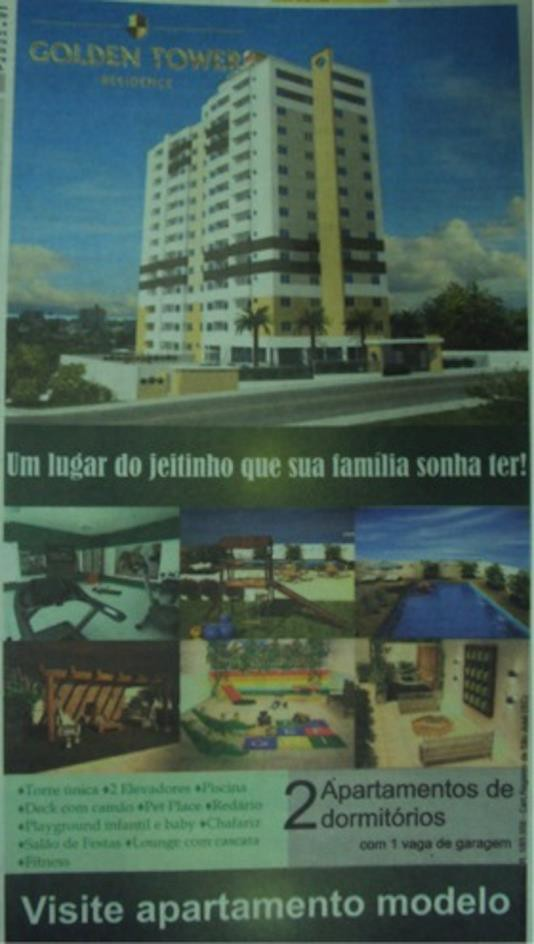
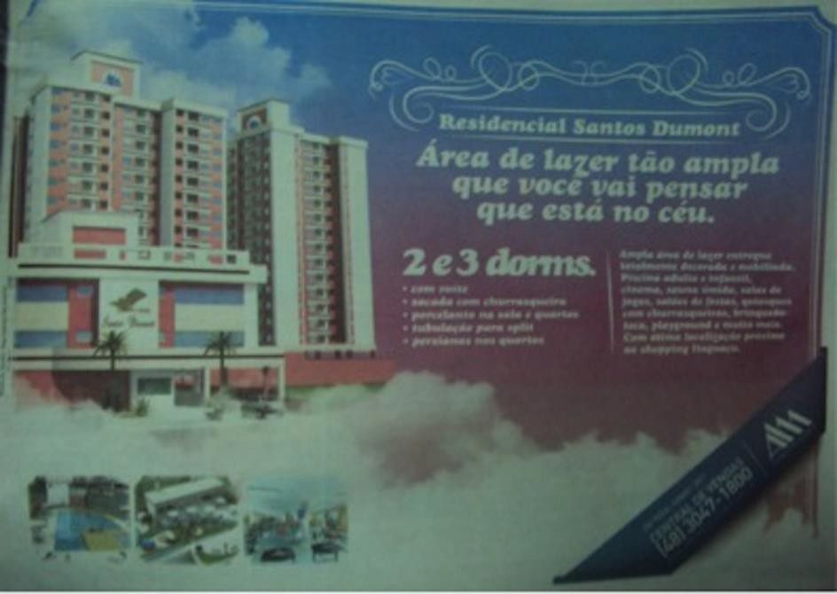
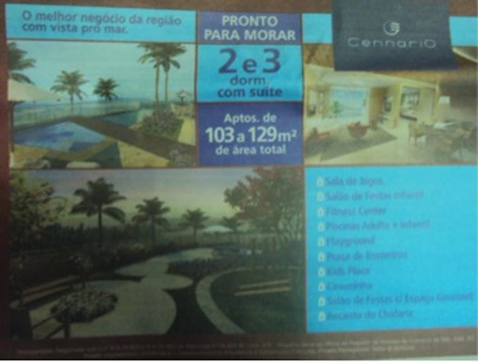
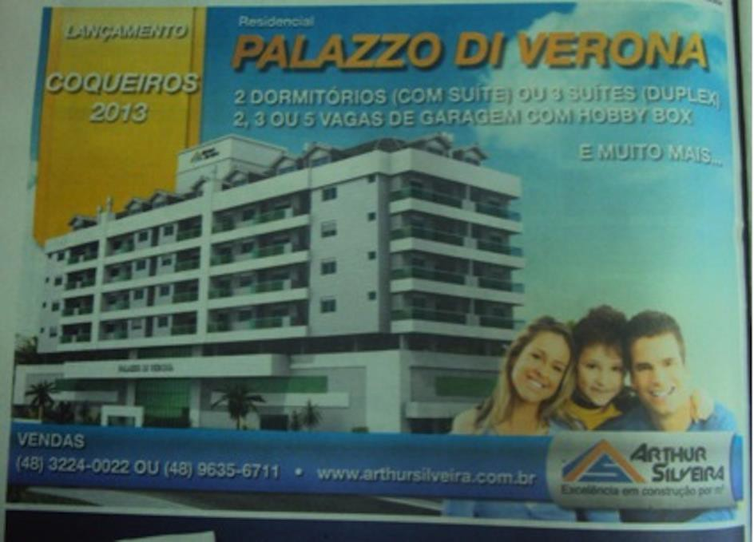
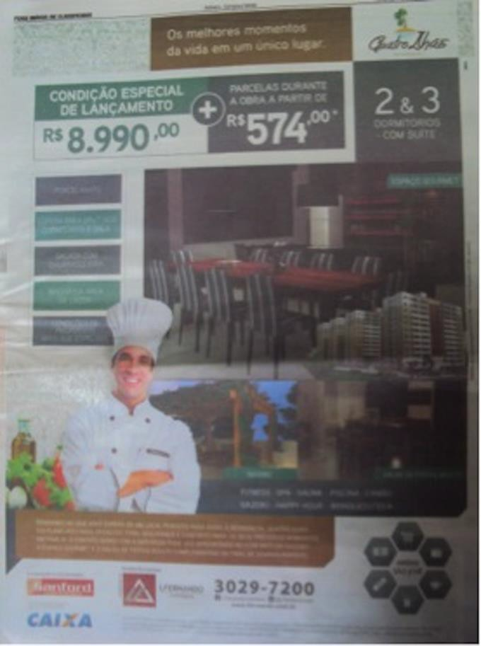
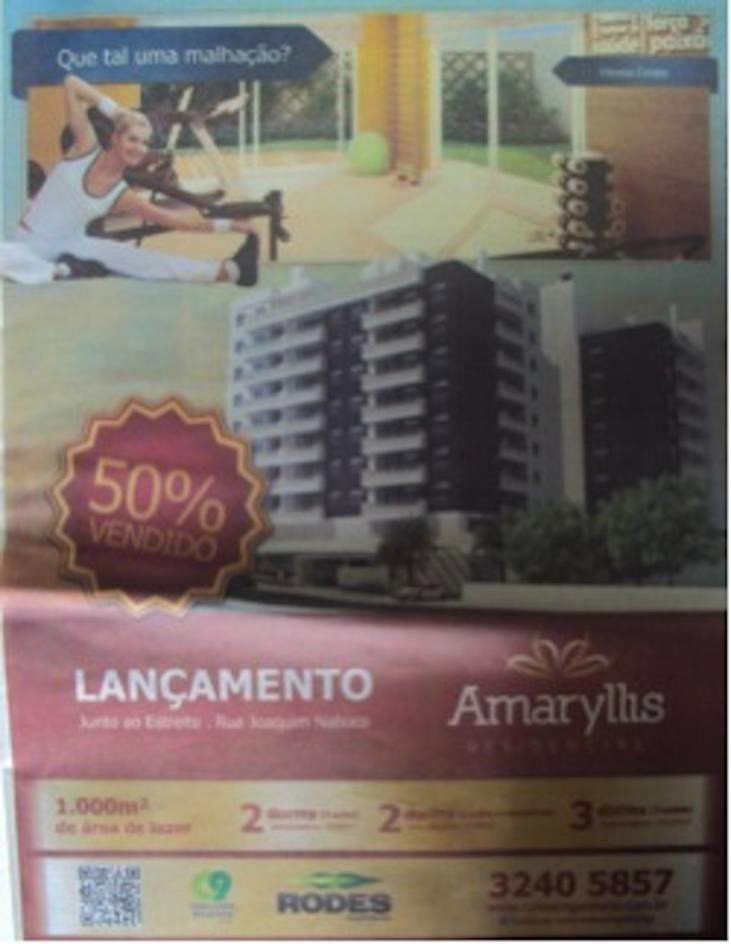
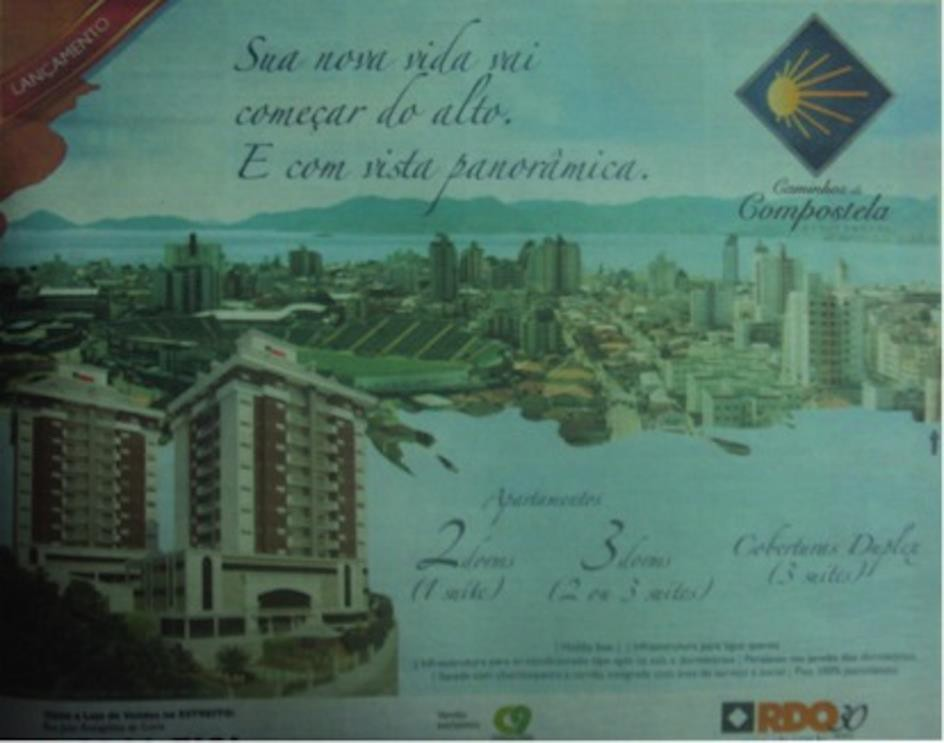
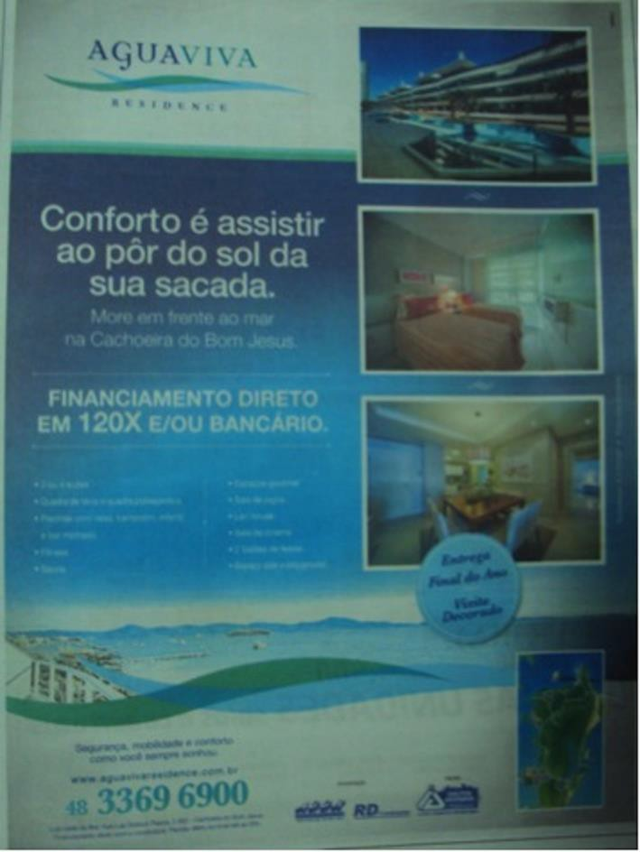
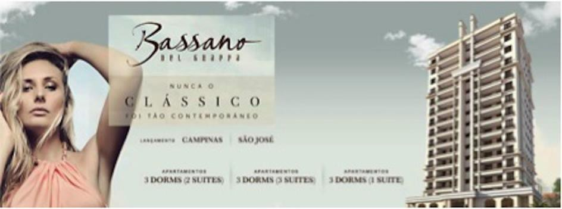

# Resumo

O artigo objetiva desvendar a crescente utilização de uma linguagem
histórica pretérita na arquitetura contemporânea do litoral de Santa
Catarina e os apelos publicitários ao passado utilizados por seus
anúncios propagandísticos. O acompanhamento dos anúncios publicados no
jornal Diário Catarinense no ano de 2013 revelou que o passado vem sendo
abordado pelo marketing imobiliário através de duas vertentes
principais. A primeira se encaminha para a questão da segurança e da
tranquilidade representadas pelos portões, grades e muros que atribuem
aos condomínios fechados um aspecto de fortaleza. A esta ideia estão
atreladas a qualidade da localização e dos espaços de lazer internos aos
empreendimentos. A segunda se dá pela referência às linguagens
arquitetônicas pretéritas.

Palavras-chave: Marketing imobiliário, Linguagem arquitetônica, Estética
do Passado, Santa Catarina

# Abstract

The article aims to unravel the increasing use of a past historical
language in contemporary architecture of the coast of Santa Catarina and
advertisers appeals to the past used by their ads. The monitoring of the
ads in the newspaper Diário Santa Catarina in 2013 revealed that the
past has been approached by the real estate marketing through two main
strands. The first moves towards the issue of security and tranquility
represented by gates, fences and walls that attach to condominium an
aspect of fortress. To this idea are linked the location and quality of
the internal spaces of leisure. The second is the reference by past
architectural languages.

Key-words: Real Estate marketing, Architectural language, Aesthetics of
the Past, Santa Catarina

# Introdução

Os escritos que seguem buscam desvendar a crescente utilização de uma
linguagem histórica pretérita na arquitetura contemporânea do litoral de
Santa Catarina - com forte conotação nostálgica e por vezes bucólica - e
os apelos publicitários ao passado utilizados por seus anúncios
propagandísticos. Para tanto, durante o ano de 2013 foram garimpados
estes anúncios no jornal de maior circulação no estado, o Diário
Catarinense, do grupo RBS. Como aporte teórico, buscou-se trabalhos de
apoio no campo da história e teoria da arquitetura, principalmente
aqueles com enfoque estético.

O presente artigo expressa, portanto, as reflexões iniciadas no sentido
de demonstrar como e com quais pretensões a estética do passado vêm
sendo explorada pelo capital imobiliário contemporaneamente no estado de
Santa Catarina. Além disso, busca-se lançar algumas ideias sobre o uso
da propaganda no campo da arquitetura partir da identificação das
qualidades das edificações que são expostas através dos anúncios.

Escolheu-se a expressão "estética do passado" para reforçar uma das
constatações da pesquisa, a saber, que o passado é explorado de maneira
superficial, estereotipada e, na verdade, a-histórica pelos
empreendedores imobiliários contemporâneos. Os imóveis, notadamente de
alto padrão, são valorizados através de características passadistas que
remetem a uma visão idealizada da história, uma história glamorosa e
harmônica. Configuram-se como promessas de felicidade, uma fuga
temporária do conflito urbano.

O acompanhamento dos anúncios publicados no jornal Diário Catarinense no
ano de 2013 revelou que o passado vem sendo abordado pelo marketing
imobiliário através de duas vertentes principais. A primeira se
encaminha para a questão da segurança e da tranquilidade representadas
pelos portões, grades e muros que atribuem aos condomínios fechados um
aspecto de fortaleza. A esta ideia estão atreladas a qualidade da
localização e dos espaços de lazer internos aos empreendimentos. A
segunda se dá pela referência às linguagens arquitetônicas pretéritas.
Observa-se, no entanto, que estas linguagens são utilizadas de maneira
dissimulada pelo empreendedor imobiliário e pelo arquiteto, já que além
de deslocadas no tempo, estas formas também frequentemente estão
desconectadas do contexto urbano.

# Dois lugares seguros

> "Nas grandes cidades do pequeno dia-a-dia O medo nos leva a tudo,
> sobretudo a fantasia Então erguemos muros que nos dão a garantia De
> que morreremos cheios de uma vida tão vazia"
>
> (Muros e Grades, Humberto Gessinger).

Um dos principais aspectos abordados pela arquitetura contemporânea é a
segurança, questão evidente quando se trata de condomínios fechados.
Paralelo a isto emerge a visão da cidade como um lugar perigoso,
barulhento, poluído, onde o trânsito é caótico e a violência predomina.
Por isso, ocorre a busca materializada do isolamento que só é possível,
paradoxalmente, graças à conexão e a autossuficiência desenvolvida
dentro destes espaços, que passam a oferecer tudo que entende-se como
necessário ao dia-a-dia de um indivíduo. Assim, o convívio com o
exterior (com a cidade) se torna desnecessário, contribuindo para o
esvaziamento dos espaços públicos e agravando a imagem das ruas como
lugares inseguros.

Contraditoriamente, os muros levantados no entorno desses
empreendimentos, que deveriam ser o símbolo máximo de proteção dos
mesmos, acabam se tornando frágeis, pois a limitação visual por eles
causada alimenta a insegurança dos que ali dentro vivem.

Em relação ao profissional arquiteto, o discurso da segurança tem um
significado atrelado ao comodismo. Observa-se que muitos arquitetos e
empreendedores imobiliários procuram investir em "formas garantidas",
construindo edificações que já tiveram sucesso no passado, ou seja, são
tidas como referência de soluções estéticas bem sucedidas. Como exemplo
claro disto, tem-se o uso da linguagem clássica, como foi bastante
observado nas propagandas coletadas.

Esse processo causa uma notável crise na arquitetura contemporânea:
mesmo havendo inúmeras possibilidades de se inovar (em termos de
materiais, tecnologias, conceitos), o mercado persiste em apresentar
aparências do passado para garantir a venda de seus empreendimentos.

# Valorização dos espaços sociais dentro dos edifícios: lazer e estilo de vida

Ficou muito evidente nas propagandas coletadas o valor que se dá
atualmente aos espaços sociais dos condomínios, deixando de lado
aspectos que antigamente eram importantes, como planta baixa, acessos e
dimensões.

No anúncio abaixo (Figura 1) fica nítida a tentativa de seduzir o
público para estes espaços de convivência. Temos uma única imagem do
edifício, seis imagens dos espaços sociais e nenhuma planta-baixa dos
apartamentos. Ou seja, a intenção da construtora é vender estilos de
vida - atraindo olhares facilmente impressionados de futuros compradores
- e não os apartamentos em si. Além disso, observa-se a procura por um
condomínio autossuficiente, garantindo o comodismo dos moradores.
Nota-se também o sugestivo nome do edifício -- Golden Tower --
reafirmando o alto padrão e sofisticação deste, como sendo uma torre de
ouro.

> 
>
> Figura 1 -- Anúncio Golden Tower. Fonte: DIÁRIO CATARINENSE, 2013.

No anúncio que segue (Figura 2) também observamos a incessante obsessão
pelos espaços de lazer dentro do condomínio, sendo este colocado como
elemento principal no texto de propaganda, que inclusive menciona a área
como ampla o suficiente para "se sentir no céu", uma alusão ao nome do
residencial: Santos Dumont.

> 
>
> Figura 2 -- Anúncio Santos Dumont. Fonte: DIÁRIO CATARINENSE, 2013

Na propaganda que segue (Figura 3) a preferência pelos espaços de lazer
(que estão, inclusive, presentes numa longa e prolixa lista) é tão
enfatizada que até mesmo esquece-se de

mostrar o edifício em questão, ou seja, a arquitetura realmente pouco
importa. O nome do residencial provavelmente se trata de uma variação da
palavra cenário: o emprego de duas letras "n" ao invés de apenas uma e a
retirada do acento agudo (cennario) confere um aspecto de estrangeirismo
a denominação, ou seja, é mais uma tentativa de sofisticar a moradia que
se vende.

> 
>
> Figura 3 -- Anúncio Cennario. Fonte: DIÁRIO CATARINENSE, 2013

Outro aspecto bastante observado nos anúncios é o uso de "estilos de
vida" para promover a venda dos empreendimentos. Na propaganda abaixo,
por exemplo, temos em primeiro plano a imagem de uma família jovem,
bonita e sorridente e, nos fundos, a maquete virtual do prédio onde
estão os apartamentos anunciados, os quais sequer tem a área total
exposta. É como se a propaganda dissesse: morando aqui, você vai ser
feliz!.

Fazendo parte de toda esta ilusão, o uso de nomes estratégicos aparece
em quase todos os empreendimentos, sendo mais um artifício para encantar
não apenas compradores, mas consumidores (tendo em vista que a partir do
momento em que uma obra arquitetônica é supérflua o suficiente para se
submeter a tantas meras imposições do mercado, torna-se apenas um objeto
de consumo e não mais moradia, perdendo sua autenticidade e,
consequentemente, seu valor - aqui, imaterial).

> O fetiche em sua primeira manifestação, como fetichismo da mercadoria,
> é a separação entre o fazer e o feito, a autonomização do produto em
> relação ao produtor. O encantamento da mercadoria, que parece nascida
> por iniciativa própria, negando sua origem, é uma abstração primeira.
> (ARANTES, 2008).

Esta propaganda, que estampa o nome *"Palazzo Di Verona*" (Figura 4),
intenciona que morando em um palácio, e de nível europeu, sua família
será perfeita como uma família Real. Aqui vende-se, explicitamente, a
ideia de que a casa faria o lar.

Mas essa ilusão de estilos de vida provocada pelas propagandas não fica
apenas no âmbito afetivo-familiar. Procurando priorizar os espaços
sociais dentro dos condomínios aparecem destacadas imagens que mostram
ao leitor como ele seria se vivesse em espaços assim. "Os anúncios
publicitários buscam fazer com que as pessoas se identifiquem com o
produto. Tentam convencê-las de que se passarem a desfrutar daquilo,
passarão a fazer parte de um estilo e reforçarão sua identidade ou
pertencimento àquilo ou àquela forma de ser, vestir, comer, fumar."
(LENZI, 2010, p. 36)

> 

Figura 4 -- Anúncio Palazzo di Verona. Fonte: DIÁRIO CATARINENSE, 2013

No anúncio abaixo (Figura 5) nos chama a atenção, em primeiro plano, a
figura do chefe de cozinha, bem caracterizado, ao lado de uma porção de
comida e também fotos do espaço gourmet que o prédio em questão possui.
Também em destaque estão informações sobre os outros vários espaços
sociais: espaço fitness, spa, sauna, piscina, camão, gazebo, happy hour,
brinquedoteca\... Sobre os apartamentos temos apenas os números de
dormitórios disponíveis por peça, e a informação de que eles possuem
sacada com churrasqueira e que os quartos e sala têm espera para
instalação de ar condicionado Split.

> 

Figura 5 -- Anúncio Quatro Ilhas. Fonte: DIÁRIO CATARINENSE, 2013

Vale também reproduzir aqui o texto que está sob a figura do chefe de
cozinha:

> Pensando no que você espera de um local perfeito para viver, o
> residencial Quatro Ilhas foi planejado para oferecer total segurança e
> conforto para os seus preciosos momentos em família. O contato diário
> com a natureza pode ser aproveitado no conforto do *gazebo*. O *espaço
> gourmet* e o salão de festas adulto complementam um final de semana
> perfeito. (DIÁRIO CATARINENSE, 2013).

Fica notável através de todos os elementos do anúncio a venda de um
específico estilo de vida: o promotor de festas. Segundo a propaganda, o
indivíduo que ali morar se tornará um chefe que cozinhará para os amigos
no "final de semana perfeito", pois o salão de festas adulto será a
grande sala que receberá suas visitas. As crianças podem ficar na
brinquedoteca, enquanto os adultos fazem o happy hour depois da jornada
de trabalho. Está criado aí um mundo novo para quem comprar um
apartamento nesse condomínio.

Nesta outra propaganda (Figura 6), a imagem do prédio ganha um pouco
mais de destaque, sendo a maior do anúncio. Entretanto, ainda está
bastante presente a venda do estilo de vida: aqui tem um "fitness
center", o que fará de você uma pessoa magra e saudável, sem precisar
sair do conforto e segurança do seu condomínio. A grande valorização do
espaço social em relação às unidades de moradia fica bastante notável na
faixa inferior do anúncio: a área dos espaços de lazer (1000m²) possuem
um tamanho de letra bem maior que a área dos apartamentos.

> 

Figura 6 -- Anúncio Amarylhs. Fonte: DIÁRIO CATARINENSE, 2013.

E, para finalizar, fica a pergunta: onde está a edificação que abriga
tudo isso? Onde está a arquitetura? Está ali, mas em escala muito
pequena, completamente desvalorizada e ofuscada por toda esta profusão
de imagens e slogans. Quando o objetivo é a venda, o espaço gourmet
ganha mais destaque.

## Entre habitar para o habitat, está o morador/consumidor

Seus problemas acabaram, sua vida está programada! Outro ponto de
destaque nas propagandas selecionadas é a ideia de que comprando um
apartamento você adquire quase que uma nova identidade. Se comprar um
imóvel no Quatro Ilhas você incorporará o personagem da pessoa que
cozinha para os amigos. Mas se, por algum motivo, preferir um
apartamento no Amarylhs, você se tornará um adepto de uma vida saudável.
E se, por acaso, eu só quisesse um lugar para morar?

Normalmente, um apartamento/residência deveria ser um reflexo de quem o
habita, pois faz parte de construir um "lar" esse processo de
apropriação da lugar pelo indivíduo que começa desde a etapa de projeto.
Entretanto, o que se nota aqui, é que está acontecendo o processo
inverso: os edifícios analisados nestas propagandas já apresentam um
perfil de morador pronto, mesmo que ele ainda não exista. Portanto, cabe
ao futuro morador se adaptar ao perfil a ele imposto, que vai depender
do seu poder aquisitivo. Neste contexto, pode-se dizer que os moradores
das favelas, mesmo em sua precariedade financeira, conseguem criar um
lar mais real do que os compradores desses caríssimos estilos de vida.

Do ponto de vista histórico, entretanto, este movimento é uma face da
conversão da moradia em uma mercadoria a partir da possibilidade de sua
produção industrial. E, criar padrões é um pressuposto da
industrialização. Quando interessa ao capital imobiliário, em busca de
novas fronteiras de investimento e de novas classes de consumidores,
esses padrões diversificam-se em estereótipos esdrúxulos. Os
residenciais podem ser boutique, style, zen, goumet ou fitness, mas
constituem todos eles um habitat e não um habitar, no sentido que
Lefebvre (2001) deu a estes termos. O valor de troca domina a lógica da
produção habitacional (seja ela para as classes altas ou para as classes
populares). O valor de uso, há de surgir, depois, se a apropriação for
possível.

Acontece que, se essa estratégia de vender estilos de vida está sendo
tão usada, é porque ela infelizmente funciona, ou seja, ela vende bem.
As pessoas que compram esses estilos de vida estão convencidas de que
possuir espaços sociais amplos e sofisticados é mais importante do que a
qualidade do apartamento em que elas vão dormir, ou seja, se é arejado,
bem orientado, de dimensões adequadas. A preocupação com a moradia se
tornou muito mais uma preocupação com o status, com a aparência do que
com o lar onde se vai morar. O pórtico do condomínio é mais importante
do que a porta de entrada do apartamento.

É preciso, por fim, destacar que essa inversão por valores, esta
fetichização e espetacularização (DEBORD, 1997) da arquitetura não são
exclusivos do campo da habitação:

> A arquitetura pós-moderna, ou \"simulada\", ao incorporar recursos e
> expedientes da mídia, principia, decididamente e quase ao pé da letra,
> a desmaterializar-se. Nesse contexto, ocorre uma exacerbação do
> formalismo, uma reabilitação do frívolo, um predomínio do significante
> sobre o significado, enfim, estamos diante de uma arquitetura em que o
> \"fútil assume proporções metafísicas\". Malabarismos formais
> convertidos em apoteose publicitária dão origem a uma tectônica que
> não guarda mais relação com a escala humana e com a estática dos
> objetos. (ARANTES, 2008)

## A importância da localização

Nada de apartamento, o importante é a vista. Nas propagandas
imobiliárias retiradas do jornal Diário Catarinense, outro aspecto que,
em muitas delas, colocou-se em evidência, foi a localização do imóvel.
Já faz algum tempo que a terra adquiriu grande importância no valor de
um imóvel, sendo que o valor para a mesma área pode ser altíssimo ou
baixíssimo, a depender de onde está situado (VILLAÇA, 2001). A
proximidade das centralidades, as mais importantes da cidade, onde estão
concentrados os serviços e a melhor infraestrutura urbana,

faz com que os preços disparem. Logo, nessas áreas mais valorizadas,
costuma acontecer a famosa especulação imobiliária, impedindo que as
classes populares aí habitem, o que consequentemente torna a área ainda
mais valorizada. Isso desencadeia em um fenômeno denominado segregação
urbana, onde as classes mais abastadas habitam as áreas melhores da
cidade (bem abastecidas de investimentos por parte do Estado) e as
classes populares procuram as periferias -- áreas de terra barata, onde
a infraestrutura é precária e que se localiza distante dos serviços
básicos.

Entretanto, nas propagandas coletadas, essa valorização da localização
do imóvel não se dá (apenas) pela questão da urbanidade da terra, mas
sim pela "vista" que se tem do apartamento. A proximidade aos serviços e
a qualidade do meio urbano sequer são mencionadas, mas as fotografias da
vista estão em destaque.

O anúncio abaixo (Figura 7) é um exemplo dessa valorização. Além da foto
destacada dos arredores do prédio, a frase é categórica: "Sua nova vida
vai começar do alto. E com vista panorâmica". Mais uma vez, pouco se
fala dos apartamentos, sendo mencionado apenas os números e tipos de
dormitórios.

> 

Figura 7 -- Anúncio Compostela. Fonte: DIÁRIO CATARINENSE, 2013

Neste outro anúncio (Figura 8), ainda, tem-se não só a valorização da
vista, mas também a sua apropriação pelo empreendimento: "*Conforto é
assistir ao pôr do sol da sua sacada*", diz o bordão da propaganda
imobiliária. A situação é amenizada por se mostrar uma foto do interior
de um apartamento, ainda que ilusória pela decoração, mas na faixa
inferior do anuncio se confirma a priorização da vista: apresenta uma
vista panorâmica do mar e um pequeno mapa mostrando a localização do
empreendimento.

Se um conjunto de baixo padrão é construído em uma área periférica,
dizemos que está mal localizado. Mas se o conjunto é de alto padrão,
dizemos que está próximo à amenidades. Esta é a forma que o empreendedor
encontra para valorizar outro aspecto da localização, e construir em
locais mais baratos sem perder o atributo de estar "bem localizado".

> 

Figura 8 -- Anúncio Aguaviva. Fonte: DIÁRIO CATARINENSE, 2013

## Vende-se memória, cria-se uma história

Recolhendo as propagandas imobiliárias dos classificados do jornal
Diário Catarinense, nota- se que a maioria das edificações faz alusão à
linguagem clássica, tido como algo nobre que caracteriza a arquitetura
de qualidade (Figura 9).

> 
>
> Figura 9 -- Anúncio Bassano. Fonte: DIÁRIO CATARINENSE, 2013

A propaganda determina que morar neste edifício significa ser
sofisticado e seguir a moda. O edifício é erroneamente caracterizado
como clássico, visto que há uma mescla de elementos atuais com elementos
greco-romanos.

> Fraudulentos no estilo e no glamour, os chamados edifícios
> neoclássicos aterrorizam a paisagem urbana \[\...\] maior parte do
> público consumidor aprova, enquanto construtores, incorporadores e
> imobiliárias estão de olho nas vendas. A questão parece menor e
> mesquinha, pois se trata de edifícios privados. No entanto, pode ser
> vista como uma metáfora da visão que a sociedade tem do arquiteto:
>
> uma profissão com muita serventia na arte de adornar fachadas conforme
> tendências da moda. (SERAPIÃO, 2004)

A busca pelo passado também acontece em virtude dos desejos dos
clientes, que pedem aos arquitetos a criação de ambientes que imitam o
passado. Essa busca se dá pela necessidade de remeter as vivências que
existiam em tempos de outrora, onde podemos citar as decorações
"rústicas", "barrocas" e "clássicas" que se apresentam em muitos
ambientes do cotidiano. Pretende-se normalmente fazer alusão à casa de
campo de antigamente, a vida rural, a cozinha da avó\... locais onde
predomina o aconchego e a segurança. Os condomínios fechados, com casas
horizontais e ajardinadas, implantados em meios densamente urbanizados
remetem a um tempo em que se podia ter espaço e tempo, enquanto que fora
de seus muros a vida urbana acontece em um ritmo diferente. Essa
situação resulta em um problema além da arquitetura: a perda da
consciência do espaço e tempo presente é também um problema social e
antropológico. Como lidar com as enfermidades da cidade atual se fazemos
de conta que estamos em outro tempo?

> Uma cidade com uma imagem presa à memória e a projeções pode perder
> sua consciência sobre o momento presente; sobre necessidades atuais e,
> sobretudo, dos habitantes presentes, pois, dizer que a imagem não
> retrata o presente não quer dizer que a cidade não tenha presente, mas
> que neste não está seu foco. (LENZI, 2010, p. 11)

Aproveitando-se dessa situação, os empreendedores imobiliários
transformam essas memórias em produto, e as vendem empacotadas, como
perfeitas, nesses conceitos superficiais, colocando que a arquitetura
poderia trazer de volta esse passado.

## Considerações finais

A arquitetura está vivendo um período de crise agravado pelos
arquitetos-empreendedores que acham mais importante vender arquitetura
do que a fazê-la. O arquiteto torna-se um homem de negócios, abandonando
os pressupostos sociais e estéticos deste campo do conhecimento. A
consequência dessa atitude é a perda da dimensão cultural e social da
arquitetura. Para o arquiteto globalizado a arquitetura é apenas um meio
de afirmação pessoal. \[\...\] apenas um meio para obter fama e, se
possível, riqueza. (MAHFUZ, 2004)

Se de um lado existem arquitetos se apegando às soluções do passado, por
outro há aqueles que, na busca incessante por originalidade e destaque,
acabam excedendo-se e criando obras que são completamente
descontextualizadas e que não dialogam com o meio no qual estão
inseridas. Esse egoísmo presente na arquitetura não se preocupa com a
paisagem urbana, querendo apenas o prestígio próprio. A ocorrência cada
vez mais frequente deste tipo de construção gera aquilo que o arquiteto
e urbanista holandês Rem Koolhas denomina "tédio variado". A expressão
contraditória demonstra que quando há excesso de variedade isto se torna
normal, banal.

Por fim, é preciso destacar que neste artigo, abordamos esta realidade
de fetichização da arquitetura em relação à habitação de elite, mas o
caso se torna mais grave quando percebemos que os mesmos signos estão
sendo incorporados pela arquitetura popular, inclusive no contexto do
Programa Minha Casa Minha Vida. Nestes, os espaços fitness e playgrounds
crescem enquanto o espaço da habitação regridem. De fato, construir
estes equipamentos é muito mais barato para as construtoras do que
investir em habitações de qualidade (FERREIRA, 2011). O valor de troca
sobrepõe-se ao valor de uso, neste país onde a habitação e um sonho, não
um direito.

## Referências bibliográficas

ARANTES, Pedro Fiori. O grau zero da arquitetura na era financeira.
*Novos estudos CEBRAP*, São Paulo , n. 80, Mar. 2008 . Disponível em:

\<[http://www.scielo.br/scielo.php?script=sci_arttext&pid=S0101-](http://www.scielo.br/scielo.php?script=sci_arttext&amp;pid=S0101-)
33002008000100012&lng=en&nrm=iso\>. Acesso em 29 fev. 2014.

> DEBORD, Guy. *A Sociedade do espetáculo:* comentários sobre a
> sociedade do espetáculo. Rio de Janeiro (RJ): Contraponto, 1997.

DIÁRIO CATARINENSE. \[Jornal impresso\]. Florianópolis, 2013.

FERREIRA, João Sette Whitaker. Perspectivas e desafios para o jovem
arquiteto no Brasil. Qual o papel da profissão? *Arquitextos*, São
Paulo, ano 12, n. 133.07, Vitruvius, jul. 2011. Disponível em:
\<[http://www.vitruvius.com.br/revistas/read/arquitextos/12.133/3950\>.](http://www.vitruvius.com.br/revistas/read/arquitextos/12.133/3950)
Aesso em 11 mai 2013.

> LEFEBVRE, Henri. *O direito à cidade.* 5. ed. São Paulo (SP):
> Centauro, 2001. 145p.

LENZI, Maria Helena. *Das imagens à ausência. Das imagens, a ausência :*
um estudo geográfico sobre a ilusão do tempo nas imagens de
Florianópolis. 116 p. Dissertação (Mestrado) - Universidade Federal de
Santa Catarina, Centro de Filosofia e Ciências Humanas, Programa de
Pós-Graduação em Geografia, Florianópolis, 2010.

MAHFUZ, Edson da Cunha. Reflexões sobre a construção da forma
pertinente. *Arquitextos*, São Paulo, ano 04, n. 045.02, Vitruvius, fev.
2004. Disponível em:

\<[http://www.vitruvius.com.br/revistas/read/arquitextos/04.045/606\>.](http://www.vitruvius.com.br/revistas/read/arquitextos/04.045/606)
Acesso em 29 fev. 2014. SERRAPIÃO, Fernando. Os edifícios fantasmas e
seus ornamentos delinquantes. *Projeto*, n. 290, 2004.

> VILLAÇA, Flavio. *Espaço intra-urbano no Brasil.* 2.ed. São Paulo
> (SP): Studio Nobel, FAPESP, 2001.
