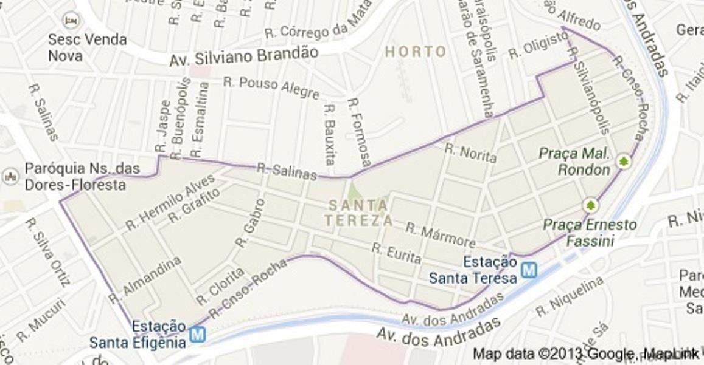
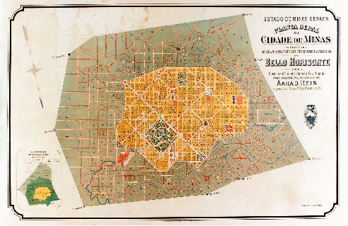
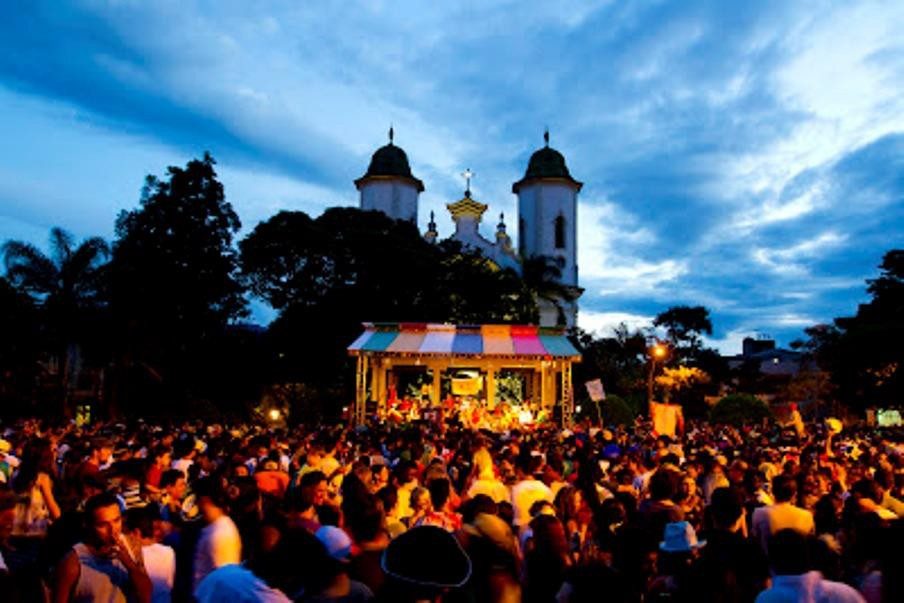
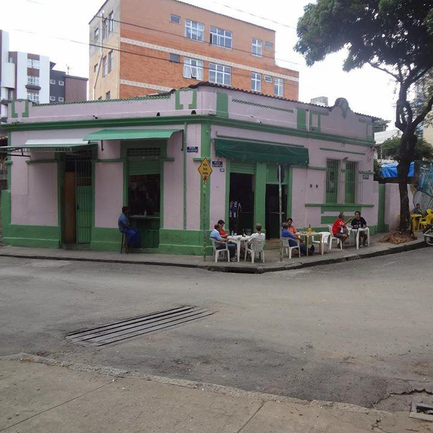

>
# Resumo

A partir do conceito de representação, comumente aplicado em estudos de
História Cultural, é feita uma leitura do bairro Santa Tereza, em Belo
Horizonte, analisando seu patrimônio cultural e sua identidade boêmia. A
história do bairro é apresentada de maneira sintética, com o objetivo de
contextualizar a sua alteridade perante a cidade e a conformação de seu
patrimônio cultural. Sua tradição boêmia é apresentada e reafirmada e,
por fim, a pertinência do instrumento do Tombamento é avaliada como
medida de salvaguarda desse patrimônio, que reúne bens materiais e
também intangíveis, representado em seus bares e botecos, em sua imagem
de bairro tradicional e cultural no imaginário coletivo da cidade.

Palavras-chave: Representação, Belo Horizonte, Santa Tereza, Patrimônio
Cultural, Boemia

> **Abstract**

From the concept of representation, usually applied in studies of
Cultural History, an interpretation of *Santa Tereza* neighborhood, in
*Belo Horizonte*, is done, analysing its cultural heritage and its
bohemian identity. The history of the neighborhood is briefly presented,
to context its alterity from the city and the built of its cultural
heritage. Its bohemian tradition is presented and, by the end of the
paper, the relevance of *Tombamento* as a protection instrument for the
cultural heritage is evaluated. The cultural heritage of *Santa Tereza*
includes material and imaterial goods, represented by its bars and pubs,
by its image of a traditional and cultural neighborhood in the city´s
imaginary.

Keywords: Representations, Belo Horizonte, Santa Tereza, Cultural
Heritage, Bohemian lifestyle

# Representação da boemia em Belo Horizonte: o bairro Santa Tereza e a tradição dos bares e botecos

> *(\...) os habitantes de Santa Thereza sabem se divertir e deste modo
> não olham para o lado triste da vida*.
>
> (Folha de Minas, 34/07/1935, apud GÓES, s/d)

O conceito de representação no âmbito da História Cultural diz de
construções de realidades paralelas a partir do real, sejam por meio de
instituições, discursos, ritos, normas ou produtos. (PESAVENTO 2004) Os
sentidos e simbolismos presentes nas mais variadas formas de
representação dão a elas a impressão de realidade, na medida em que se
apresentam e são encaradas como naturais. Sendo assim, os bens
patrimoniais, tangíveis ou intangíveis, funcionam como suportes de
ideias e valores de uma determinada comunidade, só adquirindo o estatuto
de patrimônio através de valores por ela atribuídos.

O bairro Santa Tereza, localizado na região leste da cidade de Belo
Horizonte, carrega consigo desde os primeiros tempos uma aura
interiorana, cultural, religiosa e boêmia. Tais características
encontram suporte em seu casario tradicional e ainda horizontalizado,
nas

manifestações artísticas que ali se formaram e ainda encontram lugar, na
Igreja de Santa Teresa e suas celebrações, nos bares e pequenos
comércios de tradição familiar. Configura-se como patrimônio cultural da
cidade, tanto nos aspectos físicos de seu ambiente construído quanto na
intangibilidade das tradições de seus moradores e frequentadores - seus
hábitos, costumes e modos de vida.

# O bairro Santa Tereza

> 
>
> Figura 1. Delimitação atual do bairro Santa Tereza Fonte: Google Maps1

A região onde hoje está o bairro Santa Tereza nem sempre teve este nome.
Já recebeu diversas alcunhas, que variaram de acordo com suas principais
ocupações e usos dentro da lógica urbana e ao longo da história de Belo
Horizonte. Todas foram marcantes para as atuais conformação e identidade
do bairro.

É uma das ocupações mais antigas de Belo Horizonte, que abrigou, desde
1886, parte da antiga Colônia Agrícola Américo Werneck e a Formação da
9ª CIA. de Ouro Preto, transferida de lá para a nova capital ainda em
construção2. O plano urbanístico previa a divisão municipal da então
Cidade de Minas em zonas urbana, suburbana e rural, esta última
destinada a abrigar sítios produtores agrícolas que seriam responsáveis
pelo abastecimento da cidade. A Colônia era habitada por agricultores e
trabalhadores da construção da nova capital do estado de Minas Gerais,
como pedreiros, carpinteiros e pintores, em sua maioria vindos de países
como Itália, Portugal e Espanha. Em 1898, a Colônia já abrigava mais de
20 famílias, contribuindo para sua emancipação em 1911 e posterior
incorporação à 7ª Zona Suburbana de Belo Horizonte, no ano seguinte.
Essa nova ordem implicou normas e regulamentos da

prefeitura para controlar a ocupação, ficando sob sua responsabilidade a
construção de ruas e praças. Lotes eram concedidos a funcionários
públicos, oficiais, praças e operários, iniciando a conformação do
perfil dos moradores do bairro.

> 1Disponível em:
>
> [[https://www.google.com.br/search?q=mapa+bairro+santa+tereza+bh&oq=mapa+bairro+santa+tereza+bh&aqs=c]{.ul}](https://www.google.com.br/search?q=mapa%2Bbairro%2Bsanta%2Btereza%2Bbh&amp;oq=mapa%2Bbairro%2Bsanta%2Btereza%2Bbh&amp;aqs=chrome..69i57j69i60l4j69i59.4766j0j9&amp;sourceid=chrome&amp;espv=210&amp;es_sm=122&amp;ie=UTF-8)
> [[hrome..69i57j69i60l4j69i59.4766j0j9&sourceid=chrome&espv=210&es_sm=122&ie=UTF-8]{.ul}](https://www.google.com.br/search?q=mapa%2Bbairro%2Bsanta%2Btereza%2Bbh&amp;oq=mapa%2Bbairro%2Bsanta%2Btereza%2Bbh&amp;aqs=chrome..69i57j69i60l4j69i59.4766j0j9&amp;sourceid=chrome&amp;espv=210&amp;es_sm=122&amp;ie=UTF-8)
> Acesso em 24/11/2013.
>
> 2 Belo Horizonte (2011); Baggio (2005); Góes (s/d)
>
> Figura 2. Planta Geral da Cidade de
> Minas organizada sobre a planta geodésica, topográfica e cadastral,
> 1895 -- Divisão em zonas urbana, suburbana e rural. Fonte: APCBH3

Em 1914, foi inaugurada a Hospedaria dos Imigrantes no local onde hoje
está a Praça Duque de Caxias. A intenção era acomodar os trabalhadores
recém chegados do exterior até que se estabelecessem fixamente em suas
casas, porém, a edificação nunca foi utilizada com esse fim e passou a
abrigar o 59º Batalhão de Caçadores do Exército, substituído pelo 5º
Batalhão da Força Pública. Após reforma em 1924, abrigou o 5º Batalhão
de Caçadores da Força Pública Mineira e, posteriormente, na década de
1960, foi demolido. O atual edifício, substituto ao anterior, abrigou o
5º Batalhão da Polícia Militar e hoje abriga o Colégio Tiradentes da
PMMG. (GÓES, s/d apud Belo Horizonte, 2011).

A região já foi conhecida, portanto, como "Imigração" ou "Bairro dos
Imigrantes", "Bairro dos Militares" e "Bairro do Quartel". Outro
apelido, o de "Região do Isolado", se deveu a presença do Hospital do
Isolamento ou Hospital Cícero Ferreira no bairro entre os anos de 1910 e
1965. Utilizado para tratamentos psiquiátricos e de doenças
infecto-contagiosas, como tuberculose, o local de sua instalação foi
escolhido devido ao baixo adensamento populacional, à distância em
relação ao centro da cidade, à proximidade com a linha férrea, o que
facilitava o acesso de pessoas de outra cidade até ele e ao bom clima da
região. "Fundos da Floresta" é outra denominação pela qual o bairro já
foi conhecido, devido à sua localização geográfica em relação ao bairro
Floresta.

No ano de 1928 dá-se ao bairro o nome de Santa Tereza4. O comércio local
de pequenos estabelecimentos de secos e molhados, tinturarias, armazéns
e botequins, já era significativo a esta época, principalmente com a
chegada da linha de bonde até o bairro. Três anos depois é iniciada a
construção da Igreja da Paróquia de Santa Teresa, que só ficaria pronta
31 anos mais tarde, ou seja, em 1962. Em 1935, atendendo aos pedidos da
comunidade do bairro, o

> 3 Notação: BR MGAPCBH//AI.06.00.00
>
> 4 Segundo Ulysses Baggio, a designação do bairro se deu por
> reivindicação dos moradores e teria sido uma sugestão do Capitão José
> Pinto de Souza, do 5º Batalhão da Força Pública. (BAGGIO, 2005) A
> escolha do nome estaria ligada à sua relação com o bairro Santa
> Teresa, no Rio de Janeiro, devido à localização geográfica elevada de
> ambos e também ao acesso aos bairros feito por bonde -- no Rio de
> Janeiro pelo aqueduto, os conhecidos Arcos da Lapa, em Belo Horizonte
> pelo Viaduto Santa Tereza, construção marcante também por seus arcos.

então prefeito Otacílio Negrão de Lima, inicia a construção da Praça
Duque de Caxias, inaugurada em 1937. Estão colocados, então, fortes
elementos que marcam o Santa Tereza e dão o tom de sua identidade, além
de alimentarem o imaginário coletivo e seu caráter de representação do
tradicional em Belo Horizonte, desde os primeiros tempos -- a Igreja e a
Praça, pontos de centralidade do bairro, locais de acontecimentos
culturais, cívicos, políticos e religiosos, encontro e socialização da
comunidade; os bares, botequins e restaurantes, expressão da tradição
boêmia desde os tempos da Colônia Américo Werneck (GÓES, s/d).

Outras formas de diversão tradicionais e que intensificam o ar cultural,
de socialização e a marca do bairro como local de encontro, são o
cinema, os clubes sociais e esportivos e os blocos de carnaval5. Junto
aos bares e botecos, que agregam as pessoas em torno de suas mesas nas
calçadas, formam a base de um discurso construído, apropriado e
constantemente reapropriado pela população belorizontina, e ainda
intensificado pela mídia.

# Tradição e Patrimônio Cultural

Até a década de 1970, o bairro carecia de infra-estrutura básica, como
transporte coletivo e saneamento, o que ocasionava até mesmo inundações
freqüentes. Apesar de cerca de 20 anos antes terem começado a surgir
pequenos edifícios residenciais, o Santa Tereza estava relativamente
isolado do restante da cidade, o que pode ter favorecido na manutenção
de suas características tradicionais. 6

Simmel interpreta o conceito de tradição como sendo esta uma oposição ao
modo de vida moderno e às relações de impessoalidade entre os
indivíduos, ambos característicos do cotidiano da cidade contemporânea.
7 No entanto, não são tratados como excludentes, notando-se sua
complementaridade na influência que a tradição exerce sobre os modos de
vida dos habitantes urbanos -- aqueles que predominavam entre as pessoas
que outrora habitavam o campo não são completamente eliminados uma vez
vivendo na cidade. (WIRTH

1979\)

Esta definição de "tradicional" vai ao encontro do imaginário coletivo
construído e sustentado a respeito do bairro e que faz dele
representação de um modo de vida desejável dentro da grande metrópole,
que remete ao interior e à ruralidade: habitação em casas, em sua
maioria, e hábitos de consumo, socialização e coletividade. O bairro,
essencialmente residencial, de casario antigo e horizontal, conserva
ainda hoje aspectos da Colônia Agrícola que deu origem a ele, e convive
também com uma atmosfera boêmia, sem, contudo haver forte oposição entre
esses dois aspectos. Isso é um traço real, comprovado por estudos e pela
inserção em sua vida noturna (BAGGIO 2005). Por abrigar pequenos
estabelecimentos comerciais e bares familiares, negócios que passam de
geração em geração, a tradição está presente tanto na habitação quanto
na convivência social coletiva do bairro.

Leonardo Barci Castriora (CASTRIOTA 2009) faz uma discussão interessante
a respeito de tradição e modernidade, relacionando os dois conceitos
entre si e também com o tempo -- passado, presente e futuro. Quanto ao
primeiro, o autor afirma haver uma dinâmica centrada principalmente na
permanência, com mudanças tímidas e lentas, porém existentes. Processos

> 5 Luis Góes (s/d) e Ulysses Baggio (2005) citam o Clube Santa Cruz, o
> Santa Tereza Esporte Clube, o Paraguassú, o Clube Teatral e Recreativo
> de Santa Tereza, o Bloco Não Rapo Nada, os Inocentes de Santa Tereza,
> os Galãs Mirins, o Unidos de Santa Tereza, a Banda Santa, o Clube
> Estrela, o Clube Tajurá, o Oásis Clube, dentre outros.
>
> 6 Baggio (2005) afirma que o isolamento geográfico e viário do bairro
> foram fatores que garantiram a permanência de características
> presentes desde os primeiros tempos de sua existência.
>
> 7 SIMMEL, 1979, apud Belo Horizonte, 2011.

de reapropriação e transformação marcam a tradição, não sendo esta,
pois, estática ou definitiva. A tradição poderia ser entendida como uma
releitura do passado com marcas do presente, o que a estaria
pré-moldando para um futuro próximo. Este, por sua vez, constantemente
associado à modernidade, na qual as mudanças são rápidas e a lógica da
substituição é imperativa8. É na modernidade que surge a ideia de
patrimônio cultural, inicialmente focado somente na cultura material e
ampliado para uma noção mais orgânica, que abrange ainda processos,
práticas, modos de vida, lugares, atividades, paisagens. O patrimônio é,
portanto, indiscutivelmente ligado às tradições de um povo, de uma
cultura, de um lugar. Com o crescente interesse nesse campo de
investigação multidisciplinar, é importante voltar as atenções para
essas tradições, buscar suas origens e real identificação das

comunidades para com elas.

Para Eric Hobsbawn, "muitas vezes, 'tradições' que parecem ou são
consideradas antigas são bastante recentes, quando não são inventadas"
(HOBSBAWN 1984, p.9) É possível e bastante provável que os estudos
voltados para patrimônio cultural não diferenciem tradições reais, ou
pelo menos consideradas como tal, daquelas que são deliberadamente
"inventadas" 9. O autor trata do fenômeno da "invenção das tradições"
como um campo de estudos interdisciplinar e

que ainda carece de estudos mais adequados, talvez por esse motivo seja
tão difícil estabelecer tais diferenças. Ele ainda o relaciona com a
modernidade e a relação temporal entre passado, presente e futuro, como
o faz Castriota. As mudanças características do mundo moderno contrastam
com a necessidade (ou vontade) humana de manter alguns aspectos da vida
social invariáveis, demonstrando seu desejo de se manter conectado com
um passado, nem sempre distante, mesmo que de forma artificial ou
"inventada". Nesse sentido, a preservação do patrimônio cultural está
voltada para tradições reais e "tradições inventadas", podendo ser ela
própria, como prática moderna, uma "tradição inventada". Contudo, não
cabe aqui a discussão de se as tradições do bairro Santa Tereza são
construções recentes ou traços de continuidade com seu passado, mas a
afirmação de que são fortes elementos de sustentação de seu caráter de
representação na cidade.

> 8 O autor trata a modernidade como uma ideia controversa, de difícil
> definição conceitual e delimitação cronológica.
>
> 9 "Por "tradição inventada" entende-se um conjunto de práticas,
> normalmente regulada por regras tácita ou abertamente aceitas; tais
> práticas, de natureza ritual ou simbólica, visam inculcar certos
> valores e normas de comportamento através da repetição, o que implica,
> automaticamente, uma continuidade em relação ao passado. Aliás, sempre
> que possível, tenta-se estabelecer continuidade com um passado
> histórico apropriado." Hobsbawn, 1984. p. 9.
>
> Figura 3. Praça Duque de Caxias em
> dia de festa e Igreja de Santa Teresa ao fundo. Fonte: Jornal O
> Rebate, 201310

# Os bares do Santa Tereza

A exposição *Em volta dessas mesas, uma cidade. Bares como lugares na
história de Belo Horizonte,* realizada pelo Museu Histórico Abílio
Barreto no ano de 2011, sinalizou a importância dos bares, botecos e
botequins como referência cultural, representação sócio- histórica,
espaços de memória e preservação de hábitos tradicionais de costume e
sociabilidade para a cidade. O discurso do museu, diferente do popular e
do midiático, do turístico e do comercial, mas que se apropria de todos
eles, de certa forma oficializa a imagem de Belo Horizonte como capital
dos bares e contribui para sua disseminação no imaginário

coletivo social. 11 Segundo o folder da exposição:

> (\...) houve iniciativas de se proteger a história desses espaços,
> demonstrando interesse na preservação de importantes elementos para a
> história da cidade, como edificações que abrigam bares tradicionais.
> Com traçados arquitetônicos que convidam à integração com a rua,
> grande parte dos estabelecimentos é instalada nas esquinas, de onde se
> pode ver e ser visto com maior facilidade, incorporando-se com fluidez
> ao universo e ao cotidiano urbanos. (MHAB, 2011)
>
> 10 Disponível em
> [[http://bettofernandes-orebate.blogspot.com.br/]{.ul}](http://bettofernandes-orebate.blogspot.com.br/)
> Acesso em 24/11/2013
>
> 11 Em 2009, foi sancionada a Lei Municipal nº 9.714 de 25 de junho de
> 2009, que intitula Belo Horizonte como "Capital Mundial dos Botecos" e
> ainda estabelece o "Dia Municipal dos Botecos", no terceiro sábado de
> todo mês de maio. Disponível em:
> [[http://wwo.uai.com.br/UAI/html/sessao_2/2009/06/26/em_noticia_interna,id_sessao=2&id_noticia=116226/em\_]{.ul}](http://wwo.uai.com.br/UAI/html/sessao_2/2009/06/26/em_noticia_interna%2Cid_sessao%3D2%26id_noticia%3D116226/em_noticia_interna.shtml)
> [[noticia_interna.shtml]{.ul}](http://wwo.uai.com.br/UAI/html/sessao_2/2009/06/26/em_noticia_interna%2Cid_sessao%3D2%26id_noticia%3D116226/em_noticia_interna.shtml)
> Acesso em 19/11/2013.

Estiveram presentes na exposição diversos estabelecimentos de inúmeros
bairros da capital mineira, representados por cardápios, placas,
artefatos como copos, pratos, garrafas, latas, mobiliário, anúncios e
propagandas. Estes objetos, inseridos em um espaço museológico e na
lógica expográfica, podem ser tratados como *semióforos*: funcionam como
chaves que ativam lembranças das pessoas a respeito de lugares
freqüentados em outros tempos, e mesmo no tempo presente. 12 Geralmente,
são memórias afetivas que remetem a momentos de descontração,
sociabilidade e alegria, gerando um sentimento de nostalgia e forte
conexão

com aqueles espaços.

Como dito em outro momento, os lugares que abrigam os bares e botecos do
Santa Tereza, podem ser interpretados como a expressão da boemia, da
cultura, da sociabilidade e do encontro, elementos presentes também nos
eventos públicos que acontecem em suas ruas e praças, clubes e outros
espaços de lazer. Como são fundamentais para a identidade do bairro,
fortes símbolos de seu tradicionalismo e âncoras de um aspecto do modo
de vida social de seus habitantes e freqüentadores, tais
estabelecimentos são patrimônio cultural para essas pessoas.

Outro aspecto que intensifica a imagem do bairro como cultural e boêmio
e ainda alimenta o imaginário da população, intensificando também o
interesse em preservá-lo em todo seu tradicionalismo já mencionado, é
seu papel de vanguarda na cena musical de Belo Horizonte. Na década de
1970, o movimento cultural Clube da Esquina despontou com músicos como
Milton Nascimento, Lô Borges e Beto Guedes, que se mantêm ativos numa
carreira de sucesso até hoje. Anos mais tarde, já nas décadas de 1980 e
1990, os grupos Sepultura e Skank também encontraram no bairro terreno
fértil para seus encontros e produções musicais. São artistas de
projeção nacional e importância indiscutível para a cultura da música
brasileira, e que ainda mantêm uma relação de afetividade com o Santa
Tereza. O disco de Ouro do Sepultura se encontra em uma das paredes do
*Bolão* e o bar é alvo de agradecimentos dos músicos em seus discos. O
Skank aguarda a promessa do proprietário do bar de que a

banda dará nome a um dos pratos do cardápio. 13

Os bares estão, em alguns casos, instalados em edificações antigas e de
ressonância arquitetônica para o bairro, seja pelo estilo da época das
primeiras ocupações da cidade ou por outros igualmente marcantes. Outros
se encontram em imóveis mais simples e que passam despercebidos por
olhares menos atentos. Em ambos os casos, as edificações são a
materialidade, o aspecto palpável dos bares, funcionando como base para
variados discursos e representações sobre o Santa Tereza, apoiados sobre
as características já mencionadas. A maioria desses discursos é
carregada de significações apropriadas de diferentes maneiras pelos
atores sociais: proprietários dos imóveis e/ou dos estabelecimentos, o
poder público, a comunidade, as imobiliárias e construtoras.

# O tombamento e as tradições

Na sociedade atual, existe um senso comum de que é uma desvantagem para
o proprietário ter seu imóvel tombado, o que seria sinônimo de tolher os
direitos de propriedade. Na realidade, restringem-se modificações nas
características do bem e reformas sem autorização prévia da

> 12 A esse respeito, cf. conceito de Pomian (1984), semióforo. "(\...)
> objetos que não têm utilidade \[no contexto expositivo do museu\]
> (\...) mas que representam o invisível, são dotados de um significado,
> não sendo manipulados, mas expostos ao olhar, não sofrem usura." (p.
> 71).
>
> 13 *Eterno QG do Heavy Metal* - Jornal Estado de Minas, Seção Bar &
> Cia, 30/04 a 07/05/1999. Acervo Hemeroteca MHAB, nº de registro 016.

autoridade pública responsável pelo tombamento, mas o usufruto e a
propriedade do imóvel são mantidos. No caso de venda, o poder público
tem a preferência da compra, o que, juntamente às especificidades já
citadas, reduziria o valor de mercado da edificação. No entanto, existem
contrapartidas, como a transferência do direito de construir e a isenção
do IPTU, caso o imóvel esteja em bom estado de conservação. 14 Os
proprietários de edificações tombadas alegam que a manutenção é
extremamente cara e deve seguir normas rígidas, e que as contrapartidas
não são suficientes para que o tombamento valha a pena. Tudo isso leva
ao desinteresse do mercado imobiliário por imóveis tombados ou terrenos
que os abrigam, desacelerando processos de especulação e verticalização
de localidades que abrigam muitos

bens protegidos.

A comunidade de um bairro como o Santa Tereza, um dos mais antigos da
capital mineira, desenvolveu ao longo dos anos e pelas gerações que ali
viveram, forte afetividade com as construções do bairro, seja pelo
estilo construtivo, seja pelos estabelecimentos ou famílias que abrigam
ou abrigaram. Por fazerem parte da paisagem do lugar, seu valor
extrapola o da propriedade privada, porém não o valor comercial, mas o
identitário, o cultural, o de bases de um discurso de representação.
Dessa forma, as pessoas demonstram interesse em manter a conformação do
bairro o mais próxima possível do que já foi em outros tempos, mantendo
a

tradição em diálogo com algumas mudanças que são inevitáveis. 15 O
interesse na preservação desses espaços que guardam traço importante da
história e da memória do bairro está colocado por eles, ora ressaltando
o tangível, ou seja, a edificação, ora o intangível, o estabelecimento e
tudo que ele representa -- sua culinária, seu clima agradável e
convidativo,

seus freqüentadores, seus funcionários\...

Em que medida a materialidade dos bares e botecos, expressa nas
edificações que os abrigam, também é patrimônio cultural, independente
de seu estilo arquitetônico ou período de construção? Ou ainda, qual seu
papel na preservação de um bar como patrimônio imaterial, haja vista que
são comuns casos de mudança de endereço e manutenção da tradição de um
bar ou restaurante? A divisão entre material e imaterial pode esvaziar
de sentido o patrimônio e dificultar sua apreensão, apesar de ser um
modelo prático para a operacionalização do trabalho dos agentes
patrimoniais. Além dessas questões, os conflitos entre os atores
envolvidos são muitos e é preciso discutir a forma mais apropriada de
amparar um patrimônio da comunidade sem que se torne um mero produto
cultural, fruto da modernidade homogeinizante das metrópoles atuais.

Alguns bares antigos e tradicionais no bairro já sofreram ou vêm
sofrendo as conseqüências do processo de especulação e aquecimento
imobiliário pelo qual o bairro está passando. É o caso do *Bar
Bocaiúva*, cujo imóvel também passou por processo de tombamento; do *Bar
do Orlando* e da *Pizzaria Parada do Cardoso*, ameaçados por um projeto
de alargamento de via; do *Bolão*, ameaçado de deixar o imóvel que ocupa
há mais de quatro décadas em função da venda do mesmo. O tombamento da
edificação que o abriga é exemplo claro da tentativa de salvaguardar
desse processo as referências culturais e patrimoniais que esse tipo de
estabelecimento tem para a comunidade que reside e freqüenta o bairro.
No dossiê de tombamento elaborado pela Diretoria de Patrimônio Cultural
da Fundação Municipal de Cultura de Belo Horizonte, é freqüente a
justificativa pelo valor simbólico e sentimental que o *Bolão* tem para
o Santa Tereza, deixando a impressão de que este é até maior do que o
valor arquitetônico e estético do imóvel.

> 14 Estas são contrapartidas previstas no Plano Diretor do município de
> Belo Horizonte, na LPOUS e ainda no Estatuto da Cidade.
>
> 15 Transformações relativas à infra-estrutura do bairro são
> indiscutíveis e necessárias, como obras de saneamento básico e
> fornecimento de energia elétrica, acesso de transporte público e
> indicações da defesa civil.
>
> 
>
> Figura 4. Bar do Orlando, Praça Ernesto Fassini. Fonte: Fanpage Boteco
> do Orlando -- Facebook, 201316
>
> 16 Disponível em:
> [[https://www.facebook.com/photo.php?fbid=340598379378854&set=pb.299417206830305.-]{.ul}](https://www.facebook.com/photo.php?fbid=340598379378854&amp;set=pb.299417206830305.-2207520000.1385403555.&amp;type=3&amp;theater)
> [[2207520000.1385403555.&type=3&theater]{.ul}](https://www.facebook.com/photo.php?fbid=340598379378854&amp;set=pb.299417206830305.-2207520000.1385403555.&amp;type=3&amp;theater)
> Acesso em 25/11/2013

# Referências bibliográficas

> BAGGIO, Ulysses da Cunha. *A Luminosidade do Lugar -- Circunscrições
> Intersticiais do Uso de Espaço em Belo Horizonte: apropriação e
> territorialidade em Santa Tereza*. Faculdade de Filosofia, Letras e
> Ciências Humanas. Universidade de São Paul, 2005. Tese de Doutorado.
>
> CASTRIOTA, Leonardo Barci. *Patrimônio Cultural: conceitos, políticas,
> instrumentos*. São Paulo: Annablume; Belo Horizonte: IEDS, 2009.
>
> GÓES, Luis. *Bairro Santa Tereza. Memória Histórica nos 100 anos de
> Belo Horizonte*. Belo Horizonte: Editora Luis Góes Ltda, s/d.
>
> HOBSBAWN, Eric J. *A Invenção das Tradições*. Rio de Janeiro: Paz e
> Terra, 1984. PESAVENTO, Sandra Jatahy. *História e História Cultural*.
> Belo Horizonte: Autêntica, 2004.

WIRTH, Louis. O Urbanismo como modo de vida. In: VELHO, Otávio (org.).
*O Fenômeno Urbano*. Rio de Janeiro: Zahar Editores, 1979.

# Fontes primárias

> CAJAZEIRO, Karime Gonçalves, SOUZA, Françoise Jean de O. *Dossiê de
> Tombamento -- Rua Adamina, 284/Praça Duque de Caxias, 288. Lote: 001.
> Quarteirão 015, Seção: 7ª Suburbana*. Arquivo da Diretoria de
> Patrimônio Cultural. Fundação Municipal de Cultura / Prefeitura
> Municipal de Belo Horizonte, 2011.

Biblioteca do Museu Histórico Abílio Barreto -- Arquivo interno e
Hemeroteca. Fundação Municipal de Cultura / Prefeitura Municipal de Belo
Horizonte.
