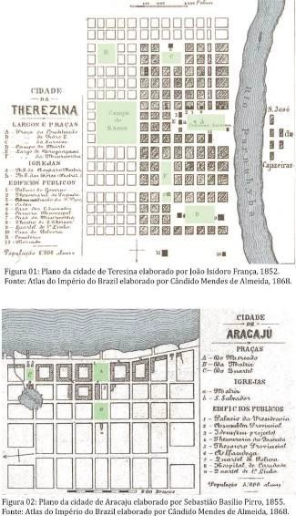
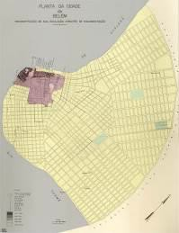
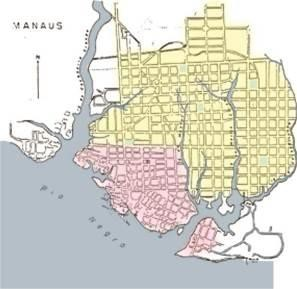
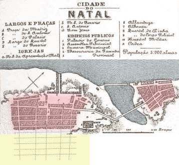
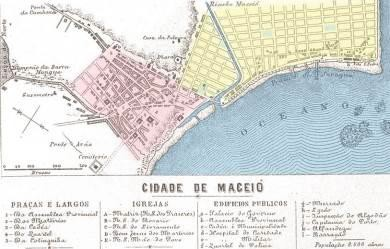
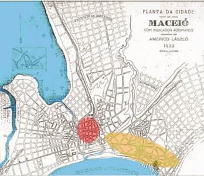
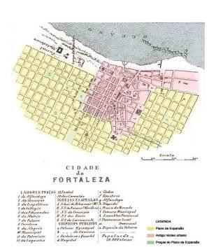
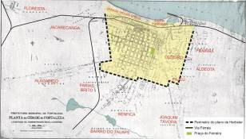

# Resumo

O presente artigo analisa, em linhas gerais, a presença ou não de
padrões urbanísticos, induzindo graus de uniformidade planimétrica e
volumétrica, nas cidades brasileiras entre a Colônia e a Primeira
República e mais especificamente Fortaleza. Do material levantado acerca
das experiências urbanísticas realizadas no Brasil durante o período
imperial, verificam-se paralelos entre as realizações urbanísticas nas
cidades capitais do Norte e Nordeste e a permanência de práticas vigente
no Império ao longo da Primeira República. No primeiro, estão aquelas
cidades planejadas ex*-nihilo*, substituindo as antigas capitais
coloniais, como é o caso de **Teresina e Aracaju**. No segundo grupo,
estão antigos núcleos urbanos que assumiram novos papeis e em função
disso se transformaram ao longo do Império e na República, orientados
por planos de expansão estatais.

Palavras chaves: Urbanismo Imperial, Fortaleza, Brasil

# Abstract

This article analyzes, in general, the presence or absence of urban
standards, inducing degrees of planimetric and volumetric uniformity in
Brazilian cities between the Cologne and the First Republic and more
specifically Fortaleza. The collected material about urban experiences
in Brazil during the Imperial period, there are parallels between the
urbanistic realizations in the capital cities of the Northeast and North
and the permanence of current practices in the Empire throughout the
First Republic. In the first, there are the planned cities *ex nihilo*,
replacing the old colonial capital, as Aracaju and Teresina. In the
second group, there are old urban cores that have taken on new roles and
due to this they turned over during the Empire and the Republic, guided
by plans for state expansion.

Keywords: Imperial Urbanism, Fortaleza, Brasil

# Introdução

O presente artigo analisa, em linhas gerais, a presença ou não de
padrões urbanísticos, induzindo graus de uniformidade planimétrica e
volumétrica, nas cidades brasileiras entre a Colônia e a Primeira
República e mais especificamente Fortaleza. O objetivo é indagar se a
capital do Ceará é genuína ou similar a outras cidades, principalmente
do Norte e Nordeste? Em que medida ela segue determinado padrão corrente
em outras áreas do Brasil? Havia uma política urbanizadora e urbanística
no Brasil - Império? Quais os desdobramentos das políticas urbanas do
Império na Primeira República? Ao cotejar Fortaleza com outros casos do
mesmo período, foi oportuno analisar a natureza das políticas de
controle urbanístico empreendidas pelo Estado no Brasil - Império, seja
por meio de planos de expansão para orientar o crescimento das cidades
preexistentes, seja projetando cidades novas.

# O século XIX e as capitais de Província no Brasil.

A vinda da família real para o Brasil em 1808, a Independência do Brasil
em 1822, a interrupção do comércio de escravos com a África em 1850, a
Abolição da Escravidão em 1888 e a Proclamação da República em 1889, são
marcos políticos significativos, que vão produzir mudanças na sociedade
e no espaço. Em que medida condicionam mudanças espaciais no território
e no intraurbano? Em que medida induzem políticas de controle das ações
da iniciativa privada?

> Em razão das precárias condições sanitárias das cidades brasileiras no
> início do século XIX, emerge um debate "*marcado por forte intercâmbio
> cultural com a Europa*" (SALGADO, 2003). Assim, "*as teorias médicas e
> urbanísticas desenvolvidas especialmente na França serão uma
> referência para o debate que se instaura no Brasil tendo como
> principal fundamentação a teoria miasmática.* (SALGADO,2003). Esse
> caráter higienista caracteriza a legislação urbanística difundida no
> Brasil Imperial, que padroniza a espacialização, tanto das cidades
> capitais regionais como de outras de porte médio.
>
> Nota-se, com efeito, uma mudança nos elementos que condicionam a forma
> de **apropriação** e **produção** do espaço, substituindo as
> orientações das **Cartas Régias** e dos **Autos de Fundação** do
> período colonial pelas orientações dos **Códigos de Posturas do
> Império**, fundamentadas em "*mudanças ocorridas no papel da técnica e
> dos saberes da engenharia na discussão da questão urbana no período*."
> (BRESCIANI, 2006:9). Disso resultam algumas indagações sobre o
> Urbanismo das cidades brasileiras no período imperial: existe uma
> ruptura entre o padrão urbanístico colonial e o padrão do Império? Se
> há um novo padrão no período imperial, em que medida difere das
> propostas e intervenções de embelezamento e melhoramentos urbanos da
> República? Além disso, no que diz respeito ao jogo das temporalidades,
> em que medida se observa a permanência de padrões urbanísticos da
> colônia, no Império e aquele do Império em plena 1a Republica nas
> capitais do Nordeste?

Do material levantado nos Anais dos Seminários de História da Cidade e
do Urbanismo (1990-2010), nas teses de doutorado e nas dissertações de
mestrado acerca das experiências urbanísticas realizadas no Brasil
durante o período imperial, verificam-se paralelos entre as realizações
urbanísticas nas cidades capitais do Nordeste e Norte e a permanência de
práticas vigentes no Império ao longo da Primeira República. Dentro das
experiências urbanísticas enfatizam-se dois grupos. No primeiro, estão
aquelas cidades planejadas *ex-nihilo*, substituindo as antigas capitais
coloniais, como é o caso de **Teresina** e **Aracaju**. No segundo
grupo, estão antigos núcleos urbanos que assumiram novos papéis e em
função disso se transformam ao longo do Império e na República,
orientados por planos de expansão estatais que substituíram o "*tipo de
cidade-fortaleza pelo tipo cidade-porto*" (BONFIM, 2005).

# Novas capitais planejadas

> Nos casos de **Teresina** e **Aracaju**, ambas são cidades projetadas,
> na transição do Brasil- Colônia *para o Brasil Império - como capitais
> dos Estados do Piauí e Sergipe, respectivamente.*
>
> **Teresina** foi concebida como sede do Governo da Província, por meio
> da Lei no315, de julho de 1852, com desenho do mestre-de-obras
> português **João Isidoro França**, representando com sua regularidade
> "*a racionalização de recursos e a simplificação de procedimentos*.
> *Função da topografia e de demandas sociopolíticas, resultou na
> flexibilidade da trama urbana, na articulação das praças e na
> informalidade dos loteamentos*. (BRAS e SILVA, 2008:43 ) (Figura 01).
> Em 1858, com a criação da
>
> Companhia de Navegação do Rio Parnaíba, a Cidade tornou-se "*um ativo
> porto fluvial e centro comercial de toda a província do Piauí*"
> (DUARTE, 1996:65).
>
> **Aracaju** foi fundada em 1855. A sua fundação atendia "*aos
> interesses da classe produtora de açúcar"* (BOMFIM, 2005), como também
> a um interesse político, "*pois a nova localização da capital
> favorecia a um forte controle sobre as diversas regiões da província*"
> (BOMFIM, 2005). Para elaborar o plano da cidade, Ignácio Barbosa
> convidou o então Capitão d'Engenheiros **Sebastião José Basílio
> Pirro**. Assim "*obcecado pelo uso de linhas retas, Pirro prendeu-se
> nas malhas de um traçado em tabuleiro de damas, \[\...\]. Por conta da
> sua obsessão e por falta de conhecimento do caráter físico do terreno
> da nova cidade, o engenheiro abusou de aterros* (PORTO, 1991:31)
> (Figura 02).
>
> 

Em ambos os casos, observam-se planos sem preocupação com o sitio em
questão, o que condicionou desvio entre a proposta e o realizado ou
pesados investimentos em aterros.

# Planos de expansão de antigos núcleos urbanos

> Entre as antigas capitais da administração colonial, mereceram planos
> de expansão **Belém** e **Manaus**, as duas cidades mais importantes
> do ciclo econômico da borracha na segunda metade do século XIX a 1920.
> "*Os melhoramentos urbanos introduzidos, através de um programa de
> pesados investimentos em infra-estrutura, se fizeram acompanhar, em
> ambas às cidades, da planificação urbanística da expansão de sua malha
> viária"* (DUARTE, 1996:73). **Belém**, na primeira metade do século
> XIX, iniciou os "*trabalhos de drenagem do pântano, possibilitando a
> ampliação da malha urbana, e o arruamento dos bairros de Nazaré e
> Unarizal"* (DUARTE, 2007:56). A grande **intervenção urbana**,
> entretanto, se deu no apogeu do comércio da borracha, na administração
> Antonio Lemos, quando promove, entre 1883-86, "*realizações urbanas,
> remodelando e ampliando significativamente a cidade a partir das
> diretrizes*"
>
> (DUARTE, 1996:73) do projeto do engenheiro Manoel Odorico Nina
> Ribeiro. A proposta adotada previa "*a ocupação integral da 1a Légua
> Patrimonial da cidade através de uma sofisticada composição
> urbanística, articulando a malha ortogonal \[\...\] com o traçado do
> núcleo urbano preexistente*" (DUARTE, 1996: 73) do século XVIII
> (Figura 03).
>
> 
>
> 
>
> Figura 03: Plano de Expansão da cidade de Belém, 1883/86
>
> Fonte: PENTEADO, 1968:160
>
> Em contrapartida, o desenvolvimento econômico de **Manaus** era
> bastante restrito até a segunda metade do século XIX, pois, somente
> "*em 1850 a região do atual Estado do Amazonas deixou de ser uma
> comarca da província do Pará, passando a configurar como província
> autônoma"* (DUARTE, 2007: 57). Durante a Primeira República, no
> governo de Eduardo Ribeiro, iniciado em **1892**, foi implantado um
> **plano de expansão** da Cidade. Cristovão Duarte identifica na planta
> levantada de 1895 uma estrutura viária em grelha "*constituída por
> vias ortogonais orientadas segundo os quatro pontos cardeais, com
> largura variando entre 20 e 40 metros. As quadras giram,
> majoritariamente, em torno de 120x120 metros, chegando porem, em
> alguns casos, atingir o dobro destas medidas*" (DUARTE, 1996:74).
> (Figura 04).
>
> Figura 04: Plano de Expansão da
> cidade de Manaus, 1895 Fonte: DUARTE, 1996:76

A criação de gado, a extração do sal, o cultivo da cana-de-açúcar e do
algodão no século XIX induziram o crescimento e importância da cidade de
**Natal** na lógica da rede urbana do Rio Grande do Norte. Esse momento
de impulso da cultura algodoeira exigiu e possibilitou a melhoria da
infraestrutura voltada para a produção, transporte, armazenamento,
comercialização e exportação do produto. O processo de modernização
iniciou-se por volta de 1850 e se consolidou nas primeiras *décadas do
século XX.*

Notam-se, ao longo do século XIX, algumas medidas, tais como aterros na
área da Ribeira, um plano de saneamento (1896), envolvendo a remoção do
matadouro e a mudança do Lazareto da Piedade, bem como o arrasamento da
represa do Baldo. Somente no século XX, houve uma ação urbanística e
saneadora no bairro da Ribeira. No âmbito das políticas de higiene e de
saneamento no Baldo e na Ribeira, o governador Tavares de Lira contratou
o agrimensor italiano **Antonio Polidrelli**. A implementação do plano
de expansão da Cidade Nova foi levado a efeito somente em 1901,
conhecido como **Plano Polidrelli** que visava "*garantir a expansão da
cidade que*

> *já se encontrava comprimida nos bairros da Ribeira e da Cidade Alta*"
> 1 (Figura 05). Este plano se restringia a um parcelamento e arruamento
> do solo numa trama em

xadrez, orientando a expansão da cidade no sentido sul.

> 1 Declaração do governador do Rio Grande do Norte- Alberto Maranhão,
> em carta ao escritor Câmara Cascudo (1980).
>
> Figura 05: Plano de Expansão da
> cidade de Natal elaborado pelo agrimensor Antônio Polidrelli, 1901
> Fonte: Atlas do Império do Brazil por Candido Mendes de Almeida, 1868
>
> **Maceió** só se tornou um importante núcleo urbano na virada do
> século XVIII para o XIX, não só "*em função da atividade comercial
> suscitada pela atividade portuária"* (FARIA, 2004:2), como também pela
> "*consolidação da importância econômica da região Sul da Capitania de
> Pernambuco, propiciaram as condições para uma mudança na geografia
> política e econômica desta região*" (FARIA, 2004:3). Logo após a
> criação do termo da vila (1817) e da sua autonomia, o
> capitão-governador Sebastião Francisco de Mello e Póvoas ordenou em
> 1820 a **José da Silva Porto** o levantamento de uma planta cadastral
> para definir "*aberturas de ruas e a retificação de outras, a
> demarcação de praças e largos, assim como a demolição de edificações
> situadas fora dos alinhamentos traçados"* (FARIA, 2004:4). Nas
> palavras de Geraldo Majela Faria, a intenção desse desenho "*não
> ultrapassava o gesto de simplesmente geometrizar aquilo que
> espontaneamente ia sendo construído"* (FARIA, 2004:4). A transferência
> da capital de Marechal Deodoro para Maceió somente se efetivou em
> 1839, advindo do desenvolvimento das exportações de açúcar, tabaco e
> coco pelo porto natural de Jaraguá. Em 1868, uma planta foi elaborada
> com a proposta de ampliação do tecido urbano entre o núcleo antigo e o
> povoado do porto de Jaraguá (Figura 06). Nota-se, entretanto, que esse
> plano não foi efetivado ao longo do tempo (Figura 07).
>
> Figura 06: Plano de Expansão da
> cidade de Maceió, 1868
>
> Fonte: Atlas do Império do Brazil por Candido Mendes de Almeida, 1868
>
> Figura 07: Planta da cidade de
> Maceió, 1932 Fonte: CAVALCANTE, 1998:73

A cidade de **João Pessoa** é a terceira cidade fundada no Brasil (1585)
e, até meados do século XIX, tinha como principal atividade econômica o
açúcar, mais tarde, acompanhada da cultura do algodão. Os anos 1850
foram os mais dinâmicos em termos de ações urbanísticas, realizadas com
base nas questões higienistas típicas do Império. A administração do
Tenente-Coronel **Henrique de Beaurepaire Rohan** merece

> destaque, pois se trata de um importante engenheiro militar
> responsável por capitanear um plano de remodelação da cidade. Liderou
> o levantamento da planta da Cidade elaborada pelo engenheiro Alfredo
> de Barros Vasconcelos, e promoveu *"o levantamento de um plano de
> abertura das ruas da capital e o nivelamento geral das mesmas para
> viabilizar seu calçamento,"* (ALMEIDA, 2004:54). Contratou dois
> engenheiros estrangeiros - Bless e Poleman - que realizaram estudos e
> obras de infraestrutura, saneamento, abertura de ruas, alinhamento de
> outras, além de promover a demolição de casas e becos com a finalidade
> de prolongar avenidas e ruas (SILVA, 2008:9). A capital paraibana
> apresentava no século XIX algumas inovações, "seja *em estudos e
> melhor conhecimento da estrutura urbana, na elaboração de posturas que
> direcionam a formação da cidade ou intervenções na sua estrutura por
> meio de ações publicas*" (ALMEIDA, 2004:44). Assim, esse período foi o
> "*sinalizador de uma serie de transformações urbanas que se
> desencadeiam de forma mais enfática no século seguinte*" (ALMEIDA,
> 2004:44).
>
> Nesse panorama, enquadra-se o caso de **Fortaleza.** Até a metade do
> século XIX, não passava de um pequeno aglomerado, ao contrário do
> Recife e de Salvador, que, desde o período colonial, eram importantes
> centros urbanos, em decorrência da economia da cana-de-açúcar.
> Fortaleza só se tornou o principal núcleo urbano do Ceará na segunda
> metade do século XIX, graças ao seu papel na comercialização de
> produtos de exportação, principalmente o algodão, cuja valorização no
> mercado internacional elevou-se durante a Guerra de Secessão nos
> Estados Unidos. O engenheiro Adolfo Herbster em 1863 (Figura 08)
> propôs o plano de expansão para a Cidade, projetando uma área nova
> equivalente a "*umas seis ou sete vezes aquela ocupada pela cidade na
> ocasião*" (CASTRO, 1994:86). A planta levantada em 1931-32, informa
> que "*a cidade ainda não havia conseguido preencher o traçado proposto
> por Herbster, salvo, pelo menos, de modo descontinuo ao longo das
> radiais e no trecho da parte leste mais próxima do centro, já no
> bairro emergente da Aldeota*" (CASTRO, 1994:70) (Figura 09).
>
> 
>
> Figura 08:Plano de Expansão da cidade de Fortaleza, 1863 Fonte: Atlas
> do Império do Brazil por Candido Mendes de
>
> Almeida, 1868
>
> 
>
> Figura 09:Planta da cidade de Fortaleza, 1932 Fonte: Planta da cidade
> de Fortaleza, 1932

Ao que tudo indica, planos de expansão semelhantes, em quadricula,
orientaram o crescimento das capitais de porte médio do Norte e
Nordeste: Belém, Manaus, Maceió, Natal, João Pessoa e Fortaleza.
Observam-se permanências de padrões urbanísticos típicos do Império ao
longo de toda a Primeira Republica: plano de expansão com base no
traçado ortogonal, código de posturas localizando a implantação do
conjunto urbano, zoneamento de funções (matadouros, lazaretos,
cemitérios) e melhorias sutis nas áreas portuárias. As novidades
urbanísticas típicas da Primeira República chegaram portanto mais tarde
nessas capitais.

> **Salvador** foi a primeira capital do Brasil e a segunda maior cidade
> do século XIX em número de habitantes, disputando com o Rio de Janeiro
> a liderança nas exportações do açúcar. A cidade, de "*forma geral
> passou por transformações em sua estrutura socioeconômica e também
> espacial"* (PINHEIRO, 2002:12). Durante todo o século XIX, existiu uma
> preocupação em alterar a malha urbana colonial (PINHEIRO, 2002:13). A
> maior intervenção com o objetivo de oferecer melhores condições de
> circulação e salubridade localizou-se na área onde se concentrava a
> vida comercial e financeira, ou seja, "*na parte de baixo da cidade
> com o objetivo de ampliar sua área e melhorar seu porto*." Foi, porém,
> somente entre 1912 e 1916 que a Cidade passou por uma grande reforma
> urbanística, encabeçada pelo governador **José Joaquim Seabra**, num
> momento de franca recuperação econômica. Essa experiência corresponde
> ao "*projeto de modernização do porto (1906-1921) e o de
> remodelação-ampliação do centro de negócios, na Cidade Baixa, e a
> abertura da avenida 7 de setembro, na Cidade Alta, durante a primeira
> gestão do governador J. J. Seabra*" (FERNANDES, 1999:172).

Outro exemplo de cidade do Nordeste que merece modernização nos moldes
republicanos é **Recife**, importante entreposto comercial da região,
com uma condição portuária "*que certamente marcou sua estrutura e
fisionomia urbanas*" (MOREIRA, 1996:777). As reformas iniciaram-se no
Império, na administração do **Conde da Boa Vista**, em meados do século
XIX, implantando-se uma série de obras públicas. A tais iniciativas
sucederam a instalação das redes de serviços urbanos (água, saneamento,
bondes) todas sob a responsabilidade do setor privado. Ampla reforma
urbana, entretanto, ocorreu nas primeiras décadas do século XX, quando
foi elaborado e implantado o Projeto de Melhoramento do Porto, em 1908,
desenhado por Alfredo Lisboa, associado ao Plano de Saneamento do
Recife, elaborado por **Saturnino de Britto**, entre 1909 e 1915. Assim,
por meio do saneamento e do redesenho do bairro do

> porto, Recife passou por "*transformações significativas que
> descaracterizaram sua feição colonial*" (MOREIRA, 1999: 14), nos
> moldes do que se viu em Salvador e se verá no Rio de Janeiro, São
> Paulo e Santos.
>
> Na primeira metade do século XIX, os projetos realizados no **Rio de
> Janeiro** destinavam-se a resolver problemas de saneamento por meio do
> aterro dos pântanos e das lagoas, desmontes de morros e nivelamento do
> solo. Em 1874, foi criada a Comissão de Melhoramentos da Cidade,
> instituída pelo Governo Imperial, chefiada pelo engenheiro civil
> Francisco Pereira Passos. Vários projetos de melhoramentos propostos
> pela Comissão só foram realizados na gestão do Prefeito Pereira Passos
> (1902-1906), quando a Cidade "*começa a ter um papel fundamental na
> inserção do Brasil no capitalismo internacional, ao transformar-se de
> porto exportador de café para centro distribuidor de produtos
> importados, tornando-se também um mercado consumidor*" (PINHEIRO,
> 2002:124). As obras de saneamento, a política de saúde pública, a
> melhoria no porto, a abertura da av. Central e outras correlatas, a
> construção da av. Beira Mar e os novos equipamentos urbanos- teatro,
> biblioteca, Academia de Belas Artes -- foram de um novo caráter,
> diferentes das propostas do Império, embora delas herdassem os
> clamores.
>
> Simultaneamente, São Paulo merece transformações afins, capitaneadas
> pela iniciativa privada e orquestrada pelo poder público. Até meados
> do século XIX, **São Paulo** "*não se distanciou de sua fisionomia
> colonial"* (BRUNO, 1991: 8). Segundo Nestor Goulart Reis, até 1860, a
> cidade foi "*beneficiada com a expansão da produção do açúcar*", sendo
> substituída entre 1840 e 1860, "*pelas lavouras de café*" (2004:111).
>
> As reformas urbanas no centro da Cidade no período republicano
> aconteceram ao longo das administrações municipais do Conselheiro
> Antonio Prado (1898-1910), do Barão Duprat (1911-1913) e de Washington
> Luís (1914-1918). Esses planos "*buscavam harmonizar os objetivos
> declarados de interesse publico e as oportunidades de atuação no
> mercado imobiliário*" (REIS, 2004:180).

# Notas conclusivas.

> Observou-se que as cidades brasileiras do período imperial
> necessitaram de controle sobre as condições higiênicas e sanitárias,
> principalmente em função dos surtos epidêmicos de febre amarela e de
> *Cholera morbus*, a partir de meados do século XIX. Para isso o Poder
> Público atuou mediante a codificação de uma legislação edilícia,
> definida no Império, que orientava intervenções na cidade. O primeiro
> *Código de Posturas* foi introduzido com o Regimento das Câmaras
> Municipais (1828), regulamentando um vasto elenco de temas, referentes
> ao alinhamento, limpeza, iluminação, "desempachamento" das ruas,
> estabelecimento de cemitérios, matadouros, o alinhamento de ruas,
> caminhos e edificação, entre outros. Na segunda metade do século XIX,
> "*embora as ações da municipalidade não se diferenciassem, de modo
> geral daquelas indicadas na primeira Constituição brasileira e nas
> leis subsequentes que a regulamentaram \[\...\] aos poucos é ampliado
> o alcance espacial e temporal das deliberações da Câmara*" (BRESCIANI,
> 2006:9). Várias dessas recomendações de

alcance espacial foram mantidas ao longo da segunda metade do século XIX
até fins da 1a Republica. São exemplos deste tipo de intervenção as
propostas de expansão nas cidades capitais do Nordeste (como Fortaleza,
Maceió, João Pessoa e Natal) e do Norte (Belém e Manaus). Fortaleza,
(com o Plano de expansão de Adolfo Herbster em 1863), Maceió (em 1868),
Belém, (na administração de Lemos, entre 1883-86, elaborado pelo
engenheiro Manoel Odorico Nina Ribeiro), e Manaus, com uma expansão
implantada

> logo após a República, no ano de 1892. Esses planos de expansão
> somados aos projetos de criação "*ex-novo*" de capitais (Teresina e
> Aracaju) utilizaram o traçado em xadrez como padrão planimétrico.
> Nesse aspecto, pode-se afirmar que o grau de controle nas capitais do
> Norte e Nordeste aqui estudadas, à exceção de Salvador e Recife, segue
> um padrão de intervenção urbana por meio de um plano de expansão
> ortogonal da malha. No caso de Belém, a composição urbanística
> mantinha uma articulação entre a "*malha ortogonal projetada com
> traçado do núcleo urbano preexistente*" (DUARTE, 1996:73). Fortaleza
> não era exceção nesse sentido, pois a "*malha ortogonal expandindo-se,
> eliminou as várias radiais* \[antigos caminhos de penetração\]
> *\[\...\], as que permaneceram passaram a iniciar-se em pontos
> relativamente distantes da parte central da cidade, algumas delas sem
> interligação direta com a cintura de avenidas*" (CASTRO, 1994:68). As
> diretrizes contidas na expansão física programada previa uma grande
> ampliação urbana, quase duplicando ou triplicando a área preexistente.
> Cidades como Fortaleza e Belém se destacam no contexto regional pelo
> fato de seus planos serem efetivados, ao contrário de Maceió, cujo
> plano não vingou.

Observam-se continuidades no padrão urbanístico da Colônia para padrões
que se seguiram à Independência, ao menos no que diz respeito à
regularidade dos traçados já presente nas "*preocupações iluministas,
que haviam sido introduzidas por iniciativa do governo português, com o
objetivo de transmitir uma imagem de ordem e de disciplina*" (REIS
FILHO, 2004:113). As políticas do Império incluem novas práticas
urbanísticas, como códigos de posturas e obras de saneamento (drenagem
de áreas pantanosas e zoneamento de funções). Entre essas realizações,
observou-se que tais padrões diferem dos impostos na Primeira Republica,
no que tange o aparelhamento da infraestrutura nacional, como a reforma
e ampliação dos portos (Recife, Salvador, Rio de Janeiro), ao que se
associam modernos sistemas ferroviários, a modernização dos centros
urbanos tradicionais (Rio de Janeiro, Recife, São Paulo) por meio de
grandes cirurgias urbanísticas e obras de saneamento (água, luz, esgoto)
(LEME, 1999:22-25). Observa-se a permanência de práticas urbanísticas do
Império ao longo de toda a Primeira República em Fortaleza e demais
capitais do Norte e Nordeste de porte médio.

# Referências

> ALMEIDA, Maria Cecília Fernandes de. A lagoa no Centro das atenções: o
> parque Solon de Lucena e a criação de espaços verdes públicos na
> capital paraibana na primeira metade do século XX. In: **VIII
> Seminário de História da Cidade e do Urbanismo,** Niterói: 2004,
> p.01-13**.**
>
> BOMFIM, Suzete. Aracaju -- capital de Sergipe, 150 anos. Considerações
> sobre seu surgimento e crescimento. In: Revista Urbanismo de Origem
> Portuguesa no 7, 2007. **Anais eletrônicos do I Simpósio Luso
> Brasileiro de cartografia Histórica**, Rio de Janeiro, 2005.
> Disponível em:
> [http://revistas.ceurban.com/numero7/artigos.htm.](http://revistas.ceurban.com/numero7/artigos.htm)
> Acesso em: 4 jan. 2011.
>
> BRAZ e SILVA, Ângela Martins Napoleão. **O Plano de implantação da
> cidade de Teresina** (1852). Disponível em:
> [http://www.atlas.ufba.br/visoes_urbanas_2008/Cadernos_atlas_angelabraz.pdf.](http://www.atlas.ufba.br/visoes_urbanas_2008/Cadernos_atlas_angelabraz.pdf)
> Acesso em: 03 mar. 2010.

BRESCIANI, Maria Stella Martins. Saberes eruditos e técnicos na
configuração e reconfiguração do espaço urbano: Estado de São Paulo,
séculos XIX e XX. São Paulo: FAPESB, 2006. **Documento interno**.
Projeto Temático FAPESP. IFCH- UNICAMP.

(instituições vinculadas: CEATEC -- PUC- Campinas, FAAC -- Unesp- Bauru
e Scuola Studi Avanzati -- IUAV- Veneza).

> BRUNO, Ernani Silva. **História e tradições da cidade de São Paulo**.
> São Paulo: Hucitec, 4 0 edição, 1991:442, vol. II. Burgo dos
> estudantes (1828-1872).

CASTRO, JOSÉ LIBERAL DE. Contribuição de Adolfo Herbster à forma urbana
da cidade da Fortaleza. In: **Revista do Instituto do Ceará**.
Fortaleza: tomo CVIII, 1994, p.43-90.

CAVALCANTI, Veronica Robalino. La production de l´espace à Maceio
(1800-1930). Tese de doutorado em Ciencia Social, Sociologia-Institut
d´etude du developpement economique et Social, Universite de Paris1,
Pantheon-Sorbonne, Paris.

> DUARTE, Cristóvão Fernandes. Anotações preliminares sobre a utilização
> da grelha na planificação de cidades. In. **IV Seminário de História
> da Cidade e do Urbanismo**, Rio de Janeiro, 1996, p.65-78.
>
> . Belém, In: PESSOA, José. **Atlas de centros históricos do Brasil**.
> Rio de Janeiro: Casa da Palavra, 2007:54-63.
>
> FARIA, Geraldo Majela Gaudêncio. Maceió, 1820-1841: planta cadastral e
> plano urbanístico, uma nova modalidade de configuração do tecido
> espacial. In: **IV Seminário de História da Cidade e do Urbanismo**,
> Rio de Janeiro, 2004.

FERNANDES, Ana, SAMPAIO, Heliodoro, GOMES, Marco Aurélio. A constituição
do urbanismo moderno na Bahia, 1900-1950. In: LEME, Cristina. (org.)
**Urbanismo no Brasil, 1895-1965**. São Paulo: Studio Nobel; FAUUS,
FUPAM, 1999.

> LEME, Maria Cristina da Silva (org.). **Urbanismo no Brasil,
> 1895-1965**. São Paulo: Studio Nobel, 1999:22-25
>
> MOREIRA, Fernando Diniz. Ideias e planos do urbanismo moderno na
> cidade do Recife no segundo quartel do século XX. In: **IV Seminário
> de História da Cidade e do Urbanismo**, Rio de janeiro, 1996.

PENTEADO, Antônio Rocha. Belém do Pará-Estudo de Geografia Urbana.
Universidade Federal do Pará, 1968.

PINHEIRO, Heloisa Petti. **Europa, França e Bahia**. Difusão e adaptação
de modelos urbanos. (Paris, Rio e Salvador). Salvador: EDUFBA, 2002.

> Porto, Fernando. **A cidade de Aracaju 1855/1865**. 2 ed. Aracaju:
> Governo de Sergipe/ FUNDESC, 1991.

REIS, Nestor G. Notas sobre o Urbanismo barroco no Brasil. **Caderno de
pesquisa do LAP**, Série Urbanização e Urbanismo, USP/FAU: no 03 1994.

> . **São Paulo, vila, cidade e metrópole***,* São Paulo: Via das Artes,
> 2004.

SALGADO, Ivone. Pierre Patte e a cultura urbanística do iluminismo
francês. **Caderno de pesquisa do LAP** no 38, Série Urbanização e
Urbanismo, USP/FAU, 2003.

> SILVA, Ligia Tavares da. Esquecimento e urbanização na Paraíba
> (1822-1860). In: **X Seminário de História da Cidade e do Urbanismo**,
> Recife, 2008, p. 02-12.
