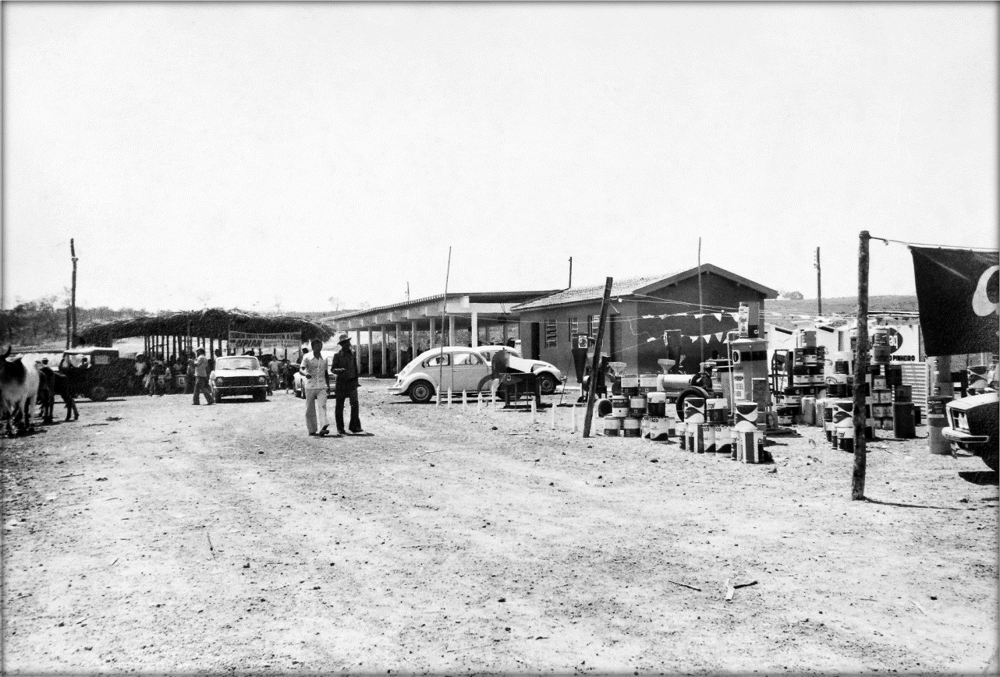

**Resumo:** Este estudo tem por finalidade discutir "cidade e
modernidade" estabelecendo como plano de observação à cidade de João
Pinheiro que completou 100 anos de emancipação política em 2011. Sua
localização é na região do Noroeste de Minas Gerais -- Brasil.
Estabelecemos como marcos temporais da pesquisa os anos de 1960/2012.
Foram feitas reflexões sobre a transformação do espaço da cidade a
partir da construção da BR O40 que liga a antiga capital do Brasil --
Rio de Janeiro a nova sede administrativa Brasília -- DF, inaugurada em
1960. A partir da pesquisa foi possível percebermos que toda a região do
Noroeste de Minas passava por um significativo isolamento por faltas de
estradas que viabilizasse o escoamento da produção econômica bem como
investimentos para o desenvolvimento da região.

> **Palavras- Chave:** Cidade, História, Memória, Representações

**Abstract:** This study has for purpose to discuss \"city and
modernity\" establishing as observation plan to João Pinheiro\'s city
that completed 100 years of political emancipation in 2011. Ther
location is in the area of the Northwest of Minas Gerais - Brazil. We
established about temporary marks of the research the years of
1960/2012. they were made reflections about the transformation of the
space of the city starting from BR O40\'S construction that ties the old
capital of Brazil - Rio de Janeiro the new administrative thirst
Brasília - DF, inaugurated in 1960. Starting from the research it was
possible notice that the whole area of the Northwest of Minas went by a
significant isolation for lacks of highways that it made possible the
drainage of the economical production as well as investments for the
development of the area.

**Keywords**: City, History, Memory. Representations

# Introdução

Foi possível detectar através de documentos encontrados nos arquivos
municipais que houve um crescimento populacional na área urbana de 1500
em 1957 para 36.761 pessoas em 2010, sendo 18.262 homens e 18.499
mulheres. A população rural é composta de 8.499. Esse crescimento da
área urbana ocorreu em decorrência da migração dos moradores dos
distritos e da zona rural para a cidade de João Pinheiro a procura de
melhores oportunidades de trabalho, estudo e moradia, bem como, a
migração inter-regional em decorrência das carvoarias, agricultura e
pecuária desenvolvidas no município. Essas transformações na cidade
demosntraram mudanças não somente no espaço físico e estrutura da
cidade, mas também no cotidiano dos moradores seus costumes, saberes e
fazeres. Justificamos esta pesquisa, por compreendermos a necessidade de
trabalhos científicos que discutam temáticas não somente de grandes
centros, mas também regionais e os impactos das mesmas.

Para a realização do trabalho buscamos responder ao seguinte
questionamento: de que maneira a cidade é representada por seus
moradores? Como aconteceu a (re)apropriação do espaço urbano? Quais os
principais fatos permanecem nas lembranças dos narradores acerca da
cidade e da sua transformação? O trabalho foi realizado através da
metodologia qualitativa. Foram realizadas várias incursões sobre
arquivos de memórias através de entrevistas orais e arquivos documentais
e iconográficos, entrecruzando as fontes. Procuramos entender o passado
como forma de representação da realidade vivida. O objetivo do estudo
foi perceber a maneira como homens e mulheres representaram os fatos
vividos e a transformação do espaço

da cidade de João Pinheiro (MG) -- Brasil. Ao final da pesquisa foi
possível percebermos que a cidade é filha do seu tempo, fruto das
transformações sociais que seus moradores fizeram/fazem em seu cotidiano
e a maneira como partilham experiência individuais e coletivas formando
a identidade local na reconstrução contínua no espaço urbano.

A cidade é filha de seu tempo, fruto das transformações que seus
moradores fazem em seu cotidiano e a forma como partilham experiências,
histórias individuais e coletivas:

> Um modo de construir sentidos que influencia e organiza tanto nossas
> ações quanto a concepção que temos de nós mesmos. \[\...\], pois o
> lugar é o específico, o concreto, o conhecido, o familiar, o
> delimitado, onde as práticas sociais específicas moldam e formam
> identidades (HALL, 1999, p. 50-72).

A cidade, como espaço de vivência, é um local de encruzilhada, múltiplos
caminhos e experimentos diversos, valores, tradições, que fazem da
cidade um local privilegiado de experiências. As ruas da cidade, o
traçado e tamanho das mesmas\... Transformam-se, são remodeladas\...
Casas antigas dão lugar às novas. Surgem preocupações com a estética da
cidade, reforma e limpeza das ruas, melhoria no abastecimento de água
potável, estabelecimento do Código de Posturas normatizando a estética,
o padrão das ruas e casas da cidade: "A cidade permanece a todos, mas
não do mesmo modo; a todos cabe zelar pela cidade, mas não do mesmo
modo, todos participam do fazer e do manter a cidade, mas não do mesmo
modo" (JUNIOR, 2008, p. 216).

Dona Zoraida1 escreveu sobre as lembranças que possuía acerca da cidade
de sua infância, como se quisesse deixar para a posteridade o cenário da
Vila que não existe mais e, nas suas palavras, vai desenhando as ruas e
suas especificidades:

> A vila do Alegre era triste, calada, carente, cheia de mato. Tinha
> quarteirão sem uma casa, era só mato, capoeira alta. Onde as vacas do
> Sr. Ribeiro escondiam as crias e passavam carreira nos meninos que iam
> apanhar goiaba que tinha muito no meio do mato. Era o lugar preferido
> também dos jumentos do Felício esconder do sol e passar susto na gente
> que ia passando com aqueles urros medonhos que eles soltavam.

Animais na rua, como menciona Dª Zoraida, era normal no cotidiano da
vila. Isto é perceptível na Ata da Sessão Ordinária da Câmara Municipal
quando decreta no seu Art. 71: "Dentro do patrimônio municipal, não será
permitida a pastagem de animais, devendo, os que forem encontrados
soltos nas ruas, serem levados para o curral do Conselho" (SOUZA, 1999,

p\. 36). De acordo com essa Moção, os animais que fossem recolhidos no
perímetro urbano só poderiam ser retirados pelos proprietários em um
prazo de cinco dias; caso contrário, seriam vendidos em hasta pública e
a importância recolhida aos cofres municipais. O Art. 75 da referida
Moção refere-se à criação de suínos: "É igualmente proibido ter solto
nas ruas e praças desta vila, porcos, cabritos e carneiros,
procedendo-se da mesma maneira que o Art. 71" Podemos observar que a
proibição de animais soltos pelas ruas do patrimônio era preocupação da
Câmara Municipal.

Nas representações de Genésio Ribeiro, ao assumir a Administração
municipal em 1931, as

> 1 Zoraida Coimbra Nepomuceno. Nasceu em João Pinheiro em 05 de
> fevereiro de 1915.

ruas estavam cobertas de matagais e muito danificadas pelas enxurradas:

> Na qualidade de prefeito deste município, venho apresentar a vossa
> excelência o relatório dos negócios municipais, referentes aos três
> primeiros meses de minha gestão. Ao assumir o cargo em dois de janeiro
> do corrente ano (1931), encontrei a administração completamente
> desorganizada, nenhum empregado se conservava no posto. Tinham-se
> exonerado há mais de um mês e as vagas ainda não haviam sido
> preenchidas \[\...\] os serviços públicos estavam em completo
> abandono, às estradas em ruínas. As ruas da cidade cobertas de
> matagais e gravemente danificadas pelas enxurradas, o cemitério da
> cidade servindo de pastos para os animais por haver caído parte do
> muro que o cerca e, finalmente, a canalização da água que reclamava
> urgentes reparos. Durante o primeiro bimestre decorrido, a prefeitura
> só conseguiu arrecadar a importância de três contos, oitocentos e doze
> mil e oito réis (3.812\$08) de um orçamento de 38.500\$000, embora se
> vá empregando a maior energia na arrecadação (SOUZA, 1999, p.79).

Preocupado com o visual da cidade e o mato nas ruas, Genésio Ribeiro
escreveu em seu relatório o resumo da Administração municipal no
primeiro semestre de 1932, quando enviou ao Secretário do Interior seu
relatório e abordou as Obras públicas municipais:

> *As ruas da cidade estão danificadas e carecendo em todos os tempos de
> cuidado por parte das administrações. Tem merecido atenção cuidadosa
> da prefeitura. As ruas outrora, cheias de mato e buracos estão
> presentemente em bom estado. Mandei limpar e consertar, fazendo
> aterros, abaulamentos, calçadas e encascalhamento, de maneira a
> tornarem-se transitáveis por veículos de qualquer espécie,*
>
> *o que antes era feito com muito sacrifício e risco de prejuízo para
> seus proprietários2.*

Conforme Genésio, as principais medidas adotadas pela administração no
início de sua gestão foi a limpeza e o "conserto" das ruas da cidade, da
estrada de automóveis do Rio da Prata, a construção de mata-burros, a
limpeza no cemitério e o abastecimento da água.

O Sr. José Benevides3, ao relembrar da cidade de outrora, mencionou
sobre o traçado das ruas, o comércio, os antigos moradores, como se se
descortinasse diante de seus olhos a cidade das primeiras décadas do
século XX:

> *As ruas da cidade eram tortas, a não ser a praça, que era o largo da
> Matriz. Na porta da cadeia tinha outra rua que era conhecida como a
> Rua da Palha, ali onde hoje é o Posto Alberico. Tinha a Rua do Sobrado
> onde hoje é a Casa da Cultura. Tinha a Rua dos Padres, que é a Rua
> Frei Carmelo. Ela era cheia de voltas. Tinha a Rua Capitão Speridião
> que era dali de onde é hoje o "Serve Bem", dali para baixo.*
>
> 2 Ata da Quarta Sessão Ordinária do Conselho Consultivo desta
> Prefeitura, na primeira quinzena do mês de junho de 1932. Estes
> relatórios eram feitos em conformidade com o que dispunha o artigo 13,
> número IX, do Decreto nº 21.348, de 09 de agosto de 1931, do governo
> Provisório da República (Getúlio Vargas)
>
> 3 José Benevides Costa nasceu na "Fazenda Jardim, em um lugarejo
> chamado 'Valente' em 25 de abril de 1913".
>
> *Tinha a Rua da Água Limpa. Tinha a caixa d'água dela para baixo. A
> cidade acabava ali de onde é hoje o Banco do Brasil e o Juca Cordeiro
> morava lá. Até lá tinha as casas de telha e mais acima, tinha umas
> casas de palha. João Pinheiro era dali para baixo.*

Partilhando suas lembranças, contou-nos Dona Benedita Batista Rabelo4
sobre as lembranças da cidade que conheceu na infância:

> *A cidade de João Pinheiro quando eu mudei para cá, era pequenina. As
> casas eram salteadas, ralas. Onde havia uma concentração maior de
> casas, mais alinhadas, era no largo da Matriz, a Praça Coronel
> Hermógenes. Não tinha carros, bicicletas na rua. As pessoas eram todas
> unidas, havia conversas nas portas das casas no final das tardes.
> Podiam-se deixar as casas abertas que não havia perigo. Era todo mundo
> unido.*

A construção do espaço urbano
constituído por ruas pequenas e com poucas casas era o retrato do
cotidiano da Vila de outrora, com poucos moradores e o estabelecimento
de relações sociais, econômicas e afetivas entre os moradores do lugar.

> **Figura 1:** Largo da Matriz**,** 1938. **Fonte:** Acervo Casa da
> Cultura
>
> 4 Natural de Paracatu (MG). Residente em João Pinheiro desde a década
> de 1920 onde permaneceu até o falecimento em 2011. Atuou como diretora
> e professora, contribuindo de forma significativa para educação.

> **Figura 2:** Largo da Matriz.,1953**. Fonte:** Acervo do Sr. José de
> Oliveira.

**Figura 3:** Vista parcial do antigo Largo da Matriz - Atual Praça
Coronel Hermógenes .

> **Fonte:** Arquivo: José de Oliveira.

As casas retratavam a arquitetura da época e evidenciavam a situação
econômica de seus proprietários. Casas maiores, menores, mais baixas,
cobertas de telhas, palhas, estruturas de aroeira, outras de
pau-a-pique, adôbe, muros baixos, cercas de achas de aroeira ou cercadas
de arame.

**Figura 4;** Cerca feita com estacas de madeira. Forma usada para
"cercar" as propriedades. Antigo fórum de João Pinheiro. **Fonte:**
Acervo Casa de Cultura

A municipalidade tentou normatizar as construções como prevê o Art. 54
da Legislação local: "Todos os serviços de construção, bem como o
alinhamento e arruamento dos prédios, serão cuidadosamente fiscalizados
pelo agente fiscal"5. Todavia, as casas com cercas de arame e/ou de
madeira ainda continuaram a fazer parte do cenário urbano por um longo
tempo.

As telhas foram substituindo aos poucos as coberturas de palha. Os
tijolos de alvenaria substituindo as paredes de pau-a-pique e adôbe.
Ainda assim, muitas eram as casas com paredes de adobe, sendo este
objeto feito a partir de uma técnica rudimentar e que exigia um saber
fazer tradicionalmente repassado: "A fabricação do adôbe, como a feitura
das paredes, exigem certos conhecimentos do barro a ser empregado"
(RIBEIRO, Op. Cit., p. 276). Há multiplicidade de saberes na invenção do
cotidiano e transformação do espaço de vivência. O Sr. José Benevides
conta sobre as construções do período:

> *No tempo do governo do Genésio Ribeiro, as casas eram baixas. A
> maioria das casas era pequena. Algumas delas era com paredes feitas de
> madeira, barreadas de barro, chamadas de pau-a -- pique. Outras*
>
> 5 Ata da Quarta Sessão Ordinária da Câmara Municipal da João Pinheiro
> do dia 19 de setembro de 1927.
>
> *casas eram quase tudo de adobe. O telhado era de telha curva,
> redonda, feita nas olarias daqui mesmo. O Zé Batista Franco tinha uma
> olaria ali na beira da extrema, que fazia tijolos para vender para o
> povo, mas depois do governo do Genésio. Ele fez muito tijolo e vendia
> para as construções da cidade. Tinha algumas casas muradas. O muro era
> baixo, estaqueados de cerca de aroeira. As casas tudo tinha esteio.*

Na narrativa do Sr. José Benevides, é possível imaginar as mudanças no
cenário urbano. Nesse sentido, escreveu Bosi a seguinte reflexão: "as
casas crescem no chão e vão mudando: canteiros, cercas, muros, escadas,
cores novas, a terra vermelha e depois, o verde umbroso. Arbustos e
depois árvores\..." (BOSI, 1988., p. 74).

E assim, a memória vai desenhando o
espaço de outrora.

> **Figura 5:**Casa do Sr. Saturnino. **Fonte:** Acervo Casa da Cultura.

# O crescimento da cidade

Muitos idosos, ao caminhar pelas ruas da cidade, ficam perdidos em suas
reminiscências ao ver que muitas coisas do seu cotidiano vão ficando
para trás\... As ruas se modificando, prédios sendo demolidos dando
lugar a outros de arquitetura mais moderna\... e aquele banco da praça
onde costumava encontrar os amigos\... De repente\... Não esta mais lá.
Foi retirado porque não combina mais com a praça revitalizada\... O beco
onde residia a comadre com quem sentavam para conversar e contar
histórias deu lugar a uma rua larga e pavimentada. Para alguns, estas
transformações passam despercebidas; para outros, é como se fizesse
parte daquele cenário que se foi, como se a história local se
entrelaçasse à sua própria história. Escreveu Bosi (1998) "\[\...\] Os
hábitos locais resistem às forças que tendem a transformá-los, e essa
resistência permite perceber melhor até que ponto tais grupos, a memória
coletiva tem seu apoio sobre as imagens espaciais. Com efeito, as
cidades se transformam no curso da história.".

Analisando as palavras da autora,
buscamos na reminiscência das pessoas mais idosas da cidade as
lembranças acerca da mesma, entrecruzando teoria e empiria. Nesse
sentido, escreveu Dona Zoraida:

> *Às vezes fico sentada no alpendre vendo essa minha cidade, tão
> bonitinha, com suas ruas asfaltadas, suas avenidas arborizadas, seus
> prédios, suas mansões e fico procurando com o pensamento a minha vila
> que foi isso aqui e fico perdida no tempo. Sumiu. A cidade engoliu. Só
> deixou de fora um sobrado em ruína, inabitável, e uma casa aqui na Rua
> Frei Carmélio, antiga Rua Santana. A casa está toda em ruína. Assim
> mesmo ainda mora nela uma descendente dos antigos moradores. Essa casa
> e esse sobrado são as únicas lembranças da minha vila de 122 casas,
> assim mesmo contando os ranchos de palha ao longo da periferia.*

Na memória coletiva, é comum às pessoas contarem que a cidade era
pequena, os laços de amizade e parentesco que se estabeleciam na
cidadela que contava em fins dos anos 1950 com 1448 habitantes, conforme
os dados do Censo Demográfico, sendo que a maior parte da população
residia na Zona Rural ou nos distritos. Desde a década de 1960, a cidade
cresceu, tanto em número de residências quanto de habitantes;
atualmente, a população urbana supera a rural, sendo sua população, de
acordo com os dados do IBGE (2010), composta por um total de 36.761
pessoas na área urbana e 8.499 de população rural.

Esta realidade se assemelhava a outras cidades da região noroeste do
estado, que encontrava dificuldades semelhantes. A grande distância das
capitais, do estado e do país, associadas à precariedade das estradas e
à falta de meios de transportes para escoamento da produção foram às
principais razões que mantiveram a região neste estágio de
desenvolvimento.

**Figura 6:** Viagem no interior do município. **Fonte:** Acervo do Sr.
José de Oliveira, 1928

Ao abordar a urbanização de João Pinheiro enquanto espaço privilegiado
de ações, lançamos olhares pelos caminhos e descaminhos da história
local, procurando estabelecer relação entre o pensar e o fazer a
arquitetura e urbanização, construídas pelo conjunto de mãos, muitas
delas anônimas, que deram forma à cidade:

Escreveu Dona Zoraida sobre a Vila presente em suas memórias:

> *A vila era toda gramada por dentro e por fora, ao redor. A natureza
> deixou essa grama que vivia sempre verdinha e aparada pelos animais
> que viviam soltos nas ruas. As ruas só tinham casas de um lado, do
> outro, era só fundo de quintal. Tudo cercado de lascas de aroeira, já
> que naquele tempo não havia muro. As casas eram de adobe ou sopapo
> pois não havia tijolo também. A grama tomava conta das ruas só
> deixando um trilho no meio e dois sulcos de lado, feitos pelas rodas
> de carro de boi, já que o transporte de tudo era feito por tropa e
> carro de boi. Hoje o chique é ter o seu automóvel. Naquele tempo, o
> chique era ter um bom cavalo marchador com arreio prateado.*

Ao rememorar a paisagem da cidade, Dona Zoraida descreve detalhadamente
como eram as casas, como se redesenhasse o cenário em suas memórias:

> *As casas melhores eram todas assoalhadas e forradas de taboas largas,
> tiradas na serra aqui mesmo. Eram todas caiadas de branco de cal feito
> aqui mesmo, de pedra calheira. Eram cobertas de telhas feitas por
> Martinha Telheira. Daqui mesmo. Em frente das casas tinha um calçadão
> feito de lage de pedra calheira. Em frente dessas casas tinha sempre
> uma tora comprida de madeira apoiada em dois tocos. Ali em noite de
> luar as famílias sentavam para comentar os últimos acontecimentos da
> vida ou mesmo podar a vida alheia. Enquanto as crianças brincavam de
> roda e chicotinho queimado na grama em frente a casa.*

A frente das casas haviam árvores plantadas pelos moradores e também
fazia parte das portas das residências, bancos de madeira onde se
assentavam no fim da tarde para o bate-papo com os vizinhos e
conhecidos, contavam os causos, partilhavam experiências,
constituindo-se em local socialização. Contou-nos também Dona Benedita:

> *Havia um costume aqui, por causa da falta de diversão, quase toda
> casa tinha um banco na frente, e o pessoal juntava e ia uns para porta
> das casas uns dos outros, no largo, e conversa até altas horas da
> noite\... A gente chegava. Ficava ouvindo os mais velhos contar a
> história deles. Tinha também aquelas festas importantes no largo né
> tinha a festa de Nossa Senhora do Rosário e os congados. A gente
> conhecia todo mundo. Era bom!*

É interessante perceber os laços de sociabilidade estabelecidos no
espaço urbano, pela proximidade das casas, das pessoas e a forma de
organização da sociedade. As conversas ao final da tarde na porta das
casas dos vizinhos possibilitavam o partilhar de memórias, momentos em
que se estreitavam os laços, possibilitando também as crianças o
estabelecimento de amizades e partilhar de brincadeiras coletivas, como
as mencionadas pelos

narradores, tais como, chicotinho
queimado, roda, passar anel, cair no poço, boca de forno, dentre outras
citadas pelos narradores. Nesse sentido, o processo de socialização,
como um jeito específico de influência mútua relaciona o indivíduo à
coletividade, uma forma de enraizamento onde as pessoas se misturam e
relacionam partilhando memórias e experiências.

# Figura 7:** Sociabilidades entre pinheirenses. 17/01/1953. **Fonte:
Acervo Sr. José de Oliveira.

Pelas representações dos narradores, percebemos a cidade como o palco de
sentidos. As casas abertas e as conversas do final da tarde nas portas
das casas permitem-nos perceber a atribuição de sentidos dados ao lugar,
às relações de confiabilidade, os laços de compadrio e amizade, os
espaços transformados em lugares os quais permanecem na memória. A
ausência da televisão possibilitava que as pessoas tivessem mais tempo
para conversar e partilhar experiências. Esse era o espaço comum, lugar
de intimidade e divulgação das experiências por meio das narrativas
orais, momentos que contavam causos da história e cotidiano da cidade.

Ao assumir a presidência do Brasil na década de 1950, Juscelino
Kubstichec apresentou ao país o "Plano de Metas", com o objetivo de
fazer o Brasil crescer "50 anos em 5"*.* A construção de rodovias,
estradas, hidrelétricas e implantação de indústrias automobilísticas
eram algumas das metas de seu governo. A obra símbolo de sua gestão foi
à construção de Brasília para sediar a nova capital do país,
inaugurando-a em 1960.

**Figura 8:** Pontilhão do Rio da Prata.
Porto Diamante,1952. **Fonte:** Acervo do Sr. José de Oliveira.

Com o advento de Brasília fazia-se necessário ligá-la à antiga capital
federal, a cidade do Rio de Janeiro; por isso, visando uni-las,
investiu-se na construção da rodovia BR 040, conectando Rio de Janeiro,
Belo Horizonte e Brasília.

**Figura 9:** Trabalhadores da Construção da rodovia BR-040 em João
Pinheiro. Década de 1950. **Fonte:** Acervo da Sra. Maria Mariana
Soares.

O percurso dessa rodovia, rasgando o sertão das Minas, mudou a história
do Noroeste mineiro. Um dos nossos narradores nos fala desse tempo:

> *\[\...\] Isso aqui era a maior dificuldade, era uma distância danada.
> Não tinha asfalto. Num tinha estrada. Num tinha ponte. Para ir para
> Belo Horizonte a gente gastava 2 a 3 dias de carro. Num tinha nada.
> Tinha de ir pra Patos de Minas, depois passava para a Serra da
> Saudade.*

Nas representações do narrador, compreendemos as dificuldades
encontradas no acesso aos centros mais desenvolvidos. Nesse sentido, os
municípios "cortados" por esta rodovia seriam beneficiados, viabilizando
o transporte e o escoamento da sua produção. Segundo Yolanda Romero6, o
projeto de construção da rodovia foi alterado durante a sua execução, em
decorrência de jogos de interesse de políticos e pessoas influentes da
região:

> *O papai, José Romero da Silveira, foi prefeito aqui na década de
> 1950. Era um político importante na região. Na época ela gastava tudo
> que tinha com política para ajudar as pessoas e o município. Era um
> político muito bem conceituado e muito amigo e admirador do Juscelino
> Kubitschek. Ele foi a Belo Horizonte e em uma reunião com políticos e
> lá ele foi informado do trajeto da Rodovia que seria construída a
> rodovia ligando Belo Horizonte a Brasília. Visualizando o mapa, ele
> percebeu que no trajeto da rodovia ela não incluiria o percurso em
> João Pinheiro. Vendo isto, ele marcou um encontro com Jk em João
> Pinheiro juntamente com autoridades do governo, o Deputado e médico
> Dr. Candido Gonçalves Ulhôa e várias pessoas importantes do local para
> um churrasco. O churrasco foi na Casa do Tio Lindolfo onde houve
> apresentação de banda de música. Durante a reunião, estando com o mapa
> da rodovia em mãos, o papai solicitou de Juscelino uma revisão do
> trajeto da rodovia, pedindo assim que alterasse o percurso inserindo
> João Pinheiro no trajeto, deixando de passar em Patos de Minas.*
>
> A BR foi construída no município no final da década de 1950 e
> possibilitou a cidade um impulso rápido após sua construção,
> distanciando-se urbanisticamente do arraial de outrora: "*Muitos eram
> os viajantes que passavam por ela, fossem com destino ao Rio, Belo
> Horizonte ou Brasília, atraindo pessoas da região que vieram investir
> no município"*, disse o Dr. João Batista Franco7.

A falta de um Código de Posturas8 e uma preocupação com o visual urbano,
do traçado de ruas, era um agravante na estrutura física da cidade e
muitos transtornos causaram aos governantes na segunda metade do século,
quando se começou a preocupar com a imagem da cidade. Eram muitos os
becos, ruelas estreitas, ruas sem alinhamento.

> 6 Nasceu na década de 1950 e viveu aqui sua infância. Filha de José
> Romero da Silveira. Entrevista concedida em agosto de 2011.
>
> 7 Natural de João Pinheiro. Atuou como advogado e exerceu o cargo de
> prefeito por dois mandatos. (Entrevista realizada em 2011).
>
> 8 O Código de Posturas normatiza as construções e obras públicas
> devendo as mesmas respeitar as normas estaduais, sanitárias e idílicas
> locais, bem como as restrições de zoneamento e loteamento urbano. O
> código atual entrou em vigor 1991 por meio da Lei nº 413/91. E o
> resultado da preocupação com o aspecto físico, sanitário e urbanístico
> da cidade.

> **Figura 10:** Igreja Matriz Santana **-** 1943. **Fonte:** Acervo
> José de Oliveira

Relatou o Sr. João Batista:

> *Aqui no centro, quando a gente pegou a Prefeitura era uma
> dificuldade. Tinham becos\... Os chamados becos\... Beco da Catinha,
> Beco da Dorila. Beco\... Onde morava uma pessoa o beco levava o nome
> daquela pessoa. Ruas estreitas, mais tortuosas. O sujeito que
> construía a casa fora do alinhamento. Então caprichamos principalmente
> no primeiro mandato. No segundo nós já tivemos mais facilidade.*

O largo da Matriz na frente da Igreja era um vão sem preocupação com
estética, ou u alinhamento. Não havia pavimentação asfáltica,
calçamento, arborização planejada, rede de esgoto, água tratada. Narrou
o Dr. João Batista:

> *A urbanização praticamente assim, com a preocupação de dar um
> alinhamento às ruas, de criar praças, de dar um alinhamento nas
> praças. Fazer meio-fio, fazer sarjeta\... Isso ai já foi no nesse
> período de 60, 70. Começou\... Começou com o Senhor Dozinho. O largo
> mesmo, a Praça Coronel Hermógenes, ele começou a fazer umas sarjetas,
> uns meio-fiozinho de pedra. Agora, à parte, por exemplo, de
> preocupação com mo esgoto, de preocupação com o calçamento, com o
> asfalto, já foi mesmo no nosso período.*

O crescimento da cidade exigia dos prefeitos uma forma diferente de
governar. Segundo o Dr. João Batista, uma das suas primeiras
preocupações ao assumir a prefeitura em 1973 foi

estabelecer um plano de urbanização.
Abriu novas ruas, desapropriou as casas que impediam o segmento das que
já existiam, fez aterros e terraplanagem, cortou morros, alargou ruelas,
construiu praça, plantou jardins:

> *Nós fizemos um plano de urbanização da cidade pra melhorar a situação
> das ruas havia muitas casas impedindo o seguimento de rua. Então nós
> tivemos oportunidade de indenizar várias pessoas e abrir ruas.
> Urbanizamos essa praça. Caprichamos muito com a urbanização. Os
> loteamentos novos\... As ruas já foram mais organizadas. A pessoa
> construía a casa fora do alinhamento, nós indenizávamos e fomos
> endireitando as ruas\... Caprichando*.

**Figura 11** Parque de Exposição de João Pinheiro. **Fonte:** Acervo
Sr. João Batista Franco.

> **Figura
> 12:**Calçamento da Praça Coronel Hermógenes**. Fonte:** Acervo Dr.
> João Batista Franco

**Figura 13:**Avenida Juca Cordeiro. Setembro de 1970. **Fonte:** Acervo
Prefeitura Municipal.

A cidade enquanto concretização do homem é um fazer intenso e
ininterrupto. Construções e reconstruções se sucedem no espaço
geográfico, criando novas formas, novos espaços, nos permitindo imaginar
o espaço urbano como algo inacabado e com caráter funcional. Ela vai se
modificando á medida que a sociedade também se transforma.

Com base nas lembranças dos narradores fomos "desenhando" a cidade de
outrora, buscando perceber as transformações do espaço urbano e como a
cidade foi sendo construída/reconstruída ao longo do tempo. Nesse
sentido, precisamos lembrar que nossas reminiscências estão intimamente
relacionadas com a História, sendo estas, fruto de uma seleção interna,
vista como experiência e parte da identidade individual e coletiva.

# Conclusão

Entendemos que o sertão das gerais, "Noroeste de Minas", é pouco
pesquisado tornando-se um campo aberto para estudiosos que tenham
interesse nas mais diferentes expressões sejam elas: culturais, sociais
ou econômicas. Procuramos fazer reflexões acerca de imagens múltiplas da
cidade e a maneira como essas podem servir para se compreender o
contexto histórico da modernização das cidades em especial a cidade de
João Pinheiro. A cidade de João Pinheiro de hoje é resultante do vivido
e das experiências de seus habitantes, na conjunção das sucessivas
gerações, pois todos que por aqui passaram inscreveram seus nomes na
história local; suas ruas e casas contam histórias, seus idosos são
testemunhas oculares dos acontecimentos de outrora. Por isso, a memória
é ponto fundamental de ligação entre a cidade de hoje e a de ontem.

# Referências:

> BOSI, Ecléa. **O tempo vivo da memória: Ensaios de Psicologia
> Social.** São Paulo: Ateliê Editorial, 2003.
>
> HALL, Stuart. **Identidade e diferença:** a perspectiva dos estudos
> culturais. In: SILVA, Tomaz Tadeu (org.). **Identidade e Diferença.**
> Petrópolis. RJ: Vozes, 2000.
>
> RIBEIRO, Ricardo Ferreira. **Sertão, lugar desertado. O cerrado na
> cultura de Minas Gerais.** Belo Horizonte:Autêntica, 2006.
>
> SOUZA, Marcos Spagnuolo Marcos**. Anais da Câmara Municipal de João
> Pinheiro (1924- 1945)** .Paracatu: s.n, 1999.
