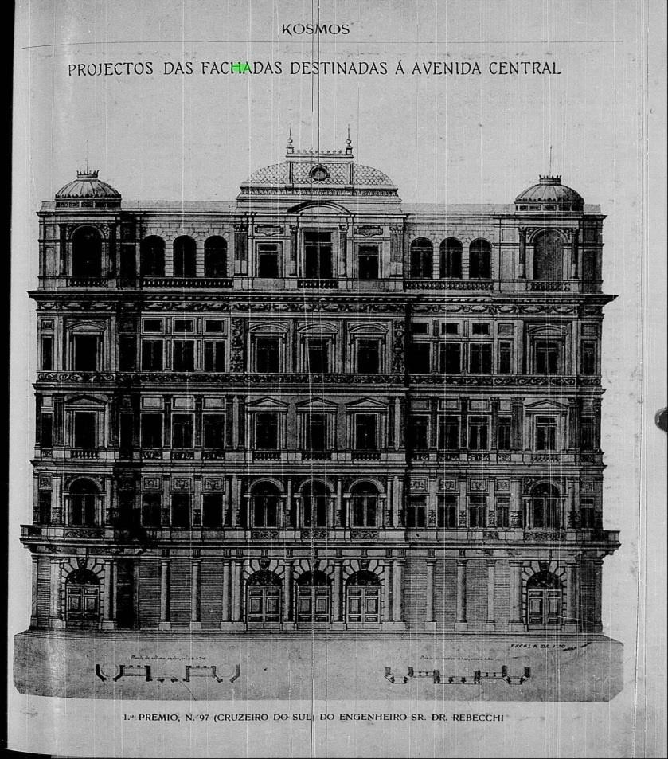
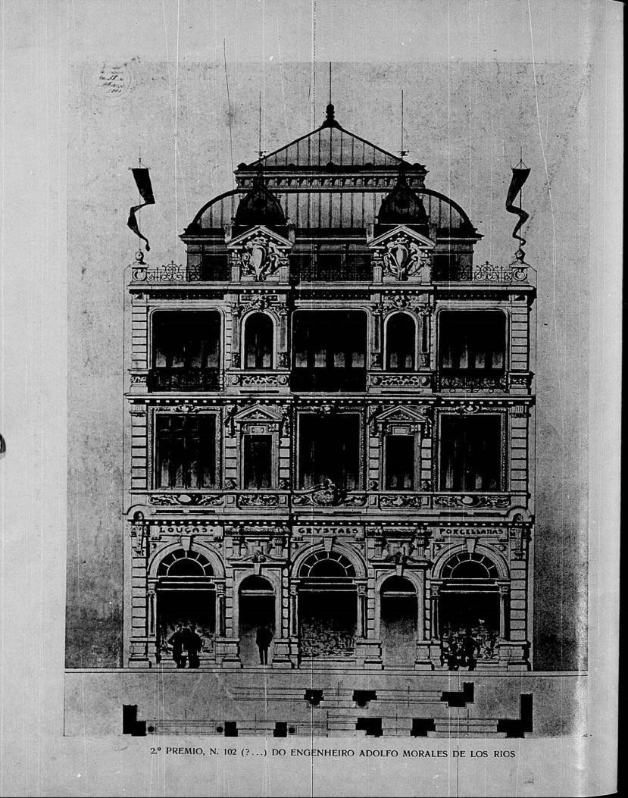
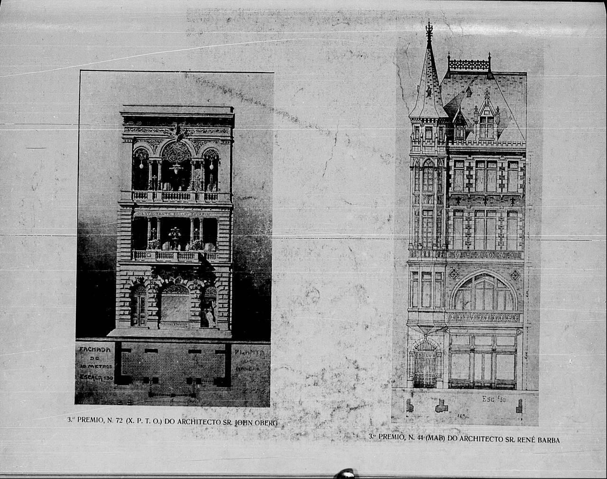
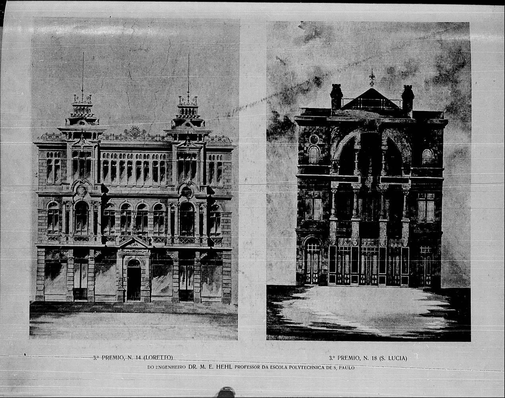

# Resumo

> As transformações urbanas mobilizadas no Rio de Janeiro do início do
> século XX remodelavam a urbe de aspectos coloniais para uma cidade
> embelezada e salubre. Uma nova arquitetura se descortinava no Rio de
> Janeiro de Pereira Passos e a Avenida Central era "espelho e vitrine"
> das descobertas de novos costumes, modas e, principalmente, de
> arquitetura. Neste espaço de efervescência de mudanças urbanas,
> econômicas e sociais, pululavam questionamentos sobre a cidade em
> construção e a cidade que deveria ser construída. De um lado figuras
> como a de Lima Barreto questionavam a pertinência de tanta
> suntuosidade nos edifícios, que de tão "garridos e catitas" se
> tornavam opressores e inibiam os "pobres-diabos" de adentrar em suas
> portas ou ao menos transitar em suas calçadas, a arquitetura que não
> parecia ser brasileira, nem por suas formas, nem pelos seus materiais.
> Do outro lado, os entusiastas como Olavo Bilac, que ansiavam pela
> cidade civilizada e moderna, se deslumbravam com a nova arquitetura e
> louvavam o fim do "reinado dos mestres-de-obras" e de suas obras de
> feições coloniais. Diante da nova artéria que se rasgava no velho
> centro da cidade o presente artigo se presta a apreender as
> sensibilidades, gostos emanados pelo Concurso de Fachadas promovido
> pela Comissão Construtora da Avenida Central, destacando as
> representações de cronistas em periódicos da época.

**Palavras-chave:** Rio de Janeiro, transformações urbanas,
representações, sensibilidades, cronistas

# Abstract

> The urban transformations mobilized in Rio de Janeiro the early
> twentieth century have reshaped aspects of the colonial town for an
> embellished and salubrious city. A new architecture unfolded in
> Pereira Passos' Rio de Janeiro, and Avenida Central was \"mirror and
> vitrine\" from the discoveries of new customs, fads and, mainly,
> architecture. In this space of urban unrest, economical and social
> changes, questions teemed over the city under construction and the
> city should be built. On one side figures like Lima Barreto questioned
> the relevance of such magnificence in the buildings, so that "gaudy
> and quaint" became oppressors and inhibited the poor devils to enter
> into their doorway or at least carry over into their sidewalk,
> architecture that does not seem to be Brazilian, nor forms, nor by its
> material. On the other hand, enthusiasts like Olavo Bilac, who longed
> for the civilized and modern city, dazzled with the new architecture
> and praised the end of the "reign of the construction foremen" and his
> works of colonial features. Faced with the new artery was tearing on
> the old city center this article lends itself to grasp the
> sensitivities, tastes emanating from the Concurso de Fachadas by the
> *Comissão Construtora da Avenida Central*, emphasizing the
> representations of chroniclers in periodicals of the time.
>
> **Keywords:** Rio de Janeiro, Urban transformation, representations,
> sensitivities, chroniclers

De todos os feitos de Pereira Passos em sua gestão1, a rapidez da
execução da Avenida

> 1 Apesar de ter ser atribuída unicamente à Pereira Passos, as obras da
> Avenida Central foram engendradas pelo Governo Federal. Contudo, a
> maioria das obras complementares para as ruas vicinais e edifícios

Central foi possivelmente o mais memorável. As obras foram iniciadas em
setembro de 1904 e encerradas em novembro de 1905. Com a notícia da
criação de novos lotes desocupados em pleno centro da cidade às margens
das novas ruas e avenidas, assim como os anseios de explorar uma nova
arquitetura, levaram a Comissão Construtora da Avenida Central a lançar
o Concurso de Fachadas no início de 1904, para que ficassem prontas ao
término da execução das obras avenida (BRENA, 1985, p.143).

A rapidez das obras e o descortinar de andaimes e tapumes aumentaram o
êxtase e o deslumbramento, como testemunharam vários cronistas. Olavo
Bilac registrou o espanto

-- que, reconhece, não era apenas do "povo rude", do "pobre
desconfiado", mas também dos cultos e doutos: "Os olhares, mergulhando
na Avenida, pasmavam diante da sua prodigiosa amplitude. (\...).Já lá se
vão cinco dias. (\...).O choque foi rude demais. A calma ainda não
renasceu." (BILAC, 1905, s/p)

O período de demolições do governo de Pereira Passos despertou na mídia
impressa -- da capital federal, das demais capitais e de muitas outras
cidades pelo Brasil -- a euforia pela ideia de renovação. O jornal *O
Paiz* anunciara em duas matérias de capa os projetos de demolições para
a construção da nova avenida do centro da cidade e da avenida do cais do
porto. 2 A revista *Kosmos*, de setembro de 1907, publicou matéria em
que

afirmava que a partir construção da avenida era que se começava a
independência do Brasil, por isto o nome da avenida deveria ser Sete de
Setembro - a marcar a alforria do Rio de Janeiro da condição de cidade
colonial (cf. SOUSA, 2013, p.93).

O texto de Bilac é ilustrativo de questões importantes então em pauta.
Uma em especial mobiliza os interesses deste artigo: mapear e investigar
as sensibilidades urbanas em formação e transformação entre o final do
século XIX e as primeiras décadas do XX. Mais ainda, e especificamente,
procurar discutir, em meio a tantas representações negativas sobre a
cidade colonial, sua arquitetura e paisagem (cf. DANTAS, 2009), se é
possível identificar elementos - narrativos e ou imagéticos - que
levariam, décadas depois, a construção de uma nova sensibilidade e de um
novo gosto em relação ao chamado colonial.

Voltemos, por ora, ao texto de Bilac. Chamou-lhe atenção como a
inauguração da Avenida Central despertara o interesse e o debate,
expressando um bem vindo "instintivo bom gosto subitamente nascido". As
discussões sobre o "bom e o mau", mesmo entre aqueles que nunca
receberam "a noção mais rudimentar da arte da arquitetura". Como vários
outros publicistas e intelectuais de então, Bilac perceberia e louvaria
um determinado caráter pedagógico nas reformas materiais da cidade:

> A melhor educação é a que entra pelos olhos. Bastou que, deste solo
> coberto de baiúcas e taperas, surgissem alguns palácios, para que
> imediatamente nas almas mais incultas brotasse de súbito a fina flor
>
> oficiais couberam à prefeitura. Mais informações em ANDREATTA, 2006,
> p.199. Sobre as reformas do período Pereira Passos, ver, dentre
> vários, "Pereira Passos; um Haussmann tropical. A renovação urbana do
> Rio de Janeiro no início do século XX" (BENCHIMOL, 1990), "Rio de
> Janeiro na Época da Av. Central" (KOK, 2005), "Fragmentos urbanos:
> representações culturais." (FABRIS, 2000), "Literatura como Missão:
> tensões sociais e criação cultural na Primeira República." (SEVCENKO,
> 2003), "O Rio de Janeiro de Pereira Passos -- uma cidade em questão
> II" (BRENNA, 1985).
>
> 2 Sobre o Cais: O Paiz, edição de 4 de junho de 1903 em
>
> [\<http://](http://memoria.bn.br/pdf/178691/per178691_1903_06810.pdf)m[emoria.bn.br/pdf/178691/per178691_1903_06810.pdf](http://memoria.bn.br/pdf/178691/per178691_1903_06810.pdf)
> \>/ Sobre a Avenida Central: O Paiz, edição de 5 de maio de 1903 em
> [\<h](http://memoria.bn.br/pdf/178691/per178691_1903_06805.pdf)t[tp://memoria.bn.br/pdf/178691/per178691_1903_06805.pdf](http://memoria.bn.br/pdf/178691/per178691_1903_06805.pdf)\>.
> Acessado em 20/05/2013.
>
> do bom gosto: olhos, que só haviam contemplado até então betesgas,
> compreenderam logo o que é a arquitetura. **Que não será quando da
> velha cidade colonial, estupidamente conservada até agora como um
> pesadelo do passado, apenas restar a lembrança?** (BILAC, 1905; grifos
> nossos).

Perceba-se o substrato da saudação de Bilac à nova arquitetura e,
principalmente, ao novo gosto: a crítica às taperas, baiúcas e betesgas,
expressões materiais do atraso, da incivilidade e da insalubridade que
se fazia necessário superar (de preferência, pela demolição e
arrasamento), como apontavam em maior ou medida os discursos
"progressistas", técnicos e políticos.

Este artigo, numa perspectiva da história cultural urbana, parte da
estratégia metodológica de focar as discussões em torno de um evento
específico - no caso, o concurso de fachadas e a consequente inauguração
da Avenida Central - que mobilizam sentimentos, ações, críticas,
disputas, enfim, que exacerbam tensões e assim permitem iluminar
lugares-comuns e fundos-comuns das justificativas dos processos de
modernização.

Aqui, pretende-se investigar este olhar como em um espelho invertido. Há
contrapontos à quase homogênea representação negativa da cidade colonial
- essa aporia aos cenários de modernização de gosto elitista e
europeizado? em qual registro operam? que estratégias - narrativas e
imagéticas - são estruturadas?

Várias vozes se manifestaram a respeito da cidade em transformação, e
como alguns dos substratos para esta análise se fará uso de textos das
crônicas dos escritores Lima Barreto, Olavo Bilac, Gil, Joao do Rio,
além de editoriais de periódicos da época - como O Malho, Kosmos, Gazeta
de Notícias e Correio da Manhã. Busca-se desta forma ter acesso a um
discurso que muitas vezes não é ouvido: os discursos "não-oficiais",
como o da literatura criativa3. Por meio deste procedimento têm-se, em
princípio, dois tipos

textuais principais dos quais se poderá fazer a análise dos "imaginários
urbanos" (GORELIK, 2004): a crônica jornalística (refere-se à descrição
minuciosa de fatos cotidianos com certa isenção do autor) e a crônica
narrativo-descritiva (cerne descritivo permeado pelas narrativas do
autor); esta visão alternada permite ao leitor a assimilação das
sensibilidades do autor.

O período analisado está compreendido entre a exposição dos trabalhos
enviados para o Concurso de Fachadas em março de 1904, e a inauguração
da primeira fase de inaugurações da grande artéria em 15 de novembro de
1905, é neste hiato que ocorreram os principais debates sobre Avenida e
sua arquitetura.

# Fachadas, cenários e possibilidades de análise

Em busca de (re)encontrarem seus nichos na nova urbe que se construía (e
se destruía) às suas vistas, os citadinos se vem diante a debates
provocados direta ou indiretamente pelas mudanças físicas, políticas e
sociais na cidade. Para entender estes discursos partimos do pensamento
de David Harvey (2006, p.18), que defende que não se pode se aproximar
da cidade e da experiência urbana por meio de uma visão unilateral; mais

> 3 Sobre o uso da literatura criativa como fonte histórica ver "O Homem
> e o Mundo Natural" de Keith Thomas,1989. p.19

ainda, como afirma Alain Corbin (1989), as paisagens são inerentes aos
indivíduos que as contemplam, por transporem o olhar, elas mobilizam
sentidos e propõem leituras, criam significações, emoções e identidades.

Para a discussão sobre os textos (crônicas, editoriais, etc.) que será
feita no próximo item, recorremos ao conceito de representação, aqui
visto como a visão que um determinado indivíduo (que pode expressar
visões gerais de um determinado grupo social) tem acerca de um
acontecimento e a consequente reflexão sobre ele. Para a historiografia
e para a compreensão da formação e/ou uso de imagens4 é necessário
relacionar a discussão do conceito de representação ao de *lugar-comum*
e *fundo- comum*.5

Carlo Ginzburg (1991, p.13), afirma que se numa pesquisa histórica os
dados se limitam a documentos alternativos, deve-se criar um método de
"conexões puramente formais", onde o produto final da pesquisa terá sua
confiabilidade intacta. Este pensamento é partilhado por Harvey, que
afirma que a partir do uso de várias fontes secundárias, se faz
necessário criar um mecanismo de estudo maior para se chegar a uma
síntese convergente entre essas fontes.

O uso de fontes alternativas para a coleta de dados de determinadas
frações da sociedade se baseou nas explicações de Ginzburg (2006), que
apontou a importância do uso destas fontes singulares na composição da
pesquisa. Para utilizá-las sem anacronismos ou interpretações genéricas,
fez-se necessário o uso de uma metodologia de análise textual, a exemplo
daquela proposta pelo crítico literário Antônio Cândido (2006), em seu
livro *Literatura e Sociedade.* De acordo com Cândido, o problema
fundamental para a análise literária em grande número de obras,
sobretudo de teatro e ficção é averiguar como a realidade social se
transforma em componente de uma estrutura literária, a ponto dela poder
ser estudada em si mesma; e como só o conhecimento desta estrutura
permite compreender a função que a obra exerce. Esta abordagem também
foi aplicada por Roberto Schwarc em *Ao Vencedor, as Batatas* (2000), em
que afirma que o artista é também expressão do processo social em que
registra. Cândido também cita Sainte Beuve, que explica como deve ser
interpretado o eu-lírico (ou narrador):

> O poeta não é uma resultante, nem mesmo um simples foco refletor;
> possui o seu próprio espelho, a sua mônada individual e única. Tem o
> seu núcleo e o seu órgão, através do qual tudo que se passa se
> transforma, porque ele combina e cria ao devolver à realidade. (BEUVE
> apud CANDIDO, 2006, p. 28).

# O Concurso de Fachadas sai do papel

As duas iniciativas de intervenções na capital federal foram norteadas
por dois sentidos distintos: uma conduzida pelo Governo Federal e
projetada pelo ministro Lauro Müller e o engenheiro Francisco Bicalho;
outra conduzida pela Prefeitura do Rio de Janeiro por meio de Francisco
Pereira Passos. O Plano municipal e o federal se articulavam e se
complementavam, por isso deveriam ser vistos conjuntamente. Dentre suas
principais obras, destacam-se a construção da Avenida Atlântica, a
Avenida Beira-Mar e a Avenida Central (atual Avenida Rio Branco).

> 4 Perspectivas (visão e reflexão) que os indivíduos têm sobre a
> cidade.
>
> 5 Sobre o conceito de lugar-comum e fundo-comum, ver Stella Bresciani
> (2001).

O Concurso de Fachadas foi anunciado em 29 de janeiro de 1904 e os
projetos participantes, já com os vencedores devidamente premiados,
foram expostos ao público na Escola de Belas-Artes no final de março de
1904. A Revista Renascença, de abril de 1904, apresentou uma descrição
detalhada do processo do Concurso de Fachadas e de sua repercussão logo
após a exposição dos projetos ao público. De acordo com a publicação o
programa do concurso era o mais amplo o possível, e tinha como
condicionantes o número mínimo de pavimentos (três) e larguras de
fachadas entre 10 e 35 metros. O júri foi composto pelo prefeito Pereira
Passos, Saldanha Gama (diretor da Escola Polytechnica), Arão Reis
(engenheiro, representando o Instituro Polytechnico), Feijó Júnior
(médico, representando a Academia de Medicina) e Rodolpho Bernadelli
(escultor, diretor da Escola Nacional de Bellas-Artes e colaborador da
Revista Renascença). Além destes membros, no dia da escolha dos projetos
vencedores, o júri foi presidido por Lauro Muller (engenheiro, Ministro
da Viação), com assistência de Paulo de Frontin, engenheiro-chefe da
Avenida Central. Os autores das fachadas vencedoras foram (por ordem de
colocação): Eng. Raphael Rebechi (Fig. 1), Eng. Adolpho Morales de Los
Rios (Fig. 2), e três terceiros colocados: Eng. M.E. Hehl (Fig. 3), Arq.
René Bahia e Arq. John Oberg (Fig. 4). Sinalizamos nos comentários
finais do editorial exibidos no excerto a seguir, a repercussão que se
observava imediatamente após a divulgação do Concurso, o "renascimento
do gosto arquitetônico" com o aumento de matrículas na seção de
arquitetura na Escola Nacional de Bellas-Artes (ENBA) e de engenheiros
que se especializaram em arquitetura na Escola Polytechnica:

> Não entra nos nossos intuitos comentar a decisão do jury; Os próprios
> concorrentes a aceitaram sem reclamação, entretanto, devemos fazer
> constar um fato auspicioso para o renascimento do nosso gosto
> architectonico. Effetivamente, a matricula deste anno na Escola de
> Bellas Artes, na seção de Architectura da mesma escola, tem sido muito
> superior a dos annos precedentes, e bem assim sabemos que outros
> jovens engenheiros formados pela Escola Polytechnica, tratam de cursar
> e formar-se na especialidade de architectura. É esta, sem dúvida
> alguma, uma consequência proveitosa do concurso de fachadas em boa
> hora ideado pela administração pública, e não fosse senão por motivo
> desse movimento de renascimento artístico seria preciso felicital-a, e
> é o que aqui fazemos. (RENASCENÇA, abril de 1904, apud. BRENNA, 1985,
> p. 162 - 165).

No mesmo período, a Revista Kosmos publicou uma crônica de Olavo Bilac
sobre a nova arquitetura que se propunha a construir na cidade, que
ocuparia o lugar do "mau gosto e incompetência dos mestres-de-obra".
Bilac revela a sua surpresa "que excedeu as mais optimistas previsões"
com os projetos do Concurso de Fachadas expostos na ENBA, a qualidade
dos projetos foi atribuída primeiramente às leis rigorosas criadas pelo
governo para as novas construções e à liberdade estética dada aos
arquitetos para criar as fachadas. Ao questionar onde estava escondido
tanto talento artístico que não se via nos edifícios pela cidade, Bilac
justifica que o "gosto publico estava depravado e corrompido", que a
cidade estava sob o jugo do mestre-de-obras, desqualificado para o
trabalho arquitetônico por que este era "nada amigo de novidades,
aferrado às tradições e desprovido de diploma" (BILAC, 1904, s/p).

> 

**Figura 1 - Projeto para lote nº 97, Eng Raphael Rebechi - Fonte:
Revista Kosmos, abril de 1904.**

> 

**Figura 2 - Projeto para lote nº 102, Eng. Morales de los Rios - Fonte:
Revista Kosmos, abril de 1904**

> 
>
> **Figura 3 - Projeto para lote nº 72, Arq. John Oberg e lote nº48,
> Arq. René Bahia - - Fonte: Revista Kosmos, abril de 1904**
>
> 
>
> **Figura 4 - Projetos para lotes nº14 e nº 18, Eng. M.E. Hehl - Fonte:
> Revista Kosmos, abril de 1904**

Outro expectador privilegiado do Concurso de Fachadas foi o escritor
Lima Barreto. Na crônica "As Fachadas", atribuída ao mesmo período, o
autor revela posicionamento destoante àquele sentido pelos cronistas
apresentados anteriormente. Não havia um descontentamento de Barreto
quanto à qualidade dos croquis; a sua principal crítica voltava-se à
ausência de alguns estilos arquitetônicos no repertório apresentado que
fossem condizentes com a posição geográfica e com o clima da cidade.
Além disto,

apontou a ausência de um estilo próprio e que, dado o que foi
apresentado, pareciam que os autores eram predominantemente italianos:

> Esta ausência dos estilos orientais é bem de pasmar. Por fortes
> motivos, era de esperar que os nossos arquitetos quisessem imitar
> aquelas mesquitas e pagodes das Índia e da Pérsia. **Levou o vivermos
> nós quase sob as mesmas linhas astronômicas e climatéricas, acrescia
> às tradições peninsulares de nossa raça** \[sic\]. Eu esperava, ao
> entrar naquela sala, encontrar algum projeto, em que a influência de
> Alhambra, da mesquita de Omar ou do túmulo de Aurenz-Keb se fizesse
> poderosamente sentir, mas -- como falham as nossas previsões
>
> -- lá não vi algum que, embora de longe, traduzisse aquela influência.
> Compensando encontrei as puras linhas do Paternon, as sóbrias ogivas
> de gótico flamejante e umas reminiscências do rumaco \[sic\]. E não
> era de se esperar outra coisa. Sobre **sermos nós um povo sem uma
> modalidade de arte própria**, argumentava para que lá se desse a
> predominância de artistas estrangeiros, especialmente italianos, como
> sendo autores da maioria dos projetos. (BARRETO, 2010, p. 584; grifos
> nossos)

Ainda durante a sua construção, a repercussão da nova arquitetura feita
para a nova avenida foi alvo do jornal A Notícia, que publicou uma
crônica intitulada "Domos e cúpulas", em setembro de 1905. No texto, o
autor critica certos aspectos da arquitetura que está sendo produzida na
Avenida dando como exemplo a construção indiscriminada de Domos e
"zimbórios" nos novos edifícios, que pareciam estar subvertidos de suas
funções no agenciamento interno dos prédios, e surgiam nas fachadas
apenas como recursos de ornamentação:

> Não atinei ainda com o motivo da quasi obrigatoriedade a que se
> impuseram, em grande maioria, os proprietários das casas da nova
> artéria urbana, de as fazerem com zimborios ou domos de madeira e
> zinco. Lembram alguns desses domosinhos os systemas de construcções
> efêmeras que se levantam por occasião de festas e regosijos populares.
> Convém, entretanto, frisar, como singularidade, que alguns daquelles
> pequenos zimborios da Avenida se armaram em prédios de solida e
> durarou alvenaria. Não se infira dagi eu sou contrario aos domos,
> zimborios e cupulas na architectura civil; penso apenas que esse
> systema constructivo ou estylo decorativo só deve apparecer quando
> exprima uma necessidade, naturalmente ornamental, mas decorrente da
> disposição interna, indispensavel e apropriada, do edifício. O
> architecto moderno não poderá abraçar outro programma. Não é
> exclusivamente pelo efeito apparatoso que se deve distinguir um
> edifício (A NOTICIA, Domos e cúpulas, 20 de setembro de 1905. apud
> BRENNA, 1985, p.382- 383).

Quando foi finalmente inaugurada, em 15 de novembro de 1905, a grande
Avenida havia se tornado uma vitrine da modernidade e luxo se podia
exigir dos engenheiros, arquitetos e artesãos da época. Como não poderia
ser diferente, as opiniões se dividem novamente. Enquanto Gil exaltava a
"cura" feita pela ação cirúrgica do governo ao

dilatar a grande artéria em "Do Aleixo Manuel a Avenida Central"
(publicado na revista Kosmos de 1905), Lima Barreto, o *flaneur* com os
pés de chumbo6, dava seu parecer

> 6 Expressão cunhada por Maria Cristina Machado para um dos personagens
> de Lima Barreto, Gonzaga de Sá, um de seus veículos para vociferar
> contra o sistema vigente e a cidade desigual.

para as duas alas de edificações já concluídas. Ora, a arquitetura não
havia modificado daquela proposta no Concurso, mas ali, implantada,
ainda que catita, pode-se dizer que estava "fora do lugar", segundo o
registro de Barreto:

> Ontem se inaugurou a Avenida. Está bonita, cheia de canteirinhos,
> candelabros, etc. Mas os edifícios são hediondos, não que sejam feios.
> Ao contrário, são garridos, pintadinhos, catitas, **mas lhes falta,
> para uma rua característica da nossa pátria, a majestade, a grandeza,
> o acordo com o local. Com a nossa paisagem solene e mística**.
> Calculas tu que na cidade do granito, na cidade dos imensos monólitos
> do Corcovado, Pão-de-Açúcar, Pico do Andaraí, não há na tal
> Avenida-montra, um edifício construído com esse material! (BARRETO
> apud FABRIS, 2000, p.79)

Olavo Bilac, por sua vez, depositava na nova arquitetura a missão de
reeducar a população, de inspirar novos hábitos, costumes e, obviamente,
perpetuar a plástica daqueles edifícios pela cidade: "A melhor educação
é aquela que entra pelos olhos" (Gazeta de Notícias, 19 de novembro de
1905). De acordo com Anna Teresa Fabris (2000, p.24), Bilac acreditava
que o renascimento da cidade seria também o renascimento moral de seus
indivíduos. Contudo, para sua decepção, Bilac presenciou a resistência
popular não apenas as reprimendas feitas pelo governo para sua livre
circulação nas imediações da Avenida Central, mas a manutenção de seus
costumes:

> Num dos últimos domingos, vi passar pela Avenida Central um carroção
> atulhado de romeiros da Penha: e naquelle amplo boulevard esplendido,
> sobre o asphalto polido, entre as fachadas ricas dos prédios altos,
> entre as carruagens e os automóveis que desfilavam, o encontro do
> velho vehiculo, em que os devotos bêbedos urravam, me deu a impressão
> de um monstruoso anachronismo: era a ressurreição da bararia, - era a
> idade selvagem que voltava, como uma alma do outro mundo, vindo
> pertubar e envergonhar a vida da idade civilizada\...(BILAC, 1906,
> s/p).

A missão de modernização no centro da cidade ainda não estava completa.
A presença do antigo Convento D'Ajuda era um entrave à beleza plena da
Avenida. Durante os anúncios de sua demolição, Lima Barreto se posiciona
contrariamente em *O Convento,* ao desqualificar o conceito de beleza
como argumento válido para o arrasamento, tendo em vista que se trata de
um valor elástico. Premonitoriamente, argumenta que, baseado no conceito
de beleza o Teatro, recém-construído, também poderia ser demolido:

> Houve um grande contentamento nos arraiais dos estetas urbanos por tal
> fato. Vai-se o monstrengo, diziam eles (\...). Eu sorri de tão santa
> crença, porque, se o Convento da Ajuda não é tão bonito como o Teatro
> Municipal, tanto um como outro não são belos. **A beleza não se
> realizou em nenhum dos tais edifícios daquele funil elegante** \[a
> Avenida\]; e se deixo o Teatro Municipal, e olho o Club Militar, a
> monstruosa Biblioteca, a Escola de Belas-Artes, penso de mim para mim
> que eles são bonitos de fato, mas um bonito de nosso tempo, convento o
> foi dos meados do nosso século XVIII. (\...) O bonito envelhece, e bem
> depressa; e eu creio que, daqui a cem anos, os estetas urbanos
> reclamarão a demolição do Teatro Municipal com o mesmo afã com que os
> meus contemporâneos reclamaram a do convento (BARRETO, 2004, p.
> 99-100).

# À guisa de conclusão

O debate em torno da inauguração da Avenida Central do Rio de Janeiro
permite pontuar diversas questões que marcariam -- ou mesmo já marcavam
-- o campo cultural e disciplinar da arquitetura, do que seria chamado
urbanismo anos depois e da produção artística. Da recorrente crítica à
herança colonial e para suas expressões materiais e culturais, passando
pela necessidade de espraiar o gosto requintado de sabor europeu pela
produção acadêmica, até as diatribes e ironias, ainda sem formulação tão
precisa, acerca de estilos mais adequados ao clima e aos trópicos,
vários temas se cruzaram e se rebateram.

É consabido que esse momento é atravessado pelas angústias e (o)pressões
de formação das sensibilidades e dos gostos modernos, como resposta e
expressão em relação a novos padrões de sociabilidade, de encontro e
confronto social. Ao lado dos cenários e dos hábitos afrancesados, a
estruturação dos territórios populares e a permanência de uma paisagem
colonial -- que seria constantemente demolida, arrasada, mutilada nos
anos e décadas seguintes. Contudo, essa leitura em negativo parece
constituir-se um denominador comum, ou porque atentava contra a
*finesse* do bom gosto, ou porque feria a correição de médicos e
sanitaristas.

Ainda assim, percebe-se a emergência de incômodos em relação à
destruição dessa paisagem que, ao cabo, constituía, bem ou mal, uma
tradição, parte da paisagem pitoresca tão louvada pelos registro
viajantes desde a primeira metade do século XIX (e que se repetiria nos
Guias Artísticos do início do século XX).7 Mesmo um arrivista como João
do Rio se questionava quando o brasileiro descobriria o Brasil. Para
seus conterrâneos "ultramodernos", o país passou a existir apenas depois
da abertura da Avenida Central. Com um quê irônico, diria: "O resto não
nos interessa, o resto é inteiramente inútil".8

Mas é, indubitavelmente, em Lima Barreto que esse incômodo ganharia
tintas carregadas:

> "A minha alma é de bandido tímido, quando vejo desses monumentos,
> olho-os, talvez, um pouco, como um burro; mas, por cima de tudo, como
> uma pessoa que se estarrece de admiração diante de suntuosidades
> desnecessárias. (\...) O Estado tem curiosas concepções, e esta, de
> abrigar uma casa de instrução, destinada aos pobres-diabos, em um
> palácio intimidador, é das mais curiosas. (\...). **A velha biblioteca
> era melhor, mais acessível, mais acolhedora, e não tinha a empáfia da
> atual**." (BARRETO, Correio da Noite, 13 jan. 1915)

A ideia do acolhimento, do sentimento de pertencimento e proximidade
revelam um olhar atento para as velhas casas e monumentos que vinham
sendo constantemente destruídas. Olhar que, por vários desdobramentos
nas décadas de 1920 a 1940 (assunto que não é possível discutir agora),
vai apontar para novas sensibilidades em relação à arquitetura das
cidades antigas, coloniais.

> 7 Cf. e.g. o Guia Artístico da Cidade do Rio de Janeiro (1905) e o
> Guia da Cidade do Rio de Janeiro (1922).
>
> 8 João do Rio In Cinematographo, 2009.

# Referências Bibliográficas

> ANDREATTA, Verena Vicentini. **Cidades Quadradas Paraísos
> Circulares.** Rio de Janeiro: Mauad, 2006.

BARRETO, Lima. Fachadas. In: . SCHWARCZ, Lilia Moritz (Org).

> **Contos Completos.** São Paulo: Companhia das Letras, 2010.

. O Convento. In: .RESENDE, Beatriz (Org). **Toda Crônica:** Lima
Barreto. Rio de Janeiro: Agir, 2004.

> . O Conselho Municipal e a arte. In: .**Vida Urbana:**

Artigos e Crônicas. São Paulo: Brasiliense, 1961. 2ª edição.

BILAC, Olavo. Chronica, **Revista Kosmos**, outubro de 1906. Disponível
no site da Biblioteca Nacional Digital em:

\<<http://memoria.bn.br/pdf/146420/per146420_1906_00010.pdf> \> . Acesso
em: 18/05/13.

. Chronica. **Gazeta de Notícias**, 19 de novembro de 1905. Disponível
no site da Biblioteca Nacional Digital em:

\<[http://memoria.bn.br/DocReader/docreader.aspx?bib=103730_04&pasta=ano%20190](http://memoria.bn.br/DocReader/docreader.aspx?bib=103730_04&amp;pasta=ano%20190)

&pesq=Bilac\>.Acesso em: 25/05/13

> CÂNDIDO, Antônio. **Literatura e Sociedade.** Rio de Janeiro: Ouro
> Azul, 2006. 9ªedição.

CHIAVARI, Maria Pace. As Transformações Urbanas do século XX. In:
BRENNA,

> Giovanna Rosso Del. **O Rio de Janeiro de Pereira Passos -- uma cidade
> em questão II.** Rio de Janeiro: PUC/RJ, 1985.
>
> CORBIN, Alain. **Território do Vazio:** a praia e o imaginário
> ocidental. São Paulo: Cia. das Letras. 1989.
>
> DANTAS, George A. F. **A formação das representações sobre a cidade
> colonial no Brasil.** 2009. 237p. Tese - Escola de Engenharia de São
> Carlos (EESC)**.** São Carlos: Junho de 2009.
>
> FABRIS, Annateresa. **FragmentosUrbanos:** representações culturais.
> São Paulo: Nobel, 2000.

GINZBURG, Carlo. **Mitos, Emblemas e Sinais:** morfologia e história.
Tradução de Federico Carotti; São Paulo: Companhia das Letras, 1991.

**. O queijo e os vermes**: O cotidiano e as idéias de um moleiro
perseguido pela Inquisição. São Paulo: Companhia das Letras, 2006.
3ªedição

> GORELIK, Adrián. Imaginarios urbanos y imaginación urbana. Para um
> recorrido por los lugares comunes de los estúdios culturales urbanos.
> In: . **Miradas sobre Buenos Aires, historia cultural y critica
> urbana**. Buenos Aires: 2004.

GUIA ARTÍSTICO DA CIDADE DO RIO DE JANEIRO. Rio de Janeiro: Photo Studio
Huberti, 1922. Disponível na Biblioteca Nacional Digital:

\<<http://objdigital.bn.br/objdigital2/acervo_digital/div_iconografia/icon325341/icon3253>

41.pdf\> Acesso em: 20/03/14.

GUIA DA CIDADE DO RIO DE JANEIRO. Rio de Janeiro: Offs Graphica e
Bevilacqua. 1905. Disponível na Biblioteca Nacional Digital: \<
<http://objdigital.bn.br/objdigital2/acervo_digital/div_iconografia/icon705113/icon70511>
3.pdf\> Acesso em: 20/03/14.

> HARVEY, David. **Paris, capital of modernity.** Oxon (Great Britain):
> Routledge, 2006.
>
> KESSEL, Carlos. **Entre o Pastiche e a Modernidade: Arquitetura
> Neocolonial no Brasil.** Tese. 2002. Universidade Federal do Rio de
> Janeiro. Rio de Janeiro: 2002.

Los RIOS, Adolfo Morales. A Grande Avenida. Série de grandes obras - A
avenida da prefeitura: **Jornal O Paiz**, edição de 5 de maio de 1903 em

\<<http://memoria.bn.br/pdf/178691/per178691_1903_06805.pdf>\>. Acesso
em 20/05/13.

Los RIOS, Adolfo Morales. Os Novos Caes. Série de grandes obras - A
avenida da prefeitura. **Jornal O Paiz**, edição de 4 de junho de 1903
em

\<<http://memoria.bn.br/pdf/178691/per178691_1903_06810.pdf> \>. Acesso
em 20/05/13.

MACHADO, Maria Salete Kern. **O Imaginário Urbano.** In: BRESCIANI,
Maria Stella.(org).Palavras da Cidade. Porto Alegre: Editora
Universitária UFRS, 2001.

PAIXÃO, Cláudia Miriam Quelhas. **O Rio de Janeiro e o morro do
Castelo**: populares, estratégias de vida e hierarquias sociais. 2008,
159 p. Dissertação -- Universidade Federal Fluminense. Niterói: 2008.

PROJECTOS DAS FACHADAS DESTINADAS A AVENIDA CENTRAL. **Revista**

**Kosmos**, abril de 1904. Disponível no site da Biblioteca Nacional
Digital em:

\<<http://memoria.bn.br/pdf/146420/per146420_1904_00004.pdf>\> Acesso
em: 20/05/13. SCHWARZ, Roberto. **Ao vencedor, as batatas.** São Paulo:
Editora 34, 2000. 5ª edição.

SEVCENKO, Nicolau. **Literatura como missão:** tensões sociais e criação
cultural na Primeira República. São Paulo: Brasiliense, 1995. 4ª edição.

SOUSA, Rebeca G. **Da Cidade Colonial a Metrópole Modernizada:** Lima
Barreto e as Reformas Urbanas do Rio de Janeiro no início do século XX.
2013. 125p. Monografia -- Universidade Federal do Rio Grande do Norte
(UFRN). Natal: 1º semestre de 2013.

THOMAS, Keith. **O homem e o mundo natural**: mudanças de atitude em
relação às plantas e aos animais, 1500-1800. São Paulo: Companhia das
Letras, 1989.

> VELLOSO, Mônica. Sensibilidades sociais e história de vida. **Fênix --
> Revista de História e Estudos Culturais.** Uberlândia: Julho/ Agosto/
> Setembro de 2009. Vol. 6, Ano VI, nº 3. Disponível em:
> \<[www.revistafenix.pro.br\>](http://www.revistafenix.pro.br/) Acesso
> em: 20/03/14.
