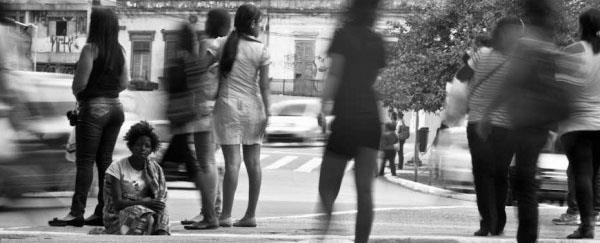
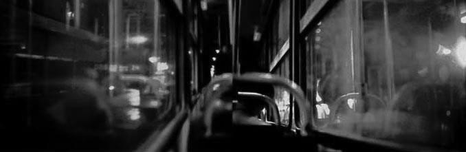
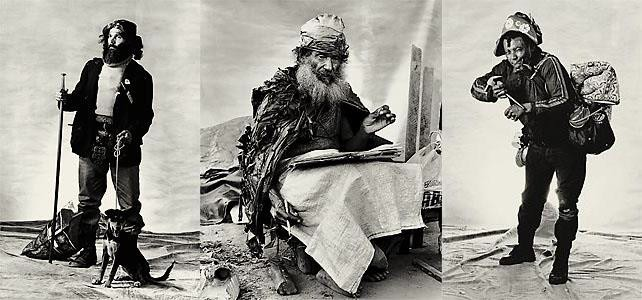
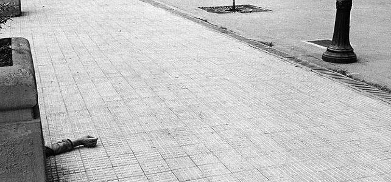

# Resumo

As cidades se apresentam sob diferentes perspectivas para as pessoas, na
maneira como usufruem dos seus espaços, na qualidade ou importância dada
a diferentes experiências vivenciadas. Dada a velocidade com que tudo
ocorre, obriga as pessoas a viverem em certas condições de suspensão,
onde ver é circunstancial e provisório e, logo se apaga da memória. O
ato de ver deve estar adequado à velocidade, às percepções simultâneas,
às transformações e dinâmicas ajustadas a tempos cada vez mais
comprimidos. Nesse conjunto complexo de relações, cuja grande maioria é
efêmera, há num cenário com tantas contingências e simultaneidades que
poucas coisas conseguem se tornar visíveis. Para conseguir visibilidade
é preciso construir uma identidade, sob fortes conflitos nos palcos do
poder, permitindo acessos a bens materiais e simbólicos. Dentro do
conjunto de conflitos, muitos aspectos parecem afetar a todos de modo
indiferenciado, mas principalmente o sentido de alteridade. Nessas
perspectivas, muitas imagens realizadas por fotógrafos deflagram cenas
reveladoras daquilo que para uma grande maioria encontra-se oculto: as
imagens expõem facetas humanas complexas, onde a beleza pode advir
inesperada, como poética singular de uma história de vida e servem como
instrumentos de conhecimento científico e sociológico, como fragmento
metafórico dessa realidade.

Palavras-chave: identidade, memória, alteridade, fotografia,
invisibilidade pública

> **Abstract**

The cities are presented from different perspectives to people, the way
enjoy their spaces, quality or importance given to different
experiences. In the speed which everything happens, it forces people to
live in certain conditions of suspension, where seeing is circumstantial
and temporary and soon fades from memory. The act of seeing must be
appropriate to the speed, the simultaneous perceptions, and the
transformations and dynamic adjusted to increasingly compressed time. In
this complex set of relationships, most of which is ephemeral, there is
a scenario with so many contingencies and concurrences that few things
can become visible. To achieve visibility is necessary to build an
identity under strong conflicts in the power stages, allowing access to
material and symbolic goods. Within the set of conflicts, many aspects
seem to affect everyone in an undifferentiated way, but mostly the sense
of otherness. In these perspectives, many images made by photographers
trigger scenes revealing what for most is hidden: the images expose
complex human facets, where beauty can arise unexpectedly, as singular
poetic story of life and serve as instruments of scientific knowledge
and sociological, as this metaphorical reality fragment.

Keywords: identity, memory, otherness, photography, public invisibility

Quando as cumeeiras de nosso céu se juntarem minha casa terá um telhado.
Paul Éluard

As cidades compreendem territórios fragmentados e palcos para relações
diversas, sendo elas na sua grande maioria, efêmeras. Nos vários lugares
apropriados, adensados em qualidades desiguais de tempo, as relações
humanas dinamizam esses espaços, dando-lhes um sentido. Muitas partes
desses territórios podem ser definidas por características singulares
nos seus modos de apropriação, na forma com que grupos de pessoas tecem
suas relações e resguardam essas suas características como partes
fundamentais da identidade e da memória.

Como imagens integrantes da memória, são capazes de relacionar
diferentes vivências bem como as características dos espaços onde elas
ocorreram. Serão incorporadas ao imaginário e fundamentarão a
subjetividade, a existência pessoal. Cada pessoa constitui um universo
de experiências e de distintos sentidos atribuídos, naquilo que o lugar,
a casa, a rua, a cidade possibilitou desenvolver. Nas variadas condições
da existência, principalmente nas cidades, ver os outros e considerá-los
dentro das relações sociais é mais do que inseri-los no corpo social.
Muitas pessoas não possuem condições adequadas de ascender
economicamente e tornam-se relegadas a situações subumanas, postas às
margens da sociedade.

As relações estabelecidas com os outros são fundamentais, uma vez que a
cidade é constituída por esses laços, e precisam estar visíveis. Quando
os fotógrafos saem na cidade para capturar um instante, eles buscam
fragmentos de tempo e espaço e, principalmente, de flagrar uma verdade
muitas vezes invisível ou dissimulada que dispõe de força para
metaforizar um universo muito mais amplo e complexo. Esse fragmento
fotográfico pode dizer de forma rápida e sensível dos fatos que
espreitam as relações, achado num golpe de luz e sombra e cujo âmbito
expressivo é capaz de tocar nossa arquitetura interior. De modo que num
mundo onde quase todos diagnosticam uma 'escassez de sentidos', abre-se
um lugar para as questões da arte, naquilo que é sua essência: uma
prática definida na produção de sentidos e na intensidade expressiva da
forma e da moral (SARLO, 2006).

Ao mesmo tempo em que captura um aspecto vivido e um modo de pensar
autoral, a imagem suporta abrir um universo muito profundo de coisas a
serem refletidas. No âmbito social, as percepções resultam de demoradas
operações de treinamento e de uma disciplina que não se interrompe
(HALBWACHS, 2006), onde o olhar deve estar preparado para muitos
estímulos, muitas possibilidades de desvendar significados. Diferentes
dinâmicas estratégicas, jogos psicológicos, necessidades e desejos são
intensificados na vida urbana (SEVCENKO, 1995). Nessas situações, as
imagens são fundantes para inúmeras coisas, principalmente como
instrumentos de análise do mundo e como suportes da memória (HALBWACHS,
2006).

Também podem ser enumerados muitos conflitos, e as perguntas servem para
assinalar os problemas. Não sobre exatamente o quê fazer, mas esboçar
novas perspectivas para perceber: como as imagens produzidas sobre
diversas relações humanas desiguais na cidade podem contribuir para
reflexões mais sensíveis, bem como possíveis mudanças? O que essas
imagens denunciam e quais novos sentidos são possíveis de deflagrar? As
representações são aptas a serem nesses casos, construções poéticas
(portanto, associadas às complexidades do fazer artístico) e portam
significados associados às mazelas sociais, instrumentos de denúncia
social, e tornam-se capazes de indicar que essas condições não são um
quadro absoluto e nem

muito menos inevitável. Provocam assim um duplo efeito sensível revelado
por uma superfície pictórica que enaltece as qualidades do olhar, mas
que principalmente aprofunda no sentimento consciencioso, como uma
catarse. As situações dramáticas de violência trazem à tona sentimentos
de terror e piedade, levando seu observador a uma condição purgatória,
quando se identifica com a trágica vida alheia.

A cidade, sob o ponto de vista dos diversos tipos de exclusão parece não
ter fim e é registrada por inúmeros fotógrafos, expondo facetas humanas
complexas, difíceis, onde a beleza pode advir inesperada, como poéticas
de singulares histórias de vida. As imagens deflagram essas
circunstâncias e tornam possível restituir uma narrativa própria, aquilo
que talvez seja imediato e autoevidente, mas capaz de intensificar o ser
sensível. Vários fotógrafos contemporâneos, como Tuca Vieira, Vik Muniz,
Thiago Fogolin, Marcus Freitas, Edison Russo, Viviane Dávila, Lucas
Barros, Virgínia Rodrigues, Ricardo Labastier podem abrir frestas
reveladoras naquilo que para uma grande maioria aparenta invisível.

Também muitos autores de teoria da imagem e fotografia, como Roland
Barthes (1984), (1990), John Berger (1999), Philippe Dubois (1993),
Jacques Aumont (1993), (2004), Boris Kossoy (1999), possibilitam
discussões a serem apropriadas também no campo urbano e social,
juntamente com Maurice Halbwachs (2006), Georg Simmel (2009), Nicolau
Sevcenko (1995), Beatriz Sarlo (2006) e outros, criando interlocuções
produtivas advindas dos registros deflagrados, bem como nos significados
mediados pelos fotógrafos. Na busca da compreensão dos comportamentos e
vivências, aparecem relações humanas complexas no cenário urbano com
atmosfera carregada, contrastes observados na espreita singular de um
mundo específico e suas sombras.

De tal modo que o conhecimento pode ter origem nessa imagem, num tipo de
visão que se entende e igualmente causa desprendimento estético. O
prazer de descobrir abstrai-se como conhecimento consciencioso. Nesse
esforço para apreender, "a um só tempo, o momento que foge e
compreendê-lo como momento fugidio e qualquer \[\...\], o que se
constitui é o ver: uma confiança nova dada à visão como instrumento de
conhecimento, e por que não de ciência" (AUMONT, 2004, p.51). Essas
imagens problematizam o que vemos, como vemos, permitindo analisar e
criar crítica entre sujeitos. É assim instrumento de conhecimento,
operando em novas posturas sociológicas, como fragmentos metafóricos
dessa realidade.

# Luzes, velocidade, fragmentos do real

Quase tudo se move, segue veloz um caminho. Luzes piscam e o estímulo é
brilhante, de alto contraste contra os edifícios do fundo. Outras luzes
são intermitentes, sinalizadoras. Veículos param, viram, seguem adiante
em diferentes velocidades. Alarmes, buzinas, sirenes, motores
acelerando, obras e construções, o movimento é ruído contínuo. Mais
luzes nas vitrines, nas prateleiras, nos objetos, fachadas, outdoors,
postes. Uma mancha passa ao lado, indistinguível, esteve ali apenas
preenchendo o tempo do relance. As transfigurações ocorrem perto, outras
ao longe, enquanto silhuetas entram e saem nas ruas, nos edifícios.
Objetos, figuras, pessoas, veículos, todos com algum ânimo de movimento
e ruído, se deslocam e imprimem nos seus transeuntes, uns nos outros,
vestígios diversos.

Nas cidades ocorre uma multiplicidade de coisas dispersas, simultâneas e
por isso, também confusas. Nos diversos fenômenos que nos permeiam e em
particular aqueles provenientes da cultura, a arquitetura e seu âmbito
urbano causam muitos estímulos num "complexo de acontecimentos sensórios
que provocam uma resposta" (ECO, 2007, p.190). Todos os objetos
arquitetônicos, os códigos e os símbolos inscritos, as

linguagens e demais enunciações, no âmbito urbano promovem estímulos e
estes afetam os comportamentos das pessoas, impregnando-lhes uma
percepção. A cidade desperta nas pessoas diversos índices, "signos que
dirigem a atenção para o objeto por meio de um impulso cego, mas sempre
com base em códigos e convenções comunicacionais" (ECO, 2007, p.191), e
são conflituosos nesse contexto.

As cidades, de modo geral, se apresentam sob diferentes perspectivas
para as pessoas, na maneira como usufruem dos seus espaços, na qualidade
ou importância dada a muitas experiências vivenciadas (HALBWACHS, 2006).
Mesmo os moradores podem se surpreender com determinados lugares, e são
capazes de estabelecer novos vínculos afetivos em outras adjacências.
Esses liames poderão se relacionar às características criadas na
ambiência da praça, do parque, de um recanto, ou como recentes
necessidades surgidas em novos locais, criando assim outros percursos e
mais laços afetivos.

Sentir-se parte de uma cidade ocorre de maneiras muito distintas. Ainda
que certos lugares possam conotar usos e funções muito específicas,
claramente definidas por arquitetos e urbanistas, nada garante, de fato,
que eles irão funcionar daquela maneira (ECO, 1999). As pessoas se
apropriam dos espaços dos modos mais diversos possíveis e ali vão
tecendo relações, criando rotinas que lhes são agradáveis ou
proveitosas.

Pertencer à cidade significa construir a vida tendo por referência as
bases físicas, sociais, políticas e econômicas daquele lugar. Criam-se
estados de ânimo e diferentes relações, como integrantes das memórias de
qualquer fase da vida, partilhando momentos e vivências com vizinhos,
conhecidos, etc. Nesse âmbito, rotinas comuns poderão ser indeléveis da
memória e irão constituir partes importantes dos traços da personalidade
e, em grupo, formadoras de identidade.

> Nossas lembranças permanecem coletivas e nos são lembradas por outros,
> ainda que se trate de eventos em que somente nós estivemos envolvidos
> e objetos que somente nós vimos. Isto acontece porque jamais estamos
> sós (HALBWACHS, 2006, p.30).

Os fatos da memória e igualmente do esquecimento são vitais como
aspectos da sobrevivência, graças a caracteres seletivos advindos das
experiências. A história pessoal se constrói muitas vezes em âmbitos de
fortes conflitos, dúvidas, dificuldades, e esse acúmulo de vivências
intensificarão o "eu". Essa trama da convivência parece ser invisível na
vida, mas se torna fortemente presente quando parte dela é desfeita,
seja na morte de alguém próximo, seja mudando para outra localidade. Nas
demarcações das fronteiras entre eu e o outro as desigualdades imperam,
as diferenças tornam-se patentes e "\...nós podemos superar a angústia
diante da obscuridade do momento vivido, para em seguida ir ter com os
outros espaços do possível" (BAVCAR, 1994, p.463), como esperança também
em palcos de oportunidades.

À medida que novas relações são requeridas, onde o contato é ampliado,
maior se torna o movimento do indivíduo, atenuando as referências de sua
origem. O mais singular de tudo é que, na companhia da multidão é que se
faz notar e intensificar o sentimento de solidão, pois estão ali como
figuras de preenchimento (SIMMEL, 2009) e, nesse constante movimento há
pouca relação sensível (ver fotografia de Thiago Fogolin, Fig.1).

As dinâmicas das relações urbanas também ocorrem de maneira muito
rápida, onde os indivíduos cumprem determinados papéis sociais e passam
a ser, aos olhos dos outros,

coadjuvantes de sua história. Como um conjunto de figurantes tornam-se
tão invisíveis quanto o cenário urbano de fundo, como um teatro de
fenômenos efêmeros. Nesse cenário de tanta simultaneidade, poucas delas
conseguem se tornar visíveis, quando ocorre principalmente a doação
daquele que olha. Visível e invisível são dois aspectos contingentes, na
medida em que o ver indiferenciado é o lugar-comum.

> 
>
> Fig.1. Sem título, Thiago Fogolin, 2013. Disponível em
> \<[http://misturaurbana.com/\>](http://misturaurbana.com/) Acesso em:
> 06 mar. 2014.

O olhar do sujeito urbano é frequentemente aquele acometido por
excessos. É obrigado à situação letárgica de ver tudo a uma velocidade
sempre superior aos níveis com que desejaria. Ainda que tudo seja
interpelado como possível, ao mesmo tempo, também o ato de não ver surge
como defesa para o excesso. O resultado é a "perda mágica de si em um
olhar, o dom de um mundo em sua imediaticidade, a capacidade bulímica de
ver tudo" (AUMONT, 2004, p.64).

O sentido dado ao ver tornou-se tão crucial no contexto urbano que
diferentes mídias se fazem acompanhar incessantemente, como sombras
permanentes dos transeuntes. Criam artifícios, alteram estatutos de
verdade, impregnam e dão novas vazões às vidas, principalmente quando
fazem parecer essencial o supérfluo. Daí que muitas ilusões e muitas
falsas necessidades também podem percorrer as imagens e esses conceitos
forjados já chegam prontos, minuciosamente organizados com os efeitos
psicológicos estudados e suas repercussões planejadas (SEVCENKO, 1995).

# Os fantasmas e os cegos

Diferentes perspectivas podem ser esboçadas, distintos caracteres
daqueles que vivenciam problemas, misérias, desigualdades várias, e
mesmo afundados em seus redutos ainda são capazes de resguardar algo de
profundo e singelo. Essa possibilidade de enquadramento espacial é algo
típico da fotografia, que faz prevalecer um fragmento qualquer
selecionado, cujo traço pictórico emerge na superfície os signos antes
invisíveis.

O olhar se reverte em observar, enveredar-se por indícios e, apenas
retira do lugar, aquilo intuído necessário. O que é visível para uns
muito frequentemente não é para outros, e de longe, não é apenas efeito
visual, mas reconhecer a presença do outro com tudo aquilo que se
aplicaria à ele próprio: a alteridade. O homem, como ser social,
interdepende dos outros e a alteridade é essa visão genérica de
semelhança. O outro é parte fundamental desse mundo vivenciado: ao mesmo
tempo igual e diferente de nós (ser humano social com intenções
diversas, problemas, desejos e necessidades, etc.) (SILVA, 2014).

A alteridade relaciona-se também com os papéis sociais desempenhados,
naquilo que o outro pode proporcionar e reconhecer, sua condição
fundamental nos exercícios de funções. A identidade muitas vezes é
transitória, relacionada a certa imagem criada, principalmente numa
dimensão de representação fundamental perante os outros:

> o objeto lhes dá (ou daria) algo de que precisam, não no nível da
> posse, mas no da identidade. Assim os objetos nos significam: eles têm
> o poder de outorgar-nos alguns sentidos, e nós estamos dispostos a
> aceitá-los. (SARLO, 2006, p.28).

Assim, a identidade é construída, definida pelos bens conseguidos nos
palcos do poder, na disputa e acesso aos objetos materiais e simbólicos.
"Identidade é um processo de construção de significado com base em um
atributo cultural, ou ainda um conjunto de atributos culturais
inter-relacionados, os quais prevalecem sobre outras fontes de
significados" (CASTELLS, 1998, p.40). A identidade relaciona-se a
processos de autoconstrução, individuação, com aquilo que se representa
aos outros, pelos objetos como símbolos de status e de posição no
trabalho, na sociedade.

De qualquer modo, os caminhos para uma transformação, ou a busca pelo
reconhecimento se dão em arenas, trincheiras, na luta entre classes
contraditórias e plurais. As relações econômicas e, sobretudo de poder,
fazem com que as pessoas subjuguem umas às outras. Na afirmação da
identidade enuncia-se por outro lado a diferença. Aqueles incapazes de
ascender não poderão ocupar certos espaços nem participar de
acontecimentos: essas desigualdades repercutirão em todas as esferas
(SILVA, 2014).

Assim, a atitude de não ver o outro, como se não existisse ou tratado
como fantasma, parece ser normal e típica na cidade, mas não deveria ser
e, torna patente diversos desprezos com que são qualificadas muitas
relações. Desse modo, vive-se

> numa crescente homogeneização cultural, onde a pluralidade de ofertas
> não compensa a pobreza de ideais coletivos, e cujo traço básico é, ao
> mesmo tempo, o extremo individualismo (SARLO, 2006, p. 9)

Na resposta dada à essa igualização social, a personalidade será
alterada, como conjuntos de contínuas transformações por conteúdos
individuais e supra-individuais, acomodados em intensidades variadas.
Esses fatores contingenciais afetam a todos e também fundamentam a
animosidade sensível da vida, estabelecendo sentimentos às coisas. "A
reação àqueles fenômenos desloca-se assim para o órgão psíquico menos
sensível e imensamente distante das profundezas da personalidade"
(SIMMEL, 2009, p.05).

Os compromissos irão tornar-se cada vez mais duros e precisos, colocando
a vida do outro num esquema de necessidade prática a ser explorada.
Também coordenada no esquema temporal fixo e supra objetivo a ser
convergida na mais alta impessoalidade, culminando no caráter blasé:
seja porque os nervos já foram excessivamente expostos a reações
extremas e o caráter psicológico se esvaiu, ou porque já não há mais
tempo para recuperar novas energias, esse caráter da indiferença
contamina a todos (SIMMEL, 2009). Há

> o embotamento perante as diferenças das coisas, não no sentido de que
> elas não sejam percebidas, \[\...\] mas de um modo tal que o
> significado e o valor das diferenças das coisas e, assim, das próprias
> coisas são apreendidos como nulos
>
> (SIMMEL, 2009, p.09).

Esse estado de ânimo é a mais semelhante condição observada nas relações
mercantis, capaz de dispor todas as coisas em escalas de valores. Para
conservar instintos de sobrevivência, faz-se o rebaixamento dos
caracteres emotivos, e esse íntimo faz tudo prosseguir com naturalidade
(SIMMEL, 2009).

# A ferida exposta

Os diferentes interesses em conflito faz com que os contatos sejam
realizados com estranhezas, repulsas, indiferenças. Nas mais improváveis
circunstâncias são formados os seres sociais, implicando traços da
personalidade que estão em constante alerta, pela presença alheia que
lhe adere à vista, como conjuntos de adversidades.

Esse olhar seletivo relaciona o ver, não para além das meras aparências,
mas também em novas velocidades. Aquele que capta o outro no mínimo
relance. Assim, muitas fotografias adquirem também essa inquietude da
ação, na propriedade fugidia diversa, pelos graus de diferentes
incompletudes que se fazem criar. As imagens evidenciam esses estatutos,
registros com a dialética do ver, enquanto condição afetada pelas
impressões pessoais e aquilo que só pode fazer sentido para além delas
mesmas, por aquilo que escapa.

Nessas disposições de um tempo adensado, ajustado para ações coordenadas
e impressões latentes, dissimuladas. É também um tempo simultâneo, onde
o desenrolar de uma ação está associada a dezenas de outras que deveriam
ser feitas, nas dinâmicas das escolhas e das múltiplas obrigações para
coordená-las. Assim como o presente é esse tempo de fração mínima, que
ocorre sem que se veja, num tipo de sentimento instantâneo e, na grande
maioria das vezes revertido da pura banalidade (ver Fig.2).

As imagens não se prestam apenas como recortes instantâneos desse real
ou como testemunhas de um evento singular num tempo particular (BARTHES,
1984). Há um rompimento com a realidade numa característica cinemática,
embora tudo continue fixo, preso à superfície. No entanto, parece haver
um ruir desse tempo estático nas configurações que se apresentam em
instâncias de movimentos (BERGER, 1999).

> 
>
> Fig.2. Presente Ausente VI, Marcus Freitas, Catálogo do 4º Salão
> Nacional de Arte de Goiás, 2004, 52x160cm.

O presente se faz sempre ausente, nunca sentido, nunca reconhecido nessa
controvérsia do tempo. Também como metalinguagem da fotografia, fixa o
momento apresentado e a transcorrer fluido. Além disso, a ausência
também pode significar muitas coisas: alguém que estava à vista, agora
apenas na lembrança. Quer-se, a partir dessa falta de algo ou alguém,
tornar manifesto contrário o tumulto dos lugares, pela contraposição dos
raros momentos de individuação.

Muitas imagens capturam ocasiões vazias, silenciosas, incompletas e
retratam o sentimento de solidão ou isolamento, em meio aos movimentos
diversos na cidade (ver também Fig.1). As imagens podem ser afetadas de
inúmeras maneiras, marcadas por sentimentos ou estados perfeitamente
capazes de impregnar-lhes a superfície. Ainda que o sentido de confiança
dado ao ver seja muitas vezes absurdo, pois se trata do índice de
veracidade e verossimilhança (BARTHES, 1990), no entanto, muitas coisas
ainda podem apresentar-se obscurecidas. A realidade é infinitamente
complexa e de longe não pode ser capturada, apenas sugerida.

As fotografias contam histórias reais e instigam o olhar, criando
princípios internos de narratividade (ver imagens de Edison Russo,
Fig.3), como em diversos retratos de moradores de rua, onde podem ser
personagens dos seus próprios dramas, quando fantasiam outros papéis,
encarnam pessoas que não eles mesmos. Atuando noutros personagens criam
uma arte cênica e fazem das suas vidas uma poesia pura, são "poetas de
almas limpas".

> 
>
> Fig.3. Poetas de Almas Limpas. Fotografias de moradores de rua. Edison
> Russo, 2005. Fotografia digital. Disponível em
> \<[http://veja.abril.com.br/idade/exclusivo/edison_russo/galeria.html\>](http://veja.abril.com.br/idade/exclusivo/edison_russo/galeria.html)
> Acesso em: 06 mar. 2014.

No olhar que passa pela textura das coisas, como uma mão que tateia as
superfícies, os dispositivos técnicos de captura e reprodução de
imagens, deram novos sentidos ao ver. "Se a visada é uma reprodução
escrupulosa do mundo natural como teatro de fenômenos efêmeros,
precisa-se aí de uma acuidade do olhar, mas também de um desejo de
investigação e de descoberta" (AUMONT, 2004, p.51). Os aparelhos nos
evidenciam coisas pouco percebidas, num mundo dado por evidências, pelo
simples e ordinário. Porque nessas cenas há sempre uma certeza de
reconhecê-las, e em algum lugar podem nos atravessar.

As imagens podem romper o silêncio e certas cicatrizes acabam sendo
alargadas, ao serem escavadas. As vidas expostas nas imagens tornam
laceradas, pelo tempo congelado que permite o escrutínio das coisas.
Aquilo que tanto é acomodado pelo olhar, que não faz parte da sua
intensidade habitual, agora permanece escancarado. Nas cenas do
cotidiano um resquício para conhecê-las, como aquele traço de humanidade
outrora retirado lá do fundo, de onde não havia mais esperança.

Muitas das incertezas estão nas faces obscuras, daquilo que compreende a
metade oposta desse mundo trazido à tona. Assim, imagens sempre tiveram,
na revelação do visível, a contrapartida doutras obscuridades. O visível
da imagem é apenas uma parte muito superficial daquilo que ela encobre.

> 
>
> Fig.4. Fotografia de Rua, Tuca Vieira, 2008. Fotografia digital.
> Disponível em
> \<[http://www.tucavieira.com.br/\>](http://www.tucavieira.com.br/)
> Acesso em: 06 mar. 2014.

As cenas surgem como estímulos, como potências incompletas, cujas bordas
extravasam distâncias longínquas, que podem ser intuídas e pensadas.
Formam-se um conjunto de condições que ainda não estão em completo
acordo e não possuem corpo. Antes de se tornar visível, antes que se
instaure a luz não há definição, mas apenas latência, obscuridade. Vir à
luz é tornar-se visível, identificável, reconhecer os contornos:

> não podemos conceber uma arqueologia da luz sem considerar a
> escuridão, e sem eludicar o fato de que a imagem não é apenas alguma
> coisa da ordem do visual mas pressupõe, igualmente, a imagem da
> obscuridade ou das trevas (BAVCAR, 1994, p.462).

A escuridão nesse caso relaciona-se tanto àquilo que é ontológico na
imagem -- a sombra, que pelo contraste faz aparecer a luz --, como os
aspectos desconhecidos que ela encobre. Mais especificamente das
histórias de vida que são apenas intuídas, cuja imaginação prepara campo
para a imersão. Apresentam superfície e espaços a percorrer em
profundidade, e que o olho vasculhe para descobrir.

# Considerações finais

A experiência do olhar pode colocar em dúvida o grau de objetividade com
que acreditamos conhecer as coisas. O que vemos muitas vezes é
profundamente afetado por nossa experiência, pelo imaginário, ou mesmo
uma crença. Também muitas projeções perceptivas são voláteis, se alteram
no tempo e, de modo geral não vemos as coisas exatamente como elas são.

Em meio a tantos estímulos, não se sabe mais exatamente o quê olhar e
com que intensidade. A cidade faz confundir, embaralhar inclusive as
outras pessoas, percebidas então como parte do cenário dessas
simultaneidades. Nessas circunstâncias, ver pode ser considerado um ato
genérico e indistinto, percorrer o olho sem precisar levar quase nada em
consideração. Os corpos tornam-se vultos, as partes que se podem
detectar não se distinguem claramente. Essa fusão produz coisas
incompletas, estranhas e podem reproduzir muitas das percepções voláteis
que

possuímos.

Em circunstâncias difíceis, e em todos os possíveis aspectos que
poderiam causar espanto, constrangimento, pena e etc., são gradualmente
ajustados a um senso de sobrevivência psíquica nos mais diferentes
fenômenos, o que é em outras palavras, a perda da comoção, a perda do
*pathos*. A perda da sensibilidade que é motivada pela incessante busca
de posses, onde o outro é também aquele que concorre o acesso a esse
mesmo bem e visto às vezes como adversário, a indiferença passa a ser
uma arma para esse olhar.

A perda desse olhar pode ser sinônimo também para a perda de um caráter,
cerne espiritual de bondade, gentileza, delicadeza. De sentimentos de
compaixão que permitem sair do egocentrismo e entender a vida não
somente por aquilo que se possui, mas compartilhar momentos de um
espírito mais saudável. Assim, de modo direto e simples, as imagens
falam de duras verdades, afetando profundamente o íntimo e permitindo
refletir se, de fato, é essa vida social que queremos construir.

# Referências Bibliográficas

AUMONT, Jacques. *A imagem*. Trad. Estela dos Santos Abreu e Cláudio C.
Santoro. Campinas, SP: Papirus, 1993.

> . *O olho interminável - cinema e pintura*. São Paulo: Cosac & Naify,
> 2004.
>
> BARTHES, Roland. *A câmara clara: nota sobre a fotografia*. Trad.
> Júlio Castañon Guimarães. Rio de Janeiro: Nova Fronteira, 1984.
>
> . *O óbvio e o obtuso: ensaios críticos III*. Trad. Léa Novaes. Rio de
> Janeiro: Nova Fronteira, 1990.

BAVCAR, Evgen. A luz e o cego. In: NOVAES, Adauto (Org.).
*Artepensamento*. São Paulo: Companhia das Letras, 1994.

BERGER, John. *Modos de ver*. Trad. Lúcia Olinto. Rio de Janeiro: Rocco,
1999.

> CASTELLS, Manuel. *O poder da identidade. (A era da informação:
> economia, sociedade e cultura)*. Trad. Klauss Brandini Gerhardt. São
> Paulo: Paz e Terra, 1998.
>
> DUBOIS, Philippe. *O ato fotográfico e outros ensaios*. Trad. Marina
> Appenzeller. Campinas, SP: Papirus, 1993.
>
> ECO, Umberto. *A estrutura ausente*. Trad. Pérola de Carvalho. São
> Paulo: Perspectiva, 2007.
>
> . *As formas do conteúdo*. Trad. Pérola de Carvalho. São Paulo:
> Perspectiva, 1999.

HALBWACHS, Maurice. *A memória coletiva*. Trad. Beatriz Sidou. São
Paulo: Centauro Editora, 2006.

> KOSSOY, Boris. *Realidades e ficções na trama fotográfica*. São Paulo:
> Ateliê Editorial, 1999.
>
> SARLO, Beatriz. *Cenas da vida pós-moderna: intelectuais, arte e
> videocultura na Argentina*. Trad. Sérgio Alcides. Rio de Janeiro:
> Editora UFRJ, 2006.
>
> SEVCENKO, Nicolau. Entre o paraíso e o inferno. In: *Anais do II
> Seminário de Arte Pública*. Sesc/USIS, 1995, p.136-144.
>
> SILVA, Tomaz T. *Identidade e diferença: a perspectiva dos estudos
> culturais*. Petrópolis, RJ: Vozes, 2014.
>
> SIMMEL, Georg. *As grandes cidades e a vida do espírito*. Trad. Artur
> Morão. Covilhã: LusoSofia, 2009. Disponível em
> \<<http://www.lusosofia.net/textos/simmel>

\_georges_grandes_cidades_e\_vida_do_esp_rito.pdf\> Acesso em: 15 mar.
2014.
