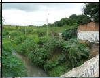

# Resumo

O rio é, sem dúvida, um elemento determinante da forma urbana,
condicionando sua estruturação. Por um lado é um elemento de separação
entre espaços da cidade, e por outro é um meio de comunicação com outras
cidades e com o território. Historicamente apresenta um importante
papel, pois muitas das cidades brasileiras, desde a época colonial,
surgiram às margens dos rios, mas com o tempo foi sendo ofuscado por
intervenções sem qualquer critério, escondendo e cancelando sua
identidade, a memória e os traços deixados pelo tempo passado. A ação
humana foi muitas vezes no sentido de dominá-lo, procurando conter o rio
em espaços estreitos, sufocando-o e suprimindo-o da superfície urbana,
tornando-o ilegível, perdendo sua forma e morfologia original. Em outros
casos, os pequenos córregos urbanos foram considerados como fator de
distúrbio, um limite a superar, um obstáculo a eliminar, a esconder.
Neste sentido o trabalho busca analisar como acontece atualmente a
inserção dos rios nos centros das cidades.

Palavras-chave: paisagem urbana, rios urbanos, cidades, fundos de vale

# Abstract

The river is undoubtedly a decisive element of the urban form,
conditioning its framework. On one hand it is an element of separation
between spaces of the city, and on the other it is a means of
communication with other cities and with the territory. Historically it
plays an important role, because many of the cities in Brazil, since the
colonial times, emerged on the shores of the rivers, but with time they
were overshadowed by interventions without any criteria, hiding and
canceling their identity, memory and the traces left by time past. Human
action was often in order to subdue the river, seeking to contain it in
narrow spaces, suffocating it and suppressing the urban surface, making
it unreadable, changing its original shape and morphology. In other
cases, the small urban streams have been considered as a factor of
disturbance, a limit to overcome an obstacle to remove, to hide. In this
sense this work seeks to analyze the insertion of the rivers in the city
centers nowadays.

Keywords: urban landscape, urban rivers, cities, valley bottom

# Introdução

A paisagem é o território construído pelo homem, um lugar ou uma região
na qual a história dos homens é explicada e onde foram deixados traços,
memórias de uma atividade produtiva, sinais de infraestruturas,
monumentos arquitetônicos ou espaços. Para Secchi (1985, p.29) "não há
nenhuma parte da cidade e do território em que não se encontrem os
densos traços do passado, mesmo naqueles mais recentes". Traços que não
só permanecem por muito tempo, mas que afetam e condicionam
decisivamente os processos de crescimento e de transformações das
cidades, do território e da paisagem. A ação do homem, ao longo do
processo de ocupação do território vai alterando a paisagem, mas o rio
permanece. Por um lado é um elemento de separação entre espaços da
cidade, e por outro é um meio de comunicação com outras cidades e com o
território.

O homem modifica a natureza para atender suas necessidades da vida
cotidiana. A ação humana foi no sentido de dominá-lo, procurando conter
o rio em espaços estreitos, sufocando-o e suprimindo-o da superfície
urbana, tornando-o ilegível, perdendo sua forma e morfologia original.
Os pequenos córregos urbanos foram considerados como fator de distúrbio,
elementos insalubres, culpados por inundações periódicas, um limite a
superar, um obstáculo a eliminar, a esconder.

Neste processo de construção e de transformação do mundo, pode revelar e
valorizar ainda mais os significados e os atributos da paisagem,
tornando-se visíveis. Por este enfoque, muitos de nossos rios ainda
estão por ser habitados. "Reconhecer o rio como paisagem, portanto, é
habitar o rio", conforme Costa (2006, p.11). Para a mesma autora, no
adensamento do espaço construído os rios trazem outra importante
contribuição para a experiência urbana, pois como espaços livres de
edificação, ampliam a possibilidade de fruição da paisagem da
cidade**.**

Historicamente os rios apresentam um importante papel. Muitas das
cidades brasileiras, desde a época colonial, surgiram às margens dos
rios ou ainda de pequenos cursos d´água. No vasto território da
província de São Paulo, a parte oeste era considerada no mapa de 1885,
como "terrenos desconhecidos habitados por indígenas." Este
desconhecimento do território levou à criação da Comissão Geológica do
Brasil, seguida pela Comissão Geográfica e Geológica de São Paulo - CGG
(1886). Uma das principais contribuições da CGG foi a demarcação dos
rios que cortavam o território paulista de leste para oeste. Naquele
momento o poder público considerava o rio como via de penetração e de
escoamento do café. Para Corrêa (2000, p.43) durante o "devassamento do
sertão o rio foi considerado pelos organismos públicos apenas como via
de escoamento da produção, refletindo o pensamento da elite
cafeicultora." Os principais rios paulistas não se integraram ao sistema
de viação, que se resumiu às ferrovias, o que pode ser explicado pela
dificuldade financeira de adequá-los à navegação.

As estradas de ferro do Oeste paulista surgiram nas cristas das bacias
fluviais -- os espigões divisores dos rios Paranapanema e Peixe
(Sorocabana), dos rios Peixe e Aguapeí (Alta Paulista) dos rios Aguapeí
e Tietê (Noroeste) e dos rios São José dos Dourados e Grande
(Araraquarense) e impulsionaram a criação de uma rede de cidades na
primeira metade do século XX, cujo objetivo maior era obter um rápido
retorno do investimento feito.

Conforme Constantino (2010), algumas cidades surgiram a partir de uma
única fazenda e outras foram implantadas em terras de duas ou mais
fazendas ou ainda por companhias colonizadoras. O levantamento realizado
possibilitou vislumbrar a configuração destas fazendas, que eram
delimitadas quase sempre por rios ou córregos. A subdivisão em glebas e
o posterior parcelamento deram origem ao tecido urbano atual. Os
patrimônios formados por terras doadas pelos proprietários das grandes
fazendas da região eram, em sua maioria, conformados pelos córregos. O
presente artigo busca desvendar como acontece atualmente a inserção dos
rios nos centros das cidades, áreas dos antigos patrimônios.

# Redescobrindo os rios nas cidades do oeste paulista

Para analisar as paisagens de fundos de vales enquanto território
fabricado e habitado buscou-se reconhecer a complexidade de relações
entre os rios e as cidades, seus conflitos e contradições, ao longo da
história das cidades, sendo moldados segundo os valores culturais.
Seguindo a metodologia adotada na pesquisa "Permanências da

> estrutura
> agrária na formação do tecido urbano das cidades do Oeste Paulista"1
> que possibilitou vislumbrar a configuração das fazendas que deram
> origem ao tecido urbano atual, foram escolhidas 16 cidades situadas ao
> longo das linhas férreas: Agudos, Lençóis Paulista, Tupã e Panorama
> (Alta Paulista), Araraquara, São José do Rio Preto, Jales e Santa Fé
> do Sul (Araraquarense), Botucatu, Lins, Penápolis e Araçatuba
> (Noroeste) e Ourinhos, Avaré, Presidente Prudente e Presidente
> Epitácio (Sorocabana). Em algumas cidades analisadas, as linhas
> férreas acompanhavam os rios. "As estações e as linhas férreas eram as
> portas da cidade e hoje, degradadas, são consideradas "fundos",
> espaços escondidos e não percebidos: um vazio entre lugares"
> (CONSTANTINO, 2013). Ao longo dos levantamentos nos chamou a atenção a
> questão do abandono das áreas próximas aos córregos e rios nas áreas
> centrais urbanas, lugar onde foram criados os patrimônios que deram
> origem às cidades.
>
> A proximidade dos rios possibilitava o acesso à água e a delimitação
> do território, além da proporcionar o lazer e circulação de pessoas e
> de bens. A gleba a ser transformada em solo urbano, geralmente tinha
> como um de seus limites um curso d´água, e os demais confrontavam com
> uma ou mais propriedades rurais. E ao longo das décadas as paisagens
> fluviais foram se transformando também em paisagens urbanas (Tabela
> 1).
>
> Tabela
> 1. Rios nas cidades da Alta Paulista: no patrimônio e situação atual.
> Fonte: TORRES, 2013

+-------------+-------------+-------------+---+-------------+---+---+
| >           | >           | > Situação  |   |             |   |   |
| **Cidades** | Patrimônios | > atual     |   |             |   |   |
|             | > e rios    |             |   |             |   |   |
+=============+=============+=============+===+=============+===+===+
| >           |             |  |   | > de São    |   |   |
|             |             |             |   | > Paulo dos |   |   |
|             |             |             |   | > Agudos,   |   |   |
|             |             |             |   | > entre os  |   |   |
|             |             |             |   | > córregos  |   |   |
|             |             |             |   | > Agudos e  |   |   |
|             |             |             |   | > Bom       |   |   |
|             |             |             |   | > Sucesso,  |   |   |
|             |             |             |   | > 1853.     |   |   |
|             |             |             |   | > Fonte:    |   |   |
|             |             |             |   | > SITU      |   |   |
+-------------+-------------+-------------+---+-------------+---+---+
|             |             |             |   |             |   |   |
+-------------+-------------+-------------+---+-------------+---+---+
| > **Lençóis |             | > Villa de  |   |             |   |   |
| > Paulista  |             | > Lençoes   |   |             |   |   |
| > -**       |             | > limitada  |   |             |   |   |
|             |             | > pelo Rio  |   |             |   |   |
|             |             | > Lençoes,  |   |             |   |   |
|             |             | > 1894.     |   |             |   |   |
|             |             | >           |   |             |   |   |
|             |             | > Fonte:    |   |             |   |   |
|             |             | >           |   |             |   |   |
|             |             |  Prefeitura |   |             |   |   |
|             |             | > Municipal |   |             |   |   |
+-------------+-------------+-------------+---+-------------+---+---+
| > **Tupã**  |             | > Patrim.   |   |             |   |   |
|             |             | > de Tupan, |   |             |   |   |
|             |             | > 1929,     |   |             |   |   |
|             |             | > traçado   |   |             |   |   |
|             |             | > eng.      |   |             |   |   |
|             |             | > Nicolau   |   |             |   |   |
|             |             | > de Molla, |   |             |   |   |
|             |             | > limite    |   |             |   |   |
|             |             | > c/Rib.    |   |             |   |   |
|             |             | > Afonso    |   |             |   |   |
|             |             | >           |   |             |   |   |
|             |             | XIII.Fonte: |   |             |   |   |
|             |             | > Museu     |   |             |   |   |
|             |             | > I         |   |             |   |   |
|             |             | ndiaVanuíre |   |             |   |   |
+-------------+-------------+-------------+---+-------------+---+---+

> 1 A
> pesquisa foi realizada com a colaboração bolsistas de Iniciação
> Científica-FAPESP, graduandos do Curso de Arquitetura e Urbanismo da
> FAAC-UNESP no período 2006-2010 e estava inserida no subtema 3 -
> "Saberes técnicos e teóricos na configuração e re-configuração das
> cidades formadas com a abertura de zonas pioneiras no Oeste do estado
> de São Paulo", em conjunto com um grupo de professores da FAAC-UNESP -
> do Projeto Temático FAPESP "Saberes eruditos e técnicos na
> configuração e re-configuração do espaço urbano -- Estado de São
> Paulo, séculos XIX e XX" (Processo n.05/55338-0), em conjunto com a
> UNESP, UNICAMP e PUCCAMP, sob a coordenação da historiadora Maria
> Stella Bresciani.

+----------------+---+----------------------------+---+---+
| > **Panorama** |   | > Plano Urbanístico        |   |   |
|                |   | > original do urbanista    |   |   |
|                |   | > Prestes Maia, 1945 e a   |   |   |
|                |   | > orla do Rio Paraná.      |   |   |
|                |   | > Fonte: Simão Podolsky.   |   |   |
+----------------+---+----------------------------+---+---+

> A
> pesquisa em andamento "A construção da paisagem de fundos de vale em
> cidades do oeste paulista" 2 busca observar e identificar em algumas
> cidades analisadas no trabalho anterior, quais as características e as
> especificidades dos rios que cortam os centros urbanos e quais os
> elementos que adquirem significados. O levantamento fotográfico
> realizado em 2013 possibilitou compreender o estado do lugar, a
> história e as relações existentes entre as cidades e os rios. É
> através desta leitura exploratória que podemos definir as
> possibilidades projetuais, levando em conta a geometria variável das
> intersecções e justaposições, analisando também os espaços livres
> residuais na área do entorno dos cursos d´água e as diretrizes
> contidas nos planos diretores e legislações ambientais municipais.
>
> Compreender a paisagem urbana a partir das águas dos rios é um desafio
> e uma oportunidade privilegiada. Para Besse (2006, p.152), aquele que
> pretende estudar as paisagens terá como primeira tarefa a de ler e
> interpretar as formas e as dinâmicas paisagísticas para aprender com
> elas algo sobre o projeto da sociedade que tem produzido estas
> paisagens e a sua história.
>
> O surgimento de Tupã aconteceu graças à Empreza Melhoramentos Alta
> Paulista e a Sociedade Souza Leão & Rocha, cujos sócios eram: Luiz de
> Souza Leão, Eurípedes Soares da Rocha e João do Val. As divisas do
> terreno foram realizadas pelo agrimensor Odilon Loureiro que fez
> divisas do terreno de 100 alqueires, localizado dentro de uma gleba de
> 4 mil, que ia desde o córrego São Martinho até o córrego Sete de
> Setembro, incluindo o córrego Affonso XIII, cujas nascentes estavam
> situadas na gleba que acabava de ser adquirida. Os limites do
> Patrimônio eram "de um lado com o Manoel Lahoz & Irmãos, do outro com
> o espigão divisor Peixe -- Feio, de outro com a viúva Manoel Alves
> Sobrinho e de outro com o Córrego Affonso XIII, fechando assim o
> perímetro" (SERAFIM, 2006, p.54).
>
> O Ribeirão Afonso XIII é afluente da margem esquerda do rio Iacri,
> que, por sua vez, é afluente do Rio Aguapeí. A sua própria microbacia
> possui uma área de 105 km². Em Tupã, a coleta e tratamento do esgoto
> atende 99,82% da população. Atualmente, o Braço Esquerdo do Ribeirão
> Afonso XIII apresenta trechos canalizados com uma seção retangular e
> revestidos de gabiões. O Braço Direito do Ribeirão possui uma extensão
> de 2,8 km aproximadamente, nascendo a sudeste da área urbana, próxima
> à ferrovia seguindo na direção nordeste até a confluência com o braço
> esquerdo para formar o Ribeirão. No levantamento fotográfico das
> margens do braço direito do Ribeirão Afonso XIII constatou-se a
> presença de pouca mata ciliar e edificações invadindo a área de
> proteção (1). Um trecho do ribeirão corre por um canal (2), e
> atravessa uma área apresentando processos erosivos, assoreamento e
> degradação das margens (3, 4, 5, 6 e 7), observando-se diversas
> construções às margens do ribeirão
>
> (8, 9, 10 e 11), conforme Figura 1.
>
> 2 A pesquisa em andamento contou com a colaboração de 4 bolsistas de
> Iniciação Científica-FAPESP, graduandas do Curso de Arquitetura e
> Urbanismo da FAAC-UNESP no período 2012-2013.
>
> 
>
> Figura 1. Levantamento fotográfico das margens do braço direito do
> ribeirão Afonso XIII em Tupã. Fonte: TORRES, 2013

Também na cidade de Agudos o levantamento fotográfico foi realizado ao
longo do Córrego Bom Sucesso em janeiro de 2013. Em 1853 foi criado o
Patrimônio de São Paulo dos Agudos, conformado entre os córregos Agudos
e Bom Sucesso. O córrego Bom Sucesso apresenta erosões e ausência de
mata ciliar no limite da área urbana e a seguir é contido por gabiões
até cruzar a Rua 7 de Setembro quando está canalizado sob a pista; a
partir despe ponto, corre livre seguindo o seu curso com densa mata
ciliar, passando sob uma ponte em construção, com presença de erosão. O
esgoto ainda não é tratado e é lançado in natura nos córregos que cortam
a cidade. O Plano Diretor Participativo, desenvolvido pelo grupo SITU da
FAAC-UNESP, foi aprovado em 2006, mas ainda não foi implantado. No plano
estrutural, o parque linear proposto ao longo dos fundos de vale é
apresentado como elemento de reconexão urbana, redefinindo-se um
conjunto de vazios urbanos como "Zonas de Especial Interesse, como forma
de conter a expansão indiscriminada da malha urbana em direção às áreas
com restrição ambiental", em especial os fundos de vale (RETTO JR et al,
2011), conforme Figura 2.

> 
>
> Figura 2. O parque como elemento de reconexão urbana proposto para a
> cidade de Agudos. Fonte: RETTO JR et al, 2011.

Ao longo da linha Noroeste foram pesquisadas as cidades de Lins,
Botucatu, Penápolis e Andradina. O povoado de Lins, chamado inicialmente
Santo Antonio do Campestre, começou próximo ao cruzamento da trilha dos
habitantes originais, os índios Coroados, com a Estrada de Ferro
Noroeste do Brasil, cujos trilhos acompanhavam o córrego Campestre. No
início de 2009 iniciou-se a implantação do parque linear ao longo do
córrego, incluindo o Horto Florestal Municipal. No entanto, em 2012, a
Câmara aprovou dois projetos que autorizavam a Prefeitura a incluir no
orçamento a canalização de um trecho do córrego Campestre. O esgoto
doméstico gerado em Lins é 100 % tratado, no entanto era lançado in
natura no córrego até 1997. Em Jales, na linha Araraquarense, os dois
principais córregos são o Córrego do Marimbondinho e o Córrego Tamboril.
O Marimbondinho nasce na cidade de Jales e possui uma parte canalizada a
céu aberto e outro trecho canalizado e subterrâneo. O córrego Tamboril
apresenta grande problema de assoreamento e erosão em quase toda sua
extensão e atualmente existe um plano de ações para a solução desses
problemas, com o financiamento da FEHIDRO - Fundo Estadual de Recursos
Hídricos. O CBH- SJD - Comitê da Bacia Hidrográfica do Rio São José dos
Dourados, formado por 36 cidades do oeste paulista, sendo duas delas
Jales e Santa Fé do Sul, é responsável pelo gerenciamento da área,
proposta e análise de projetos e recursos, e por diversos assuntos
relacionados com os recursos hídricos da região. Com a ajuda da FEHIDRO
é possível que ocorra o financiamento de programas e ações nessa área,
com o objetivo de estabelecer melhorias e proteção aos corpos d'água e
suas bacias hidrográficas (REIS, 2013).

Não é mais aceitável pensar em retificar um rio, revestir seu leito vivo
com calhas de concreto, e substituir suas margens vegetadas por vias
asfaltadas, como uma alternativa de projeto para sua inserção na
paisagem urbana. Estas propostas, que tinham como uma das bases
conceituais a busca do controle das enchentes urbanas,

são muito criticadas não só pela fragilidade sócio-ambiental no
resultado final do projeto, como também pela pouca eficiência no
controle destas mesmas enchentes.

Com o adensamento, surgem novos problemas, como a crescente demanda por
habitação e água potável, a oferta de espaços de uso público e de áreas
verdes para a população e a drenagem urbana. A questão de um plano de
drenagem urbana, associado ao plano de uso e ocupação do solo e ao
sistema viário, é fundamental para as nossas cidades. O fato de que
muitos rios desapareceram em galerias subterrâneas ou canalizações, não
é mais aceito como uma resposta aos problemas de gestão da água
relacionada com o crescimento urbano. O Córrego Mangará, revitalizado no
ano de 2012, é o único córrego em trecho urbano na cidade de Santa Fé do
Sul. Durante a revitalização, parte de seu curso foi canalizada a céu
aberto e outra parte foi canalizada e coberta, em grande parte por áreas
permeáveis, uma ação que não possibilita sua relação com a paisagem em
uma cidade que é uma Estância Turística, que tem como principal atração
um balneário.

Durante muito tempo, as estratégias da engenharia hidráulica estiveram
orientadas no sentido de retificar o leito dos rios, para que suas
vazões fossem dirigidas para a jusante pelo caminho mais curto, visando
também ganhar áreas maiores para a agricultura e urbanização. A
tecnologia adotada era a de transformar os rios em leitos com perfil
regular, muitas vezes com as margens revestidas, sem maiores
considerações ambientais, o que não é mais aceitável tendo em vista a
comprovada fragilidade socioambiental e a pouca eficiência no controle
das enchentes.

# Os rios e os parques urbanos

O levantamento possibilitou reconhecer espaços lineares e vazios urbanos
ao longo das margens dos rios. São espaços de interface e de relação
mais direta entre o rio e o tecido urbano, consistindo em um território
mais frágil sujeito a todo tipo de invasão e agressões pelo crescimento
urbano. Por outro lado, a influência do rio, no seu escoar lento ou
impetuoso modifica e incide na forma, na natureza e na dimensão deste
espaço. No entanto, a cidade pode recuperar sua relação direta com a
presença da água através do desenho de seus acessos, a requalificação de
suas margens; são os lugares onde pode-se encontrar localização dos
espaços de fruição pública, para o lazer e para o tempo livre através do
desenho do percurso possibilitando "a conexão através da continuidade do
elemento fluido, os diferentes pedaços que compõem a cidade", segundo
Ferrari (2004, p.219).

A relação com a água pode ser valorizada pela criação de parques
urbanos. Em alguns casos os parques são pré-existentes à intervenção, em
outros casos o parque é o resultado da ação projetual, tornando-se um
lugar e uma paisagem derivada da valorização do traçado da água, da sua
conservação e redescoberta onde encontra-se a memória de um traçado
agora desaparecido ou ainda introduzido com uma forma contemporânea. O
parque é então o lugar no qual a intervenção projetual coloca em cena a
relação entre a água e o tecido urbano, através da natureza, a cultura e
a história do lugar.

Em São José do Rio Preto (Linha Araraquarense) o patrimônio original foi
criado em 1847 entre os córregos Borá e Canela, tributários do Rio
Preto. Com o crescimento da área urbana, no final da década de 50 foi
iniciada a canalização do córrego Borá e em 2011, a do córrego Canela. O
Parque Setorial foi projetado para a cidade foi desenvolvido pelos
arquitetos Jamil José Kfouri e Mirthes I. S. Baffi e previa a ocupação
dos vales do Rio Preto e do Rio Piedade, com uma área de 510 hectares de
prolongamento das faixas de preservação dos mananciais. Proposto no
Estudo das Áreas Verdes e Espaços Abertos do Município de São José do
Rio Preto em 1977,

poucos trechos foram realmente executados até hoje. O trecho construído
se localiza às margens da Represa Municipal, o que levou o Parque a ser
popularmente conhecido como "Parque da Represa"(Figura 3).

> 
>
> Figura 3: Levantamento fotográfico em São José do Rio Preto, no
> realizado ao longo do Rio Preto: lago da represa (1), Parque Setorial
> (2) com equipamentos públicos e anfiteatro ao ar livre (3), e espaços
> livres, ao longo do córrego Canela canalizado (4 e 5). Fonte: REIS,
> 2013

Em Botucatu, na linha Noroeste, foram elaborados dois projetos de
parques lineares ao longo do Ribeirão Lavapés que, no entanto não foram
implantados. O fundo de vale do ribeirão apresenta amplas áreas livres
com potencial para inserção de parques e praças, apesar de haver espaços
invadidos por construções. As pontes que cruzam o ribeirão podem ser
valorizadas, possibilitando a visualização do curso d´água e sua
inserção na paisagem urbana. Na cidade de Araçatuba, o córrego
Machadinho encontra-se parcialmente canalizado ao longo da avenida
Joaquim Pompeu de Toledo. Na confluência com o Ribeirão Baguaçu foi
criado o Parque Ecológico do Baguaçu, aproveitando a mata existente. No
entanto o ribeirão ainda sofre com o despejo de esgoto sem tratamento.

> Em 1945 a Companhia Paulista de Estradas de Ferro dá prosseguimento às
> suas obras, com a intenção de estende os trilhos até a divisa do
> Estado. E ao ter conhecimento destes planos, "*o Sr. Quintino de
> Almeida Maudonnet, empresário de uma tradicional família campineira,
> decide formar uma sociedade, a Imobiliária Panorama Ltda., com outros
> empresários também campineiros para comprar a Fazenda São Marcos
> Evangelista com 2,700 alqueires junto ao ribeirão das Marrecas,
> margeando o Rio Paraná"* (SERAFIM, 2006, p.70) planejando formar ali
> um núcleo de povoamento.

Ao propor o projeto urbanístico da cidade, Prestes Maia levou em
consideração principalmente a posição do porto e o traçado da ferrovia,
este sendo determinado de acordo com a lógica dos desenhos das outras
linhas da região. Foi dada grande atenção à faixa marginal do Rio na
elaboração do plano e planejado uma espécie de

parque. A primeira região a ser ocupada no município foi a margem
esquerda do córrego das Marrecas, a zona que se aproxima à margem do Rio
Paraná e ao porto. Depois disso a malha urbana expandiu-se ao longo do
curso do Rio e em direção ao interior. A cidade de Panorama tem relação
intrínseca com o meio ambiente e a coleta e tratamento do esgoto atende
86,19% da população. O Rio Paraná é parte importante da vida da cidade
tanto na questão econômica, quanto na cultural e no lazer,
possibilitando geração de empregos, extração de matérias-primas e
diversão (Figura 4).

> 
>
> Figura 4: Panorama e o Rio Paraná: Balneário Municipal (1, 2, 3),
> ruínas do antigo porto, onde ancoravam os navios que exportavam as
> safras de café (4), margens do Rio Paraná, c/ ausência mata ciliar
> (5,6) e os trilhos dos trens chegando às margens do rio (7,8,9).
> Fonte: TORRES, 2013

# Considerações finais

Cada um dos elementos levados em conta nas várias formas identificadas
nos levantamentos realizados constitui uma possibilidade, uma sugestão
que qualquer ação projetual deve considerar e reinterpretar de modo mais
oportuno e mais consonante às condições do lugar, da história e da
memória da paisagem e com os quais o projeto deve dialogar, buscando
recuperar a identidade perdida ou criando uma nova identidade.

A preservação, sempre que possível, das margens e sinuosidades naturais
dos cursos

d´água, dos ambientes alagadiços, da cobertura florestal da bacia e da
vegetação nas orlas de rios e lagos constituem as medidas mais racionais
para evitar o agravamento das enchentes urbanas e a degradação dos
corpos d´água. Estas áreas podem ser aproveitadas como reservas e
parques ecológicos, combinando a preservação com lazer, esportes e
educação ambiental, além de restabelecer o sentido de lugar,
reconectando os fundos de vale com o tecido urbano, não mais como "um
vazio entre lugares" (HOUGH, 1998, p.58).

Os conflitos entre os processos fluviais e os processos de urbanização
tem sido de um modo geral enfrentados através de drásticas alterações na
estrutura ambiental dos rios, onde em situações extremas, chega-se ao
desaparecimento completo dos cursos d´água da paisagem urbana.

É importante reconhecer e valorizar o traçado da água existente
verificando quais os sinais que permaneceram na paisagem. Em muitos
casos, de fato, não é possível agir através da mera ação de salvaguarda
do existente; é necessário "encontrar as regras organizacionais da
paisagem, segundo a razão histórica de sua conformação, mas também
indagando sobre as novas condições históricas, formais e sociais para
que a presença da água volte a ter novamente atributos funcionais e
razão de ser" (FERRARI, 2004, p.221). Dentro desta lógica os espaços
residuais ao longo das margens dos rios são áreas propícias para agregar
identidade e funções, e de possíveis transformações.

A inserção dos rios urbanos é fundamental no processo de requalificação
da cidade, de seus espaços centrais e marginais, dos vazios urbanos e
dos espaços residuais. Todas as cidades pesquisadas tiveram seus planos
diretores aprovados até 2000, apresentando diretrizes relacionadas à
valorização dos rios urbanos. Entre as cidades inseridas no Programa
Município Verde Azul do Estado de São Paulo, Botucatu destaca-se em
primeiro lugar no ranking elaborado a partir de diretrizes ambientais.

Além dos resultados físicos, formais e estéticos, a valorização dos rios
urbanos no projeto da paisagem contemporânea mostra que esta mudança não
só é possível, mas desejável e necessária, possibilitando a redescoberta
de um importante recurso natural e cultural, articulado ao tecido
urbano, qualificando a paisagem do lugar.

# Agradecimentos

Às alunas, bolsistas de Iniciação Científica FAPESP, Julia M. Torres,
Raísa Reis, Maria Olivia Simões e Marília L. Queiroz (Processos FAPESP
2012/13559-3, 2012/14691-2, 2012/14636-1, 2012/18938-2) pelo
desenvolvimento das pesquisas sobre os rios nas cidades do Oeste
Paulista, e à FAPESP (Fundação de Amparo à Pesquisa do Estado de São
Paulo) pelas bolsas concedidas às alunas e principalmente por apoiar a
pesquisa coordenada pela autora (Processo FAPESP 12/50098-4).

# Referências bibliográficas

BESSE, J. M. Las cinco puertas del paisaje: ensayo de una cartografía de
lãs problemáticas paisajeras contemporáneas. In: MADERUELO, Javier
(org.). *Paisaje y pensamiento*. Madrid: Abada, 2006. p. 145-171.

> CONSTANTINO, N. R. T. *A construção da paisagem de fundos de vale em
> cidades do oeste paulista*. Relatório Parcial de Pesquisa apresentado
> à FAPESP -- Fundação de Amparo à Pesquisa do Estado de São Paulo.
> Bauru, maio de 2013.

CONSTANTINO, N. R. T. A estrutura agrária na formação do tecido urbano
das cidades do Oeste Paulista. In: SALGADO, I.; BERTONI, A. *Da
construção do*

> *território ao planejamento das cidades*: competências técnicas e
> saberes profissionais na Europa e nas Américas (1850-1930). São
> Carlos: Rima/FAPESP, 2010. p.35-49.
>
> COSTA, Lucia Sá. Rios Urbanos e o desenho da paisagem. In: COSTA,
> L.S.A.(org.). *Rios e Paisagens Urbanas em cidades brasileiras*. Rio
> de Janeiro: PROURB, 2006. p.9-15.
>
> CORRÊA, D. S.; ALVIM, Z. M. F. *A água no olhar da história*. . São
> Paulo: Secretaria Estadual do Meio Ambiente, 2000.

FERRARI, L. *L\`Acqua nel paesaggio urbano* -- letture, esplorazioni,
ricerche, scenari". Dottorato de Ricerca in Projettazione Paesistica,
Dipartamento di Urbanistica e Pianificazione del Territorio, Università
Degli Studi di Firenze, Facoltà di Architettura, 2004.

> HOUGH, M. *Naturaleza y ciudad: planificación urbana y procesos
> ecológicos.*

Barcelona: Gustavo Gilli, 1998.

> REIS, R. R. R. *Conformação dos fundos de vale no tecido urbano das
> cidades do oeste paulista* -- Araraquarense, 2013. Relatório
> cientifico final de Pesquisa de Iniciação Científica apresentado à
> FAPESP -- Fundação de Amparo à Pesquisa do Estado de São Paulo. Bauru,
> 2013.

RETTO JR., A.; ENOKIBARA, M.; CONSTANTINO, N.R.T.; MAGALHÃES, K.C.

> *Conhecimento histórico ambiental integrado na planificação
> territorial e urbana*. São Paulo: Cultura Acadêmica, 2011.
>
> SERAFIM, R. M. *Conformação da estrutura agrária na formação do tecido
> urbano das cidades do oeste paulista* -- Linha Alta Paulista, 2006.
> Relatório cientifico final de Pesquisa de Iniciação Científica
> apresentado à FAPESP -- Fundação de Amparo à Pesquisa do Estado de São
> Paulo. Bauru, 2006.
>
> TORRES, J. M. *Conformação dos fundos de vale no tecido urbano das
> cidades do oeste paulista* -- Alta Paulista, 2013. Relatório
> cientifico final de Pesquisa de Iniciação Científica apresentado à
> FAPESP -- Fundação de Amparo à Pesquisa do Estado de São Paulo. Bauru,
> 2013.

SECCHI, B. L´eccezione e la regola. In: *Casabella*, 509, 1985, p.29-31.
