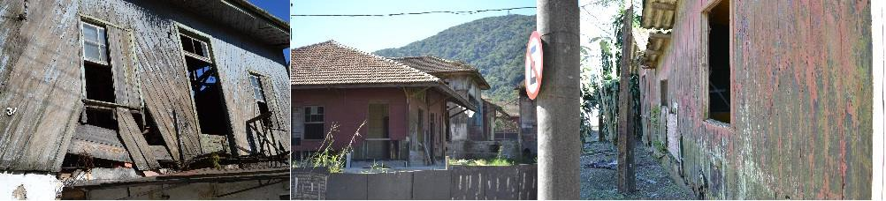
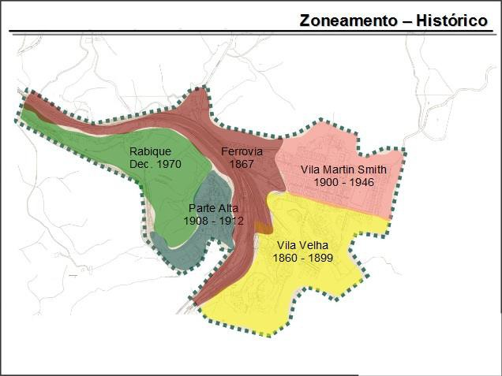
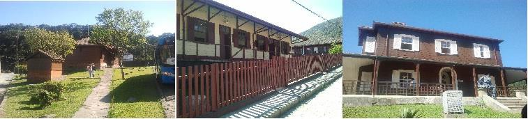

# Resumo

A atividade turística apresenta-se atualmente como meio de preservação
das identidades locais, e forma de valorização do lugar. A Vila
Ferroviária de Paranapiacaba exemplifica a busca do desenvolvimento e
valorização do patrimônio cultural por meio do turismo. A Vila
centenária busca desde 1999 mediante a ação da municipalidade de Santo
André e a implementação de planos embasados em ferramentas como o
\"marketing do lugar\", recuperar e preservar o conjunto arquitetônico,
urbanístico e ambiental, patrimônio tombado nas três instâncias:
federal, estadual e municipal. O trabalho analisa criticamente o \"Plano
Patrimônio\" (2003), documento base para conduzir ações significativas
com o objetivo de alcançar as finalidades apontadas, bem como analisa a
eficácia do Plano como fundamento de política urbana que logra
incentivar o desenvolvimento local por meio da recuperação do
patrimônio.

Palavras-chave: Vila de Paranapiacaba, política urbana, plano
urbanístico

# Abstract

Tourist activity presents today as a means of preservation of local
identities, and shape recovery Place. The Railway Village Paranapiacaba
exemplifies the pursuit of development and enhancement of cultural
heritage through tourism. The Centennial Village search since 1999
through the action of the municipality of Santo André and implementation
of plans grounded in tools such as \"place marketing\", recover and
preserve the architectural, urban and environmental set, equity tumbled
in three levels: federal, state and municipal. The paper critically
examines the \"Equity Plan\" (2003), based document to conduct
meaningful actions in order to achieve the purposes identified and
analyzed the effectiveness of the Plan as the basis for urban policy
that achieves encourage local development through recovery of equity.

> Keywords: Village of Paranapiacaba, urban policy, urban plan

# Introdução

Localizada no extremo sul do Município de Santo André, no ponto mais
alto da Serra do Mar, a Vila Ferroviária de Paranapiacaba conserva
significativo patrimônio cultural e acervo tecnológico ligados à
presença e papel da ferrovia e ao testemunho de um modelo arquitetônico
e urbanístico bastante avançado para a época de implantação. A Vila é um
testemunho de importante ambiente, em que bens materiais e imateriais
"\[\...\] se referem à identidade, à ação e à memória dos diferentes
grupos formadores da sociedade brasileira" (FUNDARP, 2014), e se estende
a "\[\...\] imóveis particulares, trechos urbanos e até ambientes
naturais de importância paisagística, passando por imagens, mobiliário,
utensílios e outros bens móveis" (IPHAN, 2014).

A Vila de Paranapiacaba é patrimônio cultural tombado pelas instâncias
federal, estadual e municipal, desde 2003 (PREFEITURA DE SANTO ANDRÉ,
2014). Seu papel destacado no cenário da preservação e formação de uma
identidade cultural se tornou o mote de vários planos levados a cabo
desde 1999 pela municipalidade de Santo André, tendo em vista recuperar
e preservar o conjunto arquitetônico, urbanístico e ambiental,
associando esse processo a um possível desenvolvimento local, ancorado
na implantação e potencialização turística.

O \"*Plano Patrimônio*\" (Prefeitura Municipal de Santo André, 2003)
consiste no documento que gerou ações significativas para alcançar os
fins apontados. Esse plano conduziu uma ação fundamentada na ideia de
preservação do conjunto arquitetônico total, de forma a garantir a
intensificação da visitação turística, ao implantar pequenos comércios
em várias casas, comércios que deveriam ser geridos por moradores
locais.

A história de implementação do Plano evidencia, entre outros processos,
o esvaziamento demográfico da Vila, o que se verifica empiricamente pela
presença de casas atualmente abandonadas (Figura 01), pelo decrescimento
populacional de aproximadamente 35% no período de dez anos (em 2000 a
população da Vila era de 1418 habitantes, enquanto o levantamento
censitário de 2010 apontou 921 habitantes) e pela opção dos moradores de
buscarem fontes de renda nas cidades vizinhas, conforme apontado no
Censo de 2010 (IBGE, 2010), sinalizando que as atividades ali
empreendidas não foram suficientes para alavancar um desenvolvimento
local sustentável.

> 
>
> **Figura 01:** Casas abandonadas da Vila de Paranapiacaba. Fotos:
> Fernanda F. D\'Agostini / 2013

Esse fato sinaliza que a Vila de Paranapiacaba reflete nos dias de hoje
um tratamento incompleto e superficial do patrimônio como motor do
desenvolvimento e promotor de uma relação mais consistente entre cidade
e sociedade. A incompletude do processo de desenvolvimento sugere uma
prática de transformação urbana pautada, como evidenciado por Hobsbawn
(1997), por uma \"invenção da tradição\" - ênfase na

valorização do passado e da memória pela evidência de alguns de seus
símbolos. Verifica-se uma compreensão do patrimônio como imagem ou
simulacro urbano, a partir de interpretação da vitalidade urbana nos
moldes da \"sociedade do espetáculo\" (DEBORD, 2007), e da cultura
compreendida no âmbito do consumo, privilegiando a aparente preservação
e transformação de usos.

# A Vila de Paranapiacaba

A SPR (São Paulo *Railway*) foi responsável pela construção de uma das
principais ferrovias da segunda metade do século XIX, ligando o interior
de São Paulo ao porto de Santos. Para tanto foi construída a Vila de
Paranapiacaba, constituída por três núcleos urbanos: Parte Alta ou
Morro, Vila Velha ou Varanda Velha, Vila Martin Smith ou Vila Nova,
cujas implantações ocorreram em momentos distintos e de formas
diferentes, no período de 1860 a 1946. Nesse tempo, chegou a
Paranapiacaba uma moderna infraestrutura urbanística com sofisticação
excedendo aquela disponível à época no Brasil, desta forma pioneira na
construção de uma cidade empresarial projetada. Neste cenário
caracteriza-se a instalação de uma estrutura urbana necessária para
exploração mercantil, em que os ingleses exerceram, simultaneamente,
influência econômica e cultural, impondo um modo de vida paternalista.

> 
>
> **Figura 02:** Mapa histórico -- formação da Vila de Paranapiacaba.
> Autor: Fernanda F. D\'Agostini

É possível dizer que a implantação e as construções da Vila constituem
uma amostra de tecnologia e padrão de urbanização ingleses introduzidos
no Brasil. A urbanização se caracteriza por uma ocupação do solo com
traçado regular, à diferença da acomodação à topografia das cidades
legadas pelo colonizador português, que tampouco seguiam padrões
normativos rígidos. A Vila planejada marca a presença inglesa por meio
da implantação padronizada das casas de madeira em conjuntos geminados
com recuos que possibilitavam jardins, ainda incomuns no início do
século em nosso país. A hierarquia social e corporativa dos funcionários
da São Paulo

*Railway* se definia pelas singularidades das construções: o tamanho do
lote e da edificação definia a situação hierárquica mencionada (CRUZ,
2007).

Padrões de higiene, saúde e atividades econômicas inovadoras, dentre
outros, modificaram o cotidiano das famílias que passaram a residir na
Vila, proporcionando às novas gerações educação nas escolas implantadas
pelas empresas, que a despeito de seu papel social contribuíam para
orientar a formação dos jovens, com o propósito de amoldá-los à cultura
empresarial e estimular a adesão a ela. Esse padrão inglês propiciou à
sociedade paulista, naquele momento, um hibridismo cultural instigando
os mais jovens a extrapolar limites preestabelecidos de conhecimento e
perscrutar outros campos desconhecidos, mesmo que sob vigilância
patronal.

A SPR desenvolveu um programa com diversas atividades sociais e de lazer
integrado por uma infraestrutura urbana adequada, um plano de uso e
ocupação do solo, além de condições sanitárias satisfatórias devido à
preocupação em construir instalações externas ao corpo principal da
casa.

A construção de moradias operárias junto ao espaço produtivo da empresa
foi uma prática adotada tanto nos países industrializados europeus como
nos países latino- americanos de industrialização tardia, como é o caso
do Brasil. Estes assentamentos localizavam-se na maior parte das vezes
afastados das áreas urbanas consolidadas, e em muitos casos contavam com
alguns equipamentos de uso comunitário e áreas de lazer geridos pelas
empresas.

Ao longo dos séculos XIX e XX a moradia operária passou a ser almejada,
projetada e construída por higienistas, filantropos, industriais,
empresários, engenheiros e arquitetos. Segundo Perrot (apud CRUZ, 2007)
baseava-se nas noções de higiene, e nas ideias de racionalidade e
economia convertendo a habitação em fundamento para um novo modelo de
trabalhador e família proletária. A casa funcionava como instrumento de
atração e fixação, contribuindo para incorporar valores tais como a
importância de um *\"habitat* higienizado\" e disciplinado, que supunha
a implantação de serviços e equipamentos - saúde, educação e lazer,
associados ao bem-estar, disciplina e saúde.

As Vilas operárias comportavam ainda equipamentos de saneamento, tais
como provisão de água potável, eliminação de resíduos e organização de
assistência médica, e ainda outros tais como mercados e serviços de
transporte público. Havia também equipamentos sociais como escolas e
instalações destinadas a atividades recreativas.

A fixação dos trabalhadores na Vila de Paranapiacaba se fazia por meio
de um sistema semelhante aos das cidades fabris inglesas; equipava-se o
local com toda infraestrutura necessária, para que não houvesse
necessidade do trabalhador se deslocar para fora do núcleo evitando
contatos externos, pois dessa forma se poderiam evitar greves
trabalhistas, tal como ocorriam nos países europeus.

Com mais de um século de existência, a Vila de Paranapiacaba passou por
várias transformações, algumas relevantes no final do século XIX com a
ampliação da capacidade da malha ferroviária, a duplicação da linha da
São Paulo *Railway Co.*, para atender o aumento da demanda de carga. Por
sua localização estratégica foi então considerada importante ponto na
rota e corredor de circulação para escoamento de quase toda a demanda de
exportação e importação de São Paulo, o que proporcionou seu
crescimento, em virtude da necessidade de mais funcionários para a
operação do

sistema, e também pelo aumento do público flutuante, contribuindo para o
desenvolvimento da economia local.

No final da década de 1940 (1946), com o término da concessão e a
inexistência de acordo entre os ingleses e o Governo Federal, a ferrovia
e todo seu patrimônio passaram a ser controlados pela União. Em 1947 a
Vila de Paranapiacaba sofreu um de seus maiores impactos
socioeconômicos, devido à inauguração da Rodovia Anchieta, que trouxe
nova alternativa de transporte do porto à metrópole, competindo com a
ferrovia e deslocando boa parte do transporte de cargas e o eixo de
desenvolvimento para o entorno da rodovia, fazendo a economia local
decrescer devido ao declínio das operações ao longo do eixo central da
ferrovia.

Já em 1957, com a criação da Rede Ferroviária Federal S.A. (RFFSA) por
Juscelino Kubistchek para a administração de toda a malha ferroviária do
país, ocorreu nova mudança de nível gestor. Mais recentemente, em 1996 o
transporte de passageiros é extinto e a ferrovia passa a ser explorada
em regime de concessão para transporte de carga pela empresa da
iniciativa privada MRS Logística.

Estas mudanças impactaram diretamente a Vila de Paranapiacaba, devido à
redução da circulação de carga pelo eixo ferroviário, a consequente
redução do número de operários residentes, mitigando as oportunidades de
trabalho e diminuindo o público circulante. Foram então ocasionadas
transformações do perfil socioeconômico, devido às interferências na
economia local e a evasão de várias famílias, pois funcionários foram
demitidos pela companhia ferroviária ou partiram em busca de melhores
condições de emprego e moradia (MORETTO, 2005).

Em 1987, após um período de abandono e degradação, a Vila de
Paranapiacaba teve seu patrimônio cultural e natural reconhecido e
tombado pelo Conselho de Defesa do Patrimônio Histórico, Arqueológico,
Artístico e Turístico do Estado de São Paulo - CONDEPHAAT e neste mesmo
ano foi entregue o *Plano de Preservação e Revitalização da Vila
Ferroviária de Paranapiacaba* realizado pela Empresa Paulista de
Planejamento Metropolitano (EMPLASA). No ano de 2002 foi a Vila tombada
pelo Instituto do Patrimônio Histórico e Artístico Nacional - IPHAN e em
2003 pelo órgão municipal, o Conselho Municipal de Defesa do Patrimônio
Histórico, Artístico, Arquitetônico-Urbanístico e Paisagístico de Santo
André - COMDEPHAAPASA.

Após ser comprada pela Prefeitura Municipal de Santo André, em 2002, foi
implantado o Programa de Gestão do Desenvolvimento Local Sustentável de
Paranapiacaba, intensificando-se o processo de recuperação desse
patrimônio, compreendido e gerido, desde então, como paisagem cultural.

Tal compreensão induziu à abordagem da preservação de porções do
território, sítios, cidades ou paisagens, considerando-se sua
multidisciplinariedade (PMSA/ ZEIPP, Seção IV art.71, 2003) e
pressupondo integração de vários aspectos, definidos por conceitos como
patrimônio cultural, natural, imaterial, patrimônio ambiental urbano.
Intentava-se relacionar os conceitos de memória e história a outros
advindos da geografia, antropologia e urbanismo, ao pressupor a ação
integrada do planejamento urbano e gestão territorial a políticas
culturais, ambientais, econômicas e sociais.

O conceito de paisagem cultural utilizado pelo Comitê do Patrimônio
Mundial da UNESCO desde 1992 e sistematizado pela Recomendação R (95) do
Conselho da Europa em 1995, pressupunha ampliar significativamente a
compreensão de

patrimônio na medida em que reunia, articulava e integrava visões e
ênfases de diversos campos disciplinares, e por isso exigia complexidade
da gestão do patrimônio, requerendo revisão, adaptação e reformulação
das políticas de preservação vigentes, tal como se pretendeu desenvolver
em Paranapiacaba nesse período.

# O Plano Patrimônio

No ano de 2002 a Vila de Paranapiacaba foi vendida pela Rede Ferroviária
Federal S.A., por cerca de dois milhões e meio de reais à Prefeitura do
Município de Santo André. O município ao assumir a gestão implantou uma
série de políticas e projetos públicos para o restabelecimento de um
poder central articulador e formação heterogênea do conjunto da
população, com o objetivo de preservar a qualidade dos mananciais e do
patrimônio histórico, artístico e cultural da Vila de Paranapiacaba.

Porém, os trabalhos de preservação e desenvolvimento da Vila de
Paranapiacaba haviam começado em 1999, com a solicitação da Secretaria
do Desenvolvimento Urbano e Habitação da Prefeitura Municipal de Santo
André ao Laboratório de Urbanismo da Metrópole (LUME), pertencente ao
Departamento de História da Arquitetura e Estética do Projeto da
Faculdade de Arquitetura e Urbanismo da Universidade de São Paulo
(FAU-USP) a elaboração do \"Plano de Desenvolvimento Sustentável da Vila
de Paranapiacaba\" que visou à caracterização da vila e a definição do
potencial físico e natural.

No desenrolar do processo, em 2001 foi criada a Subprefeitura de
Paranapiacaba e Parque Andreense, que viabilizou a implantação de uma
gestão municipal descentralizada com o intuito de articular as políticas
de desenvolvimento urbano, econômico e social, focando a preservação do
patrimônio, além de promover a participação comunitária.

Para dar andamento à política de desenvolvimento estratégico do
município de Santo André, foi apresentado o Plano Patrimônio de
Paranapiacaba, como documento prévio necessário para a inclusão da Vila
no cenário turístico nacional.

> \"O Plano Patrimônio de Paranapiacaba formula a estratégia de futuro,
> a partir da análise dos recursos existentes e propõe estratégica a
> curto, médio e longo prazo e as ações, considerando a importância do
> Patrimônio Ferroviário, Arquitetônico, Ambiental, Cultural e Social
> representados na Vila de Paranapiacaba." (PMSA, 2001 *apud* MORETTO,
> 2005).

O *Plano Patrimônio* nasceu da necessidade de mudança de alguns
paradigmas, apostando em que as ações deveriam ter como alvo o
desenvolvimento local, a sustentabilidade e a participação comunitária.
É possível sugerir que o Plano insere-se na perspectiva do \"marketing
do lugar\" que, segundo Vargas (1998), envolve a criação de uma imagem
ou venda do ambiente para turistas, procurando atingir objetivos
políticos sociais e econômicos; porém a utilização dos mecanismos de
\"marketing do lugar\" deveriam somente funcionar como instrumento de
apoio para o alcance dos demais objetivos estabelecidos.

Em 2001 o *Plano Patrimônio* foi estruturado em três etapas:
implantação, qualificação e formalização dos empreendimentos e
empreendedores. Porém, somente em 2003, foi sistematizado e elaborado um
diagnóstico dos atrativos turísticos e potenciais produtos, criada a
logomarca turística de Paranapiacaba e diversos programas de incentivo à
fixação dos moradores e à inserção da população local ao programa de
turismo: o programa Portas Abertas, Fog & Fogão, Bed and Breakfast e o
Atelier-Residência. Pode-se dizer, segundo Harvey (1989), que neste
momento o poder local desprivilegiou sua posição de gestor teorizada na
década de 1960 e assumiu posturas de empreendedor.

Tendo em vista o entendimento do patrimônio cultural de maneira a
enfatizar sua multi e interdisciplinaridade, é possível analisar de
maneira crítica as intervenções que acompanharam a execução do *Plano
Patrimônio*. Várias delas, de natureza pontual, foram caracterizadas
como ações de preservação e restauro em toda a Vila, a exemplo da Casa
Fox (Figura 02) que pertenceu aos dois mais importantes engenheiros da
época. Estes edifícios fazem parte do conjunto de casas selecionadas em
lei como imóveis representativos de cada tipologia arquitetônica e
designados como \"Exemplares de Tipologias Residenciais\". O objetivo
foi destacar o valor documental e cognitivo do projeto ou construção
original, sem que fossem modificados, permitindo assim que nos demais
imóveis de uso residencial e comercial fossem realizadas intervenções
sem descaracterização conforme normas do tombamento.

Estes edifícios foram também destinados à visitação pública e, por isso,
passaram a abrigar espaços expositivos que compõem o roteiro do
\"Circuito Museológico\". Com base na concepção de \"Museu a Céu
Aberto\", a história da Vila passou então a ser exposta na casa de
tipologia C, conhecida como \"Castelinho\" (Figura 02).

O patrimônio natural foi exposto junto ao Centro de Visitantes do
Parque, em um exemplar de Casa de Engenheiro. O patrimônio humano foi
então apresentado na Casa da Memória, um exemplar da casa Tipo A (para
famílias pequenas de operários). O patrimônio arquitetônico e
urbanístico que fundamentou a ação se encontra documentado no CDARQ -
Centro de Documentação de Arquitetura e Urbanismo, em um conjunto de
casas Tipo E (para operários menos graduados) (Figura 02).

> 
>
> **Figura 03:** Casa Fox -- CEDARQ -- Casa do Engenheiro (Castelinho).
> Fotos: Fernanda F. D\'Agostini/ 2013

A política patrimonial se concentrou em conjugar a preservação a um
pretenso desenvolvimento local apoiado na prioridade à perspectiva
turística, o que implicou em implementar e conduzir a nova gestão e,
portanto, adotar a perspectiva integrada do desenvolvimento e
preservação à luz desse objetivo turístico.

Paranapiacaba é exemplo das dinâmicas e manifestações dialéticas da
história. A Vila

Ferroviária de Paranapiacaba, juntamente com seu entorno registram o
descompasso e a ruptura entre presente e passado. Constitui-se em um
símbolo de modernidade que hoje transforma seus espaços na tentativa de
sobreviver, como é exemplificado pelas pequenas casas originais dos
operários ferroviários que funcionam hoje como restaurantes para atender
a demanda turística, caminho escolhido pela atual administração do
Município de Santo André para promover o desenvolvimento socioeconômico
da Vila.

> De 2005 a 2008, em continuidade ao *Plano Patrimônio* foi desenvolvida
> a segunda etapa com a criação do *Programa de Qualificação dos
> Serviços Turísticos* e a *Certificação 5º Patamar*, oferecendo aos
> empreendedores e moradores um conjunto de cursos abordando os temas de
> educação ambiental, educação patrimonial e educação para o turismo e
> empreendedorismo.

Com a preocupação de preservar o patrimônio, em dezembro de 2007 a
Prefeitura Municipal de Santo André, aprovou a Lei Municipal no. 9.018,
instituindo a ZEIPP - Zona Especial de Interesse do Patrimônio de
Paranapiacaba que articula diretrizes de preservação do patrimônio
cultural ao desenvolvimento urbano, econômico e social.

A ZEIPP setorizou a Vila de Paranapiacaba em quatro núcleos de
planejamento: Parte Alta, Parte Baixa, Ferrovia e Rabique e estabeleceu
um zoneamento criando áreas de prioridade residencial e áreas em que a
atividade comercial e turística seriam prioritárias, com o intuito de
diminuir conflitos de vizinhança. Também fixou o estoque habitacional
dos imóveis públicos da Parte Baixa em cinquenta por cento. Além disso,
foram criados novos parâmetros urbanísticos para ocupação dos lotes,
taxa de permeabilidade, níveis de incomodidade por emissão sonora e
diretrizes de incentivo para a preservação das edificações.

> Esta lei preocupou-se, ainda, em determinar a elaboração e implantação
> de planos e projetos específicos, tais como: o *Plano de
> Desenvolvimento Turístico Sustentável*, *Plano de Melhoria do
> Saneamento Ambiental, Projeto de Energia Elétrica e Iluminação
> Pública* e *Programa de Prevenção e Combate a Incêndio*.

Em atendimento a ZEIPP, em 2007, o *Plano Patrimônio* foi revisado com
base em suas diretrizes, gerando o Plano de Desenvolvimento Turístico
Sustentável - PDTUR, que reavalia os atrativos e segmentos turísticos a
serem priorizados na Vila de Paranapiacaba, assim como propôs um plano
de infraestrutura turística, articulado às diretrizes urbanas de
preservação estabelecidas em lei, um plano de comunicação e um plano
operacional (FIGUEIREDO, 2011).

# Considerações finais

As políticas de desenvolvimento social e econômico enfocaram ações de
qualificação profissional para os moradores da Vila, o desenvolvimento
de pequenos empreendimentos e a organização da comunidade em
associações, cooperativas ou grupos informais. Enquanto a gestão de
patrimônio organizou e regulamentou o uso e ocupação dos imóveis, que
foi possível com a aprovação da ZEIPP.

Observa-se que o *Plano Patrimônio* vem ao encontro das formas de
abordagem da cultura e da identidade patrimonial que priorizam a cultura
de consumo, tal como

descritos por Featherstone (1995). O turismo é uma estratégia de
desenvolvimento local, no entanto, a precariedade de acesso à Vila de
Paranapiacaba pautada pelo abandono da ferrovia, a exígua atenção do
*Plano Patrimônio* à infraestrutura que garantiria não somente a
exploração de atividades comerciais na Vila, mas a inconsciência
relativa à mobilidade para moradores e visitantes, integrando-os a
Região Metropolitana de São Paulo e em especial, ao ABC paulista, revela
excessiva ênfase na relação entre patrimônio material e imaterial e
pouca visão estrutural do Plano. As ações implementadas não foram
suficientes para desenvolver a Vila, sequer conferir a seus moradores
oportunidades de integração à vida metropolitana. Pautaram-se
eminentemente na indústria do consumo, construindo mais um cenário do
que um ambiente integrado à cidade contemporânea, hipervalorizando a
produção de bens simbólicos, e da imagem, em detrimento de verdadeiras
condições de desenvolvimento e transformação efetiva do território. Por
outro lado, o acompanhamento das transformações sociais da Vila e a
participação de sua comunidade na concepção e gestão do Plano urgem
maior efetividade.

A preocupação excessiva com a imagem e consumo fez do *Plano Patrimônio*
uma proposta aquém das necessidades em relação à mobilidade dos
moradores e turistas devido a pouca oferta de transporte público, com a
apropriação da linha férrea pela MRS Logística e o transporte de
passageiros extinto, criou-se uma maior dificuldade de acesso à Vila, um
dos principais eixos propulsores do turismo.

Por fim, com o potencial turístico identificado, tornam-se necessárias
novas formas de gestão urbana com o objetivo de melhorar a qualidade de
vida urbana da população residente. Para tanto o obtenção e manutenção
de um desenvolvimento sustentável, baseado na atividade turística e
ecoturística somente poderá ser resultado da ação conjunta entre o setor
público, o setor privado e a comunidade local (VARGAS, 1998).

A cultura política eminente, no entanto, ao longo dos anos mostrou-se
incompatível com esse processo, o *Plano Patrimônio* sofreu diversas
interrupções e mesmo alterações de acordo com os interesses motivadores
governamentais do momento, tendo como reflexo direto na população o não
enriquecimento desejado proveniente do turismo e o isolamento por falta
de investimentos e ações na infraestrutura local. A preservação e
manutenção do patrimônio mostraram-se frágeis quando observado o atual
estado das casas centenárias de madeira e galpões ferroviários da Vila
de Paranapiacaba.

# Referências bibliográficas

> CRUZ, Thais Fátima dos Santos. *Paranapiacaba: a arquitetura e o
> urbanismo de uma vila ferroviária*. Dissertação (Mestrado em
> Arquitetura e Urbanismo). Escola de Engenharia de São Carlos -- USP,
> São Carlos, 2007
>
> DEBORD, Guy. *A sociedade do espetáculo: comentários sobre a sociedade
> do espetáculo.* 1ª reimpressão Rio de Janeiro: Contraponto, 1998.
>
> FEARTHERSTONE, Mike. *Cultura de consumo e pós-modernismo*. São Paulo:
> Studio Nobel, 1995
>
> FIGUEIREDO, Vanessa Gayego Bello. *Paranapiacaba: um caso de
> preservação sustentável da paisagem cultural.* In: CONFERÊNCIA
> INTERNACIONAL SOBRE PATRIMÔNIO E DESENVOLVIMENTO REGIONAL. 1, 2010,
> Campinas e

Jaguariúna \[São Paulo\], Brasil. Anais. Campinas \[Brasil\]: Conpadre,
2010. 20p. Disponível em: [www.conpadre.org.](http://www.conpadre.org/)
Acesso em: 23 de janeiro de 2013.

> FUNDARP. "*O que é o Patrimônio Cultural*". Disponível em
> [http://www.cultura.pe.gov.br/patrimonio.html.](http://www.cultura.pe.gov.br/patrimonio.html)
> Acesso em janeiro de 2014.
>
> HARVEY, David. *Condição pós-moderna: uma pesquisa sobre as origens da
> mudança cultural*. 10. ed. São Paulo: Loyola, 2001.
>
> HOBSBAWM, E. J. org. *A invenção das tradições.* 3.ed. São Paulo: Paz
> e Terra, 2002.

Instituto Brasileiro Geográfico e Estatístico -- IBGE. Disponível em:
[http://www.censo2010.ibge.gov.br/resultados.](http://www.censo2010.ibge.gov.br/resultados)
Acesso em janeiro de 2014.

Instituto do Patrimônio Histórico e Artístico Nacional -- IPHAN.
"*Patrimônio Cultural*". Disponível em:
[http://portal.iphan.gov.br/portal/montarPaginaSecao.do?id=20&sigla=PatrimonioCult](http://portal.iphan.gov.br/portal/montarPaginaSecao.do?id=20&amp;sigla=PatrimonioCult)
ural&retorno=paginaIphan. Acesso em janeiro de 2014.

> MORETTO Neto, Marco. *Protagonismo comunitário em Paranapiacaba: o
> impacto das ações governamentais no desenvolvimento socioeconômico e
> comunitário de Paranapiacaba, no período de 2001 a 2004.* Dissertação
> (Mestrado em Administração). IMES, São Caetano do Sul, 2005.
>
> PREFEITURA MUNICIPAL DE SANTO ANDRÉ. *Plano Patrimônio*
>
> *Paranapiacaba: converter a história em futuro*. Santo André, 2002.

. Vila de Paranapiacaba. Disponível em
[http://www2.santoandre.sp.gov.br/index.php/paranapiacaba.](http://www2.santoandre.sp.gov.br/index.php/paranapiacaba)
Acesso janeiro de 2014.

> , *Memorial da ZEIPP - Zona Especial de Interesse do Patrimônio de
> Paranapiacaba*. Santo André. Prefeitura de Santo André, 2005
>
> , *Plano de Desenvolvimento Turístico Sustentável de Paranapiacaba.*
> Santo André. Prefeitura de Santo André, 2008

VARGAS, Heliana Comin. *Turismo e Valorização do Lugar*. São Paulo:
Revista Turismo em Análise, vol. 9, 1998. Disponível em:
[http://www.revistas.usp.br/rta/article/view/63421/66164.](http://www.revistas.usp.br/rta/article/view/63421/66164)
Acesso em janeiro de 2014.
