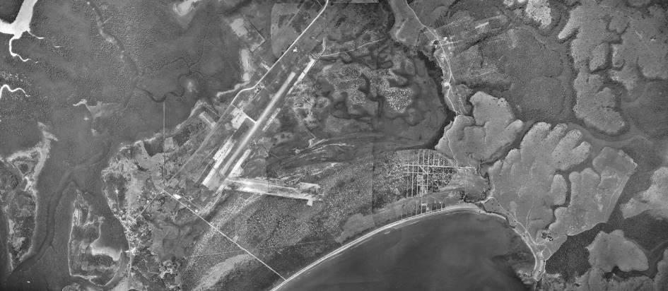
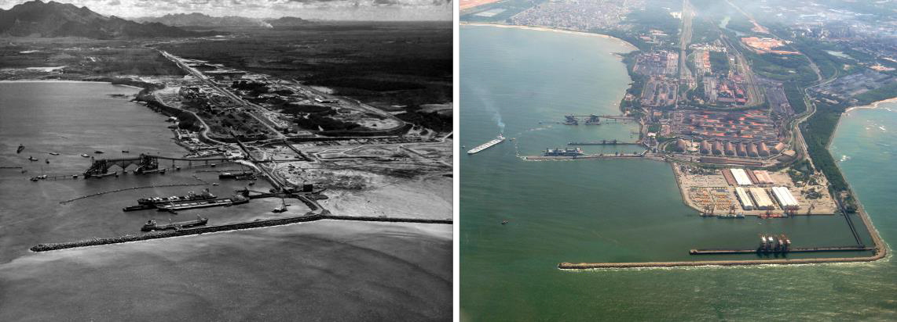
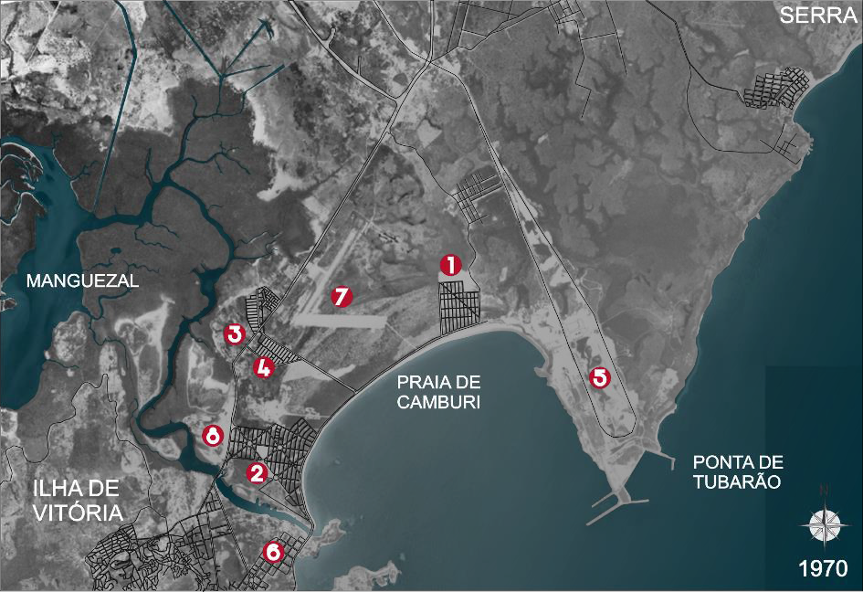
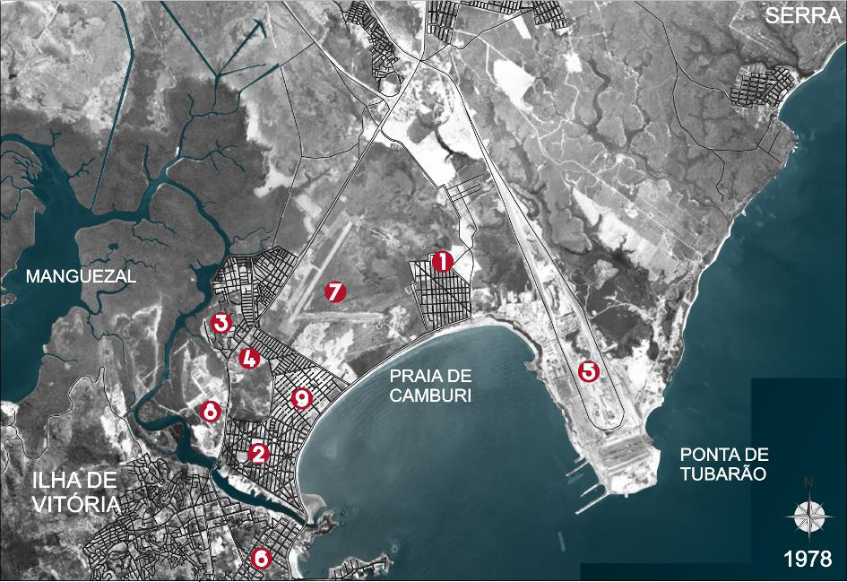
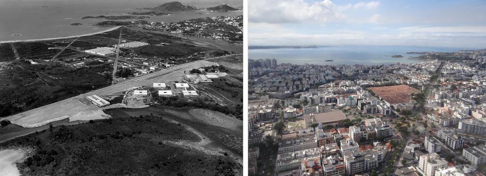
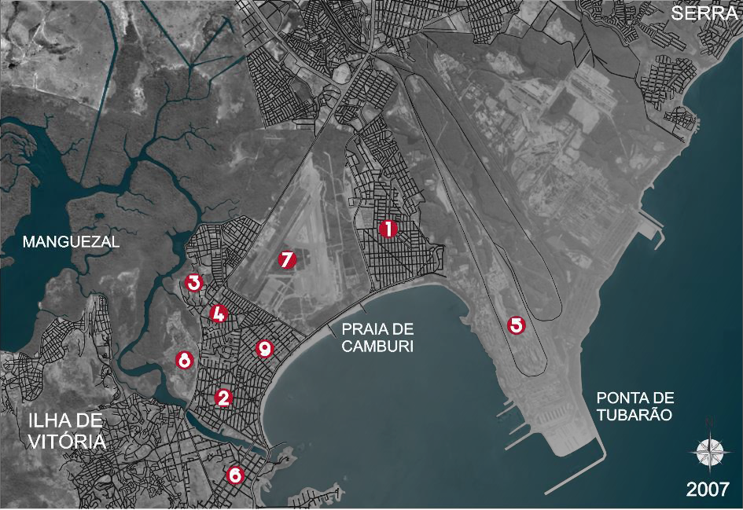
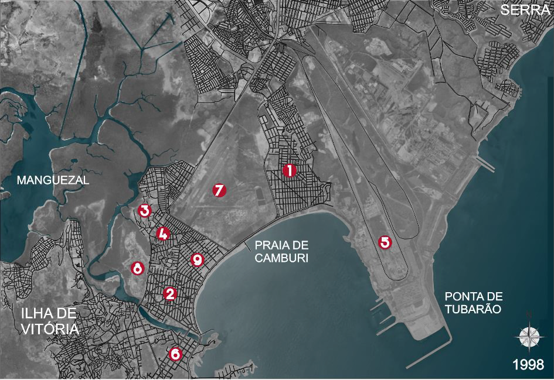

# Resumo

Derivada do processo de expansão urbana a área continental do Município
de Vitória (ES), a partir de 1950, denominada de Camburi, representa um
locus privilegiado devido às suas características físicas propícias
tanto para a urbanização quanto para as instalações industriais e
logísticas. Porém, evidencia diversos impactos negativos da relação
sociedade/natureza, devido à negação de seus elementos naturais:
manguezal, restinga e corpos d'água. Sua paisagem atual reflete
processos de transformação influenciados por uma sociedade que tende a
praticar uma dicotomia entre o ato de construir a cidade e a presença de
espaços livres: nesse contexto, a natureza desempenhou papel secundário
na determinação da morfologia urbana. Essa visão estanque e retrógrada
sobre o binômio construção/desenho da cidade conduziu a uma abordagem
fragmentada dos problemas ambientais urbanos, particularmente os
relacionados à degradação da qualidade de vida e dos espaços naturais. O
objetivo deste estudo é evidenciar o processo de transformação ocorrida
na região de Camburi, considerando as variáveis do suporte biofísico
(aspectos geomorfológicos, relevo, hidrografia e cobertura vegetal),
estrutura viária e grandes estruturas morfológicas urbanas (áreas
industriais, verticais e horizontais; loteamentos isolados; grandes
parques etc.). Objetiva-se, assim, apresentar um panorama do processo de
ocupação da citada região a partir da segunda metade do século XX, além
de debater sobre os parâmetros que regem os processos de construção da
cidade contemporânea, por meio de uma leitura crítica e multidisciplinar
da influência dos elementos naturais na configuração territorial.

Palavras-chave: paisagem, ecologia da paisagem, morfologia urbana,
urbanização

# Abstract

Derived from the process of urban sprawl the continental area of Vitória
(ES) municipality, from 1950, called Camburi, represents a privileged
locus due to its physical characteristics conducive both to urbanization
and industrial and logistical facilities. However, it highlights various
negative impacts of the society/nature relationship, due to the denial
of their natural elements: mangrove, restinga and water bodies. Its
current landscape reflects transformation processes influenced by a
society that tends to practice a dichotomy between the act of building
the city and the presence of free spaces: in this context, the nature
has played a secondary role in determining urban morphology. This tight
and retrograde bias about the binomial construction/city design led to a
fragmented approach of urban environmental problems, particularly those
related to the deterioration of life quality and natural spaces. The
objective of this study is to highlight the transformation process that
has occurred in the region of Camburi, considering the variables of the
biophysical support (geomorphological aspects, relief, hydrography and
vegetation cover), road structure and large urban morphological
structures (industrial areas, vertical and horizontal; insulated
allotments; large parks etc.). Thus, the goal is to present an overview
of that region occupation process from the second half of the 20th
century, as well as discuss the parameters that govern the processes of
construction of the

contemporary city, through a critical and multidisciplinary reading of
the natural elements influence in territorial configuration.

Keywords: landscape, landscape ecology, urban morphology, urbanization

# Introdução

Para que se compreenda a evolução da paisagem urbana é necessário um
olhar que perceba a diversidade de ritmos, e as diferenças entre estes,
que ocorrem no processo de urbanização e expansão das cidades,
transitando-se, assim, entre diferentes escalas de análises. No caso das
regiões litorâneas, desde a instauração do padrão colonial de ocupação
da zona costeira até a atualidade, os ambientes litorâneos são dotados
de importância estratégica e singular em diversos aspectos econômicos,
ecológicos e socioculturais. E as inter-relações entre
economia/política/cultura/natureza configuram, para Saquet (2013), o
campo teórico das abordagens conceituais multiescalares, com caráter
processual e relacional único, uma vez que mudanças e transformações
significam, simultaneamente, continuidades e descontinuidades.

Compreendemos que a evolução da arquitetura e do urbanismo está centrada
na busca pela integração do homem com a natureza. Entretanto, ao longo
dos séculos, houve uma transformação radical dos valores atribuídos
tanto à cidade quanto à natureza. Em Baptista *et all* (2013), a
transformação do Natural ao Cultural, em específico durante o
Renascimento se dava pela incorporação dos elementos naturais no desenho
das cidades, e a água exercia um papel de destaque na organização da
urbe. Já no período Maneirista, o conceito de cidade ideal foi
substituído pelo formalismo adequado à necessidade das cidades
fortificadas, adotando-se planos regulares e geométricos a modo de
isolar o ambiente construído do mundo natural. Já no projeto
racionalista da Cidade Industrial, que entende o sistema urbano como uma
máquina, a natureza passou a ser domada e, consequentemente,
racionalizada.

O objetivo geral deste artigo é construir um quadro de referência para a
compreensão das transformações da paisagem ocorridas nas cidades
brasileiras, sobretudo no que se refere à intensificação da urbanização
e industrialização a partir do século XX. O objetivo específico é
evidenciar como essas transformações se processaram na região de
Camburi, área continental do Município de Vitória (ES), considerando as
variáveis do suporte biofísico (relevo, hidrografia e cobertura
vegetal), estrutura viária e grandes estruturas morfológicas (áreas
industriais, verticais e horizontais; loteamentos isolados; grandes
parques etc.). Logo, será apresentado um panorama da ocupação da citada
região de Camburi a partir da segunda metade do século XX, buscando
debater sobre os parâmetros que regiram, e continuam regendo, os
processos de construção da cidade desde aquele período.

Propõe-se uma análise sobre a influência dos elementos naturais na
configuração territorial, bem como sobre as diversidades e contradições
que se expressam na cidade, numa abordagem fundamentada nos aspectos
conceituais sobre a paisagem, o território, o ambiente, a morfologia
urbana e os atributos sociais e culturais que incidem sobre as formas de
apropriação do sítio. Para tanto, esta análise deverá apoiar-se na
abordagem de múltiplas escalas e de diversas correntes científicas
relacionadas às áreas da arquitetura e do urbanismo, da ecologia da
paisagem, da geografia e da antropologia.

# Paisagem, Território e Ambiente: aproximações conceituais

As reflexões realizadas por Limonad (2008 e 2011), Sposito (2011) e
Volochko

\(2008\) sobre o desenvolvimento da sociedade brasileira na escala
tempo/espaço, apontam que, no curso da configuração das cidades
contemporâneas, a urbanização é tratada como um crescimento quantitativo
do tecido urbano, não necessariamente qualitativo do ambiente urbano.
Segundo esse critério, tornar urbano e/ou urbanizar significa introduzir
no espaço algo que antes não existia, o que, consequentemente,
transforma a paisagem: os espaços naturais, neste contexto, muitas vezes
são apropriados para fins diversos (residenciais, industriais etc.); e
onde populações e atividades produtivas são desterritorializadas e
reterritorializadas de forma contínua e cíclica. O que impera nesse
paradigma é a conquista de novos territórios, é a sobreposição e
justaposição dos tecidos e dos limites da cidade, desencadeando, assim,
uma série de conflitos socioambientais.

As abordagens sobre a configuração das cidades raramente constroem uma
totalidade analítica que abarque a somatória dos processos envolvidos:
vivemos a materialidade das inter-relações entre
economia/política/cultura/natureza, de forma indissociável em suas
objetivações e subjetivações. Acreditamos que se faz necessária a
superação de concepções simplistas e reducionistas que entendem "os
territórios sem sujeitos sociais ou esses sujeitos sem territórios e
apreender a complexidade e a unidade do mundo de vida, de maneira
(i)material, isto é, as interações *no* e *com* o lugar, objetiva e
subjetivamente"(SAQUET, 2013. p24, grifos do autor). É neste momento que
a Natureza ganha destaque, sobretudo no caso específico das relações do
homem com o espaço exterior das edificações (espaços livres), nos quais
os termos Ambiente, Paisagem e Território se entrelaçam, se confundem e
se complementam.

Efetivamente, não há consenso sobre esses termos e, portanto, segundo
Tardin (2008), não pode existir uma definição exata e única do que eles
representam e muito menos dos diversos e diferentes fenômenos que
abarcam. Mesmo porque, esse consenso seria impossível para as
inumeráveis referências conceituais derivadas das diversas correntes
científicas, e como já comentadas, serão aqui consideradas as correntes
que derivam da geografia (física e cultural), do urbanismo, do
paisagismo e da ecologia, as quais, de modos distintos, buscam definir e
analisar a estrutura física e as relações socioculturais estabelecidas
entre o sítio e as pessoas que ali habitam. Buscamos, também, analisar a
composição e o funcionamento dos ecossistemas existentes, onde
"território, paisagem e espaço livre, em sua pluralidade, denotam
conotações variadas, e cada uma delas destaca características mais
adequadas para as análises que se deseja realizar, o que permite dizer
que são, principalmente, conceitos instrumentais" (TARDIN, 2008. p. 43).

Obviamente, mesmo que quiséssemos não poderíamos objetivar aqui esgotar
essas perspectivas filosóficas, nem tampouco substituir conceitos
forjados com o tempo por visões que lhes sucederam. Mas pretendemos
interpretar as correlações existentes entre alguns destes conceitos à
luz de explicações realizadas por diversos autores, como por exemplo,
Dias *et all* (2009), Leite (1990, 1991 e 2004), Mateo e Silva (2007),
Saquet (2013) e Vicens (2012). Dentre demais autores, percebemos que a
maioria desses conceitos se refere a processos e não apenas a espaços.
Ab'Sáber (2003), nesse sentido, defende que há um consenso de que a
Paisagem é sempre uma herança de processos fisiográficos e biológicos,
além de simbolizar o patrimônio coletivo dos povos que historicamente
herdaram-na como espaço de atuação de suas comunidades. Se partirmos do
princípio de que o território é o suporte ou um conjunto de recursos
naturais, podemos inferir que as "abordagens relacionais e processuais,
reconhecendo outros níveis de relações e poder, os conflitos, a
apropriação e

dominação do espaço, enfim, o movimento histórico e multiescalar"
(SAQUET, 2013. p17) deverão convergir para um efetivo entrelaçamento
entre as definições de Paisagem e Território.

No debate conceitual proposto por Dias *et all* (2009), relacionando
criticamente os significados de Território, Paisagem, Ambiente, Sistema
e Espaço, percebemos que tais conceitos não são estanques, e que os
processos de adequação e transformação aos quais estão sujeitos nos
remetem a leituras relacionadas às perspectivas filosóficas que lhes
deram origem. Nelas, ora as definições se complementam, ora se justapõem
ou até mesmo se contrapõem sob alguns aspectos.

Para uma abordagem sistêmica de classificação da Paisagem, tanto Mateo e
Silva (2007) quanto Vicens (2012), diferenciam quatro vertentes de
entendimento: a) a vertente que entende a paisagem como aspecto externo
de uma área e/ou território, considerando-a como uma imagem com
qualidades inerentes e associadas às interpretações estéticas, o que
resulta em diversas percepções; b) a vertente que interpreta a paisagem
como formação natural, fundamentada nas inter-relações dos componentes
naturais, e entendendo-a como conjuntos dos elementos base dos estudos
da geografia física, cuja escala de evolução/transformação é geológica;
c) a corrente da paisagem cultural, concebendo-a como resultante da
atuação de grupos culturais sobre o espaço natural ao longo do tempo, e
que encara a transformação do território como uma relação ativa/passiva
entre o homem/natureza; d) e a vertente que concebe a paisagem como
formação antroponatural, como um sistema espacial formado por elementos
naturais e antropotecnógenas condicionadas socialmente, correlacionando
o grau de naturalidade e modificação antrópica na percepção de análise.
Corroborando e retificando estas concepções, Leite (1991) afirma:

> O homem sempre criou ao seu redor um ambiente que é uma projeção de
> suas ideias abstratas. Cada momento histórico tem uma paisagem,
> reflexo da relação circunstancial entre o homem e a natureza e que
> pode ser vista como a ordenação do ambiente, de acordo com uma imagem
> ideal. As mudanças nas atitudes do homem com relação à paisagem sempre
> foram marcadas por uma poderosa atração pela natureza. Essa atração
> está presente, tanto na paisagem submissa dos jardins do mundo
> clássico, quanto no caráter social da paisagem contemporânea (LEITE,
> 1991. p.45).

Neste aspecto, a atribuição desse caráter social destinado ao termo
Ambiente, em comparação com a Paisagem e o Território, é o de espaço
vivido que influencia o comportamento humano em função dos valores nele
inscritos, e atua como elemento normativo sobre os comportamentos e
representações. Dias *et all* (2009), nos trazem que a noção de ambiente
não se encerra apenas na dimensão natural, mas pressupõe uma visão
integral decorrente da tomada de consciência da vida em sociedade, da
relação entre as populações humanas e de suas interações com a natureza.
Portanto, o ambiente envolve o ser humano; e o Meio é o lugar onde
ocorrem as relações e das quais podem ou não advir significados. Logo, o
Ambiente é um estado de consciência que aflora a partir do significado
dessas relações: são lugares onde os seres vivem - em salas, ônibus,
florestas, praças etc., ou seja, em qualquer meio em que se encontrem.
Neste contexto, entendemos que o ambiente é dinâmico porque incorpora
sistemas de valores e porque se transforma permanentemente, tornando-se
o espaço

experimentado, vivido e relacional.

Ao problematizar sobre a relação do homem com o ambiente, David Drew nos
trás uma perspectiva diferenciada sobre os significados deste, pois
afirma que a tradição cultural desempenha papel determinante no
comportamento das pessoas em relação ao espaço onde vivem: a maneira
como o Homem ocidental encara o seu meio deriva em parte do ideal
cristão-judaico. Segundo a qual, ao invés de outras criaturas, o homem
foi feito à imagem de Deus, tendo, portanto, o direito de dominar o
mundo, e que em outras culturas/religiões orientais, como o budismo,
taoísmo chinês e xintoísmo nipônico, por exemplo, a concepção de mundo
produziu reações diferentes em relação à natureza. Exemplificando que

> A ideia do homem como um ecônomo ou guardião do mundo da natureza
> também existe, de certa forma, no pensamento pré-cristão, e essa falta
> de total separação do homem e da natureza ainda persiste, em grau
> limitado, no islamismo e no judaísmo. O cristianismo, sobretudo em
> seus pronunciamentos oficiais, talvez em parte como reação aos cultos
> pagãos da fertilidade da terra \[\...\], dá sempre ênfase à separação
> entre os seres humanos e o resto da criação. Esse distanciamento
> mental no pensamento do Ocidente perdura até hoje. Embora a ética
> cristã já não mantenha essa atitude fundamental, a ideia da natureza
> como um inimigo a ser combatido e subjugado permanece como parte de
> nossas concepções econômicas e científicas. O progresso equivale por
> vezes ao controle da natureza e do mundo natural, que se julga
> consistir de fatores de produção ou meios pelos quais o homem pode se
> beneficiar materialmente (DREW, 2010. p. 2).

Cabe reforçar, aqui, o papel que homem desempenha como um dos elementos
que interagem no meio biofísico, cultural e simbólico, relacionados ao
seu espaço de cognição, apreensão e vivência, produzindo com maior ou
menor intensidade marcas indeléveis dessa interação e dos seus impactos
decorrentes. Nesta perspectiva, os trabalhos de Afonso (2006) e Tardin
(2008), lançam um olhar sobre as formas de urbanização, transformação e
estrutura sistêmica em regiões litorâneas, problematizando os padrões
urbanos e os processos naturais e introduzindo questionamentos sobre a
interação do homem com o ambiente. A abordagem envolve os preceitos da
Ecologia da Paisagem, considerada como uma ciência que abrange os campos
de estudos biológicos, geográficos e humanos, adotando-se atitudes e
pensamentos holísticos e buscando-se uma integração entre o natural e os
artefatos elaborados pelos homens. Esses objetivos, consequentemente,
estabelecem uma base científica para o planejamento, conservação e
desenvolvimento tanto da paisagem quanto do território ou ambiente.

Logo, a metodologia de análise do objeto empírico deste trabalho
abordará a transformação da paisagem dentro dessa perspectiva, dando
ênfase aos processos naturais (relevo, hidrologia, cobertura vegetal
etc.), e às prerrogativas antropológicas (em relação às necessidades
humanas de uso da terra na construção do seu habitat).

# Panorama histórico e a transformação da paisagem em Camburi

Conforme explicitado anteriormente, desde o período da colonização a
localização

das cidades ao longo da costa marítima foi priorizada devido à
necessidade de conexão econômica e política com Portugal. Desde aquela
época até atualmente foi no entorno dos portos, estrutura fundamental
para os circuitos de produção e logística, que foi fomentada a
intensificação das atividades urbanas, formando-se as primeiras redes de
cidades brasileiras (Salvador, Recife, Rio de Janeiro, Santos e
Vitória). Portanto, a qualificação das cidades litorâneas (em geral) e
portuárias (em especial), se deve a uma série de atributos singulares,
desde a riqueza da biodiversidade e relevância do patrimônio natural às
estratégias de fluxos comerciais. É em torno dessas singularidades e
potencialidades econômicas e naturais que se justifica a aceleração do
processo de expansão territorial, em que a "magnitude do impacto causado
ou a velocidade de sua disseminação permite destacar três vetores
prioritários: a urbanização, a industrialização e a exploração
turística" (MORAES, 2007. p.32). E a região de Camburi não fugiu às
regras desse conjunto de fatores. Logo, a investigação sobre a
transformação de sua paisagem passa pelo entendimento dos processos de
ocupação e, sobretudo, dos impactos provocados pela incompatibilização
entre a urbanização e a ecodinâmica costeira.

A evolução geomorfológica da costa capixaba, em especial da Região
Metropolitana da Grande Vitória (RMGV), é estritamente complexa de ser
descrita e avaliada, uma vez que vários trechos perderam os vestígios de
sua constituição, tanto pela ação do homem quanto pela submersão do
relevo. No estudo sobre a erosão e progradação do litoral capixaba
(ALBINO *et all*, 2006), foram identificadas três unidades
geomorfológicas distintas no estado do Espírito Santo: os afloramentos e
promontórios cristalinos pré-cambrianos; as planícies flúvio-marinhas; e
os tabuleiros terciários de formação Barreiras. Esta última estende-se
por todo o litoral capixaba, e corresponde à forma das falésias (vivas e
mortas), além dos terraços de abrasão marinha, distribuídos e expostos
durante a maré baixa. Para Albino *et all* (2006) e para Stange Jr.
(1985), essa ultima unidade representa uma estrutura monoclinal íngreme,
ocasionada pelo soerguimento da superfície terciária em relação ao nível
do mar, ocorrida durante o terciário médio. Tal processo se relaciona ao
movimento da placa tectônica da América do Sul para o oeste, e à
consequente formação dos Andes, uma vez que a cronologia dos de formação
de arenitos de ambos são muito semelhantes. O soerguimento e consequente
regressão marinha são indícios de que a RMGV, em algum momento na escala
de tempo geológico, era provavelmente uma enseada, pontuada de ilhas que
se estendia entre os atuais municípios de Guarapari e Serra, atingindo a
base da cadeia de montanhas em direção ao oeste. Essa suposição é
fundamentada, principalmente, pela existência de cordões marinhos em
diversos locais dessa região metropolitana.

A região aqui estudada, denominada de Camburi, compreende a porção
continental do município de Vitória, composta por planícies semiúmidas,
trechos de cordões de areia quartzosa derivado da erosão marinha e de
áreas de mangues, observado na figura 1. Durante muito tempo os estudos
relativos à faixa litorânea brasileira eram pontuais e incompletos, e as
investigações sobre os impactos do processo de urbanização identificavam
somente a retirada da restinga como um fator negativo. O termo restinga
foi historicamente dotado de uma significação unicamente florística,
embora se refira também "aos cordões de areia vinculados à história da
sedimentação marinha costeira" (AB'SÁBER, 2003. p.45). Por isso, sua
importância era minimizada e não correlacionada às alterações
ecossistêmicas ocorridas decorrentes do desencontro e conflitos entre os
processos urbanos e a dinâmica natural.

> {width="4.729166666666667in"
> height="2.0625in"}
>
> Figura 1. Levantamento aerofotogramétrico parcial de Camburi, 1955.
> Indicação do traçado inicial do atual bairro de Jardim Camburi \[1\],
> a implantação da pista do Aeroporto Eurico Salles \[2\], e a Avenida
> Fernando Ferrari \[3\]. Nota-se ainda a presença dos pequenos fundos
> de vale e inúmeros corpos d'água que posteriormente eliminados pela
> urbanização da região, das áreas semiúmidas, dos cordões marinhos e a
> extensão do manguezal. Fonte: Instituto Jones dos Santos Neves (com
> inserções dos autores).

Os atuais conflitos socioambientais presentes na região de Camburi, como
dito anteriormente são derivados da atração exercida pela zona costeira
para ocupação com assentamentos humanos, e acentuados a partir da década
de 1950 - período identificado como de transição da economia cafeeira
para industrial, atrelado aos interesses mercadológicos para
parcelamento e ocupação do solo capixaba. Até o final da década de 1970,
conforme Mendonça (1995), a região de Camburi se converteu no foco
preferencial para instalação de moradores da classe média, fazendo com
que a região apresentasse o maior adensamento urbano da RMGV. O gatilho
da expansão territorial de Vitória remete à transição do período
colonial brasileiro ao da instauração da República no final do século
XIX. Naquela época, os governantes buscavam romper os laços coloniais e
firmar uma nova imagem para o país, e parte desta transformação
consistia na reconfiguração das cidades a reboque das intervenções
haussmanianas. Em Vitória essa transformação foi tardia, como explica
Baptista *et all* (2013), uma vez que ainda no início do século XX a
estrutura urbana do núcleo fundacional ainda era considerado suficiente
à população. Contudo, em meio ao contexto de desenvolvimento nacional, a
partir da década de 1910 deu-se início a reconfiguração e expansão do
sistema portuário. Com isso, o recortado litoral da Baía de Vitória era
gradativamente transformado, eliminando-se as franjas dos manguezais e
dando lugar a formas mais regulares por meio de sucessivos aterros.

A expansão mais expressiva em direção a leste/nordeste da ilha se deu:
pelo projeto de Saturnino de Brito denominado "Novo Arrabalde" (atual
Praia do Canto e adjacências), de traçado regular como forma de
superação do traçado colonial, e acrescentava um expressivo sítio por
meio de aterros e enroncamentos para a ocupação urbana; e de outros
projetos de expansão do Plano de Urbanização de Vitória (1931). Esse
conjunto indicou o eixo preferencial para a ampliação do território,
contudo explicitou as vantagens e desvantagens na utilização dos
terrenos da própria Ilha ao invés da planície continental. Mendonça
(1995) identificou, nos discursos de Henrique de Novaes e do próprio
Saturnino de Brito, que era preferível conquistar terras junto à Ilha,
do que submeter à população a fadiga diária de grandes deslocamentos,
uma vez que o centro das atividades comerciais e de serviços
encontravam-se no núcleo fundacional. Abe (1999) aponta que, no período
entre 1930 a 1943, foi implementada uma política de caráter nacional que
permitiu avançar com as obras do porto no final da praia da Camburi. Tal
estratégia se fundamentava na

inadequação física dos portos da Baía de Vitória para atender ao
comércio internacional de minério, porque os novos meios de transporte
marítimo, de maior calado, tinham dificuldade de transitar na Baía de
Vitória devido ao seu assoreamento. Justificando-se, assim, a
concentração das atividades de beneficiamento e transporte de minério no
complexo industrial/portuário da Ponta de Tubarão (cf. Figuras 2 e 3).

> {width="5.697916666666667in"
> height="2.0625in"}
>
> Figura 2. Vista aérea das obras de expansão do Terminal Marítimo de
> Tubarão (ES), entre 1971 e 1972, durante a execução do segundo aterro
> de ampliação da ponta de Camburi (VALE, 2012. p.152).
>
> Figura 3. Atual configuração do complexo industrial/portuário de
> Tubarão, destacando-se a transformação da paisagem com a urbanização
> de Jardim Camburi e com os diversos aterros para ampliação do porto
> (Foto de André Bonacin, 2012).

Entre as décadas de 1950 e 1980, a expansão urbana no citado eixo ganha
volume, (cf. Figuras 04 e 05), e a implantação e construção dos
conjuntos habitacionais em Goiabeiras, Jardim da Penha, Bairro República
e Jardim Camburi contribuíram para a formação de um ambiente urbano.
Contudo, a instalação do complexo industrial e portuário foi o fator
determinante para o crescimento urbano nesta direção, bem como
constituiu razão para conflitos na determinação dos limites municipais
entre Vitória e Serra. Naquela época, o Estado Militar considerava que a
implantação do complexo industrial, com destaque para a atividade de
siderurgia, iria transformar o planalto de Carapina no maior centro
siderúrgico da América Latina. Em consequência disso, o porto de
Tubarão, deveria ser adequado, sendo necessários diversos investimentos
em infraestrutura que correspondessem ao desenvolvimento econômico
pretendido. As obras viárias intensificaram-se, não necessariamente para
dar acesso às atividades urbanas, mas, sim, para facilitar o acesso às
plantas industriais ampliadas pela construção da Companhia Siderúrgica
de Tubarão na Praia Mole, ou seja, em terreno adjacente ao da Companhia
Vale do Rio Doce (atual Vale).

Em prol do desenvolvimento econômico a paisagem onde se localizam as
citadas plantas industriais foi completamente transformada: os corpos
d'água da região foram aterrados e canalizados e a linha litorânea
reconfigurada, através de sucessivos aterros na Ponta de Tubarão para
ampliação da área de estocagem de minério. Albino et all (2006. p.234),
destacam que a forma da construção do Porto na Ponta de Tubarão "alterou
a morfologia do fundo da baía do Espírito Santo e o padrão da direção
das ortogonais das ondas, o que vem causando erosão desde a década de
1980", tanto na orla de Vitória como no município de Vila Velha. Neste
mesmo período, o Campus da Universidade Federal do Espírito Santo foi
instalado sobre aterros realizados no manguezal (fig. 6), na antiga
estrada do Aeroporto (atual Av. Fernando Ferrari). A fixação do campus
universitário em local afastado da área central seguiu o paradigma de
isolamento das universidades instituído nacionalmente. Mendonça (1995)
considera que esses conjunto de atividades intensificou o vetor de
expansão para a

planície continental, e consolidou a urbanização do que anteriormente
era área rural, transformando a região em área prioritária de
investimentos.

> {width="4.729166666666667in"
> height="3.2395833333333335in"}
>
> Figura 4. Levantamento aerofotogramétrico da Região de Camburi, 1970.
> Destaque para a malha urbana em contraste com os espaços naturais. Em
> comparação com a fig. 01 nota-se o impacto sobre os corpos d'água em
> função da forma de implantação da planta industrial e a configuração
> dos bairros. Fonte:
> [www.veracidade.com.br](http://www.veracidade.com.br/) (com inserções
> dos autores).
>
> {width="4.71875in" height="3.25in"}
>
> Figura 5. Levantamento aerofotogramétrico da Região de Camburi, 1978.
> Destaque para a malha urbana em contraste com os espaços naturais.
> Nesta imagem nota-se claramente, em comparação com a anterior: a
> proporção do aterro realizado na ponta de Tubarão para construção do
> porto; o inicio da instalação da segunda planta industrial; e
> ampliação da área ocupada pelos bairros. Fon[te:
> www.veracidade.com.br](http://www.veracidade.com.br/) (com inserções
> dos autores).
>
> {width="5.71875in"
> height="2.0729166666666665in"}
>
> Figura 6. Vista aérea parcial da Região de Camburi por volta da década
> de 1960/70, com destaque para a implantação da UFES sobre aterros, a
> abertura das vias em meio à restinga, e conjuntos habitacionais em
> Jardim da Penha (Autor: Paulo Bonino. Acessado em: 25 de maio de 2013;
> disponível em <http://www.veracidade.com.br/panoramic/aerea/bon>
> ino/025_centrodeartes_jardimdapenha.jpg
>
> Figura 7. Vista aérea parcial da Região de Camburi, e (acima) do
> bairro Jardim da Penha que segue uma homogeneização do gabarito dos
> conjuntos habitacionais, diferentemente da Mata da Praia (à esquerda)
> em função da expectativa de valorização após 1980. Como pano de fundo
> o Porto de Tubarão, a Praia de Camburi e a Baía do Espírito Santo
> (Acervo pessoal Patricia Eiko, 2013).

A região de Camburi, portanto, era vista como último reduto disponível
para instalação de conjuntos habitacionais (cf. fig. 07), pois oferecia
facilidade de infraestruturas urbanas - tornando-se altamente rentável
para os cofres públicos. Bairros inteiros apareceram num período de 10
anos, forçando o Poder Público a tomar iniciativas no ordenamento e uso
do solo, na pavimentação e instalação de serviços urbanos, numa nítida
imagem de progresso. Ao problematizar o ambiente urbano-industrial Drew
(2010), afirma que estas atividades representam a mais profunda
modificação humana sobre a superfície da terra, porque todos os
elementos e aspectos do ambiente passaram a ser "alterados pela
urbanização e industrialização, inclusive o relevo, o uso da terra, a
vegetação, a fauna, a hidrologia e o clima", \[\... e em regra geral,
a\...\] "intensidade da mudança está ligada à densidade da área
edificada e a extensão da industrialização" (DREW, 2010. p.177). A
explosão das cidades resultou na dispersão urbana pelo território
justificada pela utilização de transportes motorizados, tendendo à
degradação da natureza. Associada ao crescimento intenso e descontínuo
das metrópoles surge novos problemas, alternados em ciclos viciosos que
tendem à perda da qualidade de vida urbana.

Entre as décadas 1980 e 2010, (cf. Figuras 8 e 9) a região de Camburi
sofreu um processo de intensificação da urbanização sob controle do
Município, que instituiu normas para alterar o padrão de ocupação
vigente até então, visando à instalação de conjuntos habitacionais e a
expectativa de valorização imobiliária. Uma das transformações mais
nítidas na paisagem de Camburi decorreu da ampliação da faixa de areia
para redesenho da linha litorânea e da construção de três quebra-mares
para contenção da erosão derivada da citada ampliação da área portuária.
Nesta mesma época ocorreram três outras transformações importantes: 1) a
ampliação do loteamento de Jardim Camburi estendeu-se até a divisa entre
Vitória e Serra, aterrando a planície semiúmida em direção ao norte; b)
a ocupação de trecho do manguezal em Goiabeiras; c) e a ocupação das
margens no Canal da Passagem em Jardim da Penha. Nota-se que, para os
planos urbanísticos e administrativos municipais, a região de Camburi
foi potencialmente destinada para ocupação urbana, contudo, os projetos
e a morfologia decorrente dos loteamentos desconsideraram os atributos
naturais como qualificadores do ambiente urbano.

> {width="4.71875in" height="3.25in"}
>
> Figura 8. Levantamento aerofotogramétrico da Região de Camburi, 1998.
> Destaque para a malha urbana em contraste com os espaços naturais.
> Fonte: [www.veracidade.com.br](http://www.veracidade.com.br/) (com
> inserções dos autores).
>
> {width="4.71875in" height="3.25in"}
>
> Figura 9. Levantamento aerofotogramétrico da Região de Camburi, 2007.
> Destaque para a malha urbana em contraste com os espaços naturais.
> Fon[te: www.veracidade.com.br](http://www.veracidade.com.br/) (com
> inserções dos autores).

# Reflexões

Não pretendemos estabelecer aqui uma radical diferenciação entre cidade
e natureza, e muito menos repetir o erro de considerar a cidade como uma
segunda natureza, ou ainda uma negação do que Milton Santos denominava
de "natureza natural". Afinal, a maioria da população já determinou o
meio urbano como habitat preferencial a ponto de, exageros à parte,
podermos considerar que a cidade já faz parte da natureza humana. Mas
cabe enfatizar, aqui, nossa crítica aos modos como o crescimento urbano,
travestido de desenvolvimento, vem se processando indiferentemente das
bases territoriais onde se instalam. Cabe relevar nossa preocupação
quanto aos paradigmas que historicamente vêm vigorando na produção do
território, via de regra

priorizando o "alisamento" dos seus atributos naturais em favor da
ocupação urbana. Cabe questionar até quando o Homem acreditará que a
sobrevida da cidade e o devir urbano possam seguir por meio da anulação
de tais atributos que lhes dão insumos e efetivamente os qualificam. Até
quando esse tipo de inferência funcionará como "um tiro no próprio pé",
uma vez que os atributos naturais não são meramente o oposto à qualidade
urbana.

# Referências bibliográficas

> ABE, André Tomoyuki. *Grande Vitória, E.S.: Crescimento e
> Metropolização*. Tese - Universidade de São Paulo, Faculdade de
> Arquitetura e Urbanismo. São Paulo, 1999.
>
> AFONSO, Cintia Maria. *A paisagem da Baixada Santista: Urbanização,
> transformação e conservação.* São Paulo: Editora da Universidade de
> São Paulo: FAPESP, 2006.
>
> AB'SÁBER, Aziz. N. *Os domínios de natureza no Brasil: potencialidades
> paisagísticas.* São Paulo: Ateliê Editorial, 2003.
>
> ALBINO, Jacqueline; GIRARDI, Gisele; \| NASCIMENTO, Kleverson
> Alencastre do. Espírito Santo. In: MUEHE, Dieter (org.). *Erosão E
> Progradação Do Litoral Brasileiro.* Brasilia: MMA, 2006.
>
> BAPTISTA, Janaína Schmidel; ESTEVES JUNIOR, Milton; PASSOS, Rafael de
> Melo; RANGEL, Orlando Vinicius Nunes. *O processo de Ocupação
> territorial e a transformação da região litorânea entre os municípios
> de Vitória e Serra(ES)*. In: Anais do X Encontro Nacional da
> Associação Nacional de Pós-Graduação e Pesquisa em Geografia, 2013.
> p.8481-8492
>
> DIAS, Maria Ângela; REGO, Andrea Queiroz; RHEINGANTZ, Paulo; NUNES,
> Maria Julieta; TÂNGARI, Vera Regina. *Sistema de Espaços Livres nas
> Cidades Brasileiras -- um debate conceitual.* In: Paisagem Ambiente:
> ensaios - n. 26. São Paulo, 2009. p. 225-247

DREW, David. *Processos interativos homem-meio ambiente*. Tradução de
João Alves dos santos: revisão de Suely Bastos: coordenação editorial de
Antônio Christofoletti. 7ª ed. Rio de Janeiro: Bertrand Brasil, 2010.

> HENRIQUE, Wendel. *O direito a natureza na cidade.* Salvador: EDUFBA,
> 2009.
>
> LEITE, Maria. Angela Faggin. Pereira . *Organização territorial e
> paisagem no Brasil: da exploração colonial ao movimento ecológico*.
> Sinópses (USP), São Paulo, v. 14,1990. p. 21-28
>
> . *A paisagem, a natureza e a natureza das atitudes do homem*.
> Paisagem e Ambiente, São Paulo, v. 4, 1991. p. 45-66
>
> . *Natureza e cultura: paisagem, objetos e imagens*. Paisagem e
> Ambiente, São Paulo, v. 18, 2004. p. 59-69

LIMONAD, Ester. Espaço-Tempo e Urbanização: algumas considerações sobre
a urbanização brasileira. In: Revista Cidades: *A urbanização da
sociedade -- Vol.5, n.8*. Presidente Prudente: Grupo de Estudos Urbanos,
2008. p.243-261.

. Urbanização e organização do espaço na era dos fluxos. In:

> HAESBAERT, Rogério. et al. (orgs.) *Território, territórios: ensaios
> sobre o ordenamento territorial.* Rio de Janeiro: Lamparina, 2011.
> 3.ed. 1.reimp. p.145-170
>
> MATEO, J. and SILVA, E.V. *La geoecologia del paisaje, como fundamento
> para el analisis ambiental*. In: REDE -- Revista Eletrônica do
> Prodema, v.1, n.1, 2007. p77-98
>
> MENDONÇA, Eneida Maria Souza. *(Trans)Formação planejada de
> territórios urbanos em Vitória (ES): o bairro Camburi.* Dissertação de
> mestrado. Faculdade de Arquitetura e Urbanismo de São Paulo. São
> Paulo, 1995.
>
> MORAES, Antonio Carlos Robert. *Contribuições para a gestão da zona
> costeira no Brasil: elementos para a geografia do litoral brasileiro*.
> São Paulo: Annablume, 2007.
>
> SAQUET, Marcos Aurélio. *Abordagens e concepções sobre o território*.
> São Paulo: Outras Expressões, 2013.
>
> SPOSITO, Maria Encarnação Beltrão. A produção do espaço urbano:
> escalas, diferenças e desigualdades socioespaciais. In: *A Produção do
> espaço urbano: agentes e processos, escalas e desafios.* CARLOS, Ana
> Fani Alessandri; SOUZA, Marcelo Lopes; SPOSITO, Maria Encarnação
> Beltrão(org.). São Paulo: Contexto, 2011.
>
> STANGE JUNIOR, Alberto. *Montanhas de Vitória & outros escritos*.
> Vitoria: Instituto Histórico e Geográfico do Espírito Santo, 1985.
>
> TARDIN, Raquel. *Espaços livres: sistema e projeto territorial*. Rio
> de Janeiro: 7 Letras, 2008.

VALE. *Nossa História*. 2012. Acesso em: 30 Novembro 2012. Disponível
em:
<http://www.vale.com/brasil/PT/aboutvale/news/Documents/historia70anos/Vale_Livr>
o_Nossa_Historia_cap2.pdf

VICENS, Raúl Sánchez. Geografia da Paisagem e ordenamento ambiental. In:
BARBOSA, Jorge Luiz; LIMONAD, Ester (org.). *Ordenamento territorial e
ambiental.* Niterói: Editora da UFF, 2012. p.193-214

> VOLOCHKO, Danilo. Sociedade urbana e urbanização da sociedade:
> elementos para a discussão sobre a problemática da cidade
> contemporânea. In: *Revista Cidades: A urbanização da sociedade --
> Vol.5, n.8*. Presidente Prudente: Grupo de Estudos Urbanos, 2008.
> p.215-242
