# Resumo

O fenômeno dos portos na cidade pode ser associado às relações
socioeconômicas de ordem temporal e espacial distintas, sempre balizadas
por questões globais. Este artigo trata desse fenômeno em âmbito local,
com abordagem sobre modernização portuária, evolução urbana e
transformação do território e da paisagem da Capital capixaba
(Vitória/ES/Brasil). A substituição dos antigos cais pelo porto moderno,
no final do século XIX; a reestruturação urbanística e econômica da
antiga vila nos moldes de praça de comércio, no século XX; a expansão e
diversificação da atividade portuária em área distante do primeiro
núcleo portuário da cidade, nos anos 1960; a expansão das plantas
industriais e áreas retroportuárias, nas últimas décadas do século
passado; e o novo ciclo de expansão da atividade portuária em esfera
metropolitana, no século XXI; estão entre os fatores que modificam, de
modo permanente, a reconfiguração territorial e paisagística de Vitória.
Este trabalho busca elucidar o fenômeno dos portos na cidade a partir de
processos históricos contextualizados na Capital capixaba, nos quais se
observa a produção territorial do porto e da cidade, por meio da
denominada modernização e expansão de ambos. O compartilhamento do uso
do território revela de início uma relação de dependência e proximidade
entre as funções do espaço urbano e a atividade portuária propriamente
dita. Em seguida, se observa o afastamento funcional entre cidade e
porto, contudo permanece a proximidade física e visual, a partir da
evolução e ocupação urbana. Constata-se atualmente a disputa pelo
território associada aos impactos socioambientais, afetando paisagem e
vida urbana.

Palavras**-**chave: modernização portuária, evolução urbana, cidade,
território, paisagem

# Abstract

The phenomenon of ports in the city may be associated with socioeconomic
relations of different temporal and spatial orders, always buoyed by
global issues. This article addresses this phenomenon at local level,
approaching on port modernization, urban evolution and transformation of
the territory and the landscape of the capital of Espírito Santo
(Vitória / ES / Brazil).The replacement of old pier for the modern
harbor in the late 19th century; the urban and economical
restructuration of the old village in the form of trade square, in the
twentieth century; the expansion and diversification of port activity in
distant area from the first port city core in the 1960\'s; the expansion
of industrial plants and retro-port areas in the last decades of the
last century; and the new cycle of expansion of port activities on
metropolitan sphere, in the XXI century, are among the factors that
change, permanently, the territorial and landscape reconfiguration of
Vitória. This work seeks to elucidate the phenomenon of ports in the
city from historical processes contextualized in the Espírito Santo's
Capital, in which we observe the territorial production of the harbor
and the city, through the so-called modernization and expansion of both.
The sharing of the land use reveals from the start a relation of
dependency and proximity between the functions of urban space and port
activity itself. Then we observe the functional separation between city
and port, yet remains the physical and visual proximity, from urban
evolution and occupation. Currently we acknowledge the competition for
territory associated to the social and environmental impacts, affecting
urban landscape

> and life.
>
> Keywords: port modernization, urban development, city, territory,
> landscape

# De cais a porto moderno, de vila a praça de comércio: notas iniciais

> Vitória é uma cidade marítima que, como a maioria das cidades
> portuárias brasileiras, possui historicamente relação intrínseca com o
> mar e seus portos, nos quais a modernização resulta na permanente
> reestruturação territorial, paisagística, econômica e social da
> cidade. Até o início da República, as estruturas portuárias de Vitória
> correspondem a pequenos cais às margens da baía (Fig. 1 e 2). Nesta
> época, a cidade ainda não possui configuração urbana modernizada, a
> exemplo de demais capitais brasileiras. Pelo contrário, Vitória
> apresenta traçado urbano irregular e ruas estreitas, sendo circundada
> por braços de mar, em território dominantemente insular. Essa condição
> somente se altera a partir do desenvolvimento de um porto moderno na
> cidade (ABREU; MARTINS; VASCONCELLOS, 1993).
>
> O crescimento portuário no Brasil ocorre a partir de 1808, com a vinda
> da Família Real Portuguesa, que decreta abertura dos portos
> brasileiros ao comércio internacional (FREITAS, 2009). Com isso, se
> intensifica a economia do país e firmas comerciais europeias se
> instalam na costa das principais cidades brasileiras. Em Vitória,
> diversas casas de comércio são implantadas às margens da baía,
> caracterizando a ocupação da frente marítima da cidade (Fig. 3).
>
> 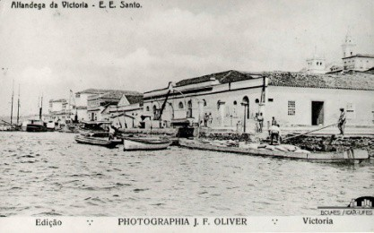
>
> 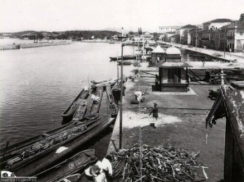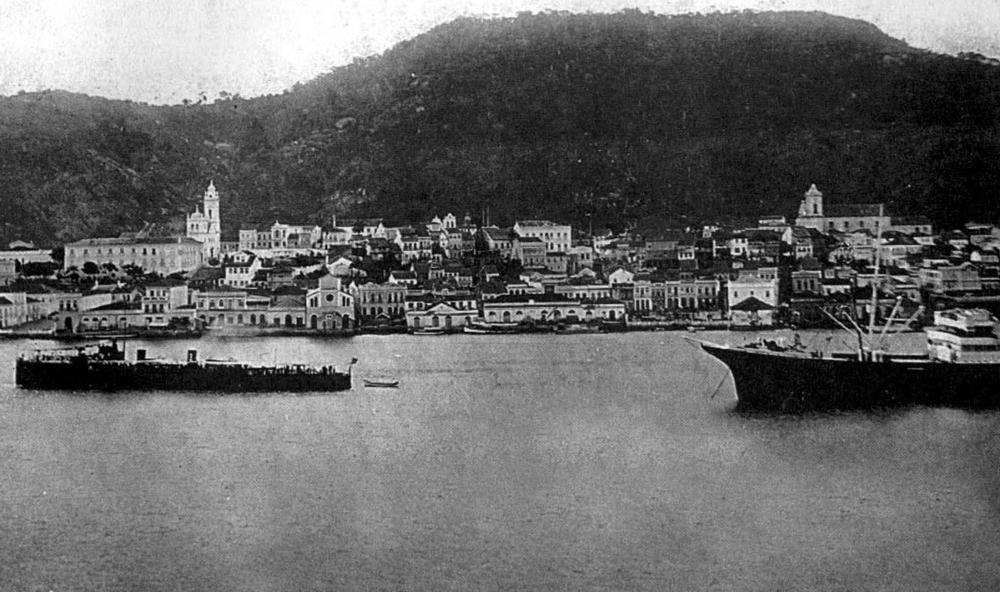Figura
> 1. Cais da Alfândega, 1902.
>
> Fonte: MIRANDA, 2001.
>
> Figura 2. Porto dos Padres. Fonte: MIRANDA, 2001.
>
> Figura 3. Frente marítima da cidade anterior à implantação do Porto de
> Vitória. Fonte: MIRANDA, 2001.
>
> Ressalta**-**se que a movimentação portuária na cidade, antes da
> formação do porto moderno, vincula**-**se predominantemente ao
> transporte de açúcar e cereais. Somente a partir do final do século
> XIX, a comercialização do café se torna a principal base econômica
> para o desenvolvimento e a ascensão comercial da Capital (ABREU;
> MARTINS; VASCONCELLOS, 1993). O café proporciona novo destino para o
> Estado e de forma bem visível à estruturação urbanística da cidade de
> Vitória. De fato,
>
> \[\...\] o café que lançou o Espírito Santo no contexto nacional. A
> antiga província que não tinha atrativos para a Coroa, e assim fora
> excluída do \"exclusivo metropolitano\", foi integrada na lógica
> mercantil de um Capitalismo que se afirmava a partir da Europa e que
> tinha o café como base (CALIMAN apud VASCONCELOS, 2011, p. 152).
>
> Para viabilizar a exportação do café, são necessárias reformulações
> viárias e urbanas, além de projetos ferroviários, tanto no Estado do
> Espírito Santo como em Vitória. Era necessário romper com a condição
> de isolamento da cidade que "\[\...\] insulava-se duplamente: pela
> natureza geográfica e pela falta absoluta de interligamento com os
> municípios do interior \[\...\]. A estrada era, portanto, necessidade
> premente e inadiável" (DERENZI, 1995, p. 147).

Quanto aos aspectos urbanos, o governador Muniz Freire (1892**-**1896)
caracteriza Vitória como "\[\...\] cidade velha e pèssimamente
construída, sem alinhamentos, sem esgoto, sem arquitetura, segundo os
caprichos do terreno, apertada entre a baía e um grupo de montanhas"
(DERENZI, 1995, p. 141). A reestruturação da cidade é salientada diante
do crescimento comercial que se confronta com uma condição urbana
precária, "\[\...\] a cidade precisa de tudo: água e esgoto, drenagem e
atêrro, luz e fôrça" (DERENZI, 1995, p. 141).

Ainda no final do século XIX, dentre os fatores de modernização das
cidades brasileiras, destacam**-**se a construção e o aprimoramento de
seus portos, que resultam na transformação dos núcleos coloniais. Por
essa lógica, em 1895, organiza**-**se a Comissão de Melhoramentos de
Vitória, que prevê modernização da cidade junto ao porto (FREITAS,
2010). Nas décadas seguintes, a cidade reformula**-**se para se tornar
praça de comércio e de conexão com outras regiões, devendo expressar
imagem compatível com a concepção de porto moderno. Isso resulta em
aterros, saneamento urbano, reestruturação viária, criação de espaços
públicos, em suma, em obras que caracterizam a nova paisagem da cidade
que se quer moderna (Fig. 4, 5 e 6).

> 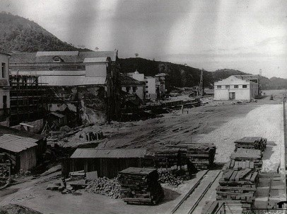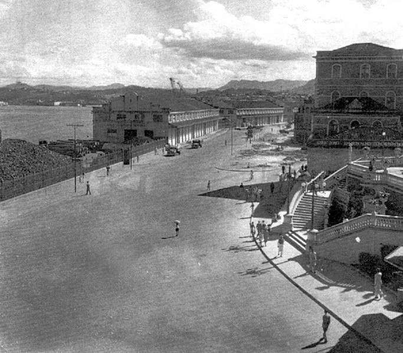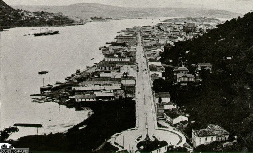
>
> Figura 4, 5 e 6. Reformulações urbanas e portuárias em Vitória. Fonte:
> MIRANDA, 2001.

Como observado, o processo de modernização das cidades portuárias
brasileiras se intensifica com a República. Tal fato se deve ainda a
concessão dos portos a grupos estrangeiros que investem no
desenvolvimento portuário (FREITAS, 2010). Por um lado, \"\[\...\] por
meio de concessões são construídos cais, armazéns, silos, pátios e
outros elementos necessários ao desembarque de cargas" (MORAES, apud
SIQUEIRA, 2011, p. 257). Por outro lado, o surgimento desses
equipamentos e demais infraestruturas portuárias, implicam em
permanentes mudanças territoriais e paisagísticas.

Diante o anseio político de transformar a cidade em praça comercial, em
1879, iniciam estudos de viabilidade de implantação do Porto de Vitória.
Contudo, recomendações técnicas apontam o estabelecimento do porto no
município vizinho de Vila Velha. Na ocasião, essa proposta é rejeitada
pelo Governo (FREITAS, 2009; SIQUEIRA, 1995). Para explicar a objeção
aos pareceres técnicos, Siqueira (1995) relata que Vitória era indicada
como local estratégico para a implantação do porto, em atendimento as
elites política e comercial, garantindo, portanto, a intenção política
de desenvolvimento de seu sítio, bem como a expansão da estrutura
comercial existente.

Frente ao ideário de modernização urbana, em 1896, comissionou**-**se ao
engenheiro Saturnino de Brito, a elaboração de um plano de expansão
urbana para Vitória, o Novo Arrabalde, que prevê ampliação da Capital em
direção às praias (JÚNIOR, 1994). Essas proposições visam adaptar a
cidade às novas funções comerciais que estavam por vir. Em 1904,
decide-se pela construção do porto em Vitória, cujas obras, entretanto,
só são inauguradas em 1911, no governo de Jerônimo Monteiro (1908**-**
1912) (FREITAS, 2010).

O porto estruturado em substituição aos antigos cais e demais
intervenções urbanísticas, refletem imagem modernizada da cidade
"\[\...\] numa associação funcional e espacial direta entre cidade e
porto" (SIQUEIRA, 2011, p. 257). Ainda nesse período, ocorre nova
reestruturação da Capital, com serviços de urbanização, saneamento e
infraestrutura urbana, pautada no Plano de Melhoramentos e de
Embelezamento de Vitória (JÚNIOR, 1994). São realizados aterros, com
destaque para plataforma dos armazéns portuários, alterando em
definitivo o contorno da linha da orla e a paisagem da Capital capixaba
(Fig. 7, 8 e 9).

> 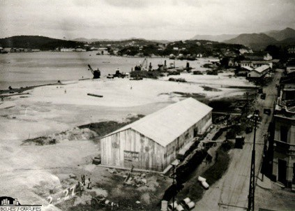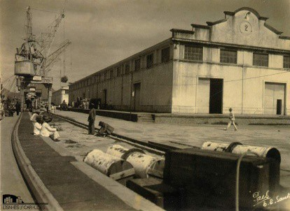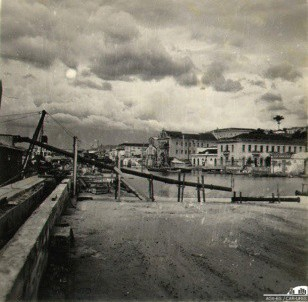
>
> Figuras 7, 8 e 9. Aterros na frente marítima da cidade e armazém
> portuário construído. Fonte: MIRANDA, 2001.

Apesar da suspensão das obras do Porto de Vitória em 1914, em função da
crise da Primeira Guerra Mundial, são realizadas inúmeras reformulações
na cidade. Ruas transformam-se em *boulevards*, novos espaços públicos
são construídos, vias são pavimentadas, e rodovias e ferrovias
inauguradas em atendimento a conexão do porto com suas regiões de
interesse. A estratégia política passa por Vitória alcançar o título de
capital portuária. Com essas ações, "\[\...\] Vitória tornou**-**se
cidade habitável, quanto às condições sanitárias, e em pé de igualdade
com as melhores capitais brasileiras" (DERENZI, 1995, p. 162). A
pretensão não era apenas "\[\...\] em urbanizar a cidade, mas também em
promover condições para o desenvolvimento e expansão do porto, um porto
cafeeiro que atendia às tendências da economia agroexportadora nacional"
(SIQUEIRA, 2011, p. 260).

Em 1924, no governo Florentino Avidos (1924**-**1928), destacam**-**se
obras portuárias e urbanas, tais como "\[\...\] muralha de cais de 130
metros de extensão, para a construção de três armazéns, aparelhamento em
linha férrea e uma ponte ligando Vitória a Vila Velha" (ABREU; MARTINS;
VASCONCELLOS, 1993, p. 87). A ponte denominada Florentino Avidos,
inaugurada em 1928, além de escoar a produção para o porto, representa
ruptura da condição insular de Vitória, a partir de ligação continental.
A ponte (Fig. 10 e 11) e os armazéns portuários (Fig. 12) acarretam
significativa alteração da paisagem.

> 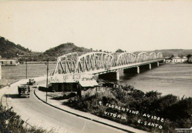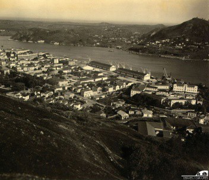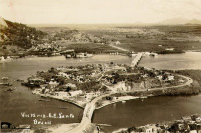

Figuras 10, 11 e 12. Ponte Florentino Ávidos e vista para armazéns
portuários. Fonte: MIRANDA, 2001.

Cabe mencionar que o traçado tortuoso da cidade não se expande, pelo
contrário, cede lugar ao desenho retilíneo, sobretudo nas áreas de
conexão das regiões aterradas às áreas preexistentes e na remodelação
dos terrenos desapropriados (FREITAS, 2009). Essas ações confirmam a
influência do Porto de Vitória na transformação da cidade,

em contexto que se clama por uma praça comercial em conexão com o
exterior. Em rigor, o desenvolvimento portuário respondeu "\[\...\] pela
concepção de outra cidade \[\...\]. Morreu a cidade colonial, voltada
para o mar, e uma outra começou a ser erguida." (ABREU; MARTINS;
VASCONCELLOS, 1993, p. 33).

Importante salientar que o crescimento econômico no Brasil, típico das
primeiras décadas do século XX, ocorre nos centros urbanos, com
desenvolvimento atrelado às funções portuárias. Siqueira (2010) ressalta
a disparidade presente entre a ambiência urbana nos centros
exportadores, pautada pelo movimento e pela modernização, em contraste
com os núcleos urbanos do interior que ainda mantinham de certa maneira
a "condição de extensões das áreas rurais" (SIQUEIRA, 2010, p. 568).
Nessa ambiência de modernização, em Vitória, "cidade e porto se integram
num todo urbano desde o início da colonização, e o porto simboliza o
lugar de protagonista no desenvolvimento da cidade" (SIQUEIRA, 2011, p.
255).

# A expansão portuária e a transformação territorial e da paisagem

Na década de 1940, com a conclusão do Porto de Vitória e a
comercialização do minério de ferro, diversificam**-**se as operações
portuárias. Inicialmente, as movimentações com minério são realizadas no
Cais Comercial do porto, situado em Vitória. Contudo, suas estruturas
próprias à comercialização cafeeira inviabilizam a continuidade das
operações com o novo produto (Fig. 13). Pra responder essa demanda,
constrói-se cais especializado no município de Vila Velha, o Cais da
Atalaia, conta com 110 metros de extensão, sendo programado para receber
navios de grande porte (Fig. 14).

> 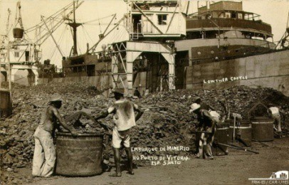
>
> 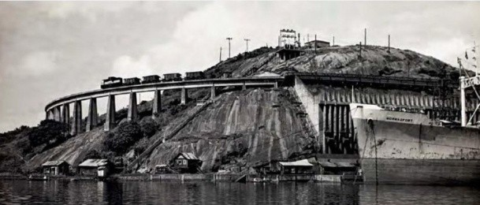Figura 13. Carregamento de minério
> de ferro pelo Porto de Vitória. Fonte: MIRANDA, 2001.
>
> Figura 14. Cais de minério em Vila Velha. Fonte: MIRANDA, 2001.

A expansão portuária para Vila Velha, na outra margem da Baía de
Vitória, revela novos aparatos portuários na paisagem, acentuando a
imagem urbano**-**portuária de Vitória (Fig. 15 e 16).

> 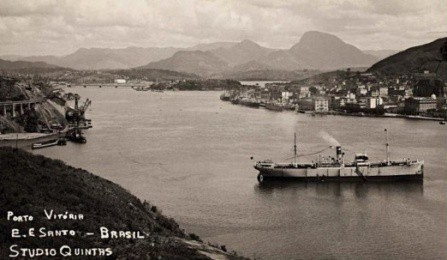
>
> 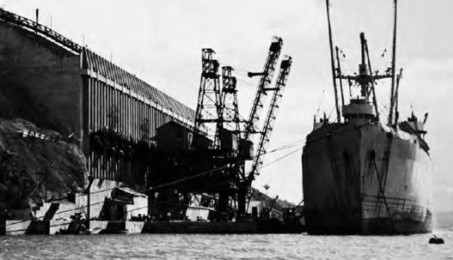Figura 15. Porto de Vitória à direita
> e cais em Vila Velha à esquerda. Fonte: MIRANDA, 2001.
>
> Figura 16. Detalhe do cais de minério em Vila Velha. Fonte: MIRANDA,
> 2001.

Aliado ao incremento da comercialização do minério em porto
especializado, a partir do governo de Jones dos Santos Neves
(1951-1954), observa-se o esgotamento da economia cafeeira na
sustentação das finanças do Espírito Santo. A industrialização se

impõe como nova base econômica e conduz "\[\...\] o início de um
processo de modernização industrial, que implicou num reordenamento do
espaço urbano da Capital" (ABREU; MARTINS; VASCONCELLOS, 1993, p. 115).
Resultam desse processo significativos aterros, o da Esplanada Capixaba
(Fig. 17), em extensa plataforma a beira mar, e o das imediações da Ilha
do Príncipe (Fig. 18), que desfaz a condição insular do lugar.

> 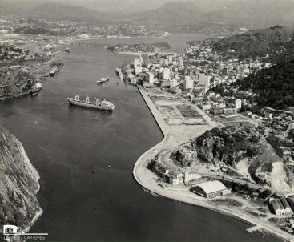
>
> 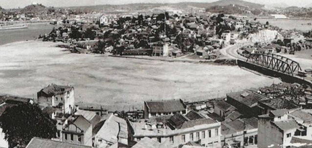Figura 17. Aterro da Esplanada
>
> Capixaba. Fonte: MIRANDA, 2001.
>
> Figura 18. Aterro da Ilha do Príncipe. Fonte:
>
> MIRANDA, 2001.

Em atendimento a demanda industrial dos fins da década de 1960,
inicia**-**se expansão portuária na parte continental de Vitória, em
sítio distanciado do núcleo portuário original. Conhecido como Ponta de
Tubarão, esse sítio agrega além do megaporto de Tubarão, inaugurado em
1966, a sede da Companhia Vale do Rio Doce (atual Vale) e da Companhia
Siderúrgica de Tubarão (atual Arcelor Mittal), ambas da década de 1970
(Fig. 19, 20 e 21). O Porto de Tubarão, além de contar com cais de maior
porte e capacidade, gera novo polo de exportação do minério em
território nacional e assegura "a modernização da economia, o
crescimento do setor industrial \[\...\] e a expansão da hinterlândia do
complexo portuário de Vitória" (SIQUEIRA, 2011, p. 267). Isso contribui
para impulsionar o crescimento da cidade para além dos limites da ilha,
alterando, simultaneamente, o uso do território e a paisagem da Capital.

> 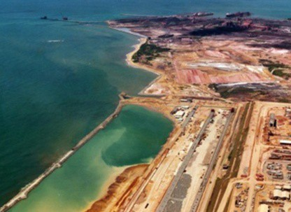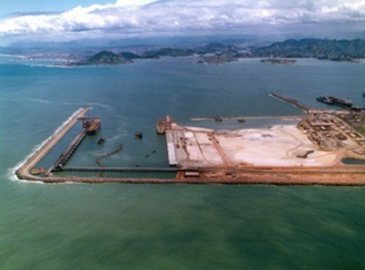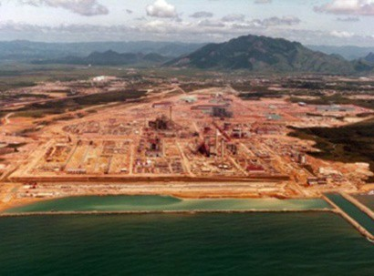
>
> Figuras 19, 20 e 21. Complexo Portuário e industrial de Tubarão.
> Fonte: Cia. Docas do Espírito Santo (Codesa).

Por outro lado, a ampliação portuária afastada do seu núcleo primitivo,
evidencia arrefecimento do Porto de Vitória, que perde gradualmente sua
importância no contexto produtivo nacional e internacional. Para
elucidar esse processo, Monié e Vasconcelos (2012) indicam que a
concorrência pelo uso do solo e as limitações físico**-**operacionais
dos portos tradicionais configuram**-**se como empecilhos para os atores
econômicos, de forma que a mudança de escala na produção, no transporte
e consumo estimula a relocalização das estruturas produtivas e das
infraestruturas portuárias para fora dos centros urbanos*.*

Importante mencionar que transformações territoriais e paisagísticas
vinculadas às atividade portuárias, ganham maior expressão com o advento
do Complexo Portuário de Tubarão. A implantação desse complexo em região
deslocada física e visualmente do centro principal ocorre
predominantemente em áreas pouco ocupadas e ainda sem

> urbanização (Fig. 22 e 23). Para viabilidade da exploração portuária
> nessa região, é necessário criação de infraestruturas de acessos, tais
> como pontes e estradas, que atuam nos anos subsequentes, como vetores
> de crescimento urbano do local.
>
> 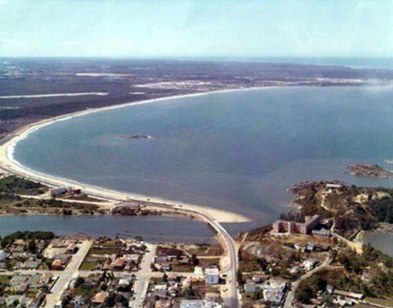
>
> 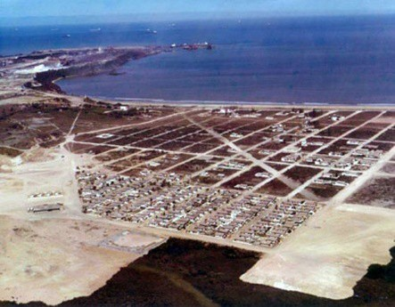Figura 22. Vista para região de
> Camburi, em
>
> 1970\. Fonte: OLIVEIRA, 2013a.
>
> Figura 23. Loteamento em Camburi e
>
> Complexo de Tubarão ao fundo, na década de 1970. Fonte: OLIVEIRA,
> 2013b.
>
> A reordenação territorial devido implantação dessa nova região
> portuária e industrial, implica em extensa ocupação por aterros (Fig.
> 24). Por sua vez, os aterros resultam na alteração da linha de costa
> litorânea, com impacto imediato na paisagem da orla de Camburi.
> Observa-se que, além da presença dos elementos de infraestrutura
> portuária na paisagem, tem**-**se obstrução visual da linha do
> horizonte, de forma parcial ou total, conforme localização e ponto de
> vista do observador, em percurso linear ou transversal a referida orla
> (RODRIGUES, 2013).
>
> 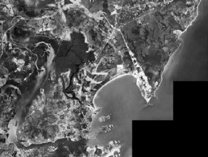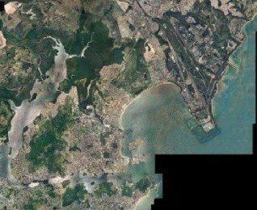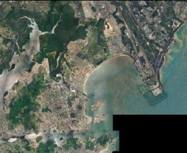1970
> 1978 1998 2007
>
> Figura 24. Sequência de imagens de satélite do município de Vitória,
> com destaque para a ocupação da Ponta de Tubarão. Fonte:
> [http://veracidade.com.br.](http://veracidade.com.br/)
>
> Em linhas gerais, os portos situados na Capital de Vitória, seja na
> ilha ou no continente, evidenciam**-**se no uso do território e na
> percepção da paisagem, devido, sobretudo, a proximidade física e
> visual de seus aparatos técnicos. Por meio do aumento dos navios e da
> modernização permanente das infraestruturas portuárias, a paisagem de
> Vitória revela a especialização produtiva do seu território (Fig. 25 e
> 26).
>
> 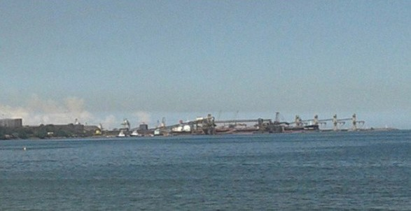
>
> 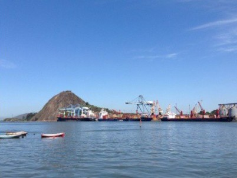Figura 25. Vista do Porto de Tubarão
> e infraestruturas em destaque na paisagem, 2013. Fonte: acervo das
> autoras.
>
> Figura 26. Vista dos terminais portuários de Vila Velha, 2013. Fonte:
> acervo das autoras.
>
> Se "a paisagem se organiza \[\...\], na medida em que as exigências de
> espaço variam em função dos processos próprios a cada produção e ao
> nível de capital, tecnologia e

organização correspondentes" (SANTOS, 1988, p. 66), a relação entre
evolução urbana e expansão portuária envolve espaços de circulação,
distribuição e consumo, associados aos modos de produção do setor
portuário e de atividades correlatas.

Diante da abordagem deste estudo, observa**-**se que a partir de 1940,
período em que a operação portuária deixa de concentrar-se no Porto de
Vitória, e se desloca para Vila Velha, e depois em 1960, quando se
distancia ainda mais em Tubarão, tanto cidade quanto porto
encontram**-**se sob processos de expansão. Entretanto, o crescimento de
ambos, ocorre por vetores diversos, não mais como nas fases iniciais,
quando os desdobramentos das obras do porto refletiam**-**se na
estruturação urbanística da cidade, sustentados por meio de planos e
projetos urbanos. Com a intensificação do processo de industrialização e
globalização da economia, a partir dos anos 1980, os portos
caracterizam-se unicamente como dispositivos técnicos ligados às redes
de fluxos internacionais, desvinculados dos processos de estruturação
urbana. Isso faz do território mais um campo de operação de atendimento
aos dispositivos infraestruturais de escala global, com ênfase na tríade
porto, indústria e logística.

A permanente reorganização do território, mediante imperativo da
globalização, se intensifica a partir dos anos 1980, com os denominados
portos secos e terminais industriais intermodais situados distantes dos
núcleos portuários existentes. No Espírito Santo, a implantação dessas
infraestruturas de apoio ao comércio exterior, ocorre efetivamente nos
anos 1990, demonstrando ocupação descontínua e fragmentada do
território, em subespaços produtivos especializados, situados nos
municípios limítrofes a Vitória. Esse processo gera intensa ocupação de
áreas retroportuárias, que evidenciam, sobretudo, novas
territorialidades e impactos em âmbitos socioeconômico, ambiental e
paisagístico (Figura 27).

> 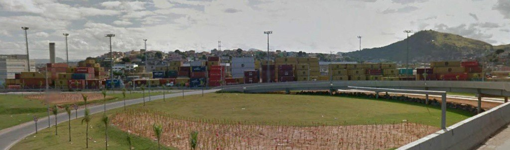
>
> Figura 27. Vista de um terminal retroportuário, em Vila Velha, ES
> (2014).
>
> Fonte: Imagem Google Earth Street View.

Para elucidar essas questões, Santos (2006) indica que o paradigma da
fluidez sob o qual se inserem os portos, se refere a uma das
características do mundo atual, que prioriza a busca de técnicas cada
vez mais eficazes como garantia de competitividade. De modo que
"criam-se objetos e lugares destinados a favorecer a fluidez \[\...\]"
(SANTOS, 2006, p. 274). Nesse sentido, "\[\...\] a tendência atual é de
um envelhecimento mais rápido do que antes dos subespaços que não
dispõem dos meios de se atualizar, de um ponto de vista da fluidez"
(SANTOS, 2006, p. 274). Sob essa lógica, os portos são impedidos de
expansão no meio urbano, com exploração portuária em áreas afastadas do
tecido urbano consolidado.

A sobreposição de fatores econômicos no processo de expansão portuária
agrava o afastamento físico, funcional e relacional entre cidade e
porto. Entretanto, no caso de Vitória, nota**-**se sob a perspectiva da
paisagem, que a cidade continua essencialmente vinculada à atividade
portuária. Os aportes técnicos portuários caracterizam a imagem e a
identidade da cidade. Sua zona portuária integra**-**se diretamente à
vida cotidiana do

conglomerado urbano (Fig. 28), sobretudo no centro histórico, onde
"\[\...\] os navios quase passeiam pelas ruas da Capital, em estreito
contato com seus habitantes" (SIQUEIRA, 1995).

> 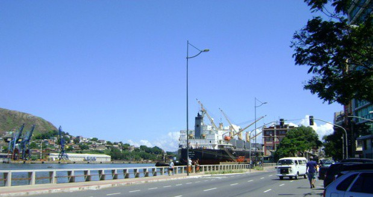
>
> Figura 28. Proximidade visual entre as atividades portuárias e urbanas
> em Vitória. Fonte: acervo das autoras.

# Porto, território e paisagem: notas finais

De maneira geral, "a paisagem não se cria de uma só vez, mas por
acréscimos, substituições; a lógica pela qual se fez um objeto no
passado era a lógica da produção daquele momento" (SANTOS, 1988, p. 66).
Deste modo, "\[\...\] uma paisagem é escrita sobre a outra, é um
conjunto de objetos que têm idades diferentes, é uma herança de muitos
diferentes momentos" (SANTOS, 1988, p. 66).

A relação intrínseca entre território, paisagem e modo de produção,
indica que "\[\...\] a produção do espaço é resultado da ação dos homens
agindo sobre o próprio espaço, através dos objetos, naturais e
artificiais. Cada tipo de paisagem é a reprodução de níveis diferentes
de forças produtivas" (SANTOS, 1988, p. 64). Portanto, o desenvolvimento
urbano de Vitória quando associado à atividade portuária, pode ser
demonstrado por meio da evolução das estruturas produtivas, expressas no
território e na paisagem de modo distinto, conforme demonstrado em cada
período.

Em geral, as forças produtivas vinculadas as atividades portuárias,
interferem permanentemente, com acréscimos e substituições, na
construção do território e da paisagem da cidade de Vitória, devido,
sobretudo à proximidade das instalações dos portos no meio urbano.
Entretanto, nos territórios produtivos "a capacidade de atrair
atividades competitivas depende de uma renovação técnica tanto mais
significativa quanto maior a defasagem." (SANTOS, 2006, p. 274). De modo
que a competitividade que marca o setor portuário, caracteriza**-**se
pela "\[\...\] vontade de suprimir qualquer obstáculo à livre circulação
das mercadorias, da informação e do dinheiro" (SANTOS, 2006, p. 275).

Nesse contexto de renovação técnica que implica em defasagem,
insere**-**se o recente projeto de modernização do Cais Comercial do
Porto de Vitória, que prevê demolição de antigos armazéns portuários, e
teve finalizado em 2013, a construção de extensa plataforma em aterro
sobre a baía. Essas obras são anunciadas como estratégias de
modernização e sobrevida ao porto do centro histórico, visando fomentar
seu crescimento comercial por mais quinze anos aproximadamente. Para
Campos (2013), são obras que aniquilam a estrutura urbanística mais
remota da Capital capixaba, por meio de projetos de reestruturação
urbana, "\[\...\] que alinham gestão e estratégias da Codesa e do
governo do Estado, pautadas na hipótese simultânea de incremento
comercial do porto e melhoria no âmbito da circulação e do transporte
metropolitano" (CAMPOS, 2013, p. 1).

Salienta-se que esse projeto pressupõe alterações territoriais e
paisagísticas no centro histórico de Vitória, devido construção de
plataforma em aterro, para a ampliação do pátio retroportuário,
resultando, mais uma vez, na mudança do contorno da ilha e da paisagem
local (Fig. 29 e 30). Além disso, alerta**-**se para os impactos do
projeto mediante vulnerabilidade do patrimônio construído e natural
existente, com destaque para os armazéns portuários às margens da baía
de Vitória, uma das marcas de identidade cultural e de suporte da
memória social do lugar como cidade portuária.

> 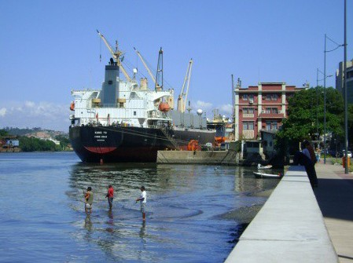
>
> 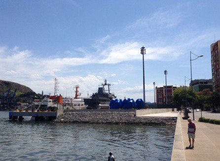Figura 29. Vista para o Porto de
> Vitória anterior a construção da plataforma em aterro (2012). Fonte:
> acervo das autoras.
>
> Figura 30. Plataforma em aterro (2013). Fonte: acervo das autoras.

Por fim, sendo a paisagem uma herança, sobretudo nesse contexto, "de
patrimônio coletivo dos povos que historicamente as herdaram como
território de atuação de suas comunidades" (AB SABER, 2003, p. 9),
salienta-se, a responsabilidade da sociedade para a utilização não
predatória da paisagem, e para o reconhecimento das limitações de cada
tipo de espaço e território. A título de conclusão deste artigo, cabe
referência aos estudos de Berque citado por Campos (2012), que propõem o
entendimento da paisagem como matriz perceptiva e marco cultural do
território, neste estudo, demonstrada por meio dos processos
territoriais do porto na cidade de Vitória.

# Referências bibliográficas

> AB' SÁBER, A. N. *Os domínios da natureza no Brasil: potencialidades
> paisagísticas*. São Paulo: Ateliê Editorial, 2003.
>
> ABREU, C.; MARTINS, J. B.; VASCONCELLOS, J. G. M. *Vitória*:
> *trajetórias de uma cidade.* Vitória: Instituto Histórico e Geográfico
> do Espírito Santo, 1993.
>
> CAMPOS, M. M. *Paisagem transversal: cidade, museus e cais na Baia de
> Vitória*. Disponível em:
> \<[http://transmuseus.net/?p=1397\>](http://transmuseus.net/?p=1397).
> Acesso em: 03 jun. 2013.

CAMPOS, M. M. Porto e atmosfera: corpo paisagístico na cidade de Vitória
(ES). In: SEMINÁRIO DE HISTÓRIA DA CIDADE E DO URBANISMO, 12, 2012,
Porto

Alegre. *Anais \...,*Porto Alegre: Universidade Federal do Rio Grande do
Sul, 2009. 1 CD-ROM.

> DERENZI, L. S. *Biografia de uma ilha*. 2ª ed. Vitória: Secretaria
> Municipal de Cultura e Turismo, 1995.
>
> FREITAS, J. F. B. (org.). *Diálogos: Urbanismo. BR*. Vitória: EDUFES;
> Niterói: EDUFF, 2010.

FREITAS, J. F. B. Técnica versus política na localização dos portos do
Rio de Janeiro e de Vitória. In: ENCONTRO DA ASSOCIAÇÃO NACIONAL DE
PÓS**-**

GRADUAÇÃO E PESQUISA EM PLANEJAMENTO URBANO E REGIONAL, 13,

2 0 0 9 , F l o r i a n ó p o l i s . *Anais eletrônicos*\... Disponível
em: \<[http://www.](http://www/)
anpur.org.br/revista/rbeur/index.php/anais/article/view/3031/2966\>.
Acesso em: 7 jan. 2013.

> JÚNIOR, C. B. L.; SOARES, S. C.; BONICENHA, W. *Baía de Vitória:
> aspectos históricos e culturais*. Vitória: Fundação Ceciliano Abel de
> Almeida/Universidade Federal do Espírito Santo, 1994.
>
> MIRANDA, C. L. (org.). *Memória Visual Baia de Vitória*. Relatório
> Final de Pesquisa

\- Centro de Artes, Universidade Federal do Espírito Santo. Vitória:
2001.

> MONIÉ, F. VASCONCELOS, F. N. *Evolução das relações entre cidades e
> portos: entre lógicas homogeneizantes e dinâmicas de diferenciação*.
> Confins, n.15, 2012. Disponível em:
> [\<http://confins.revues.org/7685\>](http://confins.revues.org/7685).
> Acesso em: 9 maio 2012.
>
> OLIVEIRA, R. *Praia de Camburi*. Vitória-ES. Localização: F02184.
> Disponível em:

\< <http://www.ijsn.es.gov.br/Biblioteca/BibliotecaOnline/>\>. Acesso
em: 26 maio de 2013a.

> OLIVEIRA, R. *Praia de Camburi*. Vitória*-*ES. Localização: F02181.
> Disponível em:

\<[http://www.ijsn.es.gov.br/Biblioteca/BibliotecaOnline/.\>](http://www.ijsn.es.gov.br/Biblioteca/BibliotecaOnline/)
Acesso em: 26 maio 2013b.

> RODRIGUES, M. P. *Porto e paisagem em áreas de expansão: arco
> metropolitano da Grande Vitória (ES*). Relatório Final de Pesquisa de
> Iniciação Científica - PIBIC- UFES. Núcleo de Estudos de Arquitetura e
> Urbanismo da UFES, Vitória, 2013. In: Anais da Jornada de Iniciação
> Científica da UFES. Disponível em:

\<[http://portais4.ufes.br/posgrad/anais_jornada_ic/.\>](http://portais4.ufes.br/posgrad/anais_jornada_ic/).

> SANTOS, M. *A natureza do espaço: Técnica e Tempo, Razão e Emoção*.
> São Paulo: Editora da Universidade de São Paulo, 2006.
>
> SANTOS, M. *Metamorfoses do espaço habitado*. São Paulo: Hucitec,
> 1988.

SIQUEIRA, M. P. S. A cidade de Vitória e o porto nos princípios modernos
da urbanização no início do século XX. *Cadernos Metrópole*, São Paulo,
v. 12, n. 24, p. 565-584, jul/dez 2010. Disponível em:\<
<http://revistas.pucsp.br/index.php>

/metropole/article/view/5903/4254\>. Acesso em: 10 fev. 2013.

> SIQUEIRA, M. P. S. A cidade e o porto como fator de desenvolvimento.
> In: VILLASCHI, Arlindo. *Elementos da economia capixaba e trajetórias
> de seu desenvolvimento*. Vitória: Flor & Cultura, 2011.
>
> SIQUEIRA, M. P. S*. O Desenvolvimento do Porto de Vitória 1870-1940*.
> Vitória: Codesa, 1995.
>
> VASCONCELOS, F. N. *O Desenvolvimento da interface cidade-porto em
> Vitória (ES) do período colonial ao início do século XXI: uma cidade
> portuária?* Tese de Doutorado. PUC - São Paulo, 2011.
