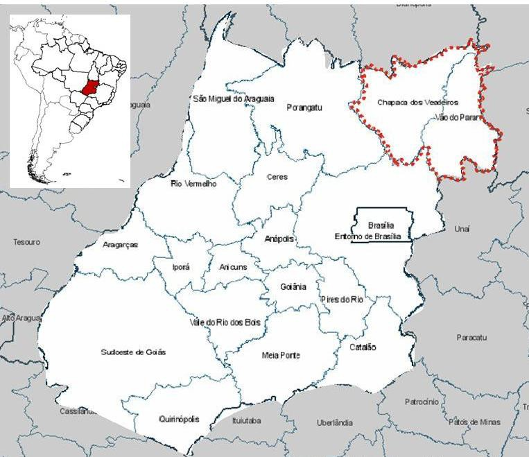
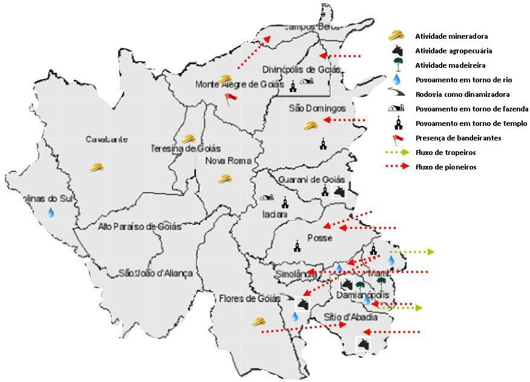

# Resumo

Este texto foi desenvolvido com objetivo de sistematizar referências
sobre a evolução urbana da região Nordeste Goiano, segundo os ciclos
econômicos, relações com a ocupação do território da Capitania,
Província e Estado do Goiás e a interdependência com outras regiões
brasileiras. Tal iniciativa se insere numa investigação mais ampla sobre
o Planalto Central. Limitamo-nos ao método da pesquisa bibliográfica,
tendo a história de Goiás como objeto na tentativa de identificar
aproximações com o Nordeste Goiano e a relativa importância atribuída
nessa história às suas cidades.

Palavras-chave: Goiás, Nordeste Goiano, Evolução Urbana, História das
Cidades

# Abstract
>
> *This paper was developed to bring sumarized references about the
> urban development in* Nordeste Goiano*, a region of State of* Goiás
> *in* Brasil*, by means of economics aspects, relations with the hole
> territory of the State and interdependence with the hole territory of
> the country. This initiative take a part in a broad investigation
> about a region called* Planalto Central *in* Brasil*. For this purpose
> we have limited to literature review method, searching for the* Goiás
> *history and within for references about the* Nordeste Goiano*.*
>
> *Keywords*: Goiás, Nordeste Goiano, *Urban Development*, *Cities*,
> *History*

# Descrição do atual Nordeste Goiano

O Instituto Brasileiro de Geografia e Estatística -- IBGE -- reconhece
no estado de Goiás cinco mesorregiões e dezoito microrregiões. Nenhuma
dessas corresponde ao Nordeste Goiano. Esse constitui hoje uma Região de
Planejamento formalmente instituída pelo governo do Estado de Goiás,
equivalente a junção dos perímetros das microrregiões Chapada dos
Veadeiros e Vão do Paraná.

Na região do Nordeste Goiano há vinte municípios em território de
38.726.364 Km2 de área, correspondendo a 11,39% do total da área do
estado. Sua população total é de 169.961 habitantes, segundo o Censo
Demográfico 2010, o que corresponde a 2,83% da população total do
estado. Das atividades econômicas hoje nela desempenhadas é a pecuária
(rebanho bovino) que responde com percentual mais significativo quando
relacionada às demais atividades desenvolvidas no estado, correspondendo
a 5,5% do rebanho estadual.

A figura 1, abaixo, apresenta a localização do Nordeste Goiano em mapa
das microrregiões de Goiás.

> 
>
> Figura 1 -- localização do Nordeste Goiano (PERÍMETRO PONTILHADO EM
> VERMELHO).
>
> Fonte: BRASIL, 2013b. Elaboração: o autor

# Histórico da ocupação do território

A criação da Capitania de Goiás se deu pelo desmembramento da Capitania
de São Paulo por meio do alvará régio de 8 de novembro de 1744. Esse
desmembramento é considerado por alguns autores como o primeiro fato
geopolítico definidor da região. Em que pese o descobrimento dela ter
registros imputados ao fim do século XVI, data das primeiras Bandeiras.

Mattos (1980, p. 89, grifo nosso) atribui igual importância a outro
fato:

> Comunicação datada de São Paulo, a 27 de outubro de 1.725, do
> Governador da Capitania de São Paulo, Rodrigo Cesar de Menezes, a
> S.M., a quem informa sobre a chegada de Bartolomeu Bueno da Silva
> \[\...\] documento de suma importancia para a historia de Goiás, por
> **assinalar a data oficial do descobrimento de Goiás** \[\...\]

Porém, o descobrimento da região de Goiás se deu muito antes desses
marcos. As incursões iniciais nesse território se deram com os primeiros
bandeirantes que para lá se dirigiram em busca de indígenas a serem
escravizados e em busca de ouro. Elas podem ser datadas e atribuídas,
respectivamente, a 1592 com o sertanista Sebastião Marinho, 1647 e 1648
com Manuel Correia, de São Paulo; e 1682 com o conquistador e povoador
Bartolomeu Bueno da Silva, o Anhanguera. Correia voltou para São Paulo

com ouro e essa façanha induziu novas incursões exploratórias. As
principais bandeiras vinham do sul do País, mas havia também as
"descidas" que vinham do norte com os jesuítas em busca de indígenas a
serem catequizados.

O primeiro assentamento fundado em Goiás se deu graças a Anhanguera, que
em data posterior a 1726 instituiu o Arraial de Sant'Anna. Esse Arraial
recebeu depois, em 25 de julho de 1739, o status de vila e o nome de
Vila Boa, passando a ser a capital da Capitania em 1749. Após a fundação
desse Arraial temos, em ordem cronológica, a fundação de outros (Tabela
1). Em 18 de março de 1809 um decreto real dividiu a Capitania de Goiás
em duas comarcas tendo como sedes: a do norte, São João das Duas Barras
e a do sul, Vila Boa.

> Tabela 1 - Cronologia de cidades de Goiás. Fonte: FUNES, 1986.
> Elaboração: o autor

+---------------------+------------------------+-------------+
| > *Ano de fundação* | > *Toponímia*          | > *Comarca* |
+=====================+========================+=============+
| > 1731              | > Arraia de Meia Ponte | > Sul       |
+---------------------+------------------------+-------------+
| > 1734              | > Crixás               | > Sul       |
+---------------------+------------------------+-------------+
| > 1734              | > Natividade           | > Norte     |
+---------------------+------------------------+-------------+
| > 1735              | > Traíras              | > Sul       |
+---------------------+------------------------+-------------+
| > 1735              | > São José             | > Sul       |
+---------------------+------------------------+-------------+
| > 1736              | > São Félix            | > Norte     |
+---------------------+------------------------+-------------+
| > 1736              | > Arraias              | > Norte     |
+---------------------+------------------------+-------------+
| > 1741              | > Pilar                | > Sul       |
+---------------------+------------------------+-------------+
| > 1746              | > Santa Luzia          | > Sul       |
+---------------------+------------------------+-------------+
| > 1748              | > Cavalcante           | > Norte     |
+---------------------+------------------------+-------------+

> .

Podemos notar que mais da metade de arraiais fundados até 1748
localizava-se na Comarca do Sul. Não por acaso, foi ali que chegaram as
primeiras penetrações exploradoras que se deram desde São Paulo e
fizeram, naturalmente, desenvolver mais rápido uma região do que outra.
Eis um primeiro aspecto de diferenciação entre as regiões internas à
Capitania.

Durante um longo período o território do atual estado de Goiás passou
por diversas divisões. Além daquele desmembramento da Capitania de São
Paulo, houve também o desmembramento da região hoje chamada Triângulo
Mineiro, o longo litígio de definição de fronteiras com a Capitania de
Mato Grosso e a constituição do estado de Tocantins, onde no passado
estavam localizadas algumas das principais cidades mineradoras da
Comarca do Norte. Em 1821 a Capitania torna-se Província e em 1933 foi
fundada Goiânia, a atual capital do estado de Goiás.

Já na década de 1970, antes da constituição de Tocantins que se deu em
1988, o governo do Estado de Goiás agrupou os municípios do Estado em
regiões de planejamento constando já os perímetros e denominações atuais
das também microrregiões Chapada dos Veadeiros e Vão do Paranã.

# Exploração do ouro

Na década de 1690 foram descobertas as primeiras minas de ouro em Minas
Gerais,

mesmo século das primeiras incursões em Goiás em busca desse metal
precioso. Tal atividade econômica desenvolveu-se também nessa região e a
década de 1720, após a incursão de Anhanguera, pode ser considerada como
início da exploração aurífera em Goiás. Almeida (1944, p.5) atribui aos
anos entre 1722-5 uma "verdadeira febre de exploração do ouro" e indica
que após 15 anos da fundação de Vila Boa, 1754, já havia busca de ouro
em quase todas as regiões de Goiás, "inclusive a Norte".

Mattos (1980, p.95) atribui à atividade exploratória de ouro o primeiro
ímpeto povoador de Goiás, apesar de seu modo esparso e concentrado em
torno das minas e aluviões.

> A notícia da descoberta do ouro nos rincões de Cuiabá provocou enorme
> corrida migratória entre 1.721 e 1.728. A ocupação do território
> processou-se rapidamente. Esses descobrimentos e a riqueza das Minas
> Gerais eram o estímulo poderoso para novos cometimentos desse gênero.

A produção de ouro durou mais de um século, mas seu auge não mais que 30
anos, e nada muito considerável: "Pouco e fugaz, portanto, o ouro não
conseguiu realizar Goiás". (NOGUEIRA, s.d., p. 18)

Apesar de ter uma produção pouco significativa, em termos nacionais,
Goiás foi o segundo produtor de ouro no Brasil. Esse ouro não ficou,
salvo pelas benfeitorias que financiou para a "modernização" e
"desenvolvimento" do território em torno das necessidades da produção.

> Em Goiás, em 1800, além dos antigos índios, havia mais de
>
> 50.000 hab., havia cidades construídas, estradas e caminhos, fazendas
> em produção. O capital que pagou tudo isto foi o ouro, e isto é o que
> ficou para Goiás da época do ouro. (MORAES, 1981, p. 25).

A exploração de ouro em Goiás teve mesmo uma duração e significados de
desenvolvimento efêmeros e até deprimiu o desenvolvimento de outras
atividades econômicas nesse período. Iniciada antes da criação da
Capitania, tendo chegado ao auge na década de 50 e entrando em franco
declínio a partir daí, a ocorrência desta atividade econômica fez
despertar pouco interesse na atividade agropecuária, tanto por parte dos
habitantes quanto dos governantes. Essa "exclusividade" da mineração
levava a agricultura ao grau de subsistência e fazia com que os bens de
consumo necessários viessem de outras praças, como os tecidos, por
exemplo, que vinham da Bahia, Rio de Janeiro e São Paulo, fazendo
encarecer os fretes e desencorajar o comércio, o que contribuiu para
instalar um verdadeiro estado de depressão econômica na Capitania.

Em resposta à decadência do ouro, várias medidas (navegação, estímulos à
agricultura e instalação de fábricas e manufaturas) foram tomadas pelas
autoridades de Goiás sem alcançar, no entanto, resultados satisfatórios.
Esse e outros fatos levaram a população a se ruralizar e a se dedicar à
agricultura de subsistência. Funes (1986) diz que D. Francisco de Assis
Mascarenhas, no último ano de seu governo, 1809, adotou uma medida que
marcou a mudança de direção na economia de Goiás: proibiu a saída de
roceiros para as minas de Anicuns, a última rentável descoberta em
Goiás. Nesse contexto de declínio da exploração do ouro, o
desenvolvimento das atividades

agropecuárias veio não como opção, mas como necessidade imperiosa.

# As vias de comunicação

> Traçada a primeira via de comunicação para Goiás, a mesma percorrida
> por Bartolomeu Bueno da Silva e seus seguidores, foi proibida a
> abertura de novas estradas, e vedado o trânsito por quaisquer outras
> vias que viessem a ser abertas, mesmo para maior comodidade \[\...\].
> (MATTOS, 1980, p. 125).

Apesar de não haver menção a data de abertura dessa "primeira via", há
outros dois pontos que merecem destaque. Primeiro, parece que o autor
não considera como vias os tantos caminhos percorridos por bandeirantes
e tropeiros e, segundo, que, a proibição de abertura de novas estradas,
ao facilitar o controle central sobre os comércios das minas,
dificultava a integração do território com outros e constrangia o
desenvolvimento de distintas atividades econômicas. Pelo menos até a
decadência do ouro e construção da Estrada de Ferro de Goiás (EFG).

A implantação da EFG teve as prerrogativas de melhor integrar o solo
goiano com o sul do país e constituir alternativa para escoamento de
produção com vistas ao desenvolvimento da economia em Goiás. Na última
década do século XIX os trilhos da Estrada de Ferro Mogiana tinham
alcançado o Triângulo Mineiro: Uberaba em 1889 e Araguari em 1896. Em
1907 constituiu-se a Companhia Estrada de Ferro de Goiás. Em 1931 o
avanço lento chegou a Leopoldo de Bulhões e em 1952 havia
"aproximadamente, 480 quilômetros, chegando ao seu ponto mais distante
em Goiânia" (CAMPOS JUNIOR, 2013).

> Em 1896 os trilhos da Mogiana chegaram à cidade mineira de Araguari,
> próxima à fronteira goiana. Os trilhos não adentraram Goiás. Não
> ofereceram uma solução ampla e radical para as dificuldades dos
> transportes goianos. Mas eram um começo daquela solução, e isto bastou
> para que Goiás despertasse. (NOGUEIRA, s.d., p. 28).

A primeira estrada de rodagem, podendo ser aquela mencionada por Mattos,
foi inaugurada em 1921 constituindo o primeiro trecho da estrada que
levaria da Capital à estação terminal, não se sabe onde, da EFG. Nessa
época, antes da chegada da EFG a Leopoldo de Bulhões, "grandes zonas do
Estado ficavam incomunicáveis: **o norte todo**, a região do Araguaia,
**os chapadões da divisa com a Bahia**" (MORAES, 1981, p.93, grifo
nosso).

Nogueira (s.d.), ao falar do aparecimento das rodovias no solo goiano
nos lembra que a implantação delas era mais barata que a das ferrovias.
Por isso vieram primeiro as rodovias, em consonância com a perspectiva
nacional, mesmo sem pavimentação, sinalização e pontos de apoio.

# Crescimento demográfico

O Gráfico abaixo (Fig. 2) apresenta o crescimento da população de Goiás
entre 1804 e 1900. Nele podemos perceber que o maior salto populacional
se deu entre 1872 (149.000 hab) e 1890 (227.000 hab), período posterior
ao da exploração do ouro, com crescimento médio anual de 4.300 hab.

Nogueira (s.d.) defende que foi a partir da abertura da EFG, após 1900,
que o território se dinamizou e a população goiana cresceu mais que a
média nacional, conforme o gráfico da Figura 3. Tendo a população de
225.000 hab em 1900 e aplicando os percentuais desse gráfico, podemos
concluir que entre 1900 e 1940 o crescimento médio anual foi de 14.500
hab. O que implica de fato em salto populacional maior que aquele entre
1872 e 1890.

> 300000
>
> 250000
>
> 200000
>
> 150000
>
> 100000
>
> 50000
>
> 0
>
> 1804 1825 1832 1849 1856 1861 1872 1890 1900
>
# ANO
>
> Figura 2 -- Crescimento da população de Goiás.
>
> Fonte: FUNES, 1986; MORAES, 1981. Elaboração: o autor
>
> 
>
> Figura 3 -- Crescimento comparado da população, entre Goiás e Brasil.

Fonte: NOGUEIRA, s.d.

# As cidades no território do Nordeste Goiano

> A primeira aproximação com a história das cidades do Nordeste Goiano
> nos foi fornecida pelo sistema Cidades (BRASIL, 2013a) do IBGE. Esse
> sistema constitui-se como ferramenta de busca de informações acerca de
> todos os municípios do Brasil em forma de gráficos, tabelas,
> históricos e mapas. Foi a leitura dos históricos que nos interessou.
> Mais precisamente porque dela foi possível sistematizar recorrências
> de sítios de fundação da cidade, aspectos indutores do povoamento,
> atividades econômicas desenvolvidas e fluxos migratórios dentre cada
> uma das 20 cidades do Nordeste Goiano (Fig. 4).
>
> 
>
> Figura 4 -- Síntese histórica dos municípios do Nordeste Goiano.
>
> Fonte: BRASIL, 2013a. Elaboração: o autor
>
> As histórias que acessamos apresentam diferentes menções a datas de
> ocupação do território, basicamente entre meados do século XVIII e a
> segunda metade do século
>
> XX\. A indicação da ocupação mais antiga, dentre as precisas que há, é
> atribuída à fundação do Arraial de Cavalcante, em 1740. Além dessa
> diz-se que Flores de Goiás recebeu seus pioneiros também em 1740. A
> outras localidades atribui-se ocupação inicial em meados do século
> XVIII, quais sejam: Monte Alegre de Goiás, Nova Roma, São Domingos e
> Teresina de Goiás. Todas essas localidades citadas tiveram em comum a
> busca, ou exploração propriamente dita, do ouro como motivo inicial de
> ocupação territorial.
>
> O governo de Goiás também coloca a localidade de Cavalcante como a
> mais antiga do Nordeste Goiano, tal como o sistema Cidades. A
> divergência verificada entre essas

duas fontes é que o governo de Goiás destaca outras duas cidades mais
antigas, por lei de criação e não por registro de ocupação, que são:
Posse e Sítio d'Abadia.

Afora a primeira aproximação com a história das cidades do Nordeste
Goiano, a revisão bibliográfica por nós realizada permitiu-nos
identificar e interpretar fatos diretamente circunscritos à ocupação do
território do atual Nordeste Goiano. Sobre os quais vamos no deter a
partir de agora.

Revelou-se desde o princípio uma grande distinção de condições para o
desenvolvimento, desde antes de 1809, entre as comarcas do norte e do
sul da Capitania de Goiás. Sendo que a do norte se desmembrou no atual
Estado do Tocantins e na região ao norte do Estado de Goiás onde hoje se
encontram as cidades do Nordeste Goiano. Basicamente, a comarca do sul
teve melhores condições de acesso e reprodução material e política em
função de sua proximidade relativa com os principais centros produtores
da época, São Paulo, Rio de Janeiro e Minas Gerais, e posteriormente
pela implantação da EFG.

Nos primórdios da ocupação do Goiás foram os rios da região que
permitiram a aproximação entre as duas comarcas. No caso da do norte, o
Rio São Francisco aproximou-a, da região que hoje é o Nordeste do País,
em especial, ao Estado da Bahia. Enquanto o sul de Goiás já abria seus
caminhos por terra "varrando \[abaixo\] o Triângulo Mineiro".

> Os de lá \[Norte\] tiveram sua origem em núcleos populacionais
> formados especialmente por correntes migratórias procedentes da Bahia
> e, através desta, do norte e do nordeste brasileiro. Os de cá \[Sul\]
> resultaram do aculturamento dos migrantes de Minas e de São Paulo,
> predominantemente. (NOGUEIRA, s.d., p. 16).

Almeida diz que exploradores da Bahia, Maranhão e do Pará
concentraram-se no norte fundando cidades como Natividade, na atual
região do Estado do Tocantins, e São Félix, na atual região de
Cavalcante.

> Nessa época, duas civilizações distintas se constituíram em Goiaz:
> uma, oficial, de detalhes históricos conhecidos, ao Sul e tendo por
> centros Vila Boa e a sua rival, Meia Ponte \[hoje Pirenópolis\]; outra
> ao Norte, de detalhes históricos obscuros, dirigida pelos Jesuítas e
> tendo por sede S. Félix. Enquanto não forem publicados os documentos
> da Companhia de Jesus, relativos a êsse interessante período da
> História de Goiaz, entre 1730 e 1760, pouco se saberá \[\...\] da
> origem, do desenvolvimento, do declínio das lavras e \[\...\]
> civilização do norte do Estado. (ALMEIDA, 1944, p. 6) \[foram
> suprimidos trechos por estar o original da obra danificado\].

# A mineração nas cidades do Nordeste Goiano

Nos vinte primeiros anos da mineração em Goiás, 1720-40, surgiram três
nítidas zonas de ocupação em torno das minas ali estabelecidas, onde
estiveram as principais localidades. Uma dessas zonas:

> \[\...\] o verdadeiro norte da Capitania, abrangendo uma extensa zona
> entre o Tocantins e os chapadões dos limites com a Bahia. Nesta
> região, na sua maior parte, áspera e árida, encontravam-se algumas
> povoações dispersas: Arraias, S. Félix, Cavalcante, Natividade, Porto
> Real (Porto Nacional), o arraial mais setentrional. (MORAES, 1981, p.
> 11).

Nos anos do sistema de cobrança do quinto, 1736-51, havia duas casas de
fundição na Capitania, uma em Vila Boa, atendendo à produção do sul, e
outra em São Félix para atender à do norte. São Félix "na opinião de
autorisados e antigos chronistas chegou a ser dos mais notáveis de todo
o Norte" (SILVA, 1935, p.158). Eventualmente, um futuro estudo sobre
essa cidade pode revelar referências e informações preciosas para
conhecimento do atual Nordeste Goiano.

Mesmo tendo São Félix com casa de fundição, houve no norte um contexto
de desordem e relativo abandono que culminou com a necessária
intervenção direta do governador D. Luiz Mascarenhas, em 1739. Para
Silva (1935, p. 183) "o transito cada vêz mais intenso para o Pará e
para Maranhão, era uma das poderosas causas de extravios de ouro, para
que também concorrera a longa acephalia em que esteve a administração da
minas". Tal situação demonstra também que havia fluxos, mesmo que
extraoficiais, entre o norte de Goiás e o norte do País.

Passado o período áureo da mineração, imperou a decadência de toda a
Província e várias localidades entraram em estado de real abandono. Em
1823, Cunha Matas chegaria a afirmar: "Cavalcante é quase nada, \...
aqui falta tudo, a fome é terrível\... dizem que nas Arraias, Conceição,
Flores, e Natividade \[todas no norte\], ainda é pior\..." (MATAS apud
MORAES, 1981, p.46). Essa decadência e o isolamento geográfico da
Província fizeram com que os governantes incentivassem a conexão com os
portos marítimos a fim de promover prováveis escoamentos da produção por
estradas ou via fluvial. A via fluvial prevaleceu a princípio, "sendo
defendida veementemente no governo de D. Francisco de Assis Mascarenhas
(1804-1809)" (FUNES, 1986, p. 40). Também foi incentivada nesse governo
a conexão fluvial com o a Província do Pará, apesar de ter pouco
significativa economia no âmbito nacional, pelos rios Araguaia e
Tocantins. Por um lado, "revogava-se" a ênfase nas ligações pelo sul, e
por outro abria-se via de comunicação com a região próxima de onde hoje
é o Nordeste Goiano. Mas nessa época, ainda predominava o incipiente
comércio externo de Goiás com o Rio de Janeiro e São Paulo, no caso dos
julgados do Sul, e com a Bahia, no caso dos do Norte.

Interessante fazer notar que no âmbito político houve um breve movimento
separatista da população do norte. Em "14 de setembro de 1821,
instalou-se em Cavalcante um governo provisório, que se declarava
independente da Comarca do Sul de Goiás \[\...\]" (MORAES, 1981, p. 52).
Tal fato se deu porque eles, do norte, estavam descontentes com o
descaso do governo pela região.

# Outras atividades econômicas

No Nordeste Goiano havia poucas áreas de boa fertilidade natural.
Entretanto, "Nos vales úmidos, nas proximidades das nascentes e às
margens dos cursos de água, a região \[Goiás\] oferece pequenas áreas,
estas sim, de fertilidade natural por vezes espantosa". Não à toa
encontramos na história dos municípios extraída de Cidades (BRASIL,
2013a) algumas recorrências de povoamento inicial em áreas de rios.

> Foram essas manchas de fertilidade os oásis em que se abrigaram os
> nossos antepassados, quando a exaustão das minas auríferas lhes tirou
> o sentido econômico da vida. Foi sobre aquelas pequeninas áreas que se
> estruturou em Goiás a primitiva lavoura que teve, como necessariamente
> teria, mero caráter subsistencial. (NOGUEIRA, s.d., p. 23).

Mas já nas três primeiras décadas do século XIX espalharam-se fazendas
de criar gado pelos sertões de Goiás e:

> O incremento da pecuária trouxe como conseqüência o desenvolvimento da
> população. **Correntes migratórias** chegavam a Goiás oriundas do
> Pará, do Maranhão, da Bahia, de Minas, povoando os inóspitos sertões.
> (MORAES, 1981, grifo do autor).

Todas essas origens indicadas por Moraes, exceto Minas Gerais,
fronteiriças com o norte de Goiás onde "os habitantes dessa região
dedicaram-se não só a criação de gado, mas também a exploração do
babaçu, de pequenos roçados, do comércio do sal (muito rendoso) e da
faiscação" 1 (MORAES, 1981).

Funes (1986) apresenta dois quadros de produções dos julgados do sul e
do norte, ver anexos 10 e 11. Neles é possível perceber que em 1804 o
valor monetário total das produções em Goiás era 2,63 vezes maior no sul
do que no norte. O que denota a distinta realidade de desenvolvimento
produtivo dessas duas regiões naquela época. Ainda a respeito de 1804, o
mesmo autor mostra que os julgados do norte importavam mais
significativamente manufaturas, bem como alimentos e insumos em menor
escala, e que a principal praça fornecedora era a Bahia.

A respeito de exportações, com base em dados entre 1814 e 1821 Funes
(1986) mostra que havia saída de gado para a Bahia desde São Domingos,
na região do Vale do Paraná, e Taguatinga. Embora esse tipo de atividade
não fosse suficiente para equilibrar a balança comercial.

A pecuária, tão subsidiária à mineração quanto a agricultura, se
desenvolveu principalmente nos arraiais de Flores, São João da Palma,
Arraias, Conceição e Couros. Os quatro primeiros abrangidos pelo sertão
do Paranã. Isso no início do século XIX quando o gado já era exportado
para a Bahia como principal mercado consumidor, e era o produto básico
das exportações. Essas vilas do norte eram as únicas da Província onde
as exportações superavam as importações. No entanto, essas regiões do
norte tinham baixas produções agrícolas em função da precariedade do
solo, propício mais às atividades de pecuária. Sabe-se que em 1825 a
pecuária respondia, em valores monetários, por 88% das exportações de
Goiás (FUNES, 1986, p.59).

Consta que algumas cidades floresceram sob o fluxo da pecuária:
"Imperatriz, Palma, São José do Duro, São Domingos, Carolina, Arraias"
(MORAES, 1981, p. 59). Palma, São José do Duro, São Domingos e Arraias
ficam localizados próximos ao atual Nordeste Goiano.

> 1 Faiscação é uma técnica rudimentar de extração de metais
> preciosos*.*

O declínio da pecuária se deu em 1827, segundo FUNES (1986). A região do
Paranã sentiu redução no seu mercado consumidor no momento em que a
pecuária se desenvolvia no sertão baiano e nas novas áreas agropastoris
de Goiás. A Bahia passava então de importadora a centro produtor.

# Conclusões

O texto deste trabalho se limita a trazer referências sobre o Nordeste
Goiano a serem complementadas por pesquisas de maior fôlego e
abrangência. Ainda assim, foi possível construir um entendimento inicial
sobre as origens e evolução urbana dessa região.

Arriscamos dizer que os aspectos de localização e acesso devem ser os
principais fatores para o desenvolvimento desigual da região que hoje é
considerada a mais pobre do estado de Goiás. Sua distante localização
com relação à capital Vila Boa, atual Cidade de Goiás, e aos principais
centros produtores do país fizeram com que as cidades do Nordeste Goiano
atraíssem menos população e despertassem menor interesse como polos de
desenvolvimento econômico, apesar do destaque relativo que tiveram
algumas localidades, como Cavalcante, no período do ouro e, outras do
Vale do Paranã, no período da agropecuária.

A situação da região como lugar de passagem não deixou de promover
trocas com os povos de outras regiões, em especial o atual Nordeste, do
País. Fato esse que deve ser considerado quando da caracterização
cultural desse povo. As histórias de cada uma das cidades e a síntese
apresentada neste texto demonstram a intensidade de fluxos que
fundamenta essa assertiva.

Interessante fazer notar a localização geográfica do Nordeste Goiano que
hoje se encontra na fronteira dos Estados de Goiás e Tocantins. Ora, se
fosse essa região polarizadora ou se tivesse alto grau de importância,
seria, provavelmente central no mapa. Mais parece que é esquecida e
acessória.

# Referências bibliográficas

> ALMEIDA, Victor Coelho de. *Goiaz: usos, costumes, riquezas naturais*.
> São Paulo: Revista dos Tribunais, 1944.

BRASIL. Instituto Brasileiro de Geografia e Estatística. *Cidades@*.
Disponível em:

\<[http://cidades.ibge.gov.br/xtras/home.php?lang=](http://cidades.ibge.gov.br/xtras/home.php?lang)\>.
Acesso em: set. 2013a.

CAMPOS JUNIOR, Paulo B. Goiás nos trilhos. Disponível em:

\<[http://www.seplan.go.gov.br/sepin/pub/conj/conj2/03.htm\>.](http://www.seplan.go.gov.br/sepin/pub/conj/conj2/03.htm)
Acesso em: Nov. 2013.

> FUNES, Antônio Eurípedes. *Goiás 1800-1850: um período de transição da
> mineração à agropecuária*. Goiânia: UFG, 1986.
>
> MATTOS, Joaquim F. de. *Os caminhos de Goiás*. São Paulo: Safady,
> 1980.
>
> MORAES, Maria. A. S.; PALACIN, Luiz. *História de Goiás (1722-1972)*.
> Ed. 3. Goiânia: Cultura Goiana, 1981.
>
> NOGUEIRA, Wilson Cavalcanti. *Pires do Rio: marco da história de
> Goiás*. Goiânia: Roriz, s.d.

SILVA, Collemar Natal e. *Historia de Goyaz*. v. 1. Rio de Janeiro:
Mundo Médico, 1935.
