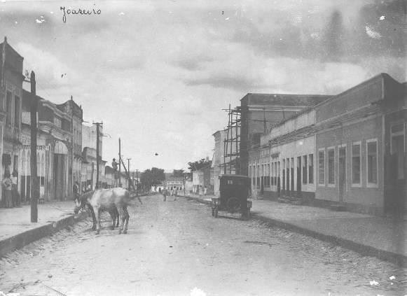

# Resumo

O presente artigo busca contribuir para o entendimento do processo de
estruturação da cidade de Juazeiro do Norte, no Ceará, na perspectiva da
Geografia Histórica Urbana. Esta cidade é conhecida nacional e
internacionalmente pelo movimento sócio-religioso do final do século
XIX, cujo representante de maior expressão é o Padre Cícero Romão
Batista, personagem que tem influenciado muitos estudos sobre esta
cidade. Muito se tem pesquisado sobre o sacerdote e sua influência no
crescimento e expansão da cidade, tendo a dimensão espacial sido
renegada ao segundo plano e por vezes desconsiderada. Argumentamos que a
produção do espaço urbano de Juazeiro do Norte não pode ser limitada
apenas ao papel da dimensão religiosa, pois muitos outros elementos
estiveram presentes na produção e estruturação desta cidade. A
metodologia usada é baseada em leitura bibliográfica que resultou na
nossa dissertação de mestrado, cujo este trabalho faz parte das
reflexões. Concluímos que o estudo da cidade de Juazeiro do Norte requer
que tenhamos em mente que o processo histórico tem uma dimensão espacial
que é nítida, sem a qual o fenômeno urbano não pode ser estudado, sendo
este o resultado da articulação entre agentes, diversas escalas e
processos histórico- geográficos.

Palavras-Chave: estruturação da cidade; produção do espaço urbano;
geografia histórica urbana; Juazeiro do Norte

# Abstract

This paper aims to contribute with the understanding the Juazeiro do
Norte - Ceará city structuring process, in the urban historical
geography perspective. This city is known nationally and internationally
result from the socio-religious movement of the late nineteenth century,
whose representative is the Padre Cicero Romão Batista greatest
expression, a character who has influenced many studies about this city.
Much has been studied about the priest and his influence on the city
growth and expansion, having been denied the spatial dimension to the
background and sometimes disregarded. We argue that the Juazeiro\'s
urban space production can not be limited only to the religious
dimension role, as many other elements were present in this city
production and structuring. The methodology is based on literature
reading that resulted in our master thesis, which this work is part from
reflections. We conclude the Juazeiro city study requires that we keep
in mind that the historical process has a spatial dimension that is
clear, without which the urban phenomenon can be studied, this being the
interaction between agents results, different scales and processes
historical- geographical.

Key-words: structuring the city; production of urban space; urban
historical geography; Juazeiro do Norte

# Introdução

A busca da compreensão das lógicas que produzem o espaço urbano está
entre as tarefas mais árduas para os geógrafos na atualidade. Embora
seja simples afirmar que a cidade é produzida

> 1 Este trabalho apresenta parte da discussão desenvolvida no segundo
> capítulo da nossa dissertação de mestrado, defendida no Programa de
> Pós-graduação em Geografia da UNESP de Presidente Prudente-SP com o
> apoio da Fundação de Amparo à Pesquisa do Estado de São Paulo
> (FAPESP).

pelos diversos agentes sociais ao longo do processo histórico, é
bastante complexo entender como eles atuam no processo de produção do
espaço urbano ao longo do tempo, como também compreender quais os seus
interesses, suas motivações e as contradições.

Ao estudar uma cidade em particular devemos levar em conta que ela se
estrutura a partir de uma multiplicidade de relações que são
espaço-temporais e que se realizam em várias escalas, com influência de
várias temporalidades distintas.

A presente pesquisa se vincula à Geografia, particularmente à Geografia
Urbana. Neste sentido, concordamos com Carlos (2011, p. 67) que nos
adverte que "à Geografia está posto o desafio de pensar a cidade em sua
perspectiva espacial". Pensar a cidade em uma perspectiva espacial não
quer dizer que a cidade deva ser vista como um agente ativo, que se
transforma por si mesma. Harvey (2006) alerta para a necessidade de se
pensar os processos (urbanização) e os artefatos gerados por ele (a
cidade) evitando uma interpretação reificada. A cidade não é um agente
ativo, é passivo, "simples coisa" nas palavras do autor. Entretanto, não
se pode negar o papel das formas produzidas, nesse caso a cidade, na
mudança social (HARVEY, 2006).

Este artigo está dividido em duas seções além desta introdução e das
considerações finais. Na primeira seção apresentamos a nossa
argumentação em favor de uma maior atenção à dimensão espacial da cidade
de Juazeiro do Norte, enquanto que a segunda seção a atenção é dada à
análise do período entre 1870 e 1930 e seus aspectos da produção do
espaço urbano.

# Proposta argumentativa e metodologia

Nossa proposta tem como primeiro plano de análise o fenômeno urbano,
deslocando para um segundo plano o aspecto religioso que está atrelado
ao desenvolvimento da cidade de Juazeiro do Norte, localizada no sul do
estado do Ceará. Não pretendemos, porém, desqualificá-lo ou ignorá-lo.
Não se trata disso. Pelo contrário, buscamos entender a estruturação
desta cidade a partir das múltiplas dimensões e, nesse caso, a
religiosidade e a fé se apresentam como importantes aspectos históricos
da produção espacial urbana. Longe de cortar o "cordão

umbilical" que liga a produção do espaço urbano de Juazeiro do Norte à
religiosidade2, o que

queremos é tirar o fenômeno urbano de trás das "sombras da cruz", ou,
pra ser mais preciso, das "sombras da estátua"3.

Para alguns, isso pode parecer uma heresia, visto que o desenvolvimento
desta cidade se confunde com a própria história de vida do sacerdote
Padre Cícero. Escuta-se com frequência, no plano do senso comum e na
fala de muitos políticos e empresários locais que "se não fosse o Padre
Cícero, Juazeiro hoje não seria o que é", ou "se tirarmos as romarias,
Juazeiro se acaba". Questões como essa nos levaram a tentar entender o
fenômeno urbano como um aspecto particular do desenvolvimento
histórico-geográfico, em que a questão religiosa teve um papel
fundamental em um determinado período, mas que, no nosso entendimento,
hoje não tem mais a influência que tinha até as décadas de 1960/1970.

Este texto parte da perspectiva da geografia urbana histórica e, para
isso, tomamos como suporte a proposta metodológica sugerida por
Vasconcelos (2008), que está dividida em quatro etapas: a) estabelecer
periodizações nas longas durações procurando observar as continuidades e
descontinuidades; b) examinar o contexto em cada período de análise em

> 2 A pesquisa de Silva Júnior (2009) é exemplar nesta perspectiva. O
> autor mostra, entre outras coisas, que a religiosidade está presente
> até na nomeação dos bairros e ruas ao longo do processo de expansão da
> cidade de Juazeiro do Norte. Os bairros São Miguel, Salesianos e São
> Francisco são os principais exemplos.
>
> 3 Essa expressão "nas sombras da cruz" é usada por Silva Júnior (2009)
> pra fazer referência ao papel da Igreja no desenvolvimento urbano das
> cidades de Juazeiro do Norte e Sobral, ambas do Ceará. Preferimos
> utilizar "nas sombras da estátua" por entender que caracteriza melhor
> a particularidade desse processo em Juazeiro do Norte, uma vez que o
> Padre Cícero não é considerado santo oficial pela Igreja. De certo, a
> estátua foi construída na década de 1960, mas a expressão é usada mais
> em sentido figurado e metafórico para designar a situação da cidade de
> Juazeiro ser um efeito do qual a causa seria o Padre Cícero.

fontes primárias e secundárias; c) examinar o papel dos principais
agentes, tanto locais como externos, que contribuíram para a produção a
cidade; e d) examinar o desenvolvimento espacial da cidade em cada um
dos períodos. Deter-nos-emos apenas ao período de 1870 e 19304, que se
refere ao interregno em que acontecem grandes transformações no povoado
de Joaseiro -- atual Juazeiro do Norte. A chegada de Padre Cícero ao
Povoado, o "milagre da hóstia" envolvendo este sacerdote e uma beata, a
separação entre o Estado e a Igreja em âmbito nacional, duas secas
devastadoras no Nordeste, a passagem do Brasil Império para o Brasil
República e a crise do café, são os principais acontecimentos que marcam
esse período com intensas transformações espaciais e rebatimentos na
produção das cidades.

# A dimensão espacial da cidade de Juazeiro do Norte de 1870 a 1930

Juazeiro do Norte é uma cidade do século XX. Em 2011, completou seu
primeiro centenário de emancipação política. Suas raízes remontam ao
início do século XIX. Data de 15 de setembro de 1827 o lançamento da
pedra fundamental, na capela de Nossa Senhora das Dores

-- atualmente a Basílica Menor e conhecida como Igreja da Matriz -- pelo
padre Pedro Ribeiro da Silva, no Povoado Joaseiro5, distrito da cidade
de Crato (MENEZES; ALENCAR, 1989).

Em meados do século XIX, entre 1824 e 1850, a região do Cariri, no sul
do Ceará6 -- da qual Juazeiro do Norte faz parte -- partilhava de
ideologias e aspirações nacionalistas e separatistas advindas da
influência econômica e política do Recife. Esta região permaneceu
relativamente isolada, sem grandes progressos materiais, exceto a cidade
do Crato, que era o núcleo urbano por excelência da região. Nesse
ambiente, como no Brasil como um todo, o catolicismo ortodoxo vinha se
decompondo, o que facilitou o aparecimento de misticismos e práticas
litúrgicas e crendices populares, próprias dos pobres, que viria a
influenciar o surgimento de Juazeiro (DELLA CAVA, 1985 \[1970\]7).

Esse panorama começou a mudar entre 1855 e 1865. O Cariri iniciou um
renascimento político e econômico por meio de influências advindas de
escalas mais amplas. A expansão demográfica dos centros urbanos, como
Fortaleza e Recife, que aumentavam a demanda por alimentos e a
necessidade europeia de matéria-prima, sobretudo o algodão, fizeram o
Cariri -- e a economia do Nordeste como um todo -- expandir sua produção
e alcançar um progresso econômico que refletiu na produção espacial do
Vale, principalmente na cidade do Crato (DELLA CAVA, 1985).

Em 1872, chega ao povoado o Padre Cícero Romão Batista. É extensa a
bibliografia sobre esse importante personagem da história de Juazeiro do
Norte, razão pela qual não nos deteremos nele8. Nesse período, Juazeiro
ainda era distrito da cidade de Crato. O contexto social da época
anterior à chegada do sacerdote, incluindo-se ai a tensão entre o Estado
e a Igreja, bem como a influência do missionário Padre Ibiapina,
conforme expõe detalhadamente Della Cava (1985), e o predomínio da
sociedade coronelista, foram imprescindíveis para que se conformassem os
processos que ajudam a explicar o futuro do povoado.

> 4 A periodização para o estudo de Juazeiro do Norte que propomos na
> dissertação de mestrado abrange além do período de 1870-1930, os de
> 1930 a 1980 e os de 1980 aos dias atuais. Por questões de espaço para
> a realização deste trabalho, optamos por analisar apenas o primeiro
> período.
>
> 5 Até 1911, Juazeiro era distrito do município de Crato. Passou a se
> chamar Juazeiro do Norte a partir de 1943 "alterado pelo decreto
> estadual nº 1114, de 30-12-1943, retificado em virtude do parecer de
> 14-06-1946 do Conselho Nacional de Geografia" (IBGE, 19??a, não
> paginado). Antes disso pode-se encontrar vários tipos de grafias, como
> Joaseiro, Juazeiro, Joazeiro, Juàzeiro etc. Conservaremos as grafias
> de acordo com que foram escritas nos textos originais, mas usando
> "Juazeiro do Norte" quando for de nossa autoria
>
> 6 Sempre que fizermos referência à região do Cariri significa que
> estamos nos remetendo ao Cariri Cearense. É
>
> importante lembrar disso para não provocar confusões com o Cariri
> paraibano.
>
> 7 As datas da publicação original aparecerão entre colchetes somente
> na primeira vez que os respectivos autores forem citados.
>
> 8 O leitor que quiser consultar a lista de publicações e livros sobre
> o Padre Cícero e Juazeiro do Norte, pode acessar o seguinte link:
> \<[[http://www.godocs.com.br/padre/docs/bibliografia.pdf]{.ul}](http://www.godocs.com.br/padre/docs/bibliografia.pdf)\>.

Esse recorte temporal é uma época de intensos acontecimentos na escala
do Nordeste, Brasil e do mundo. No caso do Brasil, é a época do fim da
escravidão, da famosa "Questão Religiosa9" com a separação entre Estado
e Igreja, o fim do Império e o início da República, fase inicial da
passagem do Brasil agroexportador para o Brasil urbano-industrial. Na
escala internacional, a guerra Civil nos Estados Unidos e a Primeira
Guerra Mundial acabaram afetando o Brasil, principalmente do ponto de
vista econômico.

Em específico às cidades, na escala nacional, a origem de Juazeiro está
inserida num contexto de predomínio do campo sobre a cidade, ao menos no
âmbito da atividade produtiva, com a economia do café comandando as
mudanças que deram ao campo, durante o século XIX até a década de 1920,
o controle social e político, com o coronel sendo sua expressão no
Nordeste (OLIVEIRA, 1977).

Neste período, as cidades se constituem como *lócus* do poder e do
controle do território, sendo por meio delas que o Brasil se inseria na
divisão internacional do trabalho. O padrão urbano, embora com as
alterações do ponto de vista dos ciclos da economia brasileira, reproduz
uma contradição desde a Colônia: de um lado "um vasto campo
indiferenciado, com uma rede urbana pobre, e de outro lado poucas e
grandes cidades polarizando as funções de capital comercial e de
intermediação entre a produção nacional e a sua realização nos mercados
internacionais" (OLIVEIRA, 1982, p. 40).

Iniciam-se, também, no que tange ao espaço urbano, os mercados de
terras10, as reformas urbanas em diversas cidades pelas ideologias do
higienismo e do sanitarismo. É o período em que "os processos
capitalistas modernos se firmam solidamente nas cidades brasileiras"
(ABREU, 2001, p. 35), ainda que de modo desigual e diferenciado conforme
a formação socioespacial.

À mesma época dava-se o processo de romanização das liturgias da Igreja
Católica desde o século XIX, que a permitiu adentrar nos sertões
nordestinos fundando capelas e paróquias. Tem-se ai a participação
institucional das Igrejas Cristãs, como também os Capuchinhos e os
Jesuítas que participaram da gênese de uma ética capitalista -- ainda
que o capitalismo enquanto tal só se firmasse posteriormente no Brasil
-- baseado no modo de vida empreendedor com inspiração na acumulação e
no lucro (GONÇALVES, 2006, 2007). Isso se refletiu em projetos de
civilização do sertão nordestino e de desenvolvimento regional a partir
das cidades.

É, nesse contexto, que ocorre o alardeado "milagre da hóstia", em 1889.
Tal evento é comumente caracterizado como o principal fator de mudança
tanto em Juazeiro como no Vale do Cariri. Após se espalharem as notícias
sobre o "milagre", "todos os dias chegavam novos contingentes de
romeiros: homens, mulheres e crianças, leigos e clérigos, ricos e
pobres, pessoas ilustres e simples desconhecidos" (DELLA CAVA, 1985, p.
80). A ele, está atrelada uma série de fatores de ordem nacional e
internacional -- a "Questão Religiosa" é um deles -- que possibilitaram
a sua realização e dispersão pelo interior do Nordeste11.

Este evento apresenta-se como um momento decisivo da constituição do
povoado. Suas implicações tiveram efeitos espaciais profundos e à
dimensão religiosa estavam atreladas as

> 9 A "Questão Religiosa" foi um conflito entre o Estado brasileiro e a
> Igreja Católica. Ocorreu no início da década de 1870, quando Dom Pedro
> II mandou prender dois Bispos, os quais, tomaram posição contra a
> maçonaria. Para saber mais como isso influenciou o movimento de
> Juazeiro, ver Della Cava (1985).
>
> 10 O Jornal "O Rebate", que funcionou de 1909 a 1911 em Juazeiro, e
> que teve um importante papel no que se
>
> refere à autonomia do povoado, já trazia em suas matérias anúncios de
> vendas de imóveis localizados no centro da cidade e ou próximo a ele
> (O REBATE, 190; 1910).
>
> 11 A tese de Della Cava (1985, p. 20) é que "o movimento
> religioso-popular originou-se e desenvolveu-se dentro de um contexto
> social definido pelas estruturas dominantes em âmbito mundial e
> nacional. Para sermos mais precisos, o movimento religioso-popular de
> Joaseiro afetou e foi afetado: (1) pela instituição eclesiástica
> internacional, a Igreja Católica Apostólica Romana; (2) pelo sistema
> político nacional do Brasil imperial e republicano; e (3) por uma
> economia nacional e internacional em mudança".

dimensões política e econômica12. Conforme ressaltou Della Cava (1985,
p. 116), não se percebeu muito bem que "por trás dessa fachada \[de
centro de fanatismo religioso, de romeiros etc.\], porém, estavam
ocorrendo importantes transformações políticas e econômicas".

Antes, durante e depois do "milagre da hóstia", aconteceram graves secas
no Nordeste, que influenciaram a migração para o Cariri e, por
conseguinte, para o aumento da densidade populacional dos municípios e
cidades. As principais que tiveram consequências foram as secas de 1877,
1888, 1898, 1900 e 1915. É para Juazeiro do Norte que afluiu a maioria
dos migrantes, tanto pela questão mítica do sacerdote e da propagação da
sua fama de milagreiro pelo interior nordestino, como pelas secas
devastadoras.

A bibliografia existente relata que, em 1875, o povoado tinha cerca de
trinta e duas casas cobertas de palha, a capela, apenas duas ruas -- "a
rua Grande, mais tarde rua Padre Cícero, estendia-se, paralelamente, ao
longo da capela e encontrava-se em perpendicular com a rua dos Brejos --
e cerca de dois mil habitantes, assemelhando-se com uma fazenda de
cana-de- açúcar" (DELLA CAVA, 1985, p. 41).

> Figura 1- Juazeiro do Norte.
> Estrutura espacial do povoado em 1875.
>
> Fonte: Della Cava (1985, p. 42)

As intensas migrações que ocorreram para Juazeiro do Norte fizeram que o
povoado desse um salto demográfico em poucos anos. Della Cava (1985, p.
138) afirma que "entre 1890 e 1898, a população de Joaseiro mais que
duplicou, ultrapassando 5 mil habitantes; em 1905, subiu para 12 mil; em
1909, chegou a 15 mil". Toda essa população teve que se instalar de
alguma forma no povoado. Inicia-se, assim, uma divisão social do espaço
que servirá de alicerce para a formação de uma estrutura urbana de
caráter monocêntrico que se expressará como centro- periferia ao longo
do século XX.

> 12 Ianni (1979, p. 152-153) observa que o messianismo "está ligado a
> transformações nas relações sociais de produção \[\...\] sendo a
> atividade religiosa \[\...\] uma forma de protesto \[\...\] Por trás
> da aparente resignação que acompanha a reza, a procissão, a romaria e
> o movimento messiânico, está o descontentamento face às condições
> presentes de vida".
>
> 
>
> Foto 1 - Juazeiro do Norte na década de 1910.
>
> Fonte: arquivo do autor

A década de 1920 é um tanto especial para Juazeiro do Norte e para o
País como um todo. No Brasil, esse período é marcado pelo auge da
economia agroexportadora, a reforma do sistema bancário e o aparecimento
de novos agentes políticos. Esta é a década das origens do Brasil
moderno, fundamental, portanto, para se entender o Brasil contemporâneo
(SARETTA, 1997). No âmbito das cidades, iniciam-se os atos normativos
que acabaram por influenciar o desenvolvimento posterior delas, como a
regulamentação do concreto armado -- que tornou possível a
verticalização -- acompanhada por normatizações a respeito da
propriedade urbana e o surgimento dos primeiros códigos de zoneamento
urbano (ABREU, 2001).

No caso do Nordeste, e do Cariri cearense em particular -- incluindo-se
ai Juazeiro --, é o momento da rearticulação em escalas geográficas
internacionais por meio da economia voltada, principalmente para a
Europa e para a Inglaterra em particular, mediante a exportação do
algodão a partir da segunda metade da década de 191013. O Cariri também
ganhou prestígio político em escala nacional através das relações que se
estreitavam cada vez mais, por meio de Floro Bartolomeu e pelo prestígio
de Padre Cícero, frente às massas e aos

políticos não só do Cariri, mas do Ceará e do Nordeste como um todo.
Nesta época, "Joaseiro era o maior reduto político do Nordeste" (DELLA
CAVA, 1985, p. 255).

Era no centro da cidade que se estabelecia a vida de relações da urbe
juazeirense. Na década de 1920, diversos equipamentos comerciais e de
serviços se instalaram na cidade. Tem destaque a instalação de três
fábricas de beneficiamento de algodão, duas ainda em 1919 -- o "Pita" de
propriedade de Felenon Pita, um rico comerciante e industrial da cidade,
uma filial da firma P. Machado e Cia, de Fortaleza, a "P. Machado e CIA"
--, e a outra em 1923, de propriedade de Dirceu Inácio de Figueirêdo,
onde hoje é a Escola Estadual de Ensino Profissionalizante Prof. Moreira
de Souza, antiga Escola Normal Rural. Além disso, a feira passa a ser
realizada no Quadro da Independência -- hoje Praça Padre Cícero --, e
ruas adjacentes, no centro da cidade a partir de 1924, mesmo ano da
inauguração do posto de profilaxia "Moura Brasil" (MENEZES; ALENCAR,
1989).

Alguns equipamentos de lazer também foram construídos, e destacamos que,
em 1921, foi inaugurado o primeiro cinema, de propriedade do Pelúsio
Correia de Macêdo, que funcionava com energia elétrica gerada no local,
pois, na cidade, a luz elétrica só chegou em meados da

> 13 "Entre 1916 e 1918, o algodão apresentou a metade do valor das
> exportações anuais do Ceará. Através dos anos 20, foi responsável por
> cerca de 75% da renda total do Ceará, enquanto que os impostos
> provenientes dos vários ramos da produção e da exportação algodoeiras
> correspondiam a 55% do orçamento anual real do governo do estado do
> Ceará. Um indicador da importância do algodão pode ser visto no
> relatório publicado em 1923 por uma delegação de representantes das
> indústrias [têxteis britânicas]{.ul}, [que visitou Joaseiro]{.ul} e
> outros centros produtores do Nordeste com o objetivo de promover o
> incremento, em volume e em qualidade, das [exportações]{.ul} [de
> algodão para a Inglaterra]{.ul}" (DELLA CAVA, 1985, p. 258-259 --
> grifos nosso).

década de 192014. Em 1925, o primeiro carnaval da cidade foi organizado
pelo Deputado Federal Floro Bartolomeu (MENEZES; ALENCAR, 1989).

Quanto à existência de luz elétrica, ela só existia no centro da cidade,
da mesma forma que o calçamento nas vias urbanas (fotos 2 e 3). A
periferia, por sua vez, era o espaço dos despossuídos. A prova disso é
que, no ano de 1925, o "Jornal Ideal" publicou uma matéria intitulada
"Juazeiro em foco", fazendo críticas às autoridades locais e reclamando
sobre a expansão da luz elétrica para a população da "zona suburbana"
(MENEZES; ALENCAR, 1989, p. 130-131). Cabe mencionar nos anos 1920
vários são os trabalhos publicados, contraditórios entre si, que
retratam a dimensão espacial da cidade e os modos de vida urbanos. Os
livros de Costa Andrade (1922), Moraes Barros (1924), Floro Bartolomeu
(1923), Castro (1925), Ceará (1925), Macêdo (1925), Lourenço Filho
(1926), e uma matéria especial na Revista Nação Brasileira (1928) expõem
como se dava a estruturação da cidade naquele momento histórico.
Carvalho (1968), que também visitou a cidade na década de 1920, assim a
descreveu:

> \[\...\] As ruas centrais, de aspecto semelhante às de Iguatu, Quixadá
> e Crato, com seu casario de tijolo e telha, em velho estilo português,
> levemente modificado pelo meio, apareciam retificadas e calçadas. Na
> área periférica, erguida às pressas e em desordem, de maneira a formar
> um labirinto, rasgavam-se vielas, alargavam-se becos, numa febre a que
> não chamo de embelezamento urbanístico \[\...\] (CARVALHO, 1968, p.
> XI).
>
> 
>
> Fotos 2 e 3: Juazeiro do Norte. Rua Padre Cícero, em 1923. Imagem
> utilizada por Floro Bartolomeu no seu discurso em defesa de Juazeiro.
>
> Fonte: arquivo do autor

Obras de infra-estrutura urbana foram realizadas, como a construção da
estrada de rodagem que ligava Juazeiro ao Horto15 em 1923 e o Matadouro
Modelo em 1928. Em 1929, a cidade foi arborizada com pés de
Ficcus-Benjamins (MENEZES; ALENCAR, 1989). A figura abaixo retrata a
expansão urbana da cidade nesse primeiro período.

> 14 Para saber mais sobre a história da energia elétrica em Juazeiro do
> Norte ver: CASIMIRO, Renato. "A energia elétrica em Juazeiro (I)".
> Disponível em:
> \<[[http://www.portaldejuazeiro.com/2010/12/energia-eletrica-em-]{.ul}](http://www.portaldejuazeiro.com/2010/12/energia-eletrica-em-juazeiro-i.html)
> [[juazeiro-i.html]{.ul}](http://www.portaldejuazeiro.com/2010/12/energia-eletrica-em-juazeiro-i.html)\>.
> Acesso em: 13 jan. 2013.
>
> 15 Horto era o nome de um antigo distrito da cidade, hoje é um bairro.
> Tem uma importância simbólica significativa, pois é lá onde está a
> estátua de Padre Cícero e é onde este, quando vivo, se recolhia para
> realizar suas orações.
>
> Figura 2 - Mapa da expansão urbana de
> Juazeiro do Norte entre 1870-1930. Fonte: Plano Diretor de
> Desenvolvimento Urbano, Juazeiro do Norte, 2000.
>
> Adaptado pelo autor

Todavia, o maior acontecimento deste período foi sem dúvida a
inauguração do ramal da Rede de Viação Cearense, que passou a ligar o
Cariri à Fortaleza em 1926, o que vinha sendo batalhada pelas elites
locais deste o início da década de 1910 e que, segundo Loureço Filho, em
nota à segunda edição do seu livro "Juàzeiro do Padre Cícero", promoveu
alguns melhoramentos urbanos que não existiam na época de sua visita à
cidade. Esse fixo influenciou um novo traçado urbano e uma nova
expansão, pois com a inauguração da estação passaram a se concentrar em
suas proximidades alguns estabelecimentos comerciais, atacadistas e
varejistas, transformando-a em uma área relativamente adensada (CEARÁ,
2000), posteriormente incorporada à mancha urbana, conforme a cidade se
expandia. De forma sintética, afirma Alves (1948, p. 98) que "\[\...\] o
período de 1922 a 1926 \[\...\] foi o apogeu da cidade".

# Considerações Finais

Diante do exposto, na análise da estruturação de Juazeiro do Norte entre
1870-1930 podemos tirar algumas conclusões de maneira sintética a partir
de três dimensões: a) os agentes, b) as escalas e c) os processos. De
fato, não é tão simples categorizar os agentes, visto que alguns deles
atuaram de diversas maneiras. Tal inferência se dá também no plano das
escalas e dos processos.

Como afirma Lefebvre (2008, p 52), "a cidade tem uma história; ela é a
obra de uma história, isto é, de pessoas e de grupos bem determinados
que realizam essa obra nas condições históricas". Entre 1870 e 1930, os
agentes que mais influenciaram, tanto intensivamente como
extensivamente, foram o Padre Cícero e o médico baiano Floro Bartolomeu
da Costa. Ambos atuaram e articularam os principais processos e
dimensões que acabaram se produzindo e expandindo a cidade. A dimensão
econômica, política e cultural-religiosa se entrelaçam, o que muitas
vezes é despercebido nas análises de Juazeiro do Norte. Outros agentes
influenciaram decisivamente a produção da cidade, como a classe dos
proprietários fundiários, a pequena e nascente burguesia comercial,
tanto a formada pelos adventícios como pelos "filhos da terra", os
artesãos, a Igreja e o Estado. Não se pode esquecer também dos romeiros
que, de fato, contribuíram decisivamente na estruturação da cidade de
Juazeiro do Norte.

No âmbito das escalas, elas se articulam de maneiras diversas. Como
frisou Sposito (2011, p.

130\) "nada pode ser explicado apenas em uma escala \[\...\] toda a
compreensão requer a articulação entre as escalas". Entre 1870 e 1930,
os eventos são articulados pelos diversos

agentes, tanto nas escalas regional, nacional e internacional. O local
se articula ao global inicialmente com o evento do "milagre da hóstia",
o que propicia as articulações posteriores com a economia regional e
internacional, resultado da produção do excedente alimentício e do
algodão.

A escala nacional tornou-se a principal a partir do momento em que a
política assumiu o primeiro plano, com as articulações encabeçadas por
Floro Bartolomeu e pelo prestígio exercido por Padre Cícero. Os agentes
se articulam escalarmente, visto que "a escala espacial constitui parte
integrante das práticas espaciais dos agentes sociais da produção do
espaço" (CORRÊA, 2011, p. 42). Juazeiro também se articula pela dimensão
econômica nas escalas regional e internacional, sobretudo pelas
investidas na produção do algodão e sua exportação para a Europa.

Do ponto de vista entre os processos, entre 1870 e 1930 é o momento em
que, na escala nacional, o capitalismo se solidifica nas cidades
brasileiras, embora não dominante, nem da mesma forma nos diversos
lugares. Destacamos do ponto de vista do espaço urbano os processos de
concentração e centralização espacial do capital. Produz-se, com isso, o
centro da cidade, com a localização dos estabelecimentos comerciais e de
serviços, as instituições de poder e a monumentalidade -- a Praça Padre
Cícero é o melhor exemplo disto. É o lugar dos encontros, das trocas, e
do lúdico. Com isso, o centro da cidade assume, ao longo destas décadas,
um papel importante, um elemento sem o qual a vida de relações na cidade
não poderia existir, surgindo assim a primeira expressão de centralidade
no espaço urbano, contrastando com a periferia urbana pobre e mal dotada
de equipamentos urbanos.

# Referências

ABREU, Maurício de Almeida. A cidade brasileira: 1870-1930. In: SPOSITO,
Maria Encarnação Beltrão. (Org). *Urbanização e cidade*: perspectivas
geográficas. Presidente Prudente: GAsPERR, 2001. p. 35-44.

> ALVES, Joaquim. Juazeiro, cidade mística. *Revista do Instituto
> Histórico e Geográfico do Ceará*, Fortaleza, p. 73-101, 1948.
>
> CARLOS, Ana Fani Alessandri. *A condição espacial*. São Paulo:
> Contexto, 2011.

CARVALHO, Jáder. Prefácio. In: ANSELMO, Otacílio. *Padre Cícero*: Mito e
realidade. Rio de Janeiro: Paz e Terra, 1968. p. XI-XXII.

CASTRO, Godofredo de. Joazeiro na Assembléia Legislativa do Ceará --
Discursos pronunciados nas sessões de 16, 19, 22 e 23 de Setembro de
1925 refutando acusações feitas pelo deputado Martins Rodrigues ao padre
Cícero Romão Baptista e ao dr. Floro Bartholomeu da Costa. Fortaleza:
Typographia S. José, 1925.

> CEARÁ. *Plano Diretor de Desenvolvimento Urbano de Juazeiro do Norte*.
> Relatório de Questões/ Módulo Conceito. Governo do Estado do Ceará,
> Secretaria de Infra- Estrutura/PROURB, Fortaleza, 2000a.
>
> . *Plano Diretor de Desenvolvimento Urbano de Juazeiro do Norte.*
> Legislação Básica. Lei de Parcelamento, Uso e Ocupação do Solo. Lei nº
> 2.570 de 8 de setembro de 2000. Governo do Estado do Ceará, Secretaria
> de Infra-Estrutura/PROURB, Fortaleza, 2000b.

CEARÁ ILUSTRADO. Fortaleza, v. 68, ano 2, 25 de outubro de 1925.

CORRÊA, Roberto Lobato. Sobre agentes sociais, escala e produção do
espaço: um texto para discussão. In: CARLOS, Ana Fani Alessandri; SOUZA,
Marcelo Lopes; SPOSITO, Maria Encarnação Beltrão. *A produção do espaço
urbano*: agentes e processos, escalas e desafios. São Paulo: Contexto,
2011. p. 41-51.

> COSTA, Floro Bartolomeu. *Juazeiro e o Padre Cicero*: depoimento para
> a História. Fortaleza: Edições UFC, 2010 \[1923\].

COSTA ANDRADE, Lauro. *Sertão a dentro*. Alguns dias com o Padre Cícero.
Rio de Janeiro: Typ. Coelho, 1922.

> DELLA CAVA, Ralph. *Milagre em Joaseiro*. 2 ed. Rio de Janeiro: Paz e
> Terra, 1985 \[1970\].

GONÇALVES, Cláudio Ubiratan. A invenção da região do Cariri entre o
messianismo e a ética capitalista. In: LIMA, Marinalva Vilar; MARQUES,
Roberto. (Org.). Estudos Regionais: limites e possibilidades. Crato:
Ceres, 2004. P. 23-35.

> **.** Ética e trabalho na construção do Cariri do Padre Cícero. In:
> *XIII Congresso Brasileiro de Sociologia*, 2007, Recife. XIII
> Congresso Brasileiro de Sociologia. Recife, 2007. p. 1-14.
>
> HARVEY, David. *A produção capitalista do espaço*. 2 ed. São Paulo:
> Annablume, 2006.

IANNI, Octávio. Relações de produção e proletariado rural. In:
SZMRECSÁNYI, Tamás; QUEDA, Oriowaldo. *Vida rural e mudança social*:
leituras básicas de sociologia rural. 3. Ed. São Paulo: Ed. Nacional,
1979. p. 148-159.

> LEFEBVRE, Henri. *O direito à cidade*. 5 ed. São Paulo: Centauro,
> 2008a \[1968\].

LOURENÇO FILHO, Manuel Bergström. *Juazeiro do Padre Cícero*. 4. ed.
aumentada. Brasília-DF: Inep/MEC, 2002. (Coleção Lourenço Filho 5).

MACEDO, Manoel Correia de (Pe. Dr.). *Joazeiro em foco*. Fortaleza:
Empresa Editora de Autores Católicos, 1925.

> MENEZES, Fátima; ALENCAR, Generosa. *Homens e fatos na história do
> Juazeiro* (estudo cronológico -- 1827-1934). Recife: EDUFPE, 1989.

MORAES BARROS, Dr. Paulo. *Impressões do Nordeste Brasileiro*.
Conferências do Dr. Paulo de Moraes Barros realisadas sob os auspícios
da Sociedade nacional de Agricultura, No Rio de janeiro, e da Sociedade
Rural Brasileira, em São Paulo, em 1923. São Paulo: Gráfica Monteiro
Lobato, 1924.

*O REBATE*, Juazeiro do Norte, 5 de dez. 1909, p. 3

\_. Juazeiro do Norte, 19 de jun. 1910, p. 3

OLIVEIRA, Francisco. Acumulação monopolista, o Estado e a urbanização: a
nova qualidade do conflito de classes. In: MOISÉS, José Álvaro *et al*.
*Contradições urbanas e movimentos sociais*. Rio de Janeiro: Paz e
Terra, 1977. p. 65-76.

. O Estado e o Urbano no Brasil. *Espaço e Debates*, São Paulo, n. 6, p.
36-54, 1982.

RAMOS, Francisco Régis Lopes. *O meio do mundo*: Territórios de sagrado
em Juazeiro do Padre Cícero. 2000. 507f. Tese (Doutorado em História),
Programa de Estudos Pós- graduandos em História, Pontifícia Universidade
Católica de São Paulo, São Paulo.

> SARETTA, Fausto. A política econômica na década de 1920. In: LORENZO,
> Helena Carvalho; COSTA, Wilma Peres (Org.). *A década de 1920 e as
> origens do Brasil moderno*. São Paulo: EDUNESP, 1997. p. 217-33.

SILVA JÚNIOR, Agenor Soares. *"Cidades Sagradas"*: a Igreja Católica e
as transformações urbanas Ceará (1870-1920). 2009. 382f. Tese (Doutorado
em História) Programa de Pós- graduação em História, Universidade
Federal Fluminense, Niterói.

SPOSITO, Maria Encarnação Beltão. A produção do espaço urbano: escalas,
diferenças e desigualdades socioespaciais. In: CARLOS, Ana Fani
Alessandri; SOUZA, Marcelo Lopes; SPOSITO, Maria Encarnação Beltrão. *A
produção do espaço urbano*: agentes e processos, escalas e desafios. São
Paulo: Contexto, 2011. p. 123-145.

VASCONCELOS, Pedro de Almeida. Questões metodológicas na geografia
urbana histórica.

> *GeoTextos,* Salvador, vol. 5, n. 2, 147-157, 2009.
>
> XAVIER DE OLIVEIRA, Antônio. *Beatos e cangaceiros*. Rio de Janeiro:
> s/e, 1920.
