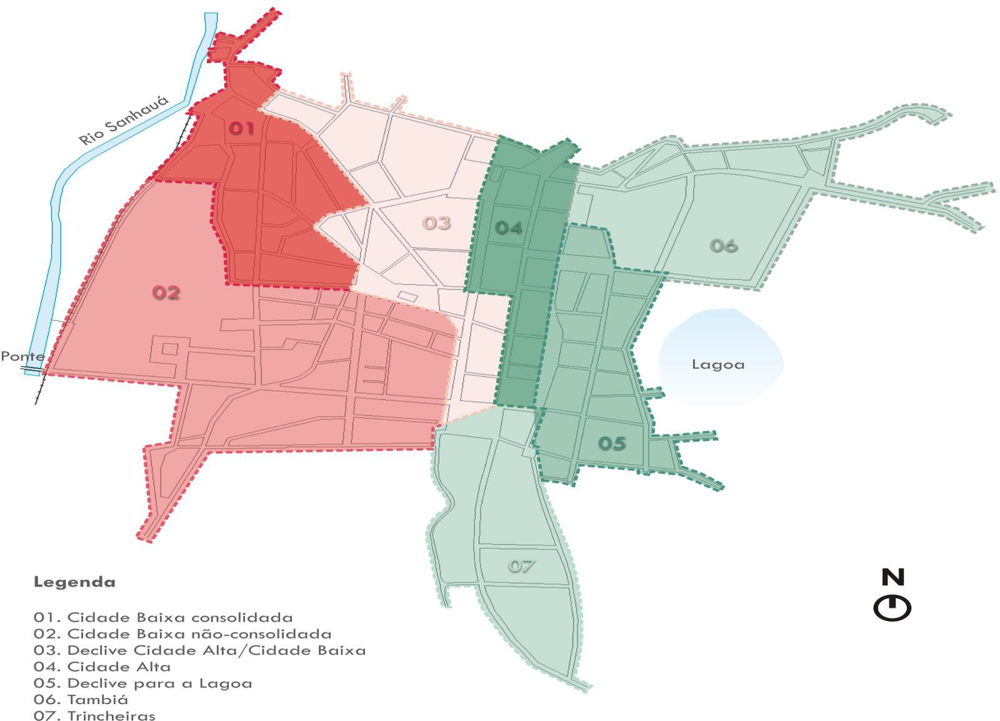
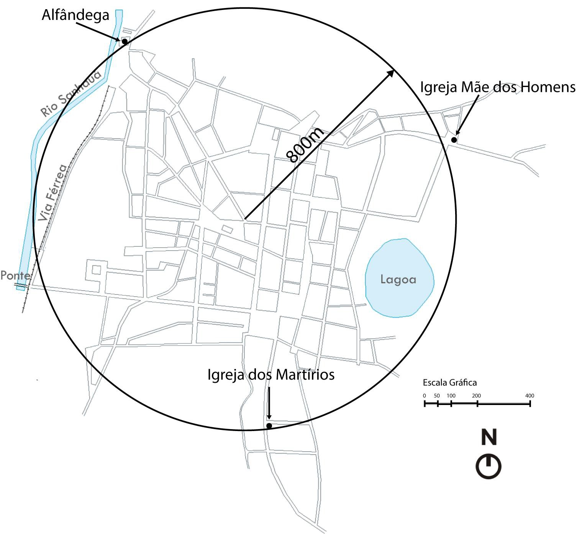
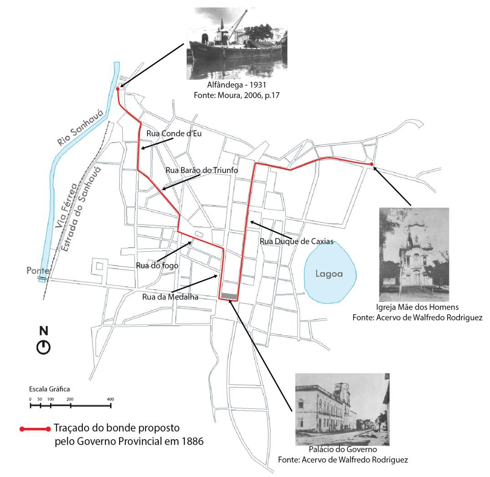
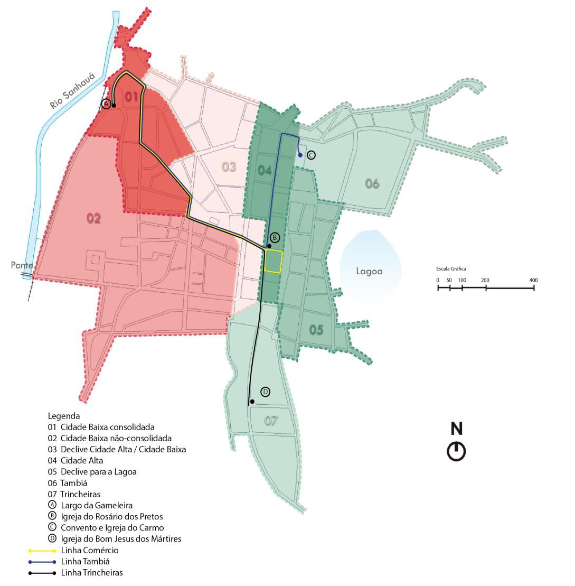
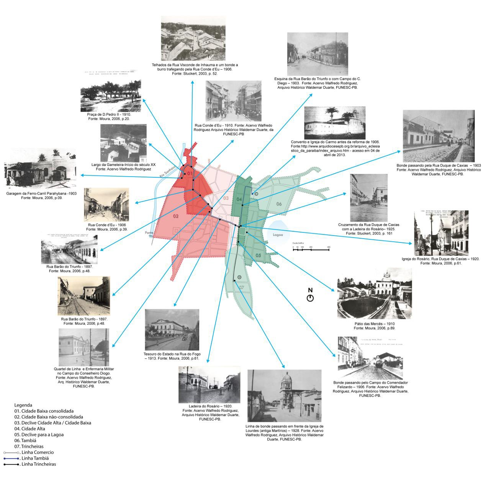

# Resumo

O presente trabalho é parte da minha tese de doutorado cujo objeto de
pesquisa foi o bonde a burro da Cidade da Parahyba no recorte temporal
de 1896, ano de sua implantação, até 1914, quando teve a tração animal
substituída pela elétrica. Pesquisas sobre serviços urbanos permitem
aprofundar o conhecimento da cidade estudada. No caso da Cidade da
Parahyba, podemos citar Araújo (2012) e Melo (2013) que pesquisaram o
abastecimento de água da cidade, contribuindo, assim, para a ampliação
da historiografia da capital paraibana. O nosso objetivo, neste artigo,
é mostrar a história da Cidade da Parahyba pela ótica do serviço de
bonde a burro. Na falta de outros serviços importantes como a luz
elétrica, implantado só em 1910, ou da água encanada, implantado em
1912, o bonde, naquele momento, se tornou um ícone da modernidade da
capital paraibana. A pesquisa sobre o bonde, utilizando-se a
iconografia, cartografia, literatura, entrevistas, permitiu acompanhar a
história da cidade, da sua sociedade, das atividades urbanas ali
desenvolvidas como a comercial, religiosa, de lazer, enfim o seu
desenvolvimento urbano e social no período pesquisado.

> **Palavras-chave:** Bonde. Cidade da Parahyba. Século XIX.
> Modernização. Urbanismo.

# Abstract

The present work is part of a doctorate thesis whose study object was
the donkey drive street- car in the city of Parahyba from 1896, when it
was implanted, to 1914, when the animal traction was substituted by the
electric drive. Research on urban services has permitted to deepen the
knowledge about the city in question. In the case of Parahyba, Araújo
(2012) and Melo (2013) have studied the water provisioning in the city,
thus contributing for the increase of historiography about the capital
city. The objective of this paper is to show the history of the city of
Parahyba in the light of the donkey drive tramway service. In the
absence of other important services such as electric light, only
established in 1910, and piped water, inaugurated two years later, the
trolley car became an icon of modernity in the capital city. The
investigation about the tramway making use of iconography, cartography,
literature and interviews made it possible to accompany the history of
the city, of its society and of the urban activities realized in it,
such as commercial, religious, amusing as well as all the social and
urban development during the time in question.

Key words: Street car, city of Parahyba, nineteenth century,
modernization, urbanism.

# INTRODUÇÃO

A historiografia da capital paraibana, após importantes trabalhos
escritos na primeira metade do século XX, e reeditados no final daquele
século, como os de Medeiros (1994) e Rodrigues (1994), recebeu
importante incentivo após a implantação do Curso de Graduação em
Arquitetura e Urbanismo da UFPB, em meados da década de 1970 e de
Pós-Graduação na primeira década deste século. Dissertações de Mestrado,
teses de doutorado e livros como os escritos por Tinem (2006), Moura
Filha (2010), e Sousa e Vidal (2010) são exemplos de professores do meio
acadêmico da arquitetura e urbanismo da UFPB, que enriqueceram a
historiografia da cidade com os seus trabalhos. Pesquisas sobre serviços
urbanos permitem

aprofundar o conhecimento da cidade estudada. No caso da Cidade da
Parahyba podemos citar as teses de doutorado de Araújo (2012) e Melo
(2013) que pesquisaram o abastecimento de água da cidade, contribuindo,
assim, com a história da capital paraibana.

O nosso objetivo, neste artigo, é mostrar a historiografia da Cidade da
Parahyba pela ótica do serviço de bonde a burro no recorte temporal de
1896 a 1914, período em que ele circulava pelas principais vias da
capital paraibana.

O presente trabalho é parte da minha tese de doutorado cujo objeto de
pesquisa foi o bonde a burro da Cidade da Parahyba no recorte temporal
de 1896, ano de sua implantação, até 1914, quando teve a sua tração
animal substituída pela elétrica. Na pesquisa, com a utilização da
iconografia, cartografia, literatura e documentos oficiais sobre a
Cidade da Parahyba, concluiu-se como, e porque, o bonde foi implantado,
contribuindo com a historiografia da cidade.

# O BONDE NA CIDADE DA PARAHYBA

A Cidade da Parahyba, em sua origem, foi implantada sobre uma colina e,
ao se expandir, ocupou dois planos distintos: um sobre a colina, que foi
denominado de Cidade Alta, e o outro próximo do Rio Sanhauá, denominado
Cidade Baixa.

Na época da implantação do sistema de bonde, ela não seria muito
diferente da descrita em 1889 na "Monographia da Cidade da Parahyba do
Norte" de Vicente Gomes Jardim1 (1910, 1911). Por isso, tomou-se como
referência o conteúdo da monografia por ele escrita. A visualização da
cidade tendo por base essa monografia foi estudada por Tinem (2006, pp.
260-274) e Sousa e Vidal2 (2010, pp. 21- 50), que desenharam,
espacialmente, a cidade tendo como suporte uma planta da cidade de 1858.
(Fig. 01).

Na Figura 01, a seguir, a Cidade da Parahyba é mostrada com divisões em
zonas, definidas por Tinem (2006, p. 273)3. As zonas 01 e 04,
denominadas de consolidadas, correspondem às áreas de ocupação mais
antiga da cidade, com sistemas de ruas em formação desde o século
XVI/XVII e com maior número de edifícios construídos em alvenaria (MOURA
FILHA, 2010). Segundo dados apresentados por Medeiros Filho (2013), a
zona 01, localizada na Cidade Baixa, era composta por 92,7% de casas
térreas em alvenaria4, 6,9% de sobrados e apenas 0,6% de casas de
palhas. Ainda segundo Medeiros Filho (2013), não havia casas de palhas
na zona 04 localizada na Cidade Alta. Predominavam as casas térreas em
alvenaria com 87,6% e sobrados com 12,4%. A zona 02, denominada de não
consolidada, na Cidade Baixa, tinha a maioria das casas (53,4%) de
palha, sendo incorporada à cidade somente no

século XIX, em particular, a partir do governo de

> 1 Vicente Gomes Jardim era agrimensor da Marinha em 1889 e fez um
> levantamento topográfico da cidade da Parahyba, escreveu um texto
> detalhado da cidade, com o nome de todos os logradouros, números de
> edificações existentes em cada um deles como também o comprimento,
> largura e relevo de todos eles. Foi publicado inicialmente no mesmo
> ano do levantamento no jornal Gazeta da Parahyba.
>
> 2Em **Sete plantas da capital paraibana, 1858-1940**, Sousa e Vidal
> (2010, pp. 47- 48) elaboraram uma planta da cidade a
>
> partir da monografia de Vicente Jardim, que foi utilizada neste
> trabalho em todas as figuras onde a cidade da Parahyba é mostrada.
>
> 3 Nelci Tinem organizou e publicou o livro **"Fronteiras, Marcos e
> Sinais: Leituras das ruas de João Pessoa"**. O capítulo que
>
> interpreta a monografia de Jardim, "Para além da dicotomia Cidade
> Alta/Cidade Baixa" (Tinem, 2006, pp 253-276), foi escrito por ela,
> Juliano Loureiro de Carvalho e Carla Gisele Martins. O mapa resultante
> da interpretação foi elaborado por Juliano Loureiro de Carvalho e
> Carla Gisele Martins em 2003 (TINEM, 2006, p. 273).
>
> 4 Embora não definido por Jardim (1911; 1912) nem por Sousa e Vidal
> (2010), o termo sobrado segundo Corona e Lemos (1989, p. 429) é
> utilizado para "designar o prédio com mais de um pavimento" em
> oposição à casa terreira "moradia de um só
>
> pavimento, cuja designação mais usual é térrea" (CORONA; LEMOS, 1989,
> p. 116). Por sua vez, Jardim, em sua descrição da cidade, refere-se
> aos sobrados e às casas de alvenaria, associando estas às casas
> térreas. Também enumera as casas de palha, caracterizadas como uma
> habitação precária e rústica muito utilizada na região pela população
> mais pobre, denominada, segundo Corona e Lemos (1989, p. 356), como
> palhoça: "casa colmada ou coberta de palha".
>
> 

**Figura 01:** Planta da Cidade da Parahyba com zonas de ocupação --
1889 **Fonte:** Sousa e Vidal (2010, pp. 47-48); Tinem (2006, p. 265)
**Redesenho:** Denise Lemos.

Beaurepaire Rohan com implantação de edifícios públicos, como o teatro,
Assembleia Provincial e Quartel de Linha (VIDAL, 2004). As acentuadas
diferenças de cotas na topografia da cidade, as zonas 03 e 05 da
referida figura, estavam localizadas em áreas de declive que tiveram
ocupação tardia, estando, por isso, menos habitadas no século XIX. No
caso da zona 03, ela corresponde às antigas cercas conventuais dos
beneditinos e dos franciscanos, o que justifica sua ocupação rarefeita.
Na zona 05, a presença da antiga Lagoa dos Irerês, sendo uma área
pantanosa e pouco salubre, afastava a população e, por isso,
verificava-se, também, uma ocupação tardia e rarefeita. As zonas 06 e 07
correspondem às áreas de expansão da cidade, cujos eixos viários
principais (a Rua do Tambiá e a Rua das Trincheiras) já compareciam na
cartografia do período holandês, como caminhos que levavam para fora da
cidade. A partir do século XIX, vão se consolidar os dois bairros,
Tambiá e Trincheiras, direcionados pelas referidas ruas e com
predominância de uso residencial pela burguesia urbana.

Usando-se uma escala gráfica na planta da Cidade da Parahyba gerada a
partir de Jardim (1910, 1911), percebe-se que, no final do século XIX, a
capital paraibana se inscrevia em uma circunferência de raio de 800
metros de comprimento aproximadamente. Mesmo em condições diferenciadas
-- como topografia, clima, traçado das ruas, por exemplo -- o que

chama atenção era a distância média do seu centro físico para as bordas
ser bem inferior ao descrito por Chudacoff (1977) nas cidades americanas
pré-modernas (Fig. 02).

> 
>
> **Figura 02:** Dimensões da Cidade da Parahyba -- 1889
>
> **Desenho dos detalhes:** Igor Dantas

Chudacoff (1977, pp.91-95), ao falar sobre os usuários a cidade
pré-moderna, chamada pelos historiadores americanos de 'cidade do
andarilho', destaca:

> Os principais usuários das ruas não eram rodas ou cascos, mas pés
> humanos. Na cidade americana pré-moderna, a vasta maioria das pessoas
> ia a pé para seus destinos e era essa forma de locomoção que
> determinava o tamanho e a forma da cidade. \[\...\] Até a década de
> 1850, as áreas habitadas, até mesmo das maiores cidades, como Nova
> York, Boston e Filadélfia, só em raros casos se estendiam até três
> quilômetros do centro da cidade, a distância média que uma pessoa pode
> caminhar por meia hora. Por isso mesmo, os historiadores batizaram
> essa antiga configuração de *cidade de andarilhos* em virtude de seu
> tamanho e principal forma de transporte (CHUDACOFF, 1977, p. 92).

O bom exemplo do sistema de bonde da cidade do Rio de Janeiro, que
provocou mudanças significativas na estrutura daquela cidade e de sua
sociedade, serviu de modelo para diversas cidades brasileira,
principalmente as capitais. Vários intelectuais escreveram sobre essas

mudanças. Olavo Bilac5, numa crônica de 1903, chamou o bonde de operário
da democracia por estender seu "aranhol de trilhos metálicos" por todas
as zonas da *urbs*, passando em todas as ruas urbanas e suburbanas,
povoando os bairros afastados, criando bairros novos. Na sua crônica,
Bilac (2004, p. 40) fala do papel do bonde na sociedade, como criador de
relações de amizade, de amor, de negócios, combinações políticas,
financeiras e até formação de empresas e bancos que surgiram numa viagem
de bonde. Enfim, Olavo Bilac, ao escrever sobre o dia a dia das classes
sociais se misturando em um espaço neutro e ambulante, mostrou quão
democrático era esse transporte sobre trilhos e sua importância na
formação da sociedade carioca, servindo de exemplo para todas as cidades
brasileiras.

No mesmo sentido de exaltação deste sistema de transportes, Rui Barbosa,
como usuário e defensor do sistema de bondes, escreveu:

> \[\...\] o bonde foi, até certo ponto, a salvação da cidade. Foi o
> grande instrumento do seu progresso material. Foi ele que dilatou a
> zona urbana, que arejou a cidade, desaglomerando a população, que
> tornou possível a moradia fora da região central \[\...\]. O bonde foi
> -- é preciso dizê-lo -- uma instituição providencial. Se não
> existisse, era preciso
>
> inventá-lo (BARBOSA, 1898)6.

Para Nascimento (1996, p. 44), o bonde era associado à ideia de cidade
maravilhosa, organizada e asseada. Ao vê-lo passar, o habitante da
cidade podia admirar-se com o desenvolvimento tecnológico que sua cidade
alcançara e, quando nele andava, era participante e testemunha desse
progresso.

O exemplo do Rio de Janeiro fez com que quase todas as capitais
brasileiras implantassem o bonde a tração animal na segunda metade do
século XIX, parte delas ainda no regime imperial. O Imperador D. Pedro
II, que teve um bonde exclusivo, assinou uma Lei estabelecendo que,
quando um carril de ferro circulasse num só município, a linha seria
considerada de *tramway*, isto é, de bonde, cabendo exclusivamente à
municipalidade local o direito de legislar a respeito. Quando atendesse
a dois ou mais municípios, tendo em cada um deles, pelo menos, três
quilômetros de linha permanente, passaria a ser considerada uma
ferrovia, cabendo ao Governo da Província (Estado da Federação) legislar
a respeito. Quando uma linha de bonde por entroncamento fosse ligada a
uma via férrea, seria, do mesmo modo, considerada uma estrada de ferro
estadual. A República referendou a Lei Imperial, ao decretar a Lei n° 30
de 13 de junho de 1892 nos mesmos termos (VANA, 2010).

A interferência do bonde na urbanização das cidades brasileiras é
encontrada em estudos de Weid (2004) e comentada por Pinheiro (2011)
sobre como as companhias de bonde influenciaram na expansão da cidade do
Rio de Janeiro por força da associação delas com empresas imobiliárias e
de urbanismo. Weid (2004, p. 30), escreveu:

> Como pode ser notado, o bonde foi um elemento fundamental no
> desenvolvimento da cidade do Rio de Janeiro. Pode-se entender a
> expansão do centro, a formação de novos bairros, a setorização social,
> através da evolução das linhas de carris. Com seu aspecto
> característico, seu espaço democrático e sua tradição, o bonde foi por
> muitas décadas como que um símbolo da cidade litorânea, um espaço onde
> tudo podia acontecer. Durante esse tempo, era o transporte coletivo
> por excelência, permitindo a qualquer pessoa ir, de qualquer ponto da
> cidade, aonde bem entendesse. As linhas de bonde
>
> 5 Embora escrita em 1903, a crônica recebeu o nome de "O Bonde", e sua
> primeira publicação foi em 1904 no livro "Crítica e Fantasia" pela
> Livraria Clássica Editoras. Uma nova publicação é hoje encontrada no
> livro -- BILAC, Olavo. **Júlio Verne, o bonde, o burro e outros
> escritos.** São Paulo: Editora Barcarolla, 2004, pp. 31-43.
>
> 6 O texto é encontrado em "Obras completas de Rui Barbosa", p. 210-214
> e 223 -227, tendo sido originalmente publicado na "A Imprensa", com o
> título "Viação Urbana", nos dias sexta-feira, 21, e sábado, 22 de
> outubro de 1898. Disponível em:
>
> \<[www.casaruibarbosa.gov.br](http://www.casaruibarbosa.gov.br/)\>.
> Acesso em: 29 ago. 2012.
>
> interligadas cobriam absolutamente toda a zona urbana do Rio e seus
> subúrbios mais próximos (WEID, 2004, p. 30).

Na Paraíba, o poder público, em meados da década de 1880, já propunha à
Assembleia Provincial (MENSAGEM, Dr. Antonio Herculano de Souza
Bandeira, 1886, p. 54) um sistema de carris urbanos, por achar que a
capital não se desenvolvia por causa da falta de um meio de transporte.
Para ele, a população escolhia residir em pequenos espaços, próximos das
principais vias de circulação, como a Rua Duque de Caxias, para evitar
longas caminhadas, caso fosse residir nos belíssimos arrabaldes das
Trincheiras e do Tambiá. A maioria dos comerciantes residia no
Varadouro, onde tinha o comércio para não fazer grandes viagens urbanas
a pé, descendo e subindo ladeiras.

> Uma linha de carris urbanos, com tração animal que, percorresse as
> principaes ruas da capital, certamente transformaria as condições da
> vida da cidade. Poderia a linha partir do largo da capitania e subir
> pela rua Conde d'Eu e do Barão do Triumpho, atravessando o largo
> fronteiro ao Thesouro, e d'ahi alcançar a cidade alta, ou directamente
> pela ladeira do Rosario, ou fazendo volta por traz do Palácio da
> Presidencia para attingir á rua Duque de Caxias e tomar depois a
> direção da igreja da Mãe dos homens, no Tambiá. A empreza pode
> iniciar-se modestamente e augmentar o material á proporção dos lucros
> realizados. Objectam alguns que a receita não dará para a despeza;
> essa objecção banal foi levantada tambem por occasião de surgir a
> opulenta linha de Carris de Botafogo, no Rio de Janeiro. Diversas
> pessoas me tém assegurado, de resto, que não duvidarão emprehender o
> serviço, si lhes forem asseguradas boas vantagens. Convem que
> habiliteis a Presidencia a fazer a concessão com prazo longo e os
> favores compatíveis (MENSAGEM, 1886, p. 55).

A figura 03 mostra como ficaria a citada linha.

> 

**Figura 03:** Proposta de implantação de bonde a burro -- 1886

> **Fonte:** (MENSAGEM, 1886, p. 55).
>
> **Desenho da linha e Edição:** Igor Dantas.

Dez anos depois, o governo do Presidente Álvaro Machado vislumbrou a
possibilidade de um empreendimento que unisse os recursos públicos com
os privados dos produtores de algodão. Afinal de contas, para ele, como
chefe político de uma oligarquia que esteve no poder paraibano por mais
de 20 anos (CARNEIRO, 2009, p.107-144), implantar um serviço urbano que
representasse a modernidade na capital do estado, decerto, resultaria em
dividendos eleitorais inestimáveis. Afinal, entre os principais serviços
modernos, como o transporte urbano, luz elétrica e água encanada, o
bonde anunciava, pelos seus itinerários, que a cidade se expandia e que
as necessidades da população em se locomover eram atendidas. Era um
serviço urbano "visível". Representava sinal de mudanças, de
modernidade.

> Viajar, ou passear, por um quarto de hora ou por meia hora ao lado de
> um desconhecido, sem dirigir-lhe a palavra, ou então trocar conversa
> formalmente sobre a política ou os costumes, com alguém que não se
> sabe exatamente quem é, era o sinal de novos tempos que o bonde
> poderia proporcionar. \[\...\] O bonde era associado à idéia de cidade
> maravilhosa, organizada e asseada. Ao vê-lo passar, o habitante
> citadino podia admirar-se com o desenvolvimento tecnológico que sua
> cidade alcançara, e quando nele andava, era participante e testemunha
> desse progresso (NASCIMENTO, 1996, p. 11 e 41).

Diferente da maioria das outras capitais brasileiras, na Cidade da
Parahyba, só existiu uma companhia de ferro-carril para explorar o
serviço de bonde a tração animal. Não havia, pois, concorrência. Essa
companhia foi também diferenciada no seu nascedouro, ao juntar verbas
públicas com recursos privados oriundos da produção de algodão. Segundo
Rodriguez (1994,

p\. 179), com investimento das companhias de algodão Aron Cahn & Cia e
Cahn Frères & Cia e a participação do poder público, tendo o Estado como
principal acionista, em uma reunião na Associação Comercial no dia 19 de
abril de 1895, foi criada a Companhia Ferro-Carril Parahybana.

Em Mensagem lida para a Assembleia Legislativa, em 15 de fevereiro de
1896, o Presidente do Estado da Parahyba, Major Dr. Álvaro Lopes
Machado, escreveu: "\[\...\] contribue o Estado como o maior accionista
da Empreza Ferro-Carril da Parahyba \[\...\]" (MENSAGEM, 1896, p. 13)7 e
falou da satisfação do governo na parceria com a iniciativa privada para
implantação do bonde na capital paraibana. E não havendo outros serviços
urbanos, como energia elétrica e saneamento d'água, o bonde foi
implantado e se tornou um ícone da modernidade da Cidade da Parahyba no
final do século XIX em três linhas: Linha Comércio, Linha Tambiá e Linha
Trincheiras.

O percurso do bonde partindo do Largo da Gameleira ligou o setor
comercial da cidade, localizado na área consolidada da Cidade Baixa, com
a área consolidada da Cidade Alta, onde residia a elite citadina, tendo
sido descrito por Rodriguez (1994) como sendo:

> Partindo da Praça Álvaro Machado, a linha passava pela Praça Pedro II
> (atual 15 de Novembro), subia a Visconde de Inhaúma, curvando à
> direita pela Rua do Comércio (posteriormente Maciel Pinheiro); subia a
> curva, à esquerda, pela Estrada do Carro (depois da guerra civil de
> Canudos denominada de Rua Barão do Triunfo), passando em curva, à
> direita, pela frente do antigo Quartel do 27º Batalhão de Linha, no
> Largo Cel. Bento da Gama, (na atualidade, Praça Pedro Américo), e daí
> curvando, à esquerda, subia a Rua do Fogo (Avenida Guedes Pereira dos
> nossos dias), para tornar a fortemente íngreme Ladeira do Rosário
> (RODRIGUEZ -- 1994, p. 181).

O percurso descrito para a Linha Comércio por Rodriguez (1994, p. 181),
com cerca de 1.200 metros de comprimento, tornou-se o eixo principal do
sistema de bonde. A Companhia Ferro- Carril Parahybana implantou mais
duas linhas: a) a Linha Tambiá, que, semelhante à Linha Comércio, fazia
o mesmo percurso até a Igreja do Rosário e ali, dobrando à esquerda,
seguindo pela Rua Duque de Caxias por mais 550 metros, após passar pela
Rua São Francisco, ia até o Campo do Conselheiro Henriques, onde
terminavam os trilhos em frente ao Convento e à Igreja do Carmo; b) a
Linha Trincheiras, que seguia o mesmo traçado da Linha Comércio e Tambiá
até a frente da Igreja do Rosário, onde curvava a direita e percorria
mais 600 metros, seguindo pela Rua Duque de Caxias, passando na lateral
do Campo do Comendador Felizardo, como também na frente do Liceu, da
Igreja do Colégio e do Palácio do Governo, antes de seguir pela Rua
Trincheiras até a Igreja do Bom Jesus dos Martírios onde terminava a
linha (ver Fig. 05).

A Figura 04 abaixo mostra a Cidade da Parahyba com as três linhas de
bonde, que cortavam áreas consolidadas da cidade baixa, conhecida como a
área de maior concentração do comércio e serviços. E as linhas Tambiá e
Trincheiras, por sua vez, após atravessarem as vias de comércio e
serviço, atendiam à área consolidada da Cidade Alta, ocupada pelas
residências

> 7 Na Mensagem de 15/02/1896 à Assembleia Legislativa do Presidente do
> Estado da Parahyba, Major Dr. Álvaro Lopes Machado, publicada na
> Imprensa Official da Parahyba, o Mapa 'C' -- "Demonstração da dívida
> do Thesouro do Estado da Parahyba até 31 de Dezembro de 1895, com
> discriminação do movimento á partir do 1° de Julho de 1894", já consta
> o valor de 15.000\$000 para a Companhia Ferro-Carril. Fonte: Center
> for ResearchLibraries, Global Resources Network. Disponível em:
>
> \<<http://www.crl.edu/brazil/provincial/para%C3%ADba>\>. Acesso em: 24
> nov. 2010.

da classe mais abastada, seguindo com destino aos dois novos bairros em
formação, o do Tambiá e o das Trincheiras, que davam o nome às
respectivas linhas.

> 

**Figura 04:** Traçado das três linhas do bonde a burro -- 1896

> **Fonte:** Rodrigues (1994, p. 181).
>
> **Desenho das linhas:** Igor Dantas.

Com as informações colhidas na literatura e iconografia disponíveis
sobre a Cidade da Parahyba, foi possível confirmar os traçados das
linhas do bonde a burro, representadas na Figura 04. Aplicando zoom em
fotografias digitalizadas dos acervos pesquisados, foi possível
identificar os trilhos, ou mesmo o próprio bonde a burro, nas vias por
onde ele trafegava. A Figura 05 é a edição desse trabalho.

> 

**Figura 058:** Visão geral das três linhas do bonde registradas em
fotografias

**Fonte:** Acervo Fotográfico (RODRIGUEZ, 1994; MOURA, 2006; STUCKERT
FILHO,2003, 2007)

> **Desenho das linhas e edição:** Igor Costa

O percurso dessas três linhas implantadas não foi mudado ao longo dos 18
anos de funcionamento do sistema a tração animal, apenas recebeu algumas
ampliações nesse período.

# CONSIDERAÇÕES FINAIS

> 8 Esta Figura 05 encontra-se editada e ampliada, no formato A2, no
> apêndice da Tese de Medeiros Filho (2013), prancha 02.

Medeiros Filho (2013), em sua tese defende que "**\... e o bonde a burro
foi implantado:** um ícone de modernidade da Cidade da Parahyba no final
do século XIX", por o bonde representar a modernidade, em uma cidade de
poucas modernidades. O 'ícone', portanto, se deu pela não implantação
dos outros importantes serviços urbanos como a iluminação pública com
uso da eletricidade, abastecimento de água tratada e encanada e o
esgotamento sanitário (MEDEIROS FILHO, 2013, p.141).

O bonde a tração animal, não era necessário naquele momento, às
dimensões da cidade não demandavam.+ tal serviço (ver Fig. 03), foi uma
escolha do poder público, em detrimento de outras demandas mais
importantes.

Embora o bonde fosse desnecessário num primeiro momento, ao ser
implantado, atendeu a população citadina de maior poder aquisitivo, que
trafegava por ruas que interligavam os terminais modais de transporte da
época, como o Porto do Capim e a Estação Ferroviária Conde D'Eu com as
áreas de comércio e serviços, além de passar por praças e áreas de
lazer, como o Largo da Gameleira, Praça de D. Pedro II, Campo do
Conselheiro Diogo e Campo do Comendador Felizardo, interligando com as
áreas residenciais consolidadas da Cidade Alta ou em formação, como os
bairros de Tambiá ou de Trincheiras. Para quem não residia nesses novos
bairros, o bonde, que durante a semana era o meio de transporte usado
principalmente para atividades de compras e trabalho, aos domingos, a
população "transparecia o desenvolvimento do prazer pelos passeios aos
pitorescos finais dos arrabaldes de Trincheiras e Tambiá" (RODRIGUEZ,
1994, p.18).

Encerramos aqui esta contribuição à historiografia da Cidade da Parahyba
através de um serviço de transporte que marcou uma época e teve sua
importância no desenvolvimento da capital paraibana.

# REFERENCIA BIBLIOGRÁFICA

> ARAÚJO, Magno Erasto de. **Água e rocha na definição do sítio de nossa
> senhora das neves, atual cidade João Pessoa -- Paraíba**. Tese
> (doutorado) -- Salvador, 2012. 297p. :il.
>
> CHUDACOFF, Howard P. **A Evolução da Sociedade Urbana**. Rio de
> Janeiro, Zahar Editores, 1977. 344p.
>
> JARDIM, Vicente Gomes. Monographia da Cidade da Parahyba do Norte,
> **Revista do Instituto Historico e Geographico Parahybano**, Parahyba,
> ano 2, v. 2, p. 85 -111, 1910.

. , , Parahyba, ano 3, v. 3, p. 83 -111, 1911.

MAIA, Doralice Sátyro. **Tempos Lentos na Cidade:** permanências e
transformações dos costumes rurais em João Pessoa-PB. Tese. USP. São
Paulo, 2000. 382p.

> MEDEIROS, Coriolano de. **O Tambiá da minha infância/Sampaio** -- João
> Pessoa: A União Editoras, 1994, 200p.
>
> MEDEIROS FILHO, José Estevam de. **\...e o bonde a burro foi
> implantado**: um ícone de modernidade da cidade da Parahyba no final
> do século XIX. Tese. UFBA. Salvador, BA, 2013. 189f. : il.

MENSAGENS. Imprensa Official, Parahyba do Norte. Disponível em:

\<[[http://www.crl.edu/brazil/provincial/paraiba]{.ul}](http://www.crl.edu/brazil/provincial/paraiba)\>.
Acesso em: 17 mai. 2010.

MOURA, Fernando (Org.). Cidade de João Pessoa: Álbum de Memória --
Acervo Museu Walfredo Rodrigues (1871 -- 1942). João Pessoa: PMJP. Marca
de Fantasia, 2006. 104 p.: il. ISBN: 85-87018-68-X.

[MOURA FILHA, Maria
Berthilde.](http://150.165.241.35/scripts/odwp032k.dll?t=bs&amp;pr=ufpb_wpor&amp;db=ufpb_db&amp;use=pn&amp;disp=list&amp;sort=on&amp;ss=NEW&amp;arg=moura%7Cfilha%2C%7Cmaria%7Cberthilde)
**De Felipéia à Paraíba:** uma cidade na estratégia de colonização do
Brasil: séculos XVI - XVIII. João Pessoa: IPHAN/ Superintendência na
Paraíba, 2010. 485p. :il.; 21cm.

> NASCIMENTO, Mara Regina do. **Sobre os trilhos do bonde, os caminhos
> de uma cidade brasileira.** Dissertação (mestrado). Pontifícia
> Universidade Católica do Rio Grande do Sul, Instituto de Filosofia e
> Ciências Humanas de Pós-Graduação em História. Porto alegre. 1996.
> 134p.

PINHEIRO, Eloísa Petti. **Europa, França e Bahia**: difusão e adaptação
de modelos urbanos (Paris, Rio Salvador). 2. ed. Salvador: EDUFBA, 2011.
366p.

> RODRIGUEZ, Walfredo. **2 séculos da Cidade -- Passeio Retrospectivo
> (1870-1930).** João Pessoa: Gráfica da Interplan, s/d.
>
> . **Roteiro Sentimental de uma Cidade.** João Pessoa, 2.ed. Editora A
> União, 1994.
>
> SOUSA, Alberto; VIDAL, Wylnna. **Sete plantas da capital paraibana,
> 1858-1940**. João Pessoa: Editora UFPB, 2010. 104 p. il.

STUCKERT FILHO, Gilberto Lyra. **Parahyba:** capital em fotos. João
Pessoa: F&A, 2003. v1. 195 p.: il.

. . João Pessoa: Fotograf, 2007. v3. ISBN: 9788598498027.

> TINEM, Nelci (Org). **Fronteiras, marcos e sinais. Leituras das ruas
> de João Pessoa**: Editora UFPB, 2006. 304 p. il.
