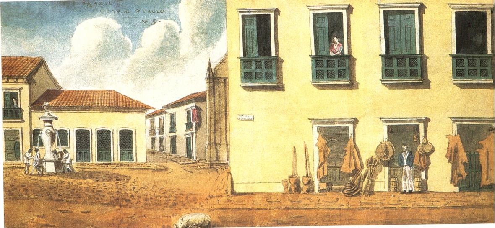
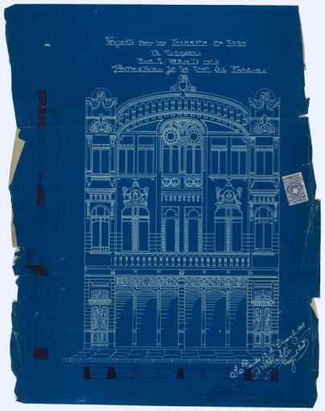
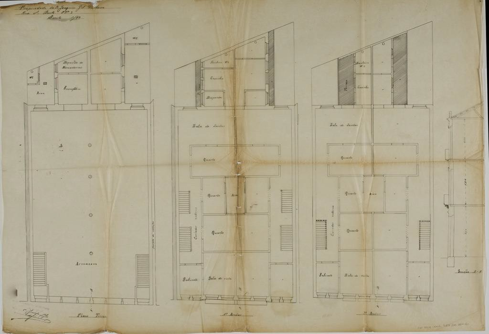
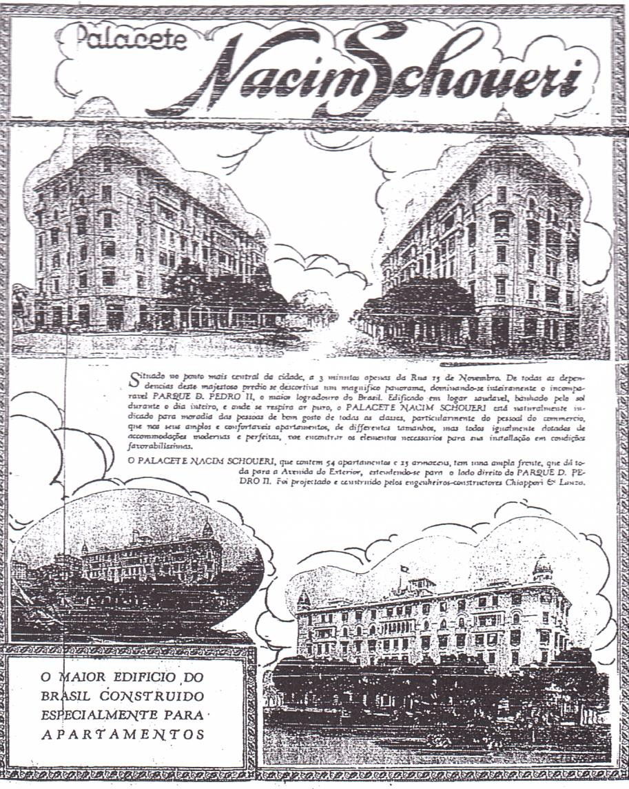
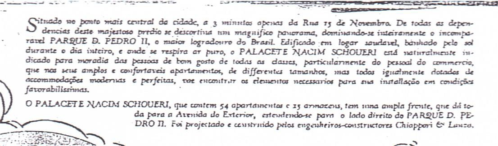

# Eixo temático: Território. Resumo

> A historiografia recente sobre a história da urbanização no Brasil vem
> formulando
>
> novos problemas, variáveis de análise e incluindo novos atores no
> debate, valendo-se das tecnologias da informática (SIG) para
> espacialização de processos sociais no tempo e mapeamento de questões
> em diversas escalas de observação. Estudos estão dando contornos e
> colorido a camadas outrora imprecisas. Neste ensaio, recortamos alguns
> resultados das pesquisas que estamos desenvolvendo nos projetos *A
> cidade como negócio: mercado imobiliário em São Paulo (1809-1914) e
> Índices de urbanização e urbanidade em perspectiva histórica: São
> Paulo, 1765-1914,* ambos financiados pelo CNPQ, e no livro *São Paulo:
> um novo olhar sobre a história. A evolução do comércio de varejo e as
> transformações da vida urbana* (2012). Recuamos no tempo e cotejamos
> *Censos* e *Décimas Urbanas* com a documentação da *Série Obras
> Particulares* do *Arquivo Histórico de São Paulo* (AHSP), dos
> *almanaques, anúncios de jornais, fotos* e *plantas antigas,* com
> vistas a perceber mudanças nos índices de urbanização e de urbanidade
> em perspectiva histórica de longa duração. Ampliamos o escopo para
> espacializar o processo de transformação da cidade, com foco em
> aspectos materiais (programas edilícios, tipologias, áreas mais e
> menos verticalizadas), sociais (proprietários, inquilinos, usos e
> usuários) e imobiliários (áreas mais e menos valorizadas),
> diferenciando por exemplo as modalidades de comércio, identificando o
> lugar dos serviços e reconstituindo territorialidades perdidas no
> tempo e assim índices de urbanidade, numa metodologia até então
> inexplorada pela historiografia.
>
> Palavras-chave: São Paulo, História da Urbanização, Índices de
> Urbanidade, Séculos XVIII -XX.

# Abstract

> Recent historiography on the history of urbanization in Brazil has
> been formulating new problems and variables for analysis as well as
> involving new actors in the debate. Information technology (SIG) has
> been used to spatialize social processes in time and map issues on
> various scales of observation. Studies are providing outlines and
> coloring for previously vague layers. This essay takes some results
> from the research we are developing for the projects: 'The city as
> business: the real estate market in São Paulo (1809-1914)' and 'Levels
> of urbanization and urbanity in historical perspective: São Paulo,
> 1765-1914', both funded by CNPq , and a book called 'São Paulo: a new
> look at its history: the evolution of retailing and the transformation
> of urban life' (2012). We went back in time to compare urban census
> and tithes along with documentation from the 'Private Buildings
> Series' of the São Paulo Municipal Historical Archives (local acronym
> AHSP), almanacs, newspaper advertisements, photos and old plans, in
> order to detect changes in levels of urbanization and urbanity from a
> long-term perspective. We broadened the scope to spatialize the
> process of transformation of the city, focusing on material aspects
> (building programs, typologies, more and less verticalized areas),
>
> social (actors , uses and users) and real estate (most and least
> expensive areas), for example differentiating types of commerce,
> identifying locations of services and reconstituting territorialities
> lost in time and thus levels of urbanity, with a methodology as yet
> unexplored by the historiography.
>
> Keywords: São Paulo, History of Urbanization, Levels of Urbanity,
> 18th-20th centuries.

# Introdução

> *Sistemas de Informações Geo-históricas* (SIGs) permitem reconstituir
> cenários na longa duração. No âmbito de um programa de cooperação
> internacional entre a USP e a Universidade de Lyon -- COFECUB 2013 1 -
> estamos iniciando um projeto de transferência de *know-how* e
> capacitação técnica de pesquisadores na ferramenta SIG. Os *SIG
> Históricos* são fundamentais na espacialização de banco de dados,
> viabilizando a elaboração de cartografias regressivas e temáticas --
> quadra a quadra, rua a rua, lote a
>
> lote - cruzando informações textuais e visuais variadas,
> reconstituindo perfis tanto materiais como sociais. Nossa proposta
> ancora-se no legado de outro projeto de pesquisa em Políticas Públicas
> (FAPESP, 2006- 2010), no qual coordenamos junto com Nestor Goulart
> Reis a informatização de parte dos desenhos arquitetônicos e dados da
> *Série Obras Particulares2* do AHSP (1906-1914), cujos resultados
> estão na *internet*
> ([[www.projetosirca.com.br]{.ul}](http://www.projetosirca.com.br/)) e
> muito facilitam nossa empreitada atual. Esboçamos aqui, em linhas
> gerais, nossa contribuição neste e noutros projetos que estamos
> desenvolvendo sobre São Paulo, apresentando os resultados parciais de
> uma metodologia ainda inédita.
>
> Numa intersecção entre História da Urbanização (REIS, 1999) e História
> da Cultura Material (MENESES, 1980 e 1990), a produção social do
> espaço urbano tem sido objeto de nossas pesquisas, privilegiando
> séries documentais heterogêneas e conexas pouco exploradas pela
> historiografia, alinhavadas em perspectiva histórica de longa duração,
> lote a lote. Nos propomos agora a recuar um pouco mais no tempo,
> voltando ao século XVIII, focalizando aspectos do mercado imobiliário
> rentista em meio a outros, tais como, variáveis que nos permitem
> identificar a dinâmica do processo de urbanização (a partir de quando
> se acelerou) e mudanças nos índices de urbanidade do período colonial
> à Primeira República. O papel da iniciativa privada na produção
> material da cidade e as mudanças na tessitura urbana continuam sendo
> nossas preocupações, só que acrescidas de questões como as
> continuidades e rupturas no perfil dos proprietários dos imóveis, no
> perfil dos usuários e usos, na natureza do comércio e dos
> comerciantes, na natureza dos programas edilícios implantados
> (mesclando moradia, comércio e serviços), na natureza das construções
> e o quanto individualmente desenharam uma paisagem urbana visualmente
> nova e bem construída. Tais preocupações foram parcialmente
> contempladas no livro *"São Paulo: um novo olhar sobre a História. A
> evolução do comércio de varejo e as transformações na vida urbana"*
> (2012), merecedor do Prêmio José Celestino Bourroul-2013 da APH.
> Advogamos a tese de que boa parte das renovações foi obra da
> iniciativa privada, orquestrada e induzida pelo poder público por meio
> de pormenorizada legislação. Malgrado motivados pelos lucros
> prometidos por um mercado imobiliário aquecido, os resultados foram,
> ao nosso ver, de altíssima qualidade, fruto do comprometimento com
>
> 1 «Dinâmicas de urbanização e representações espaciais : abordagem
> geohistórica dos territórios com SIG» - USP COFECUB 2013. Equipe :
> Profs Drs. Iris Kantor (DH-FFLCH-USP, coordenadora), Beatriz Bueno
> (FAUUSP), Fernanda Padovesi (DG-FFLCH- USP), Jaime Oliva (IEB-USP),
> Bernard Gauthier (Université Jean Moulin - Lyon), Enalli di Biagi
> (Université Jean Moulin -- Lyon).
>
> 2 Conjunto dos projetos arquitetônicos submetidos à aprovação da
> Prefeitura por particulares, exigidos desde 1893.
>
> a cidade de todos os elos da cadeia produtiva. Tratava-se de um
> excelente negócio para os proprietários construírem imóveis cada vez
> mais verticalizados e multifuncionais, pois havia demanda, mas as
> obras foram feitas com projetos esmerados, a maioria assinados pelos
> melhores profissionais da época, edificados em conformidade com uma
> legislação urbanística e sanitária que zelava pela qualidade do
> produto (garantindo pé- direito generosos, aberturas fartas, materiais
> construtivos de primeira). Os memoriais e projetos arquitetônicos hoje
> reunidos na *Série Obras Particulares* do AHSP alicerçam tais
> afirmações. Nota-se, além do comprometimento dos proprietários com a
> cidade, o mesmo ocorrer com os usuários dos imóveis. No centro, foi
> estabelecido um comércio refinado pelas mãos de agentes estrangeiros
> que notabilizaram-se pela qualidade dos estabelecimentos e produtos
> ali vendidos (BARBUY, 2006 e BUENO, 2012). Embora os estrangeiros não
> tivessem inicialmente poder aquisitivo para comprar e renovar imóveis
> no perímetro central, foram inquilinos comprometidos na construção de
> uma imagem de cidade "moderna e cosmopolita", obviamente orquestrados
> pela municipalidade que lhes concedia "licenças e alvarás" para
> realizarem seus negócios.
>
> O resultado hoje é um importante patrimônio em vias de dilapidação que
> resiste ao tempo galhardamente a despeito de tanto descaso. Resiste
> porque foi feito sólido, porque foi obra de uma gente antiga que tinha
> apreço pela cidade e lhe retribuía com seu trabalho, mesmo lucrando
> com isso. Esse legado de comprometimento e zelo pela cidade em
> diversos níveis merece ser resgatado do esquecimento e preservado,
> assim como o patrimônio material que lhe é correlato. Eram tempos em
> que construir uma certa "cidade" estava acima dos interesses
> individuais e todos -- iniciativa privada e poder público --
> empenharam-se na qualidade de suas ações individuais. As fachadas dos
> imóveis do centro estampam nomes de famílias e engenheiros-arquitetos,
> eternizados na produção material da cidade. A qualidade dos resultados
> abunda nas fotos e cartões postais da época, motivo de orgulho e
> divulgação -- afinal, tratava-se da "Metrópole do Café" coletivamente
> construída em menos de um século. Os bons resultados se estenderam
> também aos bairros envoltórios, tanto os destinados às elites, como os
> destinados às camadas médias e baixas. Mestrados recentes, como o de
> Sheila Schneck (2010) sobre o bairro do Bexiga e de Lindener Pareto
> Jr. (2011) sobre os práticos licenciados, dão a medida da qualidade
> das construções nas áreas mais afastadas, cuja produção envolveu os
> setores médios da população e projetos assinados por construtores não
> diplomados.

# Recuo estratégico

> O recuo aos Setecentos é metodologicamente estratégico por permitir
> mensurar esse processo de mudança acelerado a partir de fins dos
> Oitocentos. Quando cotejamos os dados estatísticos dos *Censos* (1765,
> 1767, 1776, 1798, 1802, 1804, 1814, 1815, 1817,
>
> 1822, 1836, 1854, 1872), com os dados dos nossos primeiros impostos
> prediais
>
> (*Décimas Urbanas* 1809, 1829, 1876, 1886/1887, 1888/1889), dos
> *almanaques* (1857, 1884 e 1890), dos *jornais* e dos projetos
> arquitetônicos do AHSP (1906-1914), e os espacializamos nas *plantas*
> da cidade (1774, 1844-47, 1881, 1893, 1897, 1905, 1911, 1916 e 1930),
> vemos a mutação progressiva do velho tecido urbano de São Paulo,
> especialmente na virada do século XIX para o XX, quando a área virou
> um verdadeiro canteiro de obras. Surpreende-nos a dinâmica do processo
> de urbanização e o ritmo das mudanças nos padrões de urbanidade desde
> então. O que hoje chamamos de "centro histórico" correspondia ao
> "perímetro urbano" e à zona efetivamente urbanizada em 1809,
> convertendo-se em "perímetro central" a partir de 1914/16 (GLEZER,
> 1994, p. 164), por ocasião da primeira grande expansão da cidade.
>
> O "perímetro urbano" de 1809 foi demarcado em função da *Décima* e
> envolvia somente
>
> as freguesias da Sé e de Santa Ifigênia, apresentando 1.281 imóveis e
> uma população oscilando em torno de 7.000 habitantes (BUENO, 2005 e
> 2008). De 1872 a 1890 a população dobrou, de 31.385 para 64.934
> habitantes, duplicando novamente de 1900 a 1920, de 239.820 para
> 579.033 habitantes. Em paralelo, a cidade se expandiu em todas as
> direções. Nossa memória não imagina o perfil da população e das
> atividades urbanas em tempos tão recuados, e as mudanças na vida
> urbana num curto período de tempo.
>
> A interpretação da *Décima Urbana* de 1809 possibilitou um retrato da
> tessitura de São Paulo antes da sua primeira transformação e expansão,
> indiretamente, lançando luz nos atores sociais detentores dos imóveis
> (BUENO, 2005 e 2008). Espécie de recenseamento por escrito, a
> informatização e espacialização dos dados revelou uma cidade
> constrangida na "colina central", contendo apenas 1.281 imóveis
> predominantemente térreos e residenciais: 86% deles eram casas comuns
> de taipa de pilão (1.047), em meio a apenas 161 sobrados (13%). No que
> diz respeito aos usos, 86% (1051) eram residências, 2% (26) lojas e
> 10% (132) imóveis de uso misto. Curiosamente, 50% (638) das
> edificações destinavam-se à renda de aluguel.
>
> A *Décima* permitiu entrever que, na aparente homogeneidade do
> conjunto, a São Paulo colonial apresentava espaços especializados e
> espacializava o *degradé* social então vigente, contendo áreas mais e
> menos valorizadas. As zonas mais caras eram aquelas junto dos Largos
> da Sé, do Pátio do Colégio e ruas de uso misto a eles contíguas,
> concentrando o comércio e os sobrados da cidade. Já as casas térreas,
> predominantemente de porta e janela, ficavam na extremidade e junto
> das várzeas do Tamanduateí e Anhangabaú. Lote a lote, o estudo
> permitiu falar de mercado imobiliário em tempos recuados, mostrar as
> faces dos principais proprietários dos imóveis -- em geral
> *negociantes* e *mercadores* - algo que a historiografia vinha dando
> pouca ênfase.
>
> As mudanças no perímetro central num curto período de tempo se
> explicam em função das alterações no papel da cidade no contexto da
> Província e depois Estado de São Paulo. Nosso propósito neste ensaio é
> reconstituir parcialmente a feição dos imóveis, os proprietários, os
> inquilinos e as principais atividades desenvolvidas nos imóveis do
> centro, especialmente o comércio e os serviços na longa duração,
> variáveis eleitas para mensurar índices de urbanidade.
>
> **O que revelam *Censos* e *Décimas* sobre as ruas de comércio da
> cidade?**
>
> A historiografia recente sobre a história social e a urbanização no
> Brasil vem incluindo atores outrora invisíveis no debate. Por exemplo,
> a categoria genérica e anacrônica do que hoje denominamos de
> comerciantes vem ganhando refinamento (BORREGO, 2010 e BARBUY, 2006).
>
> *Censos* e *Décimas* permitem resgatar a geografia do comércio e dos
> serviços em fins do período colonial, localizando os *negociantes* e
> *mercadores* (em geral proprietários dos imóveis e envolvidos com o
> comércio atacadista de longa distância) e os diversos segmentos
> relacionados com a *venda a retalho* e os oficiais mecânicos (em geral
> inquilinos).
>
> É preciso salientar que a *Décima de 1809* apresenta os imóveis, os
> proprietários, inquilinos, sua tipologia e localização. Os *Censos*
> não trazem a localização dos imóveis, mas permitem caracterizar o
> perfil social e as atividades dos proprietários e inquilinos, bem como
> o número de escravos e agregados que possuíam. Trata-se portanto de
> documentações complementares e seu cruzamento revela a
> "sociotopografia" (LE GOFF, 1992), isto é a paisagem social da área
> central em tempos pretéritos.
>
> Em 1809, na *Rua Direita*, por exemplo, dos 45 imóveis 20 eram
> sobrados (14 de uso misto: 12 de 1 loja e 1 andar; 1 de 2 lojas e 1
> andar; 1 de 1 loja e 2 andares). Apenas 6 eram exclusivamente
> residenciais, em meio a 18 prédios térreos (12 casas térreas

simplesmente, 4 térreas de 2 lanços, 2 lojas). Os sobrados (n. 1 a 6, 8,
10, 11, 14, 21,

31, 34, 36, 37, 38, 39, 40, 43, 45) concentravam-se próximos ao Largo da
Sé, nas esquinas, entremeando-se com casas e lojas térreas. Segundo vem
revelando as pesquisas ainda inéditas do doutorando Nelson Braghittoni,
muitos desses sobrados eram oriundos do século XVIII, herdados de
importantes clãs de comerciantes setecentistas (BORREGO, 2010): Gaspar
de Matos, Manuel Veloso, José Goes e Moraes, Manoel Mendes de Almeida e
Angela Vieira.

A *Rua Direita* reunia o mais expressivo conjunto de *negociantes*,
preferencialmente os de *fazendas secas* (tecidos). O *Censo* de 1798
revela que havia um único *negociante de ferragens*, um único
*negociante de molhados*, além de traficantes de escravos, senhor de
engenho, negociante de açúcar e café e tropeiros. No século XVIII e
início do XIX, a maioria deles ali habitava e, por vezes, também ali
exercia suas atividades mercantis. Entre os *negociantes* havia, por
exemplo, Joaquim Jozé de Oliveira (n. 3, sobrado de 1 loja e 1 andar,
uso próprio; n. 44, térrea e fechada) que também aparece na *Décima* de
1809 como inquilino de D. Anna de Almeida na Rua do Comércio n. 25, num
sobrado de 5 lojas e 1 andar, alugando provavelmente uma das lojas para
desdobramento do seu negócio, o que significa que tinha lojas em dois
endereços. *Negociantes de fazenda seca* do Rio de Janeiro havia o
Guarda-mor Vicente Ferreira de Oliveira (n.1, sobrado de 1 loja e 1
andar, uso próprio), Manuel Gonsalves dos Santos e João Garcia da
Fonseca (n. 41, térrea) e o Cel. Joaquim Jozé Pinto de Moraes Leme (n.
23, sobrado). *Negociante de escravos* e *senhor de engenho* (com
fábrica de açúcar em Jundiaí) havia o Cel. Joaquim Jozé dos Santos (n.
10, sobrado de 1 andar, uso próprio; n. 24, sobrado fechado).
*Negociante de açúcar e café* encontramos Jose Manuel de Sá (n. 45,
sobrado de 1 loja e 1 andar). *Negociante de ferragens* havia José Pinto
Tavares (n. 8, sobrado de 1 loja e 1 andar, uso próprio) que também era
proprietário de outro sobrado de 1 loja, 2 corredores e 1 andar na Rua
do Comércio n. 31, cujo corredor estava alugado. *Negociante de
molhados* ali estava solitário Manuel Joaquim de Vasconcellos (n. 9,
loja). A rua mesclava diversos usos como se pode ver, inclusive
*tropeiros* que traziam bestas do Rio Grande do Sul e Curitiba para as
feiras de Sorocaba, tais como Jozé Francisco de Salles (n. 21, sobrado
de 1 andar) e Jozé Vaz de Carvalho (n. 31, sobrado uso próprio; n. 32
térrea cedida de favor para a sogra; n. 35 térrea alugada) que consta na
*Lista Nominativa* de 1798 como coronel e morando na *Rua Direita* com a
mulher, 4 filhos e 37 escravos. Na *Rua Direita* aparecem também como
proprietários de imóveis alguns dos poucos Bacharéis de Direito da
cidade e ricas senhoras (viúvas ou solteiras) que viviam da renda de
aluguel de seus imóveis e dos escravos de ganho. Bacharéis de Direito
encontramos Dr. Manuel Eufrazio de Azevedo Marques (n. 37, sobrado
alugado) e o Dr. Nicolao Pereira de C. Vergueiro (n. 14, sobrado
alugado). Senhoras havia D. Gertrudes Velozo (n. 22, térrea, onde morava
com suas 2 irmãs solteironas) e D. Maria Francisca de Jesus (n. 26,
vivendo de favor). A maioria dos imóveis estava ocupada, à exceção de um
único terreno, um em obras, um arruinado e por isso inabitável, um
fechado e um habitado gratuitamente.

Na *Rua do Comércio* (atual Álvares Penteado), por sua vez, constam 14
prédios no lado esquerdo e 20 do lado direito, totalizando 34 imóveis
(10 sobrados e 24 térreos). Fazendo jus à alcunha, na rua predominavam
imóveis de uso misto: só 5 eram exclusivamente residenciais. A toponímia
revela a presença marcante de um certo tipo de comércio, como se verá
estabelecimentos de naturezas diferentes daqueles da rua Direita. Havia
imóveis contendo 4 ou 5 lojas, alugadas para diversos inquilinos. Os
nomes dos proprietários são menos conhecidos que os da rua Direita,
envolvendo provavelmente comerciantes relacionados com a *venda a
retalho*. As patentes militares também indicam tratar-se de um segmento
social inferior. Destacam-se o Tenente

Coronel Matheos da Silva Bueno, residindo numa casa térrea de 2 lanços
(n.18) e proprietário de 1 loja e 1 lanço (n. 30) alugada para o Capitão
Jozé de Freitas Saldanha, assim como o Sargento-mor Jozé Vaz Francisco
(n. 19). Outros comerciantes também ali dispunham de imóveis para uso
próprio ou renda de aluguel, tais como Anastácio de Freitas Trancozo
(térrea n. 10, uma loja e 1 lanço, alugada), Agostinho dos Santos
Portela (térrea e 1 lanço, n. 17), José Antônio da Silva Paulista
(sobrados de 1 loja e 1 andar n. 20 e 21), Manuel Lopes Coimbra (térrea
de 1 loja e 1 lanço, n. 27), Jose Pinto Tavares (1 loja, 2 corredores e
1 andar, n. 31), este último *negociante de ferragens.* José Pinto
Tavares provavelmente usasse parte desse imóvel (só um corredor estava
alugado) para renda de aluguel, pois parece que a matriz dos seus
negócios ficava junto da sua morada na rua Direita n. 8 (sobrado de 1
loja e um andar, uso próprio). Tipologia recorrente na rua do Comércio,
o imóvel de José Pinto Tavares apresentava dois corredores, um dos quais
alugado para Francisco Vitorino de Saopaio, sendo que a "loja e o
primeiro andar não tiveram alugador algum". Na *Rua do Comércio* aparece
portanto uma tipologia nova, a de *imóvel térreo com loja e um corredor*
ou *sobrado com loja e dois corredores*. Por vezes, só o corredor
aparece alugado. Do que se trata? Ainda não podemos afirmar.

> 
>
> Fig. 1 -- Edmund Pink. *Sketch in the city -- O Palácio da Sola*,
> 1823. Aquarela, 18,5 x 40 cm. BM & FBOVESPA S.A. Típica loja na rua do
> Comércio em São Paulo.

O cruzamento de *Décima* e *Censo* permite espacializar comerciantes
menores outrora invisíveis. Revela também que outro ramo de atividades
mercantis concentrava-se na Travessa do Comércio (depois chamada de Rua
da Quitanda), envolvendo 13 imóveis térreos, 4 de uso misto e 1 loja.
Eram certamente quitandas, vendas, tavernas e botequins, daí o nome dado
posteriormente ao logradouro. *Gêneros da terra*, *molhados* e
mantimentos eram comercializados também na *Travessa das Cazinhas*
(atual Rua do Tesouro), na qual mesclavam-se 7 sobrados a imóveis
térreos e às tais dez *Cazinhas* pertencentes à Câmara e arrematadas por
Jozé Mendes.

Por fim, na *Rua do Rosario a Boa Vista*, atual XV de Novembro,
encontramos 73 imóveis, dentre os quais apenas 13 sobrados (8 de uso
misto), 7 lojas e 12 casas térreas de uso misto. Portanto ali se
concentravam ao menos 32 estabelecimentos comerciais, certamente um
pouco mais, pois as lojas estavam muitas vezes alugadas para mais de um
inquilino, fato recorrente no período e subsequentes. Um caso
interessante é o de Joaquim Jozé da Silva, proprietário de 5 lojas e um
andar, parecendo usar somente uma

delas e o andar, pois as demais aparecem alugadas para pessoas
diferentes. Ele era ainda proprietário de dois outros imóveis na rua do
Comercio n. 3 e 4 (térrea e térrea de 1 lanço), ambos alugados. O valor
do aluguel de cada loja era 1\$280 réis por mês, o que nos permite
inferir que as lojas eram alugadas por uma quantia paga mensalmente,
como hoje, e nas ruas de comércio havia um preço médio de aluguel sempre
abaixo dos da rua Direita, a mais cara da cidade, concentrando os
coronéis e *negociantes* mais importantes.

O *Censo* de 1798 revela a origem e destino dos produtos comercializados
nas ruas supracitadas: de Curitiba-Sorocaba com destino a Mato Grosso e
Goiás levavam-se bestas e fazendas secas (tecidos); de Itú e Campinas
provinha o açúcar, o café e o anil, o primeiro embarcado em parte para
Lisboa; de Jundiaí e arredores, vinham os mantimentos; do Rio de
Janeiro, escravos, boticário, farinha, fazendas, ouro e outros negócios;
de Santos, molhados, fazendas e peixes. O *Censo* de 1798 revela a
quantidade e heterogeneidade dos estabelecimentos comerciais: 22
quitandas; 10 vendas de produtos da terra; 4 vendas de produtos da terra
e de fora; 1 venda de louças da terra/quitanda; 4
vendas-botequim-botica; 1 venda-engenho; 2 vendas-gado; 1 venda- café.
Revela também outras atividades urbanas predominantes: 1 advogado; 6
barbeiros- cabelereiros; 1 caixeiro; 8 carpinteiros-marceneiros; 66
costureiras; 3 ferreiros-

ferradores; 16 funcionários públicos; 20 religiosos; 15 jornaleiros; 4
lavadeiras; 5 ourives; 7 professores; 26 sapateiros-alfaiates; 2
seleiros. Revela também que se os negociantes situavam-se sobretudo na
Rua Direita e as vendas e quitandas sobretudo na Rua e Travessa do
Comércio, na direção do Largo de São Gonçalo ficavam os celeiros-
ferradores-ferreiros, bordadeiras-rendeiras e as costureiras (SANTOS,
2013, p. 123- 125), portanto os serviços, em geral deslocados para as
bordas da cidade.

# Palimpsesto: a cidade de tijolo sobre a da taipa de pilão

Marcos Rios (2005) ensaiou uma metodologia piloto no estudo do caso da
Rua XV de Novembro, sobrepondo dados da *Décima* de 1809 aos do Arquivo
Aguirra, dos projetos arquitetônicos da *Série das Obras Particulares*
do AHSP e do Piqueri, a fotos antigas, espacializando-os nas plantas
cadastrais do período. As pesquisas do doutorando Nelson Braghittoni
seguem a mesma orientação metodológica, elegendo a Rua Direita como
campo operatório, lote a lote, só que ampliando o recorte temporal para
o século

XVIII\. Em ambos, nota-se que alguns lotes mereceram três ou até quatro
edificações num curto período de tempo. Edifícios de tijolos e uso misto
passam a mesclar salas de escritórios e consultórios, moradias, lojas,
charutarias, restaurantes e cafés, substituindo os imóveis de taipa de
pilão do período colonial.

As atividades terciárias exigidas pela "Metrópole do Café" cresceram
exponencialmente. Entre 1776 e 1883, a cidade passou de 207 indivíduos
envolvidos com o setor para 1.055 (em 1798), 1.916 (em 1836) e 36.901
(em 1893). Em 1883, São

Paulo contava com 69 advogados, 32 médicos-cirurgiões, 10 engenheiros, 3
agrimensores, 33 empreiteiros de obras e 4 mestres de obras. De 130
casas de comércio existentes em 1883, passou para 5.832, em 1921/1922
(292 de artigos de importação,

106 confeitarias e pastelarias, 22 perfumarias, 86 joalherias, 32
relojoarias, 62 papelarias, 152 charutarias, 15 casas importadoras de
automóveis, 30 estabelecimentos bancários, além de diversos hotéis)
(BUENO, 2012, p. 36).

A dinâmica de mutação da cidade é incomum e nossa tese é que o
investimento estatal foi bastante inferior ao do capital privado,
responsável pela concreta destruição e reconstrução do velho centro de
taipa-de-pilão e introdução de novos usos e hábitos urbanos nos espaços,
desde então um excelente negócio (BUENO, 2010).

Dados (BUENO, 2008) evidenciam um explosivo aumento dos preços dos
terrenos no

"triângulo central" (Ruas XV de Novembro, Direita e São Bento) entre
1916 (1.000\$000 réis o m2), 1936 (4.500\$000 réis o m2) e 1943
(8.000\$000 réis o m2), o que é produto e vetor (numa relação dialética)
da contínua aceleração das transformações arquitetônicas e urbanísticas
e especialização ali do comércio e dos serviços de luxo. Constatou-se
que o valor do m2 no "triângulo" era altíssimo comparativamente às
outras zonas da cidade. Em 1914, o m2 nas ruas XV de Novembro, Direita e
S. Bento tinha um valor médio de 1:000\$000 réis, ao passo que nos
arredores imediatos decaía para 165\$000 réis, chegando a 23\$500 réis o
m2 no "perímetro urbano" abaixo da "colina". No "perímetro suburbano"
chegava a 3\$000 réis o m2, atingindo o valor de 100 réis no "perímetro
rural" (BRITO, 1938). Também o valor locatício tornou-se muito atraente
na área central, chegando a ser dezesseis vezes mais alto que na
periferia da cidade. Esses dados explicam o interesse dos estratos
sociais de maior poder aquisitivo em investir no centro, construindo
imóveis de aluguel cada vez mais verticalizados. Explica, inclusive, o
interesse do poder público (integrado por membros dessa mesma elite
financeira) em investir em grandes obras de *embelezamento e
melhoramentos urbanos*.

Na linha dos estudos de Heloísa Barbuy, pudemos constatar em incursões
aos *Almanaques* que o comércio a partir de 1870 foi obra
predominantemente de estrangeiros, deixando os velhos "portugas" para
trás.

Na *Décima Urbana* de 1809 ficou claro que no período colonial o
*negociante* e o *mercador* reuniam num único imóvel moradia e *loja*,
em geral sendo proprietário dele. O *Imposto Predial de 1876* revela que
apenas Adolpho Nagel, Gustavo Sydow e Henrique Fox eram estrangeiros
proprietários de imóveis no centro. A velha oligarquia segue sendo
proprietária dos principais imóveis dali, mesclando-se muito
paulatinamente a segmentos estrangeiros vinculados a ramos mais
rentáveis, como ferrovias por exemplo. Esse é o caso de Guilherme Rudge,
solitário em meio ao baronato predominante -- Barão de Itapetininga,
Barão de Piracicaba, Barão da Silva Gameiro, Barão de Sousa Queiroz,
Barão de Tietê, Barão de Três Rios, Baronesa de Limeira -- e a nomes
expressivos como o de Manoel Rodrigues Jordão e Manoel Rodrigues
Villares (Imposto Predial de 1876).

No *Imposto Predial de 1886* vemos o universo ampliar-se, mas
comparativamente aos dados publicados no *Almanaque de 1890* (BUENO,
2012, p. 37) poucos estrangeiros inserem-se na lista de proprietários no
centro, predominando ainda a velha oligarquia paulistana. Exceções são:
João Adolpho Schritizmeyer, Domingos Paiva de Azevedo, José Elias Paiva,
Luiz Bamberg, Adolpho Nagel, Henrique Luiz Levy e Jorge Seckler, só para
citar os mais conhecidos. Em 1886, o centro parece manter-se nas mãos de
um grupo social antigo, muitos dos nomes identificáveis desde a *Décima
de 1809*: Barão de Piracicaba, Visconde de Vergueiro, Francisco José de
Sampaio, José Antônio de Oliveira Mendes, Anna Brandina Prado Pereira
Pinto, Maria da Glória Moura Jordão, Dr. Raphael Tobias de Aguiar, Conde
de Três Rios, Maria Cantinho Gavião Peixoto, Visconde de São Joaquim,
Barão de Souza Queiroz, Antônio Pinto do Rego Freitas, Baronesa de
Limeira, Bernardo Avelino Gavião Peixoto, Raphael Aguiar Paes de Barros,
Barão de Souza Queiroz, Conselheiro Antônio da Silva Prado, Elias
Antônio Pacheco Chaves, Eleutério da Silva Prado, Firmino José Barbosa,
José Arouche de Toledo, Eduardo Prates, só para citar alguns, em meio às
Ordens religiosas e irmandades laicas -- Convento do Carmo, Santa Casa
de Misericórdia, Ordem Terceira do Carmo, Santo Antônio, Recolhimento de
Santa Teresa, Mosteiro de São Bento.

Na *Série Obras Particulares* (1906-1914) o número de prédios para os
quais foi solicitada autorização da Prefeitura para construção por
comerciantes estrangeiros elevou-se consideravelmente, embora ainda
muito aquém dos estabelecimentos

publicados nos *Almanaques*. Comerciantes que solicitaram autorização de
construção ou reforma no período estudado foram: Worms Irmãos, Luiz
Bamberg, Antonio Luiz Garraux, Camisaria Especial, P. Birelmayer e
Carlos Castellões, Fasano e Fazzini, Brasserie Paulista, Alcides
Pertica, Luiz Levy, Carvalho Ramos & Cia, Silvestre Noschese, o
boticário Gustavo Shaw, Falchi Gianini e Cia, Oppenheim e Cia, Pharmacia
Faraut, Comp. Brazil Express -- Messenger Company, Heydenreich & Irmãos,
Bloch (Frères) e Cia, Cia de Industria e Comercio Casa Tolle, Firma
Guinle e Cia, Pharmacia Ipiranga, Enrique Paiva, Loja Marcondes
Piratininga, Weissflog Irmãos

& Cia, Luiz Médici, Baruel e Companhia, Casa Fretin, L. Grumbach & Cia,
Casa " Ao Preço Fixo", Guilherme Rathsam, Jorge Fuchs e Comp., entre
outros desconhecidos. Nossa hipótese é que esses
comerciantes-proprietários eram os usuários tanto das lojas como das
moradias construídas nos andares superiores dos seus imóveis, mantendo
uma tipologia recorrente no período colonial, a qual estavam habituados
nas suas cidades de origem.

O descompasso entre o número de estabelecimentos divulgados nos
*Almanaques* e aquele publicado nas listas de *Imposto Predial* ou na
*Série Obras Particulares* evidência que a maioria dos comerciantes --
majoritariamente estrangeiros - não dispunha de capital para comprar ou
construir, alugando de terceiros tanto as lojas como os apartamentos que
estavam sendo edificados ao gosto eclético francês no centro. Barbuy
salienta a permanência das moradias nesses novos edifícios do início da
Primeira República, diminuindo posteriormente. Habituados a morar no
centro das cidades de onde vieram, junto de seus negócios, ao que tudo
indica, seguiram o mesmo padrão no Brasil (mantendo contíguos moradia e
trabalho), na contramão da elite social e econômica local que aderiu aos
novos bairros exclusivamente residenciais dos subúrbios. Ao nosso ver,
foram os estrangeiros majoritariamente os locatários tanto das lojas
como de uma nova tipologia de apartamentos projetada no perímetro
central, sobretudo a partir de 1902, nos edifícios de uso misto. As
plantas localizadas no AHSP evidenciam a presença recorrente desse
programa edilício, só não sabíamos a que público se destinava.

> 
>
> 
>
> Fig. 2 -- Projeto para Joaquim Gil Pinheiro. Arquiteto: Maximilian
> Hehl, Rua São Bento
>
> n\. 2. *Série Obras Particulares*, 1908, AHSP. Tipologia recorrente no
> centro, mesclando comércio e moradia.
>
> A seriação da documentação sugere ainda que, nessa época, a velha
> oligarquia paulistana (junto de uns poucos imigrantes endinheirados
> vinculados ao comércio, às fábricas -- Matarazzo e Duchen --, aos
> loteamentos -- Nothmann, Glette e Germaine Burchard -- e as ferrovias)
> segue sendo a proprietária dos imóveis e promovendo a sua demolição e
> reconstrução, sendo os comerciantes -- em geral estrangeiros -- na sua
> maioria inquilinos das lojas e dos modernos apartamentos ainda não
> incorporados ao gosto da oligarquia e das camadas médias nacionais
> acostumadas a morar em moradias individuais.
>
> A propaganda imobiliária veiculada nos jornais corrobora essa
> hipótese. O discurso publicitário buscava qualificar tais
> empreendimentos assemelhando-os a um "palacete" e aludindo ao discurso
> higienista, ideias associadas ao conceito de "progresso" e
> "modernidade" então em vias de afirmação. Interessante é o caso do
> "Palacete Nacim Schoueri", construído em 1930, destinado
> "particularmente ao pessoal do comércio" - situando-se a "3 minutos
> apenas da rua Quinze de Novembro". Embora destinado aos comerciantes,
> visava atingir "todas as classes", muitas ainda não afeitas a esse
> novo programa de habitação coletiva.
>
> 
>
> Fig. 3 -- "Palacete Nacim Schoueri". *O Estado de São Paulo*, 02 fev.
> 1930. Edifício de apartamentos e lojas, destinado principalmente ao
> "pessoal do comércio".
>
> 

# Referências bibliográficas

BARBUY, H. *A cidade-exposição.* Comércio e Cosmopolitismo em São Paulo,
1860- 1914. São Paulo: EDUSP, 2006.

> . Seguindo Militão pelas ruas da cidade. In: *Militão Augusto de
> Azevedo.*

São Paulo: Cosac Naify, 2012.

BORREGO, M. A. de M. *A teia Mercantil.* Negócios e poderes em São Paulo
colonial (1711-1765). São Paulo: Alameda, 2010.

> BRITO, R. C. *Cadastro Imobiliário de São Paulo 1937-1938.* São Paulo:
> União Paulista de Imprensa, 1938.

BUENO, B. P. S. Tecido Urbano e mercado imobiliário em São Paulo;
metodologia de estudo com base na Décima Urbana de 1809. *Anais do Museu
Paulista:* História e Cultura Material, n.13, p. 49-99, 2005.

. Questão fundiária e imobiliária na história da cidade colonial e
imperial: estudo comparativo de São Paulo e Santos (1809-1840). *Anais
do IX SHCU*, FAUUSP, set. 2006.

> . *Aspectos do mercado imobiliário em perspectiva histórica. São
> Paulo, 1809-1950.* São Paulo: FAUUSP, 2008.

. A cidade como negócio: mercado imobiliário em São Paulo no século XIX.
In: FRIDMAN, F; ABREU, M. (orgs.). *Cidades Latino-Americanas.* Um
debate sobre a formação de núcleos urbanos. Rio de Janeiro: Casa da
Palavra: FAPERJ, 2010, p. 145-165.

GLEZER, R. São Paulo, cem anos de perímetro urbano. *História* (São
Paulo), v. 13, p. 155-166, 1994.

LE GOFF, J. *O apogeu da cidade medieval.* São Paulo: Martins Fontes,
1992. MENESES, U. B. de. "O objeto material como documento", aula
ministrada no curso "Patrimônio cultural: políticas e perspectivas",
organizado pelo IAB/ CONDEPHAAT em 1980. Mimeo.

> . *Plano Diretor do Museu Paulista da USP*, 1990.

PARETO Jr., L. *O cotidiano em construção*: os "práticos licenciados" em
São Paulo (1893-1933). Dissertação (Arquitetura e Urbanismo) -- FAUUSP,
2011.

> REIS, N. G. Notas sobre a evolução dos estudos de História da
> Urbanização e do Urbanismo. *Cadernos de Pesquisa do LAP,* n. 29,
> 1999.
>
> . *São Paulo: Vila, Cidade e Metrópole*. São Paulo: Via das Artes,
> 2004.
>
> RIOS, F. M. C. *Uma Rua em Três Tempos:* o caso da XV de novembro em
> São Paulo (1809-1954). Iniciação científica (Arquitetura e Urbanismo)
> -- FAUUSP, Bolsa FAPESP: - Período: 03/2005 - 12/2005. 14a. SIICUSP
> --- MENÇÃO HONROSA - PRÊMIO VIAGEM INTERNACIONAL".

SANTOS, A. C. *Em obras*: os trabalhadores da cidade de São Paulo entre
1775 e 1809. Dissertação (Arquitetura e Urbanismo), FAUUSP, 2013.

> SCHNECK, S. *Formação do bairro do Bexiga em São Paulo:* loteadores,
> proprietários, construtores,, tipologias edilícias e usuários
> (1881-1933). Dissertação (Arquitetura e Urbanismo) -- FAUUSP, 2010.

TOLEDO, B. L. de. *São Paulo*: três Cidades em um século. 2ª ed. São
Paulo: Duas Cidades, 1983.
