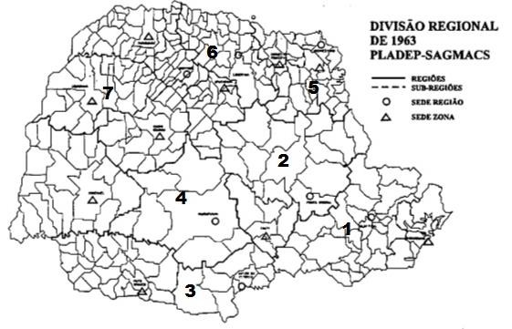

# Resumo

Com o passar do tempo os planejadores perceberam que somente o
planejamento urbano não era o suficiente para organizar as cidades e que
precisavam trabalhar em uma escala maior, desta forma, o planejamento
regional veio suprir esta necessidade. E foi nesse contexto durante o
governo de Ney Braga, em 1963, que a Companhia de Desenvolvimento
Econômico do Paraná -- CODEPAR, contrata a empresa de consultoria
Sociedade de Análises Gráficas e Mecanográficas Aplicadas aos Complexos
Sociais -- SAGMACS. A finalidade era de elaborar o Plano de
Desenvolvimento do Paraná (1964-1970). O Plano não foi implantado, mas
teve grande importância na reestruturação da administração pública do
Estado. Entre os vários documentos elaborados do Plano, um dentre eles,
nomeado de Comunidades Territoriais do Paraná procurou desenvolver os
principais polos urbanos regionais e criar condições de desenvolvimento
urbano nas cidades paranaenses. Apoiado nos estudos de história do
planejamento regional e paranaense, este trabalho busca analisar este
documento que considerado um dos mais importantes para o desenvolvimento
do Plano, que iniciou o planejamento regional no Estado do Paraná.

Palavras-chave: planejamento regional, Plano de Desenvolvimento do
Paraná, CODEPAR, CEPAL, SAGMACS, Paraná

# Abstract

Over time the planners realized that only the urban planning was not
enough to organize cities and they needed to work on a larger scale,
thus the regional planning came to fulfill this need. It was in this
context during the government of Ney Braga in 1963, the Economic
Development Company of Paraná - Codepar , hires the consulting Society
of Graphical Analysis and Mecanográficas Applied to Social Complex -
SAGMACS . The purpose was to prepare the Development Plan of Paraná (
1964-1970 ) . The Plan has not been implemented, but had great
importance in the restructuring of the public administration of the
State. Among the various documents drawn up the plan, one of them, named
Territorial Communities Paraná sought to develop the major regional
urban centers and create conditions for urban development in Paraná
cities. Supported in studies of the history of regional planning and
Paraná, this paper seeks to analyze this document considered one of the
most important for the development of the Plan, which began regional
planning in the State of Paraná.

Keywords : regional planning, Development Plan of Paraná , CODEPAR ,
CEPAL , SAGMACS, Paraná

# Introdução

O planejamento urbano se tornou insuficiente para atender os problemas
das cidades, assim visando trabalhar em uma escala maior foi criado o
planejamento regional. A ciência regional apoiou-se nos mesmos
fundamentos do planejamento urbano, ainda que sua criação ocorresse em
décadas depois. A mudança na escala de análise tinha como objetivo
traçar as fronteiras das regiões, hierarquizar as cidades em redes,
desenhar as estruturas urbanas, descrevendo uma realidade e fixando
normas. A ciência e o planejamento regional surgiram graças ao
desenvolvimento de burocracias

econômicas, dos governos centrais e regionais, das fundações privadas ou
dos organismos internacionais. Assim o planejamento estratégico,
apareceu graças às mudanças de orientação das burocracias precedentes e
pela necessidade de negociar decisões públicas com grupos econômicos e
organizações populares, caso as instituições tivessem dispostas a
suscitar e financiar suas demandas de pesquisas (TOPALOV, 1991).

E foi nesse cenário, que durante o governo de Ney Braga, em 1963, a
Companhia de Desenvolvimento Econômico do Paraná -- CODEPAR, idealizada
com influência da CEPAL- Comissão Econômica para a América Latina, com
objetivo de realizar o Projeto Paranaense de Desenvolvimento1, contrata
a empresa de consultoria Sociedade de Análises Gráficas e Mecanográficas
Aplicadas aos Complexos Sociais -- SAGMACS para trabalhar em conjunto
com a Comissão de Planejamento Econômico do Estado -- PLADEP. A
finalidade era de elaborar o Plano de Desenvolvimento do Paraná
(1964-1970), onde os objetivos principais eram: assistência à saúde e
educação

da população; apoio ao associativismo, à diversificação agrícola e à
criação de indústrias e de distritos industriais de transformação
agrícola, metalúrgica, mecânica e farmacêutica nas regiões de Londrina;
Maringá; Ponta Grossa e Curitiba; aumento da produção de energia
elétrica; proteção ao café e aos recursos florestais e apoio à
reformulação funcional e estrutural dos quadros governamentais. O Plano
não foi implantado, mas teve grande importância na reestruturação da
administração pública do Estado (IZEPÃO e TARTAGLIA FILHO, 2009)**.**

Entre os vários documentos elaborados do Plano, um dentre eles, nomeado
de Comunidades Territoriais do Paraná procurou desenvolver os principais
polos urbanos regionais e criar condições de desenvolvimento urbano
equilibrado para as cidades paranaenses. Desta forma, através da
história do planejamento regional e paranaense este trabalho tem por
objetivo analisar este documento que iniciou o planejamento regional no
Estado e foi considerado um dos mais importantes para o desenvolvimento
do Plano.

# Planejamento Regional

É uma fase mais adiantada nos processos mais especializados ou isolados
de planejamento agrícola, industrial e urbano. Pois, corresponde
conscientemente à integração coletiva de todas as atividades que se
baseiam no uso da terra. Na medida em que tais atividades se acham
concentradas dentro de regiões definidas. O planejamento regional pode
ser dividido em quatro fases, a primeira o levantamento, o segundo o
resumo crítico das necessidades e atividades em termos de ideais e
propósitos sociais, a terceira a reconstrução e projeção do que foi
imaginado. Esses três aspectos principais do planejamento devem seguir
para um estágio final, ou seja, a quarta fase que implica na absorção do
plano pela comunidade e a sua tradução em termos de ação, por meio dos
agentes políticos e econômicos apropriados. Nesta etapa, o plano passa
por uma readaptação, conforme se defronta com as tradições, convenções,
resistências e até com oportunidades inesperadas. Nenhum plano pode
prever todas as contingências automaticamente. Os planos regionais devem
assegurar na sua constituição os meios para futuros ajustes (MUNFORD,
1938).

> 1 Foi um projeto de caráter desenvolvimentista e suas diretrizes
> obedeceram a critérios técnicos de acordo com o interesse coletivo de
> promover a industrialização do estado. Propunha a independência
> econômica do Paraná em relação à região Sudeste, particularmente em
> relação ao estado de São Paulo. Além da criação das empresas estatais
> para atuarem nos setores estratégicos (GOMES, 2010).

Assim como o planejamento governamental se realiza nos níveis, nacional,
regional e municipal, da mesma forma os órgãos de planejamento devem
existir em cada um desses níveis. Esses órgãos devem ser de duas
espécies: consultivos e técnicos. Os primeiros devem se preocupar em
orientar o poder público na formulação dos objetivos gerais a serem
atingidos, dando o ponto de vista dos diversos setores governamentais e
privados sobre os problemas do estudo, e coordenando os diferentes
programas. Já o segundo, que seriam os órgãos técnicos estaduais ou
regionais de planejamento, por sua vez, deveria: elaborar os estudos
básicos; fornecer as diretrizes regionais de planejamento aos órgãos
locais de planejamento e urbanismo; fazer a articulação com que outros
órgãos estaduais e regionais; elaborar planos estaduais e regionais, que
se integrassem com o planejamento local; orientar os governos estaduais
e os órgãos de ação regional em relação à distribuição de auxílio
técnico e financeiro aos Municípios, dando prioridade para obras que
dependessem do auxílio do governo estadual; promover a criação de órgãos
locais de planejamento e urbanismo que servissem como órgão técnico
consultivo; oferecer aos governos locais assistência técnica para
elaboração de planos-diretores municipais e regionais e definir padrões
mínimos para o desenvolvimento social, econômico e cultural da
população, observando as características regionais (MELLO E MODESTO,
1965).

No início, o planejamento regional no Brasil era realizado às vezes por
uma obra de engenharia, outras por interesses financeiros, entretanto,
poucas vezes com base em uma análise integral com uma proposta adequada
para a solução dos problemas a serem resolvidos (PROCHNIK, 1965). Mas
foi a partir dos anos 40, que profissionais como Prestes Maia, Anhaia
Melo e Padre Lebret, influenciaram a atuação dos urbanistas paulistanos
e de outros estados no planejamento urbano. Tanto Anhaia Mello quanto
Lebret preconizavam a abordagem da cidade no âmbito regional, com a
contenção do crescimento e a descentralização, mas somente o último
trouxe para o centro do debate a questão social (FELDMAN, 2005). E isso
fica evidente ao analisarmos o Plano de Desenvolvimento do Paraná,
elaborado pela SAGMACS (1963) que faz parte do objeto desta pesquisa.

# Sagmacs

O padre francês Louis-Joseph Lebret fez sua primeira viagem para o
Brasil, em 1947 e neste período fundou, em São Paulo, o Movimento de
Economia e Humanismo e a SAGMACS, uma instituição pioneira em
consultoria que até 1963, realizou um conjunto significativo de
pesquisas e estudos. E são esses estudos que introduziram efetivamente
as teorias e metodologias decorrentes da doutrina de Economia e
Humanismo, contribuindo para a formação de um novo paradigma que
influenciaria um contingente de profissionais do planejamento urbano e
regional no Brasil (LAMPARELLI, 1998).

A SAGMACS foi constituída como braço institucional de Economia e
Humanismo, no Brasil, sendo uma instituição destinada a formar uma
mentalidade de planejamento que estabelecesse a planificação. Desde
unidades territoriais elementares até o conjunto maior, sem criar um
modo único de planificação, mas, sim, uma variedade que levasse em conta
as possibilidades, as estruturas, os tipos de necessidade, os estágios
técnicos e culturais, a qualidade e intensidade dos esforços espontâneos
ou a serem incrementados, de cada caso singular. Para isso, utilizou o
mesmo método usado por ele em outras realidades e ocasiões, ou seja,
observação, análise dos dados, investigação das causas, assessoramento
das necessidades, elaborando, assim, programas e projetos, treinando
pessoas comprometidas e qualificadas para a

> mobilização dos lugares de poder e decisões (DOUSTDAR, 2010).
>
> No ano de 1952, o então governador de São Paulo, Lucas Nogueira Garcez
> faz o convite para que Lebret voltasse ao Brasil, para a implantação
> de um trabalho confidencial (ANGELO, 2010). Mais tarde este trabalho
> ficou conhecido como Comissão Interestadual da Bacia Paraná-Uruguai --
> CIBPU2, e teve parceria com a SAGMACS, até o início de 1960. Formada
> através de um convênio entre os Estados de São Paulo, Santa Catarina,
> Paraná, Mato Grosso, Rio Grande do Sul, Goiás e Minas Gerais, atuou no
> planejamento regional no Brasil no período de 1951-1972
>
> (CHIQUITO, 2011).
>
> Anos após a SAGMACS realizar planos para São Paulo, e o Paraná já ter
> contato com a empresa de consultoria por intermédio da CIPBU, somente
> em 1963, durante mandato do então governador Ney Braga é que é chamada
> para fazer o I Plano de Desenvolvimento do Paraná. No qual, possuía
> quatro diretrizes básicas, o desenvolvimento social, econômico,
> territorial e as diretrizes para a reforma dos quadros governamentais.
> E é no Planejamento Territorial (quadro 1), onde se encontra o
> principal objeto de nosso estudo.
>
> Tabela 1 -- Planejamento Territorial do Paraná 1963. Fonte: Paraná,
> 1963, v.1 apud DOUSTDAR, 2010 modificado pela autora.

+----------------------------+----------------------------------------+
| > Planejamento Territorial | > O planejamento estadual no           |
|                            | > desenvolvimento                      |
+============================+========================================+
|                            | > Diretrizes do planejamento           |
|                            | > territorial relativamente às funções |
|                            | > externas do Paraná                   |
+----------------------------+----------------------------------------+
|                            | > Diretrizes do planejamento           |
|                            | > territorial relativamente às funções |
|                            | > internas do Paraná                   |
+----------------------------+----------------------------------------+
|                            | > A integração da estrutura            |
|                            | > territorial                          |
+----------------------------+----------------------------------------+
|                            | > As funções externas e internas das   |
|                            | > regiões de planejamento              |
+----------------------------+----------------------------------------+
|                            | > As comunidades de base territorial   |
+----------------------------+----------------------------------------+

# Plano de Desenvolvimento do Paraná

> Com o objetivo de estabelecer metas e ordenar o processo de
> industrialização, a CODEPAR no início de 1963 contratou a SAGMACS para
> desenvolver o que se chamou na época de Plano de Desenvolvimento para
> o Estado do Paraná. Até então o que se tinha de concreto era a criação
> de um fundo, o FDE (Fundo de Desenvolvimento Econômico), e uma empresa
> gestora dos recursos -- a CODEPAR. Além de algumas diretrizes
> disciplinando a disponibilização dos recursos, que enfatizava
> principalmente o estímulo às pequenas e médias empresas e a atração de
> projetos de outras regiões para o estado (GOMES, 2010).
>
> No entanto, diante da nova realidade que se apresentava no início da
> década de 60, percebeu-se a necessidade de uma sistematização das
> políticas adotadas, e, mais do que isso, era preciso que nesse projeto
> estivessem previstas as ações e objetivos de longo prazo. O trabalho
> contratado junto à SAGMACS tinha essa intenção e a
>
> 2 O CIBPU consistia no desenvolvimento dos sistemas regionais de
> transporte, na exploração de energia hidrelétrica e na solução de
> problemas relacionados com a irrigação e a administração da água; e
> com assuntos relativos ao desenvolvimento de recursos industriais e
> agrícolas (VIOLICH, 1959).

PLADEP foi também chamada para colaborar. Em pouco mais de cinco meses
um trabalho preliminar estava concluído, sendo entregue ao governo do
estado em 30 de julho de 1963. O Plano foi elaborado para ser executado
em um prazo de sete anos (1964-1970), período justificado obedecendo a
duas razões, segundo o próprio documento. A primeira porque o grande
número de programas a serem realizados exigiria um tempo superior aos
dois anos que ainda restavam ao governo de Ney Braga. A segunda razão
apresentada dizia respeito à responsabilidade política que a execução do
Plano exigiria, sendo necessário que houvesse um período completo de uma
administração, ou seja, a duração total do governo seguinte (1965-1970)
(GOMES, 2010).

Na primeira parte da apresentação do Plano procurou-se mostrar a sua
dimensão, tratando de questões como a área de planejamento, período de
programação, objetivos visados, critérios para a formulação dos
programas e as funções a serem exercidas pelo governo, entre outras. Já
à segunda parte do Plano, denominada de "Diretrizes do desenvolvimento",
abrangia as áreas social, econômica, territorial e quadros
governamentais. Um amplo estudo foi realizado sobre essas quatro áreas,
procurando identificar os problemas sociais ligados à produção e à
ocupação territorial, além das deficiências quanto à diversificação da
produção. Terminada a segunda parte do Plano, foi apresentada na
sequência a etapa das proposições, sugeridas em forma de programas para
as diversas áreas. Que propunha o desenvolvimento de nove grupos de
programas, com objetivo de enfrentar os problemas estruturais do estado
e minimizar gradativamente os problemas sociais e econômicos existentes.
O Plano apresentava diagnósticos da situação do segmento analisado e em
seguida elencava os objetivos a serem atingidos no período, inicialmente
delimitado em sete anos. Em relação ao planejamento territorial o plano
apontava uma programação especial para a implantação territorial,
explicitando quatro ações, desenvolver Curitiba como metrópole estadual,
desenvolver os principais polos urbanos regionais, criar condições de
desenvolvimento urbano equilibrado para as cidades paranaenses e criar
condições para nucleação da população rural (GOMES, 2010).

A aplicação prática das propostas apresentadas se tornou o grande
desafio do governo do Estado após a entrega do Plano pela empresa
contratada. De caráter desenvolvimentista e contendo vários elementos
dos postulados da CEPAL, o Plano se tornou uma espécie de teste para um
governo que propunha mudanças direcionadas para a industrialização. Mas
que ao mesmo tempo se mantinham conservadores e contra a indústria. Por
mais detalhado que tenha sido nos diagnósticos e nas propostas de
programas para à promoção do desenvolvimento econômico e social do
Paraná, o Plano não encontrou na estrutura administrativa do Poder
Executivo, as condições e o interesse em transformá-lo em ações
concretas. Mas há que se lembrar que alguns meses após a entrega do
Plano ao governo do estado houve o golpe militar de 1964 que interferiu
de forma abrupta e irreversível nas políticas de caráter
desenvolvimentista praticadas em vários estados da Federação (GOMES,
2010).

# Documento -- Comunidades Territoriais do Paraná

Os principais objetivos do planejamento territorial elaborados pela
SAGMACS para o Plano de Desenvolvimento do Paraná eram:

1.  Reformar a estrutura territorial do Estado a fim de reunir em um
    mesmo sistema territorial unificado as áreas de produção
    agropecuária, os centros urbanos e as estradas. Este sistema deverá
    servir aos interesses da

> exportação e importação estaduais ao mesmo tempo procura aumentar a
> coesão social, econômica e administrativa do conjunto de regiões do
> Paraná. Para tanto, os principais meios aventados foram a melhoria de
> estradas e o desenvolvimento de centros urbanos regionais dotados de
> equipamentos industriais, comerciais e de serviços.

2.  Promover o desenvolvimento de uma rede orgânica de comunidades
    territoriais de diferentes níveis de forma a complementar a
    estrutura territorial principal aludida no primeiro item. Por estas
    comunidades territoriais seriam distribuídas funcionalmente as
    diferentes tarefas de desenvolvimento previstas no plano e que são
    características do processo de planejamento democrático proposto
    (SAGMACS, 1963, p.1).

Para conseguir estes objetivos o Plano foi dividido em quatro escalões,
o primeiro em Comunidades Locais, o segundo em Comunidades Supra-locais,
o terceiro em Sub- regiões e o quarto em Regiões de Planejamento do
Paraná. Em cada escalão territorial foi apurado, seu conceito teórico,
sua configuração concreta no Paraná, o papel que foi reservado pelo
Plano, assim como os mecanismos necessários à sua organização e
funcionamento para a aplicação deste Plano (SAGMACS, 1963).

[Comunidades Locais:]{.ul} Eram entendidos como Comunidades rurais e
urbanas, grupos capazes de conter uma população que tinha em comum a
frequência ao mesmo pequeno centro de vida coletiva caracterizado por
ser procurado diariamente ou, no máximo, no meio rural, semanalmente. No
Plano, para que houvesse um mínimo de coesão do grupo, a área
correspondente ao escalão local não podia superar três ou quatro
quilômetros de raio. A população mínima podia ser fixada em torno de 250
pessoas (50 ou 60 famílias), o que correspondia à população infantil
indispensável ao funcionamento de uma "escola isolada" (SAGMACS, 1963).

No Plano as comunidades locais possuíam três objetivos: desenvolver ao
máximo sua capacidade de enfrentar todos os problemas possíveis de serem
resolvidos em seu nível, facilitar a integração da comunidade local nas
comunidades territoriais de nível superior e, principalmente, promover
por meios previstos e específicos a integração da comunidade no esforço
de mobilização social**.** As campanhas sanitárias projetadas, contra a
verminose, contra a doença de chagas, pela vacinação, pelo uso de
fossas, só poderiam ser lançadas com eficiência sobre o meio rural, se
fossem assumidas como tarefa coletiva pelos líderes das comunidades
locais. Todos os programas citados tinham em vista à mudança ou criação
de hábitos pessoais e familiares (SAGMACS, 1963).

[Comunidades Supra-locais:]{.ul} Suas características eram de ser
polarizada por núcleos urbanos que reunissem funções de interesse para
toda a população rural e urbana da área atraída. Correspondia às
necessidades periódicas menos frequentes. A zona escolhida como
"supra-local", correspondia a uma comunidade natural embora tivesse sido
escolhida para afirmar-se como comunidade territorial através da própria
aplicação do plano. O Plano estabelecia que suas dimensões devessem
permitir aos habitantes acesso em menos de uma hora e meia percurso em
estrada e veículos precários para serviços e equipamentos nucleados. E
que aos comerciantes e agentes administrativos e técnicos, conseguissem
alcançar as localidades mais distantes da área e retornar a cidade polo
no mesmo dia de trabalho. Para atender estas características, a zona
supra-local deveria reunir a maioria de sua população em um raio de 25 a
30 km da cidade polo. O raio máximo que compreendia a faixa periférica
menos populosa podia chegar a 40 km. E para fazer face as suas funções a
cidade polo

deveria ter um porte mínimo em termos de população, fixado em 2000
habitantes (SAGMACS, 1963).

Como cidades polo das regiões supra-locais indicaram; Curitiba, Ponta
Grossa, União da Vitoria, Guarapuava, Jacarezinho, Londrina e Maringá.
Nessas comunidades tratou-se da esfera de atração, não de uma cidade,
mas de uma rede urbana cujos problemas de equipamentos em nível superior
ao local, foram focados em conjunto. Foi, portanto fora dos grandes
eixos de urbanização que melhor se definiu o escalão supra-local com
seus polos e zonas associadas (SAGMACS, 1963). O problema da rede urbana
é paralelo com a centralidade, pois cada aglomeração tem seu raio de
influência, que é um dado instável, devida a competição que sofre com
outras unidades do mesmo nível. A hierarquia urbana é um resultado, mais
ou menos vigoroso, do papel de centro representado pelos diversos
núcleos (SANTOS, 1965). E foi esta questão que a Sagmacs determinou no
Plano.

[As sub-regiões:]{.ul} foram caracterizadas por três fatores
fundamentais. A existência de uma polarização natural em torno de um
polo urbano mais importante. A população base comporta o funcionamento
dos equipamentos periodicamente procurados, correspondendo a "comunidade
completa", no sentido que entre os seus limites sua população encontra
todos os recursos periodicamente necessários para seu desenvolvimento,
como, casas especializadas no comércio atacadista ou setores
especializados em máquinas e veículos. O fato de comportar um número
considerável de instituições associativas de nível supra municipal, de
natureza assistencial, profissional ou ainda as instituições de caráter
recreativo, cultural ou esportivo (SAGMACS, 1963).

Foram analisadas a polarização atual da época do território e o estudo
da polarização futura. A tese da polarização supõe a concentração de
recursos em diferentes graus em determinados pontos do território --
escolhidos previamente de forma sistemática -- e por meio da
redistribuição harmônica dos recursos, a partir da metrópole regional.
Tais centros seriam polos de desenvolvimento que reduziriam o impacto
sobre as metrópoles regionais, promovendo a expansão das atividades
econômicas, atenuando os desequilíbrios regionais e estimulando um maior
e melhor atendimento às populações em matéria de serviços (SANTOS,
1965). Assim, foram definidos 16 sub- regiões: de Curitiba, Paranaguá,
Ponta Grossa, Irati, União da Vitória, Pato Branco, Guarapuava,
Cascavel, Jacarezinho, Cornélio Procópio, Londrina, Apucarana, Maringá,
Campo Mourão, Cianorte e de Paranavaí.

[As regiões de planejamento do Paraná]{.ul}: se baseavam em unidade e
dinamismo naturais do território. O Plano considerava o escalão regional
como a unidade estadual especialmente adequada para a organização de
conjunto da totalidade de intervenções governamentais, especialmente de
mobilização econômica e social. No Plano foram utilizados quatro
critérios gerais para identificar esses territórios. A integração social
e econômica interna dos habitantes da região, a capacidade de atingir
relativa autossuficiência em relação às demais regiões, a homogeneidade
relativa com semelhança de características (tradições, recursos
naturais, atividades econômicas) e na organização vertical e horizontal
dos serviços públicos, facilitando a tarefa de coordenação e
fiscalização dos organismos centrais, e na execução dos serviços
prestados (SAGMACS, 1963).

A importância da cidade polo é tamanha que sua localização deveria
interceptar os

fluxos de outras cidades mais importantes de outras regiões,
especialmente a capital do Estado. Isso permitiria que os equipamentos
fossem utilizados prioritariamente, evitando sobrecarga dos equipamentos
das cidades maiores e restringindo os fluxos inter-regionais ai
indispensável. Tal localização permitiria maior facilidade de acesso ao
centro estadual do comando político-administrativo (SAGMACS, 1963).

> Cidade e região aparecem solidárias, como Chabot quis mostrar naquela
> sua frase aparentemente inócua, quando afirmou que "não existe cidade
> sem região, nem região sem cidade" (SANTOS, 1965, p. 134).

Estas regiões são compostas de um número inteiro de sub-região (figura
1) conforme a seguinte relação:

> Região 1 -- Sub-regiões de Curitiba e Paranaguá. Região 2 --
> Sub-regiões de Ponta Grossa e Iratí.
>
> Região 3 -- Sub-regiões de União da Vitória e Pato Branco. Região 4 --
> Sub-regiões de Guarapuava e Cascavel.
>
> Região 5 -- Sub-regiões de Jacarezinho e C. Procópio. Região 6 --
> Sub-regiões de Londrina e Apucarana.
>
> Região 7 -- Sub-regiões de Maringá, Campo Mourão, Cianorte, Paranavaí.
>
> 
>
> Figura 1. Divisão Regional do Paraná - 1963. Fonte: Muniz, 1996

# Conclusão

Ao investigarmos sobre o planejamento territorial do Paraná nos
deparamos com questões que foram além do Plano de Desenvolvimento do
Paraná, e do planejamento regional. Vimos que este fazia parte de algo
maior, ou seja, o Projeto Paranaense de Desenvolvimento, que ligado a
ideias da CEPAL, criou a CODEPAR, que contratou a Sagmacs e a Pladep
para elaborar o Plano. Assim percebemos que o planejamento não depende
só das ideias dos técnicos para elaborar o projeto, mas também de ações
econômicas e políticas para estes poderem ser implantados. Além do que,
percebe-se que a ideia de avanço econômico e industrialização do Paraná,
não surgiram no governo Ney Braga, mas sim, de debates que estavam
presente no país, vindo até de comissões e órgãos estrangeiros como a
Cepal. Neste meio, o nome da Sagmacs, também trás outras ideias
estrangeiras para o desenvolvimento do Estado, através da aplicação dos
conceitos da Economia e Humanismo na elaboração do Plano de
Desenvolvimento do Paraná.

Já em relação ao planejamento territorial visto neste trabalho as
estratégias adotadas pelo governo foram de organizar a polarização do
território estabelecendo uma rede urbana, partindo de uma perspectiva
dinâmica e levando em consideração a evolução da ocupação territorial e
as tendências da economia (MUNIZ, 1996). Mas infelizmente o Plano acabou
não se efetivando, mas mostrou que o Estado do Paraná procurou através
do planejamento regional reintegrar seu território através da
polarização e da redistribuição dos recursos, para melhorar sua
infraestrutura e poder se desenvolver e competir economicamente com os
demais estados da nação.

# Referências bibliográficas

> ANGELO, Michelly Ramos. *Les Développeurs : Louis-Joseph Lebret e a
> Sagmacs na formação de um grupo de ação para o planejamento urbano no
> Brasil (1947-1958).* Tese de Doutorado, Instituto de Arquitetura e
> Urbanismo da Universidade de São Paulo, 2010.
>
> CHIQUITO, Elisângela de Almeida. *A Comissão Interestadual da Bacia
> Paraná- Uruguai do planejamento de vale aos polos de desenvolvimento*.
> Tese de Doutorado, Instituto de Arquitetura e Urbanismo da
> Universidade de São Paulo, 2011.
>
> DOUSTDAR, Neda Mohtadi. *O Paranismo atualizado: a democracia cristã e
> o planejamento no primeiro governo Ney Braga.* Tese de Doutorado --
> Pós em Sociologia do Setor de Ciências Humanas, Letras e arte da
> Universidade Federal do Paraná, 2010.
>
> FELDMAN, Sarah. *São Paulo nos anos de 1940: as mudanças na cidade e
> as referências para o debate e para urbanística*. In Planejamento e
> Zoneamento. São Paulo, 1947-1972. pp. 15-37, 2005.
>
> GOMES, Carlos Alberto Ferreira. *Planejamento e Industrialização em
> regiões periféricas: As ideias da CEPAL no Projeto Paranaense de
> Desenvolvimento*. Tese de Doutorado -- Instituto de Ciências Humanas e
> Filosofia, Departamento de História da Universidade Federal
> Fluminense, 2010.
>
> GORELIK, Adrián. *A produção da "cidade latino-americana".* Tempo
> Social, revista de sociologia da USP, v. 17, n.1. pp. 111-133, 2005.
>
> IZEPÃO, Rosalina L., TARTAGLIA FILHO, Laurisberto. *O planejamento
> governamental nos Estados do Paraná e Santa Catarina:* um estudo
> comparativo (1955-2002). A Economia em Revista, v.17, n. 2 Pp. 43-56,
> 2009.
>
> LAMPARELLI, Celso (1998) *Louis Joseph Lebret e a Pesquisa
> Urbano-Regional no Brasil. Crônicas Tardias ou História Prematura*, in
> PADILHA, Nuno, org. (1998) Cidade e Urbanismo. História, Teorias e
> Práticas. Salvador. FAU/UFBA. Pp.281-298
>
> MELLO, Diogo Lordello de e MODESTO, Helio. *Mentalidade de
> Planejamento no Brasil*. In IBAM (1965) Leituras de Planejamento e
> Urbanismo, Rio de Janeiro, pp.47-61, 1965.
>
> MUNFORD, Lewis. *Planejamento Regional: uma nova tarefa*. In A Cultura
> das Cidades. Belo Horizonte. Editora Itatiaia. pp. 235-240, 1938.
>
> MUNIZ FILHO, C. *Divisão regional do Paraná.* In Revista Paranaense de
> Desenvolvimento, Curitiba, n.87, jan./abr., pp.149-173, 1996.

PROCHNIK, Wit-Olaf. *Formação de Planejadores*. In IBAM (1965) Leituras
de Planejamento e Urbanismo, Rio de Janeiro, pp. 39-44, 1965.

> SAGMACS -- Sociedade de Análises Gráficas e Mecanográficas aplicadas
> aos Complexos Sociais. *Plano de Desenvolvimento Paraná -- Comunidades
> Territoriais do Paraná*. 1963.
>
> SANTOS, Milton. *Cidade e Região nos países subdesenvolvidos.* In A
> cidade nos países subdesenvolvidos. Rio de Janeiro. Ed. Civilização
> Brasileira pp. 129-149, 1965.
>
> TOPALOV, Christian. *Os saberes da cidade: tempos de crise?* In Espaço
> e Debates. n° 34, São Paulo. NERU. pp. 28-38, 1991.
