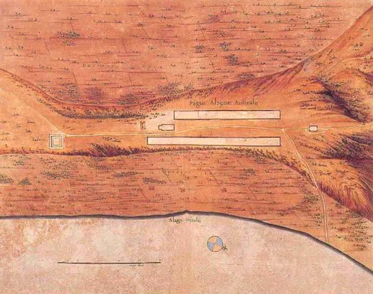
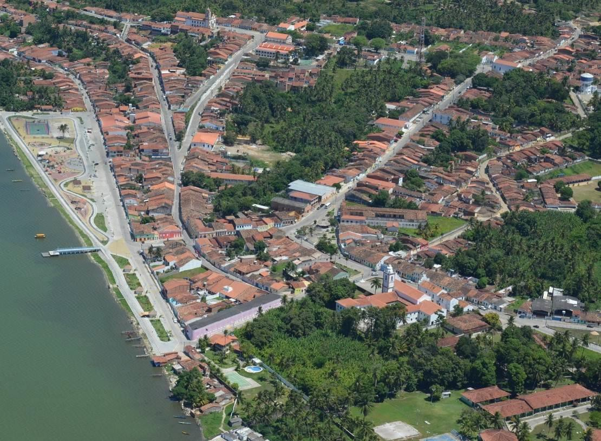
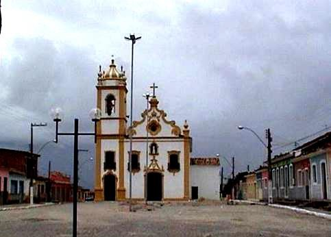
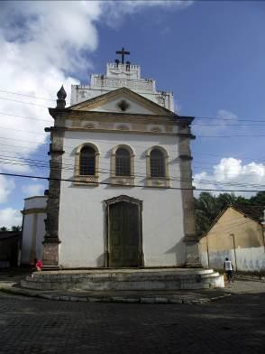
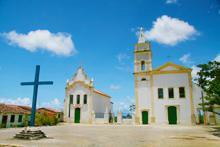
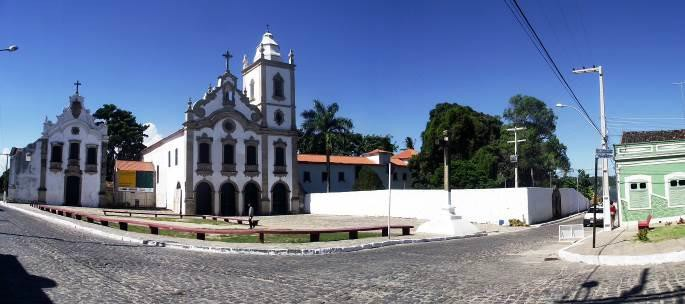
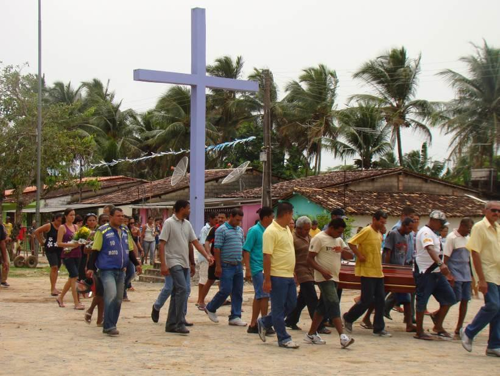
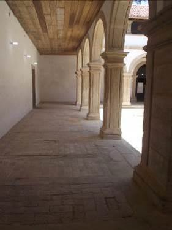

# Resumo

O artigo aqui apresentado pretende discutir como práticas e rituais
funerários,

desenvolvidos em igrejas, capelas e conventos, repercutiram na
configuração urbana da cidade de Marechal Deodoro, Alagoas, no período
compreendido entre os séculos XVII e XIX. A partir de uma perspectiva
ainda pouco explorada, os espaços sacros serão destacados na sua
imprescindível condição de abrigos de fenômenos de natureza religiosa e
cultural ligados à Morte e, portanto, indispensáveis no universo
colonial, onde a vida do cristão girava em torno da possibilidade da
"boa morte". Avalia-se a significativa contribuição destas edificações e
práticas funerárias na construção do espaço, através da criação de
espacialidades que ajudaram a montar a feição atual do sítio histórico.
Tal discussão contribuirá para os estudos acerca da formação da paisagem
urbana e arquitetônica da cidade colonial, ressaltando seus pactos com
fenômenos de natureza cultural, particularmente no que se refere às
práticas de enterramentos em solos sagrados.

Palavras-chave: morte, sepultamentos, igreja, urbanismo, arquitetura

# Abstract

The Article presented here aims to discuss how funerary rituals and
practices, developed in churches, chapels and convents, reflected in
urban configuration of the town of Marechal Deodoro, Alagoas, in the
period between the 17th and 19th centuries. From a perspective still few
explored, sacred spaces will be highlighted in its indispensable
condition of shelters of phenomena of a religious nature and cultural
linked to Death and, therefore, indispensable in colonial universe,
where the life of the Christian revolved around the possibility of the
\"good death\". It Evaluates the significant contribution of these
buildings and funerary practices in the construction of space, through
the creation of spatiality that helped to assemble the current
appearance of the historic site. Such discussion will contribute to the
studies about the formation of the urban landscape and architectural
design of the colonial city, emphasizing their pacts with phenomena of a
cultural nature, particularly as regards the practice of burials in
sacred soils.

Keywords: death, burials, church, urbanism, architecture

# A sociedade colonial e a morte

As práticas funerárias desenvolvidas nos primeiros séculos da
colonização brasileira reverberavam diretamente na constituição das
povoações, provocando e influenciando seu perfil físico através da
configuração de uma malha urbana onde os espaços de enterramento eram
privilegiados e para os quais a sociedade se organizava a fim de
promover sua implantação e manutenção.

Isso coloca a Morte numa condição de protagonismo em relação à
construção da urbe colonial brasileira, pois o lugar dos mortos era tão
importante e essencial quanto o lugar

dos vivos. Isso como consequência de um modelo social onde, de modo
geral, as pessoas tinham sua vida determinada pela cultura católica.

Tradições religiosas seculares transplantadas de Portugal para o Brasil
Colônia, outorgaram à Morte um papel preponderante no universo colonial,
constituindo-se em poderosos agente que ocupava o cotidiano das pessoas,
fortalecido por uma fé centrada em uma visão escatológica de mundo.

Os edifícios religiosos ocupavam privilegiado papel nesse cenário,
aparentemente conflitante, como locais que abrigavam processos que
ressaltavam a vida e a morte. Nesse contato frequente, onde uma
ritualística variada era realizada, o pecador tentava garantir, ou
evitar, os únicos destinos reconhecidos pela cultura vigente: o céu, o
purgatório e o inferno. E aos que fizessem por merecer, as recompensas
eram maravilhosas.

> Lá no Céu haverá saúde sem doença, formosura sem fealdade,
> imortalidade sem corrupção, abundância sem miséria, sossego e paz sem
> turbação, segurança sem temor, conhecimento sem erro, fartura sem
> fastio, alegria sem tristeza; não haverá inquietações, nem turbações;
> tudo finalmente será paz, alegria e felicidade, e glória! (COUTO,
> 1868, Apud NOBRE, 2011:113).

Para garantir a salvação da alma, a população, em todos os seus estratos
(negros, pardos, brancos ricos e pobres), congregava esforços para
multiplicar igrejas e capelas, assegurando assim as cerimônias
religiosas, a presença permanente dos sacerdotes e, consequentemente, a
administração diária dos sacramentos. Diretamente ligado aos espaços
religiosos, aos sacerdotes e aos sacramentos, estava um aspecto
essencial da cultura da época: o enterramento cristão.

A tradição do sepultamento no mesmo local onde havia intensa frequência
dos vivos era normatizada e estimulada pela legislação canônica contida
no livro Constituições Primeiras do Arcebispado da Bahia. Embalado pelo
discurso do Concílio de Trento (1545 a 1563), o importante documento
publicado em 1719, estabeleceu posturas, códigos e ordenações para
católicos e espaços religiosos.

> É costume pio, antigo, e louvável na Igreja Catholica, enterrarem-se
> os corpos dos fieis Christãos defuntos nas igrejas e cemitérios
> dellas: porque como são lugares, a que todos os fieis concorrem para
> ouvir, e assistir ás Missas e officios divinos, e Orações, tendo á
> vista as sepulturas, se lembrarão de encommendar a Deos nosso Senhor
> as almas dos ditos defuntos, especialmente dos seus, para que mais
> cedo sejão livres das penas do Purgatório, e se não esquecerão da
> morte, antes lhes será aos vivos mui proveitoso ter memória della nas
> sepulturas. Por tanto ordenamos, e mandamos, que todos os fieis que
> neste nosso arcebispado fallecerem, sejão enterrados nas Igrejas, ou
> Cemiterios, e não em lugares não sagrados (\...). (VIDE, 2007:295).

Nesta perspectiva, as edificações religiosas desempenharam destacado
papel. Considerando que a legislação canônica restringia os
enterramentos aos recintos sagrados, presume-se que a possibilidade de
oferta do "campo santo" para os

enterramentos constituiu-se em forte motivação para a construção de
igrejas, capelas, mosteiros e conventos.

# O campo santo das igrejas de marechal deodoro

No contexto econômico da parte sul da Capitania de Pernambuco, hoje
Estado de Alagoas, Marechal Deodoro emerge como uma povoação promissora
devido à privilegiada posição geográfica, às margens da Lagoa Manguaba e
próxima ao Oceano Atlântico, o que lhe permitiu dinamizar a economia
através de produtivos engenhos de açúcar. Inserida na política
portuguesa de apropriação e exploração das terras férteis ao longo de
cursos de água, foi elevada à categoria de vila em 1636, devido à sua
participação na luta contra os holandeses, na chamada "guerra do
açúcar."1

Logo que o núcleo urbano se insinua na paisagem, um elemento se destaca
em meio ao casario e arruado ainda em formação, anunciando uma
identidade que se perpetuaria no tempo: a religiosidade materializada
nas igrejas.

Uma gravura contida na obra do holandês
Barleus (Pagus Alagoae Australis), datada de 1647, mostra edificações no
mesmo local onde hoje estão localizadas a Igreja Matriz de Nossa Senhora
da Conceição (esquerda) e, no outro extremo, a Igreja de Nossa Senhora
do Rosário dos Pretos (direita), indicando a possibilidade da existência
de embriões dos edifícios atuais desde a época dos primórdios da vila
(ver Fig. 1).

> Figura 1. Pagus Alagoa ed Australis

Em uma área relativamente pequena do centro da cidade, vão se
concentrando, a partir da meados do século XVII, edifícios religiosos
articulados entre si através de ruas e largos, gerando uma ambiência
urbana fortemente marcada pela sacralidade.2 (ver Fig. 2).

> 1 A presença holandesa manteve-se na Capitania de Pernambuco no
> período de 1630 a 1649. Na antiga Santa Maria Madalena (atual
> município de Marechal Deodoro), a invasão resultou na destruição de
> grandes parcelas de terras plantadas com cana-de-açúcar, várias casas
> e a Igreja Matriz de Nossa Senhora da Conceição.
>
> 2 A Profª Drª Josemary Ferrare (2006) usa a expressão "polígono sacro"
> para caracterizar a articulação
>
> espacial e simbólica existente entre as igrejas do sítio histórico de
> Marechal Deodoro.
>
> **Igreja Matriz Convento Carmelita**
>
# Igreja de Nossa Senhora do Rosário
>
# Igreja de Nossa Senhora do Amparo
>
# Rua dos Mortos
>
# Convento Franciscano

Figura 2 . Vista aérea da cidade com localização das igrejas antigas no
sítio histórico.

Por diversos motivos os edifícios
religiosos interferiram significativamente na configuração espacial da
antiga vila: aspecto arquitetônico, devido a expressões de
monumentalidade em meio a um casario de feição singela; inserção urbana,
ao se constituírem, desde seus primórdios, pontos de interesse, para
onde eram atraídas e convergiam ruas e, finalmente, relevância social,
já que eram, por excelência, locais que aglutinavam a sociedade cristã
ao acolher as atividades mais marcantes da época: as cerimônias
religiosas. (ver Fig. 3, 4, 5, 6 e 7).

> 

Figuras 3, 4 e 5 . Igrejas Matriz, de
N. Srª. do Rosário e de N. Srª. do Amparo

> 

Figuras 6 e 7 . Convento Franciscano e Convento Carmelita

Uma das forças que agiam mais poderosamente sobre a capacidade de coesão
social nos núcleos coloniais, era o investimento na construção dos
locais para a realização das atividades religiosas, notadamente os
enterramentos. Em Marechal Deodoro a experiência não foi diferente. A
dinâmica urbana evocava espaços para a população funerária, a qual,
assim como em vida, também na morte estava estratificada social e
economicamente.

Em 1660, o lugar ainda era carente de igrejas. Sua velha matriz de Nossa
Senhora da Conceição fora incendiada pelos holandeses, em 1633, e
demorava a ser reconstruída. Apenas em 1675 se inicia a obra que, por
falta de recursos, se estende por dez anos.

Em 1657, a população envia à Ordem dos Frades Menores solicitação de
construção de um convento franciscano na vila, alegando necessidade de
assistência espiritual. A construção começa em 1660 e é concluída em
1793.

As demais igrejas mais antigas do lugar são iniciadas no século XVIII.
Embora a iconografia holandesa pareça indicar a presença da Igreja de
Nossa Senhora do Rosário desde a primeira metade do século XVII (ver
Fig. 1), as referências encontradas na historiografia acessada registram
sua existência a partir de 1777. É possível que o apresentado na gravura
seja o embrião da igreja, a capelinha inicial que, posteriormente, dá
origem à edificação maior como a conhecemos hoje.

Quanto à Igreja de Nossa Senhora do Amparo, teve sua pedra fundamental
lançada em 1757, sendo responsável pela construção a Confraria de Nossa
Senhora do Amparo dos Homens Pardos.

Em 1715, já adiantada a casa franciscana, os moradores solicitam à Ordem
Carmelita a construção de um convento dos seus e o envio de frades sob a
alegação de que seus serviços eram indispensáveis a uma vila que contava
com quatro freguesias e vinte e três engenhos de açúcar, indicando
carência de assistência espiritual. (Revista do Instituto Histórico e
Geográfico de Alagoas, 1879:27).

Portanto, a construção das três igrejas e dois conventos em um espaço
físico restrito, pode ter sido motivada por essa necessidade de
provimento de locais para os enterros. O arranjo arquitetônico do núcleo
urbano precisava ser pensado, também, em atendimento ao pressuposto que
estava na base do próprio modo de viver e ver o mundo na época. Isso era
imprescindível para que a ordem social fosse garantida, através da
manutenção de práticas seculares indispensáveis à cristandade colonial.

Entre os vários territórios abrigados no ambiente citadino, o lugar dos
mortos era prioridade, constituindo-se em um reflexo das estruturas
antropológicas locais.3 Nesse sentido, é razoável deduzir que as
capelas, igrejas e convento tiveram sua paisagem interna mobilizada para
os enterramentos desde sua origem e que a análise dessa utilização, que
se manteve por cerca de 200 anos, permite um outro nível de leitura e

> 3 ROSENDAHL (1999:74-75) associa a forma arquitetônica aos valores e
> crenças impressos pelas pessoas, ou seja, "a fala e o ritual imprimem
> formas à paisagem".

compreensão da história da cidade, já que práticas funerárias
repercutiam no conjunto de fenômenos que atuavam diretamente na
organização física da urbe.

Solidificada no recinto das igrejas, a cultura da Morte transborda para
o espaço público, se intrometendo em ruas e largos, inclusive, definindo
caminhos e influenciando a nomenclatura de logradouros.

A rua que se alonga longitudinalmente na parte baixa da vila, margeando
a lagoa, e seguindo na direção do convento franciscano foi, durante
muito tempo, chamada Rua dos Mortos4 (ver Fig. 2). Possivelmente, o nome
estava associado a uma prática local recorrente, caracterizada pelos
trajetos fúnebres dirigidos ao edifício conventual. A denominação
vincula o espaço público a um uso que deve ter sido frequente e sinaliza
para uma relação de apropriação social, de modo a atrelar o próprio
espaço/rua à função/cortejo fúnerário. Nestor Goulart Reis (2000:133)
confirma que, nas localidades mais antigas do período colonial, as ruas
não tinham importância por si sós, nada mais sendo que "meio de ligação,
vias ou linhas de percurso, ligando os domicílios aos pontos de
interesse coletivo (\...)."

> 

Figura 8 . Cena contemporânea de um cortejo fúnebre percorrendo as ruas
da cidade.

Na mesma intensidade com que demandava os espaços da urbe, a Morte
fortalecia seu lugar dentro do ambiente interno das edificações
religiosas. Em cada uma delas a disposição e ocupação das sepulturas era
uma preocupação que, por vezes, antecedia no tempo e no espaço a própria
arquitetura.

O cronista setecentista Frei Jaboatão relata que, imediatamente após a
chegada dos frades franciscanos, e antes mesmo do convento ser
construído, pessoas abastadas do lugar ofereceram os recursos
financeiros necessários para a construção de altares e retábulos de modo
a garantir a localização privilegiada das suas sepulturas. Em 1660, uma
família faz a doação de diversos bens para custear a construção do
retábulo

colateral ao arco-cruzeiro da igreja conventual e, assim, definir onde
seria enterrado.5

> 4 Pesquisas realizadas em arquivos da Superintendência do Iphan em
> Alagoas mostraram que nas plantas mais antigas localizando o convento
> franciscano no sítio histórico, a rua hoje denominada Marechal Deodoro
> era chamada de Rua dos Mortos. A informação é confirmada no livro de
> memórias Currupio que cita e localiza a Rua dos Mortos. Cf.
> BITTENCOURT: 1992:42.
>
> 5 Em toda a colônia, o sepultamento em locais privilegiados da igreja
> era objeto de disputa. Os mais
>
> destacados, segundo a crença da época, eram aqueles localizados na
> capela-mor e próximos aos retábulos, altares e pias de água benta.
>
> Nelle tem sepultura Ignácio Vieyra e sua mulher Mecia Barboza, e seos
> herdeiros, por escriptura de 27 de dezembro de 1660, tendo ornado o
> altar de todo o necessário, e assignado renda para o diante no
> rendimento de meia legoa de terra, oitenta vacas parideiras, e hum
> Escravo, o que depois se comutou em 25 arrobas de açúcar no Engenho,
> que levantarão na ditta terra os proprietários. (JABOATÃO, 1980:608).

A mesma situação se repete em 1709
quando dois irmãos financiam a construção da capela localizada
perpendicularmente à nave da igreja "para nella se enterrarem, e seos
Ascendentes, e Descendentes". Para a execução da capela, com teto
abobadado, e retábulo em madeira dourada e policromada, contribuíram com
a soma de "mil cruzados a juro, para ornato, e paramentos da ditta
Capella." (JABOATÃO, 1980:609). No local, foi construída uma cripta
funerária subterrânea que abriga três catacumbas, as quais se mantém até
hoje. Os documentos acessados não referenciam os demais benfeitores, mas
a memória deles se perpetua nas oitenta e oito sepulturas distribuídas
na nave da igreja e no claustro do convento. (ver Fig. 8, 9 e 10).

> Figuras 9, 10 e 11 . Claustro e nave da igreja do Convento Franciscano
> com sepulturas demarcadas no piso.

A ordenação social que predominava entre os vivos se repetia no pós
morte. Não bastava ser cristão. Era preciso ter condições financeiras de
manter os rituais funerários e o sepultamento digno. A sociedade
funcionava com categorias muito bem definidas e isto se refletia também
na distribuição das campas nos pisos sagrados.

A criação da Confraria de Nossa Senhora do Amparo, sociedade de enterro
mútuo fundada em Marechal Deodoro, em1683 pelos "homens pardos forros",
ilustra bem esse panorama cultural. A associação religiosa leiga surgiu,
justamente, pela necessidade de promover, adequadamente, os
enterramentos dos menos favorecidos.

> A mãi cujo filhinho apodrecêra á espera da sepultura esmolada, o filho
> que na via dolorosa não encontrara respeito ás murchas cans de seu
> progenitor, a esposa que vira em abandono seu amor fanado, por esquife
> a lage, por cyrios os instrumentos do coveiro, todas essas affeições
> se ergueram procurando na confraternidade consolo ás suas magoas.
> (CABRAL, 1879:6).

Logo após a fundação da confraria, as primeiras esmolas arrecadadas
foram dedicadas à construção de um túmulo na Igreja de Nossa Senhora da
Conceição, destinado aos pardos associados que, por não ter, ainda,
capela própria, ali se reuniam

provisoriamente. (CABRAL, 1879:4). O mesmo impulso parece ter motivado a
construção da Igreja de Nossa Senhora do Rosário dos Pretos, fruto de
iniciativa de uma irmandade leiga, tradicionalmente formada por negros.
Nela, o enterramento cristão era garantido a pessoas cujo acesso às
igrejas era restringido pelas normas que regiam a sociedade
escravocrata.6

Conforma-se assim, uma paisagem urbana dominada por pontos de
convergência representados por edificações religiosas que marcam e
qualificam a cidade, ao atender a práticas tradicionais dos seus
moradores, em relação à vida e, de modo especial, à morte.

# Considerações finais

São intrigantes as relações existentes entre cultura, urbanismo e
arquitetura, e este artigo procurou enfatizar como tais elementos,
associados, determinaram a personalidade do espaço urbano de Marechal
Deodoro.

Enfatizou-se aqui a perspectiva do protagonismo da Morte, e rituais a
ela associados (cortejos, cerimônias, sepultamentos), em processos
sociais que influenciaram fortemente na organização e apropriações que
se fez do espaço, através das intervenções de uma sociedade que tinha na
expectativa da salvação da alma uma de suas dinâmicas mais importantes.

Por causa dela, se construiu os edifícios e caminhos mais significativos
da cidade, configurando um desenho que se mantém até hoje e que,
certamente, contribui para a preservação de parte das tradições do seu
passado colonial, no que diz respeito à religiosidade.

# Referências bibliográficas

> BITENCOURT, Ednon. *Currupio -- Memórias 2 "Ridendo Castigare Mores".*
> Maceió: SERGASA, 1992.
>
> BOSCHI, Caio César. *Os leigos e o poder (irmandades leigas e a
> política colonizadora em Minas Gerais).* São Paulo: Editora Ática,
> 1986.
>
> CABRAL, João Francisco Dias. *"Pesquisa rápida a'cerca da fundação de
> alguns templos da villa de Santa Maria Madalena da Lagoa do Sul, agora
> cidade das Alagoas*

*- 1874".* In: Revista do Instituto Histórico e Geográfico de Alagoas,
nº 11, vol. II, Maceió: Typographia de T. Menezes, 1879, p. 1-11.

> *Carta da camara das Alagoas ao governador de Pernambuco Manoel de
> Souza Tavares, prestando informações exigidas acerca dos carmelitas,
> 1718.* In: Revista do Instituto Histórico e Geográfico de Alagoas, nº
> 11, vol. II, Maceió: Typographia de T. Menezes, 1879, pp. 27-28.
>
> FERRARE, Josemary. *A cidade Marechal Deodoro: do projeto colonizador
> português à imagem do "lugar colonial".* Porto: Faculdade de
> Arquitetura da universidade do Porto, 2006. (Tese de Doutorado).
>
> JABOATÃO OFM, Frei Antonio de Santa Maria. *Novo Orbe Seráfico
> Brasílico ou Chronica dos Frades Menores da Província do Brasil,* vls.
> I, II e III, Recife: Assembléia Legislativa do Estado de Pernambuco,
> 1980 (fac-simile da Ed. de 1859- 1861-1862).
>
> NOBRE, Edianne S. e ALEXANDRE, Jucieldo F. *A Missão Abreviada:
> práticas e lugares do bem-morrer na literatura espiritual portuguesa
> da segunda metade do século XIX.* In: Revista Brasileira de História
> das Religiões. ANPUH, Ano IV, nº 10,
>
> 6 "Não havia enterro sem o hábito de Irmão". (LOPES, 1968 apud BOSCH,
> 1986:150). O autor afirma a importância do papel das irmandades
> leigas, como agentes de promoção, coesão e proteção, especialmente dos
> grupos socialmente marginalizados, tornando-se indispensável na vida e
> na morte.

maio 2011, pp. 97-115. Disponível em:
[[http://www.dhi.uem.br/gtreligiao/index.html]{.ul}](http://www.dhi.uem.br/gtreligiao/index.html),
acessado em maio de 2012.

> REIS, Nestor Goulart. *Contribuição ao estudo da evolução urbana do
> Brasil -- 1500/1720.* São Paulo: Pini, 2000.
>
> ROSENDAHL, Zeny. *Hierópolis: o sagrado e o urbano.* Rio de Janeiro:
> Eduerj, 1999. VERÍSSIMO, Francisco S. et al. *Vida urbana: a evolução
> do cotidiano da cidade brasileira.* Rio de Janeiro: Ediouro, 2001.
>
> VIDE, Sebastião Monteiro da. *Constituições Primeiras do Arcebispado
> da Bahia, feitas e ordenadas pelo ilustríssimo e reverendíssimo D.
> Sebastião Monteiro da Vide.* Brasília: Senado Federal/ Conselho
> Editorial, 2007.
