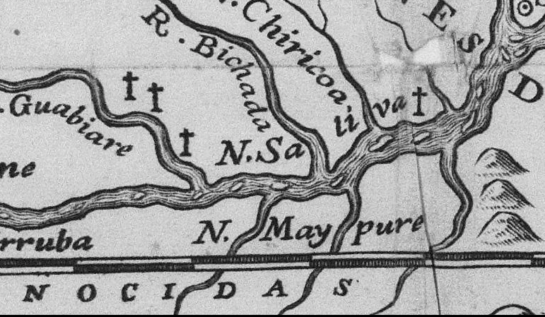

# Resumo

O texto faz uma seriação de mapas jesuíticos que contém informação
visual e/ou escrita sobre os padres da Companhia de Jesus que foram
mortos na América entre 1612 e a expulsão da Ordem na segunda metade do
século XVIII. Para os jesuítas, tais mortes teriam ocorrido em nome da
fé cristã, sendo portanto considerados como martírios. Desde os
primeiros séculos e até o século XVIII, a Cristandade operou
continuamente a ideia de que o sangue dos mártires tem o poder de
consagrar o território, convertendo terras profanas em terras
consagradas onde a cristandade pode se assentar. O texto mostra como
esta ideia foi acionada pelos jesuítas como parte de suas estratégias de
enraizamento no território, e que parte desse discurso circulou em
formato cartográfico. Além disso, identifica tipologias e formas de
aplicação das representações de mártires: imagens que remetem à vocação
apostólica da Companhia e de seus padres; delimitação de fronteiras com
outras ordens religiosas; demarcação de limites com territórios
dominados pelos índios; definição de limites entre as diferentes
metrópoles coloniais. Revela também que tais marcas de sangue no
território foram utilizadas até mesmo após a expulsão da Companhia da
América, tanto por padres no exílio quanto por colonos espanhóis na
delimitação de fronteiras com o Brasil.

**Palavras-chave:** Companhia de Jesus, América Colonial, Cartografia
Histórica, Martírios, Missionação

# Abstract

The text makes a seriation of Jesuit maps containing visual and written
information about the priests of the Society of Jesus who were killed in
America between 1612 and the expulsion of the Order in the second half
of the 18th Century. For the Jesuits, such deaths have occurred in the
name of the Christian faith and the deceased were considered as martyrs.
Since its early centuries, Christendom triggered continually the idea
that the blood of martyrs had the power to consecrate the territory,
converting unholy lterritory into sacred lands where Christianity could
florish. The text shows how this idea has been used by the Jesuits as
part of their strategies for the occupation of the American territory,
and that part of this discourse circulated in cartographic format. It
identifies

types and forms of representations of martyrs in the maps: images that
refer to the apostolic vocation of the Company and its priests, to the
delimitation of borders with other religious orders, to the demarcation
of boundaries with areas dominated by Indians, to the definition of
boundaries between different colonial powers. It also reveals that such
traces of blood in the territory were used even after the expulsion of
the Company of America , both as priests in exile by Spanish settlers in
the demarcation of borders with Brazil .

> **Keywords:** Society of Jesus, Colonial America, Historic
> Cartography, Martyrdom, Missions

# Introdução: cartografias jesuíticas e batismos de sangue

A cartografia produzida pelos jesuítas na América já foi objeto de
diversos estudos feitos tanto por jesuítas quanto por meios acadêmicos
laicos. Os trabalhos fundadores, de autoria dos próprios jesuítas,
enaltecem a capacidade técnica e de trabalho dos padres da Companhia
(Furlong, 1936, Burrus, 1967). Trabalhos mais recentes problematizam
corpos documentais específicos, dialogando com o mito da construção de
um território jesuítico (Barcellos, 2013); as intenções políticas por
trás da produção cartográfica (Dias, 2012); as formas de circulação da
cartografia jesuítica na Europa (Almeida, 2003).

Este texto reconstrói o universo da cartografia jesuítica que conteve
informações sobre alguns padres muito especiais no imaginário e na
crônica da Companhia de Jesus: aqueles que foram mortos de forma
violenta. Tais vítimas foram prontamente qualificadas pelos próprios
jesuítas como *mártires*, ou sacrificados em nome da fé. O texto realiza
uma seriação desses mapas e busca os significados em jogo para os
jesuítas que marcaram parte de sua cartografia com o sangue de seus
padres sacrificados. Busca, desta forma, abrir novas visadas sobre o
complexo processo de expansão das fronteiras da cristandade e de
instalação de uma sociedade colonial na América.

Os relatos que associam o martírio à conquista do território são
recorrentes nas fontes jesuíticas referentes à missionação em todo o
mundo, fazendo parte de uma cultura martirológica jesuítica que se
expressou em escala global (Burschel, 2004; Nebgen, 2009). Mas o uso
recorrente de informações de caráter martirológico na cartografia é
característica especificamente americana. As marcas dos padres
assassinados na cartografia jesuítica já foram abordadas em alguns
trabalhos que têm como foco alguns mapas específicos, produzindo
leituras fundamentais das quais me aproprio neste texto (Dragonas, 1998;
Almeida, 2003; Xavier, 2012; Dias, 2012), mas ainda não foram analisadas
de forma seriada como aqui proposto. Tal análise se justifica pela
recorrência dessas referências, que não deve ser considerada casualidade
ou coincidência. Os jesuítas produziram mapas que evocavam seus mártires
por mais de um século, de meados do século XVII até as vésperas da
expulsão da Companhia da América na década de 1760 -- e, como se verá
adiante, essas marcas de sangue no território tiveram ainda uma
sobrevida mesmo após a expulsão.

Combino neste texto dois pressupostos metodológicos. Por um lado,
analiso os mapas para além da informação geográfica que contém,
tratando-os como *discurso político* e buscando contextualizá-los do
ponto de vista histórico (Harley, 2001). Em complemento a isso, extraio
e analiso os conteúdos martirológicos de cada mapa, associando-os não ao
seu contexto histórico imediato, mas ao contexto religioso jesuítico e
aos significados que estes (e a cristandade como um todo) associou aos
mártires e aos martírios, tratando os mapas, como *discurso espiritual*
portanto.

A presença dos sinais dos padres sacrificados no território aponta para
um conjunto de dispositivos de caráter simbólico, espiritual e também
politico acionados por jesuítas -- e circunstancialmente por não
jesuítas -- como parte de um processo de conquista do território e
expansão do Ocidente. Aciona uma das ferramentas mais antigas da
cristandade para reclamar qualquer território, o chamado "batismo de
sangue", ou a noção de que o sangue de um mártir tem o poder de
transformar território profano em sagrado.

> Já no século I o martírio assumiu para os cristãos conotações que
> foram exploradas nos séculos seguintes (e em parte até os duas
> atuais): o mártir garantindo recompensas no após morte e
> reconhecimento coletivo em escala e qualidade desconhecida de outras
> culturas (Bowersock, 1995). A narrativa do "Martírio de Policarpo", de
> meados do século II, atribuía ao mártir o poder de
>
> encerrar as perseguições aos cristãos, e associava características
> maravilhosas ao seu corpo durante e apos o martírio.1 No final do
> século II, em plenas perseguições, Tertuliano consolida em sua
>
> 1 *Martírio de Policarpo*, disponível em
> [[http://wesley.nnu.edu/biblical_studies/noncanon/fathers/ante-nic/polycarp/polmart.htm]{.ul}.](http://wesley.nnu.edu/biblical_studies/noncanon/fathers/ante-nic/polycarp/polmart.htm)

*apologia* a imagem do mecanismo que estabelecia uma relação de causa e
efeito entre o martírio e o triunfo da cristandade, aplicável
genericamente, e também sobre territorialidades específicas: "o

sangue dos mártires é semente de cristãos", ou seja, as perseguições
nada mais gerariam do que novos cristãos, fundados sobre os sacrifícios
dos seus mártires.2

O mecanismo do "batismo de sangue" perpassou os séculos e revelou-se de
uma incrível utilidade e resiliência, adaptando-se e sendo acionado de
uma forma ou de outra em todos os contextos geográficos, politicos,
econômicos e teológicos em que a Cristandade esteve presente (Gregory,
1999). Trata-se de elemento muito recorrente no imaginário missionário
jesuítico, acionado por jesuítas em toda a América, independente da
metrópole colonizadora -- Portugal, Espanha ou França.

Alguns anos após o martírio de Martin de Aranda, Horácio de Vecchi e
Diego de Montalban no Chile em 1612, Diego de Torres lembrava uma fala
de Horácio de Vecchi, atribuindo a ela conotações de profecia: \"\...el
Padre Horacio dixo algunas veces à algunas personas de credito, que no
se convertirian aquellos Gentiles, hasta que se regasse aquella tierra
con sangre de Martyres, y que deseaba el ser el primero\" (Lozano, 1755,
II:528).

> A imagem da terra regada com o sangue dos mártires foi acionada pelos
> jesuítas nas mais diversas situações. Em 1646, em dificuldades na
> cristianização dos Iroqueses no Canadá, o padre Jerome Lalemant
> afirmava: "Acredito que os planos que temos contra o Império de Satã
> para a salvação desse povo só dará frutos se ensopado com o sangue de
> alguns mártires" (Lalemant, 1898 \[1646\], p. 44). Juan Patricio
> Fernandez, cronista da missão de Chiquitos, atual Bolívia, afirmava no
> início do século XVIII que regar a vinha do Senhor com sangue era "ao
> que parece, condição necessária para que a Fé enraíze permanentemente
> nos campos onde se planta" (Fernandez, 1994 \[1726\], p. 114).
>
> Em muitas ocasiões, os jesuítas serviram-se com literalidade da máxima
> de Tertuliano -- "o sangue dos mártires é semente de cristãos".
> Eusébio Kino, após listar seis diferentes motivos do martírio de
> Francisco Javier Saeta pelos índios no México em 1695, afirmava: \"Os
> males ocorreram por permissão de Deus com sua santíssima providencia,
> que do mal sabe extrair o bem, como é a coroa celestial dos santos
> mártires: *ut sanguis martyrum sit semen christianorum*\" (Kino,
> 1971). Ao tomar conhecimento do martírio de Del Vechi, Aranda e
> Montalban no Chile em 1612, o padre superior Luis de Valdívia
> animou-se ainda mais a catequizar a região utilizando-se da mesma

imagem,3 assim como Antonio de Orellana ao relatar do martírio de
Cipriano Barace na Bolívia em 1702 com raciocínio similar.4 O mais
famoso martirológio da Companhia de Jesus, o de Tanner

(1675), que é uma compilação das narrativas de cerca de 300 martírios de
jesuítas ocorridos em todo o mundo, apresenta a maxima de Tertuliano
associando o sangue dos mártires e o crescimento da cristandade em uma
de suas gravuras (figura 1).

> Figura 1: \"O sangue dos mártires é semente de Cristãos\". Detalhe de
> gravura do Martirológio de Mathias Tanner (Praga, 1675), que
> sistematizava os martírios de mais de 300 jesuítas em todo o mundo.
> Coleção IEB-USP.
>
> 2 Tertuliano, *Apologeticum,* cap. 50:13. Disponível em:
> [[http://www.tertullian.org/latin/apologeticum_becker.htm]{.ul}.](http://www.tertullian.org/latin/apologeticum_becker.htm)
>
> 3 Antes, *teniendo estas muertes i martírios por gran dicha i
> principio de mayor felicidad, sabiendo que la sangre de los mártires
> siempre habia sido Riego que fecundaba la tierra de los infieles*,
> confiado en que desde el cielo ayudarian mas con sus oraciones e
> intercesión a sus santos intentos i al buen deseo del rei nuestro
> señor que predicando con su viva voz a los índios, llamó luego para sí
>
> al padre Modolell, que estaba en Buena-Esperanza, que era misionero
> fervoroso i de espírito apostólico, para que con otro compañero
> quedase en Arauco \[grifo meu\] (Olivares, 2005 \[1736\]:70-71).
>
> 4 Fue el V. P. Cypriano uno de los dos primeros Padres, que como
> primeros Apostoles Evangelizaran en aquellas Provincias, y el
>
> primero que sellò su predicacion, y regò aquel campo de la Iglesia con
> su sangre, y esperamos que ha de quedar tan fecundo, que de ciento por
> uno, y que no solo se conviertan los Baures sus queridos patricidas,
> sino otras muchas Naciones de las q˜ registrò, y descobriò (Orellana,
> 1704, fl 64v).
>
> 

A seguir, são apresentadas imagens de mapas em que se identificam sinais
dos mártires jesuítas, divididas em duas categorias principais: imagens
gravadas de martírios que acompanham os mapas e sinalizações de lugares
específicos de morte de jesuítas.

# *Imagens: o mártir, apóstolo das missões*
>
> Em 1653, o jesuíta italiano Francisco Giuseppe Bressani publicou o
> livro \"Breve relatione d\'Alcune missioni de PP. Della Compagnia di
> Giesu nella Nuova Francia\", em que relatava a chegada, infortúnios e
> expulsão dos jesuítas do território dos Hurones no interior do Canadá,
> onde o próprio Bressani havia missionado. Nesse livro, Bressani
> anuncia a existência de um mapa complementar, que não teria ficado
> pronto a tempo. 5

Trata-se do mapa *Nova Francia Accurata Delineatio*, atribuído a
Bressani, impresso em duas partes, e que foi impresso em 1657, três anos
após a impressão do livro em italiano. O mapa representava o território
da Nova França, ricamente ornamentado por imagens da vida local. Foi
elaborado possivelmente a partir de mapas impressos em Paris em 1650 e
1656 por Sanson D\'Abbeville (Dragonas, 1998, p. 9). A maior e mais
completa das imagens, no canto inferior direito, representava as
crueldades anunciadas por Bressani: em primeiro plano, o martírio dos
jesuítas Jean de Brebeuf e Gabriel Lalemant nas mãos dos Iroqueses,
ocorrido em 1649 nas proximidades da missão de Saint Louis. Em segundo
plano, os martírios de Anne de Nouë, René Goupil, Jean de La Lande,
Isaac Jogues (1646), Antonie Daniel (1648), Charles Garnier (1649),
Nicolas Chabanel (1649).

Representando esses martírios, a imagem repete a estrutura de uma
gravura impressa em 1650, que circulou na Europa em edição latina e
francesa com a finalidade de sensibilizar os católicos (principalmente
franceses) e captar recursos para a continuação da missão no Canadá
(Dragonas, 1998, pp.31-33). Mas a imagem do mapa de Bressani dá
prosseguimento à narrativa gravada por Huret, inserindo um quadro com a
imagem do sacrifício de outros dois padres pelos Iroqueses, Jacques
Buteux (1652) e Leonard Garreau (1656) (figura 3). Desta forma, o mapa
vincula a informação geográfica com a informação histórica da linhagem
martirológica, construindo em mão dupla tanto a vocação jesuítica do
Canadá como a vocação canadense da Companhia de Jesus. Tais imagens
repetem em linguagem visual a longa narrativa da *Breve Relatione* que
relata o martírio dos padres jesuítas pelos Iroqueses servindo como
complemento, e também como substituto ao livro.

> 5 \"O conjunto \[do relato\] se esclareceria com o mapa que eu
> gostaria de adicionar aqui, mas que não está pronto. Aqueles que o
> desejarem poderão tê-lo dentro de algum tempo, em separata, com as
> imagens dos Bárbaros e suas crueldades (Bressani, 1653, apud Dragonas,
> 1998, p. 1).

Bressani não aponta o local preciso da morte de Brebeuf e Lalemant,
tampouco dos demais jesuítas representados nas imagens. Desta forma, não
remete a um local específico do território, mas associa os mártires à
missão como um todo. A intenção de Bressani com seu mapa e o seu livro
era a de dar ao mundo o conhecimento da missão jesuítica no Canadá, de
seus desafios e dos sofrimentos dos padres nessa missão. A gravura
funcionava como complemento à informação cartográfica, inserindo a
missão jesuítica na história católica assim como o mapa insere o Canadá
na geografia ocidental. Serve também como substituto da informação
cartográfica, para os leitores não letrados ou não treinados na
interpretação de mapas.

> Bressani produziu este mapa também com um sentido autobiográfico: ele
> foi preso e torturado pelos Iroqueses, mas conseguiu escapar. Exibia
> suas mãos deformadas pela tortura em sua atividade de predicador nas
> principais cidades da Itália a partir de 1654 e até sua morte em
> Florença em

1672.6 Por suas marcas e experiência de tortura, era chamado de "mártir
vivo" pela mística

canadense Marie de L'Incarnation (Latourelle, 1999, p. 71). É muito
provável que o mapa tenha sido utilizado por Bressani em sua atividade
de predicador. Ainda que as imagens dos mártires tenham sido usadas para
arrecadar fundos para a missão canadense (Dragonas, 1998, p.31-33), o
fato de a narrativa de Bressani ter sido publicada inicialmente em
italiano leva a crer que este não era seu objetivo principal -- ao que
parece Bressani fez o movimento inverso: usou as narrativas de martírio
no Canadá (incluindo sua própria) como capital simbólico para alavancar
suas próprias atividades de pregador em seus anos finais.

> Figura 2 --François-Joseph Bressani, *Nova Franciae Accurata
> Delineata,* 1657. Bibliotheque Nationale de France, NF GE DD- 2987
> (8580 RES)
>
> 
>
> 6 Uma carta de um padre de Roma, de 1666, relatava: "Nous avons céans
> pour prédicateur du carême le P. Bressani que a été au Canada et porte
> des marques des Iroquois en ses mains. Il y a quatre ans qu'il remplit
> avec tant de succès cette même chaire que nos vieillards ne se
> souvenaient point d'avoir vu de plus grands concours en notre Église,
> et le fruit correspondit au bruit" (apud Latourelle, 1999, p. 85).
>
> Figuras 3 e 4 -- Detalhes do mapa *Nova Franciae*: Martírios de Jean
> de Brebeuf e Gabriel Lalemant (dir) e de outros sete jesuítas (esq),
> ocorridos entre 1646 e 1644 nas mãos dos Iroqueses no Canadá.
>
> 

Um mapa de 1713 da província de Mojos (norte da Bolívia), faz também
essa associação da imagem dos mártires com o território da missão como
um todo. Esse mapa (fig. 5), assinado por um certo P. Ganiere, busca
fazer uma descrição compreensiva da província de Mojos, dos pontos de
vista geográfico, histórico e demográfico. Foi impresso em papel de
maior gramatura do que uma simples página de livro, indicando ser um
instrumento que circulou por si só, sem ser um encarte de livro. E,
efetivamente, busca preencher, em versão resumida, todas as seções dos
livros jesuíticos que descrevem territórios e missões.

A coluna de texto à esquerda descreve os atributos das terras e os
limites geográficos da missão de Mojos, entre o Equador e o Trópico de
Capricórnio, tendo como limites a Oeste e a Sul a Cordilheira dos Andes;
a Leste os territórios dos Chiriguanos, Chiquitos e Baures e a Norte os
territórios dos Cayubabas e Toromonas. A coluna de texto à direita
descreve os hábitos originais dos índios da província a partir de
índices negativos: a extrema pobreza, a falta de horário e equipamento
para as refeições, o desconhecimento do sal e das especiarias, a
ausência de ciência, arte ou artesanato; ausência de governo, leis e
juízes, a falta de estratificação social. Ressaltava-se as guerras
permanentes, a antropofagia, a idolatria, o animismo, assim como as
dificuldades de colonizaç˜ia da .

Antes de os espanhóis conquistarem essa província, o haviam feito os
Incas, "deixando-a mais atemorizada do que conquistada". Os espanhóis
tiveram dificuldades em conquistar a província, pois os índios fugiam,
até que em 1675, com a ajuda de padres da Companhia de Jesus, os
espanhóis conseguiram conquistar os povos da região. A narrativa é
concluída com um tom triunfal que aponta as perspectivas de
evangelização da região:

> A estos \[Padres da Companhia\] han seguido , y siguen otros muchos de
> la mesma Religion. Entre ellos los Venerables Padres Cypriano Baraze,
> y Balthazar de Espinosa, que a manos de aquellos Idolatras dieron sus
> vidas y sangre en la demanda , consiuiendo reducir muchas de estas
> naciones al conocimiento de Dios, y obediencia de el Rey de España;
> introduciendo en ellas el gobierno español y ademas de doctrinar-los
> enseñandolas todas aquellas Artes necessarias al buen ser de una vida
> Politica y Christiana.

Na parte inferior do mapa, encontram-se descritos em imagens e textos os
episódios dos martírios de Cipriano Barace pelos Baures (1702) e
Baltasar de Espinosa pelos Movimas (1709). Os locais precisos dos
martírios de Barace e Espinosa não estão assinalados, remetendo desta
forma ao território daquela missão como um todo, funcionando os mártires
como apóstolos da região (figura

5).

O mapa que ocupa a maior parte da gravura delimita a missão de Mojos,
mais claramente ao sul,

no limite da Cordilheira, do que ao norte, em que estão apenas
sinalizadas as tribos que fazem os limites entre a missão de mojos e as
partes ainda não evangelizadas (Baures, noroeste) e a missão de
Chiquitos (nordeste). O mapa apresenta ainda um quadro demográfico,
mostrando o número de índios reduzidos em cada um dos assentamentos da
missão.

> Reunindo assim dados da natureza, da geografia, da história e da
> demografia da região, o mapa da missão de Mojos funciona como uma
> versão resumida de um livro como outros, que relatam a história das
> diferentes missões da Companhia. Da mesma forma como esses livros, o
> mapa dá destaque aos jesuítas martirizados, complementando os dados
> apresentados com a construção de um patronato do território pelos
> mártires. Funciona com um substituto de uma obra mais alargada,
> apresentando maior portabilidade, comunicação mais direta e também
> menores custos de reprodução.
>
> Figura 5 -- Mapa que relata a história da missão de Mojos da Companhia
> de Jesus (Peru), 1713. Na parte inferior do mapa, imagens dos
> martírios dos padres Cypriano Barace e Baltasar de Espinosa,
> martirizados nesse território no início do século XVIII. Arquivum
> Romanum Societatis Iesu, Piante 2, 005.
>
> 
>
> Figura 6, detalhe do mapa da missão de Mojos de 1713, ilustrando os
> martírios dos padres Cipriano Barace e Baltasar de Espinosa.
>
> 

A gravura que abre o livro *Noticias de la Californa,* de Miguel de
Venegas, de 1757 (figura 8) repete elementos que constam também dos
mapas de Bressani e da missão de Mojos: a representação do território em
linguagem cartográfica, informações de caráter etnográfico ilustrando as
espécies animais e os costumes dos índios do local, e imagens da morte
violenta de padres da Companhia. As imagens mostram os martírios de
Lorenzo Carranco na Missão de Santiago de los Curas e Nicolas Tamaral,
nas imediações do Cabo de São Lucas, ambos ocorridos em 1734 na chamada
revolta dos Pericus, que expulsou os jesuítas do sul da península e
interrompeu o projeto missionário na região por algum tempo.

> Figura 7 -- Mapa da la California su golfo, y províncias fronteras en
> el continente de Nueva España, encartado em Venegas (1757). Wendt
> Library, University of Wisconsin. Fonte:
> [[http://www.mappingthepacificcoast.com]{.ul}.](http://www.mappingthepacificcoast.com/)
>
> 
>
> Figs 8 e 9 -- Detalhes do canto inferior do *Mapa de la California*.
> Martírios de Lorenzo Carranco, Missão de Santiago de los Curas, 1734
> (esq.) e de Nicolas Tamaral, nas imediações do Cabo de São Lucas, 1734
> (dir)
>
> Os mapas de Bressani, Mojos e Venegas
> apresentam um conjunto de elementos em comum: a representação
> cartográfica de um amplo território, a combinação de informações
> referentes à natureza (incluindo costumes indígenas) e ao período
> missionário, e a representação em imagem dos martírios que selam o
> casamento entre a Companhia de Jesus e o território. Em que pese a
> multifuncionalidade desses mapas, as representações em imagens
> enfatizam as finalidades pedagógicas e de sensibilização de públicos
> amplos para a situação das regiões de missionação, e também o caráter
> apostólico dos mártires, refazendo a trajetória dos primeiros
> apóstolos, que levaram a palavra de Cristo a todas as partes do mundo
> e foram quase todos martirizados. Mas o vocabulário martirológico foi
> também utilizado pelos jesuítas com finalidades de delimitação mais
> concreta de fronteiras.

# Definindo limites, reivindicando terras

> Em 1625, mediante o aumento da complexidade e do território de
> missionação da província jesuítica do Paraguai, as autoridades
> centrais da Companhia resolvem subdividi-la, criando-se a Vice
> Província do Chile, unidade territorial com algum grau de autonomia
> institucional. Em 1640, em uma congregação geral da Província do
> Paraguai, o Padre Provincial decidiu enviar a Roma o Padre Alonso de
> Ovalle na qualidade de procurador da Vice-Província chilena, com o
> objetivo de arregimentar missionários para a região. Partindo da
> América, Ovalle chegou a Sevilha em 1642, onde ganhou a autorização de
> enviar ao Chile doze missionários, seis financiados pelo Rei e seis
> pela Companhia e beneplácitos. No ano seguinte chegou a Roma, onde
> impressionou-se com a falta de informações sobre o Chile, o que o
> motivou a escrever uma obra que relatasse a história da
>
> evangelização da região pelos padres jesuítas.7

Em 1646, o trabalho foi publicado como *Historica relacion del reyno de
Chili*, acompanhado de um conjunto de gravuras e um mapa, um dos
primeiros que se fez do Chile. Tal mapa foi impresso em dois tamanhos, o
maior deles (57cmX116cm) ao que parece circulou de forma bastante
restrita.8 Nesse mapa ampliado, as informações cartográficas foram
complementadas com um conjunto de imagens ilustrando informações
contidas no livro, possivelmente tendo em vista que o mapa circularia
independente dele. O mapa marca o rio Bio-Bio, que era então (como seria
até o século

XIX\) a fronteira entre a ocupação cristã e Mapuche. Marca também o
sítio ao sul desse rio onde haviam sido mortos pelos Mapuches os padres
Martin de Aranda Valdívia, Horácio de Vecchi e o irmão Diego de
Montalban, em 1612. Tais padres haviam sido enviados à região em missão
de paz, e foram mortos em um episódio interpretado pelos jesuítas como
traição, evento que Ovalle credita

> 7 "habiendo venido del Reino de Chile y hallando en estos de Europa
> tan poco conocimiento del que en muchas partes ni aun sabian su
> nombre, me hallé obligado a satisfacer al deseo de los que me instaron
> diese a conocer lo que tan digno era de saberse" (Ovalle, 1646, p. 2)
>
> 8 Tal mapa em tamanho maior é extremamente raro, sobrevivem apenas
> dois exemplares: na Biblioteca Nacional da França em Paris e na John
> Carter Brown Library, Providence, EUA.

aos desígnios divinos, \"o porque \[...\] aquellos gentiles no merecian
tanto bien, o porque la sangre de estos apostolicos varones derramada
por tan alto fin havia de ser de mas eficacia, que su predicacion, para
plantar la fee (Ovalle, 1646, p.286)\". No momento da impressão do
livro, a região onde os jesuítas haviam sido assassinados era terra
dominada pelos índios, e o sinal no mapa indicava a memória do sangue
derramado dos padres e a perspectiva de evangelização daquelas terras
ainda não dominadas pelo Ocidente, ponta de lança da presença espiritual
na ausência de uma ocupação efetiva. Nesse sentido, a representação
diferencia-se das imagens de martírios acionadas por Bressani, Venegas e
o mapa de Mojos, pois vincula os martírios a um lugar específico. Foi o
primeiro de uma duradoura série de outros mapas que apresentaram sinais
similares.

> Figura 10 -- Alonso de Ovalle, *Tabula geographica Regni Chili
> (1646).* Bibliotheque Nacionale de France, GE DD 2987 (9357- 9358 RES)
>
> 
>
> Figura 11 - *Tabula Geografica\...* (det)*,* mostrando o local do
> martírio de Aranda, de Vecchi e Montalban, ao sul do rio Bio-Bio em
> 1612
>
> 
>
> O Padre Francisco Eusebio Kino desbravou a região da Pimeria Alta
> (Norte do México e sul dos

EUA)9 para a Companhia de Jesus - e também para a Espanha, portanto -
nas últimas décadas do século XVII. Em 1694, Francisco Xavier Saeta, um
dos missionários sob a jurisdição de Kino, foi assassinado pelos índios
Pimas na missão de Caborca, primeiro ato de uma revolta dos índios da
região contra os espanhóis. Nos meses seguintes ao martírio, Kino
redigiu um compêndio da vida, morte e correspondência de Saeta destinado
às autoridades centrais da Companhia no México, à qual agregou um mapa
da Pimeria onde mostra a imagem de Saeta sendo morto a flechadas pelos
Pimas (figura 12), assinalando o local.

> Figura 12, Mapa manuscrito de Francisco Eusebio Kino, ilustrando o
> martírio de Francisco Xavier Saeta pelos Pimas em 1694 e assinalando
> seu local específico, na missão de Concepcion de Caborca. Acervo
> Biblioteca Nacional de Mexico. Fonte: Kino, 1971.
>
> 
>
> A imagem de Saeta tem presença dominante no mapa, associando-se
> portanto ao território da Pimeria Alta como um todo. No entanto, o
> mártir ajoelha-se sobre um território muito específico, a missão de
> Concepcion da Caborca onde ocorreu o sacrifício.
>
> A intenção do material era a de sensibilizar as autoridades para
> evitar o abandono da missão da Pimeria, pela qual Kino tinha muito
> apreço. O padre anexa à narrativa relatos dos martírios de outros 15
> padres jesuítas no México que não resultaram na condenação de suas
> missões -- ao contrário, o autor evoca o sangue derramado por esses
> mártires como lastro da permanência da cristandade nos diversos locais
> (Kino, 1971). Além disso, está possivelmente em jogo nessa
> representação a legitimidade de Kino entre os próprios jesuítas. A
> atuação de Kino na liderança da missionação da Pimeria Alta foi muito
> questionada, principalmente após a morte de Saeta e a revolta de 1694
> (Bolognani, 1968, p.160-162). Promovendo a narrativa do martírio de
> Saeta, ocorrido em território sob sua jurisdição, ele buscava
> legitimar a sua própria presença na região.

O sangue dos mártires foi acionado também para delimitar fronteiras
entre as metrópoles colonizadoras. Em 1707, o Padre Samuel Fritz foi
nomeado como superior da missão de Quito. Uma de suas primeiras
iniciativas foi mandar o mapa "El grán rio Marañon, o Amazonas con la
misión de la Compañia de Jesus". O mapa mostra o curso do rio Amazonas,
descrevendo com notável detalhe a região e apontando os territórios de
missionação jesuítica. O pano de fundo da

> 9 Correspondente aos atuais estados de Sonora (México) e Arizona (EUA)

impressão desse mapa era uma disputa de parte importante da bacia
amazônica entre portugueses e espanhóis. Os portugueses infiltravam-se
pelo interior do Amazonas há décadas, e haviam inclusive aprisionado
Fritz em Belém do Pará. Fritz já havia se dirigido à Real Audiência de
Lima denunciando a situação e solicitando apoio financeiro e militar
para seu projeto de missionação na região do rio Napo, que disputava com
os Carmelitas que haviam recebido do rei de Portugal Dom Pedro II o
direito de missionar naquelas regiões. Desta forma, o mapa de Fritz
(1707) pode ser considerado como um instrumento de delimitação de
territórios (Dias, 2012).

> Figura 13 -- *El gran rio Marañon, o Amazonas*, de Samuel Fritz
> (1707). Bibliotheque Nationale de France, G ED 7855
>
> 

Se o mapa de Fritz tinha a função de reclamar para a Espanha e para a
Companhia de Jesus o território amazônico a Leste de Quito, alguns
pontos são objeto de disputas específicas. Ao longo de décadas, o Pe.
Fritz se envolveu em controvérsias com as autoridades portuguesas a
respeito da linha demarcatória entre as possessões portuguesas e
espanholas na região amazônica. O português Pedro Teixeira, que
percorrera o caminho entre o Pará e Quito, em seu caminho de retorno

> estabeleceu o famoso *auto de posse,* grande tronco fincado no solo
> que representaria o marco físico de posse do terreno. O marco se
> perdeu com o tempo, fomentando ainda mais as disputas.10

Os portugueses afirmavam que o padrão havia sido colocado na boca do rio
Aguarico, afluente do Napo, e os espanhóis afirmavam que este foi
instalado bem abaixo no curso do Marañon, em direção da boca do Rio
Negro. Se o mapa de Fritz é assertivo em relação aos espaços de ocupação

> 10 No final do século XVII o Padre Fritz afirmava: "Este, pues, padrón
> hace ahora todo el pleito, y como ya no hay ninguno que se acuerde
> pontualmente del sitio donde habían puesto dicho padrón, pretenden
> ahora que haya sido mas arriba de la província de Omaguas" (Chaumiel,
> 1988, p.69).

espanhola e também às missões no sentido leste, não tem como comprovar
ocupação espanhola permanente a leste do rio Pastaça. As três cruzes
sinalizando os martírios dos padres Agustin Hurtado, Nicolas Durango e
Pedro Suarez (figura 14) preenchem esse território, sendo a mais
estratégica delas aquele que marca o local da morte do padre Pedro
Suarez, martirizado entre os abijiras em 1667, pois o sinal estende as
marcas de ocupação espanhola até as margens do rio Napo, objeto da
reivindicação dos portugueses. Assinalar o sítio do martírio de Suarez
contrapunha-se ao pleito dos portugueses, de que o auto de posse de
Pedro Teixeira havia sido instalado Rio Napo acima, junto à foz do rio
Aguarico - este não constando do mapa (Chaumiel, 1988, p.71). Fritz
disputa esse território com os Carmelitas que haviam recebido em 1693 do
rei de Portugal Dom Pedro II o direito de missionar na região do Rio
Negro (Dias, 2012).

A região do mapa de Fritz onde encontra-se sinalizado o martírio do
Padre Enrique Richter foi objeto de disputas entre jesuítas e
franciscanos. Em 1686, o Irmão Francisco Herrera foi martirizado pelos
índios Cambas às margens do rio Capinihua, atual território do Peru. Ao
saber da notícia, o Padre Enrique Richter dirigiu-se à redução dos
Cunivos, que era assistida pelo irmão Herrera. Ali, descobriu que um
frei franciscano estava rondando a área para a instalação de reduções, e
tinha trocado a imagem no altar mor da igreja, retirando um altar da
Santíssima Trindade (invocação da redução), e colocando uma de São
Francisco. A região foi objeto de contenda entre jesuítas e
franciscanos, que teve que ser resolvida por uma provisão do próprio
vice-rei (Maroni, 1988 \[1738\], p.287-289; D'Ans, 1982, pp. 117-135). O
próprio Fritz participara da expedição de castigo aos

algozes do P. Richter em 1698, mas que não foi bem sucedida.11 Não por
acaso, o mapa de Fritz

omite qualquer menção às missões jesuíticas ou aquelas feitas sob a
coroa portuguesa (Almeida, 2003).

> Figura 14 - detalhe de *El gran rio Marañon,* mostrando os locais dos
> martírios de Pedro Suarez (+1667), Agustin Hurtado (+1677) e Nicolas
> Durango (+1707), território em disputa com os portugueses, e na margem
> norte do rio Amazonas; e Enrique Richter (+1695) na margem sul, em
> território em disputa com os Franciscanos espanhóis.
>
> 11 "En fin el dia 6 de agosto me embarque para *La Laguna* á cumplir
> con el mandato del P. Superior \[que o havia enviado à expedição\], y
> llegué allé el dia 1o de setiembre; donde despues de pocos dias vino
> el mismo Superior con las relíquias de la tropa desgraciada que habia
> ido al castigo de los *Cunivos*. Perecieron en aquella funcion por la
> mala disposicion del capitan don Diego de
>
> Armas, diez y nueve españoles y ciento y siete índios, quedando los
> infieles dueños del campo. No es fácil explicar el llanto y clamores
> de todo el Pueblo, lamentando los unos la muerte del padre, otros del
> Hermano, éste del hijo , aquella del marido. Harto tuvimos que hacer
> para consolar á todos. Quedeme en ese Pueblo hasta fines de diciembre,
> por haber el P. Superior salido para *Loja* y *Quito* á verse con el
> gobernador y superiores de las províncias, á fin de tratar vários
> negócios pertenecientes á la Mision. (Maroni, 1988 \[1738\], p.
> 344-345).
>
> 

Uma sucessão de mapas da Província do Paraguai a partir da terceira
década do século XVIII mostra o crescente uso de referenciais de lugares
onde padres foram mortos, emergindo a dimensão da delimitação de
fronteiras e territórios. O mapa que funda a série é *Paraquaria
Provinciae Soc. Jesu cum Adjacente Novissima Descriptio*, atribuído por
Furlong a Juan Francisco D'Ávila, então apenas um irmão coadjutor12 da
Companhia. Trata-se do mapa jesuítico mais reproduzido, que inspirou
várias reedições e reproduções. Dávila teria elaborado o mapa a pedido
das autoridades superiores da Companhia, para compreender o território e
as distâncias entre os assentamentos, aperfeiçoando assim as estratégias
e a alocação de missionários (1936, p.44-49). O mapa foi

encomendado entre 1709 e 1713, e foi finalizado em 1722, e nele Dávila
aponta os martírios mais recentes ocorridos nas mãos dos índios, os de
Lucas Caballero pelos Puyzocas (1711) e Alberto Romero pelos Zamucos
(1719). Tratavam-se das fronteiras norte e sul das regiões de
missionação de Chiquitos, objeto da atenção dos jesuítas naquele
momento. Juan Patricio Fernandez relatava em 1726 os sucessos recentes
das missões naqueles locais benzidos com o sangue dos mártires
(Fernandez, 1994 \[1726\], pp. 206-229)

> Figura 15 -- *Paraquaria Provincia Soc Jesu* (1726), Coleção
> Cartográfica da Casa da Ínsua, Penalva do Castelo, Portugal.
>
> Fonte: Garcia, 2002.
>
> 12 Membro hierarquicamente inferior aos padres.
>
> 
>
> Figuras 16 e 17 -- detalhes de *Paraquariae Provinciae (1726),*
> assinalando os locais dos martírios de Lucas Caballero (esq) e Alberto
> Romero (dir). Essa forma de marcação dos locais dos martírios de
> jesuítas foi utilizada em uma série de mapas do Paraguai nas décadas
> seguintes.
>
> 

As edições sucessivas do mapa *Paraquariae Provinciae* acionam
repetidamente as referencias aos locais de martírios, com algumas
variações que revelam as mudanças na própria intencionalidade da
produção desses mapas pelos jesuítas. O mapa de Antonio Machoni, de
1733, que ilustrava o livro *Descripcion chorographica del terreno*,
rios, arboles y animales del Gran Chaco de Pedro Lozano. Machoni
participou da missionação na região do Chaco e passou os anos de 1728 a
1733 como procurador da Província do Paraguai em Roma e na Espanha, onde
certamente elaborou esse mapa, antes de retornar ao Rio da Prata.
Machoni assinala locais de

martírios de jesuítas que ocorreram até um século antes da produção do
mapa, delimitando assim o alcance da Província do Paraguai da Companhia
de Jesus (figura 18).13 Em nome da delimitação desse território, Machoni
faz um imenso deslocamento para Oeste e para Norte do local do martírio
de Diego de Alfaro (figura 18, \#2), que ocorrera na verdade a leste do
Rio Paraná.

> Figura 18 -- *Descripcion de las províncias del Chaco*, Antonio
> Machoni, 1733. Arquivo Nacional de Simancas, Espanha. As marcas de
> padres mortos apoiam a delimitação do território da província do
> Paraguai: 1-Lucas Caballero (+1711); 2-\[Diego de\] Alfaro (+1636);
> 3-não nomeado, possivelmente José de Arce (+1715); 4-Alberto Romero
> (1719); 5- Juan Antonio Solinas (+1683); 6- Gaspar Osório e Antonio
> Ripari (+1639); 7- Roque Gonzalez, Juan de Castillo e Alonso Rodriguez
> (+1628).
>
> 
>
> 13 Machoni assina também a dedicatória do livro de Lozano, em que
> aponta que os jesuítas foram 'os labradores sagrados, que repechando
> montes, penetrando selvas, y atropelando impossibles de dificultades,
> araron estos incultos campos con el arado de su azerada paciencia, y
> regando-los con sus copiosos sudores, y su sangre, hicieron que
> llevassen copiosa mies para el Cielo" (Lozano, 1733, páginas
> preliminares).

O sangue dos mártires foi acionado na cartografia também em situações de
conflito deflagrado. O exemplo mais radical é o mapa "Parte de la
America meridional en que traballa el zelo de los Religiosos de la
Compañia de IHS de la Prov.a dicha del Paraguai", de autoria do Padre
José Cardiel. Furlong (1936) define 1760 como data do mapa, em meio às
acirradas disputas pelo território missionário que resultariam na
expulsão dos jesuítas da América em 1769.

Cardiel foi um dos jesuítas que se opôs com mais força ao tratado que
dava aos portugueses o território conhecido como "sete povos das
missões", chegando a ser punido por suas posturas radicais e não
conciliatórias (Ollero, 1989, p.19). O mapa, cujo manuscrito encontra-se
no arquivo de Loyola em Azpeitia e nao foi impresso até o século XX, é a
um só tempo um documento geográfico e histórico, mostrando os lugares de
morte de jesuítas tanto por Índios como por mamelucos portugueses. Se
mapas anteriores haviam poupado os portugueses, Cardiel é incisivo em
denunciar seus atos contra as missões, desde o século XVII. Assim,
mostra o ponto em que foi morto "a manos de los paulistas el Padre N.
Arias, que entró en el peligro por la caridade, y justicia por defender
la libertad de sus neófitos anno de 1645"; o ponto em que "murió el P.
Thomas Garcias à menos de portugueses a 1763", este bem próximo do ponto
em que "murió en serviço de la defensa de los Neofitos el P. Diego de
Alfaro a manos de los Portugueses el año 1638"; o Pe. Thomas Verle,
vítima de um tiro de arcabuz no cerco à colônia de Sacramento em 1735.

Cardiel coloca no mesmo estatuto os martírios pelos portugueses do que
aqueles provocados pelos índios, como Roque Gonzalez, Juan de Castillo e
Alonso Rodriguez (1628) e Cristóvão de Mendoza (1635) pelos Tapes;
Gaspar Osório e Antonio Ripario pelos Chiriguanos (1639); Antonio
Solinas pelos Tobas (1683); Lucas Caballero pelos Puyzocas (1711);
Francisco Ugalde pelos Mataguanos (1756).

A estratégia de igualar algozes portugueses e índios é bastante
audaciosa e não é acionada de forma explícita em quase nenhum mapa
jesuítico. Aceitando-se a datação de Furlong (1760), no momento de
construção do mapa a região estava em meio a um violento conflito. Os
Guaranis não aceitaram as determinações do Tratado de Madri e, com apoio
parcial de jesuítas, revoltaram-se em 1753 contra os exércitos
portugueses que buscavam transferi-los para a outra margem do Rio
Uruguai. Cardiel foi um dos encarregados de evacuar os resistentes
Guaranis, missão que cumpriu a contragosto. Em 1759, a chegada de Carlos
III ao trono da Espanha muda a situação, pois ele refuta o tratado de
Madri, iniciando um período de ambiguidade em relação à posse dos sete
povos das missões (Ollero, 1989, p. 27-28). Nesse contexto Cardiel pode
ter executado seu mapa, em que o sangue dos mártires jesuítas
sacrificados por índios e também por portugueses lastreava a
reivindicação da posse daqueles territórios.

> Figura 19 -- *Parte de la America* Meridional, José Cardiel, 1760.
> Fonte: Furlong 1936.
>
> 
>
> Figura 20 -- detalhe de *Parte de America Meridional,* mostrando o
> local de morte de Diego de Alfaro (1638) e Thomas Garcia, ambos (1763)
> "a mano de los portugueses".
>
> 

A divisão construída neste texto -- que identifica as imagens de
martírios com uma finalidade mais pedagógica e de divulgação, enquanto
as cruzes marcadas nos locais precisos de massacre dos jesuítas revelam
intenções políticas de definição de territórios e fronteiras -- precisa
ser compreendida com cuidado. Trata-se muito mais de polos explicativos
do que de categorias estanques de representação. A produção, reprodução
e circulação dos mapas jesuíticos muitas vezes borrou as fronteiras, e
em alguns casos não ocorre essa coincidência morfológica. O mapa de
Fritz foi reimpresso em 1717 em língua francesa, apontando os locais de
martírios sem vinculações evidentes com as disputas territoriais entre
portugueses e espanhóis (Dias, 2012). As pranchas, de confecção custosa
e demorada, eram reaproveitadas e reinseridas em trabalhos com
finalidades distintas, em alguns casos puramente comerciais. Um mapa de
Joseph Gumilla, da região de Nova Granada (atual Colômbia), aponta os
locais dos martírios de Ignacio Fiol, Gaspar Beck, Ignacio Theobast e
Vicente Loberso e foi impressa em duas publicações lançadas quase em
simultâneo (Cassani, 1741; Gumilla, 1741) que tinham, ao que parece,
mais uma função de disseminação de conhecimento do que de intervenção em
um embate político específico (figura 21). O mapa *Paraquariae
Provinciae* foi reimpresso em várias línguas com os sinais dos padres
sacrificados. Ao

menos uma das edições, ao que parece teve um sentido essencialmente
comercial.14

> Figura 20 -- *Mapa de la província y missiones de la Compañia de IHS
> del Nuevo Reyno de Granada,* de José Gumilla, 1741.
>
> 14 Trata-se da edição de Matthäus Seutter (Furlong, 1936, p.45).
> Seutter possuía uma oficina cartográfica em Augsburg no século XVIII.
>
> 
>
> Figura 21 detalhe do *Mapa de la província y missiones* de Joseph
> Gumilla, apontando os locais dos martírios de Ignacio Fiol, Gaspar
> Beck, Ignacio Theobast e Vicente Loberso às margens do rio Guabiare e
> Orinoco.
>
> 

# A persistência do sangue

A associação entre o sangue dos mártires e o merecimento do território
revelou-se instrumento de alta resiliência, vigente até mesmo após a
expulsão da Companhia da América na década de 1760. Os jesuítas foram
expulsos da América em 1767, e muitos deles encontraram abrigo na
Itália, onde seguira atuando até a supressão da Ordem em 1773. Dois
mapas que atualmente pertencem ao

Arquivo de Loyola em Azpeitia, do início da década de 1770, mostram essa
dimensão. Um mapa de autoria de José Cardiel, exilado em Faenza, mostra
os locais de martírio de Antonio Solinas, Gaspar Osório e Antonio Ripari
(figura 22). Um mapa feito por Sanchez Labrador, que ilustra um percurso
realizado pelo jesuíta na última grande incursão de evangelização no
Paraguai, junto aos Guaicurus, mostra o local de martírio de Pedro
Romero (marcado no mapa como Juan Romero) na missão de Santa Barbara,
ocorrido em 1645.

É difícil precisar a funcionalidade desses mapas, uma vez que os
jesuítas haviam sido expulsos de todos os reinos da Espanha. Na Itália,
os jesuítas refugiados encontraram um ambiente difícil, segregados pelos
próprios jesuítas italianos (Arrillaga e Marchetti, 2012). A produção
cartográfica desse período reflete um conjunto de elementos que
perpassou a precária existência dos jesuítas nesse período de transição:
o luto e a nostalgia pelo território e almas que tiveram que abandonar,
a busca por uma posição em um mundo cada vez mais hostil, e a própria
necessidade de reiteração de sua identidade de grupo após o desterro.
Para nós, o dado mais relevante é identificar a presença dos mártires
nos processos de construção da memória jesuítica do território
americano.

> Figura 22 -- José Cardiel, *Mapa del Chaco que se compreende entre el
> Rio Paraguay Missiones de Chiquitos\...* (1772). Arquivo de Loyola,
> Azpeitia. Fonte: Furlong, 1936, pl 36.
>
> 
>
> Figura 23 Mapa do Rio Paraguai, por José Sanchez Labrador, c.1772.
> Arquivo de Loyola, Azpeitia. Fonte: Furlong, 1936.
>
> 

A memória dos mártires promovida pelos próprios jesuítas após a expulsão
é algo bastante condizente com a sua identidade, pois o sangue dos
mártires é um sinal de uma presença jesuítica (ainda que latente) no
local. Ferramenta similar foi utilizada em vários episódios em que os
jesuítas foram expulsos de territórios específicos.15

Prova mais espetacular do poder do sangue dos mártires jesuítas
encontra-se em três mapas da Biblioteca Nacional do Rio de Janeiro, dois
deles datando do final da década de 1770, o terceiro sem data, mas que
não tem qualquer sinalização de autoria jesuítica, o que leva à hipótese
de que foi elaborado após a expulsão. Tais mapas foram certamente
utilizados na delimitação de fronteiras entre as colônias portuguesas e
espanholas na América no final do século XVIII. De procedência
espanhola, a intenção é de definição dos limites da ocupação hispânica
da região das missões de Chiquitos, em contraponto à ocupação
portuguesa. De jesuítas, os mártires tornaram-se espanhóis, e foram
apropriados pelas autoridades coloniais com a mesma finalidade de
demarcação de territórios com seu sangue (figuras 24 e 25).

> Figura 24. *Mapa de las missiones de Chiquitos y sus contornos.* Sem
> data, Biblioteca Nacional do Rio de Janeiro, cart531977. O mapa não
> possui qualquer marca que remeta à Companhia, o que faz pensar que foi
> elaborado após a expulsão dos jesuítas. Em destaque, o sinal de cruz a
> norte da missão de Concepción, com a inscrição "Puyzocas, P. Lucas",
> sinalizando o local de morte de Lucas Caballero em 1711. A Oeste, uma
> marca de cruz sem inscrição, possivelmente onde foi sacrificado o
> Padre José de Arce em 1713.
>
> 15 Em 1650, Antonio Francisco Cardim refere-se desta forma ao Japão,
> de onde os cristãos haviam sido expulsos ou estavam na
> clandestinidade: "Fico por isso mesmo cheio de esperanças de vindouras
> felicidades, pois a uma noite escura sucede o dia alegre, e formoso;
> ao inverno rigoroso o verão aprazível: vejo com esperança, que os
> olhos de Deus se dobram já, e inclinam cheios de misericórdia pera o
> Japão; vejo que os muros de diamante, com que aqueles Reinos se
> cercam, vêm caindo obrigados da força divina, e se abrem as portas ao
> Evangelho, o comércio se restitui àquela cidade afligida, a Fé
> desterrada se torna a chamar, *os campos regados com sangue de
> Mártires se desfazem em copioso fruto.* Esta única esperança me
> sustenta, esta consolação me dá alentos de vida \[grifo meu\].
> (Cardim, 1650, p.11)"
>
> 
>
> Figura 25 -- *Plano de Cuiava, Mato Grosso e pueblos de los Indios
> Chiquitos, sacado por orden del Governador Don Tomas de Lezo, 1778.*
> BNRJ cart 325603. Em destaque, o local de sacrifício do Padre Antonio
> Guasp, morto em 1763 pelos Guaicurus.16
>
> 
>
> 16 O terceiro mapa identificado, intitulado *Plan de Cuiabá Matogroso,
> y pueblos de los Indios Chiquitos, y Santa Cruz* (BNRJ cart 543421)
> possui essencialmente as mesmas informações e marcas.

# Conclusão

Durante praticamente todo o tempo em que fizeram mapas, os jesuítas
marcaram o território com o sangue de seus padres e irmãos mortos de
forma violenta, considerados como mártires. Tais marcas e imagens foram
utilizadas com os mais diversos propósitos: para enaltecer o caráter
apostólico dos padres sacrificados e da própria Companhia; para amparar
e justificar projetos pessoais de colegas em busca de serem associados
com as memórias dos mártires já revestidos de sacralidade; para
delimitar fronteiras de territórios com índios, com ordens religiosas ou
entre metrópoles colonizadoras. O sangue dos mártires revelou-se mais
duradouro do que a própria Companhia de Jesus, sendo evocado até mesmo
após a supressão da Ordem na década de 1770.

Por trás dessa multifuncionalidade, e mesmo viabilizando-a, jazia a
crença inquestionada e permanente de que o sangue dos mártires tem o
poder de consagrar o território, construindo relações de causa e efeito
entre o martírio e a efetiva ocupação cristão de determinados lugares --
conversão que podia tardar, mas não falharia conforme o imaginário dos
padres. Tal crença ia muito além da cultura cartográfica dos jesuítas,
na verdade alcançava todas as dimensões da existência da Companhia, e
marcar esses mapas com o sangue dos mártires tinha também a função de
torna-los legíveis dentro do imaginário jesuítico e contra-reformista
dos séculos XVII e XVIII em um sentido mais amplo. Os mártires, com suas
capacidades sobrenaturais -- de promover o encontro entre o passado e o
futuro, de expressarem em situações específicas o todo e o sentido da
Cristandade -- foram veículos estratégicos para a legitimação dos mapas
aqui seriados, e também para amparar a ação da Companhia de Jesus na
América, conquistando terras e almas para as metrópoles e a Cristandade
católica.

# Bibliografia

> Almeida, A. F. Samuel Fritz revisited: the maps of the Amazon and
> their circulation in Europe. In: Curto, D.R.; Cattaneo, A. e Almeida,
> A. F. (eds) *La cartografia europea tra primo Rinascimento e fine
> dell'Illuminismo.* Firenze: Leo Olschki, 2003, pp. 133-153.
>
> Arrillaga, I. F. e Marchetti, E. "La Bolonia que habitaron los
> jesuítas hispânicos (1768-1773).

Bologna: D.U. Press, 2012.

> Barcelos, A.H.F. *O mergulho no seculum: exploração, conquista e
> organização espacial jesuítica na América Colonial Espanhola.* Porto
> Alegre: animal, 2013.
>
> Bolognani, B. *Pioneer Padre: a biography of Francisco Eusebio Kino.*
> Sherbrooke, Canada: Editiones Paulines, 1968.
>
> Bowersock, G.W. *Martyrdom and Rome.* Cambridge: University Press,
> 1995.
>
> Burschel, P.. *Sterben und Unsterblichkeit*: Zur Kultur des Martyriums
> in der frühen Neuzeit.

Munich: Oldenbourg, 2004.

> Burrus, E. J. *La obra cartográfica de la provincia mexicana de la
> Compañia de Jesus.* Madrid: Ediciones José Porrúa Turanzas, 1967.
>
> Cardiel, J. *Las missiones de Paraguay.* Madrid: Historia 16, 1989
> \[1771\].
>
> Cardim, A. F. *Elogios e ramalhete d eflores borrifado com o sangue
> dos religiosos da Companhia de Jesu.* Lisboa: Manoel da Silva, 1650.
>
> Cassani, J. *Historia de la província de la Compañia de Jesus del
> Nuevo Reyno de Granada en la America.* Madrid: Manuel Fernandez, 1741.

Chaumeil, J. P. "Introduccion". In: Maroni, P. Noticias Autenticas del
Famoso Rio Marañon (1738). Coleção Monumenta Amazónica, série B4.
Iquitos: CETA - IIAP, 1988.

> D'Ans, A. M. *La Amazonie Peruvienne indigene.* Paris: Payot, 1982.

Dias, C. L. "Jesuit maps and political discourse: the Amazon River of
Father Samuel Fritz". *The Americas,* vol. 69, n.1, july 2012.

> Dobrizhoffer, M. *An Account of the Abipones, an equestrian people of
> Paraguay*, vol III. London: John Murray, 1822
>
> Dragonas, S. *The blood of martyrs is the seed of Christians: jesuit
> representations of seventeenth century New France.* Master of Arts
> Thesis, Department of Fine Arts, University of British Columbia, 1998.
>
> Fernandez, J. P. *Relacion historial de las misiones de índios
> Chiquitos.* Jujuy, Universidad Nacional de Jujuy, 1994 \[1726\].
>
> Furlong, G. C. *Cartografia Jesuítica del Rio de la Plata*. Buenos
> Aires: Jacobo Peuser*,* 1936*.* Garcia, J. C. (coord.). *A mais
> dilatada vista do mundo: inventário da coleçãoo cartográfica da*

*Casa da Ínsua.* Lisboa: Comissão Nacional para a Comemoração dos
Descobrimentos Portugueses, 2002.

> Gregory, B. S. *Salvation at Stake.* Cambridge, Mass: Harvard
> University Press, 1999.

Gumilla, Joseph. El Orinoco Illustrado, historia natural, civil y
geographica de este gran rio, y de sus caudalosas vertentes. Madrid:
Manuel Fernandez, 1741.

> Harley, J. B. *The new nature of maps: essas in the history of
> cartography.* Baltimore: Johns Hopkins, 2001.
>
> Kino, F. E. *Kino's biography of Francisco Javier Saeta, S.J.,
> translated, with an epilogue by Charles W. Polzer. S.J.* St. Louis:
> Jesuit Historical Institute, 1971.
>
> Lalemant, J. "Relation de ce qvi s'est passé en la Novvelle France, és
> années 1645. & 1646". In Thwaites, R.B. (ed.) *The jesuit relations
> and allied documents* 29. Cleveland: the Burrows Brother Company,
> 1898.
>
> Latourelle, R. *François-Joseph Bressani, missionaire et humaniste.*
> Quebec: Editions Belarmin, 1999.

Lozano, P. Historia de la Compañia de Jesus de la Provincia del
Paraguay. Tomo II. Madrid: La viuda de Manuel Fernandez, 1755.

Maroni, P. Noticias Autenticas del Famoso Rio Marañon (1738). Coleção
Monumenta Amazónica, série B4. Iquitos: CETA - IIAP, 1988.

> Nebgen, Christoph. "Renascimento do ideal de martírio na Época
> Moderna". *Revista lusófone de Ciências da Religião* ano 8, n.15
> (2009), pp. 129-145.
>
> Ollero, H. S. "Introduccion", in José Cardiel, *Las missiones de
> Paraguay.* Madrid, Historia 16, 1989 \[1771\], pp. 7-36.
>
> Olivares, M. *Los jesuítas en la Patagônia: las misiones en la
> Araucanía y el Nahuelhuapi.*

Buenos Aires: Ediciones Continente, 2005 \[1736\].

> Orellana, A. *Relacion summaria de la vida, y dichosa muerte del V. P.
> Cypriano Baraze de la Compañia de Iesus.* Lima: Ioseph de Contreras,
> 1704
>
> Ovalle, A. *Historica relacion del reyno de Chile.* Roma: Francisco
> Cavallo, 1646*.*
>
> Tanner, M. *Societas Jesu usque ad Sanguinis et vitae profusionem
> militans.* Pragae: Typis Universitatis Carolo Ferdinandae, 1675.
>
> Venegas, M. *Noticia de la California, y de su conquista temporal, y
> espiritual hasta el tiempo presente.* Madrid: Viuda de M. Fernández,
> 1757

Xavier, N. R. No solo regado a sangue e suor: a cartografia da Província
Jesuítica do Paraguai (século XVIII). Dissertação (mestrado em
História), FFLCH-USP, 2012.
