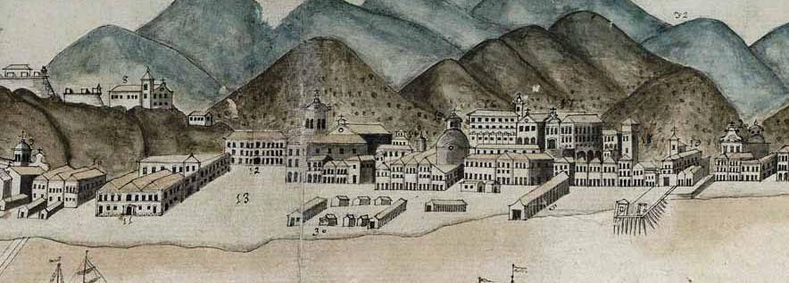
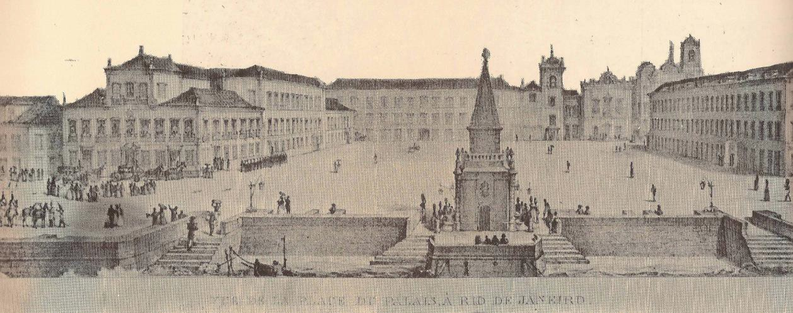
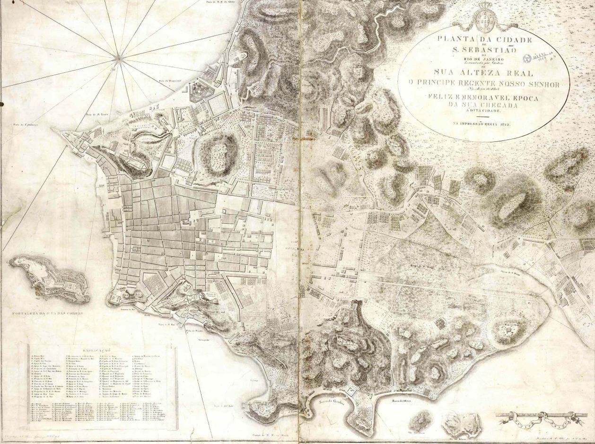
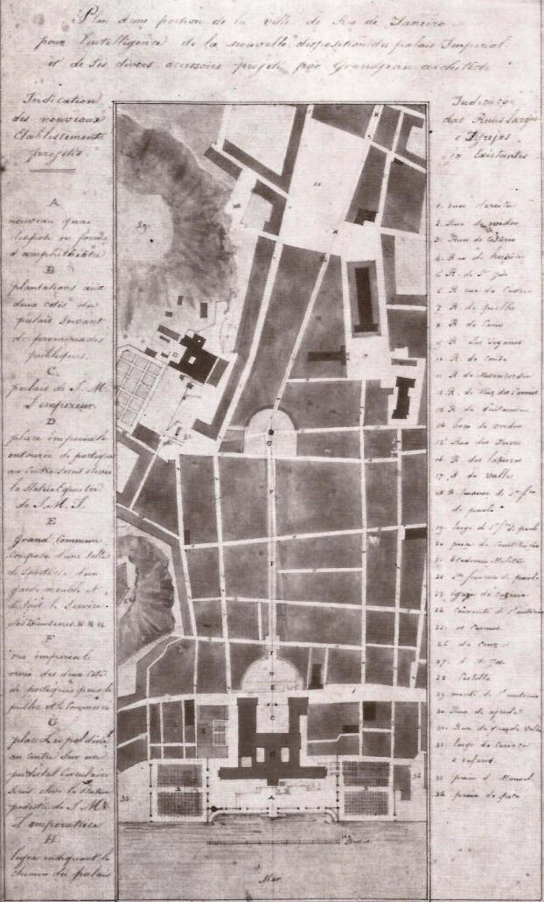
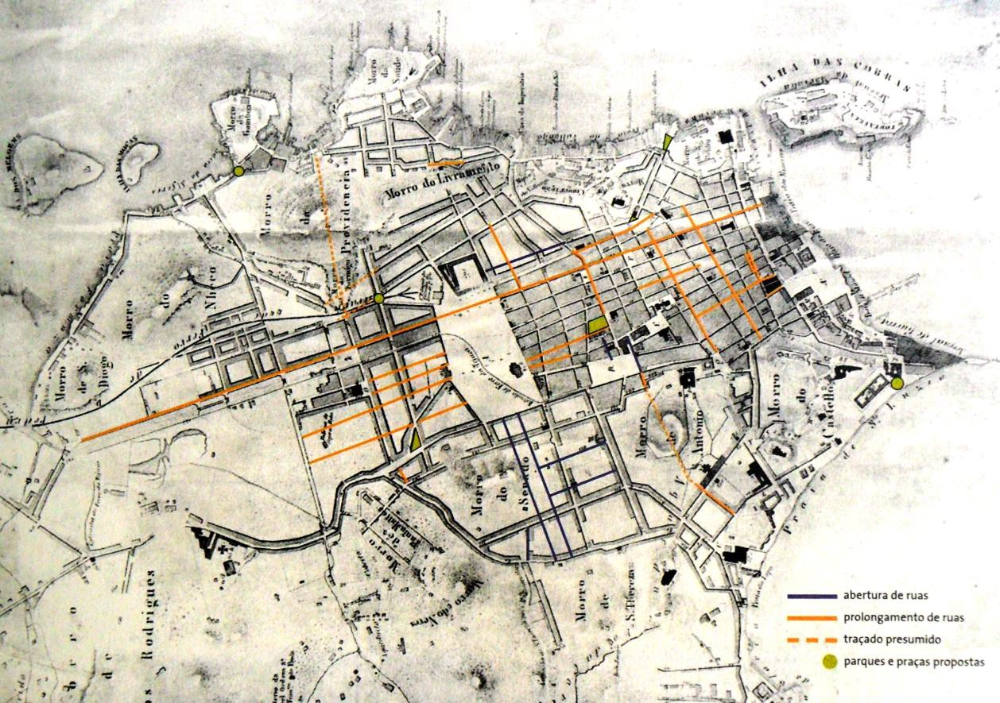
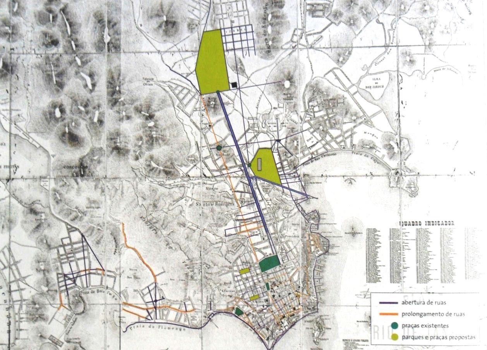
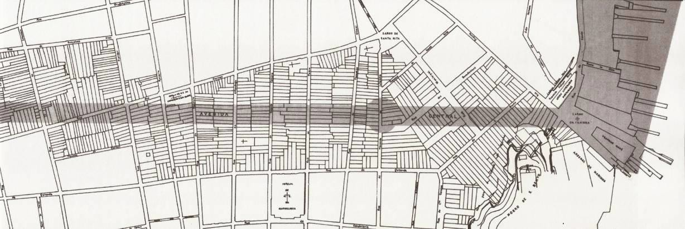

# Resumo

A transferência da Corte Portuguesa para o Brasil em 1808 trouxe consigo
novas intenções e planos para o Brasil e para a cidade do Rio de
Janeiro. A carente colônia necessitava de um governo organizado e
instituições administrativas, de escolas, estradas, bancos, fábricas.
Todas as mudanças que ocorreriam na estrutura urbana naquele período
teriam como pano de fundo a sua adaptação à função de sede do Império.
Nesse processo, afastar-se das características de cidade colonial era
imprescindível para o Rio de Janeiro. A pesquisa que deu origem a esse
artigo tem como objetivo resgatar, sob o olhar dos planos urbanísticos,
dos projetos e das transformações efetuadas no Rio de Janeiro no século
XIX, a maneira de pensar a cidade a partir da chegada da corte real,
mostrando o quanto esse fato foi fundamental para alterá-la,
posteriormente, no início do século XX. Os novos hábitos trazidos da
metrópole europeia modificaram o comportamento dos moradores e a Missão
Francesa de 1816, chefiada por Joaquim Lebreton, contribuiu nesse
processo. Durante o século XIX foram elaborados dois planos urbanísticos
para a cidade do Rio de Janeiro: o Relatório Beaurepaire em 1843 e o
Relatório da Comissão de Melhoramentos, em 1875 e 1876. Ambos tinham
como preocupação questões de higiene, controle e indução do
desenvolvimento da cidade, pavimentação, abertura e alargamento de vias,
além de representarem a síntese do pensamento urbanístico do momento. Ao
se analisar os planos anteriormente citados, observamos muitos
princípios que foram colocados em práticas nas grandes intervenções
urbanas do século XX.

Palavras- Chave: Rio de Janeiro, História Urbana, Planos Urbanísticos,
Transferência da Corte Portuguesa, Século XIX

# Abstract

This article attempts to rescue, under the prism of the urban plans,
projects and works carried out in Rio de Janeiro in the nineteenth
century, the ways of thinking that held sway in the city after the
arrival of the Portuguese Royal Court, investigating how this event was
fundamental to transform the city long afterward, in the twentieth
century. The transfer of the Royal Court to Brazil in 1808 brought new
perspectives to the city of Rio de Janeiro and the entire country. All
the changes that occurred in the city in that period were based on the
need to adapt it to serve as capital of global Portuguese Empire. In
this process, it was essential to overcome the shortcomings of a
colonial outpost whose conditions shocked the new arrivals, in
counterpoint to the city's stunning natural beauty. As part of his
effort to change Brazil, King João VI contracted the French Artistic
Mission, which arrived in 1816, headed by Joaquim Lebreton. Two plans
were prepared for Rio de Janeiro, as the capital of the new Brazilian
empire that was established with independence from Portugal in 1822 :
the Beaurepaire Report in 1843 and the Improvement Commission Report of
1875-1876. Both focused on orderly development, sanitation, opening of
new streets and widening of existing ones and reflected a synthesis of
the international urban thinking of the time. By analyzing them, we find
many proposals relegated to the realm of mere ideas but others that were
put into practice in the great interventions of the twentieth century.
The construction of a canal through the swamps of the Cidade Nova area
and the demolition of Castelo Hill, to provide landfill to extend the
downtown area into the bay, were two of these ideas that finally came to

fruition in the following century.

## A transferência da família real portuguesa

A pesquisa que deu origem a este artigo teve como objetivo recuperar,
sob o olhar dos planos urbanísticos, dos projetos, intenções e
transformações efetuadas no Rio de Janeiro no século XIX, a maneira de
pensar a cidade a partir da chegada da corte real, mostrando o quanto
esse fato foi fundamental para alterá-la, posteriormente, no início do
século XX.

Colônia de Portugal desde o século o século XVI e capital do vice-reino
desde 1763, o Rio de Janeiro teve seu desenvolvimento marcado pela
transferência da corte portuguesa em 1808. Desde então, até 1821, foi
sede da monarquia portuguesa, única cidade das Américas na história a
receber o aparato burocrático e o contingente populacional antes
instalado na Europa. Até então nenhum rei havia visitado seus
territórios ultramarinos, nem mesmo para conhecê-los, muito menos para
morar e governar.

A fuga da monarquia portuguesa para sua colônia americana por ocasião da
invasão dos exércitos napoleônicos é um divisor de águas no processo
histórico brasileiro. Os preparativos iniciais para acomodar a família
real marcaram apenas o começo da transformação do Rio de Janeiro, pois o
projeto de construir uma nova cidade e capital imperial perdurou por
todo reinado brasileiro do príncipe regente (SCHULTZ, 2008).

A estrutura urbana encontrada pela família real foi em grande parte
construída por Luis de Vasconcelos e Sousa, que administrou a cidade
entre os anos de 1778 e 1790. O vice-rei é considerado autor da primeira
remodelação urbana do Rio de Janeiro e precursor das intervenções
voltadas à adequação da cidade aos conceitos modernos das capitais
europeias, atuando não só na expansão da estrutura urbana, mas também
nos usos desses espaços. Sua gestão é conhecida principalmente pela
construção do Passeio Público e reurbanização do Largo do Carmo,
expressões da prosperidade da época.

> 
>
> Figura 1. Vista do Largo do Carmo em 1775. Fonte: Base digital da
> Biblioteca Nacional disponível em
> <http://bndigital.bn.br/acervo-digital/> (acesso em 16/07/2013)
>
> 
>
> Figura 2. Vista do Largo do Carmo por Debret na década de 1830, após a
> reforma de Vasconcelos e Sousa. Fonte: Pontifícia Universidade
> Católica, 1979, p.128.

A transformação do Rio de Janeiro em corte real começou apenas dois
meses antes da chegada do príncipe regente, quando as notícias do exílio
real foram recebidas. As ações imediatas deveriam dar conta dos novos
usos, nova classe, novas necessidades e novos agentes que junto com a
corte chegavam ao Brasil.

Menos de uma semana após sua chegada, ainda em Salvador, D. João VI
decretou a abertura dos portos às \"nações amigas\". Esta medida
representou um golpe de morte no pacto colonial que, na prática,
obrigava que todos os produtos das colônias passassem antes pelas
alfândegas em Portugal, ou seja, os demais países não podiam vender
produtos para o Brasil, nem importar matérias-primas diretamente das
colônias alheias, sendo forçados a fazer negócios com as respectivas
metrópoles.

Permitiu assim a integração do Brasil ao mercado mundial e consequente
invasão de produtos estrangeiros, rompendo a base sobre a qual se
assentava o domínio metropolitano: o monopólio comercial. De acordo com
Pinto (2007), essa medida era prova de uma contradição inevitável na
política econômica adotada pela Corte, que queria imprimir os princípios
do liberalismo econômico em pleno território colonial.

No que diz respeito ao perímetro urbano do Rio de Janeiro Dom João VI
cria o imposto da décima para os prédios urbanos em condições habitáveis
dentro dos limites das cidades e vilas. Prática já conhecida em
Portugal, o tributo consistia no pagamento anual para a Real Fazenda,
por parte dos proprietários, de 10% do rendimentos líquidos dos prédios,
com o objetivo de suprir os cofres da corte portuguesa estabelecida no
Rio de Janeiro, criando uma fonte de renda imediata.

Silva (2012, p.52) ressalta que três medidas de impacto devem ser
destacas, que foram colocadas em prática logo na chegada da família
real, quando \"uma nova forma de organização começava a ser gestada,
articulando conhecimento, atuação sobre o espaço urbano e normas\".
Foram elas: criação da Intendência Geral da Polícia, o diagnóstico
médico e o mapa oficial, o qual tinha como objetivo registrar a situação
da cidade e servir de instrumento para planejar as mudanças necessárias
à nova sede da corte, articulando o projeto civilizatório ao território.
Juntas indicavam uma nova forma de organização e intervenção,
principalmente se atrelados à introdução da décima urbana.

> 
>
> Figura 3. Mapa do Rio de Janeiro requisitado por D. João VI em 1808 e
> publicado em 1812. Fonte: Base digital da Biblioteca Nacional
> disponível em <http://bndigital.bn.br/acervo-digital/> (acesso em
> 16/07/2013)

O diagnóstico é produzido, ainda em 1808, pelo médico Manuel Vieira da
Silva, físico-mor do reino, encarregado por D. João de investigar as
causas da insalubridade da cidade. O fato de ter sido encomendado pelo
príncipe e publicado na imprensa transformaria o estudo em orientação
oficial. Os objetivos de D. João eram criar uma cultura de discussão na
cidade e divulgar um documento que fosse visto como inquestionável. Os
médicos eram interlocutores privilegiados para falar dos problemas da
estrutura urbana, principalmente por articular a saúde e doença da
população ao meio geográfico (SILVA, 2012, p.61). Essa associação
permitiria que o higienismo se tornasse um potente discurso para pensar
a cidade durante o século XIX e primeiras décadas do século XX.

## Reconstruindo a Corte Portuguesa

A vinda da família real foi o primeiro momento em que a ideia de
civilização começaria a ser articulada ao território da cidade, e todas
as mudanças que ocorreriam na estrutura urbana e social naquele período
teriam como pano de fundo a sua adaptação à função de sede do Império
nos trópicos (SILVA, 2012); uma nova maneira de se pensar a cidade seria
introduzida marcando definitivamente o futuro da cidade do Rio de
Janeiro.

A instituição responsável pelo bem público e comum era a Intendência
Geral da Polícia, uma das repartições trazidas pela família real; era
responsável pelas obras públicas, abastecimento de água, iluminação e
segurança, e ainda pela disciplinarização da vida dos moradores. A
provisão e a regulamentação de moradias figurava entre os
empreendimentos mais imediatos com que a Intendência estava envolvida

A transformação do Rio de Janeiro em corte real tinha de envolver a
marginalização da

estética e das práticas que não conseguiam refletir essa mudança. Era
consenso entre as classes dominantes que não ser mais colônia
significava adotar um projeto colonial: civilizar- se. Para isso era
necessário a criação e imposição de uma uniformidade estética e cultural
\"no sentido de tornar a cidade em condições de servir de sede às
principais autoridades do reino.\" (BRASIL, 1923, p.11).

> Construir uma corte real significava construir uma cidade ideal; uma
> cidade na qual tanto a arquitetura mundana quanto a monumental,
> juntamente com as práticas sociais e culturais dos seus residentes,
> projetassem uma imagem inequivocamente poderosa e virtuosa da
> autoridade e do governo reais.\" (SCHULTZ, 2008, p.157)

Em março de 1811 Viana propôs que a solução da crise na provisão de
habitações na já apertada Cidade Velha podia ser encontrada se a atenção
fosse centrada numa região fora do centro da cidade conhecida como
Cidade Nova, aonde os pântanos cobriam a maior parte de área. Os
residentes deveriam ser estimulados a secar e aterrar a área e construir
casas. Assim, a cidade seria enobrecida, mais habitações estariam à
disposição, e os alugueis cairiam. A imposição de padrões para a
construção na área poderia ser disfarçada por meio de isenções. Mais
importante, \"as intervenções da coroa dariam fim à \"liberdade mal
entendida\" de construir como quiser, reforçando consequentemente a
autoridade do príncipe regente.\" (SCHULTZ, 2008, p.163).

Ficou estabelecido então que seria concedida isenção da décima urbana
por dez ou vinte anos aos proprietários que edificassem casas de sobrado
nos terrenos situados na Cidade Nova; a construção de casas de um só
pavimento ficava proibida.

## A Missão Artística Francesa

Com o objetivo de modernizar e se afastar dos traços coloniais da
cidade, novos padrões de civilidade são importados da França e
Inglaterra, influenciados pela razão da elite burguesa e da Revolução
Industrial, trazidos pela Missão Artística Francesa em 1816. De caráter
civilizatório e chefiada por Joaquim Lebreton, o projeto trouxe consigo
uma nova ideologia de arquitetura, artes e espaço urbano, e tinha como
objetivo principal atualizar o gosto e a técnica do império em
território brasileiro.

> (\...)sustentar a renovação da monarquia no Novo Mundo demandava as
> reformas correspondentes. A grandeza de uma monarquia americana teria
> que começar pela grandeza de sua capital. (SCHULTZ, 2008, p.155)

Para Schwarcz (2008) a chamada Missão Artística Francesa foi uma grande
convergência de interesses. A autora defende que, diferentemente da
versão oficial, a iniciativa e realização do projeto partiu dos artistas
franceses, encabeçados por Joaquim Lebreton, tendo o governo português
apoiado o grupo após sua chegada em terras brasileiras. Somente décadas
depois seria denominada como \"Missão Francesa\".

De um lado estavam uma série de artistas franceses formados pela
Academia de Artes Francesa, no mais estrito estilo neoclássico,
vinculados ao derrotado Estado Napoleônico. Desempregados, perderam boa
parte de suas economias.

Do outro, D. João VI recebeu com muito bom grado a propostas dos
artistas. A corte tinha bastante interesse em recepcionar um grupo de
acadêmicos que poderiam reformular e elevar sua representação oficial.
Em uma sociedade majoritariamente analfabeta, a iconografia se

apresenta como importante instrumento para construção e fortalecimento
da pátria local.

O arquiteto projetou a decoração de inúmeros festejos públicos, algumas
eram efêmeras, outras não; o fato é que todas tinham como objetivo
afirmar a superioridade e a presença da Corte diante das camadas mais
populares. Segundo Telles (2000), essa arquitetura do espetáculo, que
afirmava o neoclássico como o estilo do império, tinha também como
objetivo transmitir a ilusão de se estar em uma capital europeia,
desvinculando assim a cidade de seu passado colonial.

O primeiro dos seus grandes projetos urbanísticos estava vinculado à
construção de um novo palácio imperial e reorganização do centro do Rio
de Janeiro. Por volta de 1826 Montigny elabora o projeto de uma extensa
avenida monumental que permitiria a ligação entre o Campo de Santana, o
Largo do Rocio e a Praça XV, a qual abrigaria o novo palácio,
incorporando o Paço Real à nova estrutura.

Em 1827 uma elaborada proposta prevê a
preparação de uma nova malha urbana no mangue de São Diogo - Cidade
Nova, mais regular e simétrica, além da remodelação do Campo de Santana,
circundado de edifícios políticos e administrativos, conforme uma praça
francesa, revelando assim a intenção de criar um novo centro de poder
afastado do núcleo colonial; a partir dele toda urbe seria reorganizada.

> Figura 4. Plano de parte da cidade do Rio de Janeiro situando novo
> Palácio Imperial. Fonte: Pontifícia Universidade Católica, 1979, p.
> 161

De acordo com Taunay (1956), pode-se afirmar que Grandjean foi o
primeiro grande urbanista que teve o Rio de Janeiro e o primeiro técnico
do Brasil, fora da área da saúde, que se preocupou com a higiene dos
edifícios. O problema do saneamento e da drenagem, questões fundamentais
que só seriam resolvidas muito mais tarde, são preocupações do arquiteto
em seus projetos, quando prevê linhas para saída das águas e dos
esgotos.

O projeto neoclássico para a cidade não se realiza; apesar do sucesso
obtido nas exposições públicas da Academia, a maioria dos seus projetos
são destinados a ficar no papel. Do plano de Grandjean só ficam alguns
edifícios isolados e algumas ideias urbanísticas separadas do contexto
em que tinham sido elaboradas. A abertura da monumental avenida
retilínea, que corta a trama da cidade velha, será realizada no início
do século XX, por ocasião da radical \"modernização\" da cidade
executada pelo prefeito Pereira Passos.

Entre 1808 e 1821 a população dobrou, passando de cerca 50 a 60 mil
habitantes para 100 a 120 mil (PREFEITURA DA CIDADE DO RIO DE JANEIRO,
2008). A presença do rei no

Rio de Janeiro exercia atração sobre os habitantes de outras partes do
Brasil, das Américas e da própria Europa. Gomes (2007) afirma que os
treze anos em que a corte portuguesa permaneceu no Brasil não se
comparam com nenhum outro período da história brasileira no que diz
respeito às profundas, decisivas e aceleradas mudanças.

As transformações pela qual a cidade passaria deveriam dar conta desta
nova exigência ao fazer convergir todas as atenções para o Rio, agora
sede da coroa para torna-la cabeça do Brasil. No entanto, é necessário
falar em perdas e ganhos nesse processo de *metropolização*, pois as
mesmas transformações que aproximavam a cidade dos atributos europeus,
tornando-a mais limpa, iluminada, com teatros e modas cortesãs,
afastavam-na de suas características coloniais, a exemplo da proibição
do uso de rótulas em prédios residenciais (SILVA, 2012, SCHULTZ, 2008).

## As transformações do Rio de Janeiro pós-Independência

Duas décadas após o retorno de D. João VI a Portugal em 1821 e o
rompimento com a corte portuguesa em 1822, o contexto social e urbano do
Rio de Janeiro era de grande crescimento demográfico. Esse incremento da
população urbana não foi, no entanto, acompanhado de proporcional
melhoria nas condições de higiene. Logo, não é de se surpreender que os
problemas sanitários tivessem destaque no planejamento urbanístico desde
essa época.

Apesar de pouco conhecido, o Relatório Beaurepaire, formulado pelo então
diretor de Obras Municipais, pode ser considerado o primeiro plano
urbanístico para a cidade do Rio de Janeiro, por apresentar uma proposta
global de organização formal. O relatório não se restringiu aos
problemas emergenciais, fazendo uma extensa avaliação dos problemas da
cidade, sugerindo algumas medidas para resolvê-los.

A ânsia por melhora e embelezamento da cidade, que teve como uma das
primeiras consequências as propostas da Missão Francesa, alcançou sua
maturidade no início da década de 1840 quando a elite do império e o
Conselho de Estado começaram a demonstrar interesse pela realização de
melhorias, associadas também à consolidação da burguesia urbana
(ANDREATTA, 2006). Além disso podemos destacar o sucesso econômico do
plantio de café, que equilibrou as contas externas do país, permitindo a
formação de capital nacional que, em conjunto com o capital estrangeiro,
estimularam o progresso e desenvolvimento.

Henrique Beaurepaire-Rohan, após alguns anos viajando pelo território
brasileiro como membro do Imperial Corpo de Engenheiros, retornou e
encontrou a cidade com os mesmo problemas que existam anteriormente;
deficiente captação e distribuição de águas, falta de

calçamento das ruas e iluminação pública continuavam ocupando todo o
orçamento da Inspetoria de Obras Públicas do Ministério dos Negócios do
Império. Cedido à câmara municipal da corte entre 1842 e 1843,
confeccionou o relatório que se tornaria referência para pensar a cidade
nos anos seguintes.

Seu relatório é dividido em duas partes, salubridade pública e
aformoseamento da cidade. As principais propostas da primeira parte,
utilizando critérios higienistas, são: a transferência do matadouro
público para a praia de São Cristóvão; a solução para a questão do
esgotamento sanitário através da adoção do padrão europeu; construção de
encanamentos para abastecimento de água por todas as casas a partir dos
rios Carioca e Maracanã; estabelecimento de um canal de navegação no
mangue da Cidade Nova - Canal do Mangue - com o objetivo de eliminar o
grande \"foco de miasmas\" da região; desmonte do Morro do Castelo a fim
de ampliar a extensão da cidade e contribuir para salubridade e
embelezamento.

> 
>
> Figura 5. Esquema parcial das propostas do Plano Beaurepaire realizado
> sobre a planta de 1854. Fonte: SMU/IPP, 2008, p.29

Sobre as propostas de aformoseamento, utilizando critérios urbanísticos
e estéticos, Beaurepaire dedica um plano de reedificação à região
considerada mais \"defeituosa\", a Cidade Velha. Visando melhorar a
circulação, propõe ampliação e abertura de diversas vias estabelecendo
alguns critérios urbanísticos, como extensão dos quarteirões e altura da
edificações. Reitera ainda a necessidade de caimento adequado das
calçadas, favorecendo o esgotamento. Sobre as praças, além de recomendar
a abertura de 8 novas em locais específicos, propõe a regularização da
Praça da Aclamação, para isso recorre a parte da antiga proposta de
Grandjean de Montigny, que, apesar de não ter sido colocada em prática,
é recuperada no Plano Beaurepaire, sofrendo adaptações.

SMU/IPP (2008) destaca a atualidade de suas propostas e que, se muitas
daquelas sugestões tivessem sido realizadas naquele momento, inúmeras
questões atuais da cidade seriam

minimizadas. O fato é que mesmo o plano não tendo sido colocado em
prática, levantou importantes questões, estimulando a discussão
urbanística e abrindo portas para que algumas décadas mais tarde a
Comissão de Melhoramentos fizesse uma nova proposta.

## O Rio de Janeiro e o processo de modernização

No que tange à infraestrutura, após séculos tendo seu esgoto despejado a
céu aberto em valas ou mesmo nas praias, o quadro sanitário da cidade
foi se agravando tornando-se o principal alvo da campanha movida pelos
médicos e, logo depois, pela opinião pública, a favor de melhorias que
saneassem a capital do império.

O serviço foi entregue à companhia inglesa *The Rio de Janeiro City
Improvements*. Apesar de ser quantitativamente eficaz, o serviço
prestado sempre foi criticado como de má qualidade.

A classe proletária, com reduzido ou nenhum poder de mobilidade,
adensava-se cada vez mais nas freguesias urbanas centrais. O capital,
sobretudo estrangeiro, à sombra dos privilégios concedidos pelo Estado
Imperial, apossou-se de grandes fatias do urbano, penetrou em muitas
esferas básicas para a existência cotidiana de uma população cada vez
mais numerosa, concentrada nos exíguos limites da área central do Rio de
Janeiro (BENCHIMOL, 1992). Um contingente cada vez mais numeroso de
trabalhadores livres trabalhava e habitava essa mesma região.

O Rio sempre foi considerada uma cidade insalubre, mas registros indicam
que a primeira grande epidemia de febre amarela tenha sido em 1850. A
formação da Comissão Central de Saúde Pública e outras medidas que se
sucederam marcaram a institucionalização de um tipo de medicina que
vinha se constituindo desde os anos de 1830 / 40.

A medicina social contribuiu decisivamente para a promulgação das
primeiras leis submetendo a normas e interdições o crescimento
\"espontâneo\" da cidade. Tais leis foram quase sempre ineficazes, no
entanto seu discurso se infiltrou no senso comum das camadas dominantes
e das camadas médias, culturalmente subalternas, que nos anos 1870 já
construíram uma influente \"opinião pública\" favorável a todo tipo de
melhoramento que transformasse a capital do império numa metrópole
salubre e moderna.

O segundo quartel do século XIX marcou o início da difusão dos
transportes ferroviários por todo o mundo. A separação dos usos e
classes que se amontoavam no antigo espaço colonial só foi possível
devido à introdução do bonde de burro e do trem a vapor que,
constituíram-se nos grandes impulsionadores do crescimento físico da
cidade.

Nesse contexto de grandes transformações, as contradições sociais se
tornaram ainda mais evidentes, aguçadas pelas fortes epidemias de febre
amarela. O então ministro do Império propôs ao Imperador, em 1874, a
nomeação de uma Comissão de Melhoramentos da cidade do Rio de Janeiro,
composta pelos engenheiros Francisco Pereira Passos, Jerônimo Rodrigues
de Morais Jardim e Marcelino Ramos da Silva. Dois relatórios foram
apresentados, um em 1875 e outro em 1876, considerado o primeiro plano
urbanístico da cidade a ser levado ao conhecimento público, ampliando as
discussões acerca do urbano.

O primeiro relatório é apresentado ainda em 1875, apenas dez meses após
a nomeação da comissão, e concentra suas propostas na área da Cidade
Nova. Os engenheiros justificavam a escolha afirmando que aquela seria a
região mais necessitada de melhoramentos, que oferece melhor condições
para o desenvolvimento da cidade e na qual os gastos e dificuldades para
as obras seriam menores.

A comissão elege o Canal do Mangue como eixo principal das propostas
nesse primeiro

relatório. Este deveria ser navegável e ajudar a solucionar a questão do
dessecamento das áreas pantanosas, que ainda eram um obstáculo para a
expansão urbana. Para isso, seu prolongamento até o mar e a canalização
dos rios eram primordiais.

Sobre os parâmetros construtivos, destaca-se, principalmente, a
limitação da altura das fachadas e definição de altura mínima de 3
metros para compartimentos habitáveis. Para as novas grandes avenidas a
serem abertas a comissão procura manter o traçado retilíneo e adota
padrões de proporção entre a largura da via, calçada e passeios. Fazia
parte do esquema viário que essas avenidas formassem grandes eixos
monumentais unindo espaços simbólicos, remetendo ao plano de Haussmann
para Paris.

Diante de inúmeras críticas por não abarcar a Cidade Velha em seu plano,
a comissão apresenta um segundo relatório, em 1876. Possui semelhanças
com as ideias do primeiro relatório, insistindo na defesa de suas
premissas através de exemplos internacionais. No entanto, dessa vez os
engenheiros também se debruçam sobre a Cidade Velha, entendendo como
complemento indispensável (ANDREATTA, 2006).

Além de reforçar as propostas contidas no primeiro relatório, a comissão
propõe a abertura, prolongamento, alargamento e retificação de uma série
de ruas na Cidade Velha. Ratifica os pareces higienistas e recupera
Beaurepaire ao propor o arrasamento dos Morros de Santo Antonio, Castelo
e Senado, afirmando que seria determinante para melhorar a ventilação na
cidade. As vultuosas demolições e desapropriações necessárias para sua
realização também recuperam o Plano Beaurepaire.

> 
>
> Figura 6. Síntese das propostas da Comissão de Melhoramentos sobre a
> planta geral da cidade de 1875. Fonte: SMU/IPP, 2008, p.60

Somente uma pequena parcela das propostas começou a ser colocada em
prática principalmente por problemas financeiros. No entanto, além de
levantar a questão urbanística

para discussão pública, a Comissão de Melhoramentos foi fundamental para
moldar o pensamento daquele que viria a ser prefeito da cidade do Rio de
Janeiro alguns anos mais tarde. Francisco Pereira Passos era um dos
engenheiros responsáveis pelo plano, e pôde colocar em prática boa parte
no início do século XX, naquela que é considerada a primeira intervenção
sistemática e direta do Estado sobre o espaço urbano carioca.

## Primeiras intervenções no século XX

A cidade entra no século XX como república desde 1889 e com uma série de
problemas urbanísticos. Visando difundir no território urbano a ideia de
modernidade e baseando-se em experiências de capitais europeias, a
classe política republicana busca a construção de uma imagem simbólica
da cidade vinculada ao seu papel de centro da nação. Para tanto seus
espaços devem ser ampliados, ordenados e embelezados.

O grande realizador dessa missão foi Pereira Passos, que ganhou plenos
poderes do então presidente Rodrigues Alves, cujas ações tiveram enfoque
na capital da República. Fundamentado em muitos dos argumentos
utilizados nos planos já apresentados, um Pereira Passos mais maduro
propõe a abertura de sete eixos viários que seriam suporte da cidade
remodelada.

A monumentalização da cidade foi reforçada, pessoas foram expulsas do
Centro, tanto pela derrubada de prédios e do Morro do Senado, quanto
pela valorização dos terrenos, sendo um dos fatores que levaram ao
aparecimento das primeiras favelas, além de deixar uma imensa dívida
pública para seus sucessores. A eficiência na execução imediata e na
programação das obras difere esse plano dos anteriores, e faz com que
seja tão comentado e estudado, um verdadeiro marco na história do Rio de
Janeiro.

O \"bota-abaixo\" dos primeiros anos do século XX recupera uma série de
novas maneiras de se pensar a cidade que se desenvolveram a partir da
transferência da corte portuguesa, quando passou a ser planejada e
modificada para se aproximar à grandeza de uma capital europeia, quando
novas classes e novos usos passaram a conviver na apertada cidade
colonial. Afastando-se dos traços coloniais, os planos do século
anterior buscaram principalmente monumentalidade, embelezamento,
saneamento, visando tornar o Rio de Janeiro o centro da nação, um modelo
de cidade nacional.

Através da recuperação do discurso higienista, Pereira Passos promove a
abertura e alargamento de uma série de eixos monumentais, que
transformariam a imagem do Rio de Janeiro. O grande marco é a Av.
Central, que \"rasgou\" de mar a mar a cidade velha com 1.800 metros de
comprimento e 33 metros de largura, demolindo cerca de 700 edificações,
entre elas cortiços e outras habitações das classes populares, que
seriam, segundo o prefeito, as principais fonte de insalubridade da
cidade. Um concurso de fachadas em estilo neoclássico foi promovido para
que a nova via se aproximasse ainda mais do padrão europeu. A
canalização do mangue na Cidade Nova em conjunto com a construção de uma
larga avenida, premissa na proposta da Comissão de Melhoramentos, é
finalmente concretizada.

> 
>
> Figura 7. Detalhe do projeto de abertura da Av. Central. Em cinza a
> nova via a ser aberta, promovendo vultuosa demolição do casario
> antigo. Fonte: ABREU, 2008, p.65

Outras propostas que nasceram no século XIX, como a derrubada do Morro
do Castelo e do Morro de Santo Antonio, só foram colocadas em prática
algumas décadas depois, em 1921 e 1950, respectivamente, o que mostra
por quanto tempo as ideias difundidas naquele século permaneceram vivos
e o quão importante foi sua influência.

# Referências bibliográficas

> ABREU, M. de A. *A Evolução Urbana no Rio de Janeiro*. Rio de Janeiro:
> IPP, 2008.
>
> ANDREATTA, V. *Cidades quadradas, paraísos circulares: os planos
> urbanísticos do Rio de Janeiro no século XIX*. Rio de Janeiro: Mauad
> X, 2006.

BENCHIMOL, J. L. Pereira Passos um Haussmann tropical, transformações
urbanas na

> *cidade do Rio de Janeiro no século XX.* Rio de Janeiro: SMCTE/DGDIC,
> 1992
>
> BRASIL. *Recenseamento do Brazil: População do Rio de Janeiro.*
> MINISTÉRIO DA AGRICULTURA, INDUSTRIA E COMÉRCIO, vol II. Rio de
> Janeiro, 1923.
>
> PINTO, F. M*. A invenção da cidade nova do Rio de Janeiro: agentes,
> personagens e planos.* Dissertação apresentada ao Curso de Mestrado e
> Pós-Graduação em Planejamento Urbano e Regional da Universidade
> Federal do Rio de Janeiro. Rio de Janeiro, 2007.

PONTIFÍCIA UNIVERSIDADE CATÓLICA DO RIO DE JANEIRO. Departamento de

> Artes. *Uma cidade em questão I: Grandjean de Montigny e o Rio de
> Janeiro.* Realização do Departamento de Artes da PUC-RJ. Rio de
> Janeiro: PUC: FUNARTE: Fundação Roberto Marinho, 1979.
>
> PREFEITURA DA CIDADE DO RIO DE JANEIRO. *Dicionário do Brasil Joanino:
> 1808- 1821.* Ronaldo Vainfas e Lucia Bastos Pereira das Neves
> Organizadores. Rio de Janeiro: Objetiva, 2008.
>
> SCHULTZ, K. *Versalhes Tropical: império, monarquia e a Corte real
> Portuguesa no Rio de Janeiro, 1808-1821.* Tradução Renato Aguiar. Rio
> de Janeiro: Civilização Brasileira, 2008.
>
> SCHWARCZ, L. M. *O sol do Brasil: Nicolas-Antonie Taunay e as
> desventuras dos artistas*
>
> *franceses na corte de D. João.* São Paulo: Companhia das Letras,
> 2008.
>
> SECRETARIA MUNICIPAL DE URBANISMO/IPP. *Planos Urbanos: Rio de
> Janeiro, O século XIX.* Nina Maria de Carvalho Elias Rabha
> Coordenadora. Rio de Janeiro: IPP, 2008.
>
> SILVA, L. *Memórias do urbanismo na cidade do Rio de Janeiro
> 1778/1878: estado, administração e práticas de poder.* E-papers. Rio
> de Janeiro, 2012.
>
> TAUNAY, A. de E. *A Missão Artística de 1816.* Rio de Janeiro:
> Ministério da Educação e Cultura / IPHAN, 1956.
