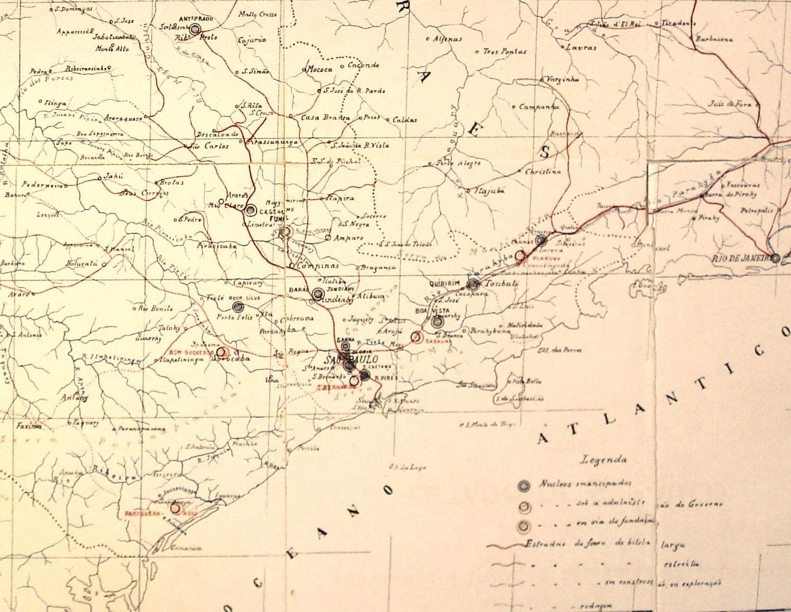
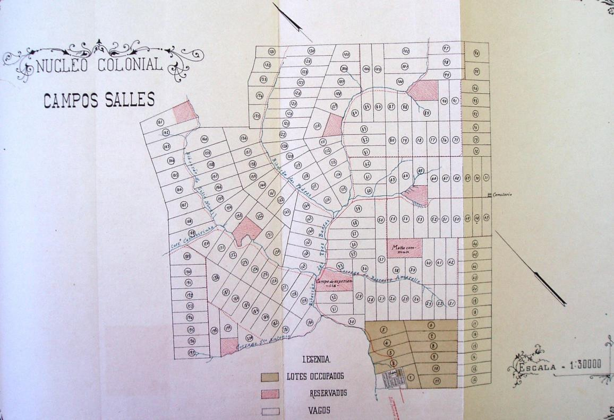
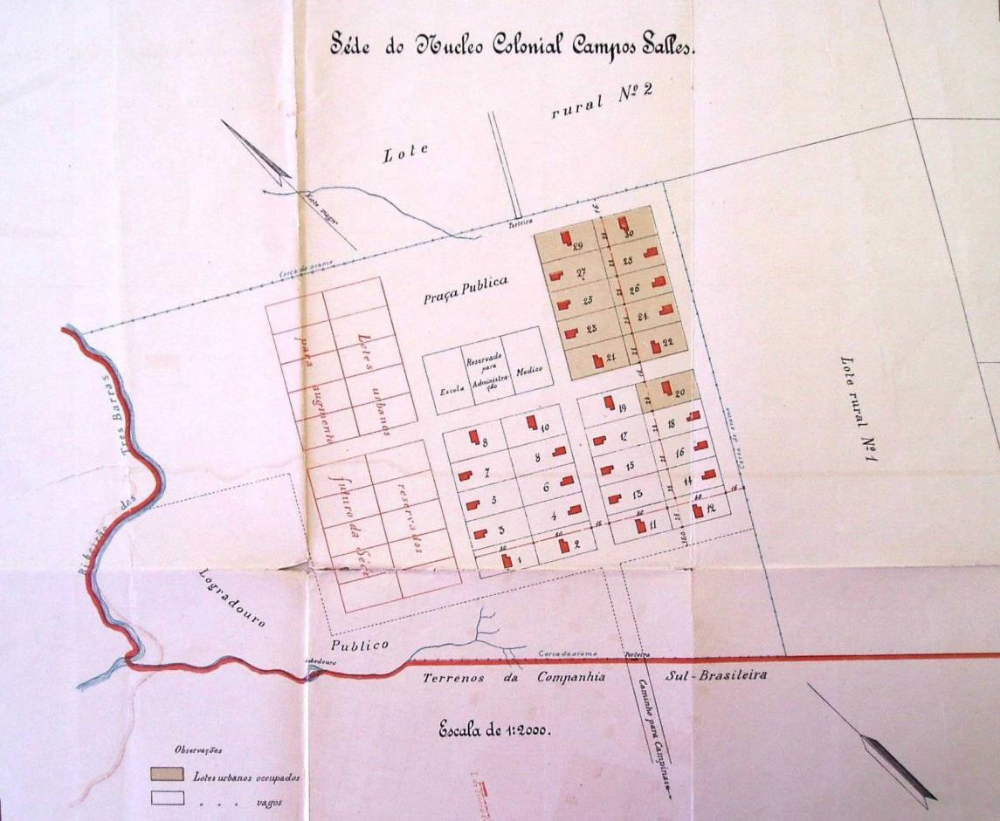

# Resumo

O trabalho versará sobre o processo de implementação do projeto de
colonização estatal conduzido pelo governo imperial e prosseguido pelo
governo republicano do estado de São Paulo, após 1889, a partir do qual
foi estabelecida uma rede de núcleos coloniais por todo o território do
estado articulados à rede ferroviária que se expandiu, principalmente
após a instituição da República. Como estratégia para aumentar a
produtividade do café e, ao mesmo tempo, desenvolver a policultura, o
governo republicano de São Paulo fundou mais de 16 núcleos coloniais
distribuídos por várias regiões do estado que se somaram às já 14
existentes, criadas ainda no Império. A fundação destes núcleos guardava
forte relação com os objetivos de desenvolvimento de algumas regiões do
estado, além de servirem como forma de fixação da população imigrante no
interior para intensificar a produtividade agrícola das fazendas. Ao
governo, cabia definir todos os passos para as fundações, como a
delimitação das terras necessárias, o estabelecimento de parcerias
quando fosse necessário, o agenciamento de imigrantes no exterior e a
implantação dos núcleos que incluía a construção de uma sede urbana e
pequenas parcelas rurais distribuídas e vendidas aos colonos. Além de
apresentar algumas características acerca da organização espacial destes
núcleos, este trabalho também discutirá o abandono do projeto já no
final da Primeira República, após a emancipação da maioria dos núcleos
até então existentes e o incentivo, pelo governo estadual, da
implantação de novos pela iniciativa privada.

> Palavras-chave: núcleos coloniais, colonização, imigração, expansão
> territorial, Primeira República, desenvolvimento agrícola.
>
# Abstract
>
> This work will focus on the process of implementing the project of
> colonization led by the imperial government and pursued by the
> Republican government of São Paulo, after 1889, from which a network
> of colonial settlements was established throughout the territory of
> the state, to articulate railway network expanded, especially after
> the establishment of the Republic. As a strategy to increase
> productivity of coffee and, at the same time, develop mixed farming,
> the Republican government founded over sixteen colonial villages
> spread across many regions of the state added to the fourteen already
> existing created by the Empire. The foundation of these settlements
> was going with the objectives of development of some regions, besides
> serving for setting the immigrant population in the interior to
> enhance agricultural productivity in the farms. The government would
> define all the steps to the foundations: the division of land needed,
> the establishment of partnerships when necessary, the agency of
> immigrants abroad and deployment of the core that included the
> construction of a rural headquarters and urban small plots distributed
> and sold to settlers. Besides presenting some characteristics about
> the spatial organization of these villages, this paper will also
> discuss the renouncement of the project at the end of First Republic,
> after the emancipation of the majority of them and the incentive, by
> the state government, for implementation of new ones by the private
> enterprises.
>
> Keywords: colonial settlements, colonization, immigration, territorial
> expansion, First Republic, agricultural development.

# Introdução

O processo de expansão da economia agroexportadora do café em São Paulo
tinha como pressuposto o estabelecimento, pelo governo republicano, de
um arranjo produtivo nas propriedades rurais que levasse em conta a
fixação dos trabalhadores imigrantes. O federalismo, como projeto
político da Primeira República, promoveu um fortalecimento econômico dos
governos estaduais que, em São Paulo, determinou um maior alcance no
desenvolvimento de políticas territoriais que incluía investimentos
tecnológicos nas atividades agrícolas, expansão da rede ferroviária,
instalação de redes de infraestrutura sanitária nas cidades, subsídios
nas atividades de imigração e a política de terras e colonização. Esta
articulação territorial que se propunha estabelecer em todo o estado de
São Paulo ganhou força com a complexificação da sociedade e consolidação
em marcha da burguesia paulista. Algumas questões, delineadas no âmbito
da história social (BURKE, 2002), merecem ser desatacadas como
pressupostos metodológicos deste trabalho.

A progressiva diversificação econômica que se processou durante as duas
primeiras décadas do século XX denota a presença de conflito de
interesses entre frações de capital, em sintonia com os apontamentos de
HARVEY (1980) e TOPALOV (1979). Este último o faz considerando a
presença dos diversos agentes, com seus inúmeros subgrupos, com
variedades de reivindicações, difusas e coordenadas por movimentos
diversos. Para SAES (1986), tais conflitos não eram apenas o resultado
de uma conjuntura desfavorável, mas encontravam-se na essência das
próprias transformações do período. Esta diversificação foi evidenciada
por FONT (1988: 10) observando a consolidação, já a partir da década de
1920, de novos tipos de produtores, intermediários e financiadores
antagônicos ao sistema vigente caracterizado pelas antigas relações de
produção: plantador e comissariado.

Na análise de CANO, há uma complexa trama econômica que gravitou em
torno do núcleo rural cafeicultor. As raízes da concentração industrial
em São Paulo estão no que ele denominou de complexo cafeeiro paulista.
Os descompassos e políticas cambiais oscilatórias nem sempre promoveram
uma sintonia entre um setor e outro. É isso que o faz afirmar que, com a
queda da lucratividade média da cafeicultura, criavam-se condições para
que parte dos lucros cafeeiros fossem investidos em outros segmentos do
complexo: bancos, estradas, indústrias, usinas e que em um quadro de
complexas oscilações, nem sempre as relações entre o capital cafeeiro e
a expansão do capital industrial se davam em um único sentido ou em uma
só direção (CANO, 1998: 143).

A formação do chamado Estado moderno burguês (SAES, 1985: 39) corrobora
o engendramento das relações sociais do início da República, com o
fortalecimento da burocracia institucional e de seu papel como
fomentador autônomo do "projeto modernizador", em sintonia com a
burguesia em ascensão. Ao mesmo tempo em que se estabelece como
neutralizador da luta de classes, na medida em que falseia uma igualdade
estabelecida através do tratamento igual aos desiguais pelos condutos
jurídico-institucionais, estabiliza a burocracia burguesa com o seu
conjunto de recursos materiais e humanos utilizados na conservação da
dominação de uma classe por outra.

No aprofundamento deste complexo econômico, a articulação entre Estado e
burguesia cafeeira teve como pressuposto a estruturação de novos modelos
de produção e expansão por frentes pioneiras, das quais o Estado
participou com a implantação de seus núcleos coloniais e instituição dos
patronatos agrícolas, mas que se sucedeu sob outros moldes, com a
apropriação, pela iniciativa privada, não necessariamente vinculados aos
interesses iniciais do Estado, de oportunidades

oferecidas por este e voltados, quase exclusivamente, aos processos de
reprodução do capital que se aceleraram nesta dinâmica de diversificação
econômica. O projeto inicial que se pautara pela ampliação das
atividades produtivas rurais em policultura para a substituição de
importações de produtos de subsistência, transformaram-se, com o tempo,
na estruturação de núcleos coloniais anexados às fazendas particulares,
de caráter residencial e especulativo e, já, nos últimos anos da
República, na criação de pequenos núcleos urbanos ao longo das linhas
ferroviárias (CARVALHO, 1988).

# O plano de colonização paulista

Por força do artigo 64 da Constituição Federal de 1891, que transferiu
ao domínio dos estados todas as terras públicas devolutas, era
necessário criar um programa para sua demarcação e utilização. Tomar
posse destas terras e legitimá-las foi uma tarefa árdua para o Governo,
lenta e precariamente conquistada em paralelo à política ostensiva de
criar núcleos produtivos e implantar infraestrutura de transporte. Para
isso, esforçou- se em exigir que os ocupantes das terras legitimassem os
seus títulos possibilitando que os terrenos devolutos também pudessem
ser demarcados.

O esforço em levantar e discriminar o conjunto de terras devolutas e
entrega-las à exploração produtiva revela a capacidade do Governo em
articular as políticas que estava implementando, tornando-o parte do
patrimônio público e um importante recurso material para o projeto
modernizador. Entre os que defenderam um plano de colonização para as
terras públicas, estava Francisco Glicério. Quando se tornou Ministro da
Agricultura em janeiro de 1890, instituiu o Decreto 528, de 28 de junho
de 1890, regulando os serviços de imigração e colonização. Partia dali,
um modelo para o projeto de colonização com utilização das terras
devolutas de São Paulo. A primeira parte do Decreto tratava da
introdução de imigrantes, que, aqui chegados, poderiam voluntariamente
procurar colocações nas fazendas, nas fábricas, nas construções, nos
campos, nas cidades e nas propriedades particulares por pequenas
lavouras e também instituía auxílios pecuniários diretos da União para
os proprietários de terras, inclusive para os que quisessem comprar
terras devolutas, cultivadas ou não, que as dividissem em lotes e as
cedessem às famílias de imigrantes. O projeto de Glicério continha
alguns princípios, como valorizar as terras já cansadas das grandes
propriedades, utilizando-as para a produção de cereais, uva e outras
pequenas culturas; repovoar as grandes propriedades abandonadas após a
extinção do trabalho escravo, tornando-as centros de atividades de
produção e comércio; discriminar as terras públicas, tirando-as do
domínio de particulares e, por fim, povoá-las em territórios calculados
de 30, 200 ou 500 famílias, ligando os núcleos coloniais aos portos, às
estações das ferrovias federais e estaduais e às povoações por estradas
de ferro.

O Governo paulista se interessaria por todo empreendimento que
procurasse estabelecer um núcleo produtivo para o estado, como foi o
caso da concessão para a Companhia Industrial do Brasil, que solicitou
em 1892, 20 mil hectares de terras devolutas entre os rios Guarau e
Jacupiranguinha, no município de Iguape, para a produção de ferro e
extração da mata existente para a produção de carvão (SÃO PAULO, 1893).
A intenção de permitir a ocupação humana pelo interior motivou o Governo
a implementar com recursos próprios um plano de colonização, que era
essencial do ponto de vista territorial, pois procurava ocupar as
principais zonas de produção para não só amplificar a ocupação das
terras a partir dos núcleos, mas criar maior rentabilidade com as terras
públicas, permitir a investigação da produção diversificada, de gêneros
de primeira necessidade, nas diferentes "zonas climatérias" e fixar o
imigrante ao solo.

Nos discursos oficiais, a utilização das terras devolutas era
incentivada para fazer frente à ocupação exclusiva das grandes
propriedades cafeeiras. A ideia de que a colonização subsidiada pudesse
servir como alavanca da economia, permitindo que o colono acumulasse
capital para investir no próprio solo, comprando terras ou organizando a
produção, aparecia nas declarações oficiais. O parcelamento do solo em
pequenas propriedades seria assim, a alternativa para possibilitar que o
imigrante fosse um investidor em potencial.

Já em 1895, o Secretário de Agricultura Jorge Tibiriçá admitia que este
plano não surtiria efeito se não contasse também com a iniciativa
particular. Iniciava ali uma política de colonização em parceria. Uma
das primeiras medidas neste sentido foi propor uma legislação que
concedesse favores especiais ao "retalhamento" do solo nas terras
marginais às ferrovias, proposta que teria sua primeira aplicação nas
terras que margeavam a ferrovia que ligaria São Paulo a Iguape, pela
Empresa de Colonização Sul Paulista e que nunca seria implementada (SÃO
PAULO, 1896).

A contraposição entre a extensiva ocupação pelas lavouras de café e um
novo tipo de ocupação a partir de núcleos coloniais foi intensivamente
abordada pelo Secretário de Agricultura, em 1903, Luiz de Toledo Piza e
Almeida. Dizia o Secretário que nenhuma terra imprópria para a cultura
cafeeira poderia ter sido fecundada. Os colonos que, a princípio vinham
para substituir os escravos emancipados, iam sendo absorvidos em levas
sucessivas, para o alargamento dos cafezais e as estradas de ferro, em
busca das fazendas de café, atravessavam quilômetros de terras incultas
com seus trilhos assentados a altos preços, tudo pelo café. Os dois
milhões e quinhentos mil hectares de áreas cultivadas por café, deveriam
ter sido aproveitadas para outras culturas, em benefício do equilíbrio
econômico, do barateamento da vida, diminuição das despesas de produção
e o barateamento dos transportes. Piza acreditava, portanto, que somente
duas medidas poderiam modificar esse quadro: o imposto territorial e a
colonização. O primeiro substituiria o imposto sobre exportações e
recairia justamente sobre as terras incultas, numa espécie de tributação
maior sobre as terras improdutivas (SÃO PAULO, 1904).

No ano seguinte, com a entrada de Carlos Botelho na pasta da
Agricultura, novos elementos ao plano de colonização foram incluídos.
Botelho pretendia efetivá-lo contando com as estradas de ferro
Sorocabana e Ituana, compradas pelo Governo em 1905, para promover um
amplo serviço de ocupação, que já começava a dar importantes passos em
duas fazendas às margens da E.F. Paulista: uma exclusivamente do Governo
e outra em parceira com o proprietário. Botelho trazia dois novos
elementos: a utilização das terras devolutas, que começavam a ser
demarcadas e discriminadas e o estabelecimento de parcerias com a
iniciativa privada. Para Botelho, a associação do Governo ao particular
era uma solução, com vantagens para ambos. E quando não fosse possível
estabelecer a parceria, o Governo poderia arrendar as terras
particulares, fixando o imigrante e diminuindo o ônus de sustentá- lo,
desde que este adquirisse o lote para o seu sustento. Nas terras
devolutas não servidas por estradas de ferro, o Governo poderia conceder
favores para a sua construção. Traçado um plano das principais linhas de
penetração, seria concedida, para a sua realização, garantia de juros e
terras marginais, dentro de uma faixa de cada lado da linha, obrigando a
empresa interessada a desenvolver a linha, colonizar as terras e
reservar um lote, alternadamente, ao Governo (SÃO PAULO, 1906).

Este plano teve, de certa forma, alguma aplicação. Já em 1896,
observando localização dos núcleos coloniais implantados pelo Governo, é
possível perceber que estavam localizados estrategicamente, cobrindo
várias regiões do estado. Uma série de núcleos ficava ao redor da
capital, todos implantados ainda no Império e também

nas proximidades das linhas férreas, com exceção do Núcleo Pariquera
Açu, próximo à Cananéia, onde o Governo pretendia levar uma estrada de
ferro desde 1892. A fundação de novos núcleos só seria retomada em 1907,
na gestão de Carlos Botelho na pasta da Agricultura.

> **TABELA 1 -- Núcleos coloniais promovidos pelo Governo por ano de
> fundação**

+----------+----------+----------+----------+----------+----------+
| > **     | > **MUN  | > **     | > **INIC | > *      | > **     |
| NÚCLEO** | ICÍPIO** | FERROVIA | IATIVA** | *FUND.** | EMANC.** |
|          |          | > P      |          |          |          |
|          |          | RÓXIMA** |          |          |          |
+==========+==========+==========+==========+==========+==========+
| > Santo  | > Santo  | > Santos | >        | > 1829   | >        |
| > Amaro  | > Amaro  | > -      |  Governo |          | Anterior |
|          |          | >        | >        |          | > a 1889 |
|          |          |  Jundiaí | estadual |          |          |
+----------+----------+----------+----------+----------+----------+
| > P      | > Iguape |          | >        | > 1861   | > 1901 e |
| ariquera |          |          |  Governo |          | >        |
| > Açu    |          |          | >        |          | > 1923   |
|          |          |          |  federal |          |          |
+----------+----------+----------+----------+----------+----------+
| >        | >        |          | >        | > 1862   | >        |
| Cananéia | Cananéia |          |  Governo |          | Anterior |
|          |          |          | >        |          | > a 1889 |
|          |          |          | estadual |          |          |
+----------+----------+----------+----------+----------+----------+
| >        | >        | > Santos | >        | > 1877   | >        |
|  Santana |  Capital | > -      |  Governo |          | Anterior |
|          |          | >        | >        |          | > a 1889 |
|          |          |  Jundiaí | estadual |          |          |
+----------+----------+----------+----------+----------+----------+
| > São    | >        | > Santos | >        | > 1877   | >        |
| >        |  Capital | > -      |  Governo |          | Anterior |
|  Caetano |          | >        | >        |          | > a 1889 |
|          |          |  Jundiaí | estadual |          |          |
+----------+----------+----------+----------+----------+----------+
| > Glória | >        | > Santos | >        | > 1877   | >        |
|          |  Capital | > -      |  Governo |          | Anterior |
|          |          | >        | >        |          | > a 1889 |
|          |          |  Jundiaí | estadual |          |          |
+----------+----------+----------+----------+----------+----------+
| > São    | > São    | > Santos | >        | > 1877   | > 1901   |
| >        | >        | > -      |  Governo |          |          |
| Bernardo | Bernardo | >        | >        |          |          |
|          |          |  Jundiaí |  federal |          |          |
+----------+----------+----------+----------+----------+----------+
| > Cannas | > Lorena | >        | >        | > 1885   | > 1893   |
| >        |          |  Central |  Governo |          |          |
| (Lorena) |          | > do     | >        |          |          |
|          |          | > Brasil | estadual |          |          |
+----------+----------+----------+----------+----------+----------+
| >        | >        | >        | >        | > 1885   | > 1893   |
| Cascalho |  Limeira | Paulista |  Governo |          |          |
| > (      |          |          | >        |          |          |
| Limeira) |          |          | estadual |          |          |
+----------+----------+----------+----------+----------+----------+
| >        | > São    | > Santos | >        | > 1887   | > 1893   |
| Ribeirão | >        | > -      |  Governo |          |          |
| > Pires  | Bernardo | >        | >        |          |          |
|          |          |  Jundiaí | estadual |          |          |
+----------+----------+----------+----------+----------+----------+
| >        | >        | >        | >        | > 1887   | > 1893   |
|  Antonio | Ribeirão |  Mogiana |  Governo |          |          |
| > Prado  | > Preto  |          | >        |          |          |
|          |          |          |  federal |          |          |
+----------+----------+----------+----------+----------+----------+
| >        | > Porto  | > So     | >        | > 1887   | > 1893   |
|  Rodrigo | > Feliz  | rocabana |  Governo |          |          |
| > Silva  |          |          | >        |          |          |
|          |          |          |  federal |          |          |
+----------+----------+----------+----------+----------+----------+
| > Barão  | >        | > Santos | >        | > 1887   | > 1893   |
| > de     |  Jundiaí | > -      |  Governo |          |          |
| >        |          | >        | >        |          |          |
|  Jundiaí |          |  Jundiaí |  federal |          |          |
+----------+----------+----------+----------+----------+----------+
| > Boa    | >        | >        | >        | > 1888   | > 1893   |
| > Vista  |  Jacareí |  Central |  Governo |          |          |
|          |          | > do     | >        |          |          |
|          |          | > Brasil |  federal |          |          |
+----------+----------+----------+----------+----------+----------+
| >        | > Mogi   | >        | >        | > 1889   | > 1901   |
|  Sabaúna | > das    |  Central |  Governo |          |          |
|          | > Cruzes | > do     | >        |          |          |
|          |          | > Brasil |  federal |          |          |
+----------+----------+----------+----------+----------+----------+
| >        | >        | >        | >        | > 1890   | > 1893   |
| Quiririm |  Taubaté |  Central |  Governo |          |          |
|          |          | > do     | >        |          |          |
|          |          | > Brasil |  federal |          |          |
+----------+----------+----------+----------+----------+----------+
| >        | > Guara  | >        | >        | > 1892   | > 1901   |
|  Piraguí | tinguetá |  Central |  Governo |          |          |
|          |          | > do     | >        |          |          |
|          |          | > Brasil | estadual |          |          |
+----------+----------+----------+----------+----------+----------+
| > Bom    | >        | > So     | >        | > 1892   | > 1900   |
| >        | Sorocaba | rocabana |  Governo |          |          |
|  Sucesso |          |          | >        |          |          |
|          |          |          | estadual |          |          |
+----------+----------+----------+----------+----------+----------+
| > Campos | >        | > F      | >        | > 1897   | > 1914   |
| > Salles | Campinas | unilense |  Governo |          |          |
|          |          |          | >        |          |          |
|          |          |          | estadual |          |          |
+----------+----------+----------+----------+----------+----------+
| > Nova   | >        | >        | >        | > 1907   | > 1920   |
| > Odessa | Campinas | Paulista |  Governo |          |          |
|          |          |          | >        |          |          |
|          |          |          | estadual |          |          |
+----------+----------+----------+----------+----------+----------+
| > Jorge  | > Rio    | >        | >        | > 1907   | > 1923   |
| >        | > Claro  | Paulista |  Governo |          |          |
| Tibiriçá |          |          | >        |          |          |
|          |          |          | estadual |          |          |
|          |          |          | > em     |          |          |
|          |          |          | >        |          |          |
|          |          |          | parceira |          |          |
|          |          |          | > com    |          |          |
|          |          |          | > in     |          |          |
|          |          |          | iciativa |          |          |
|          |          |          | >        |          |          |
|          |          |          |  privada |          |          |
+----------+----------+----------+----------+----------+----------+
| > Conde  | >        |          | >        | > 1907   |          |
| > do     |  Ubatuba |          |  Governo |          |          |
| > Pinhal |          |          | >        |          |          |
|          |          |          | estadual |          |          |
|          |          |          | > em     |          |          |
|          |          |          | >        |          |          |
|          |          |          | parceira |          |          |
|          |          |          | > com    |          |          |
|          |          |          | > Câmara |          |          |
|          |          |          | > M      |          |          |
|          |          |          | unicipal |          |          |
+----------+----------+----------+----------+----------+----------+
| > Nova   | > Ar     | >        | >        | > 1907   | > 1920   |
| > Europa | araquara |  Dourado |  Governo |          |          |
|          |          |          | >        |          |          |
|          |          |          | estadual |          |          |
|          |          |          | > em     |          |          |
|          |          |          | >        |          |          |
|          |          |          | parceria |          |          |
|          |          |          | > com    |          |          |
|          |          |          | > in     |          |          |
|          |          |          | iciativa |          |          |
|          |          |          | >        |          |          |
|          |          |          |  privada |          |          |
+----------+----------+----------+----------+----------+----------+
| > Nova   | > Matão  | >        | >        | > 1907   | > 1923   |
| > P      |          |  Dourado |  Governo |          |          |
| aulicéia |          |          | >        |          |          |
|          |          |          | estadual |          |          |
|          |          |          | > em     |          |          |
|          |          |          | >        |          |          |
|          |          |          | parceria |          |          |
|          |          |          | > com    |          |          |
|          |          |          | > in     |          |          |
|          |          |          | iciativa |          |          |
|          |          |          | >        |          |          |
|          |          |          |  privada |          |          |
+----------+----------+----------+----------+----------+----------+
| > Cons.  | >        | >        | >        | > 1907   | > 1923   |
| > Gavião | Ibitinga |  Dourado |  Governo |          |          |
| >        |          |          | >        |          |          |
|  Peixoto |          |          | estadual |          |          |
|          |          |          | > em     |          |          |
|          |          |          | >        |          |          |
|          |          |          | parceria |          |          |
|          |          |          | > com    |          |          |
|          |          |          | > in     |          |          |
|          |          |          | iciativa |          |          |
|          |          |          | >        |          |          |
|          |          |          |  privada |          |          |
+----------+----------+----------+----------+----------+----------+

+----------+----------+----------+----------+----------+----------+
| > **     | > **MUN  | > **     | > **INIC | > *      | > **     |
| NÚCLEO** | ICÍPIO** | FERROVIA | IATIVA** | *FUND.** | EMANC.** |
|          |          | > P      |          |          |          |
|          |          | RÓXIMA** |          |          |          |
+==========+==========+==========+==========+==========+==========+
| > Nova   | >        | >        | >        | > 1910   | > 1920   |
| > Veneza | Campinas | Paulista |  Governo |          |          |
|          |          |          | >        |          |          |
|          |          |          | estadual |          |          |
+----------+----------+----------+----------+----------+----------+
| >        | > Mogi   | > F      | >        | > 1911   | > 1920   |
| Martinho | > Guaçu  | unilense |  Governo |          |          |
| > Prado  |          |          | >        |          |          |
| > Junior |          |          | estadual |          |          |
+----------+----------+----------+----------+----------+----------+
| >        | > Mogi   | > F      | >        | > 1911   | > 1923   |
| Visconde | > Mirim  | unilense |  Governo |          |          |
| > de     |          |          | >        |          |          |
| > In     |          |          | estadual |          |          |
| daiatuba |          |          |          |          |          |
+----------+----------+----------+----------+----------+----------+
| > Conde  | > Mogi   | > F      | >        | > 1911   | > 1920   |
| > do     | > Mirim  | unilense |  Governo |          |          |
| > P      |          |          | >        |          |          |
| aranaíba |          |          | estadual |          |          |
+----------+----------+----------+----------+----------+----------+
| >        | > Iguape |          | > Câmara | > 1911   |          |
|  Katsura |          |          | > M      |          |          |
|          |          |          | unicipal |          |          |
|          |          |          | > em     |          |          |
|          |          |          | >        |          |          |
|          |          |          | parceria |          |          |
|          |          |          | > com    |          |          |
|          |          |          | > in     |          |          |
|          |          |          | iciativa |          |          |
|          |          |          | >        |          |          |
|          |          |          |  privada |          |          |
+----------+----------+----------+----------+----------+----------+

> Fonte: Relatórios da Secretaria de Agricultura, Comércio e Obras
> Públicas
>
> 
>
> Figura 1 - Detalhe do Mapa dos núcleos coloniais em 1896. Fonte: SÃO
> PAULO, 1897.

# Três momentos da colonização paulista

Ao verificar os anos de fundação dos núcleos, é possível estabelecer
três momentos principais de formação e desenvolvimento dos núcleos
coloniais, no âmbito do Governo republicano. O primeiro, entre 1892 e
1897, caracterizou-se pela continuidade da política do Governo imperial.
Neste momento, o Governo republicano recebeu os núcleos já existentes
sob administração da Província. O Governo estadual republicano fundaria
mais quatro: Sabaúna, Quiririm, Piraguí e Bom Sucesso, até 1892. Neste
ano, já estavam emancipados os núcleos Santo Amaro, Cananéia, Santana,
São Caetano e Glória, que nem chegariam a ser administrados

pelo Governo republicano. Em 1893, foram emancipados1 os núcleos Antônio
Prado, Cascalho, Barão de Jundiaí, Rodrigo Silva, Ribeirão Pires,
Cannas, Quiririm e Boa Vista, ficando sob administração da Inspetoria de
Terras, Colonização e Imigração, portanto, os núcleos Pariquera Açu, São
Bernardo, Sabaúna, Piraguí e Bom Sucesso. Em 1900, foi emancipado o
Núcleo Bom Sucesso e, em 1901, os núcleos São Bernardo, Pariquera Açu
(parte), Sabaúna e Piraguí, ficando apenas Campos Salles, inaugurado em
1897, vindo a se emancipar em 1903. É importante ressaltar que estes
núcleos foram fundados em meio a uma profusão de outros fundados por
particulares, ainda no Império, mostrando que a Lei de Terras
desmantelava o trabalho escravo e surgia como solução para a lavoura.
Somente entre 1847 e 1857, foram implantadas 60 colônias particulares.

Os núcleos coloniais deste primeiro momento estavam todos voltados para
a produção de gêneros diversificados, como milho, batata inglesa, batata
doce, feijão, farinha, vinho, repolhos e cana. A quantidade produzida
era relativamente constante, oscilando de um ano para outro. O Núcleo
Sabaúna, localizado em Mogi da Cruzes, era dos mais prósperos. Embora
contendo metade da população de São Bernardo, produzia quase dez vezes
mais determinados produtos que aquele núcleo, como o milho (173.100
litros em São Bernardo contra 1.000.000 litros em Sabaúna). Embora quase
todos diversificassem a sua produção, muitos acabavam voltando sua
atenção para atividades mais especializadas, como acontecia com São
Bernardo, que se destacava pela extração da madeira das matas abundantes
existentes e Pariquera Açu, que possuía terras propícias para a cultura
do café, estimulando os seus habitantes a produzi-lo em larga escala. O
problema estava na comercialização dos produtos. Estes dois núcleos não
tinham comunicação com ferrovias, dependendo de estradas vicinais, às
vezes mal instaladas. Com isso a Secretaria de Agricultura, Comércio e
Obras Públicas acabava realizando obras de ligação, como estradas,
pontes e pontilhões. Aquelas que se ligavam a centros mais prósperos,
acabavam naturalmente tendo maior desenvolvimento, como era o caso do
Núcleo Bom Sucesso (a 27 quilômetros de Sorocaba) ou Piraguí (próximo de
Guaratinguetá).

O segundo momento de desenvolvimento dos núcleos coloniais teve a
participação direta do Governo estadual na sua criação e implantação. O
primeiro destes foi o Núcleo Colonial Campos Salles, localizado em
Campinas, fundado em 1897. Este Núcleo teve todos os seus lotes vendidos
já em 1900, provavelmente por possuir melhores condições de
habitabilidade. Primeiramente, era servido pela Estrada de Ferro
Funilense, totalmente subvencionada pelo Governo para articulá-lo a
outros centros distribuidores e compradores dos produtos cultivados.
Para o Governo, o investimento na estrada de ferro seria recompensado
com a prosperidade rápida que teria aquela colônia. Segundo, cada lote
seria entregue já com a moradia para a família. Terceiro, já teria, um
ano após sua fundação, toda a viação interna concluída, com os caminhos
principais na extensão e 6.388 metros e 4,40 metros de largura.
Iniciava-se também uma nova fase em que o Governo deixaria de manter uma
administração local nos núcleos. O Decreto 1.181, de 12 de dezembro de
1903, além

> 1 Quando o Governo implantava um núcleo colonial com investimentos
> próprios, era responsável pela sua administração, sendo obrigado a
> implantar as benfeitorias, controlar o incremento populacional e
> fiscalizar a produtividade, até o momento em que os colonos saldavam
> as dívidas do pagamento dos lotes a eles vendidos. Quando todos os
> lotes estivessem ocupados e pagos, o Governo emancipava o Núcleo, que
> passava a ter completa autonomia e a ser administrados como um
> distrito no município onde se localizava, deixando o Governo de
> investir recursos. As áreas públicas reservadas nestes núcleos
> integralizavam ao patrimônio das Secretarias que responderiam pela
> guarda e implantavam edificações específicas, como escolas, por
> exemplo, pela Secretaria do Interior.

de extinguir tal administração, regulamentou o preço dos lotes e das
casas, com o intuito de facilitar a arrecadação da dívida dos colonos.
Este Decreto estabelecia outra novidade: os artigos 6º e 7º exigiam a
inclusão de um encarregado do campo de experiência e demonstração,
responsável pelos serviços determinados pelo Diretor Geral da Secretaria
de Agricultura, especialmente os de fiscalização, cumprindo-lhe guiar e
ensinar os colonos nos trabalhos de cultura mecânica.

Este segundo momento consolidou-se com a fundação de vários núcleos a
partir de 1907: Nova Odessa, Jorge Tibiriçá, Conde do Pinhal, Nova
Europa, Nova Paulicéia, Cons. Gavião Peixoto, Nova Veneza, Martinho
Prado Junior, Visconde de Indaiatuba e Conde de Paranaíba. Todos teriam
melhores instalações, viação interna concluída e em muitos, escolas
construídas, acesso a ferrovias, algumas subvencionadas pelo Governo,
administração centralizada e fiscalização e instrução aos colonos para
melhoria da produtividade. Outros três importantes elementos
complementariam esta segunda fase: a utilização das terras devolutas
para a implantação do projeto colonizador, a formalização de parceiras
com a iniciativa privada e a introdução de campos de demonstração e
experiência. A articulação de todos estes elementos, daria a estes
núcleos um caráter modernizante, mantendo-se, no entanto, a precariedade
da fase anterior.

> 
>
> Figura 2 - Planta do Núcleo Colonial Campos Salles em 1897. Fonte: SÃO
> PAULO, 1898.

> Figura 3 - Detalhe da sede urbana da Colônia Campos Salles. Destaca-se
> uma praça central e três lotes, um reservado para a Administração do
> Núcleo, um para Médico e outro para a Escola -- um dos primeiros
> modelos de "vizinhança" nos núcleos. Fonte: SÃO PAULO, 1898.

Um destes núcleos, Jorge Tibiriçá, foi criado ensaiando-se este sistema
de parceria, realizada com a Companhia Pequena Propriedade através de um
contrato assinado em 1905 para a utilização da Fazenda São José de
Corumbatahy. O estado pagava a metade das terras e a dividia em lotes
que eram distribuídos alternadamente, metade para o Governo, metade para
a Companhia. Assim também foram viabilizados os núcleos Nova Europa,
Nova Paulicéia e Cons. Gavião Peixoto, cujos terrenos foram, metade,
comprados, metade doados. Para facilitar a colonização desses núcleos, o
Governo promoveu subvenções para a implantação da Estrada de Ferro
Dourado, afim de prolongar os seus trilhos até eles.

Em 1908, mesmo com as críticas às más condições de trabalho em muitos
dos núcleos coloniais, o Governo resolveu adotar novas medidas,
provocando uma grande procura de lotes. Estas medidas nada mais eram do
que o estabelecimento de facilidades na aquisição, através do aumento
dos prazos das prestações, além da redução dos preços nos núcleos Nova
Europa, Nova Paulicéia e Conselheiro Gavião Peixoto, uniformizando-os
com os de Nova Odessa e Jorge Tibiriçá. Naquele ano, a expansão dos
trilhos da EF Dourado também contribuiu para o sucesso de vendas
mostrando ao Governo que o projeto de colonização estava no rumo certo,
mas dependia de investimentos efetivos, como a articulação entre estes
povoamentos e os meios de transporte.

A progressiva emancipação destes Núcleos, principalmente na década de
1920, mostrava que não era possível manter o projeto. Os problemas das
mais variadas ordens não poderiam ser mais manejados pelo Governo
estadual, mas entregues à administração das municipalidades. Já em 1903,
muitos teriam suas administrações

locais extintas e, entre 1910 e 1923, todos passariam a ser
progressivamente emancipados. Até lá, o Governo anunciava uma série de
conquistas, como a instalação de escolas, iluminação elétrica, ao mesmo
tempo em que contabilizava deficiências difíceis de reverter, como a
ausência de saneamento e as más condições trabalhistas dos colonos.

O terceiro momento de colonização caracteriza-se, por um lado, pela
expansão territorial com a conquista de novas terras a oeste do estado e
no aproveitamento de algumas terras devolutas do Governo, que iam sendo
discriminadas. Por outro, pela emancipação progressiva dos núcleos
anteriores e negociações com particulares para a implantação de novos,
principalmente, com imigrantes de origem japonesa. De fato, este momento
marca a saída do Governo estadual da atuação direta na implantação do
projeto de colonização, mas, por outro lado, o incentivo para que
companhias particulares o fizessem. Já no final da década de 1910, as
colônias por investimento público estavam praticamente todas ocupadas.
Em 1918, por exemplo, dos 2.245 lotes rurais existentes nas 9 colônias
administradas pelo Governo, apenas 67 estavam vagos. Entre 1915 e 1918,
estas colônias tinham tido o incremento de mais de 6.000 habitantes o
que levou o Governo a atuar de forma mais incisiva em melhoramentos e a
implantar escolas em todos eles. Havia um esforço em desenvolve-las, mas
já em 1914, o discurso não era o da produção diversificada. Agora
tratava-se de disciplinar e organizar o território para a expansão da
lavoura cafeeira.

O Governo ainda tinha interesse em manter a política de colonização para
expandir a cultura diversificada, utilizando-se dos campos
experimentais, mas era necessário repensar o modelo. Primeiramente,
porque o sucesso dos primeiros anos do século, com a imigração
predominantemente italiana, se apagava na entrada dos anos 1920.
Segundo, com o aumento das despesas de custeio não era possível manter
os núcleos sob administração direta. A iniciativa particular dava seus
passos, mas utilizando-se de um modelo bem diferente. Os proprietários
anexavam suas fazendas às antigas colônias ou simplesmente as loteavam,
sem implementar as benfeitorias dos núcleos subvencionados e sem
controle sobre a produção, certamente destinada ao café. Em 1918, a
Companhia "*Brazil Takushoku Kaisha*" já possuía 17.120,56 hectares de
terras, sendo 9.336,56 hectares de terras devolutas, para a instalação
de núcleo colonial em zona entre os rios Ribeira e Jacupiranga. Muitos
dos terrenos foram doados pela Câmara Municipal de Iguape e com o tempo,
a Companhia ia adquirindo, por conta própria, novos terrenos, o que a
levou a ter 12.475 hectares em 1924 e 23.449,93 hectares em 1926. Neste
ano, 469 famílias e 2.572 indivíduos moravam no neste núcleo. Embora a
produção predominante fosse a do arroz, seguiria o modelo dos núcleos
coloniais anteriores, na experimentação e produção de gêneros
diversificados. O estabelecimento do Campo de Demonstração e
Experiências "Jeremias Junior" junto ao núcleo para o incremento da
cultura do arroz e de outros produtos, talvez tenha sido uma das últimas
ações concretas no modelo de colonização anteriormente proposto.

# Considerações finais

O projeto de colonização do interior paulista perseguido pelo governo do
estado de São Paulo contribuiu para o direcionamento de uma dinâmica de
ocupação territorial no interior do estado, vinculada à instalação dos
novos eixos ferroviários e estabelecidos para promover o desenvolvimento
da economia agrícola. Projetados para servirem como centros produtores
de cultura diversificada, foram sendo emancipados, ao longo dos anos e,
a partir da implantação de uma estrutura de apoio à vida cotidiana
destes colonos imigrantes, muitos se tornariam, com o tempo, distritos

urbanos ou sedes de novos municípios. Verifica-se, neste processo, o
papel desempenhado pela iniciativa privada, nas parcerias que se
estabeleceram nos dois primeiros momentos de instalação dos núcleos e
como protagonista, no terceiro momento, prática que viria a ser
expressiva durante os primeiros anos do século XX com a criação de novos
núcleos urbanos por todo o oeste paulista.

# Referências bibliográficas

BURKE, Peter. [História e Teoria Social]{.ul}. São Paulo, UNESP, 2002.

> CANO, Wilson. [Origens da concentração industrial em São Paulo]{.ul}.
> São Paulo: T.A. Queiroz,1981.
>
> CARVALHO, Rachel C. M. Silva. "New towns and regional development in
> the northwestern frontier of the State of São Paulo (1890-1950).
> Ithaca, New York, 1988. PhD Thesis, Cornell University, 1988.
>
> FONT, Maurício. [Café e política -- a ação da elite cafeeira na
> política paulista (1920 --]{.ul} [1930)]{.ul}. São Paulo, USP-FFLCH --
> Coordenadoria de atividades culturais, 1988.

HARVEY, David. [Justiça social e a cidade]{.ul}. São Paulo, Hucitec,
1980.

> SAES, Décio. [A formação do Estado burguês no Brasil]{.ul}. Rio de
> Janeiro, Paz e Terra, 1985.
>
> SÃO PAULO (Estado). COMISSÃO DE SANEAMENTO DO ESTADO DE SÃO PAULO.
>
> [Atlas que acompanha o relatório anual apresentado ao Exmo. Sr Dr.
> Jorge Tibiriçá]{.ul} [M.D. Secretário de Agricultura pelo Eng. Chefe
> João Pereira Ferraz]{.ul}. São Paulo, 1893.
>
> SÃO PAULO (Estado). Secretaria dos Negócios da Agricultura, Comércio e
> Obras Públicas do Estado de São Paulo. [Relatório apresentado ao
> cidadão Dr.]{.ul} [Presidente do Estado pelo Dr. Theodoro Dias de
> Carvalho Junior, 1895]{.ul}. São Paulo, Typ. A Vapor Espíndola,
> Siqueira & Comp., 1896.
>
> SÃO PAULO (Estado). Secretaria de Estado dos Negócios da Agricultura,
> Comércio e Obras Públicas de São Paulo. [Relatório de 1896 apresentado
> ao Dr. Manoel]{.ul} [Ferraz de Campos Salles, Presidente do Estado
> pelo Dr. Álvaro Augusto da]{.ul} [Costa Carvalho, Secretário dos
> Negócios da Agricultura, Comércio e Obras]{.ul} [Públicas]{.ul}. São
> Paulo, Typ. A vapor -- Espndola Siqueira & Comp., 1897.
>
> SÃO PAULO (Estado). Secretaria de Estado dos Negócios da Agricultura,
> Comércio e Obras Públicas de São Paulo. [Relatório de 1897 apresentado
> ao Dr. Francisco]{.ul} [de Assis Peixoto Gomide, vice-residente do
> Estado pelo Dr. Firmiano M. Pinto,]{.ul} [Secretário dos Negócios da
> Agricultura, Comércio e Obras Públicas]{.ul}. São Paulo, Typ a Vapor
> Espindola, Siqueira e Comp., 1898.
>
> SÃO PAULO (Estado). Secretaria de Agricultura, Comércio e Obras
> Púbicas do Estado de S. Paulo. [Relatório de 1903 Pelo Dr. Luiz De T.
> Piza e Almeida,]{.ul} [Secretário de Agricultura. São Paulo]{.ul},
> Typ. Do Diário Oficial, 1904.
>
> SÃO PAULO (Estado). Secretaria dos Negócios da Agricultura, Comércio e
> Obras Públicas do Estado de São Paulo. [Relatório apresentado ao Dr.
> Jorge Tibiriçá,]{.ul} [Presidente do Estado pelo Dr. Carlos Botelho,
> Secretário da Agricultura, ano de]{.ul} [1905]{.ul}. São Paulo, Typ.
> Brasil de Rothschild, 1906.
>
> TOPALOV, Christian. *[La urbanización capitalista]{.ul}*. México,
> Edicol, 1979.
