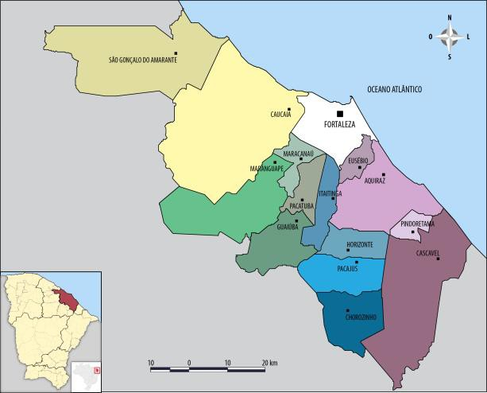
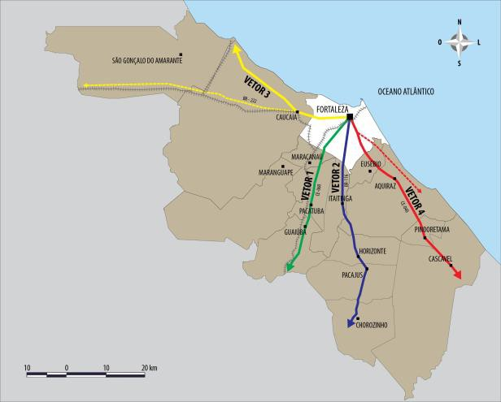
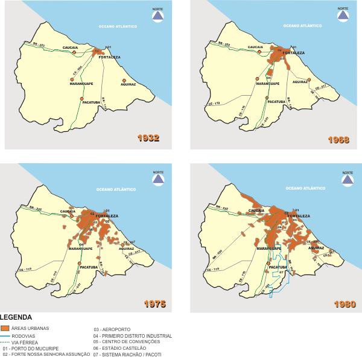
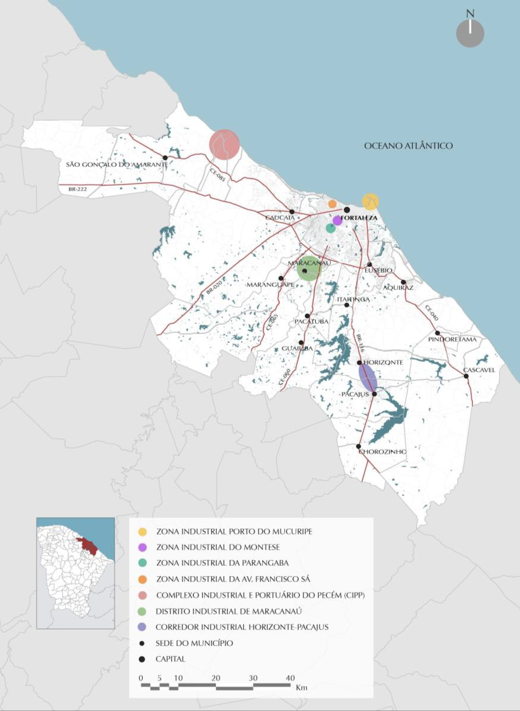

# Resumo

O artigo pretende analisar as relações entre a dinâmica econômica e a
urbanização na Metrópole cearense, especialmente aquelas relacionados à
atividade industrial, as quais justificam, sobremaneira, o início do
processo de metropolização e sua rápida expansão nas últimas décadas.
Sabe-se que a redistribuição espacial das atividades econômicas e os
movimentos populacionais delineiam, continuamente, reconfigurações no
padrão de organização das cidades. No Brasil, de modo geral, esses
fenômenos revelam claras diferenças com relação àqueles que
tradicionalmente se observavam até meados da década de 1970. Resultam,
sem dúvida, das novas dinâmicas em curso no contexto contemporâneo, como
o aumento das economias regionais, a desconcentração industrial, o
incremento das exportações, o melhor desempenho da agricultura, etc.
Ocorreram, em consequência, impactos no território, que passam a gerar
novas áreas de dinamismo econômico, evidenciando novos arranjos
espaciais, diferentes daqueles verificados anteriormente, com
modificações relevantes na urbanização. Pretende-se destacar, portanto,
os reflexos da industrialização ocorridos na Região Metropolitana de
Fortaleza - RMF, analisando as transformações recentes ocorridas e os
novos padrões de urbanização emergentes, com base na análise histórica
das sucessivas etapas de implantação da atividade industrial e como ela
interfere na expansão recente da área metropolitana, ao longo dos eixos
viários.

Palavras-chave: industrialização, urbanização, metropolização,
Fortaleza.

# Abstract

The article analyzes the relationship between urbanization and economic
dynamics in Fortaleza- Ceará (Brazil), especially those related to
industrial activity, which greatly justify the beginning of the process
of metropolization and its rapid expansion in recent decades. It is
known that the spatial redistribution of economic activities and
population movements delineate, continually, reconfigurations in the
city organization structures. In Brazil, in general, these phenomena
reveal clear differences from those traditionally observed until the
mid-1970s. It results, undoubtedly, from the new dynamics in progress at
the contemporary context, as the increase of regional economies,
industrial decentralization, export growth, the best performance of
agriculture, etc. There was, therefore, impacts on the territory, which
begin to generate new areas of economic dynamism, highlighting new
spatial arrangements, different from those previously observed, causing
significant changes in urbanization. Finally, the paper aims to
highlight the consequences of industrialization occurring in the
metropolitan region of Fortaleza - RMF, analyzing the recent changes
that have occurred and new patterns of emergent urbanization based on
historical analysis of the successive stages of implementation of
industrial activity and how it interferes with recent expansion of the
metropolitan area, along the road axes.

Keywords: industrialization, urbanization, metropolization, Fortaleza,
Ceará, Brazil.

# Introdução

O crescimento urbano e metropolitano de Fortaleza obedece
predominantemente ao modelo radioconcêntrico, apoiado em quatro
principais vetores de expansão, que correspondem aos principais eixos
viários que partem da Capital (BR 116 e BR 222, e CE 085, CE 040 e CE
060), ao longo dos quais se expande a malha urbana (Figuras 1 e 2).
Essas vias assumem papel preponderante na configuração urbana da
Metrópole, determinando a estruturação do território. Cada um desses
vetores possui sua própria lógica de formação e tem o desenvolvimento
ligado aos investimentos recebidos, apresentando padrões de crescimento
diferenciados. Os três primeiros relacionam-se com as zonas sul e oeste
da metrópole, historicamente ligadas às áreas industriais e de habitação
popular; o vetor 1 corresponde ao eixo onde se localizam o Distrito
Industrial de Maracanaú e conjuntos habitacionais surgidos nas
vizinhanças. O vetor 2 configura-se ao longo da BR 116, concentrando as
indústrias situadas nos municípios de Eusébio, Horizonte e Pacajus. O
vetor 3 se desenvolve em direção ao município de Caucaia e ao longo da
faixa litorânea oeste, abrangendo o complexo Industrial Portuário do
Pecém. O vetor 4 situa-se no quadrante sudeste da metrópole, em direção
aos municípios de Eusébio e Aquiraz. Constitui o eixo imobiliário mais
valorizado da metrópole e abrange também equipamentos de lazer e turismo
(DIÓGENES, 2012).

> 
>
> Figura 1. Região Metropolitana de Fortaleza -- Configuração Atual.
> Fonte: DIÓGENES, 2012
>
> 
>
> Figura 2. Região Metropolitana de Fortaleza -- vetores de crescimento
> urbano e metropolitano. Fonte DIÓGENES, 2012

A seguir, serão enfocadas as diversas fases e transformações mais
significativas relacionadas à atividade industrial que ocorreram no
âmbito da Região Metropolitana de Fortaleza, as quais tiveram desempenho
expressivo no contexto econômico da Metrópole cearense nas últimas
décadas e que ensejaram alterações substanciais na configuração urbana e
metropolitana.

# O processo histórico de industrialização no Ceará e o início da metropolização de Fortaleza

A industrialização no Ceará, de acordo com Amora (2005), pode ser
entendida mediante uma periodização que identifica três fases distintas,
relacionadas à divisão internacional e nacional do trabalho. O primeiro
período tem inicio ainda no final do século XIX e estende-se até a
década de 1950; o segundo abrange os anos 1960 até meados de 1980,
quando começa o terceiro período, ainda em curso.

A análise apresentada a seguir estabelece como marco do processo de
industrialização no Ceará, as atividades fabris suscitadas
principalmente com a cotonicultura (algodão), que se relacionam, embora
de forma marginal, com o desenvolvimento industrial internacional,
apresentando também a utilização de meios técnicos mais avançados no
processo de produção. Trata-se, sobretudo, do beneficiamento do algodão
e da produção de tecidos e redes (AMORA, 2005).

É importante ressaltar que esta industrialização possui um caráter
rudimentar, bem como o seu desenvolvimento é dependente da produção
agrícola. Sendo assim, a origem e desenvolvimento dessa fase inicial se
inserem de forma secundária no ciclo hegemônico do algodão e da primazia
da atividade primária, que até 1960 representava 45,7% do PIB do Ceará1
(LIMA, 2008).

O perfil da industrialização se fundava basicamente na transformação de
matérias- primas com predominância do capital local e, embora Fortaleza
concentrasse a grande maioria de estabelecimentos industriais, outras
cidades como Sobral e Aracati também possuíam indústrias, não existindo
um desequilíbrio significativo entre os núcleos urbanos. A localização
da maioria das indústrias em Fortaleza se justifica pela

lógica de concentração atrelada à exportação do algodão2, relacionada à
presença da ferrovia e do porto, do comércio e serviços, além do fato de
ser a capital político-

administrativa.

As oscilações do mercado interno e externo do algodão que perduraram por
toda a primeira metade do século XX, além dos períodos de estiagem, não
foram suficientes para subtrair a importância da atividade agrícola do
algodão e da indústria têxtil de fios e redes no Ceará. Devido ao
circuito de caminhos (ferroviário e rodoviário) que convergia para
Fortaleza, a maioria dos estabelecimentos industriais de beneficiamento
do algodão se concentrava na Capital. A atividade industrial se
desenvolveu espontaneamente na porção oeste da cidade, ao longo
principalmente do eixo da Av. Francisco Sá, nas proximidades da via
férrea. A instalação dessas indústrias marcou o zoneamento da cidade: a
zona oeste com concentração de indústrias e atração de um contingente de
trabalhadores e ocupação popular; a zona

1.  Em 1970, a participação do setor primário no PIB do Ceará passou
    para 17,46%, decaindo substancialmente para 6,19 em 2000.

2.  Além das atividades ligadas à produção de fiação e tecelagem,
    destacam-se no quadro de produção industrial do Ceará a produção de
    óleos vegetais , de cigarros e de pescados em conserva, as usinas de
    beneficiamento do caroço do algodão em vários municípios, além de
    oficinas de fabricação de calçados, móveis e outros artigos de
    consumo interno, de olarias, marmorarias e muitos outros pequenos
    estabelecimentos artesanais.

central, que reunia o comércio e os serviços, e a zona leste (Aldeota)
que constituía um lócus privilegiado das classes mais abastadas. A
construção do porto do Mucuripe em fins da década de 1940 e o processo
de atividades que atrai, também são elementos significativos no
zoneamento da Cidade à época.

Esse primeiro período da industrialização no Ceará tem uma repercussão
espacial concentrada em Fortaleza, sem impactos metropolitanos. Os
municípios vizinhos inserem-se na dinâmica socioespacial de integração
entre o interior (sertão) e a Capital (litoral) por intermédio dos eixos
de penetração históricos da cidade.

É possível inferir, com base nesta análise do primeiro período da
industrialização no Ceará, que a importância de Fortaleza em relação à
rede urbana cearense e a sua urbanização são expressão não propriamente
da industrialização -- que neste período era rudimentar -, mas da
crescente polarização que a Cidade exercia em sua área de influência
como centro regional terciário, que pouco a pouco se integrava ao
mercado nacional, em função da industrialização verificada no Sudeste.
Some-se a isto a atratividade exercida pela Capital aos imigrantes,
vindos do sertão. A Tabela 01 abaixo demonstra o crescimento acelerado
da população no período entre 1920 e 1960, com destaque para o aumento
significativo entre as décadas de 1950 e 1960, passando de 270.169 para
514.813 habitantes.

> Tabela 01: Crescimento Populacional da Cidade de Fortaleza
> (1920-1960). Fonte: Censos Demográficos/IBGE In: LEMENHE, 1991

+------------+-----------------+
| > **ANOS** | > **POPULAÇÃO** |
+============+=================+
| > 1920     | > 78.536        |
+------------+-----------------+
| > 1930     | > \-            |
+------------+-----------------+
| > 1940     | > 180.185       |
+------------+-----------------+
| > 1950     | > 270.169       |
+------------+-----------------+
| > 1960     | > 514.813       |
+------------+-----------------+

O segundo período da industrialização no Ceará, compreendido entre os
anos de 1960 e meados de 1980, se relaciona com o advento da SUDENE. A
política industrial preconizada pela SUDENE se voltou seletivamente para
a Bahia, Pernambuco e Ceará e tinha como premissa, além da implantação
de indústrias mais modernas, a reversão do quadro de atraso das
indústrias tradicionais, marcada pela obsolescência do maquinário e até
mesmo das relações de trabalho.

As especificidades dos impactos dessas políticas no quadro econômico do
Ceará nesse período se sustentam na manutenção e relativa modernização
dos setores tradicionais relacionados à indústria têxtil e ao
beneficiamento de produtos agrícolas, assim como diversificação de
certos produtos.

> No caso do Ceará, não teria havido maiores alterações na estrutura
> industrial, predominando ainda hoje atividades tradicionais que
> utilizaram matérias-primas locais, do gênero alimentar, vestuário e
> têxtil. Por outro lado, o gênero alimentar teria sido responsável pela
> diversificação industrial, surgindo ramos mais dinâmicos como
> metalúrgica, química e materiais não metálicos (BERNAL, 2004, p. 67).

Outra especificidade do Ceará em relação ao desenvolvimento industrial
no período

deveu-se basicamente à iniciativa privada local, diferente do que
ocorreu na Bahia e em Pernambuco, com mais empresas de capital nacional.
Os investimentos industriais nestes três polos regionais do Nordeste
foram desiguais. Fortaleza teve desvantagens no incremento do seu
complexo industrial devido a alguns fatores locacionais, como a ausência
de infraestrutura, a insuficiência no fornecimento de energia, a
precariedade da estrutura de transportes (portuária e rodoviária) e
comunicações, bem como a maior distância do polo dominante.

Com o advento da SUDENE e baseado nas suas proposições
desenvolvimentistas, se inaugurou o planejamento estatal no Ceará. As
estratégias assimilavam os pressupostos do desenvolvimento via
industrialização, como forma de superar o caráter rudimentar e
manufatureiro da indústria do período anterior. A industrialização
funcionaria como uma saída estratégica de combate ao quadro de
desigualdade e atraso, provocados pela vulnerabilidade das atividades
econômicas da pecuária e do algodão, condicionadas pelas vicissitudes da
natureza, (secas periódicas), e pelas oscilações do comércio nacional e
internacional.

O modelo de desenvolvimento econômico pretendido inseria-se nos
planejamentos governamentais do Estado. Nesse caminho, o PLAMEG I --
Plano de Metas Governamentais -- (1963-1966), instituído pelo governador
Virgílio Távora, criou o aparato institucional necessário à implantação
deste novo modelo de desenvolvimento3.

Com o PLAMEG I, inicia-se o processo de industrialização moderna do
Ceará, subsidiado pelo fornecimento de energia da CHESF (1965) e pelas
obras de infraestrutura, com a reforma do porto do Mucuripe e a
implantação do I Distrito Industrial do Ceará em Maracanaú, antigo
distrito de Maranguape, município vizinho à Fortaleza. Embora algumas
indústrias tenham sido implantadas no interior, sua localização obedecia
à lógica da concentração na Capital, confirmando a rede de cidades
desequilibrada, caracterizando o processo de macrocefalia. A discreta
industrialização e a crise do algodão provocaram a migração e um
excedente de mão-

de-obra na Cidade, com grande repercussão na urbanização4.

Diversos planos governamentais5 sucederam o PLAMEG I e foram concebidos
de acordo com o contexto político e econômico local e nacional até
meados da década de 1980.

Ao mesmo tempo em que a estrutura industrial do Ceará manteve-se ligada
às atividades tradicionais que utilizavam matérias-primas locais, do
gênero alimentar, vestuário e têxtil, ampliou-se até meados da década de
1980 a participação do setor na composição do PIB. Neste período (de
1959 até meados da década de 1980), o PIB

3.  Entre eles: a Superintendência do Desenvolvimento Econômico e
    Cultural do Ceará (SUDEC), a Companhia de Desenvolvimento do Ceará
    (CODEC) e o Banco do Estado do Ceará (BEC) (LIMA, 2004, p. 314). O
    Fundo de Desenvolvimento Industrial (FDI) também foi outro
    instrumento criado pelo Governo Estadual para incrementar a
    atividade industrial.

4.  Contribuiu também, do ponto de vista institucional, para o
    desenvolvimento dessa fase da industrialização a criação da
    Universidade Federal do Ceará, em 1955, e o próprio BNB, sediado em
    Fortaleza, que se empenhou nos estudos e na capacitação de
    mão-de-obra, além de proporcionar a emergência de uma classe média
    formada não somente por comerciantes, mas por profissionais
    liberais.

5.  \- PLAIG -- Plano de Ação Integrada do Governo - (1967-1971),
    Plácido Castelo; - PLAGEC -- Plano de Governo do Estado do Ceará -
    (1971-1975), César Cals; PLANDECE -- Plano Quinquenal de
    Desenvolvimento do Estado do Ceará - (1975-1979), Adauto Bezerra; -
    PLAMEG II -- 2º. Plano de Metas Governamentais - (1979-1983),
    Virgílio Távora; - PLANED -- Plano Estadual de Desenvolvimento -
    (1983-1986), Gonzaga Mota.

cresceu de 10,3% para 26,8%, ao passo que o setor primário declinou de
34,0% para 14,6% (BERNAL, 2004). Este quadro quantitativo revela uma
crescente industrialização no estado, mas ainda fortemente concentrada
na Capital.

Os distritos industriais, outra estratégia criada pelos estados para
atrair indústrias, além dos incentivos fiscais e financeiros, foram
implantados principalmente nas áreas metropolitanas das capitais, em
função das vantagens locacionais, como a proximidade a rodovias, portos
e aeroportos e a oferta de serviços existentes.

No caso específico de Fortaleza, a implantação do Distrito Industrial em
Maracanaú na década de 1960 não conseguiu lograr êxito nos primeiros dez
anos, em função da precariedade da infraestrutura e das vantagens
oferecidas pelo polo industrial da Francisco Sá, já tradicionalmente
consolidado em Fortaleza. Embora o desenvolvimento do Distrito
Industrial tenha ocorrido de forma retardada em relação à política
industrial pretendida, sua implementação foi responsável pela gênese do
processo de metropolização de Fortaleza na década de 1970, associada à
presença da indústria e dos conjuntos habitacionais que surgiram nas
proximidades, favorecendo a oferta de mão-de-obra.

A metropolização verificada em Fortaleza neste período se justifica em
função de dois processos combinados: o primeiro, relativo às políticas
industriais da SUDENE, que redundaram na implantação de indústrias na
escala intraurbana e posteriormente no Distrito Industrial, mas não
foram suficientes para absorver o ritmo de crescimento da população,
decorrente do excedente de mão-de-obra e da imigração constante
proveniente do campo; o outro se refere ao processo de industrialização
verificado no Brasil, que reforçou o papel das metrópoles regionais como
polos terciários.

Sendo assim, constata-se que a urbanização de Fortaleza não possui
vínculos apenas com a industrialização local, mas também com a
repercussão da industrialização nacional, na medida em que o refluxo do
desenvolvimento industrial do Sudeste contribuiu para a ampliação do
setor terciário nos centros regionais (PAIVA, 2011).

A Tabela 02 demonstra que a população de Fortaleza, entre a década de
1960 e fins da década de 1980 triplicou, confirmando os efeitos da
*hiperurbanização* provocados pela industrialização nos países
periféricos que apresentam altos níveis de crescimento populacional,
caracterizando a urbanização desigual.

O crescimento da mancha urbana de Fortaleza, contextualizado com o
território metropolitano pode ser observado ao longo dos eixos viários
(Figura 3), principalmente no sentido oeste, sul e sudoeste, áreas de
ocupação das classes menos favorecidas. A partir da década de 1970 já se
percebe uma ocupação mais efetiva nas áreas litorâneas, com o fenômeno
urbano da segunda residência.

> Tabela 02: Crescimento Populacional da Cidade de Fortaleza (1960-1991)
> Fonte: Censos Demográficos/IBGE In: LEMENHE, 1991

+------------+-----------------+
| > **ANOS** | > **POPULAÇÃO** |
+============+=================+
| > 1960     | > 514.813       |
+------------+-----------------+
| > 1970     | > 857.980       |
+------------+-----------------+
| > 1980     | > 1.308.919     |
+------------+-----------------+
| > 1991     | > 1.768.637     |
+------------+-----------------+

> 
>
> Figura 3. Mapa Fortaleza e RMF -- Evolução da Mancha Urbana --
> 1932-1980. Fonte: PAIVA, 2011

# A desconcentração industrial e a expansão metropolitana

A terceira fase de implantação industrial no Ceará, que tem início nos
anos 1980, intensifica-se na década seguinte, inserindo-se no contexto
de reestruturação produtiva da economia mundial e que iria impor novos
padrões competitivos, acompanhados de uma crescente abertura
internacional das economias.

Essa fase é caracterizada também pela política de desconcentração
industrial, que incentivou a descentralização dos empreendimentos
industriais, transferindo-os para outros municípios. Esse movimento
ocorreu em duas escalas. Primeiramente, a vinda de indústrias do Sul e
Sudeste do País, como forma de desconcentração do parque industrial
daquelas regiões, sobretudo de São Paulo, enquanto no âmbito local,
efetuou-se a tentativa de descentralização da Capital, direcionada a
outros municípios do Estado e da RMF.

Desde os anos 1990, verifica-se, portanto, a expansão do setor em eixos
e mini- distritos na RMF, ao longo das rodovias federais e estaduais,
nos municípios de Horizonte, Pacajus, Pacatuba, Eusébio, Maranguape e
Caucaia, vinculada à política estadual de atração de indústrias6.

A implantação de indústrias em outros municípios7 diversifica o quadro
de

6.  As atividades industriais na RMF se distribuem principalmente nos
    setores da construção civil, do extrativismo mineral e de
    transformação. A indústria de transformação é o ramo mais
    significativo da produção industrial, onde se destacam os segmentos
    têxteis, vestuário, calçados e alimentos.

7.  Outro aspecto relativo à política de interiorização da indústria diz
    respeito à possibilidade de reduzir os custos da produção e,
    consequentemente, propiciar maior lucratividade. Além disso, também
    apresenta vantagens

distribuição do setor industrial no Ceará, embora ainda permaneça
importante concentração em Fortaleza, que abriga praticamente metade do
total das indústrias do Estado. No que se refere à problemática da
descentralização do setor industrial no Ceará, Silva e Dantas (2009, p.
17) comentam que:

> No concernente à RMF, tem-se um redimensionamento de lógica de
> urbanização na escala da metrópole, o que implica na relocalização da
> indústria em municípios que a compõem, adquirindo Fortaleza papel
> preponderante, em função do sistema de vias pautado no transporte
> rodoviário e convergindo para a zona portuária do Mucuripe e,
> atualmente, do recém-construído Porto do Pecém, em São Gonçalo do
> Amarante.

A implantação do corredor industrial ao longo da BR 116 interferiu
sobremaneira na modificação dessa área, passando a atrair maior número
de pessoas8 para as proximidades, tendo em vista as oportunidades de
emprego, contribuindo assim para o processo de expansão metropolitana.

A concentração industrial nesse eixo se impõe como mancha expressiva no
traçado urbano descontínuo junto à BR 116. Os lotes destinados às
indústrias são todos de grandes dimensões e, apesar do porte das
edificações, ainda há grandes extensões de terrenos livres.

A dinâmica de ampliação e descentralização da atividade industrial
segue, portanto, uma trajetória de afastamento da Capital. Esta expansão
é em parte responsável pela ocupação do espaço urbano da Região
Metropolitana, sendo viabilizada também pela sua maior abrangência
institucional, ao se incorporarem à região os municípios de Horizonte,
Pacajus e São Gonçalo do Amarante.

O período mais recente do desenvolvimento industrial no Estado
relaciona-se com a criação do Complexo Industrial Portuário do Pecém, o
CIPP, entre os municípios de Caucaia e São Gonçalo do Amarante,
decorrente de projetos governamentais seguindo a lógica do
desenvolvimento exógeno9. A instalação do CIPP constitui um dos
investimentos de maior impacto no território metropolitano, concebido
como uma

estratégia para incrementar diversos setores da economia do Ceará.

O CIPP, que abrange investimentos de peso (como a siderúrgica e a
refinaria), ao se consolidar10, deverá causar impactos significativos na
estrutura econômica da Região Metropolitana de Fortaleza e, por
extensão, no perfil ocupacional de sua população,

> substanciais para os empresários, no sentido de favorecer maior
> distanciamento das lutas sindicais, presentes nos grandes centros.

8.  De acordo com dados do Censo 2010, o Município de Horizonte foi o
    > que mais cresceu em população no

> Ceará nos últimos dez anos (63,3%). O chefe da unidade estadual do
> IBGE, Francisco José Moreira Lopes, explica que o crescimento
> populacional de Horizonte e outras cidades da Região Metropolitana,
> como Eusébio, Pacajus e Caucaia, deve-se à maior oferta de empregos em
> indústrias que se instalaram nesses municípios.

9.  O desenvolvimento exógeno é aquele realizado com investimentos
    (materiais e serviços) oriundos de fora da região. Ocorre
    principalmente mediante a instalação de empresas cuja matriz não é
    da região. São geralmente empresas de médio e grande porte que se
    instalam em função de algum atrativo que a região oferece, seja por
    motivos logísticos ou pela disponibilidade de recursos humanos
    habilitados.

10. Desde a sua criação, o CIPP tem como objetivo criar um "retroporto"
    de amplo espectro (siderúrgica, refinaria e indústrias
    petroquímicas, etc.) de modo a consolidar um conglomerado industrial
    que modifique a ocupação da

> área, transformando-a em zona urbanizada autônoma, definida pela
> concentração de pessoas, geração de empregos, etc. Por enquanto,
> porém, limita-se à polarização aos arredores do porto propriamente
> dito.

transformando-se num dos principais polos de desenvolvimento
contemporâneo da metrópole.

Cabe ressaltar, pois, a questão da localização da atividade industrial
em território cearense, quando se verifica uma concentração acentuada na
RMF, espaço escolhido pela maioria das indústrias, seguindo a lógica
capitalista da concentração espacial, apesar das políticas recentes
preconizadas pelo Governo Estadual relativas à interiorização do setor
industrial. A localização das indústrias, portanto, constitui fator
essencial para o processo de metropolização em curso.

> 
>
> Figura 4. Mapa Dinâmica Industrial RMF. Fonte: DIÓGENES, 2012.

# Considerações finais

As mudanças ocorridas na economia, particularmente aquelas relacionadas
à atividade industrial, influenciaram sobremaneira a expansão
metropolitana de Fortaleza. Se, num primeiro momento, até a década de
1960, a atividade industrial se concentrou na Capital, a partir de
então, a progressiva implantação de indústrias no território
metropolitano determinou uma alteração significativa na urbanização da
RMF.

A atividade industrial se descentraliza em direção a outros municípios,
principalmente Maracanaú, Caucaia e Eusébio e, posteriormente, o
corredor industrial da BR 116, entre os municípios de Pacajus, Horizonte
e Chorozinho. Mais recentemente, a implantação do Complexo Industrial e
Portuário do Pecém - ainda em fase de consolidação - apresenta
perspectivas concretas para um futuro próximo.

A localização da indústria revela, pois, um nível de integração na
metrópole mediante um sistema de vias, conforme citado anteriormente,
que corresponde aos eixos viários de penetração para o interior -- os
vetores de expansão urbana, alterando o antigo modelo de concentração,
visto no início do processo de industrialização (pré- SUDENE), restrito
ao setor oeste de Fortaleza.

Agem no processo de metropolização de Fortaleza diversas dinâmicas
(industriais, terciárias, turísticas e imobiliárias) que concorrem para
expansão da mancha urbana e transformação do tecido urbano, que se
desenvolvem sobretudo nos antigos vetores, onde se verifica a
coexistência de padrões de metropolização historicamente distintos,
qualificando a complexidade da Metrópole.

A população metropolitana se expande ao longo dos eixos mais antigos,
relacionados à lógica de desconcentração industrial, implementação de
conjuntos habitacionais e crescimento da "periferia dos pobres", ao
passo que nos municípios litorâneos, onde prevalece a dinâmica do
turismo e imobiliária, ambas voltadas para os ricos, o crescimento
populacional é menor.

No que concerne ao desenvolvimento do setor industrial e ao crescimento
econômico do Ceará, de modo geral, alguns aspectos devem ser destacados,
como a participação do Poder Público -- o Estado -- como agente do
processo de acumulação de capital, atuando como propulsor e incentivador
da implantação industrial, mediante programas de incentivos fiscais, bem
como a instalação de infraestrutura, como atrativo e suporte para a
instalação de indústrias.

# Referências bibliográficas

> AMORA, Z. B. Indústria e espaço no Ceará. In: SILVA, J. B. (org.).
> *Ceará: um novo olhar geográfico.* Fortaleza: Edições Demócrito Rocha,
> 2005.
>
> BERNAL, M. C. C. *A metrópole emergente: a ação do capital imobiliário
> na estruturação urbana de Fortaleza*. Fortaleza: EDUFC, 2004.
>
> DIOGENES, B. H. B. N. *Dinâmicas urbanas recentes da área
> metropolitana de Fortaleza. 2012.* Tese (Doutorado em História e
> Fundamentos da Arquitetura e do Urbanismo) - Faculdade de Arquitetura
> e Urbanismo, Universidade de São Paulo, São Paulo, 2012.
>
> LEMENHE, M. A. *As Razões de uma cidade: conflito de hegemonias.*
> Fortaleza: Stylus Comunicações, 1991.

LIMA, A. C. F. Cidade do Ceará: origens, transformações e perspectivas.
In: LIMA,

> A. C. F. *A Construção do Ceará: temas de história econômica.*
> Fortaleza: Instituto Albanisa Sarasate, 2008.
>
> PAIVA, R. A. *A metrópole híbrida: o papel do turismo no processo de
> urbanização da região metropolitana de Fortaleza.* 2011. Tese
> (Doutorado em Planejamento Urbano e Regional) - Faculdade de
> Arquitetura e Urbanismo, Universidade de São

Paulo, São Paulo, 2011.

SILVA, J. B. & DANTAS, E.: Formação histórica da metrópole principais
tendências de desenvolvimento. In: PEQUENO, L. R. B. (org) *Como anda
Fortaleza.* Rio de Janeiro: Observatório das Metrópoles, 2009.
