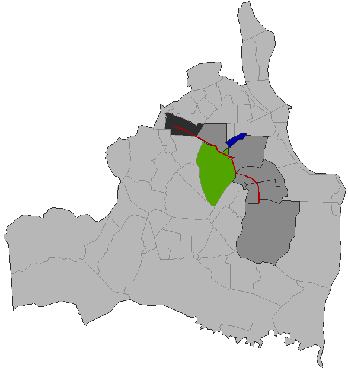
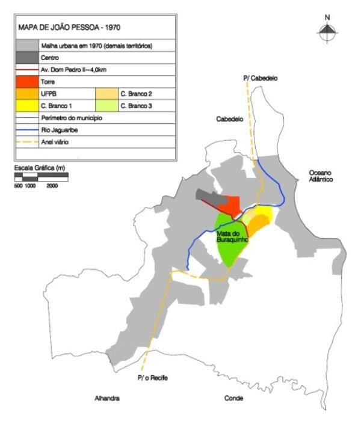
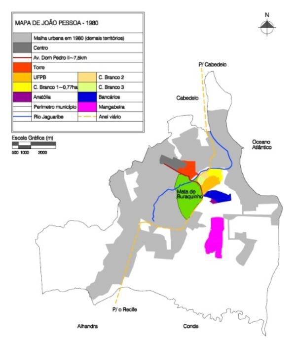
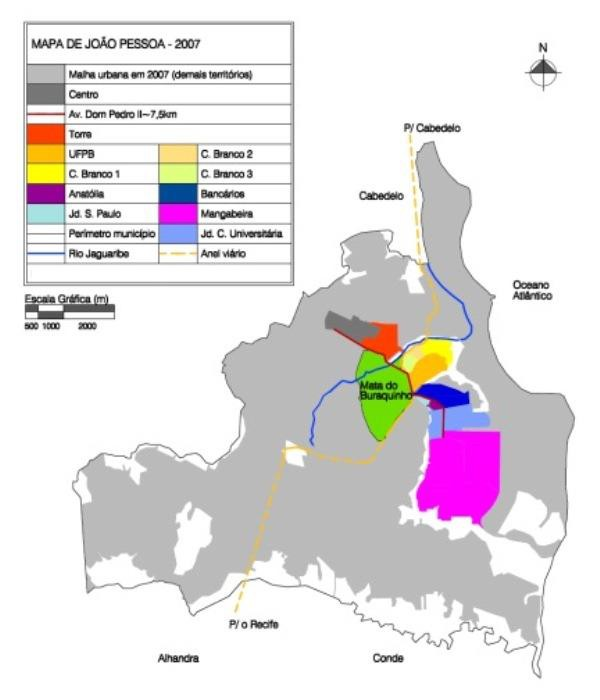

# Resumo

Este artigo resulta da pesquisa cujo objetivo foi de investigar o
histórico de produção e apropriação do setor sudeste da cidade de João
Pessoa -- PB, que abriga 141.803 habitantes, caracterizados, em sua
maioria, pelas classes de média e de baixa renda, que estão distribuídos
em uma área de 2.136,30 hectares. O estudo focou no recorte temporal que
se deu a partir da década de 1980 -- período em que esse setor sofreu
uma maior expansão territorial, devido à inserção de conjuntos
habitacionais populares, a partir de incentivos do Banco Nacional de
Habitacional/BNH --, seguindo até o ano de 2011. Os resultados obtidos
colocam a atuação do Estado, a partir das políticas federais, como o
principal agente produtor do setor sudeste de João Pessoa. Em um
primeiro momento, com a execução do anel rodoviário e a implantação do
Campus Universitário e, em seguida, com a atuação do Banco Nacional de
Habitação

-- BNH -- e a produção dos conjuntos habitacionais populares.
Atualmente, esse espaço intraurbano concentra 20% da população de João
Pessoa, em 10% do território da cidade. Este cenário apresenta-se como
um reflexo do modelo de ocupação e apropriação adotado, imposto pelo
Estado, e acentua a dinâmica de segregação sócioespacial, consolidando
esses espaços, como um setor, que concentra a classe de média e baixa
renda.

Palavras-chave: políticas habitacionais, conjuntos habitacionais
populares, histórico de produção.

# Abstract

This papper results from a research that objectivate to investigate the
historical production and apropriation of the southeast sector of the
city of João Pessoa - PB - Brazil, gathering 141,803 inhabitants ,
characterized mostly by the middle and low **classes**, which are
distributed in an area of 2136.30 acres . The study focused on the time
frame from the 1980s - the period in which this sector suffered greater
territorial expansion , due to the inclusion of public housing ,
incentives from the National Housing Bank / BNH - following up year 2011
. The results of this research, put the actions of the state as federal
policies, as the main land producer agent of the southeastern section of
João Pessoa. At outset , with the implementation of the ring road and
deployment of the University Campus , and then , with the performance of
the National Housing Bank - BNH - and the production of public housing.
Currently , this urban space concentrates 20 % of total population of
the city , in 10 % of the territory. This scenario presents itself as a
reflection of the occupation and appropriation adopted, imposed by the
State , and accentuates the dynamic model of spatial segregation ,
consolidating these spaces as industry , which concentrates the middle
class and low income.

Keywords: housing policies, public housing, history of production.

# Introdução

As formas apresentadas pelas cidades refletem as organizações sociais,
as estruturas políticas e econômicas e o modo de vida dos seus
habitantes, sendo a sua morfologia

construída, com maior frequência, a partir de necessidades, vontades e
decisões políticoeconômicas (MAIA, 2005). Essa afirmação pode ser
complementada por Castex et al (2005) quando apontam que a cidade e a
sua inserção no território geográfico -- a forma, o desenho de suas
vias, a organização do seu tecido, *et coetera*

-   não é independente dos grupos sociais que a produzem, que nela vivem
    e que a transformam. Em relação à produção da cidade, Panerai (2006)
    observa que são vários os agentes responsáveis pela sua construção:
    o Estado, os operários, os empresários, os proprietários
    imobiliários, os construtores, os comerciantes, os técnicos, os
    movimentos sociais que lutam por moradia, *et coetera*.

Em uma análise do histórico das práticas que se refletem na metamorfose
do tecido urbano, Maia (2005) afirma que no Século XX, as intervenções
urbanas passaram a ocorrer de maneira mais intensa e, por conseguinte, a
produzir transformações no uso dos seus territórios, e portanto, na vida
cotidiana dos seus habitantes. Esta informação pode ser complementada
quando Panerai (2006, p.11) coloca que a urbanização da segunda metade
desse século, modificou "radicalmente" a paisagem urbana, através das
alterações no volume das edificações, dos modos de implantação, das
técnicas utilizadas e das disposições e dimensões dos espaços livres,
que começaram a indicar uma ruptura temporal e espacial mais veloz.

Dentro desse contexto, esta pesquisa investigou o histórico de produção
e apropriação do espaço intraurbano localizado no setor sudeste de João
Pessoa, capital da Paraíba, região nordeste do Brasil, cidade em
processo de metropolização, que possui uma malha urbana de 211,474 Km2,
onde se distribui uma população de 723.525 habitantes (IBGE, 2010).

O setor analisado, composto pelos bairros, Castelo Branco, Anatólia,
Mangabeira, Jardim São Paulo e Jardim Cidade Universitária,
caracteriza-se por abrigar 141.803 habitantes de João Pessoa,
caracterizados, em sua maioria, pelas classes de média e de baixa renda,
que estão distribuídos em uma área de 2.136,30 hectares (IBGE, 2010).
Sua origem se deu a partir de intervenções do Governo Federal, com
ênfase para a implantação de conjuntos habitacionais populares.

Embora o processo de produção e apropriação desse setor tenha iniciado
na década de 1960, este artigo focou no recorte temporal que se deu na
da década de 1980, período em que ele sofreu uma maior expansão
territorial, devido à inserção de conjuntos habitacionais populares
Bancários, Anatólia e, principalmente Mangabeira -- o mais populoso e
periférico -- seguindo até o ano de 2011 -- ano final da pesquisa, que
teve duração de dois anos.

Quanto à metodologia, a pesquisa foi estruturada em três fases, (a)
coleta de dados referentes à fundamentação teórica e ao levantamento
históricoespacial: pesquisa bibliográfica e documental, e de dados de
órgão oficiais; (b) sistematização e análise dos dados, com respaldo no
estudo de Panerai (2006); e produção de mapas de recortes de
tempo-espaço do histórico de produção e apropriação do objeto empírico
de análise, e o diagnóstico final.

A Fig. 1 ilustra o objeto empírico de análise desta pesquisa.

> **LEGENDA:**

1.  Torre

> Centro

1

2

4 5 3

6

7

# Oceano Atlântico

2.  Castelo Branco

3.  Bancários

4.  Jardim São Paulo

5.  Anatólia

6.  Jardim Cidade Universitária

> Mata do Buraquinho
>
> Rio Jaguaribe
>
> Av. Dom Pedro II

7.  Mangabeira

> N
>
> Figura 1: Ilustração do município de João Pessoa com o objeto empírico
> de análise destacado.
>
> Fonte: Omitido para avaliação, 2012.

# Início do processo de produção do setor sudeste de João Pessoa

O processo de urbanização acelerado de João Pessoa, que se iniciou em
princípios do século XX, promoveu a implantação do Parque Sólon de
Lucena no bairro do Centro

-- território onde a cidade esteve concentrada por aproximadamente 300
anos (SILVEIRA, 2004). Além disso, possibilitou a inserção de
territórios contíguos à área central, a exemplo do bairro da Torre, que
teve origem em finais da década de 1930, direcionando o tecido urbano de
João Pessoa até um limite físico, o Vale do Rio Jaguaribe (COUTINHO,
2004; VIDAL, 2004).

Segundo Silveira (2004, p.190), a Torre representou um dos principais
produtos do processo de urbanização de João Pessoa, caracterizando-se
como um dos "objetos sociais mais arrojados da época, por ser um espaço
projetado \[conforme a proposta formulada por Nestor de Figueiredo\]".

Apesar da importância do bairro da Torre no processo de expansão urbana
de João Pessoa em direção a sudeste, verificou-se que o início do
processo de ocupação e apropriação da área objeto de estudo, ocorreu,
efetivamente, no início da década de 1960, com o avanço territorial
sobre o Vale do Rio Jaguaribe, através da ampliação do sistema
rodoviário, com a implantação de um anel rodoviário, composto pelas BR
101 e BR 230, que passou a interligar o município de Cabedelo -- ao
norte -- à saída sul da cidade. De acordo com Panerai (2006), a
superação de um limite físico, delimita o recorte de tempo-espaço que
marca o inicio do processo de expansão do tecido urbano analisado.

Esse fato ligou-se a uma série de obras federais que deu continuidade,
como mencionou Coutinho (2004), a "mudanças consideráveis \[relacionadas
ao seu processo de urbanização\] no panorama de João Pessoa". Junto à
execução do anel rodoviário, outro acontecimento ganhou importância, a
inserção do Campus Universitário em suas proximidades, que se
caracterizou como um marco institucional

na expansão urbana da cidade, uma vez que, induziu através da
transferência das atividades universitárias que ocorriam no bairro do
Centro, o crescimento nessa direção (SCOCUGLIA, 1999).

Ao analisar a inserção do Campus Universitário no tecido urbano de João
Pessoa, Pereira (2008) coloca que a sua localização foi fundamental no
processo de crescimento da cidade e teve como fator principal, pertencer
a Fazenda São Rafael, terras de propriedade do Governo Estadual -- fator
que reduziu os custos de implantação desse equipamento.

Em finais da década de 1960, o Estado identificou um problema
relacionado à aquisição de moradias pela população de menor poder
aquisitivo, que não atingiu apenas João Pessoa, mas todo o país
(SCOCUGLIA, 1999). Pode-se colocar que a superação da barreira do Vale
do Rio Jaguaribe, foi conveniente para o Estado, do ponto de vista
políticoeconômico, ao considerar o setor sudeste uma alternativa para a
produção de assentamentos residenciais destinados a essa parcela da
população, concretizados sob a forma de conjuntos habitacionais
populares (BONATES, 2009; SCOCUGLIA, 1999).

O interesse por essa área foi motivado por vários fatores, dentre eles,
deve ser destacado, que as terras situadas no setor sudeste pertenciam
ao Governo Estadual e, naquele momento, localizavam-se na periferia da
cidade, que mesmo não tão longínqua ao centro, situavam-se distantes da
praia, fato que as tornava desvalorizadas (BONATES, 2009). Outro
critério considerado foi apontado por Pereira (2006, p.231), "o modelo
de moradia predominante nesses conjuntos -- residência unifamiliar
isolada ou agrupada duas a duas -- demandava a ocupação de grandes
glebas, de modo a estimular ainda mais o interesse por esse território",
pois era extenso.

O início dessa atuação se deu com o Conjunto Castelo Branco, que foi
implantado em uma parcela da fazenda São Rafael, em três etapas -- I, II
e III -- sendo localizado próximo ao anel rodoviário -- BR 230 -- e ao
Campus Universitário (FRANÇA et al, 2008). Foi o primeiro empreendimento
habitacional a ultrapassar o Vale do Rio Jaguaribe, sendo caracterizado
por autores, a exemplo de Lavieri e Lavieri (1999), como um dos
principais componentes do vetor de direcionamento do crescimento da
cidade a sudeste, pois iniciou a ocupação habitacional nessa área,
representando 39% das unidades residenciais pertencentes aos conjuntos
habitacionais produzidos entre o período de 1968-1974, totalizando 1791
unidades.

Embora a implantação do conjunto Castelo Branco seja de grande
relevância para o processo de produção e apropriação do setor sudeste de
João Pessoa, esse conjunto ainda se concentrava próximo à área central
da cidade, foi durante a década de 1980, que se observou um maior
crescimento territorial da área investigada, com ênfase no conjunto
Mangabeira.

A Fig. 2 ilustra o tecido urbano de João Pessoa em finais da década de
1970, com o setor sudeste destacado.

> Figura 2: Ilustração do município de
> João Pessoa com o objeto empírico de análise destacado.
>
> Fonte: Omitida para avaliação, 2012.

# O Banco Nacional de Habitação e o setor sudeste de João Pessoa durante a década de 1980

O presente item dá continuidade ao processo que constituiu a produção do
setor sudeste de João Pessoa. Os protagonistas foram o Estado e as
políticas federais de habitação popular, que inseriram nesse setor da
cidade, no recorte temporal de uma década -- 1980 --, um considerável
contingente de unidades habitacionais, que ocupou um extenso território.

Dentro do contexto de expansão da malha urbana de João Pessoa, neste
recorte temporal, as terras situadas a sudeste foram as mais visadas,
percebendo-se um crescimento mais acelerado, com a estruturação desse
território, a partir dos conjuntos Bancários, Anatólia e,
principalmente, Mangabeira. De acordo com os conceitos discutidos por
Panerai (2006), esses conjuntos habitacionais populares podem ser
considerados uma "linha de crescimento", uma vez que produziram um
traçado sobre o qual se alinharam os demais espaços livres e os
elementos edificados, ordenando o tecido urbano em suas laterais, ou
seja, os crescimentos secundários.

Verificou-se que essa ocupação se deu a partir da construção dos
conjuntos habitacionais populares pelo BNH, em parceira com
órgãos-gestores, como o Instituto de Orientação às Cooperativas
Habitacionais -- INOCOOP -- e a Companhia Estadual de Habitação -- CEHAP
-- (ARAÚJO, 2006). Sendo o primeiro, voltado para uma população de
melhor renda e atuando em espaços mais bem localizados -- próximos da
área central --, e o segundo, destinado para a classe de menor renda,
focando em locais periféricos (BONATES, 2009; SCOCUGLIA, 1999).

Sendo assim, aferiu-se que a consolidação da linha de implantação desses
conjuntos no setor sudeste, definiu um novo patamar na ocupação do
espaço intraurbano de João

Pessoa, a formação de novas áreas periféricas. Considerando uma linha
retilínea em relação ao bairro do Centro, enquanto o conjunto Castelo
Branco foi situado a uma distância aproximada de 3,5 km, os implantados
posteriormente foram inseridos em um raio de até 10 km -- o conjunto
Mangabeira (LAVIERI E LAVIERI, 1999).

Esse fato sofreu influência da aceleração do processo de favelização em
João Pessoa, que se deu principalmente no entorno do anel rodoviário e
em áreas carentes de infraestrutura e inadequadas para moradia -- como
os vales de rios, mangues, regiões de topografia acidentada e linhas de
transmissão de energia elétrica (BONATES, 2009).

A colocação acima pode ser reforçada pela afirmação de Maia (2007), a
qual considera que esse processo foi característico das cidades
brasileiras, com ênfase na década de 1980, quando passaram a receber um
forte contingente migratório, principalmente em função da concentração
fundiária no campo. A autora ainda complementa que ao chegar às cidades,
os migrantes não encontravam habitações acessíveis e passavam a ocupar
as áreas de domínio público, particularmente as que não estavam sob o
comando do mercado imobiliário, produzindo áreas de favelas. E conclui,
"nesse momento, ocorreu a periferização da cidade produzida pelo Estado,
com a construção dos conjuntos habitacionais populares" (MAIA, 2011,
p.01).

Sendo assim, em relação à área referente ao objeto empírico de análise
desta pesquisa, pode-se caracterizar a década de 1980, como um período
de consolidação dos territórios periféricos, que concentrou a maior
parte dessa produção nas etapas referentes ao conjunto Mangabeira.
Consolida-se, portanto, uma linha de expansão além do Campus
Universitário, resultado principalmente da existência de grandes glebas
urbanas "a baixo custo" e do estoque de terras cuja posse pertencia ao
Estado. A maioria dos empreendimentos produzidos era de grande porte e
atendeu a uma clientela com um poder aquisitivo mais restrito (LAVIERI;
LAVIERI, 1999).

Deve-se ressaltar que nem todos os conjuntos produzidos pelo BNH no
setor sudeste, durante essa década, resultaram da política de remoção de
favelas, alguns foram implementados devido à formação de cooperativas, a
exemplo dos conjuntos Bancários e Anatólia, que tiveram como órgão
financiador o INOCOOP.

Durante o período de 1964 a 1986, construiu-se no setor sudeste, 56% das
unidades de habitação produzidas pelo BNH em toda a malha urbana de João
Pessoa. Verificou-se ainda, que durante a década de 1980, esse setor
concentrou 76% das unidades executadas por esse órgão, perfazendo um
total de 11.220 unidades, em três conjuntos

-- Bancários, Anatólia e Mangabeira. Deve-se destacar que o recorte
temporal utilizado para o cálculo desses dados seguiu até 1986 -- ano da
extinção do referido órgão.

# Os conjuntos habitacionais Bancários, Anatólia e Mangabeira

Como já mencionado, foi a partir da inserção dos conjuntos Bancários,
Anatólia e Mangabeira, que se observou uma demasiada expansão
territorial do setor sudeste de João Pessoa. Embora tenham sido
implantados no mesmo recorte temporal, distinguiam-se por diversas
características: enquanto os dois primeiros voltavam-se para a classe
média, situavam-se próximo ao anel rodoviário e ao Campus Universitário
e foram financiados pelo INOCOOP, o terceiro voltava-se para a parcela

de menor renda ou oriundas da zona rural, situava-se distante do anel
rodoviário e foi financiado pela CEHAP.

O conjunto Bancários foi o primeiro assentamento a ser inserido na área
estudada, situado logo após o Campus Universitário, cuja finalidade foi
de contemplar trabalhadores vinculados às instituições bancárias e aos
servidores da UFPB. O projeto desse conjunto foi realizado no ano de
1978, com a denominação de Loteamento Itubiara, tendo seu nome alterado
para conjunto Bancários, em 1980, ano da conclusão da sua construção
(ORRICO, 2009). Nesse período, a construção coletiva era um artifício
utilizado para o barateamento das moradias, como colocado por Silva
(2000),

> Os preços dos terrenos aumentam a media em que as cidades vão
> crescendo, obrigando cada vez mais a construção coletiva. João Pessoa
> se oferece para uma grande expansão, dispondo de áreas que têm sido
> aproveitadas com outros tipos de construções, conjuntos financiados
> pelo BNH, IPEP e Caixa Econômica Federal. (SILVA, 2000, p. 06 *apud*
> ORRICO, 2009)

Esse conjunto foi construído num espaço adjacente ao Vale do Jaguaribe e
a Mata do Buraquinho, ao conjunto Castelo Branco e ao Campus
Universitário, sendo localizado nas proximidades do anel rodoviário e,
estando naquele momento, a constituir a região mais periférica, quando
considerado o eixo no sentido Centro/região sudeste da cidade -- contou
com 1.500 unidades habitacionais. No ano seguinte, contíguo a ele, houve
a entrega de 222 unidades referentes ao Conjunto Anatólia, que se
caracterizou por ser o menor território de João Pessoa --
aproximadamente 1% da área da cidade.

Ao passo que a classe média tentou solucionar o problema da escassez de
recursos através da construção coletiva, segundo Orrico (2009, p.28), "o
homem ao sair da zona rural por falta de empregos, passou a compor a
malha urbana da capital", com isso, os resultados desse processo
refletiram-se na cidade, criando contrastes cada vez maiores entre os
bairros e habitações voltadas para a classe mais abastada e as moradias
e favelas em condições subumanas, ou ainda, os conjuntos habitacionais
localizados em regiões distantes da área central, desprovidos de
infraestrutura básica, como foi o caso do conjunto Mangabeira.

O Conjunto Residencial Tarcísio de Miranda Burity, popularmente
conhecido como Mangabeira, teve seu projeto finalizado em 1979, ano que
foi iniciada a sua construção, e visava: "resolver os déficits
habitacionais de populações de baixa renda e oriundas das favelas"
(SILVA, 2006, p.16). De acordo com Araújo (2006), a primeira etapa foi
finalizada no ano de 1983, tendo sido construída na área territorial que
compreendeu a Fazenda Cuiá, pertencente ao Estado. As outras etapas
foram executadas nas terras desmembradas da Fazenda Mangabeira
(OLIVEIRA, 2006).

Quanto à localização do Conjunto Mangabeira, Bonates (2005) fez as
seguintes considerações,

> A localização de Mangabeira é explicada pelo fato de o governo do
> estado ser proprietário de extensas glebas nessa
>
> área, o que favoreceu ali a implantação das habitações produzidas pela
> CEHAP e pelo IPEP. Isso não significa, todavia, que as terras foram
> doadas, seu custo foi repassado aos mutuários, embutido no
> financiamento, segundo informações obtidas de um técnico da própria
> CEHAP (BONATES, 2009, p.140).

Dentre os bairros e conjuntos habitacionais que compreendem o objeto
empírico de análise desta pesquisa, o Conjunto Mangabeira foi localizado
na região mais periférica da cidade, destacando-se pela longa distância
que se encontrava da área central e pelo porte do empreendimento, que na
mesma década teve continuidade com a inserção de outras etapas -- II,
III, IV, V e o PROSIND --, totalizando 10.543 unidades de habitação
(ORRICO, 2004). De acordo com a CEHAP (2011), o conjunto Mangabeira foi
sendo construído em etapas devido à falta de liberação imediata de
recursos. As características desse conjunto habitacional popular também
foram ressaltadas por Lavieri e Lavieri (1999), "localizado em terras do
Estado, veio destoar bastante dos demais, seja pelo seu porte bem mais
acima dos restantes, seja por sua localização (LAVIERI; LAVIERI, 1999,
p.51)".

De acordo com Scocuglia (1999), estas características contribuíram para
agravar as condições de segregação sócioespacial, que refletiram uma
lógica que se distinguia entre a cidade dos conjuntos habitacionais
populares e a "cidade modernizada", intencionalmente diferenciadas,
porque não foram resultado de um "crescimento espontâneo", e sim,
planejado pelo poder público e por outros agentes, fato que relaciona-se
com a teoria de Hoyt (1939).

Esses aspectos ressaltam que a disposição do espaço intraurbano traduz
as relações conflitantes entre o capital e o trabalho, condicionado não
somente no sentido material, mas nas relações de poder projetadas
territorialmente e nas práticas socioespaciais inscritas no espaço
(SOUZA, 2001). O processo de "periferização planejada" da área analisada
segue o pensamento de Harvey (1973, p. 212), que relaciona a localização
intraurbana com a renda de seus habitantes e, impõe a ela, o comando
sobre os recursos sociais. O autor ainda afirma que, "o domínio do
espaço sempre foi um aspecto vital da luta de classes", que em relação
ao setor analisado, foi imposto a sua população residente.

A inserção dos conjuntos habitacionais populares no setor sudeste
durante a década de 1980 delineou o seu traçado urbano e a sua dimensão
territorial, em que se direcionou para esse setor da cidade, um
considerável contingente de unidades residenciais, formando, como
resultado dessa prática de ocupação, um setor periférico.

A Fig. 3 ilustra a malha urbana de João Pessoa em finais da década de
1980, com o setor sudeste destacado.

> Figura 3: Mapa esquemático da malha
> urbana do setor sudeste de João Pessoa no final década de 1980. Fonte:
> Omitida para avaliação, 2012.

# O setor sudeste de João Pessoa após a atuação do BNH

Com o encerramento das atividades do BNH em 1986, João Pessoa passou
novamente a enfrentar o problema da provisão de moradias de cunho
popular. A partir de 1990, na tentativa de mitigar esse problema, vários
agentes participaram do processo de incremento do parque habitacional da
cidade (SCOCUGLIA, 1999). Bonates (2009) os classifica em duas
categorias: agentes públicos e agentes privados, e os distingue
colocando que os agentes públicos são representados pelas instituições
do governo estadual ou municipal, que receberam a concessão de
financiamentos da CAIXA -- a nível federal -- ou financiaram diretamente
a produção de moradias para a população de renda mais baixa. Essas
instituições são no nível municipal: a Prefeitura Municipal de João
Pessoa -- PMJP -- e no nível estadual: a CEHAP, a FAC e o IPEP. Já os
agentes privados são aqueles que receberam a concessão de financiamentos
da CAIXA, podendo ser cooperativas de habitação, como a Cooperativa
Habitacional do Estado da Paraíba -- COHEP -- e as empresas do ramo da
construção civil.

Quanto à atuação dos agentes públicos, estes preservaram a área de
influência mais adotada na década anterior, produzindo conjuntos
habitacionais populares localizados na região sudeste da cidade, focando
em Mangabeira (CEHAP, 2011; FERNANDES, 2006). De acordo com dados
fornecidos pela CEHAP (2011), em relação a esse conjunto habitacional,
deve-se mencionar que durante a década de 1990, além das 1.962 unidades
habitacionais produzidas no conjunto Mangabeira VII, ano de 1991, foram
construídos grupos de moradias relacionados a sindicatos, financiados
pela CEHAP, IPEP e FAC, que totalizaram um montante de 7.853 unidades.

Quanto à atuação dos agentes privados no setor sudeste, estes focaram na
construção de edificações residenciais nos territórios referentes aos
vazios urbanos resultantes da produção dos conjuntos habitacionais
populares, Bancários, Anatólia e Mangabeira,

onde foram criados os loteamentos Jardim São Paulo e Jardim Cidade
Universitária. Os dados coletados indicam que essa ocupação se deu no
momento de valorização dessas terras, devido a sua proximidade com o
Campus Universitário, que atraiu para suas adjacências, usuários dos
seus serviços, principalmente estudantes (IBGE, 2010; FURTADO, 2006).

O processo de adensamento desses loteamentos tomou intensidade, a partir
de meados da década de 1990, quando se percebe o início da
verticalização dessa área, reforçando o adensamento habitacional, que
focou no modelo de residência multifamiliar, consequência do aumento na
procura por esse setor da cidade (BONATES, 2009; FURTADO, 2006; PMJP,
2011). De acordo com Bonates (2009),

os espaços dos Bancários também foram foco dos agentes privados. O
"Relatório de evolução dos bairros dos municípios de João Pessoa",
elaborado pela PMJP (2011), destacou a potencialidade da UFPB em atrair
a população para o seu entorno.

A prática de ocupação identificada no setor sudeste, faz com que esse
território, atualmente, represente 10% da área total do município de
João Pessoa, concentrando aproximadamente 20% da população e dos
domicílios da cidade, em que, cerca de 10% localizam-se em Mangabeira.

Esse evento enquadra-se nas colocações de Panerai (2006) quando menciona
que ao longo do Século XX, constata-se nas cidades, uma inversão entre o
centro antigo e sua periferia, onde esta ultima, passa a representar, em
superfície e proporção, a maior parcela da população. Sendo assim, a
cidade vai sendo redefinida, no contexto da dinâmica do modo capitalista
de produção, em uma perspectiva entendida como espaço de produção,
consumo e força de trabalho, onde a disputa por localizações influencia
a estruturação urbana (VILLAÇA, 1998).

A partir da apreensão da dinâmica intraurbana do setor sudeste de João
Pessoa, tornou-se evidente a estratificação do solo ocorrida na malha
urbana da cidade. Pereira (2006) coloca este fato da seguinte forma,
"enquanto a área ocupada pela pequena burguesia avançou para o mar, a
classe proletária localizou-se, de modo preferencial, nas terras da zona
sul, região periférica" (PEREIRA, 2008).

De acordo com Casttels (1939, *apud* CORRÊA, 1989), a distribuição das
residências no espaço produz uma diferenciação social que promove uma
estratificação do uso e ocupação do solo e, quando a distância social
produz uma forte expressão espacial, ocorre a segregação urbana. A Fig.
4 ilustra o objeto empírico de análise em finais da década de 2000.

> Figura 4: Mapa esquemático da malha
> urbana do setor sudeste de João Pessoa em finais da década de 2000.
> Fonte: Omitido para avaliação, 2012.

# Considerações Finais

A partir do exposto, pode-se considerar a atuação do Estado, a partir
das políticas federais, como o principal agente produtor do setor
sudeste de João Pessoa. Em um primeiro momento, com a execução do anel
rodoviário e a implantação do Campus Universitário e, em seguida, com a
atuação do Banco Nacional de Habitação -- BNH.

Identificou-se, a princípio, a formação de um território contíguo ao
Centro, o bairro da Torre, que expandiu a malha urbana da cidade até um
limite físico, o Vale do Rio Jaguaribe. Durante duas décadas e meia,
finais de 1930 até 1963, esse elemento geográfico atuou como barreira
para o crescimento do tecido urbano de João Pessoa em direção a sudeste,
sendo superado efetivamente com a execução do anel rodoviário -- BR 101
e BR 230. A superação do Vale do Rio Jaguaribe teve continuidade com a
construção do Campus Universitário, aferindo-se que a instalação desse
equipamento, funcionou com um polo de indução para início da ocupação
habitacional nessa área, a partir da inserção dos conjuntos
habitacionais populares, iniciada com o conjunto Castelo Branco, sob o
financiamento do BNH, em finais da década de 1960.

A partir da década de 1980 verificou-se que a construção dos conjuntos
habitacionais populares, Bancários, Anatólia e Mangabeira, financiados
pelo BNH, acentuou a expansão do setor sudeste de João Pessoa, onde se
locou um contingente de unidades habitacionais, o maior da cidade nessa
época, originando espaços distantes no núcleo central.

Durante a análise do período pós-BNH percebeu-se os reflexos da prática
de ocupação ocorrida nesse setor: um considerável adensamento
habitacional e por consequência populacional, quando comparados às
demais áreas da cidade, e a atuação dos agentes

privados, juntamente com a especulação imobiliária. Todo esse cenário
também acentuou a dinâmica de segregação sócioespacial, consolidando
esses espaços, como um setor, que concentra as classes de média e de
baixa renda.

A lógica de que, quanto menor a renda da população residente, mais
distante encontra-se localizada do Centro, foi identificada na área
analisada. Essa configuração pode ser mais bem notada com os bairros
constituídos após o anel rodoviário, onde, Bancários, Jardim São Paulo,
Anatólia e Jardim Cidade Universitária direcionam-se para a classe média
e Magabeira para a classe de menor renda.

Infere-se que o fato do Estado ter sido detentor de terras nesse setor
da cidade, durante recorte temporal analisado, foi determinante para a
forma como ocorreu a sua prática de produção e apropriação. Esse fator
enquadra-se na colocação de Castells (1978), de que, o espaço não está
organizado ao acaso, os processos sociais exprimem a sua estruturação.

Essa prática evidencia uma questão: enquanto João Pessoa ficou
concentrada durante aproximadamente trezentos anos em seu núcleo
original, esse setor da cidade que, atualmente corresponde a cerca de
20% em população e domicílios e 10% em área, foi estruturado em apenas
três décadas, o que ressalta Panerai (2006, p.11) quando coloca que a
urbanização da segunda metade do Século XX modificou "radicalmente" a
paisagem das cidades.

Deve-se mencionar que em 04 de setembro de 1998, através do projeto de
Lei nº 1574, tendo como autor Luciano Cartaxo Pires de Sá, os conjuntos
habitacionais de João Pessoa deixaram de ser denominados conjuntos para
se chamarem bairros (ORRICO, 2004).

# Referências bibliográficas

> ARAÚJO, Luciana Medeiros de. 2006. *A produção do espaço intra-urbano
> e as ocupações irregulares no Conjunto Mangabeira, João Pessoa -- Pb.*
> Dissertação (Mestrado em Geografia) -- Pós-Graduação em Geografia,
> UFPB, João Pessoa.
>
> BONATES, Mariana Fialho. 2009. *Ideologia da casa própria\...sem casa
> própria: o programa de arrendamento residencial na cidade de João
> Pessoa -- PB.* João Pessoa, Editora Universitária da UFPB.
>
> CASTELLS, Manuel. 1978. *A questão urbana.* São Paulo, Paz e Terra.
>
> CASTEX, Jean; DEPAULE, Jean Charles; PANERAI, Philippe; SAMUELS, Ivor.
> 2005. *Urban Forms: the death and the life of the urban block.*
> Oxford, Architectural Press.
>
> CORRÊA, Roberto Lobato. 1989. *O espaço urbano.* São Paulo: Ática.
>
> COUTINHO, Marco Antônio Farias. 2004. *Evolução urbana e qualidade de
> Vida: O caso da Avenida Epitácio Pessoa.* Dissertação (Mestrado em
> Desenvolvimento em Meio Ambiente) -- Programa de Pós-Graduação em
> Desenvolvimento em Meio Ambiente, UFPB, João Pessoa.

FRANÇA et al. 2008. Atuação do BNH em João Pessoa (1964-1970): a
história contada nas páginas dos jornais. In: *Arquitetura e
Documentação*. Belo Horizonte.

> FURTADO, Raimundo Nonato Oliveira. 2008. *Impactos na Qualidade de
> Vida e Ambiental: Um Estudo Sobre o Bairro Cidade Universitária.* João
> Pessoa, CEFET- PB.
>
> HARVEY, David. 1993. *Condição pós-moderna: uma pesquisa sobre as
> origens da mudança cultural.* São Paulo, Ed. Loyola.
>
> HOYT, Homer. 1939. *The Structure and Growth of Residential
> Neighborhoods in American Cities.* Washington.

LAVIERI, Beatriz; LAVIERI, João Roberto. 1999. "Evolução Urbana de João
Pessoa pós-60". In: *A Questão urbana na Paraíba.* João Pessoa,
UFPB/NDIHR.

> MAIA, Doralyce Sátyro. 2010. *A periferização e a fragmentação da
> cidade: loteamentos fechados, conjuntos habitacionais populares e
> loteamentos irregulares na cidade de Campina Grande-PB, Brasil.*
> Scripta Nova \[Online\], Vol. XIV, n. 331(80). Disponível em:
> [[http://www.ub.edu/geocrit/sn/sn-331/sn-331-80.htm]{.ul}.](http://www.ub.edu/geocrit/sn/sn-331/sn-331-80.htm)
> \[Acesso em: 02 abr. 2011\].
>
> MAIA. Doralice. 2005. *A rua e a cidade: geografia histórica,
> morfologia e cotidiano.* Relatório de pesquisa e plano de trabalho
> apresentado ao Conselho Nacional de Desenvolvimento Científico e
> Tecnológico -- CNPQ.
>
> NEGRÃO, Ana Gomes. 2012. *Processo de produção e reprodução da cidade:
> um estudo sobre os estágios evolutivos ao longo dos espaços
> estruturados pelo corredor da Avenida Dom Pedro II.* Dissertação
> (Mestrado em Engenharia Urbana e Ambiental) -- Programa de
> Pós-Graduação em Engenharia Urbana e Ambiental, UFPB, João Pessoa.
>
> OLIVEIRA, Luciano Agra de. 2006. *Uma contribuição aos estudos sobre a
> relação transporte e crescimento urbano: O caso de João Pessoa--PB.*
> Dissertação (Mestrado em Engenharia Urbana e Ambiental) -- Programa de
> Pós-Graduação em Engenharia Urbana e Ambiental, UFPB, João Pessoa.
>
> ORRICO, Kesia da Costa Orrico. 2004. *O solo urbano do bairro
> Bancários. A questão da especialização da ocupação.* Monografia
> apresentado ao departamento de Geociências da Universidade Federal da
> Paraíba.
>
> PANERAI, Phillipe. 2006. *Análise Urbana.* Editora UNB, Brasília.
>
> PEREIRA, Fúlvio Teixeira de Barros. 2008. *Difusão da arquitetura
> moderna na cidade de João Pessoa (1956-1974).* Dissertação (Mestrado
> em Arquitetura e Urbanismo) -- Escola de Engenharia de São Carlos,
> Universidade de São Paulo, São Paulo, 2008.
>
> Prefeitura Municipal de João Pessoa -- PMJP. 2011. *Relatório de
> evolução dos bairros de João Pessoa.* João Pessoa, PMJP.
>
> SCOCUGLIA, Jovanka Baracuhy C. 1999. *A Política Habitacional do BNH
> no Brasil pós-64 e seus Reflexos na Expansão Urbana de João Pessoa.*
> João Pessoa, Editora Universitária/UFPB.
>
> SILVA, Alessandra G. da. 2006. *Crescimento Populacional do Bairro de
> Mangabeira (período -- 1983 a 2005).* Monografia (Bacharelado em
> Geografia) -- Universidade Federal da Paraíba. João Pessoa, 2006.
>
> SILVEIRA, José Augusto R. da. 2004. *Percursos e processo de evolução
> urbana: o caso da Avenida Epitácio Pessoa na cidade de João Pessoa --
> PB.* Tese (Doutorado em Desenvolvimento Urbano) -- Programa de
> Pós-Graduação em Desenvolvimento Urbano, UFPE, Recife.
>
> VIDAL, Wylnna. 2007. *Transformações Urbanas: a modernização da
> capital paraibana e o desenho da cidade, 1910-1940.* Dissertação
> (Mestrado em Engenharia Urbana e Ambiental) -- Programa de
> Pós-Graduação em Engenharia Urbana e Ambiental, UFPB, João Pessoa.
>
> VILLAÇA, Flávio. 1998. *Espaço Intra-urbano no Brasil.* São Paulo,
> Studio Nobel/FAPESP/Lincoln Institute.
