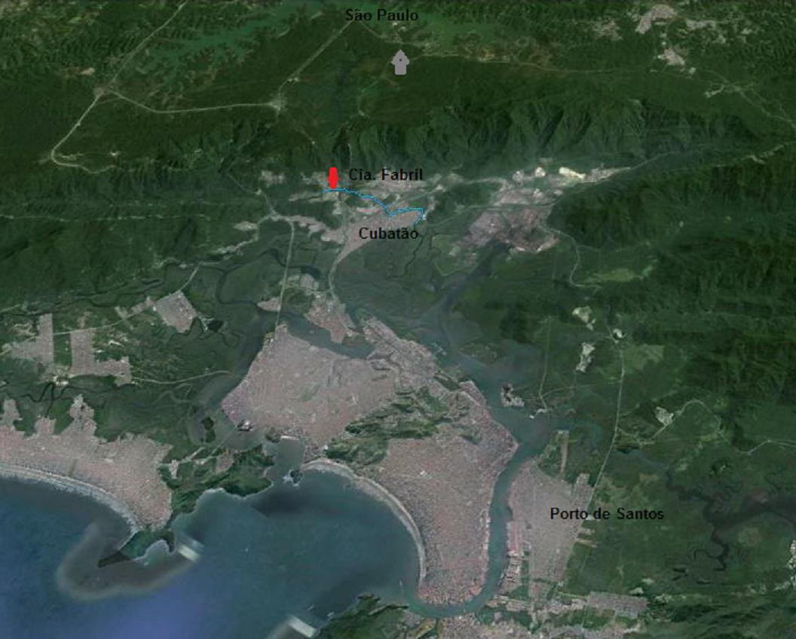
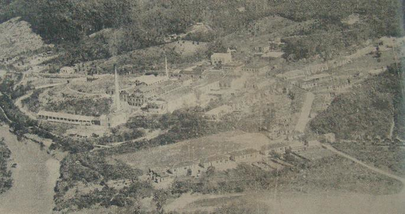
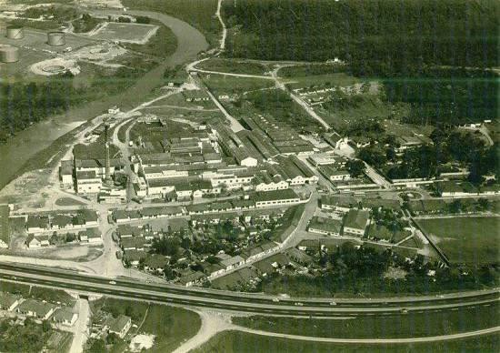
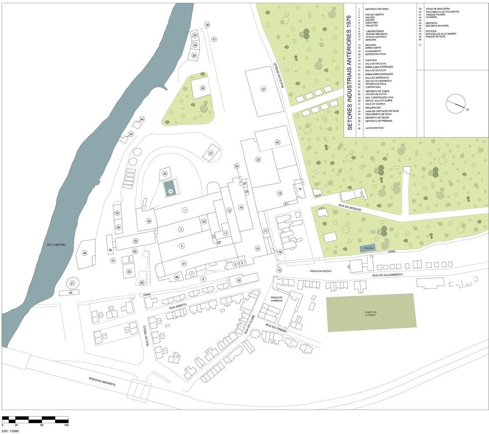
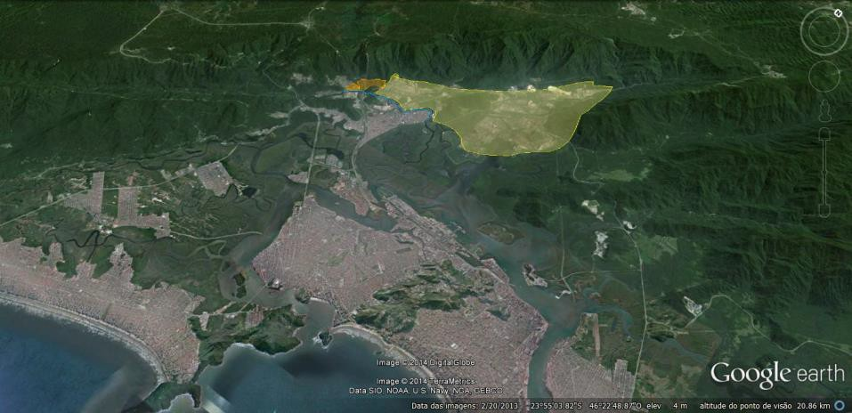
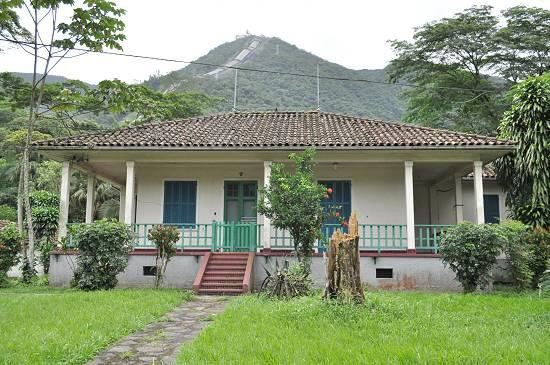

# Resumo

O objetivo do artigo é analisar as características de implantação de
dois conjuntos industriais: a Cia. Fabril de Cubatão e a Usina Henry
Borden, na área que posteriormente se expandiria o polo industrial de
Cubatão-SP. O polo cubatense foi desenvolvido e consolidado entre as
décadas de 50 e 70 do século 20. Localizado próximo à encosta da Serra
do Mar foi o primeiro e o maior do país em diversidade de produção, com
mais de 20 indústrias de base na área de química, siderurgia e petróleo.
Sua localização tem relação, entre outros, com as condições de
infraestrutura e recursos naturais já identificados quando da
implantação da Cia. Fabril, uma fábrica de papel, e da Usina Henry
Borden, que potencializou a atração de indústrias para o local pela
fácil disponibilidade de energia. A Cia. Fabril, inaugurada em 1922 e, a
Usina Henry Borden, em 1926, foram as primeiras grandes construções
industriais no município a se instalarem próximas a escarpa da serra com
vilas operárias planejadas. Atualmente ambas ainda mantem a configuração
espacial e arquitetônica íntegras, embora sejam pouco discutidas,
especialmente na última década quando os núcleos fabris ganharam maior
destaque como tema de estudo. Por meio de plantas e imagens o artigo
reconsidera o papel dessas duas instalações no processo de organização e
ocupação do espaço industrial. Embora o foco não seja o patrimônio,
procura chamar a atenção para a importância desses dois núcleos no
contexto da arquitetura industrial desenvolvida no interior paulista nas
primeiras décadas do século 20.

**Palavras-chave**: Cubatão, industrialização, área industrial,
configuração espacial, vilas operárias, patrimônio industrial

# Abstract

The industrial polo of Cubatão - SP was developed and consolidated
between years fifty and seventies of the 20th century. Located next to
the slopes of the Serra do Mar is one of the most emblematic cases of
industrialization in Brazil, both for being the first, but also because
its location contributed for the huge environmental problem during the
eighties. This article analyzes the characteristics of the architecture
and implementation of two industrial complexes that preceding the
cubatense industrial polo, and influence its occupation process:
Companhia Fabril and Usina Henry Borden. Dating from the 20s of last
century, the Companhia Fabril was a paper mill that over time changed
name and owner many times and the Usina Henry Borden is a power
producer, still active. In the city, they were the first large
industrial buildings near the escarpment of the mountain with working
planned villages. Currently both still have intact buildings, especially
the portion that constitutes its working villages. Documentary sources
and images based this study. Its main purpose is to recovery a history
of the industrial space in Cubatão and drawn the attention to the
industrial heritage, once these two cases are an important example of
the industrial architecture developed in the interior of the São Paulo
state in the first decades of the 20th century.

**Key words:** Cubatão, industrial area, local industrialization,
working villages, industrial heritage

# Introdução

A década de 20 foi marcada por vários eventos culturais, políticos e
econômicos determinantes para a condução do país nas décadas seguintes.
Destacam-se a crise nos preços do café em 1921, a Semana de Arte de
1922, a Revolução de 1924, a depressão mundial em 1929 e, a perda da
hegemonia cafeeira. Porém, ao mesmo tempo em que o café perde sua
primazia é essa economia a fonte financiadora da industrialização que
promove a instalação de novos setores industriais mais complexos e a
ampliação e diversificação urbana (CANO, 1998). Nesse quadro de
princípios do século XX, quando o processo de industrialização
brasileiro ganha força com a expansão das exportações, São Paulo
aproveita o crescimento do excedente e dos lucros para ampliar sua
capacidade de crescimento e diversificação capitalista "ganhando
colossal dianteira econômica sobre as demais regiões do país" (CANO,
1998).

É nesse contexto econômico ocorrido em São Paulo que duas grandes
empresas são instaladas em Cubatão, a Companhia Fabril de Cubatão e a
Usina Henry Borden. A Fabril, como ainda hoje é conhecida em Cubatão foi
uma das mais importantes fabricas de papel do estado1, embora ainda
pouco estudada e mesmo mencionada em publicações relacionadas à
industrialização do período. A segunda, um projeto grandioso da empresa
canadense The São Paulo Tramway, Light and Power Company Limited, que
surgia após um longo processo de busca pelo lugar ideal para a
construção de uma usina que suprisse com energia a crescente demanda da
cidade de São Paulo nos anos 20.

Essas duas grandes construções foram as primeiras próximas à encosta da
Serra do Mar, porém não foram as primeiras em Cubatão, um município que
historicamente se destacou pela sua localização geográfica entre Santos
e São Paulo como determinante para seu processo de desenvolvimento.
Desde o século XVI, Cubatão figurava como ponto estratégico de ligação
do Planalto Paulista com o Porto de Santos, tanto quanto ao escoamento
de produtos quanto ao recebimento de matéria-prima e materiais (PERALTA,
1973: 42). Por essa razão, o local sempre possuiu uma infraestrutura de
transportes que, aliado a presença de recursos naturais, como água em
abundância, favoreceu o aparecimento de atividades industriais sendo os
curtumes, uma das primeiras

atividades registradas já em finais do século XIX2.

Porém há que se considerar também o contexto territorial mais amplo no
qual Cubatão está inserido, o da Baixada Santista, a área central do
litoral paulista composto por nove municípios, a maioria com vocação
turística, além do Porto de Santos. Essa região tem destaque no processo
de ocupação do Brasil desde o século XVI, especialmente com a fundação
de São Vicente, a primeira vila do Brasil, datada de 1532, criada no
litoral como a maioria das primeiras vilas coloniais pela necessidade de
comunicação marítima

> 1 No livro *A marca d'água no papel de imprensa e a indústria do papel
> no Brasil*, do Centro dos fabricantes nacionais de papel do Rio de
> Janeiro, p. 22, a Fabril aparece como a terceira maior produtora de
> papel do Estado de São Paulo, ficando atrás somente da Companhia
> Fabricadora de Papel e da Melhoramentos.
>
> 2 Antes mesmo da construção da "Fabril" e da Usina, em Cubatão havia o
> Curtume Costa Moniz (s/d), que além de curtir couros produzia cordas e
> mangueiras contra incêndio, e a J.B. Duarte (1916) depois Companhia de
> Anilinas, Produtos Chimicos e Material Técnico, uma das primeiras do
> país na produção de corantes e produtos usados na indústria têxtil,
> farmacêutica e química.
>
> com Portugal3. Dessa forma, a Baixada Santista tem sua ocupação
> intimamente ligada à existência das condições de uma região estuarina
> de aportamento que permitiram a permanência dos colonizadores no
> local. Cubatão tem características diferenciadas por ser o único
> município da Baixada Santista que não está voltado para o mar. As
> vantagens na localização de Cubatão, como a proximidade do porto de
> Santos, abertura de estradas, a possibilidade de obtenção de energia
> hidrelétrica, existência de madeira para a queima e de rios para o
> abastecimento, foram decisivas para os primeiros assentamentos e
> investimentos no setor industrial, sendo que a instalação das
> indústrias ocorreu nas áreas mais propícias à urbanização, planícies e
> mangues aterrados, que já demonstrara capacidade de ocupação
> industrial com a Companhia Fabril de Cubatão e a Usina Henry Borden.

# A implantação da Fabril

> A Companhia Fabril do Cubatão foi constituída em outubro de 1919 como
> sociedade anônima com o objetivo de fabricar celulose, papel e papelão
> de diversas qualidades, podendo também fabricar outros produtos. Sua
> construção no que seria a área rural do município de Santos, se insere
> no contexto dos núcleos fabris localizados em ambientes rurais, junto
> a fontes de energia e matérias-primas, afastados do distrito sede e
> gerido, exclusivamente, por uma determinada empresa, conforme explica
> Correia em seus trabalhos (1998; 2001). O cotidiano nas fábricas com
> vila operária, como foi o caso da Companhia Fabril, contém uma ordem
> hierárquica específica e determinada historicamente pelo modo de
> produção capitalista, no qual a organização do trabalho ocupa posição
> central na heterogeneidade deste particular mundo do trabalho.
>
> Os principais acionistas da nova empresa eram o fazendeiro paulista
> Theodomiro de Mendonça Uchoa4 que ficou com o cargo de
> diretor-presidente e o fazendeiro e industrial Francisco de Paula
> Vicente de Azevedo, filho do Barão de Bocaína (1856 -- 1938)5.
>
> Em 1919, após a ida de uma comissão formada por acionistas, a
> recém-formada Companhia adquiriu o terreno de uma fazenda chamada
> Itutinga que abrangia uma área de 8. 617,687 m² ou 356 alqueires de
> terras e matas virgens compreendendo as duas margens do rio Cubatão.
> As terras ficavam cerca de quatorze quilômetros do centro do Distrito,
> em uma área rural denominada Água Fria onde havia expressivas
> plantações de banana, principal atividade econômica de Cubatão naquele
> período. O que determinou a escolha do local foi a presença de três
> quedas d'água com a possibilidade de fácil captação de água para
> produção própria de energia sem o recurso de custosas barragens.
> Também foi identificado como importante a proximidade de Santos e São
> Paulo. O baixo
>
> 3 AFONSO, Cíntia Maria. A paisagem da Baixada Santista: urbanização,
> transformação, conservação. São Paulo: Edusp, 2006, p. 17.
>
> 4 Filho de Ignácio José de Mendonça Uchôa (1820 -1910), um jurista e
> político brasileiro que encerrou
>
> sua carreira como Ministro do Supremo Tribunal de Justiça de São
> Paulo. Vários de seus nove filhos se tornaram fazendeiros no interior
> de São Paulo.
>
> 5 Francisco de Paula Vicente de Azevedo (1856 -- 1938), o pai, foi
> Chefe do Partido Conservador do Vale do Ribeira, foi diretor da
> Estrada de Ferro Central do Brasil e do [Banco Comercial de São
> Paulo](http://pt.wikipedia.org/w/index.php?title=Banco_Comercial_de_S%C3%A3o_Paulo&amp;action=edit&amp;redlink=1)
> e do Banco de Crédito Real, entre outros cargos de destaque. Foi
> [comendador](http://pt.wikipedia.org/wiki/Comendador) da Rosa
> [(1884](http://pt.wikipedia.org/wiki/1884)) e agraciado com o título
> de barão de Bocaina ([1887](http://pt.wikipedia.org/wiki/1887)).
> Fundou o Engenho Central de Lorena. Em 1901, doou ao Governo da
> República os terrenos para as construções da Fábrica de Pólvora de
> Piquete, hoje Fábrica Presidente Vargas, e do Sanatório Militar.
> Possuía uma fazenda-modelo, que era tão funcional e organizada, que
> imagens do local eram usadas como propaganda do Brasil no exterior
> para atrair imigrantes.

custo das terras e a possibilidade de conseguir isenção de impostos
também constituem pontos favoráveis.

Embora a fábrica tenha sido oficialmente inaugurada em 9 de setembro de
1922, conforme relatório apresentado aos acionistas em março de 1923, a
produção começou em fevereiro de 1922, "sem interrupções e acidentes
dignos de nota".

O ano de 1922 foi marcante para a Companhia tanto em relação à
inauguração oficial, que contou com uma comitiva composta por
autoridades políticas e da sociedade santista da época, como pelo fato
de que para participar da Exposição do Centenário, no Rio de Janeiro, a
Companhia contratou a empresa Independência Filmes para fazer um filme
promocional com o objetivo de tornar conhecidas suas instalações. Esse
filme se constitui uma das raras produções dessa natureza datado dos
anos 20 e foi exibido tanto no Pavilhão de São Paulo durante a Exposição
como também em cinemas de Santos e de São Paulo. No filme há a
preocupação em destacar a modernidade trazida pela fábrica e, portanto,
são mostrados o interior da fábrica, o maquinário, a parte construtiva,
a parte operacional e toda a infraestrutura construída.

> 

Figura 1 --Vista parcial da Baixada Santista, com localização da Cia.
Fabril na margem esquerda do rio Cubatão (linha azul). Imagem do Google
Earth/2014.

Entre 1922 e 1927 a Companhia Fabril investiu maciçamente na construção
das instalações necessárias na fabricação de papel e na vila operária
com construções habitacionais e de lazer, constituindo-se em um dos
maiores empreendimentos da Baixada Santista naquele momento. Embora
tenha aumentado seu capital entre os anos de 1919 e 1929, investindo
mais de 20 milhões de contos de réis, e com uma produção crescente, em
1930, a companhia foi a falência. As causas são várias e compreende o
momento econômico de flutuação cambial, os vários empréstimos com juros
altíssimos contraídos pela companhia, a produção excessiva de papel
ocorrida a partir de 1925 e que

incidiu na diminuição dos preços desse produto (SUZIGAN, 2000); nas
dificuldades de importação de matéria-prima e, sem dúvida no altíssimo
investimento realizado em um momento no qual a conjuntura econômica e
política nacional e internacional arrefeceram a industrialização
causando a falência de inúmeras empresas na segunda metade da década de
20.

Nos oito anos de atividade, a estrutura que foi construída é expressiva,
bem como a articulação com a Estrada de Ferro São Paulo Railway com a
construção de uma linha férrea própria. Até 1931, a Companhia Fabril de
Cubatão compreendia uma Usina Hidroelétrica (barragem através do rio
Cubatão); estrada de ferro ligando a fábrica à linha da City
Improvements Company de Santos com dois ramais um numa extensão de seis
e outro de dois quilômetros; duas locomotivas e doze vagões abertos de
seis toneladas de lotação e quatro vagões abertos; fábrica completa para
produção de papelão com uma máquina com capacidade de quatro toneladas
diárias; fábrica completa de pasta mecânica para a produção de 8
toneladas diárias; mais de vinte tipos de máquinas destinadas a
produção, sendo a maioria importadas; laboratório montado com tudo que é
necessário para exame completo das matérias primas, artigos,
manufaturas, etc.; serraria e oficina mecânica completas em edificações
próprias; dois galpões para estocagem de produtos próximo a estação da
Estrada de Ferro São Paulo Railway; casa para residência do Diretor
Técnico da companhia, 5 para 'pessoal superior"; vila operária com 130
prédios para habitação de empregados e serviços, escola, farmácia,
armazém, cinema, clube, sendo que boa parte das casas era de alvenaria e
venezianas, com água encanada, esgoto e luz elétrica.

Em 1931, a Companhia Fabril de Cubatão foi a leilão passando a ser
cessionária da Cia. Santista de Papel que ampliou a produção, a fábrica
e a vila operária, não havendo grande diferenciação entre o número de
instalações da fábrica construídas até sua falência. As modificações
mais visíveis são no aumento do número de casas, no arruamento,
pavimentação e na construção de uma igreja, conforme observados na
imagem de 1936 e outra de 1951 (Figuras 2 e 3).

> 

Figura 2 -- Fotografia da Companhia Santista de Papel concessionária que
assumiu a Companhia Fabril de Cubatão em 1931 publicada no Jornal A
Tribuna de Santos em 1936.

Figura 3

-- Vista da

Companhia Santista de Papel, já com a Rodovia Anchieta. Anos 50, acervo
PMC.

Em 1976 foi realizada a regularização do complexo da Companhia junto à
Prefeitura Municipal de Cubatão (figura 4) constando uma área total de
41.402,2m², que inclui o terreno industrial mais a vila operária.

 Figura 3 -- Planta baixa da Cia.
Fabril de 1976, produzida por Nathalia pessoa, 2014.

Desse período constam ambulatório e banco, que provavelmente também
atendiam sitiantes remanescestes e os moradores das áreas de invasão no
entorno da Fabril. Em função da localização da Fabril, houve um aumento
da ocupação das áreas de entorno, por moradores de baixa renda que
usufruíam dos equipamentos instalados inicialmente

pela empresa. O processo de ocupação do entorno também foi decorrente da
rápida urbanização em função da industrialização após os anos 50 e pela
facilidade de acesso ao Polo Industrial. Desde os anos 70, a via que
passa por dentro da fábrica se tornou na principal via de acesso aos
"bairros" próximos, situação que permanece até hoje e de forma mais
acirrada em decorrência do incrível aumento populacional do entorno.

Atualmente a antiga Companhia Fabril pertence a MD Papéis que encerrou a
produção no local e pretende concluir o processo de desmonte da fábrica
e de sua vila operária, iniciado nos anos 80 com o objetivo de dar novo
uso ao local. O Conselho de Defesa do Patrimônio Cultural de Cubatão
solicitou, em 2012, tombamento da vila operária e de todo o conjunto
fabril remanescente, porém a prefeitura ainda não se manifestou sobe o
assunto.

# A Implantação da Usina Henry Borden

No mesmo período de construção da Companhia Fabril, houve a construção
da Usina Henry Borden. A construção dessa Usina tem a ver com os sérios
problemas de falta de energia elétrica na capital me princípios dos anos
20. A solução era a ampliação urgente da capacidade energética do
estado, especialmente em virtude da demanda das indústrias que se
proliferavam no estado sem um sistema elétrico interligado que pudesse
suprir a energia necessária para seu funcionamento.

A empresa responsável pelo transporte público (bondes elétricos) e pela
substituição do vapor como fonte de energia era a canadense The São
Paulo Tramway, Light and Power Company Limited, estabelecida em 1899. Em
função desse quadro e como parte de uma estratégia de manutenção e
ampliação de sua atuação no Brasil a Light, como ficou conhecida a
empresa, deu início ao chamado Projeto Serra, um investimento gigantesco
na produção de energia elétrica empreendido entre as décadas de 1920 e
1960. As obras ficaram a cargo do engenheiro americano Asa White Kennedy
Billings que em 1922 convidou outro engenheiro, F.S Hyde, com vistas a
buscar o lugar ideal para implantação de uma nova usina nas proximidades
de São Paulo. Após percorrer a região paulista, Hyde percebeu a
possibilidade de recolher a água de alguns rios do Planalto e lançá-los
junto ao Rio das Pedras serra abaixo, aproveitando o desnível de 720
metros da Serra do Mar para geração de energia. (FERRARI & DINIZ, 1992).
É nesse contexto que nasce a Usina de Cubatão, como ficou inicialmente
conhecida a Usina Henry Borden.

Para concretizar esse plano, foi necessária a construção de várias
estruturas até a Serra do Mar em Cubatão, dentre elas destacamos duas
barragens no **Rio Tietê** (Barragem Edgar de Souza e Barragem de
Pirapora); mudança de curso do Rio Pinheiros e construção do **Canal
Pinheiros** (Estrutura de Retiro; Usina Elevatória de Traição; Usina
Elevatória de Pedreira); o **Reservatório Billings** (Barragem do Rio
Grande; Barragem Reguladora Billings-Pedras; Dique do Rio Pequeno; Dique
do Córrego Preto; Dique Marcolina, Passareúva, Cubatão de Cima e
n.1,2,3, 5A, 5B, 6 e 7); o **Reservatório Guarapiranga** (Barragem de
Guarapiranga) e, finalmente a Usina em Cubatão, a obra mais importante
do "Projeto Serra" e considerada a maior obra de engenharia do Brasil
dos anos 20 (MAGALHÃES, 2000).

A região de Cubatão foi escolhida pelo desnível de 720 metros entre o
topo da serra e o nível do mar, fazendo com que as águas ganhassem força
e, em queda nas adutoras, movimentassem as turbinas da usina. Assim como
no caso da Companhia Fabril, a localização entre a capital São Paulo e a
cidade portuária de Santos também foi determinante, bem como a
proximidade com a estrada de ferro da São Paulo Railway (Santos -
Jundiaí), que seria útil no transporte do material pesado para a
construção do empreendimento. As obras tiveram início em 1925, com cerca
de seis mil operários trabalhando desde onde seria o Reservatório do Rio
das Pedras até o local da usina, na

encosta da serra. Em outubro de 1926, foi inaugurado o primeiro grupo
gerador. A partir dessa data a usina foi constantemente ampliada com a
incorporação de outras unidades de geração de energia, uma usina
subterrânea com quatro grupos geradores, novas adutoras entre outras
instalações, sendo que o término das obras só foi determinado em 1961,
quando a usina atingiu 914.000kw de capacidade instalada6. Atualmente,
podemos considerar a Usina Henry Borden como um complexo hidrelétrico7
composto por duas usinas de alta queda -- de aproximadamente 720 metros
--conhecidas como Externa e Subterrânea, com um total de 14 grupos
geradores acionados por turbinas tipo Pelton.

Segundo dados da Eletropaulo (1996), entre as décadas de 20 e 60 a Usina
Henry Borden forneceu grande parte da energia elétrica necessária ao
processo de industrialização ocorrido no Estado de São Paulo, e parcela
considerável da eletricidade de consumo doméstico. Também contribuiu
para o desenvolvimento industrial da cidade de Cubatão, justamente por
disponibilizar água e energia para as empresas que se instalaram na
localidade.

Para COUTO (2002), é a partir da presença da usina da Light que podemos
começar a entender a localização do polo industrial de Cubatão que iria
surgir na década de 50, pois aliada às condições históricas de
localização de Cubatão, a presença de infraestrutura, de fácil obtenção
de água e de energia provida pela Usina, dentre outros, foram os motivos
para a construção da Refinaria Presidente Bernardes em princípios de
1950, determinante para a formação do polo industrial de Cubatão.

> 

Figura 4 -- Em laranja a localização da Companhia Fabril e da Usina
Henry Borden. Em amarelo a área atualmente ocupada por indústrias em
Cubatão.

# A construção da vila operária

A construção da Usina demandou milhares de trabalhadores com o objetivo
de domar a natureza e vencer, mais uma vez, o que fora tentado
sucessivamente nos séculos anteriores: a grande muralha que é a Serra do
Mar. Uma das grandes características do alto da serra é a pluviosidade,
a constante neblina e dificuldade de mobilidade. Embaixo, já em Cubatão,
os terrenos eram insalubres, propensos à propagação da malária sendo que
muitos desistiam do trabalho, morriam por acidente ou doença. Segundo
Dias, (1992:42), os trabalhadores eram contratados por empreiteiras, com
maioria composta por brasileiros, depois portugueses, polacos e
espanhóis.

6.  Desde 1992 só é permitido o bombeamento do reservatório Billings
    para o reservatório Pinheiros para o controle da cheias, reduzindo a
    capacidade do complexo da Usina Henry Borden em mais de 75 %.

7.  Segundo Atlas da Energia Elétrica no Brasil, da ANEEL (1ª edição),
    Henry Borden é a 24ª maior usina hidrelétrica em potência instalada
    no Brasil.

Inicialmente foram construídos vários acampamentos para abrigar os
trabalhadores. O Jornal da Noite, de 13/10/1926 informava que no local
havia uma verdadeira "cidade improvisada em madeira e folha de zinco que
a S.P Light & Power criou para os seis mil trabalhadores e trezentos e
cinquenta empregados de escritório que os seus serviços ali reclamavam".

Com o tempo foi se configurando uma vila operária. Dias (1992:43/44)
relata que até 1947 haviam sido construídas 162 casas, feitas em oito
plantas padrão e quatro tipos de acabamento. A divisão das casas seguia
o princípio da hierarquia de funções comuns a núcleos fabris do período,
ou seja, as melhores casas eram destinadas aos cargos mais altos e
ficavam mais próximas à Usina e da entrada da vila operária.

Além das casas foi construído clube, escola, equipamentos de esporte e
lazer. Assim como a companhia Fabril, a Usina possuía time de futebol e
promovia bailes e atividades que participam não só seus empregados, mas
também os moradores de Cubatão. Também havia os times de futebol de
várzea regionais que disputavam com os times dessas duas empresas. Até
hoje esse aspecto de entrosamento nas atividades sociais e de lazer é
destacado pelos cubatenses.

A vila operária se estendeu na superfície existente em meio à mata
atlântica. As construções e as vias de acesso foram acomodadas
aproveitando a topografia do terreno. A vegetação nativa compôs o
paisagismo. Jacatirões, aleluias roxas e amarelas, água cristalina das
cachoeiras da serra, fazem parte da paisagem tornando a vila um ambiente
extremamente agradável, tanto no passado quanto nos dias de hoje.

A construção da Usina com tecnologia inovadora e em um local de beleza e
recursos extraordinários foi uma resposta rápida à crise de energia se
tornou um empreendimento que favoreceu a propaganda da "Light". Ainda em
1926, os dirigentes da Light contrataram o Escritório Técnico Ramos de
Azevedo --- para construção de uma casa no alto da serra do mar
especialmente destinada às visitas. A casa tem 435 m2 de área
construída, é de alvenaria de tijolos, toda avarandada e fica a 500 m do
Caminho do Mar. Ficou pronta em novembro de 1926 e, por trinta anos, foi
usada para hospedar convidados ilustres e oferecer almoços que incluíam
como parte do programa, a descida da serra em trolley aberto e uma
visita às instalações da usina. Um desses convidados foi o poeta inglês
Rudyard Kipling (Prêmio Nobel de Literatura de 1907), que assim escreveu
o relato de sua viagem no Morning Post, de Londres:

> *Fomos para a nova usina de energia, onde se usam algumas centenas de
> litros de água represada acima. Fomos içados para o alto da montanha
> num bondinho suspenso ao lado dos canos e toda vívida paisagem, caindo
> como o fundo de uma caixa, ficou abaixo até que pudemos avistar a
> quente Santos e os seus diminutos navios seiscentos metros abaixo.
> Nosso bondinho nos levou montanha acima para a densa invisibilidade de
> nuvens mais espessas. (Kipling citado por Eletropaulo, 1996).*

Atualmente, a Usina Henry Borden pertence a Emae que, assim como a MD
Papéis, iniciou o processo de desmonte da vila operária desde os anos
80.

Figuras 5 e 6 -- Fachada frontal de
casa e visual de rua da vila operária. Fonte: Rodrigo
Fernandes/Secretaria de Comunicação Social/Prefeitura de Cubatão.

# Conclusão

O presente artigo buscou destacar a influência histórica e econômica da
construção da Companhia Fabril de Cubatão e da Usina Henry Borden
enquanto precursoras da área industrial de Cubatão.

Após a construção da Companhia Fabril de Cubatão e da Usina Henry Borden
na encosta da serra do mar, na margem esquerda do rio Cubatão, outras
indústrias foram construídas, começando com a implantação da Refinaria
Presidente Bernardes em 1951, orientada pelo Plano de Metas do Governo
Federal iniciado do governo de Getúlio Vargas (1934-1945/1951-1954) e
levado a cabo por Juscelino Kubistchek (1956-1961).

À construção da Refinaria, seguiram-se a construção da Companhia
Siderúrgica Paulista

-- Cosipa de empresas petroquímicas e de fertilizantes, ainda nos anos
50, atraídas pelos fatores comuns de infraestrutura, localização,
energia, mas também pela possibilidade de fácil obtenção de derivados de
petróleo vindos da refinaria para sua produção. Para instalação do polo
industrial, muitas modificações foram realizadas no município inclusive
com a transformação das áreas rurais em áreas urbanas devido à ocupação
pelas indústrias da maior parte da área caracterizada por sítios e uma
tradição campesina (SILVA, 2006, p. 105).

Para Goldenstein (1965), a tendência da zona industrial se desenvolver
na encosta da serra do mar seguiu a necessidade de encontrar terras mais
firmes e, provavelmente, manter uma diferenciação do tradicional núcleo
urbano desenvolvido na margem direita do rio. Nesse sentido, a Companhia
Fabril de Cubatão foi um dos primeiros grandes empreendimentos a
evidenciar as características de recursos naturais e de infraestrutura
do local e a primeira a ocupar a área da encosta da serra do mar em
Cubatão. Já a Usina, cuja construção foi quase concomitante à da
Companhia Fabril, e nas proximidades dessa, teve considerável influência
na decisão da implantação da Refinaria, que potencializou a atração de
indústrias siderúrgicas e petroquímicas para o local.

# Bibliografia

> ALMEIDA, Daniel Ladeira. *Os passivos ambientais no reservatório
> Billings e os seus impactos na geração hidroenergética da Usina Henry
> Borden* (Dissertação mestrado). Santo André: Centro de Engenharia,
> Modelagem e Ciências Sociais Aplicadas, 2010.
>
> CANO, Wilson. *Raízes da concentração industrial em São Paulo*. São
> Paulo: Unicamp, 1998.
>
> *CENTENÁRIO DO NASCIMENTO DO BARÃO DE BOCAINA*. Revista Genealógica

Latina. Instituto Genealógico Brasileiro: São Paulo, Volumes 8-11, 1956,
p. 87 *Relatório da Companhia Fabril do Cubatão*. Diário oficial do
Estado de São Paulo, São Paulo, ano 32532, nº 65, 22 de março de 1923,
p. 2244.

> GARCIA, Maiza. *A Usina Henry Borden e o Projeto da Serra*. Artigo
> publicado na seção Mem ria da ne sletter Fique Ligado - Ano 1 n 9/2 9,
> dispon vel em
>
> .energiaesaneamento.org.br/\.../a usinahenr bordenprojetoserra.pdf
> GOLDENSTEIN, Lea. *A industrialização da Baixada Santista: estudo de
> um centro industrial satélite.* São Paulo, Instituto de Geografia da
> USP, 1972.
>
> . *Cubatão e sua área industrial*. In: José Ribeiro de Araújo Filho.
> *A Baixada Santista: aspectos geográficos*, Vol. 4. São Paulo, USP,
> 1965.
>
> GUNN, Philip; CORREIA, Telma de Barros. *A industrialização brasileira
> e a dimensão geográfica dos estabelecimentos industriais*. Revista
> Brasileira de Estudos Urbanos e Regionais (ANPUR), v. 7, n. 1, p.
> 17-53, 2005.

MEMÓRIA: publicação trimestral do Departamento de Patrimônio Histórico
da Eletropaulo, Edições 1-9, 1988.

> MAGALHÃES, GILDO. *Força e Luz: Eletricidade e Modernização na
> República Velha*. São Paulo: Ed. UNESP/Fapesp, 200. P. 65
>
> PERALTA. Inez Garbuio. *O impacto da industrialização sobre o
> desenvolvimento de Cubatão*. São Paulo, 1980. Doutorado em História
> Econômica da Faculdade de Ciências e Letras da Universidade de São
> Paulo.
>
> . *O Caminho do Mar - Subsídios para a História de Cubatão.*

Cubatão: Prefeitura Municipal de Cubatão, 1973.

> SUZIGAN, Wilson. *Indústria Brasileira, indústria e desenvolvimento*.
> São Paulo: Hucitec, 200, p. 311.
