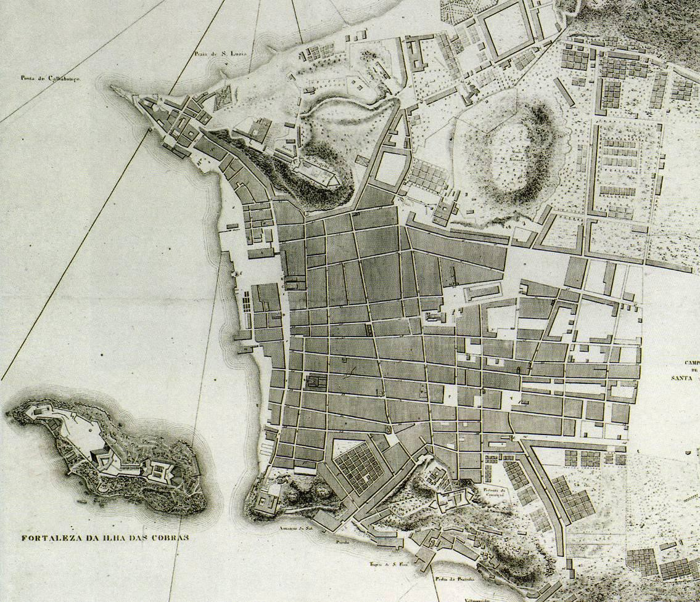
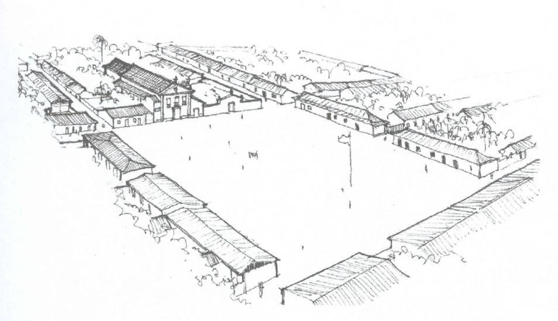
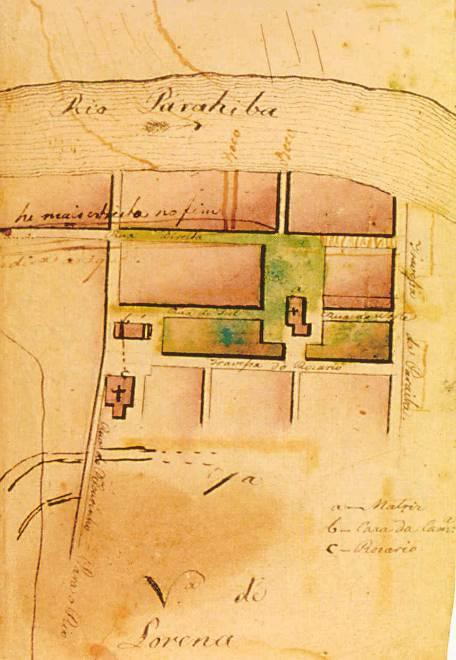

# Resumo

Este artigo trata da relação entre a Igreja Católica e o Estado
Português no processo de colonização das terras de sua colônia em
continente americano e como essa relação se desdobrava em fatores de
estabelecimento e organização das vilas criadas em território hoje
brasileiro. Observa como a Igreja era utilizada como um instrumento
estatal de doutrinamento e obediência à coroa portuguesa e um braço
governamental responsável, entre outras coisas, por organizar os planos
iniciais das vilas criadas sob seus domínios. Observa também diferenças
entre as formas como os governos português e espanhol concebiam suas
novas cidades, percebendo uma forma de implementação mais sutil e
adaptável aos sítios por parte dos portugueses, com menor preocupação
com traçados, estes, mais subordinados aos terrenos e a pontos focais:
os adros e as praças públicas.

Palavras-chave: história urbana, Igreja, Brasil, Portugal, urbanismo.

# Abstract

This paper deals with the relationship between the Catholic Church and
the Portuguese State in the colonization of the lands of their colony in
the Americas and how this process reflected in the establishment and
organization factories of villages created in Brazilian territory. It
observes how the Church was used as an instrument of state doctrination
and obedience to the Portuguese Kingdom and a government arm
responsible, among other things, for organizing the initial plans of
towns created. Also notes differences between the ways in which
Portuguese and Spanish governments conceived their new cities, observing
a form more subtle and adaptable to the natural sites by the Portuguese,
with less concern with plan implementation, these more subordinated to
the topography and principal points: the churchyards and public squares.

Keywords: urban history, Catholic Church, Brazil, Portugal, urbanism.

# A colonização como expansão da fé católica

Na colonização das terras brasileiras, a união entre Igreja e Estado já
estava estabelecida e veio acrescentar novos motivos para a empreitada à
ideia que já vigorava na época, quando Portugal ainda vivia uma sensação
de expansão. Após décadas de lutas para expulsar os mouros das terras
lusas, verdadeiras cruzadas, iniciaram-se as grandes navegações e foram
sendo estabelecidos postos avançados ao longo das costas africana e
asiática. Portugal não cabia mais dentro de si mesmo, como que se
lançasse em tentáculos para as várias partes do globo onde colonizava.
Sob as bandeiras do governo, sempre estava presente a representação
eclesiástica, que era peça importante no estabelecimento da cultura lusa
nas novas possessões (destaque-se aqui que até os dias atuais o brasão
da bandeira portuguesa ostenta o astrolábio repousando sobe a cruz da
Ordem de Cristo, a mesma que vinha estampada nas velas das embarcações
lusitanas).

Os portugueses acompanhavam a mentalidade de seus reis, pois pertenciam
a uma

Igreja já bem estabelecida e mantinham um mesmo sentimento comum que
marcou os católicos de seu tempo, especialmente na Península Ibérica: um
sentimento guerreiro contra os inimigos da fé, fossem eles mouros
muçulmanos ou povos de outra denominação qualquer que não a católica,
ideia essa popularizada em tempos mais antigos, desde que o papa Urbano
II convocou os povos europeus para a Guerra Santa (1096-1272) contra os
turcos infiéis que dominavam Jerusalém (HOORNAERT, 1974, p.32-3). Essa
noção de expandir a nação nos novos continentes como uma espécie de
cruzada levaria ainda muito tempo para abandonar as mentes dos países
das grandes navegações.

Para Portugal, as colônias eram, claro, áreas para serem exploradas, mas
a intenção não era a de se constituir uma nova sociedade em uma nova
terra, num novo ambiente e num novo tempo, e sim fazer das posses uma
continuação da sociedade portuguesa, uma expansão sua com a manutenção
dos costumes e preceitos da terra-mãe.

Dessa maneira, os colonizadores portugueses aqui aportaram trazendo
consigo toda uma bagagem cultural, o que incluía seus saberes de
navegação, sua capacidade intrínseca de adaptação a novos meios e
localidades, conhecimentos de técnicas construtivas simples e
cambiáveis, o trato menos agressivo para com os gentios se comparados a
seus vizinhos espanhóis, entre outras características. A cultura e,
consequentemente, a forma de colonização lusitana, serão muito mais
sutis que as espanholas: os portugueses guerreavam menos com os nativos
americanos, colocavam suas crenças de maneira menos impositiva, e
implantavam cidades adaptando-as ao sítio urbano, ao seu relevo,
organizadas como postos avançados que poderiam ser facilmente
abandonados em casos de sucessivos ataques. Todo o aparato de
colonização português era mais simples e discreto que o espanhol.

Uma característica bastante arraigada à tradição portuguesa e
transplantada também para as terras americanas foi a relação bastante
próxima da população com a já bem estável fé católica, com todos os seus
dogmas e paradigmas de além-mar.

> Na era colonial, (\...) não era um cristianismo em formação que se
> lançava sobre a nova área, mas um certo Catolicismo, com seus dogmas e
> teologias já estruturados, centralizado em torno do magistério
> pontifício e, mais do que nunca, associado a um projeto estatal
> (KARNAL, 1998, p. 19).

E a Igreja fazia parte desse projeto de colonização do território. Era a
marca de ocupação da nova cultura sobre as demais, subjugadas, e o braço
religioso e até administrativo do Estado. Igreja e Estado estavam juntos
e se complementavam, eram como uma extensão, parte um do outro.

# A Igreja como apaziguadora dos súditos

O povo, se bem instruído nos preceitos da fé, seria melhor vassalo do
reino e garantiria a paz e a boa governabilidade nas colônias. Essa
noção de manutenção da Igreja para garantir a vassalagem dos súditos em
terras da colônia era reafirmada recorrentemente, visando controlar os
ânimos da população, lembrando que era grande, no Brasil, o contingente
de criminosos e degredados, que deveriam ser mantidos sob controle. A
população local, de notada maioria masculina, deveria ser
incessantemente vigiada e controlada. O que seria melhor que a própria
consciência dos habitantes de aquém-mar para mantê-los sob controle?
Cabia à Igreja incutir no

homem a noção e a necessidade do ser pacífico e subalterno ao poder da
distante realeza metropolitana.

Tal noção é ratificada anos depois, em 1800, em carta régia dirigida
pela corte portuguesa ao capitão-mor da Bahia, Francisco da Cunha
Menezes, onde se lhe recomenda que cuide da dignidade dos prelados e que
exija dos mesmos submissão aos direitos reais, colocando a Igreja no
papel de instrumento de pacificação política:

> A religião dada por Deus ao homem para sua consolação é, sem dúvida o
> melhor e mais seguro meio de conservar a tranqüilidade a subordinação
> necessária entre os povos, e assim, por este motivo, como razão da
> qualidade que me é inerente de defensor e protetor da Igreja, vos
> recomendo não só que façais respeitar a mesma religião, mas também que
> mostrando a maior deferência para os prelados da Igreja, os auxilie
> com aquelas providências que eles justamente solicitarem de vossa
> parte e que forem indispensáveis para conservar o respeito devido à
> mesma Igreja e aos seus ministros, e para zelar sem violência a
> permanência e conservação dos bons costumes, do que não depende menos
> do que hábeis leis, a prosperidade e felicidade dos Estados. Portanto
> confio que com a vossa pessoal conduta não só dareis a tão louváveis
> princípios o mais sólido fundamento, mas também vos proporeis a zelar
> a minha soberana autoridade, não consentindo que debaixo de aparentes
> pretextos do bom serviço de Deus e da Igreja, se violem os meus reais
> direitos, de que por uma parte vem resultar graves inconvenientes ao
> meu real serviço, e pela outra se suscitam graves perturbações e
> escândalos nocivos ao mesmo serviço de Deus e da Igreja (HOORNAERT et.
> al., 1979, p.181).

Assim como à Igreja cabia, entre outras coisas, auxiliar o Estado no
doutrinamento dos súditos, o mesmo estava comprometido e empenhado em
não apenas colonizar, mas também a evangelizar os povos "pagãos" que
habitavam essas terras de aquém- mar. E evangelizar significou, em nosso
caso, a imposição aos gentios da cultura portuguesa, fortemente calcada
nos preceitos do catolicismo. *Pelo patronato régio, cabia ao governo
civil o envio e o devido sustento dos missionários dedicados à conversão
a Deus dos incréus que se encontravam nas colônias (ALTOÉ, 1993, p.20).*
Na cultura do país, a Igreja e o Estado eram instâncias da vida e do
cotidiano marcantes em Portugal que não podiam ser completamente
separados. Tanto na metrópole como na colônia sul-americana não se tinha
uma idéia da Igreja Lusa como uma igreja tridentina, no sentido de uma
instituição estanque, forte, cerrada em si, mas o que se via e se
entendia no período de colonização do Brasil era uma sociedade mais
ampla, na qual Estado e Igreja se identificavam e compartiam funções
políticas, administrativas e sociais.

# A fundação das cidades

A Igreja era também a instituição que aqui havia mais próxima aos atuais
cartórios, e os padres, por vezes, se aproximavam de escriturários, pois
realizavam todos os registros dos cidadãos, seus fiéis.

> Os clérigos eram funcionários encarregados de ministrar os sacramentos
> e todos conhecem o espanto do piedoso Saint- Hilaire ao ouvir do padre
> mineiro a resposta a seu agradecimento pelas atenções que tivera pelo
> "camarada" naturalista morto em viajem: "sou pago para isto". Era pago
> para ministrar os sacramentos; juizes pagos para ministrar a justiça;
> os soldados pagos, para guerrear. Empregos diversos no serviço \'de
> Deus e del-rei' que sempre estavam juntos (TORRES, 1968, p.38).

A igreja se tornou, dessa forma, um braço do Estado no território
brasileiro, indo, quase sempre, além das funções estritamente
religiosas. Era a responsável por hospitais, asilos, orfanatos e
cemitérios. E, com os registros de batismo, matrimônio e óbito, a
instituição comandava a vida pública dos cidadãos. O homem vinha ao
mundo pela Igreja, formava família com seu aval e era sepultado em suas
terras.

Ocorria comumente que, como Estado e Igreja tinham atribuições que se
confundiam e, num momento que o primeiro era estruturado de forma
bastante precária na colônia, o governo, na maioria das vezes, tinha,
por parte da população, uma reputação menor que a Igreja: enquanto as
instituições eclesiásticas faziam valer seu cunho de agentes da religião
oficial e se instalavam segundo suas normas bem formuladas e
fiscalizadas, outro era o quadro para as entidades cívicas, ainda que do
maior prestígio. (MARX, 2003, p.41). A presença da Igreja ou a falta
dela, por meio de um templo, era também uma forma de o Estado
estabelecer um padrão para dividir e organizar territorialmente as
povoações, pois a partir do templo se formavam juridicamente as cidades.
Uma divisão paroquial demarcava, da mesma maneira, os limites dos
juizados de paz. Era necessário que, onde houvesse uma aglomeração
humana aspirante a vila, que o proprietário local (geralmente um
sesmeiro que tolerava a ocupação de uma pequena nesga de suas terras por
essas pessoas) doasse parte de suas posses para a formação do patrimônio
religioso. O nome dizia literalmente o que era: uma gleba que deveria
ser doada ao santo padroeiro e passaria a ser patrimônio da Igreja.

> Este curioso processo de fundação de cidades \[de doação de
> patrimônio\] era empregado desde muito tempo no Brasil, onde já se vê
> funcionar no século XVI. O primeiro exemplo é talvez o de Santos,
> fundado por Brás Cubas em 1545 em torno de uma capela e de um hospital
> de Todos os Santos. A doação do patrimônio foi feita ao hospital,
> encarregado de organizar e de lotear as datas em torno da capela; o
> sucesso do loteamento permitiu ao próprio Brás Cubas, lotear a parte
> vizinha, de sua propriedade pessoal. A fundação de Jundiaí, no norte
> de São Paulo, em 1615, por Rafael de Oliveira, se fez do mesmo modo:
> ele construiu uma capela e deu-lhe um vasto patrimônio. Sorocaba, no
> oeste de São Paulo, teve a mesma origem; assim também Montes Claros,
> Botucatu, São Manoel, fundadas no século XIX. Foi sem dúvida esse
> processo do patrimônio que deu ao Brasil a maioria de suas cidades
> (DEFFONTAINES, 1944, p.20).

Esses patrimônios eram loteados e os lotes arrendados ou aforados1 para
renda da instituição eclesiástica, que com elas manteria o culto e o
templo, ao redor do qual se estabeleceriam definitivamente as habitações
que conformavam a localidade. Essa doação trazia benefícios para o
sesmeiro/fazendeiro:

> Doar as terras para uma ermida ou capela muitas vezes afastava do
> fazendeiro possíveis problemas com a Igreja. (\...) Junto ao processo
> constava uma declaração de fé. Aceita a doação do patrimônio
> religioso, a escritura podia ser feita em nome do próprio santo, como
> é o caso de Campos de Cunha, onde, até hoje, é ele o dono das terras.
> Outra forma foi a doação pela qual a Igreja e o pároco, ou cura,
> poderiam usufruir os lucros da terra e de suas novidades. Não podendo
> ser fundadas em lugares ermos e despovoados, as capelas, além do
> sentido de posse da terra, tinham também a função de consolidar a
> povoação formada perto das fazendas (TIRAPELLI, 2005, p.18).

O governo local somente reconhecia a existência de uma povoação a partir
do momento em que a capela presente fosse elevada à categoria de
freguesia (paróquia). Esse processo para a constituição de uma nova
povoação não se alterou até os fins do período imperial no Brasil. Com
isso, até o final do século XIX, a capela era o ponto que embrionava a
povoação, o primeiro símbolo de oficialidade de uma localidade que se
estabelecia. Em muitos casos, também a primeira edificação do local, a
edificação que atraía as pessoas para se fixarem em suas cercanias,
atraindo moradores que formariam uma nova comunidade ao seu redor (VALE,
1998, p.20).

Por isso, a construção da capela era uma das primeiras atitudes tomadas
após a doação das terras para o patrimônio religioso. Se houvesse
escassez de rendas na localidade, erigia-se uma provisória até que fosse
possível construir-se a igreja definitiva.

> O traçado era determinado pela topografia, e a construção da capela,
> ou igreja, era imediata. Se era concluída ou não, pouco importava,
> pois o símbolo da posse era obrigatório. A inconsistência das
> construções foi uma característica. Não tinham o significado de local
> de permanência. A igreja, porém, era o local onde se cumpriam as
> atividades obrigatórias da religião, sob pena de multa (TIRAPELLI,
> 2005, p.20).

A Igreja era um marco e, via de regra, ocupava o centro da área doada
como patrimônio, ou melhor, o ponto central do largo fronteiriço era o
exato centro geométrico da gleba recebida, geralmente, quadrangular: a
norma lusa estipulava uma figura em quadra -- como de resto era usual na
definição de superfícies, seja de sesmarias, de quintas, de terrenos
urbanos -- ficando pressuposta a do quadrado (MARX, 1991, p.73). Somente
muito tempo depois, em fins do século XIX e começos do XX, a rígida
forma dos patrimônios religiosos vai se alterar, sendo mais comuns as

> 1 Aforamento: espécie de cessão de terras em que o foreiro pagava uma
> quantia ao proprietário do local, no caso de nossa pesquisa, à Igreja,
> para ocupar um lote. Tal lote não se tornava sua propriedade,
> continuava sendo terra eclesiástica e, caso o foreiro não cumprisse
> suas obrigações ou a igreja necessitasse do terreno, poderia
> requisitá-lo de volta. O foreiro deveria, além de tudo, pagar o dízimo
> em benefício da Ordem de Cristo, que tinha o direito outorgado pela
> Santa Sé e garantido pelo Rei de Portugal, sobre as terras das
> colônias.

doações retangulares ou em forquilha, entre dois cursos d\`água
(GHIRARDELLO, 2002).

Ainda assim, como o sistema de doação de terras vigente no Brasil era o
de sesmarias, medidas em léguas (6,6 km), e os proprietários utilizavam
menos que a décima parte de suas propriedades, o quadro do patrimônio
podia variar mais para cá ou mais para lá, sem que isso causasse
problemas. O que ocorria de fato é que, escolhida a localização do
templo, consideravam-se os limites do patrimônio religioso contando- se
a partir do adro frontal e obedecendo à orientação da construção, seja
ela qual fosse, pois quase nunca estavam alinhados com qualquer ponto
cardeal.

# O plano urbanístico

Construída a capelinha, em torno dela as ruas eram delineadas e o
vilarejo ia se conformando. A forma do traçado e a implantação no sítio
urbano, portanto, dependiam totalmente da localização escolhida para o
marco zero, ou seja, do local onde se edificaria a igreja. A legislação
católica era bastante clara quanto aos locais para ereção das capelas:

> Conforme o direyto Canônico, as Igrejas se devē fundar, & edificar em
> lugares decentes, & accomodados, pelo que mandamos, que havendo-se de
> edificar de novo alguma Igreja Parochial em nosso Arcebispado, se
> edifique em sitio alto, & lugar decente, livre de umidade, & desviado,
> quando for possível, de lugares immûdos, & sórdidos, & de casas
> particulares, & de outras parades, em distancia que possaõ andar as
> Procissões ao redor dellas, & que se faça em tal proporção, que não
> sómēte seja capaz dos freguezes todos, mas ainda de mais gente de
> fora, quando cõcorrer às festas, & se edifique em lugar povoado, onde
> estiver o maior numero dos freguezes (IGREJA CATÓLICA, 1720, p.265,
> livro IV, tít. XVII, cân 687).

Às normas eclesiásticas se somava a tradição urbanística portuguesa, que
não tinha leis formais, mas um código, um padrão já introjetado na
cultura dos povoadores lusos. As ordenações portuguesas, os seus
primeiros códigos legais, eram despossuídas de orientações de ordem
urbanística, de traçado, de conformação das cidades. Tanto as Ordenações
Afonsinas (1446), como as Manuelinas (1521) e as Filipinas (1603) não
tratavam desse assunto, salvo algumas normas de boa vizinhança, mas nada
sobre o plano urbano. Havia, porém, um saber fazer, uma técnica
portuguesa de se construir cidades e uma estratégia militaresca para
ordenar as implantações.

No caso brasileiro, era difícil adotar a quadrícula, pois o Estado
português, diferentemente do espanhol, não escolhia o ponto para se
fixar uma nova povoação e por isso não podia indicar uma situação de
relevo mais propícia a um "bom" desenho urbano. O arruamento da maior
parte das cidades paulistas era, até antes do governo do Morgado de
Mateus, um conjunto de linhas que buscava uma ortogonalidade, mas com as
variações que a topografia do sítio forçava, escapando-lhes a perfeição
da régua, do plano abstrato. Ao contrário dos traçados perfeitamente
regulares e quadráticos implantados nas extensas *llanuras* da América
Espanhola, a maioria das vilas do Brasil colonial crescia com um desenho
de outra ordem que não a quadrícula.

Assim, as diretrizes urbanísticas que começam a ser exigidas durante o
período pombalino precisavam ser adaptadas ao relevo onde essas cidades
se localizavam, muitas vezes bastante acidentado para receber uma malha
de ruas ortogonal. Disso resultavam, muitas vezes, implantações
problemáticas das vias urbanas.

Assim, as cidades portuguesas em terras das colônias não seguiam uma
regularidade formal tão rígida como os casos dos vizinhos espanhóis, mas
eram marcadas por um respeito maior ao sítio onde se implantava a
povoação. Eram os lusos mais maleáveis que os hispânicos e, da
constatação dessa característica adveio a impressão que as vilas
portuguesas não possuíam um ordenamento:

> A cidade que os portugueses construíram na América não é produto
> mental, não chega a contradizer o quadro da natureza, e sua silhueta
> confunde-se com a linha da paisagem. Nenhum rigor, nenhum método,
> sempre esse abandono característico que exprime bem a palavra
> "desleixo" -- a palavra o escritor Albert Bell considerou tão
> tipicamente portuguesa como "saudade" e que, na sua opinião, não
> exprime tanto falta de energia, como a convicção de que "não vale a
> pena" (HOLLANDA, 1998, p.110).

A aparente desordem da cidade brasileira, comparando-se com as retículas
costumeiramente implantadas em posses da coroa espanhola nas Américas,
induz a entender uma inexistência de traçado prévio, mas existia uma
coerência com uma unidade de espírito do modus vivendi português, uma
genuinidade típica daquele povo.

> Genuinidade como expressão espontânea e sincera de todo um sistema de
> vida, e que tantas vezes falta à cidade regular, traçada em rígido
> tabuleiro de xadrez. Esta, dado o processus mesmo de sua criação, há
> de ser, necessariamente, produto de uma ideia preconcebida com que o
> projetista pretende, não raro artificiosamente, ordenar, disciplinar,
> modelar a vida que nela vai ter lugar (SANTOS, 2001, p.18).

As cidades no Brasil se caracterizavam, sim, por quarteirões
retangulares, mais longilíneos que as quadras quadradas das colônias da
Espanha, e pela hierarquização das vias em ruas (mais largas) e
travessas (mais estreitas, perpendiculares às primeiras), demonstrando
uma orientação para um sentido principal de organização dos fluxos
urbanos. Os tecidos urbanos feitos pelos portugueses também se adaptavam
com menor pudor à topografia, visto termos raros casos de sítios planos
em todo o território inicialmente povoado. As cidades implantadas em
planícies, geralmente costeiras, se impuseram sobre áreas de manguezais,
tendo que ser ampliadas aos poucos, por aterros, conforme o terreno
permitia, dificultando o seguimento de um traçado rígido, ainda assim,
cidades como Rio de Janeiro, Filipéia (João Pessoa) e Recife já
esboçavam uma regularidade maior, com vias mais contínuas e quadras
próximas à forma do retângulo.

> 

Figura 1. Rio de Janeiro em 1808, com seu traçado tendendo à
regularidade. Note as quadras retangulares e a maior parte das ruas que
se constituem de apenas um segmento, sem quebras ou dobras. Fonte: Reis
(1812).

Já as vilas dos planaltos, essas tiveram que se ajustar a
irregularidades do sítio ainda maiores, forçando a uma adaptação da
malha. Vale lembrar que nem mesmo os espanhóis conseguiam manter a
perfeição da quadrícula em sítios acidentados: Quito (Equador) apresenta
considerável desalinhamento de suas ruas, Cuzco (Peru) possui uma planta
que claramente foge da ortogonalidade (HARDOY, 1964: lâm. 60), ao passo
que Havana (Cuba) se estrutura em forma de leque, uma implantação muito
mais semelhante ao que seria natural a uma cidade lusitana.

No caso português, a implantação seguia a partir da praça inicial, com
desenvolvimento menos rígido nas partes posteriores a ela. Era
importante que o ponto inicial fosse bem traçado, pois a partir dele se
desenvolveria a vila. Diferentemente do caso espanhol, não se fazia em
qualquer localidade uma *plaza mayor*, reunindo os poderes civil e
religioso, igreja e palácio do governo. Essa forma era comum apenas nas
capitais e principais cidades2 da colônia, como Salvador, Rio

de Janeiro, Olinda e Vila Rica (Ouro Preto).

Nas vilas que demoravam a ter o status de cidade, era muito mais comum
haver

> 2 O termo cidade, no período colonial, era uma espécie de título dado
> às vilas. Uma vila que atingisse os foros de cidade era mais
> importante politicamente e estrategicamente para o governo central e
> poderia, somente a partir da sua elevação a cidade, passar a se sede
> de uma comarca ou de uma diocese, dentre outros serviços e distinções
> próprios de seu novo status.

inicialmente uma praça eclesiástica apenas, relegando-se área menor para
uma casa de Câmara e Cadeia. Essa praça era, comumente, muito bem
delineada e retangular, se assim o terreno permitisse, o que indica que
havia uma intenção de ortogonalidade quando se gestava uma nova
povoação. A partir dela o núcleo se expandiria, buscando-se manter as
ruas iniciais seguindo os alinhamentos da mesma. São casos como esses os
de cidades construídas até o setecentos em São Paulo, como Jundiaí,
Mogi-Mirim, Lorena e Sorocaba. Ainda no século XVII há exemplos de vilas
com traçados claramente geometrizados e vias quase ortogonais: são os
casos de Caraguatatuba, Itu e Taubaté (MARX, 1991, p.97). Não foram
raros, também, casos de cidades que possuíram um plano inicial: muitas,
mesmo das mais modestas, tiveram planta prévia, feita aqui mesmo e
enviada para aprovação na metrópole (SANTOS, 2001, p.49).

> 

Figura 2. Reconstituição do núcleo central de Mogi-Mirim, com sua praça
retangular. Desenho: Francisco Veríssimo. Fonte: Mendes (2007).

> 

Figura 3. Lorena em 1821, com traçado ortogonal. Desenho: Arnaud Julien
Pallière. Fonte: Tirapelli (2005).

Essa forma de urbanização sem normas escritas, mas com um padrão a ser
seguido mudaria com o pensamento iluminista do período pombalino, quando
orientações de ortogonalidade e traço das ruas eram feitas de forma
explícita pelos governadores nomeados para as capitanias brasileiras. No
entanto, isso já escapa a este artigo.

# Conclusão

Percebe-se que, mesmo não havendo leis urbanísticas e um grande número
de planos traçados na prancheta para as vilas que se criavam na colônia
brasileira pré- pombalina, havia uma ordem, uma lógica de implantação
portuguesa, em que as povoações se desenvolviam a partir da praça
eclesiástica, seguindo alinhamentos e formas já arraigadas à tradição do
saber-fazer da metrópole, obedecendo às características do sítio muito
mais do que as cidades espanholas. À forma de organização urbana
hispânica, a portuguesa também se diferenciava no estabelecimento de
diferentes graus de valor que davam às partes da cidade: os largos e
adros tinham importância crucial no direcionamento das vias: eram nós,
entroncamentos dos fluxos urbanos. Ao contrário, nas cidades
quadriculadas da América Hispânica a própria retícula e a uniformidade
da *anchura* das ruas (com raras exceções em que se criavam vias mais
largas) atenuavam a maior importância das praças e não as diferenciavam
de valor, como faziam os portugueses, com suas ruas e travessas.

Os portugueses tinham uma forma diferente de seus vizinhos espanhóis de
pensar a ocupação do território, a sua postura ante os sítios urbanos,
muito menos cartográfica, mas pensada numa dinâmica mais militaresca de
defesa, com cidades compactas e quase sempre em posição de promontório
ou protegidas ladeadas por montanhas, utilizava-se do relevo como uma
fortaleza natural de forma magistral.

A Igreja Católica era o agente primeiro, que dava ordem e direcionamento
aos novos povoamentos, direcionando, a partir dos adros das matrizes, as
linhas para onde as cidades cresceriam. Uma forma muito mais natural de
se fazer cidade, que a muitos de nós, homens pós-iluminismo, encantados
pela ciência, pelo planejamento e pela abstração, pode parecer pior por
não se valer de grandes traçados urbanísticos. Era apenas diferente:
menos abstrato, mais real.

# Referências bibliográficas

> ALTOÉ, Valeriano. *O Altar e o trono: um mapeamento das ideias
> políticas e dos conflitos Igreja/Estado no Brasil (1840-1889).* Tese
> (Doutorado), Universidade Federal Fluminense, Niterói, 1993.
>
> GHIRARDELLO, Nilson. *À beira da linha: formações urbanas da Noroeste
> paulista*. São Paulo: Edunesp, 2002.
>
> HARDOY, Jorge Enrique. *Ciudades precolombinas.* Buenos Aires:
> Ediciones Infinito, 1964.
>
> HOLLANDA, Sérgio Buarque de. *Raízes do Brasil.* São Paulo: Companhia
> das

Letras, 1998.

> HOORNAERT, Eduardo. *Formação do catolicismo brasileiro: 1550-1800 --
> Ensaio de interpretação a partir dos oprimidos.* Petrópolis: Vozes,
> 1974.
>
> et al. *História da Igreja no Brasil -- ensaio de interpretação a
> partir do povo.* 2 ed. Petrópolis: Vozes, 1979.
>
> IGREJA CATÓLICA. Arcebispado da Bahia. *Constituicoens primeyras do
> arcebispado da Bahia.* Coimbra: Real Collegio das Artes da Companhia
> de Jesus, 1720.
>
> KARNAL, Leandro. *Teatro da fé: representação religiosa no Brasil e no
> México do século XVI.* São Paulo: Hucitec, 1998.
>
> MARX, Murillo. *Cidade no Brasil: terra de quem?* São Paulo: Nobel,
> 2003. MARX, Murillo. *Nosso chão, do sagrado ao profano.* São Paulo,
> Edusp, 1991.
>
> MENDES, Francisco Roberval. *Arquitetura no Brasil: de Cabral a D.
> João VI.* Rio de Janeiro: Imperial Novo Milênio, 2007.
>
> SANTOS, Paulo Ferreira dos. *Formação de cidades no Brasil Colonial.*
> Rio de Janeiro: Editora UFRJ, 2001.
>
> TIRAPELLI, Percival. (org) *Arte sacra colonial: Barroco Memória
> Viva.* 2 ed. São Paulo: FAPESP, Imprensa Oficial, Edunesp, 2005.
>
> TORRES, João Camilo de Oliveira. *História das ideias religiosas no
> Brasil: A Igreja e a Sociedade Brasileira.* São Paulo: Editorial
> Grijalbo, 1968.
>
> VALE, Marília Maria. *Arquitetura religiosa do século XIX no antigo
> sertão da farinha podre.* Tese (Doutorado). Faculdade de Arquitetura e
> Urbanismo. Universidade de São Paulo. São Paulo, 1998.
