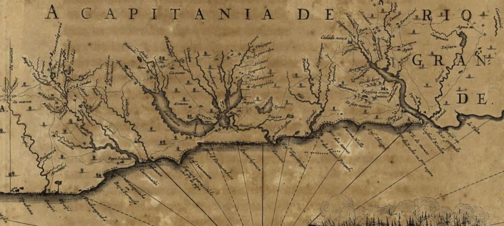
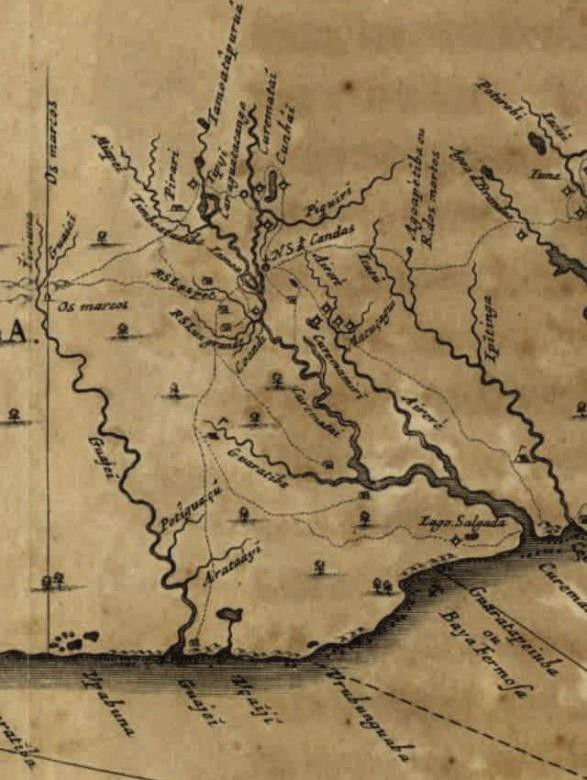
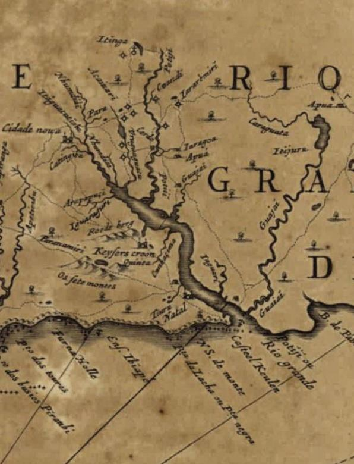

# Resumo

O açúcar foi um dos primeiros produtos econômicos do Brasil e a sua
produção, através dos antigos engenhos, foi responsável pela ocupação de
boa parte da costa do que hoje definimos territorialmente como Nordeste
brasileiro, região onde, ainda hoje, o cultivo da cana e a produção de
açúcar possuem relevância econômica. E no Rio Grande do Norte não foi
diferente. O surgimento da agroindústria do açúcar no seu território
remete ao início do processo de colonização da então Capitania do Rio
Grande, com a implantação do primeiro engenho, o Cunhaú, no princípio do
século

XVII\. Entretanto, o desenvolvimento da produção de açucareira potiguar
se deu de forma tardia em comparação com o de outras capitanias do
norte, como Paraíba e Pernambuco. Apesar do desejo da coroa portuguesa
de expandir a lavoura canavieira, em 1627, passados trinta anos da
conquista efetiva da Capitania, as terras do Rio Grande contavam com
apenas dois engenhos. Uma série de fatores, como a falta de capital dos
colonos, as condições de solo não tão propícias ao desenvolvimento da
lavoura de cana-de-açúcar, a precariedade do sistema de transportes e a
subordinação à Pernambuco, resultaram em desenvolvimento tardio da
agroindústria do açúcar potiguar, que desde o início se inseriu de forma
periférica no contexto nacional, assim como a própria economia
norte-riograndense em geral. Entretanto, mesmo em pequeno número, os
primeiros engenhos tiveram um papel importante no processo de
apropriação, ocupação e estruturação da incipiente Capitania do Rio
Grande, como veremos ao longo deste artigo.

Palavras-chave: engenho de açúcar, estruturação do território, litoral
oriental, Rio Grande do Norte

# Abstract

Sugar was one of the first economic products of Brazil and its
production, through the old mills, was responsible for the occupation of
most of the coast which is territorially defined, today, as the
Brazilian Northeast - a region to which cultivation of cane and
production of sugar still have economic relevance. And Rio Grande do
Norte was no different. The emergence of its territory's sugar
agroindustry refers to the early process of colonization of the
Captaincy of Rio Grande, as it was called at the time, with the
implementation of the first sugar mill - the Cunhaú, in the early
seventeenth century. However, the development of sugar production in Rio
Grande do Norte occurred belatedly in comparison with other northern
captaincies, as Paraíba and Pernambuco. Despite the Portuguese Crown's
desire to expand sugarcane cultivation, in 1627, after more than thirty
years of the effective conquest of the captaincy, the lands of the Rio
Grande relied on only two sugar mills. A number of factors, such as lack
of capital of the colonists, unfavorable soil conditions to the
development of the crop of sugar cane, the precariousness of the
transport system and the subordination to Pernambuco resulted in delayed
development of the Rio Grande do Norte's sugar agroindustry, which from
the beginning was inserted peripherally in the national context, as well
as the economy of Rio Grande do Norte in general. However, even in

small quantity, the first sugar mills played an important role in the
process of ownership, occupation and structuring of the incipient
Captaincy of Rio Grande, as we shall see throughout this paper.

Keywords: sugar mills, territory structuring, eastern seacoast, Rio
Grande do Norte

# O açúcar e a conquista da Capitania do Rio Grande

Em muitas capitanias onde a ocupação não se deu de forma efetiva, como a
do Rio Grande e a da Paraíba, outras nações europeias -- no caso das
capitanias do norte, principalmente os franceses -- frequentaram o
litoral e estabeleceram relações amistosas com os indígenas,
possibilitando a exploração de pau-brasil (ou pau de tinta, como era
chamado na época) e a instalação de pequenos portos ao longo da costa,
pondo em xeque a posse da terra pela coroa portuguesa.

Diante dessas ameaças, foram organizadas expedições militares que
resultaram na conquista da Paraíba e na fundação da cidade de Nossa
Senhora das Neves -- atual cidade de João Pessoa -- em 1585. Entretanto,
a conquista desse novo território não livrou os portugueses da ameaça
dos franceses e dos índios Potiguaras1. Com a conquista da Paraíba, os
franceses se deslocaram para o Rio Grande, onde a aliança com os
Potiguaras permitiu que eles continuassem com o comércio de pau tinta.
Além disso, os Potiguaras do Rio Grande frequentemente assaltavam as
roças e os arrabaldes da cidade paraibana. Assim, com a conquista da
Paraíba, a Capitania do Rio Grande passou a ser o foco dos conflitos
entre portugueses, franceses e

Potiguaras2.

No final do século XVI, D. Francisco de Souza, Governador Geral do
Brasil, mandou organizar uma expedição militar de conquista do Rio
Grande, comandada pelo capitão-mor de Pernambuco, Manuel Mascarenhas
Homem, e pelo capitão-mor da Paraíba, Feliciano Coelho. Essa expedição
foi composta por duas frentes: uma esquadra por mar e companhias de
infantaria e cavalaria por terra, sendo esta última, comandada pelos
irmãos Jorge e Jerônimo de Albuquerque. Militares, colonos, padres
jesuítas e franciscanos e indígenas de Pernambuco e da Paraíba formaram
um verdadeiro exército que em 1597 chegou à foz do Rio Potengi ou Rio
Grande, iniciando o processo de conquista da Capitania, o qual se
estenderia por, pelo menos, mais um século, diante dos obstáculos que
ainda surgiriam. Como forma de consolidar a posse do território, teve
início a construção do Forte dos Reis Magos em 1597, a fundação da
cidade do Natal em 1599 e um acordo de paz entre os portugueses e os
Potiguaras foi celebrado na Capitania da Paraíba em 11 de junho de

em 15993.

> 1Os índios do litoral se autodenominavam Tupi e referiam-se aos do
> sertão como Tapuias. Tanto os Tupis quanto os Tapuias eram formados
> por diversas nações ou tribos com diferenças culturais entre si. Os
> Potiguaras pertenciam ao tronco Tupi e ocupavam o litoral de parte dos
> atuais estados do Ceará, Rio Grande do Norte e Paraíba. Segundo Olavo
> de Medeiros Filho, os Tapuias eram organizados em duas nações
> principais, os Cariris e os Tarairiús, as quais estavam subdivididas
> em tribos ou famílias. Os Cariris, por exemplo, eram formados por
> tribos como os Curemas e Caicós, Tarairiús englobavam os Paiacus, os
> Jenipapos, os Canindés, os Pegas e os Panatis, entre outros (MEDEIROS
> FILHO, 1984; MONTEIRO, 2011).
>
> 2CASCUDO, 1984; MONTEIRO, 2011.
>
> 3SALVADOR, 1982\[1627\]; CASCUDO, 1984.

Além de consolidar a posse da terra, a conquista do Rio Grande garantiu
a expansão da linha de fronteira -- contribuindo para a defesa dos
engenhos pernambucanos e paraibanos -- e serviu de ponta de lança para a
conquista de outras terras ao norte, como as do Ceará e do Maranhão.
Nesse contexto, durante o século XVI, as capitanias do norte, mais
especificamente Pernambuco, Itamaracá, Paraíba e Rio Grande, formavam um
espaço colonial único, organizado em função dos interesses da coroa
portuguesa e daqueles que controlavam a produção açucareira, tendo em
Olinda

a sede dos capitais necessários para o seu desenvolvimento4.

# Os engenhos e a configuração do território da Capitania do Rio Grande durante a ocupação holandesa

Apesar da conquista da Capitania, esta permanecia em um estado de
beligerância permanente, pois as terras do Rio Grande continuariam sendo
objeto de disputas entre nações europeias.

O financiamento da instalação dos engenhos de açúcar no Brasil e o
comércio desse produto na Europa eram realizados pela Holanda. Apesar de
ser uma das grandes potências comerciais do mundo, politicamente, a
Holanda era uma possessão espanhola. Com as lutas pela independência, a
coroa espanhola -- que passou a governar também as colônias portuguesas
apósa União das Coroas Ibéricas a partir de

1580 -- proibiu a burguesia holandesa de continuar tendo acesso aos
produtos dessas colônias ibéricas, particularmente do Brasil5.

Visando restabelecer a sua posição no comércio através da conquista de
áreas produtoras de açúcar, foi fundada na Holanda, em 1621, a Companhia
das Índias Ocidentais. A primeira investida dessa Companhia no Brasil
aconteceu em 1624 na Bahia porém, sem sucesso. Apesar dessa primeira
derrota, a Companhia não desistiu e em 1630, iniciou com sucesso a
conquista de uma das principais capitanias do Brasil e a maior produtora
de açúcar então existente no mundo: Pernambuco, que passou a ser sede do
governo holandês no Brasil. A partir daí, o domínio holandês ocuparia
uma longa faixa da costa brasileira, se estendendo da Capitania de
Sergipe Del Rei à do

Rio Grande6, conquistada efetivamente pelos flamengos em 1633, dominando
uma importante região produtora de açúcar por mais de vinte anos7.

Durante a ocupação holandesa, foram produzidos documentos importantes
que nos ajudam a reconstituir a configuração do território da insipiente
Capitania do Rio Grande nesse período.

> Antes mesmo da conquista do Rio Grande, os flamengos já haviam feito
> registros sobre essas terras. Em 20 de maio de 1630, o espião holandês
> AdriaenVerdonck, escreveu a *Memória oferecida ao Senhor Presidente e
> mais Senhores do Conselho desta cidade de Pernambuco, sobre a
> situação, lugares, aldeias e comércio da mesma cidade, bem como de
> Itamaracá, Paraíba e Rio Grande*, na qual foram compiladas informações
> importantes sobre o território ocupado pelos holandeses.

O espião holandês inicia a descrição do Rio Grande pelo Engenho Cunhaú:

> Três milhas acima de Camaratuba existe ainda um engenho, no lugar
> chamado Cunhaú, o
>
> 4GONÇALVES, 2007.
>
> 5MONTEIRO, 2011.
>
> 6Essa foi a área de mais forte presença holandesa no Brasil.
> Entretanto, os flamengos também estiveram presentes em outras
> capitanias, como Sergipe e Ceará.
>
> 7 MELLO, 1981.
>
> qual faz anualmente de 6 a 7.000 arrobas de açúcar; este lugar está
> sob jurisdição do Rio Grande e ali moram bem 60 ou 70 homens com suas
> famílias; meia milha distante deste engenho corre um rio, de três
> milhas de longo e meia de largo, onde as barcas iam carregar açúcar,
> de 100 a 110 caixas cada barca, e traziam dali também comestíveis; há
> ali também muito gado, farinha e milho que ordinariamente é trazido
> para Pernambuco com o açúcar. (VERDONCK, 1630 apud MELLO, 1981, p.
> 45).

Em seguida, AdriaenVerdonck descreve a cidade do Rio Grande, ou cidade
do Natal, as chamadas aldeias de brasilienses, o Forte dos Três Reis
Magos, o Rio Grande (Potengi) e as salinas do litoral setentrional.

Estes relatos nos ajudam a reconstituir o território ocupado pela então
coroa luso- espanhola no Rio Grande antes da ocupação holandesa.
Passados pouco mais de 30 anos após a conquista do Rio Grande por Duarte
Coelho e Mascarenhas Homem, a área colonizada se restringia ao litoral
oriental, principalmente a porção ao sul de Natal, por onde passava a
estrada que ligava a capital Natal às Capitanias da Paraíba e de
Pernambuco, com as quais o Rio Grande mantinha relações econômicas,
políticas e sociais estreitas. Os principais núcleos populacionais eram
Cunhaú, um pequeno povoado localizado no entorno do engenho homônimo,
onde viviam entre 60 e 70 homens com suas famílias e a modesta cidade do
Natal, que apesar do título de cidade, contava com apenas 35 a 40 casas
de palha e barro. Em toda a jurisdição de Natal, a população não
ultrapassava o número de 130 homens, onde a maioria era de miseráveis.
Os mais abastados viviam em sítios nos arredores da cidade. Além desses
aglomerados populacionais, destacam-se as aldeias de índios, ou aldeias
brasilienses como se refere AdriaenVerdonck, totalizando 5 ou 6, com
destaque para a aldeia de Mopobú (ou Mipibu). Quanto à economia, a
produção de açúcar se dava através do engenho Cunhaú, com uma produção
anual considerável de 6 a 7 mil arrobas de açúcar, e de dois engenhos de
pequena produção na jurisdição de Natal. Também é relevante a produção
de milho e de farinha, que eram produzidos tanto em Cunhaú quanto em
Natal e comercializados nas praças pernambucanas. Contudo, o principal
produto da Capitania era o gado criado nas pastagens do litoral oriental
e também comercializado em Pernambuco. Outro produto importante era o
sal. Apesar do litoral setentrional não ter sido efetivamente colonizado
nesse período, suas salinas já eram conhecidas e intensamente
frequentadas. O pau-brasil é citado como um produto antes abundante, mas
que já começava a se tornar escasso.

Outro importante documento sobre a configuração do território do Rio
Grande no início do século XVII produzido no período da ocupação
holandesa foi o mapa elaborado por Georg Marcgraf intitulado
*Praefecturae de Paraíba, et Rio Grande*8(figura 01), que representa a
área de ocupação das Capitanias da Paraíba e do Rio Grande.

> 8Esse mapa faz parte do livro do historiador Gaspar Barleus de 1647,
> intitulado *Rerum per octennium in Brasilia*, ou *História dos feitos
> recentemente praticados durante oito anos no Brasil*, ilustrado com
> gravuras de Frans Post e mapas de George Marcgraf.
>
> 
>
> Figura 1. Trecho do mapa intitulado *Praefecturae de Paraiba, et Rio
> Grande* do holandês Georg Marcgraf, com destaque para o território da
> Capitania do Rio Grande. Fonte: Biblioteca Nacional de Portugal, 2013

Esse trecho do mapa de Marcgraf confirma a insipiente ocupação do
território do Rio Grande já descrita por AdriaenVerdonck, restrita à
faixa do litoral oriental do Rio Grande ao sul de Natal e a um pequeno
trecho ao norte dessa cidade, concentrada principalmente nas várzeas dos
rios, como o Potengi, o Jundiaí, o Trairí, o Jacú e o Cunhaú, e nas
margens das lagoas de Extremoz, Papari e Guaraíras, onde estavam
localizadas boa parte das terras doadas em sesmarias.

Nesse contexto, após 35 anos de conquista da Capitania pelos
portugueses, a ocupação do Rio Grande continuava bastante rarefeita,
contando poucos e esparsos núcleos populacionais e terras doadas em
sesmarias com poucas ou nenhumas benfeitorias.

Entretanto, apesar da ocupação e do desenvolvimento insipientes da
Capitania, já existia um rudimentar sistema de estradas que atravessavam
o litoral oriental, comunicando os principais povoados, aldeamentos,
currais de gado e engenhos de açúcar da região, bem como ligando o Rio
Grande às capitanias mais próximas, como a Paraíba e, principalmente a
Pernambuco. Nesta Capitania, uma das principais praças do norte, se dava
a comercialização do açúcar e de produtos do Rio Grande voltados para o
mercado interno (gado, farinha e milho) e o abastecimento dos colonos
rio- grandenses com mercadorias vindas da Metrópole. Esse transporte de
mercadorias também se dava através da navegação fluvial e marítima, onde
rios como o Cunhaú e o Potengi, assim como as barras e enseadas naturais
ao longo da costa, foram amplamente utilizados desde os primórdios da
colonização.

As figuras 02 e 03 apresentam trechos ampliados do mapa de Marcgraf,
onde observamos um conjunto de estradas irradiando a partir de dois
núcleos: Cunhaú e Natal. Do engenho Cunhaú (identificado pelo nome de
sua capela de Nossa Senhora das Candeias) seguia uma estrada para o
norte em direção à capital Natal, passando por aldeamentos e currais de
gado ao longo do caminho; outra para o sul, seguindo para a Paraíba e
para Pernambuco; duas estradas menores, uma comunicando o engenho ao rio
Curimataú/Cunhaú -- onde deveria existir um pequeno porto no qual as
barcaças iam carregar açúcar e outros produtos a serem comercializados
nas praças pernambucanas e paraibanas, como descreve o espião holandês
AdriaenVerdonck -- e outra saindo de Cunhaú e passando por currais de
gado próximos ao engenho; e duas estradas partindo de Cunhaú em direção
às fozes de rios próximos como o Curimataú/Cunhaú no Rio Grande e o
Guajú, atualmente localizado na Paraíba. Dessa

forma,
o engenho Cunhaú se configurava como um nó na insipiente rede de vias de
comunicação que estava sendo germinada.

> Figuras 2 e 3. Trecho do mapa intitulado *Praefecturaede Paraiba, et
> Rio Grande* do holandês Georg Marcgraf, com destaque para o engenho
> Cunhaú à esquerda e para a cidade do Natal à direita. Fonte:
> Biblioteca Nacional de Portugal, 2013.

Natal também se configurava como um nó nessa rede. Da capital partiam
quatro estradas: a primeira seguia para o sul em direção a Paraíba e
Pernambuco, passando pelos chamados sete montes, por Parnamirim, pelos
rios Cajupiranga e Pitimbú, e pelos vales do Capió e Cunhaú; a segunda
margeava o litoral até a foz do rio Pirangi; a terceira acompanhava as
margens do rio Potengi; a quarta comunicava a cidade com a foz deste
rio.

# A agroindústria do açúcar potiguar e o processo de apropriação, ocupação e estruturação do território

A agroindústria do açúcar influenciou direta e indiretamente a
apropriação, ocupação e estruturação do território do Rio Grande do
Norte, principalmenteda região do litoral oriental.

Apesar do território norte-riograndense ter sido frequentado pelos
portugueses desde os primórdios da colonização, sua apropriação só se
deu de forma efetiva anos depois com a organização de uma expedição de
conquista da Capitania no final do século XVI, que além de consolidar a
posse das terras conquistadas, também teve como objetivo expandir a
linha de fronteira para a defesa dos engenhos pernambucanos e paraibanos
e, em última instância, expandir a própria lavoura de cana.

A exploração econômica das terras doadas em sesmarias através da
plantação de cana e da produção de açúcar fazia parte do projeto de
colonização da coroa portuguesa no Brasil, onde o açúcar se destacava
como principal produto econômico da Colônia. Assim, desde o início da
colonização, a Metrópole buscou estimular o desenvolvimento da
agroindústria do açúcar em terras potiguares, culminando na implantação
do primeiro engenho pouco após a conquista dessa Capitania. Entretanto,

uma série de fatores, como a falta de capital dos colonos, e as
condições de solo não tão propícias ao desenvolvimento da lavoura de
cana-de-açúcar se comparada com capitanias como Pernambuco e Paraíba, a
precariedade do sistema de transportes e a subordinação à Pernambuco,
resultaram em um desenvolvimento tardio da agroindústria do açúcar
potiguar9, que desde o início se inseriu de forma periférica no

contexto nacional, assim como a própria economia norte-riograndense em
geral.

Entretanto, apesar de existir praticamente apenas um engenho na
Capitania no Rio Grande no início do século XVII10, o Cunhaú, este teve
um papel importante no processo de ocupação do território potiguar,
principalmente da região do litoral oriental. Primeiramente, é
importante destacar o estado insipiente e precário da Capitania do Rio
Grande como um todo nesse período, onde a própria Natal não fazia jus a
seu *status* nem de cidade, nem de capital, contando com um número
ínfimo de rústicas casas de barro e palha e ruas precárias, e o grande
número de sesmarias abandonadas e sem benfeitorias evidenciava a falta
de capital dos colonos do Rio

Grande e a situação periférica da Capitania no contexto da nascente
economia brasileira. Nesse contexto de escassez, o engenho Cunhaú se
configurava como o principal centro econômico da insipiente Capitania,
produzindo e transportando açúcar, milho e farinha para Pernambuco, e um
dos principais núcleos populacionais do Rio Grande, contando com uma
população de 60 a 70 famílias no seu entorno. Dessa forma, a produção de
açúcar contribuía para o desenvolvimento de atividades subsidiárias a
esta, bem como para a fixação da população e povoamento do entorno dos
engenhos, como aponta Vera Lúcia Ferlini:

> Em torno dos engenhos proliferaram os partidos de cana, fixando os
> lavradores e sua escravaria. Outras atividades eram impulsionadas a
> partir da produção de açúcar: tabaco para escambo de negros, pecuária
> para o provimento de tração e alimento, olarias produtoras de telhas,
> de formas, lenha para as fornalhas e madeira para as construções. O
> mundo colonial nordestino teve por eixo os engenhos, verdadeiras
> agências da colonização, \[\...\], que condensavam a população,
> articulando, à moda de cidade, funções econômicas, militares,
> religiosas e administrativas. (FERLINI, 2003, p. 136).

Nesse sentido,o engenho Cunhaú serviu como instrumento do processo de
colonização, contribuindo para a ocupação e exploração das terras
conquistadas, funcionando como ponto de apoio para a organização
econômica, política e social do Brasil.

Além de contribuir para o processo de apropriação e ocupação do
território da Capitania do Rio Grande, a agroindústria do açúcar também
influenciou a sua estruturação. A embrionária rede de produção,
transporte e comercialização do açúcar situada no litoral oriental da
Capitania do Rio Grande corrobora para esse entendimento.

Todo tipo de fluxo, seja ele de mercadorias, de pessoas, de informações
ou de capitais, pressupõe a existência de uma rede, que tem a conexão
como a sua principal

> 9 A agroindústria do açúcar no Rio Grande do Norte só irá alcançar um
> desenvolvimento mais expressivo a partir de meados do século XIX,
> quando uma conjuntura favorável resultou em um rápido aumento do
> número de engenhos e da produção de açúcar, que passou a disputar com
> o algodão o primeiro lugar na pauta de exportação potiguar.
>
> 10 Os relatos holandeses apontam a existência entre 2 e 3 engenhos na
> Capitania do Rio Grande.
>
> Entretanto, após a conquista desta capitania pelos flamengos, apenas o
> engenho Cunhaú se manteve em atividade.

propriedade. As redes são formadas por fluxos, que circulam entre
elementos fixos através de suas articulações11.

No caso da rede de produção, transporte e comercialização do
açúcar,localizada no litoral oriental do Rio Grandedo Norte, podemos
identificar os pontos fixos como os engenhos, os portos/praças
comerciais e os núcleos urbanos12, onde cada um desses elementos possui
uma função específica de produção, distribuição/comercialização e
consumo, respectivamente, os fluxos são demercadorias (o açúcar), mas
também de pessoas (mão de obra) e de comandos/ordens e informações, e as
articulações são

representadas pelas vias de transporte ecomunicação, como rios e
estradas.

Essa "rede do açúcar" começou a tomar forma com a implantação do
primeiro engenho da Capitania, o Cunhaú, ainda no início do século XVII.
Desde o início das suas atividades, a produção de açúcar do engenho
Cunhaú se deu em larga escala e voltada para o comércio externo,
atendendo, assim, à lógica do projeto colonizador português13.
Entretanto, não existia um comércio direto do Rio Grande com Portugal,

pois esta Capitania estava subordinada à de Pernambuco, e, por isso, não
possuía uma alfândega própria. Dessa forma, o açúcar produzido em Cunhaú
tinha que ser transportado para Pernambuco, e de lá seguia para
Portugal. Nesse contexto, a necessidade de transporte de mercadorias foi
um dos fatores determinantes para a abertura das primeiras estradas do
Rio Grande, com destaque para aquela que partia da capital Natal em
direção a Recife, atravessando a porção sul do litoral oriental do Rio
Grande, comunicando este a Paraíba e Pernambuco. Os rios também tinham
um papel importante no escoamento da produção. O açúcar era transportado
em barcaças pelos rios da região, como o Cunhaú, seguindo em direção a
Recife pela costa do Atlântico. Esse transporte de mercadorias estimulou
a instalação de pequenos portos nos rios próximos aos centros
produtores. Assim, com o início da produção e comercialização do açúcar
surgem, ainda que de forma precária e bastante rudimentar, as primeiras
estradas e portos da região.

Nesse contexto, o fluxo de mercadorias (açúcar) contribuiu para a
formação de uma rede, onde fluxos, fixos e articulações estabeleceram
uma relação de interdependência e de retroalimentação. Assim, o açúcar
produzido nos engenhos precisava ser transportado para as praças
comerciais, contribuindo para a abertura de estradas e para a instalação
de pequenos portos nos rios da região. E a proximidade de estradas e
portos estimulava a instalação de novos engenhos e o desenvolvimento dos
existentes. A produção de açúcar também demandava mão de obra, gerando
um fluxo de pessoas entre os povoados/aldeamentos e os engenhos da
região, bem como a sua comercialização também gerava dividendos para as
praças onde o mesmo era comercializado.

# Considerações Finais

Mesmo que modesta, a agroindústria do açúcar teve um papel importante no
processo

> 11DIAS (1995).
>
> 12 Essas categorias não são estanques. Em geral, os principais núcleos
> urbanos contavam com uma área comercial e portuária, que atendia o
> comércio local de mercadorias e também a exportação de
>
> produtos através dos portos, funcionando ao mesmo tempo como centros
> de distribuição, de comercialização e de consumo de mercadorias.
>
> 13Parte da produção, principalmente de outros produtos derivados da
> cana-de-açúcar, como a
>
> rapadura, o mel de engenho e a aguardente, também era consumida no
> próprio Rio Grande e nas capitanias vizinhas, como Paraíba e
> Pernambuco.

de apropriação, ocupação e estruturação do território do Rio Grande do
Norte, com destaque para o litoral oriental, região que, devido às
condições ambientais propícias concentrou (e ainda concentra) a área de
cultivo de cana-de-açúcar no território potiguar.

O açúcar foi um dos fatores motivadores da apropriação da Capitania do
Rio Grande. Além de garantir a posse das terras, a conquista efetiva da
Capitania também visava garantir a defesa dos engenhos já instalados em
Pernambuco e na Paraíba e expandir a lavoura de cana para as terras
potiguares, atendendo assim aos interesses econômicos da Metrópole de
exploração econômica das terras da Colônia. Nesse sentido, logo após a
sua conquista, foram instalados os primeiros engenhos, dando origem à
agroindústria do açúcar no Rio Grande. Mesmo em pequeno número, esses
engenhos de açúcar tiveram um papel importante no processo de ocupação
da Capitania. A produção de açúcar estimulava o desenvolvimento de
outras atividades subsidiárias e a fixação da população nas terras do
engenho e no seu entorno imediato, contribuindo assim para a ocupação do
território da insipiente Capitania do Rio Grande. Sua estruturação
também foi marcada pela agroindústria açucareira. Os fluxos gerados pela
produção de açúcar, com destaque para o de mercadorias, mas também de
pessoas (mão de obra) e de comandos, deu forma a uma embrionária rede de
produção, transporte e comercialização de açúcar, que contribuiu para o
surgimento das estradas e portos da região, para o fortalecimento dos
engenhos e também das nascentes aglomerações urbanas, em um processo
contínuo de retroalimentação.

Com o aumento da produção ao longo dos séculos, essa rede irá se
expandir e se tornar mais complexa, estabelecendo novas conexões e
eliminando outras, em um processo contínuo e dialético de
reconfiguração. As inovações tecnológicas, especialmente dos meios de
transporte, terão um papel crucial nesse processo. As chamadas redes
técnicas, representadas pelas ferrovias, rodovias, telegrafia,
telefonia, entre outras, foram implantadas em um território que já
contava com um rudimentar sistema de estradas e portos, influenciando e
sendo influenciado por essas inovações tecnológicas. Não foi por acaso
que a primeira ferrovia do Rio Grande do Norte, a Estrada de Ferro
Natal-Nova Cruz, atravessou justamente a área de mais antiga ocupação do
estado, a porção sul do litoral oriental, com um traçado muito próximo
da primitiva estrada que cortava essa região em direção a Recife. A
implantação dessa estrada de ferro tinha como objetivo facilitar e
racionalizar o escoamento da produção de açúcar da região para o porto
de Natal. Assim, mais uma vez, a estratégia de circulação de mercadorias
foi determinante para a implantação da infraestrutura de transportes no
litoral oriental.

Nesse contexto, a embrionária rede de produção, transporte e
comercialização do açúcar instalada no litoral oriental do Rio Grande do
Norte atraiu investimentos em infraestrutura e fortaleceu os engenhos e
as aglomerações urbanas envolvidas nessa atividade econômica,
integrando-os e solidarizando-os. Entretanto, o desenvolvimento dessa
rede também produziu uma seletividade territorial, pois ao integrar
certos territórios, ela também excluiu outros. Assim, ao seguir o peso
das atividades econômicas preexistentes, muitas vezes a rede do açúcar
contribuiu para o

fortalecimento dos elementos que já integravam essa rede14, resultando
em uma concentração de investimentos, capitais e infraestrutura no
litoral oriental do Rio

> 14 DIAS (1995).

Grande do Norte15.

# Referências bibliográficas

> BIBLIOTECA NACIONAL DE PORTUGAL. *Praefecturae de Paraiba, et Rio
> Grande.* Disponíve[l em: \<
> http://purl.pt/4067/3/](http://purl.pt/4067/3/)\>. Acesso em: 15 fev.
> 2014.
>
> CASCUDO, Câmara. *História do Rio Grande do Norte*. 2. ed. Natal: FJA,
> 1984.

DIAS, Leila Christina. Redes: emergência e organização. In: CASTRO, Iná
Elias de; GOMES, Paulo Cesar da Costa; CORRÊA, Roberto Lobato (orgs.).
*Geografia:* conceitos e temas. Rio de Janeiro: Bertrand Brasil, 1995.

> FERLINI, Vera Lúcia. *Terra, trabalho e poder:* o mundo dos engenhos
> no Nordeste colonial. Bauru: EDUSC, 2003.

GONÇALVES, Regina Célia. *Guerras e açúcares:* política e economia na
Capitania da Parayba, 1585-1630. Bauru: EDUSC, 2007.

> MEDEIROS FILHO, Olavo de. *Índios do Açu e Seridó.* Brasília: Gráfica
> do Senado Federal, 1984.
>
> MELLO, José Antonio Gonsalves de (ed). *Fontes para a história do
> Brasil Holandês.*

A economia açucareira. vol 1. Recife: Parque Histórico Nacional dos
Guarapes, 1981.

> MONTEIRO, Denise Mattos. *Introdução à história do Rio Grande do
> Norte.* 3. ed. Natal, RN: EDUFRN, 2007.
>
> SALVADOR, Frei Vicente do. *História do Brasil, 1500-1627.* 7. ed.
> Belo Horizonte: Itatiaia; São Paulo: EDUSP, 1982.
>
> 15 As próximas pesquisas irão aprofundar as discussões acerca das
> transformações na rede de produção, transporte e comercialização do
> açúcar e suas implicações na organização do território do Rio Grande
> do Norte.
