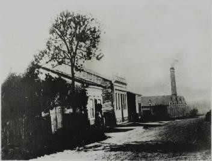
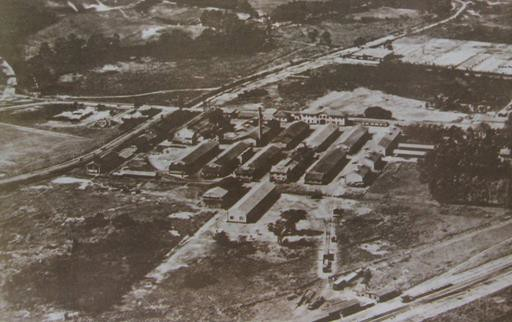
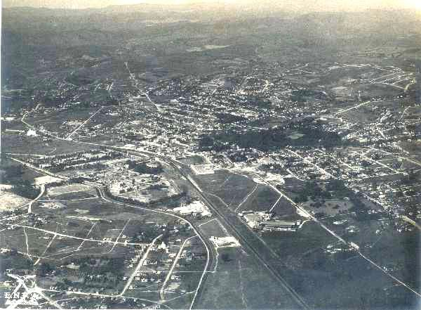
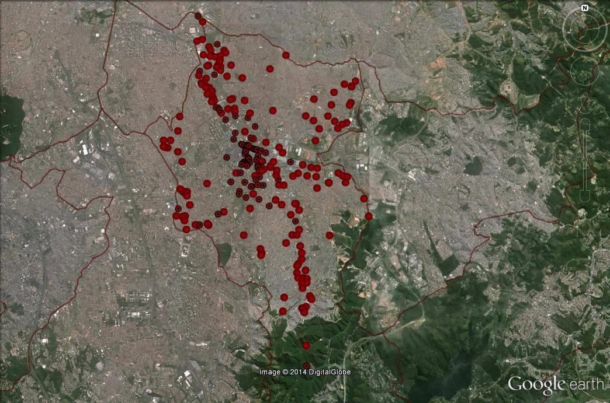

# Resumo

Este artigo versa sobre as transformações da paisagem da área central de
Santo André, São Paulo, a partir da transformação da indústria no último
século. Cidade que nasceu a partir da implantação da ferrovia e da
indústria, ao longo do tempo vivenciou momentos diferenciados da
industrialização paulista que conformou o desenho urbano e as relações
de seus habitantes com o território. Diante das transformações que a
indústria passou ao longo do século, o artigo propõe o desenvolvimento
de estudos que evidencie a memória da indústria na paisagem bem como um
inventário de patrimônio industrial de modo a garantir a preservação da
memória do desenvolvimento local e regional.

Palavras-chave: patrimônio industrial, paisagem, mutações, cidade

# Abstract

This paper deals with the transformation of the landscape of the central
area of Santo André, São Paulo, from the transformation of the industry
in the last century. City that was born from the deployment of the
railroad and industry , over time experienced different stages of
industrialization that conformed urban design and the relationships of
its inhabitants with the territory. Given the changes that the industry
has gone over the century, the article proposes the development of
studies about the memory industry in the landscape as well as an
inventory of industrial heritage to ensure the preservation of the local
and regional development memory.

Keywords: industrial heritage, landscape, mutations city

# Introdução

Nestor Goulart Reis Filho (2006) afirma que a dispersão da indústria é a
primeira forma de dispersão urbana que ocorre. Já na segunda metade do
século XIX inicia o processo de dispersão, com a instalação de
indústrias ao longo dos eixos ferroviários. Em verdade, a cidade de São
Paulo caracterizou-se, no século XIX, como polo de atração de
empreendimentos industriais, primeiramente com pequenas fábricas, muitas
delas de cunho familiar, que, com a melhor fluidez dos meios de
transporte e, com isso, a possibilidade de se importar tecnologias,
bens, maquinários etc. a cidade viu surgir conglomerados que ocuparam
vastas áreas e transformaram a paisagem paulistana.

A instalação do governo republicano, a inserção da economia cafeeira no
mercado mundial e o surgimento de um mercado consumidor de produtos
industrializados, modificam-se as relações políticas inter-regionais.
Várias regiões do estado de São Paulo tornam-se locais de intensa
atividade estratégica para a consolidação do estado, entre elas a região
do ABC, então configurada em um único município denominado São Bernardo.

Para Martins (2011) o século XX em São Paulo se inicia na segunda metade
do século XIX, momento em que se dá a entrada do Brasil na modernidade.

> Na verdade, por aqui, o século XX começou antes do tempo, com algumas
> grandes transformações ao longo da segunda metade do século XIX, cujas
> características e cujos efeitos se desdobrariam até os anos 1950.
> /\.../ as últimas décadas do século XIX (são) vividas pelos paulistas
> e habitantes de São Paulo como o tempo de frenética mudança em todos
> os campos da vida, a população amplamente dominada pela ideia do
> futuro, do progresso e da mudança. (MARTINS, 2011, p.3)

José Leonardo do Nascimento (2011) se utiliza de referências literárias
a partir de publicações de Julio Ribeiro (A Carne, 1888), Horácio de
Carvalho (O Crono: estudo de temperamentos, 1888), relatos de viajantes,
entre outros, para descrever as intensas transformações da cidade de São
Paulo na segunda metade do século XIX a partir da implementação das
estradas de ferro e os primeiros ensaios da industrialização em São
Paulo.

> A diversificação econômica, o aparecimento de fábricas, a concentração
> de uma massa de imigrantes e a convergência de linhas de transporte
> ferroviário em São Paulo modificaram as feições urbanísticas da
> cidade. (NASCIMENTO, 2011, p.84)

A fábrica, antes em total convivência com outras atividades urbanas, é a
primeira a romper fronteiras da cidade para buscar terrenos maiores e
mais distantes, apartados dos demais usos da cidade, porém junto aos
grandes eixos de circulação. Na formação da metrópole paulistana isso se
mostra de forma bastante clara a partir da implantação das ferrovias na
segunda metade do século XIX, quando historiadores como Ernani da Silva
Bruno (1991) e Richard Morse (1970) destacam o momento como a segunda
fundação da cidade, quando ela se torna a Metrópole do Café.

As primeiras indústrias da cidade vão se instalar junto da linha férrea,
Barra Funda, Água Branca, Brás, Mooca e Ipiranga, formando o parque
industrial paulistano nos últimos anos do século XIX que vai se ampliar
para os arredores paulistanos.

É esta a gênese da formação de várias cidades dos arredores paulistanos
servidas pelas linhas férreas desde a segunda metade do século XIX.
Richard Langenbuch (1971), ao estudar a formação da Região Metropolitana
de São Paulo indica a formação dos "povoados-estação", núcleos urbanos
que se formam ao redor das primeiras estações ferroviárias e assumiram
função de abastecimento e trocas intrarregionais e abrigaram as
primeiras indústrias de beneficiamento e transformação da extração
vegetal e mineral dos arredores e fábricas têxteis.

Essa é a origem do aglomerado urbano que se forma ao redor da estação
São Bernardo da Estrada de Ferro de São Paulo (São Paulo Railway, depois
Estrada de Ferro Santos a Jundiaí), atual estação Santo André.

Este artigo tem por objetivo compreender a trajetória das transformações
da paisagem ocorrida na área central de Santo André a partir das
mudanças da economia local ocorrida ao longo do século XX em Santo
André1, desde a formação do subúrbio industrial até a cidade atual, com
alta concentração de serviços especializados, indicando perspectivas
para pesquisa sobre a preservação da paisagem e do

> 1 Para mais informações a respeito ver KLEEB, 2013.

patrimônio industrial.

# Considerações sobre paisagens em cidades industriais.

Reflexões sobre cidades introduzem questões que perpassam a vida dos
cidadãos e nas quais estão inscritas formas de pensar o mundo. E, por
meio de expressões da interação do homem com o ambiente em seus diversos
formatos (edificações, arruamentos, fotografias, documentos escritos,
produções imateriais etc.) é possível construir uma história que permita
reconhecimento aos cidadãos.

Nesse contexto é significativo compreender os processos sociais que
levam à manutenção ou ao desaparecimento de elementos da paisagem seja
por sua representação sociocultural ou pela movimentação de interesses
dos diversos agentes que compõem o ambiente urbano. E essa ação se
organiza no tempo e no espaço, revelando transformações e manutenções de
artefatos e lembranças. Expõe também as disputas nas quais estão em jogo
o valor de uso do espaço e a mobilidade explicitada pela utilização e
controle deste no tempo.

O resultado é a transformação, em seu contorno dialético de permanência
e mutação, de uma paisagem socialmente construída, alterada, subtraída,
acrescida de referências. São rupturas e permanências que se refletem
por meio de bens e práticas etc. e que se metamorfoseiam no tempo. E
esta dinâmica sobre o território se organiza no plano particular da
história local e referencia um modo de viver e de se relacionar com o
espaço.

A partir destas informações é possível refletir sobre modificações e
impactos que se apresentam na vida dos cidadãos. Um exemplo associado a
alguns centros urbanos contemporâneos, e, especialmente importante para
as cidades do ABC paulista2, é a preponderância da vocação industrial,
estimulada desde final do século XIX para o predomínio de possibilidades
e estruturas urbanas que se organizaram por força de circunstâncias
macroeconômicas geralmente ligadas a interesses extra locais. O

distanciamento e disfunção frente a interesses do mundo capitalista e as
lacunas que se constituíram frente à desvalorização da memória
identificam algumas rupturas na paisagem e memória que marcaram essa
região e em especial Santo André.

Importante esclarecer de imediato que o município de Santo André tal
como ele é conhecido na atualidade se configurou a partir da década de
1950. Até então, de modo geral este compunha uma área muito maior, que
se conformava em todo o ABC paulista atual. As primeiras atividades
econômicas dessa região, no século XX, se localizaram nas imediações da
estação ferroviária, inaugurada em 1867 e ao longo dos de caminhos
coloniais. Parcelamentos se organizaram nas proximidades de fábricas,
atraídos pelo novo dinamismo econômico trazido pelas primeiras
indústrias com o intuito de garantir mão de obra próxima e a qualquer
tempo para a produção voltada especialmente para a tecelagem. Criou-se
nas proximidades da estação ferroviária um pequeno núcleo urbano,
embrião da cidade atual. Fora dos limites centrais havia fazendas e
sítios em que a quantidade de habitantes era pequena.

O mercado de trabalho era afeito a algumas atividades. Havia emprego nas
fábricas -- Tecelagem Silva Seabra & Cia, fabricante de brim de algodão
para sacaria (desde 1885), Fábrica de casimiras Bergman, Kowarick & Cia
(1889), Companhia Streiff de

> 2 ABC paulista composto pelas cidades de Santo André, São Bernardo do
> Campo, São Caetano do Sul, Diadema, Mauá, Ribeirão Pires e Rio Grande
> da Serra.

São Bernardo (1897), fábrica de cadeiras e pequenos móveis de uso
doméstico e de escritório. Essas eram as atividades industriais de maior
monta, mas havia pequenas fábricas familiares, geralmente associadas à
tecelagem ou ao beneficiamento da madeira ou da argila (na produção de
telhas e tijolos).

> 
>
> Figura 1. O caminho da estação São Bernardo, atual Rua Coronel
> Oliveira Lima c. 1899. A fábrica que se vê na imagem é a Cia Streiff
> de cadeiras e pequenos móveis. Coleção: Euclydes Rocco, acervo Museu
> de Santo André.

Todas as atividades exigiam pouca ou nenhuma qualificação e tanto homens
como mulheres eram empregados, assim como, em alguns casos, crianças que
desenvolviam pequenos trabalhos como empalhamento de cadeiras ou limpeza
entre máquinas de tecelagem.

Não havia regramento sobre quais as atividades poderiam ser
desempenhadas, muito pelo contrário, a Lei municipal nº 95 de setembro
de 1911 (e muitas outras que foram aprovadas posteriormente) demonstrava
interesse na atração de indústrias ao parque industrial que se pretendia
consolidar. Essa lei garantiu a isenção de impostos por seis anos para
indústrias que viessem a se instalar na cidade. Esta isenção de
praticamente todos os impostos estava direcionada para indústrias com
pelo menos 50 operários. O alvo era médios e grandes empreendimentos, e
não os pequenos negócios familiares, com poucos funcionários, que
existiam na cidade. O foco era a articulação entre a produção em larga
escala e o mercado consumidor para além da cidade, e que em São Paulo já
se mostrava custosa.

O ABC, segundo Relatório do Prefeito de 1920/21, possuía ao todo 121
estabelecimentos industriais e contava-se com uma população de 4.316
operários (FCMSB, Relatório de Prefeito, 1921, p. 28). E este número
apenas aumentava, pois terrenos planos e baratos ao longo da linha
férrea e fartura em recursos hídricos levaram a deslocamentos fabris
para o ABC. Destacavam-se os distritos de Santo André e São Caetano como
"centros industriais de primeira grandeza, pois possuíam fábricas de
tecidos, móveis, adubos, produtos químicos, louças, oficinas
metalúrgicas, além de fábricas 'menores'". (FCMSB: Relatório da Comissão
de Melhoramentos de

São Bernardo, 28/03/1928)

Os dados econômicos para essa década são imprecisos, haja vista as
dificuldades de documentação existente. A partir das informações
coligidas nos livros de Impostos e Profissões do Fundo Câmara Municipal
de São Bernardo, identifica-se que nas décadas de 1920 e 1930 pagaram
impostos no distrito de Santo André 190 empreendimentos industriais.
(FCMSB, Livros de Impostos e Profissões, 1920/1935)

No Censo de 1940 a transformação foi considerável; a população das áreas
urbana e suburbana, em dois distritos (Santo André e São Bernardo)
cresceu de forma muito intensa. Langenbuch (1971) identifica quais
seriam os motivos para que houvesse esse crescimento populacional. Diz
ele que o trinômio refletido pela ferrovia, terrenos planos e grandes
nas áreas lindeiras à ferrovia e o curso d'água, representado pelo Rio
Tamanduateí e seus afluentes, impulsionaram a instalação de unidades
industriais e que, por força do modelo adotado, importava em grande
número de trabalhadores.

> 
>
> Figura 2. Vista do complexo industrial da Rhodia Química em Santo
> André, c. 1925 (fonte: Diário do Grande ABC, publicada em 13/04/1999).

A década de 1940 também foi significativa na esfera econômica, pois se
encontrava a caminho uma nova conformação produtiva. Migrava-se de
tecelagens ou fábricas de produção em menor escala para os grandes
complexos industriais automobilísticos e de autopeças. Caracterizou-se
esse momento como marco divisor de águas, pois mostrou claramente qual a
nova perspectiva de desenvolvimento que se almejava. Estava em curso a
chegada de empresas multinacionais que mudariam o cenário e mesmo as
rotas de acesso intrarregional.

A ferrovia, paulatinamente deixava seu papel de destaque como meio de
transporte de cargas, para se efetivar a lógica de transporte
rodoviário, cujo exemplo claro foi a inauguração da Via Anchieta em
1947. Essa nova configuração efetivaria de forma lapidar a interação
dessa região com outros mercados consumidores. O ABC se configurou como
centro de produção de bens materiais, cujo mercado de consumo

encontrava-se fora de seu domínio de ação.

De acordo com o levantamento censitário apresentado no Relatório de
1948, a partir do Censo de 1940, existem informações interessantes sobre
as atividades econômicas e seu papel no âmbito do município. A principal
atividade de atração de empregos era a atividade industrial. O comércio
e serviços abrigavam poucos trabalhadores, o que denota a pouca
atividade comercial do município.

Em Relatório de Prefeito de 1954 encontra-se outra informação sobre a
movimentação econômica local: havia em Santo André 704 indústrias. Os
números apontam que em Santo André o emprego estava em franco
desenvolvimento. Havia, é certo, concentração de empregados em algumas
grandes empresas como é o caso, por exemplo, da Pirelli S.A. Cia, com
4.500 operários e a Rhodia Ceta e Rhodia Química com cerca de 2.500
operários cada uma. Essa condição indica a concentração em algumas áreas
de produção -- autopeças, borracha e química. Tal situação irá se
refletir negativamente no futuro quando essas indústrias diminuírem sua
atuação na cidade, com consequente diminuição de renda e emprego. Mas,
aquele era o momento de expansão, e em 1954 foi inaugurada a Refinaria
União, o que trouxe para a cidade e região outra especialidade: a
produção de derivados de petróleo e mais empregos.

A área de comércio e de serviços também se organizou de forma mais
consistente. Houve fortalecimento do comércio local e Santo André se
consolidou como centro regional de comércio. Vários magazines se
instalaram, localizados nas proximidades do antigo caminho da estação
(Rua Coronel Oliveira Lima), e com isso estes eram alcançados seja por
trem ou por ônibus (PASSARELLI, 1994, p. 64,65). As décadas de 1940/1950
foram decisivas para a cidade, com a instalação das indústrias
automobilísticas e de transformação na região do ABC, conformando um
parque industrial extremamente diversificado.

A década de1960 evidencia o papel preponderante da atividade industrial
na cidade. O IBGE apresenta o número de estabelecimentos industriais e
de pessoal ocupado. Indica que são 668 estabelecimentos industriais para
uma população ocupada de

50.137 pessoas. Em observância com os números de 1950, onde o IBGE
computou 34.734 pessoas. Houve, portanto, um incremento de cerca de 30%
de empregados no setor em dez anos. Observamos a ampliação do setor de
comércio na cidade e isso era notório entre os moradores da região que
vinham a Santo André para compras.

As atividades industriais contavam com maior número de estabelecimentos.
Dos seis grupos que mais empregavam mão de obra -- mecânica e material
elétrico, fiação e tecelagem, construção e mobiliário, alimentação,
transportes, e o químico e farmacêutico -- percentualmente representam
79,07% dos trabalhadores empregados. (TRIBUNA Popular Ilustrada, 1966,
p.71)

Evidencia-se o papel da cidade como meio de reprodução da força
produtiva. Era, de fato, um subúrbio, lugar inacabado, como espaço de
produção e reprodução incompleta da vida. (MARTINS, 1992) A riqueza se
reproduzia ali parcialmente. A produção e a exploração eram as condições
que tinham sua expressão nessa localidade.

A paisagem construída mostrava claramente a formação do subúrbio
industrial, com grandes plantas industriais ao longo da linha férrea e
bairros residenciais à sua volta, ocupando as várzeas e as colinas ao
longo do Rio Tamanduateí. Fátima Guides (2008)

registra a autoconstrução desses bairros operários que se multiplicaram
após os anos 1930, quando trabalhadores do campo buscaram novas
perspectivas de trabalho na região metropolitana em formação. Santo
André era, no dizer de Philadelpho Braz, sindicalista e memorialista, "a
cidade das chaminés" (A CIDADE\..., 2008)

> **Estação ferroviária**
>
> Figura 3. Aerofoto oblíqua de Santo André, c. 1940, com a indicação da
> localização da estação ferroviária de Santo André. Acervo Instituto
> Geográfico e Cartográfico.

Em uma revista de prestação de contas do prefeito Lincoln Grillo
(1977-1983) há uma matéria que identifica o espírito que o governo tinha
da cidade. Denominava a cidade de "capital do trabalho, \[que se\]
baseia no grande volume de vendas de seu comércio e na alta
produtividade de seu parque industrial" (MUNICÍPIO hoje, 1979, p.12).

No entanto, a partir da segunda metade da década de 1970, houve uma
queda no número de indústrias e consequentemente no ritmo de crescimento
econômico. Nova configuração econômica se desenhava, com ampliação na
área de comércio e serviços e refreamento do setor industrial. A crise
mundial do petróleo foi um dos motivos, mas não o único. O governo
federal fixou novo plano de crescimento econômico focado para outros
estados (Decreto Federal nº 76.389/1977) e o governo do estado de São
Paulo atuou de forma mais veemente na fiscalização e instalação de
indústrias poluentes (Lei Estadual nº 1.817/1978). Essas medidas
modificaram as condições até então muito favoráveis de empresas que se
instalavam no ABC. Iniciava-se um processo de reestruturação produtiva
em toda a região e em Santo André, muito especialmente.

A década de 1980 enraizou condições descritas anteriormente com
dificuldades de outra ordem: a crise econômica que já havia dado os
primeiros sinais na década de 1970, nos anos 1980 era evidente. Sobre as
dificuldades econômicas, o prefeito identifica a rigidez das normas da
União e do Estado sobre a desconcentração

industrial como uma das razões para a diminuição das indústrias na
região. Com essa condição, a tentativa da Prefeitura foi de atrair novas
unidades de produção industrial, com vistas a incrementar as
possibilidades de emprego (PMSA, 1982).

A crise se aprofundava na década seguinte. Dados que demonstram que o
ano de 1990 foi difícil para diversas áreas, tanto comércio, como
indústria cuja retração em relação a 1989 foi 10%. Consequentemente o
nível de emprego também diminuiu em especial no setor metalúrgico
(20,3%) (Indicadores Econômicos/PSA, jan.1991, p.2). E essa foi a tônica
durante boa parte da década, com quedas expressivas do nível de emprego
na base da indústria metalúrgica e algum crescimento econômico pós-1995,
incluindo um crescimento discreto nível de emprego industrial, 2,2% a
favor dos trabalhadores ligados à produção (Indicadores Econômicos/ PSA,
jun.1995).

Houve uma reorientação do processo tecnológico em nível global e o
perfil industrial do ABC, da forma como se colocou nos últimos trinta
anos, sofreu transformações irreversíveis. Um número crescente de
estabelecimentos associados aos serviços se destacou e, mesmo com algum
incremento no setor industrial, houve retração no número de empregos;
situação que pode aponta para a terceirização dos serviços e a maior
mecanização e reestruturação tecnológica da produção.

Ao final do século XX, a crise do padrão de desenvolvimento brasileiro a
partir dos anos 1980 iniciaria um gradativo processo de estagnação com
os primeiros episódios de fechamento de algumas empresas e substituição
de uso da antiga área industrial, e depois, de demissão em massa, com a
transformação das formas de operação da indústria a partir da
mecanização e robotização dos processos industriais. Porém, seria na
década seguinte, a última do século XX, que a crise industrial
brasileira teria a região do ABC como seu território emblemático, com a
perda de milhares de empregos industriais e o fechamento ou a
transferência de diversas fábricas da região.

As implicações desse processo para a transformação do tecido
socioeconômico e para a reconfiguração da paisagem foram intensas, com o
surgimento de esqueletos de fábricas, de vazios urbanos e a ampliação de
novos centros de compras e de serviços junto aos edifícios industriais.
Ao mesmo tempo, emergem da crise uma série de empresas que sobreviveu à
reestruturação produtiva e se renovou -- em muitos casos com a redução
da área produtiva.

Nos últimos anos, as cidades da região do ABC têm sido palco de um
intenso processo de reestruturação urbana e produtiva que modifica,
elimina ou coloca em risco inúmeras edificações industriais e acervos
materiais e imateriais de grande importância para a história social
daquelas comunidades e das cidades como um todo.

Parte deste processo se efetiva atualmente na busca de novos espaços
para a produção de habitação que se implantam nos lotes industriais,
lotes grandes e localizados próximos das estações ferroviárias,
garantindo acessibilidade para vários pontos da metrópole paulistana a
partir da integração dos transportes ferroviário e metroviário, num
movimento semelhante ao que se vê nos bairros da Mooca e Ipiranga na
cidade de São Paulo

> 
>
> Figura 4. Condomínio Cidade Viva Santo André, o novo complexo
> comercial e residencial em lançamento recente pela Construtora
> Odebrecht, na Av. Industrial em antigos lotes industriais junto à via
> férrea (fonte:
> [[http://cidadevivasantoandre.com/]{.ul})](http://cidadevivasantoandre.com/)

# Considerações finais: na busca de uma agenda de pesquisa

A região do ABC tornou-se, ao longo do século XX, um dos principais
núcleos do rápido, intenso e bem sucedido processo de industrialização
ocorrido no Brasil. Com as primeiras fábricas instaladas já no final do
século XIX, a região receberia grandes indústrias de capital
internacional, como a Rhodia, logo após a Primeira Guerra Mundial, em um
processo de expansão do parque industrial paulista às margens das
estradas de ferro. Após a Segunda Guerra Mundial, com a implantação da
indústria automobilística no eixo da rodovia Anchieta, a região do ABC
se transformaria no motor do chamado "milagre econômico" brasileiro, nas
décadas seguintes, que foi consolidado com a implantação do Polo
Petroquímico de Capuava, fortalecendo o complexo industrial do ramo
químico.

O espaço social construído e vivenciado durante o século XX sofreu e
sofre com transformações que alteram as relações dos moradores com a
cidade. Se as primeiras mudanças se deram apenas com alterações de uso,
onde o galpão industrial recebe uma atividade comercial -- um centro de
compras ou um supermercado -- atualmente é totalmente transformado
apagando o passado da indústria que conformou o território.

O ABC paulista, apesar das transformações vividas nas últimas décadas, é
ainda lócus da indústria e do trabalhador e mantém uma produção
diversificada e presente nos cheiros, nas tipologias dos edifícios, nas
cores e, sem dúvida, na dinâmica da cidade com seus caminhões e trens de
carga. Num mapeamento preliminar identifica-se a presença da indústria
em todo o território da cidade de Santo André (ver fig. 5). Verifica-se,
também, a transformação dos usos no território, particularmente na área
central da cidade, mais próxima da estação ferroviária, onde desde o
início do século XX grande quantidade de plantas industriais foram
desativadas, dando lugar a atividades comerciais e de serviço e, mais
recentemente, a conjuntos habitacionais.

> ***S. Caetano***
>
# *Sto. André*

# *Mauá*

# *Diadema*
>
# *S. Bernardo*
>
# Indústrias em atividade Indústrias desativadas
>
> Figura 5. Mapeamento preliminar da localização das indústrias em
> atividade e desativadas na cidade de Santo André sobre base do Google
> Earth (elaborado pelo autor)

Ao considerarmos o ABC paulista lugar de excelência para o entendimento
das transformações da indústria durante o século XX, abre-se a
oportunidade de retornar à documentação citada na busca da melhor
compreensão de sua trajetória no território da cidade estabelecendo o
registro da memória urbana. Ao mesmo tempo, urge a realização de um
inventário do patrimônio industrial e determinação de mecanismos para a
sua preservação de parte deste rico acervo.

Dessa forma, busca-se ocupar uma lacuna da memória do ABC, na
perspectiva de identificação e atribuição de valor ao patrimônio
industrial e auxiliar na continuidade dos estudos de história da
industrialização, dos processos produtivos, da organização do trabalho,
dos movimentos operários e sindicais e do cotidiano do trabalhador na
região do ABC, contemplando simultaneamente a memória e o
desenvolvimento regional.

# Referências bibliográficas:

A CIDADE não para. Direção de Isa Ferraz. São Paulo: Texto e Imagem,
2002. Documentário.

> BRUNO, Ernani Silva. *Histórias e Tradições da Cidade de São Paulo*.
> São Paulo: Hucitec, 1991. 3v.
>
> FUNDO Câmara Municipal de São Bernardo, *Relatórios de prefeitos
> encaminhados à Câmara Municipal de São Bernardo*, anos de 1917, 1920,
> 1921, 1923, 1926, 1928, 1931, 1933. Coleção PSA, Acervo Museu de Santo
> André Dr. Octaviano Armando Gaiarsa.
>
> . *Livros de Impostos e Profissões*, década de 1910 a 1930. Coleção
> PSA, Acervo Museu de Santo André Dr. Octaviano Armando Gaiarsa.

GUIDES, Fátima Regina Monaco. *Moradias urbanas em Santo André*
(1900-1950): caracterização da arquitetura popular e seus meios de
produção. 2008. Dissertação (Mestrado em Habitat) - Faculdade de
Arquitetura e Urbanismo, Universidade de São Paulo, São Paulo, 2008.

> LANGENBUCH, Juergen Richard. *A estruturação da Grande São Paulo*,
> estudos de geografia urbana. Rio de Janeiro: Fundação IBGE/Instituto
> Brasileiro de Geografia, 1971.
>
> KLEEB, Suzana C. *Transformações da paisagem na área central de Santo
> André/SP,1911-2011*. 2013. Dissertação (Mestrado em Planejamento e
> Gestão do Território) -- Universidade Federal do ABC, Santo André,
> 2013.

MARTINS, José de Souza. *Subúrbio***:** vida cotidiana e história no
subúrbio da cidade de São Paulo. São Paulo/ São Caetano do Sul:
Hucitec/Prefeitura de São Caetano do Sul, 1992. 363 p.

> MARTINS, José de Souza. *São Paulo no século XX*: primeira metade. São
> Paulo: Imprensa Oficial; Poiesis, 2011.
>
> MORSE, Richard. *Formação Histórica de São Paulo* (De Comunidade à
> Metrópole). São Paulo: Difusão Européia, 1970.
>
> NASCIMENTO, José Leonardo do. *São Paulo no século XIX*. São Paulo:
> Imprensa Oficial; Poiesis, 2011.

PASSARELLI, Silvia H. F. *O diálogo entre o trem e a cidade*: o caso de
Santo André. 1994. Dissertação (Mestrado em Arquitetura e Urbanismo) --
Faculdade de Arquitetura e Urbanismo, Universidade de São Paulo, São
Paulo, 1994.

> PREFEITURA DE SÃO BERNARDO. *Relatório da Comissão de Melhoramentos de
> São Bernardo,* 28/03/1928. Coleção PSA, Acervo Museu de Santo André
> Dr. Octaviano Armando Gaiarsa.

. *Indicadores Econômicos***.** Santo André: Assessoria de Comunicação,
jan.1990. Ano 1, nº1. Coleção PSA, Acervo Museu de Santo André Dr.
Octaviano Armando Gaiarsa.

. *Indicadores Econômicos***.** Santo André: Assessoria de Comunicação,
dez.1992. Ano 3, nº 24. Coleção PSA, Acervo Museu de Santo André Dr.
Octaviano Armando Gaiarsa.

> **.** *Relatório referente ao exercício de 1953*, apresentado à Câmara
> Municipal pelo Prefeito Fioravante Zampol. Santo André, 1954. Coleção
> Paschoalino Assumpção, Acervo Museu de Santo André Dr. Octaviano
> Armando Gaiarsa.
>
> . *Uma administração voltada para o ano 2000*. Santo André: editada
> pelo Serviço de Publicação Oficial da Prefeitura, abril de 1982.
> Coleção PSA, Acervo Museu de Santo André Dr. Octaviano Armando
> Gaiarsa.

**SANTO ANDRÉ**, município hoje. s.l.: Lacom, jun.1979. Ano 1, nº1.
Coleção PSA, Acervo Museu de Santo André Dr. Octaviano Armando Gaiarsa.
