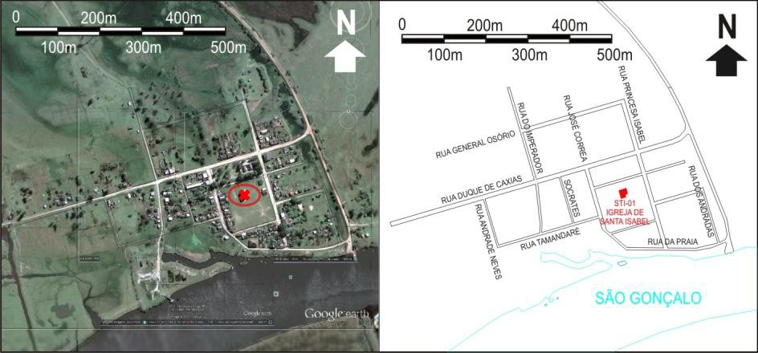
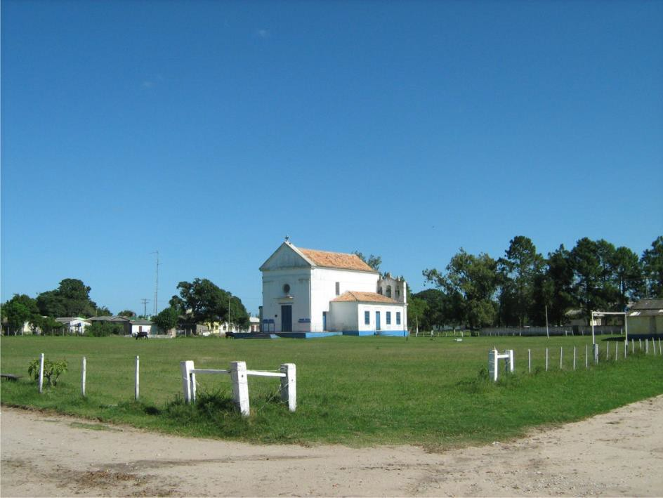
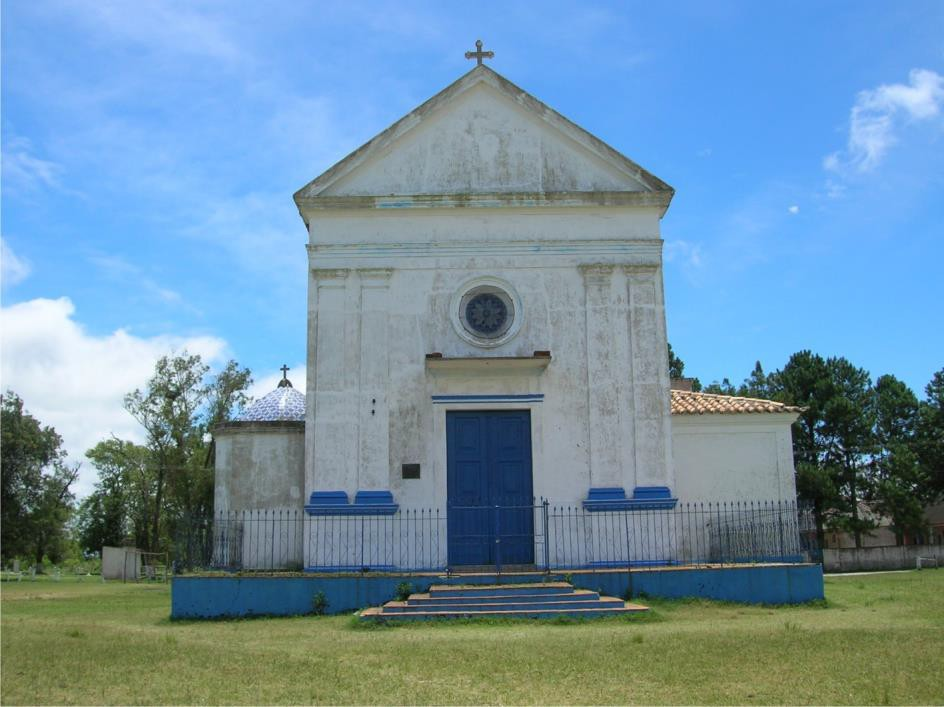
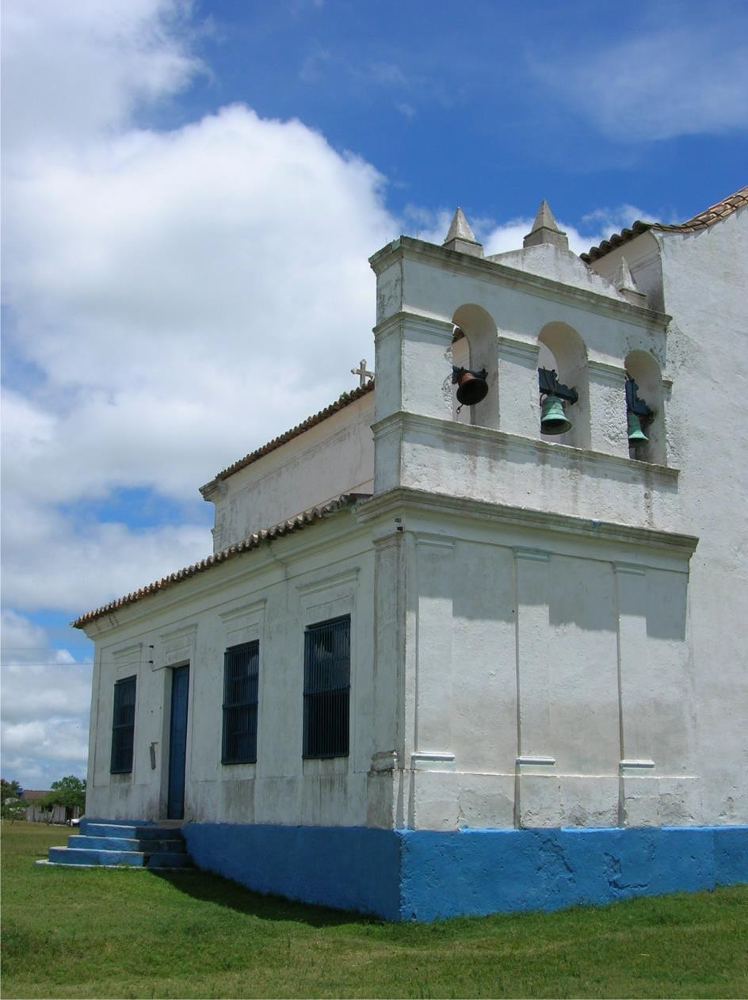
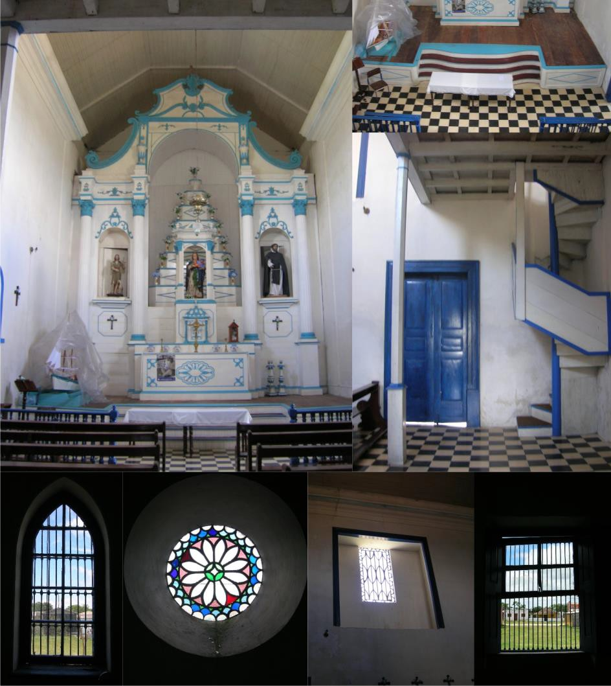
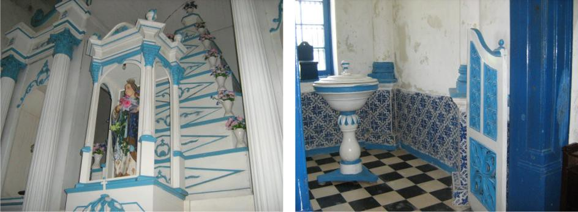
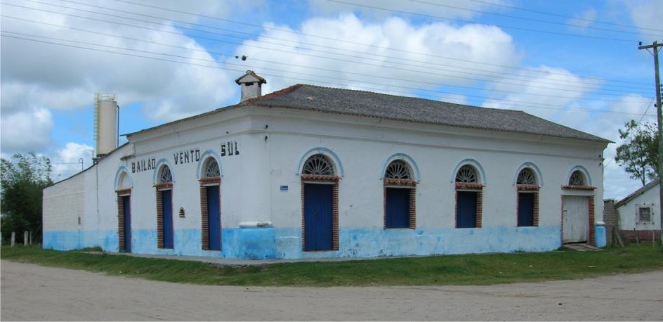
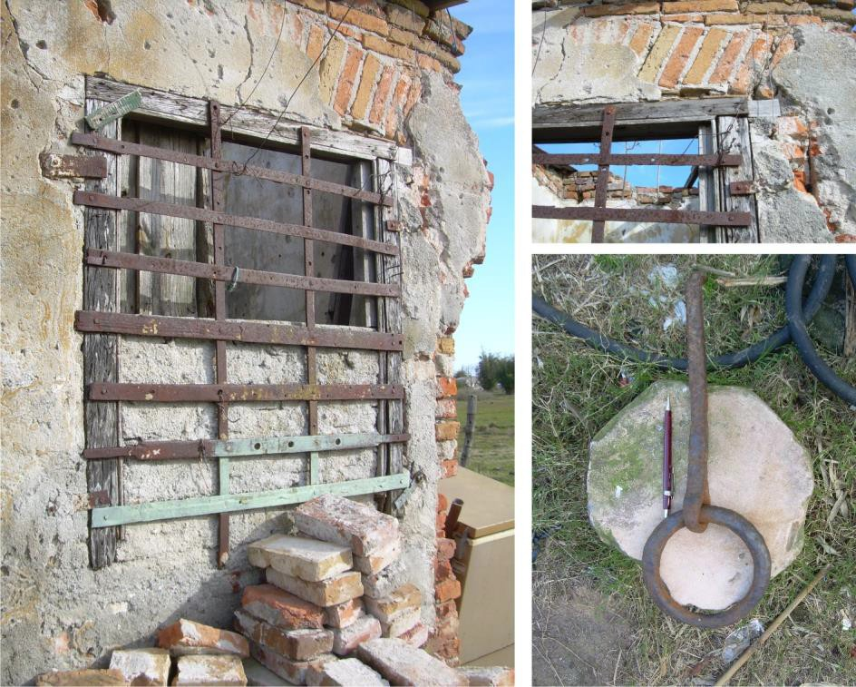
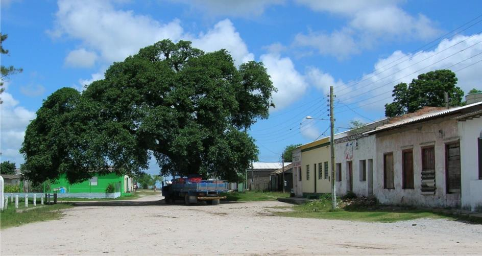

# Resumo

O presente artigo é resultado do trabalho denominado Inventário do
Patrimônio Arquitetônico de Santa Isabel do Sul -- Arroio Grande-RS e
trata do arrolamento e registro das estruturas arquitetônicas e urbanas
remanescentes e portadoras de valores culturais da referida localidade.
O objetivo geral do trabalho foi o resgate e o
conhecimento/reconhecimento da arquitetura da localidade, tanto em
relação aos seus valores estéticos como aos históricos. Como objetivo
específico executou-se uma descrição histórica da localidade e um
registro e documentação dos antigos prédios remanescentes. A metodologia
utilizada é histórica e o inventário, trabalho de pesquisa que exigiu a
utilização de diversas técnicas e procedimentos como: levantamento
fotográfico expedito, levantamento métrico arquitetônico e preenchimento
de fichas de caracterização arquitetônica e contextualização histórica.
Os resultados mais importantes do estudo foram: (a) o conhecimento do
estado atual de descaracterização em que se encontram as edificações, o
qual permite a comparação com diagnósticos anteriores; (b) o
conhecimento da organização em planta de todos os imóveis estudados,
informação desconhecida até a presente pesquisa. Podemos concluir que a
vila de Santa Isabel do Sul apresenta remanescentes arquitetônicos muito
significativos pelo seu valor histórico e por apresentar edificações
que, apesar das descaracterizações e do abandono, são significativas por
serem portadoras dos elementos estéticos da arquitetura característica
do período inicial da urbanização do Rio Grande do Sul.

Palavras-chave: Patrimônio, Preservação, Arquitetura, Santa Isabel do
Sul -- Arroio Grande-RS

# Abstract

This article is a result of the work named Inventory of Architectural
Heritage in Santa Isabel do Sul -- Arroio Grande-RS. It is about the
listing and registration of architectural and urban structures that
remain and are culturally valuable at this location. The main goal of
this work was to rescue knowledge/recognition of the local architecture,
not only for its aesthetical but also for its historical values. As a
specific goal we made a historical description of the place and also
registration and documentation of the remaining old buildings. The
methodology used was historical and inventory, research work which
required the use of several techniques and procedures, such as:
expeditious photographic survey, metric architecture survey, filling
sheets of architectural characterization and historical
contextualization. The most important results were: (a) knowing the
current state of the buildings' decharacterization, which makes it
possible to compare with previous diagnosis; (b) knowing the projects of
all the buildings studied, that were unknown until this research. It is
possible to conclude that the village of Santa Isabel do Sul presents
very valuable architectural remnants, for their history and also for
containing -- despite decharacterization and abandonment -- aesthetical
elements from the architecture that was typical from the beginning of
the urbanization of Rio Grande do Sul.

Keywords: Heritage, Preservation, Architecture, Santa Isabel do Sul --
Arroio Grande- RS

# Introdução

Poucos distritos tem em sua trajetória uma emblemática e cativante
história como Santa Isabel. Envolvida geograficamente pelos caminhos
pioneiros no sul do Brasil, estruturou-se dentro dos projetos de avanço
português em direção ao Prata, na ocupação dos campos sulinos. Assim,
silenciosamente, o distrito foi presença significativa nos
acontecimentos políticos e militares que delinearam as divisas e
fronteiras no sul do Brasil.

Entre 1882 e 1893, Santa Isabel se emancipou do município do Arroio
Grande. Potencialidades e movimentos liberais demarcaram um rumo, uma
utopia, alicerçada em um tripé básico: princípios econômicos liberais,
produção de bois para as charqueadas e o escravismo pungente nas
relações sociais e econômicas estabelecidas na região àquele tempo, no
fulgor do século XIX.

A ocupação desse território começa com as vastas doações, pelo governo
português, no ano de 1789, de sesmarias aos fazendeiros militares, para
a ocupação e proteção das fronteiras. O local demorou a se desenvolver
como núcleo urbano, mas inevitavelmente estava situado em um ponto
estratégico, à beira do canal São Gonçalo (Fig. 1), portal de saída ou
entrada da Lagoa Mirim. Somente em 1835, na Revolução Farroupilha, foi
que se percebeu um contingente semiurbano, em que estavam agrupados
militares, escravos, peões de estâncias ou as conhecidas tropas
contrabandeadas do Uruguai. O porto passava a ser o contato, as idas e
vindas, o comércio e as esperanças das oligarquias rurais e seus
projetos políticos. (SALABERRY; MENDONÇA; LÚCIO, 2012)

A presente pesquisa tem como tema a preservação do patrimônio
arquitetônico. A delimitação físico-espacial é o distrito de Santa
Isabel do Sul (Fig. 2), situada no município de Arroio Grande-RS. A
justificativa do trabalho está vinculada a emergência da preservação. O
distrito de Santa Isabel encontra-se afastado das áreas de
desenvolvimento econômico e social. Também é importante destacar que
parte significativa da população do local é proveniente de outros
municípios, o que resulta na baixa estima desta em relação aos valores
da localidade. O objetivo geral do trabalho foi o resgate e o
conhecimento/reconhecimento da arquitetura da localidade, tanto em
relação aos seus valores estéticos como aos históricos. Como objetivo
específico executou-se uma descrição histórica da localidade e um
registro e levantamento dos antigos prédios remanescentes.

> 
>
> Figura 1: Canal São Gonçalo, Sangradouro da Lagoa Mirim. Fonte:
> SALABERRY; MENDONÇA; LÚCIO, 2012.

A metodologia utilizada é histórica e o inventário, trabalho de pesquisa
que exigiu a utilização de diversas técnicas e procedimentos como:
arrolamento e registro das estruturas arquitetônicas e urbanas com
levantamento fotográfico, levantamento métrico arquitetônico e
preenchimento de fichas de caracterização arquitetônica e
contextualização histórica. (BLOCH, 2001)

> 

Figura 2: Mapa do Brasil e Rio Grande do Sul e Mapa Hidroviário
localizando o porto de Santa Isabel do Sul.

> Fonte: SALABERRY, 2012.

# Contextualização Histórica

> Em 1865, durante a viagem a Jaguarão, D. Pedro II foi visitar a
> nascente Vila

de Santa Isabel, episodio na qual o Conde D'Eu fez referência em suas
*Memórias Militares*. (D'EU, 1981) Naquele tempo, sua Igreja já estava
benta; o terreno para a construção da igreja foi doado em 1859 e as
obras concluídas em 1861. Movimentos no porto, produtos importados do
Uruguai, contrabando conveniente e nos empórios da Vila o vinho do
Porto, sabonetes Alvat, munição, tecidos de seda e anis fomentavam a
rede do comércio que subia a serra até Arroio Grande. (MENDONÇA, 2002)

As queixas contra Arroio Grande e o descaso de sua administração
cresceram. Os novos sopros liberais e movimentos de emancipação
irremediavelmente sairiam dos *fuxicos* interioranos para converter-se
na mais importante experiência emancipatória do extremo sul. Em
09.05.1882, com a lei Provincial 1.368, foi criada a Vila de Santa
Isabel. As Eleições para vereadores ocorreram em 01.07.1882 e o Auto de
Instalação ocorreu no dia 27.01.1883. (MENDONÇA, 2002)

A arrecadação da Vila girava em torno de impostos taxados das
exportações de gado, olarias, caieiras, casas de comércio e arrematações
dos Passos dos Canudos, Maria Gomes e Orqueta. Com percentuais menores,
apareciam as ferrarias, carpintarias e mascates. Não era tipicamente um
município rico, mas as principais dificuldades estavam nos constantes
embates com Arroio Grande, que não aceitava a perda de seu ex-distrito.

Com a queda do Império e a chegada da República em 1889, novos e fortes
rumores circulavam e atormentavam a Junta Municipal. Depois das rixas ao
longo dos anos, agora os liberais sairiam de cena da vida política e uma
nova batalha se avizinhava. Arrastou-se até 1893, quando o Ato nº11 de
16 de janeiro, com a rubrica já pré-estabelecida de Julio de Castilhos,
Presidente do Estado, suprimiu o município isabelense, que lhe fora
infiel politicamente. (MENDONÇA, 2002)

Novos tempos começaram. Santa Isabel voltou a ser distrito e os antigos
prédios públicos ficaram vazios. Viriam, ao mesmo tempo, a Revolução
Federalista e os caminhos flancos aos revolucionários de Gaspar Martins
e Gumercindo Saraiva. Desordem social, vândalos, oportunistas, abandono
e despreparo das forças policiais e processos de migrações forçadas
caracterizaram a curta resistência que Santa Isabel poderia oferecer.
Restaram frágeis raízes que vêm se perdendo ao longo do tempo, além do
desconforto de não serem reconhecidos os herdeiros da antiga Santa
Isabel.

# As edificações do Distrito de Santa Isabel

Entre as construções remanescentes da localidade, o grande destaque é a
Capela localizada ao centro do povoado. (Fig. 3) Se destaca pelas suas
qualidades morfológicas e valor artístico de sua arquitetura (tipologia,
estilo), pois suas características expressam o "ponto alto" da
arquitetura religiosa do século XIX, característico dos vilarejos em seu
período inicial de urbanização na fronteira sul do Rio Grande do Sul.
Atualmente a capela se encontra em razoável estado de conservação e
principalmente em adequada situação de preservação das características
originais.

> 
>
> Figura 3: Implantação da Vila de Santa Isabel do Sul. Fonte: Mapa
> elaborado pelo autor tendo como base o Google Earth.

A nave da capela é coberta com telhado capa-canal em forma de duas
águas, sendo na fachada principal delimitada por frontão triangular
ornamentado com cornija e cimalha e a fachada posterior caracterizada
por empena cega. A fachada principal é de inspiração Palladiana, apesar
da pequena dimensão, lembra a importância compositiva das pilastras de
San Giorgio Maggiore, em Veneza. O conjunto de pilastras monumentais é o
principal elemento ornamental, ocupando toda a superfície entre o umbral
da porta e o limite da fachada. Também merece destaque a rosácea
instalada sobre a única porta da fachada principal. (Fig. 4)

A volumetria da igreja é constituída de mais dois volumes, sendo estes
destinados ao batistério e outro a sacristia. O batistério é um espaço
com planta quadrada de 2m de lado, com seus limites externos chanfrados,
situado na lateral esquerda e recuado em relação a fachada principal. A
cobertura deste pequeno compartimento é uma pequena cúpula coberta em
azulejos portugueses. (Fig. 5)

> 
>
> Figura 4: Capela de Santa Isabel. Fonte: SALABERRY; MENDONÇA; LÚCIO,
> 2012.
>
> 
>
> Figura 5: Fachada Principal da Capela de Santa Isabel, Batistério e
> Sacristia. Fonte: SALABERRY; MENDONÇA; LÚCIO, 2012.

O volume designado de sacristia consiste em dois compartimentos, sendo o
menor utilizado como local de guarda ou de apoio para as atividades
religiosas. As fachadas da sacristia se destacam dos volumes descritos
anteriormente por apresentar características compositivas, assim como
base, corpo, cimalhas, vergas, molduras que não se diferenciam dos
elementos arquitetônicos utilizados na arquitetura das demais
construções urbanas, exceto a parede que delimita a fachada posterior,
esta avança sobre o volume do telhado vindo a formar uma "torre"
sineira. Esta fachada, apesar de comprender a fachada posterior da
igreja, é bastante ornamentada, de composição tripartida tanto no
sentido vertical como horizontal; possui cornijas, pilastras, frontão
recortado, tudo de forma a compor harmonicamente o conjunto de três
sinos. (Fig. 6)

> 
>
> Figura 6: Fachada Posterior da Sacristia. Fonte: SALABERRY; MENDONÇA;
> LÚCIO, 2012.

A igreja apesar de não representar uma arquitetura monumental, foi
construída com os melhores materiais disponíveis na época de sua
construção, comparável as igrejas da cidade de Pelotas ou da capital da
província, Mas o grande destaque e valor de sua arquitetura é a
composição dos seus espaços funcionais, dos seus elementos de composição
e de arquitetura, de notável qualidade estética. (Fig. 7 e 8)

> 
>
> Figura 7: Capela de Santa Isabel. Fonte: SALABERRY; MENDONÇA; LÚCIO,
> 2012.

A história da capela remonta aos primeiros habitantes do arraial,
segundo Arlindo Rupert (1994, p. 253) O Capitão José Corrêa Mirapalheta
e sua mulher, Dona Faustina Corrêa doaram em 02/08/1859, uma quadra de
terreno com 56 braças de frente e 56 de fundo para que fosse erguida uma
capela à Santa Isabel. No lugar denominado Canudos, acima do passo de
mesmo nome, à margem do Rio São Gonçalo, onde já havia uma bonita
povoação, foi lançada a pedra fundamental, no dia 1º/11 do referido ano,
pelo vigário do Rio Grande, Padre José Maria Damásio Mattos. Concluída a
igreja em 1861, em 3 de maio de 1863, foi benta por D. Sebastião Dias
Laranjeiras, que no dia seguinte (04/05) celebrou a primeira missa. No
mesmo ano (1861), o Comendador Domingos Faustino Corrêa paramentou essa
grande e bela igreja. Mais tarde, por desavenças com o capitão
Mirapalheta, retomou os ricos paramentos que doara. Pela lei Provincial
Nº 586 de 07/12/1866, foi esta capela elevada à Paróquia. Por Provisão
do Diocesano de 16/02/1882, foi canonicamente instituída sendo designado
para ela o Padre Antônio Troccoli (1882 -- 1889). (MENDONÇA, 2002)

> 
>
> Figura 8: Interior da Capela de Santa Isabel. Fonte: SALABERRY;
> MENDONÇA; LÚCIO, 2012.

Atualmente o Bailão Vento Sul, hoje juntamente com a associação
comunitária, a escola estadual, e a capela forma o conjunto de espaços
de socialização, que alem de atender as demandas da comunidade é o ponto
de referencia para uma extensa área rural.

No dia 8 de janeiro de 1882, nas festividades de instalação do
município, animava a festa a Banda Isabelense, no coreto da Praça
Aliança. À noite, a aristocracia rural, brancos pobres e negros livres
dividiam os espaços no "Salão de Bailes da Vila". Nada de classes
misturadas, mas na noite animada com lampiões a querosene, nas ruas da
Vila, a alegria da emancipação. (MENDONÇA, 2002)

Com relação a historia da referida edificação de bailes não foi
encontrado dados históricos específicos, pode ser que se trate do mesmo
salão de bailes ou não, Não foram encontrados outras citações nas fontes
primarias, entre o período de sua construção, na segunda metade do
século XIX e o inicio do XX. A partir da segunda metade do século XX
efetivamente a edificação funcionou como espaço de lazer na região.
Funcionou como cinema, de propriedade de Enedino Costa, por longa data.
A partir dos anos 80 transformou-se definitivamente no atual salão de
bailes. (Fig. 9)

Com relação a sua arquitetura, podemos destacar a composição da fachada
subdividida em: base destacada do corpo, corpo com portas e janelas
emolduradas e com verga de arco pleno e coroamento com cimalha e beira.
Atualmente o prédio encontra-se bastante alterado, parte da construção
antiga ruiu e posteriormente foi remodelada, tanto no seu interior como
no exterior, suas fachadas posteriores e cobertura foram muito
alteradas. Apesar das alterações, este prédio de socialização da
comunidade, é bastante significativo e com estrutura remanescente de
elevado valor arquitetônico.

> 
>
> Figura 9: Bailão Vento Sul. Fonte: SALABERRY; MENDONÇA; LÚCIO, 2012.

Com relação ao prédio da cadeia, não restou nada mais do que ruínas de
uma das celas da prisão, foi inventariado, não por seu valor artístico,
mas pela informação histórica e também para registrar e divulgar que não
somente os prédios históricos de utilização privada são demolidos, mas
também os prédios públicos. (Fig. 10)

A construção da cadeia fez-se necessário com a criação da Vila assim
como a organização policial e de juízes. Foi constatado a utilização do
referido prédio em 1885. O primeiro Delegado foi empossado no dia
1º/08/1883, Tenente Cecílio Machado da Costa. O delegado seria demitido
em 07/08/1885 e não teria, por bom tempo, autoridade policial e prédio
que servisse à Delegacia. Na ata 158 (cópia), de 23/02/1886, da Câmara
de Vereadores da Santa Isabel, no ofício do Balancete do ano de 1885,
nas despesas, consta luzes e melhoramentos da Secretaria de Polícia e
Cadeia. Em 24/05/1886,em ofício à Assembléia Provincial, o delegado
reclama da falta de auxílio, ao que a Câmara responde dizendo do
esbanjamento com querosene, papel e tinta. (MENDONÇA, 2002)

Com relação às construções de uso público também podemos destacar a
antiga sub- prefeitura, atual cooperativa de pescadores (COOPESI). Esta
edificação faz parte de um conjunto de varias outras residências, em
quarteirão denominado "Alto do Bronze\" constitui, de certa forma, a
base da estrutura administrativa e de serviços públicos do distrito, a
partir do século XX. Funcionou a Sub-intendência, depois Sub-
prefeitura, Posto de Controle Naval da Marinha e Central Telefônica nos
anos 80. Na década de 90 voltou a ser a sede da Sub-prefeitura de Arroio
Grande.

> 
>
> Figura 10: Ruína da antiga cadeia de Santa Isabel do Sul. Fonte:
> SALABERRY; MENDONÇA; LÚCIO, 2012.

Estas edificações compõem o eixo histórico/arquitetônico de Santa Isabel
da fase intermediária da ocupação urbana, ou seja, com fachadas planas,
com vergas retas, elementos geometrizados (Fig. 11); diferentes das
construções mais antigas das vergas em portas e janelas, com arcos
plenos, com cimalhas e molduras ornamentadas.

> 
>
> Figura 11: Conjunto Arquitetônico "alto do bronze". Fonte: SALABERRY;
> MENDONÇA; LÚCIO, 2012.

Com relação à arquitetura deste conjunto somente podemos identificar que
algumas das alvenarias são remanescentes das antigas edificações,
especificamente o lote em que funcionava a antiga sub-prefeitura nenhum
elemento arquitetônico é identificável como autentico.

Ao analisar as condições de preservação, comparando com o inventario de
1994, podemos verificar que um grande casarão do conjunto foi
completamente demolido, os demais que já se encontravam com alguma
alteração, hoje estão muito alterados, e um deles em situação de ruína.

A Rua José Correa Mirapalheta, em que está situado o conjunto "Alto do
Bronze" já consta em documentos públicos em 1869. Antes da construção do
aterro da rodovia RS-473, era provavelmente esta rua, a Rua Princesa
Isabel ou a Rua do Imperador, onde também estava localizada a cadeia,
eram as principais vias da localidade, é através de uma destas três que
se dava o acesso para o a área rural e a cidade de Arroio Grande.

# O Patrimônio Arquitetônico

O patrimônio arquitetônico de Santa Isabel vem sendo estudado há algum
tempo, como pode ser verificado no "Relatório de avaliação do valor
histórico visando propostas de preservação da Vila de Santa Isabel do
Sul", elaborado no decorrer do ano de 1994 e coordenado pelo professor
da Faculdade de Arquitetura/UFPEL Rogério Gutierrez Filho, que estudou
ao mesmo tempo questões ambientais e patrimoniais de Santa Isabel.
(GUTIERREZ FILHO, 1994)

Quase uma década depois, com autoria do então deputado Bernardo de
Souza, foi criada a Lei 11.585 de 12/01/2001, que declarou "integrantes
do Patrimônio Cultural do Estado conjuntos urbanos e edificações
\[\...\]", mencionando, no inciso VI do seu artigo 1º a "\[\...\] área
histórica da Vila de Santa Isabel do Sul, sede do Distrito do Município
de Arroio Grande \[\...\]", com suas delimitações. A lei tinha por
objetivo a preservação da história e da arquitetura do lugar. (RIO
GRANDE DO SUL, 2001)

Desde os primeiros estudos, houve o reconhecimento do valor estético,
arquitetônico e histórico do lugar. Também é importante destacar o
histórico das condições de abandono em que se encontra o conjunto
arquitetônico de Santa Isabel. Segundo o relatório de 1994, a sede do
distrito encontrava-se "em condições precaríssimas de desenvolvimento
econômico, contendo uma população de baixa renda, habitando um espaço
urbano que se encontra praticamente em ruínas". (GUTIERREZ FILHO, 1994,
p. 3)

# Considerações Finais

Atualmente, podemos facilmente verificar a pequena eficácia que teve o
arrolamento do patrimônio e também da lei que declarou a vila como
integrante do Patrimônio Cultural do Estado do Rio Grande do Sul. Apesar
do conhecimento do valor cultural e também da proteção de um instrumento
de preservação, ambos não tiveram efeito prático sobre a conservação das
antigas edificações. As edificações centenárias são demolidas,
abandonadas, subutilizadas e ficam sem manutenção.

Recentemente, a Prefeitura Municipal de Arroio Grande vem investindo na
preservação do patrimônio de Santa Isabel, através do Inventário do
Patrimônio Arquitetônico de Santa Isabel do Sul - Arroio Grande-RS e
também da promoção de dois seminários de preservação, visando também
proporcionar o desenvolvimento econômico e social dos moradores da
localidade.

Ao realizarmos o Inventário do Patrimônio Arquitetônico de Santa Isabel
do Sul, percebemos que essas edificações mostram o desenvolvimento da
arquitetura no final do século XIX, pois a antiga freguesia teve um
significativo desenvolvimento durante a segunda metade do século XIX e
arrefeceu na última década do mesmo século, ficando os prédios sem
maiores intervenções modernizantes durante todo o século XX.

Um universo significativo de edificações não resistiu ao tempo, à ação
das águas das enchentes e principalmente à ação do homem. Poucas
edificações resistiram, algumas não passam de ruínas e não resistirão à
situação de abandono em que se encontram, mas as construções
remanescentes devem ser melhor estudadas e terem sua existência material
garantida, principalmente a significativa Igreja de Santa Isabel.

Também é importante destacar o grande patrimônio natural que possui a
localidade. Podemos observar em algumas fotografias a presença de
grandes figueiras convivendo de forma relativamente harmoniosa com as
edificações antigas. Ambas devem ser preservadas, já que a Vila de Santa
Isabel fica localizada dentro da área destinada a ser uma Reserva
Ambiental (Mato Grande)

Espera-se que o inventário, o registro e a divulgação resultem na
preservação ambiental, patrimonial; que o conhecimento da história e o
desenvolvimento cultural possam ser úteis para o futuro, gerando
desenvolvimento econômico e qualidade de vida para a população local.

# Referências bibliográficas

> BLOCH, Marc. *Apologia da história ou o ofício do historiador.* Rio de
> Janeiro: Zahar, 2001.
>
> D'EU, Luis Felipe Maria Fernando Gastao D'orleans, Conde. *Viagem
> militar ao Rio Grande do Sul.* Belo Horizonte: Ed. Itatiaia, 1981.
>
> GUTIERREZ FILHO, Rogério; Et al. *Relatório de avaliação do valor
> histórico visando propostas de preservação da Vila de Santa Isabel do
> Sul.* Pelotas: FAURB- UFPEL, 1994. (Relatório de Pesquisa)
>
> MENDONÇA, Cledenir Vergara. *A Vila de Santa Isabel: dignidade de um
> povo.*

2002\. (no prelo)

> RIO GRANDE DO SUL. lei nº 11.585, de 12 de janeiro de 2001. *Diário
> Oficial \[do\]*
>
> *Estado do Rio Grande do Sul.* Poder Executivo, Porto Alegre, RS, 15
> jan. 2001.
>
> RUPERT, Arlindo. *A História da Igreja no Rio Grande do Sul.* Porto
> Alegre: EDIPUCRS, 1994.
>
> SALABERRY, Jeferson Dutra. *História e arquitetura da agroindústria no
> Bairro do Porto: Pelotas-RS (1911-1922).* Pelotas: Editora
> Universitária/UFPel, 2012.
>
> SALABERRY, J. D; MENDONÇA, C. V; LÚCIO, E. C. *Inventário do
> Patrimônio Arquitetônico de Santa Isabel do Sul - Arroio Grande-RS.*
> \[CD-ROM, ISBN: 9788591457908\] Pelotas: Jeferson Dutra Salaberry,
> 2012.
