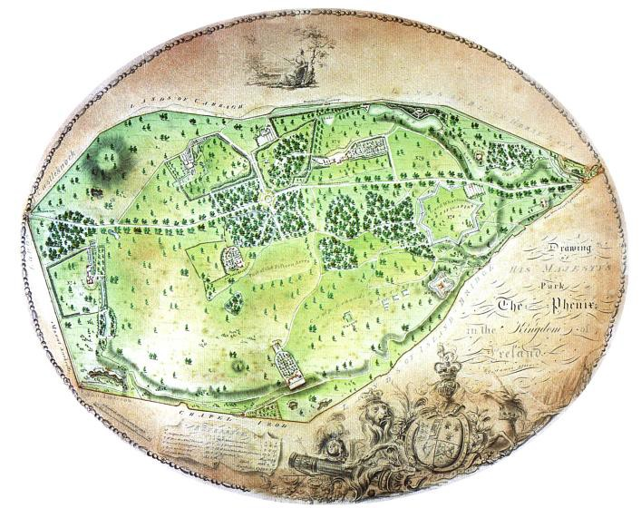

# Resumen

En algunas de las mayores ciudades de hoy se encuentra un gran parque
con acento destacado que cabe llamar central. Estos espacios singulares,
con el verde como principal motivo de distinción, ofrecen un servicio
capital para la satisfacción del ocio colectivo a escala metropolitana.
Su origen en la ciudad es una cuestión particular que gravita entre la
herencia y el proyecto, y que encuentra motivos en cuestiones como el
aprecio de la naturaleza, las necesidades de espacio abierto, de lugares
para la recreación o el ejercicio físico. Se da el caso, además, que
empresas de tal envergadura, como la que representa la construcción de
un parque central, se dilatan en el tiempo resultando muchos de ellos
obras en continuo progreso. Con todo, resulta que en el particular
origen de los parques centrales se encuentran muchos motivos que
explican la forma y servicio del parque de hoy. El artículo presenta
algunos casos representativos del abanico de orígenes del parque
central, destacando algunos atributos que su composición gana con su
particular historia. Cabe encontrar en esta historia del parque central
argumentos validos y vigentes para la orientación del proyecto en
grandes metrópolis con parque central en construcción.

> Palabras clave: parques urbanos, centro metropolitano, ocio colectivo

# Abstract

Today, some major cities have a large park, with an special role, that
can be called

cantral park. These unique spaces, with green-matter as the main reason
of distinction, offer a capital service for metrpolitan collective
leisure. Its location in the city is a particular issue that hovers
between heredity and the project, and it finds reasons in topics such as
appreciation of nature, open-space requirements, places for recreation
or exercise. Moreover, the construction of such huge parks may last
decades, even centuries, and many of them are work-in-progress. However,
the specific origin of central parks explains a lot on how the park is
today. The paper presents some case- studies as a representative sample
of the different origin, highlighting the features that depend on their
particular history. Some keys for the design of great parks under
construction can be found underneath.

Keywords: urban parks, metropolitan center, collective leisure

Raices del parque central: una historia en las grandes ciudades

Si se indaga entre las mayores aglomeraciones urbanas del mundo se
encuentra, en un número considerable de ellas, una gran área destacada
destinada al ocio ciudadano con el acompañamiento protagonista de la
vegetación. En estos grandes parques, más o menos consolidados, más o
menos estáticos aunque en permanente revisión, reside un capital
singular que, conjugado de manera acertada, puede proporcionar ventajas
únicas, expresiones punteras de lo que son las grandes metrópolis de
hoy.

El parque central es una realidad de entidad variable a lo largo de la
historia de las ciudades que se mantiene viva, aún hoy, como elemento
constitutivo de la expresión más contemporánea de las metrópolis.

El estudio de su origen resulta, pues, oportuno, en tanto que en él se
hallan argumentos para la definición de su composición. Y es que, por
ejemplo, que un parque esté más o menos cercano al centro desde donde
creció la metrópolis, que presente una morfología planimétrica u otra, o
que con lo verde exprese unos recursos compositivos u otros, son
cuestiones que, a menudo, sólo se pueden explicar con cierto rigor a
partir del conocimiento de su origen y del contexto en el que nació el
parque. Cada historia cuenta el porqué de muchas cosas en el parque de
hoy, que esté más o menos presente en la conciencia ciudadana, que
cuente con una composición unitaria o sea un compuesto de espacios
diversos, o que preste mayor atención a un tipo de funciones en
detrimento de otras. Hay que estar atento al origen de las cosas, pues
la historia explica algunas cuestiones de su forma, pero en algunos
casos, formas

muy similares surgen como consecuencia de orígenes dispares.1

Antecedentes para su nacimiento: la naturaleza y el ocio

La presencia de parques centrales en las grandes ciudades viene de
lejos, y aún más atrás debe uno remontarse si pretende indagar entre los
antecedentes que, poco a poco, fueron consolidando las técnicas y las
ideas necesarias para a que, reunidas, se diera inicio a la concepción
de esta entidad urbana de singular condición.

Una larga tradición cultural afianzaría con el tiempo las habilidades
del hombre para dominar los materiales biológicos en beneficio propio,
permitiendo que se utilizaran también como base de producciones
artificiales con afán de producir goce estético. A lo largo de este
periplo, progresan las técnicas para el control de la naturaleza, se
modifican los motivos de su deseo, cambian los criterios que orientan su
embellecimiento, y se enriquecen los atributos que se le asocian. Por
otra parte, el progreso de las mayores ciudades del mundo desvelaría
necesidades urgentes en cuanto a la disposición de espacios abiertos,
capaces de ofrecer oportunidades de esparcimiento y recreación pública,
además de nuevas perspectivas de salubridad y equilibrio para unas
grandes urbes en continua expansión.

El enriquecimiento del concepto del ocio urbano también dejará sus
huellas en el parque central. A lo largo de la historia han ido
incorporándose a su definición cada día más espacios y edificios para
actividades de ocio de toda condición: para el deporte, el espectáculo,
la relajación contemplativa o el aprecio de los sistemas y procesos
ecológicos. La formación de la ciudad y la consolidación de la metrópoli
han jugado un papel muy relevante en la definición del concepto y las
prácticas de ocio de hoy. La ciudad, a través de reacciones a su
constitución real y a través de la reacción a especulaciones sobre su
futuro, ha fomentado nuevos significados del ocio y el despliegue de un
amplio abanico de espacios y servicios para su satisfacción, que
encuentran en el parque central una de sus expresiones más punteras.

Así, capacidades y necesidades, juntas, actuarían como catalizadores
para el nacimiento de una nueva entidad urbana en la que el espacio
abierto, lo verde, la propiedad pública y las dotaciones para el ocio se
unirían para componer un espacio de excelencias sólo al alcance de las
metrópolis más avanzadas. En ese contexto, la continua competencia entre
ciudades punteras fomentaría que el ejemplo dado por las primeras en
disponer de grandes parques fuera seguido por otras en su afán por no
quedar atrás.

> 1 Véase, por ejemplo, el caso de Central Park en Nueva York junto al
> Golden Gate Park de San Francisco. En estos dos casos tan parecidos a
> la vista en cuanto a forma, dimensiones y formatos urbanos que lo
> rodean, guardan en su origen intenciones opuestas. Mientras el Central
> Park (1851-1858) sirvió para desclasificar 141 manzanas ordenadas en
> el Plan vigente desde 1815, el proyecto de Golden Gate Park formó
> parte de una iniciativa que promocionó un nuevo ensanche a su
> alrededor en 1871.

Herencias nada casuales y proyectos muy especiales

Parques centrales los hay con raíces de profundidad muy variada. En
algunos casos, el valor de su presencia fue reconocido ya en épocas muy
pretéritas, aunque tuvieran que pasar siglos para que se consolidaran
como espacio de utilidad urbana de singular condición. Así, para
establecer donde está el origen de los diferentes parques centrales
deben identificarse, al menos, tres episodios, a menudo aislados pero
igualmente relevantes para su constitución: el inicio de su uso para el
recreo público, el momento o momentos del proyecto o proyectos para la
ordenación y composición del espacio, y el momento en el que el suelo ha
pasado a propiedad publica.

Las diferentes relaciones entre estas tres fechas (uso-proyecto-suelo)
definen, al menos, dos tipos básicos de origen, permitiendo diferenciar
entre: 'Parques heredados' (uso-suelo), donde el protagonismo de una
herencia es el que les acompaña y conduce a sucesivos
perfeccionamientos. 'Parques nacidos de proyecto colectivo'
(suelo/proyecto-uso), donde es la invención y la creación de la
oportunidad que el parque ofrece la que le ha llevado al prestigio que
hoy alcanza y exhibe, aunque sea sin recurrir a un modelo explícito.

Ya desde el siglo XVII, pero especialmente durante el siglo XVIII, en
las mayores capitales europeas empezaron a abrirse al público algunos
grandes jardines y bosques propiedad de la aristocracia y la realeza
para el paseo de los ciudadanos, quienes descubrían en ellos el placer
de pasar el tiempo de ocio con el acompañamiento del verde en un juego
estimulante de ver y ser visto. En las islas británicas, aprovechando
los réditos de las tempranas desamortizaciones de propiedades de ordenes
religiosas, la corona pudo conservar y enriquecer grandes extensiones en
ciudades como Dublín o Londres (Fig. 1). Los ciudadanos de Berlín
(1649), París (1727), Estocolmo (1750), o Viena (1766) también vieron
como antiguos bosques de caza para uso exclusivo de la corona abrían las
puertas y se convertían poco a poco en lugares urbanos para el fomento
de nuevos modos de vida y de interacción con los conciudadanos.

> 

Figura 1. Asser, J., (c.1775), "A Drawing of His Majesty's Park The
Phoenix Park in the Kingdom of Ireland". Fuente: McCullen, 2009

Estos primeros parques surgidos como resultado de gestos ilustrados de
servidumbre de uso darían un primer ejemplo muy valioso para que otras
grandes ciudades en expansión incorporasen los beneficios del verde en
grandes cantidades entre la agenda

de iniciativas colectivas para hacer de la metrópoli un hábitat
saludable y prestigioso durante el siglo XIX.

Liberado de las estrecheces de Europa, el parque central podía nacer en
América y otras tierras coloniales como proyecto para la fundación de
nuevas ciudades, como ocurriría con el proyecto de l'Enfant para la
nueva planta de la capital federal de los Estados Unidos (c. 1793), en
la que el amplio espacio abierto que media entre los edificios
representativos de los principales poderes del país se convierte en el
eje central de una composición muy jerarquizada; o con el proyecto de
William Light para la ciudad australiana de Adelaida, en la que un gran
espacio público verde se reserva a los bordes de los lotes para la
urbanización, entre éstos y las parcelas para la explotación primària
(Fig. 2).

(...)

Atributos especiales entre los motivos que le sirvieron de germen

Por ejemplo, cabe advertir en algunos parques que su valor destacado
proviene en gran medida de su larga historia, consolidado a través de la
consistencia de los antecedentes vinculados al espacio. Estos
antecedentes influyen en su prestigio y su calidad excepcional, otorgan
atributos singulares, y confirman su valor capital y el paso del tiempo
ratifica, consolida e incluso potencia estas cualidades. Este es el caso
del Bosque de Chapultepec en Ciudad de México por ejemplo. Como muestra
la imagen, su enclave fue ya reconocido por las tribus aztecas incluso
antes de que se establecieran en la ciudad insular de Technotitlan. Los
atributos singulares de ese lugar fomentaron la identificación del
bosque como reserva de especial condición en la que ya el emperador
Moctezuma ubico sus espacios de recreo. Así, el profundo arraigo
histórico de algunos parques se convierte en un motivo de primer orden
para que cristalice en ellos una condición acentuada del espacio que los
proyecta a convertirse en parque central de la metrópolis

Por otra parte, debe considerarse el echo de que, en algunos casos, fue
la calidad y riqueza del verde existente en un enclave determinado,
junto con la voluntad de conservar dicha riqueza para ponerla al
servicio de la composición de la metrópoli, lo que motivó el nacimiento
del parque central en ese lugar. La riqueza paisajística y ambiental
preexistente se convirtió en un argumento sólido para aquellos que
defendían que la gran ciudad no podía perder la oportunidad de
apropiarse de estas ventajas al alcance, como tampoco podía permitirse
el lujo de desperdiciar ese capital con la expansión indistinta de la
urbanización. Con el trabajo medio hecho por efecto de la naturaleza,
algunas grandes ciudades como Vancouver pudieron definir su parque
central mediante una estrategia de conservación de los valores
existentes, sólo con la introducción de algunas modificaciones de
pacificación y adaptación a utilidades urbanas requeridas.

La forma del suelo, o en otras palabras, las condiciones geomorfológicas
naturales del soporte de la ciudad, también juegan un papel importante
en la definición de la situación y composición del parque central desde
su germen. ...Los parques centrales no han surgido lugares cualesquiera.
Su gran dimensión dedicada a usos no productivos, (ni siquiera
estrictamente necesarios para la vida urbana), requiere justificaciones
para su posición que pueden encontrar respuestas en determinadas
condiciones previas del suelo sobre el que se asientan.

En algunos parques se reconoció desde su origen la forma y sentido de
los sistemas

geográficos naturales... y además, su construcción sirvió para hacerlos
visibles y comprensibles, ...para integrarlos entre las estructuras de
la metrópolis, ...o para permitir su continuidad, progreso y
pervivencia. Este fue el caso de Londres... donde la coherencia de los
sistemas geográficos se reconoce aún hoy el plano físico del sistema de
parques reales... en la forma de sus cuerpos de agua, ...o en el
carácter de sus diferentes partes ... la hondonada de Green Park, o los
prados altos de Hyde Park.

La expansión de la urbanización tiende a enmascarar o enterrar estos
sistemas definidos por las condiciones geomorfológicas del suelo que le
sirve de soporte... pero en algunos grandes parques se descubre la
oportunidad de que, en su ámbito, queden al descubierto... lo cual puede
tomarse como una aportación efectiva a la definición de una identidad
propia para cada metrópolis.

El reconocimiento de la geografía también se encuentra en el germen de
otros casos. En Montreal, por poner un ejemplo, las condiciones
orográficas poco agradecidas para el asentamiento de usos urbanos
ordinarios se mantuvieron los suelos que hoy forman parte del parque
suficientemente desocupados como para pensar en dedicarlos a esa
utilidad especial... que requería amplias extensiones de suelo libre.

Allí, como en otros lugares como Seul o Santiago de Chile, "la presencia
de una singularidad geográfica destacada se asoció con una función
urbana especial",

...resultando de esta asociación el germen del parque central

No sólo en la forma del suelo hay motivos que explican la composición de
la ciudad contemporánea. Autores como Hans Bernoulli en su obra Die
Stadt und ihr Boden, ya advertían de la importancia que toma la
estructura de la propiedad ...el plano parcelario del suelo rústico, en
los resultados de su urbanización. Esto también es así en los parques
centrales, en los que a menudo se advierte el "reflejo heredado de la
estructura de la propiedad del suelo".

Esto se puede ver en el caso de Bogotá. Allí, la estructura de quintas y
haciendas para la explotación rural de la sabana jugo un papel
determinante en la expansión de la ciudad. En medio de ese mar de
parcelas, la singularidad de la propiedad la hacienda El Salitre, nunca
entregada a procesos de desarrollo urbano, está detrás de la existencia
allí del parque metropolitano Simón Bolívar, y explica algunos rasgos de
su composición.

Además de las parcelas reales en las capitales europeas, como en Bogotá,
otras propiedades de particulares civiles han acabado convertidas en
parque central por unos o otros derroteros, como es el caso de Los
Ángeles o Toronto.

Como se demostró en Philadelphia ya a mediados del siglo 19, un gran
parque podía servir para la definición de una estrategia de progreso
atenta al consumo racional de recursos, ...a la protección y mejora del
medio ambiente urbano, ...o al mantenimiento de los principales procesos
ecológicos y de la biodiversidad como beneficios sociales y, a la larga,
económicos.

El parque se propone allí como un lugar especialmente adecuado para
promover la educación de la ciudadanía en materias ambientales, ...un
primer paso para fomentar una conciencia colectiva atenta a los retos
ecológicos.
