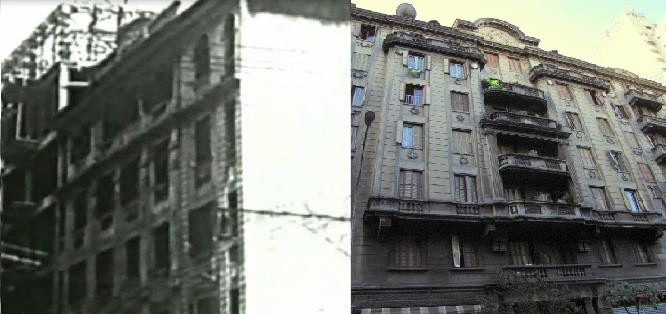
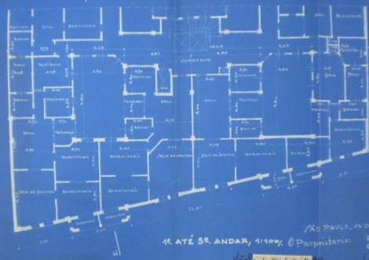
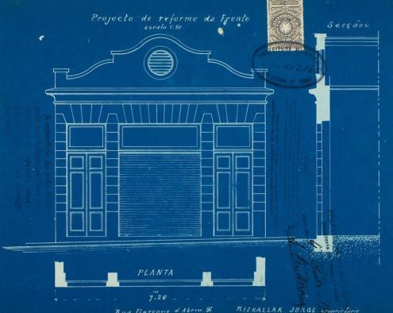
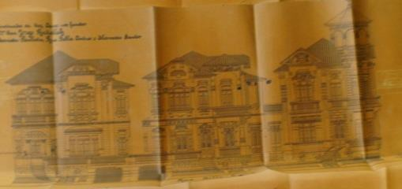
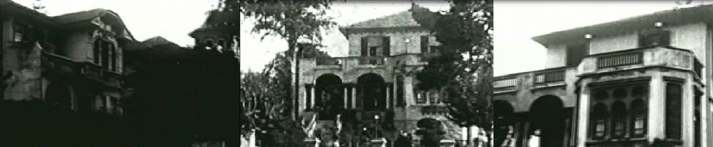

# Resumo

O artigo intenta reconstruir a trajetória de um expoente imigrante
sírio-libanês1 com ascendência armênia Rizkallah Jorge Tahan
(1868-1949), tendo como foco suas intervenções no espaço urbano de São
Paulo. Rizkallah desembarcou no porto de Santos em 1895 e, ao contrário
da maioria dos imigrantes desta nacionalidade que se tornavam mascates
ao chegarem no Brasil, trabalhou com a fundição de cobre, algo que já
fazia em sua terra natal. Após três anos na capital paulista inaugurou a
Casa da

Boia, casa comercial baseada no comércio de elementos como \"a boia
sanitária\", o que permitiu seu enriquecimento e, consequentemente,
endinheirado, a realização de uma série de obras nos centros \"velho\" e
\"novo\" de São Paulo, as quais se constituem no foco desta pesquisa.

Palavras- Chave: Arquitetura, Imigração, Rizkallah Jorge Tahan,
Sírio-libanês e Armênio.

# Abstract

Through textual, oral and iconographic sources, this research intends to
reconstruct the trajectory of the immigrant of Armenian-Lebanese
ancestry Rizkallah Jorge Tahan (1868-1949). The research seeks to
compile and analyze his interventions in the urban space of São Paulo.
Rizkallah landed at the port of Santos in 1895 and unlike most of the
immigrants of his nationality that became peddlers when arrived in
Brazil, he choose to work with the copper smelter, which was already his
professional activity in his homeland. After three years in the capital,
he inaugurated the \"Casa da Boia\", that was the main place to the
commercial activity linked with the sanitation. The artifact \"float\"
was a breakthrough for the paulista society that allowed its rapid
proliferation and, consequently, the enrichment of Jorge Rizkallah,
enabling it to carry out a series of works in the centers \"old\" and
\"new\" of the capital, which are the focus of this research.

Keywords: Architecture, Immigration, Rizkllah Jorge Tahan,
Syrio-Lebanese and Armenian.

# Introdução

# RIZKALLAH, SÃO PAULO E O SURTO URBANO

Um dos principais fenômenos que deixou suas marcas nas cidades
brasileiras foi a imigração. Ela se faz presente tanto nos diversos
sotaques que ouvimos nos diferentes

> 1 O uso da expressão sírio-libanês se dá pelo fato de que até 1926
> quando a República do Líbano foi criada, tanto Síria quanto Líbano
> estavam em um mesmo território, a grande Síria. Como Rizkallah Jorge
> veio ao Brasil em 1895, sua origem ainda era "turca", pois ainda
> faziam parte do Império Turco- Otomano, depois da separação passaram a
> ser denominados sírio-libaneses. Segundo Gattaz, a imigração árabe, a
> rigor, engloba outras nacionalidades, como egípcios, palestinos,
> sauditas, iraquianos e outros, porém os libaneses respondem por cerca
> de 70% dos imigrantes árabes, no Brasil

bairros na cidade de São Paulo, quanto nas formas de uso e construção
dos edifícios. Para compreender um pouco melhor a contribuição da
colônia sírio-libanesa na capital paulista, o estudo da trajetória dos
empreendimentos do imigrante Rizkallah Jorge Tahan parece bastante
frutífero.

Bem como grande parte dos indivíduos que decidem sair de sua pátria de
origem, Rizkallah Jorge também migrou para São Paulo por questões
financeiras. Ele almejava que sua vinda ao Brasil propiciasse uma
melhora de condições sociais para sua família. Portanto no ano de 1895,
este decidiu migrar ao Brasil, e aqui chegando procurou uma profissão
que se adequasse as suas habilidades prévias, a fundição de cobre. Com o
dinheiro que acumulou após três anos na Capital, Rizkallah não comprou
propriedades em sua terra natal, mas sim, adquiriu uma fábrica de cobre,
popularmente conhecida como a Casa da Boia situada na Rua Florêncio de
Abreu 123, considerado um dos empreendimentos mais antigos e
tradicionais no comércio de metais da cidade de São Paulo (PONCIANO,
2007). A venda de \"boias\" sanitárias, artefatos que estavam com uma
demanda alta em um período que as questões sanitárias e higiênicas eram
o cerne da preocupação, propiciou seu enriquecimento que foi utilizado
na construção de edifícios.

Quando Rizkallah Jorge chegou à capital, o ambiente paulista já havia
passado por modificações que visavam sua modernização. Estas ocorriam
desde o último quarto do século XIX, procurando tornar, de fato, a
capital o centro regional, econômico e comercial de São Paulo. As
modificações haviam se dado na difusão de novas fontes de energia,
técnicas produtivas, transportes e comunicações e buscavam atrair para a
capital os setores enriquecidos, principalmente os ligados ao café que
se encontravam dispersos pelo interior. Será principalmente neste
momento que muitos fazendeiros irão se estabelecer na capital. Com esta
mudança populacional do interior para a capital se verá uma alteração
populacional, "o número de habitantes passou de 30mil em 1870 para 50
mil em 1885, iniciando a República com quase 100 mil habitantes e
chegando a 1900 com 240 mil" (CAMPOS, 2002).

Para Campos, a administração de Antônio Prado buscou o estabelecimento
de uma centralidade na capital, que concentrasse no "núcleo histórico"
as funções comercial e de serviços, assim constituiria um elemento de
dominação, mostrando, a pujança de São Paulo como a cidade mais
produtiva do país. Para atingir este objetivo se instalaram na cidade
grandes empreendimentos, negociantes, e outras atrações que não eram
encontrados facilmente, na cidade de outrora. Além da inauguração de
novos empreendimentos, a partir de 1910 os edifícios públicos da região
passaram por uma reformulação e ampliação. A monumentalidade permeou a
construção destes novos edifícios e foi um fator para a valorização
financeira do centro, isto pode ser facilmente identificado na
construção dos palacetes de Rizkallah Jorge, que serviam para locação e
passaram por algumas ampliações procurando garantir aluguéis mais
elevados.

Na década de 1920 a cidade passou por um novo período de grande
urbanização, principalmente em virtude do momento de prosperidade
econômica do café. Neste momento surgem projetos de transformação, como
o "Plano de Avenidas", que criaria um anel que facilitaria a circulação
radiocêntrica em São Paulo, são propostos o zoneamento que estabelecia
padrões de construção por zonas e um novo Código de Posturas, que pautou
a maioria das edificações de Rizkallah, uma vez que é nas décadas de
1920 e 1930 que teve uma maior atuação no ramo imobiliário. O Código de
Posturas irá regular principalmente as alturas máximas permitidas aos
prédios da região central, condições mínimas de ventilação e higiene e
implantação no tecido urbano.

A cidade havia se tornado, na visão de muitos, um canteiro de obras.
Maria Cecília Naclério Homem relata que "a capital superava os seus
próprios recordes e os das demais cidades brasileiras. Em 1920, as
estatísticas registraram 1.875 novas construções, que evoluíram para
3.922, em 1930. Construía-se à razão de uma casa por hora" (HOMEM,
1984).

Todas as construções encomendadas por Rizkallah estavam localizadas na
região central que era uma das mais valorizadas na cidade de São Paulo.
Para melhor compreender os locais que estas edificações estavam
inseridas, faz-se necessário conhecer os projetos desenvolvidos e como
afetaram os espaços em que os empreendimentos de Rizkallah estavam
localizados. Analisemos mais especificamente a Várzea do Carmo e Centro
Histórico, Anhangabaú e Paulista.

# A INSERÇÃO DE SUAS OBRAS

# Anhangabaú

Durante a virada do século a região ainda apresentava traços rurais, as
casas eram baixas e continham hortas, uma faixa de plantas dividia a
paisagem com a estrutura metálica do Viaduto do Chá, que foi visto como
uma das principais obras do período. Apesar disso, por sua posição
geográfica próxima à região central, este espaço será desde o final do
período monárquico visto como de enorme potencial paisagístico e
urbanístico, portanto, alguns projetos serão implantados tais como: o
ajardinamento realizado em 1910 que resultou na criação do Parque do
*Anhangabahú* e a abertura da Avenida Anhangabaú, durante os anos 30 com
o "Plano de Avenidas" na administração de Prestes Maia.

Todos estes projetos realizados na região bem como sua posição
privilegiada em relação ao centro histórico fizeram com que os terrenos
passassem a ter uma valorização no mercado imobiliário. Verifica-se que
Rizkallah tentou se beneficiar desta valorização, propiciada pelos
projetos de melhoramentos, construindo uma série de empreendimentos no
Anhangabaú e realizando posteriormente ampliações nos mesmos objetivando
aumentar seus lucros com os aluguéis.

Rizkallah encomendou neste local a construção de três palacetes, que
foram tombados em 1975, pelo processo de zona Z-8. Estes palacetes
existem até os dias de hoje e podem ser vistos na rua Carlos de Souza
Nazareth, antes chamada de rua *Anhangabahú*. Rizkallah também possuía
outros edifícios neste mesmo endereço. Os projetos detalhados de suas
construções no local permitem com que se compreenda sua inserção no
mercado imobiliário do período.

O processo datado de 1932 e 1933, pede a substituição de plantas dos
projetos já aprovados para a *rua Anhangabahú* 11. Pelo número de pisos
e pelos ornamentos da fachada, este projeto parece ser referente ao
atual Palacete Paraíso. No projeto são previstas a construção com
estrutura de concreto armado de um porão, térreo, seis andares e de
torre de elevador. Cada andar teria doze apartamentos, totalizando um
total de 67 em todo o prédio. O térreo teria seis armazéns que serviriam
de lojas.

O Palacete guarda traços da arquitetura
eclética e possuí elementos que remetem à religiosidade de seu
proprietário. "O detalhe mais curioso do Palacete é a decoração do salão
de entrada: um nicho com as estátuas de Adão e Eva" e

# Figura 1 -** Palacete Paraíso 1928/2012. **Fonte: ACB e Flickr.

um vitral colorido formam a cena intitulada "o Primeiro Pecado" (CMP,
14/02/19862), cujas autorias são desconhecidas.

O número 130 da mesma rua também era sua propriedade e dois processos de
1927 e 1928, fazem referência a ele. O primeiro solicita a aprovação de
plantas para o aumento de um andar no prédio que já estava em processo
de construção3.

O número 862 possuí um processo datado
de 1932, solicitando a aprovação para a construção de mais andares e

modificação para possuírem varanda, sendo o responsável por esta
solicitação o construtor Plácido DallAcqua. Pelo desenho de sua fachada
este edifício é o Palacete São Jorge, o único a possuir sacadas. Este
edifício foi um dos primeiros prédios de apartamentos da cidade e
constituí grande novidade de residência para a classe média (CMP,
21/02/1986). Ele é composto por seis pavimentos, totalizando cinquenta

apartamentos e dez estabelecimentos comerciais no andar térreo.

# Figura 2 -** Planta Palacete Paraíso. **Fonte: AP.

No Palacete estão as inscrições "RJ" e "1928", remetendo a seu
proprietário e sua data de construção, respectivamente. A fachada
composta por arcos e tijolos aparentes se assemelha bastante aos
edifícios americanos, sua configuração espacial segue as posturas da
arquitetura clássica, marcada pela tripartição. Na imagem acima estas
três divisões podem ser identificadas, sendo estas, o embasamento, a
parte inferior do edifício local onde estão as lojas, o corpo, parte
central e as cornijas, parte superior divida por um barrado. Dois
edifícios, pelo menos, são símbolo desta estética: um se localiza em
Chicago, originalmente chamado de Stevens Hotel (atual Hilton Chicago),
e ,o outro, está localizado no centro de São Paulo, o conhecido edifício
Martinelli.

Todos seus palacetes foram espaços destinados à construção de
apartamentos de aluguel para as classes médias da cidade. A difusão
destes apartamentos ampliava o processo de coletivização da cidade,
processo que não foi visto de maneira homogênea por toda a população, já
havia os que associavam este tipo de construção aos cortiços insalubres
e temiam as consequências que podiam advir deste tipo de moradia;
outros, ainda, consideravam os edifícios como boas soluções para o morar
e trabalhar em uma cidade que aumentava sua população progressivamente.

# Várzea do Carmo e Centro Histórico

A Várzea do Carmo, local onde se localiza o rio Tamanduateí, era, em
fins do século XIX, um espaço bastante problemático para a
municipalidade, que sentia a necessidade de urbanizar aquela região.
Este local não possuía o modelo sanitário pretendido e, portanto, em
1875 foi realizada sua retificação e saneamento criando na Várzea a
"Ilha dos Amores". O local, antes frequentado por lavadeiras e mestiços,
foi substituído por um parque construído a partir do projeto do francês
Cuchet.

> 2 Coluna Memória Paulista escrita por Ernani Silva Bruno, no Jornal
> Folha de São Paulo.
>
> 3Este processo não contêm memoriais que nos possibilite afirmar como
> sendo um dos Palacetes, porém pelo fato do edifício atual possuir um
> barrado que separa os quatro primeiros andares do quinto e último
> andar, provavelmente seja o Palacete Aleppo, que teve um andar
> acrescido depois de sua construção.

Neste processo de urbanização é possível compreender a intenção de
excluir socialmente as parcelas indesejadas da população para outras
áreas, que não as do perímetro central (SANTOS, 2000), pois, assim,
poderiam como já abordado anteriormente, afirmá-lo como um centro
financeiro e cultural, núcleo da urbanização. A modernização de São
Paulo gerou também uma discriminação e exclusão das parcelas pobres e
percebe-se pelas ações da municipalidade que sua maior preocupação em
relação ao espaço urbano se voltava ao embelezamento e não com a
construção de espaços que pudessem abrigar as classes trabalhadoras.

As obras de Rizkallah inseridas nestas regiões se encontram divididas
em: Florêncio de Abreu, Senador Queiróz, Tiradentes e 25 de Março, que
serão tratadas respectivamente abaixo.

Na rua Florêncio de Abreu a construção
que talvez seja de maior expressão devido sua ligação com a história de
Rizkallah Jorge seja a Casa da Boia, porém, não foi sua única
propriedade na região. O imigrante também era dono do edifício número 96
em 1913 irá por meio do arquiteto

Morcetti4 solicitar a substituição de plantas para poder reformar a
frente e suspender o telhado do local.

A Casa da Boia, edifício de maior reconhecimento, é a loja de materiais
hidráulicos fundada por Rizkallah Jorge em 1898, que se mantêm até os
dias atuais em um bom estado de conservação. Sua situação atual não é a
mesma da época de sua construção, o andar superior, que durante décadas

serviu como residência foi transformado em administração e parte do
forro foi modificado (CMP 19/02/1986).

# Figura 3 -** Fachada nº 96. **Fonte: AHMWL

A propósito, convém indicar que a Casa da Boia, antes situada no número
92 da rua, e, hoje, tratada como os números 364 e 370 passará por uma
reforma tendo como responsável Plácido Dall\'Acqua. Neste projeto estão
anotadas as demolições dos telhados e de todas as paredes do piso térreo
dos dois prédios até o nível da rua, bem como a remoção dos soalhos que
eram de madeira (AMWL/SOP). O memorial anexo à solicitação e ao projeto
ainda indica que a estrutura era de concreto armado sobre as vigas
existentes dos atuais porões e a fachada era composta por paredes de
alvenaria de tijolos e telhado de madeira de lei coberto com telhas
nacionais. Dall\' Aqua também indicou a construção de um galpão para
abrigar os materiais necessários à obra.

O local deste terreno também será fruto de uma discussão com a
municipalidade, que possuía a propriedade do número 94. Tanto seu
terreno quanto o da prefeitura haviam sido propriedades de Antônio Costa
Braga que teve sua propriedade desmembrada em cinco partes após sua
morte, tendo quatro ficado com Rizkallah e uma com a prefeitura.

Entretanto, para a Prefeitura, houve um problema com relação aos limites
entre estas partes. O fato de não haver clareza na Escritura de
Transferência, significava que

> 4 Durante este período é bastante difícil afirmar que todos os
> profissionais eram formados. Para tal ver \"O cotidiano em construção:
> os \"Práticos Licenciados\" em São Paulo (1893-1933)\", do autor
> Lindener Pareto Júnior.

não se podia ter certeza que a dimensão do terreno de sua propriedade se
restringia a 4 x 6,50 metros. Apesar desta questão, a Casa da Boia
continuou mantendo sua extensão intacta, sendo um dos maiores terrenos
da região. Ao analisar as imagens das obras de Rizkallah e seus projetos
verifica-se que estes seguiam estilisticamente o ecletismo, postura
arquitetônica bastante comum naquele período. Carlos Lemos propõe que
devemos entender:

> \"O ecletismo como sendo toda a somatória de produções arquitetônicas
> aparecidas a partir do final do primeiro quartel do século passado
> \[XIX\], que veio juntar-se ao Neoclássico histórico surgido por sua
> vez como reação ao Barroco\" (LEMOS, 1987).

A Casa da Boia, pois, se insere na segunda categoria de Ecletismo na
divisão feita por Carlos Lemos. Esta compreende as construções
neoclássicas, que contém, principalmente, pela ornamentação
renascentista, portanto, se percebe que os ornamentos que circundam a
fachada da Casa da Boia buscam elementos que remetem ao Renascentismo. A
grande maioria dos edifícios encomendados pelo imigrante seguirão esta
maneira de fazer arquitetura, aproximando-se do gosto corrente entre a
clientela de seus prédios de aluguel.

Um dos empreendimentos encomendados por Rizkallah, e que não se referem
a suas intenções comerciais é o complexo da Igreja São Jorge e Colégio
José Bonifácio, localizado na rua Tiradentes. Rizkallah doou sua
propriedade no número 835 da Avenida Tiradentes para a construção de uma
Igreja da Comunidade Armênia de São Paulo. Pela doação realizada, o
imigrante se tornou o grande benemérito do local, sendo homenageado em
diversas partes de sua fachada e interior. Na parte de trás da Igreja se
encontra o Colégio da comunidade, também erigido por ação de Jorge para
abrigar os jovens levando-os a seguir as tradições culturais da terra
natal.

A igreja foi construída entre 1945/1948 e inaugurada em 1949. O projeto
tem assinatura do Escritório de Engenharia Mahfuz Ltda, cujo técnico era
Michel Elias Mahfuz. A estrutura do prédio era de concreto armado com
alvenaria de tijolos comuns, revestida de pedras, com telhas tipo
Marselha. A preocupação com acabamento se dá, no piso de tacos, na
entrada de granelite, nos ladrilhos hidráulicos dos sanitários, e nos
azulejos vitrificados nas cozinhas e sanitários.

O Programa Arquitetônico contêm Presbitério, Batistério, Coro e uma
Nave, haja vista que trata-se de uma igreja salão. A área total do
conjunto é de mais de 1500m², somando-se o colégio e a Igreja. Estes
números dão ideia da dimensão dos terrenos em que eram feitas as obras
de Rizkallah Jorge.

Além das construções em outras partes da região central da cidade,
Rizkallah também possuiu três edificações na rua 25 de Março, uma das
principais zonas de comércio da cidade. Lá foi proprietário de dois
armazéns no número 279 e de um edifício no 285, ambas reformas permitem
perceber o uso comercial que seria dado aos terrenos, transformando os
espaços para podê-los torná-los lojas.

Outro projeto de modificação, na mesma região, se refere à Antiga Casa
Duprat, que passou a ser propriedade de Rizkallah. Esta foi demolida
para a construção de três sobrados, com os números 84, 84 A e 84 B. O
memorial descreve os materiais que seriam utilizados na nova construção,
tais como os alicerces de concreto e a alvenaria de tijolos. As funções
das instalações a serem construídas também se encontram descritas: iriam
possuir residências na parte superior, e armazéns na parte térrea,
caracterizando um edifício misto (AP). Os três armazéns e as três
habitações seriam independentes, portanto, para se entrar na casa seria
necessário subir a escada na lateral das lojas. Como tantos imóveis
construídos no período. Os três sobrados possuem o a mesma tipologia,
somente com distribuições diferentes. A planta da

habitação contêm espaço destinado a Sala de Jantar, Sala de Visita,
Hall, dois dormitórios, Copa, Cozinha, Dispensa, Terraço, dois
Banheiros, Lavabo e área descoberta. Um típico programa para as camadas
médias da capital.

# Paulista

A abertura da Avenida Paulista foi uma das principais iniciativas que
marcaram o fim do século XIX. Entregue em 8 de dezembro de 1891, foi
idealizada por Joaquim Eugênio de Lima, que se associou a João Augusto
Garcia e José Borges Figueiredo. Durante este projeto contaram também
com os desenhos do agrimensor Tarquínio Antônio Tarant.

Suas características, até então não muito comuns na cidade, atraíram uma
série de compradores. A avenida reta, larga e plana tornou-se uma
atração e o local passou a servir de moradia para as elites da capital.
Campos Neto destaca que, naquele local, as elites encontrariam sua
"garantia da representatividade simbólica tão cara a seus anseios de
dominação" (CAMPOS, 2002). Benedito Lima propõe que a elite que vivia na
avenida podia ser dividida em uma nobiliarquia composta pelos "barões",
quatrocentões enriquecidos com o café, "conde" industrial italiano,
"cavaleiro" comerciante árabe, "rei" fazendeiros do café. Todos estes
irão se instalar na Avenida por sua representatividade (TOLEDO, 1987).

A avenida também possuía outras características que a diferenciavam das
demais regiões. Ela foi a primeira via asfaltada da cidade de São Paulo,
em 1913. O asfalto, apesar de caro era necessário para poder receber o
tráfego de carros e se impunha na montagem da rede de transporte
rodoviário. Por toda a diferenciação social que representava era um
material cobiçado pela elite paulistana.

Nas imagens gravadas em 1928 no filme produzido por Rizkallah Jorge,
este aspecto do tráfego é bastante evidente como um diferencial da
Avenida. Sua família posa em uma tomada voltada para a rua asfaltada no
momento em que passa um ônibus, pode-se ainda identificar alguns carros
que estão estacionados nas imediações. O filme ainda preserva imagens de
sua residência que foi demolida para dar lugar ao edífcio Jorge
Rizkallah Jorge, nome que presta homenagem a um dos filhos de Rizkallah.
O edifício se localiza no atual número 1149, na esquina da Avenida

Paulista com a Rua Bela Cintra. Além do filme, os processos da Série
Obras Particulares (SOP)5, preservam informações a respeito dos projetos
do local.

O primeiro processo tratando deste endereço é datado de 1919. Ele contêm
os documentos do *Ateliers Americano de Architectura* requerendo em,
Março, a reforma e o aumento de um prédio, além de autorização para
serviços de consertos, limpeza para a conservação e higiene.
Posteriormente, em setembro, é feita uma nova solicitação esperando a
licença para a modificação no plano inicial, que havia sido aprovado em
4 de julho. Para tal são enviadas novas plantas e um novo memorial.

As modificações sofridas no projeto se devem ao fato de uma ampliação de
um andar na parte superior para a construção de um sobrado. O projeto
previa que para esta modificação seriam necessárias mudanças na
estrutura do edifício, visando reforçar as paredes com vigas de concreto
armado.

> 5Rizkallah Jorge foi o responsável pela encomenda de uma série de
> empreendimentos na capital, alguns destes possuem seus projetos
> arquivados na Série Obras Particulares (SOP) depositada no Arquivo
> Histórico Municipal Washington Luís (AHMWL). Os projetos contidos no
> AHMWL cobrem os anos de 1870 a 1921, os posteriores a esta data estão
> alocados no Arquivo do Piqueri (AP). Estes documentos são fonte de uma
> série de informações a respeito das obras particulares.

No ano de 1920, foi realizado um novo requerimento, este solicitou a
licença para chanfrar a guia de passeio na fachada da residência de
Rizkallah para a entrada de automóvel, pois, como dito anteriormente, o
carro se tornava bastante comum na cidade durante está década. O
requerimento foi aprovado e executado após três meses. O terreno passou
por uma grande modificação em maio de 1922. O construtor arquiteto
Alberto Borelli, requereu a autorização para a construção de três casas,
no terreno que englobava a Avenida Paulista, Rua Bella Cintra e Alameda
Santos. Foram solicitadas, também, as guias de pagamento de emolumentos
da licença e do

arruamento.

Estas três novas casas serviram de moradia para seus três filhos, e,
mais uma vez,

Rizkallah Jorge se afirmou como o
esteio de um núcleo familiar, trazendo seus filhos para morar ao entorno
de sua residência. As casas foram construídas de concreto armado e
alvenaria de tijolos. Percebe-se que os projetos estavam em sintonia com
o novo cenário da construção,

que trazia "outros

conhecimentos, outras técnicas, outros materiais que

> **Figura 4 -** Corte Lateral da Residência dos filhos de Rizkallah
> Jorge. **Fonte: AHMWL**

romperam aquela acomodação baseada na tradição cultural dos velhos
tempos. Surgiu o tijolo. Apareceu a alvenaria argamassada contrapondo-se
à terra socada" (LEMOS, 1987).

O autor destes projetos Alberto Borelli, foi responsável pela construção
de mais duas obras do SOP (PARETO JUNIOR, 2001) e parece ter atuado em
outros estados brasileiros. A este respeito, Nivaldo Vieira de Andrade
Júnior coloca que:

> "Dentre os arquitetos, engenheiros e construtores italianos que
> atuaram, ainda que temporariamente em Salvador entre as décadas de
> 1910 e 1920, podemos destacar (\...); Alberto Borelli, que chegou a
> Salvador procedente de São Paulo, em 1912 e que foi autor do projeto
> do Gabinete de Leitura Português inaugurado em 1918" (ANDRADE JUNIOR,
> 2007).

Estilisticamente, a residência de Rizkallah, bem como as casas de seus
filhos, são exemplares da grande quantidade de palacetes que compunham a
Avenida Paulista. Este tipo de habitação era realizada pensando no
programa de necessidades da burguesia e será o primeiro espaço
residencial de luxo que ocupou a cidade. Os palacetes foram mais uma
forma de representar a posição social dos indivíduos, expressando
solidez financeira. O termo segundo Maria Cecília Naclério designou, em
São Paulo, sempre a casa mais ampla, o sobrado de dois pavimentos em
oposição às casas térreas (HOMEM, 1996).

O aspecto de maior relevância ligado à propriedade de Rizkallah Jorge na
Avenida Paulista diz respeito a uma tese consolidada no ramo da
arquitetura, de que as residências situadas neste local eram construídas
estilisticamente de acordo com a nacionalidade de seu proprietário. O
autor Benedito Lima de Toledo cita a passagem em que a autora Zelia
Gattai, relata esta hipótese, outras passagens como a de Carlos Lemos, a
seguir corroboram esta tese:

> "nessa hora em que as famílias antigas viam meio assustadas os
> imigrantes ascenderem enriquecidos e construírem seus palácios
> florentinos ou árabes na Avenida Paulista, talvez fosse muito natural
> a lembrança da revitalização de suas próprias soluções arquitetônicas"
> (LEMOS, 1989).

O que se tem com relação às obras encomendadas por Rizkallah Jorge é que
estas ao invés de representarem um estilo mourisco, ou otomano, seguem o
modelo estilístico da época, o ecletismo que remete ao estilo
neoclássico.

# Conclusão

> 

# Figura 5 -** Casa de Rizkallah Avenida Paulista 1928. **Fonte: ACB.

Todas as construções de Rizkallah listadas acima contribuíram para seu
prestígio, tanto dentro da colônia sírio-libanesa, quanto na capital
paulista. Suas obras se tornaram marcas no tecido urbano e projetaram
seu nome entre seus pares. Elas mostravam que ele, mesmo tendo chegado a
São Paulo com recursos financeiros escassos, conseguiu atingir fortuna.
Portanto, suas atividades ligadas ao ramo da construção, bem como suas
iniciativas financeiras, contribuíram para seu objetivo de atingir
reconhecimento nas sociedades em que frequentava.

# REFERÊNCIAS

[CAMPOS, Candido
Malta](http://bibliotecacircula.prefeitura.sp.gov.br/pesquisa/resultado.jsf).
Os rumos da cidade: urbanismo e modernização em São Paulo. [São Paulo:
SENAI,
2002.](http://bibliotecacircula.prefeitura.sp.gov.br/pesquisa/resultado.jsf)

HOMEM, Maria Cecília Naclério. A Ascensão do Imigrante e a
Verticalização de São Paulo: o Prédio Martinelli e sua História. São
Paulo: Projeto, 1984.

HOMEM, Maria Cecília Naclério. O palacete paulistano: e outras formas
urbanas de morar da elite cafeeira, 1867-1918. São Paulo: Editora
Martins Fontes, 1996.

LEMOS. Carlos. Alvenaria Burguesa*.* São Paulo.Nobel: 1989.

. Ecletismo em São Paulo. In: Arquitetura brasileira, São Paulo:
Nobel/Edusp, 1987.

PARETO, Lindener. O Cotidiano em Construção: Os "Prático-Licenciados" em
São Paulo (1893-1933). Tese de mestrado, USP, 2011.

PEREIRA, Paulo César Xavier. A modernização de São Paulo no final do
século XIX

-- da demolição da cidade de taipa à sua reconstrução com tijolos. In
SAMPAIO, Maria Ruth Amaral de, (coord.). Habitação e cidade. São Paulo:
Fapesp, 1998.

PONCIANO, Levino. Todos os Centros da Paulicéia. São Paulo: Editora
Senac São Paulo, 2007.

SANTOS, Carlos José Ferreira dos. Várzea do Carmo, Lavadeiras, Caipiras
e "Pretos Véios". In Memória e Energia. São Paulo: Fundação Patrimônio
Histórico da Energia de São Paulo, n. 27. 2000.

TOLEDO, Benedito Lima de. Álbum Iconográfico da Avenida Paulista. São
Paulo:

ExLibris, 1987.

.São Paulo: três cidades em um século São Paulo: Cosac

&Naify, 2004.
