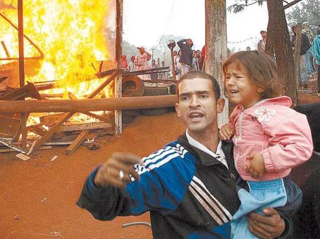

# Resumo

Este artigo estuda duas sobreposições de territorialidades no Estado de
São Paulo. A primeira, extremamente contraditória, consiste no avanço da
cultura sucroalcooleira latifundiária, amparada pelo Estado, por sobre
culturas camponesas de produção de alimentos. Este processo tem como
resultado (histórico) a expropriação contínua do homem do campo,
direcionando-o às grandes cidades. A segunda sobreposição consiste no
encontro deste mesmo território canavieiro com o eixo da reestruturação
produtiva advindo da metrópole, encontro que tem como produto uma
industrialização fundamentada no aumento da produtividade agrícola
monocultora, o que intensifica as forças da territorialização da cana em
detrimento da produção de alimentos por parte de pequenas e médias
propriedades. Ambas as sobreposições, estreitamente relacionadas,
acontecem no município de Ribeirão Preto, cuja periferia recebe as
contradições do processo, expressas pelo alto índice de favelização e
pelas frequentes desocupações. Acusa-se aqui uma dupla deficiência, no
Planejamento Regional e no Planejamento Urbano, em resolver esta
questão.

Palavras-chave: Divisão territorial do trabalho, Planejamento Urbano e
Regional, Relação cidade-campo, Rede Urbana Paulista

# Abstract

This paper studies two overlays of territoriality in the State of São
Paulo. The first, extremely contradictory, is the advancement of
sugarcane culture, supported by the State, overlapping peasant cultures
of food production. It results in continuous expropriation of the
peasant, directing them to the big cities. The second territorial
overlay is about the meeting between the same sugarcane territory with
the axis of industrial restructuring, arising from the metropolis of São
Paulo. This meeting results in the increase of monoculture agricultural
productivity, which intensifies the forces of sugarcane productivity.
Both overlays are closely related and have Ribeirão Preto City as
nuclear region to be studied. On its periphery are given the
contradictions of the process, expressed by the high rate of slums and
frequent removals of poor people. The indictment alleges here a double
deficiency in Regional Planning and Urban Planning in resolving this
issue.

Keywords: Territorial division of labor, Urban and Regional Planning,
urban-rural relationship, São Paulo Urban Network

## Introdução

A urbanização brasileira em curso não pode ser explicada sem pensarmos
as relações socioeconômicas que se dão no campo, na cidade e na
indústria, e nas diversas escalas e tempos em que estes três ramos
produtivos interagem. Dentro do campo das disciplinas territoriais, a
escolha da análise deve atravessar este vasto espaço-tempo e criar um
foco de estudo com o objetivo de trazer subsídios à orientação da

transformação no sentido de um arranjo territorial menos desigual.

> Figura 1 -- Fatores do dinamismo
> (2008) Figura 2 -- Presença de favelas (2008)
>
> Fonte: THÉRY e MELLO, 2008 Fonte: THÉRY e MELLO, 2008

Neste sentido, este texto argumenta que as cidades só serão mais
equilibradas se repensada a inserção das mesmas e de sua região de
influência na economia de modo diverso do que vem ocorrendo. Acusa-se
aqui uma dupla deficiência no Planejamento Regional e Urbano que vem
deixando as rédeas do arranjo territorial e intra-urbano nas mãos de um
mercado simultaneamente calculista e anárquico.

A ideia que aqui se coloca é que não há uma ruptura histórica na
estrutura da rede urbana paulista no que se refere às hierarquias de
domínio nela contidas, de modo que a divisão regional (e nacional) do
trabalho mudou de escala, mas não de conteúdo (SCHIFFER, 2010)1. A
ausência de um planejamento regional que remodele a divisão do trabalho
e lhe dê um *sentido*2 (PRADO JR, 1996) interno é um sintoma de que as
políticas públicas apontam para a concentração do desenvolvimento
industrial na macrometrópole, mais uma vez, reproduzindo uma polarização
que coíbe o desenvolvimento social tanto do que está dentro, quanto do
que está fora desta

centralidade, como veremos adiante através da cartografia crítica de
CUBAS (2012). No que se refere ao espaço intra-urbano paulista, os
grandes projetos urbanos, além de serem realizados centrados em "modelos
de sucesso internacional" e pouco se dirigirem aos espaços de exclusão,
se limitam à metrópole de São Paulo, concentrando investimentos num
espaço de "macrocefalia urbana" típica de países periféricos, no qual
existem locais onde é possível reproduzir a renda da elite

> 1 "Argumenta-se que o processo de constituição do mercado unificado
> brasileiro tenha se dado como requisito para a manutenção da hegemonia
> econômica paulista. Tal processo impôs transformações no território
> nacional, já que direcionou investimentos públicos e privados e exigiu
> a implantação de infraestruturas regionais para romper com os espaços
> fragmentados gerados a partir do período colonial" (SCHIFFER, 2010,
> p.75).
>
> 2 O termo "sentido" é aplicado aqui no seu significado *indicativo,*
> como utilizado por Caio prado Jr. (1996). Argumenta-se que a opção
> pela "comoditização" da economia no Brasil central é um grave entrave,
> desprendendo o pequeno produtor da terra e gerando abismos sociais nas
> cidades.

fundiária e imobiliária sem resultados sociais ou abrangentes (FERREIRA,
2004)3. No que se refere à escala regional, o maior sintoma do
descompromisso com as cidades médias do interior e com a remodelagem da
divisão do trabalho é o fato da própria EMPLASA, empresa pública
responsável pelo planejamento regional paulista,

ter como objeto de atuação, assumidamente, a sua própria definição de
macrometrópole4. A estratégia passa a ser reinserir este espaço
estratégico como competidor na escala nacional e internacional.

Em suma, não há Planejamento Regional no Estado de São Paulo que vise um
desenvolvimento equilibrado entre as cidades, e os planos urbanos se
limitam a lugares estratégicos da metrópole, em benefício de certa elite
e em detrimento de grande contingente populacional. Conforme demonstram
os mapas acima (Fig. 1 e 2), no Brasil, desenvolvimento é sinônimo de
desigualdade social.

**Os múltiplos territórios dentro de um território múltiplo (unidade e
contradição)** O Estado de São Paulo é um território múltiplo no qual
existem frações do espaço com certa hegemonia interna, ou seja,
(sub)territórios cuja manutenção, quando dentro de uma lógica
capitalista guiada pelo aumento de lucros e diminuição dos gastos,
depende de sua dinâmica interna e relacional, o que significa, muitas
vezes, expansão espacial.

Deste modo, dentro do Estado de São Paulo, existem movimentos de
sobreposição territorial que podem gerar lutas de resistência, caso haja
incompatibilidade entre as relações de produção em disputa, ou não, caso
haja compatibilidade. A territorialização seria então o processo de
homogeneização de certa qualidade, no nosso caso, da produção
sucroalcooleira. Esta homogeneização supera os conflitos da
territorialidade pretérita através da força física e/ou simbolicamente,
através da construção de um discurso.

O que deve ficar claro deste embasamento teórico-metodológico5 é que
certa população desterritorializada deve, necessariamente, se
re-territorializar onde possível. Este é o movimento dos múltiplos
territórios dentro de um território múltiplo, o que HAESBAERT (2010)
chamou de movimento cíclico de des-re-

territorialização.

Neste texto, tenta-se argumentar que a des-re-territorialização do
campesinato6 paulista é um processo que tem na dupla-ausência
Planejamento Urbano-Regional uma de suas maiores causas. Isto porque a
desterritorialização do pequeno produtor causada pelo avanço
agroindustrial é necessariamente sua re-territorialização precária e
temporária nas periferias das cidades ou mesmo no campo à volta de
cidades mais distantes, onde possível. Importante perceber a
impossibilidade de grande parte da população em habitar o campo *e* a
cidade e a ineficácia e passividade do Estado em

> 3 "\[\...\] em São Paulo, verifica-se historicamente um significativo
> favorecimento ao vetor sudoeste na aplicação dos investimentos
> públicos em infraestrutura urbana, privilegiando as elites em seu
> deslocamento pela cidade, e promovendo uma importante valorização
> fundiária e imobiliária, cuja rentabilidade é evidentemente apropriada
> por estas mesmas elites" (FERREIRA, 2004, p.16).
>
> 4 "A EMPLASA é a empresa de planejamento do Estado de São Paulo com
> atuação nas unidades
>
> regionais instituídas \[\...\] focada no território da Macrometrópole
> Paulista. \[\...\] São 173 municípios que concentravam, em 2010, 73,3%
> do total da população paulista, 83,4% do Produto Interno Bruto (PIB)
> estadual e 27,6% do PIB brasileiro"
> ([[www.emplasa.sp.gov.br]{.ul}](http://www.emplasa.sp.gov.br/) -
> acesso em 10/1/2014).
>
> 5 Trata-se de uma visão histórico-geográfica baseada nas ideias de
> HAESBAERT (2010), que coloca como escala de análise principal as
> territorialidades escolhidas conforme o objetivo da pesquisa, ideia
> que pode adentrar o universo do materialismo histórico se articulada
> com o conceito de hegemonia desenvolvida por GRAMSCI (2008).
>
> 6 "\[\...\] a expansão do modo capitalista de produção no campo se dá
> primeiro e fundamentalmente pela
>
> sujeição da renda da terra ao capital, quer comprando a terra para
> explorar ou vender, quer subordinando a produção do tipo camponês"
> (OLIVEIRA, 2010, p.8).

resolver esta questão. Trata-se do processo de urbanização crítica, em
que não há urbano para todos (DAMIANI, 2000)7.

O processo majoritário em andamento no campo paulista hoje é a
territorialização da cana-de-açúcar, mantido por forças hegemônicas que,
para desterritorializar o pequeno produtor, envolve a formação de
cartéis (pequenos produtores são obrigados a entregar sua produção para
uma só usina e receber pela matéria-prima o que ela determina) amparados
pela ideologia-mito do Etanol como combustível "sustentável" elaborada
pelo Estado na sua relação com as elites rurais.

## A comoditização da economia brasileira e o aumento da pobreza

Para demonstrar este processo de sobreposição cartograficamente,
revelando a eficácia da estratégia das diversas esferas do Poder Público
em tornar a agroexportação no Brasil cada vez mais forte, vale aqui uma
breve síntese da pesquisa "São Paulo agrário: representações das
disputas territoriais entre camponeses e ruralistas de 1988 a 2009"
(CUBAS, 2012).

Os mapas abaixo expressam o avanço territorial no sentido sudoeste da
cana-de- açúcar, o que exigiu a conquista de territórios que pertenciam
a outras culturas e em determinado momento até outras lógicas de
produção. Este território avança, principalmente, sobre as culturas do
arroz, do feijão, da laranja e do milho (CUBAS, 2012, p. 205).

1990 1992 1996

2000 2004 2008

> Figura 3 - Lavoura temporária da cana em hectares (CUBAS, 2012).
>
> 7 "Considerando-se os limites da inserção, no mercado de trabalho, da
> força de trabalho disponível nas grandes cidades; considerando-se,
> também, como fundamento e base de desenvolvimento das cidades, como
> corpo citadino ou na sua materialidade, a propriedade da terra
> capitalizada, que sustenta um amplo campo de negócios urbanos, a
> urbanização em nosso país é crítica. \[\...\] O que é a urbanização
> crítica? É a impossibilidade do urbano para todos, a não ser que se
> transformem radicalmente as bases da produção e da reprodução sociais"
> (DAMIANI, 2000, p.30).

1990 1992 1996

2000 2004 2008

> Figura 4 - Lavoura de laranja em toneladas (CUBAS, 2012).

A cultura da laranja, que anteriormente proporcionava a reprodução do
pequeno produtor, perdeu investimentos em função da prioridade dada pelo
Estado à cana. Esta cultura hoje mantém alguns territórios, como na Alta
Mogiana, mas está marcada pela presença da Cultrale, uma das maiores
agroindústrias de suco de laranja no mundo. As famílias camponesas,
desde a década de 1980, vêm sendo descapitalizadas e
desterritorializadas da terra. O domínio econômico por parte de grandes
empresas significa território perdido para os próprios camponeses
citricultores. Configura-se, deste modo, uma pressão para suprimir o
citricultor familiar pequeno e médio, por meio de uma política dirigida
pelo agronegócio da laranja. Apenas na década de 1990 o número de
citricultores diminuiu em quase dois terços (CUBAS, 2012, p.209).

O avanço da cana-de-açúcar também diminuiu e concentrou nas mãos de
poucas empresas as culturas do arroz e do feijão. Os mapas abaixo
demonstram em que medida a cultura do pequeno e médio produtor foi
desaparecendo do mundo rural paulista em benefício no avanço da
monocultura.

1990 1992 1996

2000 2004 2008

> Figura 5 - Lavoura de arroz em toneladas (CUBAS, 2012).

1990 1992 1996

2000
2004 2008

> Figura 6 - Lavoura de feijão em toneladas (CUBAS, 2012).

Desta forma, não é difícil constatar que a elite rural paulista não está
preocupada em preservar a sociobiodiversidade e muito menos a segurança
e soberania alimentar. Neste sentido, tem lançado e legitimado conceitos
frágeis como o da sustentabilidade do álcool como combustível de maneira
a convencer à sociedade que apoiem seus projetos. Neste processo de
desterritorialização, houve um acirramento do abismo social e da
intensidade da pobreza, na medida em que a população desprendida do
território (seja do entorno, seja de áreas distantes) não encontra nas
cidades meios de vida suficientes para sua reprodução digna. Em
contraposição à medição do IDH apresentada pelo governo, que aponta que
a renda per capta e o acesso ao ensino e à saúde pública melhoraram, a
pobreza e a concentração de renda se elevaram, como demonstra o mapa
abaixo (CUBAS, 2012, p. 185).

> Figura 7 -- Espacialização da
> pobreza no Estado de São Paulo (CUBAS, 2012).

Deve-se observar que no entorno da cidade de Ribeirão Preto, principal
polo da região da cana-de-açúcar, o índice de pobreza é extremamente
elevado. Numa análise que envolve a relação cidade-campo-indústria, é
preciso ter esta informação em mente para, mais adiante, verticalizar o
estudo sobre a produção do espaço intra-urbano e a ausência de projetos
urbanos nesta cidade. Mas, primeiramente, é preciso compreender outra
territorialização no território paulista.

## A reestruturação produtiva relativa

Ao mesmo tempo em que se territorializa a cultura da cana-de-açúcar no
sentido nordeste -- sudoeste do ESP (ver fig. 3), principalmente a
partir da Região de Ribeirão Preto (epicentro), vê-se outro processo em
curso nas últimas décadas no sentido norte: a reestruturação produtiva
ou desconcentração industrial. Existiria um limite a esta

expansão das indústrias? O modo de se inserir da região de Ribeirão
Preto, como território predominantemente agroindustrial, seria inibidor
do avanço das indústrias neste sentido? Sim e não. A industrialização
nesta região adquire conexões estreitas com a agroindústria, de modo que
seus vínculos produtivos com a produção da cana são diretos e indiretos.
A especialidade no entorno de Ribeirão Preto em produzir maquinário e
equipamentos de transporte (setor metal-mecânico) necessários à
intensificação produtiva canavieira revela um fenômeno de sobreposição
de territórios sem antagonismo, sem conflito.

Isto significa que a divisão regional do trabalho se intensifica (e não
se modifica) à medida que a própria reestruturação produtiva avança por
sobre territórios agrícolas, transformada. Neste sentido, é possível
dizer que não há mudança de conteúdo na forma como se insere Ribeirão
Preto na economia regional, como cidade fundamental para o aumento da
produtividade agrícola monocultora, latifundiária, conservadora, bem
como nos tempos do café.

O argumento aqui explícito é o de que esta reestruturação é relativa,
primeiro porque, como lembra LENCIONI (1994), a desconcentração não vem
acompanhada por uma descentralização do poder e das submissões
interurbanas: as sedes, as decisões, e o trecho final e mais lucrativo
do circuito nacional do capital ainda estão concentrados na metrópole.
Segundo porque, como lembra (NOBRE, 2007, p.4):

> \[\...\] a desconcentração das atividades industriais não foi
> uniforme, mas ocorreu de forma espraiada, num raio de 150 km da
> capital, seguindo os principais eixos rodoviários em direção às
> regiões de Campinas, São José dos Campos e Sorocaba, construindo uma
> desconcentração concentrada.

Portanto, ao falar de desconcentração industrial deve-se ter em mente
três fatores que interagem: a) a simultânea centralização deste processo
em termos de poder; b) a escala em que se dá esta desconcentração para
identificar sua própria concentração; e

c\) que este processo invade e coaduna com o próprio meio agrícola,
fundindo ramos produtivos num mesmo território.

## A inserção da Região Administrativa de Ribeirão Preto na economia regional

A R.A. de Ribeirão Preto é composta por 25 municípios e ocupa 3,8% do
território paulista. As usinas processadoras de cana-de-açúcar
representam a principal atividade industrial da região e acabam
estimulando o desenvolvimento de outros setores, como o químico
(fertilizantes) e o das máquinas agrícolas e equipamentos para usinas
(EMPLASA, 2012, p.12).

É preciso reconhecer ainda, que na cidade de Ribeirão Preto formou-se um
importante cluster de produtos e equipamentos médicos, hospitalares e
odontológicos, devido à presença de instituições de ensino da área de
ciências biomédicas de alto padrão científico. Mas a própria EMPLASA
oferece uma descrição da economia da região, reconhecendo que seus
principais ramos e arranjos produtivos estão mesmo vinculados à
territorialização da cana:

> Em função do agronegócio da cana-de-açúcar, os municípios acabam se
> integrando, interagindo e criando interdependências, especialmente com
> o polo de Ribeirão Preto, que desempenha as funções terciárias
> ausentes em grande parte dos primeiros. As lavouras, usinas e
> destilarias encontram-se, em sua maioria, nos municípios do entorno de
> Ribeirão Preto que, por sua vez, lhes fornece uma rede de serviços e
> de comercio primordial ao funcionamento da economia regional. Desse
> modo, o dinamismo de Ribeirão Preto é dependente do desenvolvimento
> das atividades econômicas dos municípios de sua área de influência e
> vice-versa. \[\...\] O setor de serviços também se beneficia com a
> atividade agroindustrial, a exemplo da Agrishow, uma das principais
> feiras nacionais e internacionais de produtos voltados para a
> agropecuária e agroindústria (EMPLASA, 2012, p.11-13).

## Algumas considerações sobre o espaço intra-urbano de Ribeirão Preto

É verdade que o contingente desprendido não se re-territorializa
necessariamente nas cidades mais próximas de seu antigo território
(embora isto seja frequente numa primeira desterritorialização) o
processo migratório é constante e contínuo por parte destas pessoas e
envolve trocas entre todo o território nacional, principalmente entre o
nordeste e o Estado de São Paulo. No entanto, independente da origem da
população da periferia (mesmo porque e expropriação do homem no campo é
um processo generalizado pelo país), o que se constata no processo
urbanização de Ribeirão Preto são duas formas principais de produção do
espaço: a) as favelas, nos lugares de menor acessibilidade e piores
condições infraestruturais, com contingente atraído também pelo
aquecimento do mercado de construção civil; e b) os próprios loteamentos
fechados de médio e alto padrão nas periferias de melhor acesso ao
centro. Estas duas tipologias são repelentes espacial e ideologicamente
entre si, o que faz surgir territorializações claras e evidentes na
escala intra-urbana, mas dependentes no que se refere às relações de
produção do espaço, muito embora a elite conservadora da cidade tenha
isto em seu campo cego.

## As favelas em Ribeirão Preto

Em Ribeirão Preto encontram-se hoje, cerca de 40 favelas e 25 mil
pessoas habitando- as, e este quadro vem se agravando a cada dia. O que
impressiona é a velocidade em que se multiplicam tais assentamentos.
Dados de 1990, disponíveis na SEPLAN-RP, apontavam dezessete núcleos de
favela, que juntos somavam 1.884 barracos e uma população estimada de
5.575 habitantes. Num período de dezoito anos, dobrou o número de
núcleos de favelas e praticamente quadriplicou o número de barracos e a
população ali residente (MIGLIORINI, 2009).

Muitos moradores são atraídos do Maranhão e do Piauí, em busca de
trabalho no setor da construção civil, principalmente de condomínios
fechados, e nos serviços de segurança, limpeza e etc. destes mesmos
condomínios. Outros são sem terras paulistas, expropriados do campo
regional.

> 
>
> Figura 8 -- Localização dos núcleos de favelas de Ribeirão Preto
> Fonte: Plano Local de Habitação de Ribeirão Preto (PLHIS) - 2010

Segundo MIGLIORINI (2009), o Município de Ribeirão Preto nunca contou
com uma Secretaria da Habitação, assunto cujas atribuições sempre
ficaram na responsabilidade da Companhia Regional de Habitação de
Ribeirão Preto (COHAB-RP), que vem implantando um "projeto" denominado
"erradicação de favelas", através do qual vem tentando desapropriar,
muitas vezes violentamente, as diversas ocupações pela cidade. Em Julho
de 2011, com o uso da cavalaria, de balas de borracha e de bombas de
efeito moral, a Polícia Militar expulsou mais de 200 famílias de uma
área particular, no Jardim Aeroporto, Zona Norte da cidade. Os barracos
foram incendiados e postos a baixo, e as violentas imagens transmitidas
pela mídia chocaram a população brasileira.

> 
>
> Figuras 9 e 10 -- Desapropriação da favela do jardim do Aeroporto em
> Julho de 2011 Fonte:
> [[http://novoaeroportoribeiraopreto.blogspot.com.br/2012_02_01_archive.html]{.ul}](http://novoaeroportoribeiraopreto.blogspot.com.br/2012_02_01_archive.html)

De acordo com MIGLIORINI (2009), encontram-se em desenvolvimento na
cidade apenas dois projetos destinados à regularização de núcleos de
favelas -- o do complexo Aeroporto/da Mata e o de Monte Alegre. O
primeiro é fruto da internacionalização do Aeroporto Leite Lopes, e se
vale dos efeitos negativos da sua proximidade para mais uma vez optar
pela remoção. O segundo é fruto da mobilização da comunidade local, que
se aproveitou dos debates decorrentes do caso Aeroporto para alavancar o
primeiro processo de urbanização de favelas que deverá ser implantado na
cidade.

Alguns conjuntos habitacionais foram construídos nos últimos anos pela
CDHU. A foto abaixo, retirada do próprio Portal do Governo do Estado de
São Paulo, demonstra a característica dos projetos habitacionais que vem
sendo construídos com orgulho pelo Estado na cidade.

> 
>
> Figura 11 - Conjuntos habitacionais da CDHU, construídos em 2002, em
> Ribeirão Preto.
>
> Fonte:
> <http://fotografia.folha.uol.com.br/galerias/5985-problemas-em-casas-populares-de-ribeirao-preto>

## Loteamentos fechados em Ribeirão Preto

O fenômeno da suburbanização ocorrido nos EUA após 1945 está em plena
evolução nos dias de hoje no Brasil, mais especificamente no Estado de
São Paulo. Aquilo que se mostra hoje como o maior desafio para diversos
urbanistas norte-americanos, qual seja, reverter o processo de
suburbanização, está ocorrendo hoje no entorno das cidades brasileiras
desenfreadamente. O preço baixo das terras rurais disponíveis ainda não
loteadas combinado com o porte das cidades que ainda não inviabiliza os
deslocamentos são as principais causas específicas da produção deste
tipo de espaço nas cidades de médio porte (SPOSITO, 2006). Combina-se a
isso, a forte ideologia promovida pelas propagandas imobiliárias de
repúdio às cidades, do "viver no campo", que todo ano convencem milhares
de pessoas a se mudar do centro para a nova periferia.

> 
>
> Figura 12 -- Municípios com mais lançamentos de condomínios fechados
> em 2012
>
> Fonte: Folha de São Paulo -
> [http://classificados.folha.uol.com.br/infograficos/2013/04/01-municipios-com-mais-](http://classificados.folha.uol.com.br/infograficos/2013/04/01-municipios-com-mais-lancamentos-em-2012.shtml)
> [lancamentos-em-2012.shtml](http://classificados.folha.uol.com.br/infograficos/2013/04/01-municipios-com-mais-lancamentos-em-2012.shtml)
> (acessado em 11/1/2014).

A construção de condomínios fechados em cidades do interior paulista
remonta em alguns casos à década de 1970, mas a análise do ritmo de
implantação dá indícios de que o fenômeno se tornou mais forte a partir
dos anos 1990. No entanto, é preciso compreender que esta nova dinâmica
redefine a morfologia urbana quando se articula com outras dinâmicas,
como a produção de shopping centers e a própria vinda das funções
urbanas essenciais, que transformam a paisagem em conjunto com os
loteamentos. Já é sabido que este modo de produção do espaço é
extremamente segregador, e que define descontinuidades territoriais
evidentes em relação ao conjunto da cidade. Os muros impedem a
permeabilidade urbana, de modo que é preciso contorná-los para ir de um
ponto ao outro da cidade (SPOSITO, 2006). Além disso, o uso
monofuncional do solo, estritamente residencial, e o isolamento em
relação à cidade implicam o uso do automóvel para o deslocamento diário
para quase todas atividades.

## Considerações finais

Procurou-se, neste texto, demonstrar que o desenvolvimento regional vem
sendo orientado pela comoditização do "oeste paulista" em benefício de
grandes empresas sucroalcooleiras, processo que vem gerando, como em
outros momentos da história, inúmeros problemas sociais e territoriais
vinculados à impossibilidade da reprodução social do homem no campo.

Enquanto isso, o planejamento estatal regional se volta à
macrometrópole, preocupado em aumentar a competitividade deste
território estratégico da reestruturação produtiva no mercado nacional e
internacional.

O encontro dos movimentos de territorialização da cana e da
desconcentração industrial não é de modo algum contraditório ou
antagônico. Ele dá origem a uma

industrialização fundamentada no aumento da produtividade agrícola,
servindo à reprodução intensificada da monocultura da cana. A divisão
regional do trabalho, deste modo, se acirra, e não é possível falar de
novos modos de inserção de certas cidades na divisão do trabalho.
Ribeirão Preto repete sua condição hierárquica na rede urbana regional,
similarmente à sua posição de "eldorado do café" em fins do séc. XIX.

# Referências bibliográficas

> CUBAS, T. E. A. *São Paulo agrário: representações da disputa
> territorial entre camponeses e ruralistas de 1998 a 2009.* Dissertação
> de mestrado, UNESP, 2012.

DAMIANI, A. L. A metrópole e a indústria: reflexões sobre uma
urbanização crítica.

> *Revista Terra Livre*. São Paulo, n.15, p.21-37, 2000.
>
> EMPLASA. *Caracterização socioeconômica de São Paulo -- Região
> Administrativa de Ribeirão Preto.* Secretaria de Planejamento e
> Desenvolvimento Regional do Governo do Estado de São Paulo, 2012.
>
> FERREIRA, J. S. W. O mito da cidade global: o papel da ideologia na
> produção do espaço terciário em São Paulo. *Revista do Programa de
> Pós-Graduação em Arquitetura e Urbanismo da FAUUSP.* São Paulo, n.16,
> p.26-49, 2004.
>
> GRAMSCI, A. *EL risorgimiento.* Buenos Aires: Las quarenta, 2008.
>
> HAESBAERT, R. *O mito da desterritorialização: do "fim dos
> territórios" à multi- territorialidade.* Rio de Janeiro: Bertrand
> Brasil, 2010.

LENCIONI, S. Reestruturação urbano-industrial no estado de São Paulo: a
região da metrópole desconcentrada*. Revista Espaço e Debates*. São
Paulo: n. 38, p. 54-61, 1994.

> MIGLIORINI, V. L. B. Indicadores de vulnerabilidade sócio-ambiental
> das favelas de Ribeirão Preto como subsídio para processos de
> regularização fundiária. *Anais do VIII encontro da sociedade
> brasileira de economia ecológica*. Cuiabá, 2009.
>
> NOBRE, E. *Impactos da globalização econômica no complexo
> metropolitano expandido de São Paulo: possibilidades de ação.*
> Disponível em:

\<[http://www.usp.br/fau/docentes/depprojeto/e_nobre/impactos.pdf\>](http://www.usp.br/fau/docentes/depprojeto/e_nobre/impactos.pdf).
Acesso em: 11/01/2014.

> OLIVEIRA, A. U. Agricultura e indústria no Brasil. *Campo-território:
> revista de geografia agrária*, v.5, n.10, p. 5-64, ago. 2010.
>
> PRADO JR., C. *Formação do Brasil Contemporâneo*. Brasília: Editora
> Brasiliense, 1996.

SCHIFFER, S. R. São Paulo como polo dominante do mercado unificado
nacional. In: DEAK, C.; SCHIFFER, S. R. (Orgs.). *O processo de
urbanização no Brasil.* São Paulo: Edusp, p. 73 -- 110, 2010.

SPÓSITO, M. E. B. Loteamentos fechados em cidades médias paulistas*.*
In**:** SPOSITO, E.; SPOSITO M. E. B; SOBARZO, O. (Orgs.). *Cidades
médias --*

> *produção do espaço urbano e regional.* São Paulo: Expressão popular,
> 2006.
>
> THÉRY, H.; MELLO, N. A. *Atlas do Brasil - disparidades e dinâmicas do
> território*. São Paulo: EDUSP, 2008.
