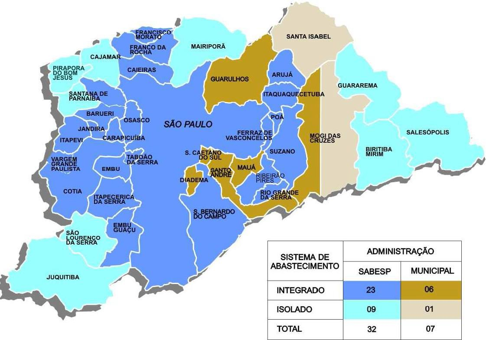
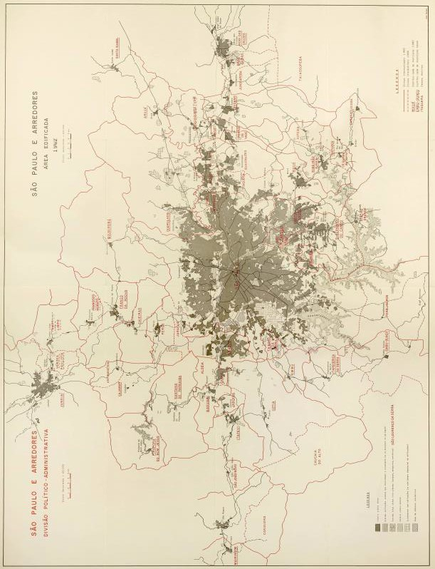

# Resumo

Este artigo apresenta a história institucional do saneamento na Grande
São Paulo a partir de 1875, discutindo a sucessão de seus entes
prestadores e de seus objetivos institucionais face às necessidades da
população nos períodos da pré-metropolização, início da metropolização e
da grande metropolização, conforme conceito de Langenbuch. Os serviços
de saneamento do Estado de São Paulo passaram por mudanças para se
adequar a explosão urbana da Grande São Paulo, tendo acumulado
experiência técnica, operacional, administrativa e equilíbrio
intergovernamental entre Estado São Paulo e Municípios e, juridicamente,
em sintonia com o princípio da predominância de interesse local para os
municípios e regional para o estado. Este arranjo institucional é o que
denominamos de trajetória perdida, pois, tal nível de cooperação e
integração federativa entre municípios e estados nem sequer está no
horizonte próximo. Isto porque a criação da SABESP, em 1973, dentro do
marco institucional do PLANASA, estabelece uma relação de concorrência
entre a Companhia Estadual e os serviços municipais, promovendo os
inevitáveis conflitos judiciais. Este artigo visa lançar luz sobre uma
experiência de cooperação e integração federativa na Grande São Paulo, a
fim de contribuir para o debate que perdurará por mais algumas décadas
sobre uma institucionalidade metropolitana que respeite a autonomia
municipal.

**Palavras-chave:** história institucional, região metropolitana de são
paulo, saneamento, relações intergovenamentais

# Abstract

This article presents the institutional history of sanitation in Greater
São Paulo Region from 1875, discussing the succession of their entities
and of its institutional objectives in relation to the needs of the
population in the periods of pre-metropolisation, the beginning of
metropolisation and the large metropolisation as Langenbuch concept .
Sanitation services in the State of São Paulo underwent changes to suit
the urban explosion of Greater São Paulo , having accumulated technical,
operational , administrative experience and intergovernmental balance
between São Paulo State and municipalities and , legally , in line with
the principle of predominance of local interest to municipalities and
regional to the state. This institutional arrangement is what we call
lost trajectory therefore such a level of cooperation and integration
between federal states and municipalities is not even on the near
horizon . This is because the creation of SABESP in 1973 , within the
institutional framework of PLANASA establishes a competitive
relationship between this Company and municipal services , promoting the
inevitable legal disputes . This article aims to shed light on an past
experience of cooperation and federative integration in Greater São
Paulo in order to contribute to the debate that will last for a few more
decades on a metropolitan institutions respecting municipal autonomy

**Keywords:** institutional history, metropolitan region of São Paulo,
sanitation and intergovernamental relations

# Introdução

O presente artigo foi elaborado com dupla finalidade: a primeira é a de
cumprir exigência da disciplina de Planejamento e Urbanismo Regional do
Programa de Pós-Graduação em Planejamento e Gestão do Território da
Universidade Federal do ABC do último quadrimestre de 2013; a segunda
finalidade está sendo a de submetê-lo ao XIII Seminário de História da
Cidade e do Urbanismo, que, nesta edição tem por tema "Tempos e Escalas
da Cidade e do Urbanismo". Entre tantas dimensões em que foi
desenvolvida a disciplina "Planejamento e Urbanismo Regional", as de
*tempo* e de *escala* são destacadas na presente discussão que tem por
objetivo reconstituir a história das trajetórias institucionais dos
serviços de saneamento na Região Metropolitana de São Paulo -- RMSP,
particularmente dos órgãos pertencentes ao Estado de São Paulo e de
forma geral dos órgãos municipais.

Por isto, o presente trabalho se encontra na área temática *Território*,
conforme temário do XIII Seminário de História da Cidade e do Urbanismo.
Esta análise se detém nos documentos legais que instituíram os serviços
de saneamento na RMSP, a partir dos quais buscamos compreender um fio
condutor das razões que fundamentaram as mudanças institucionais entre o
final do século XIX e a década de 1970. Este artigo se apropria do
território da RMSP, como espaço articulador das decisões políticas no
setor de saneamento e dos entes prestadores, frente a impossível tarefa
dos mesmos possibilitarem a universalidade dos serviços de abastecimento
de água potável e de esgotamento sanitário, em razão do vertiginoso
processo de expansão urbana que passou a Grande São Paulo.

Buscamos compreender a histórica do saneamento na RMSP a partir da
periodização elaborada por Langenbuch (1971) em sua obra *A Estruturação
da Grande São Paulo* que nos serviu de base crítica para analisar as
institucionalidades dos órgãos prestadores de serviços de saneamento e
seus princípios jurídicos. O trabalho se desenvolve em dois itens que
buscam reconstituir a história destas instituições a partir da resposta
às seguintes perguntas: como as institucionalidades dos prestadores se
modificaram face à necessidade de expansão dos serviços? Como se
estabeleceram as relações intergovernamentais entre os prestadores
municipais e estaduais?

A reconstituição histórica das instituições de saneamento da RMSP
demonstra que as relações intergovernamentais entre municípios e governo
do Estado de São Paulo abandonou trajetórias de efetiva cooperação
federativa que respeitavam a autonomia dos municípios na prestação dos
serviços de saneamento local e, de outro lado, respeitava o poder
político do Estado de São Paulo em articular e promover políticas de
interesse regional. O abandono desta trajetória provocou inevitáveis
conflitos judiciais entre os prestadores municipais e do Estado, assim
como a judicialização do autonomia municipal do saneamento nas Ações
Diretas de Incontitucionalidade -- ADIs 1827-RJ e 2077-BA.

# A prestação dos serviços de saneamento nas fases da pré-metropolização e início da metropolização da Grande São Paulo

A Região Metropolitana de São Paulo -- RMSP representa um caso
emblemático de crescimento urbano vertiginoso dos países em
desenvolvimento. Na década de 1940, contava com 1,5 milhão de
habitantes; em 1980, com 12,5 milhões de habitantes; e em 2010, com 19,6
milhões de habitantes (ver tabela completa)1. Todas as políticas
públicas, mas

principalmente os serviços de saneamento e as políticas de habitação,
foram disponibilizadas à população de migrantes (principalmente da
região nordeste do país) e de imigrantes dentro de um processo de
conflito social (LANGENBUCH, 1971; JACOBI, 1987).

> 1 (fonte IBGE,
> <http://smdu.prefeitura.sp.gov.br/historico_demografico/tabelas/pop_brasil.php>)
>
> Tabela 1 - População nos Anos de Levantamento Censitário -- Município,
> RMSP, Estado de São Paulo e Brasil - 1872 a 2010

## An os

# *An*
>
> Fonte: Município de São Pulo, *apud* IBGE e Censos Demográficos

(1) Taxa de Crescimento Geométrico Anual

A rápida expansão urbana provocou a pressão por serviços públicos que
viessem a ser realizados por uma administração local, o que era
constitucionalmente possível em virtude da Constituição de 1946 ter
sido fortemente influenciada pelo movimento municipalista2. Langenbuch
(1971) constata o dilema entre a pulverização de administrações locais
em oposição à ausência de uma capacidade político-administrativa
metropolitana:

De um modo geral, os subúrbios que se têm emancipado passaram a
conhecer alguns melhoramentos públicos, com os quais não contavam
antes\... Os exemplos se sucedem: obras de iluminação pública,
sarjeteamento, calçamento, construção de instalações sanitárias
públicas, são realizadas na maioria dos subúrbios que nas últimas
décadas se emanciparam. Enquanto isto, os subúrbios integrantes do
município de São Paulo apenas nos últimos anos têm recebido certa
atenção da respectiva prefeitura.

Pelo que foi exposto, torna-se nítido que a grande subdivisão
político- administrativa tem sido conveniente para a implantação de
melhoramentos de cunho local. Contudo para obras de cunho regional,
que interessem ao conjunto da Grande São Paulo o fato tem sido nocivo
(LANGENBUCH, 1971, p. 232-233).

O que importa salientar deste dilema, para fins deste artigo, é que a
situação exigia tomada de decisão para enfrentar os descompassos entre
a forte expansão urbana e a disponibilização de políticas públicas, o
que foi realizado tanto pelos municípios da RMSP quanto pelo Estado de
São Paulo. Particularmente, no âmbito do saneamento, o Estado de São
Paulo, sempre focou atuação na capital, como se constata dos próprios
textos normativos de criação: o Decreto n. 152-D, de 31 de janeiro de
1893, e o Decreto n. 154, de 8 de fevereiro de 1893.

Por estes atos, o então presidente do Estado de São Paulo criou a
Repartição de Água e Esgoto -- RAE, como órgão vinculado a
Superintendência de Obras Públicas da Secretaria de Estado dos
Negócios da Agricultura, Comércio e Obras Publicas (art. 1º do Decreto
n. 152- D/1893).

A RAE foi o órgão criado em virtude da encampação dos contratos
celebrados em 9 de outubro de 1875 e de 7 de abril de 1877 com a
Companhia Cantareira e Esgotos, que confessou a impossibilidade de
realizar as obras contratadas (arts. 1º, 2º e 6º da Lei n. 62, de 17
de agosto de 1892). Constata-se a primeira oposição relativa à
prestação dos serviços de saneamento na Capital no próprio texto da
norma de encampação. Pelo art. 7º, "uma vez

2\. A proliferação de administrações municipais, de um lado, e a
constituição de modelo autoritário e tecnocrático de gestão das RMs
pela Carta Outorgada de 1967, de outro, revelam duas linhas
institucionais em antítese, inclusive porque suas bases de valores
também estão em oposição (ver Souza, 2005).

encampada a companhia e realizadas as obras do novo abastecimento, o
Governo transferirá à intendência municipal da capital sob cuja
administração ficará confiado o serviço". Da perspectiva da história
institucional do saneamento, é necessário compreender por que a cidade
de São Paulo sempre foi gerida por órgão da administração estadual?
Afinal, qual é o poder concedente dos serviços de saneamento: estado ou
município? De fato, a concessão e a encampação se deram pela Província
do Estado de São Paulo e pelo Estado de São Paulo respectivamente. De
direito, a concessão e encampação seguiu uma fundamentação jurídica
razoável: se foi o ente estadual a realizar a concessão, também deverá
ser o mesmo ente a realizar encampação, com ressalva que caberia também
realizar os investimentos iniciais de abastecimento e transferir a
estrutura operacional à municipalidade. É fundamental uma discussão
jurídica sobre este ponto, mas se o fizermos perderíamos o foco da
história institucional dos serviços de saneamento3.

Os primeiros anos da Republica Velha coincidem com a encampação dos
serviços prestados pela iniciativa privada que não responde ao
enfrentamento das epidemias e à vultuosidade dos investimentos
necessários à implantação da infraestrutura de saneamento, como um dos
objetivos dos governos republicanos para a modernização das principais
cidades do país. Segundo Reis (1994), as reformas urbanísticas entre
1870 e 1920 no Rio de Janeiro e em São Paulo tiveram uma simetria de
processos:

> os centros das cidades passaram por reformas amplas e programas de
> renovação urbana, que lhes puderam conferir uma nova imagem, capaz de
> representar um símbolo de rejeição ao passado recente, regime
> monárquico e de escravidão. Mas os programas de renovação urbana eram
> também, por isso mesmo, uma tentativa de afastar a imagem de pobreza,
> de miséria\... A negação da escravidão se confundiu com a segregação,
> com o afastamento dos negros, para fora dos espaços que passavam a ser
> destinados apenas aos brancos, reservados para a convivência das
> camadas dominantes, nos quais os grupos mais restritos desempenhavam
> os papeis de comando político do país\... Tudo o que não
> correspondesse aos padrões urbanísticos e arquitetônicos adotados em
> Paris, a partir de Haussmann, tendia a ser destruído, como símbolo do
> atraso (1994, p. 13-15)4.

As transformações das principais cidades do país não aconteceriam, no
setor do saneamento, com as companhias privadas, razão pela qual, no
caso de São Paulo, a RAE é criada. Como órgão da administração direta,
não possuía autonomia suficiente para gerir os serviços sem a
interferência de outros órgãos da administração. Desta maneira,
investimentos em obras e ampliação de pessoal para acompanhar a explosão
urbana ficavam dependentes de decisão que perpassava o conjunto do
governo estadual. A partir dos textos do engenheiro Plinio

> 3\. A resposta a esta pergunta não se circunscreve apenas ao campo do
> direito, porque o direito fixa determinada ordem em determinado tempo,
> mas as relações políticas, não. É justamente num processo de ampliação
> da autonomia municipal que a história da federação brasileira
> caminhará.
>
> 4\. Este processo acontece nas cidades de Porto Alegre (DMAE, s/d),
> Rio de Janeiro (MOTA, 2011) e Salvador (COSTA, 2012). A única capital
> que não é operada da por companhia estadual é Porto Alegre que possui
> autarquia municipal, o Departamento Municipal de Água e Esgoto --
> DMAE, criado pela Lei 2.312, de 15
>
> de dezembro de 1944. Conforme informações do município de Porto
> Alegre, "entre 1861 e 1944, Porto Alegre contou com dois sistemas de
> fornecimento de água. A Hidráulica Porto-alegrense (que explorou os
> serviços de água encanada entre 1866 e 1944) e a Companhia Hydraulica
> Guahybense, responsável pela coleta e distribuição de água à população
> de 1861 a 1904, ano em que foi estatizada como Secção de Abastecimento
> de Água (mais tarde rebatizada de Secção da Hydráulica Municipal)"
> (PORTO ALEGRE, s/d). Até essa época, na área de saneamento,
> praticamente não havia avanços, tendo sido os serviços prestados pela
> administração direta a partir de 1904
>
> Whitaker, órgão que a sucederia em 1954, pode-se resgatar esta
> história de transformações institucionais, conforme se constata no
> quadro abaixo (Whitaker, 1952):
>
> Tabela 2 - Evolução de estrutura Administrativa e Pessoal da RAE
> comparativa ao crescimento populacional.

+----------------+----------------+----------------+----------------+
| > **Anos (1)** | > **População  | > **Número de  | > **Número     |
|                | > Estimada da  | >              | > de**         |
|                | > cidade de    | funcionários** | >              |
|                | > São Paulo    |                | > **Seções e   |
|                | > (2)**        |                | > Serviços**   |
+================+================+================+================+
| > **1911**     | > 389.192      | > 68           | > 7            |
| >              | >              | >              | >              |
| > **1931**     | > 910.433      | > 226          | > 9            |
| >              | >              | >              | >              |
| > **1937**     | > 1.214.290    | > 253          | > 10           |
| >              | >              | >              | >              |
| > **1940**     | > 1.326.261    | > 390          | > 12           |
| >              | >              | >              | >              |
| > **1946**     | > 1.797.726    | > 562          | > 15           |
+----------------+----------------+----------------+----------------+

> Fonte: Adaptado de Whitaker (1952b)

(1) Refere-se aos anos em que ocorreram ampliação de pessoal e/ou de
    estrutura administrativa

(2) Aplicada a Taxa de Crescimento Geométrico Anual da Tabela 1.

> Em que pese o salto institucional da prestação dos serviços da
> iniciativa privada para a RAE, a ausência de recuperação dos custos
> operacionais por meio da cobrança dos usuários e a dependência do
> orçamento geral do Estado determinaram um desequilíbrio econômico e
> uma baixa capacidade organizacional. Estes problemas só encontrariam
> um lugar institucional para enfrentamento com a instituição do
> Departamento de Águas e Esgotos - DAE, criado pela Lei nº 2.627, de 20
> de janeiro de 1954, após 11 anos de trabalho político intenso do seu
> primeiro dirigente (WHITAKER, 1952, P. 10 e 11; SACHS, 1982: 37). Além
> disto, a expansão urbana da capital no início do século XX já apontava
> que a institucionalidade da RAE não daria conta de uma gestão
> metropolitana. Em que pese o conjunto de obras que veio a duplicar a
> capacidade de fornecimento de água ao longo da década 1940 (WHITAKER,
> 1952), a existência institucional da RAE estava com os dias contados.
>
> Quadro 1 - Comparativo das estruturas administrativas e das formas de
> arrecadação da RAE e do DAE

+----------------------------------+----------------------------------+
| > **RAE**                        | > **DAE**                        |
| >                                | >                                |
| > **1892 à 1954**                | > **1954 à 1970**                |
+==================================+==================================+
| > **ESTRUTURA ADMINISTRATIVA**   | > **ESTRUTURA ADMINISTRATIVA**   |
| >                                | >                                |
| > Decreto nº 2.082/1911 Art. 2º  | > Lei nº 2.627/1954 Art. 10      |
+----------------------------------+----------------------------------+
| > Directoria                     | > **I** - Gabinete do Diretor    |
| >                                | > Geral                          |
| > Chefe do Expediente ;          |                                  |
| > Escriptorio Technico Secção de | a)  Assistentes                  |
| > Contabilidade                  |                                  |
|                                  | b)  Serviço de Patrimônio e      |
|                                  |     > Arquivo                    |
|                                  |                                  |
|                                  | c)  Secção de Relações Públicas  |
|                                  |                                  |
|                                  | d)  Secção de Expediente e       |
|                                  |     > Protocolo                  |
|                                  |                                  |
|                                  | > **II** - Divisão de Água       |
|                                  |                                  |
|                                  | a)  Secção de Adução             |
|                                  |                                  |
|                                  | b)  Secção de Distribuição       |
+----------------------------------+----------------------------------+

+----------------------------------+----------------------------------+
| > **RAE**                        | > **DAE**                        |
| >                                | >                                |
| > **1892 à 1954**                | > **1954 à 1970**                |
+==================================+==================================+
| > Secção de Aguas                | > **III** - Divisão de           |
| >                                | > Instalações Prediais           |
| > Um Chefe das Officinas; Secção |                                  |
| > de Esgotos                     | a)  Secção de Fiscalização e     |
| >                                |     Instalações Prediais         |
| > Chefe da Usina Elevatoria;     |                                  |
| > Secção de Consumo de Agua      | b)  Secção de Hidrômetros        |
| > Almoxarifado                   |                                  |
|                                  | c)  Secção de Consumo e Tarifas  |
|                                  |                                  |
|                                  | > **IV** - Divisão de Esgôtos    |
|                                  | > Sanitários                     |
|                                  |                                  |
|                                  | a)  Secção de Redes Sanitárias   |
|                                  |                                  |
|                                  | b)  Secção de Emissários e       |
|                                  |     Estações Elevatórias         |
|                                  |                                  |
|                                  | > **V** - Divisão de Tratamento  |
|                                  |                                  |
|                                  | a)  Laboratório Central          |
|                                  |                                  |
|                                  | b)  Secção de Tratamento de Água |
|                                  |                                  |
|                                  | c)  Secção de Tratamento de      |
|                                  |     Esgôtos e Resíduos           |
|                                  |     Industriais                  |
|                                  |                                  |
|                                  | > **VI** - Divisão de            |
|                                  | > Planejamento e Obras           |
|                                  |                                  |
|                                  | a)  Secção de Levantamentos      |
|                                  |                                  |
|                                  | b)  Secção de Projetos           |
|                                  |                                  |
|                                  | c)  Secção de Obras de           |
|                                  |     Abastecimento de Água        |
|                                  |                                  |
|                                  | d)  Secção de Obras e Esgôtos    |
|                                  |                                  |
|                                  | > **VII** - Divisão de Material  |
|                                  |                                  |
|                                  | a)  Secção de Compras            |
|                                  |                                  |
|                                  | b)  **S**ecção de Almoxarifado   |
|                                  |                                  |
|                                  | c)  Secção de Produtos Químicos  |
|                                  |                                  |
|                                  | > **VIII** - Divisão de Serviços |
|                                  | > Auxiliares                     |
|                                  |                                  |
|                                  | a)  Secção de Oficinas           |
|                                  |                                  |
|                                  | b)  Secção de Transporte         |
|                                  |                                  |
|                                  | > **b)** Secção de               |
|                                  | > Telecomunicação                |
|                                  | >                                |
|                                  | > **IX** - Divisão de            |
|                                  | > Contabilidade e Orçamento      |
|                                  |                                  |
|                                  | a)  Secção de Contabilidade      |
|                                  |     Financeira e Orçamento       |
|                                  |                                  |
|                                  | b)  Secção de Contabilidade      |
|                                  |     > Patrimonial                |
|                                  |                                  |
|                                  | c)  Secção de Inspeção,          |
|                                  |     Organização e Contrôle       |
|                                  |                                  |
|                                  | d)  Secção de Contas             |
|                                  |                                  |
|                                  | e)  Secção de Tesouraria         |
|                                  |                                  |
|                                  | > **X** - Divisão de Pessoal     |
|                                  |                                  |
|                                  | a)  Secção de Registro e         |
|                                  |     Cadastro                     |
|                                  |                                  |
|                                  | b)  Secção de Psicotécnica e     |
|                                  |     Ensino Profissional          |
|                                  |                                  |
|                                  | c)  Secção de Serviço Social     |
|                                  |                                  |
|                                  | > **XI** - Procuradoria Judicial |
|                                  | >                                |
|                                  | > **§ 1º** - Em caráter          |
|                                  | > transitório o D.A.E            |
|                                  | > compor-se-á de mais os         |
|                                  | > seguintes órgãos               |
|                                  |                                  |
|                                  | a)  Serviço de obras de          |
|                                  |     abastecimento de água;       |
|                                  |                                  |
|                                  | b)  Serviço de obras das redes   |
|                                  |     > sanitárias;                |
+----------------------------------+----------------------------------+

+----------------------------------+----------------------------------+
| > **RAE**                        | > **DAE**                        |
| >                                | >                                |
| > **1892 à 1954**                | > **1954 à 1970**                |
+==================================+==================================+
|                                  | c)  Serviço de obras de          |
|                                  |     emissários estações          |
|                                  |     depuradoras de esgôtos;      |
|                                  |                                  |
|                                  | d)  Serviço de obras de águas e  |
|                                  |     esgôtos nos municipios de    |
|                                  |     Guarulhos, São Caetano do    |
|                                  |     Sul, Santo André e São       |
|                                  |     Bernardo do Campo.           |
+----------------------------------+----------------------------------+
| > **ARRECADAÇÃO**                | > **ARRECADAÇÃO**                |
| >                                | >                                |
| > Alínea "a" do art. 1º do       | > Art. 4º, inciso VIII, e art.   |
| > Decreto n. 627, de 26 de       | > 37, da Lei n. 2.627/1954       |
| > dezembro de 1898               |                                  |
+----------------------------------+----------------------------------+
| > Artigo 1.º - Todos os serviços | > **Artigo 4º** - O Departamento |
| > de                             | > de Águas e                     |
+----------------------------------+----------------------------------+
| > administração, custeio e       | > Esgôtos exercerá sua ação no   |
| > desenvolvimento de             | > município da                   |
+----------------------------------+----------------------------------+
| > aguas e exgottos, que por lei  | > Capital e nos de Guarulhos,    |
| > se acharam a                   | > São Caetano do                 |
+----------------------------------+----------------------------------+
| > cargo de Estado, bem como a    | > Sul, Santo André e São         |
| > conservação e                  | > Bernardo do Campo,             |
+----------------------------------+----------------------------------+
| > guarda dos materiaes, e a      | > dentro dos limites de          |
| > fiscalisação ou                | > atribuições resultantes        |
+----------------------------------+----------------------------------+
| > execução das obras de          | > desta lei e em harmonia com o  |
| > saneamento da capital          | > peculiar                       |
+----------------------------------+----------------------------------+
| > e de Santos, ficam a cargo de  | > interesse e autonomia          |
| > uma repartição                 | > municipais, que serão          |
+----------------------------------+----------------------------------+
| > denominada - Repartição de     | > respeitados, competindo-lhe:   |
| > Aguas e                        |                                  |
+----------------------------------+----------------------------------+
| > Exgottos, - subordinada á      | > \...                           |
| > Secretaria de                  |                                  |
+----------------------------------+----------------------------------+
| > Estado dos Negocios da         | > **VIII** - lançar, fiscalizar  |
| > Agricultura,                   | > e arrecadar as taxas           |
+----------------------------------+----------------------------------+
| > Commercio e Obras Publicas.    | > dos serviços de águas e        |
|                                  | > esgôtos e de                   |
+----------------------------------+----------------------------------+
| > § unico. - Exceptuam-se        | > consumo de água, obedecidas as |
| > unicamente do que              | > normas                         |
+----------------------------------+----------------------------------+
| > dispõe o presente artigo:      | > legais em vigor, bem assim,    |
|                                  | > resolver tôdas as              |
+----------------------------------+----------------------------------+
|                                  | > questões gerais e especiais    |
|                                  | > referentes a êsses             |
+----------------------------------+----------------------------------+
| > a\) O serviço de cobrança de   | > tributos, atualmente a cargo   |
| > taxas de aguas e               | > de outros órgãos               |
+----------------------------------+----------------------------------+
| > exgottos, e de obras           | > e autoridades;                 |
| > extraordinarias feitas por     |                                  |
+----------------------------------+----------------------------------+
| > conta de particulares na       | > \...                           |
| > capital, o qual fica a         |                                  |
+----------------------------------+----------------------------------+
| > cargo da recebedoria de        |                                  |
| > rendas, continuando            |                                  |
+----------------------------------+----------------------------------+
| > a taxa de exgottos a ser       |                                  |
| > arrecadada                     |                                  |
+----------------------------------+----------------------------------+
| > conjunctamente como imposto    |                                  |
| > predial e o de                 |                                  |
+----------------------------------+----------------------------------+
| > aguas bem como as obras        |                                  |
| > extraordinarias por            |                                  |
+----------------------------------+----------------------------------+
| > meio de cobradores com os      |                                  |
| > vencimentos e                  |                                  |
+----------------------------------+----------------------------------+
| > porcentagem estabelecidos na   |                                  |
| > lei; \...                      |                                  |
+----------------------------------+----------------------------------+

> As formas iniciais da prestação dos serviços pela iniciativa privada,
> pela RAE e pelo DAE coincidem com a periodização concebida por
> Langenbuch (1971): 1875-1915 -- Pré- Metropolização dos arredores
> paulistanos; 1915-1940 -- Início da Metropolização; e, a partir de
> 1940 -- Grande Metropolização. Sendo a década de 1940 um período de
> transição, que contém traços característicos do momento do início da
> metropolização e da grande metropolização (LANGENBUCH, 1971, p.
> 178-179).
>
> Considerando os referidos momentos de expansão demográfica,
> constatamos uma sincronia entre as mudanças institucionais e o
> processo de metropolização. A prestação de serviços de saneamento na
> capital pela iniciativa privada e pela RAE coincidem com os dois
> período iniciais da Grande Metropolização que se caracterizaram pela a
> formação dos povoados- estação ao longo das redes ferroviárias que
> também atraíram uma incipiente indústria (de 1875 à 1915) e pela
> implantação de loteamentos na capital conectando os povoados-estações
> que passam a se configurar como núcleos suburbanos, assim como a
> consolidação da tendência anterior da ferrovia como eixo de
> desenvolvimento industrial, por se tornar o principal meio de
> transporte dos operários (de 1915 à 1940). Já com a Grande
> Metropolização

(pós 1940), o DAE é a instituição com a difícil tarefa de atender a
capital e iniciar o Sistema de Abastecimento Metropolitano -- SAM nos
moldes das grandes metrópoles do mundo desenvolvido. Langenbuch (1971)
caracteriza a Grande Metropolização da seguinte maneira:

> A cidade crescendo engloba, na expansão de sua área edificada, os
> subúrbios mais próximos, e provoca o desenvolvimento de subúrbios mais
> afastados. A cidade propriamente dita -- assim considerada a porção
> urbanizada compacta e contígua -- aproxima-se de seus limites
> administrativos e os ultrapassa. Por conseguinte, é cada vez mais
> expressivo o desenvolvimento urbano verificado em distritos e
> municípios vizinhos (LANGENBUCH, 1971, p. 178).

O processo de prestação dos serviços por empresas privadas, depois
diretamente pelo órgão executivo e, posteriormente, por órgão autárquico
se repetiu na maioria das grandes cidades do país (ver REZENDE e HELLER,
2008, p. 127 e ss.). Nas cidades menores, aqui se inclui as demais
cidades da Grande São Paulo, observamos a prestação dos serviços
diretamente pelas administrações municipais, dentro da lógica que já
apontamos de que a criação dos municípios possibilitou a existência de
serviços públicos nas áreas suburbanas, uma vez que o governo estadual,
pelo menos no âmbito do saneamento, não tinha como objetivo e nem
condições de alcançar as demais cidades metropolitanas e muito menos
todo o território do estado.

# A metropolização dos serviços de saneamento na Grande São Paulo

Era inevitável o enfoque metropolitano no saneamento da Grande São Paulo
e era evidente a precariedade da prestação destes serviços na Capital
desde o fim do século XIX. Com efeito, o DAE foi instituído para o
enfrentamento destes problemas: a reorganização dos serviços de
saneamento na capital e a organização de sistemas metropolitanos de
abastecimento de água potável e de esgotamento sanitário com funções
regionais.

É interessante destacar que o instrumento legal de criação do DAE
especifica os municípios envolvidos na atuação metropolitana, quais
sejam: Capital, Guarulhos, São Caetano do Sul, Santo André e São
Bernardo do Campo, conforme o art. 4º da Lei nº 2.627/1954:

> Artigo 4º - O Departamento de Águas e Esgôtos exercerá sua ação no
> **município da Capital e nos de Guarulhos, São Caetano do Sul, Santo
> André e São Bernardo do Campo, dentro dos limites de atribuições
> resultantes desta lei e em harmonia com o peculiar interesse e
> autonomia municipais**, que serão respeitados, competindo-lhe:\...

Por que esta Lei discrimina objetivamente os municípios em que o DAE
prestará os serviços? A Lei faz tal discriminação porque a atuação
metropolitana pelo ente federado estadual não é uma obviedade. O que
possibilita um fundamento jurídico para atuação metropolitana é a
conurbação evidente e irrefutável. Langenbuch (1971) aponta estas
cidades como cidades satélites que se encontram no principal eixo de
expansão metropolitana: "a expansão da área edificada compacta e
contínua de São Paulo provoca a sua fusão com a de subúrbios encerrados
em municípios vizinhos. Inicialmente isto se verificou a Sudeste com
relação a São Caetano do Sul -- Santo André, e mais recentemente com
Guarulhos" (LANGENBUCH, 1971, p. 228). Como se pode observar do Mapa
"Anexo 1 São Paulo e Arredores", a área edificada de 1962 apresenta uma
consolidação de ocupação nos territórios dos municípios citados pelo ato
normativo de criação do DAE (Capital, Guarulhos, São Caetano do Sul,
Santo André e São Bernardo do Campo).

Estes eixos de expansão, que se consolidam entre 1940 e 1960, impõe aos
dirigentes políticos uma necessidade de planejamento metropolitano e,
particularmente ao governo estadual, impõe um dever de atuação, uma vez
que se trata de interesse regional, cuja respectiva ação governamental
seria de sua competência, segundo o princípio da predominância do
interesse regional para o ente federado estadual (SILVA, 2007, p. 428).
Após a existência do DAE, os órgãos prestadores de serviços de
saneamento de São Paulo passam por mudanças institucionais de caráter
territorial e de caráter jurídico-institucional. Em síntese, no período
da *grande metropolização*, podemos destacar quatro momentos:

i)  o momento da existência do DAE (1954 à 1970) com duas linhas de
    atuação: uma para a capital, prestando os serviços diretamente na
    cidade de São Paulo; e outra, como produtor de água potável para
    disponibilizar às cidades já conurbadas devido ao desenvolvimento
    industrial e ao sistema ferroviário e rodoviário, quais sejam
    Guarulhos, São Caetano do Sul, Santo André e São Bernardo do Campo;

ii) o momento do final da década de 1960 (1968 à 1973), mantendo-se as
    mesmas linhas de gestão do DAE, o governo estadual reorienta a forma
    jurídico-institucional e as funções das instituições de prestação de
    serviços, por meio da criação das sociedades de economia mista: a
    Companhia Metropolitana de Água de São Paulo -- COMASP (criada pela
    Lei nº 10.058, de 7 de fevereiro de 1968) para venda de água no
    atacado às entidades prestadoras dos diversos municípios; a
    Companhia Metropolitana de Saneamento de São Paulo -- SANESP (criada
    pelo Decreto-lei nº 239, de 6 de maio de 1970) para executar e
    operar o sistema de afastamento, tratamento e disposição final de
    esgotos na área abrangida pelos municípios da Grande São Paulo; e,
    reorganização do DAE na Superintendência de Água e Esgoto da
    Capital- SAEC, como entidade responsável apenas pela capital que
    também receberia água potável no atacado da COMASP e forneceria
    efluentes sanitários para afastamento e tratamento da SANESP5;

iii) o momento da Companhia de Saneamento Básico do Estado de São Paulo
     -- SABESP (1973 à 2002), tendo o "objetivo de planejar, executar e
     operar os serviços públicos de saneamento básico **em todo o
     território do Estado de São Paulo**, respeitada a autonomia dos
     municípios" (art. 1º da Lei nº 119, de 29 de junho de 1973),
     rompendo a curta existência das companhias que atuavam segundo os
     princípios clássicos de distinção da competência estadual para
     assuntos regionais, que dizem respeito a mais de um município, e da
     competência municipal para assuntos locais;

iv) o momento da abertura do capital da SABESP na bolsa de valores de
    São Paulo e de Nova Iorque (pós 2002).

A seguir, a Tabela 3 apresenta a periodização da história institucional
dos serviços de saneamento que atuaram no âmbito territorial do que,
atualmente, se denomina RMSP.

Tabela 3 - Periodização da História Institucional dos Serviços de
Saneamento da Grande São Paulo

> 5\. Dentro da mesma lógica institucional deste período também foi
> criada a Companhia Regional de Águas e Esgotos do Vale do Ribeira (Lei
> de 3 de dezembro de 1971) e a Companhia de Saneamento da Baixada
> Santista.
>
> PERIODO DE
>
> METROPOLIZAÇÃO
>
> INSTITUIÇÕES PRESTADORAS DE SERVIÇOS DE SANEAMENTO
>
> Período anterior a
>
> metropolização 1875 1875
>
> CIA Cantareira de Esgotos
>
> 1892
>
> Pré-Metropolização dos arredores paulistanos
>
> 1915
>
> RAE
>
> Atuação: capital
>
> Início da Metropolização
>
> 1940
>
> Grande Metropolização
>
> 1954
>
> DAE\*:
>
> Atuação: Capital e Metropolitana

1970

> SAEC\*: Capital
>
> 1973 COMASP e SANESP\*
>
> Metropolitana
>
> SABESP Pública\*\*: Atuação: no Estado
>
> 2002

2013

> SABESP Pública e Privada\*\*
>
> Macrometropolização

Fonte: elaboração própria, a partir dos conceitos de Langenbuch (1971),
exceto a Macrometropolização

Dentro do período da metropolização dos serviços de saneamento da Grande
São Paulo, podemos distinguir dois momentos: o primeiro que inclui a
existência do DAE, SAEC, SANESP e COMASP; e o segundo pós-criação da
SABESP. O primeiro se caracteriza pelo esforço de integração e
coordenação federativa. O segundo vem sendo marcado pelos conflitos
entre os serviços municipais e a SABESP, em que os primeiros questionam
a falta de transparência no valor das tarifas cobradas pela companhia
estadual ou o valor da indenização pela encampação dos serviços no caso
de Diadema. Estes conflitos vem sendo judicializados ou negociados pela
concessão dos serviços municipais à companhia estadual.

# Metropolização dos Serviços de Saneamento da Grande São Paulo: momento da integração federativa (1954 à 1973)

Com relação à Capital, é evidente uma dependência de trajetória
caracterizada pela ausência administrativa da municipalidade e de
atuação total dos órgãos estaduais. Como já discutimos, não se efetivou
a regra de transferência da administração dos serviços de saneamento ao
município de São Paulo, prevista na Lei de encampação dos serviços em
face da Companhia Cantareira de Esgotos, fazendo com que a prestação dos
serviços de saneamento se consolidasse nos órgãos do Estado. O Serviço
de Água e Esgoto da Capital -- SAEC, autarquia reorganizada a partir do
DAE, com base no Decreto nº 52.457, de 26 de maio de 1970, e extinta com
a criação da Companhia Estadual de Saneamento Básico de São Paulo --
SABESP, conforme a Lei nº 119, de 29 de junho de 1973. No curto período
de existência da SAEC, este serviço foi inserido no sistema regional de
abastecimento.

Segundo Toniolo (1971), superintendente do SAEC, coube a instituição
"planejar, projetar, ampliar, manter e operar o sistema urbano de
distribuição de água e coleta de esgotos, distribuindo a água que lhe
será fornecida pela COMASP, bem como entregando à SANESP os esgotos
coletados para que esta Companhia faça a depuração e o seu despejo
final" (TONIOLO, 1971, p. 9; SACHS, 1982, p. 39). Por isto, sua
estrutura tarifária, como forma de cálculo para equilibrar suas despesas
e investimentos em relação a arrecadação, deveria considerar tanto o
âmbito local da distribuição de água e coleta de esgotos, quanto o
âmbito regional de produção de água atacado e de tratamento e disposição
final de esgotos, geridos e cobrados pela COMASP e SANESP,
respectivamente, conforme a Figura 1 abaixo.

Figura 1 -- Esquema de Integração entre os Prestadores Municipais e os
Prestadores Estaduais de Saneamento da Grande São Paulo

> ÁGUA BRUTA

COMASP

> CAPTAÇÃO ADUÇÃO TRATAMENTO

ÁGUA TRATADA

> SAEC
>
> Município de São Paulo
>
> 37\* outros municípios
>
> DISTRIBUIÇÃO DE ÁGUA E COLETA DE ESGOTOS

ÁGUAS SERVIDAS

SANESP

> TRATAMENTO E DISPOSIÇÃO FINAL DE ESGOTOS
>
> Fonte: Pontes (1971, p. 12).
>
> (\*) Obs.: Número de municípios que compunham a Grande São Paulo.
>
> Atualmente, é 39.
>
> Conforme Pontes (1971), "a divisão clara das áreas de atuação da
> COMASP, SANESP e SAEC conduz à condição de que, da estrutura tarifária
> e da arrecadação da SAEC dependerá a viabilidade econômica e
> financeira do programa estabelecido para as três entidades" ( 1971, p.
> 12; ver também ver JEZLER, 1970, p. 39; e SACHS, 1982, p. 40). A
> história institucional dos serviços de saneamento no território da
> Grande São Paulo aponta a existência de uma trajetória de composição
> de meios e fins, seja no momento da existência do DAE, seja no momento
> da existência das companhias institucionalmente concebidas para a
> atuação regional, que culminou num esquema intergovernamental de
> equilíbrio entre Estado de São Paulo e cidades da Grande São Paulo,
> tanto no sentido técnico operacional pela economia de escala de
> sistemas metropolitanos para a produção de água no atacado e para o
> tratamento de esgoto, quanto no sentido de respeito à autonomia
> municipal na prestação dos serviços de distribuição de água e coleta
> de esgotos no âmbito local (ver SABESP, 2008, p. 16; NOGAMI, 1970, p.
> 80).
>
> A organização de sociedades de economia mista, como sociedade anônima,
> dotada de personalidade jurídica de direito privado, criada por lei
> para a exploração de atividade econômica, cujas ações com direito a
> voto pertençam em sua maioria ao poder público, foi estimulada pelo
> Banco Interamericano de Desenvolvimento por meio de imposições
> contratuais de financiamento (REZENDE e HELLER, 2008, p. 238). A
> organização de empresas públicas, sob o regime de direito privado,
> serviu como meio de organizar as responsabilidades institucionais,
> assegurar autonomia para a administração e para a arrecadação,
> garantindo a contraprestação dos financiamentos públicos e do sistema
> financeiro internacional (GRAU, 1968, p. 302). Particularmente, no
> setor do saneamento, todas as sociedades de economia mista possuíam
> acionistas públicos até o primeiro caso de abertura de capital nas
> bolsas de valores de São Paulo e de Nova Iorque da SABESP em 2002. De
> acordo com a exposição do projeto de lei do município de São Paulo que
> autorizou a segunda subscrição em ações da COMASP, os municípios
> também se tornaram acionistas:
>
> Tabela -- Participação Acionária na COMASP

+---------------------------------------------+------------------+
| > Participação Acionária                    | > Valor em Cr\$  |
+=============================================+==================+
| > DAEE/Recursos do BID                      | > 328.489.691,00 |
+---------------------------------------------+------------------+
| > SAEC                                      | > 327.800.618,00 |
+---------------------------------------------+------------------+
| > FESB                                      | > 329.771.887,00 |
+---------------------------------------------+------------------+
| > Prefeitura Municipal de São Paulo         | > 22.550.025,00  |
+---------------------------------------------+------------------+
| > Prefeitura Municipal de Santo André       | > 8.808.873,00   |
+---------------------------------------------+------------------+
| > Prefeitura Municipal de S. B. do Campo    | > 7.328.760,00   |
+---------------------------------------------+------------------+
| > Prefeitura Municipal de S. Caetano do Sul | > 2.480.496,00   |
+---------------------------------------------+------------------+

+-------------------------------------+--------------------+
| > Participação Acionária            | > Valor em Cr\$    |
+=====================================+====================+
| > Prefeitura Municipal de Guarulhos | > 2.254.993,00     |
+-------------------------------------+--------------------+
| > Prefeitura Municipal de Osasco    | > 1.691.245,00     |
+-------------------------------------+--------------------+
| > Outras Prefeituras                | > 3.696.953,00     |
+-------------------------------------+--------------------+
| > Particulares                      | > 15.191,00        |
+-------------------------------------+--------------------+
|                                     | > 1.025.888.732,00 |
+-------------------------------------+--------------------+

> Fonte: Município de São Paulo, 1973, p. 6
>
> A forma jurídico-institucional sociedade de economia mista serviu de
> base para a realização da cooperação federativa entre municípios e o
> Estado de São Paulo, restando a clara distinção entre esfera local e
> regional, como âmbito de competência do município e do estado
> respectivamente. Conforme já exposto acima na Figura 1, aos serviços
> municipais e à SAEC coube a distribuição de água potável, a coleta de
> esgotos e a manutenção dos seus sistemas locais; e aos órgãos
> regionais de saneamento estaduais coube a implantação e a operação dos
> sistemas regionais.
>
> Em que pese a Carta de 1967 e a reforma de 1969 terem reduzido
> drasticamente as prerrogativas municipais em relação à Constituição de
> 1946 (ver Mello, 2001, p. 82-83), o ideário municipalista influenciou
> o arranjo institucional sintetizado na Figura 1 acima. De acordo com
> Grau (1974), o Centro de Estudos e Pesquisas da Administração
> Municipal -- CEPAM, em novembro de 1969, se posicionou quanto a
> competência municipal em regiões metropolitanas da seguinte forma: "os
> municípios participam como simples instrumentos de execução e a
> autoridade metropolitana planeja, programa, projeta, custeia e
> supervisiona a execução, o Município entretanto pode atuar
> supletivamente, mediante autorização da autoridade metropolitana"
> (GRAU, p. 1974, p. 71, *apud* CEPAM, 1971, p. 20-21). Para Alves,
> texto publicado à época:
>
> Sem ofender o princípio de autonomia municipal, há um campo de intensa
> comunicação entre os interesses locais e os de nível regional e
> estadual, onde se reconhece a conveniência e necessidade do
> estabelecimento de diretrizes e princípios que assegurem a integração
> da ação governamental em nível de planejamento, sem prejuízo
> naturalmente da execução de serviços e atividades. O estabelecimento
> das diretrizes para a integração aludida ficou sob a responsabilidade
> do Estado não só porque este tem a macrovisão dos problemas locais, na
> medida em que os considera na inter-relação com os das demais
> localidades, como também porque é institucionalmente o nível decisório
> adequado para encetar o esforço da integração, em termos de
> princípios, dos planos locais com os de sua alçada (GRAU, 1974, P.
>
> 75-76, *apud* ALVES, 1970, p. 292-295)6.
>
> 6\. Não se pode considerar que o posicionamento dos referidos juristas
> que, inclusive atuaram como operadores do direito neste processo,
> mantém-se até os dias de hoje. Considerando o aspecto da autonomia
> municipal em regiões metropolitanas, Eros Roberto Grau consolidou uma
> posição municipalista, como se observa do seu voto, como Ministro do
> Supremo, na Ação Direta de Inconstitucionalidade n. 2077 (STF, 2006,

p.  8). Já o professor Alaôr Caffé Alves caminhou para um posicionamento
    inequívoco de que em regiões metropolitanas a titularidade dos
    serviços é Estadual e onde não haja sistemas integrados a
    titularidade é municipal, conforme posição em parecer de março de
    2009 juntado à referida ADI (ALVES, 2009).

A cooperação e integração federativa, por meio da participação acionária
na COMASP, demonstra o equilíbrio das relações intergovenamentais entre
municípios e Estado de São Paulo para a realização de grandes obras,
como o caso do Sistema Cantareira, construído durante as décadas de 1960
e 1970, voltadas a possibilitar o acesso aos serviços de saneamento na
Grande São Paulo. Pois bem, se o desenho da integração federativa já
possuía acordo e apoio dos municípios com a subscrição nas ações da
COMASP e se as obras já estavam em andamento com financiamento do Banco
Interamericano de Desenvolvimento, por que as instituições de saneamento
de atuação regional do Estado de São Paulo foram extintas com a criação
da SABESP?

A decisão pela fusão da COMASP e SANESP para criação da SABESP, como uma
típica decisão autoritária, foi repentina. O arcabouço institucional
estruturado para possibilitar as condições necessárias de
desenvolvimento do saneamento na Grande São Paulo pelas décadas
vindouras, foi desmontado porque o Banco Nacional de Habitação -- BNH
exigia a fusão das empresas de saneamento para financiar obras de
saneamento do Estado. Causou estranheza a decisão tanto pela surpresa
como pela falta de coerência da exigência do BNH da fusão da COMASP e da
SANESP para formar a SABESP, mas permitir as outras companhias de
saneamento do Estado do interior (a Companhia de Saneamento da Baixada
Santista -- SBS e a Companhia Regional de Águas e Esgotos do Vale do
Ribeiro) existissem como prestadoras de serviços da SABESP (GRAU, 1974,
p.85-87).

Devemos destacar que em 29 de junho de 1973, o respectivo instrumento
legal estava sancionado por meio da Lei nº 119. Em nove dias, a
Assembleia Legislativa processou o projeto de lei, emitiu pareceres,
discutiu a propositura e votou a criação da SABESP, incluindo também a
sanção do Governador Laudo Natel que extinguiu a COMASP e a SANESP. E
mais, 30 dias antes do envio, o Prefeito de São Paulo havia sancionado a
Lei nº 7.918, de junho de 1973, que autorizou o executivo a subscrever
ações da COMASP até o montante de Cr\$ 100.000.000,00 (cem milhões de
cruzeiros). A criação da SABESP foi fundamental na desarticulação das
relações com os municípios nas décadas seguintes, uma vez que atuou como
parte da estrutura do Estado Burocrático Autoritário. A cooperação até
então existente entre municípios e estado na Grande São Paulo, por mais
clara e consensual que fosse seu desenho institucional, não se
apresentou como fator de dependência de trajetória a restringir a
centralização técnico-burocrática do Plano Nacional de Saneamento --
PLANASA.

# Metropolização dos Serviços de Saneamento da Grande São Paulo: origem de conflitos federativos (pós 1973)

A SABESP resultou, portanto, da fusão da COMASP e da SANESP, além de
integralizar a totalidade do acervo patrimonial da SAEC e parte dos bens
do Fomento Estadual de Saneamento Básico -- FESP, autarquia criada em
1969, para apoio financeiro e técnico aos órgãos de saneamento do
Estado. Salientamos que o Departamento de Águas e Energia Elétrica -
DAEE era o órgão do Estado proprietário das ações das companhias
extintas e continuou sendo o proprietário das ações da SABESP, o que
perdurou até 2002, quando a companhia abriu seu capital nas bolsas de
valores de São Paulo e de Nova Iorque (RUSSO, 2011, p. 132). Com efeito,
todos os órgãos estaduais que estabeleciam alguma relação com os
municípios no saneamento foram extintos para integrar patrimonial e
administrativamente a companhia estadual de saneamento.

Se foram extintos os órgãos de mediação com os municípios, como se
travariam as relações intergovernamentais após a criação da SABESP? Não
há como discorrer sobre as tais relações intergovernamentais após 1973
sem tratar do PLANASA. Dentro do marco da legalidade autoritária, em que
os prefeitos das capitais e dos municípios declarados de segurança
nacional eram nomeados por governadores que, por sua vez, eram eleitos
indiretamente, como forma de oficialização da vontade do regime militar,
a república federativa foi abolida

indiretamente pela série de Atos Institucionais e pela Carta
Constitucional de 1967 e pela Emenda Constitucional nº 1 de 1969. Pois,
não há que se falar de autonomia de ente federado se o mesmo não possui
autonomia política para gerir suas finanças e administração, mas tão
somente podemos falar de relações intergovernamentais que se dão dentro
da moldura de um Estado Burocrático Autoritário (ver REZENDE e HELLER,
2008, p. 268 e ss.).

Pela síntese de Costa e Ribeiro (2013), o PLANASA,

> do ponto vista jurídico-formal, não passava de decisão do CONSANE
> \[Conselho Nacional de Saneamento\], a quem competia elaborar e
> expedi-lo (art. 7º, "a", da Lei n 5.318, de 26 de setembro de 1967).
> Somente muito tempo depois, em 1978, um texto legal veio a mencionar
> expressamente o PLANASA, inclusive demonstrando que o Ministério do
> Interior havia controlado totalmente a política de saneamento. Do
> ponto de vista prático, o PLANASA se constitui nos critérios, normas
> internas, manuais, decisões e orientações que vieram formar a política
> de saneamento do regime militar, a qual, apesar de nunca haver sido
> reunida num *corpus*, possuía unidade, estabelecida em cinco pontos
> fundamentais:

1.  Criação de uma companhia de saneamento básico estadual em cada um
    dos estados da federação, processo que obrigou a fusão de empresas,
    no caso de estados que contavam com mais de uma empresa- esse, por
    exemplo, era o caso de São Paulo ou da Paraíba;

2.  Delegação dos serviços, mediante contrato ou convênio, dos
    municípios para as companhias estaduais;

3.  Centralização das decisões de investimentos no Ministério do
    Interior, posteriormente no Ministério do Desenvolvimento Urbano,
    que, para a execução do PLANASA, se apoiava no corpo técnico do BNH;

4.  Extraordinário volume de investimentos, mediante aplicação de
    recursos do FGTS;

5.  Criação, em cada estado, do FAE, de natureza financeira, que reunia
    recursos orçamentários e, ainda, recursos de operações de crédito
    contratadas com a União e organismos internacionais. (COSTA e
    RIBEIRO, 2013, p. 473-474).

No contexto de intensa transferência dos serviços municipais para as
CESBs, os municípios foram criticados por sua política paternalista em
relação à tarifação sobres estes serviços, à incapacidade técnica, à
desqualificação dos recursos humanos e à ausência de estrutura
institucional. Em favor das CESBs, estava colocada a pretensa
viabilização econômica do modelo, por meio da auto-sustentação tarifária
a partir de uma tarifação única em todo o estado, a fim de viabilizar o
sistema globalmente, uma vez que os municípios isoladamente seriam
incapazes desta economia de escala (REZENDE e HELLER, 2008, p. 277-278;
ver também ARRETCHE, 2000, p. 83). No caso do Estado de São Paulo, a
SABESP havia incorporado a Capital e assumiu Botucatu no ano seguinte ao
da sua criação. Dez anos após, contava com 227 cidades (SACHS, 1982, p.
42) e atualmente atua em 364 dos 645 municípios do Estado (SABESP, s/d).

Segundo pesquisa da Fundação Nacional de Saúde -- FUNASA e da Associação
Nacional dos Serviços Municipais de Saneamento -- ASSEMAE, "dos 5.564
municípios existentes em 2005, 1.606 contavam com serviços de
abastecimento de agua prestados por serviços públicos municipais e 3.935
por companhias estaduais, sendo que nos 14 municípios restantes haviam
outros tipos de prestadores" (FUNASA e ASSEMAE, 2006, p. 17). O PLANASA

possibilitou, depois de 30 anos, o patamar de concessão de dois terços
do municípios do país às CESBs. Os municípios que delegaram os serviços
de saneamento às companhias estaduais atualmente não possuem qualquer
gestão sobre os contratos de concessão, o que criou a situação esdrúxula
de que uma concessionária de serviços públicos concentra não só a função
de prestação dos serviços, mas também estabelece a política pública e se
auto-regula. E quanto a participação e o controle social dos serviços,
estas questões só voltaram a agenda do país após redemocratização. Esta
situação perdurou até a entrada em vigência da Lei Federal nº 11.445, de
5 de janeiro de 2007, que estabeleceu as diretrizes nacionais para o
saneamento básico.

Em 2003, o município de São Paulo editou a Lei nº 13.670, de 25 de
novembro de 2003, que, entre outras providências, criou a Autoridade
Reguladora dos Serviços de Água e de Esgotamento Sanitário de São Paulo.
Esta Lei foi declarada inconstitucional pelo Tribunal de Justiça. À
época, a mídia ajudou a criar um ambiente de confusão entre os conceitos
de poder concedente, de prestador e de ente regulador, entre o papel do
município e a SABESP. Por isto, o ato da Prefeita foi entendido como uma
encampação dos serviços, quando a capital estava criando as condições de
regulação dos serviços prestados pela SABESP. O conceito de regulação no
saneamento era uma novidade no Brasil e só foi normatizado com a Lei
Federal nº 11.445/2007. Atualmente, a regulação foi concedida a outro
órgão estadual, Agência Reguladora de Saneamento e Energia do Estado de
São Paulo, conforme a Lei Municipal nº 14.934, de 18 de junho de 2009,
que revogou integralmente a Lei nº 13.670/2003.

Quanto aos demais municípios da Região Metropolitana de São Paulo,
existem apenas 5 serviços municipais que atuam em relação de
interdependência com a SABESP. Abaixo, a Figura 2 apresenta a situação
de dependência de Guarulhos, São Caetano do Sul, Santo André, Mauá, e
parte de Mogi das Cruzes em relação ao abastecimento de água no atacado
feito SABESP. Os sistemas de esgotamento sanitário das cidades também,
em parte ou no todo, estão integrado ao sistema metropolitano. A figura
2 está desatualizada quanto a Diadema que, em fevereiro de 2014, voltou
a ser operada pela SABESP, numa negociação como forma de quitar a dívida
de entorno de R\$ 1 bilhão, cuja origem está nos valores de indenização
que o município deveria pagar a CESB em virtude da encampação dos
serviços em 1994.

> 

A presidente da SABESP, Dilma Pena em entrevista esclarecia o andamento
das negociações: "a proposta da Sabesp é zerar a dívida da Prefeitura,
resolver problema com os advogados e a Prefeitura de Diadema ainda
participaria com percentual em negociação da receita aferida na cidade.
Ela deixaria de ter o problema e ainda teria receita extra para aplicar
em saneamento ambiental" (PENA, 2013). As demais cidades, com exceção de
São Caetano do Sul, possuem ações judiciais em que discutem as tarifas
definidas pela SABESP e pelo governo estadual. Considerando os termos da
negociação de Diadema, parece-nos que, mesmo em se tratando de valores
bilionários, é compensador à CESB assumir os serviços municipais da
RMSP.

Além dos conflitos entre CESBs e municípios, o PLANASA legou o conflito
sobre a titularidade dos serviços municipais. Ao longo da década de
1990, esta foi a principal pauta de debate durante a tramitação do
Projeto de Lei nº 199, de 1991, do PL nº 266, de 1996, do PL nº 4.147,
de 2001, e finalmente do PL nº 5.296, de 2005, que, após um processo
intenso e insano, nas palavras de seus redatores e articuladores (COSTA
e RIBEIRO, 2013, p. 478), encontrou acordo possível com a Lei Federal nº
11.445/2007. A Lei, nos dispositivos referentes a titularidade, não faz
menção a município ou a estado. Desta maneira, os municipalistas,
estadualistas e as empresas privadas legaram o conflito para o Supremo
Tribunal Federal no qual se tramitava desde 1998 as Ações Diretas de
Inconstitucionalidade 1847-RJ e 2077-BA.

As ações tramitaram no STF por mais de 13 anos, para que se declarasse
inconstitucional a avocação pelos Estados do Rio de Janeiro e da Bahia
da titularidade das funções e serviços públicos de interesse comum nas
respectivas regiões metropolitanas de suas capitais. No último dia 06 de
março de 2013, o Tribunal Pleno julgou inconstitucionais os dispositivos
normativos que permitiam a atuação isolada do estado nestas políticas
públicas, tendo

publicado o acórdão no dia 16 de setembro de 2014. Apenas foi publicado
o acordão da ADI 1842-RJ, em face do qual o Partido Democrático
Trabalhista, o Partido dos Trabalhadores e o Partido Popular Socialista
apresentaram recursos de embargos declaratórios, no sentido de
esclarecer aspectos da argumentação e dos fundamentos jurídicos do
acórdão.

Esta decisão está sendo recebida com uma certa frustração pelos
profissionais do saneamento que não pertencem a área do direito. A
decisão não poderia, numa ativismo judicial, produzir norma acabada
sobre a institucionalidade das regiões metropolitanas, mas tão somente
decidir se os dispositivos legais objeto das ADIs são ou não
inconstitucionais. A questão, portanto, continua sendo política e deverá
ser travada nas assembleias legislativas por ocasião da regulamentação
das regiões metropolitanas, aglomerados urbanos e microrregiões.

# Conclusão

Buscamos apresentar a história institucional do saneamento na Grande São
Paulo a partir de 1875, considerando a periodização da *Estruturação da
Grande São Paulo* elaborada por Langenbuch. A sucessão de órgãos
prestadores de saneamento foi apresentada por meio da discussão de seus
objetivos institucionais face às necessidades da população nos períodos
da pré-metropolização, início da metropolização e da grande
metropolização.

Nos primeiros períodos, identificamos uma sincronia a existência da
Companhia Cantareira de Esgotos e com a Repartição de Águas e Esgoto --
RAE , como formas precárias para o enfrentamento do problema.
Entretanto, a RAE, de todos os órgãos de saneamento do Estado de São
Paulo, foi o que teve maior tempo de existência, tendo passado por
diversas ampliações, buscando se adequar ao momento do início da
metropolização. Teve que ser sucedida pela autarquia DAE em 1954, para
que ganhasse autonomia administrativa e organizasse o sistema de
cobrança, a fim de buscar a sustentabilidade econômica-financeira. O DAE
já nasce dentro do período da Grande Metropolização, momento em que a
malha urbana intermunicipal começa já está consolidada. Por isto, a
autarquia nasce com a intencionalidade de atuar no suporte aos
municípios de Guarulhos, São Caetano do Sul, Santo André, São Bernardo
do Campo, além da prestação dos serviços diretos na Capital.

A partir de década 1960, os serviços passam por nova onda de mudanças
para alcançar os recursos de financiamento onerosos federais e
internacionais, na forma de sociedade de economia mista. A reorganização
do setor segue a estrutura já estabelecida no DAE, com sua repartição em
SAEC, autarquia para prestação na Capital, COMASP, companhia para
fornecimento de água regional, e SANESP, companhia para esgotamento
sanitário regional.

Esta estrutura, bem representada na Figura 1, foi alcançada com a
participação, inclusive acionária, dos municípios, o que representou um
caso de equilibrada relação intergovernamental e, juridicamente, em
sintonia com o princípio da predominância de interesse local para os
municípios e regional para o estado. Este arranjo institucional é o que
denominamos de trajetória perdida, pois, tal nível de cooperação e
integração federativa entre municípios e estados nem sequer está no
horizonte próximo. Isto porque a criação da SABESP, em 1973, dentro do
marco institucional do PLANASA, estabelece uma relação de concorrência
entre a Companhia Estadual e os serviços municipais, promovendo os
inevitáveis conflitos judiciais. Dentre o caso de judicialização mais
importante está a das ADIs 1847-RJ e 2077-BH, nas quais o STF declarou a
inconstitucionalidade de dispositivos legais dos estados do Rio de
Janeiro e da Bahia que avocaram para órgãos estaduais a competência
isolada sobre as funções de interesse comum.

Este artigo buscou lançar luz sobre uma experiência de cooperação e
integração federativa na Grande São Paulo, a fim de contribuir para o
debate que perdurará por mais algumas décadas sobre uma
institucionalidade metropolitana que respeite a autonomia municipal.

# Referências Bibliográficas

> COSTA, L. A. M. "Theodoro Sampaio, a cidade do Salvador e o urbanismo
> moderno". *Anais: Seminário de História da Cidade e do Urbanismo*, v.
> 4, n. 4, p. 841-857, 2012. Acessado em

12 de março de 2014 no site

\<<http://www.anpur.org.br/revista/rbeur/index.php/shcu/article/viewFile/484/460>\>.

COSTA, S. S. da e RIBEIRO, W. A. "Dos porões à luz do dia: um itinerário
dos aspectos jurídicos-institucionais do saneamento básico". In: HELLER,
L. e CASTRO, J. E. *Política Pública e Gestão de Serviços de
Saneamento***.** Belo Horizonte, Editora UFMG; Rio de Janeiro: Ed.
Fiocruz, 2013, p. 467-482

> HELLER, L.; REZENDE, S. C. *Saneamento no Brasil: políticas e
> interfaces*. Belo Horizonte: Ed. UFMG, 2008

JACOBI, Pedro. "Carências de saneamento básico e demandas sociais: os
movimentos por água na cidade de São Paulo na década de 70". *Espaço &
Debates*, São Paulo: NERU, nº 22, 1987, pp. 54-65.

JEZLER, H. "A consolidação da Comasp como empresa para suprimento de
água potável em âmbito regional". In: *Revista DAE***.** São Paulo: n.
76, junho, 1970.

> LANGENBUCH, J. R. *A Estruturação da Grande São Paulo -- Estudo de
> Geografia Urbana***.**

Rio de Janeiro: Fundação IBGE, 1971.

MELO, M. A. "Municipalismo, nation-building e a modernização do Estado
no Brasil".

> *Revista Brasileira de Ciências Sociais*. Vol. 23, n° 8, P. 83-100,
> 1993.
>
> MOTTA, A. L. T. S.; AZEREDO, M.A.; GELMAN, M.L. "Saneamento: passos da
> história do Rio de Janeiro". *Revista Memo Arquitetura, Engenharia e
> Meio Ambiente*. Niterói: Fundação Euclides da Cunha, v. 8, p. 42-46,
> 2011.

MUNICÍPIO DE PORTO ALEGRE**.** *Histórico do DMAE*. Porto Alegre, acesso
em 18 de março de 2014 ao sítio
\<http://www2.portoalegre.rs.gov.br/dmae/default.php?p_secao=320\>.

MUNICÍPIO DE SÃO PAULO. Processo Legislativo nº 1918/1973, referente ao
Projeto de Lei nº 75, de 21 de maio de 1973 sancionado pela Lei nº
7.918, de junho de 1973, que autoriza o executivo a subscrever e
realizar ações da Companhia Metropolitana de Água de São Paulo --
COMASP, até o montante de Cr\$ 100.000.000,00 (cem milhões de cruzeiros)
e dá outras providências. Câmara Municipal de São Paulo, 1973, acesso em
25 de março de 2014 ao sítio
\<<http://www2.camara.sp.gov.br/projetos/1973/00/00/09/5D/0000095DH.PDF>\>.

PENA, D. "A Sabesp faz proposta para zerar dívida de saneamento". São
Paulo: 2013. *Diário do Grande ABC*. Entrevista à Raphael Rocha. Santo
André, Diário do Grande ABC, 7 de julho de 2013. Acesso em 29 de março
de 2013:

\<<http://www.dgabc.com.br/Noticia/466811/sabesp-propoe-reassumir-saneamento-de->
diadema-para-zerar-divida-de-r\$-1-bi?referencia=minuto-a-minuto-topo\>

REIS, N. G. "Algumas experiências urbanísticas no início da República
1870 -- 1920".

> *Cadernos de Pesquisa do LAP*. São Paulo: FAUUSP, nº 1 jul-ago. 1994.
>
> RUSSO, P. T. *A institucionalização do Balanced Scorecard pelas
> organizações: o caso SABESP.* Dissertação de Mestrado em Ciências
> Contábeis da Fundação Escola de Comércio Alvares Penteado -- FECAP,
> São Paulo, 2011.
>
> SABESP -- Companhia de Saneamento Básico do Estado de São Paulo.
> *Dossiê Institucional - Empresas de Saneamento em São Paulo.* Fundação
> Patrimônio Histórico da Energia e Saneamento. São Paulo, 2008.
> Disponível:

\<<http://memoriasabesp.sabesp.com.br/acervos/dossies/pdf/2_dossie_institucional_empresas_d>
e_saneamento.pdf\> Acesso: 06 de março de 2014.

> *Perfil.* Disponível em

\<<http://site.sabesp.com.br/site/interna/Default.aspx?secaoId=505>\>.
São Paulo, s/d. Acesso em 30 de março de 2014.

> SACHS, A.C. "Saneamento Básico e o evolver de suas organizações em São
> Paulo". *Revista de Administração de Empresas*. Rio de Janeiro, 22(1):
> 35-42, jan./mar, 1982.
>
> SOUZA, C. (2005). Brazilian Metropolitan Regions: Regime Change and
> Governance Vacuum. *Public Administration Development: Public
> Administration and Development Special Issue: Metropolitan Governance
> Reform*, vol. 25, p. 341-350.

TONIOLO, W. J. "Reformas Fundamentais na Administração dos Sistemas de
Águas e Esgotos na Cidade de São Paulo". *Revista DAE*, ed. 79, 1971.

> VICTORINO, V. I. P. (2002). "Uma Visão Histórica dos Recursos Hídricos
> na Cidade de São Paulo. *RBRH - Revista Brasileira de Recursos
> Hídricos***.** Volume 7 n.1 Jan/Mar, 51-68.

WHITAKER, P. P. "Abastecimento de água potável às cidades- Problemas que
se apresentam nesse campo em nosso país". *Revista Engenharia***.** São
Paulo: n. 114, Ano X, 1952a, p. 2-15.

"Transformação da RAE em autarquia, abrangendo em seu âmbito toda a área
metropolitana de São Paulo". *Boletim RAE*. São Paulo: n. 24, 1952b.

> 
