# Resumo

Este artigo centrará sua análise nos processos de infraestruturação
urbana conduzidos pelo Poder Público no Governo de Otávio Mangabeira
(1947-1951) nas regiões conhecidas à época como Alto da Cruz do Cosme e
Pau Miúdo, localizadas ao norte do centro de Salvador. Neste curto
período de quatro anos, ações e investimentos do Governo Federal,
através do Ministério da Educação e Saúde e dos Institutos de
Aposentadoria e Pensões, e do Governo do Estado da Bahia, principalmente
através da Secretaria de Educação e Saúde, foram erguidos na então
periférica e pouco urbanizada área do Alto da Cruz do Cosme e Pau Miúdo
alguns dos primeiros e mais significativos exemplares da arquitetura
moderna baiana, modificando radicalmente a paisagem da região na região
hoje correspondente aos bairros da Caixa d'Água, Pau Miúdo, Pero Vaz e
IAPI. Ao mesmo tempo, essas ações e investimentos dotaram esta área, até
então desprovida de equipamentos urbanos e marginalizada por abrigar o
principal sanatório de tuberculosos do Estado da Bahia, de diversos
equipamentos urbanos referenciais, dentre os quais um complexo escolar
que se tornaria referência nacional e internacional, diversos hospitais
e o primeiro conjunto habitacional moderno de Salvador.

Palavras-chave: arquitetura moderna, Caixa d'Água, Pau Miúdo, políticas
públicas, periferia, Salvador

# Resumo

This paper will focus its analysis in the processes of urban infra
structuration held by the government 1947 and 1951 in the areas knew
then as Alto da Cruz do Cosme and Pau Miúdo, located north from Salvador
center. In this short period of only four years, actions and investments
made by the Ministry of Education and Health, by the Institutes of
Retirement and Pension and by the State of Bahia Secretary of Education
and Health, were built in the suburbs of Alto da Cruz do Cosme and Pau
Miúdo, with low urbanization until then, some of the first and most
important modern buildings of Bahia, changing quickly the landscape of
this region now corresponding to the neighborhoods of Caixa d'Água, Pau
Miúdo, Pero Vaz and IAPI. At the same time, this actions and investments
made this area, until then almost devoided of public buildings and
marginalized for housing the main tuberculosis hospital of Bahia,
brought to the area many important buildings with a social character,
among which an educational complex that would become a reference in
Brazil and abroad, some hospitals and the first modern housing estate
built in Salvador.

Keywords: moderrn architecture, Caixa d'Água, Pau Miúdo, public
policies, suburbs, Salvador

# Introdução

Nos séculos XVIII e XIX, a ocupação urbana de Salvador já havia
ultrapassado as barreiras físicas que limitavam seu crescimento. A
leste, do lado oposto do rio das Tripas, a segunda cumeada foi ocupada
por uma elite econômica, constituindo o

bairro de Nazaré; a norte, na Cidade Baixa, a ocupação linear do bairro
da Praia e do porto alcança a Península de Itapagipe, cuja ocupação se
adensa com a instalação de fábricas e habitações proletárias; e ao sul,
o Campo Grande é ocupado pelas residências de comerciantes locais e
estrangeiros.

O começo do século XX assinala o rompimento da última barreira que ainda
não havia sido transposta: a Baía de Todos os Santos. A execução, entre
as décadas de 1910 e 1930, de um imenso aterro, na Cidade Baixa, visando
à criação de um porto organizado amplia o antigo bairro da Praia e gera
milhares de metros quadrados de terrenos conquistados ao mar que, por
sua vez, permitem o surgimento de uma importante zona de comércio e
serviços como ampliação do centro urbano.

Contemporaneamente, as classes mais abastadas migram para o sul,
consolidando bairros como Vitória, Canela, Graça e Barra. Se a expansão
meridional é promovida pelas elites econômicas, a setentrional
corresponde à habitação das camadas menos favorecidas, resultando no
surgimento de bairros como a Liberdade, cuja população é,
majoritariamente, de ascendência africana.

Este artigo centrará sua análise nos processos de infraestruturação
urbana conduzidos pelo Poder Público no Governo de Otávio Mangabeira
(1947-1951) nas regiões conhecidas à época como Alto da Cruz do Cosme e
Pau Miúdo, localizadas a sudeste da Liberdade, com o qual muitas vezes
eram confundidas à época. Neste curto período de quatro anos, ações e
investimentos do Governo Federal, através do Ministério da Educação e
Saúde e dos Institutos de Aposentadoria e Pensões, e do Governo do
Estado da Bahia, principalmente através da Secretaria de Educação e
Saúde, foram erguidos na então periférica e pouco urbanizada área do
Alto da Cruz do Cosme alguns dos primeiros e mais significativos
exemplares da arquitetura moderna baiana, modificando radicalmente a
paisagem da região na região hoje correspondente aos bairros da Caixa
d'Água, Pau Miúdo, Pero Vaz e IAPI

Ao mesmo tempo, essas ações e investimentos dotaram esta área, até então
desprovida de equipamentos urbanos e marginalizada por abrigar o
principal sanatório de tuberculosos do Estado da Bahia, de diversos
equipamentos urbanos referenciais, dentre os quais um complexo escolar
que se tornaria referência nacional e internacional, diversos hospitais
e o primeiro conjunto habitacional moderno de Salvador.

# Precedentes: reservatório, hospital para tuberculosos e invasão

O principal equipamento público da região do Alto da Cruz do Cosme
remonta à segunda metade do século XIX, quando foi criada, em 1852, a
Companhia de Abastecimento de Água do Queimado, primeira do gênero no
país. Visando solucionar o grave problema de abastecimento de água da
cidade, começou a funcionar em 1857 e incluía, além da Fonte do Queimado
e de outros edifícios construídos no grotão entre a Lapinha e a Ladeira
da Cruz do Cosme, um conjunto de reservatórios de grandes dimensões,
instalados no Alto da Cruz do Cosme. A existência desses reservatórios
-- e do que o substituiu e ainda existe hoje no local -- fez com que a
área ficasse mais conhecida como Caixa d\'Água.

Já na década de 1930, começa a ser construído um segundo grande
equipamento público na área: o Hospital Sanatório Santa Terezinha,
inaugurado em 1941 pela Secretaria de Viação e Obras Públicas, com 250
leitos destinados à população de baixa renda (REVISTA\..., 1949, p.
215). A construção do edifício, uma das primeiras

obras de arquitetura moderna erguidas no Estado, durou longos quatro
anos, devido "à falta de materiais de Construção que por mais de uma vez
assolou a classe de construtores da Bahia" (SECRETARIA\..., 1941),
provavelmente em função da Segunda Guerra Mundial.

A arquitetura do Hospital Santa Terezinha se caracteriza pelos contínuos
e lineares solários que se desenvolvem ao redor de duas alas em seus
cinco pavimentos, com destaque para as extremidades curvas que,
associadas à simetria da edificação e à sua acentuada horizontalidade e
leveza, a aproximam da estética de hospitais para tuberculosos como o
Sanatório de Paimio, na Finlândia, projetado por Alvar Aalto em 1929 e
inaugurado em 1932. A repercussão que teve, à época, esta obra de Aalto,
e que o projetou internacionalmente, pode ter influenciado diretamente o
desenho do

sanatório baiano, de autoria desconhecida.1

> 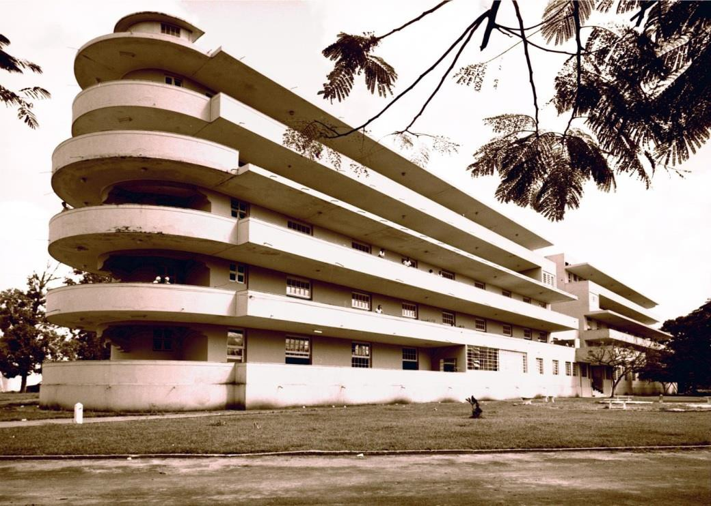
>
> Fig. 01. Vista do Hospital Sanatório Santa Terezinha logo após a sua
> inauguração.
>
> Fonte: Centro de Documentação e Referência da Odebrecht.

A revolucionária estética arquitetônica do Hospital Santa Terezinha, com
sua volumetria aerodinâmica, suas formas simples e sem ornamentação,
suas cores claras, seus longos balcões lineares e, principalmente, a
abertura destes espaços voltados aos banhos de sol dos pacientes para um
entorno rural, permitindo a integração entre interior e exterior e a
maximização do aproveitamento da luz natural, se constituem em
características comuns de diversos hospitais e, mais especificamente, de
sanatórios para tuberculosos em todo o mundo, como ressalta Paul Overy:

> Os sanatórios exerceram uma poderosa influência na imaginação dos
> arquitetos e designers modernistas como
>
> 1 É possível que o projeto do Hospital Sanatório Santa Terezinha tenha
> sido elaborado pela Divisão de Obras do Ministério da Educação e Saúde
> (MES), criada em 1934 e cuja equipe de arquitetos e engenheiros,
> segundo Renato da Gama-Rosa Costa, "projetou e construiu, com verbas
> do ministério, de 13 a 19 grandes sanatórios em praticamente todos os
> estados da nação" (COSTA, 2008, p. 129), não obstante Costa mencione
> um único sanatório projetado pela equipe da Divisão de Obras do MES na
> Bahia: o Sanatório São Gonçalo dos Campos, não construído. Paulo
> Ormindo de Azevedo, por sua vez, atribui o projeto a uma arquiteto
> carioca de nome Azeredo (AZEVEDO, 1997).
>
> tipologias arquitetônicas e modelos institucionais. Entre os primeiros
> a serem projetados em um estilo 'moderno' ou 'modernista', os
> sanatórios para tuberculosos e portadores de outras doenças crônicas
> foram algumas das edificações mais avançadas tecnologicamente das
> primeiras décadas do século
>
> XX\. Combinando associações de saúde, higiene, limpeza (e facilidade
> de limpeza), modernidade e precisão de operação de maquinário, eles
> viriam a ter uma grande influência na arquitetura e no desenho de
> interiores modernista no entre- guerras. Muitos dos materiais e muito
> do mobiliário empregado em construções modernistas foi desenvolvido
> para sanatórios e hospitais, ou para o 'modelo' de fábricas que com
> eles se assemelhava em limpeza e abertura para a luz e para os
>
> raios solares. (OVERY, 2007, p. 29)2

Como observa Renato da Gama-Rosa Costa (2008, p. 126), a decisão pela
construção de sanatórios para tuberculosos em setores urbanos afastados
das zonas centrais e mais habitadas está vinculada à tendência,
consagrada a partir da década de 1920, de separação entre o hospital
geral e o hospital de isolamento, especialmente para pacientes
considerados perigosos, como doentes mentais, ou portadores de doenças
contagiosas, como hanseníase e tuberculose. Assim, uma área periférica,
de caráter quase rural, como o Alto da Cruz do Cosme era à época se
mostrava bastante adequada para abrigar um hospital para tuberculosos.
Entretanto, se, por um lado, a construção do Hospital Santa Terezinha
teve um papel fundamental no combate à tuberculose na Bahia, ela
terminou por estigmatizar, por muitos anos, essa região, que passou a
ser associada à doença e a seus enfermos.

Cinco anos após a inauguração do Hospital Santa Terezinha, uma extensa
área ao norte do Alto da Cruz do Cosme seria alvo de uma intensa
polêmica acompanhada de perto pela imprensa e pelos políticos locais. A
área conhecida como Corta-Braço -- também chamada de "Nova Pero Vaz"
havia sido ocupado em novembro de 1946 por grupos de sem-teto,
configurando-se como uma das primeiras ocupações organizadas promovidas
na cidade. Embora os terrenos invadidos pertencessem à Prefeitura de
Salvador e estivessem desocupados, eles estavam aforados a um italiano,
Francesco Pellosi.

A "invasão do Corta-Braço"3 se iniciou com cerca de 200 famílias e se
tornou paradigmática pela organização de seus moradores, que, em massa
ou através de algumas lideranças, se dirigiam cotidianamente à sede do
jornal *A Tarde*, ao Fórum e a outros órgãos públicos a fim de cobrar
das autoridades uma solução para o problema4. Além disso, abriram uma
caderneta na Caixa Econômica Federal para

> 2 Tradução do original em inglês realizada pelo autor.
>
> 3 Faremos referência à *invasão* do Corta-Braço por ter sido o termo
> utilizado à época, porém o mais correto, hoje, seria falar em
> *ocupação*: frente ao senso comum que associa o termo *invasão* a algo
>
> ilegal -- o desrespeito ao direito de propriedade --, os movimentos
> sociais adotam, atualmente, o termo *ocupação*, especialmente quando o
> objeto da ocupação é, como no caso do Corta-Braço, um imóvel
> desocupado.
>
> 4 O jornal *A Tarde*, por exemplo, registra que, em 20 de novembro de
> 1946, "mais de quinhentas
>
> pessoas de aparencia modesta, homens e mulheres, enchiam as salas e
> corredores daquela casa de justiça \[o Fórum\], todos moradores ao
> 'Corta Braço', onde construíram suas residencias, á custa de muitos
> sacrifícios, num terreno a eles arrendado, por um italiano, que, como
> a 'A Tarde' já teve oportunidade de se referir em edição passada,
> pretende agora dali despejá-los. Como hoje, ás 10 e meia

receber contribuições "de firmas comerciais, sociedades comerciais,
particulares, qualquer pessoa, enfim, que num gesto de solidariedade,
queiram enviar-nos donativos" para que a própria comunidade pudesse
adquirir o terreno em que residia, em uma campanha que teve o imediato
apoio do maior jornal da cidade (UMA CAUSA\..., 1947, p. 2).

Embora em um primeiro momento Pellosi não tenha se preocupado em impedir
a ocupação, em 1947 ele decide expulsar as cerca de 200 famílias do
local e, após conseguir um mandato de reintegração de posse, derruba
cinco das casas para assinalar a reintegração. A partir daí, "a questão
do Corta-Braço domina a cidade", como registra o jornal *A Tarde* (SÃO
QUASI\..., 1947, p. 2), e o Governador Otávio Mangabeira decide
desapropriar, por utilidade pública, as terras invadidas, o que
efetivamente ocorre em 29 de abril de 1947.5

# "Educação para todos": Anísio Teixeira e o Centro Educacional Carneiro Ribeiro

O mais impactante equipamento público construído no Alto da Cruz do
Cosme, ainda hoje referência fundamental da educação, tem sua
localização ali diretamente relacionada com a invasão do Corta-Braço.

Quando assumiu a Secretaria de Educação e Saúde do Estado da Bahia a
convite do governador Mangabeira, em 1947, o educado Anísio Teixeira
observou que "tudo se encontrava em condições semelhantes às de um país
que houvesse sido devastado por uma guerra perdida". Os problemas
principais eram as "dificuldades de pessoal e de recursos" e o "espírito
de desânimo e desalento que em tudo se instalara". No que se refere às
edificações escolares, dezenas de edifícios escolares cuja construção
havia sido iniciada 15 anos antes não haviam sido concluídos e já se
encontravam em ruina: (TEIXEIRA, 1952, p. 04-05).

Para Anísio -- um defensor do ensino em tempo integral desde que fora
Diretor Geral do Departamento de Educação do Distrito Federal, no Rio de
Janeiro, na primeira metade da década de 1930 -- um dos problemas do
modelo educacional então em vigor era o sistema de turnos em que, "no
mesmo prédio, funcionam duas escolas, uma pela manhã e outra à tarde",
resultando em "uma escola de tempo parcial, com um período demasiado
reduzido para se fazer a educação elementar da criança".

Para se contrapor a esse modelo, Anísio desenvolveu um ambicioso "Plano
de Edificações Escolares", estruturando o ensino no Estado em seus
diversos níveis: escola elementar, ginásio e escola normal.6 No que se
refere ao ensino elementar, o plano de Anísio e Rebouças propunha "um
sistema especial de escolas, em que fôssem localizadas as funções do
ensino propriamente dito em um prédio e em outro

ou grupo de outros os de educação física, artística, social e
pré-vocacional":

> horas, entrava em julgamento o aludido caso, os prejudicados ali se
> achavam, aguardando a solução que a justiça dará ao mesmo, na pessoa
> do juiz Nicolau Tolentino de Barros" (FORAM AGUARDAR\..., 1946, p. 2).
>
> 5 Durante sua campanha eleitoral para o Governo do Estado, em 1946,
> Mangabeira -- que contava com
>
> o apoio do Partido Comunista Brasileiro -- havia feito um comício no
> Corta-Braço e havia se comprometido a resolver a situação daquelas
> famílias.
>
> 6 Para uma análise detalhada do "Plano de Edificações Escolares"
> concebido por Anísio Teixeira e Diógenes Rebouças para a Bahia no
> Governo Otávio Mangabeira, cf. ANDRADE JUNIOR, 2011.
>
> Nasceu daí o prédio escolar que designamos de *escola-classe*,
> composto tão somente de salas de aula e dependências para o professor,
> e o prédio escolar, que designamos de '*escola- parque*',
> compreendendo salas de música, dança, teatro, clubes (educação
> artística e social), salas de desenho e artes industriais (educação
> pré-vocacional), ginásio de educação física e mais dormitórios,
> biblioteca, restaurante e serviços gerais. (MANGABEIRA, 1950, p.
> 11-12)

Para a capital do Estado, Anísio concebeu um sistema de ensino elementar
estruturado em conjuntos escolares denominados por ele de *Centros
Populares de Educação*, com capacidade para até 4.000 alunos. Esses
conjuntos seriam formados por quatro *escolas-classe*, com capacidade
para 1.000 alunos cada uma (500 em cada turno), e por uma
*escola-parque*, que receberia, em cada turno, os 2.000 alunos que
frequentassem as *escolas-classe* no turno oposto. Cada criança
soteropolitana matriculada na rede pública passaria, portanto, um total
de oito horas diárias no centro educacional; a escola ofereceria todas
as refeições diárias e, para facilitar o deslocamento das crianças, as
*escolas-classe* deveriam distar cerca de 500 m da *escola-parque*.

Para Anísio, a *escola-classe* seria a responsável por instruir a
criança, mas é na *escola-parque* que ela seria educada, do ponto de
vista do convívio social, da cultura intelectual e artística, da
educação física e até mesmo de encontrar uma ocupação profissional.

Os 2.000 alunos que estariam na *escola-parque* em cada turno se
dividiriam em grupos numericamente iguais pelos três setores de
atividades: de educação física, de trabalho e de atividades sociais e
artísticas. Os setores de atividades da *escola-parque* corresponderiam,
respectivamente, a um ginásio com capacidade para 700 crianças; um
conjunto de ateliês e salas de trabalho com igual capacidade; e a um
teatro e salas de música, canto e dança para grupo idêntico. Além disso,
um restaurante com capacidade para servir 2.000 crianças e sua
respectiva cozinha, uma biblioteca para 300 crianças, um teatro ao ar
livre, um edifício de serviços gerais e um edifício administrativo, além
de dormitórios para 200 crianças. Este último justificava-se porque o
projeto pedagógico de Anísio Teixeira previa que as crianças sem um lar
deveriam ter a mesma oportunidade das demais; entretanto, não tendo um
lar para regressar ao final do dia na escola, as crianças abandonadas
seriam acolhidas em regime de internato dentro da própria
*escola-parque*. Assim, 5% das vagas do complexo seriam reservadas para
essas crianças. (MANGABEIRA, 1950, p. 12).

Tendo sido definidos o projeto pedagógico e o programa por Anísio
Teixeira e o esquema funcional pelo engenheiro carioca Paulo de Assis
Ribeiro, o passo seguinte foi o de definir a localização de cada um
destes *Centros de Educação Elementar* -- denominação definitiva dos
*Centros Populares de Educação* anisianos -- no território da capital
baiana.

O *Plano de Edificações Escolares* de Anísio foi desenvolvido por
Diógenes Rebouças dentro do Escritório do Plano de Urbanismo da Cidade
do Salvador (EPUCS), instalado em janeiro de 1943 sob a direção do
engenheiro sanitarista Mário Leal Ferreira e, após a morte deste em
março de 1947, coordenado pelo próprio Rebouças, que, desde a instalação
do escritório, atuava como coordenador de planejamento físico

e paisagístico. É, portanto, dentro do EPUCS que Rebouças desenvolve o
plano de localização destes equipamentos na cidade:

> \[Anísio\] nos deu a incumbência de colocar no Plano da Cidade de
> Salvador oito grandes conjuntos desses, e nós fizemos um anteprojeto,
> justamente localizando todos estes equipamentos dentro daquela cidade
> que tinha como parâmetro, para o EPUCS, uma população prevista de um
> milhão de habitantes. De maneira que quando ele viu a planta e
> compreendeu a localização, disse: \"aprovo cem por cento\". (*ibid.*,
> p. 148)

Rebouças propôs localizar as *escolas-parque* dos oito *Centros de
Educação Elementar* em alguns dos dezenove subcentros urbanos
identificado pelo EPUCS: Ondina, Barra, Barris, Barbalho, Nazaré,
Liberdade, Bonfim e Matatu de Brotas. Os subcentros eram entendidos no
EPUCS como "catalizadores das atividades sociais" (SANTOS NETO, 1993, p.
12).

> 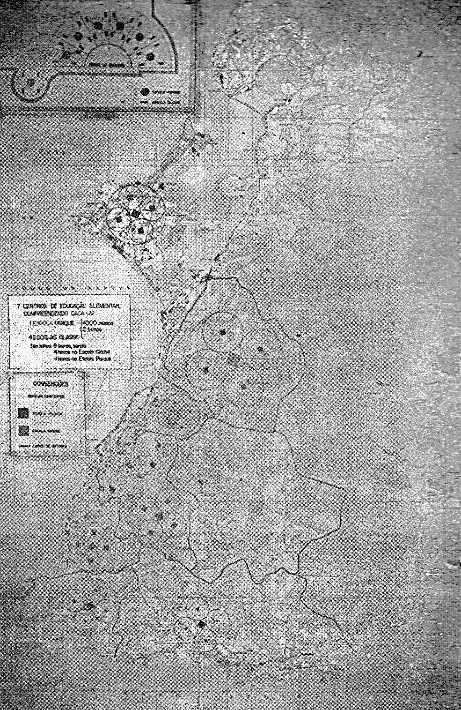
>
> Fig. 02. Plano de localização dos oito *Centros de Educação Elementar*
> de Salvador.
>
> Fonte: REVISTA FISCAL\..., 1949.
>
> 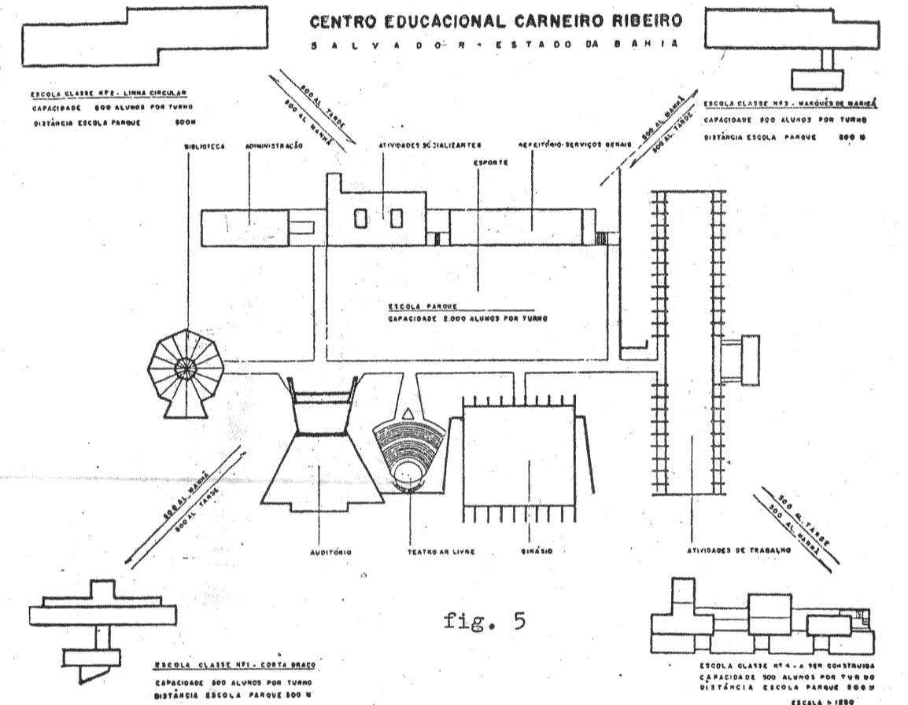
>
> Fig. 03. Esquema de funcionamento do Centro Educacional Carneiro
> Ribeiro -- primeiro (e único) *Centro de Educação Elementar*
> construído em Salvador. Fonte: DUARTE, 1973.

Segundo Rebouças, a decisão de implantar o primeiro *Centro de Educação
Elementar* na "Liberdade" (a rigor, na Caixa d'Água, entre o
reservatório e a invasão do Corta- Braço) foi do próprio Anísio, que
teria afirmado:

> Eu prefiro começar pelo bairro da Liberdade \[sic\], é lá que temos os
> problemas maiores, não só em número de pessoas como em nível econômico
> baixo. Eu quero agir lá dentro. (apud REBOUÇAS, 1992, p. 147)

Esta decisão provavelmente estava relacionada à já comentada invasão do
Corta- Braço.

A construção do complexo, que recebeu o nome de Centro Educacional
Carneiro Ribeiro (CECR), levou 16 anos. Em 1948, Rebouças e Hélio Duarte
elaboraram os projetos das três primeiras escolas-classe e dos primeiros
pavilhões da escola-parque. Em setembro de 1950, no final do governo
Mangabeira, foram inauguradas as escolas-classe I, II e III. As duas
primeiras foram erguidas em plena invasão do Corta- Braço, enquanto a
Escola-Classe III foi construída na rua Marquês de Maricá, no Pau Miúdo,
nas proximidades do Hospital Santa Terezinha.

A Escola-Classe I, projetada por Rebouças, e as Escolas-Classe II e III,
desenhadas por Duarte, possuíam arquiteturas distintas porém programas
semelhantes: doze salas de aula, áreas cobertas para recreio,
biblioteca, espaços administrativos, cantina do professor e local para o
almoço das crianças, além de uma casa para o zelador, independente da
edificação da escola-classe, porém localizado no seu terreno. As três

primeiras escolas-classe construídas apresentavam diversos elementos do
repertório formal da arquitetura moderna da *escola carioca* tão
apreciada por Rebouças e Duarte: as rampas contínuas que articulam os
dois blocos paralelos da Escola-Classe I, os quebra-sóis fixos das
fachadas principais das Escolas-Classe II e III, o telhado borboleta do
volume de ingresso à Escola-Classe III ou ainda os cobogós e as
esquadrias de veneziana de madeira e vidro de todas as três escolas.

Além disso, as três primeiras escolas-classe receberam obras que
contribuíram para consolidar a arte moderna na Bahia: a Escola-Classe I
possuía um mural de Carlos Bastos; a Escola-Classe II, o primeiro mural
do artista plástico argentino Carybé na Bahia; e a Escola-Classe III, um
mural e uma escultura de Mário Cravo.

Em seus três primeiros meses de funcionamento, em 1950, as
Escolas-Classe I, II e III já atenderam a 1.000 alunos matriculados em
cada escola, com 12 classes por escola em cada turno, e registraram uma
frequência média de 86%. Os alunos eram todos moradores da região,
muitos deles do Corta-Braço.7

> 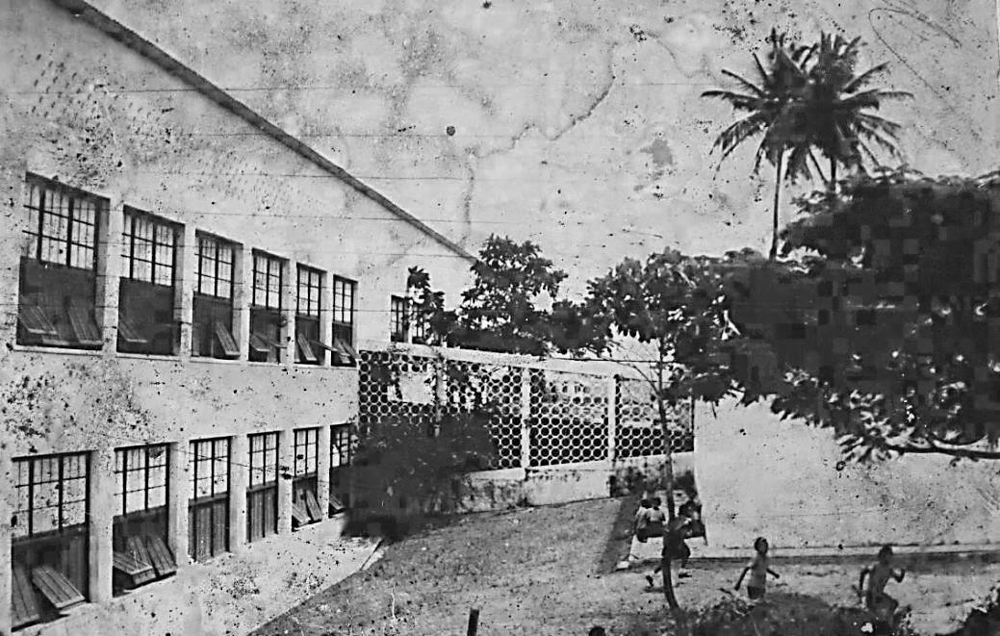
>
> Fig. 04. Vista geral da Escola-Classe I. Fonte: Biblioteca do CECR --
> Escola-Parque.
>
> 7 Do total de 72 classes que funcionaram nas Escolas-Classe I, II e
> III entre outubro e dezembro de 1950, 54 classes eram de primeiro ano,
> 12 de segundo ano, 5 de terceiro ano e 1 de quarto ano, o que
> demonstra a carência da população infantil local. Na Escola-Classe
> III, por exemplo, o primeiro ano do curso abrigava não só alunos de 7
> e 8 anos de idade (49,7% do total), como seria regular, mas também
> alunos com idades entre 9 e 12 anos (estes últimos chegando a 5,8% do
> total). No segundo ano do curso, somente 18,3% dos alunos possuíam
> entre 7 e 9 anos, enquanto os demais possuíam entre 10 e 12 anos de
> idade. No terceiro ano do curso, somente 20% dos alunos possuíam entre
> 9 e 10 anos, e a maioria da turma tinha 11 ou 12 anos. (Arquivo
> Público do Estado da Bahia, Fundo Secretaria de Educação, Grupo
> Departamento de Educação, Série Quadro de frequência do Colégio
> Carneiro Ribeiro, Data-limite 1950, Caixa 3956, Maço 64).
>
> 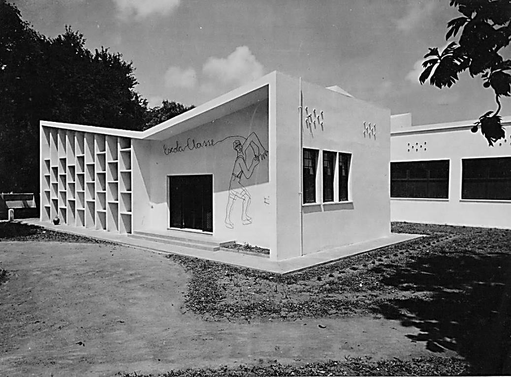
>
> Fig. 05. Vista geral da Escola-Classe III. Fonte: Arquivo Diógenes
> Rebouças -- CEAB/FAUFBA.
>
> 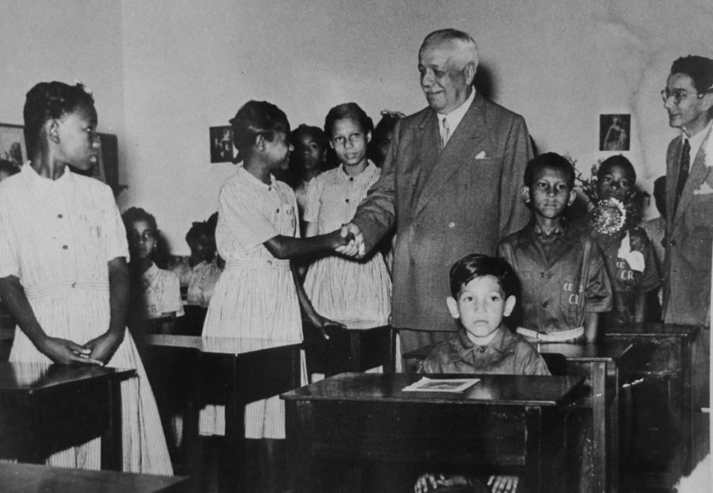
>
> Fig. 06. O governador Otávio Mangabeira e o Secretário da Educação e
> Saúde Anísio Teixeira cumprimentam alunos do Centro Educacional
> Carneiro Ribeiro.
>
> Fonte: Biblioteca Pública do Estado da Bahia -- Setor de Documentação
> Baiana.

O primeiro pavilhão da Escola-Parque a ser construído foi também o
maior, do Setor das Atividades de Trabalho. Projetado por Rebouças em
1950, sua construção foi concluída por volta de 1955, após o fim da
gestão de Anísio na Secretaria de Educação e Saúde, e corresponde a um
imenso galpão (125,00 m x 31,00 m), com estrutura formada por catorze
arcos plenos de madeira, com arranques em concreto armado. O galpão
abriga cinco gigantescos painéis artísticos de autoria de Carybé, Mário
Cravo, Jenner Augusto, Carlos Magano e Maria Célia Amado, e que
constituem o mais importante conjunto de murais modernos do Estado da
Bahia. A

educação pela arte, recorrente no discurso pedagógico de Anísio há mais
de dez anos antes, se concretiza pela primeira vez no CECR.

O CECR, obra mais importante do Plano de Edificações Escolares elaborado
por Anísio Teixeira e Rebouças, só se concluiria em 1964, com a
inauguração da Escola- Classe IV e dos demais setores previstos no
projeto pedagógico de Anísio para a Escola-Parque.8 Evidentemente, a
implantação de uma estrutura com essas características e dimensões
provocou um enorme contraste com a ocupação

fragmentada do entorno, formado por construções vernaculares e de
pequeno porte.

Com a construção do CECR, a numerosa população da região da Caixa
d'Água, Pero Vaz/Corta-Braço, Pau Miúdo e arredores, passou a contar com
um equipamento educacional da mais alta qualidade, determinante na
educação e na formação social e cultural dessas comunidades até os dias
de hoje. Antes mesmo de ter sua execução concluída, o CECR já servia de
referência para projetos semelhantes em todo o Brasil, como as obras do
Convênio Escolar realizadas em São Paulo sobre a direção de Hélio Duarte
(1949-1953). O CECR foi também objeto de documentário elaborado pela
UNESCO logo após a sua inauguração, mostrando-o como exemplo de sistema
educacional a ser adotado em países em desenvolvimento, e até hoje serve
de modelo para iniciativas como as dos Centros Integrados de Educação
Pública (CIEP), projetados por Oscar Niemeyer a pedido de Darcy Ribeiro
-- discípulo de Anísio --, quando este foi Secretário Estadual de
Educação do Rio de Janeiro (1983-1987) ou dos mais recentes Centros
Educacionais Unificados (CEU), construídos pela Secretaria Municipal de
Educação da Prefeitura de São Paulo na periferia da cidade a partir de
2001 a partir de projeto do arquiteto Alexandre Delijaicov e de sua
equipe.

> 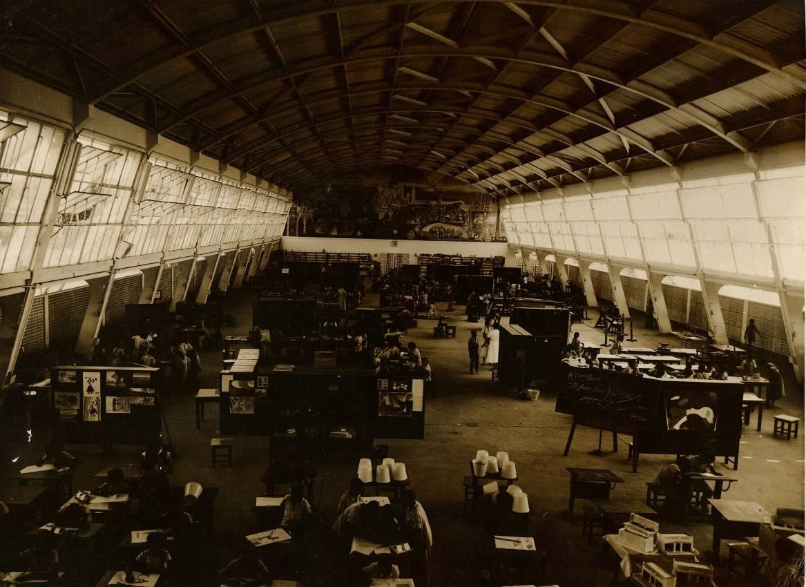
>
> Fig. 07: Vista do interior de uma das oficinas do Setor de Atividades
> de Trabalho da escola-parque da Caixa d'Água. Fonte: Biblioteca do
> CECR -- Escola-Parque.
>
> 8 Os projetos da Escola-Classe IV e dos pavilhões da Escola-Parque
> foram elaborados por Rebouças, muitos deles com a colaboração de Assis
> Reis. Os recursos que viabilizaram a continuidade das obras vinham do
> Ministério da Educação, onde Anísio ocupou, entre 1952 e 1964, o cargo
> de Diretor-Geral do Instituto Nacional de Estudos Pedagógicos -- INEP.
>
> 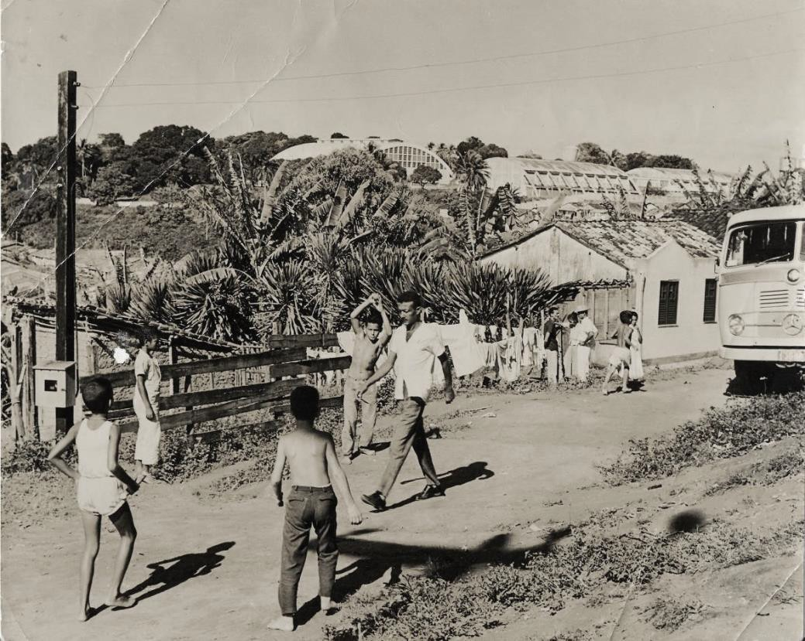
>
> Fig. 08. Vista da Escola-Parque da Caixa d'Água a partir da invasão do
> Corta-Braço.
>
> Fonte: Biblioteca do CECR -- Escola-Parque.

# A ampliação do Hospital Santa Terezinha

No mesmo período em que se construíram as três primeiras escolas-classe
do CECR, o Ministério da Educação e Saúde, através da Campanha Nacional
contra a Tuberculose (CNCT), ergueu uma série de anexos ao Hospital
Sanatório Santa Terezinha, visando expandir a estrutura hospitalar e
sanatorial de combate à doença em Salvador. Já em outubro de 1948, foram
inauguradas a ampliação do edifício original, acrescentando 138 leitos
aos 250 existentes, e um pavilhão infantil, com 80 leitos para crianças
de 3 a 12 anos (REVISTA\..., 1949, p. 215). Entretanto, mesmo com 468
leitos, o Hospital Sanatório Santa Terezinha ainda não era capaz de
fazer frente ao índice de "mais de 1.500 óbitos anuais pela tuberculose"
de Salvador (GOVERNO\..., 1950, p. 79).

Para enfrentar este problema, são construídos no âmbito da CNCT três
novos pavilhões no agora chamado "Parque Sanatorial Santa Terezinha": um
Sanatório de Triagem, com 5.429,00 metros quadrados e 342 leitos,
projetado pelo arquiteto carioca Jorge Moreira; um Pavilhão de Serviços
Gerais, com 1.873,00 metros quadrados, e um Pavilhão de Triagem, com
3.726,00 metros quadrados e 430 leitos, os dois últimos projetados por
Rebouças. Os três pavilhões foram inaugurados em 27 de janeiro de 1951
(RIBEIRO, 1956, p. 225-226).

No mesmo período e também como equipamento de combate à tuberculose, é
construído o singelo Dispensário Modelo da Cruz Vermelha Brasileira,
filial da Bahia, com apenas 289,00 metros quadrados e projetado por dois
arquitetos da CNCT sediados na Capital Federal, Newton Secchin e Pedro
Rossi Neto.

> 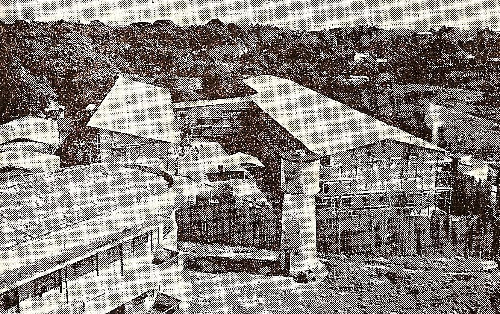
>
> Fig. 09. Parque Sanatorial Santa Terezinha em 1949, visto a partir do
> pavilhão original. Em primeiro plano, à esquerda, o pavilhão
> construído em 1948; no centro da imagem, o Sanatório de Triagem em
> construção. Fonte: CARICCHIO, 1949.
>
> 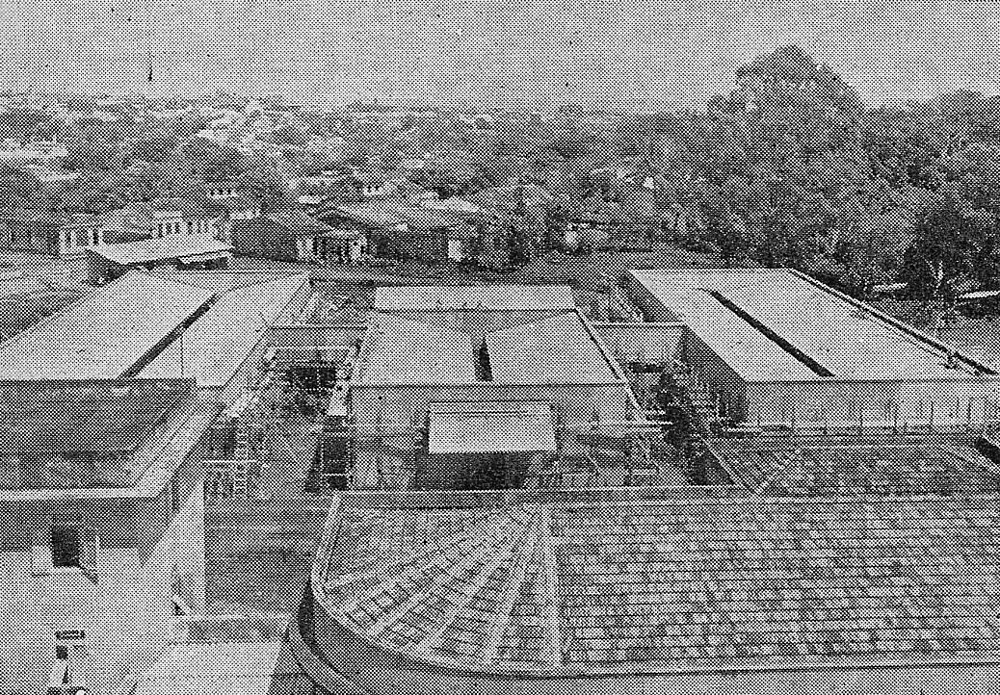
>
> Fig. 10. Parque Sanatorial Santa Terezinha em 1949, visto a partir do
> pavilhão original. Em primeiro plano, a cobertura do pavilhão
> construído em 1948; no centro da imagem, o Pavilhão de Serviços em
> construção. Fonte: CARICCHIO, 1949.
>
> 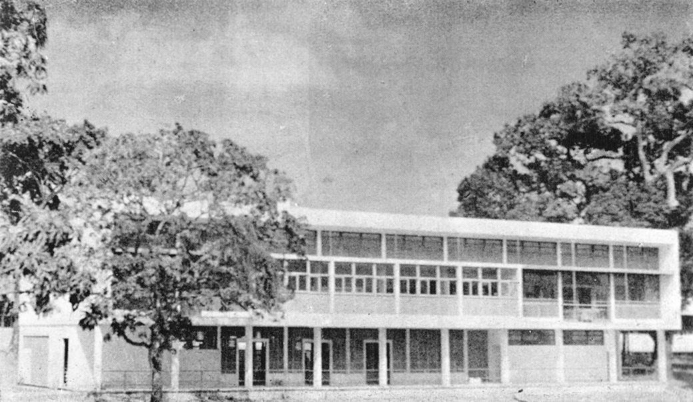
>
> Fig. 11. Pavilhão de Triagem do Parque Sanatorial Santa Terezinha.
>
> Fonte: Acervo fotográfico do Hospital Especializado Octávio
> Mangabeira, Salvador.
>
> 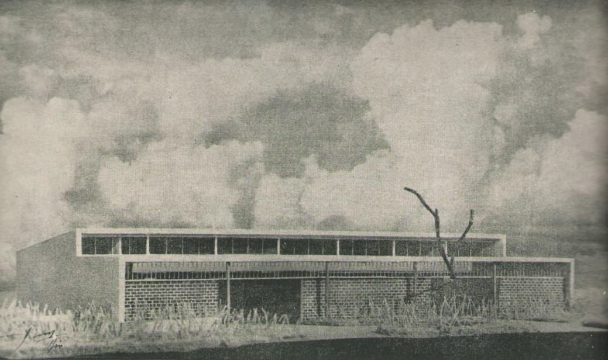
>
> Fig. 12. Maquete do Dispensário Modelo da Cruz Vermelha Brasileira,
> construído no Parque Sanatorial Santa Terezinha. Fonte: REVISTA\...,
> 1949.

Os pavilhões do Parque Sanatorial Santa Terezinha construídos entre 1948
e 1951 possuíam uma série de características da arquitetura moderna,
como os pilotis de seção circular do Pavilhão de Triagem e do
Dispensário da Cruz Vermelho, as esquadrias de veneziana de madeira e
vidro do Sanatório de Triagem e do Pavilhão de Triagem e as
inconfundíveis rampas do Pavilhão de Triagem e do Sanatório de Triagem.
Este repertório formal contribuiu, de modo análogo ao CECR, para
introduzir a arquitetura moderna nesta zona periférica de Salvador.

Além disso, a construção destes pavilhões permitiu criar,
posteriormente, um hospital geral na região, já que, nas décadas
seguintes, com os avanços no tratamento da tuberculose, alguns dos
pavilhões que compunham o Parque Sanatorial Santa Terezinha passaram a
receber novos usos e o antigo Sanatório de Triagem foi transformado em
um hospital geral -- o Hospital Ernesto Simões Filho, em funcionamento
até hoje e um dos mais importantes da cidade.

# O Hospital do IAPETC

Contemporaneamente à construção dos novos pavilhões do "Parque
Sanatorial Santa Terezinha" e a menos de um quilômetro de distancia
dele, em frente à Caixa d'Água, foi erguido o gigantesco Hospital do
Instituto de Aposentadoria e Pensões dos Empregados em Transportes e
Cargas (IAPETC). Com 11 pavimentos e capacidade projetada para 350
leitos, as obras de construção do Hospital do IAPETC, iniciadas no final
dos anos 19409, foram tão lentas que em 1956 funcionava somente o setor
de emergência do hospital, enquanto as demais instalações ainda não
estavam

terminadas; somente em 1962 foi inaugurado o setor de cardiologia.

Seja pela sua escala e altura, seja pelo tratamento aplicado às suas
fachadas, com ornamentos classicizantes com texturas em argamassa
simulando caneluras de falsas pilastras em escala monumental, seja ainda
pela simetria e pelo ritmo regular das janelas verticais distribuídas
pelas fachadas, o Hospital do IAPETC se diferencia significativamente
dos pavilhões modernistas que compõem o Parque Sanatorial Santa
Terezinha. Por outro lado, o atual Hospital Ana Nery possui hoje papel
tão importante quanto o Hospital Ernesto Simões Filho no atendimento da
população das comunidades do entorno e de outras áreas da cidade.

> 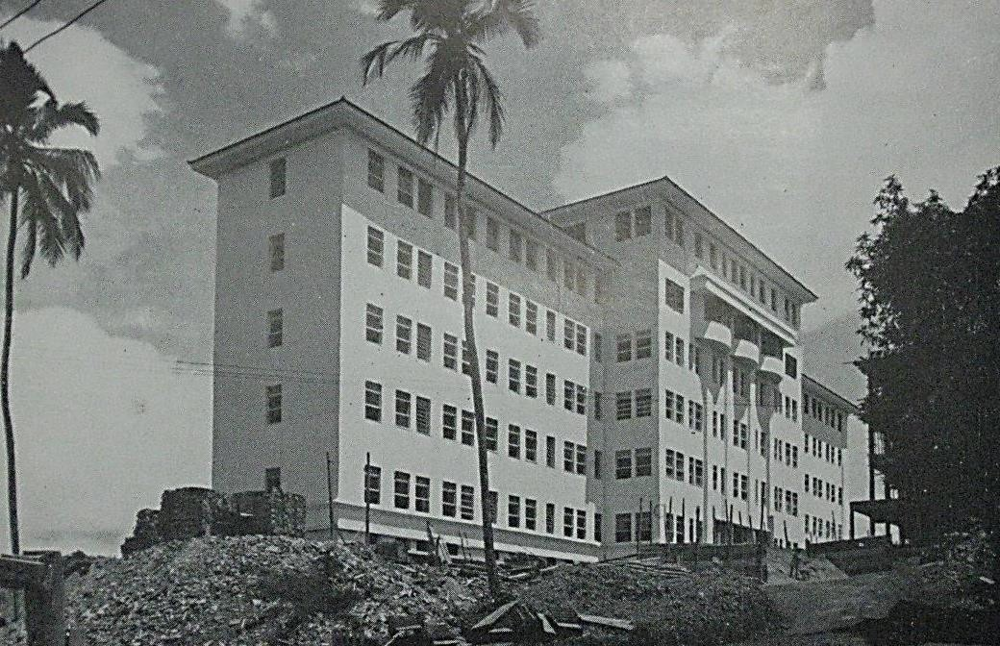
>
> Fig. 13. Vista geral do Hospital do IAPETC em 1950. Fonte: IAPETC,
> 1950.

# A "Cidade dos Industriários" do IAPI

A poucos metros da Escola-Classe II do CECR e do Parque Sanatorial Santa
Terezinha, foi erguido, na mesma época que esses equipamentos, o
primeiro conjunto habitacional moderno de Salvador: a "Cidade dos
Industriários", construída pelo Instituto de Aposentadoria e Pensões dos
Industriários (IAPI).

Frente ao grave problema da habitação social em Salvador e à questão das
invasões e ocupações de terras, tema recorrente na imprensa desde o
início da invasão do Corta- Braço, o governador Mangabeira havia
iniciado contatos, no final de 1947, com a Fundação da Casa Popular,
visando à construção de uma "vila proletária" nos terrenos da invasão,
através de convênio entre o Governo do Estado e aquela Fundação.
Concomitantemente, "o governo do Estado promoveu a aquisição, pelo
Instituto dos

> 9 Um informe publicado pelo IAPETC no jornal A Tarde em 20 de novembro
> de 1948 inclui uma fotografia da construção com cinco pavimentos da
> estrutura já erguidos.

Industriarios, de uma área no Retiro, para construção de outra vila"
(VILA PROLETÁRIA\..., 1947, p. 01).

O projeto do Conjunto Residencial Salvador -- nome definitivo da "Cidade
dos Industriários" -- foi elaborado em 1948 pelo arquiteto carioca Hélio
Cavalcanti e previa, inicialmente, a construção de 696 apartamentos de 2
e 3 quartos, que seriam alugados a alguns dos mais de 15.000
industriários de Salvador (SURGIRÁ\..., 1949,

p\. 02). No final dos anos 1940, os conjuntos habitacionais construídos
em Salvador pelos Institutos de Aposentadoria e Pensão ainda eram, em
sua maioria, formados por casas; uma exceção foi o Conjunto Residencial
Castro Alves, construído pelo Instituto de Aposentadoria e Pensões dos
Empregados em Transportes de Cargas (IAPETC) no mesmo período do
Conjunto Residencial Salvador, no Caminho de Areia, na Península de
Itapagipe. O Conjunto Castro Alves mesclava 26 casas com 168
apartamentos; a linguagem adotada nestas construções, contudo, era,
tanto nas casas quanto nos blocos de apartamentos de três pavimentos,
tradicional, com telhados cerâmicos em quatro águas com beirais e
cornijas.

O Conjunto Residencial Salvador, contudo, adotou exclusivamente a
solução de blocos de apartamentos. Nas palavras do delegado do IAPI na
Bahia, José de Senna, a decisão pela construção de apartamentos em lugar
de casas decorria unicamente de aspectos econômicos: "tendo o instituto
adquirido o terreno por compra, deveria aproveita-lo da melhor forma
possível e somente o sistema de apartamentos poderia oferecer um
resultado mais concreto, por se esperar alugueres mais cômodos" (apud
SURGIRÁ\..., 1949, p. 02). O delegado do IAPI na Bahia fez questão ainda
de destacar que

> O problema da habitação do trabalhador \[\...é\...\] um ponto
> importante do programa de govêrno do dr. Octavio Mangabeira, e por
> isso, o Instituto tem encontrado, em sua pessôa, a melhor cooperação e
> boa vontade para resolver os problemas e dificuldades em tôrno da
> construção da vila (apud SURGIRÁ\..., 1949, p. 02)10.

As obras do Conjunto Residencial Salvador foram iniciadas em 1950, com a
construção de cinco blocos elevados sobre pilotis com quatro pavimentos
de apartamentos cada. Os cinco blocos, totalizando 264 apartamentos de 2
quartos, possuíam comprimentos diferentes, mas adotavam a mesma
tipologia, assim como volumetrias e tratamentos de fachada semelhantes.
Esta primeira etapa, implantada no planalto situado na parte mais
elevada do imenso terreno, foi a única a ser

> 10 Segundo o jornal *A Tarde*, em matéria publicada em 14 de fevereiro
> de 1951, o apoio do governador Otavio Mangabeira à construção de
> conjuntos habitacionais pelos IAPs não se limitou à "Cidade dos
> Industriários"; Mangabeira teria exigido "que aplicassem os institutos
> ao menos parte do dinheiro que aqui \[na Bahia\] arrecadavam, ninguém
> sabia o que fazia com as gordas somas com que contribuíam para os seus
> cofres os trabalhadores baianos" (O QUE FAZEM\..., 1951, p. 02). Por
> outro lado, o delegado do IAPI na Bahia, Bartolomeu Dias, ao ser
> inquirido pelo mesmo jornal, em janeiro de 1952, sobre as razões pelas
> quais o Conjunto Residencial Salvador, construído por aquele
> instituto, já se encontrava pronto mas seus apartamentos ainda não
> haviam sido alugados, alertou que "o governador do Estado, naquela
> época, dr. Octávio Mangabeira desejando solucionar muitos problemas ao
> mesmo tempo, facilitou tudo quanto foi possível para a construção do
> bloco de apartamentos do nosso Instituto. Entretanto, todas aquelas
> facilidades vieram criar maiores dificuldades depois. Quando, nos
> últimos meses do ano próximo passado requeremos o 'habite-se' da Saúde
> Pública, esta nos negou, pois não havia nenhuma licença da Prefeitura,
> nem planta aprovada, nem coisa alguma. Não há como negar, que a medida
> da Saúde Pública foi justa, embora nos prejudicasse" (O PRÉDIO\...,
> 1952, p. 02).

efetivamente construída, sendo inaugurada em 15 de fevereiro de 1952,
embora as obras já tivessem sido concluídas há alguns meses
(SURGIRÁ\..., 1949, p. 02; A VILA\..., 1950, p. 02; CASAS PARA MAIS\...,
1952, p. 02).

Os blocos do Conjunto Residencial Salvador representam uma aproximação
significativa da arquitetura habitacional popular produzida na Bahia à
arquitetura moderna, perceptível nos pilotis que elevam o bloco do solo,
tornando-o mais leve; na cobertura em telha de fibrocimento com uma
única água e no tratamento das fachadas, nas quais, apesar das aberturas
retangulares tradicionais, localizadas e espaçadas entre si, a
horizontalidade é forçada através de reentrâncias no plano da fachada,
simulando, ao menos visualmente, uma solução de janelas em fita. As
escadas são os únicos elementos, além dos pilotis, que tocam o solo,
sendo fechadas por cobogós.

> 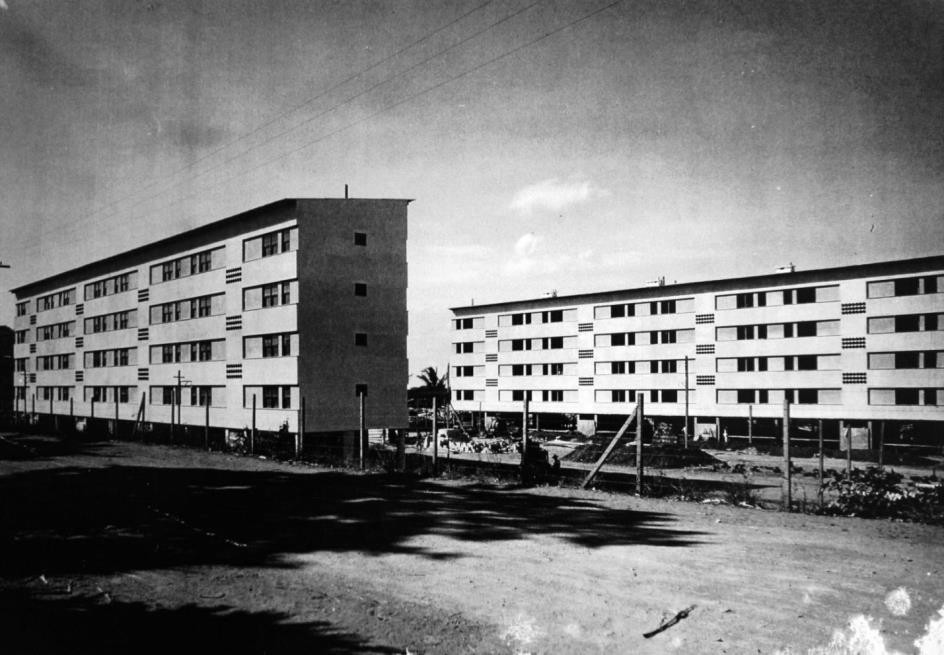
>
> Fig. 14. Dois dos blocos do Conjunto Residencial Salvador, construído
> pelo IAPI. Fonte: Acervo do Conjunto Residencial Salvador, Salvador.

Outras características importantes do projeto do Conjunto Residencial
Salvador são a criação, nos pavimentos térreos dos blocos, de
lavanderias coletivas -- situação recorrente em diversos projetos
análogos da época, como o Conjunto Residencial Prefeito Mendes de Moraes
(Pedregulho), no Rio de Janeiro, projetado por Affonso Eduardo Reidy em
1947 -- e a inserção dos blocos em uma ampla área verde. Com relação a
este último aspecto, Nabil Bonduki observa:

> O espaço público não é sobra nem resíduo, mas o elemento principal de
> composição urbanística, valorizado pela utilização dos pilotis, que
> possibilitam a permeabilidade entre espaço aberto e construído
> \[\...\].
>
> O conjunto do IAPI em Salvador é um dos melhores exemplos da
> potencialidade de se criarem grandes áreas de lazer em projetos
> habitacionais. \[\...\] cinquenta anos depois da sua inauguração, a
> arborização da área é tão intensa que ele pode ser comparado a um
> parque. O cuidadoso tratamento urbanístico da área livre, restringindo
> sua transformação em
>
> estacionamento, garantiu que as propostas originais, oriundas do
> ideário moderno, fossem preservadas, ao contrário do que ocorreu na
> maior parte dos conjuntos do período. Na extensa área livre do
> conjunto, há espaço de sobra para a prática de esportes \[\...\]
> (BONDUKI, 2011, v. 2, p. 50-52).

# Considerações finais

Os vultosos e diversificados investimentos públicos realizados nos
arredores do Alto da Cruz do Cosme entre 1947 e 1951 pelo Governo
Federal, através do IAPETC, do IAPI e da CNCT do Ministério da Educação
e Saúde, e pelo Governo do Estado da Bahia, através da Secretaria de
Educacao e Saúde, tiveram um papel fundamental na infraestruturação
desta zona então periférica ao centro de Salvador. As edificações que
compõem o Parque Sanatorial Santa Terezinha, o Conjunto Residencial
Salvador do IAPI e o Centro Educacional Carneiro Ribeiro são exemplares
significativos da arquitetura moderna produzida na Bahia e tiveram um
papel fundamental em levar essa arquitetura então inovadora, formal e
tecnologicamente, à periferia da cidade. No caso específico do CECR,
devem-se destacar ainda o projeto pedagógico revolucionário e a presença
de obras pioneiras da arte moderna baiana.

É impressionante perceber que esses equipamentos, erguidos quase que
simultaneamente, são, ainda hoje -- passados mais de 50 anos - os
principais equipamentos públicos da região, tendo aberto o caminho para
investimentos de empresas privadas que igualmente contribuíram para a
estruturação dessa área e para a afirmação da arquitetura moderna, como
o Jardim Bela Vista, conjunto de casas construído a partir de 1953 para
o Banco Hipotecário Lar Brasileiro S.A., em terreno localizado quase em
frente à Escola-Parque e seguindo projeto de Diógenes Rebouças e Bina
Fonyat.

# Referências bibliográficas

A VILA dos Industriarios. *A Tarde*, Salvador, p. 02, 15 maio 1950.

ANDRADE JUNIOR, N.V. de. Arquitetura Moderna e as Instituições de Saúde
na Bahia nas Décadas de 1930 a 1950. In: SOUZA, C. M. C. de; BARRETO, M.
R. N. (Orgs.). *História da Saúde na Bahia:* instituições e patrimônio
arquitetônico (1808- 1958). Barueri, SP: Manole, 2011a, p. 94-139.

> . As obras do *Plano de Edificações Escolares* de Anísio Teixeira e a
> arquitetura moderna na Bahia (1947-1950). In: *Anais do 9º Seminário
> Docomomo Brasil*. Brasília: DOCOMOMO-Brasil; FAU-UnB, 2011b.
>
> . *Arquitetura Moderna na Bahia, 1947-1951:* Uma história a
> contrapelo. 2012. Tese (Doutorado em Arquitetura e Urbanismo) --
> Faculdade de Arquitetura -- Universidade Federal da Bahia, Salvador,
> 2012. 2 v.

AZEVEDO, P.O.. Diógenes Rebouças, um pioneiro modernista baiano. In:
CARDOSO, L.A.F. & OLIVEIRA, O.F. (Org.). *(Re) Discutindo o Modernismo:*
universalidade e diversidade do movimento moderno em arquitetura e
urbanismo no Brasil. Salvador: Mestrado em Arquitetura e Urbanismo da
UFBA, 1997. p. 187-200.

> BONDUKI, N.. *Origens da Habitação Social no Brasil:* arquitetura
> moderna, lei do inquilinato e difusão da casa própria. São Paulo:
> Estação Liberdade, 2004.
>
> . *Os Pioneiros da Habitação Social no Brasil*. 2011. Tese (Livre
> Docência) -- Faculdade de Arquitetura e Urbanismo -- Universidade de
> São Paulo, São Paulo, 2011. 2 v.
>
> CARICCHIO, E. (Org.). *Cia. Brasileira Imobiliária e de Construções
> S.A., Bahia (IIº Tomo)*. Salvador: Imprensa Vitória, 1949.

CASAS PARA MAIS de mil industriarios. *A Tarde*, Salvador, p. 02, 16 fev
1952. COSTA, R.G.R.. Arquitetura e Saúde no Rio de Janeiro. In: PÔRTO,
A. (Org.).

> *História da Saúde no Rio de Janeiro:* instituições e patrimônio
> arquitetônico (1808- 1958)*.* Rio de Janeiro: Editora FIOCRUZ, 2008,
> p. 117-142.
>
> DUARTE, H.. *Escolas Classe, Escola Parque*. São Paulo: FAUUSP, 1973.

FORAM AGUARDAR, no Forum, a decisão da justiça. *A Tarde*, Salvador, p.
02, 20 nov 1946.

> GOVERNO DO ESTADO DA BAHIA. *Educação e Saúde. Relatório apresentado
> ao Senhor Governador por Anísio Teixeira, Secretário de Educação e
> Saúde, em 1950*. Salvador: Imprensa Oficial da Bahia, 1950.

IAPETC -- INSTITUTO DE APOSENTADORIA E PENSÃO DOS EMPREGADOS

EM TRANSPORTES E CARGAS. *Relatório 1946-1950*. Administração Hilton
Santos. Rio de Janeiro: IAPETC, 1950.

> MANGABEIRA, O.. *Mensagem apresentada pelo Dr. Octávio Mangabeira,
> Governador do Estado da Bahia, à Assembléia Legislativa por ocasião da
> abertura dos trabalhos de sua reunião ordinária em 7 de abril de
> 1950*. Salvador: Imprensa Oficial da Bahia, 1950.

O PRÉDIO do Instituto dos Industriarios ameaçado também de ruir. *A
Tarde*, Salvador, p. 02, 23 jan 1952.

O QUE FAZEM os Institutos. *A Tarde*, Salvador, p. 02, 04, 14 fev 1951.

> OVERY, P.. *Light, Air and Openness:* Modern architecture between the
> wars. Londres: Thames & Hudson, 2007.
>
> PREFEITURA MUNICIPAL DA CIDADE DO SALVADOR. *Cidade do Salvador*.

São Paulo: Habitat, 1954.

REBOUÇAS, D.. Depoimento. In: ROCHA, J.A. de L. (Org.). *Anísio em
Movimento*: a vida e as lutas de Anísio Teixeira pela escola pública e
pela cultura no Brasil. Salvador: Fundação Anísio Teixeira, 1992, p.
147-154.

> *Revista Fiscal da Bahia. Quatro Séculos de História da Bahia:* Álbum
> Comemorativo do 4º Centenário da Fundação da Cidade de Salvador.
> Salvador: Tipografia Beneditina, 1949.
>
> RIBEIRO, L.. *A Luta contra a Tuberculose no Brasil (apontamentos para
> sua história)*. Rio de Janeiro: Editorial Sul-Americana, 1956.

SANTOS NETO, I. de C.. *Salvador: Cara & Coroa*. Salvador: Mestrado em
Arquitetura e Urbanismo / Universidade Federal da Bahia, 1993.
Pretextos, Série A, n. 03.

SÃO QUASI tres mil pessoas que moram no Corta Braço. *A Tarde*,
Salvador, p. 02, 19 abr 1947.

> SECRETARIA DE VIAÇÃO E OBRAS PÚBLICAS. Hospital Sanatório Santa
> Terezinha. *Técnica -- Revista de Engenharia*, Salvador, 06, 1941.

SURGIRÁ no Retiro a "Cidade dos Industriários". *A Tarde*, Salvador, p.
02, 24 set 1949.

UMA CAUSA merecedora de ajuda. *A Tarde*, Salvador, p. 02, 22 mar 1947.
VILA PROLETARIA no Corta Braço. *A Tarde*, Salvador, p. 01, 29 dez 1947.
