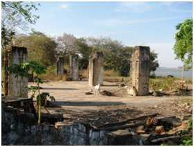

# Resumo

As tentativas de ocupação territorial brasileira no século vinte,
institucionalizadas na Marcha para o Oeste (1938), encontraram bases
para concretização, a partir dos anos quarenta, na Expedição
Roncador-Xingú e na Fundação Brasil Central, criando redes
infraestruturais para colonização e desenvolvimento das regiões centro e
norte do país. Colônias agrícolas e até mesmo cidades novas foram
fundadas nos estados de São Paulo, Paraná, Goiás, Mato Grosso,
Tocantins, Pará etc., configurando um rico período de urbanização, já
revelado por inúmeras pesquisas realizadas. Contudo, nesse panorama de
interiorização e ocupação territorial durante o século passado, o
episódio conhecido por Operação Bananal destaca-se por sua
particularidade e pela ausência de estudos direcionados e originais. Ao
propor um balneário em plena Ilha do Bananal em 1960, o presidente
Juscelino Kubitschek, além de promover a colonização por migrantes e a
integração com povos indígenas locais, reafirmaria seu papel de
empreendedor ao garantir a Brasília sua estância de lazer às margens do
rio Araguaia. Hoje, dessa ação visionária, restam apenas ruínas.

> Palavras-chave: Marcha para o Oeste; Expedição Roncador-Xingú;
> Fundação Brasil Central; Operação Bananal; Brasília.

# Abstract

Attempts to Brazilian territorial occupation in the twentieth century,
institutionalized by the *Marcha para o Oeste* (1938), found support for
implementation, in the forties, at the *Expedição Roncador-Xingú* and
the *Fundação Brasil Central*, creating infrastructural networks for
colonization and development of north-central regions of the country.
Agricultural colonies and even new cities were founded in the states of
São Paulo, Paraná, Goiás, Mato Grosso, Tocantins, Pará etc., configuring
a rich period of urbanization as revealed by many researches. However,
this panorama of internalization and territorial occupation during the
last century, an episode known as *Operação Bananal* stands out for its
particularity and lack of targeted and original studies. In proposing a
resort in the middle of the Bananal Island in 1960, President Juscelino
Kubitschek, in addition to promoting colonization by migrants and
integration with local indigenous peoples, reaffirm its role as
entrepreneur to ensure Brasília their leisure resort on the banks of the
Araguaia River. Today, from this visionary action, there are only ruins.

> Keywords : March to the West ; Roncador-Xingú Expedition ; Brazil
> Central Foundation ; Bananal Operation; Brasilia

# Qual a "praia" do candango?

Quando os primeiros migrantes chegaram no *far west* brasileiro em fins
dos anos cinquenta para habitar a nova capital, a praia mais próxima
distava 960 quilômetros em linha reta, situando-se em Canavieiras (BA).
Por rodovia, o litoral mais perto estava em São Paulo, na velha cidade
de São Vicente. Localidades por demais longínquas ao pensarmos no
usufruto do tempo livre pelos novos brasilienses. No universo da
vilegiatura candanga, em pleno Planalto Central, além do lago Paranoá --
parte da escala bucólica do Plano Piloto --, dos clubes as suas margens
e da abundância de áreas verdes, podemos afirmar que o morador da
recém-criada capital não dispunha de mais alternativas de lazer a céu
aberto, correto? Errado! Pesquisa realizada revela a proposta de
fundação de um núcleo balneário para Brasília, com propósito de atender
a sua população em períodos de férias e veraneio. A "praia" do candango
ficaria a uma distância de 550 quilômetros, na localidade de Santa
Isabel do Morro às margens do rio Araguaia, na divisa entre os estados
de Tocantins, Mato Grosso e Goiás.

Tratava-se de um balneário criado em 1960 e chegou a contar com:
residência oficial do presidente Juscelino Kubitschek (1902-1976), hotel
de nível internacional (Fig. 1), hospital, pista de pouso e projeto
urbano para área residencial. Um balneário localizado às margens do rio
Araguaia com funções voltadas ao lazer fluvial. Um plano com começo,
meio e fim, conhecido por Operação Bananal e cuja narrativa pretende-se
expor ao longo desse trabalho.

> 
>
> Figura 1. Foto de xícara do Hotel JK, na Ilha do Bananal.
>
> Fonte: Acervo pessoal (tirada do Memorial Juscelino Kubitschek, em
> Brasília).

Um processo, que teve início na Marcha para o Oeste de Getúlio Vargas,
ganhou forças com as ações de ocupação territorial investidas pela
Expedição Roncador-Xingú e pela Fundação Brasil Central, materializou-se
com a vocação empreendedora de Juscelino Kubitschek (JK), interrompeu-se
pelo descaso das autoridades públicas durante o Regime Militar, até ser
esquecido, fazendo-se realidade nas ruínas existentes, nos documentos
encontrados no Arquivo Nacional, no Arquivo Público do Distrito Federal
(ArPDF) e no Memorial Juscelino Kubitschek, em Brasília, assim como nas
memórias dos poucos que vivenciaram tal experiência.

Será por esse percurso histórico-narrativo que o trabalho seguirá,
expondo as partes constituintes e as diferentes escalas do território
contidas em tal Operação, resgatando de planos mais amplos de ocupação
territorial à existência, por ora esquecida, de um local a servir
Brasília como sua *Riviera*, sua estância balneária.

# Antecedentes: Marcha, Expedição e Fundação

> (\...) a civilização brasileira, a mercê dos fatores geológicos,
> estendeu-se no sentido da longitude, ocupando o vasto litoral, onde se
> localizavam os centros principais de atividade, riqueza e vida. Mais
> do que uma simples imagem, é uma realidade urgente e necessária galgar
> a montanha, transpor os planaltos
>
> e expandir-nos no sentido das latitudes. Retomando a trilha dos
> pioneiros que plantaram no coração do Continente, em vigorosa e épica
> arremetida, os marcos das fronteiras territoriais, precisamos de novo
> suprimir os obstáculos, encurtar as distâncias, abrir e estender as
> fronteiras econômicas, consolidando, definitivamente, os alicerces da
> Nação. O verdadeiro sentido de brasilidade é a marcha para o Oeste. No
> século XVII, de lá jorrou o caudal de ouro que transbordou na Europa e
> fez da América o Continente das cobiças e tentativas aventurosas. E lá
> teremos de ir buscar: dos vales férteis e vastos, o produto das
> culturas variadas e fartas; das entranhas da terra, o metal com que
> forjar os instrumentos de nossa defesa e do nosso progresso industrial
> (\...). (Getúlio Dornelles Vargas *in* NEIVA, 1942)

As palavras do presidente Getúlio Vargas (1882-1954) apontam para uma
política de ocupação territorial em voga nos anos trinta. A Era Vargas
(1930-1945), como ficou conhecida, caracterizou-se pela centralização do
poder executivo federal, criando-se Ministérios, Instituições e
Departamentos de abrangência nacional (*e.g.*: o Ministério do Trabalho,
Ministério da Educação e Saúde, o Departamento de Imprensa e Propaganda,
o Instituto Brasileiro de Geografia e Estatística, a Fundação Brasil
Central), todos diretamente ligados ao comando do chefe de Estado. Além
da união político- administrativa, o governo federal igualmente almejava
uma união territorial. A ocupação da faixa litorânea, com 90% da
população à época, deveria ceder espaço e avançar rumo às fronteiras
ocidentais.

Propiciada pela franja ferroviária (Fig. 2), pelo deslocamento
direcionado de imigrantes estrangeiros e pela expansão da zona agrícola
-- notória nos estados de São Paulo e Paraná --, a prática de
urbanização do território pela criação de cidades novas já se efetivava
desde o início do século vinte (REGO, 2009; TREVISAN, 2009). Com Vargas,
tal prática se tornou programa de governo visando à firmação do Brasil
enquanto uma nação de dimensões continentais e à proteção de suas
fronteiras ocidentais. Foi com o Estado Novo (1937-1945) que se
instaurou oficialmente a Marcha para o Oeste.

> 
>
> Figura 2. Franja ferrovia no estado de São Paulo rumo ao oeste; a cada
> estação uma nova cidade surgia.
>
> Fonte: TREVISAN, 2009.

Com a II Guerra Mundial (1939-1945), quando a fragilidade das fronteiras
territoriais de países menos desenvolvidos despertavam interesses das
grandes potências, fazia-se

necessário ocupar regiões ermas como o Centro-Oeste e o Norte
brasileiros. Para além do fato isolado de transferência da capital da
costa para o interior, que vinha desde o século dezenove (veja-se a
Missão Cruls de 1892), e dos aspectos de segurança nacional, esse
discurso também se sustentava no aumento demográfico populacional nas
faixas litorâneas e na necessidade de novas zonas de produção de bens
primários e da formação de polos consumidores. Uma ação complexa e de
longo prazo que, portanto, só poderia ser viabilizada por um governo
interessado, centralizador e doutrinário, como o de Vargas.

Para tal programa de interiorização o governo federal lançou duas bases:
a primeira foi a Expedição Roncador-Xingú (ERX), com a atribuição
específica de averiguar os espaços em branco existentes nas cartas
geográficas; e a segunda tratou da criação da Fundação Brasil Central
(FBC), cuja função seria gerir administrativamente a Expedição, criar
infraestrutura e implantar novos núcleos populacionais nos pontos ideais
delimitados por rotas exploradas (Fig. 3).

> 
>
> Figura 3. Mapa com rotas realizadas pela ERX e FBC (linhas
> segmentadas).
>
> Fonte: LIMA FILHO, 2000.

Sob o comando dos irmãos Villas-Bôas (Orlando: 1914-2002; Cláudio:
1916-1998; e Leonardo: 1918-1961), a Expedição Roncador-Xingú foi
concebida pelos ideais de João Alberto Lins de Barros (1897-1955), então
Coordenador de Mobilização Econômica do governo federal. Ao buscar
ampliar os limites do progresso e desenvolvimento no Brasil-Central,
integrando cerrado e floresta amazônica ao restante das regiões mais
economicamente ativas do país (Sul e Sudeste), a expedição tinha
igualmente o propósito de identificar e mapear povos indígenas ainda
desconhecidos. Embora cientes das imensas áreas ermas a serem
desbravadas, recensear seus habitantes e diagnosticar as potencialidades
produtivas de suas terras aguçavam os interesses não apenas dos

bandeirantes modernos,

como também de governantes, militares, industriários,

produtores agrícolas, investidores nacionais e estrangeiros.

> Assim, por Portaria do Coordenador da Mobilização Econômica, de n. 77,
> de 03 de junho de 1943, foi organizada a Expedição Roncador-Xingú
> (\...). A importância da referida Expedição, quanto a objetivos
> estratégicos, levou o Governo Federal a considerá-la de interesse
> militar, através do Decreto-Lei n. 5.801, de 08 de setembro de 1943,
> publicado no D.O.U. de 10 do mesmo mês e ano, à página n. 13.489.
> (\...) De objetivos mais definidos, constituindo-se num órgão de
> direito privado, destinado a preencher os vazios geográficos do Brasil
> Central, rumo à bacia Amazônica, nasceu assim a Fundação Brasil
> Central, com a finalidade precípua de desbravar e colonizar as regiões
> do Brasil Central e Ocidental. (Item 01: Objetivo e Finalidades, do 1o
> Ofício de Registro de Títulos e Documentos da Fundação Brasil Central,
> 1945; fonte: Acervo FBC/ARQUIVO NACIONAL)

O plano a ser seguido partia de uma base de apoio instalada na cidade
mineira de Uberlândia, onde se localizava o ponto final da Estrada de
Ferro Mogiana, vinda de

Campinas (SP). Dali,

uma rota terrestre deveria ser construída, permitindo

acessibilidade a caminhões, equipamentos automotores de grande porte e
veículos de tração animal, sendo servida por estrutura de rádio e
comunicação, campos de pouso e

edificações que abrigassem as equipes de manutenção. Visionava-se

> que a partir do

Triângulo Mineiro, seguindo a parte direita do rio Tapajós, seria
possível alcançar Manaus por meio de rotas terrestres e fluviais, além
da aérea, ligando assim sul e norte do país, bem como criando um canal
de comunicação entre Brasil (Rio de Janeiro e São Paulo) e os Estados
Unidos da América -- seu aliado na guerra ("Acordo de Washington", de
1942).

No conjunto dos trabalhos previstos, encontram-se planos para:
transportes (rodoviário,

fluvial e ferroviário); uso

> de recursos naturais; colonização e produção agrícolas

(colônias); sistema hierarquizado de postos de saúde e de centros
educacionais; rede de indústrias básicas; produção de grandes
infraestruturas (pontes, hidroelétricas, estações de tratamento d'água);
construção de aeroportos; implantação de torres de comunicação de rádio
e de transmissão de energia (Figs. 4 e 5).

> 
>
> Figuras 4 e 5. Mapas de Rede de Comunicações (esquerda) e de
> Desenvolvimento Industrial (direita).
>
> Fonte: Acervo FBC/ARQUIVO NACIONAL.

Em meados de 1943, muitos membros da Expedição encontravam-se
estabelecidos em

Uberlândia. Uma estrada

> já ligava esta área com a região do alto
>
> Araguaia, mais

especificamente, no entroncamento com o rio das Garças (GO). A partir
desta localidade, o território seria desbravado, levantado e documentado
até as divisas com Mato Grosso. Com boas condições de salubridade, a
Barra Goiana (núcleo urbano intencionalmente fundado) passou a servir de
base, fazendo divisa na outra margem do rio Araguaia com a Barra
Cuiabana -- atual Barra do Garças (MT). A partir de agosto do mesmo ano,
João Alberto Lins e Barros deu o nome de Aragarças à nova localidade,
onde foi erguida uma cruz em madeira, monumento que seria o \"marco
zero\" da rota em direção à Manaus.

Na cidade nova de Aragarças instalou-se a sede da Fundação Brasil
Central, estando essa subordinada à Presidência da República por mais de
vinte anos (1943-1967). Como já mencionado, a FBC tinha por objetivo
central o desbravamento e colonização das imensas áreas do
Brasil-Central (que incluem parte dos estados de Goiás, Mato Grosso,
Pará e Amazonas) -- notadamente as margens dos rios Araguaia e Xingú.

O fluxograma gestacional da FBC era composto por: um Presidente, um
Secretário Geral, um Conselho Diretor e uma Junta de Controle, que
acionavam os serviços centrais de engenharia, comunicações, saúde,
educação, mão de obra, material, transportes, rádio-comunicações,
contabilidade, tesouraria e patrimônio. Com bases operacionais
estrategicamente localizadas em três pontos: Aragarças, Xavantina e na
Ilha do Bananal -- chamados de "Centros de Atividades" --, a FBC também
dispunha de polos apoiadores ou os "Postos e Colônias Agrícolas", como:
Ceres1, Garapu e Vale dos Sonhos. Desse modo, a FBC buscava oferecer
condições não só aos habitantes da região como a todos aqueles
interessados em ali se estabelecer, facultando melhor aproveitamento dos
recursos naturais e solucionando problemas de toda ordem. Assim,
colonização planejada, migração dirigida, experiências-modelo em
modernização agrícola serviram de base para atuação da FBC sobre esse
território brasileiro.

De início, o patrimônio laboral da FBC foi o acervo oriundo da ERX,
reforçado por recursos federais e doações.

> As atividades industriais e comerciais desenvolvidas não produziam
> resultados financeiros apreciáveis, uma vez que eram realizadas
> basicamente para suprir necessidades internas. Suas áreas de atuação
> eram todas de baixo índice demográfico, de precário acesso por via
> terrestre cujos habitantes eram vinculados a uma economia muito
> rudimentar, consumindo o pouco que produziam, quer seja na
> agricultura, na pecuária, na pesca ou na caça. (FREITAS, 1968)

A FBC possuía natureza dupla em sua área jurídica, parte de seus
estatutos eram de domínio público, e outra parte, de domínio privado.
Entretanto, o maior impulso financeiro à Fundação foi derivado de
investimentos empresariais. Por exemplo, a "Usina Central Sul-Goiana"
(1953) e a "Usina Fronteira" (1954) foram, respectivamente, instaladas
nos municípios de Rio Verde (GO) e Frutal (Triângulo Mineiro), na
tentativa de deslocar o eixo industrial (produção de álcool) para novas
localidades (região Centro-Oeste). Além destas, outras duas empresas
exerceram extrema importância na região: a "Entrepostos Comerciais
Brasil Central" e a "Companhia de Navegação Amazonas", cujas atividades
focavam o âmbito comercial de produtos diversos, levando armazéns,
farmácias e outros produtos industrializados do Sudeste para os povoados
que surgiam, além dos serviços de transporte que a

> 1 A "Colônia Agrícola Nacional de Goiás" (Ceres) foi fundada em 1941,
> tendo seu núcleo urbano um projeto assinado pelo engenheiro agrônomo
> Bernardo Sayão Carvalho de Araújo (1901-1959). Ceres seria a colônia
> agrícola melhor estruturada, servindo de modelo para as demais que
> estavam por vir (MARQUES, 2009).

Companhia fornecia pelo rio Amazonas e seus afluentes da margem direita,
entre Manaus e Belém. Embora os benefícios levados para Goiás, Tocantins
e Mato Grosso tenham sido essenciais para o desenvolvimento da região,
nenhuma dessas empresas prosperou sob a administração da FCB por muito
tempo, passando ao comando da iniciativa privada.

Em 1945 terminou o regime do Estado Novo, saindo Vargas e ascendendo
Eurico Gaspar Dutra (1883-1974). Mesmo com essa alteração, João Alberto
Lins de Barros permaneceu na presidência da FBC até 1947, já que Dutra
encontrava-se satisfeito com os avanços que estavam ocorrendo no
interior de seu estado natal, Mato Grosso. Entretanto, em janeiro de
1948 o general Francisco Borges de Oliveira passou a comandar a Fundação
e a encontrou num estado de crise econômica e administrativa. Em 1951,
ainda abalada pela crise e com retorno de Vargas à Presidência da
República, a FBC passou a ser comandada pelo mato-grossense Archimedes
Pereira Lima, cujo desejo pessoal era transferir a capital da república
do Rio de Janeiro para a cidade nova de Aragarças (MACIEL, 2006).

A nova capital não foi para Aragarças, mas para o sítio Castanho no
Quadrilátero Cruls em abril de 1960. E com as atenções voltadas para
Brasília, as bases da FBC em Aragarças e Xavantina foram desativadas no
fim da década de 1950. Sem a relação direta e estreita com o governo
federal, a FBC entrou em declínio, sendo extinta em 1967, durante o
Regime Militar (1964-1985). Contudo, nessa fase da FBC e da ocupação da
hinterlândia brasileira, um caso em especial chama a atenção e desperta
nosso interesse. Conhecida por Operação Bananal, essa ação tinha, dentre
seus planos de colonização e desenvolvimento econômico para a região, a
criação de um balneário para Brasília às margens do rio Araguaia, na
Ilha do Bananal, como se revela a seguir.

# Operação Bananal e um balneário para Brasília

A denominada Operação Bananal remonta aos tempos da Marcha para o Oeste
durante o Estado Novo de Getúlio Vargas. A princípio, tal Operação pode
ser qualificada como uma ação direcionada de ocupação daquela que é
considerada a maior ilha fluvial do mundo, localizada nas divisas dos
estados de Mato Grosso, Tocantins e Goiás. No governo de Juscelino
(1956-1961), a Operação ganha visibilidade pela iniciativa de criar ali
um balneário para Brasília. Ao adentrarmos na história deste feito,
pode-se verificar que a ideia da ocupação não surgiu da noite para o dia
ou pela virtude empreendedora e reconhecida de JK.

A história da Ilha do Bananal (Figs. 6 e 7) começou muito antes de JK ou
da Marcha de Vargas. Os primeiros registros históricos da presença de
não indígenas na Ilha datam da virada do século dezessete, quando da
expedição de caça aos índios comandada pelo bandeirante paulista Antonio
Pires de Campos, rumo às minas de Cuiabá. O rio das Mortes era a via de
acesso à região da Ilha, ocupada pelos povos Karajás, Javaés, Xambioá,
Xavante, Kayapó, Xerente e Bororos. Todos os esforços dos homens brancos
eram no sentido de explorar a riqueza da região, muitas vezes
escravizando os povos indígenas. Para facilitar o domínio, os
colonizadores brancos criavam aldeamentos para reunir os indígenas e
distribuir as terras restantes entre os fazendeiros e os criadores de
gado.

Por volta de 1850, a navegação no rio Araguaia passou a ser prioridade
para a ocupação do sertão goiano. Dessa época datam os primeiros
Presídios -- postos militares colocados em lugares estratégicos e que
serviam também para aprisionar os índios que causassem problemas às
navegações. No início do século vinte, com o aumento dos

interesses comerciais na região, a presença indígena passou a ser
considerada um fator de entrave ao desenvolvimento da economia.
Procurando dar assistência às demandas de tal população, o então
presidente da República, Nilo Procópio Peçanha (1867-1924), criou em
1910 o Serviço de Proteção ao Índio (SPI) -- órgão público extinto e

substituído pela FUNAI e

1967\.

> 
>
> Figuras 6 e 7. Mapas com localização
> da Ilha do Bananal.
>
> Fonte: Acervo FBC/ARQUIVO NACIONAL.

Apenas no Estado Novo (1938) que se iniciam os primeiros interesses
concretos do governo federal por Bananal, e por consequência as
primeiras ocupações formais. O SPI

instalou os seguintes Post

> s Indígenas junto à Ilha: Getúlio Vargas (atual aldeia Santa

Isabel do Morro), Heloísa Torres e Damiana da Cunha (aldeias extintas).
Nesse mesmo período, as terras da Ilha do Bananal começaram a ser
procuradas por criadores de gado bovino da região, devido à alta
qualidade das pastagens naturais ali presentes. O SPI passou a arrendar
essas terras para a entrada de rebanhos bovinos, com cobrança de

taxas por cabeça de gad

e cercamentos. Tal política facilitou o

> assentamento de

famílias envolvidas com a lida do gado.

Em agosto de 1940, o presidente Getúlio Vargas visitou a aldeia dos
índios Karajás na

Ilha do Bananal. Foi o primeiro presidente a visitar a área, como

> parte do projeto

multifacetado de construção de um Brasil novo -- independente, integrado
e unificado.

O governo queria ainda usar a região como base militar para a Força
Aérea Brasileira (FAB). Ainda em 1942, o governo de Vargas já ensaiava
as primeiras construções com alojamentos e pista de pouso, além de uma
base militar. No ano seguinte, em uma longa carta do Major Orgêo
Nogueira Valente destinada ao Presidente, é feita uma "sugestão de
desbravar, sanear e colonizar um dos mais distantes e opulentos rincões
do nosso Brasil: a Ilha do Bananal", e são descritas as diversas
vantagens que a construção de um assentamento urbano na região poderiam
trazer ao país.

> A nova cidade será o centro em torno do qual gravitarão outras
> povoações existentes e por existir e que receberão o influxo do
> progresso decorrente de um aperfeiçoamento sempre crescente. \[\...\]
> Em um território onde tudo ainda está por fazer, é mais fácil
> iniciar-se, dentro das normas técnicas e científicas modernas, de
> acordo com um plano previamente elaborado, do que em outro local onde
> os problemas já adquiriram complexidade de toda a ordem e que
>
> dificultam a ação dos administradores. (VALENTE, 1943, *in* Acervo
> FBC/ARQUIVO NACIONAL)

Porém, nada foi feito até início dos anos sessenta, quando o Presidente
da República, Juscelino Kubitschek, direciona suas atenções ao
aproveitamento do Vale do Araguaia. Denominada de "Operação Bananal",
essa ação tinha "finalidade de aproveitá-la \[Ilha do Bananal\] para a
criação de um centro de lazer para as pessoas passarem os seus fins de
semana" (FREITAS, 1968).

Os holofotes começaram a se voltar fortemente para Bananal quando, ainda
Governador do Estado de Minas Gerais (1951-1955), já visionava fundar
uma nova capital para o país. JK em viagem pré-campanha eleitoral à
Presidência, chegou a visitar a Ilha já intencionando o estreitamento de
relações com os índios Karajás, habitantes locais, como relata Affonso
Heliodoro dos Santos, subchefe da Casa Civil:

> No fim de 1954, ficamos em Goiás quase uma semana. Assuntando, falando
> de interiorização, integração nacional, capital no Planalto.
> Circulamos pelo interior, fomos até à Ilha do Bananal visitar os
> índios. (SANTOS *in* Acervo FBC/ARQUIVO NACIONAL)

Alguns anos depois, em 1957, na realização da primeira missa no local
onde se ergueria a nova capital do país, Juscelino fez questão de
convidar e transportar em aviões da FAB uma delegação de índios Karajás
vindos diretamente de Bananal.

Inaugurada a nova capital em abril de 1960 e completada a estrada
Belém-Brasília, JK decidiu finalmente lançar sua nova empreitada. O
anúncio do início da jornada rumo à Ilha do Bananal causou alvoroço. Os
que apoiavam Juscelino tentaram o convencer de que se tratava de uma
insanidade, e a imprensa julgou o projeto irrealizável. Era maio de 1960
e, portanto, a nove meses do término se seu mandato (31 de janeiro de
1961).

Em um discurso épico, diretamente da Ilha, ao inaugurar a estação de
rádio da FAB, em 26 de junho de 1960, JK anunciava o início dos
trabalhos:

> A construção de Brasília, o esforço épico, façanha que surpreendeu o
> mundo, deu a medida de nossa enérgica decisão de conquistar os milhões
> de quilômetros quadrados sobre os quais os mapas traziam aquela
> clássica legenda \"Região Inexplorada\". \[\...\] Uma época de
> grandeza e poderio se inicia efetivamente em nossa pátria, em que pese
> às lamúrias dos retrógrados e derrotistas. (KUBITSCHEK, 2013)

A ideia da arrancada rumo a Bananal foi pensada na primeira semana de
maio de 1960, e já no dia 12 do mesmo mês foi anunciada à imprensa.
Segundo JK, de fato, o que se pretendia em relação à Ilha era prover um
posto avançado de civilização em plena bacia do Araguaia, capaz de
auxiliar o Brasil a contemplar a obra de integração territorial,
iniciada décadas atrás e potencializada com a construção de Brasília.

> Meu ponto de vista em relação à Ilha do Bananal era simples e
> objetivo. Tratava-se de um impulso a mais, na direção da fronteira
> ocidental. Para que esse alvo fosse atingido, seria necessário
> transformar a ilha em parque nacional. O parque seria a meta da marcha
> que eu iria iniciar, no sentido de estabelecer na região, até então
> deserta, núcleos agrícolas pioneiros para o pleno desenvolvimento das
> atividades agropecuárias. Como a ilha era um paraíso de caça e pesca,
> decidi construir no seu ponto mais favorável um hotel de turismo, e,
> levando em conta as primitivas condições de vida na região, resolvi,
> simultaneamente, incorporar os índios que ali habitavam à civilização
> brasileira, criando, para eles, serviços locais de assistência
> imediata. (KUBITSCHEK, 2000)

Em ritmo de Brasília o projeto Bananal foi iniciado com verbas da
Superintendência do Plano de Valorização Econômica da Amazônia (SPVEA;
1953-1966) e consistia em

erigir na Ilha um centro turístico e promocional do Brasil-Central e do
rio Araguaia, composto de pista asfaltada para os aviões da época, um
hotel que receberia o nome de JK, um pequeno hospital, uma escola e
ainda uma residência oficial.

Ficaria próximo a São Félix do Araguaia, uma cidadezinha pioneira de
Mato Grosso, localizada a pequena distância da embocadura do rio das
Mortes e lugarejo com apenas 500 habitantes onde se encontrava um posto
da FBC, grande responsável pela ocupação da Ilha. Como relata Juscelino
Kubitschek na obra *Por que construí Brasília* (2000), acertadas as
primeiras providências, já no dia 16 de maio, o Coronel Nélio Cerqueira,
então diretor da FBC, acompanhado de um grupo de auxiliares, seguiu de
avião para o Posto Getúlio Vargas, órgão do Serviço de Proteção aos
índios, localizado na margem oeste da ilha. Esse grupo permaneceu dois
dias no local, sempre em contato com os índios Karajás, a fim de não só
fazer um levantamento dos recursos locais, mas examinar igualmente os
diferentes problemas para que fossem iniciadas as obras programadas.
Faziam parte desse grupo, além do Coronel Cerqueira, o secretário
pessoal de JK, doutor Geraldo Carneiro, o engenheiro Jucá Chaves e o
sertanista Acary de Passos Oliveira.

Segundo JK, um dos pontos de discussão com o Coronel Nélio Cerqueira foi
acerca da construção do aeroporto, com pista para a aterrissagem de
aviões de grande porte, que constava do projeto de desenvolvimento da
Ilha do Bananal. Havia a dificuldade em fazer chegar até o local os
1.200 tambores de asfalto necessários à pavimentação da pista. O
Brigadeiro Corrêa de Melo, Ministro da Aeronáutica à época, interviu:
\"Isto não é problema, presidente. Os 1.200 tambores de asfalto poderão
ser atirados de aviões, em pára-quedas\" (KUBITSCHEK, 2000). A sugestão
foi aceita, e o brigadeiro ficou incumbido, na mesma hora, de tomar
aquela providência. A pista, de 1.550 por 45 metros, logo foi concluída
e aviões começaram a descer na logística de completar e transportar as
outras estruturas que comporiam o conjunto.

Efetivava-se a Operação Bananal\... Operários foram mobilizados. Fez-se
a remessa do material necessário. Oscar Niemeyer elaborou os projetos.
Deu-se início às obras. O paulista Wolfgang Dankmar Gunther chegou à
região em 1948, junto com a Bandeira Piratininga, e foi um dos
encarregados pelas atividades da Ilha, sendo funcionário da FBC. Em
entrevista à revista RDM, relatou as vivências que teve por lá:

> Fiquei como encarregado da recepção dos materiais de construção que
> vinham em caminhões de Brasília e Goiânia. Tudo era carregado em balsa
> para atravessar o Araguaia. Depois de muito tempo construímos o hotel,
> junto foram construídos um posto da FAB e uma pista de pouso, tudo no
> tempo do Juscelino. (TRINDADE; MATOS, 2013)

Ao engenheiro Jucá Chaves, um dos pioneiros da construção de Brasília,
coube à tarefa da escolha do local para a construção da residência
presidencial, cujo projeto foi assinado pelo arquiteto Oscar Niemeyer.
Em reportagem da revista *O Cruzeiro*, identifica-se a ligação entre
Oscar e Bananal: **"**Pois nessa região pura vai entrar o traço de
'ballet' de Oscar Niemeyer". Tratava-se do Rancho Pioneiro ou
"Alvoradinha" (LEMOS, 1960) -- concebido aos moldes do Catetinho de
Brasília (Figs. 8, 9 e 10) --, que ficaria situado a uma curta distância
do aldeamento indígena de Santa Isabel do Morro. Um mês e uma semana
após o anúncio do início das construções, ou seja, no dia 27 de junho,
Juscelino visitou a Ilha do Bananal a fim de inspecionar as obras que
ali se realizavam e inaugurar sua residência de veraneio.

> 
>
> Figura 8. "Alvoradinha": projeto de Oscar Niemeyer para a residência
> presidencial na Ilha do Bananal.
>
> Fonte: ALVES; LINS, 2013/ArPDF.
>
> 
>
> Figuras 9 e 10. Imagens do "Alvoradinha", às margens do rio Araguaia.
>
> Fonte: Acervo FBC/ARQUIVO NACIONAL.

Tratava-se de uma casa pitoresca e muito confortável, na qual fora
fixada uma placa, com os seguintes dizeres:

> Aqui -- onde eram, sós, o abandono e a selva -- sendo os vinte e sete
> dias do

mês

> de julho de 1960, começou a integração desta ilha do Bananal na
>
> comunidade pátria pela vontade do Presidente Juscelino Kubitschek,
> ajudado de Deus e de alguns homens, por amor ao Brasil. (Acervo
> FBC/Arquivo Nacional)

Meses depois Juscelino inaugurou o hotel que levava seu nome, o Hotel
JK**.** De classe internacional, seria a maior atração da Ilha do
Bananal. Um volume único sobre pilotis -- pois a área estava sujeita a
cheias do rio --, possuía construção em alvenaria e janelas debruçadas
para o Araguaia. De acordo com depoimentos, o Hotel JK era composto por
térreo e pavimento superior, onde ficariam os 18 apartamentos com
banheiras, ar condicionado e escritório privativo (Figs. 11, 12, 13 e
14). "Todos os talheres eram de prata, as taças de cristal. Tudo com o
emblema JK-Ilha do Bananal", relembra Dankmar

(GUNTHER, 2007). Na região ainda ecoam histórias dos primeiros

> anos do hotel.

Jantares gloriosos, recepções, pescarias e caçadas feitas pela elite
política do país e pelos chefes de Estado que visitavam o Brasil, dentre
eles os líderes da Rússia, da Itália, e de países vizinhos da América do
Sul. Antes de fechar suas portas, o hotel chegou a funcionar como local
de convenções e reuniões de dirigentes turísticos ou administrativos
vindos de Brasília.

> 
>
> 
>
> Figuras 11 a 14. Acima: Hotel JK e
> bar. Abaixo: corredor para quartos e quarto convencional.
>
> Fonte: Acervo FBC/ARQUIVO NACIONAL.

Em 31 de janeiro de 1961 o mandato de
Juscelino foi encerrado. Mesmo assim, outras construções para a Ilha,
prometidas em seu governo, foram efetivadas pelo comando da FBC (Fig.
15). O hospital Getúlio Vargas foi o próximo a ser finalizado, com
ambulatório, 12 leitos, equipamentos e medicamentos, prestando serviços
com médicos e funcionários do SPI. Além dele, a Escola Primária de Santa
Isabel também foi construída, iniciando suas obras em setembro de 1961,
sendo composta por jardim de infância e pré-primário para um total de
250 alunos. A aula inaugural, ocorrida em outubro de 1962, teve apenas
72 alunos.

> Figura 15. Vista aérea do conjunto

1.  Hotel

2.  Anexo (corpo auxiliar e lavanderia)

3.  Grupos de geradores

4.  Aeroporto/FAB (Santa Isabel do Morro)

5.  Futura Vila (Hospital e Escola)

6.  Aldeia indígena (Karajás)

7.  Rio Araguaia

> Fonte: Acervo FBC/ARQUIVO NACIONAL.

Contudo, outras edificações prometidas ficaram apenas no papel, dentre
as quais o clube, o mercado, os almoxarifados, a igreja, a colônia de
pesca, o bosque etc., todos projetos desenvolvidos pelo Departamento de
Engenharia da FBC, como se verifica em um relatório redigido em 1966 por
seu chefe José Rodrigues de Faria (Acervo FBC/ARQUIVO NACIONAL). Junto a
esse, identificou-se o projeto urbanístico de uma Superquadra (Fig. 16)
-- provavelmente para moradores locais -- cuja autoria não

foi possível identificar. Trata-se de uma Unidade de Vizinhança,
centralizada por escola, parques e área de esportes, envoltas por
jardins, bosques e vias hierarquizadas. Tais alamedas conectariam os
equipamentos aos quatro renques de lotes residenciais ou a outras
possíveis superquadras. Uma unidade urbanística de 200 por 200 metros
que poderia ser replicada conforme a demanda de ocupação do novo
assentamento previsto.

> 
>
> Figura 16. Projeto de Superquadra para Ilha do Bananal, com 200 por
> 200 metros de largura, com lotes unifamiliares de 15,00 por 30,00
> metros e escola,parque e jogos ao centro.
>
> Fonte: Acervo FBC/ARQUIVO NACIONAL

No entanto, passado o tempo e sem gerência e vontade política, nada
disso saiu do papel. Com a posse de Jânio da Silva Quadros (1917-1992)
em 1961, a Operação Bananal foi retirada de pauta. Os planos
complementares de JK de construir uma rodovia que, vinda de Brasília,
atravessasse o brejo Jabaés e mantivesse o centro turístico de Santa
Isabel pulsante foi arquivado. Com a falta de uso e a devida manutenção,
a deterioração apoderou-se dos edifícios.

O hospital continuou trabalhando, atendendo aos Karajás. Contudo, o
Hotel JK, precariamente ocupado por funcionários da SPI/FUNAI, logo teve
sua pintura danificada pelo tempo, as janelas emperradas, os pilares
corroídos, as roupas penduradas em toda parte, o pátio acumulado de
detritos, as máquinas quebradas, os tratores e automóveis arriados na
garagem. Segundo relatos do ex-funcionário da Ilha, Wolfgang Gunther, a
história da deterioração de Bananal teve forte cunho político:

> Parece que o Hotel JK nunca existiu. Na verdade, essa foi a intenção
> do Governo Militar após o golpe de 1964. Apagou a história das obras
> de Juscelino, entre elas o formoso hotel, que teve o Rio Araguaia como
> fiel guardião dessa saga. Primeiro foi feita a troca do nome. O hotel
> JK passou de Juscelino Kubitschek para John Kennedy, mas a
> americanização não deu certo e poucos anos depois ele foi fechado e
> demolido. Tijolo por tijolo foi
>
> arrancado e transferido para local incerto. Sobraram apenas ruínas.
> (GUNTHER, 2007)

O conjunto sonhado por Juscelino estava desfeito e em decadência. Em
novembro de 1967, a Fundação Brasil Central se extingue, sendo
substituída pela Superintendência de Desenvolvimento da Região
Centro-Oeste (SUDECO). Das obras construídas pela FBC, algumas foram
doadas, como o "Alvoradinha", que foi entregue ao Governo de Rondônia,
que por sua vez também o abandonou. O pouco que ainda restava foi
destruído em um incêndio, em 1990, restando escombros e ruínas (Figs. 17
e 18).

> 
>
> Figuras 17 e 18. Fotos recentes de ruínas do Hotel JK, na Ilha do
> Bananal.
>
> Fonte: Acervo FBC/ARQUIVO NACIONAL

# Não existe "praia" no Planalto Central

Com as ruínas, foi-se embora o sonho de ofertar a Brasília e a seus
habitantes uma estância balneária. A "praia" do candango não seria e,
talvez, nunca tenha sido a Ilha do Bananal. Portanto, e contrariando a
resposta à questão colocada no início desse artigo, os espaços de lazer
da capital federal são aqueles já citados ou outros situados em suas
cercanias. A real praia dos brasilienses é aquela no Nordeste, no Norte,
no Sul ou no Sudeste do país, mas não no Planalto Central.

Mas essa questão -- ou subterfúgio -- foi aqui colocada apenas como
detalhe de algo mais auspicioso na história da ocupação territorial
brasileira. Pela Operação Bananal -- seus antecedentes e suas
realizações -- é possível identificar as tentativas e os meios de
ocupação e interiorização do país no século vinte, os interesses
envolvidos, os percalços presentes em ações com escalas e tempos
distintos.

Da Marcha para o Oeste ao programa de integração e desenvolvimento
nacional instaurado pelo Regime Militar nos anos setenta, pode-se
observar ao longo do século passado um país que tomou posse de seu
território continental. Independente da postura ideológica e dos meios
nada democráticos adotados por alguns de seus governantes --
infelizmente sendo justificados pelos fins -- para colocar suas
empreitadas em prática, pôde-se verificar a ocupação de terras
ocidentais, fosse pela urbanização (criação de cidades, colônias etc.)
fosse pela abertura e consolidação de novas fronteiras agrícolas. De
fato, observa-se o deslocamento rumo ao interior, rompendo vazios,
conhecendo e dominando povos nativos, colonizando terras, transferindo
capitais (Goiânia, Brasília e Palmas), resultados não encontrados nos
séculos anteriores. Destaca-se não somente em termos numéricos, dada à
criação de municípios e resultante urbanização, mas também pela
diversidade de estratégias e métodos aplicados, pelos profissionais
envolvidos, pelas infraestruturas implementadas e, acima de tudo, pelas
profundas consequências que teve para a organização territorial e
demográfica do país.

Resultados obtidos graças aos interesses de políticos -- Vargas,
Kubitschek etc. -- que enxergaram na "Região Inexplorada" a bandeira
para seus programas de governo. Bandeiras que, por vezes, camuflavam as
verdadeiras razões: impulsionar indústrias das regiões mais
desenvolvidas mediante a criação de novo mercado consumidor e a
ampliação de fornecedores de matéria-prima; descongestionar os grandes
centros urbanos via migração conduzida; afirmar posicionamento aos
aliados da Guerra ao facilitar acesso e comunicação com os mesmos;
inserir o país no mercado internacional ao situar sua posição de
produtor de bens primário e mero consumidor etc. Em relatos épicos e
otimistas, pouco se revelava das despesas, das dificuldades, das perdas
e dos impactos causados.

Nesse sentido, a Operação Bananal, embora possua em sua essência a marca
de interiorização e ocupação territorial, também revela a vontade
desmedida de JK. Vontade que contrariou o tempo e as condicionantes
envolvidas a fim de concretizar mais um sonho pessoal. Reconhecido pelo
perfil empreendedor, a perspectiva em criar um balneário na Ilha do
Bananal era, para ele, exequível e natural. Porém, uma vez distante do
poder, seu sonho esvaiu-se, não se concretizando tal qual ocorreu com
Pampulha e Brasília.

Objeto de desejo desde o século dezessete, a Ilha e toda a sua
exuberância e riqueza natural -- suas onças-pintadas, botos, uirapurus,
garças-azuis, tartarugas, sua flora e seus rios: Araguaia e Javaés --
ficaram de posse não dos feitos de JK, mas dos índios em seu Parque
Indígena do Araguaia, como definido pelo Decreto Presidencial nº 68.873,
de 05 de julho de 1971.

# Referências Bibliográficas

> ALVES, R.; LINS, T. As preciosidades do mestre Niemeyer. *Jornal
> Correio Braziliense*, Caderno Cidades, p.19, 06 dez. 2013.
>
> BARUZZI, R. G.; PAGLIARO, H. *Os Índios Karajá das Aldeias de Santa
> Isabel do Morro e Fontoura, Ilha do Bananal:* dados populacionais dos
> anos 1969 e 2002. Disponível em:
>
> \<<http://www.abep.nepo.unicamp.br/docs/anais/pdf/2002/Com_IND_ST6_Baruzzi_texto>\>.
> Acesso em: 21 jan. 2014. BORGES, D. R. *Rio Araguaia corpo e alma.*
> São Paulo: IBRASA, 1986.
>
> COUTO, R. C. *Juscelino Kubitschek.* Brasília: Cedi/Edições Câmara,
> 2011.
>
> EQUIPE ROTA BRASIL OESTE. *A marcha para o Oeste:* a maior aventura do
> século 20. Disponível em:
>
> \<<http://www.brasiloeste.com.br/2004/11/a-marcha-para-o-oeste>\>.
> Acesso em 04 maio 2013. FREITAS, F. A. de. *Fundação Brasil Central.*
> São Paulo: SUDECO, 1968.
>
> GARFIELD, S. As raízes de uma planta que hoje é o Brasil: os índios e
> o Estado-Nação na era Vargas. *Revista Brasileira de História*, v. 20,
> n.39, 2000.
>
> GUNTHER, W. D. *Uma história de vida* (2007). Disponível em:
> \<[http://oeloperdido-](http://oeloperdido-/)
> gunther.blogspot.com.br/2009/08/uma-historia-de-vida-assim-aconteceu.html\>.
> Acesso em 10 jan. 2014.
>
> INSTITUTO BRASILEIRO DE GEOGRAFIA E ESTATÍSTICA (IBGE). *Enciclopédia
> dos municípios brasileiros*. Rio de Janeiro: IBGE, 1951.
>
> MACIEL, D. P. Fundação Brasil Central: sua atribulada trajetória e o
> desenvolvimento do Centro-Oeste brasileiro.
>
> *Revista Plurais*, v.1, n. 2, p. 145-162, 2005.
>
> KUBITSCHEK, J. *50 anos em 5: Meu caminho para Brasília.* Brasília:
> Bloch, 1978.
>
> . *Por que construí Brasília.* Brasília: Senado Federal (Coleção
> Brasil 500 anos), 2000.
>
> . *Discurso em 26 de junho ao inaugurar a estação de Radio da Força
> Aérea*. Disponível em:
>
> \<<http://www.biblioteca.presidencia.gov.br/ex-presidentes/jk/discursos-1/1960/35.pdf/download>\>.
> Acesso em 14 fev. 2013.
>
> LEMOS, U. de. De Cabral a JK: Bananal volta ao Brasil. *Revista O
> Cruzeiro*, ano 32, junho 1960.
>
> LIMA FILHO, M. F. Aragarças: a cidade encantada no sertão de Goiás.
> *Revista Horizontes Antropológicos*, v. 6, n. 13, jun. 2000.
>
> MARQUES, J S. *Bernardo Sayão -- o último pioneiro*. Disponível em: \<
> <http://www.ueg.br/materia/bernardo-sayao->
> o-ultimo-pioneiro/1697**\>**. Acesso em 17 abr. 2009.
>
> MMA/IBAMA (org.) *Plano de Manejo do Parque Nacional do Araguaia -
> TO.* Brasília: MMA/IBAMA, 2001.
>
> NEIVA, A.H. Getúlio Vargas e o problema da imigração e da colonização.
> *Revista de Imigração e Colonização*, Rio de Janeiro, n.1, ano 3,
> abril 1942.
>
> NORONHA, I. *Brasília: panorama jurídico-histórico. Revista de
> Informação Legislativa*, ano 47, n. 188, out./dez. 2010.
>
> REGO, R. L. *As cidades plantadas:* os britânicos e a construção da
> paisagem do norte do Paraná. Londrina: Humanidades, 2009.
>
> TREVISAN, R. *Cidades Novas.* Tese de Doutorado. Brasília: FAU-UnB,
> 2009.
>
> TRINDADE, L.; MATOS, R. Era uma vez\... São Félix do Araguaia.
> *Revista RDM*, n.234, ano 15, jan/fev. 2013.
>
> VILLAS-BÔAS, O.; VILLAS-BÔAS, C. *A marcha para o Oeste:* a epopéia da
> Expedição Roncador-Xingú*.* São Paulo: Companhia das Letras, 2012.
>
> SILVA, S. Q. da. A Era Vargas e a economia. *In*: D'ARAUJO, Maria
> Celina. (org.) *As instituições brasileiras da era Vargas*. Rio de
> Janeiro: EdFGV/EdUERJ, p. 137-153, 1999.

# Documentos consultados

> Caixas-arquivo, de número 1 a 153, do Acervo Fundação Brasil Central,
> localizadas no Arquivo Nacional de Brasília, no SIG, Quadra 06, lote
> 800.
>
> Documentos e mapas da Coordenação do Distrito Federal: Pastas das
> sessões Fundação Brasil Central, FBC e SUDECO, localizados no Arquivo
> Nacional de Brasília, no SIG, Quadra 06, lote 800 .
>
> Relatório Preliminar de Desenvolvimento Integrado dos Municípios de
> Aragarças, GO e Barra das Garças, MT, maio de 1970, Ministério do
> Interior, Biblioteca Central da Universidade de Brasília.
>
> Divisão Territorial do Brasil e Limites Territoriais, 1º de julho de
> 2008. Instituto Brasileiro de Geografia e Estatística. Acervo do
> Memorial Juscelino Kubitschek, Eixo Monumental, Brasília.
